# Design a Real-Time Collaborative Canvas (Figma/Miro-style) — FAANG Interview Guide

> Source chapter type: real-time collaborative editing, sibling to
> [the Google Docs guide](./38-Design-a-Collaborative-Document-Editing-Service-Google-Docs-FAANG-Guide.md)
> but for a **canvas of shapes**, not a **stream of text**. Text is a single linear sequence where
> two concurrent edits can interleave character-by-character, which is why Docs needs a real
> OT/CRDT algorithm over a sequence. A canvas is a **set of independent objects**, each with its
> own properties (position, size, color, z-order) — conflicts are almost always at the
> single-property level, not the character-interleaving level, and that difference changes the
> entire design.

## Mental model

Multiple users see the same infinite canvas and can simultaneously drag shapes, resize them,
change colors, and draw new ones — with every other viewer's cursor and changes appearing live,
sub-second. The three hard problems, in order of how often candidates miss them:

1. **The conflict model is per-object-property, not per-character.** Two people moving the
   *same* rectangle at the *same* moment is rare and low-stakes (last-writer-wins on the position
   property is an acceptable outcome) — this is fundamentally simpler than two people typing at
   the same cursor position in a document, and treating it with the same heavyweight machinery as
   text OT/CRDT is over-engineering.
2. **Fan-out has to be viewport-aware at scale.** A design file with 10,000 objects and 50
   concurrent editors doesn't need every client receiving every object's every update — only
   objects in a client's current viewport matter to that client, and broadcasting everything to
   everyone wastes bandwidth and client-side render work that scales with document size instead
   of with what's actually visible.
3. **Undo/redo in a multi-user context is genuinely tricky.** A user's "undo" should undo *their
   own* last action, not whatever the most recent change from anyone was — this needs a per-user
   operation history, not a single global undo stack.

**The one sentence to say out loud:** *"This is a CRDT problem like Google Docs, but over
independent object properties instead of a text sequence — which means most conflicts resolve
trivially with last-writer-wins per property, and the genuinely hard problems are viewport-scoped
fan-out and per-user undo, not the conflict resolution itself."*

**The one picture to remember forever:**

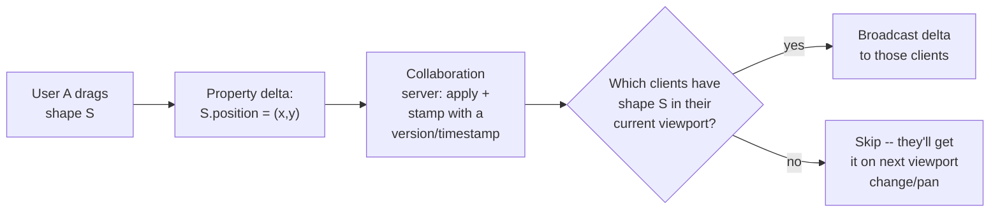

**Memory hook:** *"Move a shape, send a delta, fan it out only to clients who can currently see
that shape — not the whole document."*

---

## Table of contents
[How to Identify This Topic](#how-to-identify-this-topic-in-an-interview) ·
[Interview Playbook](#interview-playbook) · [Requirements](#requirements-clarification) ·
[Capacity Estimation](#capacity-estimation-worked) · [API Design](#api-design) ·
[High-Level Architecture](#high-level-architecture) ·
[Architecture Evolution v1→v2→v3](#architecture-evolution-v1--v2--v3) ·
[End-to-End Walkthroughs](#end-to-end-request-walkthroughs) ·
[Deep Dive: Property-Level CRDT](#deep-dive-property-level-crdt-over-shapes) ·
[Deep Dive: Viewport-Scoped Fan-Out](#deep-dive-viewport-scoped-fan-out) ·
[Deep Dive: Per-User Undo/Redo](#deep-dive-per-user-undoredo-in-a-multi-user-crdt) ·
[Deep Dive: Presence & Cursor Broadcasting](#deep-dive-presence--cursor-broadcasting) ·
[Data Model](#data-model) · [Failure Modes](#failure-modes--mitigations) ·
[Non-Functional Walkthrough](#non-functional-walkthrough) ·
[Security & Compliance](#security--compliance) · [Cost & Trade-offs](#cost--trade-offs) ·
[Wrap-Up](#wrap-up-mvp-vs-stretch) · [Golden Rules](#golden-rules) ·
[Cheat Sheet](#master-cheat-sheet)

---

## How to identify this topic in an interview

- "Design Figma / Miro / a collaborative whiteboard / a collaborative design tool."
- The tell that distinguishes this from the Google Docs chapter: objects with **spatial
  properties** (position, size, color) that users manipulate directly, rather than a linear text
  stream — if the interviewer says "shapes," "canvas," "whiteboard," or "design file," this is the
  chapter, not text-OT.
- A follow-up like "what about a huge file with thousands of objects and many editors" is the
  [viewport-scoped fan-out deep dive](#deep-dive-viewport-scoped-fan-out) — the single most
  commonly missed scaling mechanism in this chapter.

---

## Interview playbook

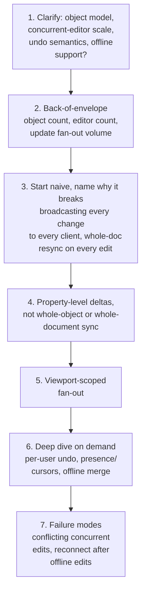

**What the interviewer is actually grading at each step:**
- Step 3: do you recognize, unprompted, that this is NOT the same conflict-resolution problem as
  text editing, and that reaching for full text-OT/CRDT machinery here would be over-engineering
  for a problem that's mostly last-writer-wins-per-property?
- Step 5: do you know that fan-out has to scale with what's visible, not with total document
  size — a large file with many objects shouldn't mean every client processes every update?
- Step 6: do you know *why* a single global undo stack is wrong in a multi-user context, and
  propose a per-user operation history instead?

---

## Requirements clarification

### Functional

| # | Requirement | Notes |
|---|---|---|
| F1 | Multiple users see and edit the same canvas simultaneously — moving, resizing, styling, creating, deleting shapes | The core collaborative primitive |
| F2 | Live cursor/selection presence for every connected user | Standard collaborative-editing expectation, low-stakes if occasionally stale |
| F3 | Undo/redo, scoped to each user's own actions | Not a single global undo stack |
| F4 | Support very large canvases (thousands of objects) without every client rendering/receiving updates for objects outside their view | Scaling requirement, not just a feature |
| F5 | Support offline edits that merge cleanly on reconnect | Same-shape problem as Dropbox/Drive sync, applied to canvas objects |

### Non-functional

| Requirement | Target | Why this number |
|---|---|---|
| Update propagation latency | Sub-second (100-300ms is the target range most collaborative tools aim for) | Beyond this, collaboration feels laggy rather than "live" |
| Conflict resolution | Convergent — all clients eventually see the same final state regardless of message order | Standard CRDT guarantee, achievable here because most conflicts are single-property last-writer-wins |
| Fan-out cost | Proportional to viewport-visible object count, not total document object count | The scaling requirement that separates a toy implementation from a real one |
| Presence freshness | Can be stale by hundreds of milliseconds without real harm | Cursor position is a much lower-stakes signal than the actual document content |
| Offline-edit durability | Edits made offline must not be silently lost on reconnect | Same trust bar as any sync system |

**Clarifying questions worth asking the interviewer up front — and what each answer changes:**

| Question | If the answer is... | ...then this changes |
|---|---|---|
| "Are conflicts mostly single-property (move/resize/recolor) or can structural edits (grouping, nesting, reordering) conflict too?" | Mostly property-level, structural edits are rarer | Confirms a lightweight per-property LWW/CRDT scheme is sufficient — full OT is unnecessary overhead |
| "How large do real documents get — hundreds of objects or hundreds of thousands?" | Can get very large (tens of thousands of objects) | Confirms viewport-scoped fan-out is a hard requirement, not a nice-to-have optimization |
| "Does undo need to be per-user or global?" | Per-user | Confirms a per-user operation history/stack, not one shared undo stack |
| "Is offline editing (then reconnect) in scope?" | Yes | Confirms the sync layer needs to buffer local edits and merge on reconnect, not assume an always-connected client |

**Say this out loud in the interview:** *"I want to be explicit that this isn't the same conflict
problem as collaborative text editing — objects have independent properties, so most concurrent
edits don't actually conflict in a way that needs character-level merge logic, and I'd design a
much lighter-weight scheme than full text OT because of that."*

---

## Capacity estimation, worked

```
Given (illustrative, a collaborative design tool):
  Concurrent editing sessions, globally         = 200,000
  Average objects per open document              = 500 (can spike to 10,000+ for large files)
  Average concurrent editors per open document    = 3
  Edits per editor per minute (dragging/resizing generates
    many small deltas, not one per discrete action)  = ~120 (roughly 2/sec while actively dragging)

Naive fan-out (broadcast every edit to every client in the document, regardless of viewport):
  Edits/sec per document (3 editors x 2/sec)     = 6
  Fan-out per edit (broadcast to all other editors) = 2 (n-1 for n=3)
  Fan-out messages/sec per document                = 12
  -> for a 3-person document this looks fine. The problem is document SIZE, not editor count --
     if a large file has 10,000 objects and clients are naively re-rendering the WHOLE object
     list on every delta (not just applying one small patch), each client's rendering cost
     scales with document size, not with the single object that changed.

Viewport-scoped fan-out:
  Objects actually visible in a typical viewport at once = ~50-150, regardless of total
                                                              document size
  -> fan-out volume and client-side render cost per update become roughly CONSTANT relative to
     total document size once scoped to viewport -- this is the number that justifies the
     viewport deep dive: without it, a 10,000-object document costs ~20-200x more client-side
     work per update than a 500-object one, for the same actual editing activity.

Presence/cursor broadcast:
  Cursor position updates per user per second      = ~10 (mouse-move sampling rate)
  Fan-out per cursor update, 3-person doc            = 2
  Cursor messages/sec per document                   = 3 users x 10/sec x 2 ~= 60/sec
  -> presence traffic can EXCEED actual edit-delta traffic in low-edit-activity periods (users
     just moving mice around) -- worth sizing separately from edit traffic, since it has a much
     looser consistency/delivery requirement (fine to drop/coalesce presence updates under load,
     never fine to drop an actual edit delta).
```

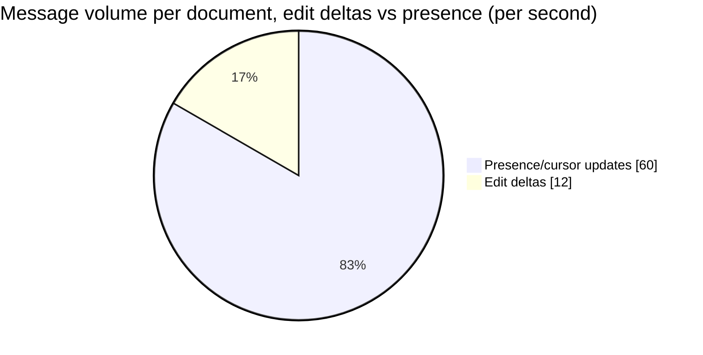

Presence traffic can outweigh actual edit traffic during ordinary editing — the concrete reason
it belongs on its own best-effort channel rather than sharing delivery guarantees with edit
deltas.

**Redo-the-chain test:** if average concurrent editors per document rises to 10 (a large team
brainstorm session), naive whole-document re-render cost multiplies further while viewport-scoped
cost barely changes, since each client's viewport size is independent of how many other people are
editing — a clean illustration of why the viewport mechanism, not editor count, is what actually
determines scalability here.

**The number worth memorizing:** viewport-scoping makes per-client cost roughly constant relative
to total document size — without it, cost scales with document size, which is the difference
between a design tool that stays fast as files grow and one that doesn't.

---

## API design

### WebSocket message: shape update (client → server)

```json
{
  "type": "OBJECT_UPDATE",
  "objectId": "shape_881",
  "properties": { "x": 240, "y": 118 },
  "clientVersion": "v_a1_42",
  "userId": "user_a"
}
```

### WebSocket message: broadcast (server → viewport-subscribed clients)

```json
{
  "type": "OBJECT_UPDATE",
  "objectId": "shape_881",
  "properties": { "x": 240, "y": 118 },
  "serverVersion": "v_srv_10021",
  "userId": "user_a"
}
```

| Field | Notes |
|---|---|
| `properties` | Only the **changed** properties, never the whole object — this is the property-level delta that makes the CRDT scheme lightweight |
| `serverVersion` | A server-assigned, monotonically increasing version stamp per object, used to resolve last-writer-wins ordering deterministically across clients regardless of network delivery order |

### `POST /v1/documents/{docId}/viewport-subscribe`

```json
{ "bounds": { "x0": 0, "y0": 0, "x1": 1920, "y1": 1080 }, "zoom": 1.0 }
```

Re-sent whenever a client pans/zooms — establishes which objects the server should include this
client in the fan-out set for, per the [viewport deep dive](#deep-dive-viewport-scoped-fan-out).

**The one sentence worth saying about the API surface:** *"Every update is a small property-level
delta with a server-assigned version, and fan-out is scoped by an explicit viewport subscription
that clients re-declare as they pan and zoom — never a whole-object or whole-document payload for
a single property change."*

---

## High-level architecture

### Architecture evolution (v1 → v2 → v3)

**v1 — broadcast every change to every client, whole-object payloads:**

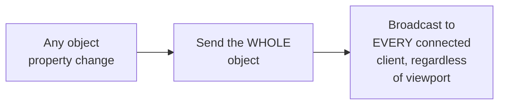

**Why it breaks:** per the capacity estimate, this makes both fan-out volume and client-side
render cost scale with total document size rather than with what's actually changing or visible —
a large file with many concurrent editors becomes progressively slower for everyone as the
document grows, even if any individual editor is only working on a small visible region.

**v2 — property-level deltas, still whole-document broadcast:**

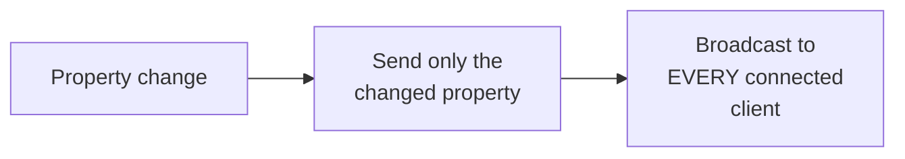

**Why it breaks:** bandwidth per update drops significantly (no longer sending whole objects), but
every client still receives and must at least evaluate updates for objects entirely outside their
current view — for a very large document, this residual "receive and check relevance" cost still
scales with total object count, just with a smaller per-update payload.

**v3 — the real system: property-level deltas, viewport-scoped fan-out:**

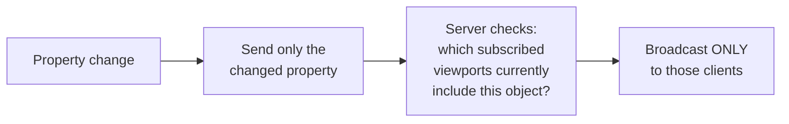

**What v3 fixes, one line each:** property-level deltas keep individual messages small; viewport
subscriptions let the server know which clients actually need to know about a given object right
now; and combining both means fan-out cost and client-side work scale with what's visible and
changing, not with total document size.

---

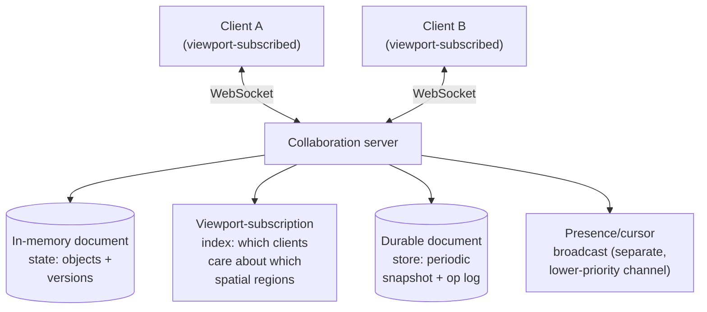

| Component | Role |
|---|---|
| Collaboration server | Holds live in-memory document state for open documents, applies incoming deltas, resolves ordering via server-assigned versions, and drives fan-out |
| Viewport-subscription index | A spatial index (analogous to the geo-cell indexes elsewhere in this course, just for canvas coordinates) mapping regions to subscribed clients — the mechanism behind viewport-scoped fan-out |
| Durable document store | Periodic snapshots plus an operation log, so a server restart or new collaborator join can reconstruct current state without replaying the entire edit history from the beginning every time |
| Presence channel | Deliberately separate from the edit-delta channel — presence tolerates loss/staleness in a way edit deltas never should |

---

## End-to-end request walkthroughs

### Walkthrough 1 — two users edit different objects, viewport-scoped fan-out

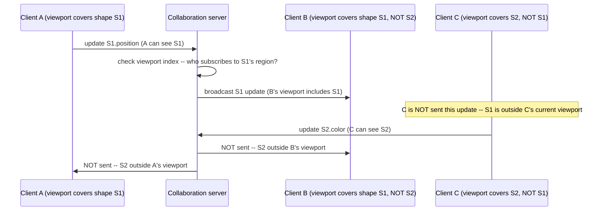

### Walkthrough 2 — two users move the same object simultaneously (the conflict case)

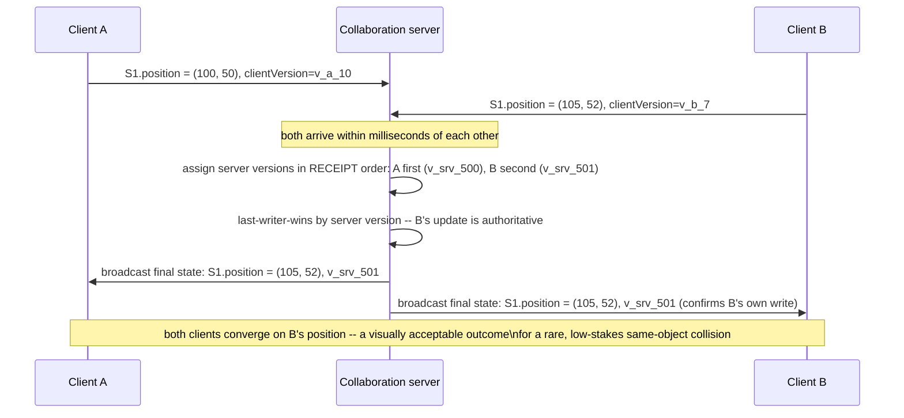

Walkthrough 2 is the concrete illustration of why this chapter doesn't need text-OT-level
machinery — the conflict resolves in one deterministic step (server receipt order), and the
visual outcome (the shape ends up where the later update placed it) is an acceptable, expected
behavior for this kind of collision, unlike a text-editing conflict where naive last-writer-wins
on a whole line would destroy one user's keystrokes.

### Walkthrough 3 — offline edits merge cleanly on reconnect

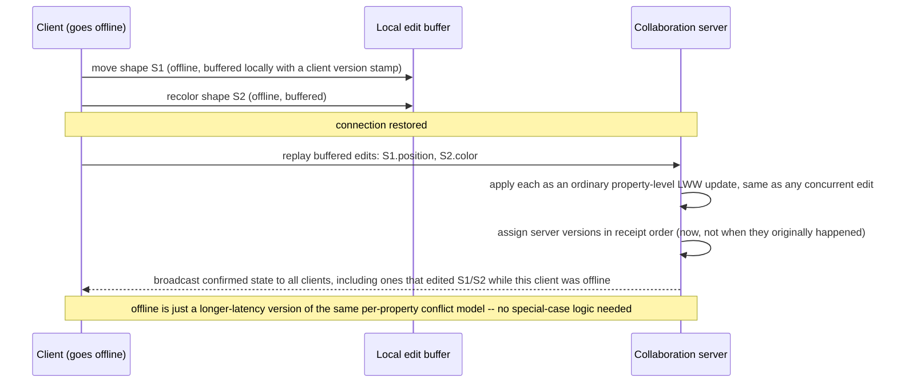

This confirms the [property-level CRDT deep dive](#deep-dive-property-level-crdt-over-shapes)'s
claim explicitly: offline buffering doesn't need a different conflict-resolution mechanism, just a
longer delay before the same one applies.

---

## Deep dive: property-level CRDT over shapes

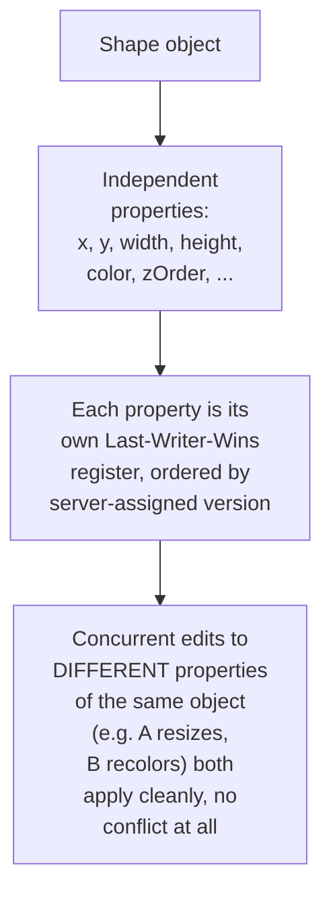

**Why per-property LWW, not per-object LWW:** if two users concurrently edit *different*
properties of the *same* object (A resizes it, B changes its color), per-object LWW would
incorrectly let one edit clobber the other entirely — per-property registers mean both edits
apply independently and cleanly, since they don't actually touch the same piece of state. This is
the single most important design decision in the whole conflict model.

**Why server-assigned version stamps, not client timestamps:** client clocks can be skewed or
simply arrive out of order over the network — a server-assigned, monotonically increasing version
per object (or globally, depending on scope) gives every client the same deterministic ordering to
resolve ties by, regardless of individual network latency or clock drift.

**Why this is not "just CRDT-lite," it's the right-sized tool:** a full CRDT/OT algorithm exists to
handle interleaving within a *single shared sequence* (text). A canvas's objects don't share a
single sequence — they're independent entities with independent properties — so the conflict
surface is naturally much smaller, and a lighter mechanism is the correct engineering choice, not
a corner cut.

**Interview cheat-sheet:** *"Model each object's properties as independent last-writer-wins
registers ordered by a server-assigned version stamp — concurrent edits to different properties
of the same object never conflict at all, and same-property collisions resolve deterministically
by receipt order, without needing a general-purpose text-CRDT algorithm."*

---

## Deep dive: viewport-scoped fan-out

Already motivated by the capacity math — the concrete mechanism.

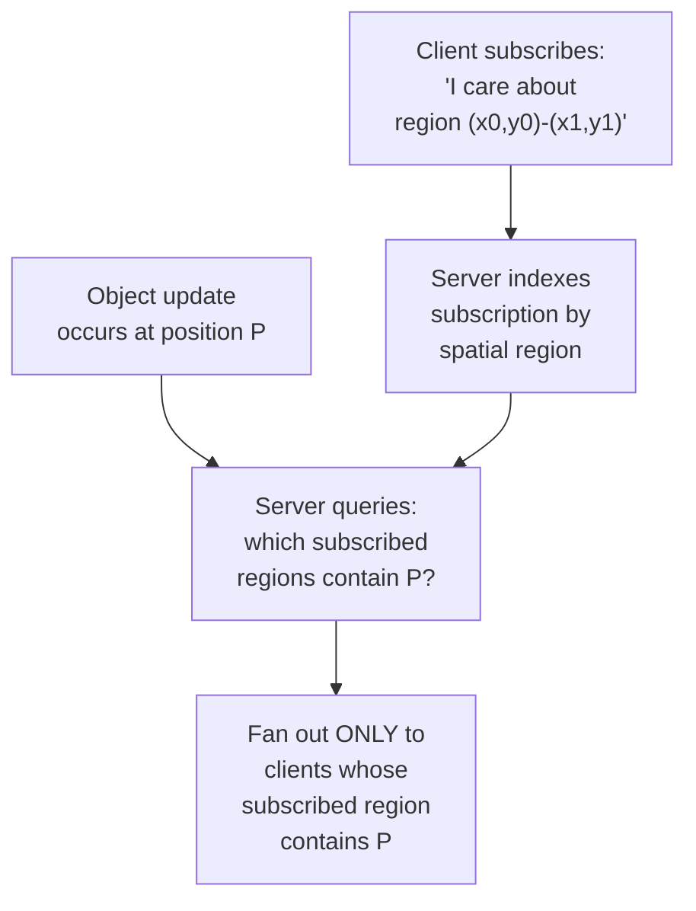

**Why this must re-fire on pan/zoom, not just on initial load:** a client's relevant region
changes continuously as they navigate the canvas — a stale viewport subscription means either
missing updates for newly-visible objects or continuing to receive (and waste bandwidth on)
updates for objects that scrolled out of view; the client re-subscribes on every meaningful
viewport change, not just once at document open.

**Spatial indexing structure, same family as elsewhere in this course:** a grid or quad-tree over
canvas coordinates, mapping regions to subscribed clients — structurally the same idea as the
geo-cell indexing in the ride-hailing/marketplace chapters, just applied to canvas coordinates
instead of geographic ones.

**Interview cheat-sheet:** *"Fan-out is a spatial-index lookup, not a broadcast list — index
client viewport subscriptions by region, and on every object update, query which subscribed
regions overlap it, rather than sending to every connected client regardless of relevance."*

---

## Deep dive: per-user undo/redo in a multi-user CRDT

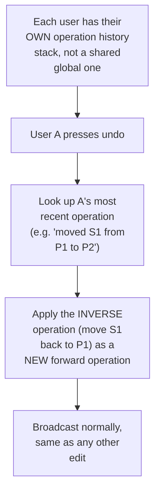

**Why a single global undo stack is wrong:** if undo simply reverted "the most recent change by
anyone," User A pressing undo could revert User B's unrelated edit — clearly wrong and disorienting
in a multi-user context. Each user needs their own operation history, and their undo only reverts
their own most recent (not-yet-undone) operation.

**Why undo is implemented as a new forward operation, not a rewind of shared state:** rewinding
shared document state to some earlier point would also undo other users' edits made since — instead,
undo computes the *inverse* of the user's own last operation and applies it as an ordinary new
edit, which naturally coexists with anything anyone else did in the meantime, the same
event-sourcing-style "compensating action" pattern used in financial ledger corrections.

**Interview cheat-sheet:** *"Undo is per-user and implemented as a compensating forward operation
(the inverse of the user's own last action), never a rewind of shared state — this is what keeps
undo from reverting someone else's unrelated work."*

---

## Deep dive: presence & cursor broadcasting

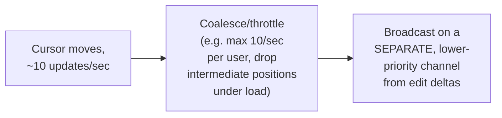

**Why presence tolerates loss but edit deltas never should:** a dropped cursor-position update is
invisible to the user (their cursor just visually catches up on the next update) — a dropped edit
delta is a real, permanent divergence between clients that must never happen. Treating both with
the same delivery guarantee either over-engineers presence (unnecessary reliability machinery for
a disposable signal) or, worse, under-engineers edit delivery by lumping it in with a channel
that's allowed to drop messages.

**Interview cheat-sheet:** *"Presence and edit deltas are two different reliability classes on two
different channels — coalesce and allow loss for cursor/presence, guarantee delivery for actual
document edits. Conflating them either wastes reliability effort on presence or risks losing a
real edit."*

---

## Data model

**Object edit lifecycle** — the state machine behind the CRDT deep dive:

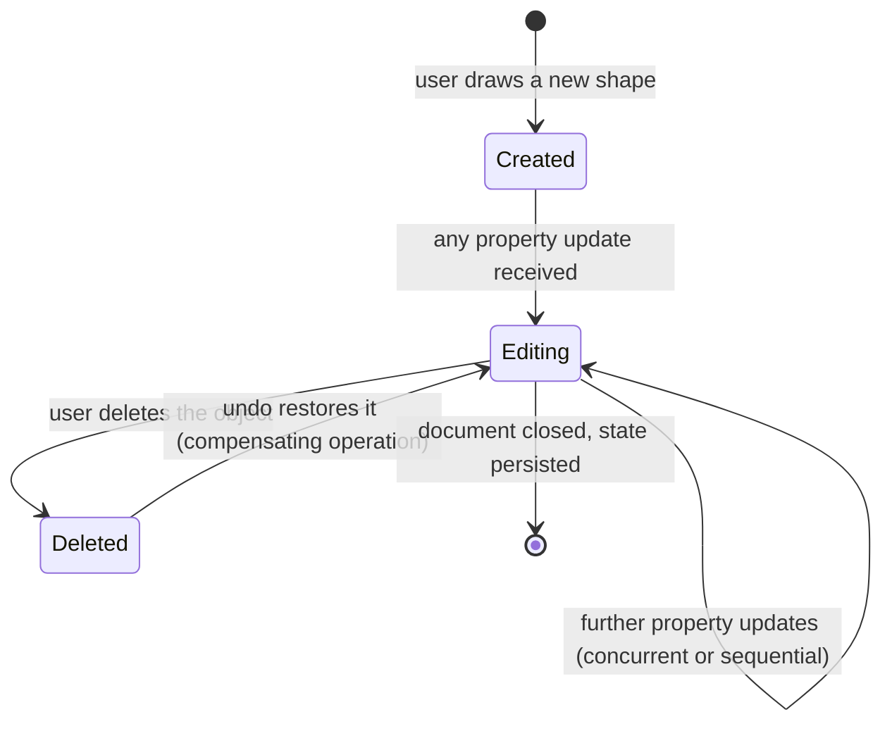

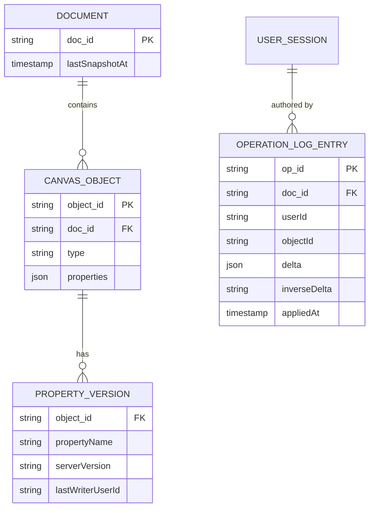

| Table | Storage choice & why |
|---|---|
| `CanvasObject` / `PropertyVersion` | In-memory for the live collaboration server (the hot path), periodically snapshotted to durable storage — the property-version stamps are what make the last-writer-wins ordering deterministic and reproducible |
| `OperationLogEntry` | Append-only, per-user-scoped — this is what powers per-user undo (`inverseDelta` precomputed or derivable) and lets a server rebuild state by replaying from the last snapshot rather than from the beginning of the document's history |

---

## Failure modes & mitigations

| Failure mode | Impact | Mitigation |
|---|---|---|
| **Two users edit the same property near-simultaneously** | One edit is overwritten (expected, per the CRDT deep dive) | This is accepted, deliberate behavior for this domain — not a bug to fix, but worth confirming with the interviewer that last-writer-wins-per-property is an acceptable resolution policy for the product |
| **Client goes offline mid-edit, reconnects later** | Local edits made offline need to merge with whatever happened on the server in the meantime | Buffer offline edits locally with client-side version stamps; on reconnect, replay them against current server state using the same per-property LWW resolution as any other concurrent edit — offline is just a longer-latency version of the same conflict model, not a different one |
| **Collaboration server restarts, losing in-memory state** | Live document state for open documents would be lost without a recovery path | Periodic snapshotting to durable storage plus the operation log allows rebuilding current state on restart without replaying from the document's entire history |
| **Viewport-subscription index grows stale** (client disconnects without unsubscribing) | Server wastes fan-out effort on a dead connection | Standard connection-liveness heartbeat/timeout, same as any WebSocket-based system, pruning stale subscriptions |

---

## Non-functional walkthrough

**Scaling fan-out is the central non-functional concern**, and it scales with viewport-visible
object count and concurrent-editor count, not total document size, once the viewport-scoping
mechanism is in place — this is the single most important scaling property to state explicitly.

**Availability degrades gracefully by document, not globally** — a collaboration server issue
affecting one open document shouldn't take down editing for unrelated documents on other server
instances, arguing for sharding live document sessions across a server fleet keyed by document ID.

**Consistency is convergent, not strictly ordered** — all clients eventually agree on the same
final state for every property, but the path to get there (which intermediate states a client
briefly sees) can differ slightly across clients due to network timing, which is an acceptable and
standard property of this class of system.

---

## Security & compliance

- **Access control per document** — only invited/permitted users should be able to join a
  document's collaboration session; the WebSocket connection should be authenticated and
  authorized per document, not just per user account generally.
- **Operation log retention** — the append-only op log, useful for undo and recovery, is also a
  detailed edit history of the document and should follow the same retention/access-control policy
  as the document itself, including on deletion/export requests.
- **Rate limiting per client** on edit-delta submission, to bound the impact of a misbehaving or
  compromised client flooding updates.

---

## Cost & trade-offs

**Viewport-scoped fan-out trades indexing complexity (maintaining a spatial subscription index)
for fan-out and client-render cost that stays roughly constant as documents grow** — an easy trade
to justify once documents regularly exceed a few hundred objects, per the capacity estimate.

**Per-property LWW trades some conflict "sophistication" (it can't do fancy structural merges) for
a dramatically simpler and cheaper conflict model than full text-OT/CRDT** — the right trade for
this domain specifically because the conflict surface (independent object properties) is naturally
much smaller than a shared text sequence's.

---

## Wrap-up: MVP vs. stretch

**In scope for an MVP:**
- Property-level last-writer-wins CRDT with server-assigned version stamps.
- Basic fan-out to all clients in a document (defer viewport-scoping until document sizes in
  practice justify it — but design the message format around small property deltas from day one
  so adding viewport-scoping later doesn't require a protocol change).
- Per-user undo/redo via compensating operations.
- Presence/cursor broadcast on a separate, best-effort channel.

**Explicitly out of scope for an MVP:**
- Viewport-scoped fan-out — add once real documents/editor-counts demonstrate the need (per the
  capacity estimate's redo-the-chain illustration).
- Offline editing support — start with an always-connected assumption, add offline buffering and
  reconnect-merge once that's a confirmed requirement.

**Stretch goals, worth naming if asked "what's next":**
1. **Viewport-scoped fan-out** with a spatial index, once document/editor scale justifies it.
2. **Offline-edit buffering and reconnect merge**, extending the same per-property conflict model
   to a longer-latency scenario.
3. **Structural-edit conflict handling** (grouping, nesting, reordering conflicts), a genuinely
   harder problem than property-level LWW, worth naming as a distinct stretch rather than
   pretending the same simple mechanism trivially extends to it.

---

## Golden rules

- **This is not the same conflict problem as collaborative text editing.** Independent object
  properties mean most concurrent edits don't actually conflict — reaching for full text-OT/CRDT
  machinery here is over-engineering, not thoroughness.
- **Model each property as its own last-writer-wins register**, ordered by a server-assigned
  version stamp, not client timestamps.
- **Fan-out must scale with what's visible, not with total document size** — viewport-scoped
  subscriptions are what make a large document as fast to edit as a small one.
- **Undo is per-user and implemented as a compensating forward operation**, never a rewind of
  shared state that would also undo someone else's work.
- **Presence and edit deltas are different reliability classes** — coalesce/allow-loss for
  presence, guarantee delivery for edits.

---

## Master cheat sheet

**One-liners:**
- Canvas collaboration's conflict surface is naturally smaller than text's — independent object
  properties mean per-property last-writer-wins is the right-sized tool, not a corner cut.
- Server-assigned version stamps, not client timestamps, give every client the same deterministic
  tie-break ordering regardless of individual network latency.
- Viewport-scoped fan-out is what keeps per-client cost roughly constant as document size grows —
  without it, cost scales with total objects, not with what's actually visible.
- Undo is per-user, implemented as a compensating operation, never a shared-state rewind.
- Presence/cursor updates and edit deltas belong on separate channels with different delivery
  guarantees — one is disposable, the other never should be.

**Formula chain:**
```
naive_fanout_cost   = total_document_objects x connected_clients
viewport_fanout_cost = avg_viewport_visible_objects x clients_whose_viewport_overlaps_the_change
                        [independent of total_document_objects once viewport-scoped]
```

**Numbers:** sub-second (100-300ms) update propagation target · viewport-visible object counts
stay roughly constant (tens to low hundreds) regardless of total document size, which is exactly
why viewport-scoped fan-out keeps cost bounded · presence-update frequency can exceed actual edit
frequency during low-activity periods, arguing for its own separate, best-effort channel.
