# Design a Fraud Detection System — FAANG Interview Guide

> Source chapter type: real-time stream processing + ML inference on the critical path. Shares
> the asymmetric-cost reasoning of
> [the sanctions-screening chapter](./47-Sanctions-Watchlist-Screening-System-FAANG-Guide.md) but
> adds two problems that chapter doesn't have: features have to be **computed from a live stream**
> (not looked up in a slowly-refreshed list), and the model scoring a transaction **online** must
> use features computed the *exact same way* as the model was **trained** offline, or the model's
> accuracy silently degrades in production without ever throwing an error.

## Mental model

Every transaction must be scored for fraud risk in the time it takes to approve or decline it —
typically under a second, in the same critical path as the payment itself. The score depends on
**features** like "how many transactions has this card made in the last hour" or "average
transaction amount for this merchant category in the last 30 days" — numbers that have to be
computed from a continuously flowing stream of past transactions, updated in real time, and
available to the model within the transaction's latency budget.

Three genuinely hard problems:

1. **Real-time feature computation from a stream.** "Transactions per card per hour" isn't a
   static lookup — it's a rolling aggregate that has to update as new transactions arrive and
   expire as old ones fall outside the window, computed fast enough to be ready before the next
   transaction from that same card needs it.
2. **Train/serve feature consistency.** The model was trained on historical data where a feature
   like "transactions in the last hour" was computed by scanning a complete historical record. In
   production, that same feature has to be computed **the same way**, live — if training computes
   it slightly differently (e.g., includes the current transaction in the count, or uses a
   different time-zone boundary) than serving does, the model's real-world accuracy diverges from
   its offline-measured accuracy, silently and without any error message.
3. **A hybrid decision, not a pure ML score.** Known fraud patterns (a specific stolen-card BIN
   range, a blacklisted device fingerprint) are better caught by deterministic rules than by
   waiting for a model to learn them from delayed-label training data — production fraud systems
   combine a rules engine and an ML model, and how those two combine into one final decision is
   itself a real design question.

**The one sentence to say out loud:** *"The hard part isn't the model, it's making sure the
feature a model sees at serving time is computed identically to the feature it saw during
training — and combining fast deterministic rules with a slower-to-adapt ML score into one
decision."*

**The one picture to remember forever:**

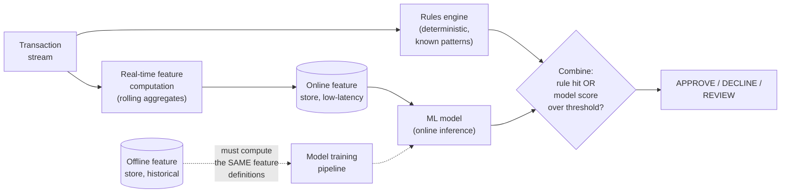

**Memory hook:** *"Rules catch what you already know. The model catches what you don't. Both
have to see features computed the same way online as they were offline — the moment those two
computations drift apart, the model is silently wrong in production."*

---

## Table of contents
[How to Identify This Topic](#how-to-identify-this-topic-in-an-interview) ·
[Interview Playbook](#interview-playbook) · [Requirements](#requirements-clarification) ·
[Capacity Estimation](#capacity-estimation-worked) · [API Design](#api-design) ·
[High-Level Architecture](#high-level-architecture) ·
[Architecture Evolution v1→v2→v3](#architecture-evolution-v1--v2--v3) ·
[End-to-End Walkthroughs](#end-to-end-request-walkthroughs) ·
[Deep Dive: Real-Time Feature Computation](#deep-dive-real-time-feature-computation) ·
[Deep Dive: Train/Serve Feature Consistency](#deep-dive-trainserve-feature-consistency) ·
[Deep Dive: Rules + ML Hybrid Decision](#deep-dive-rules--ml-hybrid-decision) ·
[Deep Dive: Delayed-Label Feedback Loop](#deep-dive-delayed-label-feedback-loop) ·
[Data Model](#data-model) · [Failure Modes](#failure-modes--mitigations) ·
[Non-Functional Walkthrough](#non-functional-walkthrough) ·
[Security & Compliance](#security--compliance) · [Cost & Trade-offs](#cost--trade-offs) ·
[Wrap-Up](#wrap-up-mvp-vs-stretch) · [Golden Rules](#golden-rules) ·
[Cheat Sheet](#master-cheat-sheet)

---

## How to identify this topic in an interview

- "Design a fraud/anomaly detection system for payments" or "design a real-time risk-scoring
  system."
- The tell that this is a stream-processing-plus-ML-inference chapter, not a pure ML-serving
  chapter: the interviewer emphasizes that features depend on **recent history** ("transactions in
  the last hour") rather than static attributes — that's what forces the real-time aggregation
  problem into the design.
- A follow-up like "the model works great in offline evaluation but performs worse in production"
  is testing the [train/serve consistency deep dive](#deep-dive-trainserve-feature-consistency) —
  the single most-tested failure mode in ML-serving-in-product interviews generally.

---

## Interview playbook

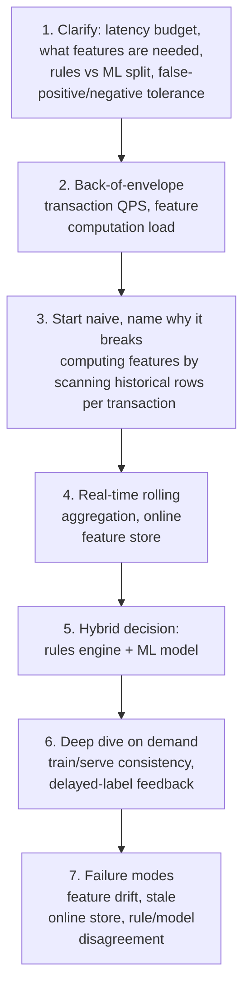

**What the interviewer is actually grading at each step:**
- Step 3: do you recognize, unprompted, that scanning historical transaction rows to compute a
  rolling feature per incoming transaction doesn't scale — you need a maintained, incrementally
  updated aggregate, not a query-time scan?
- Step 5: do you know *why* a hybrid rules+ML design beats either alone — rules catch known
  patterns instantly and explainably; ML catches novel patterns rules haven't been written for yet?
- Step 6: do you spot the train/serve skew risk unprompted, or only when asked "why might
  production accuracy differ from offline evaluation"? Spotting it yourself is the differentiator,
  same as the feedback-loop deep dive in the surge-pricing chapter of this course.

---

## Requirements clarification

### Functional

| # | Requirement | Notes |
|---|---|---|
| F1 | Score every transaction for fraud risk before it's approved | The core check, in the payment's critical path |
| F2 | Combine deterministic rules (known fraud patterns) with an ML model score into one decision | Neither alone is sufficient |
| F3 | Route borderline scores to a human review queue rather than a hard auto-decline | Same three-way-decision shape as the sanctions-screening chapter — asymmetric cost of false positives/negatives applies here too |
| F4 | Incorporate confirmed-fraud labels (often arriving days later via chargeback) back into model retraining | The feedback loop that keeps the model current |
| F5 | Every decision must be explainable — which rule fired, or which features drove the model score | Needed for dispute resolution and regulatory scrutiny of declined transactions |

### Non-functional

| Requirement | Target | Why this number |
|---|---|---|
| Scoring latency (p99) | Well under the overall payment authorization budget — typically tens to low hundreds of milliseconds for the fraud check specifically | This runs inline, in the same critical path as the sanctions-screening and payment-authorization steps |
| Feature freshness | Seconds — a card used fraudulently twice in the last minute needs the second transaction's features to reflect the first one already | Unlike this course's slow-external-authority chapters, freshness here is measured in seconds, not hours |
| False-negative tolerance | Low, but not zero — this is a calibrated business trade-off, not a legal absolute like the sanctions chapter | Distinguishes this chapter's cost model from guide 47's — fraud loss is a quantifiable dollar cost, not a legal/criminal-liability one |
| Explainability | Required per decision | Needed for chargebacks disputes and internal audit of declined transactions |
| Availability | Very high — if the fraud system is down, the payment system needs a defined fallback (not "fail open to always-approve," see failure modes) | A fraud-check outage shouldn't silently become "no fraud checking happened" |

**Clarifying questions worth asking the interviewer up front — and what each answer changes:**

| Question | If the answer is... | ...then this changes |
|---|---|---|
| "What's the latency budget for the fraud check specifically, within the overall payment flow?" | Tens of milliseconds | Rules out any feature computation that requires a query-time scan of historical data — features must already be maintained and ready to read |
| "Are confirmed fraud labels available immediately or with a delay?" | Delayed (chargebacks can take days to weeks) | Confirms the [delayed-label deep dive](#deep-dive-delayed-label-feedback-loop) — the model can't retrain on same-day ground truth |
| "Should borderline scores auto-decline, auto-approve, or go to review?" | Review queue for borderline | Confirms the three-way decision shape, same pattern as sanctions screening |
| "Is explainability a hard requirement per decision?" | Yes, for disputes/audits | Confirms feature/rule attribution must be logged per decision, not just the final score |

**Say this out loud in the interview:** *"I want to design this so that whatever feature the model
sees online was computed by the exact same logic used to generate that feature for training data
— divergence there is the classic way one of these systems quietly stops working without any
alarm firing."*

---

## Capacity estimation, worked

```
Given (illustrative, a payment processor):
  Transactions per day                              = 100,000,000
  Peak transaction QPS                                = 100,000,000 / 86,400 ~= 1,150 average,
                                                          say ~5,000 QPS at peak

Real-time feature computation load:
  Features requiring rolling aggregation per transaction = ~15 (transactions per card per hour,
                                                               per day; average amount per merchant
                                                               category; velocity across devices; etc.)
  Feature READ load at inference time                      = 5,000 QPS x 15 ~= 75,000 feature
                                                               reads/sec from the online store
  Feature WRITE/update load (each incoming transaction
    updates its own rolling aggregates)                     = 5,000 QPS x ~15 aggregates touched
                                                               ~= 75,000 updates/sec
  -> both read and write load on the online feature store are in the tens of thousands per
     second at peak -- this rules out any store that isn't built for high-throughput point
     reads/writes with sub-10ms latency (a full historical-scan approach is off by orders of
     magnitude from this budget).

Rules engine load:
  Rules evaluated per transaction                    = ~50-200 (deterministic checks: BIN range,
                                                          device blacklist, velocity thresholds)
  -> cheap per-rule (simple comparisons), the aggregate cost at 5,000 QPS x 100 rules
     (500,000 rule-evaluations/sec) is still small compared to feature-store read/write load,
     because rule evaluation doesn't require any external data fetch beyond what's already
     computed.

Model inference load:
  Model scoring calls/sec at peak                     = 5,000 QPS (one per transaction)
  -> a small number by ML-serving standards; the bottleneck in this system is almost never
     inference throughput itself, it's the feature-store read/write load feeding it.

Delayed-label volume:
  Confirmed fraud/chargeback labels arriving per day  = ~50,000 (a small fraction of total
                                                          transactions, arriving over a period of
                                                          days to weeks after the original
                                                          transaction)
  -> tiny relative to transaction volume -- retraining runs on a batch cadence (e.g. daily/weekly),
     not continuously, because labels simply don't arrive fast enough to support anything tighter.
```

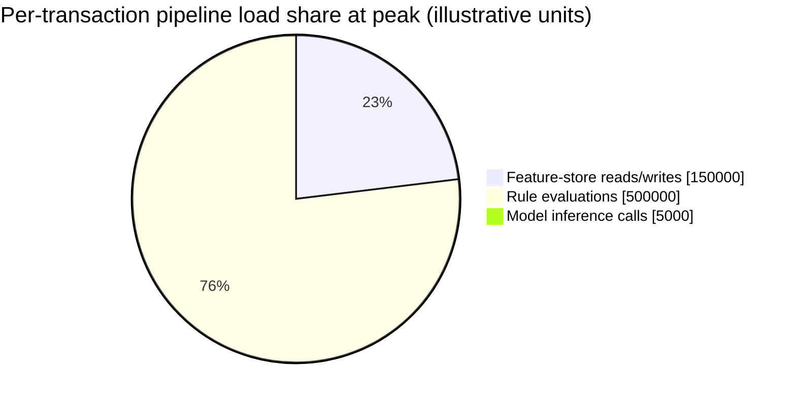

Rule evaluation count is highest, but each is a cheap local comparison with no external fetch —
feature-store read/write load is the more expensive, capacity-driving figure per the discussion
above, despite the smaller raw count.

**Redo-the-chain test:** if the number of rolling-aggregate features doubles to 30 (a richer
model), feature-store read/write load doubles to ~150,000/sec — a direct, computable cost of
adding model complexity, worth naming if asked "what's the cost of a richer feature set."

**The number worth memorizing:** feature-store read+write load, not model inference itself, is
the dominant capacity driver in this system — a design that optimizes model-serving infrastructure
while treating the feature store as an afterthought has optimized the wrong bottleneck.

---

## API design

### `POST /v1/fraud/score` (called inline during payment authorization)

```json
{
  "transactionId": "t_88213",
  "cardToken": "tok_a1b2",
  "amount": 145.00,
  "merchantCategory": "electronics",
  "deviceFingerprint": "dfp_9021"
}
```

Response (target: tens of milliseconds):
```json
{
  "transactionId": "t_88213",
  "decision": "REVIEW",
  "modelScore": 0.71,
  "rulesFired": [],
  "topFeatures": [
    { "feature": "txn_count_1h_per_card", "value": 6, "contribution": 0.31 },
    { "feature": "amount_vs_merchant_category_avg", "value": 2.4, "contribution": 0.22 }
  ],
  "featureComputeVersion": "fc_v18"
}
```

| Field | Notes |
|---|---|
| `decision` | `APPROVE`, `DECLINE`, or `REVIEW` — the three-way shape, same reasoning as the sanctions chapter |
| `topFeatures` | Per-feature contribution to the score — the explainability requirement made concrete, not just a single opaque number |
| `featureComputeVersion` | Ties the decision to the exact feature-computation logic version that produced it — critical for the train/serve consistency deep dive and for reproducing a decision during a dispute |

**The one sentence worth saying about the API surface:** *"The response exposes which features
drove the score and their computed values, not just a number — an unexplainable decline is both a
poor customer experience and a compliance/dispute-resolution liability."*

---

## High-level architecture

### Architecture evolution (v1 → v2 → v3)

**v1 — compute features by scanning historical transactions per incoming request:**

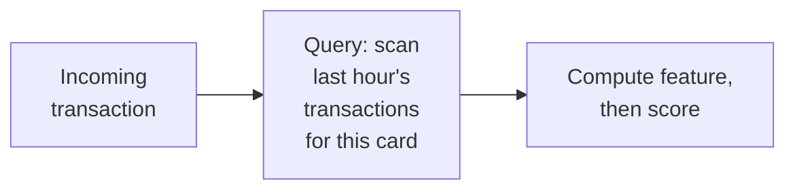

**Why it breaks:** per the capacity estimate, this requires a query-time scan for every one of
~15 rolling features, for every one of 5,000 QPS transactions — a historical-scan approach doesn't
hit a tens-of-milliseconds latency budget at that volume, especially as the scanned window and
transaction history grow.

**v2 — pure ML model, no rules engine:**

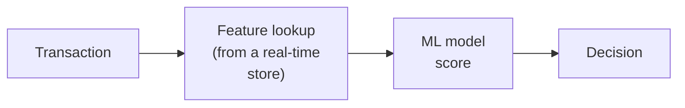

**Why it breaks:** better on the feature-computation side, but a model alone is slow to adapt to
newly-known fraud patterns (a specific stolen-BIN range identified this morning) — it can only
learn from labeled training data, which arrives with a delay per the capacity estimate's
delayed-label numbers. A known-bad pattern needs to be blockable **immediately**, not after the
next retraining cycle picks it up.

**v3 — the real system: real-time feature store + hybrid rules/ML decision:**

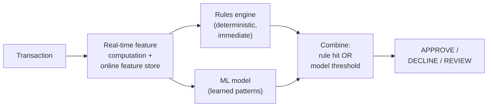

**What v3 fixes, one line each:** the real-time feature store makes feature lookups fast reads
instead of query-time scans; the rules engine catches known patterns instantly and updatably,
without waiting on model retraining; and the ML model catches the broader, evolving patterns rules
haven't been written for — combined, neither component's weakness is the whole system's weakness.

---

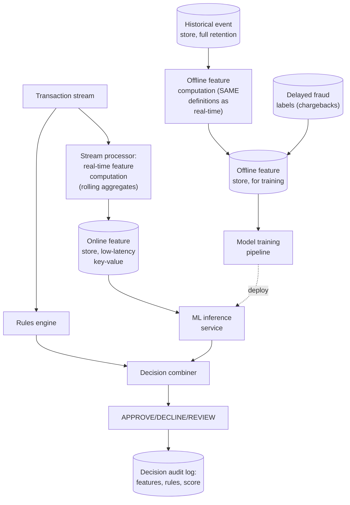

| Component | Role |
|---|---|
| Stream processor | Maintains rolling aggregates per card/device/merchant as transactions flow through — same architectural role as the ad-click-aggregation chapter's windowed counters, applied to fraud features instead of billing counts |
| Online feature store | Low-latency key-value store, the hot read/write path sized in the capacity estimate |
| Rules engine | Deterministic, instantly updatable — a new known-bad pattern can be blocked by adding a rule, without any model retraining |
| Offline feature computation | Must implement the **same feature definitions** as the real-time path — this shared-definition requirement is the entire subject of the train/serve consistency deep dive |
| Model training pipeline | Consumes offline features plus delayed labels, retrains on a cadence bounded by how fast labels actually arrive |

---

## End-to-end request walkthroughs

### Walkthrough 1 — a normal transaction, hybrid decision

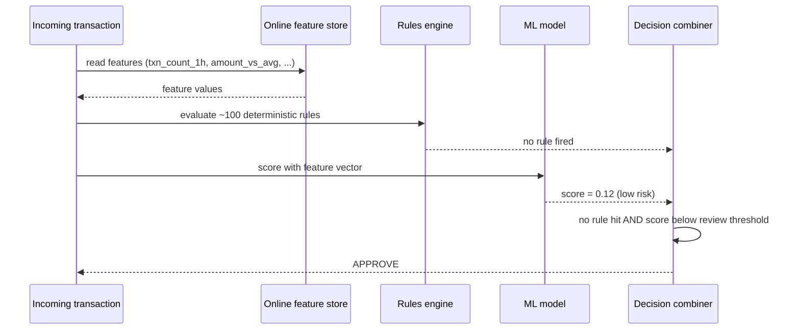

### Walkthrough 2 — a known-bad pattern, caught by a rule before the model even matters

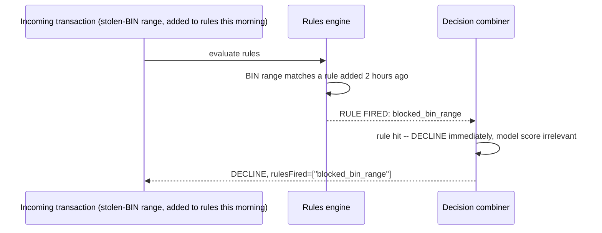

Walkthrough 2 is the concrete case for why rules exist alongside the model — a pattern identified
this morning is blockable this morning, without waiting for the next model retraining cycle to
learn it from delayed-label data.

### Walkthrough 3 — the online feature store degrades, circuit-breaks to rules-only

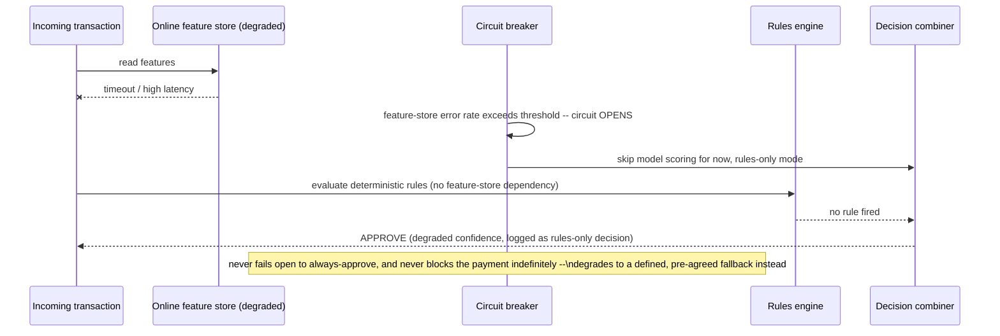

This is the concrete mechanism behind the [failure-modes table](#failure-modes--mitigations)'s
"circuit-break to a rules-only decision" mitigation — a degraded feature store narrows fraud
coverage but never stalls or blindly approves every transaction.

---

## Deep dive: real-time feature computation

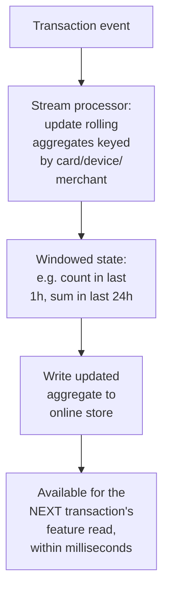

**Why incremental rolling aggregation, not query-time scanning:** maintaining a running count/sum
per key, updated on each new event and expiring old events out of the window, turns "compute this
feature" from an O(window size) scan into an O(1) update — the same instinct as maintaining a
running total instead of re-summing from scratch, applied to a windowed, continuously-expiring
aggregate.

**Windowing mechanics worth naming:** a sliding or tumbling window per feature (e.g., "count in the
last rolling hour" needs old events to expire continuously, not just at fixed boundaries) — this
is the same windowing concept as the ad-click-aggregation chapter's watermarking, applied here to
feature freshness rather than billing correctness.

**Interview cheat-sheet:** *"Features that depend on recent history are maintained as incrementally
updated rolling aggregates in a stream processor, never recomputed by scanning historical rows per
incoming transaction — this is what makes tens-of-milliseconds feature reads possible at real
transaction volume."*

---

## Deep dive: train/serve feature consistency

The most commonly tested failure mode in ML-serving-in-product system design, and the one most
candidates only mention when explicitly prompted.

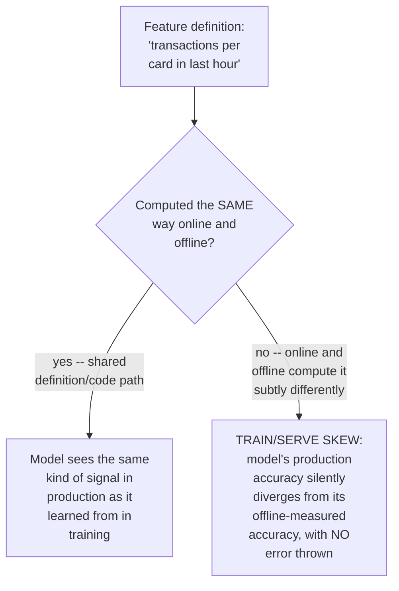

**Concrete ways skew sneaks in, worth naming specifically:** the offline pipeline computes
"transactions in the last hour" using calendar-hour boundaries while the online pipeline uses a
rolling 60-minute window; the offline pipeline accidentally includes the current transaction being
scored in its own count while the online pipeline excludes it; the two pipelines use different
time-zone handling for a "same day" feature. Each of these is individually subtle and none of them
throws an error — the model just quietly performs worse in production than its offline metrics
predicted.

**Why a shared feature-computation library/definition, not two independent implementations, is
the actual fix:** the offline (training) and online (serving) feature computation should call the
**same** feature-definition code (or a system explicitly designed to guarantee equivalence, like a
proper feature store's dual-materialization capability) — maintaining two independently-written
implementations of "the same" feature is how skew gets introduced in the first place, even with
the best intentions.

**Interview cheat-sheet:** *"Train/serve skew is the classic silent failure mode here — the fix is
a single shared feature definition materialized both online and offline, never two independently
maintained implementations of 'the same' feature that can quietly drift apart."*

---

## Deep dive: rules + ML hybrid decision

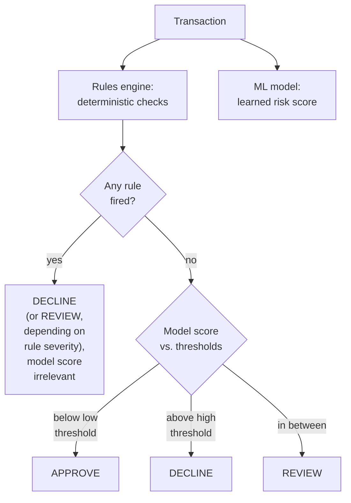

**Why rules take precedence over the model, not the other way around:** a rule represents a
known, verified pattern (a specific stolen card range, a device on a confirmed-fraud blacklist) —
this is higher-confidence, more explainable, and instantly updatable compared to a model score,
which is a probabilistic estimate learned from historical (and inherently somewhat stale) labeled
data. When both are available, the deterministic, high-confidence signal should win.

**Why not just encode everything as rules and skip the model entirely?** Rules only catch patterns
someone has already identified and written a rule for — genuinely novel fraud patterns (a new
technique, an emerging fraud ring's behavior) have no rule yet, which is exactly the gap the model
exists to cover by learning from the broader distribution of historical fraud rather than
requiring each pattern to be manually identified first.

**Interview cheat-sheet:** *"Rules and the ML model aren't redundant, they cover different gaps —
rules catch known patterns instantly and explainably, the model catches patterns nobody's written
a rule for yet. When a rule fires, it wins, because it represents higher-confidence, verified
knowledge than a probabilistic score."*

---

## Deep dive: delayed-label feedback loop

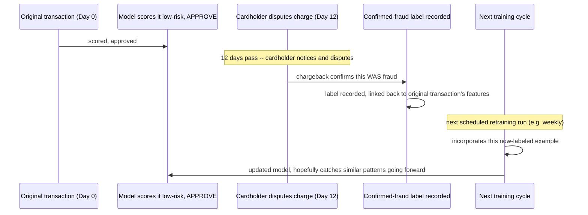

**Why retraining can't be "continuous" or "real-time" here:** per the capacity estimate, ground-
truth fraud labels arrive over days to weeks via chargebacks — there is no way to retrain on
same-day feedback because the feedback itself doesn't exist yet. Retraining cadence is bounded by
label arrival latency, not by infrastructure capability.

**Why this makes the rules engine even more valuable, not just a stopgap:** because the model's
feedback loop is inherently slow, a newly-identified fraud pattern discovered through investigation
(not yet reflected in enough labeled training examples to move the model) can and should be
encoded as an immediate rule — the rules engine is the fast-response mechanism precisely because
the model's response time is bounded by label latency.

**Interview cheat-sheet:** *"Model retraining cadence is bounded by how fast confirmed labels
arrive, typically days to weeks via chargebacks — not an infrastructure choice. This delay is
exactly why the rules engine isn't a legacy fallback, it's the system's only fast-response
mechanism for newly-discovered patterns."*

---

## Data model

**Transaction decision lifecycle:**

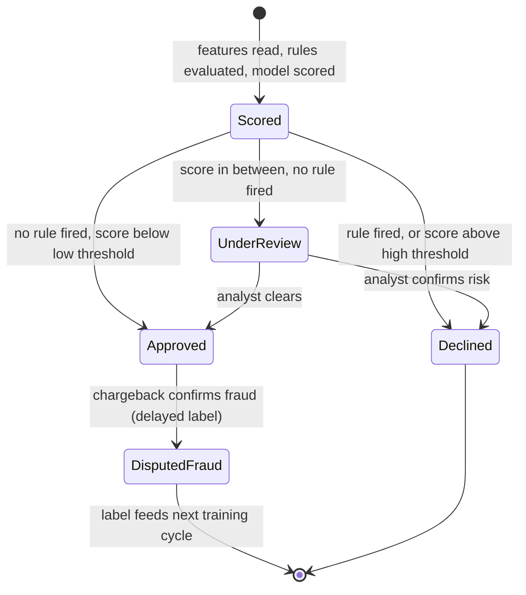

`DisputedFraud` is the state that closes the feedback loop — an `Approved` transaction can still
transition here, days later, which is the delayed-label deep dive made concrete as a state
transition.

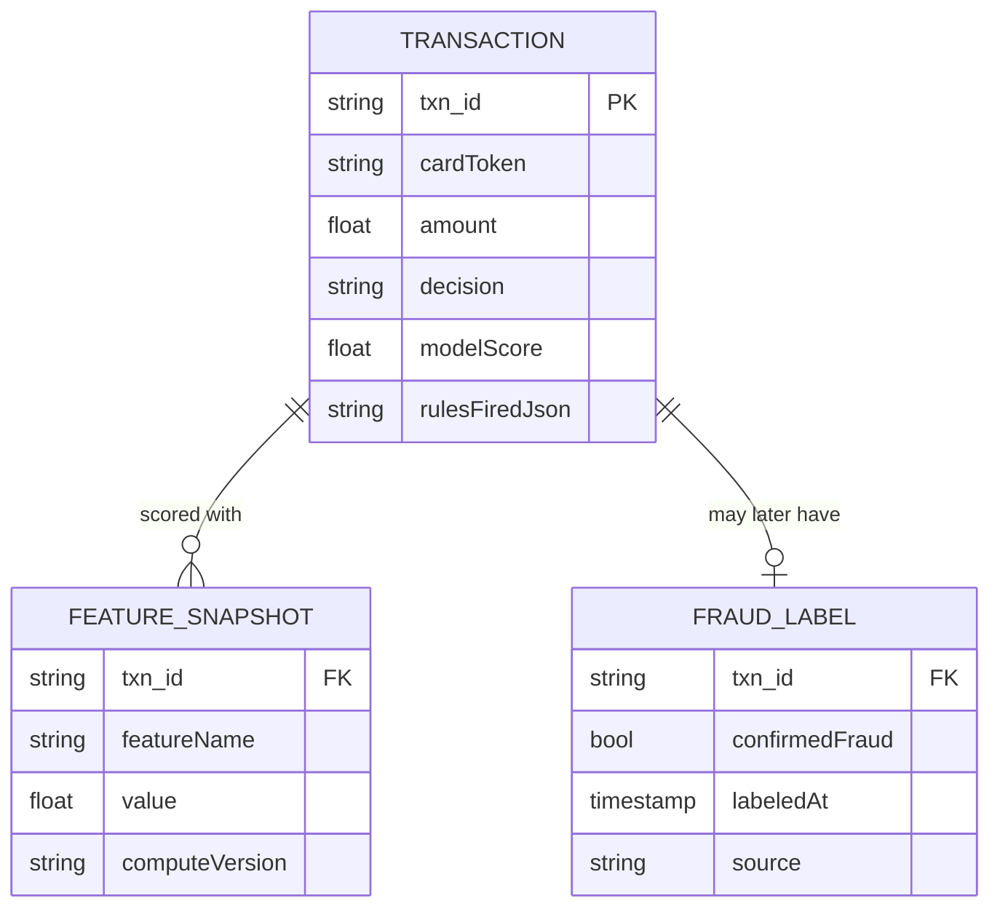

| Table | Storage choice & why |
|---|---|
| `Transaction` / `FeatureSnapshot` | High-write-throughput, append-only — one row per scored transaction, at payment QPS; `FeatureSnapshot` captures the exact feature values used, needed for reproducing a decision during a dispute |
| `FraudLabel` | Low-volume, arrives asynchronously and much later than the original transaction — a distinct write path from the main scoring pipeline |

---

## Failure modes & mitigations

| Failure mode | Impact | Mitigation |
|---|---|---|
| **Online feature store is degraded/slow** | Feature reads miss the latency budget, scoring stalls | Circuit-break to a rules-only decision (skip the model, rely on deterministic rules) rather than blocking the payment indefinitely — a degraded-but-functioning fraud check beats no fraud check or a stalled payment |
| **Train/serve feature skew** (see deep dive) | Model's production performance silently diverges from offline-measured performance | Shared feature-definition code/library between training and serving pipelines; periodically compare online-computed feature distributions against offline-computed ones for the same historical period as a drift check |
| **A rule is misconfigured too broadly** (e.g. a BIN-range rule accidentally matches legitimate cards) | Legitimate transactions declined at scale | Every rule change should go through a canary/shadow period (log what it would have decided, without actually acting on it) before going live, same discipline as any high-blast-radius config change |
| **Fraud system is fully down** | No fraud check can run at all | This must never silently fail open to always-approve — a defined fallback policy (e.g., temporarily lower transaction limits, route to a simpler rules-only check, or in the worst case hold transactions for manual review) needs to be an explicit, pre-agreed business decision, not an engineering improvisation during an incident |

---

## Non-functional walkthrough

**Scaling the feature-store read/write path is the dominant capacity concern**, per the estimate —
this is a stream-processing and key-value-store scaling problem, sharded by card/device/merchant
key, similar in shape to the ad-click-aggregation chapter's windowed counter scaling.

**Availability must degrade to a rules-only fallback, never to always-approve** — the same
fail-safe-not-fail-open instinct as the sanctions-screening chapter, but tuned to this domain's
different cost model (a fraud-check outage causing a burst of undetected fraud losses is a real,
bounded business cost, distinct from the legal-liability framing of the compliance chapters).

**Consistency of features is "as fresh as the stream processor can keep up with," typically
seconds** — much tighter than the slow-external-authority chapters in this course, because the
signal here (recent transaction history) is inherently fast-moving in a way a government list
isn't.

---

## Security & compliance

- **Explainability for declined transactions** is often a real regulatory expectation (adverse-
  action-style reasoning in some jurisdictions/products), not just good UX — the `topFeatures`
  and `rulesFired` fields in the API design exist specifically to satisfy this.
- **Model fairness auditing** — feature sets should be reviewed to avoid encoding proxies for
  protected characteristics, the same concern raised in the Airbnb-ranking chapter, applied here
  to a decision with more direct financial consequences for the person being scored.
- **PII and transaction data handling** — feature computation touches sensitive financial/
  behavioral data and should follow standard data minimization and access-control practices,
  particularly for anything retained long-term for training.

---

## Cost & trade-offs

**Feature richness trades feature-store load for model accuracy** — per the capacity estimate,
doubling the feature count roughly doubles feature-store read/write load; this is a direct,
computable cost of a richer model, not a free accuracy improvement.

**Rules-engine investment trades engineering/ops effort (writing and maintaining rules) for
response speed to newly-discovered patterns** — worth the cost specifically because the model's
own feedback loop is bounded by label latency (days to weeks) and can't fill that gap on its own.

---

## Wrap-up: MVP vs. stretch

**In scope for an MVP:**
- Real-time rolling-aggregate feature computation feeding a low-latency online feature store.
- A rules engine for known patterns, combined with a baseline ML model via the hybrid decision
  logic (rule-fired always wins).
- Per-decision explainability (feature contributions, rules fired) logged for every transaction.
- A batch retraining pipeline consuming delayed chargeback labels.

**Explicitly out of scope for an MVP:**
- Automated drift detection between online and offline feature distributions — start with manual/
  periodic comparison, automate once the feature set and pipeline are stable enough to alert on
  meaningfully.
- Network/graph-based fraud-ring detection (linking seemingly-unrelated transactions/accounts) — a
  substantially harder problem than per-transaction scoring, worth naming as a stretch.

**Stretch goals, worth naming if asked "what's next":**
1. **Automated train/serve skew detection**, comparing live feature distributions against training-
   time distributions and alerting on meaningful divergence.
2. **Graph-based fraud-ring detection**, connecting related transactions/accounts/devices rather
   than scoring each transaction in isolation.
3. **Adaptive thresholds per merchant/region**, rather than one global set of decision thresholds,
   accounting for genuinely different baseline risk profiles.

---

## Golden rules

- **Never compute a rolling feature by scanning historical rows per incoming transaction** —
  maintain it as an incrementally updated aggregate in a stream processor.
- **The dominant capacity constraint is feature-store read/write load, not model inference
  throughput** — size and scale accordingly.
- **Train/serve feature consistency is the most commonly silently-broken thing in this system** —
  use one shared feature definition for both training and serving, never two independent
  implementations of "the same" feature.
- **Rules and the ML model cover different gaps and should combine, not compete** — a fired rule
  represents higher-confidence, instantly-updatable knowledge and should win over a probabilistic
  model score.
- **Model retraining cadence is bounded by label arrival latency (days to weeks via chargebacks),
  not by infrastructure** — this is exactly why the rules engine is a fast-response mechanism, not
  a legacy fallback.
- **Never fail open to always-approve on a system outage** — degrade to a defined, pre-agreed
  fallback (rules-only, or manual review), decided as a business policy in advance.

---

## Master cheat sheet

**One-liners:**
- The bottleneck is feature-store read/write throughput, not model inference — size capacity
  around rolling-aggregate computation and storage, not the ML model itself.
- Train/serve feature skew is the classic silent failure — fix it with one shared feature
  definition materialized both online and offline, never two independently maintained
  implementations.
- Rules catch known patterns instantly and explainably; the model catches patterns nobody's
  written a rule for yet — a fired rule should win over a model score when both are present.
- Retraining cadence is bounded by chargeback/label arrival latency (days to weeks), which is
  exactly why the rules engine matters as a fast-response mechanism, not a stopgap.
- Never fail open to always-approve on an outage — degrade to a pre-agreed fallback policy.

**Formula chain:**
```
feature_store_load   = transaction_QPS x features_per_transaction   [read AND write, roughly symmetric]
rule_eval_load        = transaction_QPS x rules_per_transaction      [cheap per-rule, no external fetch]
retraining_cadence    = bounded by label_arrival_latency, not infra capability
```

**Numbers:** tens-to-low-hundreds-of-ms scoring latency budget, inline with payment authorization
· feature-store read+write load typically tens of thousands per second at real transaction
volume, the dominant capacity driver · confirmed-fraud labels typically arrive days to weeks after
the original transaction via chargebacks, bounding retraining cadence.
