# Design a Distributed Tracing System — The Story (narrative edition)

> **What this file is.** The reference file, `57-Design-a-Distributed-Tracing-System-FAANG-Guide.md`, is the one to recite from — requirements, API shapes, every trade-off table, the master cheat sheet. This file is a second way in: the same material told as one continuous story, in plain language.
>
> Engineers at a company keep hitting a wall, patch it, and the patch itself creates the next wall — until we land on the exact same design the reference file documents.
>
> The company, **Fernway** (an online marketplace), is fictional. But every wall it hits, and every fix it reaches for, is something a real, named system actually does:
> - Google's **Dapper** paper (2010) — the paper that started distributed tracing as a discipline
> - Twitter's **Zipkin**
> - Uber's **Jaeger** — built specifically to do tail-based sampling well
> - **OpenTelemetry** / **W3C Trace Context** — the standards that now define how trace context is carried across the wire
>
> Every time something is stated as fact versus a reasonable guess, I'll say so clearly.

**The trigger phrase for this whole topic:** *"Checkout is slow, and I have no idea which of our fifteen services is causing it."*

Keep one sentence in your head as you read:

> **Distributed tracing exists to reconstruct the causal path of ONE single request as it crosses dozens of services.** Aggregate metrics and per-service logs can each show a piece of that path — but neither can show the whole thing.

Everything below is just this one idea, getting harder in small, honest steps.

---

## Chapter 1 — The slow checkout, and the fifteen suspects

### The setup

Fernway is a mid-size online marketplace. By 2019, checkout looks like one button press from the customer's side. Under the hood, though, it fans out into calls across **15 different microservices**:

- cart validation
- inventory lock
- pricing
- tax calculation
- fraud check
- payment capture
- loyalty points
- email
- ...and more

On a normal day, checkout takes about **300ms** end to end `[illustrative]`.

### The incident

One Tuesday, the on-call engineer gets paged: checkout's p99 latency has jumped to **4,200ms**. Customers are abandoning carts.

The metrics dashboard confirms the aggregate number is bad — but that's *all* it confirms. It shows "checkout p99 is 4.2s." It does not show "service #9 is the one adding 3.8 of those seconds."

So the engineer's next move is the manual, painful one: open the logs for all 15 services around the timestamp of a slow request, and read through them by eye — hoping to spot which service's log lines look unusually far apart in time.

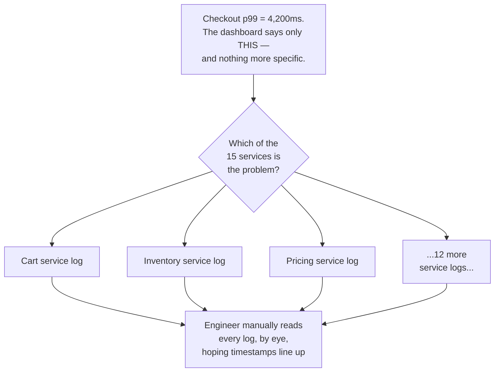

### Why can't metrics or logs just answer this directly?

Because neither one was built to answer "which service, for THIS ONE request, took how long."

- **Metrics** show an aggregate number across every request — the *shape* of a curve, not any single point on it.
- **Logs** show what happened *inside* one service. They don't know anything about what happened in the *next* service the request called.

So there's no way to connect "cart service log line at 14:02:01.100" to "pricing service log line at 14:02:01.850," except manual guesswork — and that guesswork relies on timestamps from clocks that might not even be in sync with each other. (We'll come back to that clock problem much later in the story.)

### The fix — and the analogy for the rest of this story

Give every request crossing the system a **shared ID**, stamped into every service's log line for that request. That way, an engineer can pull every log line for one request with a single search. Call it a **correlation ID**.

**Analogy:** think of it as a **claim-check ticket** handed to your request the moment it enters the building. Every desk it visits along the way writes that same ticket number on their own paperwork.

Now `grep correlation_id=abc123` across all 15 services' logs pulls exactly the lines that belong to that one request — out of everything else happening at the same time.

### New problem — visible the very first time it's used

The engineer runs the grep and gets back 40 log lines, all correctly tagged `abc123`. But they're just a flat list, sorted by whatever timestamp each service happened to write down.

There's no way to tell, just from that list:

- that "pricing service call" was *inside* "cart validation,"
- which was *inside* the top-level checkout request,

...versus all three having happened one after another, independently.

A flat list of same-ID log lines tells you *what* happened. It says nothing about *which call caused which other call* — and that causal shape is exactly what you need to find the one slow link in a 15-hop chain.

### How I'd say this in an interview

"The first, cheapest fix for 'which of many services is slow' is a shared correlation ID stamped on every log line for a request — it turns a manual cross-service search into one grep. But a flat list of same-ID log lines still isn't a *causal tree*. It doesn't tell you which call was a child of which other call, and that's exactly the next problem to solve."

---

## Chapter 2 — Turning a flat list into a family tree

### The fix

Instead of just tagging log lines with an ID, model the request explicitly as a **tree of units of work**.

Each unit of work — "cart service validates the cart," "pricing service computes tax" — becomes a **span**: a record with three pieces of information:

- a start time
- a duration
- a pointer to *which span called it*

All spans belonging to one request share one **trace ID**. Each individual span also gets its own **span ID**, plus a **parent span ID** pointing at whoever called it.

This is exactly the model **Google's Dapper paper (2010)** introduced — the paper that effectively started distributed tracing as a discipline, and the direct ancestor of both Zipkin (built at Twitter) and Jaeger (built at Uber).

### The analogy

Now that we need structure, not just a shared label, think of a **family tree**:

| Tracing concept | Family-tree equivalent |
|---|---|
| Trace ID | The family's last name — everyone in this one request shares it |
| Span ID | Your own individual name |
| Parent span ID | "Who's your parent in this tree" |

That one small pointer — the parent span ID — is what turns a flat list of relatives into an actual, navigable tree you can draw.

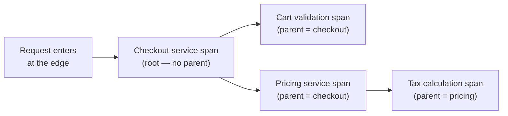

### What this buys us

The 40 log lines from Chapter 1 become an actual tree. The engineer can now see:

- "pricing service" is a *child* of "checkout"
- "tax calculation" is a *child* of "pricing"

— not three unrelated events that happened to share a timestamp window. Rendered visually, it instantly becomes obvious which single branch of the tree is unusually wide (took unusually long) relative to its siblings.

### New problem, one layer down

Building this tree assumes every span correctly records who its parent is.

But right now, each of Fernway's 15 services runs *inside its own process*. A span for "checkout called pricing" has to somehow tell the pricing service — running as a totally separate process, on a totally separate machine — three things:

1. "You are span #2"
2. "Your parent is span #1"
3. "You're all part of trace `abc123`"

Nothing yet carries that information across the actual network call between the two services. Two services on two machines, right now, have absolutely no way of knowing they're supposed to be part of the same tree.

### How I'd say this in an interview

"A span is a unit of work with a start time, a duration, and a pointer to its parent. String enough spans together with a shared trace ID and you get a causal tree instead of a flat list — exactly the model Dapper introduced in 2010, and everything since (Zipkin, Jaeger, OpenTelemetry) is built on it. But that tree only exists if the trace ID and parent span ID actually survive the trip from one service's process to the next one's, over the network. And right now, nothing carries them across."

---

## Chapter 3 — The baton that has to survive every handoff

### The fix

Every outbound network call from an instrumented service must carry the current trace ID and its own span ID forward. This travels as a small piece of metadata riding alongside the actual request — usually an HTTP header.

The real, standardized version of this is the **W3C Trace Context** `traceparent` header, which **OpenTelemetry** (the current industry-standard instrumentation framework) implements directly:

```
traceparent: 00-4bf92f3577b34da6a3ce929d0e0e4736-00f067aa0ba902b7-01
             version-traceId--------------------spanId----------flags
```

### The analogy

Building on the family tree: think of it as a **relay race baton**. Each runner (service) doesn't just run their own leg — they physically hand the baton to the next runner before that runner starts.

The baton *is* the trace ID plus "here's who just handed this to you" (the parent span ID). Drop the baton, even once, and the runner behind you has no way of knowing which race they're even in.

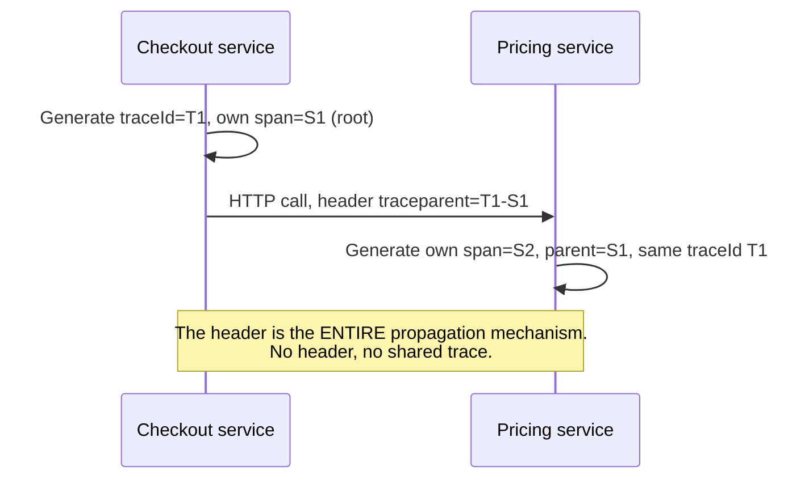

Fernway rolls this out across all 15 services, and it works — for calls made with the company's own shared HTTP client library, which automatically attaches the header on every outbound call.

### New problem — three weeks after rollout

Two hops don't go through Fernway's own HTTP client library, so neither one forwards the header:

1. The fraud-check service calls into a **third-party vendor's fraud-scoring API**.
2. Fernway's own inventory service listens for stock updates by **consuming from a message queue** instead of a direct call.

The trace for a request that touches either of those hops just... stops. The engineer looking at the tree from Chapter 2 sees checkout, cart, pricing — and then nothing, even though the request very much continued past that point in reality.

**It's worse on the queue-based hop specifically.** The consuming service, seeing no incoming trace context at all, does the "safe" thing an uninstrumented starting point does: it treats itself as the *start* of a brand new trace, with a brand new trace ID. The one logical request is now silently split into two disconnected traces — and nothing anywhere raises an error to say so.

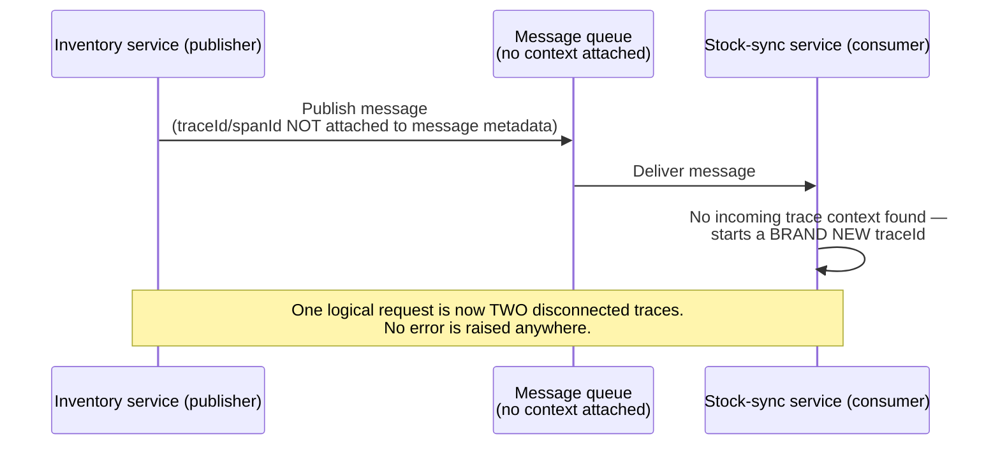

### How I'd say this in an interview

"Propagation across a direct, synchronous call is just a header carried on every outbound call — the `traceparent` format OpenTelemetry and W3C Trace Context standardize. The hard part isn't the mechanism, it's *coverage*: any hop that doesn't go through your instrumented client — a third-party API, or a message queue — drops the baton silently. And a queue-based hop specifically doesn't just lose a span; it silently starts a whole new, disconnected trace."

---

## Chapter 4 — Attaching the baton to the package, not just the runner

### The fix, for the queue case

Attach the trace context as **metadata on the message itself**, not as something that only exists on a synchronous HTTP call.

When Fernway's inventory service publishes a stock-update message, it now writes the trace ID and its own span ID into the message's own headers/metadata — right alongside the message payload.

When the stock-sync service picks the message back up off the queue, it *extracts* that context first, before doing anything else, and continues the *same* trace. It creates its own span as a proper child of the publish step, instead of starting fresh.

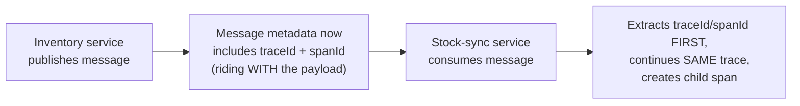

### The gap that can't be closed — third-party vendors

For the third-party-vendor case, there's no equally clean fix. Fernway doesn't control the vendor's code, so the trace simply *ends* at the boundary of the call — and *starts fresh* on the other side, if the vendor happens to run its own tracing at all.

That's an accepted, honest gap, not something worth pretending to solve. Standardized propagation formats matter specifically because they let context survive across boundaries you *do* control. They can't force a third party who isn't participating to forward anything.

### New problem — and it's the biggest one in this whole story

Propagation now works end to end, across synchronous calls *and* async queue hops. Consider the traffic this now covers:

- Fernway handles roughly **20,000 requests per second** at peak `[illustrative]`.
- Each request produces a complete, correctly-linked tree of about **25 spans per request** `[illustrative — a reasonable stand-in for "checkout-style fan-out," not a measured Fernway number]`.

Someone on the team, excited that propagation finally works everywhere, suggests: *"Great — let's just record every single span, for every single request, forever."*

Someone else does the math out loud before anyone ships that idea. (That math is Chapter 5.)

### How I'd say this in an interview

"For queue-based hops, the fix is attaching trace context to the message's own metadata, so the consumer extracts it and continues the same trace instead of starting a new one — that's the commonly-missed extension beyond plain synchronous HTTP propagation. A third-party vendor you don't control the code of is an honest gap you can't fully close, and it's worth naming as a gap rather than glossing over."

---

## Chapter 5 — The bill for recording absolutely everything

### Doing the math

Someone runs the numbers, using:

- **20,000** requests/sec, peak
- **25** spans/request
- roughly **500 bytes** per span `[illustrative — trace/span IDs, service name, operation name, timestamps, a handful of tags]`

Step by step:

```
20,000 req/sec  x  25 spans/req   = 500,000 spans/sec
500,000 spans/sec  x  500 bytes   = 250 MB/sec
250 MB/sec  x  86,400 sec/day     ≈ 21.6 TB/day
```

That's **21.6 terabytes a day** — just for trace data — on a request volume that a metrics system or a logging system would consider entirely ordinary.

### Most of that data is dead on arrival

The overwhelming majority of Fernway's checkout requests are fast and boring. Nobody is ever going to query the trace for a 280ms successful checkout that nobody complained about.

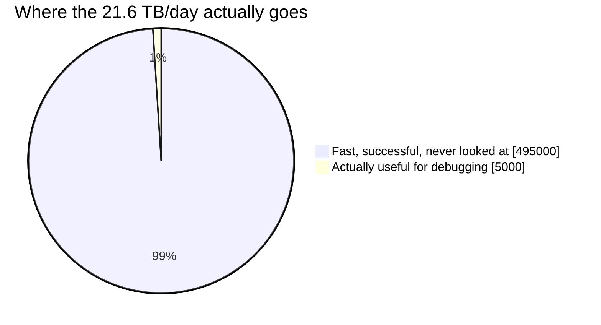

### Do we need to keep all of it?

Almost all of it can go. The trick is deciding *which* slice to keep, without accidentally throwing away the very traces an engineer will need six hours from now, when the next incident happens.

### The fix — and a new analogy

**Sampling**: keep only a fraction of traces, and discard the rest before they ever hit long-term storage.

The simplest version is **head-based sampling**. It makes the keep-or-discard decision **the instant the request starts** — usually with a fixed random chance (say, 1%) — before anyone knows how the request is going to turn out.

**Analogy:** think of it as **buying a single random raffle ticket the moment you walk into the building**. You find out whether you "won" (get recorded) before you've even done anything, purely by chance.

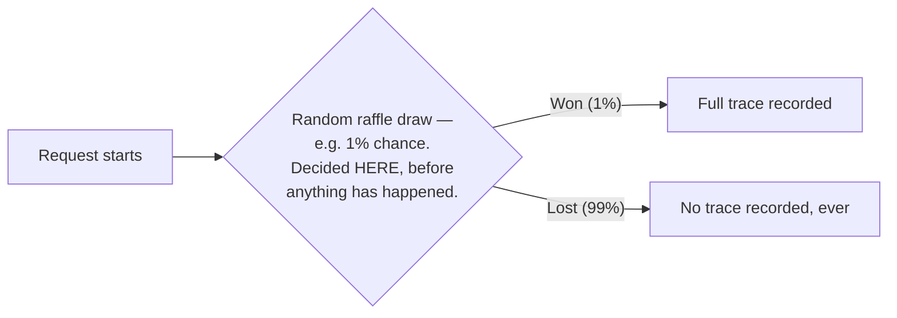

### The immediate payoff

Fernway ships head-based sampling at 1%. Storage drops:

- From **21.6 TB/day**
- To roughly **216 GB/day**

That's two orders of magnitude cheaper, immediately.

### New problem — discovered during the very next real incident

A payment-provider outage causes a spike of checkout failures — genuinely the exact kind of event tracing exists to help debug.

An engineer goes looking for a detailed trace of one of the failed requests. Here's what actually happened:

- The incident lasted ten minutes.
- Roughly **4,000 checkouts failed** during that window.
- The 1% random raffle happened to keep detailed traces for about **40** of them `[illustrative — following straight from the 1% rate]`.

But here's the catch: every single one of those 40 could just as easily have been a normal, unrelated, successful request. Why? Because the raffle ticket was drawn *before* anyone knew this request was going to fail.

It's pure luck whether any of the 40 "won" tickets actually landed on one of the *interesting* failing requests — as opposed to on the thousands of boring successful ones happening at the exact same time.

### How I'd say this in an interview

"Recording every span for every request is a storage-cost problem before it's anything else — tens of terabytes a day at real production volume, and the overwhelming majority of that is boring, successful requests nobody will ever query. Head-based sampling, deciding randomly at the start, fixes the cost immediately. But the decision is made before the outcome is known, so it has exactly as much chance of keeping a boring request as an interesting one."

---

## Chapter 6 — The raffle ticket that doesn't know it's about to matter

### A concrete example

Let's make the actual flaw concrete with one specific request: `order_88213`.

- This checkout is about to time out talking to the fraud-check service.
- It will take **4 seconds** instead of the usual 300ms.
- It will ultimately **fail**.

Here's the sequence, step by step:

1. `order_88213` starts. Under head-based sampling, the raffle draw happens at the very first line of code.
2. At that moment, the fraud-check call hasn't even been dialed yet.
3. `order_88213` looks exactly like every other checkout request Fernway has ever seen: a 1% chance, no better, no worse, of being kept.
4. The draw happens. 99% of the time, it loses.
5. The request proceeds normally — it times out after 4 seconds, and it fails.
6. Because it lost the draw at step 4, **no trace exists** for it.

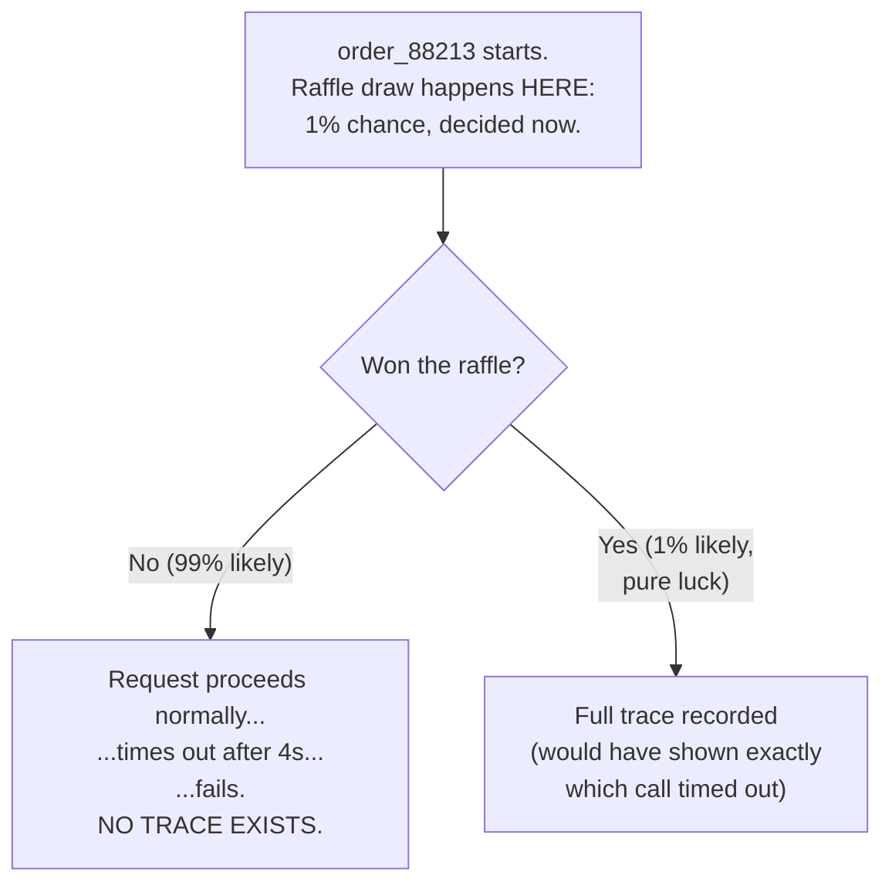

### The core insight

The request that most needs a detailed trace — the rare, slow, failing one — is *exactly as likely* to be discarded as the millions of ordinary ones happening around it. That's precisely *because* it's rare, and rare things don't get special treatment from a coin flip that doesn't know they're rare.

This is the single biggest, most commonly half-understood point about sampling, so it's worth stating flatly:

> **A random sample systematically under-represents the traces you actually want — by design, not by bad luck.**

### The obvious next question

Can the sampling decision instead wait until we actually know whether the request turned out to be interesting?

Yes — but that requires holding onto the request's spans *somewhere*, in a not-yet-committed state, for the whole duration of the request. That way, by the time the decision gets made, there's something real to decide about.

### How I'd say this in an interview

"The flaw in head-based sampling isn't a subtle edge case — it's the whole mechanism working exactly as designed. Deciding before the outcome is known means the decision literally cannot use the one signal that actually matters: was this request interesting. Fixing that means moving the decision to the *end* of the request instead of the start."

---

## Chapter 7 — Deciding after you already know how the story ends

### The fix — tail-based sampling

Instead of deciding at the start:

1. **Buffer every span** for a trace in a temporary holding area — not yet written to permanent storage.
2. Wait until the request actually **completes**.
3. Only then, once the outcome is known (did it error? was it slow? was it an unusual path?), make the keep-or-discard decision.

This is the real design **Uber's Jaeger** was specifically built to support well — precisely because Uber's own trip-request traffic has the exact same "the interesting ones are rare, and by definition unknown in advance" problem Fernway just discovered.

### The analogy

Replacing the raffle now that the decision has moved: think of it as an **insurance claims adjuster who watches the whole incident happen before deciding what to file**, instead of a raffle ticket handed out at the door before anyone's done anything.

Nothing gets thrown away *during* the event — every detail is held onto, provisionally. Only once the event is actually over does the adjuster decide: "this one's worth keeping a full record of," or "this one was routine, discard the file."

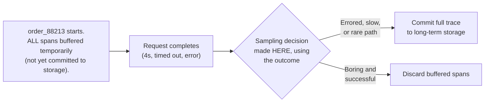

### Redoing `order_88213` under this model

1. Its spans sit buffered in a local **agent/sidecar** the whole time it's running.
2. The request finishes 4 seconds later, having errored.
3. The tail-based sampler looks at the outcome: errored, and 4,000ms versus a normal 300ms.
4. The trace is **guaranteed** to be kept — not a 1% coin flip away from being kept.

The engineer investigating the payment-provider incident from Chapter 5 now has a full, real trace of exactly which downstream call timed out — every time this happens, not by luck.

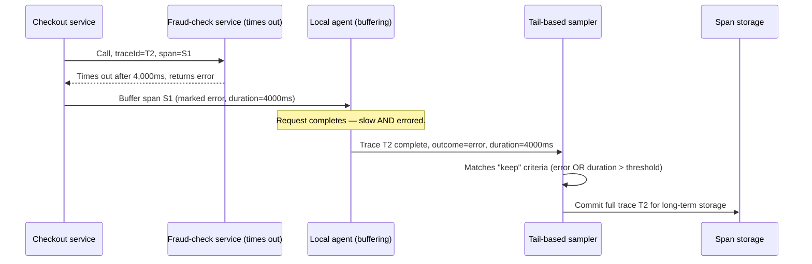

### New problem — an honest resource cost, not a bug

To make this decision at all, the agent has to hold every in-flight trace's spans in memory (or a short-lived store) for the *entire* duration of the request. That's not just the ones that end up kept — it's **all** of them, including the boring successful ones that will get thrown away seconds later.

That's a real, ongoing resource cost head-based sampling never had, because head-based sampling never had to remember anything past the initial coin flip.

### How I'd say this in an interview

"Tail-based sampling buffers every trace's spans until the request completes, then decides using the actual outcome — error, latency, rare path — which is exactly why Jaeger was built to support it well. It guarantees the traces you'd want most actually survive, instead of leaving that to a coin flip. The cost is real: you're holding state for every concurrently in-flight request, not just the ones you end up keeping."

---

## Chapter 8 — The claims adjuster who also has to leave sometime

### Problem one — the agent restart

A second problem with the insurance-adjuster model shows up during a deploy.

1. The local agent is buffering spans for a batch of in-flight traces.
2. It gets restarted mid-deploy.
3. Every trace it was holding — including some that were on their way to a slow, erroring outcome — disappears with it.
4. Why? Because none of that buffered data had been committed anywhere durable yet.

The whole point of tail-based sampling was to guarantee the interesting traces survive. A mid-flight agent restart just quietly broke that guarantee for whatever happened to be in-flight at that exact moment.

### Problem two — the request that never ends

There's a subtler version of the same problem: a request that hangs forever — say, stuck waiting on a downstream call that never returns.

That request never "completes" in the normal sense. So the buffering agent, following the model literally, would hold that trace's spans **indefinitely**, waiting for an ending that may never come.

### The fix

Bound the buffering window with a hard **timeout**.

- If a trace hasn't completed within, say, **30 seconds** `[illustrative]`, force a sampling decision anyway, using whatever's known so far.
- A trace that's been running for 30 seconds without finishing is itself a strong "keep this" signal.

And accept, honestly: an agent crash mid-buffer is a real, permanent loss of whatever it was holding. The fix for that isn't "never lose anything" — it's "never let a single stuck request hold buffering state forever," which at least bounds how bad any one incident can be.

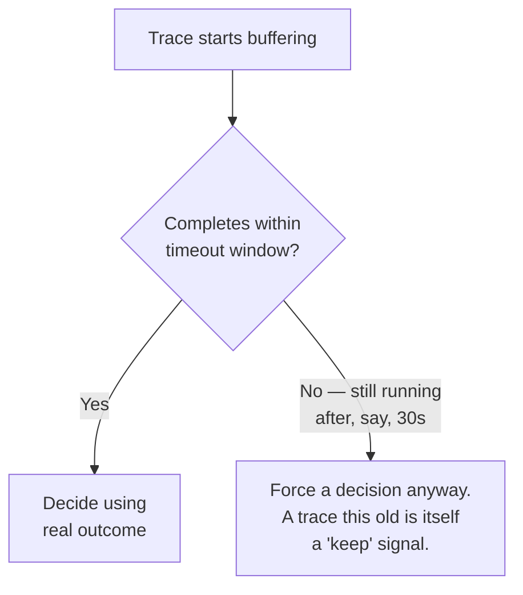

### New problem, once tail-based sampling is fully in place

Tail-based sampling is very good at catching errors and slow requests. But it's not the *only* thing tracing needs to be good for.

Someone asks: *"What does a normal, healthy trace even look like, so we'd notice if normal itself started drifting?"*

Tail-based sampling's keep-criteria are all about catching the *unusual*. It has no reason to ever keep a completely ordinary, fast, successful trace — so Fernway has zero baseline data to compare against.

### The fix

Run **both** mechanisms side by side:

- A small, fixed random baseline (head-based, maybe 0.1%)
- **Plus** outcome-aware tail-based retention layered on top

The random baseline isn't there to catch problems. It exists purely to establish what "normal" looks like — so a problem that doesn't announce itself as an obvious error or latency spike still has something to be compared against.

### How I'd say this in an interview

"Tail-based sampling needs two extra pieces to be production-safe: a timeout that forces a decision on a trace that never cleanly completes, and a small random baseline sample layered alongside it, purely to know what a normal trace looks like. Neither of those shows up if you only think about the happy path, where every request finishes and every interesting trace is obviously interesting."

---

## Chapter 9 — Finding one needle, fast, in a much smaller haystack

### Where things stand

With sampling in place, Fernway's stored trace volume has dropped from 21.6 TB/day to a small, disproportionately-useful slice.

Now: how should that data actually be stored and queried?

### The dominant use case

Watched over and over during incidents, the real-world query pattern is depressingly simple:

1. An alert or a customer complaint gives an engineer a rough time window.
2. Sometimes there's even a specific trace ID, pulled straight out of a log line.
3. From there, the question is always the same: **"Give me the entire tree for this one trace ID."**

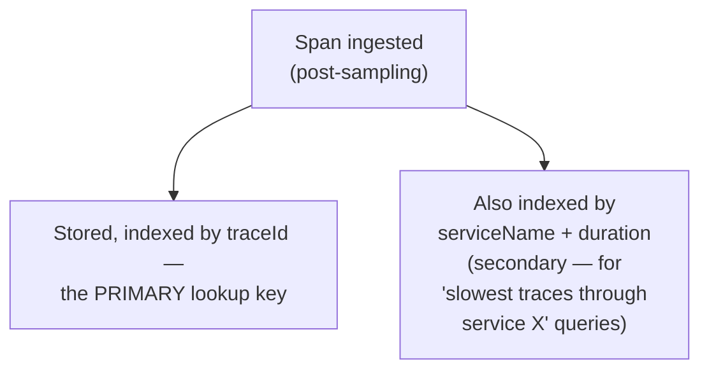

### How Fernway optimizes storage

- **Trace ID is the primary index**, tuned for the fastest possible single-key point lookup — because that's the query an engineer runs in the middle of an active incident, watching the clock.
- Broader queries — "show me the slowest traces through the fraud-check service in the last hour" — are real and useful, but secondary. They can tolerate a less aggressively optimized index than the point-lookup path.

### One more deliberate choice — retention

Trace data is kept for a **short window — days, maybe two weeks** `[illustrative, consistent with how tracing is actually used]`. That's far shorter than Fernway's logs or metrics, which get kept for months.

Worth naming as a cost decision, not an oversight. The reasoning:

- Tracing's whole value is concentrated in debugging a *recent, specific* incident.
- Nobody goes looking for the individual trace of one checkout request from four months ago, the way they might pull up a metrics trend from four months ago.
- Short retention keeps storage cost bounded, on top of whatever sampling already saved.

### New problem — and it's not about storage or query speed at all

It shows up the first time someone actually stares hard at a rendered trace tree: a span from the fraud-check service appears, in the visualization, to have **started before its own parent span even began.**

That's not possible causally — a child call can't start before the call that made it. So either the tree-building logic has a bug, or something else entirely is going on.

### How I'd say this in an interview

"Optimize trace storage primarily for fast point lookup by trace ID — that's the query pattern that dominates real incident debugging — and keep retention deliberately short, days to a couple weeks, because tracing's value is concentrated in recent, specific incidents, not long-term trend analysis the way metrics are used."

---

## Chapter 10 — The clock that lies by a few milliseconds

### The investigation

The investigation into the "child started before its parent" mystery turns up the real cause:

- The **parent** span's timestamp was recorded by the checkout service's own host clock.
- The **child** span's timestamp was recorded by the fraud-check service's *different* host's clock.

Those two clocks are not perfectly synchronized. A few milliseconds of drift between any two machines' clocks is completely normal in a real fleet `[illustrative — small clock drift between hosts is a well-known, documented general phenomenon; the exact millisecond figure here is a stand-in]`.

### A worked example of how skew fools you

Walk through the numbers:

1. The fraud-check span genuinely started only **2ms** after its parent, in real wall-clock time.
2. The two hosts' clocks disagree by **5ms**.
3. The recorded timestamps make it *look* like the child started **3ms before** the parent (2ms − 5ms = −3ms).
4. But in real wall-clock time, the causal order was completely correct — parent first, child second.

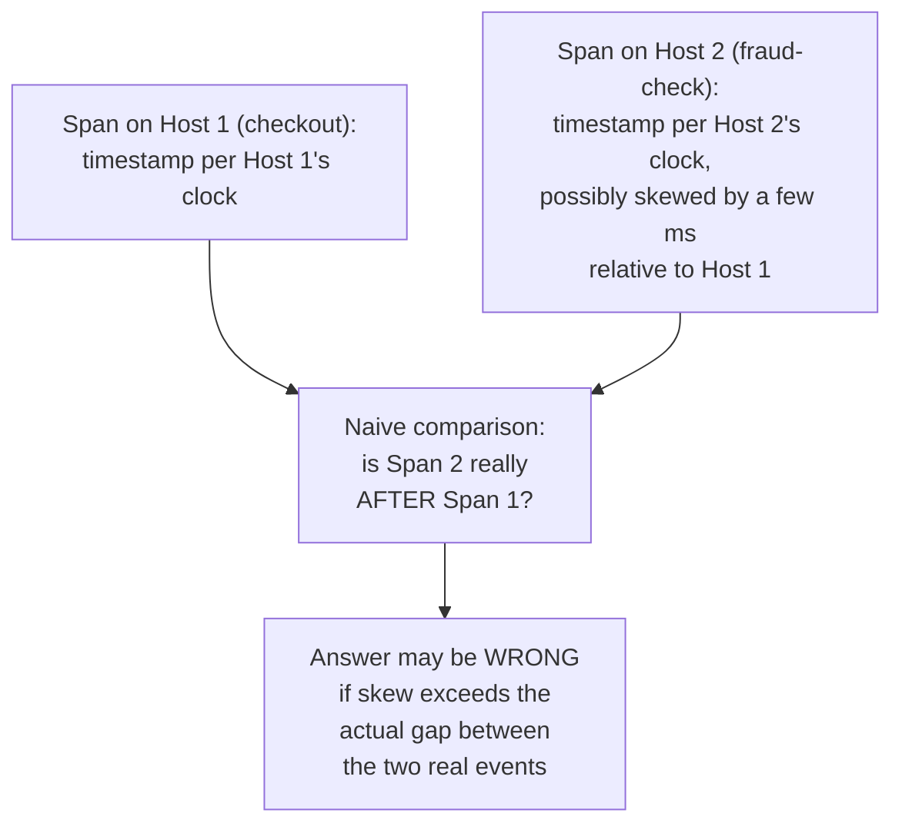

### Why this matters more in tracing than elsewhere

Tracing deals in very short spans. A few milliseconds is often the *entire duration* of a downstream call. So clock skew of a similar magnitude is enough to visibly scramble the apparent order of events — not just nudge them slightly.

### The fix

Stop trusting raw cross-host timestamps as the authority on ordering. Instead:

- The **explicit parent-child span relationship** — the same pointer from Chapter 2's family tree — is logical, not timestamp-derived.
- It's always correct, regardless of clock drift: a child span *is* a child span because the code that created it recorded that relationship directly, not because its timestamp happened to fall after its parent's.
- Where absolute duration genuinely matters, prefer measuring it *within a single host* wherever possible.
- Treat any comparison of raw timestamps *across* different hosts as approximate — useful for a rough sense of "around the same time," never as proof of exact ordering.

### How I'd say this in an interview

"Don't trust raw cross-host timestamps for fine-grained ordering — a few milliseconds of clock skew between machines is completely normal, and tracing deals in spans that are often only a few milliseconds long themselves. Skew that small can make a genuinely-correct sequence of events look scrambled in a visualization. The parent-child span relationship is explicit and logical, not timestamp-derived, which is why it's the authoritative source of causal order, not the clock."

---

## Where the story actually lands

```mermaid
flowchart LR
    A["Ch1: Flat correlation-ID<br/>log search<br/>(no causal shape)"] -->|"Fixes: one grep finds<br/>all log lines.<br/>Breaks: no parent-child tree."| B["Ch2: Trace ID + span ID<br/>+ parent pointer"]
    B -->|"Fixes: causal tree exists.<br/>Breaks: nothing carries it<br/>across the network."| C["Ch3: traceparent<br/>header propagation"]
    C -->|"Fixes: sync calls propagate.<br/>Breaks: queues + third<br/>parties drop the baton."| D["Ch4: Context on<br/>message metadata"]
    D -->|"Fixes: async hops covered.<br/>Breaks: recording everything<br/>is tens of TB/day."| E["Ch5: Head-based<br/>sampling"]
    E -->|"Fixes: storage cost.<br/>Breaks: decides before<br/>outcome is known."| F["Ch6: The flaw,<br/>made concrete"]
    F -->|"Fixes: nothing yet —<br/>just names the problem."| G["Ch7: Tail-based<br/>sampling"]
    G -->|"Fixes: keeps the traces<br/>that matter.<br/>Breaks: buffering cost,<br/>stuck/crashed traces."| H["Ch8: Timeout +<br/>random baseline"]
    H -->|"Fixes: bounded, has a<br/>normal-traffic baseline.<br/>Breaks: how do we<br/>store/query this?"| I["Ch9: Index by<br/>trace ID, short retention"]
    I -->|"Fixes: fast point lookup.<br/>Breaks: cross-host<br/>timestamps lie."| J["Ch10: Parent-child<br/>over raw timestamps"]
```

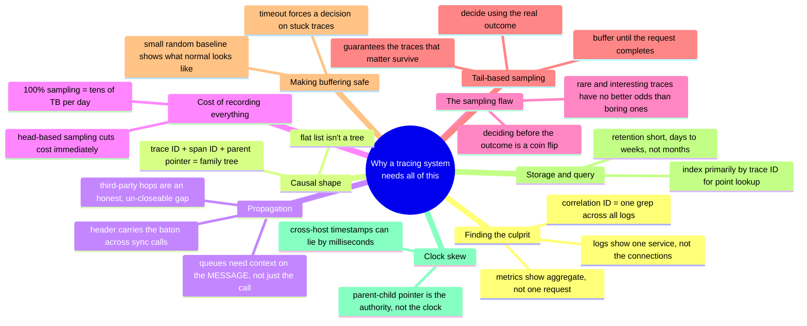

### When to stop walking this chain

Every real production tracing system you'll design in an interview sits *somewhere* on this chain. The skill isn't reciting all ten chapters — it's stopping where the stated requirements say to stop.

- A system where the interviewer only cares about "how do you know which service is slow" might reasonably stop around Chapter 4.
- A system that explicitly says "we can't afford to record everything" has to reach Chapters 7 and 8.
- If nobody's raised sampling cost at all, walking all the way to tail-based sampling unprompted reads as padding, not depth.

---

## Grill me — adversarial follow-ups

**Q1: "Why not just make every service log with a shared correlation ID and call that done — why do you need spans and a whole tree model?"**

A correlation ID gets you "these log lines all belong to the same request," which is genuinely useful and cheap. But it doesn't tell you which call was *inside* which other call, or how long any one hop actually took relative to its siblings. For that you need an explicit parent-child structure — which is what a span's parent-span-ID field gives you that a flat log tag never can.

**Q2: "Isn't propagating a trace header on every single call just extra latency you're adding to every request?"**

It's a tiny, fixed amount of overhead — attaching a short header value costs microseconds, not milliseconds. That's a hard requirement, precisely so tracing itself never becomes a meaningful fraction of the latency it's trying to help diagnose. The actual expensive part of tracing is never the header — it's what you do with the resulting spans afterward: storage and sampling.

**Q3: "You said async/queue hops need context in the message metadata — what if the queue technology itself doesn't support custom message metadata?"**

Then you're stuck with an honest gap, the same category as the third-party-vendor case. You either:
- fall back to logging the trace ID inside the message payload itself as a workaround, or
- accept that trace stops at the queue boundary and picks back up (as a new, disconnected trace) on the other side.

Naming that limitation directly is better than pretending propagation "just works" everywhere.

**Q4: "Why not just record 100% of traces but only for a short retention window, instead of sampling at all?"**

Retention window controls how long you *keep* data, not how much you *generate and ingest* in the first place. Even a one-day retention window at 21.6 TB/day is still 21.6 TB you had to write, index, and pay to store for that day. Sampling and retention solve two different axes of the same cost problem — you generally want both, not one instead of the other.

**Q5: "If tail-based sampling is so much better, why would anyone still use head-based sampling at all?"**

Head-based sampling is dramatically simpler to build and operate: decide once, propagate the decision, no buffering, no per-host memory pressure holding every in-flight trace. It's also still useful as a small random baseline layered underneath tail-based sampling — specifically to capture what normal traffic looks like, which tail-based sampling's outcome-driven criteria will never keep on their own.

**Q6: "What actually happens to a trace if the tail-based sampler decides to discard it — is that data recoverable later if we change our mind?"**

No — once discarded, it's gone. That's the entire point of not paying storage cost for it. That's exactly why the timeout-bounded buffering window and the keep-criteria need to be tuned thoughtfully and revisited after postmortems — because a discard decision, unlike a database delete, has no undo.

**Q7: "Doesn't buffering every in-flight trace for tail-based sampling become a huge memory problem under a traffic spike?"**

Yes, and it's a real, named cost. The buffering load scales with concurrent in-flight requests, not with the eventual sampling rate. So a traffic spike (or an incident causing lots of slow requests to all be in-flight at once) directly increases memory pressure on the buffering agents at the worst possible time. The mitigation is bounding the buffer window with a timeout, and — during extreme spikes — being willing to further sub-sample even the "interesting" bucket, rather than let buffering itself become the next outage.

**Q8: "Why is trace ID the primary index instead of, say, service name or timestamp?"**

Because the dominant real query, over and over, is: "I already have (or can quickly get) a trace ID from a log line or an alert — show me its whole tree." That's a single-key point lookup. Service-name-and-duration queries, like "slowest traces through service X today," are valuable but secondary. The schema should be optimized for the query that happens during every single active incident, not the one that happens occasionally during a retro.

**Q9: "If clock skew makes cross-host timestamps unreliable, how do you even display a trace's total duration accurately?"**

The trace's overall duration is anchored to the root span, measured entirely on one host's clock — so it doesn't have a skew problem by itself. It's specifically *comparing timestamps between two different spans that ran on two different hosts* — "did this child really start after its parent" — where skew becomes a real, visible risk. That's why the parent-child pointer, not the timestamp, is treated as authoritative for ordering.

**Q10: "Given this whole story, if someone just says 'design a distributed tracing system' cold, where do you start?"**

Say the one-sentence framing first: tracing exists to reconstruct one request's causal path across services, which metrics and logs each can't do alone. Then immediately flag that the two genuinely hard problems are:

1. propagation coverage across every hop (including ones you don't control), and
2. sampling.

Walk forward into whichever one the interviewer leans into, and use the other as your "here's the other hard problem" close if time allows.

---

## Cheat sheet — one line per stop on the story

- **Correlation ID in logs**: one shared ID per request turns a manual cross-service log search into one grep — but a flat list of tagged lines still isn't a causal tree.
- **Trace ID + span ID + parent pointer**: the model Dapper (2010) introduced — turns a flat list into a navigable, causal family tree of exactly which call happened inside which other call.
- **traceparent header propagation**: the trace ID and current span ID ride on every outbound call, W3C/OpenTelemetry-standardized — the mechanism is simple, coverage across every hop is the hard part.
- **Message-metadata propagation for async hops**: a queue-based hop needs trace context attached to the message itself, or the consumer silently starts a disconnected new trace.
- **Third-party/uninstrumented hops**: an honest, un-closeable gap — you don't control that code, so the trace ends at the boundary.
- **100% sampling cost**: tens of terabytes per day at real production QPS — a storage-cost problem before it's anything else, and a load-bearing design decision from day one.
- **Head-based sampling**: decide randomly at the request's START — cheap and simple, but the decision can't use the outcome, so rare/interesting requests get no better odds than boring ones.
- **The sampling flaw, stated flatly**: a random coin flip that doesn't know a request is about to be interesting will, by design, usually miss it — not by bad luck, by construction.
- **Tail-based sampling**: buffer every trace's spans until it completes, then decide using the real outcome (error/slow/rare) — guarantees the traces that matter actually survive, at the cost of holding state for every in-flight request.
- **Bounding the buffer**: a timeout forces a decision on a trace that never cleanly completes, and a small random baseline (layered alongside tail-based) preserves a sense of what "normal" looks like.
- **Storage & query**: index primarily by trace ID for fast point lookup (the dominant real query), secondarily by service/duration; keep retention short — days to weeks, not months — since tracing's value is recent-incident debugging, not long-term trend analysis.
- **Clock skew**: cross-host timestamps can disagree by milliseconds, which is enough to scramble ordering at the granularity tracing operates at — trust the explicit parent-child pointer, never the raw clock, for causal order.
- **The meta-lesson**: every fix in this story buys one property (searchability, causal structure, propagation coverage, storage cost control, outcome-aware retention, buffering safety, query speed, or correct ordering) by spending a different one — say the trade in the same sentence you propose the fix.
