# Design a Distributed Tracing System (Jaeger/Zipkin-style) — FAANG Interview Guide

> Source chapter type: observability infrastructure. Distinct from
> [Distributed Monitoring](./13-Distributed-Monitoring-FAANG-Guide.md) (metrics — aggregate
> numbers over time, no notion of an individual request) and
> [Distributed Logging](./22-Distributed-Logging-FAANG-Guide.md) (unstructured or semi-structured
> per-event text, not stitched into a causal chain) — this chapter is specifically about
> reconstructing **the causal path of one single request as it crosses dozens of services**, and
> deciding **which requests to keep a full record of** when recording every single one is too
> expensive.

## Mental model

A single user-facing request to a modern service fans out into dozens of internal calls across
microservices — and when that request is slow or errors, "which of those forty downstream calls
was the actual problem" is unanswerable from metrics (which show aggregate latency, not this
one request's path) or from logs (which show what happened in one service, not how it connects to
what happened in the next one). Distributed tracing exists to answer exactly that question by
stitching every service's contribution to one request into a single, ordered, causal tree — a
**trace**, made of **spans**, one per unit of work.

Two genuinely hard problems, not the trace data model itself (which is mostly bookkeeping):

1. **Propagating trace context across every service boundary**, including ones you don't control
   the code of — every hop has to pass along the identifiers that let the next hop know "you're
   still part of trace X, and you're span Y's child," or the chain breaks and reconstructing the
   full picture becomes impossible.
2. **Sampling.** Recording a full, detailed trace for every single request at real production
   volume is enormously expensive — but the request you most want a detailed trace for (a rare,
   slow, or erroring one) is exactly the one a naive random sample is most likely to miss, because
   it's rare by definition.

**The one sentence to say out loud:** *"Tracing is two problems: getting a trace/span ID to
survive every hop across services you don't all control the code of, and deciding which requests
are worth paying the cost of recording in full — and the smart way to decide that second problem
is to decide it at the END of the request, not the beginning."*

**The one picture to remember forever:**

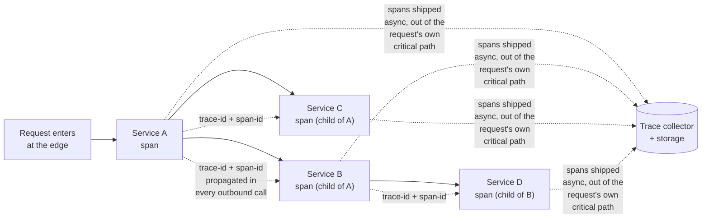

**Memory hook:** *"Every span carries its trace ID and its parent's span ID forward — that's the
whole propagation mechanism. Everything else in this chapter is about doing that cheaply at scale
and deciding which traces are worth keeping."*

---

## Table of contents
[How to Identify This Topic](#how-to-identify-this-topic-in-an-interview) ·
[Interview Playbook](#interview-playbook) · [Requirements](#requirements-clarification) ·
[Capacity Estimation](#capacity-estimation-worked) · [API Design](#api-design) ·
[High-Level Architecture](#high-level-architecture) ·
[Architecture Evolution v1→v2→v3](#architecture-evolution-v1--v2--v3) ·
[End-to-End Walkthroughs](#end-to-end-request-walkthroughs) ·
[Deep Dive: Trace-Context Propagation](#deep-dive-trace-context-propagation) ·
[Deep Dive: Head-Based vs. Tail-Based Sampling](#deep-dive-head-based-vs-tail-based-sampling) ·
[Deep Dive: Span Storage & Query](#deep-dive-span-storage--query) ·
[Deep Dive: Clock Skew Across Hosts](#deep-dive-clock-skew-across-hosts) ·
[Data Model](#data-model) · [Failure Modes](#failure-modes--mitigations) ·
[Non-Functional Walkthrough](#non-functional-walkthrough) ·
[Security & Compliance](#security--compliance) · [Cost & Trade-offs](#cost--trade-offs) ·
[Wrap-Up](#wrap-up-mvp-vs-stretch) · [Golden Rules](#golden-rules) ·
[Cheat Sheet](#master-cheat-sheet)

---

## How to identify this topic in an interview

- "Design a distributed tracing system (like Jaeger, Zipkin, or X-Ray)."
- The tell that separates this from metrics/logging chapters: the interviewer specifically wants
  **per-request causal path reconstruction across service boundaries**, not aggregate numbers or
  per-service event text.
- A follow-up like "recording every request is too expensive, how do you decide what to keep" is
  the [sampling deep dive](#deep-dive-head-based-vs-tail-based-sampling) — the single most-tested
  mechanism in this chapter, and the one most candidates only get half right (head-based only).

---

## Interview playbook

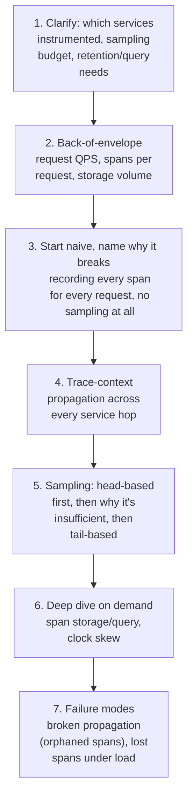

**What the interviewer is actually grading at each step:**
- Step 3: do you recognize, unprompted, that 100% sampling at real production QPS is a storage
  and processing cost problem long before it's a useful-signal problem?
- Step 5: do you know *why* head-based sampling (deciding at the start of a request) systematically
  misses the rare-slow-or-erroring requests you most want, and can you propose tail-based sampling
  (deciding after the request completes, once you know if it was interesting) as the fix?
- Step 6: do you know that span timestamps from different hosts aren't directly comparable without
  accounting for clock skew, and can name at least one practical mitigation?

---

## Requirements clarification

### Functional

| # | Requirement | Notes |
|---|---|---|
| F1 | Every service in a request's call path emits spans tagged with a shared trace ID and parent-span relationships | The core instrumentation requirement |
| F2 | Reconstruct and visualize the full causal tree for a given trace ID | The primary debugging use case |
| F3 | Sample intelligently — keep a detailed record of a useful subset of traces, not all of them | Cost requirement, not optional at real scale |
| F4 | Preferentially retain "interesting" traces — errors, high latency, rare paths | The whole point of smart sampling |
| F5 | Correlate a trace with logs/metrics from the same request where possible | Ties tracing into the broader observability stack |

### Non-functional

| Requirement | Target | Why this number |
|---|---|---|
| Instrumentation overhead per request | Very low — microseconds of added latency per span, not milliseconds | Tracing must not become a meaningful fraction of the very latency it's trying to help diagnose |
| Span delivery | Asynchronous, out of the request's own critical path | A trace collector being slow or down must never slow down or fail the actual request being traced |
| Sampling decision quality | Must retain a disproportionately high share of erroring/slow traces relative to their share of total traffic | The entire value proposition — see the sampling deep dive |
| Query latency for "find trace by ID" | Fast, seconds at most | The primary interactive debugging workflow |
| Retention | Bounded (days to a couple of weeks is typical), far shorter than logs/metrics | Trace data volume at full detail is large; long retention at scale is a real cost trade-off, not usually justified by how tracing is actually used (recent-incident debugging) |

**Clarifying questions worth asking the interviewer up front — and what each answer changes:**

| Question | If the answer is... | ...then this changes |
|---|---|---|
| "Is 100% of services instrumented, or partial coverage?" | Partial, rolling out gradually | Confirms the design must tolerate "gaps" in a trace (an uninstrumented hop) gracefully, not assume complete coverage |
| "What sampling budget/cost constraint exists?" | A hard cap, e.g. store detailed traces for only ~1% of requests | Directly sizes the sampling mechanism and argues strongly for tail-based sampling to make that 1% count |
| "Do we need cross-service context propagation to work through async/queue-based hops, not just synchronous RPC?" | Yes | Confirms trace context must be attached to queue messages too, not just HTTP/RPC headers — a commonly missed extension |
| "What's the primary use case — ad hoc debugging, or also automated anomaly detection on trace data?" | Primarily ad hoc debugging | Confirms query-by-trace-ID and service-latency breakdowns are the priority over building trace-based automated alerting |

**Say this out loud in the interview:** *"The instrumentation and propagation mechanism is mostly
bookkeeping — the genuinely hard design decision is sampling, and I want to design that so the
system decides what to keep AFTER a request completes, once it actually knows whether that
request was interesting, not before."*

---

## Capacity estimation, worked

```
Given (illustrative, a mid-size microservices platform):
  Requests entering the system per day        = 500,000,000
  Peak request QPS                             = 500,000,000 / 86,400 ~= 5,800 average,
                                                   say ~20,000 QPS at peak
  Average spans per request (fan-out across
    microservices)                              = 25

Span volume at 100% sampling (the naive baseline):
  Spans/sec at peak                              = 20,000 x 25 = 500,000 spans/sec
  Bytes per span (trace/span IDs, service name,
    operation name, timestamps, tags)             ~= 500 bytes
  Ingest bandwidth at 100% sampling                = 500,000 x 500B ~= 250 MB/sec, ~21.6 TB/day
  -> a genuinely large, expensive number -- this is the concrete cost that makes "record
     everything" impractical and motivates sampling as a first-class design decision, not an
     afterthought.

At a realistic sampling budget (illustrative 1% overall, but skewed toward interesting traces):
  Spans/sec actually stored                       = 500,000 x 0.01 = 5,000 spans/sec
  Ingest bandwidth                                  = 5,000 x 500B = 2.5 MB/sec, ~216 GB/day
  -> two orders of magnitude cheaper, and per the sampling deep dive, a WELL-CHOSEN 1% (biased
     toward errors/slow requests) preserves almost all the debugging value that 100% sampling
     would have provided for the traces that actually matter.

Trace-lookup query load:
  "Find trace by ID" queries/day (engineers
    debugging incidents)                          = ~50,000
  -> tiny relative to ingest volume -- the query path is not the capacity bottleneck; storage
     and ingest at whatever sampling rate is chosen dominates the cost picture.
```

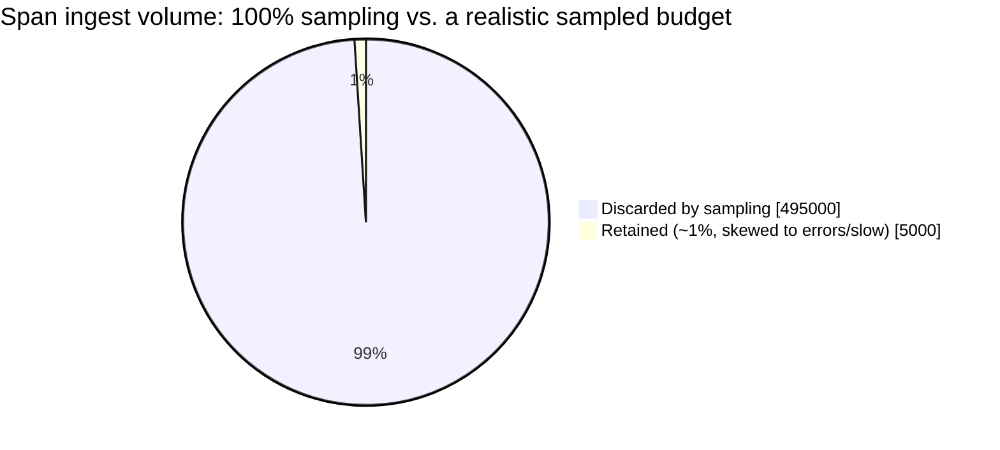

The retained slice is small, but per the tail-based sampling deep dive, it's disproportionately
the errors and slow requests that debugging actually needs — volume dropped is not value dropped.

**Redo-the-chain test:** if average spans per request doubles to 50 (a more deeply decomposed
microservices architecture), ingest bandwidth at any given sampling rate doubles proportionally —
a direct, computable cost of finer-grained service decomposition, worth naming if asked about the
trade-offs of microservices architecture more broadly.

**The number worth memorizing:** 100% sampling at real production QPS is typically tens of
terabytes per day of trace data — sampling isn't an optimization applied later, it's a load-bearing
design decision from the start.

---

## API design

### Trace context propagation (HTTP header, W3C `traceparent`-style)

```
traceparent: 00-4bf92f3577b34da6a3ce929d0e0e4736-00f067aa0ba902b7-01
             version-traceId--------------------spanId----------flags
```

Every outbound call from any instrumented service must include this header, generated fresh for
the outbound call's own span but carrying forward the same `traceId` and referencing the calling
span as parent — this one small header is the entirety of the propagation mechanism.

### `POST /v1/spans` (collector ingest, called async by instrumentation libraries)

```json
{
  "traceId": "4bf92f3577b34da6a3ce929d0e0e4736",
  "spanId": "00f067aa0ba902b7",
  "parentSpanId": "a1b2c3d4e5f60718",
  "serviceName": "checkout-service",
  "operationName": "processPayment",
  "startTime": "2026-07-24T18:00:00.123456Z",
  "durationMicros": 45200,
  "tags": { "http.status_code": 200 }
}
```

### `GET /v1/traces/{traceId}` (the primary debugging query)

Returns the full assembled span tree for that trace, ordered by parent/child relationships and
start time — the reconstructed causal path a human reads to debug an incident.

**The one sentence worth saying about the API surface:** *"Propagation is a small header carried
on every outbound call; ingest is asynchronous and out of the request's critical path; and the one
query that matters most is 'give me the whole tree for this trace ID; — everything else in the
API surface exists to make that one query fast and complete."*

---

## High-level architecture

### Architecture evolution (v1 → v2 → v3)

**v1 — no sampling, record every span, synchronous ingest:**

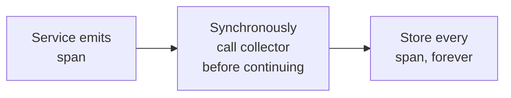

**Why it breaks:** synchronous ingest means a slow or down collector directly slows down or fails
the very requests tracing is supposed to help debug — the opposite of the "very low overhead"
requirement. And per the capacity estimate, storing every span at real QPS is tens of terabytes
per day, an unsustainable cost for the actual debugging value delivered (most requests are
unremarkable and never get looked at).

**v2 — async ingest, but naive head-based sampling only:**

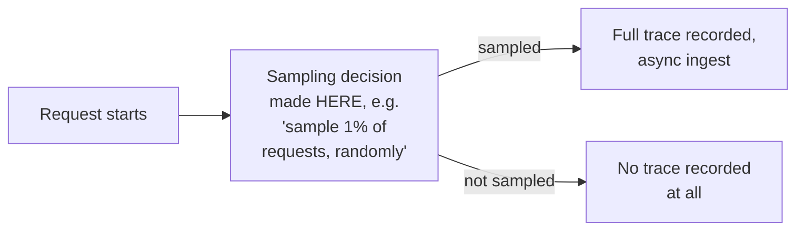

**Why it breaks:** deciding whether to sample *before the request has even happened* means the
decision can't use any information about how the request actually turned out — a rare, slow,
erroring request has exactly the same 1% chance of being sampled as a common, fast, successful one,
which means the traces you most want (the interesting ones) are systematically no more likely to
survive than any other request, despite being the entire point of tracing.

**v3 — the real system: async ingest + tail-based sampling:**

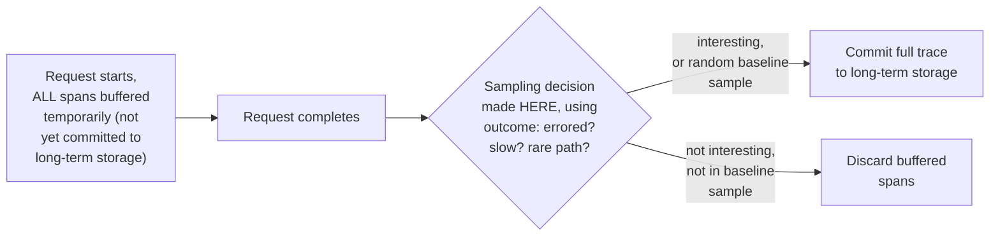

**What v3 fixes, one line each:** buffering all of a trace's spans until the request completes
means the sampling decision can see the actual outcome; tail-based sampling then preferentially
keeps errored, slow, or otherwise rare/interesting traces, dramatically improving the debugging
value of whatever fraction of traces the storage budget allows; and ingest remains fully async,
so the request's own latency is never affected by the collector.

---

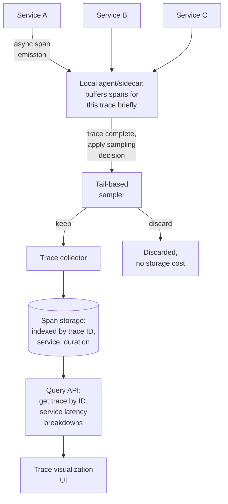

| Component | Role |
|---|---|
| Local agent/sidecar | Buffers a trace's spans locally (often per-host or per-service) until the trace completes or times out, enabling the sampling decision to see the outcome |
| Tail-based sampler | Applies the outcome-aware sampling policy (see the sampling deep dive) — the component that makes the retained sample disproportionately useful |
| Trace collector | Receives only the spans that survived sampling — this is the ingest-volume reduction that makes storage affordable |
| Span storage | Indexed by trace ID (point lookup), and by service/duration (for broader queries like "show me the slowest traces through service X today") |

---

## End-to-end request walkthroughs

### Walkthrough 1 — a normal, fast, successful request (not sampled)

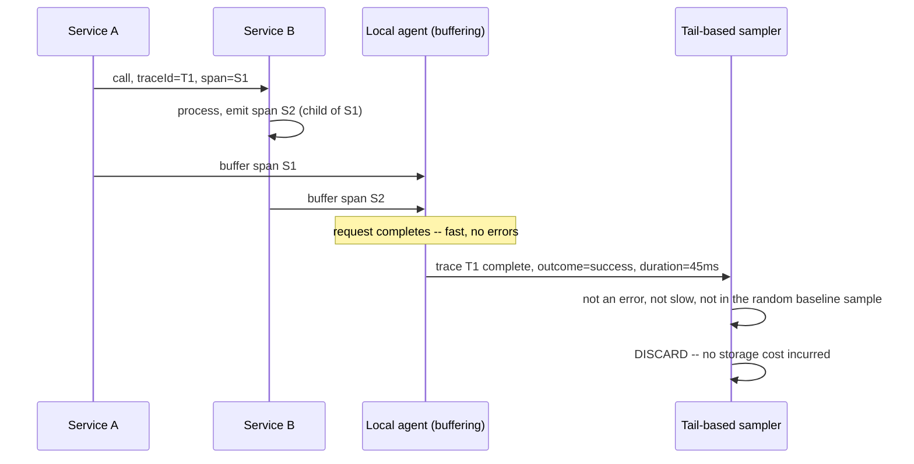

### Walkthrough 2 — a slow, erroring request (kept by tail-based sampling)

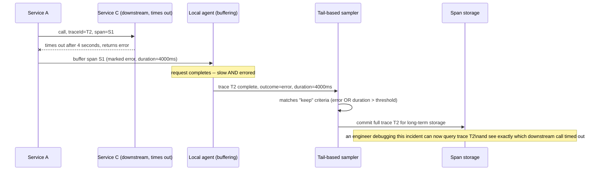

Walkthrough 2 is the entire value proposition of tail-based sampling made concrete — the trace
that matters most is the one guaranteed to survive, specifically *because* the decision was made
after the outcome was known.

### Walkthrough 3 — a missing propagation hop creates an orphaned span

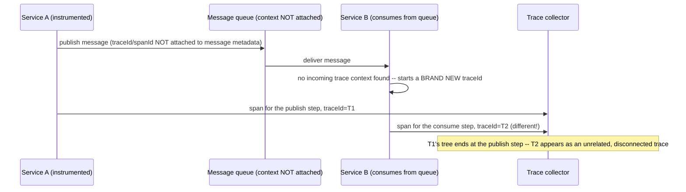

This is the concrete failure the [propagation deep dive](#deep-dive-trace-context-propagation)'s
"async/queue-based propagation" point warns about — a single missed hop silently splits one
logical request into two disconnected traces, with no error raised anywhere.

---

## Deep dive: trace-context propagation

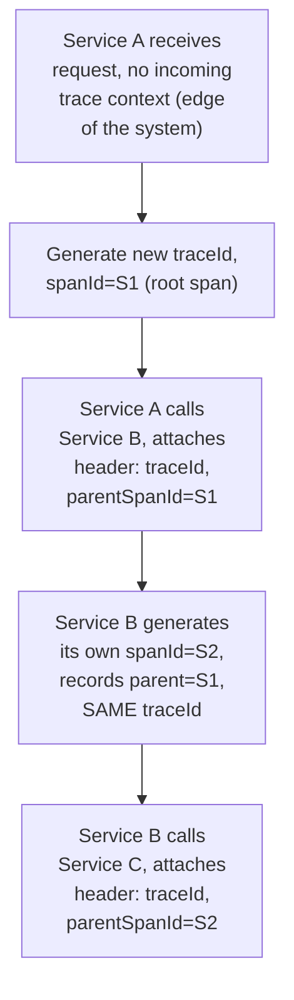

**Why this must work across every hop, including ones you don't control the code of:**
third-party libraries, message queues, and any service that doesn't natively support the tracing
library will break the chain if it doesn't forward the context header — this is why standardized
propagation formats (like W3C Trace Context) matter: they let context survive across
organizational and technology boundaries, not just within one team's own instrumented services.

**Async/queue-based propagation, the commonly-missed extension:** for a request that hands off
work to a message queue instead of a synchronous call, the trace context has to be attached to
the message itself (as metadata/headers on the queued message), and the consumer that eventually
processes it must extract that context and continue the same trace — otherwise, tracing silently
stops working the moment any part of the system goes through async messaging instead of direct
RPC, exactly the kind of gap worth naming unprompted.

**Interview cheat-sheet:** *"Propagation is a header (or message metadata, for async hops)
carrying traceId and the current span's ID forward on every outbound call — the hard part isn't
the mechanism itself, it's making sure every hop, including third-party libraries and queue-based
hops, actually forwards it."*

---

## Deep dive: head-based vs. tail-based sampling

The single most-tested mechanism in this chapter — already motivated in the architecture
evolution, restated here as the core trade-off.

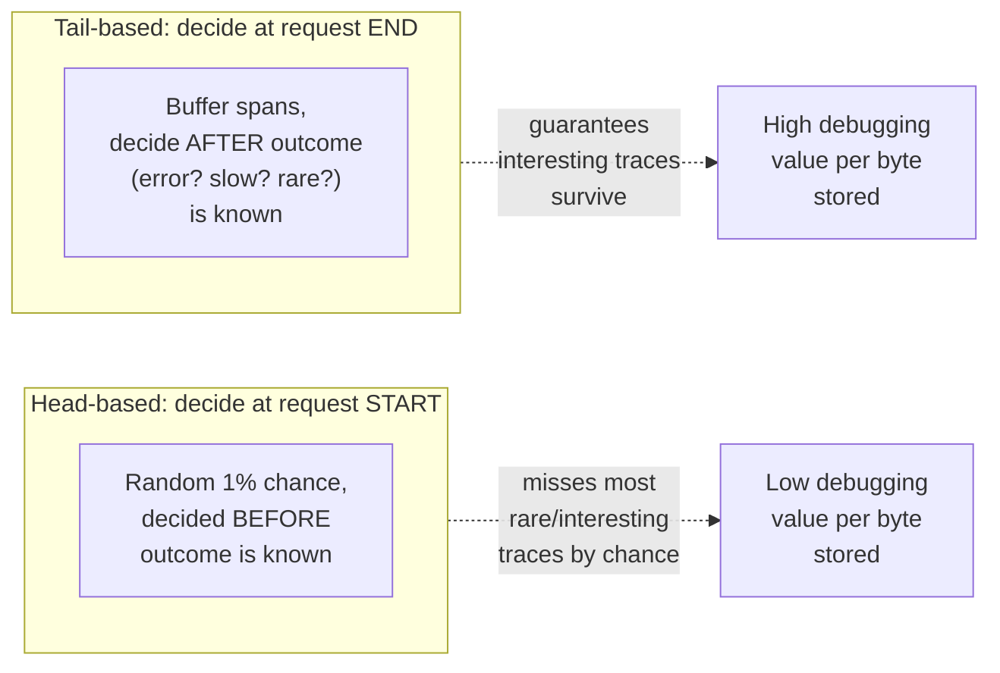

| | Head-based | Tail-based |
|---|---|---|
| Decision timing | Before the request runs | After the request completes |
| Can use outcome (error/latency)? | No | Yes |
| Implementation cost | Simple — decide once, propagate the decision | Requires buffering all spans until trace completion, more complex |
| Value of the retained sample | A random cross-section, mostly unremarkable | Disproportionately errors/slow/rare traces — exactly what's useful for debugging |

**Why not tail-based only, discarding head-based entirely?** A small baseline of randomly-sampled
"boring" traces is still valuable — for establishing what normal/healthy traces look like, and for
catching problems that don't manifest as an obvious error or latency spike. Production tracing
systems typically combine both: a small random baseline (head-based) plus outcome-aware retention
(tail-based) layered on top.

**The real implementation cost of tail-based sampling, worth naming honestly:** buffering every
in-flight trace's spans until completion requires holding state (memory, or a short-lived store)
for every concurrently in-flight request, not just the ones that end up sampled — this is a real
resource cost that head-based sampling doesn't have, and it's the trade-off being made for a much
higher-value retained sample.

**Interview cheat-sheet:** *"Head-based sampling decides before you know if a request was
interesting; tail-based decides after. Tail-based costs more (buffering every in-flight trace
until it completes) but is what actually makes a small sampling budget contain the traces you'd
want most — combine a small random baseline with outcome-aware tail-based retention, don't rely
on either alone."*

---

## Deep dive: span storage & query

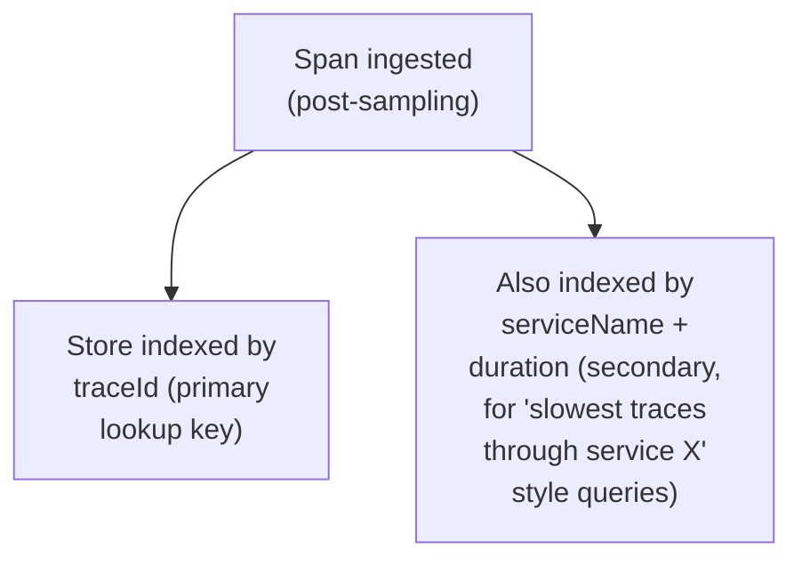

**Why traceId is the primary index and everything else is secondary:** the dominant real-world
query pattern is "an alert or a user report points to roughly when something went wrong; find the
specific trace ID (often already known from a log line or error report) and view its full tree" —
a point lookup by ID. Broader queries (find all slow traces through a given service in the last
hour) are valuable but secondary, and can tolerate a less optimized index than the primary
point-lookup path.

**Retention is deliberately short relative to logs/metrics** — per the requirements table, days to
a couple of weeks is typical, because tracing's primary use case (debugging a recent, specific
incident) rarely benefits from long historical retention the way trend-analysis metrics do; this
keeps storage cost bounded even before accounting for sampling.

**Interview cheat-sheet:** *"Optimize storage and indexing primarily for fast point lookup by trace
ID — that's the dominant real query pattern — and keep retention short relative to logs/metrics,
since tracing's value is concentrated in recent-incident debugging, not long-term trend analysis."*

---

## Deep dive: clock skew across hosts

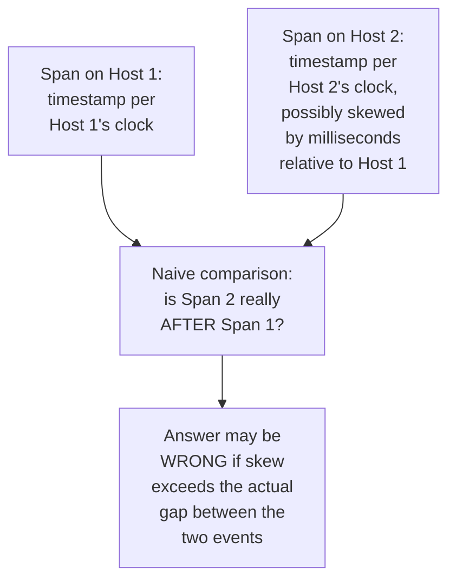

**Why this matters specifically for short-duration spans:** if two hosts' clocks differ by even a
few milliseconds and the spans being compared are themselves only a few milliseconds apart, clock
skew can make a child span appear to start before its parent, or make a causally-ordered sequence
of events look out of order when visualized — a real, visible artifact in trace visualization
tools if not accounted for.

**Practical mitigations worth naming:** rely on **parent-child span relationships** (which are
explicit, logical, and not timestamp-derived) as the authoritative source of ordering rather than
raw timestamps alone; where absolute timing matters, consider recording relative durations
measured within a single host wherever possible, and treat cross-host absolute-timestamp
comparisons as approximate, not authoritative.

**Interview cheat-sheet:** *"Don't trust raw cross-host timestamps for fine-grained ordering —
clock skew of a few milliseconds is normal and can make a genuinely-ordered sequence look
scrambled. The explicit parent-child span relationship, not timestamp comparison, is the
authoritative source of causal ordering."*

---

## Data model

**Trace lifecycle** — the state machine behind the sampling deep dive:

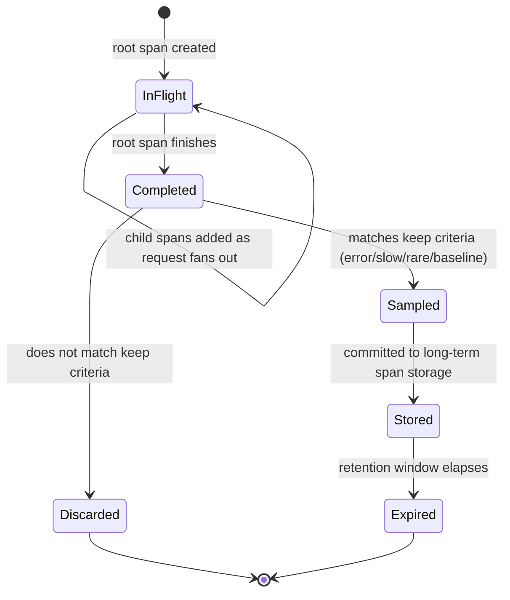

`InFlight` is the state tail-based sampling depends on existing at all — it's the buffering window
during which spans are held without yet being committed to long-term storage.

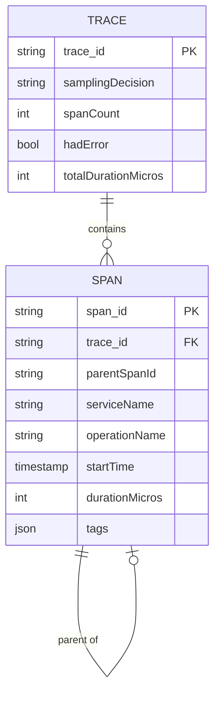

| Table | Storage choice & why |
|---|---|
| `Span` | High-write-throughput even post-sampling (per the capacity estimate, still thousands/sec), indexed primarily by `trace_id` for point lookup, secondarily by `serviceName`/`durationMicros` for broader queries |
| `Trace` | A lightweight rollup record per trace (summary fields like `hadError`, `totalDurationMicros`) making the sampling decision and high-level queries cheap without always reading every individual span |

---

## Failure modes & mitigations

| Failure mode | Impact | Mitigation |
|---|---|---|
| **A service in the call path doesn't propagate trace context** (missing instrumentation, third-party library) | The trace tree has a gap — a whole subtree of downstream calls appears disconnected/orphaned | Detect and surface orphaned spans (spans with a traceId but no resolvable parent) rather than silently dropping them — an incomplete trace is still more useful than no trace, if visibly flagged as incomplete |
| **Local agent buffering a trace crashes or restarts before the trace completes** | That trace's buffered spans are lost, even if it would have been sampled | Bound the buffering window with a timeout (force a sampling decision after N seconds even if the trace hasn't "completed" cleanly) so a single stuck request doesn't hold state indefinitely, and accept some loss as a cost of the buffering approach rather than something to eliminate entirely |
| **Sampling under-collects a genuinely new class of failure** (an issue that doesn't manifest as an error or obvious latency spike) | Tail-based sampling's keep-criteria don't catch it, and it's also unlikely to appear in the small random baseline | Periodically review and expand sampling keep-criteria based on postmortems — sampling policy is a living configuration, not a one-time design decision |
| **Ingest volume spikes during an incident** (errors cause more traces to match keep-criteria simultaneously) | Collector/storage load spikes exactly when tracing is most needed | Rate-limit or further sub-sample even the "interesting" tail-based bucket during extreme spikes, prioritizing diversity of errored services over raw volume of any single repeated error pattern |

---

## Non-functional walkthrough

**Scaling ingest is bounded by the sampling rate, not raw request volume** — per the capacity
estimate, this is the entire reason sampling exists as a load-bearing design decision rather than
an afterthought.

**Availability of the tracing system must never affect the availability or latency of the traced
requests themselves** — spans are emitted asynchronously and the local agent/collector being slow
or down should be invisible to the actual request path, the same "never let an observability
system become a dependency of the thing it observes" principle as metrics and logging.

**Consistency is not a primary concern here** — a trace missing a span or two (from the failure
modes above) degrades debugging usefulness gracefully rather than being a correctness violation;
this system optimizes for "mostly complete, cheap, and fast" over "perfectly complete."

---

## Security & compliance

- **Span tags/metadata can inadvertently capture sensitive data** (a URL parameter, a header value)
  if instrumentation isn't careful about what it tags — the same data-minimization discipline as
  any logging system applies here.
- **Access control on trace data** — traces can reveal internal service topology and, depending on
  what's tagged, potentially sensitive request details; query access should be scoped
  appropriately, not open to anyone with general observability-tooling access by default.
- **Retention limits** double as both a cost control and a data-minimization practice — the
  deliberately short retention window (days to weeks) mentioned in the requirements also reduces
  how long any inadvertently-captured sensitive data persists.

---

## Cost & trade-offs

**Sampling rate trades storage/ingest cost directly for completeness of the debugging picture** —
per the capacity estimate, the difference between 100% and 1% sampling is roughly two orders of
magnitude in storage cost; tail-based sampling exists specifically to make a low sampling rate
still deliver most of the debugging value of a much higher one.

**Tail-based sampling trades implementation complexity and in-flight buffering resource cost for
a dramatically more useful retained sample** — worth stating as an explicit trade-off, since
head-based sampling is genuinely simpler to build and operate, just less valuable per byte stored.

---

## Wrap-up: MVP vs. stretch

**In scope for an MVP:**
- Trace-context propagation via a standard header format across synchronous service calls.
- Async span ingest with a simple head-based random sampling rate.
- Storage indexed by trace ID with a basic "get trace by ID" query API and visualization.

**Explicitly out of scope for an MVP:**
- Tail-based sampling — start with head-based (simpler to build), add the buffering/outcome-aware
  mechanism once the value of a smarter retained sample is clearly needed.
- Async/queue-based context propagation — start with synchronous RPC coverage, extend to
  message-queue hops once that gap is confirmed to matter for the services in scope.

**Stretch goals, worth naming if asked "what's next":**
1. **Tail-based sampling**, layered on top of a baseline head-based random sample.
2. **Automated anomaly detection on trace data** (e.g. flagging a service whose latency
   contribution to traces has crept up over time), moving beyond ad hoc human debugging.
3. **Cross-signal correlation** — one-click navigation from a trace to the corresponding logs and
   metrics for the same request/time window, unifying the three observability signal types.

---

## Golden rules

- **Propagation is a small piece of context (traceId + parent spanId) carried on every outbound
  call, including async/queue-based hops** — the hard part is coverage across every hop, not the
  mechanism itself.
- **100% sampling at real production scale is a storage-cost problem before it's anything else** —
  sampling is a load-bearing design decision from day one, not a later optimization.
- **Tail-based sampling (decide after the outcome is known) is what makes a small sampling budget
  contain the traces that actually matter** — head-based sampling alone systematically under-
  represents the rare, interesting cases tracing exists to catch.
- **Parent-child span relationships, not raw cross-host timestamps, are the authoritative source
  of causal ordering** — clock skew makes naive timestamp comparison unreliable at the
  granularity tracing operates at.
- **Never let the tracing system's own health affect the latency or availability of the requests
  it's observing** — ingest is always asynchronous and out of the critical path.

---

## Master cheat sheet

**One-liners:**
- Tracing reconstructs one request's causal path across services — distinct from metrics
  (aggregate numbers) and logs (per-service events with no cross-service causal link).
- Propagation is a header/message-metadata field carrying traceId and parent spanId forward on
  every hop — coverage across every hop, including async ones, is the hard part.
- 100% sampling at real scale costs tens of terabytes per day — sampling is load-bearing, not
  optional.
- Tail-based sampling (decide after the request completes, using its outcome) preserves far more
  debugging value per byte stored than head-based (decide before) sampling alone.
- Parent-child span relationships are the authoritative ordering signal, not raw cross-host
  timestamps, which are subject to clock skew.
- Span ingest is always asynchronous — the tracing system must never add latency or fragility to
  the requests it's observing.

**Formula chain:**
```
ingest_bandwidth      = request_QPS x avg_spans_per_request x bytes_per_span x sampling_rate
tail_based_buffer_load = concurrent_in_flight_requests   [regardless of eventual sampling outcome]
```

**Numbers:** 100% sampling at real production QPS is commonly tens of terabytes per day · a
realistic sampling budget (often ~1% or less, skewed toward errors/slow requests) cuts that by
roughly two orders of magnitude while preserving most debugging value · retention is typically
days to a couple of weeks, much shorter than logs or metrics.
