# Design Google Photos — The Story (narrative edition)

> **What this file is.**
> The reference file, `58-Design-Google-Photos-FAANG-Guide.md`, is the one to recite from. It has
> the requirements, the API shapes, every trade-off table, and the master cheat sheet.
>
> This file is a second way in. It's the same material, told as one continuous story, in plain
> language. A company keeps hitting a wall, patches it, and the patch itself creates the next
> wall — until the design lands on exactly what the reference file documents.
>
> The company, **Photoloom** (a photo-backup startup), is fictional. But every wall it hits, and
> every fix it reaches for, is something a real, named system actually does:
> - Google Photos' own May 2015 launch of ML-based content search
> - Microsoft's PhotoDNA perceptual-hashing technology
> - the real 2022 BIPA settlement over Google Photos' face-grouping feature
> - cloud storage tiers like AWS Glacier/S3 that real systems use for cold data
>
> I'll say clearly, every time, whether something is a documented fact or just a reasonable guess.
> Guesses are marked inline with `[illustrative]`.

**The trigger phrases** for this whole topic:
- *"design a cloud photo backup product,"*
- *"search my photos for X without me ever having tagged anything,"*
- *"users never delete anything — how do we not go broke on storage."*

Keep one sentence in your head as you read: **this is a blob store plus a CDN underneath, with
three product-specific problems bolted on top** — don't store the same photo twice, find things
in photos nobody described, and don't pay hot-tier prices for cold data. Everything below is just
this one idea, getting harder in small, honest steps.

---

## Chapter 1 — The tag box nobody fills in

### The setup

It's early days for Photoloom. The pitch is simple: back up every photo from your phone,
automatically, forever.

To make photos findable, the app gives every photo a little text box: "add tags for this photo."
The idea is you type in "beach," "dog," "mom's birthday," or whatever you want to search for
later.

### The numbers

Six months in, someone pulls the numbers:

- **100,000 photos** uploaded in the last stretch
- only about **3,100 of them** ever got a single tag typed in
  `[illustrative — a stand-in for "manual tagging rates are low," a well-known, real pattern
  across every photo product that's tried it]`

That's roughly 3%. A user with 240 photos of her dog searches "dog." Zero results — she never
typed the word into a single one of them. She emails support: *"why do I even have a search
box?"*

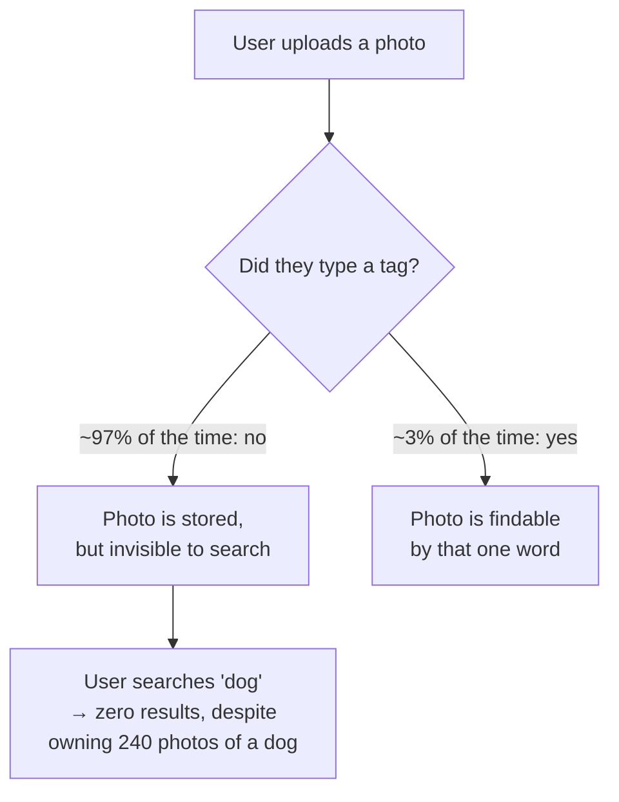

### Why this happens

The obvious question: *why would anyone bother typing tags on every single photo they take?*

They wouldn't — and they don't, anywhere, ever. Typing metadata by hand doesn't scale to "a few
thousand photos a year, forever," no matter how good the tag box's UI is. This isn't a Photoloom
bug. It's a structural dead end for the whole category of product.

### The fix

Stop asking the *user* to describe the photo. Have a **machine** describe it instead, the moment
it's uploaded — object and scene detection that writes searchable tags automatically.

This is exactly the real, documented bet Google made. Google Photos launched in May 2015 with
content-based search as its flagship feature. Type "dog" and get every photo of a dog, with zero
manual tagging, because a model looked at the pixels and wrote the tags itself.

**Analogy for the rest of this story:** think of it like a **film-developing counter**. You drop
off your roll of film and walk away. You don't have to write a caption on every negative
yourself — the person in the back does that part for you, automatically, as part of developing it.

### New problem

Where in the upload flow does that "person in the back" actually run? The fastest thing to build
is to run the model **right there, inline**, before telling the user the upload succeeded. That
decision is the next wall.

**How I'd say this in an interview:** "Manual tagging is a dead end at any real scale — nobody
types metadata on thousands of photos a year, which is exactly why Google Photos' whole pitch in
2015 was content search with zero manual tagging. The interesting design problem isn't 'should we
auto-tag,' it's where in the pipeline that auto-tagging actually runs."

---

## Chapter 2 — The spinner that wouldn't stop

### The setup

Photoloom wires the object-detection model directly into the upload endpoint. Here's the flow it
builds:

1. A photo's bytes land in storage.
2. *Before* the server responds "upload complete," it calls the ML model.
3. It waits for tags to come back.
4. It writes the tags to the search index.
5. Only then does it say "done."

### Why it feels fine at first

For a single photo, this feels fine. The model takes about **1.2 seconds** `[illustrative]` to
return tags, so one upload takes just over a second longer than it otherwise would. Nobody
notices a single extra second.

### Where it breaks

Then a user does what every phone owner eventually does: they get a new phone, install Photoloom,
and hit "back up my whole camera roll" — **2,000 old photos** at once.

Redo the math, step by step:

- 2,000 photos, run **one at a time**, because that's how the endpoint was built
- each one waits **1.2 seconds** for the ML model
- 2,000 × 1.2 seconds = **2,400 seconds**
- 2,400 seconds = **40 minutes**

For those 40 minutes, the upload screen just shows a spinner, seemingly stuck, before the import
finishes. The user assumes the app crashed and force-quits it, losing progress.

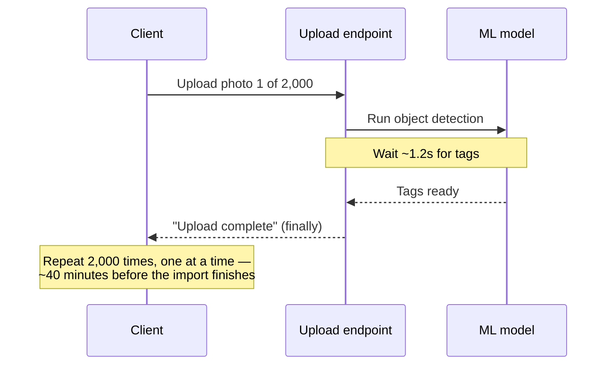

### Why this happens

The obvious question: *does the photo actually need to be searchable before the upload can be
called "done"?*

No — the user just wants to see the photo land safely in their library. Whether it's *findable by
content* two minutes from now or two seconds from now doesn't change whether the backup succeeded.

### The fix

Decouple the two signals:

- The upload is "done" the instant the bytes are safely stored. The photo is visible in the
  library immediately.
- "Tags are ready" becomes a separate, later event, delivered whenever the enrichment step
  actually gets to it.

The film-developing-counter analogy holds exactly here: the counter hands you a claim ticket the
second you drop off the roll ("your film is safely in our hands"). It does **not** make you stand
there until every print comes out of the back room.

Photoloom puts the enrichment step on its own queue, run by a pool of workers sized for
**throughput**, not for any single upload's latency.

### New problem

Decoupling ML from the upload path fixes the spinner. But it doesn't touch a second inefficiency
that's been sitting there the whole time: Photoloom is storing every one of those 2,000 photos'
full bytes, even though a meaningful chunk of them are photos the user has *already* backed up
before, from an earlier phone.

**How I'd say this in an interview:** "The mistake isn't wanting ML tags at upload time, it's
making upload *acknowledgment* wait on ML *completion* — those are two different signals with two
different latency budgets. Decouple them: store-and-acknowledge is fast and synchronous,
enrich-and-index is async and throughput-sized, exactly like a film counter handing you a ticket
instead of making you wait for the prints."

---

## Chapter 3 — The photo that came back four times

### The setup

A support ticket comes in. A user's storage usage shows **11.2 GB**, but she insists she's only
ever taken about **6 GB** worth of photos.

### Digging in

Three separate things are happening to the same handful of photos:

1. Her phone auto-backs up every photo the moment it's taken.
2. She *also* saves photos someone sends her over chat straight to her camera roll — these get
   backed up again as if brand new.
3. A phone restore last year made Photoloom re-upload everything a second time, because nothing
   told it "you already have this."

Same photos, stored **3-4 times over**.

### The scale of the problem

At Photoloom's actual scale, this isn't one unlucky user. It's roughly **15% of all uploads being
exact byte-for-byte repeats of something already stored**
`[illustrative, matching the order of magnitude the reference guide's capacity estimate uses for
real-world duplicate rates]`.

Do the math: at **2 billion uploads a day** and **2.5 MB average photo size**, that 15% adds up
to **hundreds of terabytes a day** written for content already sitting in the store.

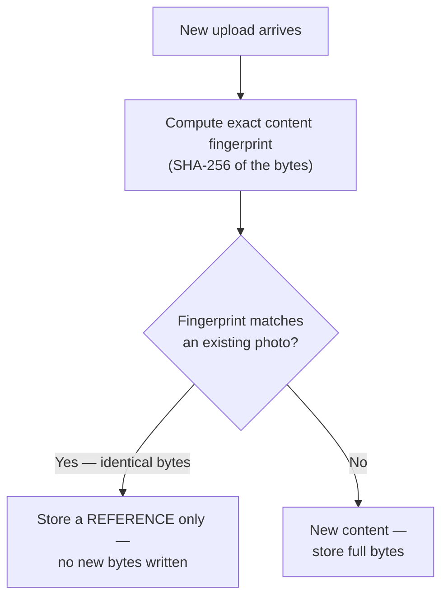

### The fix

The obvious question: *how do you know two uploads are "the same photo" without literally
comparing every pixel to every other photo you've ever stored?*

You don't compare pixel-by-pixel. You compute a short **fingerprint** of the bytes — a
cryptographic hash like SHA-256 — and compare *fingerprints* instead. Two files with identical
bytes always produce the identical fingerprint. This is cheap, and it has zero false positives.

**The fingerprint analogy to keep for the rest of this story:** an exact fingerprint match means
it's unambiguously the same file — like matching someone's actual fingerprint whorls, not just
"looks kind of like them."

### New problem

Almost immediately, a new case shows up. The user takes a burst of **8 photos in 2 seconds** of
her cat jumping, planning to pick the best one later.

Walk through what happens to each of those 8 files:

- Each file has slightly different bytes, even though the images look almost identical.
- Even one differing pixel changes the fingerprint completely.
- So exact-hash dedup correctly says "8 different files" and stores all 8 in full — even though
  visually, 6 of them are nearly identical.

There's a second case too: a photo someone re-saves after a messaging app *recompresses* it is
byte-for-byte a totally different file, even though it's visually the same picture. Exact
fingerprinting was never designed to notice "these look alike" — only "these are identical."

**How I'd say this in an interview:** "Exact content hashing is the cheapest possible dedup win
and it's the right first move — zero false positives, catches the classic 'same photo backed up
twice' case outright. But it only catches identical bytes; it says nothing about photos that are
*visually* the same but not *byte-for-byte* the same, which is the very next problem."

---

## Chapter 4 — The burst shot that fooled the fingerprint

### The setup

Photoloom looks at the 8-photo cat burst again. Walk through the cost:

- All 8 photos are stored in full.
- That's roughly **20 MB** for a set where a person would probably only ever want to keep 1 or 2.
- Multiply that pattern across Photoloom's whole user base, and it's a real, ongoing storage
  cost, on top of the exact-duplicate waste Chapter 3 already fixed.

### The fix

The obvious question: *is there a fingerprint that says "these look alike" instead of "these are
byte-identical"?*

Yes — a **perceptual hash**. Instead of hashing the raw bytes, it hashes a simplified
representation of what the image *looks like*: coarse shapes, brightness gradients, structure.

- Resizing, recompressing, or saving through a different app barely changes the hash.
- A genuinely different photo produces a very different one.

This is the real, industry-proven idea behind Microsoft's **PhotoDNA**. It's built so a
recompressed, resized, or cropped copy of a known image still matches — the same class of
technique, applied here to near-duplicate personal photos instead of PhotoDNA's actual documented
purpose of catching known illegal content.

**Keeping the fingerprint analogy going:** an exact hash is like matching someone's literal
fingerprint whorls — identical or not, no in-between. A perceptual hash is closer to a **family
resemblance**. Two photos that look alike — same scene, same face, recompressed copy of the same
shot — score as "close," even though their underlying fingerprints differ completely.

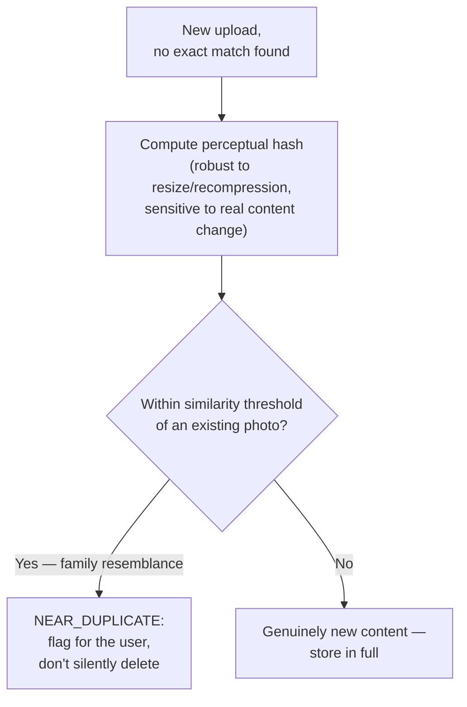

### New problem

A perceptual hash is *probabilistic*, not exact. So what happens when it flags two genuinely
different photos as "near-duplicate"?

Example: two different sunsets over the same beach, shot a year apart, that happen to have very
similar color gradients. If Photoloom silently merges near-duplicates the same confident way it
merges exact ones, a false positive here means **quietly deleting a photo the user actually
wanted to keep** — a much worse outcome than the storage waste this was meant to fix.

### The fix on top of the fix

Treat the two hash types with very different confidence levels:

| Match type | Confidence | What Photoloom does |
|---|---|---|
| Exact hash match | Certain, zero false positives | Dedup silently |
| Perceptual hash match | Probabilistic, can be wrong | Only *flag* it — let the user decide, or keep both by default |

The burst-of-8-cat-photos case becomes "here are 8 similar shots, want to pick a favorite?" —
instead of Photoloom silently making that call for the user.

**How I'd say this in an interview:** "Perceptual hashing catches the near-duplicate case exact
hashing structurally can't — it's the same family of technique behind Microsoft's PhotoDNA, just
aimed at 'these look alike' instead of 'these are identical.' But it's probabilistic, so the right
move is asymmetric confidence: dedup exact matches silently, only *flag* near-duplicate matches,
because a false positive there means deleting something the user meant to keep."

---

## Chapter 5 — The album full of strangers who are all the same person

### The setup

Search is now genuinely useful. "Beach," "dog," "birthday cake" all return real results, thanks
to the object/scene model from Chapters 1 and 2.

Then a user tries something that seems like it should obviously work: she searches "mom." Zero
results.

Here's why: the object-detection model correctly tagged hundreds of her photos as containing a
`person`. But "person" isn't "mom." Nothing in the pipeline knows that the person in her 2015
photo, her 2019 photo, and her 2024 photo are the *same* person — let alone which specific person
that is.

### Why this is a different problem

The obvious question: *isn't recognizing "same person across many photos" basically the same
problem as recognizing "this is a dog"?*

No — and this is worth stating explicitly, because it's an easy thing to wave past in an
interview.

- Object/scene tagging is a **per-photo** classification problem. Look at one photo, output tags
  for what's in it, done.
- Recognizing "this is the same person" across her entire library — sometimes ten years apart,
  different lighting, different angles, different ages — is a **cross-photo clustering**
  problem. You have to compare face embeddings against every *other* face embedding across
  potentially tens of thousands of photos, and group the ones that belong to the same person,
  incrementally, as new photos keep arriving.

Sticking with the film-developing-counter analogy: object tagging happens **per envelope** — the
person in the back looks at one roll of film and writes down what's in each print. Face clustering
requires them to take *every* print from *every* envelope ever developed for this customer, spread
them all out on one big table, and sort faces into piles. It's a fundamentally different, much
bigger job than captioning one print at a time.

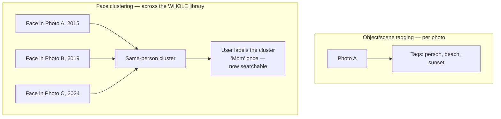

### The fix

Photoloom builds this as its own pipeline, separate from object/scene tagging:

1. Detect faces in each newly-enriched photo.
2. Compute a face embedding.
3. Run it through incremental clustering against the user's existing face clusters — merge if
   close enough, start a new cluster if not.

Once the *user* labels one cluster "Mom" — the system never assumes a name on its own — every
past and future photo in that cluster becomes searchable by that label.

### New problem — and this one is legal, not technical

Grouping faces into per-person clusters means Photoloom is now computing and storing biometric
data. A face embedding is, functionally, a fingerprint of someone's face.

This isn't hypothetical. In 2022, Google agreed to pay **$100 million** to settle *Rivera v.
Google* — a real lawsuit under Illinois' Biometric Information Privacy Act (BIPA). The suit was
specifically over Google Photos' face-grouping feature processing residents' facial geometry
without the consent BIPA requires. It's a real, documented, expensive outcome for exactly this
feature.

**How I'd say this in an interview:** "Face clustering is architecturally distinct from
object/scene tagging — it's a cross-photo, incremental clustering problem over the whole library,
not another per-photo model call, and it's worth naming that distinction unprompted. It's also the
one feature in this whole system with real legal exposure — Google's own $100 million BIPA
settlement over this exact feature is the fact I'd cite if asked about privacy, and it's why face
clustering should be opt-in, not silently on by default."

---

## Chapter 6 — The bill that kept climbing even though nobody was looking

### The setup

Photoloom's storage bill is growing faster than its user count. Someone pulls the access logs and
finds the actual pattern:

- Of the entire photo library, only about **5% of photos have been opened even once in the last
  30 days**
  `[illustrative, matching the order of magnitude the reference guide's capacity estimate uses
  for real photo-access skew]`.
- The other **95%** just... sits there.

Nobody's deleting it — nobody deletes photos, that's the whole premise of a backup product — but
almost nobody's *looking* at most of it either. And every single byte of it, accessed or not, is
sitting on the exact same expensive, fast storage tier as this morning's upload.

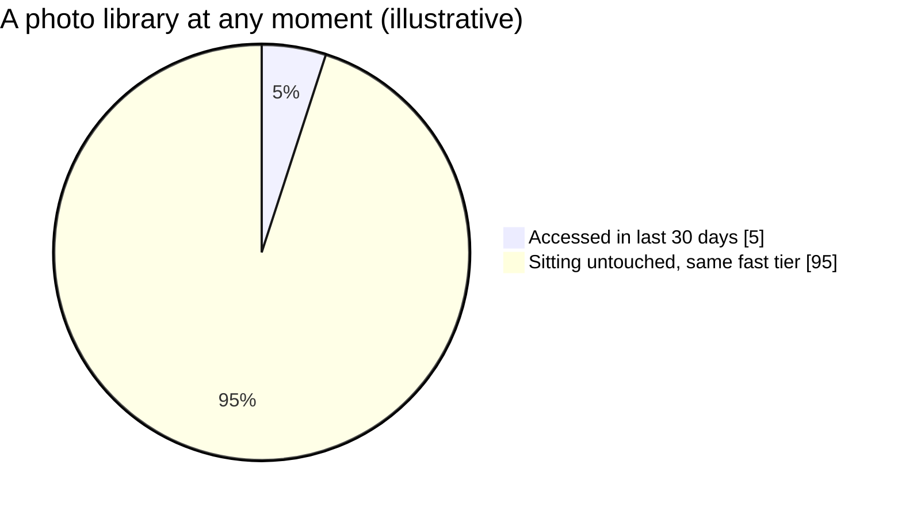

### The fix

The obvious question: *why pay premium, low-latency storage prices for data almost nobody is
reading?*

You shouldn't — for the 95% that isn't being read. This is exactly the economics behind real
cloud storage tiers: AWS S3 Standard vs. S3 Glacier, or Google Cloud Storage's
Nearline/Coldline/Archive classes. Same durability, dramatically cheaper per byte, in exchange for
slower retrieval if that data is ever needed again.

**A new analogy worth keeping** — think of storage tiers like where you keep things at home:

| Tier | Home analogy | Cost | Speed |
|---|---|---|---|
| Hot | Desk drawer | Priciest real estate | Instant access |
| Warm | Hallway closet | Cheaper per item | A few steps away |
| Cold | Storage unit across town | Dirt cheap per box | Drive over and wait |

Photoloom writes a simple job:

- Untouched 30+ days → move from drawer to closet.
- Untouched a year → move from closet to storage unit.

### New problem

Photoloom's "Memories" feature resurfaces a photo from five years ago — "on this day" — into a
user's feed. She taps it full-screen.

It takes **6 seconds** to load, because it's sitting in the storage-unit-across-town tier, and
this cold tier's retrieval isn't instant. This mirrors a real, documented behavior: AWS Glacier's
retrieval tiers range from an expedited 1-5 minutes up to a standard 3-5 hours, depending on what
you pay for speed. Six seconds is mild by comparison — but it's still a jarring stall on a photo
the product itself just chose to resurface.

**How I'd say this in an interview:** "Tiering exists because access is wildly skewed — the large
majority of a mature photo library is cold at any given moment, and paying hot-tier prices for
that is a real, avoidable cost, the same reasoning behind AWS Glacier or GCS Coldline. But tiering
purely by *age* has a blind spot: it doesn't know when something's about to become interesting
again, which is the very next problem."

---

## Chapter 7 — The memory that got stuck in the storage unit across town

### The setup

Digging into the "Memories" stall: the photo had been sitting untouched for 4 years, so by
Photoloom's age-based rule, it had long since been moved to the coldest, cheapest tier.

The **moment** it became relevant again — the "Memories" feature decided to resurface it today —
the system had no idea that was coming until the user had *already* tapped on it and was staring
at a loading spinner.

### Why this happens

The obvious question: *does age alone actually tell you whether a photo is about to be accessed?*

No — age tells you the last time it *was* accessed, not what's about to happen next. A 5-year-old
photo that's about to be shown in someone's feed, or shared to a friend, is functionally about to
become "hot" again for a little while, completely independent of how old it is.

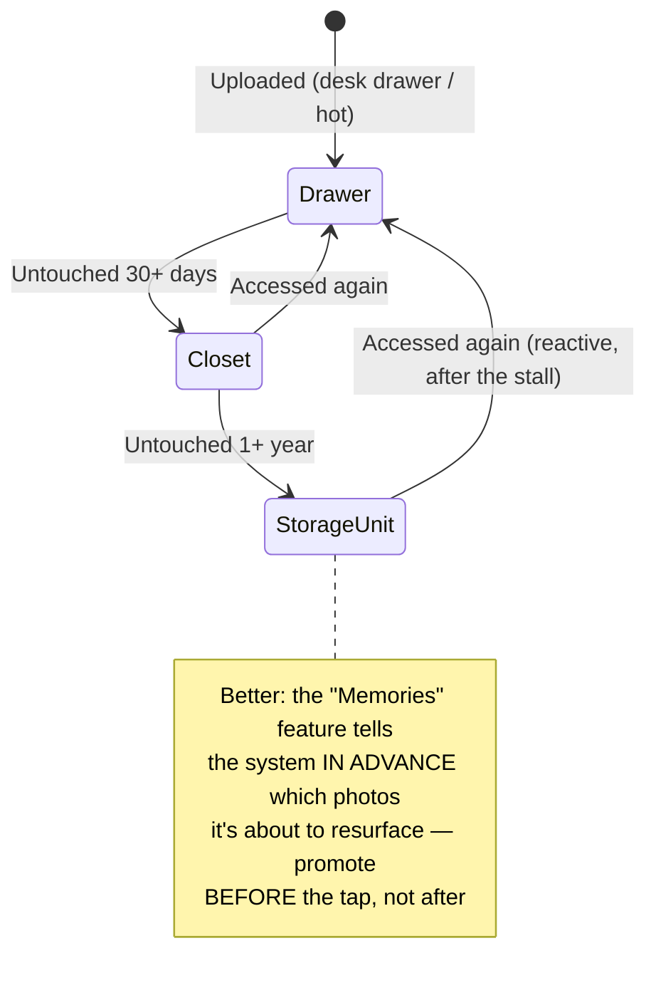

### The fix

Key tiering off **access recency signals**. Where the system can see a resurfacing event
*coming* — a "Memories" feature choosing today's old photo, a photo about to be shared into an
album — proactively move it to the desk drawer **before** the tap, not after.

The storage-unit-across-town analogy holds exactly: if you already know you'll need that box next
week, you drive over and grab it ahead of time instead of discovering the hour-long drive at the
moment you need it.

### New problem — an honest cost, not a bug

Proactive promotion only helps access the system can *predict*. A photo cold for 4 years that a
friend randomly finds and opens, with zero advance signal, still eats the retrieval latency.
There's no way around that without keeping everything hot, which is the exact cost Chapter 6
exists to avoid.

Some cold-tier reads just have to be a little slower, gracefully, not treated as an error.

**How I'd say this in an interview:** "Age-based tiering alone strands a resurfaced old photo on
the slow tier at exactly the moment someone's looking at it. The fix is tiering by access
*recency*, plus proactively promoting anything the product layer can see coming — a 'Memories'
feature choosing tomorrow's photo today is a perfect signal to act on ahead of the actual tap,
rather than reacting to a stall after it's already visible to the user."

---

## Chapter 8 — The upload that died at 80% on the subway

### The setup

A completely different complaint starts showing up: users on mobile, uploading a **45 MB** video,
report that backups keep failing, especially on commutes.

Digging into one case, step by step:

1. A video is 80% uploaded.
2. The phone loses signal going into a subway tunnel.
3. Photoloom's upload endpoint was built as a single atomic `PUT` of the whole file — it has no
   idea "80% done" is even a concept.
4. The connection drops. The whole request fails.
5. By the time signal returns, the client has no choice but to **start the entire 45 MB video
   over from byte zero**.

On a spotty connection, some users never successfully finish backing up their videos at all —
every attempt gets partway through and dies before reaching 100%.

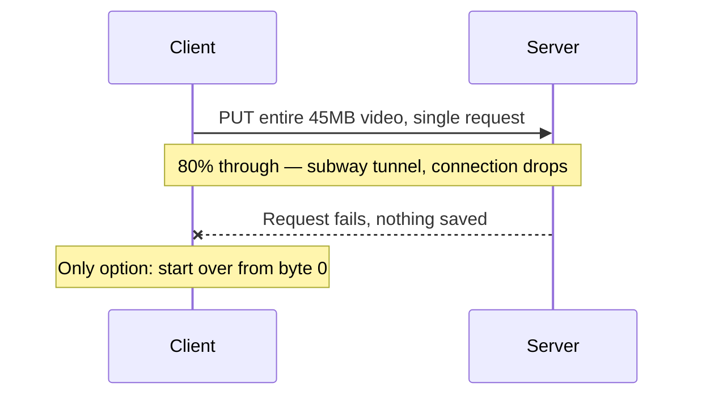

### The fix

The obvious question: *does losing a connection have to mean losing all the progress made before
the drop?*

No — this is exactly the problem **resumable, chunked upload** protocols solve, and it's not
novel here. Google's own resumable-upload protocol (used across Drive and Photos Library APIs)
and the open **tus.io** protocol both work the same documented way: break the file into chunks,
ack each one individually, and if the connection drops, ask "what have you got so far?" and resume
from exactly there.

**The analogy:** a book with no bookmark versus one with a bookmark. Without one, a dropped
connection means going back to page one. With one, you open to where you left off and keep going —
the pages you already read don't un-read themselves.

Walk through how the retry actually works, step by step:

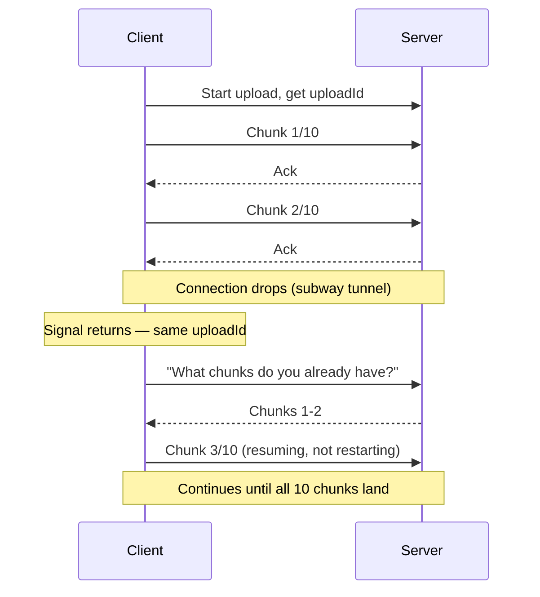

### One more win, while we're at it

Chunks are already flowing through the client — so compute the content fingerprint from
Chapter 3 **on the device**, before or during upload.

- If the server can tell from that fingerprint alone that this exact video is already stored, the
  client can skip re-uploading most or all of the remaining bytes entirely.
- That's a bandwidth saving stacked directly on top of the storage saving dedup already provides —
  which matters a lot on a mobile data plan.

**How I'd say this in an interview:** "Mobile clients on unreliable networks make chunked,
resumable upload close to mandatory, not a nice-to-have — this is the same discipline behind
Google's own resumable-upload protocol and the open tus.io standard. And once you're hashing
client-side anyway for resumability, you get to skip re-uploading known-duplicate bytes entirely,
which saves bandwidth on top of the storage dedup already saves."

---

## Chapter 9 — The claim ticket that almost opened someone else's locker

### The setup

One last problem, caught in a design review before it ever ships.

An engineer proposes making the exact-fingerprint dedup index (Chapter 3) **global** — shared
across every user, not scoped per account. The reasoning: if two different users happen to upload
the byte-identical photo — a viral meme, a shared family photo passed around a group chat —
Photoloom could dedup across accounts too and save even more storage.

### The obvious, uncomfortable question

Someone else in the review asks: *if User A's fingerprint matches something already in User B's
account, does the system's response leak anything about User B?*

Walk through why this matters:

- If a "yes, this exists" response ever lets User A infer whose account it's in...
- ...or grants any path to *view* User B's copy...
- ...then the dedup index has become a side channel leaking the mere **existence** of a photo
  between two unrelated accounts.

That's a real privacy failure, introduced purely in the name of a storage optimization.

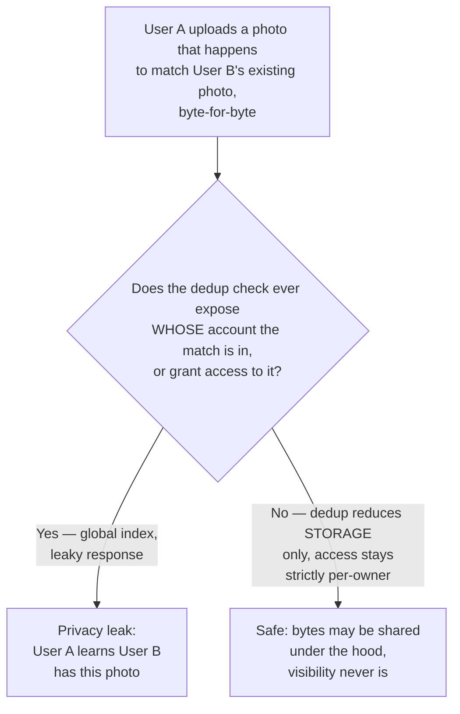

### The fix

Keep the claim-ticket idea from Chapter 2 intact, but tighten what the ticket actually proves:

- A shared fingerprint index is fine for deciding "do we already have these bytes somewhere, so
  we don't need to write them again" — a pure storage-layer decision.
- It must never be allowed to answer "does this specific other user have this photo" in any form
  the requesting user can observe.

In short: dedup can share **bytes** under the hood; it must never share **visibility**. Access
control stays strictly per-owner, completely independent of whether the underlying bytes happen to
be physically shared with someone else's account.

**How I'd say this in an interview:** "Cross-user dedup is a real, tempting storage optimization,
and it's also a real, easy-to-miss privacy trap — the fix isn't to avoid deduping across users,
it's to make sure the dedup check can only ever affect *storage*, never leak *existence* or grant
*access* across account boundaries. It's the same principle as any shared-resource system: sharing
the underlying resource is fine, sharing visibility into who else is using it usually isn't."

---

## Where the story actually lands

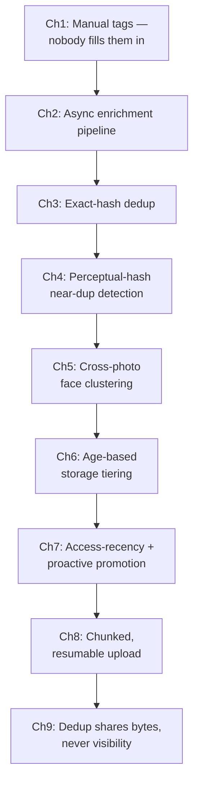

Here's what each arrow in that chain actually means — the fix each chapter buys, and the new
problem it uncovers:

| From → To | Fixes | Reveals / breaks |
|---|---|---|
| Ch1 → Ch2 | Auto-tag with ML instead of manual tags | Runs inline, blocks the upload |
| Ch2 → Ch3 | Fast upload acknowledgment | Repeat uploads waste storage |
| Ch3 → Ch4 | Byte-identical repeats get deduped | Near-duplicates slip through |
| Ch4 → Ch5 | Catches "looks alike" | "Same PERSON" is a bigger, separate problem |
| Ch5 → Ch6 | Search by person | Storing everything hot forever is expensive |
| Ch6 → Ch7 | Cuts storage cost | Resurfaced old photo stalls on the cold tier |
| Ch7 → Ch8 | (Separate axis) | Mobile uploads keep dying mid-transfer |
| Ch8 → Ch9 | (Separate axis) | Dedup index shared across users leaks privacy |

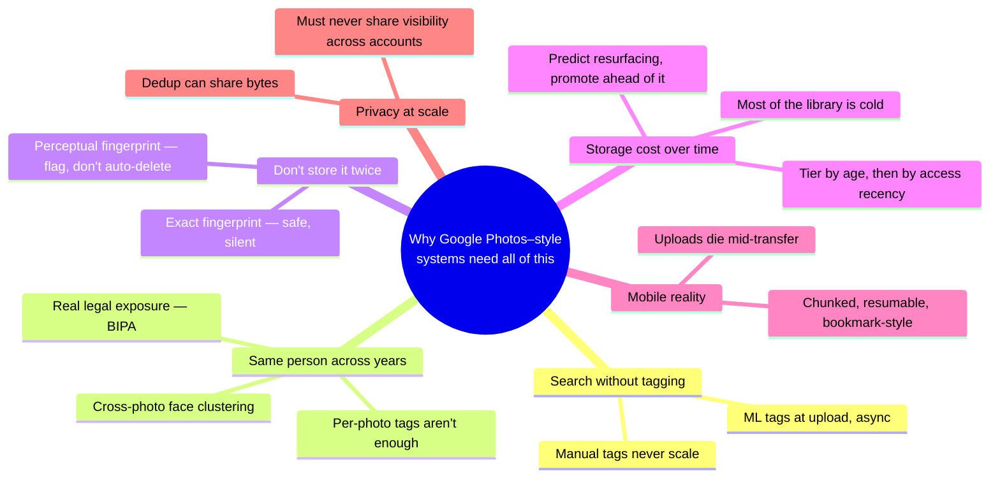

Every real system in this space sits somewhere on this chain. The skill isn't reciting all nine
chapters — it's stopping where the interviewer's question points.

- "Design a photo backup app" with no mention of search is already well covered by Chapters 1, 2,
  3, and 6-8.
- "How does search work if nobody tagged anything" is your cue to go deep on Chapters 1, 2, and
  5 — the heart of what makes this different from a generic blob-store design.

---

## Grill me — adversarial follow-ups

**Q1: "Why not just run the ML model synchronously but make it faster, instead of building a
whole async pipeline?"**

Even a fast model has a floor, and any inline call couples upload latency to inference latency —
a scarcer, pricier resource than a storage write. A batch import of thousands of old photos will
always expose that coupling eventually; decoupling removes the dependency instead of shrinking it.

**Q2: "Isn't perceptual hashing risky — what if it wrongly flags two different photos as
duplicates?"**

The two failure directions are asymmetric. A missed near-duplicate just wastes a little storage —
cheap to tolerate. A false-positive, if auto-merged, could delete something the user wanted —
which is exactly why near-duplicates get flagged for the user, never auto-deleted like exact ones.

**Q3: "Isn't a face just another object to detect — why treat face clustering as harder?"**

Detecting *that* a face exists is just another per-photo call. The hard part is deciding *which*
face — clustering it against every other face across the whole library, incrementally, so "Mom"
resolves to the same person in a 2015 photo and a 2024 one. That's cross-photo clustering layered
on top of per-photo detection, not a bigger version of the same thing.

**Q4: "If most of the library is cold, why not store new uploads on the cold tier from day one?"**

Because access skews heavily toward *recent* uploads — this morning's photo gets viewed far more
in the next few days than a five-year-old one. Starting cold puts latency in the way of the common
case to save money on the pattern that mostly isn't.

**Q5: "What happens when a cold photo gets accessed with zero advance warning — no 'Memories'
feature involved?"**

It just eats the cold-tier retrieval latency, gracefully, never surfaced as an error. That's an
honest, accepted cost of tiering at all; proactive promotion only helps the subset of access the
system can actually see coming.

**Q6: "Why dedup before storage instead of a cleanup job that removes duplicates afterward?"**

Savings only materialize if duplicate bytes never get written at all — a cleanup job still pays
the full write cost once, then spends extra compute detecting and removing it. Checking at upload
time is strictly cheaper than write-then-clean.

**Q7: "Face clustering opt-in because of one lawsuit — doesn't that just deny people a useful
feature?"**

Yes, and that's the honest trade — biometric data carries real regulatory risk that's already cost
Google $100 million in an actual settlement, so consent has to be an explicit gate, not a
silently-on default. Usefulness doesn't override a legal requirement to ask first about someone's
face.

**Q8: "Could you skip perceptual-hash dedup and just let users delete their own duplicates?"**

For an MVP, sure — exact-hash dedup alone already captures a large share of the waste with zero
false-positive risk. But it leaves real storage savings on the table and pushes a chore onto the
user that near-duplicate detection was built to remove.

**Q9: "What breaks if the async enrichment pipeline falls 6 hours behind?"**

Upload durability and library visibility are untouched — neither ever depended on enrichment.
Search completeness degrades: recent uploads won't surface by content yet. A monitored, bounded
lag with an SLA, not a correctness failure.

**Q10: "Guides 20 and 33 already cover blob storage and basic photo-app plumbing — where do you
actually start on this one?"**

Name blob storage and CDN delivery as the foundation in one sentence and move past them. Spend the
real time on what's distinctive: dedup before storing, ML enrichment decoupled from upload, face
clustering as its own harder problem, and tiering driven by access recency, not age alone.

---

## Cheat sheet — one line per stop on the story

- **Manual tagging**: never scales — nobody types metadata on thousands of photos a year, which is
  exactly why content search (Google Photos, 2015) replaced it with ML tags written automatically.
- **Async enrichment pipeline**: upload acknowledgment and "searchable by content" are two
  different completion signals — store-and-ack fast, tag-and-index later, on the pipeline's own
  throughput-sized schedule. (The film-counter analogy: claim ticket now, prints later.)
- **Exact-hash dedup**: a content fingerprint catches byte-identical repeat uploads cheaply, with
  zero false positives — safe to dedup silently.
- **Perceptual-hash dedup**: catches near-duplicates (burst shots, recompressed copies) that exact
  hashing structurally can't — but it's probabilistic, so flag matches for the user, never
  silently auto-delete the way exact matches are handled.
- **Face clustering**: a cross-photo, incremental clustering problem over the whole library, not
  another per-photo tag — architecturally distinct from object/scene detection, and carries real
  legal exposure (Google's $100M BIPA settlement) that makes it opt-in, not default-on.
- **Storage tiering**: the vast majority of a mature library is cold at any moment — move it to
  cheaper tiers (the desk-drawer / closet / storage-unit-across-town analogy) to avoid paying
  hot-tier prices for data nobody's reading.
- **Access-recency + proactive promotion**: age alone strands a resurfaced old photo on a slow
  tier at the exact moment it's being viewed — tier by recency of access, and promote ahead of any
  predictable resurfacing event (a "Memories" feature knows the pick before the user taps it).
- **Chunked, resumable upload**: mobile clients on unreliable networks need a bookmark, not a
  restart-from-zero, when a connection drops mid-transfer — the same discipline behind Google's
  resumable-upload protocol and the open tus.io standard.
- **Cross-user dedup boundary**: sharing bytes across accounts to save storage is fine; letting
  that sharing leak whether another account even has a given photo, or granting access to it, is
  a privacy failure — dedup affects storage only, access control stays strictly per-owner.
- **The meta-lesson**: every fix in this story buys one property (findability, fast acknowledgment,
  storage efficiency, correctness under ambiguity, cross-photo identity, cost efficiency, low
  perceived latency, upload resilience, or privacy) by spending a different one — say the trade in
  the same sentence you propose the fix.
