# Design Google Photos — FAANG Interview Guide

> Source chapter type: large-scale media storage product. Distinct from
> [Blob Store](./20-Blob-Store-FAANG-Guide.md) and [CDN](./11-CDN-FAANG-Guide.md), which are the
> generic storage/delivery primitives this chapter builds on — the product-specific hard problems
> here are **deduplication** (the same photo often gets uploaded more than once, across devices
> and re-shares), **ML-based search** over content nobody manually tagged, and **storage tiering**
> across a library that keeps growing forever while access patterns skew heavily toward recent
> uploads.

## Mental model

A user's photo library grows every day and is almost never deleted — but is overwhelmingly
**accessed** only when recent. Three problems layer on top of "store and serve images/videos":

1. **Deduplication.** The same photo frequently exists more than once: a burst-mode sequence of
   near-identical shots, the same image saved from a chat app and also captured by the camera, a
   photo re-uploaded after a phone backup restore. Storing every byte-identical or visually-
   identical copy separately wastes enormous storage at this scale.
2. **ML-based search over unstructured content.** A user searches "beach sunset 2019" or "photos
   of my dog" — nobody manually tagged these. Search has to be powered by asynchronous ML
   pipelines (object/scene detection, face clustering) run once per photo at upload time, producing
   searchable metadata nobody typed in.
3. **Storage tiering.** A photo from 2015 is essentially never accessed again but must never be
   lost; a photo from this morning is accessed repeatedly. Serving both classes of access pattern
   efficiently means moving data across storage tiers (hot/warm/cold) based on age and access
   recency, not storing everything on the same expensive, fast tier forever.

**The one sentence to say out loud:** *"This is a blob-store-plus-CDN problem at its core, with
three product-specific layers on top: dedup before you even store a new upload, async ML
enrichment after you store it, and tiered storage that ages data down as it's accessed less."*

**The one picture to remember forever:**

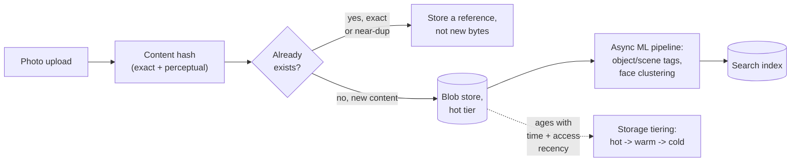

**Memory hook:** *"Dedup before storing, enrich after storing, tier as it ages — three product
layers wrapped around a blob store."*

---

## Table of contents
[How to Identify This Topic](#how-to-identify-this-topic-in-an-interview) ·
[Interview Playbook](#interview-playbook) · [Requirements](#requirements-clarification) ·
[Capacity Estimation](#capacity-estimation-worked) · [API Design](#api-design) ·
[High-Level Architecture](#high-level-architecture) ·
[Architecture Evolution v1→v2→v3](#architecture-evolution-v1--v2--v3) ·
[End-to-End Walkthroughs](#end-to-end-request-walkthroughs) ·
[Deep Dive: Exact + Perceptual Deduplication](#deep-dive-exact--perceptual-deduplication) ·
[Deep Dive: Async ML Enrichment Pipeline](#deep-dive-async-ml-enrichment-pipeline) ·
[Deep Dive: Storage Tiering](#deep-dive-storage-tiering) ·
[Deep Dive: Upload Pipeline & Resumability](#deep-dive-upload-pipeline--resumability) ·
[Data Model](#data-model) · [Failure Modes](#failure-modes--mitigations) ·
[Non-Functional Walkthrough](#non-functional-walkthrough) ·
[Security & Compliance](#security--compliance) · [Cost & Trade-offs](#cost--trade-offs) ·
[Wrap-Up](#wrap-up-mvp-vs-stretch) · [Golden Rules](#golden-rules) ·
[Cheat Sheet](#master-cheat-sheet)

---

## How to identify this topic in an interview

- "Design Google Photos / a cloud photo backup and search product."
- The tell that distinguishes this from a plain blob-store/CDN chapter: the interviewer emphasizes
  **search over content** ("find photos of X") and/or **storage efficiency at scale** ("users never
  delete anything") — either signal points to dedup, ML enrichment, and tiering as the actual
  substance of the chapter.
- A follow-up like "what if the exact same photo is uploaded from two different devices" is the
  [deduplication deep dive](#deep-dive-exact--perceptual-deduplication).

---

## Interview playbook

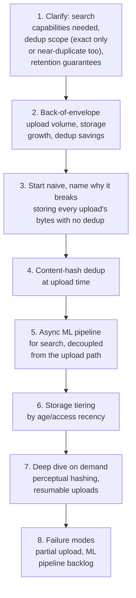

**What the interviewer is actually grading at each step:**
- Step 3: do you recognize, unprompted, that "users never delete photos" means storage growth is
  unbounded and dedup is a cost necessity, not a nice-to-have?
- Step 5: do you decouple ML enrichment from the upload's own critical path — an upload should
  complete and be viewable immediately, with search-readiness following asynchronously, not
  gating the upload on ML processing completing first?
- Step 6: do you propose tiering driven by **access recency**, not just age — a 5-year-old photo
  someone just shared and is getting repeatedly viewed should behave differently from one nobody
  has opened in years?

---

## Requirements clarification

### Functional

| # | Requirement | Notes |
|---|---|---|
| F1 | Upload, store, and serve photos/videos reliably, never lost | The core durability guarantee |
| F2 | Deduplicate identical and near-identical uploads | Storage cost necessity at scale |
| F3 | Search photos by content (objects, scenes, faces) without manual tagging | The core differentiated product feature |
| F4 | Organize into albums, shared albums with other users | Standard product feature, access-control implications |
| F5 | Serve at appropriate resolution for context (thumbnail grid vs. full-screen view) | Distinct from LOD in the AR chapter, but the same "don't ship more bytes than the context needs" instinct |

### Non-functional

| Requirement | Target | Why this number |
|---|---|---|
| Upload durability | Extremely high — effectively never lose a photo once upload is acknowledged | This is often someone's only copy of an irreplaceable memory; durability expectations here are at the very top of this course's spectrum |
| Upload latency (to "visible in library") | Seconds | Users expect to see their photo appear quickly, even if search-indexing and full enrichment follow later |
| Search latency | Sub-second for typical queries | Interactive search UX expectation |
| Search completeness | Eventual — a just-uploaded photo may take minutes to become searchable by content | ML enrichment is asynchronous; this delay is an accepted trade-off, not a bug |
| Storage cost efficiency | Must scale sub-linearly with raw upload volume, via dedup and tiering | At the scale of "every user's entire photo history, forever," raw per-byte storage cost without efficiency measures would be prohibitive |

**Clarifying questions worth asking the interviewer up front — and what each answer changes:**

| Question | If the answer is... | ...then this changes |
|---|---|---|
| "Does dedup need to catch near-duplicates (burst shots, re-compressed copies), or only byte-identical files?" | Near-duplicates too | Confirms perceptual hashing is needed in addition to exact content hashing — a materially harder problem than exact-match dedup alone |
| "Is content search (objects/scenes/faces) in scope, or just album organization and basic metadata search?" | Content search is a core feature | Confirms the async ML enrichment pipeline is central, not a stretch feature |
| "Are storage costs a stated constraint, or is durability the only priority?" | Cost matters at this scale | Confirms tiering is a required design element, not optional |
| "Is cross-device, immediate visibility required (upload from phone, see instantly on the web)?" | Yes | Confirms the metadata/library-listing path must be fast and strongly consistent per-user, even while ML enrichment lags behind asynchronously |

**Say this out loud in the interview:** *"I'd split this into three timelines: the upload itself
has to be fast and durable immediately; deduplication should happen right at upload time, before
storing new bytes; and ML-based search enrichment happens afterward, asynchronously — a photo
should be viewable in the library long before it's fully searchable by content."*

---

## Capacity estimation, worked

```
Given (illustrative, a large photo-backup product):
  Active users                                   = 500,000,000
  Average uploads per active user per day          = 4 (photos + videos combined)
  Uploads per day, globally                        = 2,000,000,000
  Average photo size (post-compression)            = 2.5 MB
  Average video size                                = 40 MB (10% of uploads are video)

Raw daily upload volume (before dedup):
  Photo bytes/day   = 2,000,000,000 x 0.9 x 2.5MB  ~= 4.5 PB/day
  Video bytes/day    = 2,000,000,000 x 0.1 x 40MB    ~= 8 PB/day
  Total raw           ~= 12.5 PB/day
  -> at this scale, EVERY percentage point of dedup savings is a meaningful absolute cost --
     this is why dedup is treated as a first-class design element, not a nice-to-have optimization.

Deduplication savings (illustrative):
  Exact-duplicate rate (same bytes uploaded twice -- device backup + manual upload,
    re-shares saved back into the library, etc.)    ~= 15% of uploads
  Near-duplicate rate (burst shots, minor
    recompression)                                    ~= 8% of uploads
  Combined dedup savings                              ~= 20-23% of raw bytes avoided
  -> roughly 2.5-3 PB/day of storage NOT written, at this illustrative rate -- a concrete,
     large number worth stating if asked to justify the engineering investment in dedup.

ML enrichment pipeline load:
  Uploads requiring enrichment (post-dedup, new
    content only)                                     ~= 2,000,000,000 x 0.8 ~= 1.6 billion/day
  -> a huge async batch/streaming workload, but DECOUPLED from the upload path's own latency
     budget -- this pipeline can run on its own throughput-oriented schedule (queued, processed
     over minutes), unlike the upload-acknowledgment path which must be fast.

Storage tiering, illustrative access-pattern skew:
  Photos accessed at least once in the last 30 days   ~= 5% of total library (by count)
  -> the overwhelming majority of stored bytes are "cold" at any given time -- this is the
     number that justifies moving the vast majority of storage to a cheaper, slower tier
     rather than keeping the entire ever-growing library on the same fast/expensive tier
     indefinitely.
```

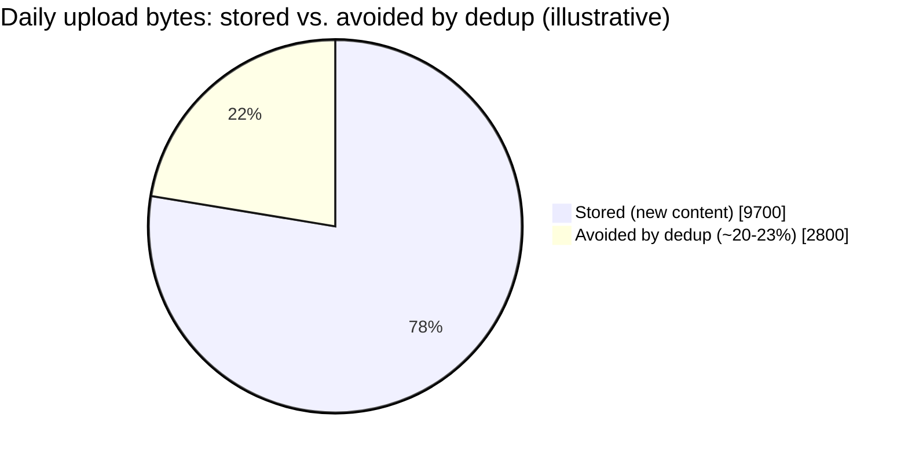

Roughly a fifth of raw daily upload bytes never get written at all — the concrete payoff of
checking dedup before storing, not after.

**Redo-the-chain test:** if near-duplicate detection improves (catching burst-shot sequences more
aggressively), dedup savings rise correspondingly — a direct, computable justification for
investing further in the perceptual-hashing deep dive's accuracy.

**The number worth memorizing:** at this scale, dedup savings are measured in petabytes per day,
and the vast majority of stored bytes at any moment are cold, rarely-accessed data — both facts
argue strongly against a naive "store everything at full size on the fastest tier forever" design.

---

## API design

### `POST /v1/photos/upload` (resumable, chunked)

```json
{
  "uploadId": "u_88213",
  "contentHash": "sha256:...",
  "totalBytes": 2621440,
  "chunkIndex": 3,
  "totalChunks": 10
}
```

Response, once all chunks received:
```json
{
  "photoId": "p_71209",
  "status": "STORED",
  "dedupResult": "NEW_CONTENT",
  "searchIndexStatus": "PENDING"
}
```

| Field | Notes |
|---|---|
| `contentHash` | Computed client-side where possible and verified server-side — the exact-match half of the dedup check happens before new bytes are even fully committed to storage |
| `dedupResult` | `NEW_CONTENT`, `EXACT_DUPLICATE`, or `NEAR_DUPLICATE` — exposed so the client can show appropriate UI (e.g., silently link to the existing photo rather than displaying a new one) |
| `searchIndexStatus` | `PENDING` immediately after upload — the photo is stored and viewable, but not yet content-searchable; this status transitions to `INDEXED` asynchronously |

### `GET /v1/search?q=beach+sunset`

```json
{
  "results": [
    { "photoId": "p_44821", "score": 0.91, "matchedTags": ["beach", "sunset", "ocean"] }
  ]
}
```

**The one sentence worth saying about the API surface:** *"Upload acknowledgment and
search-readiness are two different completion signals — a photo is `STORED` and viewable within
seconds, but `searchIndexStatus` may stay `PENDING` for minutes while the async ML pipeline catches
up, and the API makes that distinction explicit rather than pretending both happen atomically."*

---

## High-level architecture

### Architecture evolution (v1 → v2 → v3)

**v1 — store every upload's bytes, no dedup, no async enrichment:**


**Why it breaks:** storing every upload's bytes with no dedup wastes petabytes per day (per the
capacity estimate's ~20-23% dedup-savings figure); and running ML tagging synchronously before
acknowledging the upload means a slow model inference directly delays how quickly a photo appears
in the user's library — an unnecessary coupling of two operations with very different latency
requirements.

**v2 — dedup at upload time, but still synchronous ML enrichment:**


**Why it breaks:** dedup now saves real storage, but the upload path is still gated on ML
inference completing — for a large batch upload (a user importing thousands of old photos at
once), this couples upload throughput directly to ML inference throughput, which is a much
scarcer, more expensive resource than storage write throughput.

**v3 — the real system: dedup at upload time, fully async ML enrichment, tiered storage:**

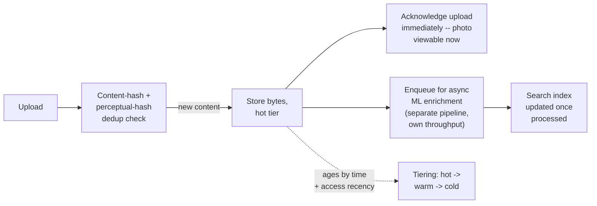

**What v3 fixes, one line each:** dedup happens before storing new bytes, capturing the storage
savings up front; upload acknowledgment happens immediately after storage, decoupled from ML
inference entirely; ML enrichment runs as its own async pipeline sized for throughput rather than
per-upload latency; and storage tiering moves the (per the capacity estimate) overwhelming
majority of cold bytes off the expensive hot tier over time.

---

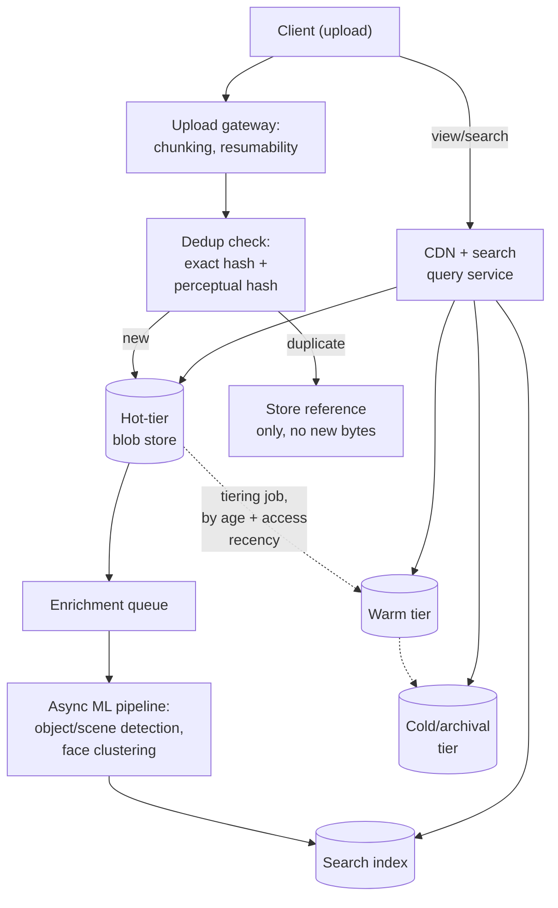

| Component | Role |
|---|---|
| Upload gateway | Handles chunked, resumable upload — see the [upload-pipeline deep dive](#deep-dive-upload-pipeline--resumability) |
| Dedup check | Exact hash first (cheap, catches byte-identical uploads), perceptual hash second (catches near-duplicates) — see the [dedup deep dive](#deep-dive-exact--perceptual-deduplication) |
| Enrichment queue + ML pipeline | Fully decoupled from the upload path, sized for throughput | 
| Tiering job | Background process moving data across hot/warm/cold tiers based on age and access recency, not gating any user-facing operation |
| CDN + query service | Serves both direct photo access and search queries, transparently across whichever tier a given photo currently lives in |

---

## End-to-end request walkthroughs

### Walkthrough 1 — a new photo upload, exact-duplicate detected

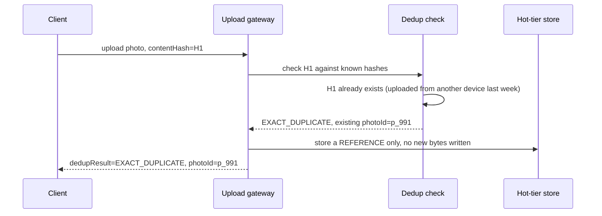

### Walkthrough 2 — new content, async enrichment completes minutes later

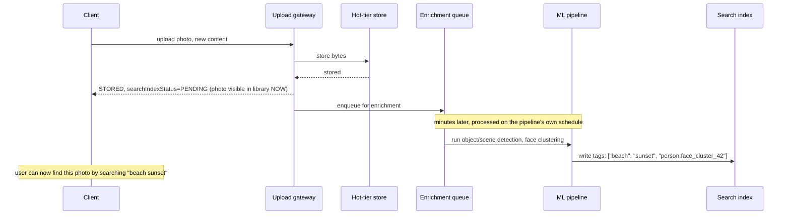

The gap between "visible in library" (walkthrough 2, immediately) and "searchable by content"
(minutes later) is the deliberate, accepted asynchrony this chapter's non-functional requirements
call for.

### Walkthrough 3 — a cold-tier photo gets resurfaced and promoted back to hot

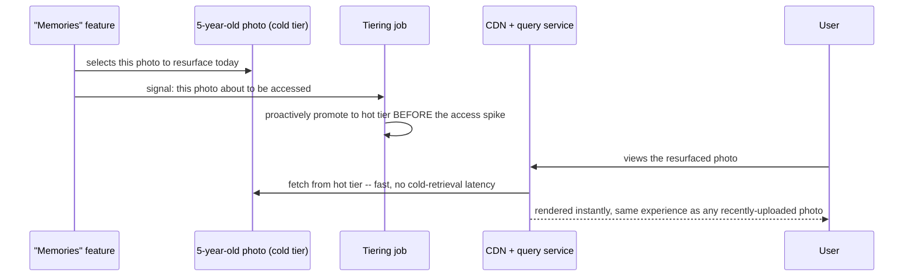

This is the concrete case behind the [tiering deep dive](#deep-dive-storage-tiering)'s point that
tiering must key off access recency, not just upload age — proactive promotion ahead of a known
resurfacing event avoids the cold-retrieval latency spike entirely.

---

## Deep dive: exact + perceptual deduplication

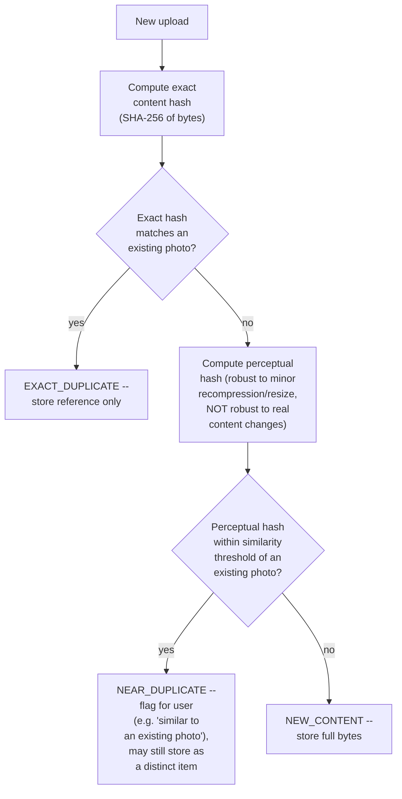

**Why two hash types, not one:** an exact content hash (SHA-256 or similar) catches byte-identical
files cheaply and with zero false positives, but fails completely on a photo that's been
re-compressed, resized, or re-saved by a different app — even a single-pixel or metadata
difference changes the exact hash entirely. A perceptual hash (robust to those cosmetic
transformations, sensitive to genuine content differences) catches the near-duplicate case exact
hashing misses.

**Why near-duplicates are often flagged rather than silently merged like exact duplicates:** unlike
an exact duplicate (unambiguously the same file), a near-duplicate might be a burst-mode shot the
user actually wants to keep as a distinct photo (choosing the best one later) — silently discarding
it the way an exact duplicate is handled risks deleting content the user considers meaningfully
different, even if a hash algorithm considers it visually similar.

**Interview cheat-sheet:** *"Exact hashing catches byte-identical uploads cheaply with zero false
positives; perceptual hashing catches near-duplicates that exact hashing misses, but is
probabilistic — treat exact matches as safe to silently dedup, and near-matches as a signal to
flag rather than to automatically discard."*

---

## Deep dive: async ML enrichment pipeline

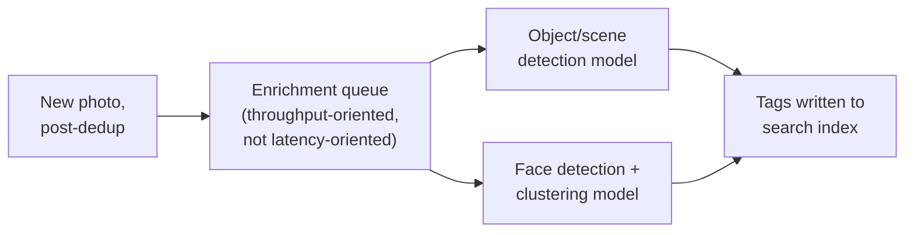

**Why this must be decoupled from the upload path, not just "fast enough":** ML inference
throughput is a fundamentally scarcer, more expensive resource than blob storage write
throughput — coupling upload acknowledgment to inference completion means a large batch import
(a user uploading years of old photos) directly stresses the inference fleet's capacity in a way
that would otherwise just be a queue depth number, invisible to the user, if properly decoupled.

**Face clustering is a distinct, harder ML problem from object/scene tagging, worth naming
separately:** object/scene detection is a per-photo classification problem; face clustering
requires grouping faces **across** the entire library into consistent per-person clusters (so
searching "photos of Mom" works), which is inherently a batch/incremental clustering problem over
the whole enrichment pipeline's output, not a simple per-photo inference call.

**Interview cheat-sheet:** *"ML enrichment is a fully async, throughput-sized pipeline, decoupled
from upload latency entirely — and face clustering specifically is a cross-photo clustering
problem, not just another per-photo tag, worth calling out as architecturally distinct from
object/scene detection."*

---

## Deep dive: storage tiering

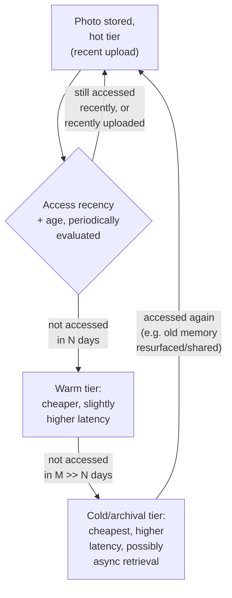

**Why tiering must key off access recency, not just age:** per the capacity estimate, the vast
majority of the library is cold at any moment — but a 5-year-old photo that gets resurfaced (a
"memories" feature reminds the user, or it's shared to someone else) becomes hot again briefly;
tiering purely by upload age would leave that photo stranded on a slow tier during exactly the
moment it's being actively viewed. Recency of **access**, not age of **upload**, is the signal
that should drive tier placement, with age as a secondary/default signal for content that's
simply never revisited.

**Why this must be fully transparent to the serving path:** a user or the search index should
never need to know or care which tier a photo currently lives in — the CDN/query service
abstracts this, fetching from whichever tier holds the data and (for the coldest tier, if async
retrieval is involved) handling any added latency gracefully rather than surfacing it as an error.

**Interview cheat-sheet:** *"Tier by access recency, not just upload age — a resurfaced old photo
needs to behave like a hot one, not stay stranded on a cold tier just because it's old. And
tiering must be fully transparent to the serving path; users should never perceive which tier
their data lives on, only occasionally a latency difference for genuinely cold retrieval."*

---

## Deep dive: upload pipeline & resumability

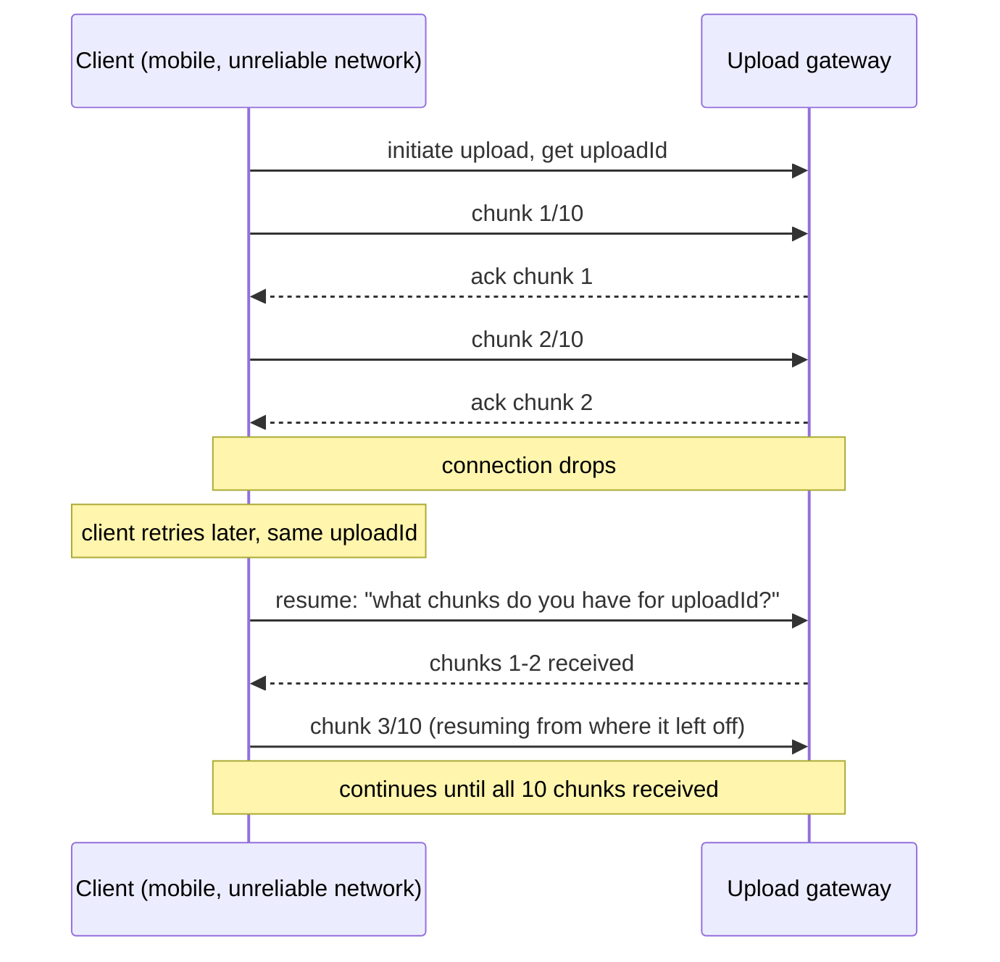

**Why chunked, resumable upload, not a single atomic PUT:** mobile clients on unreliable networks
uploading multi-megabyte (or tens-of-megabyte, for video) files need to survive a dropped
connection without restarting from byte zero — this is the same resumable-transfer discipline as
any large-file upload system, essential here specifically because the client population is
dominated by mobile devices on variable connectivity.

**Client-side hashing, where feasible:** computing the content hash on-device before or during
upload lets the client potentially skip re-uploading bytes entirely if the server already reports
the content as a known duplicate — a bandwidth saving on top of the storage saving dedup already
provides.

**Interview cheat-sheet:** *"Uploads are chunked and resumable by design, given the mobile-heavy
client population — and computing the content hash client-side lets a duplicate be detected
before most or all of the bytes are even re-uploaded, saving bandwidth in addition to storage."*

---

## Data model

**Photo lifecycle:**

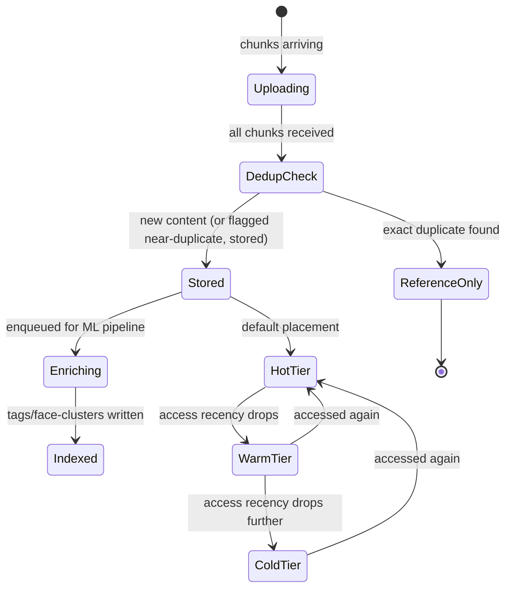

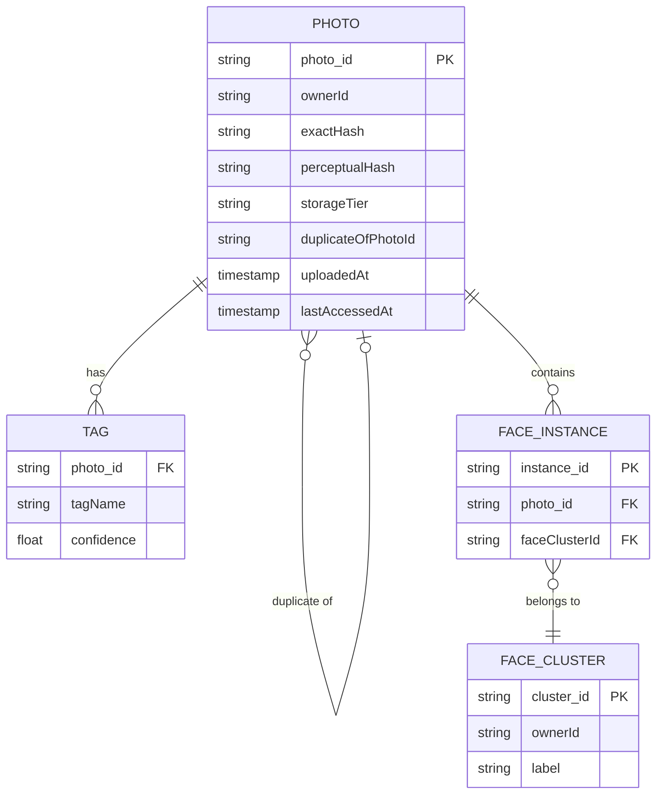

| Table | Storage choice & why |
|---|---|
| `Photo` | Metadata record per photo, including `storageTier` and `lastAccessedAt` — the fields the tiering job reads to make placement decisions |
| `Tag` / `FaceInstance` / `FaceCluster` | The search index's underlying data, populated entirely by the async ML pipeline, never synchronously at upload time |

---

## Failure modes & mitigations

| Failure mode | Impact | Mitigation |
|---|---|---|
| **Perceptual hash false-positives a genuinely different photo as a near-duplicate** | User's distinct photo gets incorrectly flagged/merged | Near-duplicates are flagged for user confirmation or kept as distinct items by default, never silently discarded the way exact duplicates are — bounds the damage of a false positive |
| **ML enrichment pipeline falls behind (backlog)** | Search results miss recently-uploaded photos for longer than expected | This degrades search completeness, not upload durability or library visibility — an acceptable, monitored degradation with an SLA on enrichment lag, not a hard failure |
| **A cold-tier retrieval is slower than expected** | User views an old photo and experiences a latency spike | Should never surface as an error — the serving path retries/waits gracefully, and if a photo is about to be prominently resurfaced (e.g. a "memories" feature knows in advance), it can be proactively promoted to a warmer tier ahead of expected access |
| **Upload interrupted partway, never resumed** | Partial upload data lingers | Garbage-collect incomplete uploads past a reasonable TTL, since an abandoned upload's partial chunks serve no purpose |

---

## Non-functional walkthrough

**Scaling storage is fundamentally a blob-store scaling problem, made tractable by dedup and
tiering** — per the capacity estimate, dedup avoids a meaningful fraction of raw bytes entirely,
and tiering keeps the (much larger) cold-data volume on cheap storage rather than requiring the
whole ever-growing library to live on the fastest, most expensive tier indefinitely.

**Scaling ML enrichment is a separate, throughput-oriented scaling problem from storage** — sized
by inference capacity and queue depth targets, entirely decoupled from upload-path latency
requirements, as established in the enrichment deep dive.

**Consistency between "photo stored" and "photo searchable" is deliberately eventual**, with an
explicit status field making the gap visible to clients rather than hidden — the same "state the
staleness bound explicitly" instinct as the slow-external-authority chapters elsewhere in this
course, applied here to an internal async pipeline rather than an external dependency.

---

## Security & compliance

- **Photos are highly sensitive personal data** — access control must be strict and per-owner by
  default, with sharing (albums, links) as an explicit, auditable grant rather than a default-open
  posture.
- **Face clustering has real privacy sensitivity** and is subject to specific regulations in some
  jurisdictions (biometric data handling) — this should be an explicit, consent-gated feature, not
  silently always-on, and worth naming if asked about privacy considerations.
- **Dedup across users must never leak content between accounts** — a global exact/perceptual hash
  index used for storage efficiency must still enforce that a match against another user's photo
  never grants this user visibility into that photo; deduplication should typically be scoped to
  reduce redundant *storage* while access control remains fully per-owner, or explicit
  cross-user dedup requires careful, deliberate design to avoid an information-leak side channel.

---

## Cost & trade-offs

**Dedup investment (perceptual hashing infrastructure, near-duplicate UX) trades engineering
complexity for petabyte-scale storage savings** — per the capacity estimate, a clearly justified
trade at this scale.

**Storage tiering trades retrieval-latency risk on cold data for large ongoing storage-cost
savings** — the vast majority of stored bytes benefit from cheaper tiers precisely because they're
rarely if ever retrieved; the cost of occasionally slower cold-tier access is small relative to
the storage savings across the whole library.

---

## Wrap-up: MVP vs. stretch

**In scope for an MVP:**
- Chunked, resumable upload with exact-hash deduplication.
- Async ML enrichment pipeline for basic object/scene tagging, decoupled from upload latency.
- Two-tier storage (hot + cold) based on simple age-based rules.

**Explicitly out of scope for an MVP:**
- Perceptual-hash near-duplicate detection — start with exact-hash dedup (simpler, zero false
  positives), add near-duplicate detection once its accuracy/UX trade-offs are well understood.
- Face clustering — a genuinely harder ML problem than object/scene tagging; start search with
  object/scene tags, add face-based search as a distinct follow-on feature.

**Stretch goals, worth naming if asked "what's next":**
1. **Perceptual-hash near-duplicate detection**, with a considered UX for how flagged
   near-duplicates are surfaced to the user.
2. **Face clustering** for "search by person," with explicit privacy/consent handling.
3. **Access-recency-aware tiering with proactive promotion** ahead of predictable resurfacing
   events (e.g. a "memories" feature), rather than purely reactive tier movement.

---

## Golden rules

- **Dedup before storing new bytes, not after** — the storage savings only materialize if the
  check happens at upload time, before committing new content.
- **Never gate upload acknowledgment on ML enrichment completing** — a photo should be viewable
  in the library long before it's content-searchable; these are two different completion signals.
- **Exact-hash dedup is safe to apply silently; perceptual near-duplicate matches should be
  flagged, not silently discarded** — the two have very different false-positive risk profiles.
- **Tier by access recency, not just upload age** — a resurfaced old photo needs to behave like a
  hot one.
- **ML enrichment, especially face clustering, is a throughput-oriented, cross-photo batch problem
  — architect it as its own pipeline, not an inline per-upload step.**

---

## Master cheat sheet

**One-liners:**
- This is a blob-store-plus-CDN problem with three product layers on top: dedup before storing,
  async ML enrichment after storing, and access-recency-driven tiering over time.
- Exact-hash dedup catches byte-identical uploads with zero false positives; perceptual hashing
  catches near-duplicates but is probabilistic — treat the two with different confidence.
- Upload-visible and search-searchable are two different completion signals — the gap between
  them is deliberate, asynchronous, and should be exposed explicitly in the API, not hidden.
- Tier storage by access recency, not upload age alone, or a resurfaced old photo gets stranded on
  a slow tier at exactly the moment it's being viewed.
- Face clustering is a cross-photo batch-clustering problem, architecturally distinct from
  per-photo object/scene tagging.

**Formula chain:**
```
raw_daily_bytes       = uploads_per_day x avg_bytes_per_upload
dedup_savings_bytes    = raw_daily_bytes x dedup_rate   [exact + near-duplicate combined]
cold_tier_fraction     = 1 - fraction_accessed_in_recent_window   [typically the large majority]
```

**Numbers:** dedup typically saves 20%+ of raw upload bytes at real-world rates · the large
majority (often 90%+) of a mature photo library's stored bytes are cold (not accessed in the last
30 days) at any given moment · ML enrichment lag is measured in minutes, an accepted asynchronous
gap between "stored" and "searchable."
