# Design a Recommendation Engine (Netflix/YouTube-style) — FAANG Interview Guide

> Source chapter type: ML-serving-in-product infrastructure. Shares the offline-training/
> online-serving split with
> [the fraud detection chapter](./56-Design-a-Fraud-Detection-System-FAANG-Guide.md) and the
> two-stage funnel with [the Airbnb search chapter](./52-Design-Airbnb-Search-Ranking-FAANG-Guide.md),
> but the defining new problem here is **measuring whether recommendations are actually good** —
> which requires an experimentation platform as a first-class part of the system, not an
> afterthought, plus a defined answer for the **cold-start problem** (a brand new user or a brand
> new item with no interaction history at all).

## Mental model

A recommendation engine has to pick, from potentially millions of items, the handful most likely
to be relevant to *this* user, *right now* — and do it in milliseconds. The two-stage funnel from
the Airbnb chapter applies here too (candidate generation, then ranking), but three problems are
specific to this domain:

1. **Candidate generation over millions of items needs an efficient similarity search**, typically
   over learned embeddings (represented as vectors) rather than explicit rules — "find items
   similar to what this user has watched" is an approximate-nearest-neighbor search problem, not a
   database filter.
2. **The cold-start problem.** A brand-new user has no watch history to personalize from; a
   brand-new item has no interaction data yet to know who'd like it. Both need a defined fallback
   strategy, or the system either shows generic, low-value recommendations to new users forever,
   or never surfaces new content at all.
3. **Measuring quality requires a real experimentation platform.** "Is ranking model B better than
   model A" can't be answered by eyeballing outputs — it requires running true randomized
   experiments (A/B tests) at scale, with the statistical rigor to avoid drawing wrong conclusions
   from noisy engagement data.

**The one sentence to say out loud:** *"Recommendation quality isn't something you compute once
and ship — it's something you continuously measure through an experimentation platform, because
you're optimizing a moving target (evolving user taste, a growing catalog) using a noisy proxy
signal (clicks/watches) for what you actually care about (long-term satisfaction)."*

**The one picture to remember forever:**

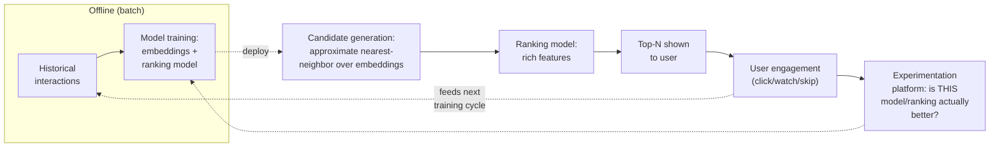

**Memory hook:** *"Offline trains it, online serves it two-stage (candidates then ranking), and
the experimentation platform is what tells you whether any of it actually worked — that last box
is not optional."*

---

## Table of contents
[How to Identify This Topic](#how-to-identify-this-topic-in-an-interview) ·
[Interview Playbook](#interview-playbook) · [Requirements](#requirements-clarification) ·
[Capacity Estimation](#capacity-estimation-worked) · [API Design](#api-design) ·
[High-Level Architecture](#high-level-architecture) ·
[Architecture Evolution v1→v2→v3](#architecture-evolution-v1--v2--v3) ·
[End-to-End Walkthroughs](#end-to-end-request-walkthroughs) ·
[Deep Dive: Embedding-Based Candidate Generation](#deep-dive-embedding-based-candidate-generation) ·
[Deep Dive: The Cold-Start Problem](#deep-dive-the-cold-start-problem) ·
[Deep Dive: Experimentation Platform](#deep-dive-experimentation-platform) ·
[Deep Dive: Feature Store Consistency](#deep-dive-feature-store-consistency) ·
[Data Model](#data-model) · [Failure Modes](#failure-modes--mitigations) ·
[Non-Functional Walkthrough](#non-functional-walkthrough) ·
[Security & Compliance](#security--compliance) · [Cost & Trade-offs](#cost--trade-offs) ·
[Wrap-Up](#wrap-up-mvp-vs-stretch) · [Golden Rules](#golden-rules) ·
[Cheat Sheet](#master-cheat-sheet)

---

## How to identify this topic in an interview

- "Design Netflix's/YouTube's/Spotify's recommendation system."
- The tell that this is the ML-infra chapter and not a plain search/ranking chapter: the
  interviewer emphasizes **personalization at scale** and often **how you'd know it's working** —
  the second half of that is the signal to bring up the experimentation platform unprompted.
- A follow-up like "what do you recommend to a user who just signed up" is the
  [cold-start deep dive](#deep-dive-the-cold-start-problem) — one of the most commonly probed
  edge cases in this chapter.

---

## Interview playbook

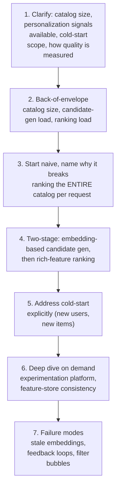

**What the interviewer is actually grading at each step:**
- Step 3: do you recognize, unprompted, the same funnel-scaling math as the Airbnb chapter —
  ranking millions of catalog items per request with an expensive model doesn't fit any real
  latency budget?
- Step 5: do you propose a *specific* cold-start strategy (popularity-based fallback,
  content-based similarity using item metadata, rapid onboarding signal collection) rather than
  hand-waving "we'd figure something out"?
- Step 6: do you bring up the experimentation platform and feedback-loop risks (filter bubbles,
  popularity bias) unprompted, or only when asked "how do you know this works"?

---

## Requirements clarification

### Functional

| # | Requirement | Notes |
|---|---|---|
| F1 | Generate a personalized ranked list of items for a user, given their interaction history | The core output |
| F2 | Handle new users and new items gracefully (cold start) | Not an edge case to defer — it's a continuous, ongoing state for some fraction of users/items at all times |
| F3 | Support running controlled experiments comparing ranking approaches | A first-class requirement, not an afterthought analytics feature |
| F4 | Incorporate recent engagement (a user just watched something) into near-term personalization | Freshness matters — a user's most recent action is often the strongest personalization signal available |
| F5 | Avoid over-narrowing recommendations to a filter bubble | A product-health requirement, not purely an engagement-maximization one |

### Non-functional

| Requirement | Target | Why this number |
|---|---|---|
| Recommendation latency (p99) | Low hundreds of milliseconds | An interactive "here's what to watch/listen to next" surface, same UX bar as search |
| Candidate-generation throughput | Must handle catalog sizes of millions of items without per-request cost scaling with catalog size | The core scaling requirement — see the embedding deep dive |
| Personalization freshness | Minutes for near-term signal (just-watched item), longer for deeper model updates | Two different freshness bars, similar in spirit to other ML-serving chapters in this course |
| Experiment statistical validity | Must support proper randomized controlled experiments with adequate sample size/duration | Bad experimentation methodology leads to shipping changes that look good in a noisy short-term metric but aren't actually better |
| Cold-start coverage | Every user/item must get a defined, non-degenerate recommendation experience from their very first interaction | No "blank screen" or purely random state |

**Clarifying questions worth asking the interviewer up front — and what each answer changes:**

| Question | If the answer is... | ...then this changes |
|---|---|---|
| "What personalization signals are available — explicit ratings, implicit watch/click behavior, or both?" | Primarily implicit (watches, skips, dwell time) | Confirms the model architecture should be built around implicit feedback, which is noisier and needs different handling than explicit ratings |
| "How should we measure recommendation quality — a single metric, or several?" | Multiple (engagement + longer-term retention/satisfaction) | Confirms the experimentation platform needs to track guardrail metrics beyond the primary optimization target, same lesson as the Airbnb marketplace-health deep dive |
| "How large and how fast-growing is the catalog?" | Millions of items, growing continuously | Confirms embedding-based candidate generation is necessary, not optional, and that cold-start for new items is a continuous, not rare, concern |
| "Is filter-bubble/diversity a stated product concern?" | Yes | Confirms diversity/exploration needs to be an explicit design element, not left to emerge from pure engagement optimization |

**Say this out loud in the interview:** *"I'd treat the experimentation platform as a core system
component, not a separate analytics concern — because the entire point of this system is
optimizing a metric, and without rigorous experimentation you can't actually tell whether any
change to the model or ranking made things better or just noisier."*

---

## Capacity estimation, worked

```
Given (illustrative, a video streaming platform):
  Catalog size                                    = 5,000,000 items
  Active users                                     = 200,000,000
  Recommendation requests/day (home screen loads,
    "up next" surfaces, etc.)                       = 2,000,000,000
  Peak request QPS                                  = 2,000,000,000 / 86,400 ~= 23,000 average,
                                                        say ~80,000 QPS at peak

Naive single-stage ranking (rank the whole catalog per request):
  Ranking-model calls per request if scoring
    the full catalog                                  = 5,000,000
  At 80,000 QPS peak                                   = 400,000,000,000 model-scoring calls/sec
  -> obviously impossible -- this is the same order-of-magnitude absurdity as the Airbnb
     chapter's naive-ranking math, just with a much larger catalog, and it's what makes a
     single-stage design a non-starter before any other consideration.

Two-stage funnel:
  Candidate generation (embedding similarity search)  -> narrows 5,000,000 to ~1,000 candidates
  Ranking model scores only those ~1,000
  Ranking-model calls/sec at peak                      = 80,000 x 1,000 = 80,000,000/sec
  -> still large, but ~5,000x less than the naive full-catalog approach -- and candidate
     generation itself (an approximate-nearest-neighbor lookup, not a per-item model score) is
     far cheaper per call than a full ranking-model inference, making this the tractable split.

Embedding index size:
  Items                                                = 5,000,000
  Embedding dimensionality                             = 256
  Bytes per embedding (float32)                         = 256 x 4 = 1,024 bytes (~1KB)
  Total embedding index size                            = 5,000,000 x 1KB ~= 5 GB
  -> comfortably fits in memory on a well-provisioned ANN-serving fleet, similar in shape to the
     vector-index sizing math in the AI-code-assistant chapter's repo-embedding index.

Cold-start volume:
  New users signing up per day                          = ~500,000
  New items added to catalog per day                    = ~2,000
  -> both are small relative to total users/catalog, but represent a CONTINUOUS, never-zero
     population needing a defined fallback strategy at all times, not a rare edge case.
```

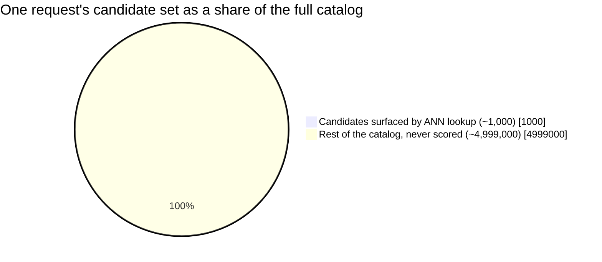

Candidate generation touches a vanishingly small slice of the catalog per request — the ranking
model then only ever has to look at that slice, not the whole pie.

**Redo-the-chain test:** if candidate generation narrows to 500 items instead of 1,000, ranking
load halves — a direct, computable trade-off between candidate-set size (affecting recall — could
a good item be missed before ranking even sees it) and ranking-model load, the same tension as the
Airbnb chapter's light-ranker-recall concern.

**The number worth memorizing:** two-stage candidate-generation-then-ranking cuts ranking-model
load by orders of magnitude relative to scoring the full catalog — this is not a nice-to-have
optimization, it's what makes personalized ranking at a multi-million-item catalog possible within
any realistic latency budget at all.

---

## API design

### `GET /v1/recommendations?userId=u_881&surface=home`

```json
{
  "userId": "u_881",
  "recommendations": [
    { "itemId": "i_44821", "score": 0.93, "reason": "similar_to_recent_watch" },
    { "itemId": "i_99021", "score": 0.88, "reason": "popular_in_your_region" }
  ],
  "modelVersion": "rank_v42",
  "experimentGroup": "treatment_b"
}
```

| Field | Notes |
|---|---|
| `reason` | A coarse explanation category — useful for product UX ("because you watched X") and for debugging why an item was surfaced, similar in spirit to the explainability fields in the fraud-detection and sanctions-screening chapters |
| `experimentGroup` | Which experiment variant produced this response — necessary for the experimentation platform to attribute engagement outcomes back to the correct variant |

### `POST /v1/events/engagement` (feedback signal)

```json
{ "userId": "u_881", "itemId": "i_44821", "eventType": "WATCHED", "watchedSeconds": 1800 }
```

Feeds both near-term personalization (this session's signal) and the offline training pipeline's
next cycle.

**The one sentence worth saying about the API surface:** *"Every recommendation response carries
its experiment group and model version — without that, engagement events can't be reliably
attributed back to what actually produced the recommendation, and the experimentation platform
has nothing to measure against."*

---

## High-level architecture

### Architecture evolution (v1 → v2 → v3)

**v1 — rank the entire catalog per request:**

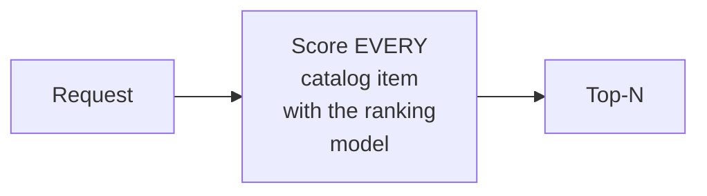

**Why it breaks:** per the capacity estimate, this is off by many orders of magnitude from any
servable throughput at real catalog size and request volume.

**v2 — two-stage funnel, but no experimentation platform:**

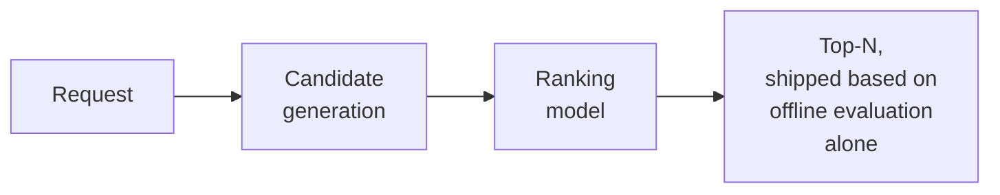

**Why it breaks:** the funnel now scales, but "shipped based on offline evaluation alone" is a
real gap — offline metrics (how well a model predicts historical engagement) don't reliably
predict how a *change* to the system affects *real* user behavior going forward, especially once
the recommendations themselves start influencing what users interact with next (the same kind of
feedback loop as the surge-pricing chapter, here affecting what training data looks like in the
future).

**v3 — the real system: two-stage funnel + first-class experimentation + explicit cold-start
handling:**

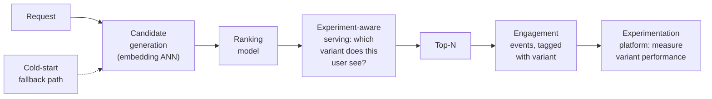

**What v3 fixes, one line each:** the two-stage funnel (already motivated) makes serving
tractable; tagging every response with its experiment variant and feeding engagement back through
a real experimentation platform is what actually tells you whether a change helped; and an
explicit cold-start fallback path ensures new users/items never fall into an undefined or
degenerate state.

---

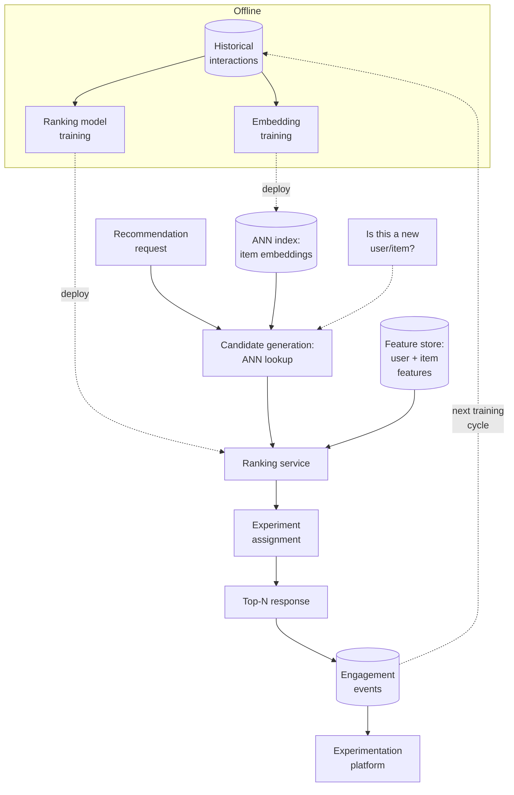

| Component | Role |
|---|---|
| ANN index | Approximate-nearest-neighbor structure over item embeddings — the candidate-generation mechanism, see the embedding deep dive |
| Ranking model | Rich-feature model scoring only the small candidate set the ANN index returns |
| Experiment assignment | Determines which model/ranking variant a given user/request is part of, and tags the response accordingly |
| Experimentation platform | Consumes tagged engagement events to measure variant performance with statistical rigor — see its own deep dive |
| Cold-start check | A distinct path invoked for new users/items, bypassing the normal personalization signal that doesn't exist yet |

---

## End-to-end request walkthroughs

### Walkthrough 1 — an established user, normal personalized flow

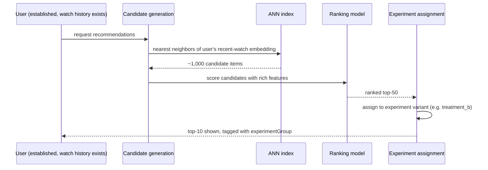

### Walkthrough 2 — a brand-new user, cold start

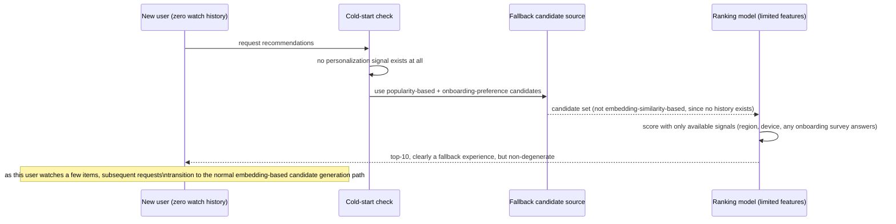

Walkthrough 2 is the concrete answer to "what do you show a user with zero history" — never a
blank state, never pure randomness, but a defined, distinct code path using whatever weaker
signals are actually available.

### Walkthrough 3 — an experiment reaches significance and ships

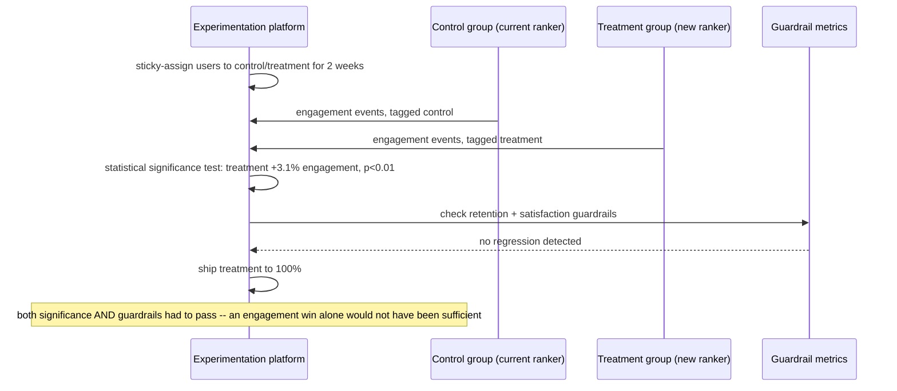

This is the concrete process behind the [experimentation-platform deep dive](#deep-dive-experimentation-platform)
— a change only ships when it clears both the statistical bar and the guardrail-metric bar, never
either alone.

---

## Deep dive: embedding-based candidate generation

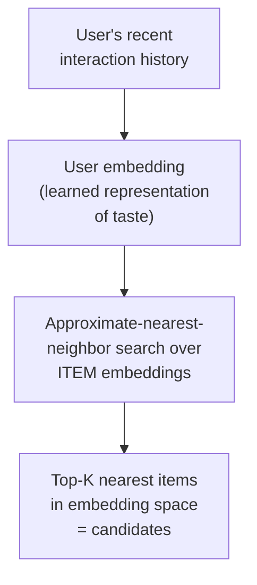

**Why approximate, not exact, nearest-neighbor search:** exact nearest-neighbor search over
millions of high-dimensional vectors is itself too slow for a real-time serving budget —
approximate methods (e.g., graph-based or quantization-based ANN indexes) trade a small amount of
recall for a large speedup, the same "good enough, fast" trade-off philosophy as sampling or LOD
tiering elsewhere in this course, applied to vector search specifically.

**Why embeddings, not explicit rules ("if user watched genre X, recommend genre X"):**
embeddings, learned from actual interaction patterns, capture latent similarity that explicit
rules would never anticipate — two shows might be frequently watched by the same audience for
reasons no human curator would think to encode as a rule, and the embedding space captures that
directly from data.

**Interview cheat-sheet:** *"Candidate generation is an approximate-nearest-neighbor search over
learned item embeddings, not a rules engine — this is what makes 'find similar items among
millions' fast enough to run per-request, at the cost of a small, acceptable amount of recall
versus an exact search."*

---

## Deep dive: the cold-start problem

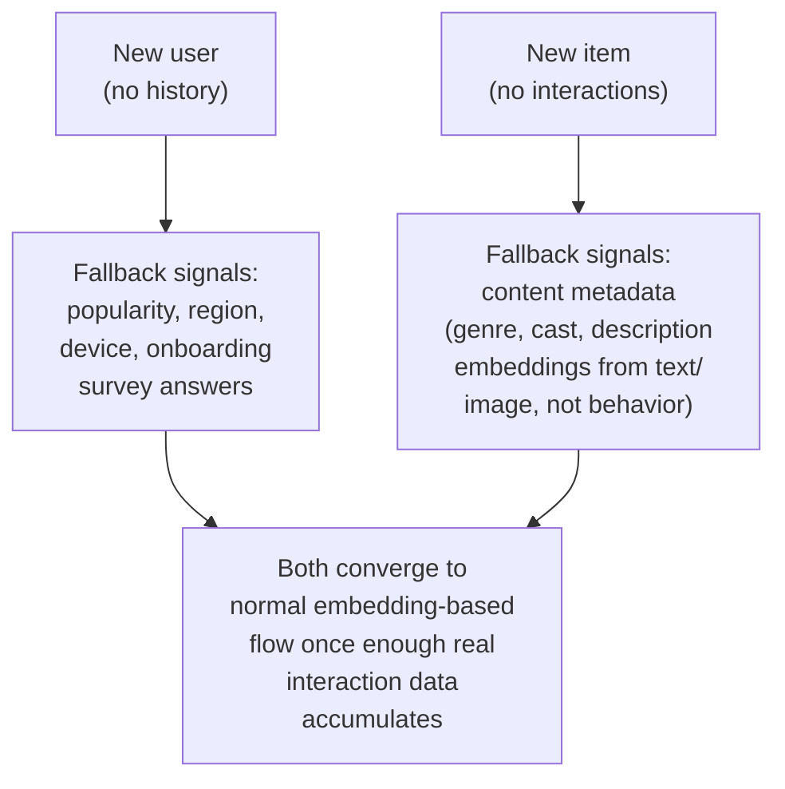

**Why a new item needs content-based candidate generation, distinct from a new user's problem:**
a new item's embedding, if purely learned from interaction data, doesn't exist yet — there's no
behavioral signal to learn from. A content-based embedding (derived from the item's own
metadata/description, using a separate model) gives it *some* representation in a comparable
embedding space before any real interaction data exists, letting it be discoverable at all rather
than invisible until enough people have already watched it — which would otherwise create a
chicken-and-egg problem where nothing new ever gets surfaced.

**Why "converges to the normal flow" is the right framing, not two permanently separate systems:**
cold-start handling should be a temporary, bridging state — as soon as a new user has watched a
few items, or a new item has accumulated some interactions, the system should transition to the
normal embedding-based candidate generation, not keep treating them as perpetually special cases.

**Interview cheat-sheet:** *"Cold-start for a new user means falling back to non-personalized
signals (popularity, region, onboarding answers); cold-start for a new item means using a
content-derived embedding instead of a behavior-derived one, since no interaction data exists yet.
Both are meant to bridge to the normal flow once real signal accumulates, not remain permanent
separate paths."*

---

## Deep dive: experimentation platform

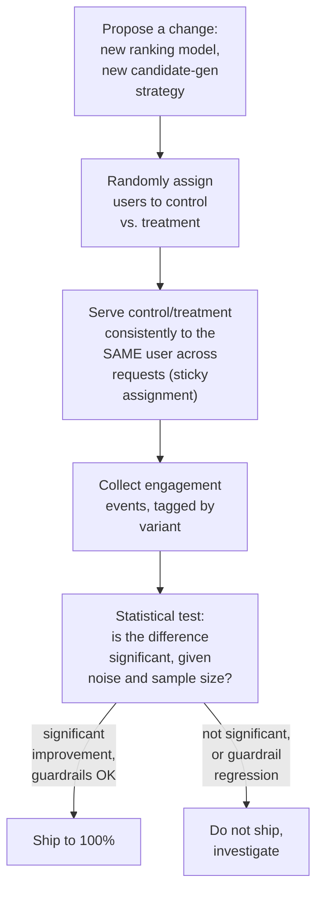

**Why sticky assignment (same user consistently sees the same variant), not per-request random
assignment:** a user bouncing between control and treatment on every request would make their own
engagement pattern incoherent and impossible to attribute to either variant cleanly — consistent
per-user assignment for the duration of an experiment is what makes the resulting engagement data
interpretable.

**Why guardrail metrics matter, not just the primary optimization target:** the same lesson as the
Airbnb marketplace-health deep dive, applied here — a ranking change that increases short-term
engagement (clicks, watches) could do so by promoting sensational or addictive-but-unsatisfying
content, which a longer-term satisfaction/retention guardrail metric would catch even if the
primary click-through metric looks like an improvement.

**Why statistical rigor (proper sample size, significance testing, avoiding peeking at results
too early) matters specifically here:** engagement data is noisy — without rigor, it's easy to
ship a change that looked like an improvement purely due to random variation, and then be unable
to explain why the "improvement" doesn't hold up over time.

**Interview cheat-sheet:** *"The experimentation platform needs sticky per-user variant
assignment, proper statistical significance testing (not just eyeballing a metric), and guardrail
metrics beyond the primary optimization target — without all three, you risk shipping changes that
look good in noisy short-term data but aren't actually improvements."*

---

## Deep dive: feature store consistency

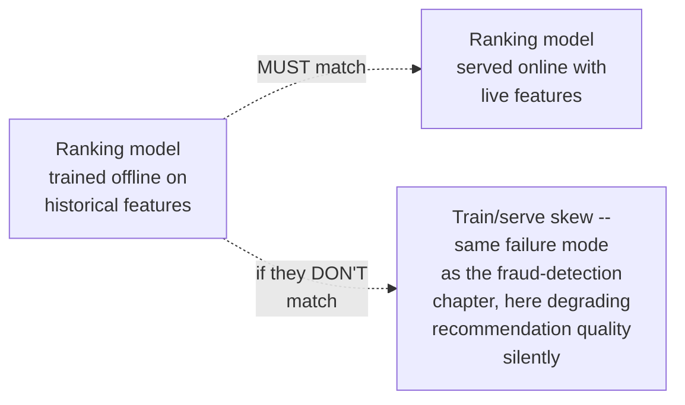

**Why this deep dive exists in this chapter too, not just the fraud-detection one:** any system
combining offline model training with online feature-based serving has this exact risk — a
ranking feature like "user's average session length in the last 7 days" must be computed
identically whether it's being generated for a historical training example or read live at
serving time, or the model's real-world performance silently diverges from what offline evaluation
predicted, with no error thrown to indicate anything is wrong.

**Interview cheat-sheet:** *"Same principle as the fraud-detection chapter — one shared feature
definition for both training and serving, never two independently-implemented versions of 'the
same' feature, or the model quietly performs differently in production than its offline metrics
suggested."*

---

## Data model

**Recommendation-response lifecycle, tied to the experimentation platform:**

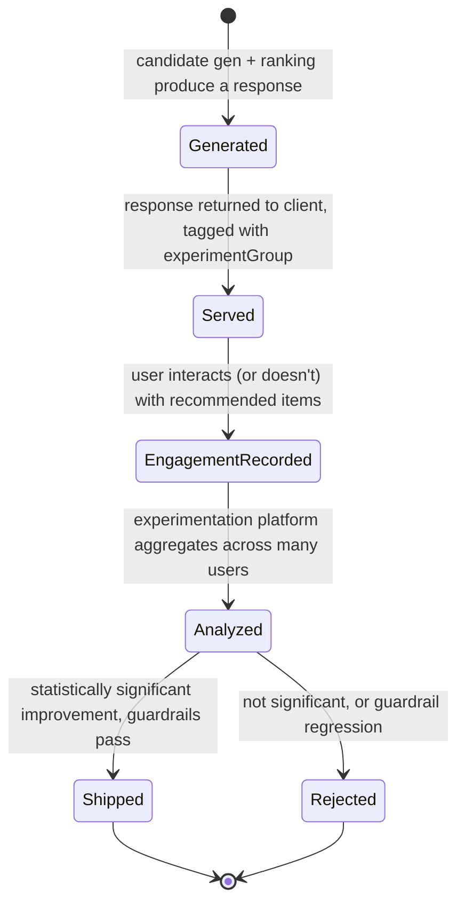

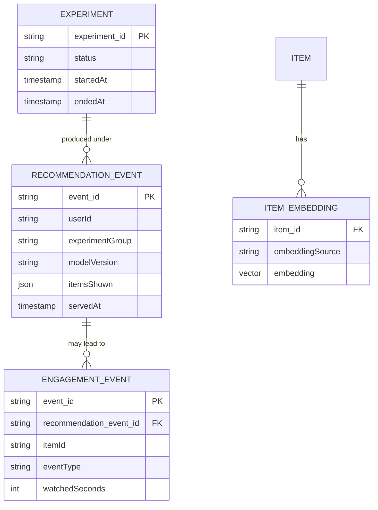

| Table | Storage choice & why |
|---|---|
| `RecommendationEvent` / `EngagementEvent` | High-write-throughput, append-only — the raw data the experimentation platform aggregates over |
| `ItemEmbedding` | A vector store, similar in shape to the AI-code-assistant chapter's repo-embedding index — `embeddingSource` (behavioral vs. content-derived) distinguishes normal items from cold-start items using a content-based fallback |

---

## Failure modes & mitigations

| Failure mode | Impact | Mitigation |
|---|---|---|
| **Feedback loop narrows recommendations over time** (a filter bubble — the model increasingly only recommends what it's already recommended, reinforcing itself) | Reduced content diversity, potential long-term user dissatisfaction despite stable short-term engagement metrics | Explicit exploration/diversity injection in candidate generation (deliberately including some less-obvious candidates), monitored as its own guardrail metric, not left to emerge from pure engagement optimization |
| **ANN index becomes stale relative to a fast-evolving catalog** | New items or shifted user tastes aren't reflected in candidate generation | Regular re-embedding/re-indexing cadence, similar cadence trade-off discussion as the incremental-indexing deep dive in the AI-code-assistant chapter |
| **An experiment is stopped early based on an initially-promising but not-yet-significant result** | Ships a change that isn't actually an improvement, based on noise | Enforce a pre-registered minimum sample size/duration before evaluating significance — a process discipline, not a purely technical fix |
| **Cold-start fallback signals are themselves biased** (e.g. popularity-based fallback always favors already-popular content, starving new/niche content of any initial exposure) | New items struggle to ever break out of the cold-start state | Reserve some exploration budget even within the cold-start fallback path, not purely popularity-ranked |

---

## Non-functional walkthrough

**Scaling candidate generation is an ANN-index-serving problem** — per the capacity estimate, a
multi-million-item embedding index is a few GB, comfortably shardable and replicable, with the
approximate-search algorithm's own tunable recall/latency trade-off as the main scaling lever.

**Scaling the ranking stage benefits from the same two-stage-funnel discipline as the Airbnb
chapter** — cost scales with candidate-set size, not catalog size, once the funnel is in place.

**Consistency between offline-trained and online-served features must be tight (see the feature-
store deep dive), while personalization freshness itself can be looser (minutes)** — two different
consistency concerns, worth distinguishing explicitly if asked to characterize this system's
consistency model.

---

## Security & compliance

- **Recommendation explanations and personalization signals can reveal sensitive inferred
  attributes** (viewing history can correlate with protected characteristics) — the same fairness/
  discrimination-auditing concern raised in the Airbnb and fraud-detection chapters applies here,
  arguably with higher stakes given how directly recommendations shape what content someone sees.
- **A/B testing on real users raises its own ethics considerations** — particularly for
  experiments that could measurably affect user well-being (e.g. testing more engagement-maximizing
  but less satisfying content), worth naming as a real, non-purely-technical consideration for
  the experimentation platform's governance.
- **User engagement history is sensitive personal data** and should follow standard access-control
  and retention practices, with clear policies on how long raw engagement events are retained
  versus aggregated/anonymized for long-term model training.

---

## Cost & trade-offs

**ANN index recall/latency trade-off** — a more exhaustive (slower, more accurate) search improves
candidate quality at the cost of latency/compute; this is the primary tuning knob for the
candidate-generation stage, directly analogous to other cost/quality trade-off quadrant charts
elsewhere in this course.

**Experimentation platform investment trades engineering effort (proper statistical
infrastructure, guardrail-metric tracking) for confidence that shipped changes are real
improvements, not noise** — this cost is easy to under-invest in because its absence doesn't cause
an obvious outage, only a slow accumulation of unmeasured, possibly-net-negative changes.

---

## Wrap-up: MVP vs. stretch

**In scope for an MVP:**
- Two-stage funnel: embedding-based candidate generation, then a ranking model on the narrowed
  set.
- A basic cold-start fallback (popularity-based for new users, content-metadata-based embeddings
  for new items).
- A minimal experimentation platform: sticky variant assignment and basic significance testing on
  a primary metric.

**Explicitly out of scope for an MVP:**
- Explicit diversity/exploration injection to prevent filter bubbles — start with straightforward
  relevance-optimized ranking, add deliberate exploration once filter-bubble effects are actually
  observed or measured.
- Guardrail-metric tracking beyond the primary engagement metric — add once the platform and
  primary metric pipeline are stable.

**Stretch goals, worth naming if asked "what's next":**
1. **Guardrail metrics and long-term-satisfaction tracking**, alongside the primary engagement
   metric, mirroring the Airbnb marketplace-health deep dive's lesson.
2. **Explicit exploration/diversity injection**, monitored as its own metric rather than assumed
   to emerge from relevance optimization alone.
3. **Real-time (not just near-term-batch) personalization**, incorporating a user's in-session
   behavior into candidate generation within the same session, not just the next day's retraining
   cycle.

---

## Golden rules

- **Never rank the full catalog per request** — a two-stage funnel (embedding-based candidate
  generation, then rich-feature ranking on the small candidate set) is what makes personalized
  ranking tractable at multi-million-item catalog scale.
- **Cold-start needs an explicit, distinct fallback path for both new users and new items** —
  never a blank state or pure randomness, and the two cases need different fallback signals
  (behavioral-popularity vs. content-metadata).
- **The experimentation platform is a core system component**, not an analytics afterthought —
  sticky assignment, proper statistical rigor, and guardrail metrics beyond the primary target are
  all required, not optional.
- **Train/serve feature consistency matters here exactly as much as in the fraud-detection
  chapter** — one shared feature definition, never two independently-maintained implementations.
- **A pure engagement-optimizing feedback loop can create a filter bubble** — treat diversity as
  an explicit design and monitoring concern, not an emergent property to hope for.

---

## Master cheat sheet

**One-liners:**
- Two-stage funnel (embedding-based ANN candidate generation, then rich-feature ranking) is what
  makes personalized ranking tractable at real catalog scale — the same order-of-magnitude
  argument as the Airbnb search chapter, just with embeddings instead of geo+availability filters.
- Cold-start needs two distinct fallback paths — popularity/context-based for new users,
  content-metadata-embedding-based for new items — both meant to bridge to normal personalization
  as real signal accumulates.
- The experimentation platform is core infrastructure: sticky per-user assignment, real
  statistical significance testing, and guardrail metrics beyond the primary engagement target.
- Train/serve feature consistency is the same silent-failure risk as the fraud-detection chapter,
  just degrading recommendation quality instead of fraud-catch accuracy.
- Pure engagement optimization risks a self-reinforcing filter bubble — diversity/exploration
  needs to be a deliberate, monitored design element.

**Formula chain:**
```
naive_ranking_load     = request_QPS x full_catalog_size
funnel_ranking_load     = request_QPS x candidate_set_size   [candidate_set_size << catalog_size]
embedding_index_size    = catalog_size x embedding_dim x bytes_per_float
```

**Numbers:** two-stage funnels typically cut ranking-model load by 3-4+ orders of magnitude versus
scoring a multi-million-item catalog directly · embedding indexes for multi-million-item catalogs
are commonly single-digit GB, comfortably in-memory · cold-start populations (new users, new
items) are a small percentage of totals but represent a continuous, never-zero population needing
a permanent fallback path.
