# Design a Flash Sale System — The Story (narrative edition)

## What this file is

There are two files on this topic:

- **The reference file**, `60-Design-a-Flash-Sale-System-FAANG-Guide.md` — the one to recite from. It has requirements, API shapes, every trade-off table, and the master cheat sheet.
- **This file** — a second way into the same material. It's the same content told as one continuous story, in plain language.

### The story, in one sentence

Engineers at a company keep hitting a wall. They patch it. The patch itself creates the next wall. Eventually they land on the exact same design that the reference file documents.

### The company is fictional. The failures are not.

The company is **HypeCrate**, a fictional limited-edition sneaker-drop site. But every wall it hits, and every fix it reaches for, is something real systems actually do:

- Chinese e-commerce engineering literature has a specific term, **"seckill" (秒杀, miǎoshā)**, for exactly this flash-sale-inventory pattern. The atomic-Redis-decrement fix described below is the standard textbook answer to it.
- Ticketmaster's and Queue-it's virtual waiting rooms are real, documented tools used for high-demand on-sales. Ticketmaster's 2022 Eras Tour presale is a well-publicized, extensively reported case of exactly this problem at extreme scale.
- The bot-dominated sneaker/console-restock ecosystem is real, documented history — not invented color. This includes Nike's SNKRS anti-bot efforts and the widely reported bot-driven PS5 and GPU restock shortages of 2020–2021.

I'll say clearly, every time, whether something is a documented fact or just a reasonable stand-in number. Stand-in numbers are tagged `[illustrative]`.

### The trigger phrases for this whole topic

- *"Design a flash sale / limited drop / ticket sale system."*
- An interviewer who leans hard on **a fixed go-live instant** and **stock that's tiny compared to demand.**

### The one idea to hold onto

Keep one sentence in your head as you read everything below:

> This is a **distributed-counter correctness problem** (never oversell) wrapped inside a **traffic-shaping problem** (the herd arrives at one predictable instant, not organically) — and each half needs its own fix, because no single mechanism solves both.

Everything below is just this one idea, getting harder in small, honest steps.

---

## Chapter 1 — The counter that went to -714

### The setup

It's 2019. HypeCrate is a small sneaker-drop startup. They release one designer collaboration a month, a few hundred pairs each time, sold through a "Drop" page with a countdown clock.

For their first real hype drop:

- **500 pairs** go live at 9:00:00am sharp.
- **32,000 people** have the page open, refreshing, fingers on the buy button.

### What the buy endpoint actually does

The "buy" endpoint does the obvious thing, as two separate steps:

1. `SELECT count FROM inventory WHERE sku = 'X'` — read the current stock count.
2. If that number is greater than zero, then, as a second, later step: `UPDATE inventory SET count = count - 1 WHERE sku = 'X'`.

This works perfectly in every test anyone ran. Why? Because in testing, nobody clicks buy at the exact same millisecond as someone else.

### What happens at 9:00:00am

At go-live, thousands of people do exactly that — click buy at the same instant. Here's what the numbers looked like:

| Metric | Value |
|---|---|
| Pairs of shoes available | 500 |
| "Purchase confirmed" responses within the first 400ms | **1,214** |
| Inventory count after the dust settled | **-714** |

Internally, the inventory count actually drops to **-714** for a few seconds, before an on-call engineer manually kills the buy button.

`[illustrative — the exact numbers are HypeCrate's, but this failure shape is a real, well-documented one: retailers overselling limited stock and having to cancel confirmed orders afterward was exactly what happened publicly during the bot-driven, high-demand 2020–2021 PS5 and GPU console/GPU restocks]`

### Why this happens — step by step

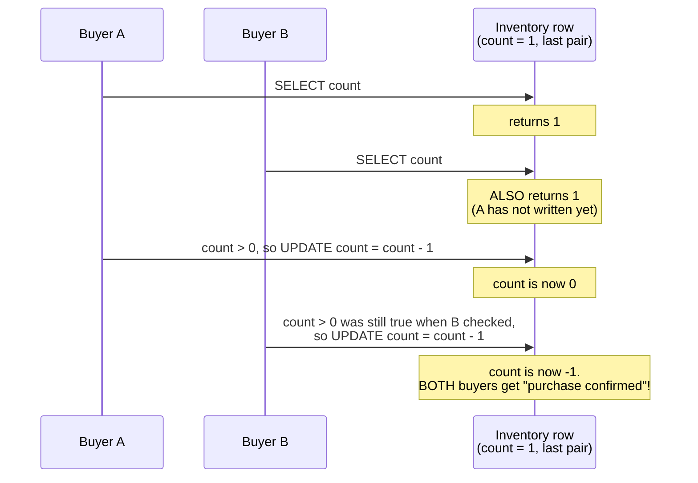

### The obvious question

*Why does "check, then decrement" break at all — isn't checking first the responsible thing to do?*

Here's why it fails anyway:

- "Check" and "decrement" are two separate round trips to the database.
- There's a time gap between them.
- Any number of buyers can read "count = 1" during that gap, before the first buyer's write actually lands.
- Each buyer, individually, did the "responsible" check. The check just wasn't true anymore by the time they acted on it.

### The fix

Collapse the check and the decrement into **one atomic operation**. Two equivalent ways to do this:

- A single database statement: `UPDATE inventory SET count = count - 1 WHERE count > 0`.
- The equivalent atomic `DECR` on a fast in-memory store like Redis.

This specific pattern — an atomic decrement guarding a hot inventory counter — is the standard textbook fix for what Chinese e-commerce engineering calls a **"seckill"** system. That's a real, documented term for exactly this "small stock, huge instant demand" scenario.

**The analogy for the rest of this story:** think of this as a **one-motion turnstile**. A real subway turnstile doesn't glance at your card and *then*, as a second step, unlock the arm. Reading the card and unlocking the arm is one single mechanical motion. There's no gap for a second person to slip through in between.

### New problem, discovered the very next drop

The turnstile fix is airtight — correctness-wise, it's done. But now every one of the 32,000 buyers is hitting that same single turnstile in the same one-second window. Even a perfectly correct atomic operation has a throughput ceiling. That's a completely different kind of problem, and it shows up before HypeCrate even gets to test the fix under real load.

### How I'd say this in an interview

"Check-then-decrement as two separate steps is a race condition, full stop — any gap between reading a value and acting on it lets multiple concurrent requests act on the same stale read. The fix is a single atomic operation, like an atomic decrement guarded by a `WHERE count > 0` clause, so there's no gap for anyone to slip through."

---

## Chapter 2 — The page that dies before the doors even open

### The setup

Same drop, ten minutes earlier. HypeCrate fixed the turnstile, but nobody's touched the product page yet.

As 9:00am approaches, all 32,000 people are sitting on the product detail page, hitting refresh every few seconds to see if:

- the countdown updated, or
- the "Buy" button unlocked early.

Every single refresh round-trips to the primary database to re-read the product's price, description, and images — data that hasn't changed in days.

### The numbers

| Metric | Value |
|---|---|
| Refresh rate per person | roughly once every 3 seconds |
| Resulting load on primary DB | about **10,600 read queries/sec** |
| DB read replica's benchmark ceiling before latency climbs | around **5,000 queries/sec** `[illustrative — a stand-in ceiling, not a published benchmark]` |

At 9,000+ QPS, the database — and with it, the entire site, including the buy button nobody's even clicked yet — starts timing out **before the countdown clock hits zero**.

### The diagram

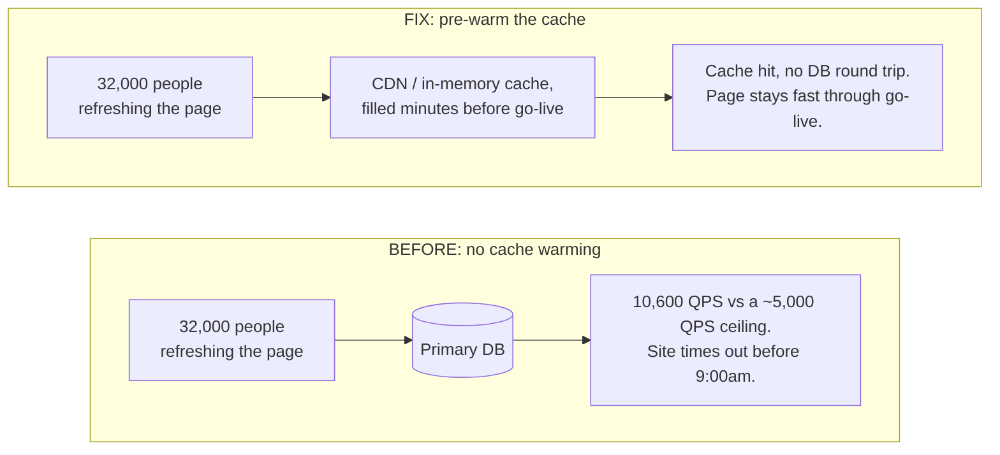

### The obvious question

*Why is the database struggling with reads that don't even touch inventory yet?*

Because nobody separated two very different kinds of data:

- Data that's basically **static** during the countdown — price, photos, description.
- The one number that's about to become a hot battlefield — the **stock count**.

Every refresh was needlessly round-tripping to the DB for data that hadn't moved.

### The fix: pre-warm the cache

In the minutes before go-live, push the product's static data into:

- a fast in-memory cache, and
- the CDN edge.

That way, refresh traffic never has to touch the primary database at all.

**Analogy:** think of it like **stocking a vending machine before the lunch rush**. You load it up ahead of time, so the line moves fast and nobody's waiting on a restock truck mid-rush.

This mirrors a standard, widely described practice among large e-commerce platforms ahead of known mega-traffic events. Alibaba's Singles' Day / Double 11 is the best-known example of a platform preparing infrastructure for a predictable, massive spike well ahead of the actual event.

`[illustrative — the exact internal warming mechanics of any specific company's system aren't public; "pre-warm caches ahead of a known traffic spike" is the well-documented general pattern]`

### New problem, still the same morning

The page is fast now. But at 9:00:00am, the *actual* buy-click — the one thing that has to touch the real, correctness-critical inventory turnstile from Chapter 1 — still arrives from all 32,000 people in the same one-to-two-second window.

Caching fixed the read side. It did nothing for the write-side burst that's about to hit the turnstile.

### How I'd say this in an interview

"Before you even get to the inventory problem, the product page itself can fall over from pure read traffic in the countdown minutes — that's a caching problem, solved by pre-warming the cache ahead of the known spike, not by scaling the database. It's a completely separate fix from the inventory race condition, and it's easy to forget because it happens *before* the interesting part."

---

## Chapter 3 — The turnstile that's correct and still on fire

### The setup

9:00:00am. The page held up. The turnstile is correct. And it still falls over.

### The numbers

| Metric | Value |
|---|---|
| Buy-clicks arriving within a 2-second window around go-live | 32,000 |
| Resulting rate | about **16,000 requests/sec** |
| All of them trying to do | atomically decrement the exact same single counter |
| That counter's realistic sustainable ceiling (DB/Redis + load balancers + connection pools) | more like **5,000 ops/sec** `[illustrative — a stand-in ceiling for "one hot key has a real limit," not a published number]` |

The correctness guarantee from Chapter 1 holds perfectly: **nobody oversells**. But three-quarters of requests time out or get connection errors before the turnstile ever gets to say yes or no.

### The obvious question

*Can we just add more turnstiles — shard the counter across multiple keys, the way you'd shard any other hot counter?*

**No.** This is worth saying explicitly:

- Sharding works when you can later re-aggregate the shards.
- But here, the whole point of the number is that **everyone has to agree on it precisely, right now**.
- "Are we sold out yet?" is a single yes/no answer.
- Splitting it into five shards of 100 each just means you'd have to re-check all five shards to know the true total — which reopens the exact same race window sharding was supposed to close.

This is a fundamentally different shape of problem than, say, an ad-click counter that only needs an approximate total later.

### Scale for comparison

Alibaba has publicly discussed Double 11 order-creation rates in the hundreds of thousands per second at peak (exact figures vary year to year, but consistently reported in that range).

But that's spread across enormous numbers of independent SKUs and independent counters, running on huge fleets of machines — not 32,000 people hammering *one* specific sneaker's *one* stock counter. A single hot key, no matter how big the surrounding fleet is, still only has so much capacity before something in its path buckles.

### The diagram

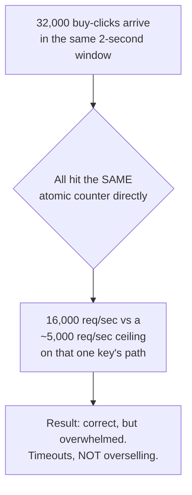

### The fix: a virtual waiting room

Stop letting the herd reach the turnstile directly at all. Put a **virtual waiting room** in front of it: a paced admission queue that absorbs the instant burst and only lets a controlled trickle through to attempt a reservation.

This is a real, documented pattern. Ticketmaster and dedicated vendors like Queue-it build exactly this — a holding queue for high-demand on-sales — so the actual checkout/inventory system only ever sees a manageable rate, no matter how many people showed up at once.

**Analogy:** think of it like a **bouncer holding a rope line** outside a packed club. The bouncer doesn't ask the crowd to self-organize. They physically control how many people cross the rope per minute, regardless of how long the line behind it gets.

### New problem, the very first time this waiting room gets used

The bouncer has to decide *how* to release people. HypeCrate's first attempt is the simplest possible thing: hold everyone at the rope until 9:00:00am, then untie it and let the whole line through at once.

### How I'd say this in an interview

"An atomic counter fixes correctness, but it doesn't fix throughput — a single hot key still has a real ceiling, and sharding it doesn't work here because the whole point is one number everyone must agree on precisely. The fix is absorbing the burst *before* it reaches the counter, with a paced admission queue — that's the actual job of a virtual waiting room, the same tool Ticketmaster and Queue-it build for exactly this kind of on-sale."

---

## Interlude — the math nobody at HypeCrate can escape

Before the waiting room gets tuned, it's worth stopping and doing the arithmetic HypeCrate's team should have done on day one.

### The ratio

| Metric | Value |
|---|---|
| Interested buyers | 32,000 |
| Pairs available | 500 |
| Contention ratio | **64:1** |

No amount of clever engineering changes the fact that roughly **98.4% of these buyers were mathematically never going to get a pair** — no matter how fast or fair the system is.

That reframes the whole goal. It's not "serve everyone." It's:

> Serve the 500 correctly, and give the other 31,500 a fast, honest, fair "sold out" instead of a hang or a lie.

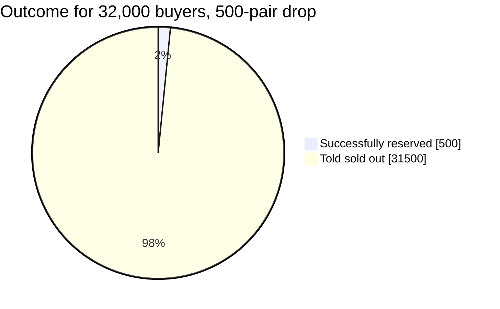

### Redo-the-chain test: what if the drop were bigger?

If HypeCrate restocks a wider release of **5,000 pairs** for the same 32,000 interested buyers:

| Metric | 500-pair drop | 5,000-pair drop |
|---|---|---|
| Buyers | 32,000 | 32,000 |
| Pairs available | 500 | 5,000 |
| Contention ratio | 64:1 | **6.4:1** |

Still oversubscribed — but the waiting room now admits proportionally far more people to a successful reservation before hitting "sold out." Same mechanism, same math, just a different point on the curve.

### Where this sits in the real world

Real flash sales tend to run somewhere between roughly **10:1 and 100:1+** contention. HypeCrate's 64:1 first drop sits squarely in that documented-common range for this category of problem. That's exactly why overselling and thundering-herd protection are the substance of the whole design, not edge cases to mention in passing.

---

## Chapter 4 — The bouncer who drops the whole rope at once

### What happened

HypeCrate's first waiting room holds all 32,000 people at the rope, then, at 9:00:00am, releases everyone simultaneously to go attempt a reservation.

**The result:** this recreates **the exact same 16,000 req/sec burst from Chapter 3, one layer later**. The waiting room absorbed nothing. It just delayed the herd by a few seconds and then let it hit the turnstile in one shot anyway.

### The obvious question

*So what should "release" actually mean?*

Not "let the whole line through the moment the clock hits zero." Instead: admit a small, fixed number of people **per second**, no matter how long the line is.

### The fix: paced admission

The bouncer counts people through the rope at a steady, sustainable rate — say, **200 per second** — regardless of how many are still waiting behind them.

### Doing the math

| Step | Value |
|---|---|
| Queue size | 32,000 people |
| Admission rate | 200 per second |
| Drain time | 32,000 ÷ 200 = **160 seconds** (about 2 minutes 40 seconds) |

Most of those people will still end up hearing "sold out" — that's mathematically guaranteed with 500 units and 32,000 buyers. But each of them gets a fast, clean answer within a couple of minutes, instead of hanging on an infinite spinner or a timed-out request.

### The diagram

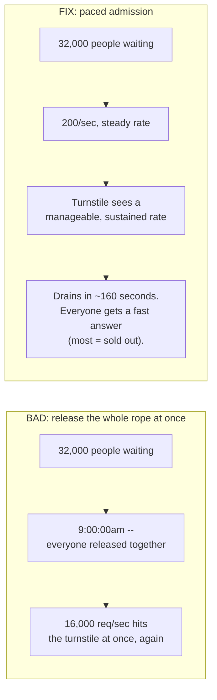

### One more detail that matters

**Joining the rope line itself has to stay cheap** — even for the 99%+ of people who won't get a pair. Getting a queue ticket / position is a lightweight, decoupled operation. It shouldn't touch the expensive, contended reservation path at all.

If joining the queue were itself expensive, HypeCrate would just recreate the same thundering-herd problem one level further out — on the queue-join endpoint instead of the turnstile.

### New problem, discovered a few drops later

Paced admission works — the turnstile stays healthy, and 500 people successfully get a reservation. But "successfully reserved a pair" and "successfully bought a pair" turn out to be two very different things. Nobody's built anything to handle the gap between them yet.

### How I'd say this in an interview

"Releasing the whole waiting-room queue at once just recreates the burst you were trying to avoid, one step later. The fix is pacing admission to a steady, sustainable rate — a few hundred per second, tuned to what the turnstile can actually handle — and keeping the queue-join step itself cheap, since it has to absorb everyone, not just the winners."

---

## Chapter 5 — The reservation that wasn't actually a sale

### The setup

The turnstile and the waiting room both work now. 500 people get through, the turnstile atomically decrements down to zero, and HypeCrate calls it a successful drop.

### What the ops team found weeks later

Of the 500 units the turnstile marked as sold, only **454 actually got paid for**. The other **46** correspond to people who:

1. Clicked "buy."
2. Got a "reserved!" response.
3. Then just closed the tab. Their card was never charged.

Those 46 pairs are now, functionally, gone forever. The turnstile already counted them as sold, so they're not visible as available stock to anyone — but nobody actually bought them.

### The obvious question

*Should the atomic decrement itself count as "sold"?*

**No.** It should only mean "set aside for this person's checkout attempt." A successful reservation still has to survive an actual payment. All of these things can happen *after* the decrement, not before it:

- A declined card.
- An abandoned cart.
- A browser crash.
- Someone just changing their mind mid-checkout.

### The fix: reserve-then-confirm, with a short expiration window

Here's how it works, step by step:

1. A successful atomic decrement puts a unit into a `RESERVED` state, tied to a specific checkout session.
2. That reservation gets a countdown — say, **5 minutes**.
3. If checkout completes in that window, the reservation becomes a real, confirmed order.
4. If the window expires with no payment, a background release job puts the unit back into the available pool.

**Analogy:** think of it like a **coat-check ticket**. The attendant sets your coat aside the moment you hand it over. But if you never come back to claim it within a reasonable window, it goes back on the rack for someone else. The coat isn't "given away" the instant it's set aside.

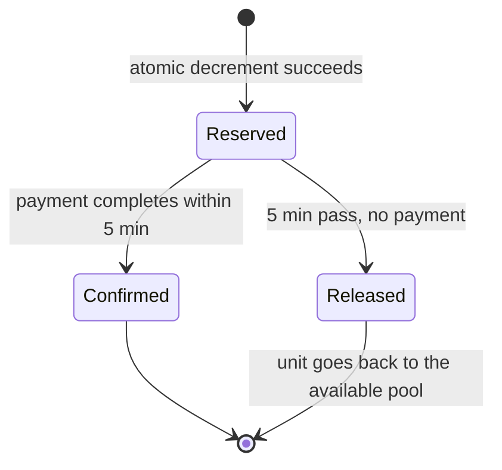

### Tuning the TTL

The TTL itself is a real tuning knob, not a fixed number:

- **Too short**, and legitimate buyers lose their reservation just from normal friction — filling out a card form, a 2FA prompt — not genuine abandonment.
- **Too long**, and abandoned reservations tie up real, scarce stock during the single highest-demand minutes of the whole drop.

HypeCrate settles on **5 minutes** as a reasonable middle ground.

### Why splitting the state matters

Under the hood, this is now three distinct pieces of state, not one:

1. **The sale itself** — total and remaining stock.
2. **Each individual reservation** — who, which unit, what status, when it expires.
3. **Each queue entry** — who, what position, admitted or not yet.

Keeping these separate is exactly what makes the hot, correctness-critical piece — `remainingStock` — stay a single small number. It doesn't get tangled up with the much larger, much less latency-sensitive bookkeeping around queue positions and checkout state.

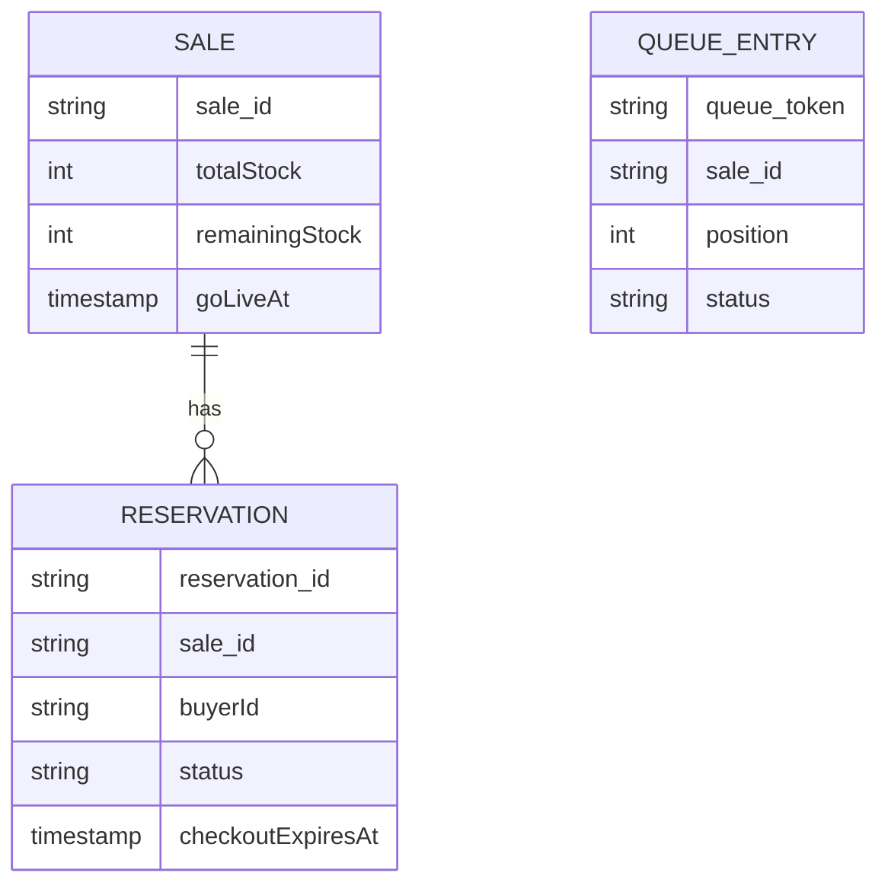

### New problem, the very first time a reservation actually expires under load

The freed-up unit has to go *somewhere* — and where it goes turns out to be a little uncomfortable to explain to a disappointed customer.

### How I'd say this in an interview

"A successful atomic decrement only proves a unit was set aside — it's not the same event as a completed sale, because payment can still fail or the user can abandon checkout. The fix is a time-boxed reservation, like a coat-check ticket: confirmed if you come back in time, released back to the pool if you don't. The TTL is a genuine product trade-off, not a fixed number — too short punishes normal checkout friction, too long wastes real stock."

---

## Chapter 6 — The pair that goes to a stranger

Here's the walkthrough that makes Chapter 5's release job concrete, and shows its honest limit.

### The sequence of events

1. Buyer A gets through the waiting room, reserves the very last pair (unit #500), and closes the tab without paying.
2. Moments later, Buyer B is admitted from the queue and tries to reserve a pair.
3. The turnstile correctly says **sold out** — because as far as the counter knows, right now, it is.
4. Five minutes after that, Buyer A's reservation TTL expires, and the release job returns unit #500 to the pool. Stock is back to 1.
5. But Buyer B has already been told "sold out" and left the page.

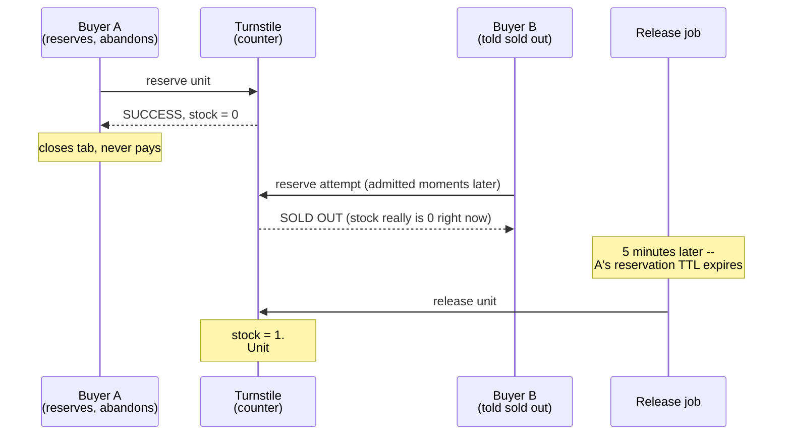

### The honest answer

The release mechanism does **not** retroactively fix things for Buyer B. It just means the unit isn't permanently wasted — it goes to whichever admitted buyer happens to try next, which might be a totally different person than the one who lost out moments earlier.

**That's a real, accepted limitation, not a bug to "solve away."**

### The operational problem hiding underneath

The release job itself has to actually keep up:

- If it's healthy, it runs every few seconds and returns abandoned units almost immediately.
- If it starts lagging — say, backed up for 20 minutes under heavy load — then during that whole window, real available stock is sitting locked up behind reservations that already died. That stock is invisible to everyone still waiting, during the exact highest-value minutes of the entire drop.

**HypeCrate's response:** start tracking **release-job lag** as a first-class, alerted metric — the same way you'd watch queue depth on any background worker. A backlog here doesn't just slow things down; it actively wastes real, scarce inventory.

### How I'd say this in an interview

"A released reservation goes to whoever the queue admits next, not back to the specific person who was told sold out — that's an honest limitation to name, not something to paper over. And the release job itself is a real dependency: if it lags, real stock sits locked up behind dead reservations, so I'd monitor its lag as a first-class metric, not an afterthought."

---

## Chapter 7 — The 40 accounts that acted like one person

### What the fairness team noticed

Drop after drop, HypeCrate's fairness team starts noticing a pattern. In the most recent release:

| Metric | Value |
|---|---|
| Total successful reservations | 500 |
| Reservations from a suspicious cluster | **340 (68%)** |
| Number of accounts in that cluster | roughly 40 |
| How they joined the queue | within the same **50 milliseconds** of each other |
| Shared trait | near-identical browser fingerprints |

`[illustrative exact figures for HypeCrate, but the underlying phenomenon is real and extensively documented: sneaker-drop bots and "cook groups," and the bot-driven console/GPU restock shortages of 2020–2021, are widely reported real-world cases of exactly this — automated buyers systematically out-competing ordinary humans for scarce, high-demand stock; Nike has also publicly discussed anti-bot efforts on its SNKRS app for this exact reason]`

### The obvious question

*Doesn't rate-limiting per account or per IP already stop this?*

**Not against a determined operator.** Sophisticated bot setups rotate IP addresses and run many accounts in parallel. Rate limits raise the cost of running a bot farm — but they don't eliminate the advantage. A human clicking a mouse simply cannot compete with a script firing a request at the exact millisecond the queue opens.

### The fix: layer several imperfect checks

Back to the rope-line bouncer analogy: a good bouncer doesn't just count people through. They also notice when a dozen people who all look and move identically show up in the same second, and pull *those specific people* aside for extra scrutiny before letting them in the rope line at all — without slowing down anyone else.

Concretely, this means three layers:

1. **Behavioral / velocity signals** — did dozens of "different" accounts hit join-queue within the same few milliseconds?
2. **A CAPTCHA challenge** for anything that looks automated.
3. **A purchase limit tied to a verified identity**, not just an account — so the same real person can't just create ten accounts to get ten pairs.

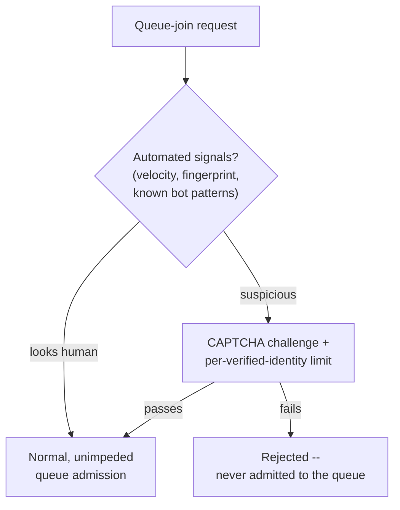

### Weighing the options

```mermaid
quadrantChart
    title Bot mitigation: user friction vs. deterrence
    x-axis Low friction --> High friction
    y-axis Weak deterrence --> Strong deterrence
    quadrant-1 Strong, worth the cost
    quadrant-2 Strong, low cost -- ideal
    quadrant-3 Weak, at least it's cheap
    quadrant-4 Weak, and still costly
    Per-IP rate limit alone: [0.25, 0.25]
    CAPTCHA on suspicious traffic only: [0.4, 0.6]
    Layered (velocity + CAPTCHA + identity limit): [0.55, 0.85]
    CAPTCHA on every single request: [0.9, 0.7]
```

### The honest trade-off

Worth naming out loud: this adds a little friction for genuine humans too. A CAPTCHA is mildly annoying even when you're not a bot.

HypeCrate accepts that cost deliberately. Why? Because the alternative — a drop that's effectively only winnable by resellers running scripts, while real fans reliably lose — is worse for the brand than a few seconds of extra friction for everyone.

**Crucially:** every one of these checks has to be enforced **server-side**. A client-side-only rate limit is trivial for a script to just ignore or patch around. It has to be the server, not the browser, deciding who gets through.

### How I'd say this in an interview

"No single mechanism fully stops bots — rate limiting alone just raises the cost, it doesn't eliminate the advantage. The real answer is layering behavioral signals, a CAPTCHA for suspicious traffic, and a purchase limit tied to a verified identity rather than just an account — all enforced server-side, since anything client-side-only is trivial to bypass. And it's worth framing as a genuine brand-trust requirement, not a nice-to-have, because a drop only bots can win damages trust in every future drop."

---

## Chapter 8 — The clock that lies by 1.8 seconds

### The setup

One last wrinkle, found almost by accident. HypeCrate's countdown page has each client's browser fire the "join queue" request the moment its own local device clock hits 9:00:00am.

### What an engineer found in the logs

A small cluster of successful reservations joined the queue **1.8 seconds before the server's own recorded go-live time**.

`[illustrative exact figure — the underlying cause, client device-clock drift, is a real and well-known phenomenon]`

Those clients' device clocks were simply running fast, giving them an accidental head start over everyone whose device clock happened to be accurate.

### The obvious question

*Whose clock should decide when the drop actually starts?*

**Not the client's.** A client's local clock is exactly the kind of input you can't trust for anything time-sensitive — because it's outside your control. And unlike the earlier fixes in this story, this isn't even adversarial. It's just innocently wrong.

### The fix: anchor go-live to server time

Here's how it works:

1. On page load, the server sends back its own authoritative current time and the go-live timestamp.
2. The client computes the countdown as an *offset* from the server's clock — not from its own local clock's idea of "now."
3. A client whose local clock is off by a couple of seconds still fires its join-queue request at the right moment relative to the server. It's counting down from a number the server gave it, not trusting its own device to already agree on what time it is.

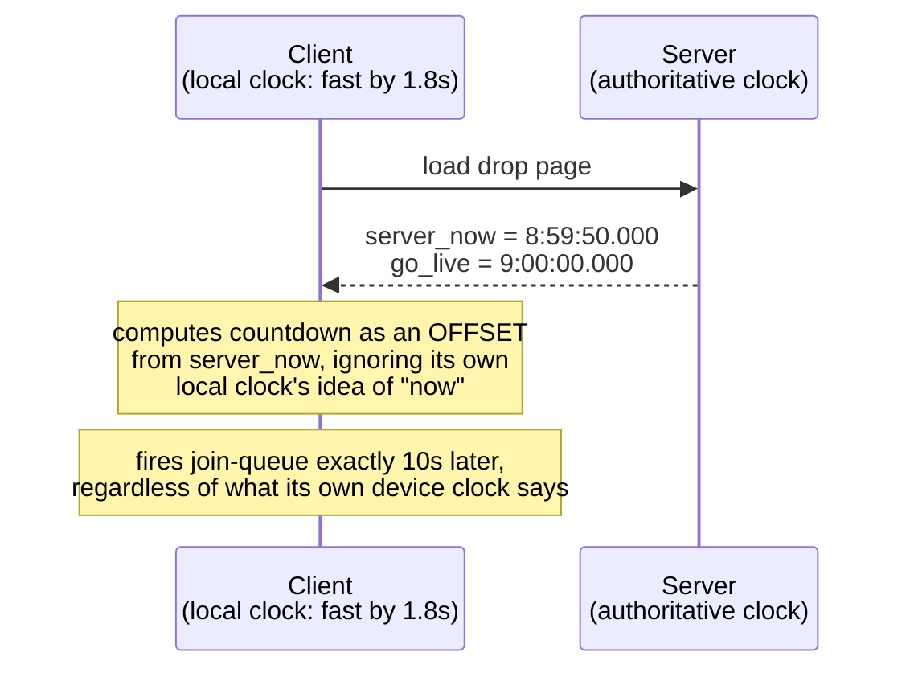

### Where this leaves HypeCrate

With this in place, HypeCrate has, without ever setting out to build one grand system, arrived at the actual real design:

- A pre-warmed cache in front of the product page.
- A single atomic turnstile guarding the stock count.
- A paced virtual waiting room absorbing the herd before it ever reaches that turnstile.
- Reserve-then-confirm with a TTL, and a monitored release job behind it.
- Layered server-side fairness checks at the door.
- A server-anchored clock, so the door opens at the same instant for everyone.

### How I'd say this in an interview

"Client device clocks drift, and that's not adversarial, it's just an input you can't trust for anything time-sensitive — the fix is anchoring go-live to server time and having the client count down from a server-given offset, not its own clock's idea of 'now.' It's a small fix, but it's the same instinct as everything before it in this story: don't trust an input you don't control for something that has to be exact."

---

## Where the story actually lands

```mermaid
flowchart LR
    A["Ch1: check-then-decrement<br/>(overselling)"] -->|"fixes correctness;<br/>breaks: single hot key<br/>gets overwhelmed"| B["Ch3: virtual<br/>waiting room"]
    B -->|"fixes: paces the burst;<br/>breaks: release-all-at-once<br/>recreates it"| C["Ch4: paced<br/>admission"]
    C -->|"fixes: sustainable rate;<br/>breaks: reservation != sale"| D["Ch5: reserve-then-confirm<br/>+ TTL"]
    D -->|"fixes: abandoned carts<br/>recovered; breaks:<br/>release-job lag wastes stock"| E["Ch6: monitored<br/>release job"]
    E -->|"fixes: stock isn't lost;<br/>breaks: bots dominate<br/>reservations"| F["Ch7: layered<br/>fairness"]
    F -->|"fixes: real humans<br/>compete fairly; breaks:<br/>client clocks drift"| G["Ch8: server-anchored<br/>go-live"]
```

### Why the system needs all of this, at a glance

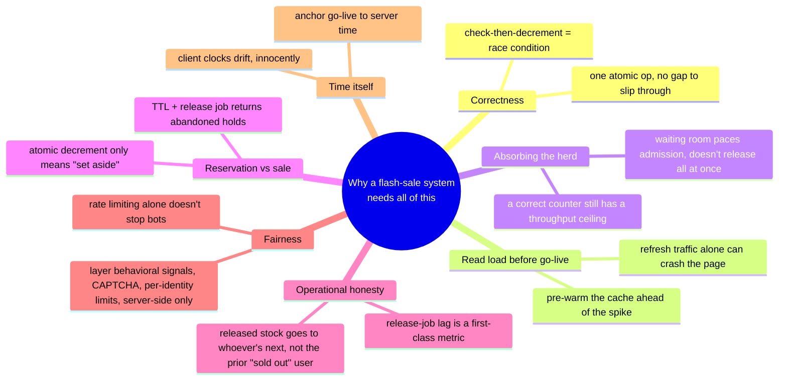

### How to scope your answer to what's actually asked

The chapter you actually need to walk depends on what the interviewer emphasizes:

| Interviewer's angle | Chapters to lead with |
|---|---|
| "How do you avoid overselling?" | 1 and 3 — that's the whole answer. |
| Pushing on UX at scale | 3 and 4 — that's the meat. |
| "What if someone adds to cart and walks away?" | 5 and 6. |
| Fairness and clock-anchoring | 7 and 8 — deeper layers worth having ready, not the first thing to lead with unprompted. |

---

## Grill me — adversarial follow-ups

**Q1: "Why not just make the database bigger or faster instead of adding an atomic operation?"**

Because the problem isn't raw speed — it's a gap in time between reading a value and acting on it. A faster database still has that same gap, just a smaller one, so the race condition still happens under enough concurrency. The fix has to close the gap itself, which is what a single atomic operation does. It's not about throughput at all in that first step.

**Q2: "You said sharding the counter doesn't work here — why does sharding work fine for other kinds of counters, like ad-click counts?"**

Because those counters only need an *approximate* or *eventually reconciled* total. You can shard, write fast, and re-aggregate later without anyone needing a precise, instantaneous answer. A flash-sale stock count needs a precise "are we sold out, right now, before the next person acts" answer at every single instant. Sharding would mean re-checking every shard just to answer that — which reopens the same race window sharding was meant to close.

**Q3: "If the waiting room can silently drop or reorder people, isn't that its own fairness bug?"**

It's a real risk worth naming — which is exactly why the queue-join step is kept cheap and simple. Position/ETA can be approximate without causing real harm, but the actual admission order should still be deterministic and auditable, typically first-come-first-served by queue-join timestamp. That way nobody can reasonably claim the queue itself is rigged.

**Q4: "Why 200 admissions per second and not 2,000 — couldn't you drain the queue faster?"**

Because that number has to be tuned against what the atomic counter's actual path can sustain, not chosen for speed alone. The whole point of the waiting room is to protect that ceiling. In practice you'd load-test the counter's real throughput and set the admission rate comfortably under it, then revisit the number as infrastructure changes.

**Q5: "Doesn't the 5-minute reservation TTL just create a new kind of unfairness — whoever's fastest at checkout keeps their reservation, slow typers lose theirs?"**

That's a real, accepted trade-off, not a flaw to eliminate. The TTL exists specifically to stop truly abandoned holds from wasting real stock, and 5 minutes is meant to be generous enough for normal checkout friction like a card form or 2FA. If it were routinely too tight for genuine buyers, that's a signal to lengthen it, not to remove it.

**Q6: "You said released stock goes to 'whoever's next,' not the person originally told sold out — isn't that a real customer-trust problem?"**

It is, and the honest answer is you don't paper over it. You're transparent that a small number of units do get released back into the pool during a drop, and you don't promise the specific disappointed buyer that unit back — because you genuinely can't. What you can promise is that the unit isn't wasted forever, which is strictly better than the alternative.

**Q7: "If a bot passes every fairness check you described, is the system just broken?"**

No single layer is meant to be airtight on its own. The goal is raising the cost and narrowing the advantage, not building a perfect bot detector, which doesn't really exist. If bot activity later turns out to be worse than these layers catch, that's the signal to invest in more advanced behavioral detection — which is explicitly a stretch item, not something to over-build up front.

**Q8: "Why does the counter need strong consistency but the queue position doesn't?"**

Because they're answering fundamentally different questions. The counter answers "are we sold out, right now" — which has zero tolerance for being wrong even briefly. The queue position answers "roughly how long until you're admitted" — where being off by a few seconds or a few positions causes no real harm. Splitting the consistency requirement by component is what lets the queue scale cheaply while the counter stays a single, precisely-agreed value.

**Q9: "What actually breaks first if stock is 50,000 units instead of 500, for the same 32,000 buyers?"**

The contention ratio flips from massively oversubscribed to actually satisfiable — most buyers now succeed instead of most getting "sold out." So the waiting room and fairness layers matter less, while the atomic counter and reserve-then-confirm mechanics matter exactly the same, since correctness doesn't care how much stock there is, only that many people are racing for the same number.

**Q10: "Where would you actually start if someone said 'design a flash sale system' cold?"**

Say the two things that drive everything downstream first: never oversell, and the traffic is a predictable instant spike, not organic growth. Then say you'd solve those as two separate mechanisms — an atomic reservation for correctness and a paced admission queue for the burst — rather than one thing trying to do both. Everything else — TTLs, release jobs, fairness, clock-anchoring — is depth you add once those two are on the table.

---

## Cheat sheet — one line per stop on the story

- **Check-then-decrement**: two separate steps leave a gap — any concurrent buyer can act on a stale read, guaranteeing overselling at real contention levels.
- **Atomic decrement (the one-motion turnstile)**: collapse check-and-decrement into a single atomic operation — no gap, no race, the standard fix behind real "seckill"-style flash-sale systems.
- **Don't shard the hot counter**: this number needs everyone to agree on it precisely, right now — sharding would force re-aggregation, reopening the same race window.
- **Pre-warm the cache**: countdown-page refresh traffic can crash the site before go-live even arrives — serve static product data from cache, not the primary DB.
- **Virtual waiting room (the rope line)**: absorbs the instant burst before it reaches the counter — a correct atomic operation still has a real throughput ceiling.
- **Paced admission, not release-all-at-once**: dropping the whole rope simultaneously just recreates the same burst one step later; admit a fixed number per second instead.
- **Reserve-then-confirm + TTL (the coat-check ticket)**: a successful decrement means "set aside," not "sold" — a short TTL and a release job return abandoned holds to the pool.
- **Release-job lag is a first-class metric**: a lagging release job locks up real stock behind dead reservations during the highest-value minutes of the drop.
- **Released stock goes to whoever's next**: a returned unit doesn't retroactively help the specific buyer who was told sold out earlier — an honest limitation, not a bug.
- **Layered, server-side fairness**: no single mechanism stops bots — combine behavioral signals, CAPTCHA, and per-verified-identity limits, all enforced server-side, and treat it as a real brand-trust requirement.
- **Server-anchored go-live time**: client device clocks drift innocently — count down from a server-given offset, never from the client's own local clock.
- **The meta-lesson**: correctness (never oversell) and traffic-shaping (the herd is instantaneous and predictable) are two separate problems needing two separate mechanisms — say the trade in the same sentence you propose each fix.
