# Design a Flash Sale System — FAANG Interview Guide

> Source chapter type: extreme-contention inventory management. Distinct from
> [the Payment System guide](./41-Design-a-Payment-System-FAANG-Guide.md), which covers general
> payment processing — this chapter is specifically about the moment **tens of thousands of people
> simultaneously try to buy a small number of units**, at the exact instant a sale goes live, and
> the two failure modes that moment creates: **overselling** (more units sold than exist) and a
> **thundering herd** (every client hitting "go live" at literally the same second).

## Mental model

A flash sale advertises 1,000 units of a product at 12:00:00.000 sharp. Tens of thousands of
buyers have the page open, refreshing, waiting. Two problems collide at that exact instant:

1. **Inventory atomicity under extreme contention.** Thousands of concurrent "buy" attempts race
   for the same limited stock count — a naive "check stock, then decrement" (as two separate steps)
   guarantees overselling, because many requests can pass the check before any of them finish the
   decrement.
2. **The thundering herd at go-live.** Every waiting client's page fires a request in the same
   sub-second window — this isn't organic traffic growth a system can autoscale into, it's a
   near-instantaneous, predictable spike that has to be absorbed by design, not by reacting after
   the fact.

A third, related problem: **fairness and abuse** — bots and scripted buyers will out-compete real
human users for a scarce, high-demand item unless the system does something deliberate about it.

**The one sentence to say out loud:** *"This is a distributed-counter correctness problem
(never oversell) wrapped in a traffic-shaping problem (the herd is instantaneous and predictable,
not organic) — and both are load-bearing, not just one of them."*

**The one picture to remember forever:**

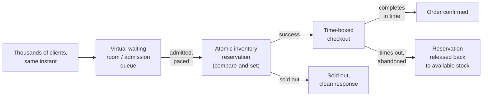

**Memory hook:** *"Queue the herd before it hits inventory. Reserve atomically, never
check-then-decrement as two steps. Release unclaimed reservations back to the pool."*

---

## Table of contents
[How to Identify This Topic](#how-to-identify-this-topic-in-an-interview) ·
[Interview Playbook](#interview-playbook) · [Requirements](#requirements-clarification) ·
[Capacity Estimation](#capacity-estimation-worked) · [API Design](#api-design) ·
[High-Level Architecture](#high-level-architecture) ·
[Architecture Evolution v1→v2→v3](#architecture-evolution-v1--v2--v3) ·
[End-to-End Walkthroughs](#end-to-end-request-walkthroughs) ·
[Deep Dive: Atomic Inventory Reservation](#deep-dive-atomic-inventory-reservation) ·
[Deep Dive: Virtual Waiting Room](#deep-dive-virtual-waiting-room) ·
[Deep Dive: Reserve-Then-Confirm & Abandoned Checkouts](#deep-dive-reserve-then-confirm--abandoned-checkouts) ·
[Deep Dive: Fairness & Bot Mitigation](#deep-dive-fairness--bot-mitigation) ·
[Data Model](#data-model) · [Failure Modes](#failure-modes--mitigations) ·
[Non-Functional Walkthrough](#non-functional-walkthrough) ·
[Security & Compliance](#security--compliance) · [Cost & Trade-offs](#cost--trade-offs) ·
[Wrap-Up](#wrap-up-mvp-vs-stretch) · [Golden Rules](#golden-rules) ·
[Cheat Sheet](#master-cheat-sheet)

---

## How to identify this topic in an interview

- "Design a flash sale / limited-drop / ticket-sale system" (sneaker drops, concert tickets,
  limited-edition product launches — the pattern is identical).
- The tell that distinguishes this from a generic e-commerce checkout chapter: the interviewer
  emphasizes **a fixed go-live instant** and/or **extremely limited stock relative to demand** —
  either signal means overselling and thundering-herd are the actual substance of the chapter.
- A follow-up like "what stops someone from adding to cart, walking away, and holding up
  inventory" is the [reserve-then-confirm deep dive](#deep-dive-reserve-then-confirm--abandoned-checkouts).

---

## Interview playbook

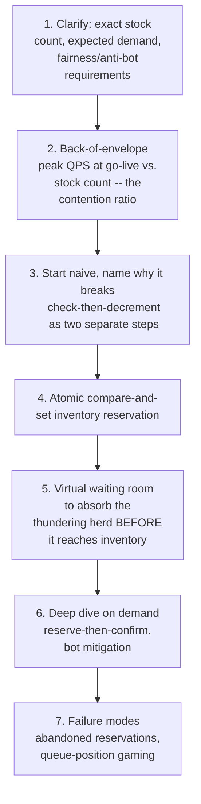

**What the interviewer is actually grading at each step:**
- Step 3: do you recognize, unprompted, that "check if in stock, then decrement" as two separate
  operations is a race condition that guarantees overselling under real contention, not just a
  theoretical risk?
- Step 5: do you propose absorbing the herd **before** it reaches the inventory system (a queue/
  admission-control layer), rather than trying to make the inventory system itself withstand
  unlimited concurrent load?
- Step 6: do you know why a successful "reservation" isn't the same as a completed sale, and
  propose a TTL-based release mechanism for abandoned checkouts?

---

## Requirements clarification

### Functional

| # | Requirement | Notes |
|---|---|---|
| F1 | Sell exactly the advertised stock count, never more | The hard correctness constraint |
| F2 | Handle a traffic spike at a known, fixed instant (sale go-live time) | Distinct from organic growth — predictable in timing, extreme in magnitude |
| F3 | Give users a clear, fast answer — successfully reserved, or sold out — never an indefinite spinner | UX requirement tightly coupled to the fairness requirement |
| F4 | Prevent a single user/bot from acquiring a disproportionate share of stock | Product/fairness requirement, not purely technical |
| F5 | Release inventory reserved by an abandoned checkout back to the pool | Otherwise, "reserved but never purchased" stock is functionally lost |

### Non-functional

| Requirement | Target | Why this number |
|---|---|---|
| Inventory correctness | Absolute — zero tolerance for overselling | Overselling means someone gets a confirmed order that can't be fulfilled — a direct customer-trust and often legal/refund cost |
| Go-live burst handling | Must absorb a spike orders of magnitude above steady-state traffic, concentrated in a few seconds | This is the central non-functional challenge of the whole chapter |
| Response latency at go-live | Fast — even a "sold out" response must return quickly, not hang | A slow response under load reads as broken, compounding user frustration during an already high-stakes moment |
| Checkout time-box | Short, defined (e.g. a few minutes) | Bounds how long a reservation can hold real stock hostage before release |
| Fairness | Reasonably resistant to scripted/bot advantage-taking | A product-trust requirement — a sale that's effectively only winnable by bots damages the brand |

**Clarifying questions worth asking the interviewer up front — and what each answer changes:**

| Question | If the answer is... | ...then this changes |
|---|---|---|
| "What's the ratio of expected concurrent demand to available stock?" | Demand vastly exceeds stock (e.g. 100,000 concurrent buyers for 1,000 units) | Confirms a virtual waiting room/queue is necessary, not optional — direct-to-inventory access at this contention ratio would overwhelm any inventory system regardless of its own correctness |
| "Is the sale a single fixed instant, or does inventory trickle out over time?" | A single fixed instant | Confirms the thundering-herd problem is real and concentrated, not spread out — argues strongly for pre-sale admission queuing |
| "How long should a successful reservation hold stock before requiring checkout completion?" | A specific short window, e.g. 5 minutes | Directly sizes the reservation TTL in the reserve-then-confirm mechanism |
| "Is bot/fairness mitigation in scope, or purely a best-effort nice-to-have?" | A real product requirement | Confirms rate-limiting/CAPTCHA/queue-randomization mechanisms are core scope, not stretch |

**Say this out loud in the interview:** *"I want to treat the thundering herd and the inventory
race as two separate problems solved by two separate mechanisms — a queue that absorbs and paces
the herd, and an atomic reservation that guarantees correctness for whoever the queue lets
through. Trying to solve both with one mechanism is where designs usually go wrong."*

---

## Capacity estimation, worked

```
Given (illustrative, a limited-edition product drop):
  Advertised stock                                = 1,000 units
  Concurrent users with the page open at go-live   = 100,000
  Contention ratio                                  = 100,000 / 1,000 = 100:1
  -> a huge oversubscription -- 99% of demand CANNOT be satisfied no matter how well the
     system is built. This reframes the design goal: it's not "handle the load," it's "handle
     the load FAIRLY and CORRECTLY while telling 99% of users 'sold out' quickly and cleanly."

Request burst at go-live:
  If all 100,000 users' clients fire a request within a 2-second window around go-live
    Peak QPS                                        = 100,000 / 2 ~= 50,000 QPS, concentrated
  -> compare this to the SAME product's steady-state traffic (browsing, before the drop),
     likely a few hundred QPS -- the burst is 100-200x steady-state, concentrated in single-
     digit seconds. This is why autoscaling-based capacity planning (react to rising load) is
     the wrong model here: there's no ramp to react to, it's a step function.

Inventory-write contention:
  Successful reservation attempts that must resolve against the SAME 1,000-unit counter
    -> even a small fraction of the 50,000 QPS burst attempting to decrement the same counter
       simultaneously is enough to make naive check-then-decrement's race window matter --
       this isn't a rare edge case at this contention level, it's the GUARANTEED common case.

Virtual waiting room throughput:
  If the queue admits requests to the reservation step at a controlled rate, e.g. 200/sec
    Time to admit all 100,000 waiting users            = 100,000 / 200 = 500 seconds (~8 minutes)
  -> most of the queued 99,000 users who won't get stock will wait, then receive a clean
     "sold out" -- the queue's job is to convert an unmanageable simultaneous burst into a
     manageable, paced admission rate, not to somehow let everyone succeed.
```

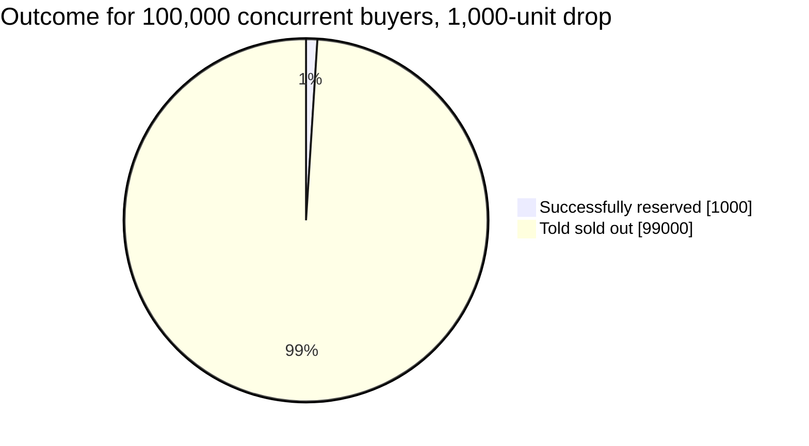

99% of demand is mathematically unsatisfiable at this contention ratio — the design goal is
correctness and fairness for everyone in this pie, not somehow serving more than exists.

**Redo-the-chain test:** if stock is increased to 10,000 units for the same 100,000-user demand,
the contention ratio drops to 10:1 — still heavily oversubscribed, but the admission queue can
admit proportionally more successful reservations before hitting "sold out," a direct, computable
relationship worth stating if asked how stock level affects the queue's behavior.

**The number worth memorizing:** at typical flash-sale contention ratios (often 10:1 to 100:1+),
the overwhelming majority of demand is mathematically unsatisfiable regardless of system design —
the actual engineering goal is correctness and fairness under that reality, not somehow serving
more demand than exists supply for.

---

## API design

### `POST /v1/sales/{saleId}/join-queue` (called by every client near go-live)

```json
{ "userId": "u_881" }
```

Response:
```json
{ "queueToken": "qt_71209", "estimatedWaitSeconds": 45, "status": "QUEUED" }
```

### `GET /v1/sales/{saleId}/queue-status?queueToken=qt_71209` (polled by client)

```json
{ "status": "ADMITTED", "reservationWindowSeconds": 300 }
```

Only once `status` is `ADMITTED` does the client proceed to the reservation step — this is the
queue doing its job of pacing access to inventory.

### `POST /v1/sales/{saleId}/reserve` (only reachable after admission)

```json
{ "queueToken": "qt_71209", "quantity": 1 }
```

Response:
```json
{ "reservationId": "r_44821", "status": "RESERVED", "checkoutExpiresAt": "2026-07-24T12:05:00Z" }
```
or
```json
{ "status": "SOLD_OUT" }
```

**The one sentence worth saying about the API surface:** *"There are two gates, not one — the
queue gate paces who even gets to attempt a reservation, and the reservation itself is a single
atomic operation against the inventory counter; conflating them into one step is how designs
accidentally let the herd hit inventory directly."*

---

## High-level architecture

### Architecture evolution (v1 → v2 → v3)

**v1 — direct checkout, check-then-decrement:**

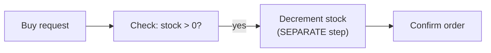

**Why it breaks two different ways:** first, correctness — "check" and "decrement" as two separate
operations create a race window; thousands of concurrent requests can all pass the check before
any of them completes the decrement, oversubscribing stock far past zero. Second, load — every one
of the 50,000 peak QPS hits this logic directly, with no pacing at all, at the exact moment the
underlying data store is least able to serialize that many concurrent writes safely.

**v2 — atomic reservation, but still no queue in front of it:**

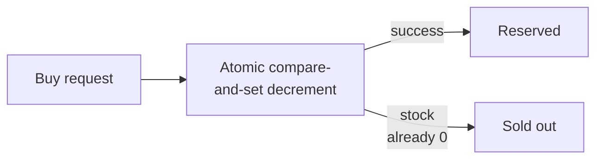

**Why it breaks:** correctness is now solved — the atomic operation guarantees no overselling
regardless of concurrency. But all 50,000 peak QPS still hit this single atomic counter
simultaneously; even a correctly-implemented atomic counter has a real throughput ceiling, and a
sudden, undamped burst at that magnitude can overwhelm it or the surrounding infrastructure (load
balancers, connection pools) before the atomic operation itself ever becomes the bottleneck.

**v3 — the real system: virtual waiting room in front of atomic reservation:**

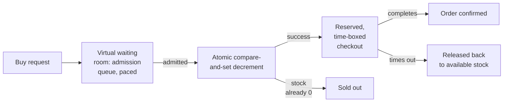

**What v3 fixes, one line each:** the waiting room absorbs and paces the instantaneous burst
before it ever reaches the inventory system, converting an unmanageable spike into a controlled
admission rate; the atomic reservation (already correct in v2) now only has to handle that paced
rate, not the full unmoderated burst; and time-boxed checkout with release-on-timeout prevents an
abandoned reservation from permanently locking up real stock.

---

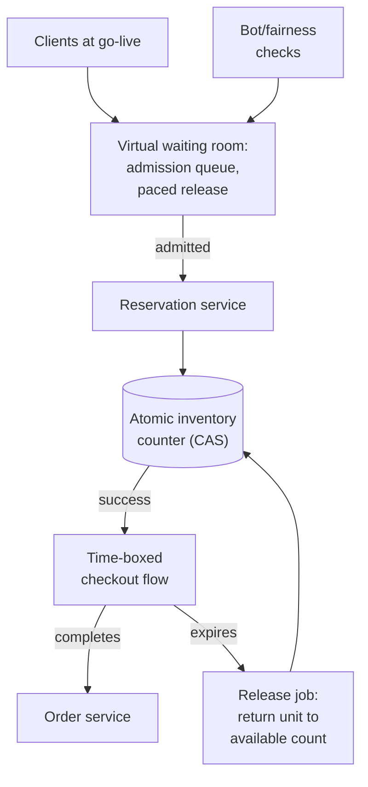

| Component | Role |
|---|---|
| Virtual waiting room | Absorbs the instantaneous burst, admits requests to the reservation step at a controlled, sustainable rate |
| Atomic inventory counter | A single compare-and-set (or equivalent atomic decrement) operation — the correctness guarantee against overselling |
| Time-boxed checkout | A reservation is not a sale; it's a short-lived hold that must convert to a completed order within a TTL |
| Release job | Returns unclaimed reservations to available stock after the TTL, so abandoned checkouts don't permanently waste inventory |
| Bot/fairness checks | Applied at queue-join time — see the fairness deep dive |

---

## End-to-end request walkthroughs

### Walkthrough 1 — a successful purchase, full path

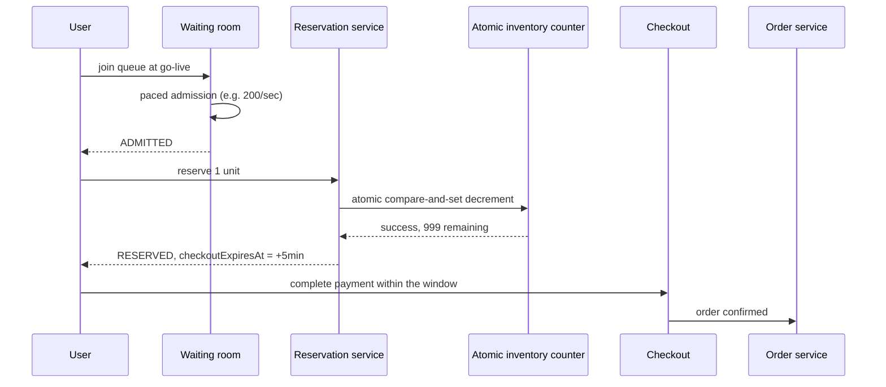

### Walkthrough 2 — sold out, and an abandoned reservation gets released

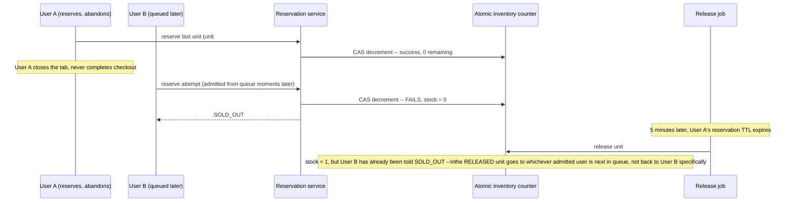

Walkthrough 2 illustrates why release-on-timeout matters (real stock isn't permanently lost to an
abandoned cart) while also showing its limitation honestly: a released unit doesn't retroactively
help the specific user who was told "sold out" moments earlier — it becomes available to whoever
is admitted next.

### Walkthrough 3 — a suspected bot is challenged before joining the queue

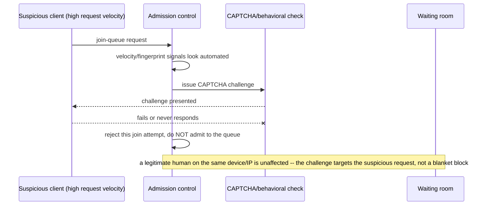

This is the concrete mechanism behind the [fairness deep dive](#deep-dive-fairness--bot-mitigation)
— friction is applied selectively to suspicious signals, not as a blanket gate that would also
slow down real buyers.

---

## Deep dive: atomic inventory reservation

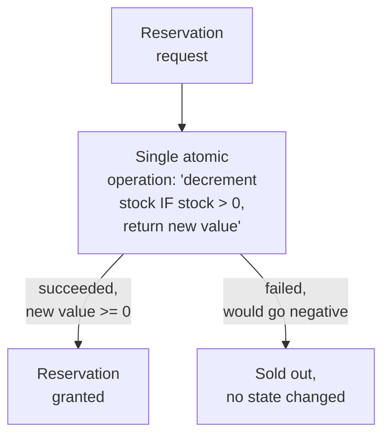

**Why this must be one atomic operation, not two:** "read current stock" followed by "if positive,
write stock-1" as two separate steps has a race window between the read and the write — any
number of concurrent requests can read the same "stock > 0" value before any of them writes the
decrement, and all of them proceed to sell a unit that, in aggregate, doesn't exist. A single
atomic compare-and-set (or an equivalent database-level atomic decrement with a check constraint)
closes that window entirely — there's no in-between state for a second request to observe.

**Why this is a distributed-counter problem at a small, hot key, not a general "shard stock across
many keys" problem:** unlike counters that scale by sharding across keys (see the sharded-counters
and ad-click-aggregation chapters elsewhere in this course), a flash sale's stock count is
inherently one number that many concurrent operations must agree on precisely — sharding it would
require re-aggregating shards to know "are we sold out yet," reintroducing exactly the race window
sharding was meant to avoid. The correct scaling lever here is the waiting room in front of the
counter, not sharding the counter itself.

**Interview cheat-sheet:** *"Check-then-decrement as two steps is a race condition, full stop — use
a single atomic compare-and-set operation. And don't reach for the sharded-counter pattern here;
this specific number needs to stay a single, precisely-agreed-upon value, which is exactly why the
waiting room exists to reduce contention on it instead."*

---

## Deep dive: virtual waiting room

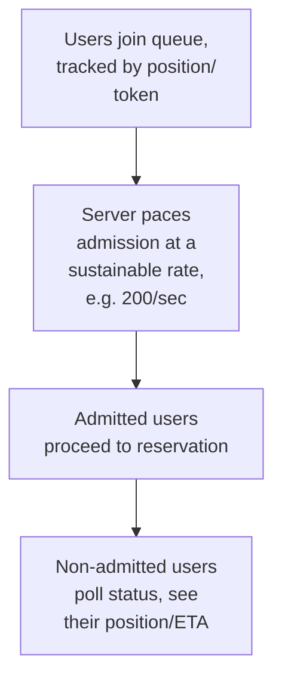

**Why pacing admission, not just queueing and releasing everyone at once, matters:** the whole
point is to convert the unmanageable simultaneous burst into a rate the downstream reservation
service and atomic counter can handle reliably — releasing the entire queue simultaneously the
moment the sale "starts" would just recreate the exact thundering-herd problem one layer later.

**Why the queue itself must be cheap to join, even for the 99% who won't get stock:** joining the
queue (getting a token, a position) should be a lightweight operation, decoupled from the
expensive/contended reservation step — this is the same "make the common case cheap, reserve
expensive work for what actually needs it" instinct as candidate generation in the ranking
chapters of this course, applied to admission control instead of relevance filtering.

**Interview cheat-sheet:** *"The waiting room's job is to convert an instantaneous, unmanageable
burst into a paced, sustainable admission rate to the reservation step — joining the queue itself
must stay cheap even though most joiners won't get stock, and releasing the whole queue at once
would just recreate the same thundering herd one step later."*

---

## Deep dive: reserve-then-confirm & abandoned checkouts

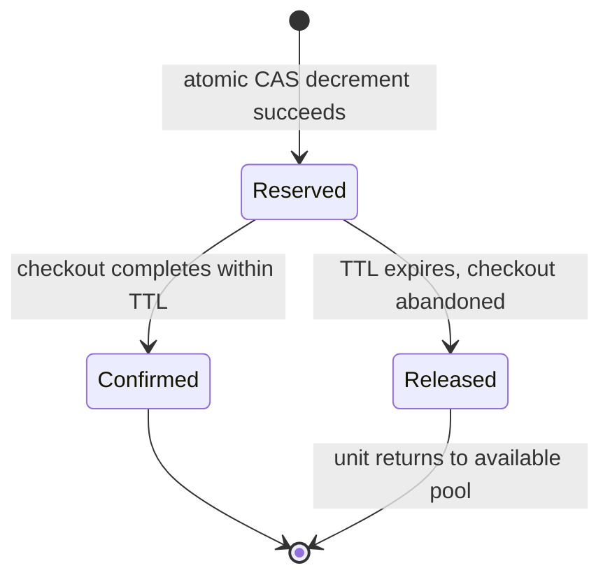

**Why "reserved" and "sold" are different states, not the same event:** a successful atomic
decrement only proves a unit was set aside for this user's checkout attempt — payment can still
fail, or the user can simply abandon the checkout page. Treating the decrement itself as a
completed sale would mean an abandoned cart permanently removes a unit from availability, wasting
real stock that a genuinely interested buyer further back in the queue could have purchased.

**Why the TTL needs to be short but not too short:** too long, and abandoned reservations tie up
scarce stock for an unnecessarily long time during exactly the highest-demand window; too short,
and legitimate users lose their reservation mid-checkout due to normal friction (payment form
entry, 2FA) rather than genuine abandonment. This is a real, product-informed tuning decision, not
a purely technical one.

**Interview cheat-sheet:** *"A reservation is a time-boxed hold, not a sale — completion confirms
it, and a TTL expiry releases it back to the pool. This is what prevents an abandoned cart from
permanently wasting real, scarce stock."*

---

## Deep dive: fairness & bot mitigation

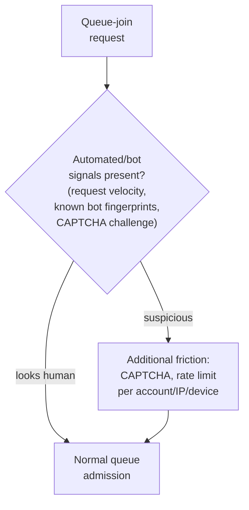

**Why per-account/IP/device rate limiting alone is insufficient against a determined scripted
buyer:** sophisticated bot operations rotate IPs and use many accounts — rate limiting raises the
cost of automation but doesn't eliminate it entirely; realistic mitigation is layered
(behavioral signals, CAPTCHA challenges, purchase-limit-per-verified-identity) rather than any
single silver-bullet check.

**Why this is a legitimate product/trust requirement, not just a nice-to-have:** a flash sale
that's effectively only winnable by bots and resellers, while real customers reliably lose out,
damages the brand and the perceived fairness of future sales — worth naming as a business
consequence, not purely a technical curiosity, if the interviewer asks why this matters.

**Interview cheat-sheet:** *"No single mechanism fully stops bots — layer rate limiting,
behavioral/velocity signals, and challenge mechanisms (CAPTCHA) at queue-join time, and treat this
as a real product-trust requirement, not an optional technical nicety."*

---

## Data model

**Reservation lifecycle** (shown above as a `stateDiagram-v2` in the reserve-then-confirm deep
dive) is the core state machine of this system.

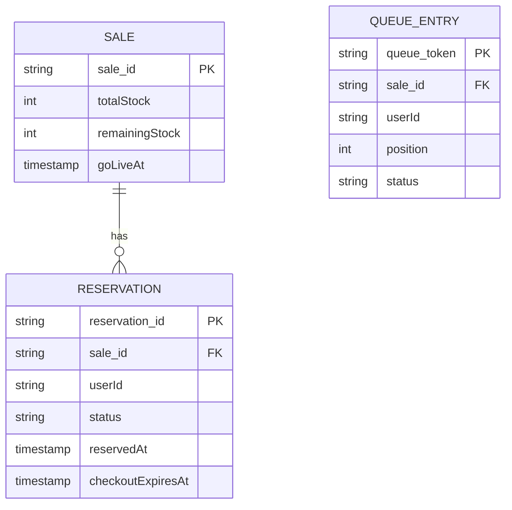

| Table | Storage choice & why |
|---|---|
| `Sale.remainingStock` | The single hot, atomically-updated counter — the correctness-critical piece of state in the whole system, deliberately kept as one value, not sharded |
| `Reservation` | Relational, needs the TTL-based state transitions (Reserved → Confirmed/Released) to be reliable and queryable by the release job |
| `QueueEntry` | High-write-volume during the burst window, low afterward — a natural fit for a fast, simple key-value store rather than a heavier relational store |

---

## Failure modes & mitigations

| Failure mode | Impact | Mitigation |
|---|---|---|
| **The atomic counter's underlying store becomes a bottleneck under even paced load** | Reservation latency degrades | This is exactly why the waiting room paces admission to a rate the counter can sustain reliably — size that pacing rate against real load-tested counter throughput, not a guess |
| **Release job fails to run or lags** | Abandoned reservations don't get returned, stock is under-utilized | Monitor release-job lag as a first-class metric; a backlog here directly wastes real, scarce inventory during the highest-value sales window |
| **A bot successfully games the queue** (e.g. exploits a client-side-only rate limit) | Real customers lose out disproportionately | Server-side enforcement of all rate-limiting/fairness checks — never trust client-side-only enforcement for anything with real economic value on the line |
| **Go-live time drifts across regions/clients due to clock skew** | Some users effectively get an unfair head start | Anchor go-live to server time, communicated to clients with enough lead time to account for reasonable clock drift, rather than relying on each client's own local clock to fire the request at the "right" instant |

---

## Non-functional walkthrough

**Scaling the waiting room is a straightforward, horizontally-scalable admission-control
problem** — it doesn't need strong consistency (a slightly-off queue position estimate is a UX
nicety, not a correctness requirement), which is exactly why it's the right place to absorb the
burst rather than the inventory counter, which does need strong consistency.

**Availability of the queue-join step should be very high** (never reject a join attempt outright
under load — degrade gracefully to a longer estimated wait, similar to the "always accept, pace
the work" principle from the KYC-verification chapter's admission control), while the atomic
counter's correctness must never be compromised for the sake of availability.

**Consistency is split cleanly by component**: the inventory counter needs strong, immediate
consistency (zero tolerance for overselling); the queue position/ETA shown to a waiting user can
be eventually consistent/approximate without real harm.

---

## Security & compliance

- **Payment processing itself** (actually charging the card during checkout) should reuse the
  patterns from the Payment System chapter — this chapter's scope is specifically the
  admission/reservation problem in front of checkout, not payment processing itself.
- **Bot mitigation and fairness enforcement** may intersect with regional consumer-protection
  regulations around ticket/product resale in some jurisdictions — worth a brief mention if the
  product is in a regulated category (e.g. event ticketing).
- **Queue-position/fairness transparency** — being reasonably transparent with users about their
  queue position and the reasons for a "sold out" result reduces support burden and disputes,
  compared to an opaque, unexplained rejection.

---

## Cost & trade-offs

**Waiting-room pacing rate trades perceived fairness/speed (a faster admission rate feels better
to individual users) against downstream system stability (too fast overwhelms the reservation
service/counter)** — this is the central tuning knob of the whole system, worth naming as an
explicit trade-off rather than picking an arbitrary number.

**Bot-mitigation friction (CAPTCHA, additional verification) trades a slightly worse experience
for legitimate users against meaningfully reduced bot advantage** — an accepted cost given the
alternative (a sale effectively won only by bots) is worse for brand trust.

---

## Wrap-up: MVP vs. stretch

**In scope for an MVP:**
- Virtual waiting room with paced admission.
- Atomic compare-and-set inventory reservation.
- Time-boxed checkout with a release-on-timeout job.
- Basic server-side rate limiting per account/IP at queue-join time.

**Explicitly out of scope for an MVP:**
- Sophisticated bot-detection (behavioral/velocity signals beyond simple rate limits) — start with
  basic rate limiting, layer in more advanced detection once bot activity is observed to warrant
  it.
- Dynamic queue-pacing (adjusting admission rate in real time based on observed downstream
  latency) — start with a fixed, load-tested pacing rate.

**Stretch goals, worth naming if asked "what's next":**
1. **Dynamic, latency-aware admission pacing**, adjusting the queue's release rate based on
   real-time downstream system health rather than a fixed pre-configured number.
2. **Behavioral bot detection**, beyond simple rate limits, using request-pattern signals.
3. **Purchase-limit enforcement across a verified identity** (not just per-account), to more
   robustly prevent one buyer from acquiring a disproportionate share via multiple accounts.

---

## Golden rules

- **Inventory decrement must be a single atomic operation, never check-then-decrement as two
  steps** — this is the correctness guarantee against overselling, non-negotiable regardless of
  load.
- **Absorb the thundering herd before it reaches inventory, with a paced admission queue** — don't
  try to make the inventory system itself withstand an unmoderated, instantaneous burst.
- **A reservation is not a sale** — time-box it, and release unclaimed reservations back to the
  pool, or abandoned carts permanently waste real, scarce stock.
- **The inventory counter needs strong consistency; the queue position/ETA does not** — split
  consistency requirements by component rather than applying one uniform bar everywhere.
- **No single mechanism fully stops bots** — layer rate limiting, behavioral signals, and
  challenge mechanisms, and treat fairness as a real product-trust requirement.

---

## Master cheat sheet

**One-liners:**
- Two separate problems, two separate mechanisms: a paced admission queue absorbs the
  thundering herd; a single atomic compare-and-set guarantees no overselling.
- Check-then-decrement as two steps is a guaranteed race condition at real flash-sale contention
  levels, not just a theoretical risk.
- A reservation is a time-boxed hold, not a completed sale — release unclaimed reservations back
  to the pool via a TTL, or abandoned carts permanently waste scarce stock.
- The inventory counter needs strong consistency; the waiting room's queue position/ETA does not
  — this split is what lets the queue scale horizontally while the counter stays a single,
  precisely-agreed value.
- Bot/fairness mitigation is layered (rate limits + behavioral signals + challenges), never a
  single silver-bullet check, and is a real brand-trust requirement, not just a technical nicety.

**Formula chain:**
```
contention_ratio       = concurrent_demand / available_stock
queue_admission_time    = concurrent_demand / sustainable_admission_rate
```

**Numbers:** flash-sale contention ratios often run 10:1 to 100:1+ — most demand is mathematically
unsatisfiable regardless of design · burst QPS at go-live can be 100-200x steady-state traffic,
concentrated in single-digit seconds · a well-paced waiting room converts that burst into an
admission rate the reservation/counter layer can sustain reliably.
