# Design a Global Distributed Lock Service (Planet-Scale) — FAANG Interview Guide

> Source chapter type: staff-level distributed-coordination infrastructure. Distinct from
> [the Sequencer guide](./12-Sequencer-FAANG-Guide.md), which generates monotonically increasing
> IDs — this chapter is about **mutual exclusion**: guaranteeing that at most one client is doing
> a piece of work at a time, across a fleet of machines that can crash, pause, or get partitioned
> from the network at any moment. The famous, most-tested lesson in this chapter is that a lock by
> itself is not enough — you also need a **fencing token**, or the lock's safety guarantee quietly
> breaks under exactly the failure conditions it exists to protect against.

## Mental model

Two processes must never both believe they hold the same lock at the same time — this sounds like
a simple boolean, but distributed systems make "simple booleans" hard because there's no shared
memory and no perfectly synchronized clock. A process can hold a lock, experience a long garbage-
collection pause or network partition that makes it *appear* dead to the lock service, have its
lock reassigned to someone else, and then **wake back up and keep acting as if it still holds the
lock** — writing to shared storage, believing it's still exclusive, while a second process now
also believes it's exclusive. Both are now acting concurrently on state that assumed only one of
them ever would.

The two hard problems:

1. **The lock service itself must be highly available and consistent**, which at planet scale
   means either a consensus-based service (Chubby/ZooKeeper/etcd-style) accepting the latency cost
   of cross-region agreement, or a regional-leader architecture accepting a different consistency
   trade-off — there's no free lunch here, and the choice has to be explicit.
2. **A lock, on its own, doesn't protect the resource it's guarding — a fencing token does.** The
   lock service can tell a client "you no longer hold the lock," but it cannot force that client
   to stop acting — the client might already be mid-write to a shared resource, unaware its lease
   expired. The resource being protected has to independently reject any operation carrying an
   outdated fencing token, which is what actually closes the safety gap.

**The one sentence to say out loud:** *"A distributed lock without a fencing token doesn't
actually guarantee mutual exclusion — it just makes the common case work, and quietly fails
exactly when a client pauses long enough for its lease to expire without it realizing."*

**The one picture to remember forever:**

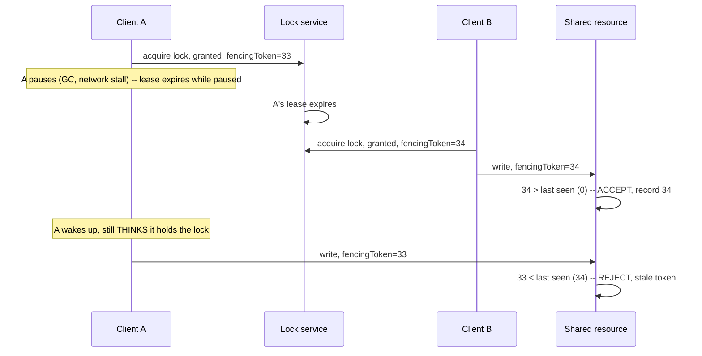

**Memory hook:** *"The lock tells you who's supposed to be exclusive. The fencing token is what
actually stops the one who lost the lock and doesn't know it yet — the resource, not the lock
service, is what enforces it."*

---

## Table of contents
[How to Identify This Topic](#how-to-identify-this-topic-in-an-interview) ·
[Interview Playbook](#interview-playbook) · [Requirements](#requirements-clarification) ·
[Capacity Estimation](#capacity-estimation-worked) · [API Design](#api-design) ·
[High-Level Architecture](#high-level-architecture) ·
[Architecture Evolution v1→v2→v3](#architecture-evolution-v1--v2--v3) ·
[End-to-End Walkthroughs](#end-to-end-request-walkthroughs) ·
[Deep Dive: Fencing Tokens](#deep-dive-fencing-tokens) ·
[Deep Dive: Leases & Safe Expiry](#deep-dive-leases--safe-expiry) ·
[Deep Dive: Cross-Region Consensus Cost](#deep-dive-cross-region-consensus-cost) ·
[Data Model](#data-model) · [Failure Modes](#failure-modes--mitigations) ·
[Non-Functional Walkthrough](#non-functional-walkthrough) ·
[Security & Compliance](#security--compliance) · [Cost & Trade-offs](#cost--trade-offs) ·
[Wrap-Up](#wrap-up-mvp-vs-stretch) · [Golden Rules](#golden-rules) ·
[Cheat Sheet](#master-cheat-sheet)

---

## How to identify this topic in an interview

- "Design a distributed lock service (like Chubby, ZooKeeper, or etcd's lock API)."
- The tell that this is a staff-level depth question, not a simple "use Redis SETNX" answer: the
  interviewer pushes on **what happens when a lock holder pauses or crashes** — that's the cue to
  bring up fencing tokens unprompted, since it's the single most-tested "gotcha" in this chapter.
- A follow-up like "what if this needs to work across multiple regions" is the
  [cross-region consensus deep dive](#deep-dive-cross-region-consensus-cost) — distinct from the
  Sequencer chapter's ID-generation problem.

---

## Interview playbook

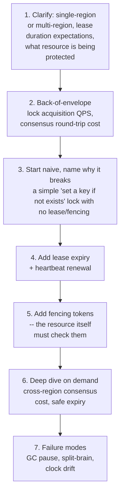

**What the interviewer is actually grading at each step:**
- Step 3: do you recognize, unprompted, that a lock with no lease/expiry mechanism means a
  crashed holder locks the resource forever — a lock needs a lease, not just a boolean?
- Step 5: do you spot, unprompted, that a lease/heartbeat mechanism ALONE still isn't safe — the
  paused-then-resumed client scenario — and propose fencing tokens as the actual fix, checked by
  the **resource**, not the lock service?
- Step 6: do you understand why strong cross-region consensus is expensive (a quorum round-trip
  across regions), and can you discuss the trade-off against a regional-leader approach?

---

## Requirements clarification

### Functional

| # | Requirement | Notes |
|---|---|---|
| F1 | Grant an exclusive lock on a named resource to at most one client at a time | The core guarantee |
| F2 | Automatically release a lock if its holder crashes or becomes unreachable | Prevents a dead client from locking a resource forever |
| F3 | Provide a mechanism (fencing tokens) that lets the protected resource itself reject stale operations from a client that has lost the lock | The actual safety guarantee — not optional |
| F4 | Support lock renewal (heartbeat) for holders doing long-running work | A lock held for an unknown-in-advance duration needs a way to extend its lease |
| F5 | Work correctly across multiple regions, if in scope | Determines the consensus architecture |

### Non-functional

| Requirement | Target | Why this number |
|---|---|---|
| Safety (mutual exclusion) | Absolute — this is the entire point of the system | A "mostly correct" lock service is worse than none, because callers build correctness-critical logic assuming it's exact |
| Availability | High, but not at the cost of safety | Unlike many systems in this course, this is a case where correctness must win over availability if the two ever conflict — a classic CAP-theorem-adjacent trade-off worth naming explicitly |
| Lock acquisition latency | Low, but bounded by the underlying consensus mechanism's round-trip cost | A single-region consensus round-trip is fast (single-digit ms); cross-region is much slower |
| Lease renewal reliability | Must not let a legitimately-alive holder lose its lock due to a missed heartbeat under normal transient hiccups | Needs a sensible grace period, balanced against how quickly a genuinely dead holder's lock should be reclaimed |
| Fencing-token monotonicity | Must never repeat or go backward, ever | The entire safety mechanism depends on this one property holding without exception |

**Clarifying questions worth asking the interviewer up front — and what each answer changes:**

| Question | If the answer is... | ...then this changes |
|---|---|---|
| "Single-region or multi-region?" | Multi-region, planet-scale | Confirms the cross-region consensus cost deep dive is central, not a footnote |
| "What's actually being protected by the lock — can the resource itself check a fencing token, or is it a legacy system we can't modify?" | The resource CAN check a token | Confirms the fencing-token mechanism is implementable; if the protected resource can't be modified to check tokens, that's a real, harder problem worth flagging explicitly rather than assuming away |
| "How long do lock holders typically need to hold a lock — milliseconds or potentially minutes?" | Can be long-running (minutes) | Confirms heartbeat-based lease renewal is necessary, not a fixed short TTL alone |
| "Is losing a small amount of availability during a network partition acceptable, to preserve safety?" | Yes, safety is non-negotiable | Confirms the design should favor a CP (consistent, not always available) posture over an AP one for the lock service itself |

**Say this out loud in the interview:** *"I want to be explicit that a lock and a fencing token
solve different halves of this problem — the lock service tells you who's supposed to be
exclusive right now, but only the fencing token, checked by the resource itself, actually prevents
a client that's lost its lock without realizing it from corrupting shared state."*

---

## Capacity estimation, worked

```
Given (illustrative, a planet-scale infrastructure service):
  Lock acquisitions/sec, globally                  = 5,000
  Average lock hold duration                        = 30 seconds
  Concurrently held locks at any moment              = 5,000 x 30 ~= 150,000

Single-region consensus round-trip:
  Typical consensus (e.g. Raft/Paxos-based) quorum round-trip, single region  ~= 5-15ms
  -> lock acquisition latency dominated by this consensus round-trip, not by any application
     logic -- this is the number that sets the realistic floor for how fast "acquire a lock"
     can be, regardless of how well everything else is engineered.

Cross-region consensus round-trip:
  Typical inter-region network latency (e.g. US-East to US-West, or further)  ~= 30-150ms
  -> if every lock acquisition needs a QUORUM across regions (not just within one), acquisition
     latency jumps by roughly an order of magnitude compared to single-region -- this single
     number is why planet-scale lock services often use a regional-leader architecture instead
     of a literal global quorum for every operation, discussed in the cross-region deep dive.

Heartbeat/renewal load:
  Concurrently held locks                            = 150,000 (from above)
  Heartbeat interval (e.g. 1/3 of lease duration,
    a common convention)                              = ~10 seconds
  Heartbeat QPS, globally                              = 150,000 / 10 ~= 15,000/sec
  -> heartbeat traffic, not initial acquisition traffic, is the dominant steady-state load on
     the lock service -- a design that only capacity-plans for acquisition QPS and ignores
     renewal traffic has under-sized the system.

Fencing-token counter:
  A single global monotonic counter (or per-resource monotonic counter) generating
    5,000 tokens/sec at peak
  -> a tiny number by this course's usual standards -- the SEQUENCER guide's own mechanisms
     (monotonic ID generation) are directly reusable here for generating fencing tokens
     themselves, even though the two chapters solve different overall problems.
```

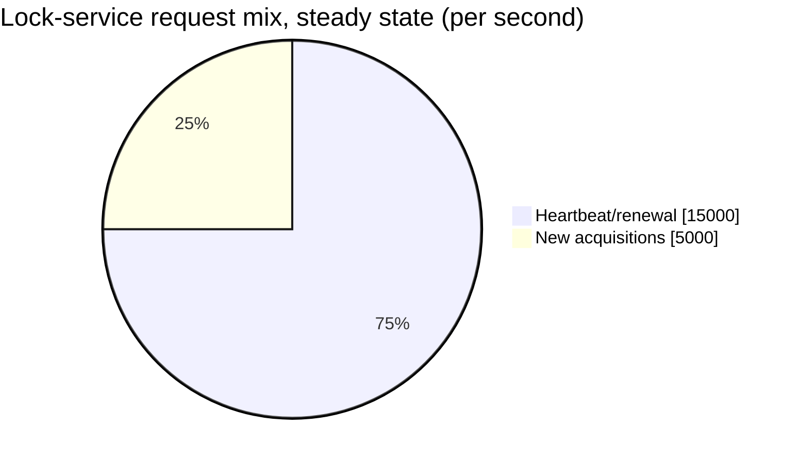

Heartbeat traffic outweighs acquisition traffic 3:1 at these illustrative numbers — capacity
planning that only accounts for acquisition QPS has under-sized the system.

**Redo-the-chain test:** if average lock-hold duration triples to 90 seconds (longer-running
protected operations), concurrently-held locks triple to ~450,000 and heartbeat QPS at the same
10-second interval also scales up proportionally — a direct, computable capacity impact of a
product decision about typical workload duration.

**The number worth memorizing:** heartbeat/renewal traffic, not initial lock-acquisition traffic,
dominates steady-state load — and cross-region consensus round-trips are roughly an order of
magnitude slower than single-region ones, which is the concrete number motivating a
regional-leader design over literal global quorum for every lock operation.

---

## API design

### `POST /v1/locks/{resourceId}/acquire`

```json
{ "clientId": "client_881", "leaseDurationSeconds": 30 }
```

Response:
```json
{ "status": "GRANTED", "fencingToken": 34, "leaseExpiresAt": "2026-07-24T18:00:30Z" }
```
or
```json
{ "status": "HELD_BY_ANOTHER", "retryAfterSeconds": 5 }
```

| Field | Notes |
|---|---|
| `fencingToken` | A monotonically increasing number, unique per acquisition of this resource — this is the value the client must attach to every operation against the protected resource, and the value the resource itself validates |
| `leaseExpiresAt` | The client must renew before this, or risk losing the lock — but critically, the client losing the lock does NOT retroactively invalidate work already in flight; only the fencing-token check at the resource does that |

### `POST /v1/locks/{resourceId}/renew`

```json
{ "clientId": "client_881", "fencingToken": 34 }
```

### `POST /v1/locks/{resourceId}/release`

```json
{ "clientId": "client_881", "fencingToken": 34 }
```

**The one sentence worth saying about the API surface:** *"Every operation against the protected
resource must carry the fencing token, and the resource — not this lock service — is responsible
for rejecting a stale one; the lock service's job ends at telling clients who currently holds the
lock and issuing tokens, it cannot reach into the resource and stop a rogue client itself."*

---

## High-level architecture

### Architecture evolution (v1 → v2 → v3)

**v1 — a simple "set a key if not exists," no lease:**

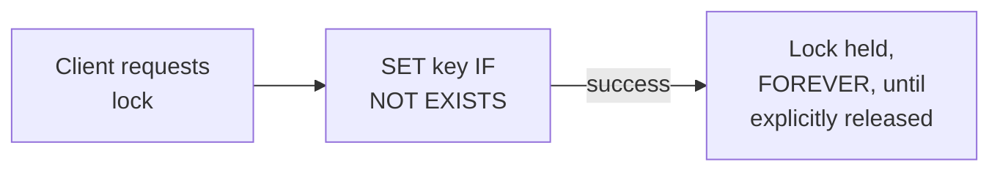

**Why it breaks:** if the holder crashes before explicitly releasing, the lock is held forever —
no other client can ever acquire it again. There's no self-healing mechanism at all.

**v2 — add a lease/TTL, but no fencing token:**

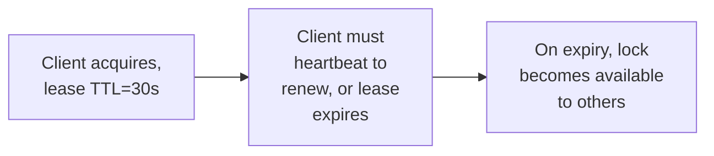

**Why it breaks:** this fixes the "locked forever" problem, but introduces the exact scenario in
the mental model's sequence diagram — a client that pauses (GC, network stall) long enough for its
lease to expire, then resumes, has no way to know its lease expired, and continues acting as if it
still holds the lock. A second client now legitimately holds the lock too. Both can concurrently
act on the protected resource, which is precisely the safety violation this whole system exists to
prevent.

**v3 — the real system: lease + heartbeat + fencing tokens enforced by the resource:**

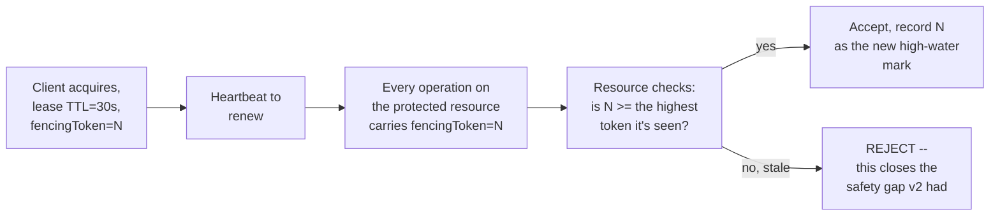

**What v3 fixes, one line each:** lease+heartbeat (already in v2) handles the common case of
detecting a dead holder; and fencing tokens, validated by the resource itself, close the specific
gap where a paused-then-resumed client doesn't know it lost the lock — the resource's own
monotonicity check is what makes the guarantee actually hold under that failure mode, not
anything the lock service does.

---

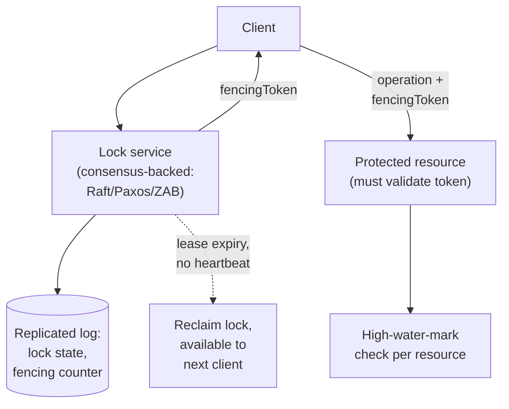

| Component | Role |
|---|---|
| Lock service (consensus-backed) | The source of truth for "who currently holds this lock" — built on a consensus protocol so it survives individual node failures without losing that truth |
| Fencing counter | Monotonically increasing, issued alongside every successful acquisition — reusable machinery from the Sequencer chapter's own ID-generation mechanism |
| Protected resource | The actual enforcement point — must independently validate that an incoming operation's fencing token is not stale, a requirement on every system that wants to use this lock service safely |

---

## End-to-end request walkthroughs

### Walkthrough 1 — normal acquire, heartbeat, release

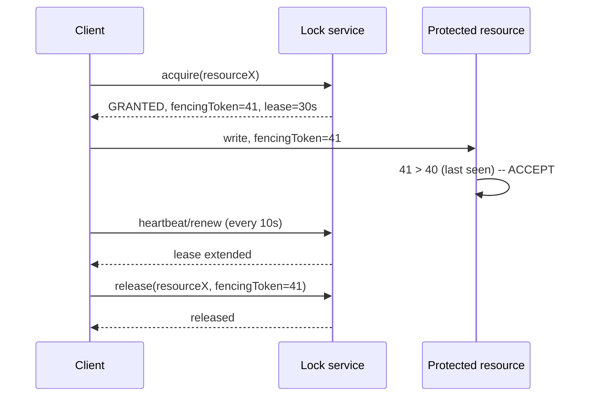

### Walkthrough 2 — the paused-client scenario, fencing token saves correctness

```mermaid
sequenceDiagram
    participant A as Client A
    participant Lock as Lock service
    participant B as Client B
    participant Resource as Protected resource

    A->>Lock: acquire(resourceX)
    Lock-->>A: GRANTED, fencingToken=41
    Note over A: A stalls (long GC pause) -- misses its heartbeat window
    Lock->>Lock: A's lease expires, no renewal received
    B->>Lock: acquire(resourceX)
    Lock-->>B: GRANTED, fencingToken=42
    B->>Resource: write, fencingToken=42
    Resource->>Resource: 42 > 41 -- ACCEPT, high-water mark now 42
    Note over A: A wakes up, unaware its lease expired, still believes it holds the lock
    A->>Resource: write, fencingToken=41
    Resource->>Resource: 41 <= 42 (high-water mark) -- REJECT
    Note over A,B: Client B's write is preserved uncorrupted; Client A's stale write is safely rejected
```

Walkthrough 2 is the entire reason this chapter exists — without the resource's own fencing-token
check, Client A's stale write in this exact sequence would have succeeded, silently corrupting
whatever Client B had just written.

### Walkthrough 3 — a network partition, minority side correctly refuses to grant locks

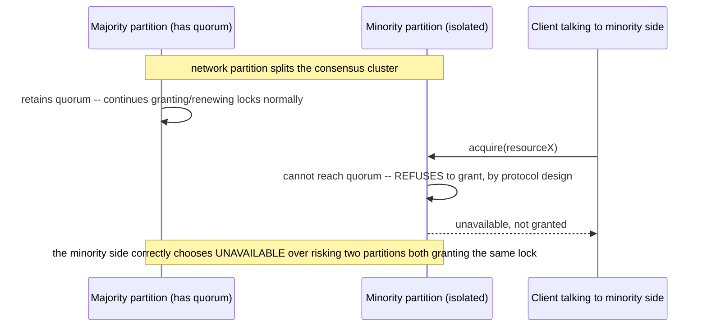

This is the concrete, deliberate CAP-theorem trade-off from the
[non-functional walkthrough](#non-functional-walkthrough) — safety wins over availability during
a partition, by design, not by accident.

---

## Deep dive: fencing tokens

Already the centerpiece of the mental model and both walkthroughs — this deep dive states the
mechanism precisely.

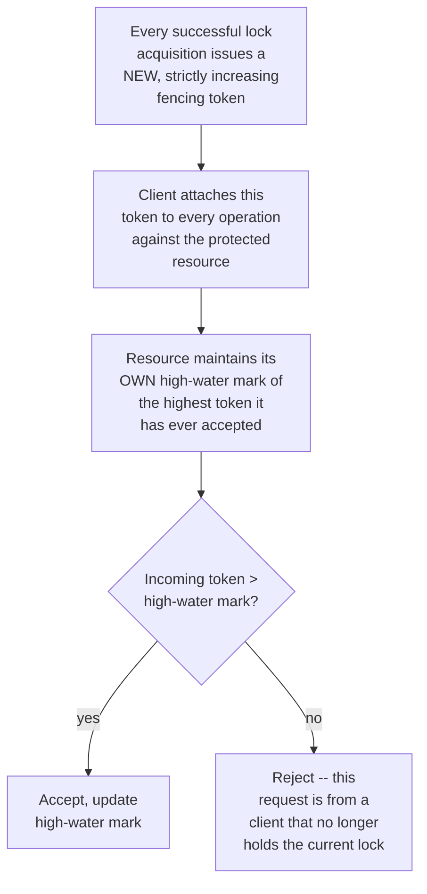

**Why the check must live in the resource, not the lock service:** the lock service has no
visibility into, or control over, the actual operations a client performs against the resource —
it can only tell clients who currently holds the lock. The resource is the only component that can
actually refuse to apply a stale operation, which is why the safety guarantee fundamentally
depends on the resource implementing this check, not on anything the lock service alone can
enforce.

**Why "strictly increasing," and why this must never repeat even across lock-service restarts:**
if a token value could repeat, a stale write from an old holder could be accepted because it
matches (or exceeds, if the counter reset) the resource's high-water mark by coincidence — the
monotonicity must be durable across any failure or restart of the lock service itself, which is
why fencing-token generation typically reuses the same durable-monotonic-counter machinery as a
sequencer.

**Interview cheat-sheet:** *"A lock without a fencing token doesn't actually guarantee mutual
exclusion under the paused-then-resumed failure mode — the fencing token, validated by the
resource itself with a durable high-water-mark check, is what closes that gap. This is worth
stating unprompted; it's the single most-tested insight in this entire chapter."*

---

## Deep dive: leases & safe expiry

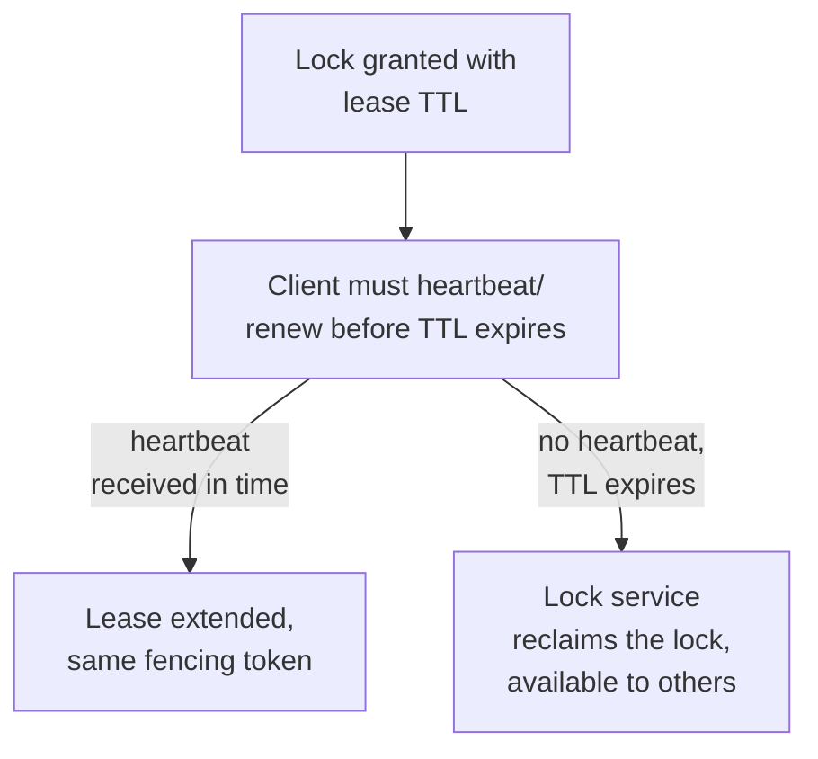

**Why a fixed TTL alone is a real trade-off, not a solved problem:** too short, and normal
transient network hiccups cause legitimate holders to lose their lock unnecessarily (a false
reclaim); too long, and a genuinely dead holder's lock takes correspondingly longer to become
available to anyone else. A common mitigation is heartbeating well before the TTL expires (e.g. at
1/3 the TTL interval, as in the capacity estimate) to build in tolerance for a missed heartbeat or
two before an actual expiry.

**Why the fencing-token mechanism is what makes lease-expiry decisions "safe to get slightly
wrong":** because the resource independently rejects stale operations regardless of what the lock
service believes about lease state, a slightly-too-aggressive or slightly-too-lenient TTL choice
affects *availability* (how quickly a dead holder's lock frees up) but never *safety* (whether two
holders can corrupt shared state) — this is precisely why fencing tokens matter more than getting
the TTL number perfectly tuned.

**Interview cheat-sheet:** *"Lease TTL tuning is an availability trade-off (how fast to reclaim a
dead holder's lock vs. tolerance for transient hiccups) — it is NOT what protects safety.
Fencing tokens protect safety, independently of whatever TTL value is chosen."*

---

## Deep dive: cross-region consensus cost

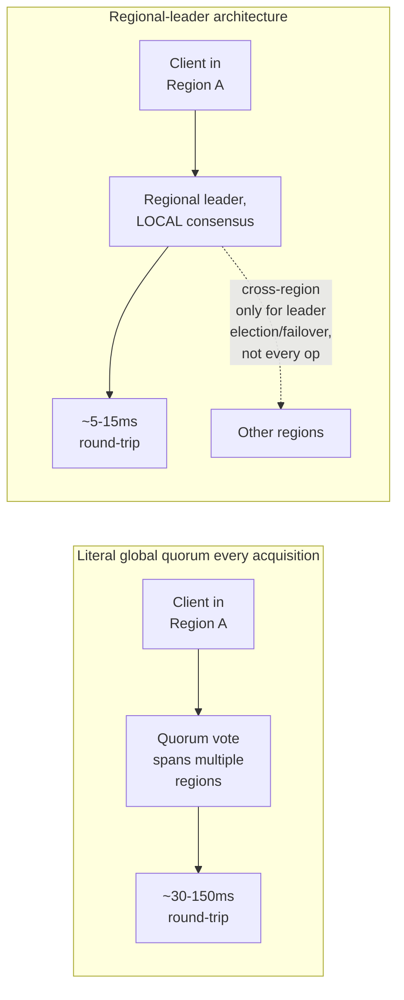

**Why literal global quorum on every single lock operation is often not the right default at
planet scale:** per the capacity estimate, cross-region round-trips are roughly an order of
magnitude slower than single-region ones — if most locks are acquired and used entirely within
one region's services, paying a global-quorum cost on every operation is a large, usually
unnecessary latency tax.

**Why a regional-leader architecture is the common alternative, and its real trade-off:** each
region (or a designated subset) runs its own consensus group for locks scoped to that region,
with cross-region coordination reserved for genuinely global resources or for leader
election/failover — this keeps common-case latency low, at the cost of real complexity in
deciding which resources need genuinely global exclusivity versus region-scoped exclusivity, a
distinction that has to be made explicitly, not assumed away.

**Interview cheat-sheet:** *"Don't default to a literal global quorum for every lock operation at
planet scale — the round-trip cost is roughly an order of magnitude worse than staying within one
region. A regional-leader architecture, reserving cross-region coordination for genuinely global
resources or failover, is the realistic default, and it requires explicitly classifying which
locks actually need global (not just regional) exclusivity."*

---

## Data model

**Lock lifecycle:**

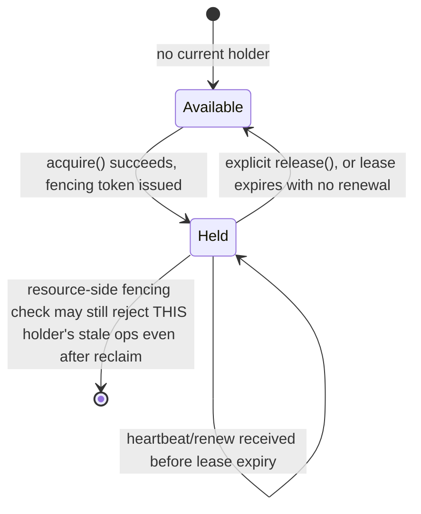

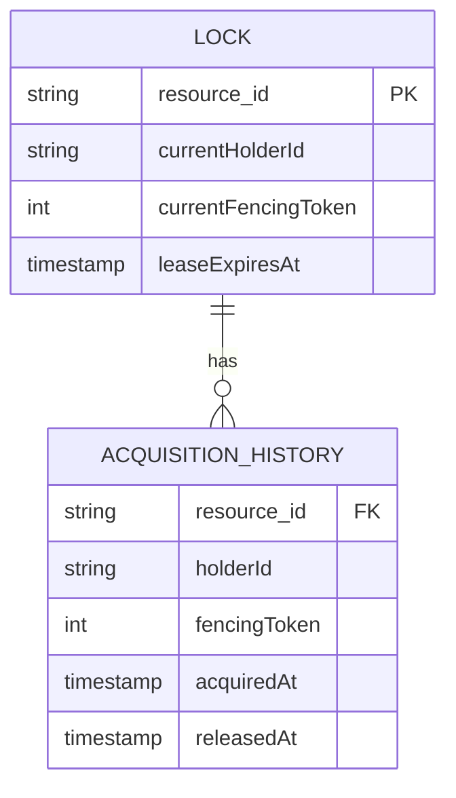

| Table | Storage choice & why |
|---|---|
| `Lock` | The consensus-replicated state itself — must be strongly consistent, backed by the underlying consensus protocol's replicated log, not an ordinary eventually-consistent store |
| `AcquisitionHistory` | Append-only audit trail — useful for debugging exactly which client held a lock and with what fencing token at any point in time |

---

## Failure modes & mitigations

| Failure mode | Impact | Mitigation |
|---|---|---|
| **A lock holder experiences a long GC pause or network stall** | The exact scenario this chapter's mental model walks through | Fencing tokens, validated by the resource — the load-bearing mitigation for this specific failure mode |
| **Network partition splits the lock-service cluster** | Risk of two sub-clusters each believing they can grant locks (split-brain) | Consensus protocols (Raft/Paxos) require a quorum majority to make progress — a minority partition simply cannot grant new locks at all, correctly favoring safety over availability during a partition |
| **Clock drift between the lock service and a client** | Could, if leases were purely client-clock-based, cause disagreement about whether a lease has expired | Lease expiry should be judged by the lock service's own clock/consensus-log timing, not trusted to client-reported time |
| **Fencing-token counter itself has a bug or resets** | Would silently break the entire safety guarantee | The counter must be as durable and carefully implemented as the Sequencer chapter's own ID-generation mechanism — this is not a component to under-invest in given how much safety depends on it |

---

## Non-functional walkthrough

**Scaling acquisition/renewal throughput is bounded by the underlying consensus protocol's
throughput**, which is why heartbeat/renewal load (the dominant steady-state traffic, per the
capacity estimate) needs to be sized carefully against realistic consensus throughput limits, not
assumed to scale freely.

**Availability is deliberately subordinate to safety in this system's design posture** — during a
network partition, a correctly-implemented consensus-based lock service will refuse to grant new
locks from a minority partition rather than risk two partitions both granting the same lock, a
direct, worth-stating CAP-theorem trade-off favoring consistency.

**Consistency is the entire point** — this is one of the few systems in this course where eventual
consistency of any kind, for the core lock state itself, is not an acceptable design choice at all.

---

## Security & compliance

- **Access control on lock acquisition** — not every client should be able to acquire an arbitrary
  lock; authorization should be checked per resource, since a malicious or buggy client acquiring
  a lock it has no business holding can create real availability problems for legitimate holders.
- **Audit trail of lock history** (who held what, when, with what fencing token) supports
  debugging production incidents where two systems appear to have concurrently modified shared
  state — exactly the scenario walkthrough 2 illustrates.
- **Fencing-token exposure** — the token itself isn't sensitive, but its integrity (nobody can
  forge or replay an old one successfully) is safety-critical and should be protected with the
  same rigor as any other security-relevant identifier.

---

## Cost & trade-offs

**Regional-leader architecture trades some operational complexity (classifying which locks need
global vs. regional scope) for a large latency win on the common case** — per the capacity
estimate, roughly an order of magnitude, which is almost always worth the added complexity at real
planet scale.

**Favoring safety over availability during partitions is a deliberate cost** — some legitimate
lock requests will be refused or delayed during a partition that a more availability-favoring
design might have served (incorrectly) — this is the right trade for a system whose entire purpose
is a safety guarantee, worth stating explicitly rather than treating availability loss as an
unqualified negative.

---

## Wrap-up: MVP vs. stretch

**In scope for an MVP:**
- Single-region, consensus-backed lock service with lease-based expiry and heartbeat renewal.
- Fencing tokens issued on every acquisition, with clear documentation/contract that protected
  resources must validate them.
- Basic acquisition-history audit logging.

**Explicitly out of scope for an MVP:**
- Multi-region/regional-leader architecture — start single-region (simpler, lower latency for a
  single-region deployment), add cross-region coordination once genuinely global resources are
  identified as a real requirement.
- Fine-grained per-resource access control — start with basic authentication, add resource-scoped
  authorization once multi-tenant usage patterns are clearer.

**Stretch goals, worth naming if asked "what's next":**
1. **Regional-leader multi-region architecture**, with explicit classification of
   globally-exclusive vs. regionally-exclusive resources.
2. **Adaptive lease TTL**, tuned per-client or per-resource based on observed heartbeat reliability
   rather than one fixed global TTL.
3. **A client library that enforces the fencing-token contract automatically**, reducing the risk
   of a protected resource forgetting to implement the validation check correctly.

---

## Golden rules

- **A lock without a fencing token doesn't actually guarantee mutual exclusion** — the paused-
  then-resumed client scenario is a real, common failure mode this chapter exists to address, and
  naming it unprompted is the single biggest signal of depth in this topic.
- **The fencing-token check belongs in the resource, not the lock service** — the lock service
  cannot reach into a client's operations and stop them; only the resource can refuse a stale one.
- **Lease TTL tuning is an availability trade-off, not a safety mechanism** — fencing tokens
  provide safety regardless of how the TTL is tuned.
- **Favor safety over availability during a network partition** — a correctly-implemented
  consensus-based lock service refuses to grant locks from a minority partition, by design.
- **Don't default to literal global quorum for every lock operation at planet scale** — a
  regional-leader architecture, reserving cross-region coordination for genuinely global
  resources, avoids an order-of-magnitude unnecessary latency tax on the common case.

---

## Master cheat sheet

**One-liners:**
- Mutual exclusion requires two things working together: a lock service granting exclusive
  leases, and a fencing token that the protected RESOURCE independently validates — neither alone
  is sufficient.
- The classic failure this chapter tests: a lock holder pauses long enough for its lease to
  expire, wakes up unaware, and keeps acting as if it still holds the lock — only the resource's
  fencing-token check catches this.
- Heartbeat/renewal traffic, not initial acquisition traffic, dominates steady-state load on the
  lock service.
- Cross-region consensus round-trips are roughly an order of magnitude slower than single-region —
  a regional-leader architecture is the realistic default at planet scale, not literal global
  quorum on every operation.
- This system deliberately favors consistency over availability during a network partition — a
  direct, intentional CAP-theorem trade-off.

**Formula chain:**
```
concurrently_held_locks   = acquisitions_per_sec x avg_hold_duration_sec
heartbeat_QPS              = concurrently_held_locks / heartbeat_interval_sec
```

**Numbers:** single-region consensus round-trips are typically single-digit-to-low-teens
milliseconds; cross-region round-trips are commonly 30-150ms, roughly an order of magnitude
slower · heartbeat/renewal traffic typically dominates steady-state lock-service load over raw
acquisition traffic · fencing tokens must be durably, strictly monotonic across any lock-service
restart, or the entire safety guarantee is compromised.
