# Design Uber's Driver Dispatch System — The Story (narrative edition)

> **What this file is.**
> The reference file, `62-Design-Ubers-Driver-Dispatch-System-FAANG-Guide.md`, is the one to recite
> from. It has the requirements, the API shapes, every trade-off table, and the master cheat sheet.
>
> This file is a second way in: the same material told as one continuous story, in plain language.
> Engineers at a company keep hitting a wall, patch it, and the patch itself creates the next wall —
> until we land on the exact same design the reference file documents.
>
> The company, **Nearloop** (a rideshare startup), is fictional. But every wall it hits, and every
> fix it reaches for, is something a real, named system actually does:
> - Uber's own **H3** hexagonal spatial index (open-sourced, documented on Uber's engineering blog)
> - The classical **Hungarian algorithm** for bipartite matching (Kuhn, 1955)
> - The batched-dispatch research DiDi has published (KDD 2018, "Large-Scale Order Dispatch in
>   On-Demand Ride-Hailing Platforms")
> - The same atomic compare-and-set pattern behind DynamoDB conditional writes and Redis `SETNX`
>
> I'll say clearly, every time, whether something is a documented fact or just a reasonable
> stand-in number, tagged `[illustrative]`.

**The trigger phrase** for this whole topic is: *"design Uber's matching/dispatch system"* —
specifically **which driver gets which rider**, not the whole ride-hailing product and not pricing.

Keep one sentence in your head as you read: **matching one rider to one driver, the instant a
request arrives, is easy to build and locally sensible — but it is not the same thing as matching
many riders to many drivers well. The whole story below is the gap between those two.**

---

## Chapter 1 — The clipboard that couldn't keep up

### Where Nearloop starts

It's 2016. Nearloop is a scrappy rideshare startup running in one mid-sized city. About **50
drivers** are logging into the app at any given moment.

The matching code is the simplest thing that could possibly work:

1. A ride request comes in.
2. Loop through every driver currently marked online.
3. Compute the straight-line distance from each one to the pickup point.
4. Assign whichever driver comes out smallest.

With 50 drivers, this loop finishes in well under a millisecond. Nobody thinks twice about it.

### Eighteen months later, the wheels come off

Nearloop has grown into three more neighborhoods. Two things changed:

| Metric | Then | Now |
|---|---|---|
| Drivers online at peak | ~50 | **8,000** city-wide |
| Requests per second at peak | negligible | **500 requests/sec** `[illustrative — the reference guide's own worked capacity numbers]` |

The matching loop itself is unchanged: still scan every online driver, every single time. Let's
redo the math with the new numbers:

- 8,000 distance calculations per request.
- At 500 requests/sec, that's **4,000,000 distance calculations a second** — all funneled through
  one shared, lock-protected list of driver locations.
- Contention on that lock alone pushes a single lookup from under a millisecond to roughly
  **50ms** `[illustrative]`.

That 50ms sounds small — until you compare it to the arrival rate. 500 requests/sec means a new
lookup needs to *start* every 2ms on average. At 50ms per lookup, the queue of pending lookups
doesn't drain — it grows, request after request, faster than it can empty out.

Twenty minutes into Friday evening peak, riders are staring at a "finding you a driver" spinner
for **over 4 seconds**, and it's climbing.

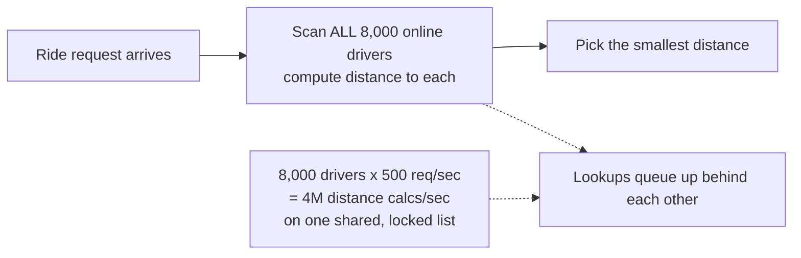

### Why does this happen

The obvious next question: *why does finding the nearest driver require checking every single
driver in the city?*

Because the code has no notion of "near" until it's already measured the distance to everyone. It
doesn't know, ahead of time, which drivers are anywhere close to this particular pickup point.

### The fix: a geo-spatial index

Stop keeping drivers in one giant, unsorted list. Instead, bucket them by location into a
**geo-spatial index** — cells on a map — so a query only ever has to look inside the pickup
point's cell and its immediate neighbors.

**Analogy:** think of an **apartment building's directory sorted by floor and wing**, instead of
one alphabetized list of every resident in the building. You go straight to the third floor, east
wing, instead of reading every name on every floor.

The real, documented version of this idea is **H3**, Uber's own hexagonal hierarchical spatial
index. It's open-sourced and described on Uber's engineering blog. H3 divides the map into a grid
of hexagonal cells at multiple zoom levels. It's exactly what the surge-pricing side of Uber's own
stack uses too, for the same underlying location data — just aggregated differently.

### New problem: fast lookup is not the same as good matching

Once the geo-index makes candidate lookup fast — tens of milliseconds instead of seconds —
Nearloop can *find* nearby drivers quickly. But "find nearby drivers quickly" and "assign the
*right* driver to the *right* rider" are two different problems.

Right now, the moment a candidate list comes back, Nearloop still assigns the closest driver
**instantly**, one request at a time, with zero awareness of any other request that might arrive a
second later.

### How I'd say this in an interview

"Scanning every driver for every request is fine at small scale and falls over at real scale,
because the cost grows with driver count times request rate. The fix is the same one every
geo-search system uses — bucket locations into cells, Uber's own H3 grid being the documented
real-world version — so a lookup only touches nearby cells. That gets you fast candidates. It says
nothing yet about whether you're picking the *right* candidate."

---

## Chapter 2 — The rider who got the worse driver because they asked first

### Fast, but still greedy

With the hex-grid index in place, Nearloop's matching is fast. It's also still **greedy**:

- Assign the nearest available candidate the instant a request lands.
- Remove that driver from the pool.
- Move on to the next request.

Here's a concrete scenario that shows why "fast and locally sensible" isn't the same as "good."

### Worked example: Rider A and Rider B

Walk through it step by step:

1. **T+0** — Rider A requests a pickup. Two drivers are nearby: D1 is 3 minutes away, D2 is 5
   minutes away.
2. Greedy matching immediately assigns D1 to Rider A. It's the nearest, so why wait?
3. **T+1s**, one second later — Rider B requests a pickup two blocks over. D1 would have been an
   *ideal* match for B — only 1 minute away.
4. But D1 is already gone, claimed by A a second earlier. B gets stuck with a driver who's 6
   minutes out instead.

Now compare the totals:

| Scenario | Rider A's driver | Rider B's driver | Combined wait |
|---|---|---|---|
| What actually happened (greedy) | D1, 3 min | 6-min driver | 3 + 6 = **9 min** |
| What a joint decision could have done | D2, 5 min | D1, 1 min | 5 + 1 = **6 min** |

A's ride with D1 (3 min) wasn't meaningfully better than A riding with D2 (5 min) would have
been. But B's ride went from a possible 1 minute to an actual 6 minutes. The *sum* of wait time
across A and B is worse than it had to be — even though neither individual assignment, looked at
alone, seems like an obvious mistake.

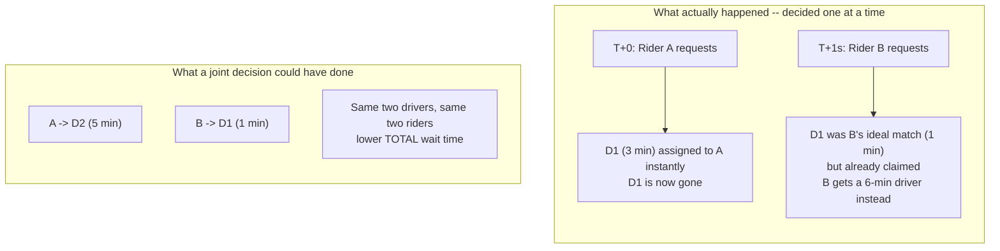

### Why does this happen

The obvious next question: *if D1 hadn't been snapped up the instant A asked, could B have gotten
the better match?*

Yes — but only if the system had waited just long enough to see both requests before deciding
anything.

### The fix: batch the decisions

Don't decide the instant one request shows up. Instead, accumulate requests — and the available
driver pool — over a short **batching window**, then decide for the *whole batch* at once.

**Analogy:** picture a **wedding planner seating guests**. One approach is to seat each guest at
whichever open table is nearest the door the moment they walk in. A better approach is to hold the
entrance for a few minutes, let the current wave of guests arrive, then look at the *whole room* —
every open table and every waiting guest — and assign seats to get the best overall fit.

Real dispatch systems at scale document exactly this trade. DiDi's own published research on
ride-hailing dispatch (KDD 2018, "Large-Scale Order Dispatch in On-Demand Ride-Hailing Platforms")
frames matching as a combinatorial assignment problem, solved over a short window of accumulated
requests — specifically because doing it one request at a time under-performs on the aggregate.

Nearloop picks a window of **3 seconds** `[illustrative — the reference guide's own worked
number]`.

### New problem: how big is "the whole room," now?

At 500 requests/sec, a 3-second window accumulates **1,500 requests** at once, each with roughly
20-40 overlapping nearby driver candidates `[illustrative]`.

"Look at the whole room and find the best overall seating" is easy to say for eight wedding
guests. It's a very different computational problem for fifteen hundred.

### How I'd say this in an interview

"Greedy matching is locally sensible but only locally optimal — have a concrete two-rider example
ready, it's the single most convincing way to make this tangible. The fix is batching: accumulate
requests over a short window and solve the assignment jointly, the same shape of trade DiDi's own
published dispatch research documents. The cost is that every individual rider waits that window's
length before a specific driver is even chosen."

---

## Chapter 3 — The seating chart that takes longer to compute than the party lasts

### The cost of "best possible"

So the plan is: hold a 3-second window, then find the *best possible* assignment across all 1,500
requests and their overlapping driver candidates.

Obvious next question: what does "best possible" actually cost to compute?

### Worked example: running the exact solver

The classical, exact way to solve "match N requests to N drivers to minimize total distance" is
bipartite matching — the **Hungarian algorithm**. It's a real, documented algorithm dating to
Kuhn's 1955 paper, with a runtime of **O(n³)** for n items on each side.

Plug in real numbers:

1. Requests per batch: 1,500.
2. Relevant drivers per batch: also about 1,500.
3. n³ with n = 1,500 works out to roughly **3.4 billion operations**
   `[illustrative — the actual exponent-scale point is real, the exact constant depends on
   implementation]`.
4. Run that exact solver on a single core, and it takes **well over a minute** `[illustrative]`.

That's a problem, because the batch is supposed to produce an answer within *seconds*, not
minutes. By the time the exact solver finishes solving batch #1, four more 3-second windows have
already piled up behind it, unsolved.

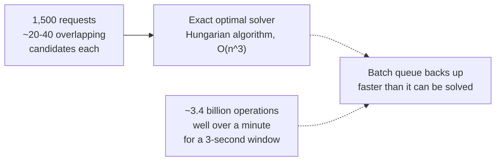

### Do we need the perfect answer?

The obvious next question: *do we actually need the mathematically perfect answer, or just a
really good one, fast?*

For a wedding of eight guests, a planner can work out the objectively best seating chart by hand —
the search space is tiny. For a fifteen-hundred-guest banquet, no planner tries every possible
arrangement. They use a practical, fast rule of thumb — seat people by table zone, adjust for
obvious conflicts — and get a result that's *almost* as good, in a fraction of the time.

### The fix: a scalable heuristic, over a smaller graph

Two changes together:

1. Swap the exact solver for a **scalable heuristic / approximate matching algorithm**.
2. Restrict the problem to *genuinely overlapping* candidate pools, instead of a full city-wide
   brute force. Most of Nearloop's 1,500 requests don't actually share any candidate drivers with
   most other requests, so the real solvable graph is much sparser than "1,500 by 1,500."

This is exactly the practical choice production dispatch systems make: get most of the benefit of
solving jointly, without paying for a guarantee of mathematical optimality that the batch size
makes computationally impractical anyway.

### New problem: a valid-looking answer isn't the same as a safe one

The heuristic solver now runs fast enough — comfortably inside the 3-second window. But "the
solver picked a valid-looking assignment" and "that assignment actually gets *acted on* correctly"
are two different guarantees.

What if two different requests' solved outcomes both name the *same* driver as their winner?

### How I'd say this in an interview

"An exact optimal assignment over a real batch size is a real computational cost — cubic in batch
size, and batches run into the hundreds or low-thousands of requests, so an exact Hungarian-style
solve is impractical to run every few seconds forever. The practical answer is a fast heuristic
over the *actually overlapping* candidate pools, not a full-city brute force — near-optimal,
computed in time."

---

## Chapter 4 — Two riders, one driver, and only one of them should get him

### A bug that shows up in month four

The heuristic solver is fast and produces good assignments. Here's the bug that shows up in month
four of running batched matching in production.

Nearloop shards batch-solving across multiple workers by geo-region, with a bit of overlap near
region boundaries — a reasonable way to parallelize solving 1,500 requests.

### Worked example: the double-claim on Driver D847

One Friday night, monitoring shows **41 cases in a single hour** `[illustrative]` of the following
sequence:

1. Two different solver runs are working on overlapping edge-of-region candidate pools.
2. Both independently conclude that **Driver D847** is the best pick — one for Rider X, one for
   Rider Y — in the very same batch cycle.
3. Both solver runs proceed to send Driver D847 an offer. His app buzzes twice.
4. If he taps "accept" on the first one before either side has told the other, two riders are now
   both expecting the same driver to show up.

### Why does this happen

The obvious next question: *wasn't the assignment already "correctly solved"?*

Yes — each individual solver run picked a locally sensible, non-conflicting-*within-its-own-view*
answer. The problem is that neither solver run knew about the other's decision at the moment it
decided, because the solver works off a snapshot of "who's available" that can already be stale by
the time its output is acted on.

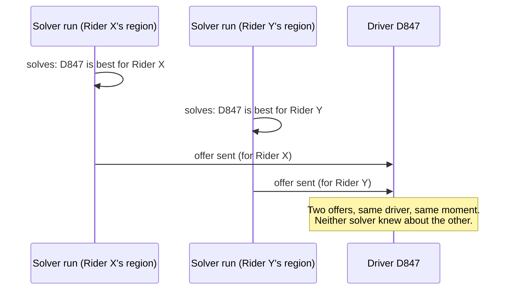

### The fix: make the claim atomic

Separate "the solver's pick" from "actually claiming that driver," and make the claim step
**atomic** — a compare-and-set:

- Is this driver still marked available, right now, at the moment of claiming?
- **If yes:** the claim succeeds, and the driver flips to unavailable immediately.
- **If no** — someone else's claim already landed first — this claim fails cleanly, and that
  rider's request goes back to the solver for a second pick. Not a crash, not a silent
  double-offer.

**Analogy:** picture buying the **last ticket to a concert**. Two browser tabs can both show "1
seat left" at the same instant, but only whichever checkout actually clears the database first
gets the confirmation. The other tab immediately gets "sold out, pick another seat" instead of
also getting confirmed.

This compare-and-set discipline is real and widely documented — it's exactly what DynamoDB's
conditional writes and Redis's `SETNX` are built for. It's the same pattern behind ordinary
e-commerce flash-sale inventory reservations, just with "an available driver" as the contended
resource instead of stock count.

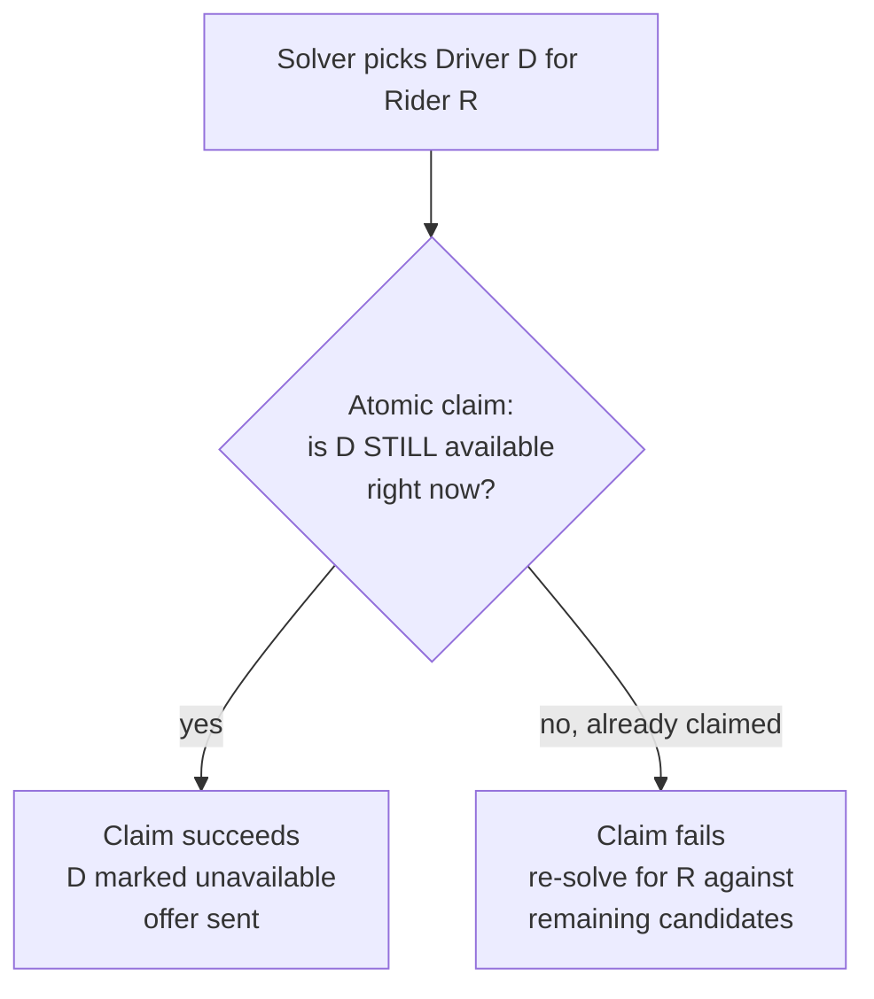

### New problem: someone always loses the race

The atomic claim closes the double-dispatch hole cleanly. But it also guarantees that *someone*
will occasionally lose that race — a real rider whose top pick got claimed a moment earlier by a
different rider's process. That rider needs a next-best pick, fast.

And separately: even a driver who *wins* the claim and gets an offer might still say no.

### How I'd say this in an interview

"A correctly-solved assignment can still race against a concurrent claim by the time it's actually
acted on — that's not a solver bug, it's a timing gap between deciding and acting. The fix is the
same reservation pattern any flash-sale system uses: make the claim itself atomic, compare-and-set,
so exactly one side wins and the loser gets a clean signal to re-solve, not a silent conflict."

---

## Chapter 5 — The driver who said no, and the rider who couldn't tell why

### Winning the claim isn't the end of the story

Atomic claiming means exactly one rider "wins" a given driver. But winning the claim just means an
**offer** gets sent — the driver still has to actually accept it.

Real acceptance rates for ride-hail driver offers run in the **low-to-mid 90s%**
`[illustrative — directionally realistic for gig dispatch, not a specific published figure]`. The
rest decline (ending their shift, already mid-errand) or simply never respond because their app is
backgrounded.

### Worked example: how much this costs at scale

At 500 requests/sec city-wide, even a 5% decline-or-timeout rate works out to **25 offers a
second** that don't convert on the first try.

If Nearloop's answer to a decline is "put the rider back into the next scheduled batch window,"
that rider now waits a *full extra 3-second cycle* just because the driver they were matched with
said no. That's worse than if they'd never been matched to that particular driver in the first
place.

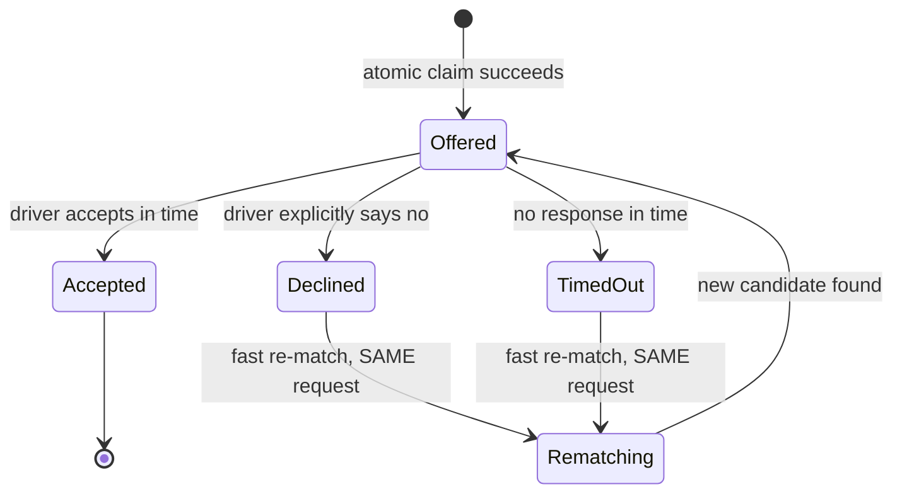

### Does the reason for "no driver" matter?

The obvious next question: *does it matter, from the rider's side, whether the driver explicitly
said no or just never answered?*

No — either way, the rider is in exactly the same spot: still waiting, driver-less. So the fix
treats both cases identically.

### The fix: one fast path for both decline and timeout

Route both decline and timeout into the same **fast, request-scoped re-match**:

- Re-run candidate search for *just that one rider*.
- Match against whichever drivers are currently available.
- Do it immediately, without waiting for the next full batch cycle.

**Analogy:** think of a **job offer with a response deadline**. A recruiter extends an offer with
a 24-hour window. If the candidate says no, or just never replies, the recruiter doesn't restart
the entire hiring process from scratch — they immediately move to the next-ranked candidate already
sitting in the pipeline. Silence and an explicit "no" get the exact same next step.

### New problem: is "currently available" actually true?

The fast re-match reruns candidate search against "currently available" drivers. But "currently
available, according to the index" and "actually there right now" are not guaranteed to be the
same thing.

What if the top candidate the re-match finds is a driver whose phone went quiet five minutes ago?

### How I'd say this in an interview

"Decline and timeout should route to the exact same fast re-match path — the rider shouldn't get a
worse experience just because a driver went silent instead of explicitly declining. And it has to
be scoped to just that one rider's request, not a wait for the next full batch, or the one unlucky
rider pays for the driver's non-answer twice."

---

## Chapter 6 — The driver who was there five minutes ago

### A ping that stops arriving

Nearloop's drivers ping their location roughly every **4 seconds** `[illustrative — the reference
guide's own worked ping interval]`.

One evening, a driver's app gets backgrounded by the phone's OS to save battery. His last ping in
the geo-index is now **45 seconds old** — but the index doesn't know that. It still shows him
sitting at that last-known spot.

### Worked example: the ghost match

1. A rider requests a pickup nearby.
2. The fast re-match path (or even a normal batch) picks the backgrounded driver as the best
   candidate — he looks closest on paper.
3. An offer goes out — and nothing happens, because his app isn't actively listening anymore.
4. The rider waits, gets no driver, and has to request again.

That's a strictly worse outcome than if the system had simply skipped him and picked the
next-nearest driver with a fresh signal.

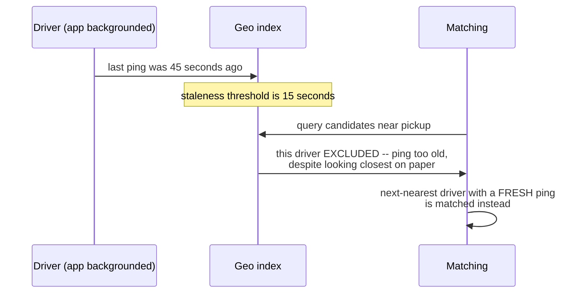

### How old is too old to trust?

The obvious next question: *how old is too old to trust?*

Given a 4-second ping cadence, anything beyond roughly **15 seconds** `[illustrative — the
reference guide's own worked staleness threshold]` without a ping means at least three or four
expected pings were missed. That's not normal network jitter — that's a driver who's likely gone
dark.

### The fix: a staleness threshold

Treat any driver whose last ping is older than the staleness threshold as **unavailable for
matching purposes** — full stop — even though the index still technically "knows" where he last
was.

**Analogy:** think of a **missing-persons "last known sighting."** Once that sighting is old
enough, investigators stop treating it as his *current* location and start looking at where he
might actually be *now*, instead of chasing a stale lead. A slightly farther, confirmed-active
driver beats a closer driver who might not even be there anymore.

### New problem: is the matching goal itself fair?

Location freshness solves "don't match riders to ghosts." It says nothing about whether the
matching objective itself is *fair*.

Now that candidate lookup is fast, batching is solved with a cheap heuristic, claiming is atomic,
decline/timeout has a fast path, and stale drivers are filtered out — the system is, by design,
still optimizing for one thing only: minimizing rider ETA.

Is that actually good for the drivers?

### How I'd say this in an interview

"Driver location has to be treated as perishable — a ping past a threshold, given the known ping
cadence, is worse than no data at all, because it's confidently wrong instead of honestly unknown.
The fix is the same discipline the surge-pricing side of the stack applies to the same underlying
location stream: stale means unavailable, no exceptions."

---

## Chapter 7 — The driver parked in the best spot who gets every fare

### A side effect nobody designed on purpose

Pure ETA-minimization has a side effect nobody designed for on purpose.

### Worked example: the stadium exit versus the quiet neighborhood

| Driver | Where he sits | What happens |
|---|---|---|
| Driver near a busy hub (stadium exit, train station) | Nearly always the geographically closest candidate | Offered a new match within **30 seconds** of finishing his last ride, almost every single time `[illustrative]` |
| Driver two neighborhoods over | Slightly farther from most requests on any given day | Waits **20+ minutes** between fares `[illustrative]`, through no fault of his own |

The second driver isn't doing anything wrong. He's just not standing in the right spot as often.

Driver-earnings equity on gig-dispatch platforms is a real, documented concern that regulators and
the platforms themselves take seriously. For instance, driver pay rules from bodies like New York
City's Taxi and Limousine Commission exist specifically because how fares get distributed among
drivers has real income consequences — not just an abstract fairness debate.

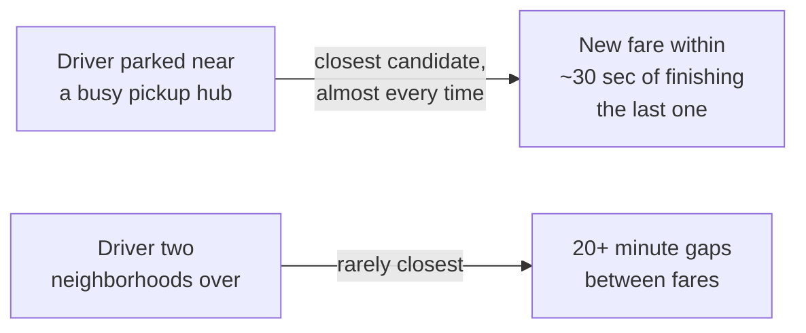

### Should we stop optimizing for ETA?

The obvious next question: *do we just stop optimizing for ETA, then, and spread fares around
evenly?*

No — riders would start waiting noticeably longer on average, and that's the whole reason
ETA-minimization was the objective in the first place. The answer isn't "replace" ETA, it's "blend
with" ETA.

### The fix: a fairness term in the objective

Add a **fairness term** to the assignment solver's objective function. The score for "should Rider
R get Driver D" now weighs both:

- ETA, and
- Something like how long Driver D has gone since his last fare, or his utilization relative to
  other nearby drivers.

**Analogy:** the classic **airport taxi rank rule**. The driver who's been waiting longest in the
queue gets first crack at the next fare, not whichever driver happens to be parked nearest the
terminal door. Dispatch borrows that same fairness instinct and blends it into the scoring, rather
than replacing distance-based scoring outright.

### New problem, an honest one — not a bug to "solve"

The fairness term and the ETA term are in direct tension by construction: turning the fairness
weight up measurably increases average rider wait time, because the system is now sometimes
choosing a farther driver on purpose.

This is exactly why the reference guide treats a full multi-term fairness objective as a *stretch
goal*, not an MVP requirement. You ship ETA-only first, watch for a real, measured equity problem,
and only then tune in a fairness weight — deliberately and visibly, rather than guessing at one up
front.

### How I'd say this in an interview

"Pure ETA-minimization has a real side effect — it systematically favors whichever driver happens
to sit in a high-demand micro-location, and that's a fairness and, in some places, a regulatory
concern. The fix is a weighted objective, ETA plus a utilization/fairness term, borrowed from the
same instinct as a taxi-rank queue rule — and you should say out loud that turning that weight up
costs rider wait time, because it does."

---

## Chapter 8 — How long do you make everyone wait, to get it right

### Two dials, one currency

Two dials are now sitting exposed, and both trade the same currency: *a little more rider wait, in
exchange for a better outcome elsewhere.*

**Dial one — the batching window.**

| Window size | Requests per batch (at 500 req/sec) | Effect |
|---|---|---|
| Shrink to 1 second | ~1/3 as many | Proportionally less benefit from solving jointly — less to jointly optimize over — but riders feel a faster initial response |
| Current: 3 seconds | ~1,500 | The baseline described in this story |
| Stretch to 6 seconds | ~2x as many | Probably a modestly better assignment on average, but every rider now waits twice as long before a specific driver is even chosen |

Nearloop's own experience matches the reference guide's own framing here directly: there's no
universally "correct" window size, only a stated trade-off, tuned against real, observed
rider-wait tolerance and match-quality data. That's exactly why an MVP ships with a **fixed**
window, and adaptive, demand-density-based window sizing gets left as a stretch goal — not a
day-one feature.

**Dial two — the fairness weight**, from Chapter 7:

- Turn it up: spread fares more evenly across drivers, pay for it in average rider ETA.
- Turn it down: riders get faster matches on average, at the cost of some drivers parked in less
  lucky spots getting noticeably fewer fares.

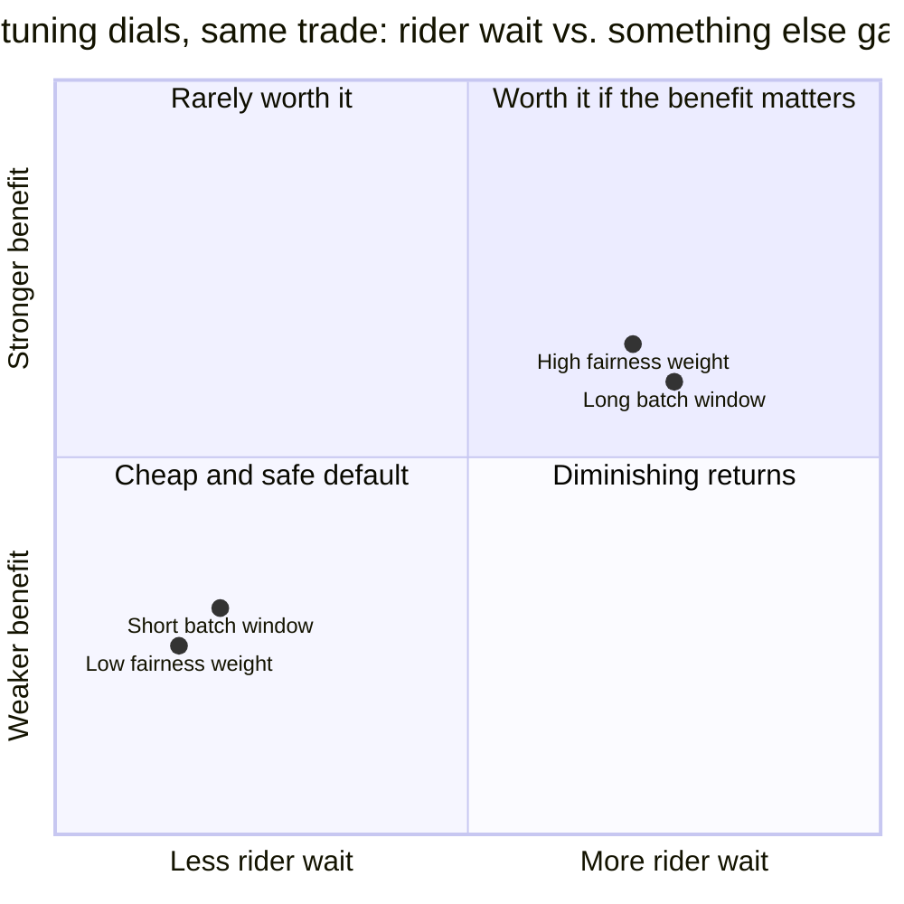

### The system, put together

Put every fix from this story together, and this is the shape of Nearloop's dispatch system today:

- Requests and available drivers accumulate over a fixed, short window.
- A fast geo-index (H3-style hex cells) supplies each request's candidate pool.
- A scalable heuristic solver — not an exact Hungarian-style solve — assigns across the whole
  batch at once, weighing ETA and driver fairness together.
- Every winning assignment goes through an atomic compare-and-set claim before an offer is sent.
- Decline and timeout both trigger the same fast, request-scoped re-match.
- Any driver whose last ping is older than the staleness threshold never enters the candidate pool
  at all.

Nothing here is a single fixed rule — it's a chain of dials, each one bought by spending a
specific, nameable cost.

### How I'd say this in an interview

"Batching window and fairness weight are both the same shape of decision — a tuning dial, not a
fixed switch, and each one trades a bit more rider wait for a concretely better outcome somewhere
else. I'd ship both at a conservative fixed default first, and only make either one adaptive once
real production data shows a specific problem worth solving."

---

## Where the story actually lands

```mermaid
flowchart LR
    A["Ch1: scan every driver,<br/>every request"] --> B["Ch1: geo-hex index"]
    B --> C["Ch2: batching window"]
    C --> D["Ch3: heuristic solver"]
    D --> E["Ch4: atomic claim (CAS)"]
    E --> F["Ch5: fast re-match path"]
    F --> G["Ch6: staleness threshold"]
    G --> H["Ch7: fairness-weighted objective"]
    H --> I["Ch8: tune, don't guess"]

    A -. "fixes: fast lookup<br/>breaks: still greedy, one at a time" .-> B
    B -. "fixes: candidate speed<br/>reveals: greedy is only locally optimal" .-> C
    C -. "fixes: joint decisions<br/>breaks: exact solve too slow at real batch size" .-> D
    D -. "fixes: solve speed<br/>breaks: solved output can still race" .-> E
    E -. "fixes: no double-dispatch<br/>breaks: driver can still decline/timeout" .-> F
    F -. "fixes: no extra full-batch wait on decline<br/>breaks: re-match can pick a ghost driver" .-> G
    G -. "fixes: no ghost matches<br/>reveals: pure ETA is unfair to some drivers" .-> H
    H -. "exposes: window size AND fairness weight<br/>are both just tuning dials" .-> I
```

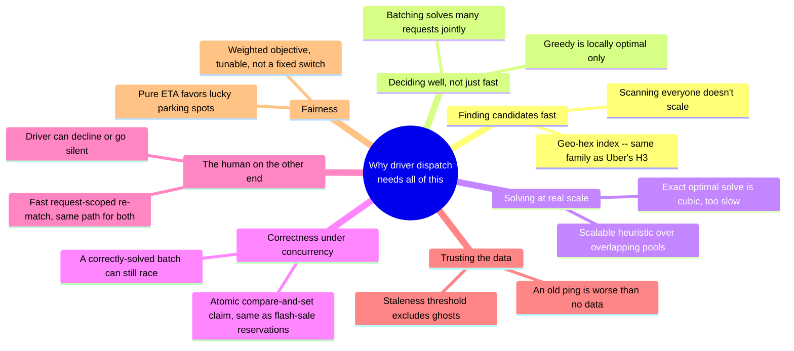

### How far do you actually need to go

Every real production dispatch system sits somewhere on this chain.

- A ride-hail app with light volume and no stated fairness concern might reasonably stop around
  Chapter 4 — fast candidates, batching, atomic claim, done.
- A high-volume city with driver-equity scrutiny has to walk all the way to Chapter 7 and 8.

The skill in an interview isn't reciting every chapter. It's stopping exactly where the stated
requirements say to stop, and being able to go one chapter deeper the moment the interviewer asks
for it.

---

## Grill me — adversarial follow-ups

**Q1: "Why not just make greedy matching faster instead of switching to batching — throw more
servers at the lookup?"**

Because speed was never the actual problem with greedy matching — Chapter 1 already fixed lookup
speed with the geo-index. Greedy is slow to compute *and* produces a worse global outcome, and no
amount of extra hardware fixes the second part. It's a property of deciding one request at a time
with no visibility into what's arriving a second later.

**Q2: "Walk me through exactly how a 'correctly solved' batch assignment can still cause a
double-dispatch."**

The solver works off a snapshot of driver availability at the moment it runs. If solving takes any
real time, or if solving is sharded across workers with overlapping candidate pools near region
boundaries, two different solver runs can both independently — and correctly, given what each one
knew — decide the same driver is the best pick for two different riders. The fix isn't a smarter
solver; it's an atomic claim step that catches this at the moment of acting, not deciding.

**Q3: "Isn't a multi-second deliberate delay before assigning a driver bad for the user
experience?"**

It's a real cost, which is exactly why it's presented as a stated trade-off, not hidden latency —
a few seconds spent batching produces a meaningfully better overall match quality than assigning
instantly. Riders are shown an honest "matching" status during that window, rather than a bare
spinner implying something's broken.

**Q4: "Why treat an explicit decline and a silent timeout identically, instead of retrying the same
driver after a timeout in case they're just slow to respond?"**

Because from the rider's side, both outcomes are indistinguishable — no driver has shown up — and
retrying the same driver just adds more wasted wait time on a mediocre bet. Routing both into the
same fast, request-scoped re-match against currently available drivers gets the rider a real answer
faster than gambling on a second chance with someone who already didn't respond once.

**Q5: "Why not just always use the exact optimal solver — correctness matters, doesn't it?"**

"Optimal" here means lowest total distance across the batch, not correctness in the
double-dispatch sense — those are separate guarantees. An exact solve is cubic in batch size and,
at real request volume, takes far longer than the batch window itself allows. A fast heuristic gets
nearly as good an assignment in a fraction of the time, and the atomic claim step is what actually
guarantees correctness, independent of which solver produced the assignment.

**Q6: "How does this system relate to Uber's surge-pricing system, if at all?"**

They consume the exact same underlying driver-location stream and the same geo-index, just for
different purposes. Surge pricing aggregates it into a supply count per area to compute a price
signal, while dispatch queries it for individual nearby candidates to compute an assignment.
Sharing one source of truth for driver location, read differently by each system, avoids
maintaining two independently-drifting views of where drivers actually are.

**Q7: "What happens if the batch solver itself hangs or runs long one cycle?"**

Bound it with a hard timeout, and fall back to an even faster, lower-quality heuristic if the
primary solver blows its budget — never let solver latency unboundedly extend how long every rider
in that batch waits. A slightly worse assignment delivered on time beats a slightly better one
delivered late, because "late" here means every rider in the whole batch is stuck waiting, not just
one.

**Q8: "How do you stop the fairness term from just always overriding ETA and making every match
worse for riders?"**

You cap it. The fairness term is a bounded weight in the objective, not a veto, so it nudges the
solver toward under-served drivers when the ETA difference between two candidates is small, but
doesn't force a rider onto a dramatically farther driver just to equalize earnings. And you monitor
the actual trade being made — average rider wait versus driver utilization spread — rather than
setting the weight once and never looking again.

**Q9: "A driver keeps declining offers — is that just noise, or a problem?"**

Track decline/timeout rate per driver. A driver who declines far more than typical is either
abusing the system to see fare details before committing, or running a broken app. Either way,
it's wasting matching cycles and degrading the experience of every rider who gets routed to them
first. Flag abnormal patterns for review, rather than treating every decline as random, independent
noise.

**Q10: "Given this whole story, if someone says 'design Uber's dispatch system' cold, where do you
actually start?"**

Say the one-sentence tension out loud first: greedy matching is simple and instant but only
locally optimal, batching trades a small bounded delay for a better global outcome, and separately,
claiming a driver has to be atomic or two riders can get the same one. Then walk forward only as
far as the stated requirements need — fast candidate lookup and batching are close to a given at
any real volume; fairness weighting and adaptive window sizing are things you earn by naming a
specific concern, not defaults you bolt on unprompted.

---

## Cheat sheet — one line per stop on the story

| Stop | The one-line takeaway |
|---|---|
| Scanning every driver per request | Cost grows with driver count times request rate — the reason any real system needs a geo-index, not a reason to add more servers. |
| Geo-hex index | Bucket driver locations into cells so lookup only touches nearby cells — the real, documented version is Uber's own H3, shared with the surge-pricing side of the stack. |
| Greedy nearest-match | Locally sensible, only locally optimal — have a concrete two-rider scenario ready, it's the most convincing way to show why it loses in aggregate. |
| Batching window | Accumulate requests and drivers over a short, fixed window and solve jointly — the real trade real dispatch research (e.g., DiDi's published work) documents explicitly. |
| Exact optimal solve is impractical at real batch size | Cubic runtime, hundreds-to-thousands of requests per window — a scalable heuristic over genuinely overlapping candidates is the practical answer, not a full-city brute force. |
| Atomic claim (compare-and-set) | A correctly-solved assignment can still race against a concurrent claim by the time it's acted on — the claim step, not solver correctness, is what actually prevents double-dispatch. Same pattern as any flash-sale inventory reservation. |
| Decline and timeout route to the same fast re-match | The rider shouldn't be worse off just because a driver went silent instead of explicitly saying no, and it must be scoped to just that rider, not a wait for the next full batch. |
| Staleness threshold | A ping older than the threshold is worse than no data at all — treat that driver as unavailable, don't match riders to drivers who've gone dark. |
| Fairness-weighted objective | Pure ETA-minimization systematically favors lucky parking spots — a bounded fairness term blends in driver utilization, at a real, honest cost to average rider wait. |
| Batching window size and fairness weight | Both are tuning dials, not fixed switches — ship conservative fixed defaults first, make either adaptive only once real data shows a specific problem worth solving. |
