# Design Uber's Driver Dispatch System — FAANG Interview Guide

> Source chapter type: real-time geo-matching. Sibling to
> [the Uber Surge Pricing guide](./53-Design-Uber-Surge-Pricing-Engine-FAANG-Guide.md) — both
> operate on the same geo-indexed driver-location data, but solve different problems: surge
> pricing computes a **price signal** per area; this chapter computes an **assignment** — deciding
> exactly which driver serves which rider. The central design tension is **greedy nearest-match**
> (simple, fast, locally optimal) versus **batched matching** (solves a small assignment problem
> across a short window of requests, more globally optimal) — and why real systems lean toward the
> second once request volume is high enough to make batching worthwhile.

## Mental model

A rider requests a ride. Dozens of drivers might be nearby. The system must pick one **and only
one**, fast — and the obvious-seeming answer ("match the nearest available driver, immediately")
is locally sensible but globally suboptimal: greedily matching Rider A to the nearest driver might
leave Rider B, whose request arrived two seconds later just as a much-better-suited driver became
free, stuck with a farther match, because that better driver already got claimed by A.

Three concrete problems:

1. **Finding candidate drivers fast** — a geo-spatial index over constantly-updating driver
   locations, the same indexing family as the surge-pricing chapter's demand/supply cells and the
   Yelp/Proximity Service chapter's point search.
2. **Greedy vs. batched matching.** Greedy assigns each request the instant it arrives, to
   whichever driver looks best right now. Batching accumulates requests and available drivers over
   a short window (a few seconds) and solves a small assignment problem across all of them at
   once, which can produce a meaningfully better overall outcome — at the cost of every individual
   rider waiting slightly longer for their specific match to be decided.
3. **Avoiding double-dispatch** — two riders' matching processes racing to claim the same driver
   at the same moment, a concurrency problem structurally similar to the flash-sale chapter's
   inventory race, just with "available driver" as the contended resource instead of stock count.

**The one sentence to say out loud:** *"Greedy matching is simple but locally optimal only;
batching trades a small, bounded delay for meaningfully better global assignment quality — and
either way, claiming a driver has to be an atomic operation, or two riders can be assigned the
same driver."*

**The one picture to remember forever:**

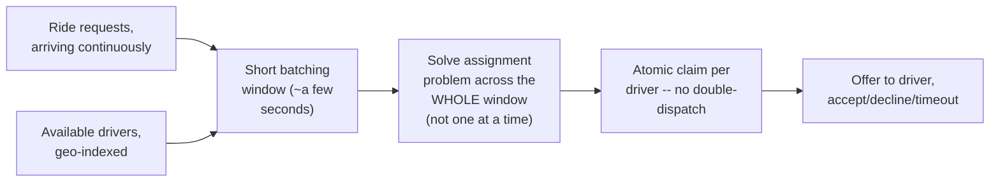

**Memory hook:** *"Don't match riders one at a time as they arrive — accumulate a short window of
requests and drivers, solve the assignment across all of them together, then atomically claim each
winner."*

---

## Table of contents
[How to Identify This Topic](#how-to-identify-this-topic-in-an-interview) ·
[Interview Playbook](#interview-playbook) · [Requirements](#requirements-clarification) ·
[Capacity Estimation](#capacity-estimation-worked) · [API Design](#api-design) ·
[High-Level Architecture](#high-level-architecture) ·
[Architecture Evolution v1→v2→v3](#architecture-evolution-v1--v2--v3) ·
[End-to-End Walkthroughs](#end-to-end-request-walkthroughs) ·
[Deep Dive: Geo-Indexed Driver Search](#deep-dive-geo-indexed-driver-search) ·
[Deep Dive: Greedy vs. Batched Matching](#deep-dive-greedy-vs-batched-matching) ·
[Deep Dive: Avoiding Double-Dispatch](#deep-dive-avoiding-double-dispatch) ·
[Deep Dive: Offer/Accept/Decline State Machine](#deep-dive-offeracceptdecline-state-machine) ·
[Data Model](#data-model) · [Failure Modes](#failure-modes--mitigations) ·
[Non-Functional Walkthrough](#non-functional-walkthrough) ·
[Security & Compliance](#security--compliance) · [Cost & Trade-offs](#cost--trade-offs) ·
[Wrap-Up](#wrap-up-mvp-vs-stretch) · [Golden Rules](#golden-rules) ·
[Cheat Sheet](#master-cheat-sheet)

---

## How to identify this topic in an interview

- "Design Uber/Lyft's matching or dispatch system" — specifically the **assignment** logic, as
  distinct from pricing (the surge-pricing chapter) or the general product (the generic Uber
  chapter).
- The tell that batching, not just greedy matching, is the substance of this chapter: the
  interviewer asks "how do you decide WHICH driver gets WHICH rider," not just "how do you find
  nearby drivers."
- A follow-up like "what if two riders' matches somehow pick the same driver" is the
  [double-dispatch deep dive](#deep-dive-avoiding-double-dispatch).

---

## Interview playbook

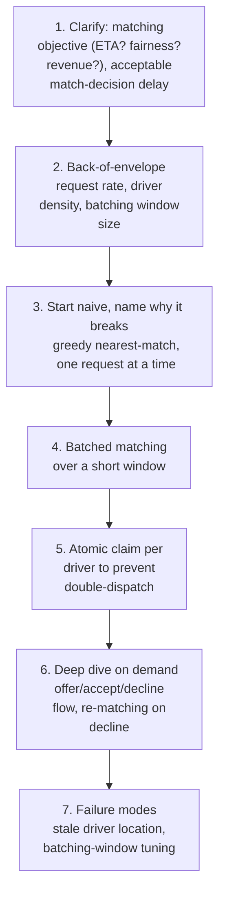

**What the interviewer is actually grading at each step:**
- Step 3: do you recognize, unprompted, that greedy one-at-a-time matching is locally but not
  globally optimal, and can articulate a concrete scenario where it produces a worse overall
  outcome?
- Step 5: do you know that "select the best driver" and "actually claim that driver" must be
  separated into a selection step and an atomic claim step — the same lesson as the flash-sale
  chapter's reservation mechanism, applied to driver assignment?
- Step 6: do you have a defined answer for "the driver declines the offer" — does the rider go to
  the back of a new batch, or trigger an immediate re-match against currently available drivers?

---

## Requirements clarification

### Functional

| # | Requirement | Notes |
|---|---|---|
| F1 | Match each ride request to exactly one available driver | The core function |
| F2 | Minimize rider wait time and/or driver pickup distance, depending on the stated objective | The actual optimization target needs to be explicit — ETA-minimization and fairness-to-drivers can be in tension |
| F3 | Never assign the same driver to two riders simultaneously | The double-dispatch correctness requirement |
| F4 | Handle a driver declining or timing out on an offered match | Must trigger a defined re-matching path, not leave the rider stuck |
| F5 | Reflect real-time driver location and availability | Stale location data directly degrades match quality |

### Non-functional

| Requirement | Target | Why this number |
|---|---|---|
| Match decision latency | A few seconds, not milliseconds | Unlike a payment or fraud check, a short deliberate delay (to batch) is an acceptable, even beneficial, trade for better match quality |
| Driver-location freshness | Seconds | Same freshness bar as the surge-pricing chapter's supply signal, since both depend on the same live location stream |
| Double-dispatch prevention | Absolute — zero tolerance | A double-dispatched driver, if it happens, produces a confusing, trust-damaging experience for at least one rider |
| Re-match latency after a decline | Fast — a declined offer shouldn't leave a rider waiting through a full new batching cycle if avoidable | Bounds how bad the worst case (a driver declining) feels to the affected rider |
| Fairness across drivers | A stated, monitored consideration, not left purely to whatever an ETA-minimizing objective happens to produce | Similar in spirit to the Airbnb chapter's marketplace-health concern, applied to driver earnings/utilization equity |

**Clarifying questions worth asking the interviewer up front — and what each answer changes:**

| Question | If the answer is... | ...then this changes |
|---|---|---|
| "Is the matching objective pure ETA-minimization, or does it also weigh driver fairness/utilization?" | Both matter | Confirms the assignment-solving step needs a multi-term objective function, not pure distance-minimization |
| "What batching window is acceptable — is a couple of seconds of added rider wait tolerable for better matches?" | Yes, a few seconds is fine | Confirms batched matching is worth its added complexity over pure greedy |
| "What happens when a driver declines or times out on an offer?" | Immediate re-match against currently available drivers, not waiting for the next batch cycle | Confirms a fast-path re-match mechanism is required, distinct from normal batch-cycle matching |
| "How real-time does driver location need to be?" | As fresh as possible, seconds-level | Confirms the same continuous location-ping ingestion as the surge-pricing chapter, and that staleness directly degrades match quality here too |

**Say this out loud in the interview:** *"I'd frame the core decision as greedy versus batched
matching — greedy is simpler and instant per request but only locally optimal; batching accepts a
small, bounded delay in exchange for solving assignment across a whole window of requests and
drivers together, which is what most real dispatch systems actually do at meaningful request
volume."*

---

## Capacity estimation, worked

```
Given (illustrative, a large city's ride-hailing operation):
  Ride requests/sec, city-wide, peak                = 500
  Available drivers, city-wide, peak                 = 8,000
  Average candidate drivers within matching radius
    per request                                       = ~20-40

Batching window sizing:
  Illustrative batch window                            = 3 seconds
  Requests accumulated per batch, city-wide             = 500 x 3 = 1,500
  -> solving an assignment problem across ~1,500 requests and their respective candidate driver
     pools (each request's ~20-40 candidates, with SIGNIFICANT overlap between nearby requests'
     candidate pools) is the concrete scale of the per-batch optimization problem -- large
     enough that a full brute-force optimal assignment (like a naive Hungarian algorithm over
     the full bipartite graph) would be too slow; practical systems use a more scalable
     heuristic/approximate assignment algorithm instead, restricted to genuinely overlapping
     candidate pools rather than the full city.

Geo-index query load:
  Each of the 500 requests/sec needs a candidate-driver lookup
  Additionally, ~8,000 drivers pinging location every ~4 seconds  = 8,000/4 = 2,000
    location-index updates/sec, city-wide
  -> the same order of magnitude as the surge-pricing chapter's driver-ping load, because
     both systems consume the SAME underlying real-time location stream -- worth noting
     explicitly if asked how this system relates to surge pricing operationally.

Double-dispatch race window:
  At 500 requests/sec with ~20-40 overlapping candidates per request, the chance that TWO
    concurrent match-selection processes pick the SAME top-candidate driver in the same
    batch cycle is non-trivial, not a rare edge case -- this is why the claim step (deep
    dive below) needs to be atomic, the same reasoning as the flash-sale chapter's
    inventory contention, just with far smaller absolute numbers (tens, not thousands, of
    concurrent claims on a popular candidate).
```

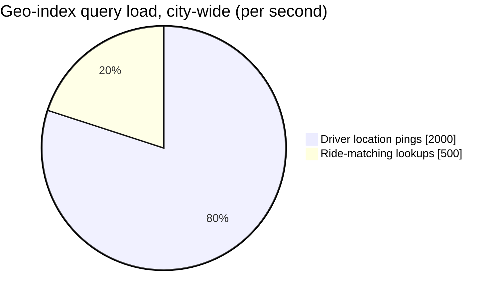

The same supply-side-dominates pattern as the surge-pricing chapter, because both systems read
from the same underlying location stream.

**Redo-the-chain test:** if the batching window is shortened to 1 second (less delay per rider,
but smaller batches), each batch has proportionally fewer requests to jointly optimize over —
a direct trade-off between responsiveness and match-quality-improvement-from-batching, worth
stating explicitly if asked how to tune the window.

**The number worth memorizing:** batching at meaningful request volume accumulates hundreds to
low-thousands of requests per short window in a busy city — enough that a full brute-force optimal
assignment is impractical, motivating a scalable heuristic/approximate matching algorithm rather
than an exact solver.

---

## API design

### `POST /v1/dispatch/request` (rider requests a ride)

```json
{ "riderId": "r_881", "pickupLocation": { "lat": 37.77, "lng": -122.41 } }
```

Response (immediate acknowledgment, not the final match):
```json
{ "requestId": "req_71209", "status": "MATCHING", "estimatedWaitSeconds": 3 }
```

### `POST /v1/dispatch/{requestId}/offer` (internal: system offers a match to a driver)

```json
{ "driverId": "d_44821", "requestId": "req_71209", "estimatedPickupMinutes": 4 }
```

### `POST /v1/dispatch/offers/{offerId}/respond` (driver accepts/declines)

```json
{ "response": "ACCEPT" }
```

| Field | Notes |
|---|---|
| `status: MATCHING` | The rider's request enters a short batching window before a specific driver is even offered the match — the API makes this brief, deliberate delay explicit rather than implying instant assignment |
| `offer.respond` | A driver's decline here must trigger fast re-matching, not silence — see the [offer/accept/decline deep dive](#deep-dive-offeracceptdecline-state-machine) |

**The one sentence worth saying about the API surface:** *"A ride request doesn't get an
immediate driver assignment — it gets acknowledged, enters a short batching window, and the
specific driver offer follows within a few seconds, which is a deliberate design choice, not
latency to hide."*

---

## High-level architecture

### Architecture evolution (v1 → v2 → v3)

**v1 — greedy, immediate, nearest-match:**

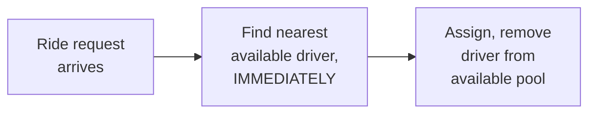

**Why it breaks:** each request is matched in isolation, with no knowledge of requests arriving
moments later that might have been better served by that same driver, or that could have freed up
a different, better-suited driver for the current request had matching waited even a couple of
seconds. Locally sensible, globally suboptimal — the average outcome across many riders is worse
than a design that considers requests jointly.

**v2 — batched matching, but no atomic claim:**

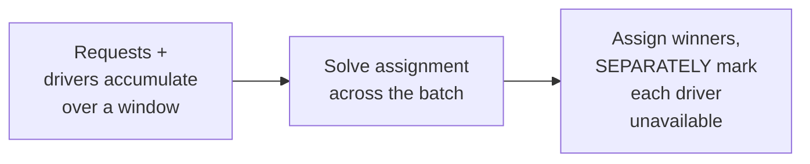

**Why it breaks:** solving the assignment problem well (v2's improvement) doesn't automatically
prevent a race between the assignment step and marking a driver unavailable — if two overlapping
batch-solving processes (e.g., sharded by geo-region with some overlap) both select the same
driver as a winner before either has marked that driver claimed, both proceed to offer that
driver, recreating the double-dispatch problem the assignment step was supposed to prevent by
being "solved correctly."

**v3 — the real system: batched matching + atomic claim per driver:**

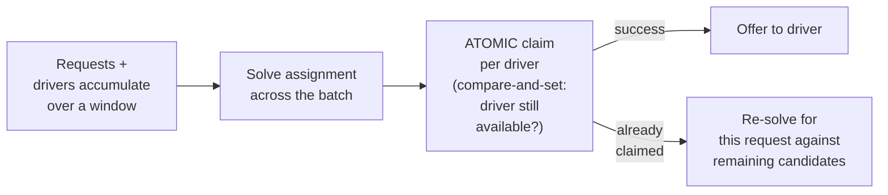

**What v3 fixes, one line each:** batching (already in v2) improves match quality by considering
requests jointly instead of one at a time; and an atomic claim step — the same compare-and-set
discipline as the flash-sale chapter's inventory reservation — closes the race that a merely
"correctly solved" assignment doesn't automatically prevent on its own.

---

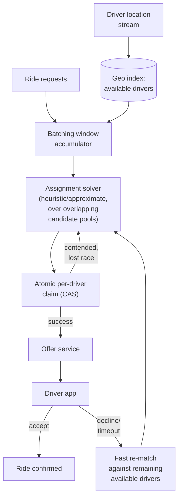

| Component | Role |
|---|---|
| Batching window accumulator | Collects requests and refreshes the available-driver pool over a short window before triggering the solver |
| Geo index | Same architectural family as the surge-pricing and proximity-search chapters — fast candidate lookup by location |
| Assignment solver | Runs a scalable matching algorithm over the batch, restricted to genuinely overlapping candidate pools rather than a full-city brute force |
| Atomic claim | Compare-and-set per driver — the correctness guarantee against double-dispatch |
| Offer service | Manages the offer/accept/decline/timeout lifecycle with a specific driver |
| Fast re-match path | Triggered on decline/timeout, bypassing the normal batch-cycle wait for just the affected request |

---

## End-to-end request walkthroughs

### Walkthrough 1 — a normal batch cycle, successful match

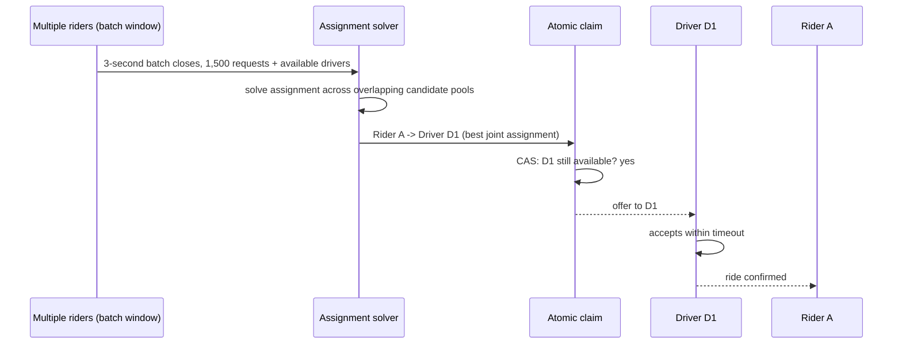

### Walkthrough 2 — a driver declines, fast re-match

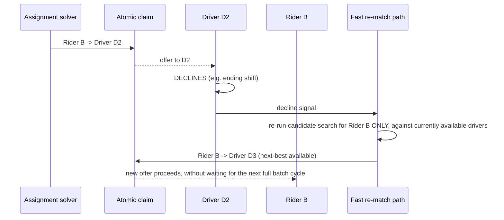

Walkthrough 2 is the concrete answer to "what happens on decline" — a fast, request-scoped
re-match, not a wait for the next scheduled batch window, which would unnecessarily penalize the
one rider whose driver happened to decline.

### Walkthrough 3 — a stale driver ping is excluded from matching

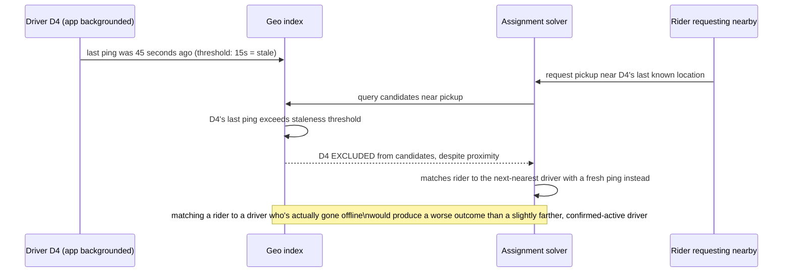

This is the concrete mechanism behind the [failure-modes table](#failure-modes--mitigations)'s
"treat pings older than a threshold as unavailable" mitigation.

---

## Deep dive: geo-indexed driver search

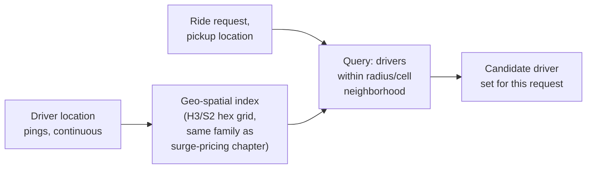

**Why this reuses the exact same indexing structure as the surge-pricing chapter:** both systems
consume the same underlying "where are drivers right now" signal — the surge-pricing chapter
aggregates it into a supply count per cell; this chapter queries it for individual nearby
candidates per request. Sharing the same underlying geo-indexed location store (with different
read patterns on top) avoids maintaining two independent, potentially inconsistent views of driver
location.

**Interview cheat-sheet:** *"Driver location is indexed the same way as in the surge-pricing
chapter — a uniform geo-grid updated continuously from location pings — just queried differently
here: nearest-candidates-for-a-point instead of aggregate-count-per-cell."*

---

## Deep dive: greedy vs. batched matching

Already the centerpiece of the mental model and architecture evolution — the deep dive states the
trade-off precisely.

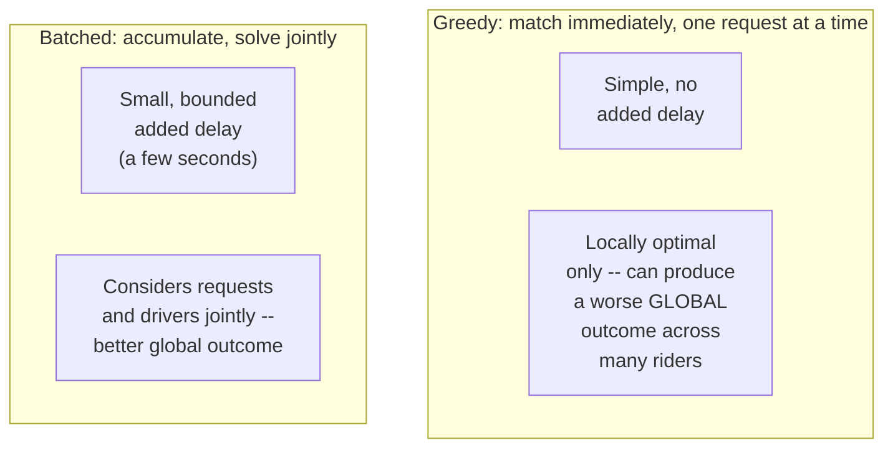

**Concrete scenario where greedy loses, worth having ready to narrate:** Rider A requests at
T+0, nearest driver is D1 (3 min away); a slightly farther driver D2 (5 min away) is also nearby.
Greedy immediately assigns D1 to A. Rider B requests at T+1 second, and D1 was actually the *ideal*
match for B (1 min away) — but D1 is already claimed, so B gets a worse match than necessary,
and A's assignment to D1 wasn't meaningfully better than D2 would have been. A batching window
covering both A and B's requests could have assigned D2→A and D1→B, improving the *sum* of
wait times across both riders even though neither individual assignment looks obviously wrong in
isolation.

**Why batching's assignment-solving algorithm is a scalable heuristic, not a naive optimal
solver:** per the capacity estimate, a batch can contain hundreds to low-thousands of requests —
an exact optimal bipartite-matching algorithm over that scale, run every few seconds indefinitely,
is a real computational cost; production systems use faster heuristic/approximate algorithms that
get most of the benefit of joint optimization without the full computational cost of guaranteed
optimality.

**Interview cheat-sheet:** *"Batching's value is that it can produce a better sum of outcomes
across many riders than matching each one the instant they arrive, greedily — have a concrete
two-rider example ready to narrate this, since it's the single most convincing way to make the
trade-off tangible in an interview."*

---

## Deep dive: avoiding double-dispatch

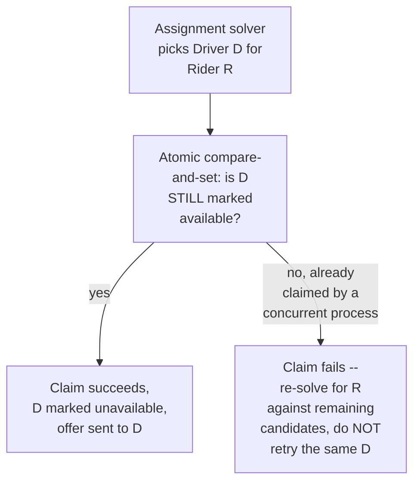

**Why "the solver picked a valid, non-conflicting assignment" isn't sufficient on its own:** the
solver operates on a snapshot of driver availability that can be stale by the time its output is
actually acted on — especially if solving takes any real time, or if the system shards batch
processing across multiple concurrent workers (e.g., by geo-region, with some overlap near
region boundaries). The atomic claim step is what catches and corrects for that staleness,
exactly the same "the expensive computation's output must still be validated atomically at
commit time" pattern as the flash-sale chapter's reservation step following its own funnel.

**Interview cheat-sheet:** *"A correctly-solved assignment can still race against a concurrent
process by the time it's acted on — the atomic claim step, not the solver's correctness alone, is
what actually prevents double-dispatch, the same pattern as any reservation-style system in this
course."*

---

## Deep dive: offer/accept/decline state machine

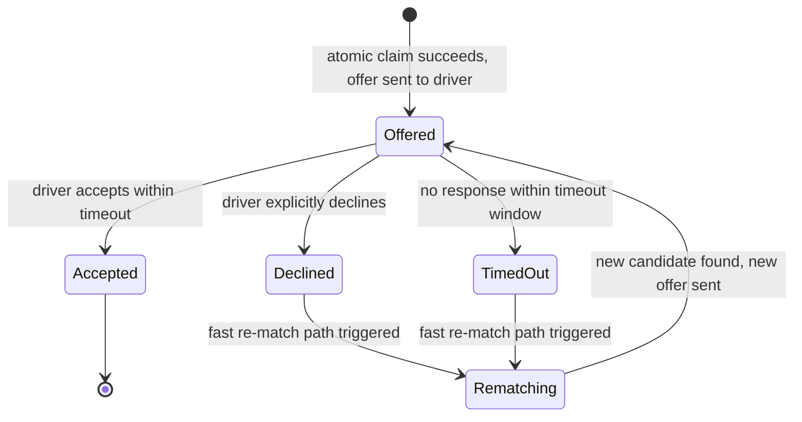

**Why timeout and explicit decline are treated the same way downstream:** from the rider's
perspective, a driver who doesn't respond in time is indistinguishable in impact from one who
explicitly declines — both need the same fast re-match response, so the state machine merges them
into the same `Rematching` transition rather than treating silence as a special, unhandled case.

**Interview cheat-sheet:** *"Decline and timeout both route to the same fast re-match path — the
rider shouldn't experience a worse outcome just because a driver went silent instead of
explicitly declining."*

---

## Data model

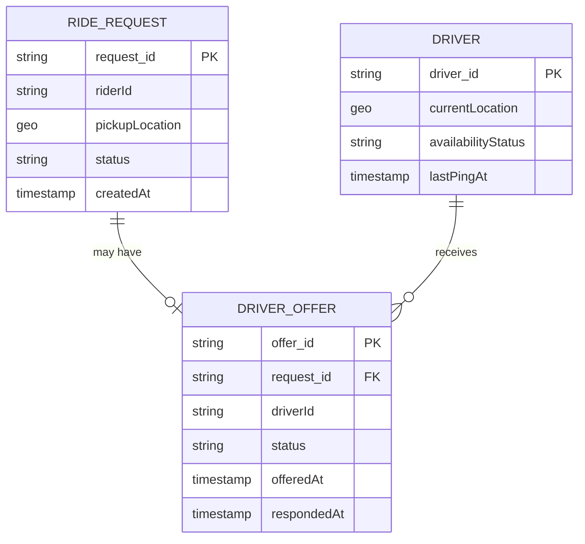

| Table | Storage choice & why |
|---|---|
| `Driver.availabilityStatus` | The hot, atomically-updated field — the compare-and-set target for the claim step, analogous to the flash-sale chapter's inventory counter |
| `RideRequest` / `DriverOffer` | Relational, moderate volume, needs the state-machine transitions (Offered → Accepted/Declined/TimedOut → Rematching) to be reliable and queryable |

---

## Failure modes & mitigations

| Failure mode | Impact | Mitigation |
|---|---|---|
| **Driver location is stale** (app backgrounded, poor connectivity) | Matching considers a driver that's no longer actually where the index thinks | Treat pings older than a threshold as unavailable for matching purposes, same discipline as the surge-pricing chapter's stale-signal handling |
| **Assignment solver takes too long relative to the batch window** | Delays the whole batch, increasing rider wait beyond the intended window | Bound solver runtime with a hard timeout, falling back to a faster (even if slightly lower-quality) heuristic if the primary solver exceeds budget — never let solver latency unboundedly extend rider wait |
| **A driver repeatedly declines/times out** (abusing the system, or a broken app) | Wastes matching cycles, degrades experience for riders repeatedly routed to this driver | Track decline/timeout rate per driver and deprioritize or flag drivers with abnormal patterns for review |
| **Claim contention concentrates on a small set of highly-desirable drivers** | Many solver outputs for the same batch might name the same top driver as ideal for multiple requests, all but one losing the atomic claim | Expected and handled correctly by design — losers simply re-solve against their next-best remaining candidate, which is the intended behavior, not a bug to eliminate |

---

## Non-functional walkthrough

**Scaling the geo-index and location-ping ingestion is the same problem as the surge-pricing
chapter's**, since both consume the same underlying stream — sharding by geo-cell scales both
naturally.

**Scaling the assignment solver is bounded by batch size and algorithm complexity** — the
practical mitigation (a scalable heuristic over overlapping candidate pools, not a full-city exact
solve) is what keeps this tractable as request volume grows.

**Availability of the claim step must never be sacrificed for solver sophistication** — even if
the assignment solver's output is imperfect under time pressure (falls back to a faster
heuristic), the atomic claim step's correctness guarantee against double-dispatch must never be
relaxed.

---

## Security & compliance

- **Driver and rider location data is sensitive** and should follow standard access-control and
  retention practices, particularly historical location trails.
- **Fairness monitoring across drivers** (ensuring the matching objective doesn't systematically
  disadvantage certain drivers) is both an ethical and, in some jurisdictions, a regulatory
  consideration for gig-economy dispatch systems.
- **Audit trail of match decisions** supports dispute resolution (a driver or rider disputing why
  a particular match was or wasn't made) — logging the solver's inputs and the winning assignment
  per batch cycle.

---

## Cost & trade-offs

**Batching window size trades individual rider wait time against overall match-quality
improvement** — the central tuning knob, worth naming explicitly with the concrete two-rider
example from the greedy-vs-batched deep dive as justification.

**Solver sophistication (exact optimal vs. fast heuristic) trades match quality against
computational cost and latency** — at real batch sizes (hundreds to low-thousands of requests per
window, per the capacity estimate), a fast heuristic is almost always the practical choice over an
exact solver.

---

## Wrap-up: MVP vs. stretch

**In scope for an MVP:**
- Geo-indexed driver search reusing the same location-ping infrastructure as surge pricing.
- Batched matching over a short, fixed window, with a scalable heuristic assignment algorithm.
- Atomic per-driver claim preventing double-dispatch.
- Offer/accept/decline/timeout state machine with a fast re-match path.

**Explicitly out of scope for an MVP:**
- Multi-term fairness-aware objective functions — start with ETA-minimization alone, add
  fairness/utilization terms once there's real data showing an equity problem worth addressing.
- Adaptive batching-window sizing (adjusting window length based on real-time request density) —
  start with a fixed window, tune based on observed data.

**Stretch goals, worth naming if asked "what's next":**
1. **Fairness-aware multi-term matching objective**, balancing ETA-minimization against driver
   utilization/earnings equity.
2. **Adaptive batching window**, shortening during low-density periods (less benefit from
   batching, more benefit from responsiveness) and lengthening during high-density periods.
3. **Predictive pre-positioning signals to drivers**, extending dispatch from reactive matching
   into proactive guidance about where demand is likely to emerge — a natural pairing with the
   surge-pricing chapter's driver-facing surge map.

---

## Golden rules

- **Greedy, immediate matching is only locally optimal** — batching over a short window and
  solving assignment jointly produces measurably better outcomes across many riders, at the cost
  of a small, bounded per-rider delay.
- **A correctly-solved assignment can still race against a concurrent claim** — an atomic
  compare-and-set claim step, not solver correctness alone, is what actually prevents
  double-dispatch.
- **Decline and timeout should route to the same fast re-match path** — the rider shouldn't
  experience worse treatment just because a driver went silent instead of explicitly declining.
- **Bound the assignment solver's runtime with a hard timeout and a faster fallback heuristic** —
  never let solver latency unboundedly extend rider wait time.
- **This system shares its geo-indexed location infrastructure with the surge-pricing chapter** —
  maintain one source of truth for driver location, queried differently by each system.

---

## Master cheat sheet

**One-liners:**
- Greedy matching is simple and instant but only locally optimal; batched matching over a short
  window and jointly-solved assignment produces better outcomes across many riders.
- Have a concrete two-rider scenario ready to narrate why greedy can produce a worse global
  outcome — it's the most convincing way to make the trade-off tangible.
- A correctly-solved assignment still needs an atomic per-driver claim to prevent double-dispatch
  — the same reservation pattern as the flash-sale chapter, applied to driver assignment.
- Decline and timeout both trigger the same fast, request-scoped re-match path, not a wait for the
  next full batch cycle.
- Driver location indexing is shared infrastructure with the surge-pricing chapter — one source of
  truth, queried differently by each consuming system.

**Formula chain:**
```
requests_per_batch     = request_QPS x batch_window_seconds
solver_problem_size     = requests_per_batch x avg_overlapping_candidates_per_request
```

**Numbers:** batching windows are typically a few seconds — small enough to feel responsive, large
enough to accumulate hundreds to low-thousands of requests in a busy city for joint optimization
· candidate pools per request are typically tens of drivers, with significant overlap between
nearby requests' pools, which is why an exact full-batch optimal solver is impractical at real
scale.
