# Design an Ad Click Aggregation System — The Story (narrative edition)

## What this file is

The reference file, `63-Design-an-Ad-Click-Aggregation-System-FAANG-Guide.md`, is the one to recite from. It has the requirements, API shapes, every trade-off table, and the master cheat sheet.

This file is a second way into the same material. It tells the same story in plain language, as one continuous narrative.

Here's the shape of the story: engineers at a company keep hitting a wall. They patch it. The patch creates a new wall. They patch that too — until they land on the exact same design the reference file documents.

The company is **AdLoom**, a self-serve ad network that bills advertisers per click. AdLoom itself is fictional. But every wall it hits, and every fix it reaches for, is based on something a real, named system or documented incident actually did:

- Google's Dataflow/MillWheel papers on watermarks and windowing
- Apache Kafka's log-based ingestion
- Apache Flink's checkpointing for exactly-once stream state
- HyperLogLog-style approximate counting
- The real, DOJ-documented "3ve" ad-fraud botnet takedown

Every time a number or a claim shows up, this guide will tell you plainly whether it's a documented fact or just a reasonable illustrative guess made up for AdLoom's own numbers.

**The one sentence to keep in your head:** this is the one counting system in this whole course where the number itself has direct financial consequences. Every fix below earns its place only if it makes the answer to "would this ever cause an advertiser to be billed incorrectly" come out safer than the fix before it — not just faster.

---

## Chapter 1 — The counter that seizes up under its own popularity

### The setup

It's 2017. AdLoom is small — a self-serve ad network, maybe 200 clicks/sec across all campaigns at peak.

The backend is dead simple. Every time someone clicks an ad, the click-tracking endpoint runs one SQL statement straight against the production database:

```sql
UPDATE campaign_stats SET click_count = click_count + 1 WHERE campaign_id = ?;
```

No queue. No dedup. No batching. Every single click hits the row, in real time.

At 200 clicks/sec spread across thousands of campaigns, this is fine — no single row gets hit hard enough to notice.

### The wall

Then one customer's campaign goes viral. A coupon code gets posted on a big forum. That one campaign's row jumps from a trickle to **3,000 clicks/sec** — and all 3,000 of those updates a second land on the *same* database row.

Here's why that matters: Postgres has to take a row-level lock for every `UPDATE`. Under this kind of hot-row contention, AdLoom's own load test later shows a single row tops out around **800 updates/sec** before latency collapses `[illustrative — a stand-in for "one row has a real ceiling," not a published benchmark]`.

Past that ceiling, `UPDATE` calls start queuing behind each other. p99 latency on the click-tracking endpoint blows past **2 seconds**.

### It gets worse on its own

Here's the part nobody designed on purpose. AdLoom's mobile SDK fires the click beacon with a 2-second client-side timeout, and retries on timeout. In isolation, that's a completely reasonable thing to build.

But during the spike:

- Roughly **40% of clicks** are hitting that 2-second timeout `[illustrative]`.
- Each timeout fires a second, identical beacon.
- Nothing checks whether this exact click was already counted — every retry is *also* just another `UPDATE ... + 1`.

Do the math on what that means for the campaign that just went viral:

| | Value |
|---|---|
| Real clicks/sec during the spike | 3,000 |
| Retry rate on timeout | ~40% |
| Clicks/sec actually recorded | ~4,200 |
| Inflation | ~40% |

A ~40% inflation — on the one campaign that just paid to go viral — and that inflated number is exactly what feeds the advertiser's invoice at the end of the hour.

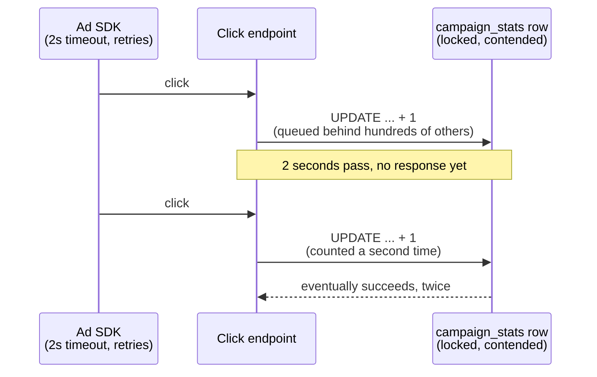

### Why this happened

The obvious question an engineer asks staring at this graph: why is one row in a production database the thing standing between "customer clicked an ad" and "we recorded it correctly"?

Because the design conflated two completely different jobs into one SQL statement:

1. Durably record that a click happened.
2. Keep a running total available for billing.

Both jobs got forced to block on the same single, contended row — with zero protection against counting the same click twice.

### The fix: the Loading Dock

Stop writing straight into the row that billing reads from. This is the first analogy in the story, and AdLoom calls it **the Loading Dock**.

Think of it like a warehouse. Instead of every click walking straight up to the one counter clerk (the DB row) and waiting for a receipt, clicks get dropped off at a loading dock (an append-only log). Someone processes the dock later, at whatever pace makes sense.

The click-tracking endpoint's only job becomes "did I safely receive this," not "is the running total updated yet."

### New problem, immediately

Just moving to *any* durable log doesn't, by itself, stop the duplicate-click problem. It just moves *where* the duplicate gets recorded. AdLoom still needs something that recognizes "I've already seen this exact click" before it gets counted.

### How I'd say this in an interview

"A raw `UPDATE count = count + 1` against a production row does two things at once — accept the click, and update a billing-critical total — and couples both to a single contended row with no protection against a client retry counting the same click twice. The first fix is always to decouple write path from counting logic; the dedup problem underneath it is a separate fix that still has to happen."

---

## Chapter 2 — The Loading Dock: dropping clicks off instead of hand-delivering them

### The fix

Click events get appended to a durable, ordered log first. This is conceptually the same role Apache Kafka plays in real production ad-serving pipelines — a documented, real system, not a guess. A separate aggregation process reads from that log at its own pace to update counts.

The click-tracking endpoint's whole job shrinks to two steps:

1. Append this event.
2. Ack the client.

No more waiting on a lock. No more waiting on an aggregate update.

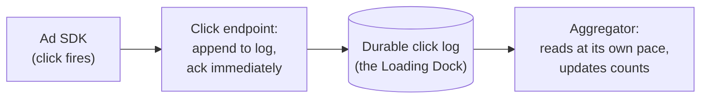

### Why this fixes Chapter 1

The endpoint no longer waits on lock contention. So the viral campaign's 3,000 clicks/sec just append to the log — appends are cheap and sequential, nothing like a hot-row `UPDATE`.

AdLoom ships this, and the on-call pages about the click endpoint timing out stop.

### New problem, visible within the first week

The aggregator reads the log and, for every event, still just does `count += 1`. Nothing in the log itself says "this is a duplicate of an event I already processed."

The SDK's retry behavior from Chapter 1 is unchanged. Both the original click and its retry get appended to the log as two separate entries, and the aggregator faithfully counts both.

Here's the key distinction to hold onto:

- Decoupling fixed *how fast* AdLoom can accept clicks.
- It did nothing for *whether the same click gets counted twice*.

That was never a throughput problem — it's an identity problem, and it needs its own fix.

### How I'd say this in an interview

"Decoupling ingestion from aggregation — write to a log first, aggregate from the log on a separate path — is the standard fix for a write path that can't keep up, the same role Kafka plays in real ingestion pipelines. But it's solving a different problem than duplicate counting. A duplicate that made it into the log is still a duplicate; you've just moved where it sits."

---

## Chapter 3 — The Bouncer at the door

### The fix

Before anything gets counted, check whether this *exact* click has been seen before.

The mechanism has two parts:

1. Every click gets a globally unique `clickId`, assigned once, at the true source — the SDK, at the moment of the click.
2. The aggregator checks that ID against a dedup store before counting.

AdLoom calls this **the Bouncer**: a doorman standing between the log and the counter, holding a guest list.

- Show up once → get on the list → get counted.
- Show up again with the same ID (because your original attempt looked stalled and you walked back around to try again) → the Bouncer already has you on the list → turned away, quietly, without incrementing anything.

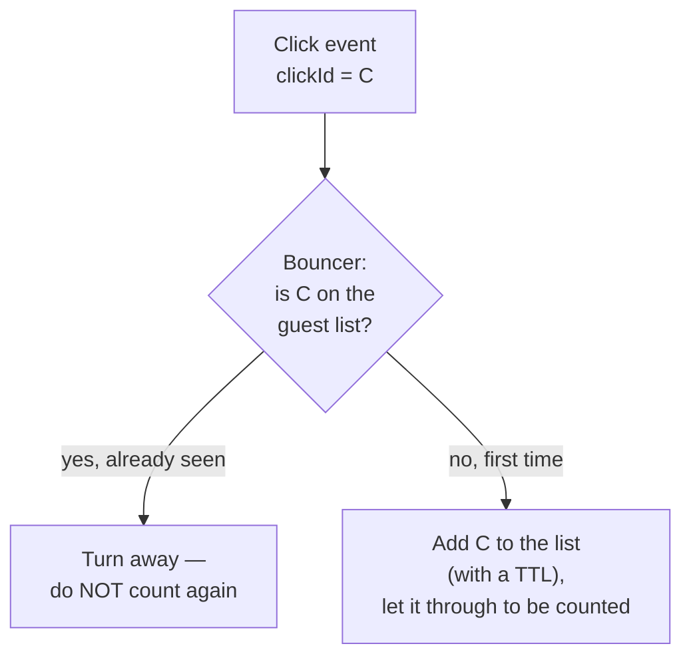

### Worked example: how big is the duplicate problem, really?

At AdLoom's real scale, here's what the numbers look like:

| Quantity | Value |
|---|---|
| Total clicks/day | ~2,000,000,000 |
| Duplicate-delivery rate (retries + replays) | ~0.75% `[illustrative, but this shape — sub-1% but material in absolute terms — matches documented duplicate-delivery-rate discussions for large-scale event pipelines]` |
| Duplicate click events/day the Bouncer must catch | **15,000,000** |

Walk through why that matters: "under 1%" sounds negligible in a slide deck. Say "fifteen million potential double-charges a day" out loud instead, and it stops sounding negligible.

### Worked example: sizing the guest list

The dedup store — the Bouncer's guest list — needs to remember every unique `clickId` for as long as a legitimate retry could plausibly still show up. Then it needs to forget it, to keep the store from growing forever.

| Quantity | Value |
|---|---|
| Bytes per tracked ID | ~24 |
| Clicks/day | 2,000,000,000 |
| Retention window | 24 hours |
| Total guest-list size | **~48 GB** |

That's a real, sizeable number — but very manageable for a purpose-built key-value store with TTL eviction.

### New problem, and it's a subtle one

The Bouncer's whole guarantee rests on one assumption: a retried click carries the *exact same* `clickId` as the original attempt.

AdLoom discovers, while debugging a lingering discrepancy, that an intermediate proxy service between the SDK and the click endpoint was re-generating a fresh ID on every hop — "to make tracing easier."

Here's the failure mode this creates. A retry that passes through that proxy looks, from the Bouncer's point of view, like a brand new person who's never been seen before — because it genuinely now has a different ID.

Dedup doesn't crash. It doesn't error. It doesn't even log anything unusual. It just silently does nothing, on exactly the traffic it was built to catch.

### How I'd say this in an interview

"Deduplication only works if the ID being checked is assigned once, at the true source, and survives every retry unchanged. Get that wrong anywhere upstream — even in a well-meaning tracing layer — and dedup fails completely, silently, because every retry looks like a brand-new event to the store checking for duplicates."

---

## Chapter 4 — The Postmark Rule

### Where things stand

The Bouncer is now fixed: `clickId` is assigned once at the SDK and preserved end to end. AdLoom moves on to the next question: which hour's bucket does a click belong to?

### The problem

The aggregator, up to this point, has been bucketing clicks by **when the aggregator sees them** — call it arrival time. That seems reasonable, until a very real, very common case shows up.

Walk through the scenario:

1. A phone loses signal in a subway tunnel.
2. Right at that moment, someone taps an ad — at **11:59:58 PM**.
3. The SDK buffers the click locally, since it can't reach the server.
4. The click doesn't actually reach AdLoom's servers until **12:00:07 AM** — nine seconds into the next hour.

Bucketing by arrival time puts that click in the *wrong* hour's bill.

This isn't a rare edge case at AdLoom's scale:

| Quantity | Value |
|---|---|
| Clicks arriving more than an hour after they happened | ~0.2% `[illustrative, but this shape — a small percentage that's still millions of events/day at billion-scale volume — matches the reference guide's own capacity estimate]` |
| Clicks/day landing in the wrong bucket | **4,000,000** |

Four million clicks a day landing in whatever bucket happens to be open when they finally show up, rather than the bucket they actually belong to.

### The fix

Bucket every click by its *own* `clickTimestamp` — when it actually happened. Never by `reportedAt` — when the pipeline happened to receive it.

AdLoom calls this **the Postmark Rule**, after the same idea in an actual mail system: a letter postmarked December 30th still counts as December mail, even if it doesn't land in your mailbox until January 2nd. The postmark, not the delivery date, is what matters.

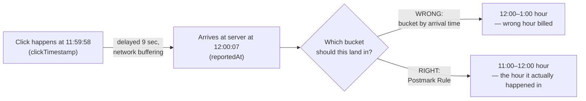

### New problem

This fixes *where* a late click gets counted. It does nothing for a much harder question sitting right behind it: an hour's bucket has to close and become a final, billable number at *some* point. Now that AdLoom is deliberately keeping buckets open to accept late-by-timestamp events — **when** does that bucket actually get to close?

### How I'd say this in an interview

"Bucket by the event's own timestamp, never by when the pipeline happened to receive it — a delayed click still belongs to the hour it actually happened in, the same reason a postmarked letter counts for the day it was mailed, not the day it arrives. That fix immediately raises the next question: if you're willing to accept late-by-timestamp events into an hour's bucket, how long do you keep that door open before you have to call the number final?"

---

## Chapter 5 — The Save-Point: what happens when the aggregator itself falls over

### The problem

Before AdLoom can answer "how long do we keep a bucket open," a much more basic failure shows up.

The aggregator process is the thing that reads off the log, runs the Bouncer check, and updates in-memory running totals per bucket. One afternoon it gets redeployed, like any other service.

Here's what's at risk at that exact moment: it's holding the in-progress totals for **hundreds of open hourly buckets**, across every active campaign — entirely in memory.

The restart wipes all of it. The aggregator comes back up and starts reading the log again... from wherever it happens to resume, with zero memory of what it had already counted. Two things go wrong at once:

- Some clicks get re-read and counted twice.
- Some buckets silently reset to zero and start climbing again from scratch.

This is exactly the same disease as Chapter 1's in-memory problem, one layer deeper in the stack. Back then, it was the ingestion queue that was fragile. Now it's the running aggregate state itself.

### The fix

The aggregator periodically writes down a durable **save-point** — a snapshot of exactly which log positions it's processed, and what every open bucket's count currently is — before it acks anything as "safely counted."

This is a real, documented mechanism, not an AdLoom invention:

- Apache Flink calls this **checkpointing**, using a distributed-snapshot algorithm (Chandy-Lamport-style barriers flowing through the stream), so that on restart, the aggregator resumes from its last save-point instead of from zero or from guesswork.
- Google's MillWheel paper (Akidau et al., 2013) describes the same underlying need: a streaming aggregator has to be able to recover its exact state after a crash, not just its input.

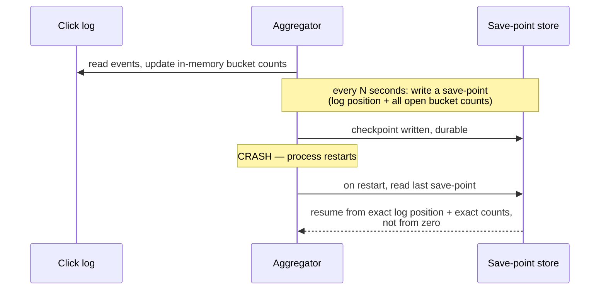

### New problem

Save-points fix "the aggregator forgets its own state on a crash." They don't answer the actual business question still sitting unresolved since Chapter 4: how late is *too* late for a legitimate click to still count, before a hard business deadline (an invoice has to go out sometime) forces the bucket closed regardless.

### How I'd say this in an interview

"A crash-safe aggregator needs its own durability story, separate from the click log's — that's what checkpointing gives you, the same distributed-snapshot idea Flink uses and MillWheel's paper describes, so a restart resumes from an exact save-point instead of losing or double-counting in-flight state. That's a state-recovery problem, though — it's still a completely open question how long we let a bucket stay open for late data before we're forced to call it final."

---

## Chapter 6 — Last Call

### Back to the real question

An hour's bucket has to close eventually, because billing has a deadline.

### First attempt: a hard cutoff

AdLoom first tries the obvious, naive rule: finalize every bucket at exactly the hour mark, no exceptions.

That immediately collides with Chapter 4's whole reason for existing. The ~4,000,000 legitimately-late clicks a day would just get silently dropped from the bill, because their bucket already closed by the time they arrived.

Here's the uncomfortable realization: advertisers are being *undercharged* for real clicks that happened. That sounds harmless, until AdLoom realizes undercounting is just as much a billing-accuracy failure as overcounting — it's still the wrong number on the invoice.

### Second attempt: never close

So AdLoom tries the opposite extreme: never finalize, just keep every bucket open forever "to be safe."

That fails for a completely different reason: nothing is ever final, so billing literally cannot produce an invoice, because it has no number it's allowed to trust as done.

### The fix: a watermark

A **watermark** is an explicit, tunable estimate of "we've very likely seen everything up to time T by now." Paired with it is a defined, bounded grace period (the allowed-lateness window), added past a bucket's natural end-time before it finalizes.

AdLoom calls this **Last Call**. Here's the analogy: the bartender doesn't slam the register shut the instant the clock strikes closing time, but they don't leave it open all night either. There's a defined grace window for people already at the bar to settle up — and then the till locks, for real, with a known, accepted, small risk that one straggler shows up after the door's locked.

This watermark idea is directly out of the Google Dataflow/MillWheel model for stream processing. It's a real, documented mechanism for exactly this trade-off, not an AdLoom invention.

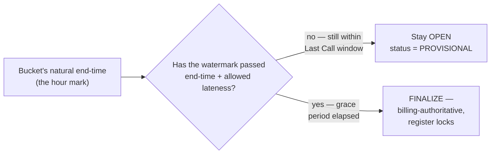

### The tuning decision

AdLoom picks a **2-hour allowed-lateness window** as its default. This isn't arbitrary — it's tuned against AdLoom's own observed late-arrival distribution.

The trade-off runs in both directions:

- A shorter window bills faster, but risks a systematically undercounted tail.
- A longer window is more complete, but delays every invoice by that much.

### New problem

Even a well-tuned 2-hour grace window doesn't catch *everything*. A phone that stayed offline for three days is a real, if rare, case. What happens to a click that shows up after the register has already locked?

### How I'd say this in an interview

"A rigid fixed cutoff forces a bad choice — undercount by finalizing too early, or never finalize at all by waiting forever. A watermark makes 'how late is too late' an explicit, bounded, tunable policy instead — wait a defined grace window past the bucket's natural end, then finalize, accepting a small known risk of an even-later straggler, which is the very next problem."

---

## Chapter 7 — The Credit Memo

### The straggler case, for real

The straggler case actually happens. Walk through it:

1. A click from **11:59:50 PM** shows up **three days later**.
2. Cause: a phone that stayed in airplane mode the whole time.
3. The 11:00–12:00 PM bucket finalized, and was billed to the advertiser, more than two days ago.

### The bad option, and why finance rejects it

The obvious bad option is to just quietly add one to that already-billed number.

AdLoom's finance team shuts that down immediately, for a reason that has nothing to do with engineering: an invoice that already went out shouldn't silently change underneath the advertiser, with no record of why the number moved.

### The fix: treat it like accounting treats a billing mistake

Never edit the original. Issue a **Credit Memo** instead.

The rule has two parts:

1. AdLoom's finalized bucket stays immutable, permanently.
2. A very-late click that arrives after finalization gets routed to a separate **reconciliation ledger** — a low-volume, append-only, human-auditable record — flagged for a distinct, explicit adjustment process.

The original billed number never moves. If a correction is warranted, it's a new, separate, traceable entry — not an invisible edit to history.

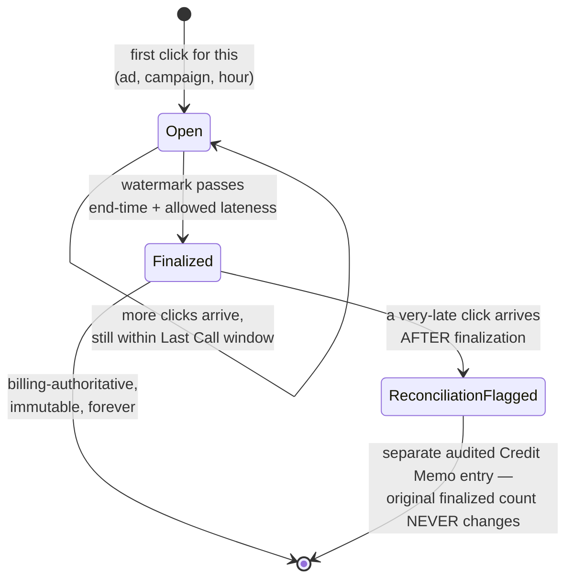

### What this closes out

This closes the loop that the Postmark Rule (Chapter 4), Last Call (Chapter 6), and this Credit Memo rule were all building toward together:

- A late click always lands in the *correct* hour, by its own timestamp.
- A bucket finalizes on an explicit, bounded, tunable schedule.
- Anything arriving after that point becomes a separate, auditable record — not a silent, unexplained change to a number someone already got billed for.

### New problem, one AdLoom hasn't touched yet at all

Everything so far has been about counting *legitimate* clicks correctly — exactly once, in the right hour. Nothing has asked whether a given click is legitimate in the first place.

And a second, completely separate audience — AdLoom's own product dashboards — has been quietly stuck waiting on this entire correctness machinery, for a use case that never actually needed it to be this careful.

### How I'd say this in an interview

"A finalized, billing-authoritative bucket has to be immutable — anything arriving late after that gets its own auditable adjustment record, the same way accounting issues a credit memo instead of silently rewriting a sent invoice. That protects trust in the number, but it's a completely separate question from whether the click behind that number was ever real in the first place."

---

## Chapter 8 — Bathroom Scale vs. Certified Scale

### The complaint

AdLoom's product team files a complaint: the "clicks so far this hour" number on the live campaign dashboard is embarrassingly slow.

Why it's slow: it only updates once the exact billing pipeline has fully ground through — Bouncer dedup, Postmark bucketing, Last Call watermark, Credit Memo reconciliation — and that, by design, takes hours.

Advertisers watching a campaign go live want to see a number moving in *seconds*, not hours. And here's the part that matters most: they don't actually care if that live number is off by a fraction of a percent. They care that it's live.

### The wrong instinct

AdLoom initially tries to make the one exact pipeline serve both needs. That's the wrong instinct, for a clean reason.

The exact path's whole design — durable dedup store, watermark-gated finalization, immutable buckets — exists specifically to guarantee correctness that costs real latency and infrastructure to earn. A dashboard doesn't need that guarantee, and forcing it to wait for it anyway is paying a cost for nothing.

### The fix

Build a genuinely separate, cheaper, faster path for the dashboard. AdLoom calls this **the Bathroom Scale vs. the Certified Scale**.

The analogy:

- Your bathroom scale gives you a number in a second — good enough to track a trend. Nobody expects it to be exact to the gram.
- The certified scale at the post office is slower, calibrated, and audited — because postage price depends on it being exactly right.

AdLoom's dashboard path uses cheap, approximate structures — in the spirit of HyperLogLog-style probabilistic counting, a real, documented technique used at scale by systems like Redis's `PFCOUNT`, and internally at companies like Twitter, for exactly this "fast, approximate, good enough for a live view" need. No strict dedup guarantee is required.

The billing path stays exactly as slow and exactly as correct as Chapters 3 through 7 built it to be.

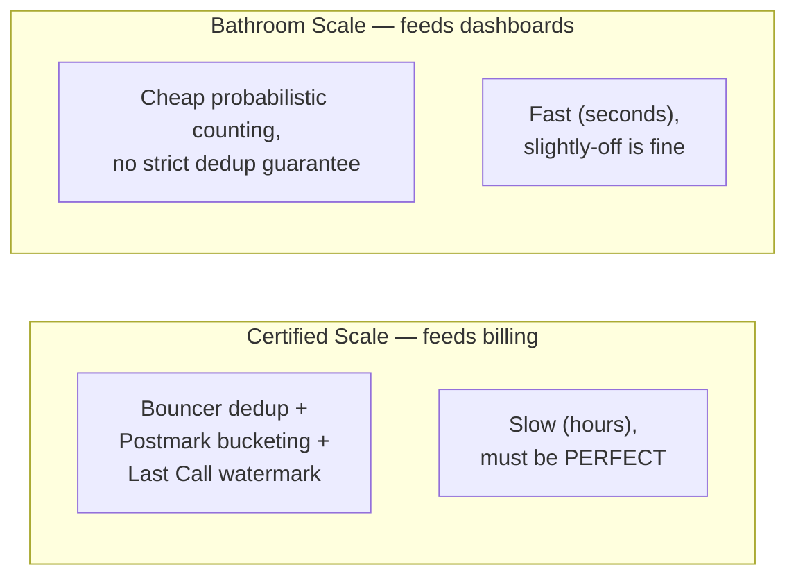

### New problem

Both paths — exact and approximate — are still counting *whatever click events show up*, with no opinion on whether those clicks are genuine human intent or something faking it.

That's the one piece of this system nobody has touched yet. And it's the one that can drain an advertiser's entire budget without a single dedup or windowing bug anywhere in the pipeline.

### How I'd say this in an interview

"Don't build one mechanism to serve both a live dashboard and an actual invoice — a fast, cheap, approximate path like HyperLogLog-style counting for dashboards, and a slow, exact, watermark-gated path for billing, are different enough requirements that trying to compromise into one system tends to under-serve billing or over-engineer the dashboard."

---

## Chapter 9 — The Bouncer's black light

### The tell

Six months after the dashboard split ships, AdLoom's finance team notices something odd: one advertiser's daily spend on a particular campaign is climbing steadily, but their own conversion numbers — actual signups from those clicks — are flat.

Checking the pipeline shows nothing wrong with counting:

- Unique `clickId`s.
- No duplicates.
- Correctly bucketed.
- Correctly finalized.

The counting pipeline is working *exactly as designed*. The problem is one level up: a real fraction of these "clicks" were never a real person's finger or mouse at all.

### This is not hypothetical

In 2018, a real, well-documented ad-fraud operation known as **"3ve"** was taken down by a joint effort from Google, the security firm White Ops, and the U.S. Department of Justice. It was a botnet of hijacked computers and fake, spoofed websites that generated billions of fraudulent ad bid requests and impressions, extracting tens of millions of dollars from advertisers before it was shut down. This is documented in the 2018 DOJ indictment and Google/White Ops's joint public writeups.

The point for AdLoom: every one of those fraudulent events would have sailed straight through a dedup-and-windowing pipeline exactly like AdLoom's. Fraud isn't a duplicate-counting problem or a late-data problem — it's a "was this click ever real" problem, and nothing built so far even asks that question.

### The fix

AdLoom adds a fraud-filtering stage *upstream* of the counting pipeline entirely. This extends the Bouncer's job rather than replacing it.

The Bouncer already checks "have I seen this ID before." Now it also runs a black light over each click before it's even eligible to be counted. Signals include:

- Known-bot user-agent and device-fingerprint signatures.
- Implausible click velocity from a single source.
- Click patterns with no corresponding page engagement.

This is the same category of signals the industry defines as invalid traffic — via bodies like the Media Rating Council's IVT (invalid traffic) standards.

Anything flagged doesn't get billed, and gets logged separately for review, rather than either being silently counted or silently vanishing with no trace.

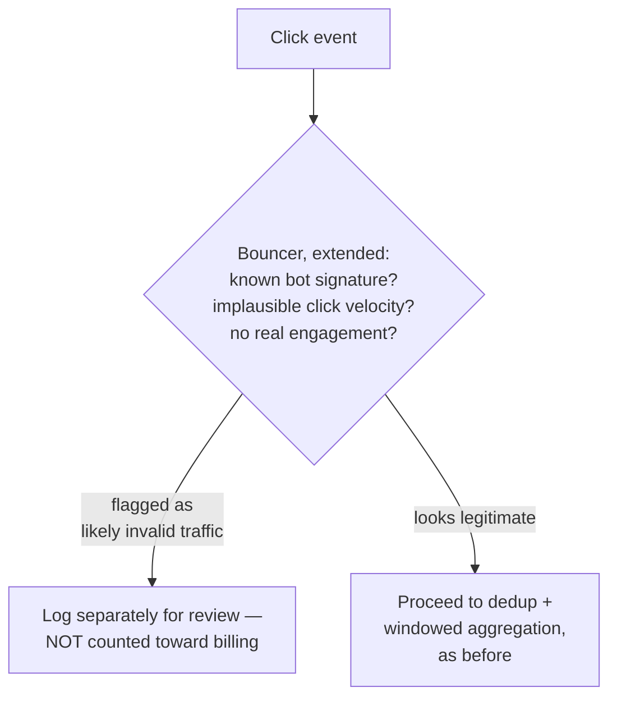

### Why this stays a separate stage, not folded into Chapters 3–7

Fraud detection is a fundamentally different kind of problem — probabilistic, adversarial, and constantly evolving as fraudsters adapt — from "did I already count this exact click ID" or "how late is this event."

Bolting fraud heuristics directly into the dedup/windowing logic would make the correctness-critical billing pipeline dependent on a moving, probabilistic target. Keeping it as a distinct upstream stage means:

- The counting pipeline underneath stays exactly as provably correct as it already is.
- The fraud stage can keep evolving on its own.

### How I'd say this in an interview

"A dedup-and-windowing pipeline can be working perfectly and still be counting fake clicks — that's a completely different problem, the same shape as real, documented botnet ad-fraud operations like the 3ve takedown. The right answer is a distinct fraud-filtering stage upstream of the counting logic, not folding fraud heuristics into the exactly-once machinery, because one is deterministic and correctness-critical and the other is probabilistic and constantly shifting."

---

## Chapter 10 — The Many Registers

### The callback

One more twist — and it's a callback all the way to Chapter 1.

A campaign goes viral again. This time it's clean: no fraud, no retries, real human clicks, correctly deduped and correctly bucketed by the Postmark Rule.

But it's driving **12,000 clicks/sec** into a single current-hour bucket for one campaign, while that bucket is still `Open`.

### The problem underneath the fix

Even with dedup and windowing solved, that bucket's counter is still, underneath it all, one number. Every one of those 12,000 updates/sec has to increment that same number.

That's the exact same hot-key contention problem from Chapter 1 — just relocated from a raw DB row into the aggregator's in-memory bucket state.

### The fix

This is the same fix AdLoom would reach for on any hot counter: split that one bucket's count across **many registers** internally, and only sum them together at read time — when the dashboard asks, or when the bucket finalizes.

Worked example of the split:

| | Value |
|---|---|
| Total incoming rate | 12,000 clicks/sec |
| Number of independent partial counters | 16 |
| Load absorbed per register | ~750 clicks/sec |

Each register only has to keep up with ~750/sec instead of one register absorbing all 12,000. This is the identical technique the reference guide's own Sharded Counters chapter covers in depth. It isn't a new idea invented for aggregation — it's the same fix, applied one layer further in, to a hot bucket instead of a hot database row.

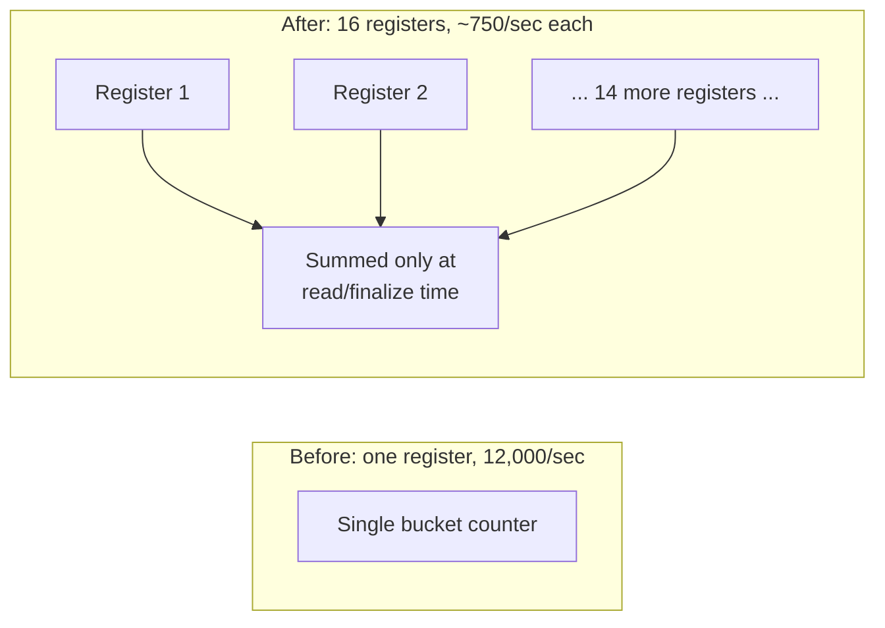

### The last piece

This is the last piece AdLoom needed. Here's how every fix fits together:

- Dedup handles duplicate identity.
- The Postmark Rule handles which hour a click belongs to.
- Last Call handles when a bucket becomes final.
- The Credit Memo handles what happens after that.
- The Bathroom Scale/Certified Scale split handles two different audiences for the same underlying data.
- The Bouncer's black light handles whether a click was ever real.
- Many Registers handles the case where a single bucket, even a perfectly correct one, becomes too hot for one counter to keep up with.

### How I'd say this in an interview

"Solving dedup and windowing doesn't retire the hot-key problem — it just relocates it from a database row to an in-memory bucket. The fix is the same sharded-counter technique you'd use anywhere else: split the hot counter into many partial registers, and only sum them when someone actually reads or finalizes the number."

---

## Where the story actually lands

```mermaid
flowchart LR
    A["Ch1: raw UPDATE on a hot row<br/>(contention + retries double-count)"] -->|"fixes: decouple<br/>breaks: log still has dupes"| B["Ch2: Loading Dock<br/>(log-based ingestion)"]
    B -->|"fixes: throughput<br/>breaks: same click, two log entries"| C["Ch3: the Bouncer<br/>(dedup by clickId)"]
    C -->|"fixes: no double-counting<br/>breaks: wrong hour for late clicks"| D["Ch4: Postmark Rule<br/>(bucket by event time)"]
    D -->|"fixes: right hour<br/>breaks: aggregator crash loses state"| E["Ch5: Save-Point<br/>(checkpointing)"]
    E -->|"fixes: crash recovery<br/>breaks: when does a bucket close?"| F["Ch6: Last Call<br/>(watermark + lateness window)"]
    F -->|"fixes: explicit finalize policy<br/>breaks: a straggler after close"| G["Ch7: Credit Memo<br/>(reconciliation ledger)"]
    G -->|"fixes: auditable correction<br/>breaks: dashboards wait on billing rigor"| H["Ch8: Bathroom vs Certified Scale<br/>(approximate + exact paths)"]
    H -->|"fixes: two audiences, two paths<br/>breaks: fake clicks pass dedup fine"| I["Ch9: Bouncer's black light<br/>(fraud filtering upstream)"]
    I -->|"fixes: filters invalid traffic<br/>breaks: one bucket can still be a hot key"| J["Ch10: Many Registers<br/>(sharded bucket counters)"]
```

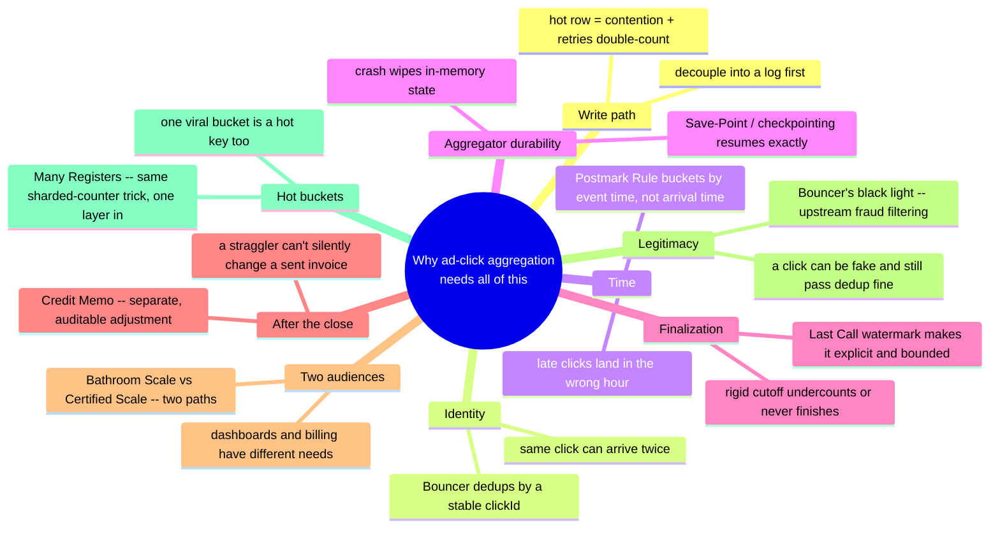

### Where interviews tend to stop

Every real interview version of this problem sits somewhere on this chain. A generic "count clicks at scale" question might reasonably stop around Chapter 3 or 4.

The moment the interviewer says the word "billing," the conversation should go straight to Chapters 6 and 7 — watermarks and immutability — because that's the single most-tested mechanism in this chapter. Skipping it is the tell that someone missed the actual point of the question.

---

## Grill me — adversarial follow-ups

**Q1: "Why not just add a unique index on `clickId` in the database and let the DB itself reject duplicates?"**

That works for correctness at small scale, but it doesn't fix Chapter 1's actual throughput ceiling — you'd still be hammering one contended structure per write, just trading a race condition for a constraint violation. The Bouncer's dedup store is a purpose-built, horizontally scalable key-value structure with a TTL matched to the lateness window, which is a different shape of problem than "make one relational table's index survive 80,000 writes/sec."

**Q2: "Why bucket by event timestamp instead of just timestamping when the log received it — isn't that simpler?"**

It's simpler, but it's simply wrong for anything billing-critical: a click that happened at 11:59:58 and arrives nine seconds late would get billed to the wrong hour, and at real scale that's not a rare edge case, it's millions of misattributed clicks a day. The Postmark Rule costs a little more bookkeeping in exchange for the number actually being correct.

**Q3: "Doesn't a watermark just mean you're guessing? What if the guess is wrong?"**

Yes, a watermark is explicitly an estimate, not a guarantee — that's the whole point, it's an honest, tunable trade-off instead of a false promise of perfect completeness. When the guess is wrong and something arrives even later than the allowed-lateness window, that's exactly what the reconciliation ledger and Credit Memo process exist to catch, rather than pretending the watermark should have been perfect.

**Q4: "Why can't the aggregator just replay the whole log from the beginning after a crash instead of building a checkpointing system?"**

At small scale you could, but at billion-scale daily volume replaying the entire log to rebuild in-memory bucket state would take far longer than the crash itself, and you'd be redoing dedup and windowing work you'd already correctly done once. Checkpointing exists specifically so recovery time is proportional to "since the last save-point," not "since the beginning of time."

**Q5: "If finalized buckets are immutable, doesn't that mean AdLoom is knowingly under- or over-billing whenever a straggler shows up?"**

It means AdLoom is knowingly accepting a small, bounded, auditable risk instead of an unbounded, invisible one — the alternative (silently mutating a sent invoice) is worse for trust even if it sounds more "accurate." The Credit Memo process makes any correction visible and explainable, which is what billing disputes actually need, not silent perfection that can't be audited.

**Q6: "Why do you need two separate counting paths — couldn't the approximate dashboard just read a slightly-stale copy of the exact billing numbers?"**

You could, but then the dashboard inherits all of the exact path's latency — hours-long finalization delays — for a use case that only ever wanted a number to move in seconds. Building a genuinely separate, cheap approximate path is what actually buys the dashboard its speed; reading a stale copy of a slow system is still slow, just delayed differently.

**Q7: "Isn't fraud detection out of scope for a 'click aggregation' interview question?"**

It's adjacent, not identical — but if billing accuracy is the stated goal, "the click was counted exactly once, on time" and "the click was ever real" are both required for the invoice to actually be correct, and a strong answer should at least name fraud filtering as a distinct upstream concern, even without designing it in depth. Real ad-fraud operations like the documented 3ve botnet takedown show this isn't a theoretical add-on.

**Q8: "Sharded counters for a hot bucket — doesn't that reintroduce the eventual-consistency problem you were trying to avoid?"**

Only briefly, and only for the read-time sum, not for the underlying correctness — each individual register still gets exactly the same dedup and windowing guarantees as before, splitting the counter just spreads the increments across more targets. You pay a small, bounded cost (summing registers at read time) to remove a much bigger cost (one register being a throughput ceiling), and the billing correctness guarantees from earlier chapters are untouched.

**Q9: "Given this whole story, if someone says 'design an ad click counting system' cold, where do you start?"**

Ask the one question that reframes everything: does this number feed billing, or is it just a metric? If it's billing, say out loud that "exactly once, eventually" is the real requirement, not "fast and approximately right" — then walk dedup, timestamp-based windowing, and watermark-based finalization as the non-negotiable core, and treat approximate dashboards and fraud filtering as the things you name as necessary but scope separately.

---

## Pacing note

**If this is 60 seconds inside a bigger question:**

Say the one-sentence core idea — this is the one counting system where the number has direct financial consequences. Then say: "dedup by a stable click ID, bucket by event timestamp not arrival time, finalize with a watermark-bounded lateness window, and route anything later to reconciliation. Approximate dashboards and exact billing are two separate paths." That's the whole shape in one breath.

**If this is the whole 15–20 minute focus:**

Walk the chapters in order:

1. Why a raw counter breaks.
2. Decoupling into a log.
3. Dedup.
4. Timestamp-based bucketing.
5. Aggregator crash recovery.
6. Watermarks and finalization.
7. Reconciliation for stragglers.
8. The approximate/exact split.
9. Fraud filtering.
10. Hot-bucket sharding, if it comes up.

Spend the most time on Chapters 6 and 7 (watermarks and immutability) — that's the single most-tested mechanism in this chapter, and everything else exists to set it up or clean up after it.

---

## Active recall — no answers, test yourself cold

1. What two separate problems does a raw `UPDATE count = count + 1` on a hot row actually have, and why are they different fixes?
2. Why doesn't decoupling into a log, by itself, fix duplicate counting?
3. What's the one assumption the Bouncer's dedup guarantee completely depends on, and what silently breaks it?
4. Why does bucketing by arrival time instead of event timestamp cause a *billing* error, not just a cosmetic one?
5. What's the difference between what checkpointing (the Save-Point) fixes and what a watermark (Last Call) fixes?
6. Why is a rigid fixed-time cutoff for finalizing a bucket the wrong model, in both directions?
7. Why does a very-late click get routed to a reconciliation ledger instead of just incrementing the already-finalized count?
8. Why can't one mechanism serve both the live dashboard and the billing pipeline well?
9. Why is fraud filtering kept as a separate upstream stage instead of being folded into dedup?
10. How is the "Many Registers" hot-bucket fix in Chapter 10 the same underlying problem as Chapter 1, just relocated?

*Spaced repetition: test this list today, again in 2-3 days, again in a week.*

---

## Cheat sheet — one line per stop on the story

| Stop | What it fixes |
|---|---|
| **Raw `UPDATE count = count + 1` on a hot row** | Breaks under real traffic from lock contention, and a client retry on a slow write double-counts the same click — two separate problems from one bad design. |
| **The Loading Dock (log-based ingestion)** | Decouples accepting a click from counting it, fixing throughput — but a duplicate that made it into the log is still a duplicate, decoupling doesn't fix identity. |
| **The Bouncer (dedup by clickId)** | The entire correctness guarantee against double-counting — and it depends completely on the ID being assigned once at the true source and preserved across every retry. |
| **The Postmark Rule (bucket by event timestamp, not arrival time)** | A late-arriving click still belongs to the hour it actually happened in. |
| **The Save-Point (checkpointing)** | An aggregator's in-memory state needs its own crash recovery, separate from the log's own durability — resume from the last snapshot, not from zero. |
| **Last Call (watermark + allowed-lateness window)** | Makes "how late is too late" an explicit, bounded, tunable policy instead of a rigid cutoff that either undercounts or never finalizes. |
| **The Credit Memo (reconciliation ledger)** | A finalized, billed bucket is immutable forever — anything arriving after that gets a separate, auditable adjustment record, never a silent rewrite. |
| **Bathroom Scale vs. Certified Scale (approximate vs. exact paths)** | Dashboards and billing are different enough requirements to justify two separate mechanisms, not one shared compromise. |
| **The Bouncer's black light (upstream fraud filtering)** | A click can pass dedup and windowing perfectly and still not be real — fraud filtering is a distinct, probabilistic, constantly-evolving problem kept upstream of the deterministic counting logic. |
| **Many Registers (sharded bucket counters)** | Solving dedup and windowing doesn't retire the hot-key problem — it relocates it from a database row to an in-memory bucket, and the fix is the same sharded-counter trick, one layer in. |
| **The meta-lesson** | Every fix in this story earns its place only by making a specific billing-accuracy failure mode go away — say the failure mode it removes in the same breath you propose the fix, or it's just complexity for its own sake. |
