# Design an Ad Click Aggregation System — FAANG Interview Guide

> Source chapter type: exactly-once stream aggregation. Distinct from
> [Sharded Counters](./24-Sharded-Counters-FAANG-Guide.md), which solves *how to scale a single
> hot counter* — this chapter assumes counting is already sharded and asks a different, harder
> question: **how do you count exactly once, correctly, when the same click can be reported more
> than once, and events can arrive late or out of order** — and this system's output directly
> drives advertiser billing, so "approximately right" is not an acceptable answer for the final
> numbers.

## Mental model

Ad clicks stream in continuously from many sources, need to be aggregated per (ad, campaign,
hour) for billing and reporting, and — unlike almost every other counting system in this course —
the count has to be **exactly** right, because it's the direct input to charging advertisers real
money. Three problems that don't show up in a typical "count things at scale" chapter:

1. **Exactly-once semantics.** A click can be reported more than once — a client retry, a network
   hiccup causing a duplicate delivery, a load balancer replaying a request. Counting the same
   click twice directly overbills an advertiser; this has to be prevented by design, not caught
   after the fact.
2. **Late and out-of-order events.** A click at 11:59:58 might not arrive at the aggregation
   pipeline until 12:00:05 — after the "hour ending at 12:00:00" bucket has already been
   provisionally finalized. The system needs a defined policy for how late an event can be and
   still count, and what happens to a bucket's reported total when a late event arrives after
   it's already been reported.
3. **Approximate vs. exact counting, and why they're used for different things.** A rough,
   real-time "clicks so far this hour" number shown on a dashboard can tolerate being
   approximate (and cheap) — but the number that actually generates an invoice cannot.

**The one sentence to say out loud:** *"This is the one counting system in this course where the
number itself has direct financial consequences — every design decision (dedup, late-data
handling, exact-vs-approximate) has to be justified against 'would this ever cause an advertiser
to be billed incorrectly,' not just 'is this fast and scalable.'"*

**The one picture to remember forever:**

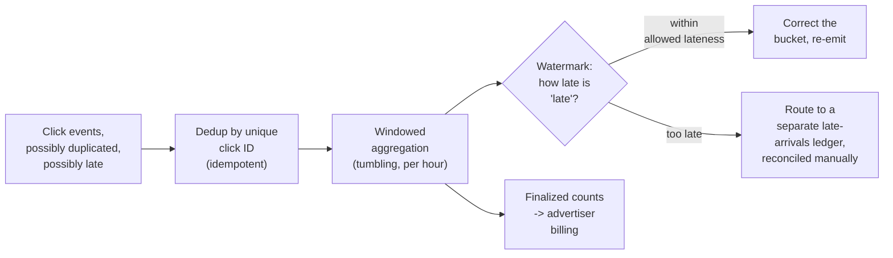

**Memory hook:** *"Dedup by ID before counting, window by time, and decide explicitly how late is
too late — the billing number this feeds has zero tolerance for double-counting or silently
dropped late events."*

---

## Table of contents
[How to Identify This Topic](#how-to-identify-this-topic-in-an-interview) ·
[Interview Playbook](#interview-playbook) · [Requirements](#requirements-clarification) ·
[Capacity Estimation](#capacity-estimation-worked) · [API Design](#api-design) ·
[High-Level Architecture](#high-level-architecture) ·
[Architecture Evolution v1→v2→v3](#architecture-evolution-v1--v2--v3) ·
[End-to-End Walkthroughs](#end-to-end-request-walkthroughs) ·
[Deep Dive: Exactly-Once Deduplication](#deep-dive-exactly-once-deduplication) ·
[Deep Dive: Watermarks & Late Data](#deep-dive-watermarks--late-data) ·
[Deep Dive: Approximate vs. Exact Counting](#deep-dive-approximate-vs-exact-counting) ·
[Data Model](#data-model) · [Failure Modes](#failure-modes--mitigations) ·
[Non-Functional Walkthrough](#non-functional-walkthrough) ·
[Security & Compliance](#security--compliance) · [Cost & Trade-offs](#cost--trade-offs) ·
[Wrap-Up](#wrap-up-mvp-vs-stretch) · [Golden Rules](#golden-rules) ·
[Cheat Sheet](#master-cheat-sheet)

---

## How to identify this topic in an interview

- "Design an ad click/impression counting and billing aggregation system."
- The tell that distinguishes this from a plain sharded-counter chapter: the interviewer
  emphasizes that the output **feeds billing** — that single fact should immediately shift the
  conversation toward exactly-once semantics and late-data handling, not just throughput scaling.
- A follow-up like "what if a click event arrives an hour late" is the
  [watermarks deep dive](#deep-dive-watermarks--late-data) — the single most-tested mechanism in
  this chapter.

---

## Interview playbook

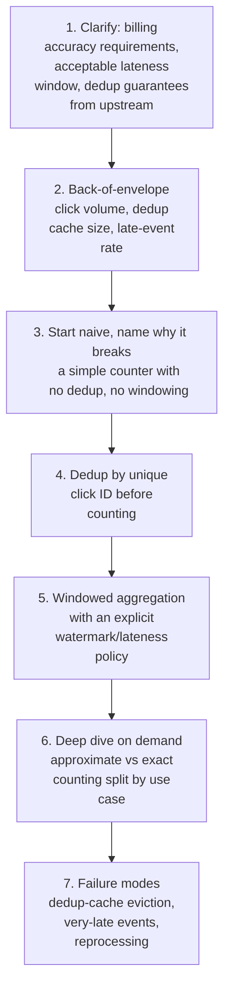

**What the interviewer is actually grading at each step:**
- Step 3: do you recognize, unprompted, that a plain counter with no dedup will double-count
  retried/duplicated events, and that this directly translates to a billing error, not just a
  cosmetic metric blip?
- Step 5: do you know *why* a simple fixed-cutoff window ("count is final at exactly the hour
  mark") is wrong, and can you propose a watermark-based allowed-lateness policy instead?
- Step 6: do you distinguish approximate counting (fine for a live dashboard) from exact counting
  (required for billing) as two different requirements needing two different mechanisms, rather
  than one-size-fits-all?

---

## Requirements clarification

### Functional

| # | Requirement | Notes |
|---|---|---|
| F1 | Count each click exactly once per (ad, campaign, hour) bucket | The core correctness requirement |
| F2 | Handle events arriving out of order or after some delay | Real-world network/pipeline behavior, not an edge case |
| F3 | Produce a finalized, billing-accurate count per bucket after a defined lateness window | The actual deliverable that drives invoicing |
| F4 | Provide a live, approximate "clicks so far" view for dashboards, faster than the finalized count | A different, more relaxed requirement layered alongside the exact one |
| F5 | Support reconciliation/correction if a very-late event arrives after a bucket is finalized | Rare, but must have a defined, auditable process, not silent data loss |

### Non-functional

| Requirement | Target | Why this number |
|---|---|---|
| Counting accuracy for billing | Exact — zero tolerance for double-counting or silently dropped valid clicks | Directly determines advertiser invoices; an error here is a real financial/trust/legal issue |
| Dedup window | Must cover the realistic range of retry/duplicate-delivery delays | Too short, and legitimate retries get double-counted; too long, and the dedup-tracking cost grows unnecessarily |
| Lateness tolerance for billing finalization | A defined, explicit window (e.g. finalize an hour's count after waiting some additional hours) | Balances timeliness of billing against catching the vast majority of legitimately late events |
| Dashboard freshness | Seconds to low minutes, approximate is acceptable | A much looser requirement than the billing path |
| Auditability | Every finalized count must be reconstructable/explainable | Billing disputes require showing exactly which click events contributed to a charged amount |

**Clarifying questions worth asking the interviewer up front — and what each answer changes:**

| Question | If the answer is... | ...then this changes |
|---|---|---|
| "Does the upstream click-serving system guarantee at-most-once delivery, or can the same click be reported multiple times?" | Can be reported multiple times (the realistic case) | Confirms dedup by a unique click ID is a mandatory pipeline stage, not optional |
| "How late can a legitimate click event realistically arrive?" | Up to a few hours in rare cases (e.g. mobile client buffering events while offline) | Directly sizes the watermark/allowed-lateness window |
| "Is there a hard deadline for finalizing an hour's billing count?" | Yes, e.g. within 24 hours | Bounds how long the system can wait for late events before it must finalize and handle anything later via a separate reconciliation process |
| "Do dashboards need billing-accurate numbers, or is a fast approximate view acceptable?" | Approximate is fine for dashboards | Confirms two separate code paths/mechanisms are justified — an approximate fast path and an exact billing path |

**Say this out loud in the interview:** *"Because this feeds billing, I want to treat 'exactly
once, eventually' as the actual requirement, not 'approximately right, immediately' — and I'd
build a genuinely separate, cheaper approximate path for anything that's just a live dashboard,
rather than making the billing path do double duty as both."*

---

## Capacity estimation, worked

```
Given (illustrative, a large ad platform):
  Ad clicks/day, globally                        = 2,000,000,000
  Peak click QPS                                    = 2,000,000,000 / 86,400 ~= 23,000 average,
                                                        say ~80,000 QPS at peak

Duplicate-delivery rate (realistic, from network retries/replays):
  Illustrative duplicate rate                        = ~0.5-1% of reported click events are
                                                          duplicates of an already-seen click
  Duplicates/day at 0.75%                             = 2,000,000,000 x 0.0075 = 15,000,000
  -> a SMALL percentage, but a LARGE absolute number -- 15 million potential double-counts per
     day is a real, material billing error if dedup isn't in place, not a rounding error.

Dedup tracking cost:
  Unique click IDs needing tracking within the dedup window (e.g. 24 hours)
    = 2,000,000,000 clicks/day
  Bytes per tracked ID (a compact hash/ID + timestamp)  ~= 24 bytes
  Dedup store size for a 24h window                      = 2,000,000,000 x 24B ~= 48 GB
  -> a manageable size for a purpose-built deduplication store (e.g. a large distributed
     cache/key-value store with TTL-based eviction matching the dedup window), NOT free, but
     far cheaper than the cost of a billing error at the duplicate rate above.

Late-event rate:
  Illustrative: ~0.2% of clicks arrive more than 1 hour after their actual click timestamp
  Late events/day                                     = 2,000,000,000 x 0.002 = 4,000,000
  -> also a small percentage but large absolute number -- this is the volume the watermark/
     allowed-lateness policy has to explicitly account for, not treat as negligible.

Windowed aggregation state:
  Concurrently "open" (not yet finalized) hourly buckets, across all (ad, campaign) pairs
    = active campaigns x buckets kept open during the lateness window
  -> bounded by campaign count x lateness-window-in-hours, a MUCH smaller number than raw
     click volume -- the aggregation state itself is compact; it's the raw click stream
     flowing INTO it that's large.
```

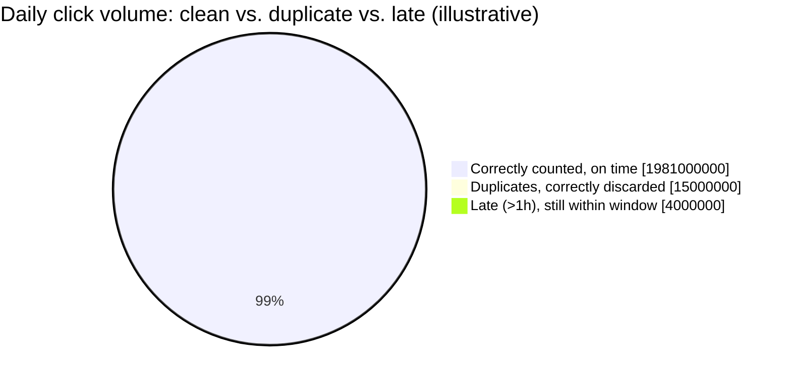

Duplicates and late events are each well under 1% individually, but both land in the millions
per day in absolute terms — exactly why neither can be waved away as negligible.

**Redo-the-chain test:** if the dedup window is extended from 24 hours to 72 hours (to catch a
longer tail of duplicate-delivery delays), dedup store size roughly triples — a direct, computable
cost of a more conservative dedup policy, worth naming if asked to justify the window size choice.

**The number worth memorizing:** even a small (well under 1%) duplicate or late-event rate
translates to millions of events per day in absolute terms at real ad-platform volume — "small
percentage" is not the same as "safe to ignore" when the downstream consequence is a billing
number.

---

## API design

### Click event ingestion (internal, from ad-serving infrastructure)

```json
{
  "clickId": "clk_9f2e7a1b",
  "adId": "ad_881",
  "campaignId": "camp_44821",
  "clickTimestamp": "2026-07-24T11:59:58Z",
  "reportedAt": "2026-07-24T12:00:05Z"
}
```

| Field | Notes |
|---|---|
| `clickId` | A globally unique identifier assigned at the point of the actual click — this is the key the dedup stage checks, and it must be assigned once, at the source, and preserved through any retries so a retried delivery carries the SAME id, not a new one |
| `clickTimestamp` vs. `reportedAt` | Two different times — the windowed aggregation buckets by `clickTimestamp` (when the click actually happened), while `reportedAt` (when the pipeline received it) is what determines how "late" an event is relative to its own bucket |

### `GET /v1/billing/counts?campaignId=camp_44821&hour=2026-07-24T11:00:00Z`

```json
{
  "campaignId": "camp_44821",
  "hour": "2026-07-24T11:00:00Z",
  "status": "FINALIZED",
  "clickCount": 48213,
  "finalizedAt": "2026-07-25T13:00:00Z"
}
```

`status` values: `PROVISIONAL` (still within the lateness window, count may still change) or
`FINALIZED` (lateness window elapsed, count is now the billing-authoritative number).

**The one sentence worth saying about the API surface:** *"Every count is explicitly `PROVISIONAL`
or `FINALIZED` — a billing consumer should only ever act on `FINALIZED` numbers, and the API makes
that distinction impossible to miss rather than implying every number is immediately final."*

---

## High-level architecture

### Architecture evolution (v1 → v2 → v3)

**v1 — a simple counter, no dedup, no windowing:**

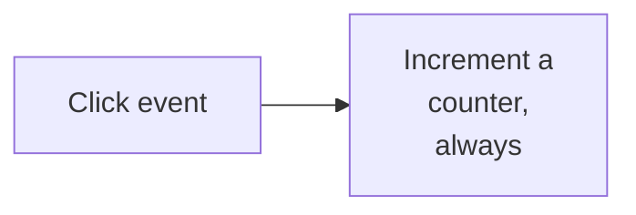

**Why it breaks:** per the capacity estimate, ~0.75% duplicate delivery translates to millions of
double-counted clicks per day — a direct, material billing error with no correction mechanism at
all.

**v2 — dedup by click ID, but a fixed-cutoff window:**

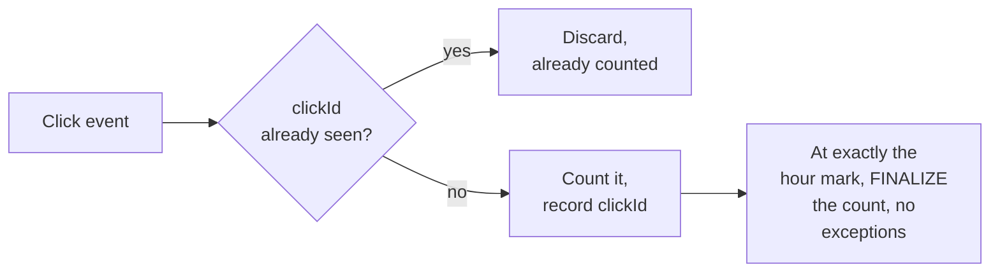

**Why it breaks:** dedup (v2's improvement) fixes double-counting. But per the capacity estimate,
a real fraction of clicks arrive after their bucket's hour boundary has passed — a rigid,
no-exceptions cutoff at exactly the hour mark either finalizes and undercounts (silently losing
legitimately late clicks from the billing total) or, if the cutoff is naively pushed back
indefinitely to "be safe," never actually finalizes anything, which billing can't work with
either.

**v3 — the real system: dedup + explicit watermark-based lateness policy:**

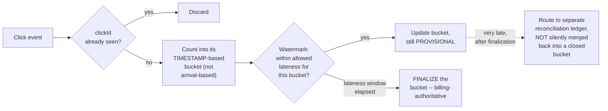

**What v3 fixes, one line each:** dedup (already in v2) prevents double-counting; buckets key off
the click's own timestamp, not arrival time, so a late-arriving click still lands in the correct
hour; an explicit watermark defines exactly how long a bucket stays open and provisional before
finalizing; and anything arriving after finalization is handled through a distinct, auditable
reconciliation path rather than either silently dropped or silently mutating an already-reported
number.

---

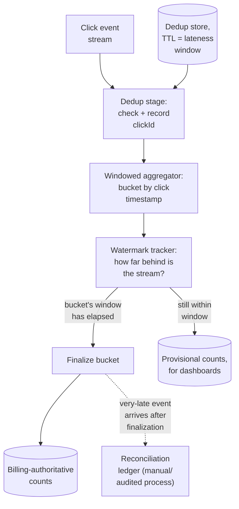

| Component | Role |
|---|---|
| Dedup stage | Checks and records `clickId` against the dedup store before any counting happens — the correctness guarantee against double-counting |
| Dedup store | TTL-matched to the dedup window (per the capacity estimate, tens of GB for a 24h window) |
| Windowed aggregator | Buckets by the click's own timestamp, not arrival time |
| Watermark tracker | Tracks how far "behind" the overall stream is, driving the finalize decision per bucket |
| Reconciliation ledger | The explicit, auditable home for events too late to affect an already-finalized bucket |

---

## End-to-end request walkthroughs

### Walkthrough 1 — a duplicate click, correctly discarded

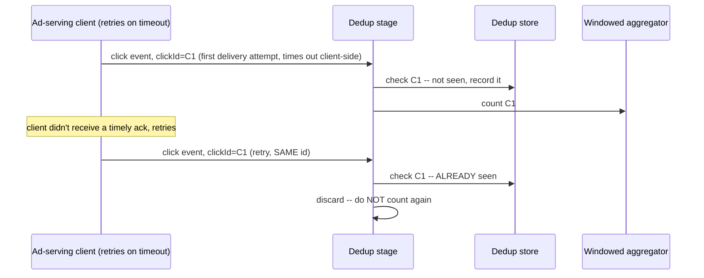

### Walkthrough 2 — a late event within the allowed window, then finalization

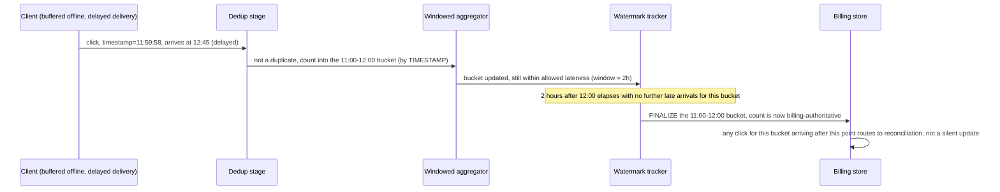

Walkthrough 2 shows both halves of the watermark mechanism working together: the late click still
lands in the *correct* bucket (by its own timestamp), and the bucket only finalizes after enough
time has passed to reasonably expect no more legitimately late arrivals.

### Walkthrough 3 — a very-late click arrives after finalization, routes to reconciliation

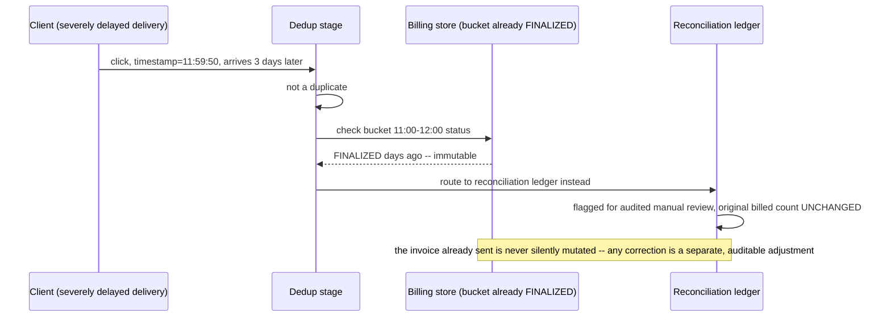

This is the concrete mechanism behind the [watermarks deep dive](#deep-dive-watermarks--late-data)'s
"never a silent mutation of an already-billed number" rule.

---

## Deep dive: exactly-once deduplication

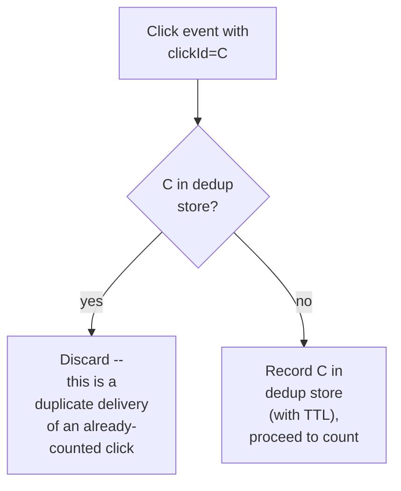

**Why the click ID must be assigned once, at the true source, and preserved across retries:** the
entire dedup mechanism depends on a retried delivery carrying the *same* ID as the original
attempt — if a retry generates a new ID (e.g. because the ID is assigned by an intermediate
service on each delivery attempt rather than by the original click event itself), dedup silently
fails, because from the dedup store's perspective, the retry looks like a brand new, distinct
click.

**Why TTL-based eviction is safe here:** once a click's `clickTimestamp` is old enough that its
bucket has been finalized and the lateness window has fully elapsed, there's no further need to
remember its ID for dedup purposes — a new event with the same ID arriving after that point would
route to reconciliation regardless, so the dedup store's retention only needs to cover the active
lateness window, not forever.

**Interview cheat-sheet:** *"Deduplication depends entirely on the click ID being assigned once at
the true source and preserved through every retry — get that wrong, and dedup silently does
nothing, since every retry looks like a new, distinct event."*

---

## Deep dive: watermarks & late data

The single most-tested mechanism in this chapter — already the centerpiece of the architecture
evolution.

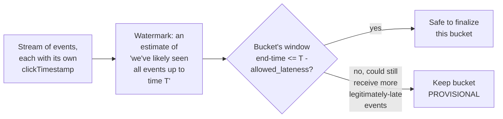

**Why a rigid, fixed-time cutoff ("finalize exactly at the hour mark") is the wrong model:** it
forces a choice between two bad options — finalize too early and silently undercount legitimately
late events, or delay finalization indefinitely "to be safe" and never actually produce a usable
billing number. A watermark-based policy makes the trade-off explicit and tunable: wait a defined,
bounded amount of extra time (the allowed-lateness window) past a bucket's natural end, then
finalize — accepting a small, known, and auditable risk of missing the rare event later than that,
routed to reconciliation rather than lost.

**Why anything arriving after finalization must go to a separate reconciliation ledger, not
silently mutate the finalized count:** a billing number that already went into an invoice
shouldn't change without an explicit, auditable process — silently incrementing an already-
finalized, already-billed count would create a mismatch between what was charged and what the
system now believes the "real" count is, with no clear record of why they differ.

**Interview cheat-sheet:** *"Watermarks make 'how late is too late' an explicit, tunable policy
instead of an implicit assumption — and anything arriving after a bucket finalizes goes to a
separate, auditable reconciliation process, never a silent mutation of an already-billed number."*

---

## Deep dive: approximate vs. exact counting

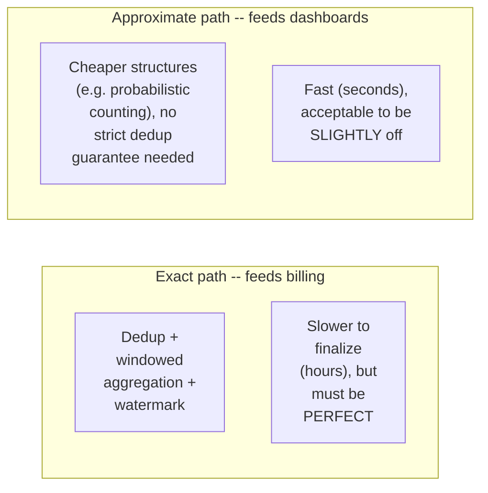

**Why these need to be two genuinely separate mechanisms, not one system serving both needs:**
the exact path's correctness machinery (durable dedup store, watermark-gated finalization) adds
real latency and cost that a live dashboard doesn't need to pay for, while a dashboard's tolerance
for slight inaccuracy would be unacceptable if that same relaxed mechanism were used to generate
actual invoices. Building one system that tries to serve both requirements optimally for neither
tends to either over-engineer the dashboard path or under-engineer the billing path.

**Interview cheat-sheet:** *"Don't build one mechanism to serve both dashboards and billing — a
fast, cheap, approximate path for live dashboards and a slower, exact, watermark-gated path for
billing are different enough requirements to justify two separate mechanisms, not one compromise
in the middle."*

---

## Data model

**Bucket lifecycle** — the state machine behind the watermark deep dive:

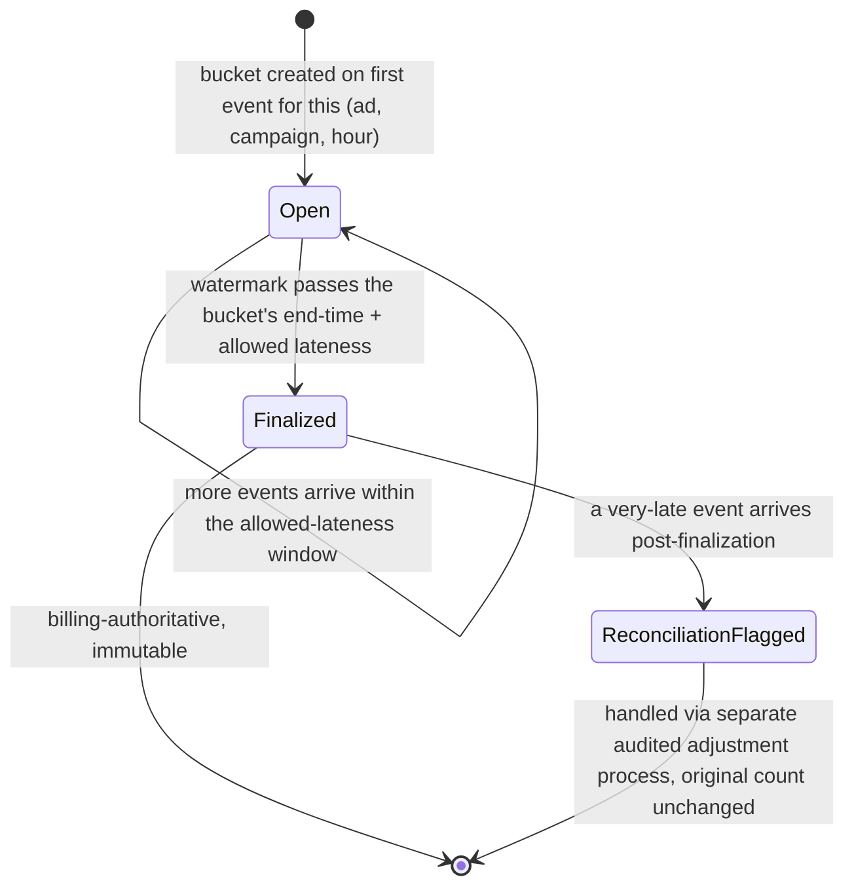

`Finalized` is explicitly immutable — the `ReconciliationFlagged` transition never mutates the
original finalized count directly, only creates a separate, auditable adjustment record.

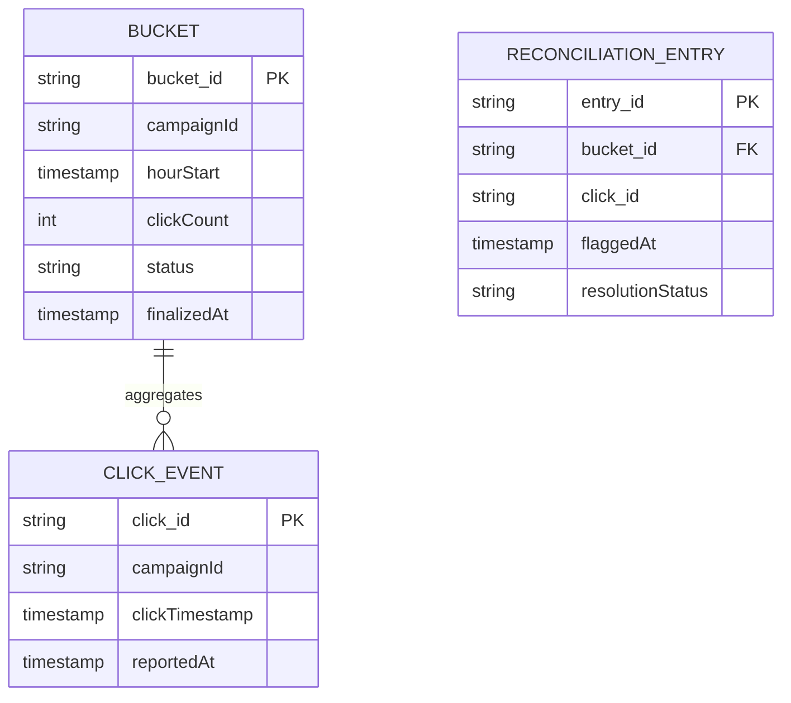

| Table | Storage choice & why |
|---|---|
| `ClickEvent` (dedup store) | High-write-throughput key-value store with TTL matching the dedup/lateness window |
| `Bucket` | Relatively small in count (bounded by campaigns x hours x lateness-window, per the capacity estimate), but each update is a hot, frequently-incremented counter during its `Open` state |
| `ReconciliationEntry` | Low-volume, append-only, human-auditable — the explicit home for anything arriving after finalization |

---

## Failure modes & mitigations

| Failure mode | Impact | Mitigation |
|---|---|---|
| **Dedup store evicts an ID before its full realistic retry window has elapsed** | A legitimate retry could be double-counted | Size the dedup store's TTL conservatively against observed real-world retry-delay distributions, with margin, not just the median case |
| **Watermark advances too aggressively** (finalizes buckets before enough late events have arrived) | Systematic undercounting, a real billing-accuracy problem | Tune the allowed-lateness window against observed real-world late-arrival distributions (per the capacity estimate's ~0.2% beyond 1 hour), erring conservative given the financial stakes |
| **A very-late event arrives, is correctly routed to reconciliation, but reconciliation itself has no defined SLA** | Legitimate revenue/clicks could sit unresolved indefinitely | Reconciliation needs its own bounded process and ownership, not just a queue that accumulates forever |
| **Bucket aggregation state for a given campaign becomes a hot key** (a viral ad driving huge click volume into one campaign's current-hour bucket) | Write contention on that bucket's counter | The same sharded-counter techniques from the dedicated Sharded Counters chapter apply here for the aggregation step itself, even though this chapter's focus is dedup/lateness rather than raw counter scaling |

---

## Non-functional walkthrough

**Scaling the dedup and aggregation stages is a stream-processing scaling problem**, shardable by
click ID / campaign ID, similar in shape to the fraud-detection chapter's real-time feature
computation, just optimized for exactly-once correctness rather than feature freshness.

**Availability of the exact/billing path can reasonably trade off against strict low-latency
requirements** — billing correctness matters far more than billing speed, which is why a
multi-hour lateness window before finalization is an acceptable, even necessary, design choice.

**Consistency is the entire point of the exact path** — this is a system where "eventually
consistent, once finalized" is fine, but "approximately correct" is explicitly not, for the
billing-authoritative numbers specifically (as distinct from the deliberately-approximate
dashboard path).

---

## Security & compliance

- **Billing data is financially and often contractually sensitive** — access to raw click events
  and finalized counts should be tightly controlled, with a clear audit trail for any
  reconciliation adjustment.
- **Click fraud** (bots or scripts generating fake clicks to drain advertiser budgets or inflate
  publisher revenue) is a distinct, real concern in this domain — worth naming as a related but
  separate problem from the counting-correctness focus of this chapter; a legitimate
  fraud-filtering stage often sits upstream of the counting pipeline described here.
- **Advertiser-facing reporting accuracy** may be subject to contractual SLAs or, in some
  contexts, regulatory scrutiny around ad billing transparency — the finalized/provisional
  distinction in the API design directly supports being able to honestly represent what's final
  versus still settling.

---

## Cost & trade-offs

**Dedup-store retention window trades storage cost against protection against long-tail duplicate
deliveries** — per the capacity estimate, a direct, computable relationship between window length
and store size.

**Allowed-lateness window trades billing timeliness against completeness** — a shorter window
finalizes and bills faster but risks systematically undercounting a small tail of legitimately
late events; a longer window is more complete but delays when advertisers can be billed. This is
the central tuning decision of the whole system and should be justified with real observed
late-arrival data, not an arbitrary default.

---

## Wrap-up: MVP vs. stretch

**In scope for an MVP:**
- Dedup by click ID with a TTL-matched store.
- Windowed aggregation bucketed by event timestamp, with a fixed allowed-lateness window before
  finalization.
- A basic reconciliation ledger for post-finalization late arrivals.

**Explicitly out of scope for an MVP:**
- A separate approximate dashboard path — start with the exact path serving both needs at MVP
  scale (accepting some unnecessary latency for dashboard use cases), split into two paths once
  dashboard-latency complaints or exact-path cost pressure justify it.
- Adaptive watermark tuning (adjusting the lateness window based on observed real-time arrival
  patterns) — start with a fixed, data-informed window.

**Stretch goals, worth naming if asked "what's next":**
1. **A dedicated approximate, low-latency dashboard path**, decoupled from the exact billing
   pipeline's correctness machinery.
2. **Adaptive watermarking**, tuning the lateness window per campaign or per traffic source based
   on observed arrival-delay distributions rather than one global fixed window.
3. **Upstream click-fraud filtering integration**, ensuring the counting pipeline described here
   operates on already-fraud-filtered event streams rather than treating fraud detection as
   entirely out of scope.

---

## Golden rules

- **Deduplicate by a click ID assigned once at the true source and preserved across retries** —
  this is the entire correctness guarantee against double-counting, and it fails silently if the
  ID isn't stable across delivery attempts.
- **Bucket by the event's own timestamp, never by arrival time** — a late-arriving click still
  belongs to the hour it actually happened in.
- **Watermarks make "how late is too late" an explicit, tunable, auditable policy** — never a
  rigid fixed-cutoff that either undercounts or never finalizes.
- **A finalized, billing-authoritative count is immutable** — anything arriving after
  finalization routes to a separate, auditable reconciliation process, never a silent mutation.
- **Approximate dashboards and exact billing numbers need two different mechanisms** — don't build
  one compromise system trying to serve both well.

---

## Master cheat sheet

**One-liners:**
- Even a sub-1% duplicate or late-event rate is millions of events per day at real ad-platform
  volume — "small percentage" doesn't mean "safe to ignore" when the consequence is a billing
  number.
- Dedup depends entirely on a stable click ID preserved across retries — a retry that generates a
  new ID defeats dedup silently.
- Bucket by event timestamp, not arrival time, so late events still land in the correct billing
  period.
- Watermarks make the late-data trade-off explicit and tunable — finalize after a defined,
  bounded allowed-lateness window, route anything later to auditable reconciliation.
- Approximate (dashboards) and exact (billing) counting are different enough requirements to
  justify two separate mechanisms, not one shared compromise.

**Formula chain:**
```
duplicates_per_day     = total_events_per_day x duplicate_rate
dedup_store_size        = events_per_dedup_window x bytes_per_tracked_id
late_events_per_day     = total_events_per_day x late_arrival_rate
```

**Numbers:** even sub-1% duplicate/late-event rates translate to millions of affected events per
day at real ad-platform scale · dedup store sizing is typically tens of GB for a
24-hour window at billion-scale daily click volume · billing finalization windows are commonly
measured in hours, deliberately trading timeliness for completeness.
