# Design an API Gateway — FAANG Interview Guide

> Source chapter type: infrastructure composition. Distinct from
> [Rate Limiter](./19-Rate-Limiter-FAANG-Guide.md) (one algorithm),
> [Spectacular Failures](./39-Spectacular-Failures-FAANG-Guide.md) (failure patterns including
> circuit breakers), and [the IP allow/block-list guide](./46-Design-an-IP-Allowlist-Blocklist-Service-FAANG-Guide.md)
> (config distribution) — this chapter isn't a new algorithm, it's the answer to "how do auth,
> rate limiting, routing, and circuit breaking **compose into one request pipeline**, in the right
> **order**, on a component that sits in front of every single request to every backend service
> and therefore cannot itself become the bottleneck or the single point of failure it was built to
> prevent."

## Mental model

Every request to a company's backend services can pass through one shared front door instead of
each service independently reimplementing authentication, rate limiting, routing, and resilience
logic. An API gateway is not a new distributed-systems mechanism — it's a **composition problem**:
several mechanisms this course already covers elsewhere, stacked into one pipeline, where getting
the **order** of stages wrong causes real security or correctness bugs, and where the gateway's
own latency and availability directly become a tax on literally every request in the system.

Three genuinely hard problems, none of them "invent a new algorithm":

1. **Stage ordering.** Authenticate before rate-limiting by user, or rate-limit before
   authenticating? Terminate TLS before or after routing? Getting the order wrong isn't a style
   choice — it can mean rate-limiting by a not-yet-validated identity, or leaking routing
   decisions to unauthenticated traffic.
2. **The gateway's own latency budget.** Every stage adds real overhead on the single most
   request-frequent path in the entire system — a gateway that adds tens of milliseconds "just for
   auth plus rate limiting plus routing" has made every backend service slower, regardless of how
   fast any individual service is.
3. **Config/route propagation to a gateway fleet.** Routing rules, rate-limit policies, and
   circuit-breaker thresholds change over time and must reach every gateway instance — this is
   exactly the "distribute a small, frequently-changing config artifact to every node without
   creating a single point of failure" problem from the IP-allowlist chapter, just applied to
   routing config instead of a compliance list.

**The one sentence to say out loud:** *"An API gateway isn't a new mechanism, it's correctly
composing several mechanisms this course already covers — the interview is really about pipeline
ordering and making sure the gateway's own overhead and availability don't become the thing that
breaks every request in the system, not about inventing new algorithms for auth or rate
limiting."*

**The one picture to remember forever:**

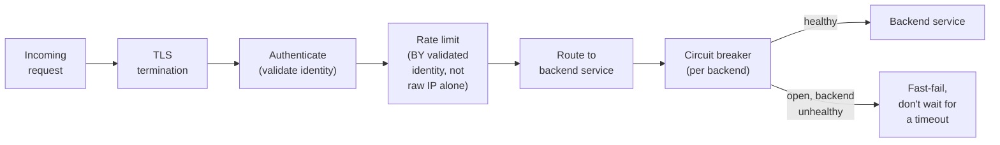

**Memory hook:** *"TLS, then auth, then rate-limit BY the now-known identity, then route, then
circuit-break per backend — the order matters because each stage's decision depends on the
previous one having already run correctly."*

---

## Table of contents
[How to Identify This Topic](#how-to-identify-this-topic-in-an-interview) ·
[Interview Playbook](#interview-playbook) · [Requirements](#requirements-clarification) ·
[Capacity Estimation](#capacity-estimation-worked) · [API Design](#api-design) ·
[High-Level Architecture](#high-level-architecture) ·
[Architecture Evolution v1→v2→v3](#architecture-evolution-v1--v2--v3) ·
[End-to-End Walkthroughs](#end-to-end-request-walkthroughs) ·
[Deep Dive: Pipeline Stage Ordering](#deep-dive-pipeline-stage-ordering) ·
[Deep Dive: Gateway Latency Budget](#deep-dive-gateway-latency-budget) ·
[Deep Dive: Route/Policy Config Distribution](#deep-dive-routepolicy-config-distribution) ·
[Deep Dive: Multi-Tenant Rate-Limit Isolation](#deep-dive-multi-tenant-rate-limit-isolation) ·
[Data Model](#data-model) · [Failure Modes](#failure-modes--mitigations) ·
[Non-Functional Walkthrough](#non-functional-walkthrough) ·
[Security & Compliance](#security--compliance) · [Cost & Trade-offs](#cost--trade-offs) ·
[Wrap-Up](#wrap-up-mvp-vs-stretch) · [Golden Rules](#golden-rules) ·
[Cheat Sheet](#master-cheat-sheet)

---

## How to identify this topic in an interview

- "Design an API gateway" (or "design the front door for our microservices").
- The tell that this is a composition chapter, not a request for a new algorithm: the interviewer
  lists several *already-familiar* concerns (auth, rate limiting, routing, resilience) together —
  the interesting design work is in how they combine, not in reinventing any one of them.
- A follow-up like "what if the gateway itself becomes the bottleneck" is the
  [latency-budget deep dive](#deep-dive-gateway-latency-budget) — the single most product-relevant
  concern in this chapter, since it affects literally every request in the system.

---

## Interview playbook

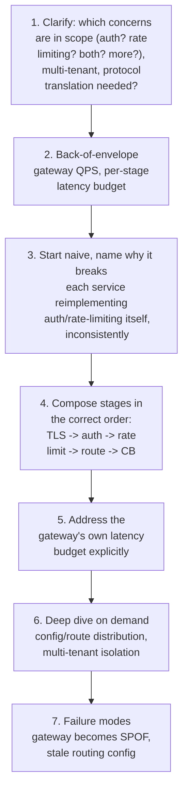

**What the interviewer is actually grading at each step:**
- Step 4: do you get the STAGE ORDER right, unprompted — specifically, rate-limiting by validated
  identity rather than by raw, unauthenticated request attributes?
- Step 5: do you recognize, unprompted, that the gateway itself sits on every request's critical
  path and therefore its own added latency and availability are first-class design concerns, not
  an afterthought once the "interesting" logic is done?
- Step 6: do you connect route/policy distribution to the same "don't call a slow source
  per-request, distribute a versioned snapshot instead" lesson from earlier chapters in this
  course, rather than treating it as a brand-new problem?

---

## Requirements clarification

### Functional

| # | Requirement | Notes |
|---|---|---|
| F1 | Authenticate every request before it reaches a backend service | Centralizes identity validation instead of every service reimplementing it |
| F2 | Rate-limit requests, scoped appropriately (per user, per API key, per tenant) | Reuses the algorithms from the dedicated Rate Limiter chapter |
| F3 | Route requests to the correct backend service based on path/host/header rules | The traffic-directing function |
| F4 | Apply circuit breaking per backend so one unhealthy service doesn't cascade failures | Reuses patterns from the Spectacular Failures chapter |
| F5 | Support protocol translation where needed (e.g. public REST to internal gRPC) | A common real-world gateway responsibility |

### Non-functional

| Requirement | Target | Why this number |
|---|---|---|
| Gateway-added latency | As close to zero as achievable — single-digit milliseconds for the combined pipeline | This overhead is paid by literally every request to every backend service; it compounds across the whole system |
| Gateway availability | Extremely high — an outage here is an outage of everything behind it | The gateway is, by construction, a single front door; its own architecture must not reintroduce the single-point-of-failure risk it's meant to help manage for backends |
| Auth validation correctness | Strict, zero tolerance for bypass | A gateway auth bug affects every service behind it simultaneously — the blast radius of a mistake here is the whole platform, not one service |
| Rate-limit accuracy at scale | Consistent across a fleet of gateway instances, not per-instance-siloed | A user's rate limit must be enforced globally across all requests, regardless of which gateway instance happens to handle any given one |
| Route/policy propagation latency | Fast enough that a routing or policy change doesn't leave the fleet inconsistent for long | Same "bounded, monitored propagation lag" requirement as any config-distribution system in this course |

**Clarifying questions worth asking the interviewer up front — and what each answer changes:**

| Question | If the answer is... | ...then this changes |
|---|---|---|
| "Is this a single-tenant internal gateway, or does it serve multiple external tenants/API consumers?" | Multi-tenant, external-facing | Confirms rate-limit isolation between tenants (one tenant's burst shouldn't consume another's budget) is a hard requirement — see the multi-tenant deep dive |
| "What's the acceptable added latency budget for the gateway itself?" | Single-digit milliseconds | Directly constrains which auth/rate-limiting mechanisms are viable — anything requiring a slow external call per request is immediately ruled out |
| "How often do routing rules or rate-limit policies change?" | Occasionally, e.g. a few times a day during deploys | Confirms a versioned-snapshot-distribution model (not a per-request policy lookup) is the right approach, reusing the config-distribution pattern from earlier in this course |
| "Is protocol translation (REST-to-gRPC, etc.) in scope?" | Yes | Adds a defined transformation stage to the pipeline, with its own latency cost to budget for |

**Say this out loud in the interview:** *"I want to be explicit that none of the individual
mechanisms here are new — the actual design work is getting their composition order right and
making sure the gateway's own overhead and availability don't undermine the reliability it's
supposed to provide to everything behind it."*

---

## Capacity estimation, worked

```
Given (illustrative, a mid-size platform's API gateway fleet):
  Total requests/sec across all backend services, peak   = 200,000 QPS
  -> EVERY one of these passes through the gateway -- this is, by definition, the highest-
     traffic single component in the whole system, higher than any individual backend
     service's own traffic.

Per-stage latency budget (illustrative, targeting <5ms total added by the gateway):
  TLS termination (often hardware/kernel-assisted)          ~= 0.5ms
  Auth validation (e.g. JWT signature check, LOCAL,
    no external call)                                        ~= 0.5-1ms
  Rate-limit check (local/in-memory counter, or a fast
    distributed cache read)                                   ~= 0.5-1ms
  Routing decision (local lookup against a cached,
    versioned route table)                                    ~= 0.2ms
  Circuit-breaker check (local state, no external call)        ~= 0.1ms
  Total gateway-added latency                                  ~= 2-3ms
  -> every one of these stages is deliberately LOCAL (no external network call per request) --
     this is the concrete reason the total stays in low single-digit milliseconds; any stage
     requiring an external call (e.g. a database lookup per request for auth) would blow this
     budget by 10-50x on its own.

Gateway fleet sizing:
  If each gateway instance sustainably handles ~10,000 QPS
  Instances needed at 200,000 QPS peak (with headroom)         = ~25-30 instances
  -> a straightforward horizontal-scaling number, since each instance's work (per-request
     pipeline stages, all local) is independent and stateless -- the HARD part isn't scaling
     instance count, it's keeping routing/policy config consistent across however many
     instances that turns out to be.

Route/policy config size and distribution:
  Routing rules + rate-limit policies, combined              ~= a few MB, even for a large
                                                                 platform with hundreds of
                                                                 backend services
  -> tiny, same conclusion as the IP-allowlist chapter's snapshot -- full replication to every
     gateway instance is cheap; the design effort goes into propagation correctness and
     versioning, not size.
```

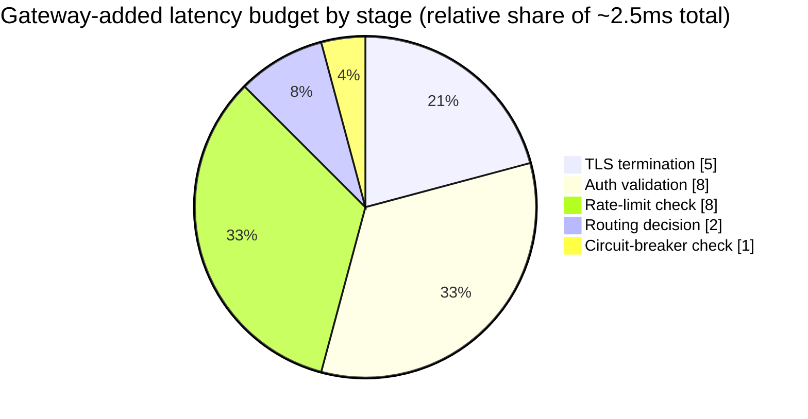

Every slice here is deliberately local (no external call) — this is what keeps the total in the
low single-digit milliseconds instead of tens; the pie shows each stage's relative share, not its
absolute value.

**Redo-the-chain test:** if auth validation requires a database lookup instead of a local
signature check (e.g. checking a revocation list per request), that single stage alone could add
10-50ms — dwarfing every other stage combined — which is exactly why local, self-contained
validation (like a signed token with a short expiry, checked entirely locally) is strongly
preferred over anything requiring an external call in the hot path.

**The number worth memorizing:** a well-designed gateway pipeline keeps its total added latency in
the low single-digit milliseconds specifically because every stage is local — the moment any stage
requires an external network call per request, that stage's latency dominates and typically
violates the entire latency budget by an order of magnitude or more.

---

## API design

The gateway's own "API" is really its **configuration surface** — routes and policies — since its
runtime behavior is to transparently proxy requests, not expose a new API of its own.

### Route configuration

```json
{
  "routeId": "route_881",
  "pathPrefix": "/api/orders",
  "backendService": "orders-service",
  "authRequired": true,
  "rateLimitPolicy": "standard_tier",
  "circuitBreaker": { "failureThreshold": 0.5, "windowSeconds": 30 }
}
```

### Rate-limit policy configuration

```json
{
  "policyId": "standard_tier",
  "algorithm": "TOKEN_BUCKET",
  "requestsPerSecond": 100,
  "burstCapacity": 200,
  "scope": "PER_API_KEY"
}
```

| Field | Notes |
|---|---|
| `scope: PER_API_KEY` | Confirms rate limiting happens by validated identity, not raw IP — reinforces the stage-ordering requirement (auth must run and produce this identity before rate-limiting can apply it) |
| `circuitBreaker` | Reuses the exact configuration shape from the Spectacular Failures chapter's own circuit-breaker pattern, applied per backend route |

**The one sentence worth saying about the API surface:** *"The gateway doesn't expose a novel
runtime API to callers — it transparently proxies to backends — its real 'API' is the
configuration surface (routes, auth requirements, rate-limit policies, circuit-breaker thresholds)
that operators use to compose the pipeline per route."*

---

## High-level architecture

### Architecture evolution (v1 → v2 → v3)

**v1 — every service reimplements auth/rate-limiting/routing itself:**

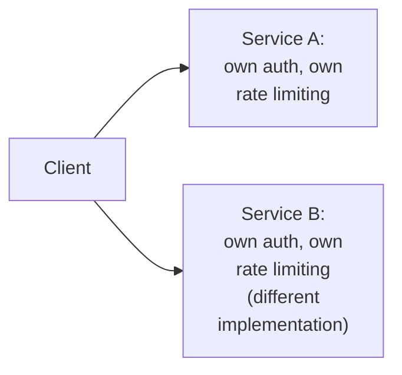

**Why it breaks:** every service independently implements (and inevitably implements slightly
differently) authentication and rate limiting — inconsistent security posture across services,
duplicated engineering effort, and no single place to apply a platform-wide policy change.

**v2 — a shared gateway, but stages in the wrong order (rate-limit before auth):**

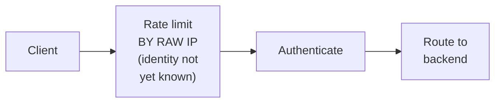

**Why it breaks:** rate-limiting before authentication means the limit is applied to whatever
attribute is available pre-auth (typically raw IP) — this is both less accurate (many legitimate
users can share an IP behind NAT, and a single malicious actor can rotate IPs to evade a per-IP
limit entirely) and can't express per-user or per-API-key policies at all, since that identity
doesn't exist yet at this point in the pipeline.

**v3 — the real system: correctly ordered pipeline:**

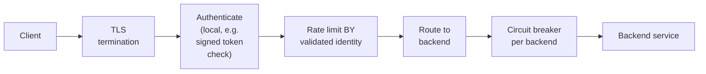

**What v3 fixes, one line each:** a single shared gateway (v2's improvement) centralizes these
concerns consistently; and correcting the stage order — authenticate before rate-limiting — lets
rate limiting apply accurately per validated identity, closing both the accuracy gap and the
easy-to-evade-by-IP-rotation gap that v2's ordering had.

---

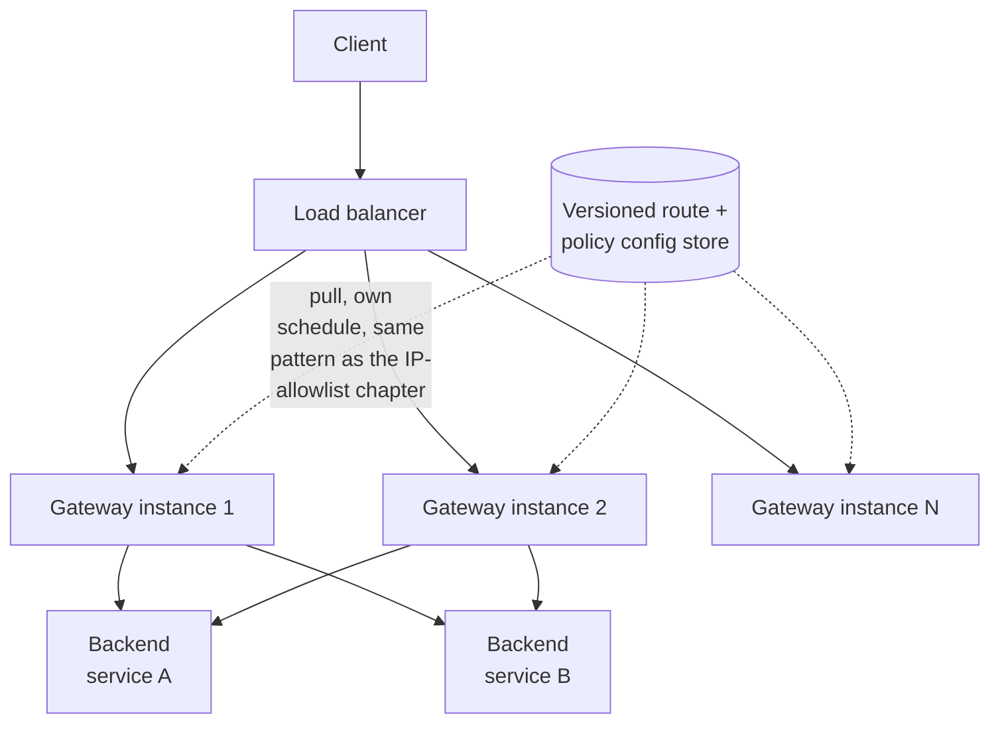

| Component | Role |
|---|---|
| Load balancer in front of the gateway fleet | Ensures the gateway itself isn't a single point of failure — standard horizontal scaling and failover, same as any stateless service fleet |
| Gateway instance | Runs the full local pipeline (TLS, auth, rate limit, route, circuit-break) — stateless with respect to routing/policy config, which it loads from the versioned config store |
| Versioned config store | The same architectural pattern as the IP-allowlist chapter's snapshot store — one source of truth, every gateway instance pulls independently, never gateway-to-gateway sync |

---

## End-to-end request walkthroughs

### Walkthrough 1 — a normal authenticated request, full pipeline

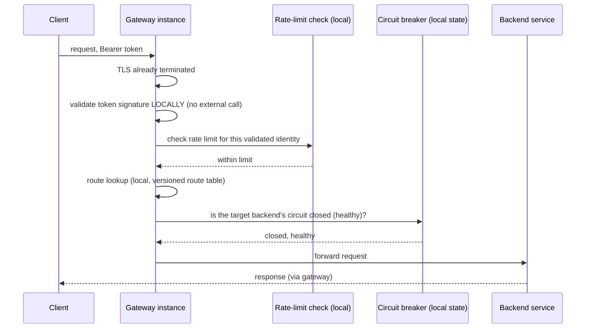

### Walkthrough 2 — a backend is unhealthy, circuit breaker fast-fails

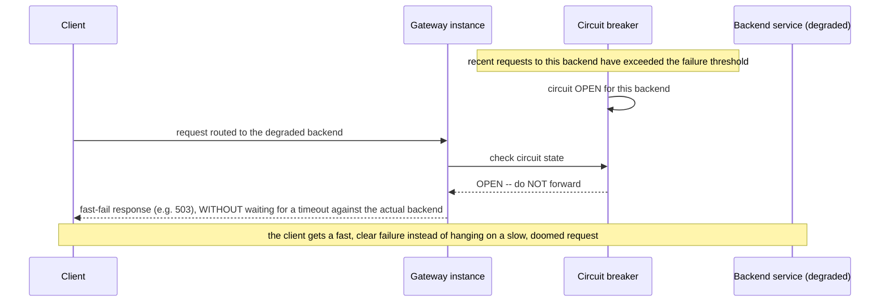

Walkthrough 2 is the concrete value of composing the circuit breaker into the gateway pipeline —
every client talking to a degraded backend benefits from the fast-fail immediately, rather than
each client independently discovering the same timeout the hard way.

### Walkthrough 3 — one tenant's burst is isolated from another tenant's rate-limit budget

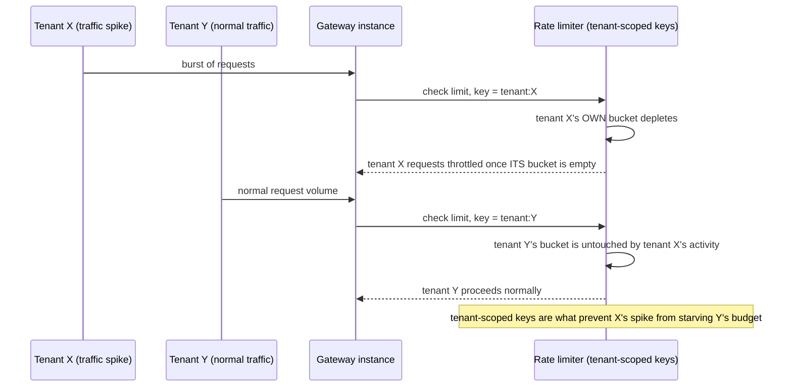

This is the concrete mechanism behind the [multi-tenant isolation deep dive](#deep-dive-multi-tenant-rate-limit-isolation).

---

## Deep dive: pipeline stage ordering

Already the centerpiece of the architecture evolution — restated as the general principle.

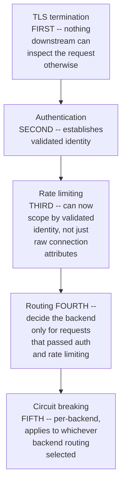

**The general principle, not just this specific order:** each stage's decision should depend only
on information already established by an earlier stage — rate limiting needs identity (from
auth), routing benefits from happening only for traffic that's already passed cheaper checks
(auth, rate limit) so wasted routing/backend work isn't spent on traffic that was going to be
rejected anyway, and circuit breaking is inherently per-backend, so it can only apply after routing
has decided which backend is the target.

**Interview cheat-sheet:** *"Order stages so each one only depends on information already
established earlier in the pipeline, and so cheaper rejection checks (auth, rate limit) happen
before more expensive or backend-specific work (routing, circuit breaking) — getting this order
backward causes real bugs, like rate-limiting by an attribute that's easy to spoof or rotate,
not just style inconsistency."*

---

## Deep dive: gateway latency budget

Already substantially covered in the capacity estimate — the deep dive states the principle
generally.

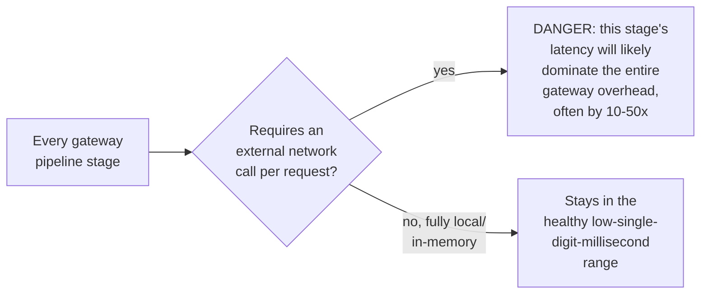

**Why this deserves its own deep dive rather than being an implementation detail:** the gateway
sits on literally every request to every backend service — a design choice at the gateway level
(e.g., "check a revocation list via a database call on every request" for auth) that would be a
minor concern in a single service becomes a platform-wide multiplier here, since it's paid by
every request to every backend, not just requests to one service.

**The general technique for keeping stages local:** short-lived signed tokens (checked via local
signature verification, no database round-trip) instead of session lookups; in-memory or
tightly-latency-bounded local-cache rate-limit counters instead of a slow centralized store for
every check; and versioned, locally-cached routing/policy tables (per the config-distribution deep
dive) instead of a config-service call per request.

**Interview cheat-sheet:** *"Audit every pipeline stage for whether it requires an external call
per request — that single question is what separates a gateway that adds low-single-digit
milliseconds from one that adds tens of milliseconds to every request in the entire platform."*

---

## Deep dive: route/policy config distribution

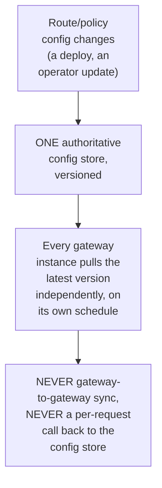

**Why this is the exact same pattern as the IP-allowlist chapter's snapshot distribution, just
applied to routing config instead of a compliance list:** one authoritative source, versioned
immutable snapshots, every consuming node pulling independently from owned infrastructure — the
same reasoning about why cache-to-cache sync is the wrong answer for multi-DC consistency applies
identically here, just with "gateway instances" in place of "DCs" and "routing config" in place of
"IP ranges."

**Interview cheat-sheet:** *"Config distribution to a gateway fleet is the same problem this course
already solved in the IP-allowlist chapter — one versioned source of truth, every instance pulls
independently, never instance-to-instance sync. Naming that connection explicitly is a strong
signal you're generalizing a pattern, not just pattern-matching a memorized answer."*

---

## Deep dive: multi-tenant rate-limit isolation

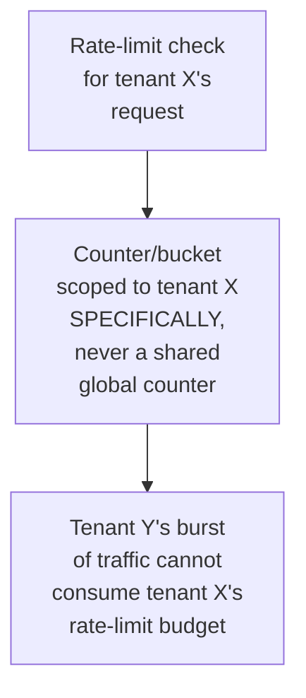

**Why a shared, unscoped rate-limit counter is a real multi-tenant bug, not a minor inefficiency:**
if the rate limiter's key doesn't include tenant identity, one tenant's traffic spike (legitimate
or abusive) can exhaust a shared budget and cause unrelated tenants to be incorrectly
rate-limited — a classic "noisy neighbor" failure that directly violates the isolation multi-tenant
platforms are supposed to guarantee.

**Interview cheat-sheet:** *"Every rate-limit counter must be scoped by tenant/API-key identity,
never shared globally across tenants — otherwise one tenant's traffic can starve another's budget,
a real isolation violation, not just an edge case."*

---

## Data model

The gateway's core "data" is largely configuration, not per-request transactional state (each
request is stateless from the gateway's perspective once its pipeline completes).

**Circuit-breaker state lifecycle**, per backend:

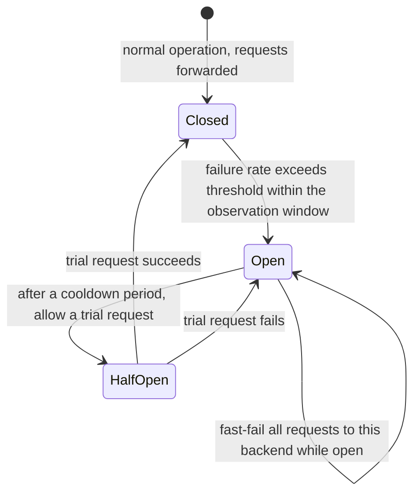

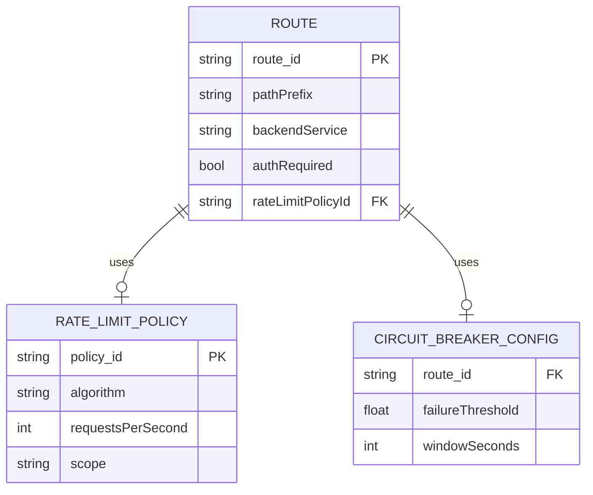

| Table | Storage choice & why |
|---|---|
| `Route` / `RateLimitPolicy` / `CircuitBreakerConfig` | Small, versioned configuration, distributed as an immutable snapshot to every gateway instance — same shape as the IP-allowlist chapter's snapshot data, just orders of magnitude smaller |
| Rate-limit counters (runtime state) | Fast, in-memory or tightly-latency-bounded distributed cache, scoped per tenant/identity — the one piece of genuinely dynamic, frequently-updated state in this system |

---

## Failure modes & mitigations

| Failure mode | Impact | Mitigation |
|---|---|---|
| **The gateway fleet itself becomes unavailable** | Every backend service becomes unreachable, even if all backends are individually healthy | The gateway fleet must be architected with the same horizontal-scaling and no-single-point-of-failure discipline as any critical shared infrastructure — this is the literal risk the whole chapter's "don't let the gateway become the SPOF it's meant to prevent" framing is about |
| **Stale routing config after a backend migration** | Requests route to a decommissioned or wrong backend | Same staleness-monitoring discipline as any versioned-snapshot system in this course — alert if a gateway instance's config version lags too far behind the latest published version |
| **A pipeline stage silently added a slow external call** (e.g. an engineer adds a database check to the auth stage during a feature update) | Gateway-added latency regresses platform-wide, for every request to every backend | Latency budget per stage should be an explicit, monitored SLO, with alerting on regression — treat gateway-stage latency the same way a hot-path function's performance budget would be treated in any latency-critical system |
| **Rate-limit counters not properly scoped by tenant** | Noisy-neighbor cross-tenant impact | Enforce tenant-scoped keys as a mandatory part of the rate-limit policy schema, not an optional convention that can be forgotten per-policy |

---

## Non-functional walkthrough

**Scaling the gateway fleet is straightforward horizontal scaling**, since each instance's
per-request work is stateless and local — the genuinely hard scaling concern is keeping config
(routes, policies) consistent across however many instances that turns out to be, which the
config-distribution deep dive addresses.

**Availability of the gateway must exceed the availability of any individual backend it fronts**,
by construction — since an outage at the gateway layer takes down access to every backend
simultaneously, its own architecture needs to be held to a higher reliability bar than any single
service behind it.

**Consistency of rate-limit state across gateway instances is the one place genuine distributed
coordination (or at least a shared, fast counter store) is needed** — a per-instance-siloed rate
limiter would let a client evade its limit simply by having requests load-balanced across
different gateway instances, each with its own independent, too-generous view of that client's
usage.

---

## Security & compliance

- **The gateway is the platform's primary security enforcement point** — a bypass here (a
  misconfigured route that skips auth, or a stage-ordering bug that lets rate-limiting apply
  before authentication) has platform-wide blast radius, which is why stage-ordering correctness
  is treated as a security property, not just a performance one, in this chapter.
- **TLS termination and certificate management** at the gateway is a standard but
  security-critical responsibility — worth naming briefly rather than dwelling on, per this
  course's usual treatment of "table stakes" security items.
- **Audit logging of auth failures and rate-limit rejections** at the gateway gives platform-wide
  visibility into abuse patterns that individual backend services, seeing only their own traffic,
  couldn't observe on their own.

---

## Cost & trade-offs

**Centralizing auth/rate-limiting/routing at the gateway trades a single (larger) point of
engineering investment for consistency and reduced duplicated effort across every backend
service** — the classic shared-infrastructure trade-off, justified once the number of backend
services is large enough that duplicated, inconsistent per-service implementations become the more
expensive alternative.

**Keeping every pipeline stage local (no external calls per request) trades some flexibility
(e.g., real-time revocation checks) for a latency budget that stays low enough to be a negligible
tax on the platform** — worth naming explicitly as the trade being made, since the alternative
(a more "real-time accurate" but externally-dependent stage) directly costs every request in the
system.

---

## Wrap-up: MVP vs. stretch

**In scope for an MVP:**
- Correctly-ordered pipeline: TLS → local auth validation → tenant-scoped rate limiting → routing
  → per-backend circuit breaking.
- Versioned route/policy config distributed to every gateway instance via the same
  snapshot-pull pattern as the IP-allowlist chapter.
- Basic audit logging of auth failures and rate-limit rejections.

**Explicitly out of scope for an MVP:**
- Protocol translation (REST-to-gRPC, etc.) — start with a single protocol, add translation once a
  genuine multi-protocol backend landscape requires it.
- Fine-grained per-route circuit-breaker tuning — start with a sensible platform-wide default,
  customize per route once real backend failure patterns are observed.

**Stretch goals, worth naming if asked "what's next":**
1. **Protocol translation and request/response transformation**, as a defined additional pipeline
   stage with its own latency budget.
2. **Adaptive, per-route circuit-breaker tuning** based on observed historical failure patterns
   rather than one global default.
3. **Real-time policy hot-reload with sub-second propagation**, tightening the config-distribution
   lag bound further than a simple periodic-pull model, for platforms needing very fast policy
   rollout (e.g. emergency rate-limit tightening during an incident).

---

## Golden rules

- **None of the individual mechanisms here are new — the design work is composition order and
  the gateway's own overhead/availability.** Say this explicitly; it reframes the whole chapter
  correctly.
- **Order pipeline stages so each depends only on information already established earlier** —
  specifically, authenticate before rate-limiting, so limits apply to validated identity, not an
  easily-spoofed or rotated raw attribute.
- **Audit every stage for external calls per request** — a single non-local stage can dominate and
  blow the gateway's entire latency budget, multiplied across every request to every backend.
- **Route/policy config distribution is the same pattern as the IP-allowlist chapter** — one
  versioned source, independent pulls per instance, never instance-to-instance sync.
- **Rate-limit counters must be scoped per tenant/identity**, never shared globally, or one
  tenant's traffic can starve another's budget.
- **The gateway's own availability must exceed any individual backend's**, since its outage takes
  down access to everything behind it simultaneously.

---

## Master cheat sheet

**One-liners:**
- An API gateway is a composition problem, not a new algorithm — auth, rate limiting, routing, and
  circuit breaking, correctly ordered and kept local to protect the shared latency budget.
- Authenticate before rate-limiting, so limits apply to validated identity rather than a
  spoofable/rotatable raw attribute like IP.
- Every pipeline stage should be auditable for "does this require an external call per request" —
  that's the single question separating a low-single-digit-millisecond gateway from one that taxes
  every request in the platform by an order of magnitude more.
- Route/policy distribution to a gateway fleet reuses the exact versioned-snapshot pattern from
  the IP-allowlist chapter — one source of truth, independent pulls, never peer-to-peer sync.
- Rate-limit counters must be tenant-scoped, or one tenant's traffic can starve another's budget —
  a real isolation bug, not a minor inefficiency.

**Formula chain:**
```
gateway_total_latency  = sum(per_stage_latency)   [dominated by any non-local stage, if present]
gateway_fleet_size      = peak_platform_QPS / sustainable_QPS_per_instance
```

**Numbers:** a well-composed, fully-local gateway pipeline typically adds low-single-digit
milliseconds total; a single non-local stage (e.g. a database call per request) can add 10-50x
that on its own · route/policy config for even a large platform is typically a few MB, trivially
replicable to every instance — the hard part is propagation correctness, not size.
