# Design a Feature Store for ML — The Story (narrative edition)

## What this file is

The reference file, `65-Design-a-Feature-Store-for-ML-FAANG-Guide.md`, is the one to recite from. It has the requirements, the API shapes, every trade-off table, and the master cheat sheet.

This file is a second way in: the same material, told as one continuous story, in plain language.

Here's the shape of the story. Engineers at a company keep hitting a wall. They patch it. The patch itself creates the next wall. This keeps happening until we land on the exact same design the reference file documents.

The company is **Wrenfield**, an online marketplace with dozens of ML teams. Wrenfield is fictional. But every wall it hits, and every fix it reaches for, is something a real, named system actually does:

- **Uber's Michelangelo ML platform** — documented in Uber's own engineering blog, famous for popularizing the term "feature store."
- **Google's "Rules of Machine Learning"** — Martin Zinkevich's Rule #29, which names training-serving skew directly.
- **Feast**, the open-source feature store — it ships the exact offline-store/online-store split this story lands on.

I'll say clearly, every time, whether something is a documented fact or just a reasonable guess.

**The trigger phrases** for this whole topic:
- "How do we stop two teams from computing 'the same' feature differently?"
- "Our model does great in offline evaluation and then falls apart in production."
- "How do you make sure training data doesn't accidentally see the future?"

Keep one sentence in your head as you read: **a feature store's entire job is guaranteeing that one feature definition produces the same value whether it's feeding a training example from six months ago or a live inference request right now.** Everything below is just this one idea, getting harder in small, honest steps.

---

## Chapter 1 — Six teams, six versions of "the same" number

### The setup

Wrenfield has grown into dozens of ML teams: Fraud, Recommendations, Search Ranking, and a buy-now-pay-later credit-risk team, among others.

Every team needs a feature called, roughly, "this customer's average order value over the last 30 days." And every team just writes their own SQL for it, from scratch, in their own repo.

### The moment it breaks

One Tuesday, someone finally compares notes across two teams, for the same customer, on the same day:

| Team | Their version of `avg_order_value_30d` | Window definition | Tax handling |
|---|---|---|---|
| Fraud | **$84.20** | UTC midnight to UTC midnight, 30 days | Excludes tax |
| Recommendations | **$102.75** | Rolling 720-hour window | Includes tax |

`[illustrative — a stand-in gap, not a real measured incident]`

That's a 22% difference, for a feature both teams would swear is "the same thing." Neither team is "wrong." Fraud's SQL windows "last 30 days" from UTC midnight and excludes tax. Recs' SQL uses a rolling 720-hour window and includes tax. Each is just an independent guess at what the feature should mean, and the two guesses quietly diverged.

### How big is the problem, really?

The obvious next question: *how many other features have this problem?* An audit turns up **14 separately-written queries**, across different teams, all named something close to "average order value" `[illustrative]`.

This is almost exactly the scenario Uber's own engineering blog describes as the reason it built Michelangelo, its internal ML platform. Independent teams were reimplementing similar feature logic, each slightly differently — wasting engineering effort and quietly producing inconsistent numbers across models. That blog post is where the term "feature store" itself got popularized.

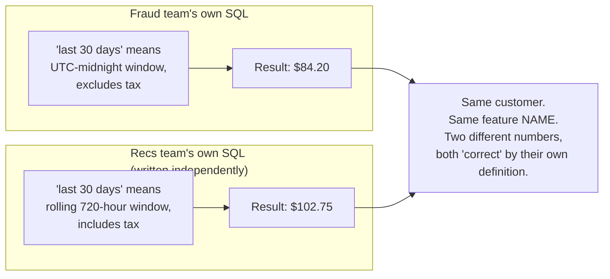

### The fix — and the analogy for the rest of this story

Stop letting every team write their own recipe from memory. Put **one feature definition** in a **shared cookbook** — a central registry — owned by one team. Everyone else reads from that same recipe card instead of writing their own.

Think of it like a professional kitchen's recipe binder: there's one card for "the house vinaigrette," and every cook on every shift uses that card, not their own half-remembered version of it.

### New problem, immediately

Wrenfield writes one shared definition for `avg_order_value_30d`. But now it has to actually run in two very different places:

- a nightly batch job for training data, and
- a real-time service for live inference.

Someone still has to *write the code* for each of those two places. Writing the same recipe down once doesn't yet guarantee both kitchens cook it the same way.

### How I'd say this in an interview

"The starting failure mode isn't a technology problem, it's an organizational one — independent teams each writing their own version of 'the same' feature, which drifts apart with zero malice and zero errors thrown. The fix is a shared, centrally-owned feature definition, which is the whole reason feature-store platforms like Uber's Michelangelo exist in the first place."

---

## Chapter 2 — One recipe card, two kitchens that don't cook it the same way

### The setup

Wrenfield builds the shared definition from Chapter 1, specifically for the fraud model: `chargeback_count_90d`.

- One engineer hand-writes the *training* version, as a Spark batch job over historical data.
- A different engineer, on a different team, hand-writes the *serving* version, as a real-time Java service that updates a running counter off the live transaction stream.

Both are implementing "the same" spec. Both believe they did it correctly.

### The moment it breaks

Six weeks after launch, the fraud model's numbers don't add up.

- Offline validation said: **91% catch rate.**
- Actual production catch rate, over the same period: **63%** `[illustrative]`.

Nobody touched the model. So what changed?

The batch job counts a chargeback the moment it's *finalized* in the ledger. The real-time service counts it the moment it's *reported* — which can be up to 5 days earlier. So at serving time, the "same" feature is systematically higher than what the model ever saw during training. The model's learned decision boundary doesn't apply cleanly to inputs shaped differently than what it trained on.

### Naming the failure mode

This is a real, named, well-documented failure mode: **training-serving skew**.

Google's own internal "Rules of Machine Learning" document (written by Martin Zinkevich, publicly published) states this directly as Rule #29 — the surest way to avoid skew is to make sure training and serving pull features through the *exact same pipeline*, not two independently-written ones. Uber's Michelangelo was built, per its own engineering blog, specifically to close this gap for production models at scale.

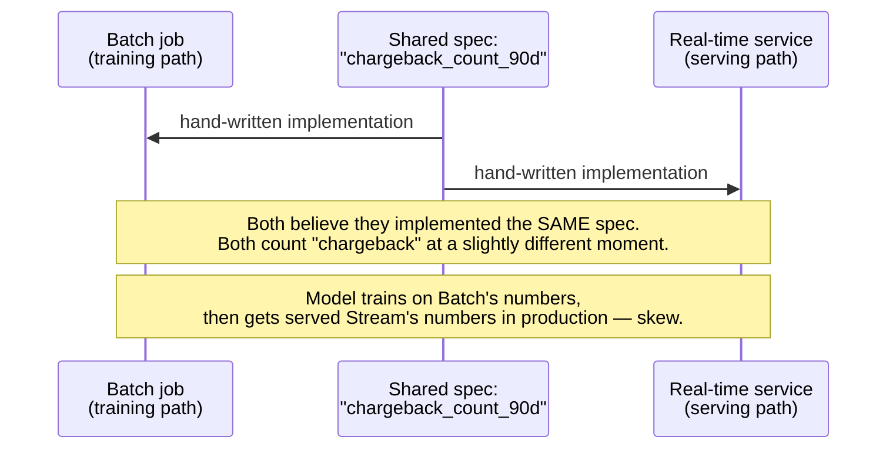

### Why did it drift, if it was "the same definition"?

The obvious question: *if it's supposedly the same definition, how did it drift?*

Because "the same definition" only ever lived as a shared *description* — in a doc or a ticket. The actual *code* was still written twice, by two people. Two independent implementations of anything, even from a crystal-clear spec, will disagree on edge cases neither person thought to ask about out loud.

### The fix

Stop hand-writing the recipe twice. Write **one declarative definition** — a single expression like "count chargebacks where ledger status = finalized, in the last 90 days" — and have it **compiled or executed** by two different engines:

- a batch engine for training,
- a streaming engine for serving.

Same recipe card, read by two kitchens with different equipment — a big industrial batch oven, and a fast real-time grill. Neither kitchen is allowed to improvise the recipe from memory anymore.

### New problem

Even with one definition compiled two ways, the *results* still have to land somewhere.

- Training needs to scan millions of historical rows and join them together.
- Serving needs one instant lookup per request.

Wrenfield puts both into the same database it already has lying around. That's the next thing that breaks.

### How I'd say this in an interview

"Training-serving skew is exactly what Google's Rules of ML calls it out as, and it's the textbook example of the fix being 'don't write it twice' — one declarative feature definition, compiled into a batch execution plan and a streaming execution plan, not two independently hand-maintained implementations that quietly disagree on edge cases."

---

## Chapter 3 — The coffee counter and the industrial kitchen

### The setup

Wrenfield's fastest option is to reuse its existing analytics warehouse — the same Postgres-based warehouse the BI team already queries for dashboards — as the one store for the shared feature definition's output, for both training and serving.

### The moment it breaks

It works fine in a demo. It falls over in production.

- The fraud model needs a feature lookup in under 10ms at inference time.
- The warehouse, built for big scans and joins, returns a single-row lookup with a measured **p99 of 800ms** `[illustrative]`.

Worse, look at Wrenfield's real traffic:

- 5,000 inference requests/sec
- ~35 features read per request
- That's `5,000 × 35 = 175,000 reads/sec` of single-row point lookups.

That volume of point lookups hammers a system designed for large analytical scans, not this. Query queues back up, and the warehouse starts timing out requests that have nothing to do with ML at all — the BI dashboards start failing too.

### Can we just tune the warehouse?

Not really. This isn't a tuning problem, it's a shape problem. A warehouse is built to scan and join large amounts of data efficiently. A low-latency point read of one row for one customer is a fundamentally different access pattern. No amount of indexing turns one into the other cleanly at this volume.

### The fix — a new analogy for the rest of this story

Split into **two purpose-built stores** for the *same* shared definition:

- A **coffee counter** — a fast key-value store. This is exactly what Feast, the open-source feature store, calls the "online store" — something like Redis or DynamoDB-shaped, a real, documented architectural choice. It holds only the *current* value per entity, and hands it back in single-digit milliseconds.
- An **industrial kitchen** — a data warehouse or Spark/Hive-style batch system. This is Feast's documented "offline store." It holds the *full history*, built for large scans and joins, with no latency pressure at all.

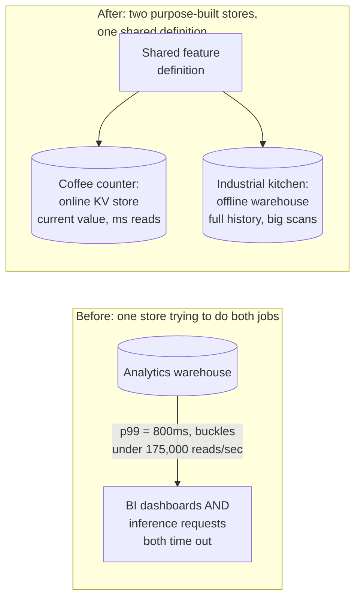

### New problem

The industrial kitchen now genuinely keeps history — exactly what training needs, to answer "what was this feature's value as of some past date."

But the *easy* way to answer that question is to just join on customer ID and grab whatever's in the table right now. That quietly answers a completely different question than the one training actually needs to ask.

### How I'd say this in an interview

"Online and offline feature needs have genuinely different load shapes — millisecond current-value point reads versus large historical scans and joins — and one store rarely serves both well. That's why Feast, the real open-source feature store, ships this exact split: a fast online store for serving, a warehouse-style offline store for training, both fed by the same shared definition."

---

## Chapter 4 — The selfie that was secretly taken today

### The setup

Wrenfield's offline kitchen now holds history. A data scientist builds a training set:

- 10 million historical transactions
- each labeled fraud or not-fraud
- each with its own date

For each row, the join fetches `chargeback_count_90d` for that customer — by just matching on customer ID and grabbing today's row in the feature table. Simple. Fast. Wrong.

### Walking through the exact failure, step by step

1. Transaction #4,481,209 happened **6 months ago**, and is labeled "fraud."
2. The naive join fetches that customer's *current* `chargeback_count_90d`. Today, that value is **3**.
3. Why is it 3? Because the fraud from *this very transaction* eventually generated a chargeback that's still inside today's 90-day window.
4. But at the actual moment of transaction #4,481,209, six months ago, that count was genuinely **0** — none of it had happened yet.
5. So the model is being handed the answer to its own question as an input feature.

The result:

- Offline evaluation looks incredible: **97% accuracy** `[illustrative]`.
- Real production accuracy on genuinely new transactions — which obviously can't have any future chargebacks yet — comes in at **68%** `[illustrative]`.

This is a specific, well-documented, sneaky form of data leakage.

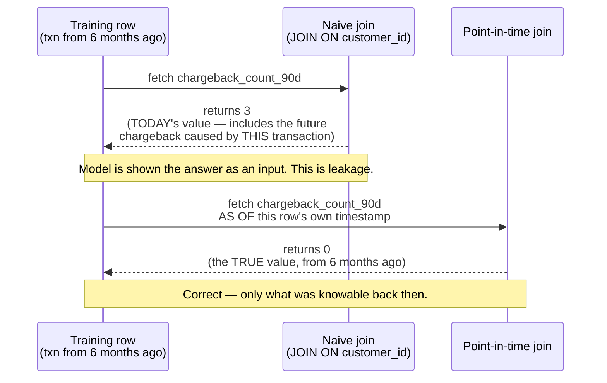

### Why did this go wrong, if the offline store legitimately has the history?

Because a plain `JOIN ... ON customer_id` doesn't know anything about time. It ignores the row's own date entirely and just grabs whatever's freshest in the table — which is always today's value, no matter how old the training row is.

### The fix

A **point-in-time correct join**. Think of it as **the photograph taken at the exact moment, not a selfie snapped today**. Every training row is anchored to its *own* timestamp, and the join fetches the feature value exactly as it stood at that moment — never a peek at anything that happened afterward.

### New problem, one layer down

To answer "what was this value six months ago," the offline store has to actually retain enough historical granularity to reconstruct that past state — every change to the feature over time, not just the newest one.

That's precisely why the online coffee counter from Chapter 3 *can't* also serve this need on its own. It correctly only keeps the current value, because serving never needs anything else — and that's exactly the property that makes it useless for point-in-time queries.

### How I'd say this in an interview

"A naive join fetches a feature's current value no matter how old the training row is — that's a documented, sneaky leakage pattern that inflates offline accuracy without ever throwing an error. The fix is a point-in-time join anchored to each row's own timestamp, and it's specifically why the offline store has to retain full feature history, not just the latest value like the online store does."

---

## Chapter 5 — The overnight pot of coffee versus the always-on tap

### The setup

Some of Wrenfield's features genuinely need to be fresh within minutes, not hours. Fraud wants `txn_count_5min` — how many transactions this customer made in the last 5 minutes.

It's currently computed by the same nightly batch job as everything else, which runs at 2am.

### The moment it breaks

- By 9am, that number is already up to **19 hours stale** `[illustrative]`.
- At 9:15am, a stolen card does **40 rapid small purchases in 10 minutes**.
- `txn_count_5min` doesn't reflect any of it until the *next* night's batch run.
- By then, the money is long gone.

### Just run the batch job more often?

The obvious question: *just run the batch job more often — every 5 minutes instead of nightly?*

That would help freshness, but it's genuinely wasteful. A full batch recompute over the entire historical customer table, every 5 minutes, just to catch a narrow, constantly-sliding 5-minute window, burns enormous compute for a tiny sliver of new information each time.

### The fix

Add a **streaming computation path** — a continuous, incremental pipeline (a Flink- or Kafka-Streams-shaped system) that executes the *same shared source definition* from Chapter 2, just compiled for a streaming engine instead of a batch one. It updates the coffee counter continuously as events arrive.

This is the always-on tap next to the overnight pot: most drinks still come from the big pot brewed once, but the handful of orders that need something poured *right now* get their own tap that never turns off.

Wrenfield finds roughly **15% of its registered features** genuinely need this sub-minute freshness `[illustrative]`. The rest stay comfortably batch.

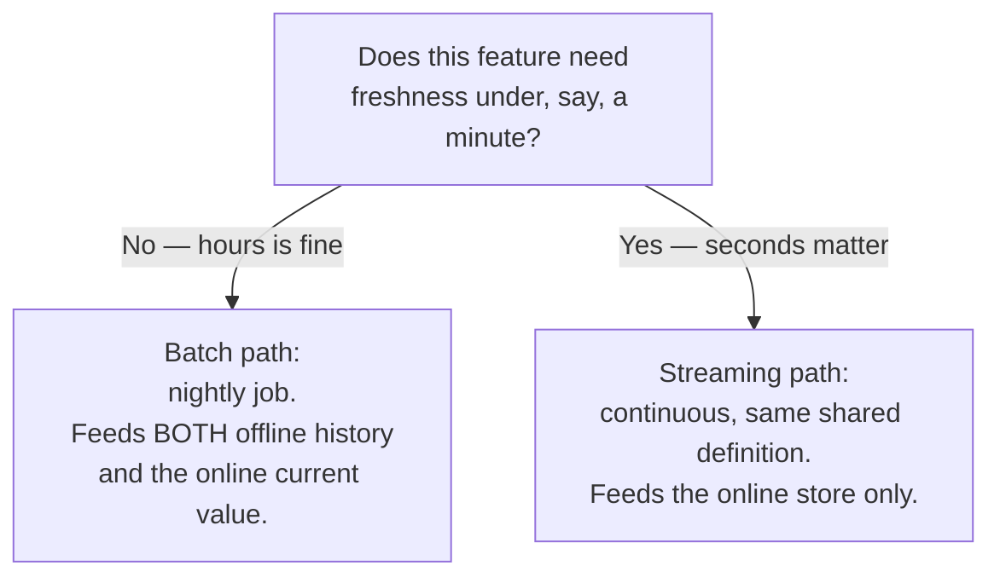

### New problem

Wrenfield now has feature definitions computed on two different cadences. But definitions still change over time.

A well-meaning engineer patches `avg_order_value_30d` to fix a currency-rounding bug. The moment that patch ships, the online coffee counter starts serving the new numbers immediately — with zero warning to anyone whose model was trained against the old ones.

### How I'd say this in an interview

"Not every feature needs streaming freshness, and defaulting everything to it is wasteful — you add a streaming path only for the subset that genuinely can't tolerate batch latency, using the exact same underlying definition, just compiled for a different engine. That's the same rolling-aggregate pattern most fraud systems already use, just generalized into shared infrastructure instead of one team's own pipeline."

---

## Chapter 6 — The recipe card that got quietly reprinted mid-shift

### The setup

Wrenfield's credit-risk team trained their buy-now-pay-later approval model three months ago, against `avg_order_value_30d` — back when it truncated cents instead of rounding them.

Someone on a different team patches the definition in place to fix that rounding bug. It's a genuinely correct fix, and they ship it the same day. The online store immediately starts returning the new, rounded numbers.

### The moment it breaks

Nobody retrains the credit-risk model. It just keeps running, now fed inputs shaped subtly differently than anything it ever saw during training.

Over the following month:

- False-approval rate for risky loans creeps from **2.1% to 3.4%** `[illustrative]`.
- No error. No alert. No obvious cause.
- It takes a post-mortem weeks later to trace it back to that one rounding patch.

### How do you fix a bug without silently breaking every model that trained on the old, buggy version?

You don't fix it in place at all. You publish it as a **new version**. Old models keep reading the old version, on purpose, until someone explicitly retrains and migrates them.

### The fix

**Feature versioning with pinned dependencies.**

Continuing the recipe-card analogy: every model pins to a specific *printed edition* of the card — v1, v2, v3. A kitchen doesn't get to quietly reprint an old edition with different instructions while someone's mid-recipe, cooking from it right now. Retiring an old edition requires first checking that nobody's still holding a copy of it.

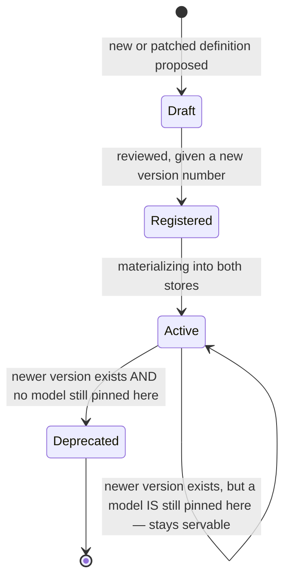

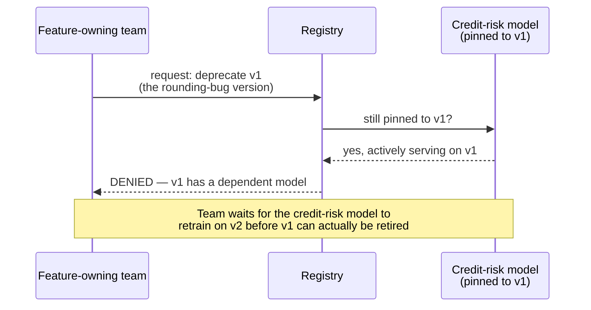

### New problem

Versioning stops *silent* breakage. But Wrenfield now has roughly **2,000 registered feature definitions**, across a dozen teams `[reusing the reference guide's own illustrative scale]`, many similarly named.

A new data scientist on the credit-risk team, needing "average order value," has no easy way to discover that 3 near-identical versions already exist in the registry. So they just write their own. This is Chapter 1's exact problem, resurfacing *inside* the very system built to prevent it.

### How I'd say this in an interview

"Silently patching a feature definition in place is exactly as dangerous as the training-serving skew from Chapter 2, just triggered by *time* instead of by two divergent implementations. The fix is explicit versioning with dependency tracking — old versions stay servable as long as any production model is pinned to them, and deprecation is a hard-gated check, not a convention people are trusted to remember."

---

## Chapter 7 — The cookbook with no index card

### The setup

An internal audit at Wrenfield finds **6 different feature definitions**, created by 6 different teams over 18 months, all computing something close to "user's average order value." None of the teams was aware the others existed `[illustrative]`.

The registry from Chapter 1 is right there, technically shared. But nobody actually looked in it before writing a new entry.

### Didn't we already fix this in Chapter 1?

Not quite. These are two different problems that look the same from a distance:

| Chapter 1's problem | Chapter 7's problem |
|---|---|
| Can two teams compute the same feature differently, and never notice? | Can a team even find out a feature already exists before they start writing one? |

A shared, *unsearchable* shelf of cookbooks is barely better than 6 private notebooks — because nobody reads the whole shelf before cooking.

### The fix

A **searchable feature catalog** on top of the registry — an actual index card system in the cookbook library, not just an unlabeled shelf. Teams search by name, tags, or owning team *before* writing anything new, and see who else already solved their problem.

This is a real, documented capability in production feature-store platforms. Feast and its commercial descendants ship exactly this kind of discovery layer, specifically because a registry without discoverability doesn't stop duplicate effort — it just relocates it.

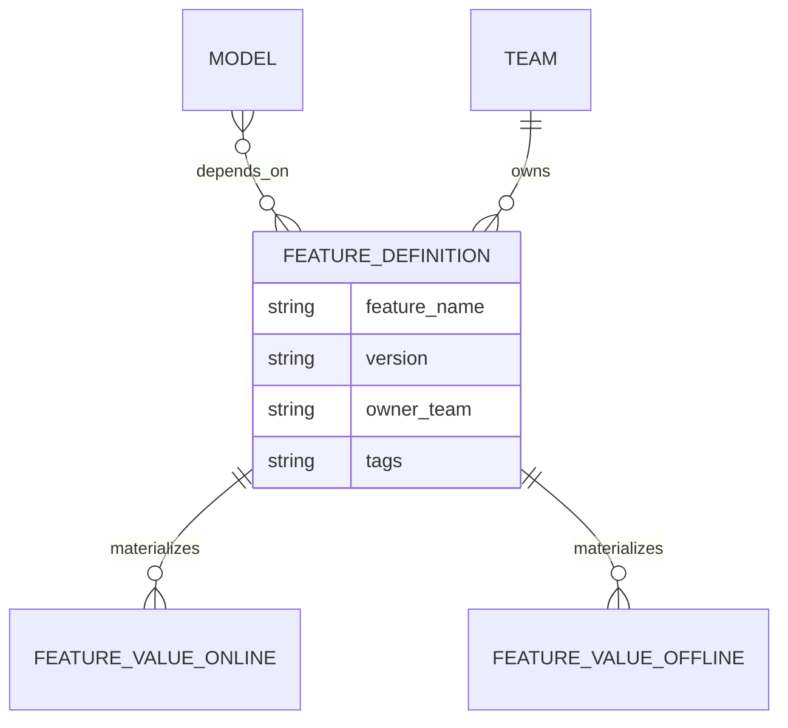

The catalog's whole job is making this graph **searchable** before someone writes a new definition — not just storing it after the fact, which is all a plain registry does.

### New problem

Discoverability works. Reuse across teams goes up, and the registry starts consolidating those 6 near-duplicates into one real definition.

But that also means far more models are now reading from the *same* handful of popular features, all hitting the same online coffee counter at once. Popularity just became a load problem.

### How I'd say this in an interview

"A shared registry stops two teams from computing the same feature *differently* — it doesn't automatically stop them from computing it *redundantly*, because nobody can reuse what they can't find. A searchable catalog is the actual fix for that, and it's a real feature production platforms like Feast build in deliberately, not an afterthought."

---

## Chapter 8 — One coffee counter, every team in line at once

### The setup

With features now genuinely shared and reused across the whole company, Wrenfield's online coffee counter gets hit from every direction simultaneously.

### Doing the math

`[reusing the reference guide's own worked capacity figure]`

- 50 models
- 100,000 aggregate inference requests/sec
- ~40 features read per request, on average

Step by step:

1. `100,000 requests/sec × 40 features/request = 4,000,000 reads/sec` landing on the online store.
2. A single online-store node tops out around **150,000 reads/sec** `[illustrative]`.
3. `4,000,000 ÷ 150,000 ≈ 27`. Wrenfield needs roughly **27 times** that one node's capacity — and it's all landing on one machine.

### How do you scale read throughput without recreating the same bottleneck?

The same answer as everywhere else in this course: don't scale one machine — split the *load* across many.

Shard the online store by entity key (`hash(customer_id) % N`), so each node only ever owns and serves its own slice of customers.

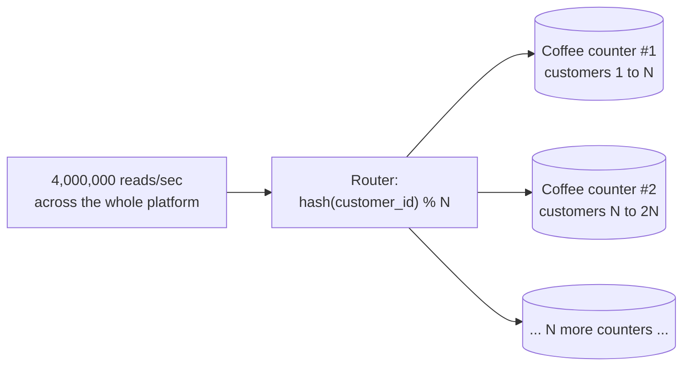

### Where this actually lands

One coffee counter, sharded across many machines by entity ID, still returning millisecond current values — this replaces the single overloaded node. It's exactly the same horizontal-scaling move used for any key-value store elsewhere in this course, just applied to feature reads specifically.

Combined with everything from Chapters 1 through 7, this is the real system:

- one shared, versioned, catalog-discoverable feature definition,
- compiled once into a batch engine and (for the features that need it) a streaming engine,
- materializing into a point-in-time-queryable offline warehouse for training,
- and a horizontally-sharded, low-latency online store for serving.

Never two hand-written implementations. Never a naive current-value join. Never a silent in-place definition change.

### Redo-the-math test — worth having ready

If Wrenfield's models get richer and average features-per-request climbs from 40 to 100:

- Old: `100,000 requests/sec × 40 features = 4,000,000 reads/sec`
- New: `100,000 requests/sec × 100 features = 10,000,000 reads/sec`

That's not a hypothetical edge case — it's a direct, computable consequence of "let's just add more features to the model." It's exactly why the online store's shard count needs headroom, the same lesson as picking partition counts with headroom in any sharded system.

### How I'd say this in an interview

"Once a feature store actually gets adopted platform-wide, the online store's read volume dwarfs everything else in raw QPS — that's exactly why it has to be sharded by entity key and scaled horizontally like any other key-value store, while the offline side stays a completely different, throughput-oriented batch problem with no latency pressure at all."

---

## What ships first, and what's a fair stretch goal

### Worth building before anything else

- A feature definition registry with basic versioning.
- An online store serving current values with low latency.
- A point-in-time join capability, even for just a small subset of feature types.

Even a limited version of Chapter 4's fix is worth more than skipping it. It's the one correctness property that can't be patched in later without re-validating every model trained in the meantime.

### Reasonable to defer — and say so out loud if asked

- **Streaming computation (Chapter 5)**: start batch-only, since it's simpler, and add streaming once a specific feature's freshness requirement actually demands it.
- **Automated cross-validation between online and offline values**, for the same entity/time. It's valuable, but the shared-definition architecture from Chapter 2 is the primary safeguard. Automated checking is a worthwhile addition once there's enough real traffic to justify the investment — not a day-one requirement.

### Genuine stretch goals — worth naming if asked "what's next"

- The searchable catalog from Chapter 7 (it only starts paying for itself once the registry has real scale).
- Automated skew detection that continuously diffs online-versus-offline computed values.
- Generalizing the streaming path into shared, self-service infrastructure any team can plug a new feature into, rather than something one team builds bespoke each time it's needed.

---

## Where the story actually lands

```mermaid
flowchart LR
    A["Ch1: 14 teams,<br/>14 versions of one feature"] -->|"fixes: one shared definition<br/>breaks: still hand-coded twice"| B["Ch2: shared spec,<br/>two divergent implementations"]
    B -->|"fixes: compile one definition twice<br/>breaks: needs somewhere to live"| C["Ch3: one store<br/>trying to do both jobs"]
    C -->|"fixes: split online/offline stores<br/>breaks: naive join grabs today's value"| D["Ch4: point-in-time joins"]
    D -->|"fixes: no future leakage<br/>breaks: batch too stale for some features"| E["Ch5: streaming path added"]
    E -->|"fixes: sub-minute freshness<br/>breaks: in-place definition changes are silent"| F["Ch6: versioning +<br/>dependency gate"]
    F -->|"fixes: no silent breakage<br/>breaks: nobody can find what exists"| G["Ch7: searchable catalog"]
    G -->|"fixes: reuse goes up<br/>breaks: one store, everyone's load"| H["Ch8: shard the<br/>online store"]
```

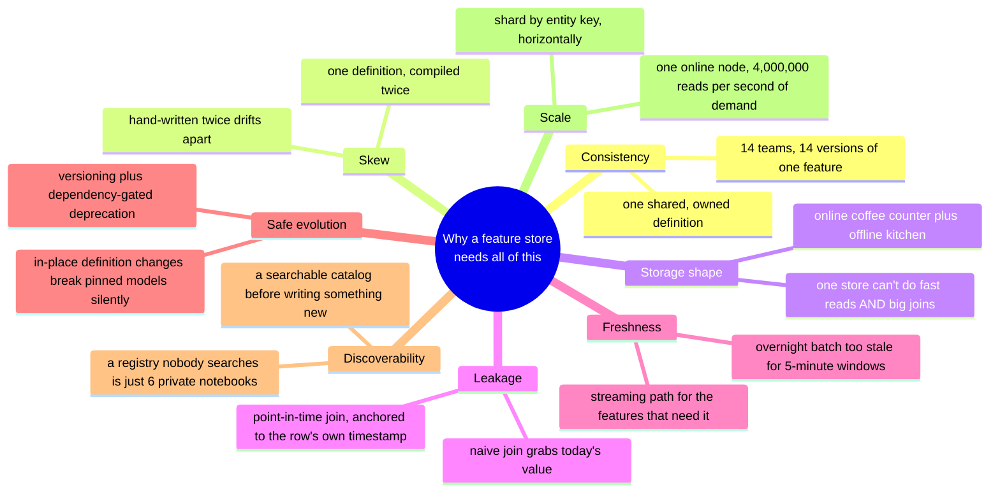

Every real feature-store design you'll walk through in an interview sits somewhere on this chain. The skill isn't reciting all eight chapters — it's knowing which ones a given requirement actually forces.

- A single-team internal tool might reasonably stop around Chapter 3.
- Anything training a model on historical labels has to reach Chapter 4.
- Anything shared across more than a couple of teams has to reach Chapters 6 and 7.

### Two things worth naming even if the interviewer never asks

1. **Sensitivity of derived features.** A feature can encode sensitive derived information — a "credit risk score" built from a dozen underlying signals is itself sensitive, even if no single input looks that way. Access control belongs on individual features and consuming models, not as one org-wide switch.
2. **Retention tension.** Keeping the offline kitchen's full history around, which Chapter 4 depends on completely, runs straight into the same data-retention and right-to-erasure tension every system with a long memory eventually hits. Worth a sentence acknowledging it, even when it isn't the focus of the question.

---

## Grill me — adversarial follow-ups

**Q1: "Couldn't code review have caught the divergence in Chapter 1, instead of building a whole registry?"**

Code review only works if a reviewer happens to know five other teams already wrote something similar — and at Wrenfield's scale, across dozens of teams, nobody has that full picture in their head. A shared, owned definition removes the need for anyone to remember anything; there's just one place the answer lives.

**Q2: "Why is 'compile one definition twice' actually safer than 'two careful engineers implementing the same spec'? Aren't both just code eventually?"**

Because with one declarative definition, an edge case like "which moment counts as the chargeback" only ever gets decided once, by whoever writes the compiler for that engine. It can't silently diverge because there's only one source of truth being interpreted, not two independent human interpretations of a written spec that might miss the same edge case differently.

**Q3: "If the warehouse in Chapter 3 was just under-provisioned, why not throw more hardware at it instead of building a second store?"**

More hardware buys you more of the same shape of performance — a warehouse tuned for scans stays bad at millisecond point reads no matter how big it is, because the problem is architectural, not capacity. Splitting into a purpose-built KV store for reads and a warehouse for scans fixes the shape of the problem, not just the size of it.

**Q4: "Point-in-time joins sound expensive — why not just accept the leakage risk and be careful during feature engineering instead?"**

Because "be careful" doesn't scale, and the failure is invisible — it inflates offline accuracy with no error thrown, so a team has to actively go looking for a problem that looks, on the surface, like a great result. Paying the compute cost for a correct point-in-time join is cheaper than shipping a model that silently fails in production for a reason nobody can explain.

**Q5: "In Chapter 5, why not just run the nightly batch job every 5 minutes instead of building a whole separate streaming pipeline?"**

Because a full batch recompute over the entire historical table, run every 5 minutes just to catch a small sliding window, is enormous wasted compute — you'd be reprocessing years of history to catch a few new rows. A streaming pipeline updates incrementally as events arrive, which is the right shape for a constantly-moving small window; batch stays the right shape for everything that doesn't need that.

**Q6: "How is dependency-gated deprecation in Chapter 6 actually enforced — is it just a policy people are supposed to follow?"**

No — it has to be a hard technical gate: every model explicitly records which feature versions it's pinned to at training time, and the deprecation action checks that list and refuses to proceed if any model is still listed against the version being retired. Making it a convention, not an enforced check, is exactly how it silently breaks again.

**Q7: "Isn't a searchable catalog in Chapter 7 just more infrastructure nobody will actually use?"**

It only works if searching the catalog is genuinely faster than writing a new feature from scratch, which is usually true once a company has thousands of registered features — the real risk isn't adoption, it's letting the catalog's search quality degrade so people stop trusting it and go back to writing their own.

**Q8: "Why shard the online store by entity key specifically, instead of by feature name?"**

Because a single inference request needs *all* of one entity's features together, right now — sharding by entity key means one request talks to one shard for everything it needs. Sharding by feature name would scatter a single request's reads across many shards, turning one fast lookup into many slower ones.

**Q9: "Given this whole story, if someone just says 'design a feature store' cold, where do you actually start?"**

Say the two things that decide almost everything downstream: does this need to guarantee consistency between training and serving for the *same* feature, and does training need point-in-time-correct historical values, not just current ones. Almost everything else — one shared definition, two purpose-built stores, versioning, a catalog — falls out of taking those two requirements seriously from the start.

**Q10: "Isn't running two stores plus a registry plus a catalog just a lot of infrastructure for what's ultimately 'look up a number'?"**

It is real, deliberate operational cost — and it's worth saying that cost out loud rather than pretending it's free. But the alternative isn't "no infrastructure," it's every team quietly paying for the Chapter 1 and Chapter 2 failures over and over, in the much more expensive currency of a model silently degrading in production for weeks before anyone traces it back to a feature that drifted.

---

## Pacing note

**If this is 60 seconds inside a bigger question:** say the recipe-card line — one shared, versioned feature definition, compiled once for batch and once for streaming, never hand-written twice — then say "materialized into an online store for millisecond serving and an offline store for point-in-time-correct training joins, with a searchable catalog so teams reuse instead of re-deriving." That's the whole shape in one breath.

**If this is the whole 15-20 minute focus:** walk the chapters in order:

1. Why duplicated computation happens at all.
2. Training-serving skew, and the one-definition-two-engines fix.
3. Why one store can't serve both online and offline needs.
4. Point-in-time joins, and why they prevent leakage.
5. Streaming, for the features that need real freshness.
6. Versioning, with dependency-gated deprecation.
7. A discoverable catalog.
8. Sharding the online store, once adoption scales up.

Don't walk all eight unprompted — follow wherever the interviewer's questions actually point, and use the skipped chapters as your "if I had more time" closer.

---

## Active recall — no answers, test yourself cold

1. What's the one-sentence reason a feature store exists at all?
2. Why did Fraud's and Recs' versions of "average order value" disagree, even though both teams were confident they were right?
3. What's the actual difference between "one shared feature definition" and "one definition compiled by two different engines" — why does Chapter 2 need the second thing, not just the first?
4. Why can't one store serve both the online read pattern and the offline join pattern well?
5. Walk through exactly why a naive `JOIN ... ON customer_id` leaks future information into a training row.
6. Why does answering a point-in-time query require the offline store to keep full history, while the online store correctly doesn't?
7. Why wasn't "just run the batch job every 5 minutes" a good enough fix for feature freshness?
8. What specific production incident does feature versioning with dependency tracking prevent?
9. What's the difference between what a registry fixes and what a catalog fixes?
10. Why does entity-key sharding make sense for the online store specifically, and not feature-name sharding?

*Spaced repetition: test this list today, again in 2-3 days, again in a week.*

---

## Cheat sheet — one line per stop on the story

| Stop | Problem | Fix |
|---|---|---|
| **Duplicated feature computation** | Independent teams reimplementing "the same" feature drift apart with no errors thrown. | One shared, centrally-owned definition. |
| **Training-serving skew** | Two hand-written implementations of one spec (batch vs. real-time) disagree on edge cases neither author thought to ask about. | Compile ONE declarative definition into both engines — never write it twice by hand. |
| **Online vs. offline store split** | Millisecond point reads and large historical scans/joins are different enough load shapes that one store rarely serves both well. | A fast KV "coffee counter" for serving, a warehouse-style "industrial kitchen" for training, both fed by the same definition. |
| **Point-in-time correct joins** | A naive join grabs today's value regardless of a training row's own date, silently leaking future information. | Anchor every join to that row's own timestamp instead — "the photograph, not the selfie." |
| **Streaming feature computation** | Batch freshness (hours) isn't enough for narrow, fast-moving windows. | Add a streaming path for the minority of features that genuinely need sub-minute freshness — same shared definition, different engine. |
| **Feature versioning** | Patching a definition in place silently reshapes the inputs an already-trained model receives. | Publish a new version instead; gate deprecation on there being no model still pinned to the old one. |
| **Feature catalog** | A shared registry nobody can search is barely better than private notebooks. | Add discoverability so teams reuse what exists instead of re-deriving it. |
| **Sharding the online store** | Platform-wide adoption turns read volume into millions of reads/sec. | Shard by entity key, so one inference request's features all live on one shard. |
| **The meta-lesson** | — | Every fix in this story buys one property (consistency, skew-resistance, storage fit, leakage-safety, freshness, safe evolution, discoverability, or scale) by spending something else. Say the trade in the same sentence you propose the fix. |

**Formula chain:**
```
online_read_QPS      = inference_QPS x avg_features_per_inference_request
offline_join_volume  = training_runs_per_day x examples_per_run x features_per_example
```

**Numbers worth having ready:**

- Online read volume is typically orders of magnitude higher in raw QPS than offline join volume, but offline joins carry the harder correctness burden (point-in-time correctness, zero tolerance for future leakage).
- Single-digit-millisecond p99 is the usual online serving budget.
- A naive current-value join is a silent failure — it inflates offline accuracy with no error thrown, which is exactly what makes it dangerous.
