# Design a Feature Store for ML — FAANG Interview Guide

> Source chapter type: ML infrastructure. This is the component that the
> [fraud detection](./56-Design-a-Fraud-Detection-System-FAANG-Guide.md) and
> [recommendation engine](./59-Design-a-Recommendation-Engine-Netflix-YouTube-FAANG-Guide.md)
> chapters both assumed existed and referenced repeatedly as "the shared feature definition." This
> chapter builds that component directly: the system that guarantees a feature is computed the
> **same way** whether it's feeding a historical training example or a live inference request —
> and, subtler and more commonly missed, that a training example's features reflect only
> information that was **actually available at that historical moment**, not information from the
> future that would leak the answer.

## Mental model

A feature store has exactly two customers with very different needs, both needing the *same*
underlying feature definitions:

1. **Training**, which needs features computed over large historical datasets, joined
   point-in-time correctly — "what was this user's 7-day transaction count **as of** the moment
   this historical training example occurred," not as of today.
2. **Serving**, which needs the *current* value of a feature, returned in milliseconds, for a
   live inference request right now.

Two problems, both already flagged as central in the fraud-detection and recommendation chapters,
solved here directly:

1. **Train/serve consistency.** If the offline (training) and online (serving) paths compute
   "the same" feature using different code, they will eventually diverge — subtly, silently, and
   without throwing any error, degrading model accuracy in production in a way that's very hard to
   detect after the fact.
2. **Point-in-time correctness ("time travel" joins).** A feature like "user's total spend in the
   last 30 days" must, for a training example dated six months ago, reflect what that total
   actually was six months ago — not what it is today. Get this wrong, and the training data
   contains information from the future relative to the label being predicted, which inflates
   offline accuracy in a way that never holds up in production — a specific, sneaky form of data
   leakage.

**The one sentence to say out loud:** *"A feature store's entire value is guaranteeing two things:
the same feature definition computes the same way whether it's feeding training or serving, and a
historical training example only ever sees feature values as they actually were at that
example's own point in time — never a peek into the future relative to what it's trying to
predict."*

**The one picture to remember forever:**

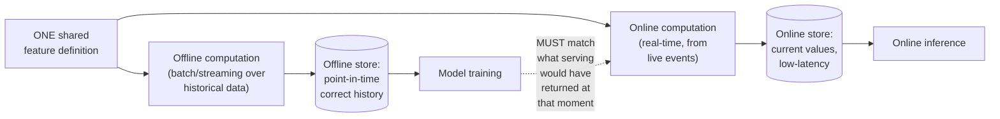

**Memory hook:** *"One definition, two materializations — offline for point-in-time-correct
history, online for current low-latency reads. If they ever compute a feature differently, the
model is quietly wrong in production."*

---

## Table of contents
[How to Identify This Topic](#how-to-identify-this-topic-in-an-interview) ·
[Interview Playbook](#interview-playbook) · [Requirements](#requirements-clarification) ·
[Capacity Estimation](#capacity-estimation-worked) · [API Design](#api-design) ·
[High-Level Architecture](#high-level-architecture) ·
[Architecture Evolution v1→v2→v3](#architecture-evolution-v1--v2--v3) ·
[End-to-End Walkthroughs](#end-to-end-request-walkthroughs) ·
[Deep Dive: Point-in-Time Correct Joins](#deep-dive-point-in-time-correct-joins) ·
[Deep Dive: Shared Feature Definitions](#deep-dive-shared-feature-definitions) ·
[Deep Dive: Online/Offline Store Trade-offs](#deep-dive-onlineoffline-store-trade-offs) ·
[Deep Dive: Feature Versioning](#deep-dive-feature-versioning) ·
[Data Model](#data-model) · [Failure Modes](#failure-modes--mitigations) ·
[Non-Functional Walkthrough](#non-functional-walkthrough) ·
[Security & Compliance](#security--compliance) · [Cost & Trade-offs](#cost--trade-offs) ·
[Wrap-Up](#wrap-up-mvp-vs-stretch) · [Golden Rules](#golden-rules) ·
[Cheat Sheet](#master-cheat-sheet)

---

## How to identify this topic in an interview

- "Design a feature store for machine learning" (or "design the infrastructure that feeds features
  to our ML models, both training and serving").
- The tell that this is specifically the feature-store chapter, not a generic ML-serving chapter:
  the interviewer emphasizes **consistency between training and serving**, or explicitly mentions
  "point-in-time correctness" — either phrase is the chapter's actual substance.
- A follow-up like "how do you make sure the model doesn't accidentally see future information
  during training" is the [point-in-time-correctness deep dive](#deep-dive-point-in-time-correct-joins)
  — the single most commonly under-appreciated mechanism in ML infrastructure interviews.

---

## Interview playbook

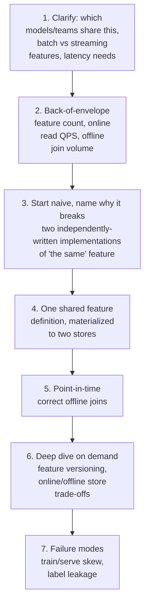

**What the interviewer is actually grading at each step:**
- Step 3: do you recognize, unprompted, that maintaining two independent implementations of "the
  same" feature is how skew gets introduced, even with the best intentions — and propose a single
  shared definition as the fix?
- Step 5: do you know *why* a naive join ("just join on user ID, take the latest value") leaks
  future information into historical training examples, and can you describe the point-in-time
  join mechanism that prevents it?
- Step 6: do you distinguish the online store's low-latency point-read requirement from the
  offline store's large-scan/join requirement as two genuinely different storage problems needing
  different technology, not one store serving both adequately?

---

## Requirements clarification

### Functional

| # | Requirement | Notes |
|---|---|---|
| F1 | Define a feature once, compute it consistently for both training and serving | The core guarantee this whole system exists to provide |
| F2 | Serve the current value of any feature with low latency for online inference | The serving-side requirement |
| F3 | Provide point-in-time-correct historical feature values for training dataset generation | The training-side requirement, and the harder one to get right |
| F4 | Support both batch-computed and streaming-computed features | Different features have different natural computation cadences (e.g. "total lifetime spend" batch, "transactions in the last 5 minutes" streaming) |
| F5 | Version feature definitions so models can pin to a specific version as they evolve | Prevents a feature-definition change from silently breaking a model that was trained against the old definition |

### Non-functional

| Requirement | Target | Why this number |
|---|---|---|
| Online read latency (p99) | Single-digit milliseconds | Feeds inference paths with their own strict latency budgets (e.g. the fraud-detection chapter's tens-of-milliseconds total budget) |
| Point-in-time join correctness | Absolute — zero tolerance for future-information leakage into historical training examples | This is a correctness property, not a performance one; getting it wrong silently inflates offline model metrics in a way that never holds up in production |
| Train/serve consistency | Enforced by construction (shared definitions), not just by convention or code review | The entire reason this system exists as dedicated infrastructure rather than "just be careful" |
| Feature freshness (online) | Depends on the feature's own computation cadence — seconds for streaming features, hours for batch ones | Not a single freshness bar — different features have genuinely different, explicitly stated freshness |
| Backward compatibility on feature versioning | A model must be able to keep using the feature-definition version it was trained against, even after the definition evolves | Prevents an unrelated feature-definition update from silently breaking a model already in production |

**Clarifying questions worth asking the interviewer up front — and what each answer changes:**

| Question | If the answer is... | ...then this changes |
|---|---|---|
| "Are features primarily batch-computed, streaming-computed, or both?" | Both, depending on the feature | Confirms the architecture needs both a batch and a streaming computation path feeding the same store, not just one |
| "How many teams/models will share this feature store?" | Many, across the organization | Confirms feature versioning and a shared registry/catalog (so teams can discover and reuse existing features rather than redefining similar ones) become real requirements, not optional polish |
| "What's the online serving latency budget for a feature read?" | Single-digit milliseconds | Confirms the online store needs to be a low-latency key-value store, ruling out anything requiring a scan or join at read time |
| "Do any features need to support 'time travel' for backtesting or historical analysis, beyond just generating training sets?" | Yes | Confirms the offline store's point-in-time query capability needs to be a general-purpose, queryable capability, not a one-off training-set-generation script |

**Say this out loud in the interview:** *"The entire value of a feature store, versus every team
just computing features themselves, is that it guarantees consistency between training and
serving by construction — through one shared definition materialized two ways — rather than
relying on everyone remembering to keep two independent implementations in sync."*

---

## Capacity estimation, worked

```
Given (illustrative, a mid-size ML platform serving multiple teams):
  Distinct features registered                    = 2,000
  Models actively using the feature store          = 50
  Average features per model                        = 40

Online serving load:
  Inference requests/sec, aggregate across all
    models                                            = 100,000 QPS
  Feature reads per inference request (avg)           = 40
  Online feature-store read QPS                        = 100,000 x 40 = 4,000,000 reads/sec
  -> a very large number, dominated entirely by ONLINE serving reads, not training -- this
     single figure is why the online store must be a purpose-built, horizontally-scalable,
     low-latency key-value store, not a general-purpose database repurposed for this load.

Offline training-set generation:
  Training runs/day, across all models (retraining
    cadence varies by model)                           = ~50
  Historical examples per training run                  = ~10,000,000
  Features joined per example                            = 40
  Offline point-in-time joins per day                     = 50 x 10,000,000 x 40
                                                             = 20,000,000,000 (20 billion)
  -> a huge number too, but this is BATCH work with no latency requirement -- it runs on a
     schedule (e.g. overnight), tolerates hours of runtime, and is a throughput-oriented
     distributed-compute problem (e.g. a big-data join engine), completely different in
     character from the online store's latency-critical point-read load.

Streaming feature computation load:
  Features computed from a live event stream (e.g.
    "transactions in the last 5 minutes")               = ~300 of the 2,000 total features
  Event volume feeding these computations                 = similar order of magnitude to the
                                                              fraud-detection chapter's own
                                                              feature-computation load, since
                                                              many of these ARE those features
  -> reuses the exact same rolling-aggregate stream-processing pattern from the fraud-detection
     chapter -- this system generalizes that pattern into shared, multi-team infrastructure
     rather than each model owning its own bespoke streaming pipeline.
```

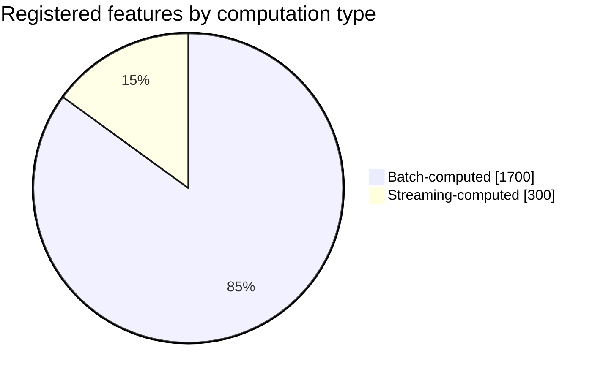

Only a minority of features need streaming computation at all — reserving the more complex,
always-on streaming path for the subset that genuinely needs sub-minute freshness, not defaulting
every feature to it.

**Redo-the-chain test:** if average features per model rises from 40 to 100 (richer models),
online read QPS scales proportionally to 10 million/sec — a direct, computable cost of feature
richness, the same lesson as the fraud-detection chapter's own capacity math, generalized here
across all models sharing the platform rather than one system's own feature set.

**The number worth memorizing:** online serving read volume is typically orders of magnitude
higher than offline training-join volume in raw QPS terms, but offline joins are individually far
more complex (point-in-time correctness) — the two paths have fundamentally different scaling
profiles and correctness requirements, which is exactly why they're built as two different
materializations of one shared definition, not one store.

---

## API design

### Feature definition registration

```json
{
  "featureName": "user_txn_count_1h",
  "version": "v3",
  "computationType": "STREAMING",
  "sourceDefinition": "count(transactions WHERE user_id = ? AND ts > now() - 1h)",
  "owner": "fraud-team"
}
```

### `GET /v1/online/features?entityId=u_881&features=user_txn_count_1h,avg_order_value_30d`
(serving path)

```json
{
  "entityId": "u_881",
  "features": {
    "user_txn_count_1h": { "value": 6, "computedAt": "2026-07-24T18:00:03Z", "version": "v3" },
    "avg_order_value_30d": { "value": 142.50, "computedAt": "2026-07-24T14:00:00Z", "version": "v1" }
  }
}
```

### `POST /v1/offline/training-set` (training path)

```json
{
  "entityColumn": "user_id",
  "timestampColumn": "label_event_timestamp",
  "features": ["user_txn_count_1h", "avg_order_value_30d"],
  "spineTable": "historical_labels_2026Q2"
}
```

Returns a joined dataset where every row's feature values are point-in-time correct **as of that
row's own `label_event_timestamp`** — never the current, present-day value.

| Field | Notes |
|---|---|
| `computedAt` / `version` | Every online feature read is tagged with when it was computed and which definition version produced it — the same explicit-attribution discipline as the audit fields elsewhere in this course, here supporting debugging of model behavior back to specific feature values |
| `spineTable` / `timestampColumn` | The "spine" of historical label events the point-in-time join is anchored against — this is the mechanism that makes the offline join correct, detailed in its own deep dive |

**The one sentence worth saying about the API surface:** *"The offline training-set API takes a
timestamp column from the caller's own historical label data, not the current time — that's the
whole point-in-time correctness contract made concrete in the API shape itself."*

---

## High-level architecture

### Architecture evolution (v1 → v2 → v3)

**v1 — every model computes its own features independently:**

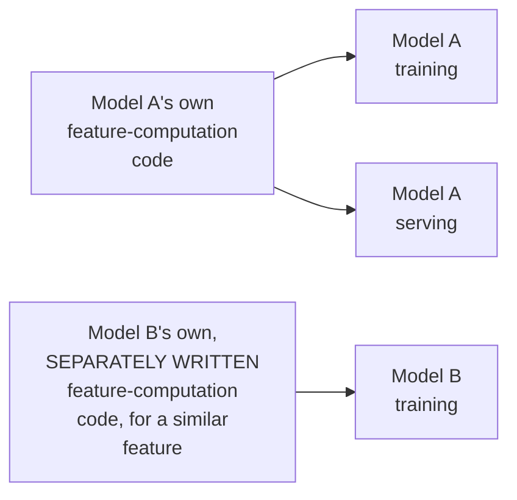

**Why it breaks:** duplicated engineering effort across every team building similar features from
scratch, and — critically — each team's own training and serving code for "the same" feature can
independently drift apart over time, the exact train/serve skew failure mode flagged repeatedly in
earlier chapters, multiplied across every team doing this independently instead of once, correctly,
in shared infrastructure.

**v2 — a shared feature store, but one store trying to serve both online and offline needs:**

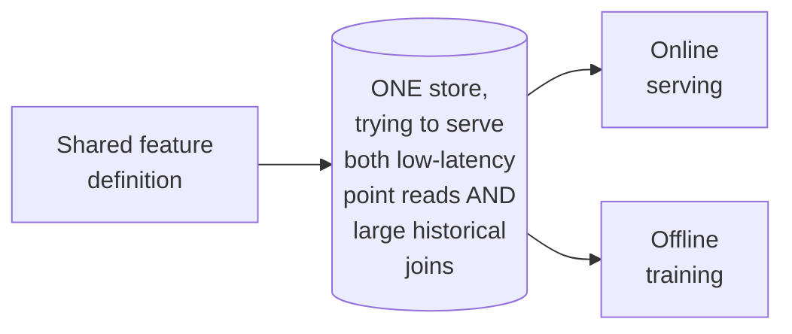

**Why it breaks:** a single store optimized for low-latency point reads (what serving needs) is
generally poorly suited for large-scale historical scans/joins (what training needs), and vice
versa — trying to serve both well with one storage technology tends to compromise both, per the
very different load profiles established in the capacity estimate.

**v3 — the real system: one shared definition, two purpose-built materializations:**

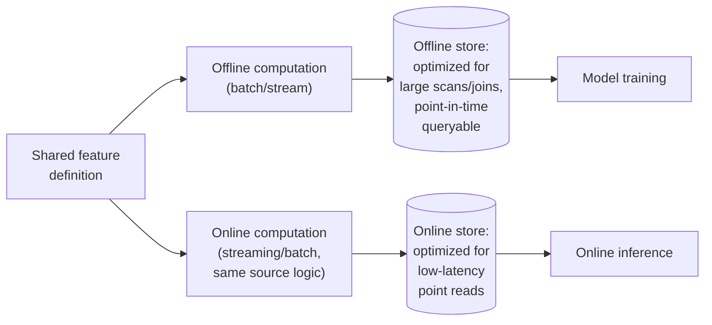

**What v3 fixes, one line each:** a single shared definition (already the goal since v1's
failure) eliminates duplicated, drift-prone implementations; and splitting into two
purpose-built stores — one for offline scans/joins, one for online point reads — lets each be
optimized for its own genuinely different load profile, while both are guaranteed to reflect the
same underlying feature logic.

---

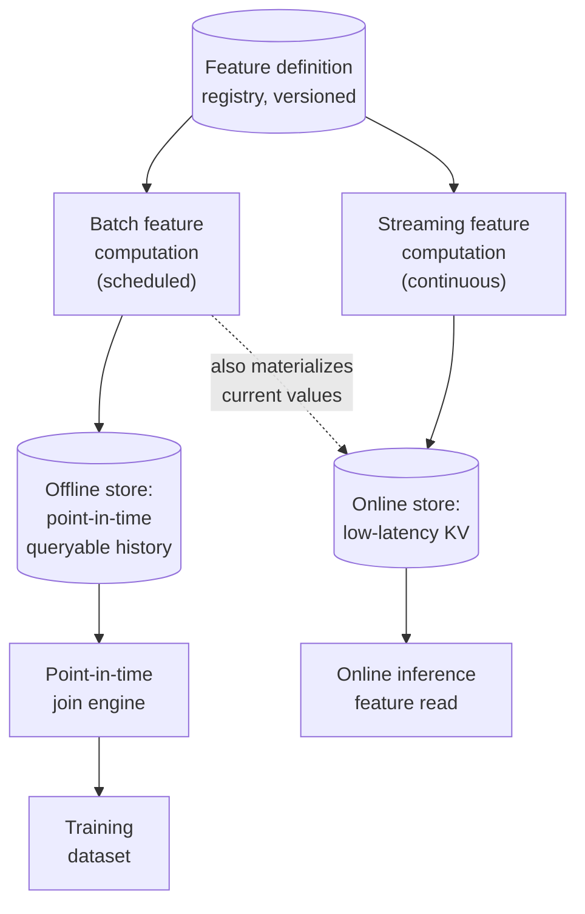

| Component | Role |
|---|---|
| Feature definition registry | The single source of truth for what a feature means, versioned — every computation path (batch, streaming) implements against this shared definition |
| Batch feature computation | Scheduled jobs computing features over historical data, writing to the offline store — and often also writing current values into the online store for features that don't need sub-minute freshness |
| Streaming feature computation | Continuous computation for features needing near-real-time freshness (reusing the fraud-detection chapter's rolling-aggregate pattern), writing to the online store |
| Point-in-time join engine | The offline store's core capability — joins a historical "spine" of labeled examples against feature history, respecting each example's own timestamp |

---

## End-to-end request walkthroughs

### Walkthrough 1 — online inference read

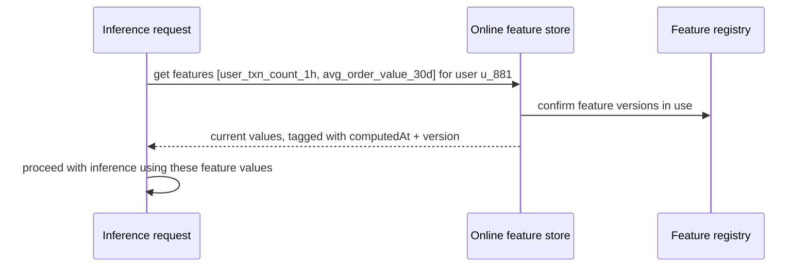

### Walkthrough 2 — generating a point-in-time-correct training set

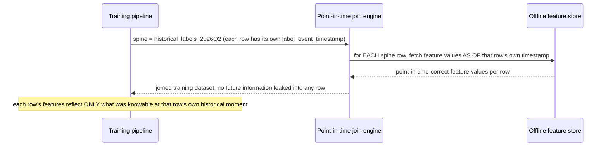

Walkthrough 2 is the concrete mechanism behind the point-in-time-correctness requirement — every
row's join is anchored to that row's *own* timestamp, not a single global "current" join, which is
precisely what a naive `JOIN ... ON user_id` (with no timestamp awareness) would get wrong.

### Walkthrough 3 — a feature-definition deprecation is blocked by a dependent model

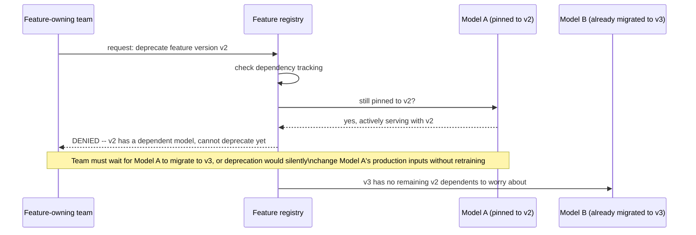

This is the concrete enforcement behind the [feature-versioning deep dive](#deep-dive-feature-versioning)'s
dependency-tracking requirement — deprecation is a hard-gated action, not an informal convention.

---

## Deep dive: point-in-time correct joins

The single most commonly under-appreciated mechanism in ML infrastructure interviews.

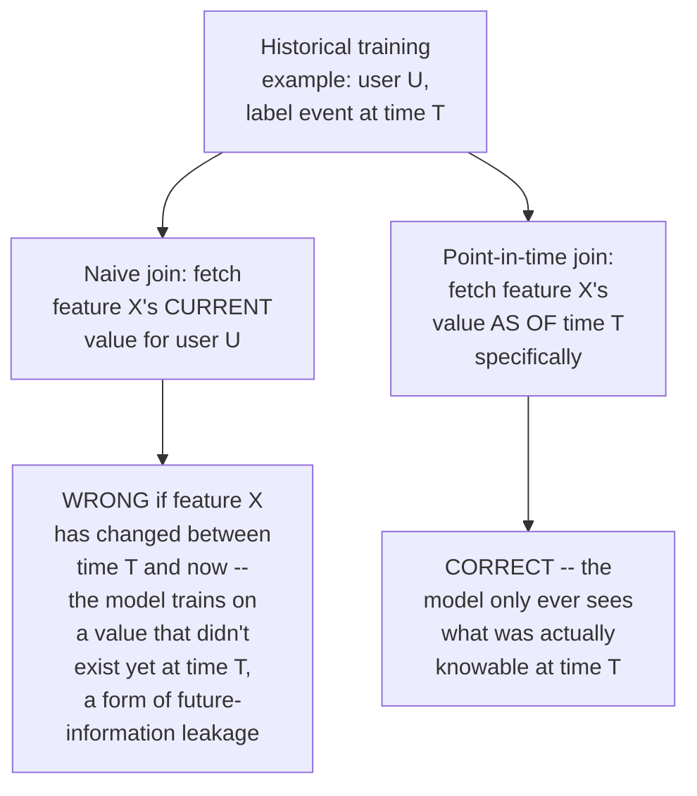

**Concrete example worth having ready to narrate:** a fraud model trains on a transaction from six
months ago, labeled "fraud." If the point-in-time join naively fetches "this user's current total
chargeback count" (which, six months later, might already include the chargeback resulting from
*this very transaction*), the model is effectively being shown the answer as an input feature —
offline accuracy looks great, and it's entirely an artifact of leaked future information that
won't exist at real inference time for a genuinely new transaction.

**Why this requires the offline store to keep feature *history*, not just current values:**
answering "what was this value as of six months ago" requires the offline store to retain
enough historical granularity to reconstruct that past state — a store that only ever tracks
the current value (as the online store legitimately does, since serving never needs history)
cannot support point-in-time joins at all, which is a large part of why the two stores are
architecturally distinct.

**Interview cheat-sheet:** *"A naive join fetches a feature's current value regardless of a
training example's own historical timestamp — this leaks future information into training data
in a way that inflates offline accuracy without ever showing up as an error, and it's specifically
why the offline store must retain feature history, not just current values."*

---

## Deep dive: shared feature definitions

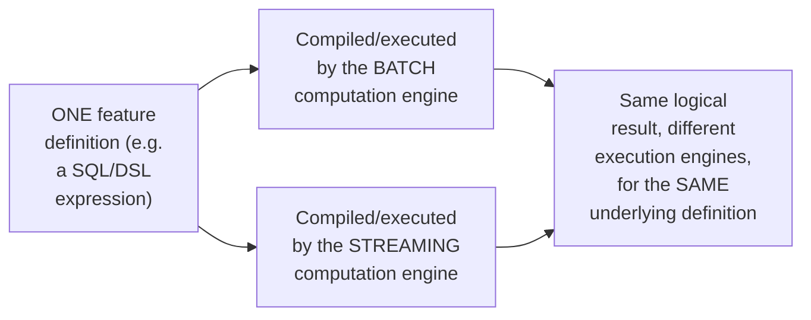

**Why "same definition, different execution engines" is achievable and not a contradiction:** a
declarative feature definition (e.g., a windowed aggregation expression) can, in a well-designed
feature-store platform, be compiled down to both a batch query plan and a streaming/incremental
execution plan from the *same source specification* — this is exactly the mechanism that prevents
the "two independently-written implementations of the same feature" failure mode from v1, since
there's only ever one specification to maintain, even though two different runtimes execute it.

**Interview cheat-sheet:** *"The fix for train/serve skew isn't 'try hard to keep two
implementations in sync' — it's making sure there's only ever ONE implementation (a shared,
declarative definition), compiled or executed differently for batch versus streaming contexts,
never two independently-maintained versions of 'the same' logic."*

---

## Deep dive: online/offline store trade-offs

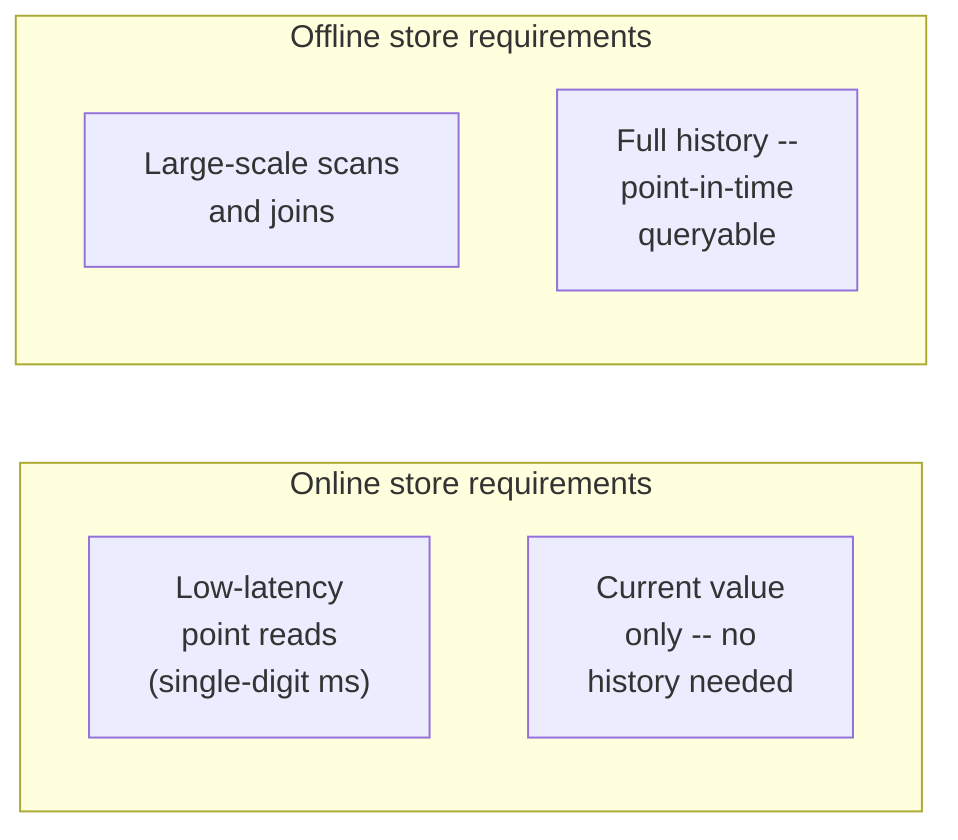

**Why one storage technology rarely serves both well:** a key-value store tuned for fast point
reads typically isn't efficient for large historical scans and point-in-time joins across millions
of rows; a data-warehouse-style store tuned for large joins typically can't hit single-digit-
millisecond point-read latency at high QPS. The two requirement sets are different enough that
purpose-built technology on each side (per the v3 architecture) consistently outperforms a single
compromise store trying to do both.

**Interview cheat-sheet:** *"Online and offline feature stores have genuinely different load
profiles — low-latency current-value point reads versus large-scale point-in-time historical
joins — and reaching for two purpose-built stores under one shared definition, rather than one
store trying to serve both, is the standard, correct answer, not redundant infrastructure."*

---

## Deep dive: feature versioning

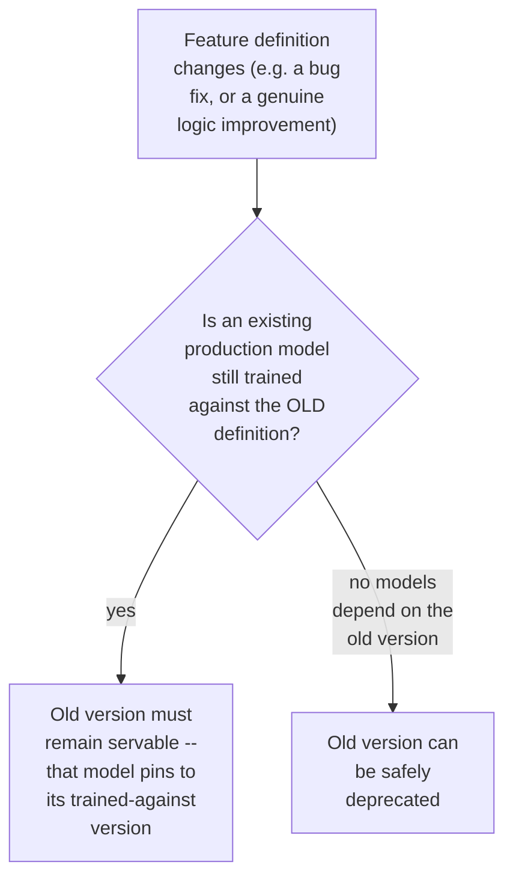

**Why silently updating a feature definition in place is dangerous:** a model in production was
trained against a specific historical realization of a feature's logic — if the underlying
definition changes and the online store starts returning values computed by the new logic
without the model being retrained, the model now receives inputs subtly different from what it
learned to interpret, again a form of silent, hard-to-detect production degradation, structurally
similar to train/serve skew but caused by an unversioned definition change instead of two
divergent implementations.

**Interview cheat-sheet:** *"Feature definitions need explicit versioning, with old versions
remaining servable as long as any production model depends on them — silently changing a
definition in place risks the exact same kind of silent model degradation as train/serve skew,
just triggered by time rather than by two independently-written implementations."*

---

## Data model

**Feature definition lifecycle:**

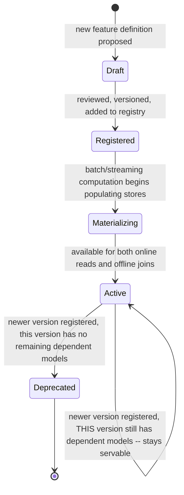

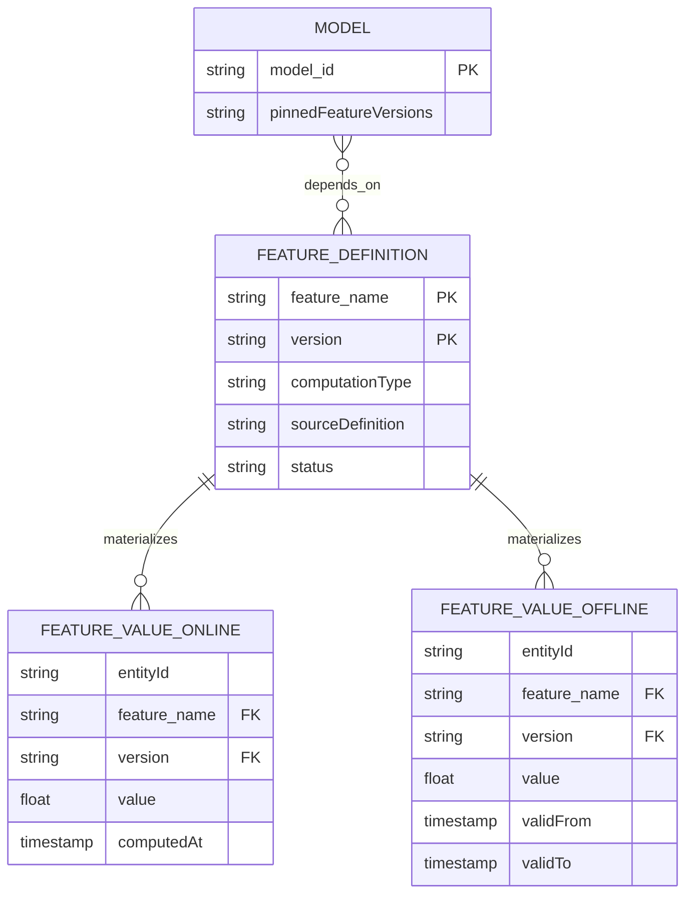

| Table | Storage choice & why |
|---|---|
| `FeatureValueOnline` | Low-latency key-value store, current value only, per the online/offline trade-off deep dive |
| `FeatureValueOffline` | A store supporting efficient range/point-in-time queries (`validFrom`/`validTo` per value), enabling the point-in-time join engine to reconstruct historical state |
| `Model.pinnedFeatureVersions` | The mechanism behind safe feature-definition evolution — a model explicitly records which versions it was trained against |

---

## Failure modes & mitigations

| Failure mode | Impact | Mitigation |
|---|---|---|
| **Batch and streaming computation paths for "the same" feature drift apart despite sharing a definition** (e.g. a bug in how one execution engine compiles the shared definition) | Train/serve skew reappears even with shared-definition infrastructure in place | Periodically validate online and offline computed values against each other for the same entity/time where both are available, as an automated consistency check, not just a one-time design guarantee |
| **A naive point-in-time join accidentally uses "now" instead of the spine row's own timestamp** (an implementation bug in the join engine) | Silent future-information leakage, inflating offline model metrics | Automated tests validating that point-in-time joins never return a feature value with a timestamp later than the spine row's own label timestamp |
| **A feature-definition version is deprecated while a model still depends on it** | The dependent model breaks or silently receives wrong inputs | Enforce dependency tracking (`Model.pinnedFeatureVersions`) as a hard gate on deprecation, not an informal convention |
| **Online store becomes a latency bottleneck under real inference QPS** | Every model's inference latency degrades, a platform-wide impact similar to the API-gateway chapter's shared-infrastructure risk | Shard the online store by entity key, scale horizontally — the same standard key-value-store scaling approach used elsewhere in this course |

---

## Non-functional walkthrough

**Scaling the online store is a standard low-latency key-value-store scaling problem**, sharded by
entity ID, similar in shape to the fraud-detection chapter's own online feature store, just
generalized to serve many models/teams instead of one system.

**Scaling the offline store and its point-in-time join engine is a large-scale batch/distributed-
compute problem**, tolerant of hours-long runtimes and optimized for throughput over latency —
architecturally closer to a data-warehouse/big-data-join system than to the online store.

**Consistency between online and offline paths for "the same" feature is the central correctness
property of this entire system** — enforced by construction (one shared definition) rather than
purely by testing, though automated cross-validation (per the failure-modes table) is a valuable
additional safeguard, not a substitute for the shared-definition architecture itself.

---

## Security & compliance

- **Feature values can encode sensitive derived information** (e.g. a "financial risk score"
  feature derived from many underlying signals) — access control on feature reads should be
  scoped per feature and per consuming model/team, not organization-wide by default.
- **Point-in-time historical data retention** (needed for the offline store's core capability) has
  its own data-retention and right-to-erasure implications if any underlying features derive from
  personal data — the same tension noted in the Google Photos and fraud-detection chapters between
  a system's functional need for history and privacy-driven retention limits.
- **Feature provenance/lineage** (which raw data sources and computation logic produced a given
  feature) supports both debugging and, in regulated contexts, explaining a model's inputs during
  an audit — worth naming as a real, non-purely-technical requirement in some domains.

---

## Cost & trade-offs

**Maintaining two purpose-built stores (online + offline) trades infrastructure/operational
complexity for both stores being well-suited to their genuinely different load profiles** — the
alternative (one compromise store) tends to underperform on both dimensions simultaneously, per
the online/offline trade-offs deep dive.

**Point-in-time join correctness costs real offline compute** (retaining and querying full feature
history is more expensive than a simple current-value join) — a cost worth paying given the
alternative is silently leaked, invalid training data that undermines the entire point of
training a model in the first place.

---

## Wrap-up: MVP vs. stretch

**In scope for an MVP:**
- A feature definition registry with basic versioning.
- An online store serving current feature values with low latency.
- A basic point-in-time join capability for offline training-set generation, even if initially
  limited to a subset of feature types.

**Explicitly out of scope for an MVP:**
- Streaming feature computation — start with batch-computed features only (simpler), add
  streaming computation for features that genuinely need sub-minute freshness once that
  requirement is confirmed, reusing the fraud-detection chapter's stream-processing pattern.
- Automated online/offline consistency validation — start with the shared-definition architecture
  as the primary safeguard, add automated cross-validation once the platform has enough real usage
  to make it worth the investment.

**Stretch goals, worth naming if asked "what's next":**
1. **Streaming feature computation**, generalizing the fraud-detection chapter's rolling-aggregate
   pattern into shared, multi-team infrastructure.
2. **Automated train/serve consistency validation**, continuously comparing online and offline
   computed values for overlapping entities/times.
3. **A feature catalog/discovery UI**, letting teams search existing features before defining a
   near-duplicate one — a real organizational-efficiency feature at platforms with many teams and
   thousands of registered features.

---

## Golden rules

- **One shared feature definition, materialized to two purpose-built stores** — never two
  independently-written implementations of "the same" feature, which is how train/serve skew gets
  introduced even with good intentions.
- **Point-in-time joins must anchor to each historical example's own timestamp**, never to "now" —
  a naive current-value join leaks future information into training data, silently inflating
  offline accuracy in a way that never holds up in production.
- **Online and offline stores have genuinely different load profiles** (low-latency current-value
  point reads vs. large-scale point-in-time historical joins) and should be purpose-built
  separately, not served by one compromise store.
- **Feature definitions need explicit versioning with dependency tracking** — silently changing a
  definition in place can break or silently degrade any model still trained against the old
  version.
- **This is infrastructure other chapters in this course already assumed existed** — the
  fraud-detection and recommendation-engine chapters both referenced "one shared feature
  definition" as the fix for their own train/serve-skew risk; this chapter is where that
  component actually gets built.

---

## Master cheat sheet

**One-liners:**
- A feature store's entire value proposition is guaranteeing train/serve consistency by
  construction (one shared definition) and point-in-time correctness for training data — not new
  storage technology for its own sake.
- Point-in-time joins anchor to each historical example's own timestamp, never to the current
  time — this is what prevents future-information leakage into training data.
- Online (low-latency current-value point reads) and offline (large-scale point-in-time historical
  joins) stores have different enough load profiles to warrant separate, purpose-built
  technology under one shared definition.
- Feature-definition versioning with explicit dependency tracking prevents an unrelated definition
  change from silently breaking or degrading a model still trained against an older version.
- This chapter builds the exact infrastructure the fraud-detection and recommendation-engine
  chapters both assumed already existed when they said "use one shared feature definition."

**Formula chain:**
```
online_read_QPS         = inference_QPS x avg_features_per_inference_request
offline_join_volume      = training_runs_per_day x examples_per_run x features_per_example
```

**Numbers:** online feature-store read volume is commonly orders of magnitude higher in raw QPS
than offline join volume, but offline joins carry the harder correctness burden (point-in-time
correctness) · single-digit-millisecond online read latency is the typical serving-side budget ·
point-in-time join correctness is a zero-tolerance correctness property, not a performance
trade-off — getting it wrong silently inflates offline model metrics with no error thrown.
