# Design a Code Execution Engine (LeetCode/Replit-style) — FAANG Interview Guide

> Source chapter type: sandboxed multi-tenant execution. Distinct from
> [the AI Code Assistant guide](./45-Design-an-AI-Code-Assistant-FAANG-Guide.md), which is about
> *suggesting* code — this chapter is about **actually running arbitrary, untrusted, user-submitted
> code**, safely, thousands of times a day, across many programming languages, without one user's
> submission being able to read another's data, exhaust the host machine's resources, or escape
> its sandbox entirely. The central tension is **isolation strength versus cold-start latency** —
> the safest sandboxes are the slowest to start, and a code-execution product needs both.

## Mental model

A user submits code — a LeetCode solution, a Replit script — and expects output back in a couple
of seconds. That code is, by definition, **untrusted**: it could be a fork bomb, an infinite loop,
an attempt to read another tenant's files, or a deliberate attempt to escape whatever sandbox is
running it and reach the host machine. Three genuinely hard problems:

1. **Sandboxing/isolation strength.** The spectrum runs from a plain OS process (fast, weak
   isolation) through containers (moderate isolation, moderate speed) to microVMs like gVisor/
   Firecracker (strong isolation, closer to true VM-level separation, but slower to start) — and
   the right choice depends on how much you trust the code you're running, which for
   user-submitted code is "not at all."
2. **Resource limits that actually hold.** CPU time, memory, process count, and network access all
   need hard caps — an infinite loop or a fork bomb must be killed automatically, not rely on the
   submitted code behaving itself.
3. **Cold-start latency versus isolation strength, and multi-language support on top of both.**
   A fresh, from-scratch sandboxed environment for every submission is the safest default but can
   take real time to spin up — pre-warmed pools of ready-to-use sandboxes (one pool per supported
   language) trade some resource overhead for consistently fast execution start.

**The one sentence to say out loud:** *"Every submission is untrusted code by default — the
design question is which point on the isolation-strength-versus-startup-latency spectrum is right
for this product, and pre-warmed sandbox pools per language are what let you get both."*

**The one picture to remember forever:**

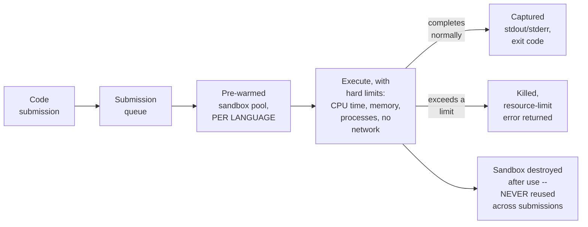

**Memory hook:** *"Pre-warm sandboxes per language to kill cold-start latency, enforce hard
resource limits that don't rely on the code behaving, and destroy the sandbox after every single
submission — never reuse one across users or even across two submissions from the same user."*

---

## Table of contents
[How to Identify This Topic](#how-to-identify-this-topic-in-an-interview) ·
[Interview Playbook](#interview-playbook) · [Requirements](#requirements-clarification) ·
[Capacity Estimation](#capacity-estimation-worked) · [API Design](#api-design) ·
[High-Level Architecture](#high-level-architecture) ·
[Architecture Evolution v1→v2→v3](#architecture-evolution-v1--v2--v3) ·
[End-to-End Walkthroughs](#end-to-end-request-walkthroughs) ·
[Deep Dive: Sandboxing Technology Spectrum](#deep-dive-sandboxing-technology-spectrum) ·
[Deep Dive: Resource Limits That Actually Hold](#deep-dive-resource-limits-that-actually-hold) ·
[Deep Dive: Pre-Warmed Pools & Cold Start](#deep-dive-pre-warmed-pools--cold-start) ·
[Deep Dive: Output Streaming vs. Batch](#deep-dive-output-streaming-vs-batch) ·
[Data Model](#data-model) · [Failure Modes](#failure-modes--mitigations) ·
[Non-Functional Walkthrough](#non-functional-walkthrough) ·
[Security & Compliance](#security--compliance) · [Cost & Trade-offs](#cost--trade-offs) ·
[Wrap-Up](#wrap-up-mvp-vs-stretch) · [Golden Rules](#golden-rules) ·
[Cheat Sheet](#master-cheat-sheet)

---

## How to identify this topic in an interview

- "Design a code execution/judge system (like LeetCode, HackerRank, or Replit)."
- The tell that this is a security/isolation-focused infrastructure chapter, not a generic
  job-queue chapter: the interviewer emphasizes that the code being run is **untrusted** —
  that single word should immediately shift the conversation to sandboxing and resource limits.
- A follow-up like "how do you make this feel fast despite needing strong isolation" is the
  [pre-warmed-pools deep dive](#deep-dive-pre-warmed-pools--cold-start) — the concrete resolution
  to the isolation-versus-latency tension.

---

## Interview playbook

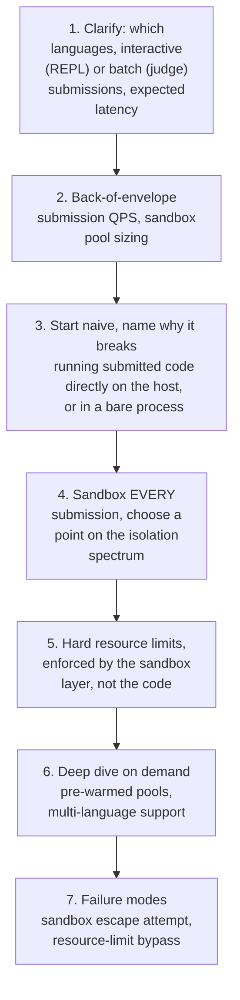

**What the interviewer is actually grading at each step:**
- Step 3: do you recognize, unprompted, that submitted code is untrusted by default and running it
  directly (even in a plain OS process with no isolation) is disqualifying, not just risky?
- Step 4: do you know the actual isolation-technology spectrum (process → container → microVM) and
  can you place a reasonable default point on it for this specific product's trust/latency needs?
- Step 5: do you know that resource limits must be enforced by the sandboxing layer itself
  (cgroups, VM-level limits) rather than trusted to the executed code — an infinite loop doesn't
  politely respect a "please stop after 5 seconds" comment?

---

## Requirements clarification

### Functional

| # | Requirement | Notes |
|---|---|---|
| F1 | Accept code submissions in multiple languages and execute them, returning output/results | The core function |
| F2 | Enforce hard limits on CPU time, memory, and process count per execution | Non-negotiable given untrusted code |
| F3 | Prevent submitted code from accessing the network, the host filesystem, or other submissions' data | The isolation guarantee |
| F4 | Support both batch-style submissions (run once, return final output — a coding judge) and interactive sessions (a REPL, streaming output as it's produced) | Two different execution/output models |
| F5 | Return a clear, structured error for resource-limit violations (timeout, memory exceeded) distinct from the submitted code's own runtime errors | Users need to know *why* their submission failed |

### Non-functional

| Requirement | Target | Why this number |
|---|---|---|
| Execution start latency | Low — a couple of seconds from submission to first output, ideally much less | Users expect near-immediate feedback, similar to any interactive coding tool |
| Isolation strength | Strong enough that a sandbox escape or cross-tenant data access is not achievable via any known technique at the chosen isolation level | The core security guarantee — a failure here is a severe security incident, not a minor bug |
| Resource-limit enforcement | Absolute — CPU/memory/process caps must be enforced by the sandboxing layer itself, never rely on the executed code's own behavior | An infinite loop or fork bomb is the expected adversarial case, not an edge case |
| Throughput at peak (e.g. a contest start) | Must handle a large simultaneous submission spike | Similar thundering-herd shape to the flash-sale chapter, just triggered by a contest deadline instead of a product drop |
| Multi-language support | Each language's runtime/toolchain available in its own pre-warmed pool | Different languages have very different startup costs (e.g. JVM warm-up vs. a Python interpreter) |

**Clarifying questions worth asking the interviewer up front — and what each answer changes:**

| Question | If the answer is... | ...then this changes |
|---|---|---|
| "Is this a batch judge (submit, wait, get a final verdict) or an interactive REPL (streaming output, possibly stdin)?" | Both need to be supported | Confirms two distinct execution/output modes, not just one, with the REPL case needing bidirectional streaming |
| "What's the acceptable isolation/security bar — is this for a trusted internal tool or a public-facing product accepting arbitrary code from anyone?" | Public-facing, fully untrusted | Confirms the strongest end of the isolation spectrum (containers with strong additional confinement, or microVMs) is the right default, not a bare process or lightly-configured container |
| "Are there contest-style events causing a simultaneous submission spike?" | Yes | Confirms the pre-warmed pool and queueing design needs to absorb a thundering-herd-shaped spike, similar reasoning to the flash-sale chapter |
| "How many languages need support at launch?" | A handful initially, growing over time | Confirms a per-language pool architecture that can add new languages incrementally, rather than one monolithic multi-language runtime |

**Say this out loud in the interview:** *"I'm going to treat every submission as actively
adversarial by default, regardless of the product's actual user base — the design has to hold even
against a user deliberately trying to break out of the sandbox or exhaust the host, not just
handle accidental infinite loops."*

---

## Capacity estimation, worked

```
Given (illustrative, a coding practice/judge platform):
  Submissions/day                                 = 5,000,000
  Peak submission QPS                               = 5,000,000 / 86,400 ~= 58 average,
                                                        say ~2,000 QPS during a contest spike
  Average execution time per submission              = ~1.5 seconds (mix of quick scripts and
                                                          slower test-suite runs)

Concurrent sandbox need at peak:
  Concurrently executing submissions                  = peak_QPS x avg_execution_time
                                                         = 2,000 x 1.5 ~= 3,000 concurrent sandboxes
  -> this is the number that sizes the pre-warmed pool -- NOT submission QPS alone, since a
     sandbox is held for the DURATION of execution, not just at intake.

Pre-warmed pool sizing, per language:
  If language distribution is roughly: Python 40%, Java 25%, C++ 20%, JavaScript 15%
  Concurrent Python sandboxes needed at peak            = 3,000 x 0.40 = 1,200
  Concurrent Java sandboxes needed at peak                = 3,000 x 0.25 = 750
  -> each language needs its OWN sized pool, proportional to its share of submission volume --
     under-provisioning one language's pool doesn't get rescued by over-provisioning another's,
     since a Python submission can't run in a Java sandbox.

Resource footprint per sandbox:
  Memory limit per sandbox (illustrative)              = 256 MB
  Total memory footprint at peak concurrency             = 3,000 x 256MB ~= 768 GB
  -> a real, substantial infrastructure cost -- directly proportional to concurrent sandbox
     count, which is why right-sizing memory limits per submission (not over-provisioning
     "just in case") matters at this scale.

Cold-start cost avoided by pre-warming:
  Illustrative cold sandbox startup time (container)     = ~200-500ms
  Illustrative pre-warmed sandbox claim time               = ~5-20ms
  -> roughly a 10-40x latency improvement per submission by maintaining a pre-warmed pool
     instead of cold-starting a fresh sandbox per submission -- a concrete number worth citing
     if asked to justify the pool's added operational complexity.
```

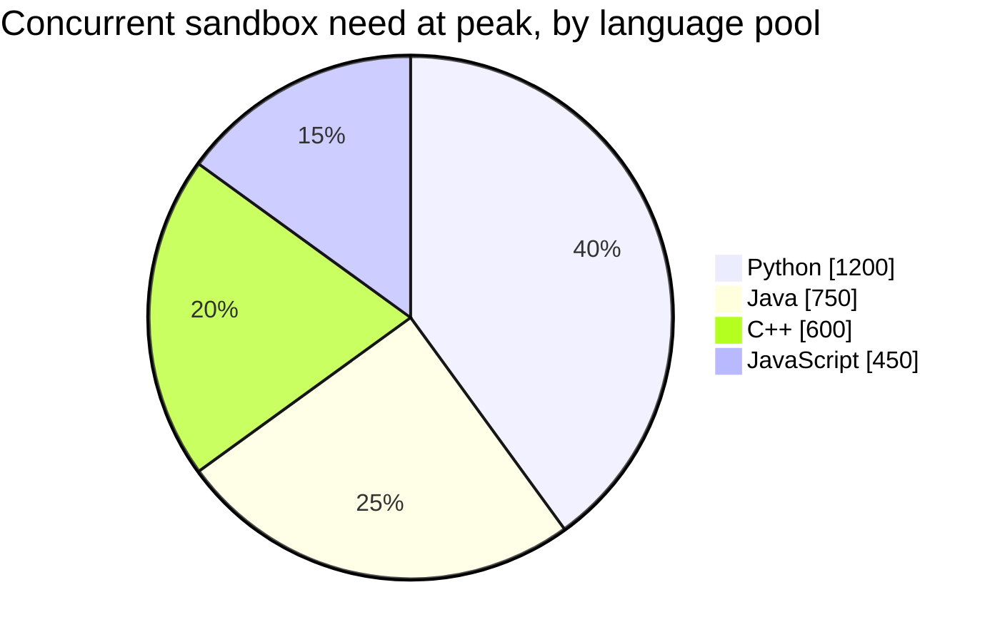

Each language needs its own proportionally-sized pool — spare capacity in one pool never rescues
another, since a submission can't run in a different language's sandbox.

**Redo-the-chain test:** if average execution time doubles to 3 seconds (more complex test
suites), concurrent sandbox need at the same QPS doubles to ~6,000 — a direct, computable
relationship between execution duration and pool-sizing requirements, worth naming if asked how
longer-running submissions affect capacity planning.

**The number worth memorizing:** concurrent sandbox need — not raw submission QPS — is what sizes
the pool, since a sandbox is held for an execution's full duration; and pre-warming typically cuts
per-submission startup latency by an order of magnitude versus cold-starting a sandbox from
scratch for every submission.

---

## API design

### `POST /v1/submissions` (batch judge mode)

```json
{
  "language": "python3",
  "code": "print('hello world')",
  "stdin": "",
  "timeoutSeconds": 5,
  "memoryLimitMB": 256
}
```

Response (immediate, async):
```json
{ "submissionId": "sub_88213", "status": "QUEUED" }
```

### `GET /v1/submissions/{submissionId}` (poll for result)

```json
{
  "submissionId": "sub_88213",
  "status": "COMPLETED",
  "stdout": "hello world\n",
  "stderr": "",
  "exitCode": 0,
  "executionTimeMs": 42,
  "resourceLimitExceeded": null
}
```

### WebSocket session (interactive REPL mode)

```json
{ "type": "STDIN", "data": "5\n" }
```
```json
{ "type": "STDOUT", "data": "You entered: 5\n" }
```

| Field | Notes |
|---|---|
| `resourceLimitExceeded` | Distinct from a normal non-zero `exitCode` — a `TIMEOUT` or `MEMORY_EXCEEDED` value here tells the user their submission was killed by the sandbox's own limits, not that their code simply exited with an error, which matters for a coding-judge product's user experience |
| WebSocket session | The interactive mode needs bidirectional streaming, structurally distinct from the batch mode's submit-then-poll pattern |

**The one sentence worth saying about the API surface:** *"Batch submissions are async — submit,
then poll or get notified — while interactive sessions need a persistent bidirectional connection;
these are different enough execution models that they shouldn't be forced into one API shape."*

---

## High-level architecture

### Architecture evolution (v1 → v2 → v3)

**v1 — run submitted code directly, no isolation:**

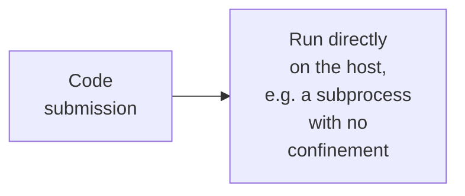

**Why it breaks:** submitted code is untrusted by definition — running it with no isolation means
any submission can read other submissions'/users' data, exhaust host CPU/memory (a fork bomb, an
infinite loop with no cap), or attempt to compromise the host machine directly. This is
disqualifying on security grounds alone, before any performance consideration.

**v2 — containerized, but cold-started per submission, no resource limits enforced by the
sandbox layer itself:**

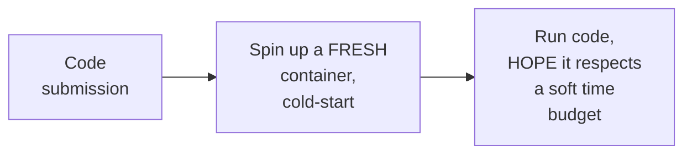

**Why it breaks:** containerization (v2's improvement) provides real process/filesystem isolation
— a meaningful security improvement over v1. But two problems remain: cold-starting a fresh
container per submission adds real latency (per the capacity estimate, 200-500ms just for
startup, before any actual execution); and "hoping" the code respects a soft time budget is not a
resource limit at all — an infinite loop with no enforced cap will simply run forever, or until
some unrelated external timeout eventually intervenes.

**v3 — the real system: pre-warmed sandbox pools + hard, sandbox-enforced resource limits:**

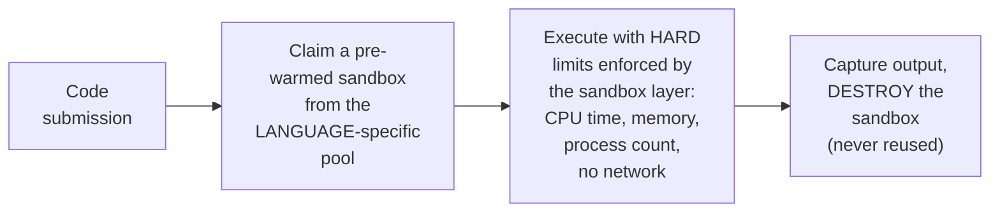

**What v3 fixes, one line each:** pre-warmed pools (already motivated by the capacity estimate's
10-40x startup-latency improvement) eliminate cold-start cost from the critical path; hard limits
enforced by the sandbox layer itself (cgroups/VM-level constructs, not application-level
politeness) actually stop an infinite loop or fork bomb regardless of the code's own behavior; and
destroying every sandbox after exactly one use eliminates any possibility of state leaking between
submissions or users.

---

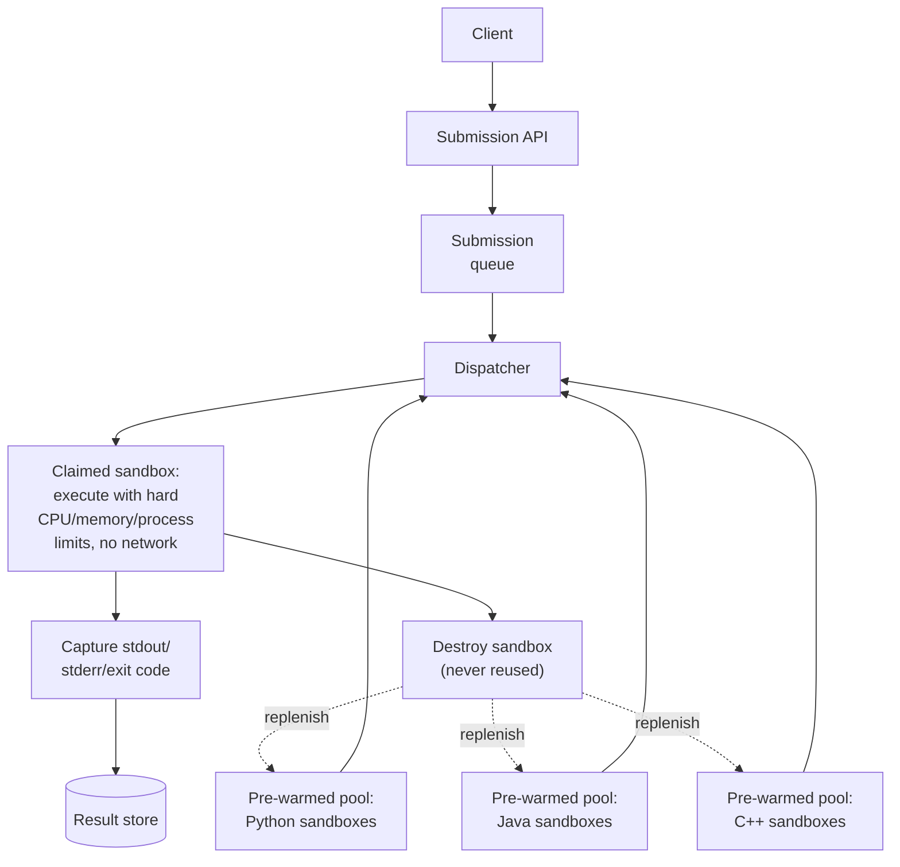

| Component | Role |
|---|---|
| Submission queue | Absorbs bursty submission volume (contest spikes), decoupling intake from execution capacity, similar in spirit to the flash-sale chapter's admission queue |
| Pre-warmed pools, per language | Eliminates cold-start latency from the critical path — see the pre-warmed-pools deep dive |
| Sandbox execution | Runs with hard, sandbox-layer-enforced resource limits — see the resource-limits deep dive |
| Destroy-after-use | Every sandbox is destroyed after exactly one submission's execution, then a fresh one replenishes the pool — never reused across submissions |

---

## End-to-end request walkthroughs

### Walkthrough 1 — a normal batch submission

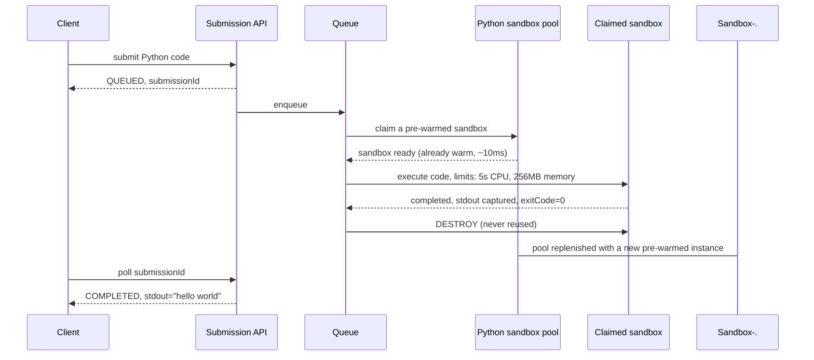

### Walkthrough 2 — an infinite loop, killed by a hard resource limit

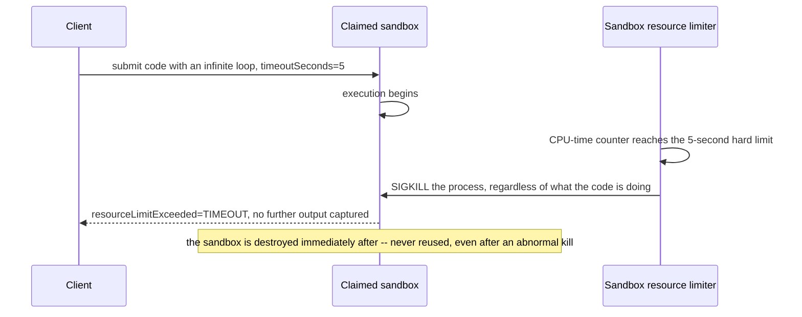

Walkthrough 2 is the concrete proof that resource limits are enforced by the sandbox layer, not
the code's cooperation — the kill happens regardless of what the infinite loop is doing internally.

### Walkthrough 3 — a language pool runs dry during a contest spike, submission queues rather than failing

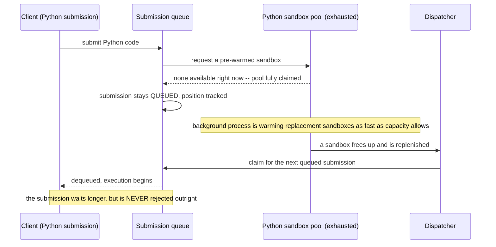

This is the concrete mechanism behind the [failure-modes table](#failure-modes--mitigations)'s
per-language pool-depth monitoring — a dry pool degrades to a longer queue wait, never a failed
submission.

---

## Deep dive: sandboxing technology spectrum

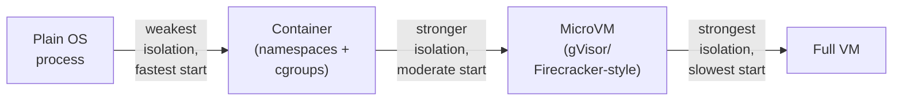

| | Plain process | Container | MicroVM |
|---|---|---|---|
| Isolation strength | Weak — shares the host kernel with no meaningful confinement | Moderate — namespace/cgroup isolation, but shares the host kernel (a kernel vulnerability can be a container-escape vector) | Strong — a lightweight virtual machine with its own kernel, much smaller attack surface shared with the host |
| Startup latency | Fastest | Moderate | Slower than a container, faster than a full traditional VM |
| Right default for untrusted, public-facing code execution | Never | Acceptable with additional hardening (seccomp, strict namespacing) for lower-risk contexts | The safer default for a public-facing product accepting arbitrary code from anyone, given the higher stakes of a sandbox escape |

**Why this course's default recommendation for a public-facing code-execution product leans toward
the stronger end of this spectrum:** a plain process offers essentially no real isolation and
should be ruled out immediately for untrusted code; a container's shared-kernel model means a
kernel-level vulnerability is a plausible (if rare) escape vector, which matters more for a
product deliberately inviting arbitrary code from the general public than for, say, an internal
CI system running code from trusted engineers.

**Interview cheat-sheet:** *"Place your isolation choice on this spectrum explicitly, and justify
it against how adversarial the code source realistically is — for a public product accepting
arbitrary submissions from anyone, lean toward microVM-level isolation over plain containers,
accepting the startup-latency cost, which pre-warmed pools exist specifically to hide."*

---

## Deep dive: resource limits that actually hold

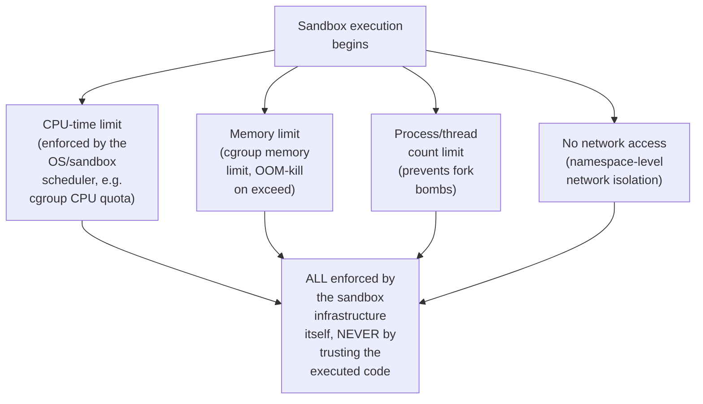

**Why every one of these must be enforced at the infrastructure level, not the application
level:** the executed code is adversarial by assumption — a "please limit yourself to 5 seconds"
instruction embedded in application logic (e.g., a language-level timer inside the same process)
can be bypassed by code that spawns a new process, ignores signals, or otherwise doesn't cooperate.
cgroups (or the microVM's equivalent resource controls) enforce these limits from *outside* the
executing process, in a way the process itself cannot override or ignore.

**Why "no network access" specifically matters beyond just resource exhaustion:** unrestricted
network access from within a sandbox would let malicious code exfiltrate data, participate in a
botnet, or attack other systems — this is a distinct security concern from CPU/memory exhaustion,
worth naming as its own explicit limit rather than assuming it's covered by "resource limits"
generally.

**Interview cheat-sheet:** *"Every resource limit — CPU time, memory, process count, network
access — must be enforced by the sandbox infrastructure from outside the executing process, never
by anything the executed code itself is expected to respect. Assume the code is actively hostile
and will try to bypass anything enforced only at the application level."*

---

## Deep dive: pre-warmed pools & cold start

Already the centerpiece of the architecture evolution and capacity estimate — the deep dive
states the mechanism generally.

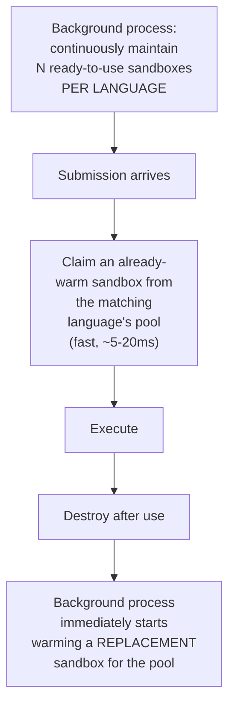

**Why "destroy after use, then replenish" rather than "reset and reuse the same sandbox":**
resetting a used sandbox to a clean state for reuse is itself a real engineering effort (making
sure absolutely no state — filesystem changes, memory, process artifacts — carries over from
the previous execution) and any bug in that reset logic is a potential cross-submission data-leak
vector; destroying and creating fresh is simpler to reason about and closes that entire class of
bug by construction, at the cost of the warm-up work being repeated rather than avoided.

**Why pool sizing must be per-language, not one shared pool:** a submission in language X cannot
execute in a sandbox pre-warmed with language Y's runtime — per the capacity estimate, each
language needs its own appropriately-sized pool proportional to its actual share of submission
volume, and under-provisioning one language's pool isn't rescued by spare capacity in another's.

**Interview cheat-sheet:** *"Pre-warmed, per-language pools trade some standing resource cost
(keeping sandboxes ready and idle) for a 10-40x improvement in per-submission startup latency —
and destroying every sandbox after use rather than trying to safely reset and reuse it closes an
entire class of cross-submission data-leak bugs by construction."*

---

## Deep dive: output streaming vs. batch

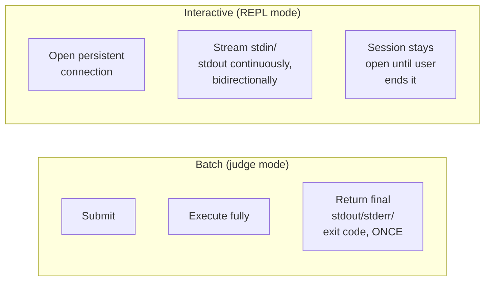

**Why these need genuinely different transport mechanisms, not just different response
formatting:** batch mode fits a simple request/poll (or webhook-notify) pattern since there's
exactly one final result; interactive mode needs a persistent, bidirectional channel (a WebSocket
or equivalent) because output can be produced incrementally and the user may need to provide
input (`stdin`) mid-execution, which a simple request/response API shape cannot express.

**Interview cheat-sheet:** *"Batch and interactive execution aren't the same API with different
formatting — they need genuinely different transport (request/poll versus persistent
bidirectional streaming), and conflating them into one shape under-serves one or both use cases."*

---

## Data model

**Submission lifecycle:**

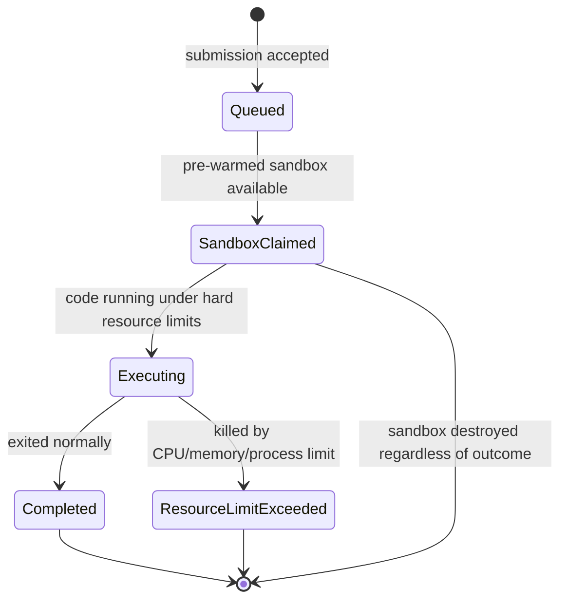

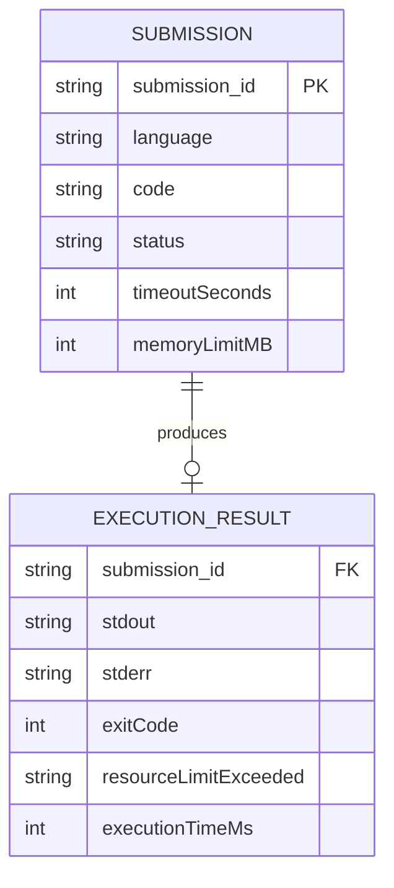

| Table | Storage choice & why |
|---|---|
| `Submission` / `ExecutionResult` | Relational, moderate volume, needs the state-machine transitions to be reliable and pollable |
| Sandbox pool state | Runtime, in-memory per dispatcher node — the count of ready/claimed sandboxes per language, not durable data requiring persistence |

---

## Failure modes & mitigations

| Failure mode | Impact | Mitigation |
|---|---|---|
| **A submission attempts a sandbox escape** (exploiting an isolation-layer vulnerability) | Severe security incident — the exact risk this whole chapter's isolation-strength deep dive exists to minimize | Choose isolation technology proportional to real risk (per the sandboxing-spectrum deep dive), keep the sandbox runtime patched, and treat any observed escape attempt as a security incident requiring investigation, not just a killed process |
| **A contest-style event causes a submission spike far exceeding pool capacity** | Queue backs up, submissions wait longer than usual | The queue absorbs the spike (never rejects outright), similar to the flash-sale/KYC chapters' admission-control philosophy — users see a longer queue position, not a failure |
| **A pre-warmed pool runs dry faster than it can replenish** (a sustained spike in one language) | New submissions in that language wait for a sandbox to become available, even if other languages' pools are idle | Monitor per-language pool depth as a first-class metric, and allow dynamic pool-size rebalancing across languages based on observed real-time demand, rather than a fixed static allocation |
| **Output capture buffers unbounded stdout from a runaway (but not otherwise resource-limit-violating) submission** (e.g. a tight print loop) | Could exhaust memory/storage capturing output | Cap captured output size explicitly, truncating with a clear indicator, independent of the CPU/memory execution limits |

---

## Non-functional walkthrough

**Scaling submission throughput is bounded by concurrent sandbox capacity, not queue throughput**
— per the capacity estimate, this is a function of execution duration and desired concurrency, not
just raw QPS, which is the key sizing insight for this system.

**Availability of the queue/intake path should be very high, even under a contest-spike thundering
herd** — always accept and queue a submission, never reject outright, mirroring the same
admission-control philosophy as the flash-sale and KYC-verification chapters.

**Isolation strength is a security property that must never be compromised for the sake of
latency** — pre-warmed pools exist specifically so this trade-off doesn't have to be made; if pool
capacity is ever insufficient, the correct response is queueing longer, never falling back to a
weaker isolation level to "keep up."

---

## Security & compliance

- **Sandbox escape is the top security risk in this entire system** — isolation-technology choice,
  patching cadence, and defense-in-depth (e.g. seccomp filtering even within a container, in
  addition to namespace/cgroup isolation) should all be treated with security-incident-level
  seriousness, not just a performance/reliability concern.
- **No network access from within a sandbox by default** is both a resource-limit and a security
  boundary — any legitimate need for network access (e.g. a submission that's supposed to call an
  external API as part of a specific exercise) should be an explicit, tightly-scoped exception,
  never a default-open posture.
- **Submitted code and its output may itself be sensitive** (proprietary solutions, personal data
  accidentally included in test input) — standard access-control and retention practices apply to
  stored submissions and results.

---

## Cost & trade-offs

**Isolation strength trades infrastructure cost and startup latency for security margin** — a
microVM-based sandbox costs more (in both compute overhead and engineering complexity) than a
plain container, a cost justified specifically by how adversarial and untrusted the code source
is for a public-facing product.

**Pre-warmed pool sizing trades standing infrastructure cost (idle warm sandboxes) for consistently
low per-submission latency** — per the capacity estimate, a real, ongoing infrastructure cost,
justified by the 10-40x latency improvement it buys on the actual user-facing critical path.

---

## Wrap-up: MVP vs. stretch

**In scope for an MVP:**
- Container-based sandboxing (a reasonable starting point) with hard cgroup-enforced CPU/memory/
  process limits and no network access.
- Pre-warmed pools for the initial set of supported languages.
- Batch (submit-and-poll) execution mode.

**Explicitly out of scope for an MVP:**
- MicroVM-level isolation — start with well-hardened containers (defense-in-depth via seccomp,
  strict namespacing), upgrade to microVMs once scale/risk profile justifies the added
  latency/infrastructure cost.
- Interactive REPL streaming mode — start with batch judge-style execution, add bidirectional
  streaming once an interactive product surface is confirmed as a requirement.

**Stretch goals, worth naming if asked "what's next":**
1. **MicroVM-based isolation**, for a stronger security posture as the product scales and becomes
   a larger target.
2. **Interactive REPL sessions** with bidirectional streaming.
3. **Dynamic, demand-aware pool rebalancing across languages**, rather than static per-language
   pool sizing.

---

## Golden rules

- **Every submission is untrusted, adversarial code by default** — this framing should drive
  every subsequent design decision, not just the sandboxing choice.
- **Resource limits must be enforced by the sandbox infrastructure itself, never trusted to the
  executed code** — an infinite loop or fork bomb is the expected adversarial case, not an edge
  case to handle gracefully after the fact.
- **Destroy every sandbox after exactly one use** — resetting and reusing a sandbox for the next
  submission introduces an entire class of potential cross-submission data-leak bugs that
  destroy-and-recreate avoids by construction.
- **Pre-warmed, per-language pools are what let isolation strength and startup latency both be
  good simultaneously** — don't treat this as an either/or trade-off; the pool is the resolution.
- **Batch and interactive execution need genuinely different transport mechanisms**, not just
  different response formatting.

---

## Master cheat sheet

**One-liners:**
- Submitted code is untrusted and adversarial by default — sandboxing and hard resource limits are
  not optional hardening, they're the core requirement.
- Place isolation technology explicitly on the process → container → microVM spectrum, and justify
  the choice against how adversarial the real code source is.
- Resource limits (CPU, memory, process count, network) must be enforced by the sandbox layer from
  outside the executing process — never by anything the code itself is expected to respect.
- Pre-warmed, per-language sandbox pools resolve the isolation-strength-versus-cold-start-latency
  tension, typically cutting per-submission startup latency by 10-40x.
- Destroy every sandbox after exactly one use rather than resetting and reusing it — this closes
  an entire class of cross-submission data-leak bugs by construction.

**Formula chain:**
```
concurrent_sandboxes_needed  = submission_QPS x avg_execution_duration_sec
per_language_pool_size        = concurrent_sandboxes_needed x language_share_of_volume
```

**Numbers:** pre-warmed sandbox claim time is typically 10-40x faster than a cold sandbox
start (single-digit-to-low-tens of ms versus hundreds of ms) · concurrent sandbox need, not raw
submission QPS, is what sizes the pool, since a sandbox is held for an execution's full duration ·
resource-limit enforcement (CPU/memory/process/network) must happen at the infrastructure layer,
with zero reliance on the executed code's cooperation.
