# Design a Live Auction System — The Story (narrative edition)

> **What this file is.** The reference file, `67-Design-a-Live-Auction-System-FAANG-Guide.md`, is
> the one to recite from — requirements, API shapes, every trade-off table, the master cheat
> sheet. This file is a second way in: the same material as one continuous story, told in plain
> language. Engineers at a company keep hitting a wall, patch it, and the patch itself creates the
> next wall — until we land on the exact same design the reference file documents. The company,
> **Copperlot** (an online auction site for vintage collectibles — watches, furniture, cameras),
> is fictional. But every wall it hits, and every fix it reaches for, is something a real, named
> system actually does or a well-documented pattern actually addresses: eBay's own documented
> last-second "sniping" bidding behavior (and the third-party sniping tools like eSnipe it spawned
> in the early 2000s), optimistic-concurrency compare-and-set, per-item sequencers, WebSocket-based
> live bidding fan-out, and Stripe-style idempotency keys for exactly-once billing. I'll say
> clearly, every time, whether something is a documented fact or a reasonable, labeled guess.

**The trigger phrases** for this whole topic: *"design a live/online auction system,"* *"multiple
bidders on the same item in real time,"* or *"what happens if someone bids in the last second."*
Keep one sentence in your head as you read: **bid ordering needs a single, unambiguous source of
truth per item, and the auction's end time isn't a fixed countdown — it's mutable, server-owned
state that can extend itself in response to a late bid.** Everything below is just this one idea,
getting harder in small, honest steps.

---

## Chapter 1 — Two auctioneers, one gavel

It's Copperlot's first real bidding war. A 1965 chronograph watch is listed, currently sitting at
a highest bid of **$240**. Copperlot runs two application servers behind a load balancer, and
each one, when a bid comes in, does the simplest possible thing: read the item's current highest
bid from the database, compare the new bid against it, and if it's higher, write the new bid back
as the highest. Nobody thought twice about this — it's the same code you'd write for almost
anything else.

Then it breaks. Bidder A submits **$245**, and it happens to land on App Server 1. Twelve
milliseconds later `[illustrative — a plausible network-jitter gap, not a measured figure]`,
Bidder B submits **$242**, landing on App Server 2. Both servers read the database at nearly the
same instant — both see the current highest bid as **$240**, because neither write has landed
yet. Server 1 decides "$245 > $240, accept." Server 2 decides "$242 > $240, accept." Both write.
Depending on which write physically lands last, the database can end up recording **$242 as the
final highest bid** — a strictly lower number than $245 — because nothing ever compared the two
bids *against each other*, only each one against a now-stale $240.

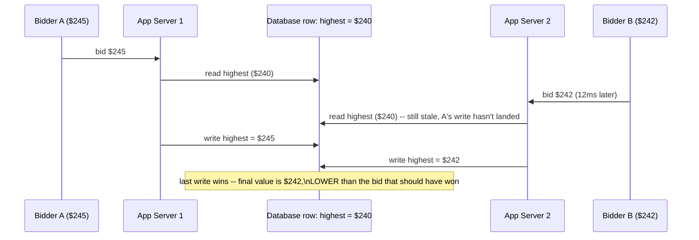

The obvious question: *how did a $242 bid beat a $245 bid?* Because "read the current highest,
then decide, then write" is three separate steps with no lock between them — a classic
**lost-update race condition**, the same category of bug documented in database concurrency-
control literature since the 1970s, and the exact same disease as a check-then-decrement
inventory race, just applied to price comparison instead of a stock counter. Two independent
servers, each trusting its own stale read, is the root cause — not the network, not bad luck.

**The fix, and the analogy for the rest of this story:** there can only be **one gavel** per item.
Picture a real auction: one auctioneer, standing at one podium, holding one gavel, is the only
person allowed to say "current bid is X." Two auctioneers running the same item independently,
each banging their own gavel based on what they personally last heard, is exactly Copperlot's bug.
The fix is to route every bid through a single, authoritative decision point per item — not two
app servers guessing independently.

**New problem, immediately:** "one gavel" is easy to say, hard to build cheaply. The fastest thing
to implement is still two app servers hitting the same database row — the *routing* hasn't
actually changed, just the intent. Something concrete has to make "one gavel" real, not aspirational.

**How I'd say this in an interview:** "The naive version has every app server independently
deciding whether a bid is the new highest, and that's a textbook lost-update race — two servers
both trust a stale read and both write, and the lower bid can win. The fix has to make 'is this
the new highest bid' a single atomic decision, not two independent guesses."

---

## Chapter 2 — The single gavel, made real with one atomic check

The fix: instead of "read, then decide, then write" as three separate steps, collapse it into
**one atomic operation** against a single database row — a compare-and-set. In SQL terms,
something like `UPDATE auctions SET highest_bid = $245 WHERE item_id = 'watch_1965' AND
highest_bid < $245 AND $245 >= highest_bid + min_increment`, and checking whether the row actually
changed. If the row changed, the bid is accepted. If not, it's rejected — no in-between state
where two servers can both "win" against the same stale value, because the database itself
enforces the check and the write as a single, indivisible step.

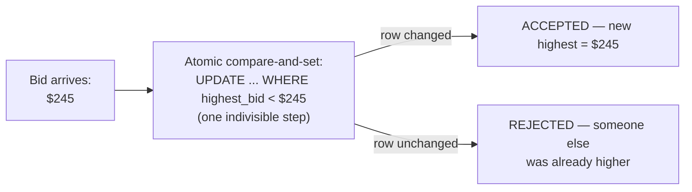

This genuinely fixes Chapter 1's bug. Re-run the exact same race: Bidder A's $245 and Bidder B's
$242 both hit the database's atomic compare-and-set. Whichever one's `UPDATE` executes first wins
outright and changes the row; the second one's `WHERE highest_bid < $242` clause simply fails to
match (because the row is now $245, and $242 isn't higher), so it's cleanly rejected. No lost
update, no ambiguity about which bid is actually higher.

**New problem, surfaced by the next bidding war:** the atomic CAS answers "was this bid accepted,
yes or no" correctly. But it does **not** produce a queryable, strict *ordering* of every bid that
was ever submitted on this item — accepted or rejected. Two bidders dispute a close call: "I bid
first!" "No, I did!" — and the only record is a pile of timestamps from different servers'
clocks, which aren't guaranteed to agree down to the millisecond. Worse, a feature that's about to
matter a lot — anti-sniping — needs to ask "was this bid within N seconds of the *current* end
time, which may have already been extended by the *previous* bid" — and answering that reliably
needs a strict, agreed sequence of events, not just a pass/fail flag per bid.

**How I'd say this in an interview:** "An atomic compare-and-set on one row fixes the accept/
reject correctness — no more lost updates. But it doesn't give you a strict, disputable-in-order
history of every bid, and that's a separate problem: ordering, not just correctness of a single
decision."

---

## Chapter 3 — The numbered-ticket dispenser, one per counter

The fix: give every bid on an item a **strictly increasing sequence number**, assigned by a
dedicated **per-item sequencer** — reusing exactly the mechanism from this course's own
[Sequencer chapter](./12-Sequencer-FAANG-Guide.md). Every bid, accepted or rejected, gets the next
number in line. Now "which bid came first" is never a matter of comparing fuzzy timestamps across
servers — it's just "lower sequence number happened first," a fact, not an inference.

**The analogy:** think of the numbered-ticket dispenser at a deli counter. Whoever walks up gets
the next number, in the order they walked up — unambiguous, no arguing about who was really
first. The key detail: **each counter has its own dispenser.** The deli counter's numbers have
nothing to do with the bakery counter's numbers next door.

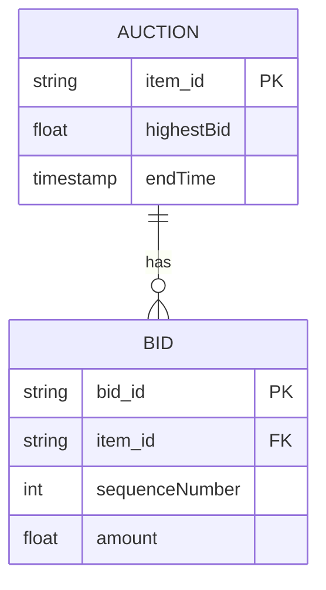

Copperlot builds this and, to save effort, launches it as **one global sequencer** serving every
auction on the platform — one dispenser for the entire mall, not one per counter. It works, until
growth: Copperlot goes from a handful of live auctions to **50,000 concurrent auctions**
`[illustrative]`. Every single bid on every single item — the vintage watch, a lamp, a rare comic
— now funnels through that one global sequencer to get its number, even though a bid on the lamp
has zero business reason to care about ordering relative to a bid on the watch. The global
sequencer becomes an unnecessary shared bottleneck and point of contention across totally
unrelated items, purely because it was scoped wider than the actual correctness requirement ever
needed.

**The fix, one level down:** scope the sequencer **per item**, not globally — one numbered-ticket
dispenser per counter, not one for the whole mall. A hot item's bidding war might hit **50 bids/
sec** `[illustrative — a realistic late-auction spike]`, and even that is nowhere near a single
sequencer's real throughput ceiling — the correctness requirement was always "strict order *within
one item's bids*," never "strict order across the whole platform," so there was never a reason to
share one dispenser across 50,000 unrelated counters.

**How I'd say this in an interview:** "Bid ordering is a sequencer problem — reuse the dedicated
Sequencer mechanism directly. The trap is scoping it globally instead of per item: ordering was
only ever required within a single item's bids, so a global sequencer is a self-inflicted
bottleneck across auctions that have nothing to do with each other."

---

## Chapter 4 — The village loudspeaker, and learning to whisper to one street

Ordering is solved. Now: every time the highest bid changes, watchers need to see it, live,
without refreshing — the whole point of a *live* auction. Copperlot's first version does the
simplest possible thing: broadcast every bid update to **every connected user on the entire
platform**, over WebSockets (a real, standard mechanism for live bidding UIs — plenty of real
auction and live-commerce platforms use exactly this transport). Like a village loudspeaker
that announces every single sale at every stall, to the whole village, all day.

The math breaks immediately. Copperlot has **2,000,000 concurrently connected users**
`[illustrative]` browsing at any given moment. During a bidding war, one hot item alone generates
**50 bid updates/sec**. Broadcasting every update to every connected user means **50 × 2,000,000
= 100,000,000 messages/sec**, for updates about ONE item that the vast majority of those 2 million
people have never even looked at. No infrastructure Copperlot can afford handles that.

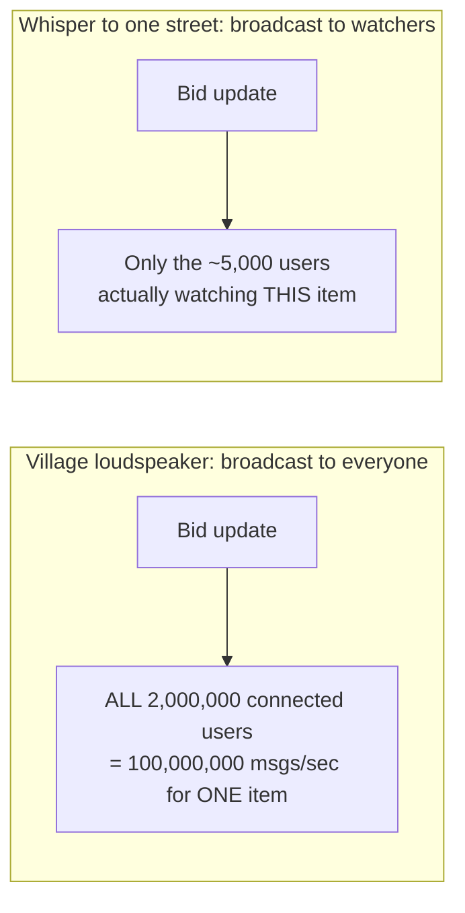

**The fix:** scope the broadcast to a per-item channel — only the users who actually opened this
specific item's page get its updates, via a WebSocket subscription keyed to `itemId`. Same idea as
whispering down one street instead of shouting through the whole village. Re-run the math: a
viral hot item might have **5,000 watchers** `[illustrative]` at once. At 50 bids/sec, that's **50
× 5,000 = 250,000 fan-out messages/sec** — still a real number to engineer for, but three orders
of magnitude smaller than the naive version, and now proportional to actual interest in the item
instead of to the whole platform's user count.

**New problem:** the fan-out now correctly delivers "highest bid changed." But the *other* piece
of live state every watcher needs — "how much time is left" — is about to become the single
trickiest part of this entire system, because time isn't a value you can just fan out once and
forget.

**How I'd say this in an interview:** "Broadcasting to everyone on the platform doesn't scale —
you scope fan-out to the item's actual watcher set, the same instinct as viewport-scoped fan-out
in a live-collaboration system, just scoped by 'watching this item' instead of by screen region.
Bid-ordering was never the scaling bottleneck here — fan-out to a hot item's watchers is."

---

## Chapter 5 — The auctioneer who won't drop the gavel while hands are still up

Copperlot's watch auction is scheduled to end at exactly **18:00:00**. Ten minutes before close,
the highest bid has been sitting at **$1,150** for a while. Then, at **17:59:59.7** — three
hundred milliseconds before the scheduled end — a bidder submits **$1,200** and wins. Nobody else
had any chance to respond; the auction simply ends before anyone can react.

This isn't a Copperlot-specific accident — it's a **documented, well-known behavior on eBay**:
eBay's standard listings use a hard, fixed end time, and this is exactly why an entire cottage
industry of "sniping" tools — eSnipe and Auction Sniper among the best known — existed in the
early 2000s, built specifically to submit a bid in the last second or two automatically. A fixed,
non-extending end time is a documented, real incentive for last-second bidding, and it's a genuine
fairness complaint from bidders who would have raised their bid but never got the chance.

**The obvious question:** *should the end time just... not be fixed, if the auction is still
actively contested?* Real, in-person auctions already solve this instinctively — a live
auctioneer doesn't slam the gavel down while hands are still going up in the room; they keep
taking bids as long as bidding is actually happening. Online, that instinct has to be codified
into an explicit rule, because there's no room full of hands to visually notice.

**The fix, and the name for it: anti-sniping, via a "soft close."** This is a documented industry
countermeasure used by charity and estate-auction platforms specifically built to defeat the kind
of hard-cutoff sniping eBay's model enables: if a qualifying bid lands within a defined window of
the *current* end time (say, the last **30 seconds**), extend the end time by a fixed amount
(say, **2 minutes**) — giving everyone else in the room a real chance to respond, the same
courtesy the live auctioneer with the gavel already gives instinctively.

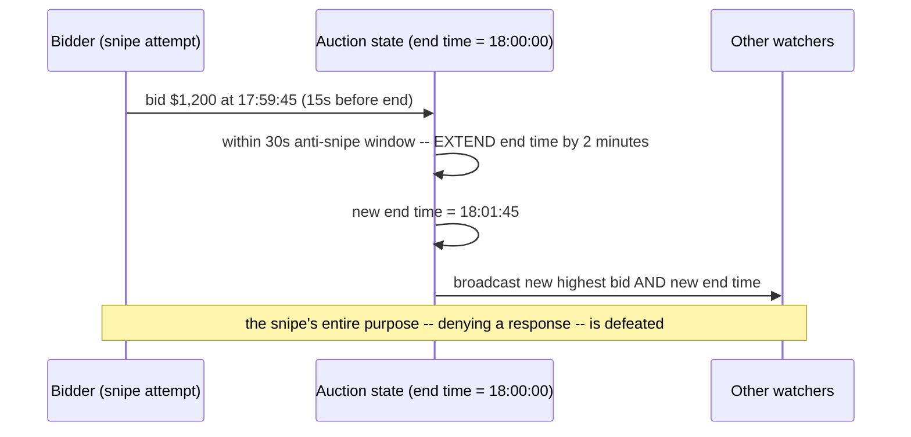

**How wide should the window be?** This is a genuine product trade-off, not a purely technical
one: a narrow window is fast and predictable but barely stops sniping; a wide window is fairer but
makes a contested item's real close time unpredictable, since a bidding war can keep re-triggering
the extension.

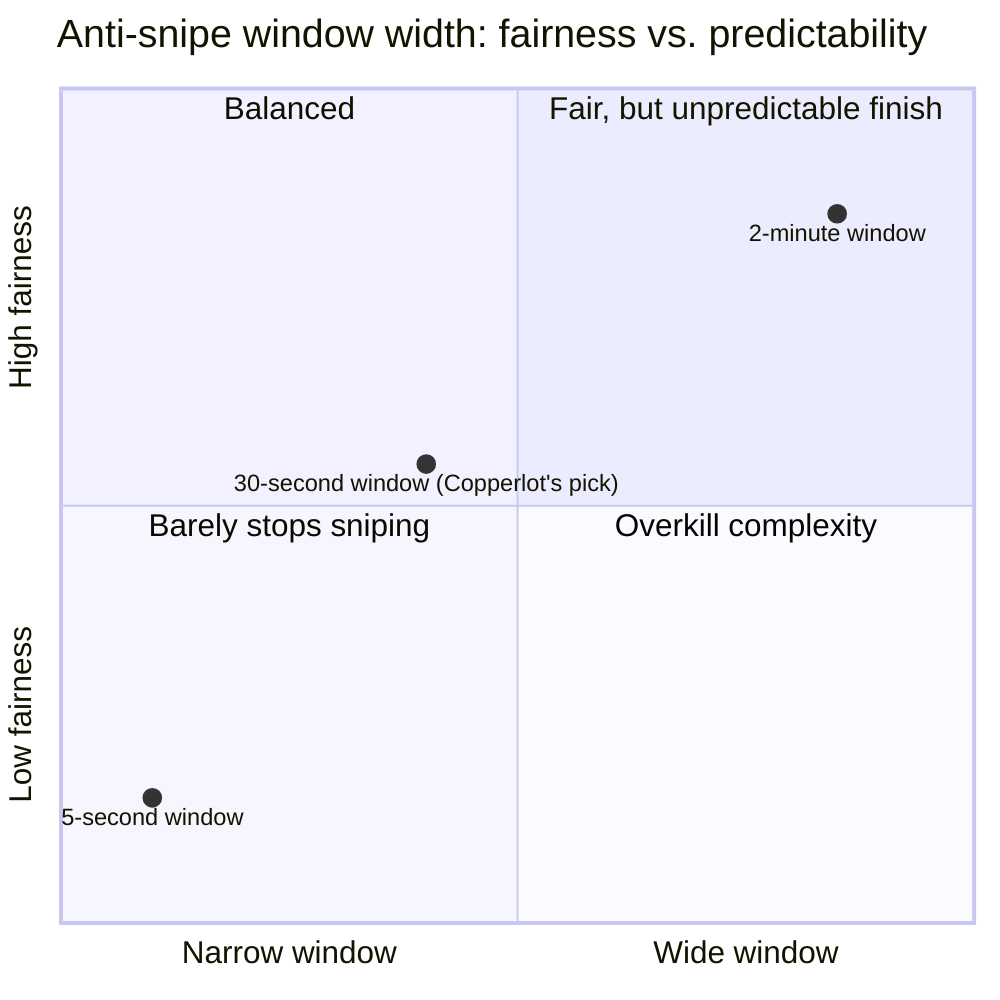

**New problem, spotted immediately once someone thinks it through:** if "extend by 2 minutes"
always resets to exactly 2 minutes from the *original* scheduled end time, then a bidding war just
needs to land the very last qualifying bid before that one fixed new deadline, and sniping happens
again — just 2 minutes later instead of at 18:00:00. The fix only actually works if every
qualifying late bid extends the end time by 2 minutes from **right now**, not from the original
schedule — meaning a sustained bidding war in the final moments can keep re-extending, again and
again, for as long as bids keep landing inside the window. That's not a bug to prevent; it's the
entire point, working as designed.

**How I'd say this in an interview:** "Anti-sniping is a soft-close mechanism, the documented
countermeasure to eBay's own well-known hard-cutoff sniping problem — extend the end time on a
qualifying late bid. The detail that actually matters: extend from *now*, every time a qualifying
bid lands, not from the original schedule once — otherwise a determined bidder just re-snipes the
new fixed deadline instead."

---

## Chapter 6 — Whose clock is it, anyway

The extension mechanism works on the server. But watchers need to *see* the time remaining,
live, and Copperlot's first version has each browser compute its own local countdown: fetch the
end time once when the page loads, then count down locally using the browser's own clock,
re-syncing only on a manual refresh.

This breaks in two different, equally bad ways. First: a bidder's laptop clock is running **4
seconds fast** `[illustrative]` — their local countdown hits zero 4 seconds before the real
server-side end time, so they stop trying to bid, convinced it's over, while the auction is still
genuinely open. Second, and worse: when the server extends the end time (Chapter 5's whole
mechanism), that extension is a message that has to reach every open browser tab. If even one
watcher's WebSocket connection had a brief hiccup and missed that specific message, their tab
keeps counting down toward the *old*, no-longer-real end time, while every other watcher correctly
sees the extended one — two bidders, watching the same item, disagreeing about how much time is
left, in real time, during the exact moment that matters most.

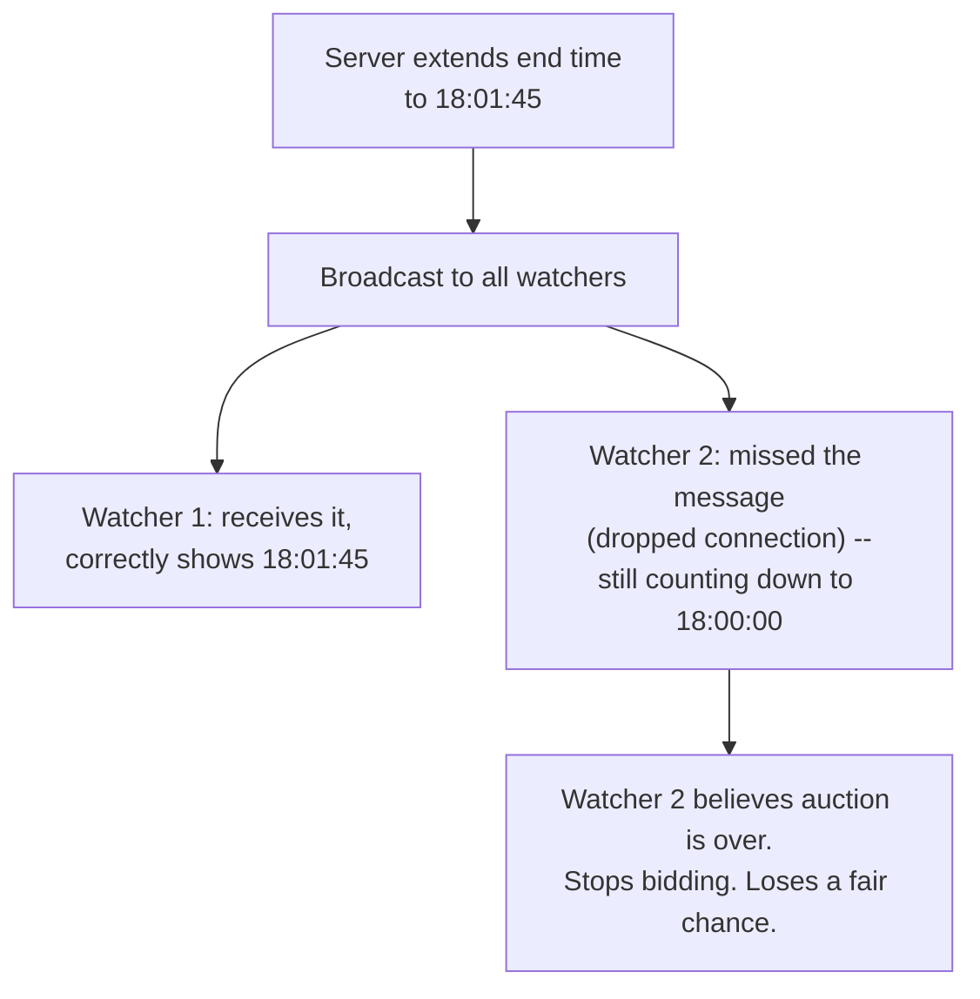

**The fix:** treat the end time exactly the way Chapter 5 already treats the highest bid — as
**server-authoritative, pushed state**, never a value the client computes or owns independently.
The client displays whatever the server last told it, full stop; it never runs its own countdown
logic against its own clock. On reconnect (after any dropped connection), the client re-fetches
the current true end time from the server before resuming its display — it never trusts
whatever state it had locally before the gap.

**How I'd say this in an interview:** "The end time has to be treated as mutable,
server-authoritative state, broadcast explicitly on every change — the same discipline as the
highest-bid value itself. A client computing its own independent countdown from a locally-started
timer will drift, and worse, can silently miss an extension entirely if a single broadcast message
gets dropped."

---

## Chapter 7 — The bid that arrived between heartbeats

Everything above works — ordering, anti-sniping, server-authoritative time. Then a genuinely
subtle bug shows up. The extended end time settles at **18:01:45**, with no further qualifying
bids. Copperlot's scheduled "close this auction" job fires at **18:01:45.000**. A bid from a
watcher who'd been refreshing the page arrives at **18:01:45.002** — two milliseconds later
`[illustrative]`. Is that bid in, or out?

Without an explicit answer, this is a genuine race: the close job might read "current highest
bid" a fraction of a second before the late bid's write has actually committed, silently excluding
a bid that a strict clock reading would say arrived first. Or, worse, the late bid gets processed
*after* winner determination has already started, producing two contradictory events at once —
"the auction is now closed, winner is X" and "new highest bid accepted" for the same item.

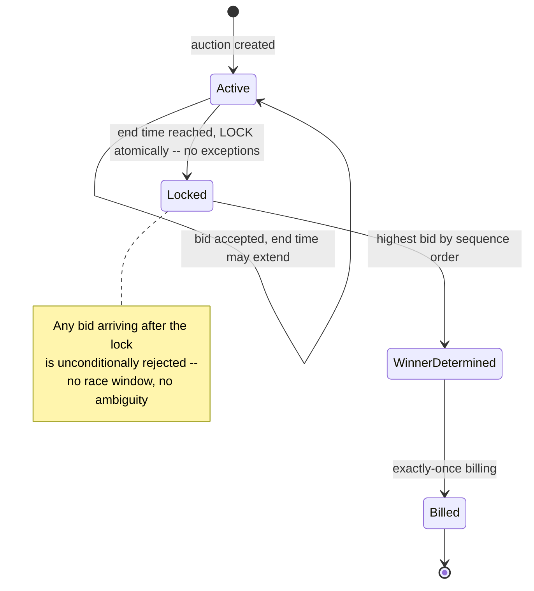

**The fix:** an explicit, atomic **lock** transition — the same discipline as an atomic inventory
reservation — that happens *before* any winner-determination logic runs. The instant the end time
is truly reached with no qualifying bid still pending, the auction's status flips to `Locked` in
one atomic step. Any bid that shows up after that flip, regardless of how close in time it was, is
unconditionally rejected. This turns an ambiguous millisecond-level race into a deterministic
rule: only bids sequenced (per Chapter 3's sequencer) *before* the lock count, full stop.

**How I'd say this in an interview:** "The exact boundary between 'still open' and 'closed' is a
race if you leave it implicit — lock the auction atomically before winner determination even
starts, and treat any bid after that lock as rejected no matter how close it arrived. That's the
only way to make the close moment deterministic instead of a coin flip on timing."

---

## Chapter 8 — The card that almost got charged twice

The auction is locked, the winner is determined — highest bid, tie-broken by sequence number if
ever needed. Now: charge the winner's card. Copperlot's first version calls the payment
processor once, and if it fails, calls it again.

One night, the payment processor has a slow moment — a request times out after **5 seconds**
`[illustrative]` with no clear success/failure signal back to Copperlot. Copperlot's billing
service, seeing what looks like a failure, retries the charge. Both attempts might have actually
gone through on the processor's side — Copperlot has no way to know from a bare timeout whether
the first charge succeeded or not, and a naive retry risks charging the winning bidder **twice**
for the same watch.

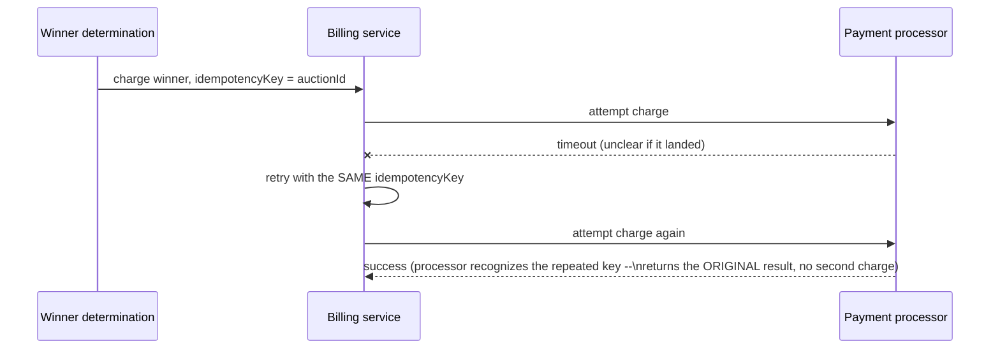

**The fix:** an **idempotency key tied to the auction** — not the individual bid, not the retry
attempt — passed on every charge attempt. This is a real, documented pattern (Stripe's
idempotency-key API is a well-known real-world example): the payment processor recognizes a
repeated key within a defined window and simply returns the result of the *original* attempt
instead of creating a second charge. Retry as many times as needed on transient failure — the
winner is charged **exactly once**, guaranteed by the key, not by hoping the retry logic is
perfectly timed.

**How I'd say this in an interview:** "Billing at auction close needs an idempotency key scoped to
the auction, not the bid or the attempt — the same discipline as Stripe's own idempotency-key
API. That's what makes retrying on a transient payment failure safe instead of a double-charge
risk."

---

## Chapter 9 — The ticket dispenser jams mid-war

One more failure, the nastiest of the set because it happens exactly when it matters most:
during an active bidding war on a hot item, the per-item sequencer process from Chapter 3 —
running as a single leader for that item — crashes. Maybe the machine it's on gets rebooted for a
routine patch, maybe it just hangs. Right before it went down, it had issued sequence number
**#4821**. A new instance takes over, and — because it has no durable memory of where the old one
left off — starts counting from **0** again.

The very next bid gets sequence number **1**. Copperlot now has two different bids in this item's
history both effectively "first" by sequence number, right in the middle of the exact moment
where "who bid first" is a live, disputed, real-money question. This is the same failure shape as
the split-brain problem a distributed lock service has to fence against — an old or new leader
issuing conflicting authority — just applied here to sequence numbers instead of lock ownership.

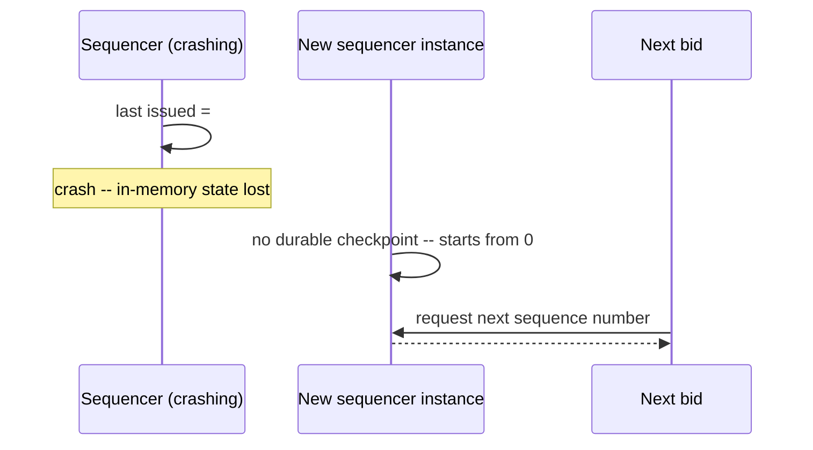

**The fix:** the sequencer's last-issued number must be **durably persisted** before it acks a
bid, not just held in memory — the exact same durability discipline as a write-ahead log. On
failover, the new instance reads that durable checkpoint first and resumes from `#4822`, never
from zero. And to close the loop fully, an **epoch/fencing token** — the same mechanism a
distributed lock uses to reject a stale former leader — ensures that if the *old* sequencer
process somehow comes back to life after being replaced, its attempts to issue numbers are
rejected outright, because it's carrying a now-stale epoch.

**How I'd say this in an interview:** "A per-item sequencer's failover has to preserve strict
monotonicity — persist the last-issued number durably before acking, so a new leader resumes from
where the old one left off instead of restarting from zero. And fence the old instance with an
epoch token, the same discipline a distributed lock service uses, in case it ever comes back."

---

## Where the story actually lands

```mermaid
flowchart LR
    A["Ch1: independent app-server checks\n(lost-update race)"] -->|"fixes: correctness\nbreaks: no ordering"| B["Ch2: atomic CAS,\none DB row"]
    B -->|"fixes: accept/reject correctness\nbreaks: no strict total order"| C["Ch3: per-item sequencer"]
    C -->|"fixes: unambiguous order\nbreaks: naive fan-out to everyone"| D["Ch4: scoped fan-out\n(per-item watchers)"]
    D -->|"fixes: fan-out cost\nbreaks: fixed end time enables sniping"| E["Ch5: anti-snipe\nsoft close"]
    E -->|"fixes: sniping\nbreaks: client-computed countdown drifts"| F["Ch6: server-authoritative\nend time"]
    F -->|"fixes: consistent countdown\nbreaks: race at the close boundary"| G["Ch7: atomic lock\nbefore winner determination"]
    G -->|"fixes: deterministic close\nbreaks: retry can double-charge"| H["Ch8: idempotency-keyed\nbilling"]
    H -->|"fixes: exactly-once charge\nbreaks: sequencer failover collides"| I["Ch9: durable checkpoint\n+ fencing"]
```

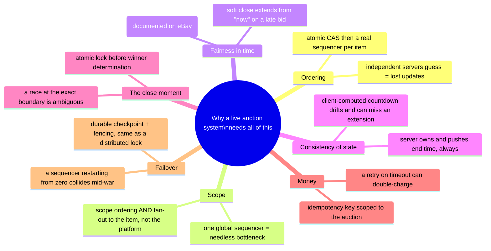

Every real live-auction design sits somewhere on this chain. A simple "one item, no sniping
concerns" version can reasonably stop around Chapter 4. The moment "what if someone bids in the
last second" comes up, Chapter 5 and 6 are mandatory. The moment money changes hands at close,
Chapters 7 through 9 are what separate a design that sounds right from one that's actually correct
under real failure.

---

## Grill me — adversarial follow-ups

**Q1: "Why not just use a distributed lock per item instead of a sequencer?"**
A lock serializes access, but it doesn't give you a durable, queryable *history* of who bid in
what order — you still need that for disputes and for the anti-snipe window calculation. A
sequencer gives you serialization and a durable ordering artifact in one mechanism.

**Q2: "Couldn't you just use the database's own auto-increment ID, and skip building a sequencer?"**
For a single database instance, sure — that's a fine simplification. A dedicated sequencer earns
its keep once the auction-state store is sharded or replicated, where a plain auto-increment can
produce gaps or duplicates across a failover — exactly Chapter 9's problem.

**Q3: "Isn't scoping the sequencer per item just moving the bottleneck?"**
No — even a wild bidding war, 50 bids/sec on one item, is far below a single sequencer's real
ceiling. The actual scaling challenge was never sequencing throughput, it's fan-out to that
item's watcher set.

**Q4: "You extend the end time from 'now' on every qualifying bid — what stops a bidding war from extending forever?"**
Nothing, and that's intentional — that's the whole point of anti-sniping. It self-limits because
bidders eventually stop bidding at their real ceiling; a hard outer cap, if a product wants one,
is a business rule layered on top, not a correctness requirement.

**Q5: "Why server-pushed end time instead of the client polling every 5 seconds?"**
Polling adds up to 5 seconds of staleness right when precision matters most — the last moments
before close, exactly when a missed extension does the most damage to fairness. Pushing the
change the instant it happens avoids that window entirely.

**Q6: "What if the close-trigger job itself fails to fire on time?"**
The lock transition (Chapter 7) is what has to be reliable, not the trigger — a late job just
means the auction stays open a bit longer, a minor inconvenience, not a correctness bug, since no
winner is determined until the lock actually happens.

**Q7: "Why tie the billing idempotency key to the auction ID instead of a fresh key per attempt?"**
A fresh key per attempt is exactly the bug — it makes two attempts to charge the same winner look
like two unrelated requests to the processor, defeating idempotency entirely. The key has to
identify "this charge that should happen once," and that's the auction.

**Q8: "What stops shill bidding — a seller using fake accounts to bid up their own item?"**
Nothing in these mechanics does, worth saying plainly — ordering, anti-sniping, and exactly-once
billing all assume the bids are legitimate. Shill bidding is caught with account verification and
bidding-pattern anomaly detection, layered on top, not solved by this pipeline.

**Q9: "If two bids for the exact same amount land, how do you break the tie?"**
The sequencer already answers it for free — whichever bid got the lower sequence number was
strictly first, so ties break on sequence order, never on raw timestamps from servers whose
clocks might disagree.

**Q10: "Cold open: 'design a live auction system' — where do you start?"**
Say the two things that shape everything else: bid ordering needs one source of truth per item,
and the end time is mutable, server-owned state that can extend on a late bid. Then go only as
deep as the follow-ups point — anti-sniping is the detail worth volunteering unprompted; exactly-
once billing and sequencer failover are what you reach for under a correctness push.

---

## Cheat sheet — one line per stop on the story

- **Independent app-server checks**: each server trusting its own stale read of "current highest
  bid" causes a lost-update race — a lower bid can beat a higher one.
- **Atomic compare-and-set**: one indivisible check-and-write against a single row fixes
  accept/reject correctness, but gives no strict, disputable ordering of *all* bids.
- **Per-item sequencer**: reuse the dedicated Sequencer mechanism, scoped per item — never
  globally, since ordering was only ever required within one item's bids.
- **Scoped fan-out**: broadcast bid updates only to an item's actual watchers, not the whole
  platform — proportional to real interest, not total user count.
- **Anti-snipe soft close**: extend the end time from "now" on any bid within a defined window of
  the current end time — the documented countermeasure to eBay's own hard-cutoff sniping problem.
- **Server-authoritative end time**: the client never computes its own countdown — it always
  displays exactly what the server last pushed, and re-syncs on reconnect.
- **Atomic lock before winner determination**: resolves the race at the exact close boundary
  deterministically — only bids sequenced before the lock count.
- **Idempotency-keyed billing**: a key tied to the auction (not the bid, not the attempt)
  guarantees exactly-once charging even across retries on a transient failure.
- **Durable sequencer checkpoint + fencing**: a per-item sequencer's failover must resume from a
  persisted last-issued number, and fence any old instance that comes back — the same discipline
  as a distributed lock's epoch token.
- **The meta-lesson**: every fix here buys one property (correctness, ordering, fan-out cost,
  fairness, consistency, deterministic close, exactly-once money, failover safety) at the cost of
  a bit more mechanism — say the trade in the same sentence you propose the fix.
