# Design a Live Auction System — FAANG Interview Guide

> Source chapter type: real-time, trust-critical bidding. Combines the fan-out shape of a live
> collaboration system with the financial correctness bar of
> [the Flash Sale guide](./60-Design-a-Flash-Sale-System-FAANG-Guide.md) — but adds a problem
> neither of those chapters has: **bid ordering must be a single, agreed-upon total order per
> item**, and the auction's own **end time can move**, deliberately, in response to a bid landing
> in the final seconds (anti-sniping) — a business rule with direct real-time-timer implications
> that most designs miss entirely.

## Mental model

Multiple bidders watch the same item and submit bids in real time. Three problems, layered:

1. **Bid ordering must be unambiguous, per item.** Two bids arriving within milliseconds of each
   other must resolve to a single, agreed "this one came first" — not eventually consistent, not
   approximately ordered, because the outcome (who's currently winning) is a real, disputed-if-
   wrong fact.
2. **Sniping prevention.** A bidder placing a winning bid in the last second of a fixed-end-time
   auction denies other bidders any chance to respond — real auction platforms extend the end time
   automatically when a bid lands close to it, which means "when does this auction actually end"
   is dynamic, re-evaluated on every late bid, not a fixed timestamp set once at auction creation.
3. **Exactly-once "you won" and exactly-once billing.** At auction close, exactly one bidder must
   be notified they won, and exactly one charge must be attempted — never zero, never two.

**The one sentence to say out loud:** *"Bid ordering needs a single source of truth per item — a
sequencer or leader-per-item — and the auction's end time is not a fixed value, it's a value that
can extend itself in response to late bids, which has to be modeled explicitly, not assumed away
as a simple countdown timer."*

**The one picture to remember forever:**

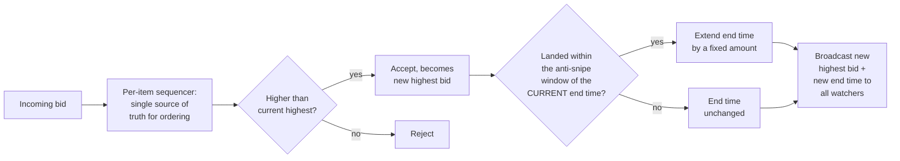

**Memory hook:** *"One sequencer per item for bid ordering. The end time isn't fixed — a late bid
extends it, and that extension is itself something every watcher needs to see broadcast."*

---

## Table of contents
[How to Identify This Topic](#how-to-identify-this-topic-in-an-interview) ·
[Interview Playbook](#interview-playbook) · [Requirements](#requirements-clarification) ·
[Capacity Estimation](#capacity-estimation-worked) · [API Design](#api-design) ·
[High-Level Architecture](#high-level-architecture) ·
[Architecture Evolution v1→v2→v3](#architecture-evolution-v1--v2--v3) ·
[End-to-End Walkthroughs](#end-to-end-request-walkthroughs) ·
[Deep Dive: Per-Item Bid Ordering](#deep-dive-per-item-bid-ordering) ·
[Deep Dive: Anti-Sniping / Dynamic End Time](#deep-dive-anti-sniping--dynamic-end-time) ·
[Deep Dive: Exactly-Once Win Notification & Billing](#deep-dive-exactly-once-win-notification--billing) ·
[Data Model](#data-model) · [Failure Modes](#failure-modes--mitigations) ·
[Non-Functional Walkthrough](#non-functional-walkthrough) ·
[Security & Compliance](#security--compliance) · [Cost & Trade-offs](#cost--trade-offs) ·
[Wrap-Up](#wrap-up-mvp-vs-stretch) · [Golden Rules](#golden-rules) ·
[Cheat Sheet](#master-cheat-sheet)

---

## How to identify this topic in an interview

- "Design a live/online auction system (like eBay-style bidding)."
- The tell that this is about real-time bid ordering and sniping, not just a marketplace listing
  chapter: the interviewer emphasizes **many bidders watching one item simultaneously** and/or
  **a fixed end time** — the second detail specifically is the cue for anti-sniping.
- A follow-up like "what if the auction is about to end and someone bids in the last second" is
  the [anti-sniping deep dive](#deep-dive-anti-sniping--dynamic-end-time) — the single most
  distinctive mechanism in this chapter.

---

## Interview playbook

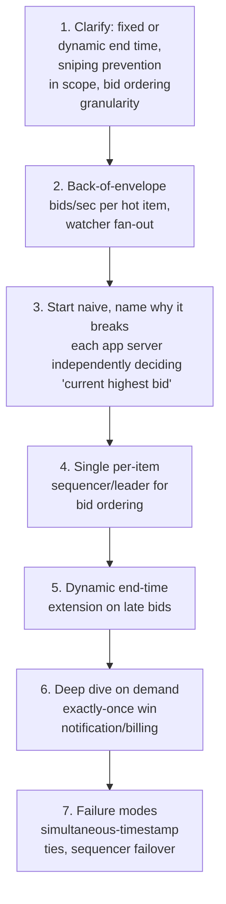

**What the interviewer is actually grading at each step:**
- Step 3: do you recognize, unprompted, that "current highest bid" must have a single source of
  truth per item — two application servers independently deciding this can disagree, the same
  class of problem as the flash-sale chapter's inventory race, just for ordering instead of a
  counter?
- Step 5: do you know, unprompted, that a real auction platform's end time is dynamic (extends on
  a late bid), not a fixed countdown — this is the single most commonly missed business
  requirement in this chapter?
- Step 6: do you propose a defined, single-attempt-guaranteed mechanism for win notification and
  billing at close, rather than assuming "just notify the highest bidder" is sufficient without
  addressing the exactly-once requirement explicitly?

---

## Requirements clarification

### Functional

| # | Requirement | Notes |
|---|---|---|
| F1 | Accept bids on an item and determine the current highest bid unambiguously | The core correctness requirement |
| F2 | Broadcast the current highest bid and time remaining to all watchers in real time | The live-collaboration-style fan-out requirement |
| F3 | Extend the auction's end time if a bid lands within a defined window of the current end time (anti-sniping) | A specific, dynamic business rule, not a fixed countdown |
| F4 | At close, determine exactly one winner and trigger exactly one billing attempt | The financial correctness requirement |
| F5 | Reject bids below the current highest (or below a minimum increment above it) | Standard auction mechanics |

### Non-functional

| Requirement | Target | Why this number |
|---|---|---|
| Bid ordering correctness | Absolute, per item — a single agreed total order, zero tolerance for ambiguity about which of two near-simultaneous bids came first | The current-highest-bid fact is disputed-if-wrong; bidders act on it in real time |
| Bid acceptance latency | Low, sub-second — a bidder needs to know quickly whether their bid was accepted | Real-time bidding UX expectation |
| Fan-out latency to watchers | Sub-second, similar to the collaborative-canvas chapter's live-update expectations | Watchers deciding whether to bid again need current information |
| End-time extension correctness | Every watcher must see the SAME extended end time, no client-side drift | A client computing its own countdown independently, rather than syncing to a server-broadcast end time, risks inconsistent perceived deadlines across bidders |
| Exactly-once win/billing | Absolute | The same standard as the flash-sale and payment chapters — a double-charge or a missed winner notification is a severe trust failure |

**Clarifying questions worth asking the interviewer up front — and what each answer changes:**

| Question | If the answer is... | ...then this changes |
|---|---|---|
| "Is anti-sniping (dynamic end-time extension) in scope?" | Yes | Confirms the end time is a mutable, server-authoritative value re-evaluated on every accepted bid, not a fixed timestamp set once |
| "How many bidders typically watch a single hot item concurrently?" | Can spike into the thousands for a popular item | Confirms fan-out needs to scale per-item, similar to the collaborative-canvas chapter's viewport-scoped fan-out concern, just scoped by item instead of spatial region |
| "What happens if two bids arrive at literally the same millisecond?" | Needs a defined, deterministic tie-break | Confirms the per-item sequencer must produce a strict total order even for near-simultaneous arrivals, not just "mostly" order them |
| "Is this a single-item-at-a-time flow, or many items being auctioned concurrently?" | Many concurrent auctions | Confirms the sequencer/ordering mechanism must be scoped and scaled per-item independently, not a single global bottleneck across all auctions |

**Say this out loud in the interview:** *"I want to treat the auction's end time as a piece of
mutable, server-authoritative state that can extend itself in response to a late bid — not a
fixed countdown a client can compute independently — because that's how real anti-sniping actually
works, and it's the detail most designs miss."*

---

## Capacity estimation, worked

```
Given (illustrative, an online auction platform):
  Concurrent live auctions                        = 50,000
  Average watchers per auction                      = 20 (most items), but hot items can spike
                                                        to thousands
  Bids/sec, platform-wide, average                   = 500
  Bids/sec on a single HOT item near its closing
    minutes                                          = up to ~50/sec (a realistic bidding-war
                                                        spike on a popular item)

Per-item bid-ordering load:
  A single item's bid stream, even at a 50/sec spike, is a SMALL number for a dedicated
    per-item sequencer to totally order -- this is nowhere near the throughput ceiling of a
    single sequencer/leader process, which is the point: bid ordering doesn't need to scale
    the sequencer itself, it needs one CORRECTLY SCOPED (per-item) sequencer per hot item,
    not a single global sequencer serving all 50,000 concurrent auctions from one bottleneck.

Fan-out load, hot item:
  Watchers on a viral/hot item                       = up to 5,000
  Bid-update broadcast events/sec during a
    bidding war (50 bids/sec x 5,000 watchers)         = 250,000 fan-out messages/sec, for
                                                          THAT ONE ITEM
  -> a large number for a single item's fan-out -- structurally similar to the collaborative-
     canvas chapter's viewport-scoped fan-out problem, just scoped by "watching this specific
     item" instead of spatial viewport; a naive broadcast-to-everyone-on-the-platform design
     would be wildly wasteful, but scoping fan-out to an item's actual watcher set (rather than
     the whole platform) keeps this bounded and proportional to real interest in that item.

End-time extension frequency:
  Anti-snipe window (illustrative)                    = extend by 2 minutes if a bid lands
                                                          within the last 30 seconds
  During an active bidding war in the final minutes, EVERY qualifying late bid re-extends
    the end time -- meaning the auction's ACTUAL close time is unknowable in advance during
    a contested finish, by design. This is a deliberate business behavior, not a bug, and
    worth stating explicitly if asked "when does this auction actually end."
```

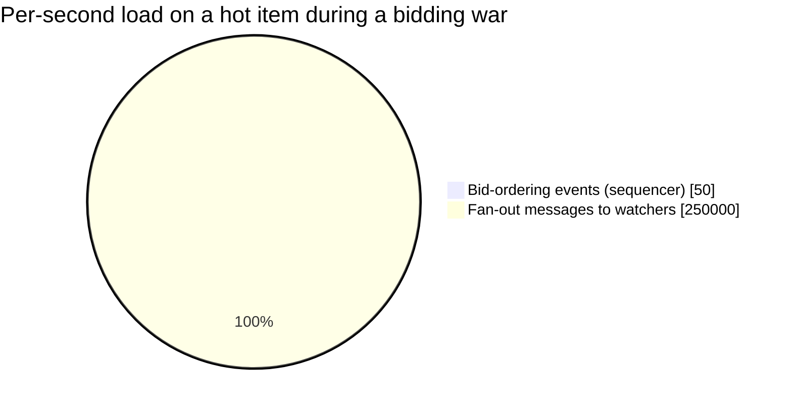

Bid ordering is a rounding error next to fan-out — the sequencer was never the scaling
challenge in this system; broadcasting to a hot item's watcher set is.

**Redo-the-chain test:** if the anti-snipe window is widened to the last 2 minutes (extend on any
bid within 2 minutes of the end, not just 30 seconds), a contested item's actual close time
becomes even less predictable in advance — a direct trade-off between giving bidders more chance
to respond and how long a popular item's auction can be dragged out by repeated late bids.

**The number worth memorizing:** per-item bid ordering is a small-scale problem (one sequencer per
item, far below any real throughput ceiling even during a bidding war) — the actual scaling
challenge in this system is fan-out to a hot item's watcher set, which can be substantial, not bid
ordering itself.

---

## API design

### `POST /v1/auctions/{itemId}/bids`

```json
{ "bidderId": "b_881", "amount": 245.00 }
```

Response:
```json
{ "status": "ACCEPTED", "newHighestBid": 245.00, "auctionEndTime": "2026-07-24T18:05:00Z", "sequenceNumber": 4821 }
```
or
```json
{ "status": "REJECTED", "reason": "BELOW_CURRENT_HIGHEST", "currentHighest": 250.00 }
```

| Field | Notes |
|---|---|
| `sequenceNumber` | The per-item sequencer's strict ordering value — this is what makes "which bid came first" an unambiguous, queryable fact, not an inference from timestamps alone |
| `auctionEndTime` | Server-authoritative and potentially just extended by this very bid — clients must sync their countdown display to this value, never compute it independently |

### WebSocket broadcast (to all watchers of `itemId`)

```json
{ "type": "BID_UPDATE", "newHighestBid": 245.00, "auctionEndTime": "2026-07-24T18:05:00Z" }
```

**The one sentence worth saying about the API surface:** *"Every bid response and broadcast
carries the server-authoritative end time, not just the new highest bid — because the end time
itself is mutable state that can change as a direct result of this very bid, and clients must
never compute their own independent countdown."*

---

## High-level architecture

### Architecture evolution (v1 → v2 → v3)

**v1 — each application server independently tracks "current highest bid":**

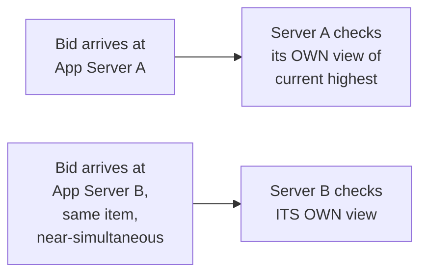

**Why it breaks:** two application servers, each independently deciding "is this bid higher than
what I think the current highest is," can both accept bids that conflict once compared against a
true, unified ordering — exactly the same class of race as the flash-sale chapter's
check-then-decrement, just applied to bid comparison instead of inventory count.

**v2 — a single database row as the source of truth, but no explicit ordering mechanism for
near-simultaneous bids:**

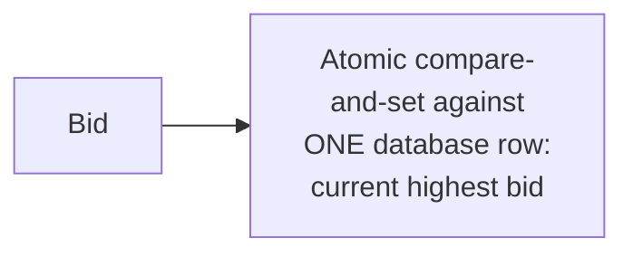

**Why it breaks:** this fixes the *correctness* of "is this bid accepted" (an atomic CAS is a real
improvement, same pattern as the flash-sale chapter's inventory reservation) — but doesn't by
itself give a strict, queryable total order of *all* bids on the item, which matters for the
anti-sniping window calculation (was this bid within the last 30 seconds of the *bid before it's*
extension, or the original end time) and for auditability/dispute resolution after the fact.

**v3 — the real system: a per-item sequencer producing a strict bid order, driving both
acceptance and end-time extension:**

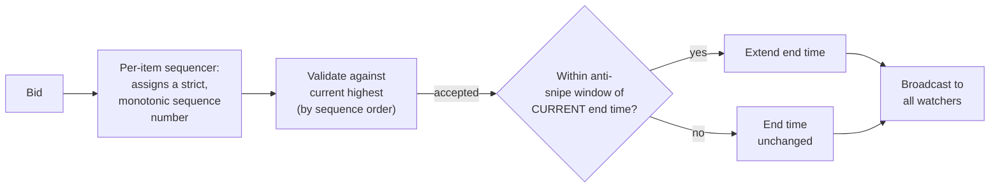

**What v3 fixes, one line each:** the per-item sequencer (reusing the exact mechanism from this
course's own Sequencer chapter) gives every bid a strict, unambiguous position, closing the
ordering-ambiguity gap v2 left open; and every accepted bid explicitly re-evaluates the anti-snipe
window against the *current* (possibly already-extended) end time, making the dynamic-end-time
behavior a first-class part of the pipeline rather than an afterthought.

---

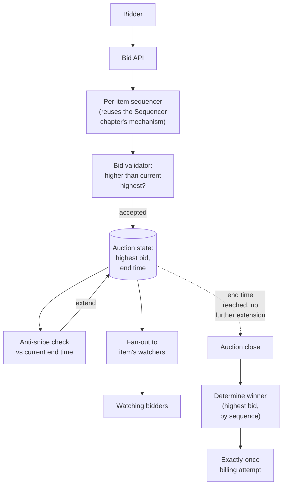

| Component | Role |
|---|---|
| Per-item sequencer | The single source of truth for bid ordering on this item — same mechanism as the Sequencer chapter, scoped per-item rather than platform-wide |
| Auction state | Holds current highest bid and current end time — mutated atomically on every accepted bid |
| Anti-snipe check | Re-evaluated on every accepted bid against the *current* end time, which it may itself be extending |
| Fan-out | Scoped to the specific item's watcher set, not a platform-wide broadcast — the scaling-relevant component per the capacity estimate |
| Winner determination + billing | Triggered once the end time is truly reached with no further extension — the exactly-once deep dive's subject |

---

## End-to-end request walkthroughs

### Walkthrough 1 — a normal accepted bid, no extension needed

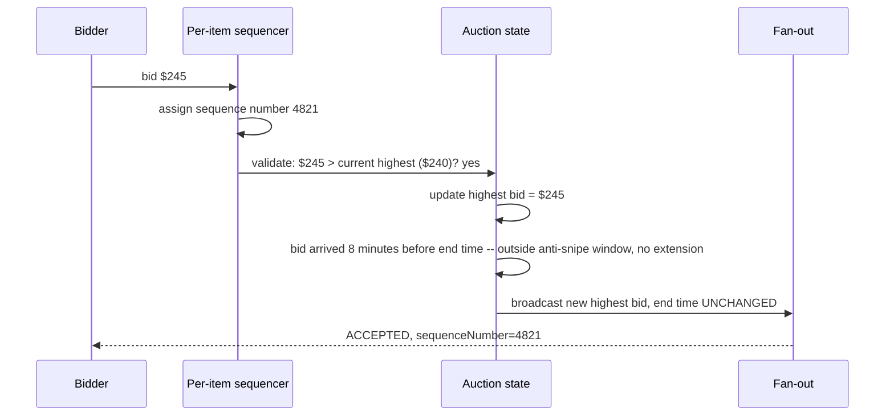

### Walkthrough 2 — a snipe attempt, end time extends

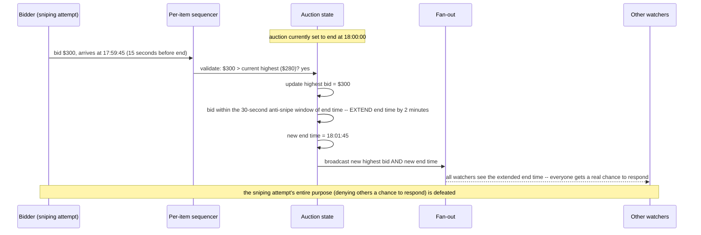

Walkthrough 2 is the entire reason anti-sniping exists — without it, the sniper's bid at 17:59:45
would simply win at 18:00:00 with no one able to respond in time.

### Walkthrough 4 — billing fails transiently at close, retries with the same idempotency key

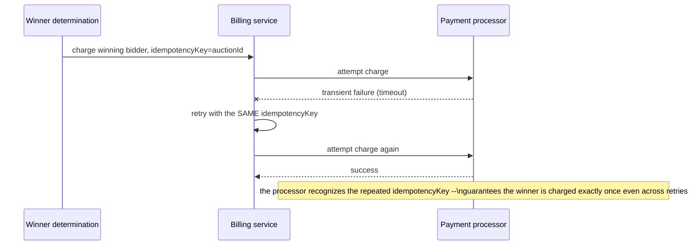

This is the concrete mechanism behind the
[exactly-once win notification & billing deep dive](#deep-dive-exactly-once-win-notification--billing)'s
idempotency-key requirement.

---

## Deep dive: per-item bid ordering

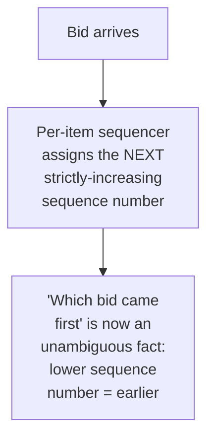

**Why this reuses the Sequencer chapter's mechanism directly, scoped per-item:** the underlying
problem — produce a strict, monotonic, agreed-upon ordering for a stream of events — is exactly
what a sequencer already solves; the only adaptation needed here is running one sequencer scope
per actively-bid-on item rather than one global platform-wide sequencer, since per the capacity
estimate, ordering only ever needs to be strict *within* a single item's bids, never across
different items.

**Why per-item scoping, not one global sequencer across all 50,000 concurrent auctions:** a single
global sequencer would become an unnecessary shared bottleneck and single point of contention
across every auction on the platform, when the actual correctness requirement (per item, not
platform-wide, ordering) never needed that scope in the first place — the same "match ordering
scope to what's actually required, no wider" instinct as the flash-sale chapter's decision not to
shard its own single hot inventory counter.

**Interview cheat-sheet:** *"Bid ordering is a sequencer problem, reusing exactly the mechanism
from the dedicated Sequencer chapter — scoped per item, not globally, since the correctness
requirement never needed platform-wide ordering, only per-item ordering."*

---

## Deep dive: anti-sniping / dynamic end time

The single most distinctive, most commonly missed mechanism in this chapter — already the
centerpiece of the mental model and walkthrough 2.

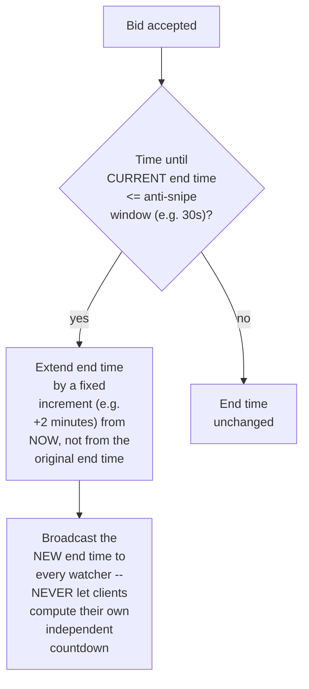

**Why the end time must be server-authoritative, broadcast explicitly, never client-computed:** if
each client independently computed "time remaining" from a countdown they started locally, an
extension event has to reach every client and correctly override whatever local countdown state
they'd built up — treating the end time as a value the server owns and pushes on every change,
rather than a duration each client tracks independently, avoids client-side drift and makes the
extension's effect immediate and consistent for everyone.

**Why extension is calculated from "now," not from the original end time:** repeatedly extending
by a fixed amount from the moment of each qualifying late bid (rather than, say, always resetting
to exactly 2 minutes from the *original* scheduled end) is what makes a sustained bidding war in
the final moments keep extending indefinitely as long as bids keep landing within the window —
this is the deliberate, expected behavior during a genuinely contested finish, not a bug to
prevent.

**Interview cheat-sheet:** *"The end time is server-authoritative, mutable state, extended from
'now' on every qualifying late bid, and broadcast explicitly to every watcher — never a value
clients compute independently from a duration they started tracking locally. This is the single
detail most system designs get wrong or omit entirely in this chapter."*

---

## Deep dive: exactly-once win notification & billing

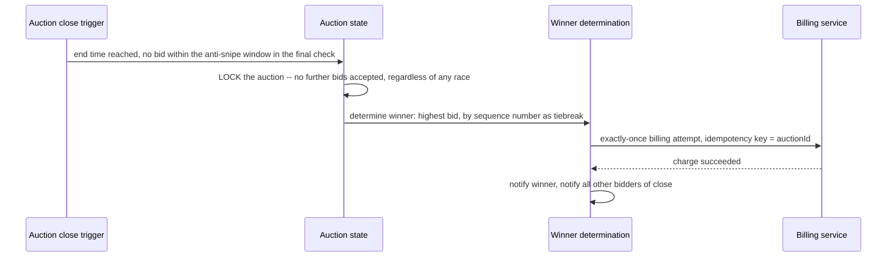

**Why the auction must be explicitly locked before winner determination, not just "stop accepting
new bids at the end time":** a bid arriving in the small window between "the end time was reached"
and "the system finished determining the winner" needs a defined, unambiguous outcome — locking
first (an atomic state transition, similar to the flash-sale chapter's atomic reservation) ensures
there's no race where a very-late bid could be processed after winner determination has already
begun.

**Why the billing attempt needs an idempotency key tied to the auction, not the bid:** if the
billing call needs to be retried (a transient payment-processor failure), retrying with the same
idempotency key ensures the winning bidder is charged exactly once even across multiple attempt/
retry cycles — the same idempotency discipline as the payment-system chapter, applied specifically
at auction close.

**Interview cheat-sheet:** *"Lock the auction atomically before winner determination begins, and
use an idempotency key tied to the auction (not the individual bid) for the billing attempt — this
guarantees exactly-once winner determination and exactly-once billing even under retries or a
race at the exact moment of close."*

---

## Data model

**Auction lifecycle:**

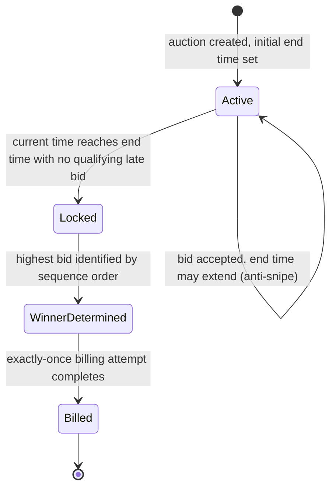

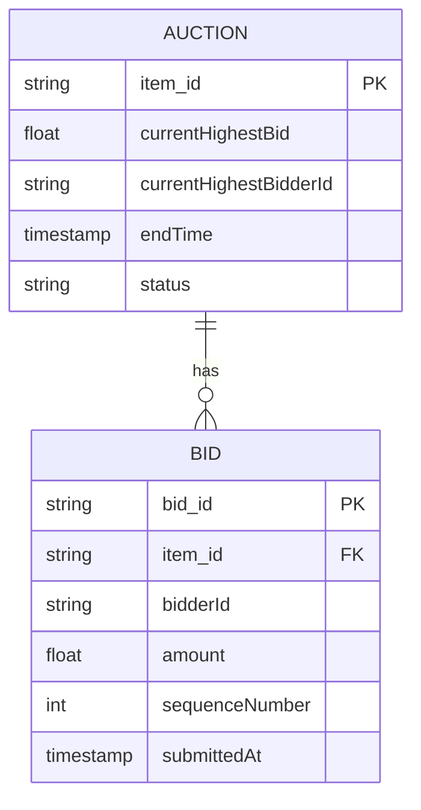

| Table | Storage choice & why |
|---|---|
| `Auction` | The hot, atomically-updated row per item — `currentHighestBid` and `endTime` are both mutated together on every accepted, qualifying bid |
| `Bid` | Append-only, ordered by `sequenceNumber` — the full audit trail of every bid, needed for dispute resolution and for recomputing the anti-snipe decision history if ever questioned |

---

## Failure modes & mitigations

| Failure mode | Impact | Mitigation |
|---|---|---|
| **The per-item sequencer for a hot item fails over** (leader change, process restart) | Risk of a gap or, worse, a repeated sequence number across the failover | Sequencer failover must preserve strict monotonicity across the transition — the same durability requirement as the fencing-token counter in the distributed-lock-service chapter |
| **A bid and the auction-close trigger race at the exact end-time boundary** | Ambiguous outcome — did this bid count or not? | The explicit lock-before-determine-winner step (per the exactly-once deep dive) resolves this deterministically: only bids sequenced before the lock count |
| **Fan-out to a viral item's watcher set overwhelms the broadcast infrastructure** | Slow or dropped live updates for that specific item | Scope fan-out to the item's actual watcher set (not platform-wide), the same viewport-scoping-style discipline as the collaborative-canvas chapter, just scoped by item interest instead of spatial region |
| **Billing fails transiently at auction close** | Winner not correctly charged | Retry with the same idempotency key (per the exactly-once deep dive) until success or a defined maximum, escalating to manual resolution rather than silently giving up |

---

## Non-functional walkthrough

**Scaling bid ordering is a non-problem at the per-item scope** — per the capacity estimate, even
a hot item's bidding-war throughput is far below a single sequencer's real capacity; what actually
needs horizontal scaling is running many per-item sequencer instances across many concurrent
auctions, not making any single sequencer faster.

**Scaling fan-out is the real scaling challenge**, proportional to a hot item's watcher count, not
to bid volume itself — the same lesson as the collaborative-canvas chapter, just with "watchers of
this item" as the relevant scope instead of "viewport."

**Consistency of the end time across all watchers must be strict** — every client must see the
same, server-broadcast value; this is one of the few places in this chapter where even brief
inconsistency (one bidder seeing a stale end time) directly affects real-world fairness.

---

## Security & compliance

- **Bid manipulation/shill bidding** (a seller using fake accounts to artificially inflate their
  own item's price) is a real trust concern in auction platforms — worth naming as a related but
  distinct problem from this chapter's ordering/timing focus; typically addressed via account
  verification and bidding-pattern anomaly detection layered on top of the core mechanics
  described here.
- **Audit trail of every bid, in strict sequence order**, supports dispute resolution — a bidder
  claiming their bid should have won needs a reconstructable, ordered record to resolve the claim
  against.
- **Billing/payment handling** at auction close should reuse the security and compliance practices
  of the dedicated Payment System chapter, rather than being redesigned bespoke for auctions.

---

## Cost & trade-offs

**Anti-snipe window width trades bidder fairness (more time to respond to a late bid) against
auction predictability (how long a contested finish can be dragged out)** — the central tuning
decision specific to this chapter, worth naming explicitly as a product/business trade-off, not a
purely technical one.

**Per-item sequencer scoping trades a small amount of operational complexity (managing many
sequencer instances/leases across concurrent auctions) for avoiding an unnecessary shared
platform-wide bottleneck** — an easy trade given how comfortably even hot-item bid volume fits
within a single sequencer's real capacity.

---

## Wrap-up: MVP vs. stretch

**In scope for an MVP:**
- Per-item sequencer for strict bid ordering, backing an atomically-updated auction-state record.
- Anti-sniping with a fixed extension window, server-authoritative and broadcast to all watchers.
- Exactly-once winner determination and billing at close, with an idempotency-keyed billing
  attempt.

**Explicitly out of scope for an MVP:**
- Shill-bidding/fraud detection — start with the core ordering/timing/billing mechanics correct,
  layer anomaly detection on top once real bidding-pattern data exists to inform it.
- Adaptive/tiered anti-snipe windows (e.g. a longer extension for higher-value items) — start with
  one global window, tune per-category once there's data suggesting it's warranted.

**Stretch goals, worth naming if asked "what's next":**
1. **Shill-bidding and fraud detection**, layered on top of the core mechanics, reusing the
   fraud-detection chapter's stream-processing and hybrid rules/ML pattern.
2. **Proxy/automatic bidding** (a bidder sets a max, the system bids incrementally on their
   behalf up to that max) — a real product feature with its own interesting sub-design around
   how it interacts with the anti-snipe extension mechanism.
3. **Tiered anti-snipe windows**, varying extension behavior by item value or category.

---

## Golden rules

- **Bid ordering needs a single source of truth per item — a sequencer, not independent
  per-server comparisons.** Reuse the Sequencer chapter's mechanism directly, scoped per item.
- **The auction end time is mutable, server-authoritative state, not a fixed value clients can
  compute independently** — anti-sniping extends it from "now" on every qualifying late bid, and
  every extension must be broadcast explicitly.
- **Lock the auction atomically before determining the winner** — this resolves any race at the
  exact end-time boundary deterministically.
- **Billing at close needs an idempotency key tied to the auction**, guaranteeing exactly-once
  charging even across retries.
- **Fan-out scaling, not bid-ordering throughput, is the real scaling challenge** — scope
  broadcasts to an item's actual watcher set, not the whole platform.

---

## Master cheat sheet

**One-liners:**
- Bid ordering is a per-item sequencer problem — reuse the dedicated Sequencer chapter's
  mechanism, scoped per item rather than platform-wide.
- The end time is mutable, server-authoritative state that extends from "now" on a qualifying late
  bid — never a value clients compute independently from a locally-started countdown.
- Lock the auction atomically before winner determination to resolve any race at the exact
  end-time boundary deterministically.
- Billing at auction close needs an idempotency key tied to the auction, guaranteeing exactly-once
  charging even across retries.
- Fan-out to a hot item's watcher set, not raw bid-ordering throughput, is the real scaling
  challenge in this system.

**Formula chain:**
```
fanout_messages_per_sec(item)  = bids_per_sec(item) x watchers(item)
```

**Numbers:** per-item bid-ordering throughput even during a bidding war is far below a single
sequencer's real capacity — the scaling challenge is running many per-item sequencers across many
concurrent auctions, not making any one faster · fan-out for a viral item can reach hundreds of
thousands of messages/sec, the actual capacity-planning bottleneck in this system · anti-snipe
windows are commonly tens of seconds, extending the end time by minutes on a qualifying late bid.
