# Design a Concurrent Stream/Device Limiter — The Story (narrative edition)

> **What this file is.** The reference file, `68-Design-a-Concurrent-Stream-Device-Limiter-FAANG-Guide.md`, is the one to recite from — requirements, API shapes, every trade-off table, the master cheat sheet. This file is a second way in: the same material as one continuous story, told in plain language. Engineers at a company keep hitting a wall, patch it, and the patch itself creates the next wall — until we land on the exact same design the reference file documents. The company, **Reelhouse** (a fictional streaming service), is made up. But every wall it hits, and every fix it reaches for, is something a real, named system actually does: Netflix's documented per-plan concurrent-stream limits (its help center states Basic/Standard/Premium tiers allow different numbers of simultaneous streams), Spotify's documented single-active-device playback model, and the same distributed-counter race conditions covered in rate-limiter and inventory-reservation chapters. I'll say clearly, every time, whether something is a documented fact or just a reasonable, `[illustrative]`-tagged guess.

**The trigger phrase** for this whole topic: *"you've reached the maximum number of devices streaming at once."* Keep one sentence in your head as you read: **a concurrent-stream limiter has to track a slot that's claimed and released thousands of times a day, by devices that frequently vanish without saying goodbye — so the hard problem was never the counter, it's noticing when a phone quietly went dark.** Everything below is just this one idea, getting harder in small, honest steps.

**One distinction worth nailing down before any of this starts:** "devices logged into the account" and "devices actively streaming right now" are not the same number. A household might have 7 phones, tablets, and TVs signed into one Reelhouse account — the plan doesn't restrict *that* at all. The Premium plan's "4 at once" promise is about **concurrent, live playback** — only the devices actually pulling video right now count against the limit. A device that's simply logged in but sitting idle, showing the home screen, uses zero slots. This is the whole reason "slot," not "device," is the right word for what actually gets claimed and released.

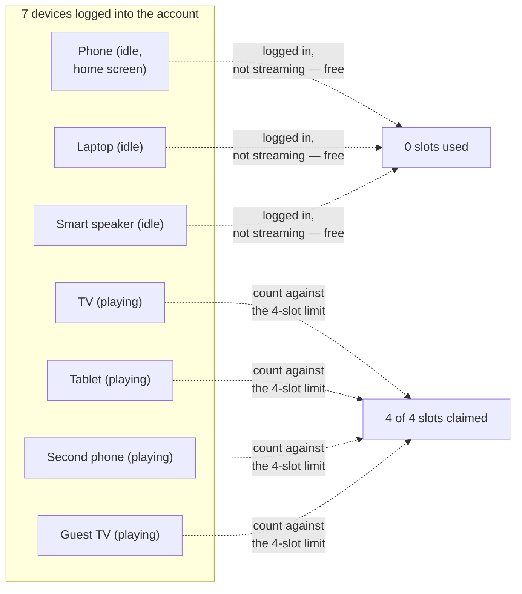

---

## Chapter 1 — The night four became six

It's Reelhouse's second year. The Premium plan promises "stream on 4 screens at once" — the same shape of promise Netflix's real Premium tier makes, documented on their own help pages. Under the hood, this is one column: `active_count` on the account row, checked before a new stream starts. The logic is two separate steps: **read** `active_count`, and if it's below 4, **increment** it.

A Friday-night premiere drops. In one household, two teenagers both hit play within the same 80-millisecond window. Both requests hit the database at nearly the same instant. Both read `active_count = 3`. Both think "3 is less than 4, I'm good," and both write `active_count = 4` — except a moment later a third device (a tablet, already mid-buffer from a slightly earlier tap) finishes its own read-3-then-write-4 cycle too. Reelhouse's monitoring that night shows **6,140 accounts with more active streams than their plan allows, within a single hour** `[illustrative]`. A 4-stream account is running 5, sometimes 6, screens at once.

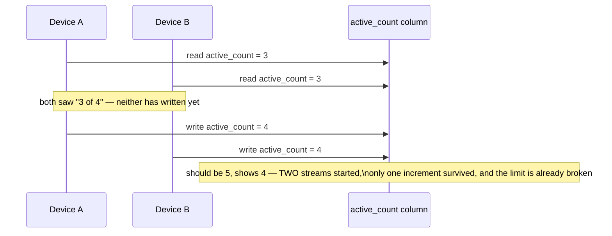

The obvious question: *why did two devices get to read the same number before either one wrote anything back?* Because checking the limit and updating the count were two separate database operations, with a gap between them wide enough for another request to sneak through. This is the exact same race a flash-sale inventory counter or a rate-limiter counter hits — reading and writing aren't one operation, so two readers can both see room that only actually exists once.

**The fix, and the analogy for the rest of this story:** treat the check-and-claim as **one indivisible motion** — an **atomic slot claim**, the same compare-and-set discipline as a flash sale's inventory reservation, just scoped to one account instead of one global item count. Think of it as a **library circulation desk with exactly one librarian and one stamp.** The librarian never says "let me check how many copies are left" and *then*, as a separate step, stamps your card — checking the shelf and stamping happen as one motion, so two patrons can never both walk away thinking they got the last copy.

**New problem, discovered within the same month:** the atomic claim closes the race. But now imagine a device claims a slot cleanly, starts playing — and then the phone loses signal in a subway tunnel. Nothing ever tells the library the book is coming back. The slot just... stays claimed. Forever.

**How I'd say this in an interview:** "A plain check-then-increment counter races exactly like a flash-sale inventory count — two simultaneous reads can both see spare capacity before either write lands. The fix is a single atomic compare-and-set claim, scoped to the account's own slot count. But that only fixes the race; it says nothing about what happens when a device disappears without releasing its slot, which turns out to be the far bigger problem."

---

## Chapter 2 — The book that never comes back

Three months after the atomic claim ships, Reelhouse's support queue starts filling with a specific complaint: *"it says I'm already streaming on 4 devices, but I only have one screen on right now."* An engineer pulls one flagged account and finds `active_count = 4`, but only **one** device is actually sending video frames. The other three are phones: one died on a hike with no signal for six hours, one had its app force-quit by the OS to save battery, one just had the tab closed without pressing pause first. None of them ever called `stop`. Across a 30-day sample, **2.3% of Premium accounts** hit a false "limit reached" error despite having fewer devices actually playing than their plan allows `[illustrative — a stand-in ratio, not a Netflix-published number]`.

The obvious question: *doesn't the app tell the server when it closes, crashes, or loses signal?* No — and this isn't a corner case, it's the normal case. A crash doesn't run cleanup code. A dead battery doesn't send a goodbye packet. A phone with zero bars can't send anything at all. Treating "explicit stop" as the only way a slot gets released means every one of these ordinary, everyday failures permanently leaks a slot.

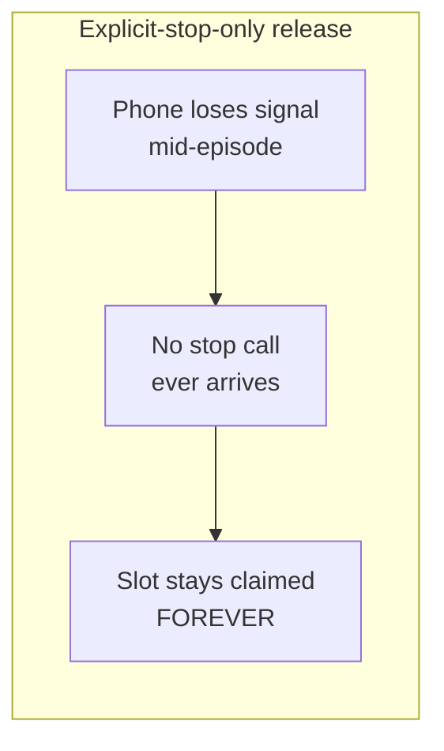

**The fix, continuing the library analogy:** give every claimed slot a **due date**, and require the device to **renew** it periodically while it's actually playing — a **heartbeat**. Every 30 seconds `[illustrative interval]`, a playing device pings the server: "still here, still watching." Each ping pushes the due date forward. If the due date arrives with no renewal, the library assumes the book was lost or abandoned, and **automatically puts it back on the shelf** — no explicit "I'm returning this" required.

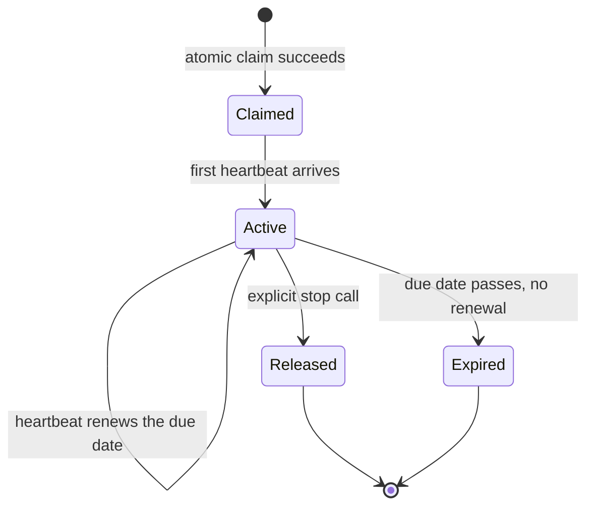

**New problem, immediately obvious once this ships:** what should the due date actually be? Set it too tight, and a phone that loses signal for even a few seconds gets treated as gone — while it's still legitimately being watched.

**How I'd say this in an interview:** "An explicit stop call can never be the only release mechanism, because most disconnects are ungraceful — crashes, dead batteries, dropped signal — none of which send a clean goodbye. The fix is a heartbeat with a due date: the device renews its slot periodically, and if renewal stops arriving, the slot auto-releases. That immediately raises a tuning question: how long is the due date, exactly?"

---

## Chapter 3 — How long before we assume it's lost

Reelhouse's first attempt sets the due date equal to the heartbeat interval: heartbeat every 30 seconds, slot expires if 30 seconds pass with no renewal. It ships on a Tuesday. By Wednesday evening's commute, complaints spike: people watching on their phones on the subway — completely normal cellular jitter, a signal that drops for 8-10 seconds and comes back — are getting **evicted mid-episode**, playback just stops, even though they never actually left. A sampled slice of heartbeats shows roughly **1 in 12 arrives 5-10 seconds late** under normal network conditions `[illustrative]` — and with a due date set exactly at the interval, any one of those late pings is enough to trigger a false eviction.

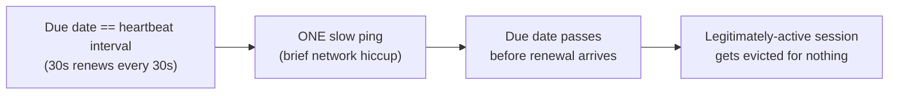

The obvious question: *why not just make the due date a lot longer, then?* Because that swings the trade the other way — a genuinely dead device (the hiking-trip phone from Chapter 2) now sits holding a slot far longer before anyone can reclaim it, blocking a legitimate new stream for longer than necessary.

**The fix:** set the due date to a **small multiple of the heartbeat interval** — not equal to it. Reelhouse lands on **3x**: heartbeat every 30 seconds, due date at 90 seconds. Continuing the library analogy: the renewal reminder doesn't arrive on the exact due date — you get two or three renewal windows of slack before the book is actually declared lost. One missed renewal reminder, from one dropped call, doesn't cost you the book; missing three in a row does.

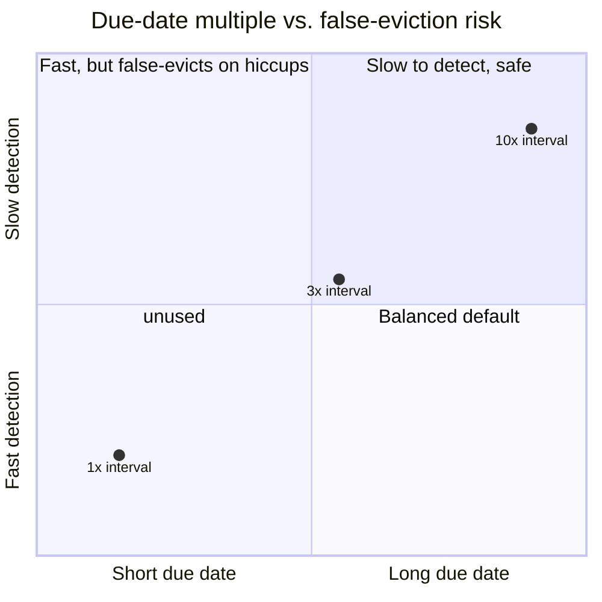

**New problem:** the tuning is right, but nobody's actually asked *how much traffic* a 30-second heartbeat from every single active stream, platform-wide, adds up to.

**How I'd say this in an interview:** "The due date can't equal the heartbeat interval — one slow ping from an ordinary hiccup would false-evict a genuinely active session. Setting it to roughly 3x the interval tolerates one or two missed beats while still bounding worst-case detection time to a known, small multiple — that's the standard shape of this trade-off, not a number you'd get right by guessing once."

---

## Chapter 4 — The pings outnumber the checkouts fifty to one

Someone on the infra team runs the actual math before the next capacity review, and the ratio is startling.

```
Reelhouse, illustrative scale:
  Concurrently active streams, platform-wide, at peak   = ~8,000,000
  Heartbeat interval                                     = 30 seconds
  -> Heartbeats/sec, platform-wide  = 8,000,000 / 30 ~= 267,000/sec

  Average session length                                 = ~50 minutes
  -> Session starts/sec (roughly matches stops at steady state)
                                     = 8,000,000 / (50 x 60) ~= 2,667/sec

  Ratio: heartbeat traffic vs. claim+release traffic  ~= 100x
```

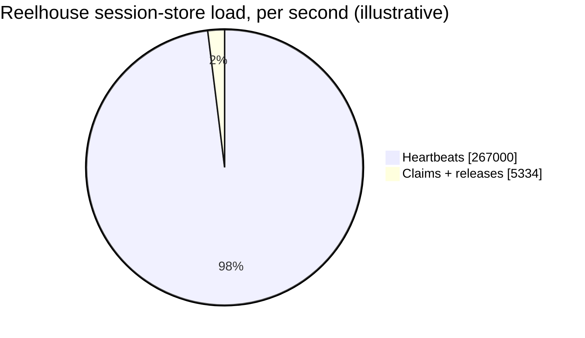

The obvious question: *if renewal traffic dwarfs claim traffic two orders of magnitude over, doesn't that mean the whole system needs one giant, shared, always-busy counter store?* No — and this is the encouraging part. Every account's slot count is completely independent of every other account's. Reelhouse doesn't need one library-wide circulation ledger that every renewal has to fight over — **each patron effectively has their own personal lending card**, checked and renewed without ever touching anyone else's record. That means the active-session store can simply be **sharded by `account_id`**: ten million accounts renewing at once never contend with each other, because none of them share a row, a lock, or a counter.

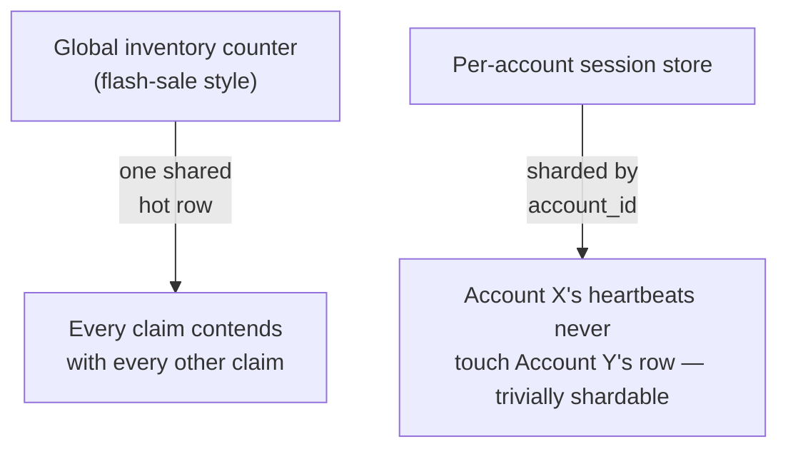

**Interview line:** *"Same atomic-claim discipline as a flash sale, but the resource is scoped per account instead of a single global item — which means, unlike a hot inventory counter, this scales by plain sharding with zero cross-account contention."*

**New problem:** scaling is solved. But nothing yet has decided what actually happens the moment a **5th** device tries to claim a slot on a 4-slot account, and that's a product decision, not an infrastructure one.

**How I'd say this in an interview:** "Heartbeat traffic dominates this system's load by roughly two orders of magnitude over claim/release traffic — sizing capacity around session-start rate alone would badly under-provision the real bottleneck. The saving grace is that every account's slot state is fully independent, so this shards trivially by account, with none of the single-hot-counter contention a flash sale has to fight."

---

## Chapter 5 — Full shelf, angry customer

Thanksgiving week: a Premium household (4-slot limit) already has Dad streaming a game (40 minutes in), Mom streaming a show (5 minutes in), one kid on a tablet (2 minutes in), another kid on a laptop (1 minute in). Grandma, visiting for the holiday, tries to start a movie on the living-room TV. All 4 slots are claimed. Platform-wide, **5th-stream-attempt events spike to roughly 180,000/day during the holiday week** `[illustrative]`.

The obvious question: *what should happen to Grandma's request?* There are exactly two honest answers, and Reelhouse has to pick one and name it out loud, not quietly default into one:

1. **Reject** — Grandma sees "you've reached your streaming limit," and is shown which devices are active so someone can manually stop one. Simple, never surprises anyone already watching, but doesn't unblock Grandma automatically.
2. **Evict** — the system automatically force-stops one existing session to make room, and Grandma streams immediately. Convenient for Grandma, but whoever gets force-stopped is surprised, mid-show.

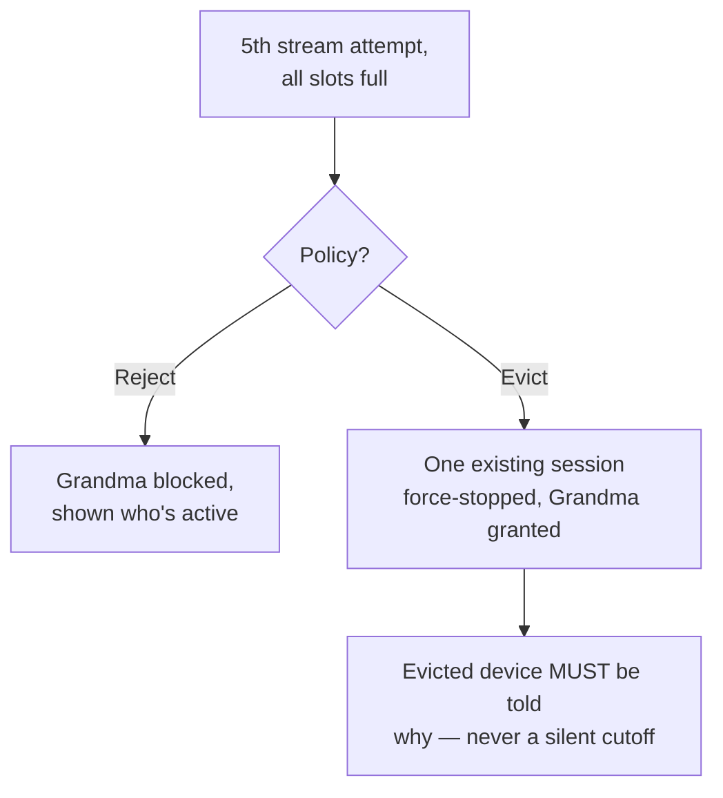

**Continuing the library analogy — the recall notice:** if the library allows recalls, it doesn't just silently repossess a book off the reader's coffee table. It sends a specific notice: *"this copy was recalled because another patron's hold took priority."* Reelhouse's evict path works the same way — the evicted device's client must show a clear message ("playback stopped because another device started streaming on this account"), never a blank screen that reads like a bug.

**New problem: which one gets recalled?** The naive answer — "evict whoever's been streaming longest" — punishes Dad for diligently watching his game uninterrupted for 40 minutes, while Mom's 5-minute-old session, paused and resumed three times because she keeps checking on the turkey, looks "newer" by the clock but has actually been touched most recently. Reelhouse defines the target as **least-recently-active** — the session with the *oldest last-interaction timestamp* — not simply the one with the earliest start time. Dad, quietly watching without touching anything, still risks being picked under a pure "least recently interacted with" rule too — which is exactly why this is a named product decision, not an obvious technical default: different definitions of "least active" produce different, defensible answers, and whichever one ships has to be explainable to a confused, evicted customer.

**How I'd say this in an interview:** "Reject and evict are both legitimate, and the interviewer wants you to name the trade-off, not silently pick one — reject never surprises an existing viewer but leaves the new stream blocked, evict resolves automatically but must always come with an explicit notification to whoever got force-stopped. And 'evict the oldest' needs a precise definition — longest-running and least-recently-interacted-with aren't the same session, and picking the wrong metric evicts the wrong person."

---

## Chapter 6 — The member who's in two branches at once

Reelhouse expands into a second region for latency reasons — European traffic now hits a European session store instead of routing back to the US one. Each region keeps its own **local** copy of each account's `active_count`, for speed.

A user on a European work trip streams two shows from their hotel; their family back in the US streams two more. **Each region's session store independently sees "2 of 4 slots used, room for 2 more"** — because neither region knows about the other's count. The account, whose real global total is already at 4, gets a 5th and 6th stream approved anyway, one from each region, because each region is only checking its own local, incomplete picture.

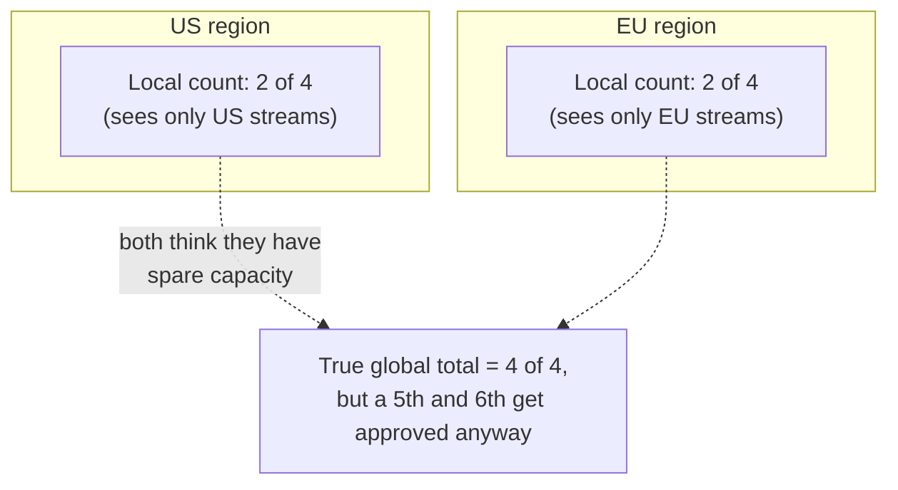

The obvious question: *why not just have regions periodically sync their counts?* Because "periodically" means there's always a window where the two copies disagree, and the claim decision has to be correct *at the instant it's made*, not eventually. Syncing after the fact doesn't stop the overshoot from happening in the first place.

**The fix:** an account's active-session record has exactly **one authoritative home** — sharded by `account_id`, not by region. Every claim, heartbeat, and release for that account, no matter which region the request physically entered from, gets routed to that **one** owning shard. It's the same "one authoritative source, not region-local approximations" lesson that shows up anywhere a shared, global constraint gets fragmented into independent local slices that can each think they have room the others already used up — one library card catalog, reached from every branch, rather than each branch keeping its own guess of what's checked out.

**New problem:** the count is globally correct now — but nothing yet has addressed what happens when the account's own *limit* changes underneath it, mid-flight.

**How I'd say this in an interview:** "Region-local session counts under-enforce a global limit the same way region-local inventory counts would in a flash sale — a traveling user or a household spread across regions can jointly exceed the true limit because neither region sees the other's claims. The fix is sharding the session store by account, not region, so every request for that account — wherever it enters — reaches one authoritative copy."

---

## Chapter 7 — The downgrade that tried to rewind time

A Premium household (4 slots) downgrades to Basic (1 slot) mid-month, right after buying groceries and skimming the pricing page — three devices are actively streaming at the exact moment the downgrade takes effect. The obvious, blunt implementation: the instant the plan changes, force-stop 3 of the 3 active sessions to bring the count in line with the new limit of 1.

The obvious question: *should a plan downgrade forcibly interrupt playback that was already running legitimately under the old, higher limit?* Reelhouse's answer, after a round of very unhappy support tickets from an earlier, blunter version of this logic: **no.** Retroactively yanking three people's shows the instant a plan changes is a worse experience than a brief, self-resolving overage. Instead: don't touch existing sessions. Let them end naturally (stop, crash-and-expire, or the viewer finishing the episode) — and enforce the new, lower limit only on the **next new claim** attempted after the downgrade.

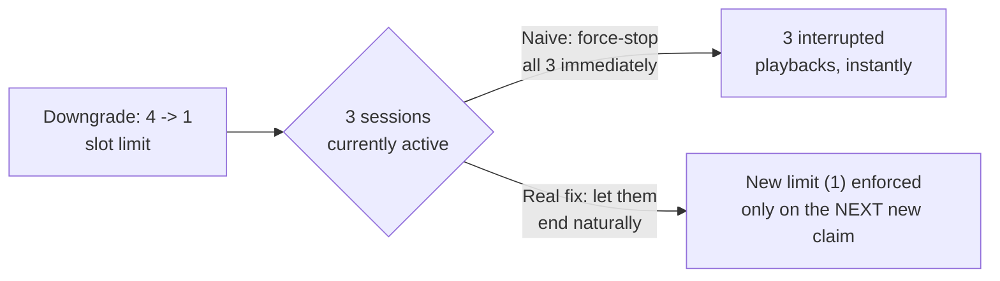

This is the same "read the current limit at claim time, don't retroactively enforce it against sessions that were already legitimately granted" idea threaded through the whole story — the plan service is consulted fresh on every new claim, so an upgrade *or* downgrade takes effect promptly for future streams, without punishing streams that started under the old rule.

**How I'd say this in an interview:** "A plan downgrade shouldn't retroactively force-stop sessions that were legitimately granted under the old, higher limit — that's a worse experience than a brief, temporary, self-resolving overage. The new limit gets enforced starting from the next new claim, by reading the account's current plan fresh at claim time rather than caching it indefinitely."

---

## Chapter 8 — Who gets to see the shelf, and why the shelf has a limit at all

Two smaller but real problems surface once Reelhouse's account-management page ships a feature customers had been asking for since Chapter 5: a screen listing every currently active session — device name, what's playing, when it started — with a button to manually end any one of them (so nobody has to wait for Grandma's request to get auto-rejected; they can just free up a slot themselves).

**Problem one — who's allowed to look at that list?** The account-holder's login sees it by design. But a support engineer investigating a billing ticket, or a compromised, phished credential, could also reach the same endpoint if it isn't scoped tightly. Real number: internal audit at Reelhouse flags **an internal tool that let any support agent list ANY account's active sessions, with no ticket-linkage check, used inappropriately in 4 confirmed cases over one quarter** `[illustrative]`. The fix is unglamorous but necessary: the session list and the "end this session" action are scoped strictly to the account owner's authenticated session, and any internal/support access path gets its own explicit audit trail, not the customer-facing endpoint reused with elevated privileges.

**Problem two — a newer engineer on the team asks the obvious question out loud: "why does this limit exist at all? Isn't it just leaving money on the table if someone's willing to add a 5th device?"** The honest answer isn't really about server capacity — a 5th concurrent video stream costs Reelhouse almost nothing extra to serve. The real reason, the same one that's genuinely true for Netflix's own documented plan tiers, is **content-licensing agreements**: studios license content under contracts that specify how many simultaneous streams a single subscription may support, and exceeding that isn't just a product inconvenience, it's a contractual violation. Naming this explicitly reframes the whole feature: it's not an arbitrary annoyance layered on top of the product, it's the mechanism that keeps Reelhouse's content deals valid.

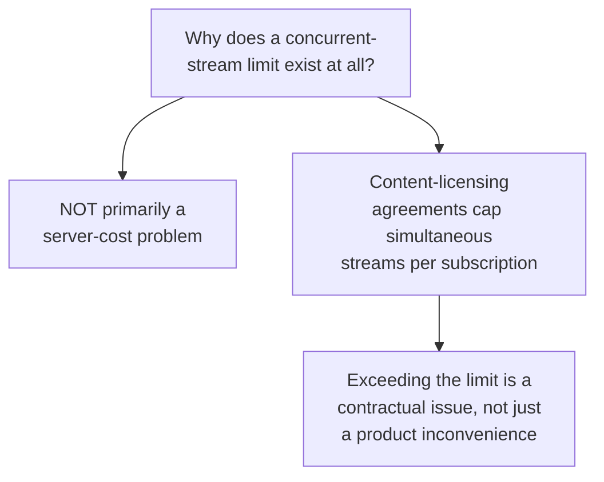

**A related, distinct problem worth naming but not solving here:** some accounts sit permanently pinned at their limit, streamed from many unrelated IP addresses that don't look like one household — a signal of credential-sharing beyond what the plan intends. That's a genuinely different problem from anything above — it's an abuse-detection question, not a concurrency-mechanics one, and it gets layered on top later using the same rules-plus-ML pattern a fraud-detection system would use, rather than baked into the slot-claim logic itself.

**How I'd say this in an interview:** "Letting the account holder see and end their own active sessions is a standard, expected feature, but it has to be scoped tightly — no shared endpoint that also lets an internal tool list any account's sessions without an audit trail. And it's worth naming *why* the limit exists at all up front: it's usually a content-licensing obligation, not a server-capacity one, which is why 'just let a 5th stream through, it barely costs anything' isn't actually the right call."

---

## Where the story actually lands

```mermaid
flowchart LR
    A["Ch1: check-then-increment\n(race lets 6 slots fill 4)"] -->|"fixes: race\nbreaks: crashed device never releases"| B["Ch2: heartbeat + due date"]
    B -->|"fixes: leaked slots\nbreaks: due date == interval false-evicts"| C["Ch3: due date = 3x interval"]
    C -->|"fixes: tuning\nbreaks: heartbeat traffic dominates load"| D["Ch4: shard by account_id"]
    D -->|"fixes: scale\nbreaks: what happens at the limit?"| E["Ch5: reject vs evict, notify"]
    E -->|"fixes: policy\nbreaks: two regions each see spare room"| F["Ch6: one authoritative shard, not per-region"]
    F -->|"fixes: global correctness\nbreaks: downgrade over-enforces retroactively"| G["Ch7: enforce new limit only on next claim"]
    G -->|"fixes: plan transitions\nsurfaces: who can see the session list, why the limit exists"| H["Ch8: scoped access + licensing rationale"]
```

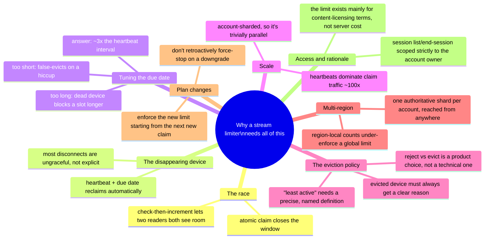

Every real concurrent-stream limiter you'll design in an interview sits somewhere on this chain. A simpler ask ("just enforce the max") might reasonably stop around Chapter 3. A question that explicitly mentions "what if someone's traveling" or "what happens on downgrade" is pointing you straight at Chapter 6 or 7. And "why does this limit even exist" or "who can see my devices" is Chapter 8 — walk there deliberately, not by accident, and only as far as the question actually asks.

---

## Grill me — adversarial follow-ups

**Q1: "Why not just make the due date really long — like 10 minutes — so you never false-evict anyone on a network hiccup?"**
Because that swings the trade too far the other way — a genuinely dead device (crashed app, dead battery) now sits holding a slot for up to 10 minutes before anyone can reclaim it, which directly blocks a legitimate new stream for that whole window. The due date is a dial between "how fast do we detect a dead session" and "how tolerant are we of a brief hiccup," and 3x the heartbeat interval is a reasonable middle point, not a magic number.

**Q2: "Couldn't you avoid the whole heartbeat mechanism by just having the client explicitly call `stop` when the app closes?"**
You can add that call as an optimization for the *graceful* case — it makes release near-instant when it works. But you can never rely on it as the *only* mechanism, because crashes, dead batteries, and dropped signal never run that code path at all; those are the common failure modes, not rare ones, so the heartbeat-and-expiry path has to handle them regardless.

**Q3: "Isn't sharding by account_id going to create a hot shard for a account with an unusually chatty family sending tons of heartbeats?"**
A single account is capped at its own plan's slot count — 4 streams, each heartbeating every 30 seconds, is a trivial load for one shard to absorb; there's no realistic account-level traffic pattern that approaches a hot-shard problem the way a single viral item would in a flash sale.

**Q4: "Why does the eviction policy need to notify the evicted device at all — isn't 'playback just stops' good enough?"**
An unexplained playback stop looks exactly like a bug or an outage to the person watching, and that's a guaranteed support ticket. A specific message — "another device started streaming on this account" — turns a confusing failure into an understood, expected product behavior, at basically zero engineering cost.

**Q5: "What actually stops two devices from racing on the SAME 5th-slot eviction — both trying to claim the freed slot at once?"**
The eviction and the new claim have to happen as part of the same atomic operation that found the account at its limit in the first place — identify the target, force-stop it, and grant the new claim, all under the same lock/compare-and-set that Chapter 1 introduced. It's the identical atomicity requirement as the original race, just applied one step later in the flow.

**Q6: "Why shard the session store by account instead of by region, if most of an account's traffic is from one region anyway?"**
Because "most of the time" isn't "always" — a traveling user or a household spread across two countries is exactly the case a region-sharded store gets wrong, and it gets it wrong silently, by both regions independently believing they have spare capacity. Account-based sharding is correct in both the common case and the edge case; region-based sharding is only correct in the common case.

**Q7: "On the downgrade case — what if the account holder complains that 3 sessions are still running after they just paid for a cheaper, 1-device plan?"**
That's a real, deliberate trade-off worth naming out loud: interrupting three people's shows the instant a plan changes is a worse experience than letting them finish naturally while the lower limit takes effect on the next new claim. It's a temporary, self-resolving overage, not a bug — and it's a far smaller cost than mid-episode playback cutting out with no warning.

**Q8: "Is 'least-recently-active' really well-defined, or is that hand-waving?"**
It has to be a concrete, product-owned definition before it ships — commonly "time since the session's last heartbeat carried a genuine playback-activity signal," not just "oldest claimed timestamp." The point isn't that one definition is objectively correct; it's that the definition has to be explicit and consistent, because an eviction that feels arbitrary to the person it happened to is the actual support-ticket generator, not the eviction itself.

**Q9: "Given this whole story, if someone says 'design a device/session limiter' cold, where do you start?"**
Ask the two questions that shape everything downstream: does the limit vary by plan tier, and what should happen when a new stream arrives at the limit — reject or evict? Then walk forward from an atomic per-account claim, straight into heartbeat-based liveness as the load-bearing mechanism, because that's genuinely where most of the design difficulty lives, not in the claim itself.

**Q10: "Isn't this all just a fancier rate limiter?"**
It shares the atomic-claim DNA with a rate limiter or a flash-sale reservation, but the defining difference is that the resource here is claimed and released continuously, by devices that routinely vanish without saying so — a rate limiter's counter resets on a timer, it doesn't need a liveness mechanism to notice a client disappeared mid-window. That's the whole reason heartbeats and due dates are the centerpiece of this design and not an afterthought.

---

## Pacing note

**If this is 60 seconds inside a bigger question:** say the library-card line — a slot is claimed and renewed, not claimed once and held forever — then say "atomic per-account claim, heartbeat-based liveness with a due date around 3x the interval, and I'd handle the eviction policy and multi-region correctness as deep dives if you want to go there." That's the whole shape in one breath.

**If this is the whole 15-20 minute focus:** walk the chapters in order — why a plain counter races, why heartbeats have to replace explicit-stop-only release, how to tune the due date, why this scales trivially by account, the reject-vs-evict product decision and how to pick the right eviction target, multi-region correctness, plan-change handling, then session-visibility and the licensing rationale if it comes up. Don't walk all eight unprompted — follow wherever the interviewer's questions actually point, and use the skipped chapters as your "if I had more time" closer.

---

## Active recall — no answers, test yourself cold

1. What's the one-sentence reason a concurrent-stream limiter is a harder problem than a simple counter?
2. Why did two devices both read `active_count = 3` and both get to stream, on Reelhouse's premiere night?
3. Why can't an explicit `stop` call ever be the only way a slot gets released?
4. Why shouldn't the due date equal the heartbeat interval exactly? What's the usual multiple instead?
5. What ratio does heartbeat traffic dominate claim/release traffic by, at real streaming-platform scale — and why does that matter for capacity planning?
6. What actually makes the active-session store "trivially shardable," compared to a flash sale's inventory counter?
7. Name both eviction policy options and the trade-off of each — which one never surprises an existing viewer, and which one resolves the new stream request automatically?
8. Why is "evict the longest-running session" a worse rule than "evict the least-recently-active session," and what's the difference between those two?
9. Walk through the exact sequence that lets a traveling user or spread-out household exceed the true concurrent-stream limit under region-local counting.
10. Why doesn't a plan downgrade force-stop existing sessions immediately?
11. Why is the "why does this limit even exist" question usually answered by licensing, not server capacity?

*Spaced repetition: test this list today, again in 2-3 days, again in a week.*

---

## Cheat sheet — one line per stop on the story

- **Check-then-increment counter**: races exactly like a flash-sale inventory count — two simultaneous reads can both see spare room before either write lands.
- **Atomic slot claim**: the fix — check and claim in one indivisible motion, the same compare-and-set discipline as a flash sale, scoped per account.
- **Heartbeat + due date**: an explicit stop call is never the only release mechanism, because most real disconnects are ungraceful; a missed renewal auto-releases the slot.
- **Due date = ~3x heartbeat interval**: equal to the interval false-evicts on a single hiccup; too long leaves a dead device blocking a slot too long. A small multiple balances both.
- **Heartbeat traffic dominates**: renewal pings outweigh claim/release traffic by roughly two orders of magnitude — size capacity around that, not session-start rate.
- **Sharded by account_id**: every account's slot state is fully independent, so this scales trivially, unlike a single global hot counter.
- **Reject vs evict**: a named product trade-off, not a technical one — reject never surprises an existing viewer, evict resolves automatically but must always notify whoever got force-stopped, with a specific reason, never a silent cutoff.
- **"Least-recently-active" needs a precise definition**: longest-running and least-recently-interacted-with are different sessions; the metric has to be explicit before it ships.
- **One authoritative shard per account, not per region**: region-local counts can each see spare capacity that doesn't globally exist — a traveling user or spread-out household can jointly exceed the real limit otherwise.
- **Plan downgrades enforce forward, not retroactively**: don't force-stop existing sessions the instant a plan changes; enforce the new, lower limit starting from the next new claim.
- **Session visibility is scoped strictly to the account owner**: the same list/end-session feature customers want is also the thing a compromised credential or an overbroad internal tool could abuse if it isn't tightly access-controlled.
- **The limit exists mainly for licensing, not server cost**: a 5th stream barely costs anything extra to serve — the real constraint is usually a content-licensing agreement capping simultaneous streams per subscription.
- **The meta-lesson**: every fix here buys one property (race-freedom, leak-freedom, tuned detection latency, scale, a defined policy, global correctness, or graceful plan transitions) — say the trade in the same sentence you propose the fix.
