# Design a Concurrent-Stream / Device Limiter (Netflix-style) — FAANG Interview Guide

> Source chapter type: distributed session-concurrency enforcement. Shares its atomic-claim
> mechanism with [the Flash Sale guide](./60-Design-a-Flash-Sale-System-FAANG-Guide.md) and
> [the Live Auction guide](./67-Design-a-Live-Auction-System-FAANG-Guide.md) — but the contended
> resource here isn't inventory or a bid, it's **one of a fixed number of concurrent-stream
> "slots" on a single account**, claimed and released continuously as devices start and stop
> playback, with a **session-eviction policy** deciding what happens when a new device wants to
> stream and every slot is already taken.

## Mental model

A subscription plan allows, say, 4 simultaneous streams. Five devices logged into the same
account can exist at once, but only 4 may be *actively streaming* at any given moment — starting a
5th stream must either be blocked or force one of the other 4 to stop. This sounds like a simple
counter, but three things make it a genuinely distinct problem from a static inventory count:

1. **Slots are claimed and released constantly, not once.** Unlike a flash-sale unit (bought once,
   done) or an auction (won once, done), a streaming slot is claimed when playback starts and
   released when it stops — normally within seconds to hours, thousands of times per account over
   a billing period. The system has to track *live* occupancy, not a one-time decrement.
2. **A stopped device doesn't always say so.** An app that crashes, a phone that loses signal
   mid-episode, a browser tab closed without pausing first — none of these send a clean "I'm done"
   signal. The slot has to be reclaimed via a **heartbeat/liveness** mechanism, not just an
   explicit release call, or a crashed device permanently locks a slot.
3. **When all slots are full, "reject the new stream" isn't the only policy.** Real products often
   let the newest stream win, evicting the least-recently-active existing session — a deliberate
   business decision with real UX consequences (the person mid-episode on the evicted device sees
   playback stop) that has to be designed explicitly, not left as an afterthought.

**The one sentence to say out loud:** *"This is the same atomic-claim family as a flash sale or an
auction, but the resource is reused continuously rather than consumed once — which means the hard
problems are liveness detection for ungraceful disconnects and an explicit eviction policy, not
just the atomic claim itself."*

**The one picture to remember forever:**

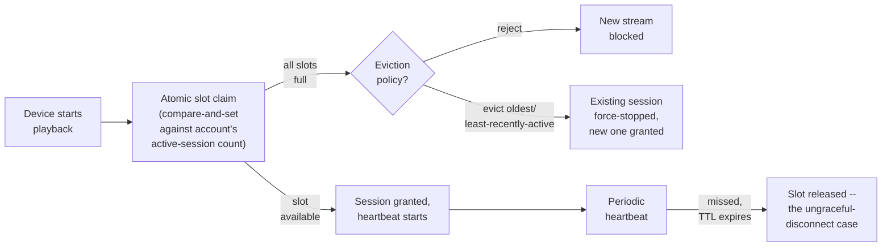

**Memory hook:** *"Claim atomically, release on either an explicit stop OR a missed heartbeat, and
decide the eviction policy up front — a crashed device is the normal case here, not an edge case."*

---

## Table of contents
[How to Identify This Topic](#how-to-identify-this-topic-in-an-interview) ·
[Interview Playbook](#interview-playbook) · [Requirements](#requirements-clarification) ·
[Capacity Estimation](#capacity-estimation-worked) · [API Design](#api-design) ·
[High-Level Architecture](#high-level-architecture) ·
[Architecture Evolution v1→v2→v3](#architecture-evolution-v1--v2--v3) ·
[End-to-End Walkthroughs](#end-to-end-request-walkthroughs) ·
[Deep Dive: Atomic Slot Claim](#deep-dive-atomic-slot-claim) ·
[Deep Dive: Heartbeat-Based Liveness](#deep-dive-heartbeat-based-liveness) ·
[Deep Dive: Session Eviction Policy](#deep-dive-session-eviction-policy) ·
[Deep Dive: Multi-Region Session Consistency](#deep-dive-multi-region-session-consistency) ·
[Data Model](#data-model) · [Failure Modes](#failure-modes--mitigations) ·
[Non-Functional Walkthrough](#non-functional-walkthrough) ·
[Security & Compliance](#security--compliance) · [Cost & Trade-offs](#cost--trade-offs) ·
[Wrap-Up](#wrap-up-mvp-vs-stretch) · [Golden Rules](#golden-rules) ·
[Cheat Sheet](#master-cheat-sheet)

---

## How to identify this topic in an interview

- "Design a system that limits the number of simultaneous streams/sessions per account" (Netflix,
  Spotify Family, any subscription streaming product).
- The tell that distinguishes this from a plain rate-limiter or inventory-counter chapter: the
  interviewer emphasizes **devices starting and stopping continuously** and/or asks "what happens
  if a device just disappears" — that's the liveness/heartbeat problem, the actual substance of
  this chapter.
- A follow-up like "what happens when someone tries to start a 5th stream on a 4-stream plan" is
  the [eviction-policy deep dive](#deep-dive-session-eviction-policy) — the point where most
  candidates default to "just reject it" without considering the product alternative.

---

## Interview playbook

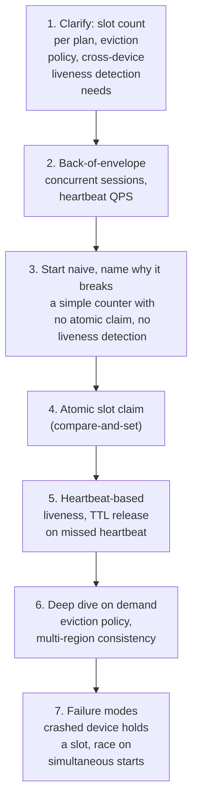

**What the interviewer is actually grading at each step:**
- Step 3: do you recognize, unprompted, that a plain counter with no atomic claim races the same
  way a flash-sale inventory count does — two devices starting playback within milliseconds of
  each other can both read "3 of 4 slots used" and both proceed?
- Step 5: do you know that an explicit "stop" signal alone is insufficient — most real
  disconnects are ungraceful, and the slot must be reclaimed via a heartbeat timeout, not just a
  clean release call?
- Step 6: when the interviewer asks what happens at the limit, do you propose a *specific*
  eviction policy (and its UX consequence) rather than a vague "we'd handle that somehow"?

---

## Requirements clarification

### Functional

| # | Requirement | Notes |
|---|---|---|
| F1 | Enforce a maximum number of concurrent active streams per account, per the account's plan | The core constraint |
| F2 | Reclaim a slot automatically when a device stops streaming, gracefully or not | Ungraceful disconnects are the common case, not the exception |
| F3 | Decide what happens when a new stream starts while all slots are full | Reject, or evict an existing session — a product decision with real consequences |
| F4 | Reflect plan changes (upgrade/downgrade) in the enforced slot count promptly | A downgrade might leave more active sessions than the new plan allows |
| F5 | Show the account holder their currently active sessions/devices, with the ability to manually end one | A standard, expected account-management feature |

### Non-functional

| Requirement | Target | Why this number |
|---|---|---|
| Slot claim latency | Low, sub-second — this gates whether playback starts at all | A slow claim check directly delays video start, a highly visible UX moment |
| Claim correctness | Absolute — zero tolerance for exceeding the plan's slot limit | The entire point of the system; letting a 5th stream through on a 4-stream plan is a direct revenue/licensing violation |
| Liveness detection latency | Slot must be reclaimed within a bounded time after an ungraceful disconnect (e.g. tens of seconds to low minutes) | Too slow, and a crashed device blocks a legitimate new stream for an unacceptably long time; too fast, and a brief network hiccup incorrectly evicts an active session |
| Eviction fairness/predictability | The policy must be consistent and explainable to the account holder | An arbitrary-feeling eviction (why did MY show stop?) is a support-ticket generator |
| Consistency across regions | An account's active-session count must be globally correct, not per-region | A user traveling, or a household spread across regions, must not be able to exceed the limit by having each region independently think it has spare capacity |

**Clarifying questions worth asking the interviewer up front — and what each answer changes:**

| Question | If the answer is... | ...then this changes |
|---|---|---|
| "Is the slot limit a fixed number for all accounts, or does it vary by subscription tier?" | Varies by tier | Confirms the claim check must read the account's current plan, not a hardcoded global constant, and that plan changes need to propagate promptly |
| "What should happen when a new stream starts and all slots are full — reject, or evict the oldest/least-recently-active session?" | Evict least-recently-active | Confirms the eviction-policy deep dive's mechanism is in scope, not just a reject-and-error response |
| "How quickly must a crashed device's slot become available again?" | Within roughly a minute | Directly sizes the heartbeat interval and TTL in the liveness deep dive |
| "Is this single-region or does it need to work correctly for a user connecting from different regions?" | Must be globally correct | Confirms the multi-region consistency deep dive matters — this can't be a per-region independent counter |

**Say this out loud in the interview:** *"I want to treat 'the device just disappeared without
saying goodbye' as the normal case to design for, not a rare failure — that's what actually
distinguishes this from a simple atomic counter, and it's where I'd spend the most design time."*

---

## Capacity estimation, worked

```
Given (illustrative, a large streaming platform):
  Subscriber accounts                              = 250,000,000
  Average concurrent-stream limit per account        = 4
  Accounts with at least one active stream at peak   = ~15% of subscribers
                                                         = 37,500,000
  Average active streams per active account           = ~1.4 (rarely all 4 slots used at once)

Concurrently active sessions, platform-wide, at peak    = 37,500,000 x 1.4 ~= 52,500,000
  -> this is the number of "occupied slots" the system tracks at any given moment -- large in
     aggregate, but each account's own claim/check only ever touches THAT account's small slot
     count (up to 4), never a global structure -- this is naturally shardable by account_id.

Session start/stop rate:
  Average session duration                           = ~50 minutes (a typical episode/movie)
  Session starts/sec, platform-wide                    = 52,500,000 / (50 x 60) ~= 17,500/sec
  Session stops/sec (roughly matching starts at
    steady state)                                       ~= 17,500/sec
  -> tens of thousands of claim/release operations per second -- each one is a small, per-account
     atomic operation, not a shared global bottleneck, since accounts are independent.

Heartbeat load:
  Heartbeat interval (illustrative, 1/3 of the
    liveness TTL of ~90 seconds)                        = ~30 seconds
  Heartbeats/sec, platform-wide                          = 52,500,000 / 30 ~= 1,750,000/sec
  -> heartbeat traffic DOMINATES claim/release traffic by roughly two orders of magnitude --
     the same "steady-state renewal traffic outweighs one-time acquisition traffic" lesson as
     the distributed-lock-service chapter, here applied to streaming sessions instead of locks.
```

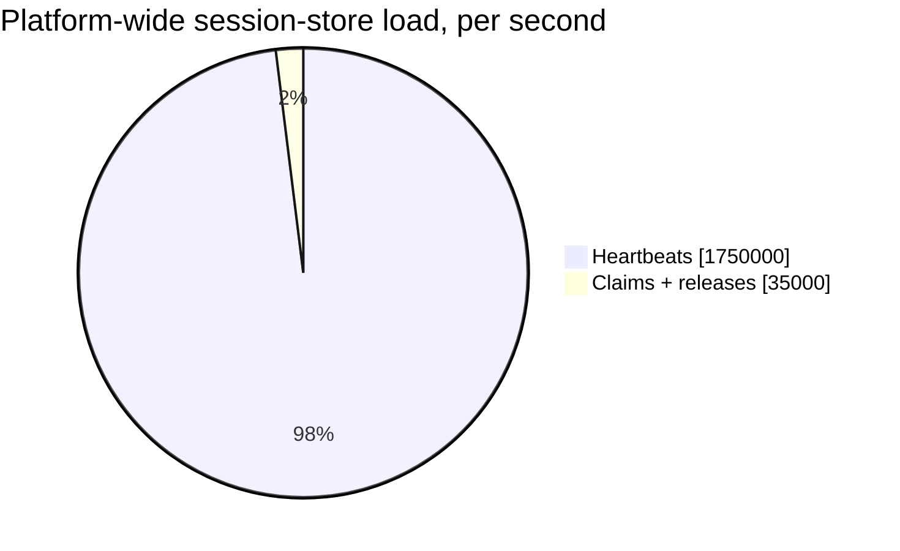

Heartbeats outweigh claim/release traffic by roughly two orders of magnitude — the same
"renewal traffic dominates" pattern as the distributed-lock-service chapter, here applied to
streaming sessions instead of locks.

**Redo-the-chain test:** if the heartbeat interval is doubled to 60 seconds (less network chatter
per session, but slower to detect a dead one), heartbeat QPS halves to ~875,000/sec while the
liveness-detection latency roughly doubles — a direct, computable trade-off between network
overhead and how quickly a crashed device's slot frees up.

**The number worth memorizing:** heartbeat/renewal traffic, not claim/release traffic, dominates
this system's steady-state load by roughly two orders of magnitude — sizing capacity around
session-start rate alone would badly under-provision the actual bottleneck.

---

## API design

### `POST /v1/sessions/start`

```json
{ "accountId": "acc_881", "deviceId": "dev_44821", "contentId": "movie_9021" }
```

Response:
```json
{ "sessionId": "sess_71209", "status": "GRANTED", "heartbeatIntervalSeconds": 30 }
```
or, at the limit with a reject policy:
```json
{ "status": "REJECTED", "reason": "CONCURRENT_LIMIT_REACHED", "activeSessions": [ { "deviceId": "dev_11", "contentId": "show_A" }, ... ] }
```
or, at the limit with an eviction policy:
```json
{ "status": "GRANTED", "evictedSessionId": "sess_55012", "evictedDeviceId": "dev_11" }
```

### `POST /v1/sessions/{sessionId}/heartbeat`

```json
{ "status": "PLAYING" }
```

### `POST /v1/sessions/{sessionId}/stop`

Explicit, graceful release — but per the mental model, the system must never assume this call
will reliably arrive.

| Field | Notes |
|---|---|
| `evictedSessionId` | Present only when the eviction policy is active and this start caused an existing session to be force-stopped — the evicted device's client needs this to show a clear "playback stopped because another device started streaming" message, not a silent, confusing cutoff |
| `heartbeatIntervalSeconds` | Told to the client explicitly rather than hardcoded on the client side, so the server can tune it without a client release |

**The one sentence worth saying about the API surface:** *"Starting a session is a claim, not a
guarantee held forever — every granted session carries a heartbeat contract, and the client is
told exactly how often to renew, because the server owns the liveness policy, not the client."*

---

## High-level architecture

### Architecture evolution (v1 → v2 → v3)

**v1 — a plain counter, check-then-increment:**

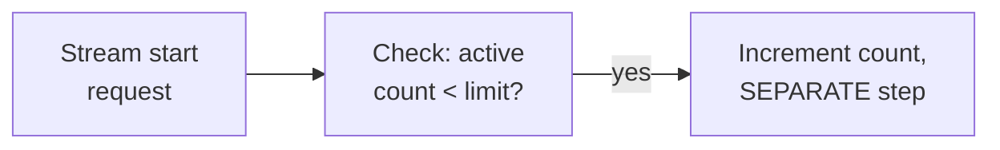

**Why it breaks:** the same race as any check-then-write pattern elsewhere in this course — two
devices starting playback within milliseconds of each other can both read "3 of 4 slots used"
before either writes its increment, and both proceed, exceeding the limit.

**v2 — atomic claim, but explicit-release-only (no heartbeat):**

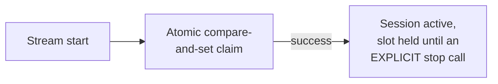

**Why it breaks:** the atomic claim (v2's real improvement) fixes the race — but per the mental
model, most real disconnects are ungraceful and never send an explicit stop. A crashed app or a
phone that loses signal mid-stream permanently holds its slot, eventually starving the account of
usable concurrent-stream capacity for no legitimate reason.

**v3 — the real system: atomic claim + heartbeat-based liveness + explicit eviction policy:**

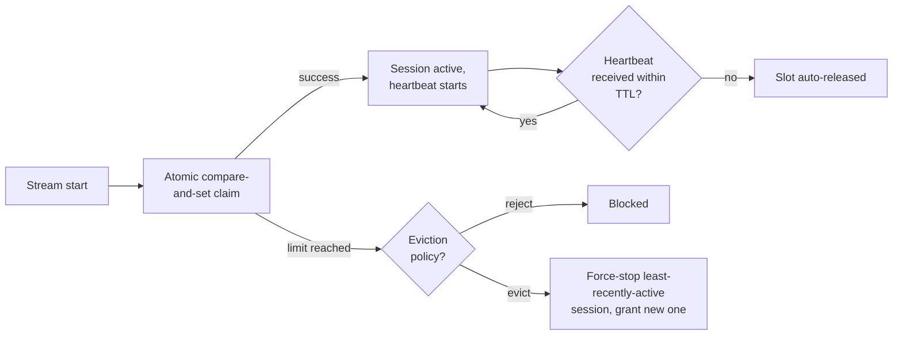

**What v3 fixes, one line each:** the atomic claim (already in v2) prevents the race; heartbeat-
based liveness reclaims a slot automatically when a device disappears without a clean stop,
closing v2's gap; and an explicit eviction policy gives a defined, product-level answer for what
happens at the limit, rather than a hardcoded reject.

---

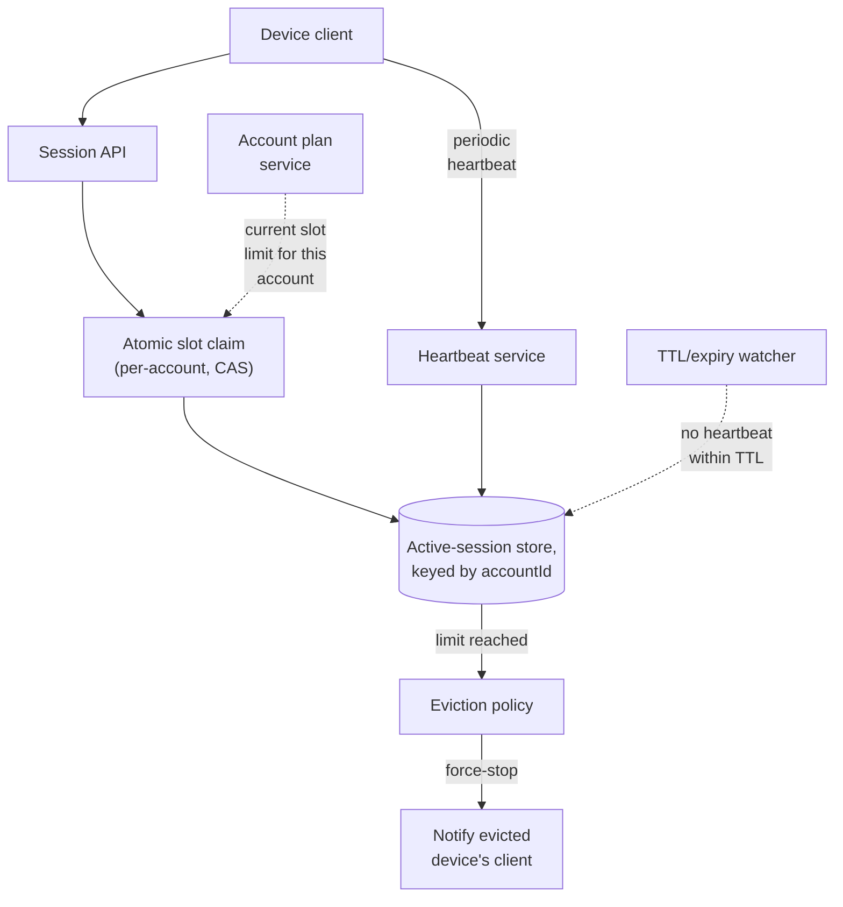

| Component | Role |
|---|---|
| Atomic slot claim | Same compare-and-set discipline as the flash-sale/auction chapters, scoped per account rather than per item |
| Active-session store | Sharded by `accountId` — each account's claim/heartbeat traffic is fully independent of every other account's |
| TTL/expiry watcher | Reclaims slots for sessions that missed their heartbeat window — the mechanism closing v2's gap |
| Eviction policy | Applied only when a claim finds the account at its limit — decides reject vs. force-stop-and-grant |
| Plan service | The source of truth for an account's current slot limit, read at claim time so a plan change takes effect promptly |

---

## End-to-end request walkthroughs

### Walkthrough 1 — normal session lifecycle, graceful stop

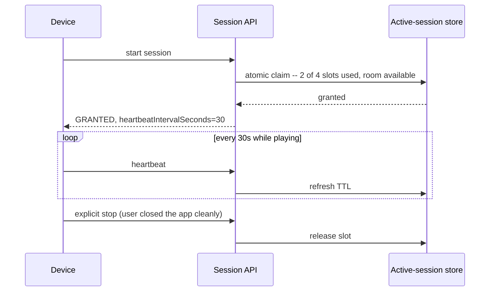

### Walkthrough 2 — a crashed device's slot is reclaimed via missed heartbeat

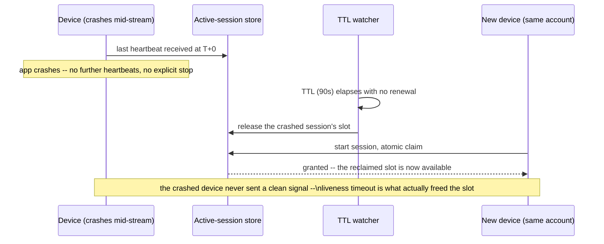

### Walkthrough 3 — the limit is reached, eviction policy force-stops the oldest session

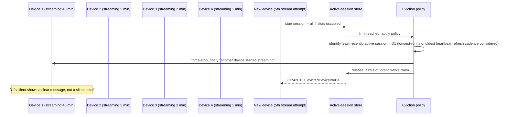

Walkthrough 3 is the concrete case the [eviction-policy deep dive](#deep-dive-session-eviction-policy)
is about — note the policy must be well-defined (here: oldest continuously-active session) and
must always notify the evicted device with a clear reason.

---

## Deep dive: atomic slot claim

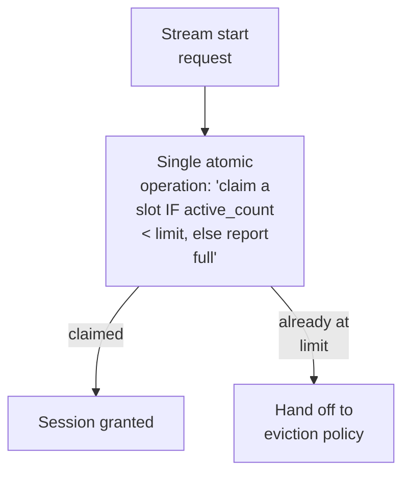

**Why this must be one atomic operation, not check-then-write:** identical reasoning to the
flash-sale chapter's inventory reservation — reading "3 of 4 used" and then separately writing
"now 4 of 4" leaves a race window where two simultaneous starts can both read 3 and both proceed
to 5. A single compare-and-set against the account's active-session count (or an equivalent
atomic increment with a bound check) closes that window.

**Why this is naturally shardable, unlike a global inventory counter:** unlike the flash-sale
chapter's single, platform-wide hot counter, every account's slot claim is entirely independent of
every other account's — there's no shared contention point, no single number the whole platform
agrees on. This makes horizontal scaling trivial by sharding the active-session store by
`accountId`, a meaningfully easier scaling story than a single hot inventory count.

**Interview cheat-sheet:** *"Same atomic-claim discipline as a flash sale, but scoped per account
— which means, unlike a single global hot counter, this scales by simple sharding with zero
cross-account contention."*

---

## Deep dive: heartbeat-based liveness

Already the centerpiece of the mental model and architecture evolution — the deep dive states the
tuning trade-off precisely.

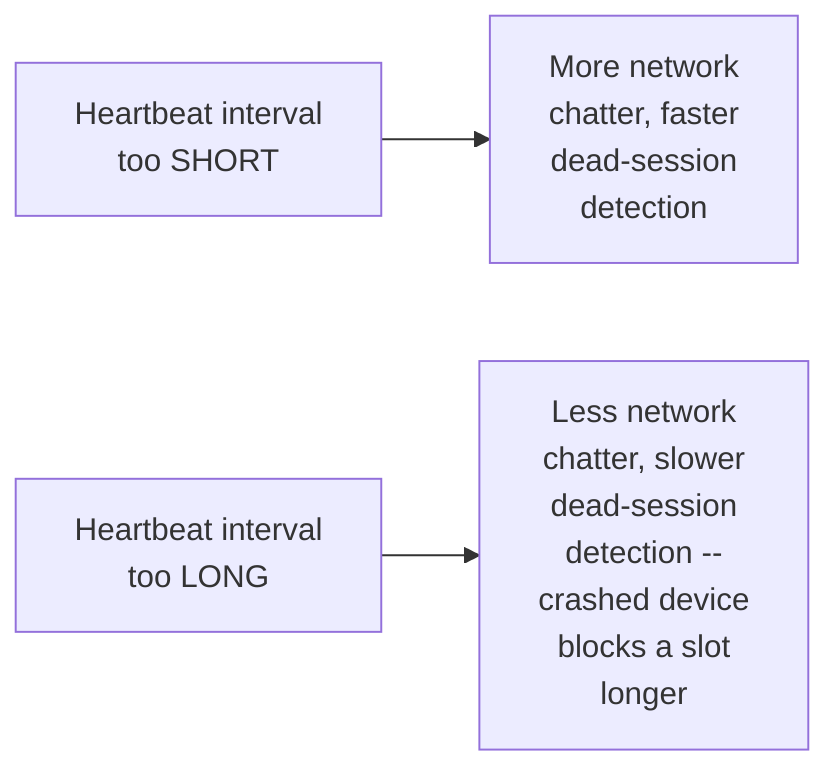

**Why an explicit stop call can never be the only release mechanism:** per the mental model, a
crashed app, a lost connection, or a force-closed browser tab never sends a clean signal — treating
explicit stop as sufficient means every one of those common, ordinary failure modes permanently
leaks a slot. The TTL-based reclaim is not a backstop for a rare case, it's the mechanism handling
what is, in practice, a very common one.

**Why the TTL should be a small multiple of the heartbeat interval (e.g. 3x), not equal to it:** a
single missed heartbeat due to an ordinary, brief network hiccup shouldn't immediately evict a
legitimately active session — allowing a couple of missed intervals before declaring the session
dead avoids false-positive reclaims while still bounding worst-case detection latency to a known,
small multiple of the interval.

**Interview cheat-sheet:** *"An explicit stop call is a nice-to-have, never the only release
mechanism — ungraceful disconnects are the common case, and a TTL set to a small multiple of the
heartbeat interval (not equal to it) balances fast dead-session detection against not evicting a
session over one missed beat from a brief network hiccup."*

---

## Deep dive: session eviction policy

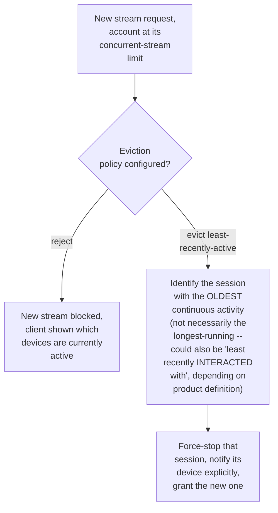

**Why "reject" and "evict" are both legitimate, product-level choices, not a technical
correctness question:** rejecting is simpler and never surprises an existing viewer, but frustrates
the person trying to start a new stream with no path forward except manually stopping another
device themselves; evicting unblocks the new stream automatically but surprises whoever gets
force-stopped. Neither is "more correct" — this is a product decision the interviewer wants named
explicitly, with its trade-off, not silently assumed.

**Why the evicted device must always be notified with a specific reason, never silently cut off:**
an unexplained playback stop reads as a bug or an outage to the affected viewer — a clear message
("playback stopped because another device started streaming on this account") converts a
confusing failure into an understood, expected product behavior.

**Interview cheat-sheet:** *"Name both policy options and their trade-off explicitly — reject is
simpler but blocks the new stream with no automatic resolution; evict unblocks it automatically
but must always come with a clear notification to whichever device got force-stopped, never a
silent cutoff."*

---

## Deep dive: multi-region session consistency

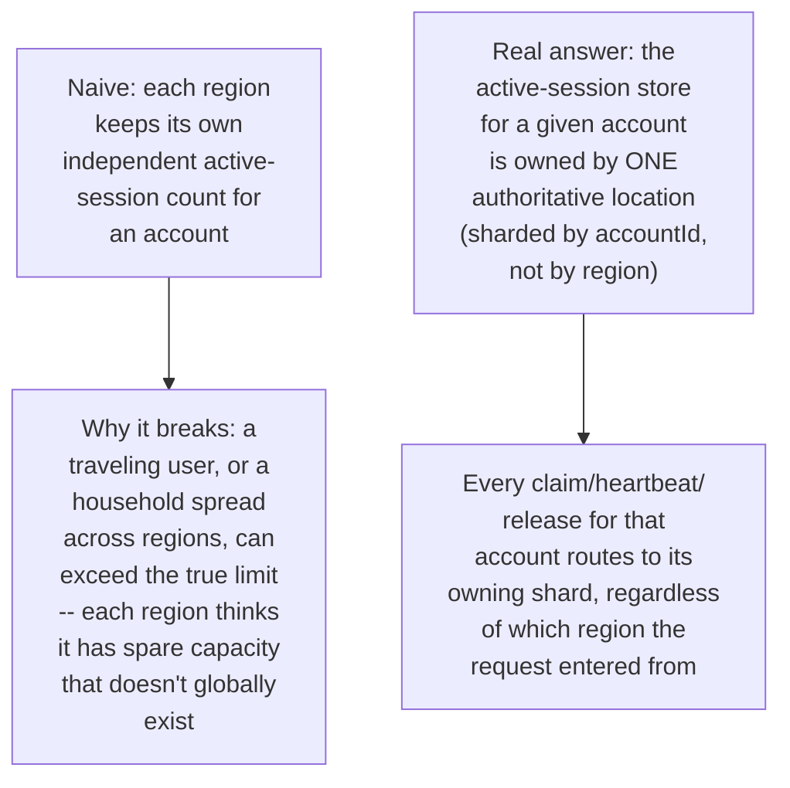

**Why this is the same lesson as the multi-source sanctioned-country chapter's "one authoritative
source per resource," just applied to session state instead of compliance data:** a per-region
independent count is the same mistake as per-DC independent quota slices in the KYC-verification
chapter — both under-count a shared, global constraint by fragmenting it. The fix is identical in
shape: one authoritative owner per account's session state, reached from any region, rather than
region-local approximations.

**Interview cheat-sheet:** *"Shard the active-session store by account, not by region — a request
entering from any region routes to that account's one authoritative shard, so the true global
count is never fragmented into region-local approximations that can jointly exceed the real
limit."*

---

## Data model

**Session lifecycle:**

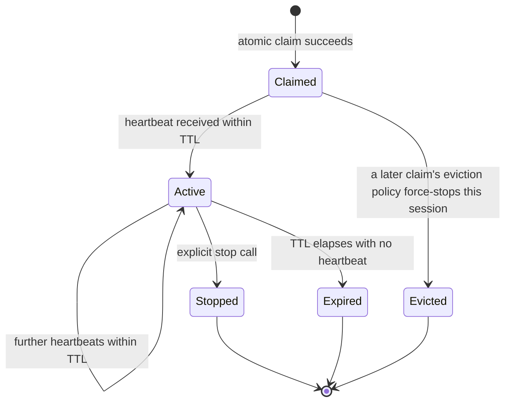

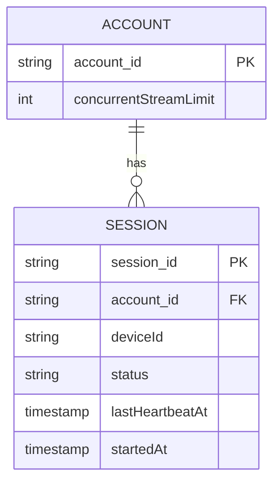

| Table | Storage choice & why |
|---|---|
| `Session` | Sharded by `account_id`, low-latency read/write — the hot path for claim, heartbeat, and release |
| `Account.concurrentStreamLimit` | Read at claim time from the plan service, not cached indefinitely, so a plan change takes effect on the next claim rather than requiring a separate propagation mechanism |

---

## Failure modes & mitigations

| Failure mode | Impact | Mitigation |
|---|---|---|
| **Two devices start simultaneously, racing for the last slot** | Without an atomic claim, both could succeed, exceeding the limit | Atomic compare-and-set claim, per the dedicated deep dive |
| **A device crashes without ever sending a stop signal** | Slot permanently leaked if only explicit-stop release exists | Heartbeat-based TTL reclaim, the load-bearing mitigation for this expected-common case |
| **A brief network hiccup causes one missed heartbeat** | Risk of incorrectly evicting a legitimately active session | TTL set to a small multiple of the heartbeat interval, tolerating one or two missed beats before declaring the session dead |
| **A plan downgrade leaves more active sessions than the new limit allows** | Account is temporarily "over limit" relative to its new plan | Don't retroactively force-stop existing sessions on a downgrade — let them naturally end, and enforce the new, lower limit only on the next new claim; forcibly interrupting active playback on a plan change is a worse experience than a temporary, self-resolving overage |
| **A user travels and connects from a different region** | Risk of a region-local session count missing existing sessions from another region | Account-sharded (not region-sharded) session store, per the multi-region deep dive |

---

## Non-functional walkthrough

**Scaling both claim/release and heartbeat traffic is embarrassingly parallel by account** — every
account's session state is fully independent, making this a natural fit for simple sharding by
`account_id`, with no cross-account contention point anywhere in the system.

**Availability of the claim path should be very high** — a slow or failed claim check directly
blocks video start, one of the most visible moments in the whole product experience.

**Consistency of the active-session count must be strict and account-scoped, never region-
fragmented** — this is the one place in the system that cannot tolerate the "eventually correct"
looseness acceptable elsewhere (like exact heartbeat timing), per the multi-region deep dive.

---

## Security & compliance

- **Device/session listing exposed to the account holder** is itself sensitive — showing "which
  devices are streaming" needs to be scoped strictly to the account owner, with reasonable
  safeguards against a compromised credential silently viewing (or evicting) a legitimate
  household member's session.
- **Licensing/content-rights obligations** are often the actual business reason concurrent-stream
  limits exist at all — worth naming explicitly, since it reframes "why does this constraint
  exist" as a contractual requirement, not an arbitrary product choice.
- **Abuse detection** (accounts persistently right at their limit from many distinct, unrelated
  IP addresses/devices, suggesting credential sharing beyond a household) is a related but
  distinct concern from this chapter's core mechanics — typically layered on top as its own
  analysis, reusing patterns from the fraud-detection chapter.

---

## Cost & trade-offs

**Heartbeat interval trades network/infrastructure chatter against how quickly a dead session's
slot frees up** — per the capacity estimate, heartbeat traffic already dominates system load by
roughly two orders of magnitude over claim/release traffic, making this the single highest-
leverage tuning knob for both cost and responsiveness.

**Reject-vs-evict eviction policy trades a simpler, less surprising experience (reject) against a
more automatically-resolving but occasionally disruptive one (evict)** — a genuine product
trade-off, not a technical one, worth naming as such rather than defaulting to either without
justification.

---

## Wrap-up: MVP vs. stretch

**In scope for an MVP:**
- Atomic per-account slot claim with a compare-and-set operation.
- Heartbeat-based liveness with a TTL reclaim, tolerating a small number of missed beats.
- A single, clearly-defined eviction policy (start with reject — simpler, never surprises an
  existing viewer).

**Explicitly out of scope for an MVP:**
- Evict-oldest-session policy — start with reject-only, add eviction once product research
  confirms it's the better default and the notification UX is designed.
- Cross-household abuse detection — start with correct enforcement of the stated limit, layer
  abuse analysis on top once real usage patterns are observed.

**Stretch goals, worth naming if asked "what's next":**
1. **Configurable, product-tunable eviction policy** (evict oldest vs. least-recently-interacted-
   with vs. lowest-priority device type), rather than one fixed rule.
2. **Abuse/credential-sharing detection**, reusing the fraud-detection chapter's hybrid rules/ML
   pattern applied to session/device patterns instead of transactions.
3. **Graceful pre-eviction warning**, giving the soon-to-be-evicted device a few seconds' notice
   before force-stopping, rather than an immediate cutoff.

---

## Golden rules

- **Slot claim must be a single atomic operation, never check-then-write** — the same race as any
  contended-resource chapter in this course, scoped here to an account's session count.
- **An explicit stop call is never the only release mechanism** — heartbeat-based TTL reclaim
  handles the common, not rare, case of an ungraceful disconnect.
- **Name the eviction policy and its trade-off explicitly** — reject vs. evict is a product
  decision with real UX consequences on both sides, not a technical detail to gloss over.
- **Shard session state by account, never by region** — a region-local count can under-enforce a
  global limit for a traveling user or a spread-out household.
- **Never silently cut off an evicted session** — always notify with a specific, understandable
  reason.

---

## Master cheat sheet

**One-liners:**
- Same atomic-claim family as a flash sale or auction, but the resource is reused continuously
  and is naturally shardable per account, unlike a single global hot counter.
- Heartbeat-based TTL reclaim is the load-bearing mechanism here — ungraceful disconnects are the
  common case, not the exception, and an explicit stop call alone leaks slots.
- TTL should be a small multiple of the heartbeat interval, not equal to it, to tolerate one
  missed beat without a false-positive eviction.
- Reject-vs-evict is a named product trade-off, not a technical correctness question — always
  notify an evicted device with a specific reason, never a silent cutoff.
- Shard by account, not region, or a traveling user/spread-out household can exceed the true limit
  against region-fragmented counts.

**Formula chain:**
```
concurrent_sessions_platform_wide = active_accounts x avg_active_sessions_per_active_account
heartbeat_QPS                      = concurrent_sessions_platform_wide / heartbeat_interval_sec
```

**Numbers:** heartbeat/renewal traffic typically dominates claim/release traffic by roughly two
orders of magnitude at real streaming-platform scale · liveness TTL is commonly set to ~3x the
heartbeat interval, tolerating one or two missed beats before reclaiming a slot · each account's
session state is fully independent, making this system trivially shardable with zero cross-account
contention.
