# Design a Price Threshold Alert System — The Story (narrative edition)

> **What this file is.** The reference file, `69-Design-a-Price-Threshold-Alert-System-FAANG-Guide.md`, is the one to recite from — requirements, API shapes, every trade-off table, the master cheat sheet. This file is a second way in: the same material as one continuous story, told in plain language. Engineers at a fictional price-alert startup called **Pricehawk** keep hitting a wall, patch it, and the patch itself creates the next wall — until we land on the exact same design the reference file documents. Pricehawk itself is made up. But the pattern it rediscovers is real and confirmed asked at **Bloomberg** (stock price alerts) and **Coinbase** (crypto price/percent-change alerts), and pieces of it are visible today in **CamelCamelCamel**, the long-running Amazon price-tracking site that emails you when a product drops below your target price. Real historical price gaps — like the May 2010 equities "Flash Crash" and the periodic flash-crash-style drops seen in crypto markets — are used as the real-world reason a naive design can't just check "the newest price," it has to check every price a move passed through. I'll say clearly, every time, whether something is a documented fact or a reasonable illustrative guess.

**The trigger phrases** for this whole topic: *"design a price alert system,"* *"notify me when this stock/crypto/product hits price X,"* or *"alert me if this moves 5%."* Keep one sentence in your head as you read: **this problem is the mirror image of a normal search system** — normally the data sits still (listings, catalog items) and queries fly in; here, millions of thresholds sit still and a live price stream flies past them, and the entire design exists to make sure one price tick only ever has to touch the tiny slice of thresholds actually near it, never the whole stored pile.

---

## Chapter 1 — The loop that was fine until it wasn't

It's early days at Pricehawk. The product is simple: set a price, get notified when the market crosses it. The first version of the matching code is the most obvious thing anyone would write: every time a new price arrives for a symbol, loop through every threshold anyone has ever set on that symbol and check each one.

```python
for threshold in thresholds_for_symbol[symbol]:
    if crosses(threshold, new_price):
        fire(threshold)
```

At launch, this is completely fine — a few hundred users, maybe 1,000 thresholds total across the whole platform. Nobody notices the loop at all.

Two years later, Pricehawk has grown into a real platform tracking 20,000 assets — stocks and crypto pairs — with **50,000,000** active thresholds set by users `[illustrative — a stand-in scale for "a real, popular price-alert product," matching the reference guide's own capacity estimate]`. Thresholds aren't spread evenly: the top 100 most-watched assets (think a handful of mega-cap stocks and BTC/ETH) hold roughly **60%** of all of them — about **30,000,000** thresholds concentrated on just 100 symbols out of 20,000. One of those top assets alone has **500,000** stored thresholds on it. That asset also ticks fast — a liquid, popular symbol updates around **100 times a second** during market hours.

Do the math on the old loop: 500,000 thresholds × 100 ticks/sec = **50,000,000 comparisons per second, for that one asset alone.** The matching service's CPU pins at 100%, alerts that should fire in under a second start trickling out **minutes** late, and on-call gets paged because the queue of unprocessed ticks for that one symbol keeps growing every second instead of shrinking.

The obvious question: *why are we re-checking every threshold on this asset, on every single tick, when the price only moved a few cents?* Because the code never bothered to ask "which thresholds are actually anywhere near the current price" — it just re-scans literally everything, every time, regardless of how close or far away any individual threshold is.

**The fix, and the analogy for the rest of this story:** stop treating thresholds as an unsorted pile and put them on a **shelf, sorted by price** — like a library that shelves books by call number instead of by "whichever order they arrived in." A patron (a price tick) walking down the aisle only ever has to look at the shelf section near where they're standing, never the entire library. Call this **the shelf** for the rest of this story — every later fix in this chapter reuses the exact same idea.

**New problem, immediately:** the fastest way to build "look near the current price" is a hash map keyed on the price, rounded — a point lookup, not a range. That's cheap, but it only tells you what's shelved *exactly* where the patron is standing right now. It says nothing about the shelf sections the patron just *walked past* between their last stop and this one.

**How I'd say this in an interview:** "The naive design scans every stored threshold on every tick, and at real concentration — a popular asset with hundreds of thousands of thresholds ticking 100 times a second — that's tens of millions of comparisons per second for one symbol alone. The fix is to stop scanning everything and index thresholds by price so a tick only touches the shelf section near it — but a plain point lookup on the new price alone isn't quite that fix yet, which is the next problem."

---

## Chapter 2 — The shelf you only looked at from where you're standing

Pricehawk ships the point-lookup fix: a hash map from `(symbol, rounded price)` to the list of thresholds sitting near that price. It works beautifully for slow, liquid, small-step assets — a stock ticking from $150.20 to $150.15 only ever needs to check the shelf around $150.15-ish. CPU usage on the hot asset drops by orders of magnitude overnight.

Three weeks later, a much less liquid, thinly-traded small-cap symbol on the platform gets hit with sudden bad news. Its price feed reports two consecutive ticks: **previous = $52.00, new = $44.00** — a sharp **15% drop in a single update**, the kind of gap real markets genuinely produce during illiquid trading or a flash-crash-style event (the real 2010 equities Flash Crash, and repeated crypto flash crashes, are documented examples of exactly this shape of move — the specific $52→$44 numbers here are `[illustrative]` for Pricehawk). This symbol has thresholds sitting at $50.00, $48.00, and $45.00 — all three should have fired.

Pricehawk's point-lookup only checks the shelf near $44.00, the *new* price. It finds nothing there (the nearest thresholds are $45.00, a few shelf-sections away) and moves on. **All three thresholds silently never fire.** Three users who set alerts specifically to catch this exact kind of drop get nothing. Support tickets start with "why didn't I get my alert" and nobody on the team can explain it until someone traces the exact tick sequence.

The obvious question: *why did checking "near the new price" miss thresholds that the price clearly passed through?* Because the lookup only ever asked "what's shelved where the patron is standing **now**" — it never asked what shelf sections the patron **walked past** to get there. A single tick isn't a teleport to one price; it represents the market having moved through every price in between.

**The fix:** query the **full interval** the price actually moved through — a range query for "everything on the shelf between the previous price and the new price," not a point lookup at the new price alone. This still uses the same shelf (a sorted structure or interval tree, keyed by price, per symbol) — it's just asking it a different, correctly-shaped question.

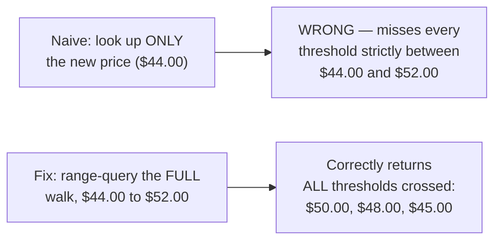

**New problem, right away:** a range query over an interval needs a data structure that actually answers "what falls between these two values" efficiently. A hash map — even a hash map of rounded prices — fundamentally cannot answer that question without scanning every bucket in the range one by one, which quietly turns back into something close to Chapter 1's full scan for any move big enough to span many rounded-price buckets.

**How I'd say this in an interview:** "A point lookup on just the new price is a subtle trap — it works for small, boring moves and silently drops alerts for big ones, exactly the moves users most want to be notified about. The fix is to always query the interval the price walked through, previous price to new price, not just where it landed — and that requires a structure actually built to answer range questions, which a hash map isn't."

---

## Chapter 3 — The real shelf: a sorted index, queried by the whole walk

The real fix: replace the hash map with a genuinely sorted structure per symbol — a balanced tree, a skip list, or an interval tree if thresholds ever have ranges instead of single points — keyed by price. This is **the shelf**, done properly: books in true sorted order, so "give me everything between $44.00 and $52.00" is a fast range scan starting at one point and walking forward until it passes the other, not a scan of the whole library.

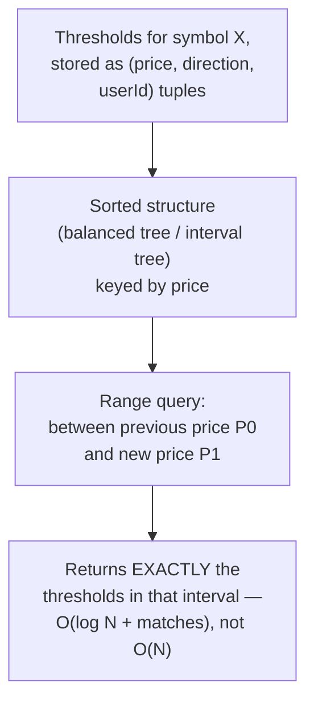

Redo the Chapter 1 math with this structure in place: the hot asset still has 500,000 stored thresholds and still ticks 100 times a second, but a typical tick only moves the price a few cents — meaning the interval being range-queried usually contains **0 to 5 thresholds**, not 500,000 `[illustrative — the exact count depends on how densely thresholds cluster near the current price, but "a handful, not everything," is the real shape]`. Per-tick cost drops from **50,000,000 comparisons/sec** to something close to **a few hundred comparisons/sec** for that same asset — many orders of magnitude, without losing a single crossing the way Chapter 2's point lookup did.

This is worth naming explicitly, because it's the single idea an interviewer is listening for: **this system is the mirror image of a normal search chapter.** In a search or ranking system, the data (listings, catalog items) sits stored and a query flies in. Here, the thresholds are what's stored, and a *price tick* is the thing flying in and querying them. Reaching for "index by price range, keyed per symbol" instead of a search-index mental model is what separates a candidate who's spotted the inversion from one who hasn't.

**New problem:** the shelf now correctly returns every threshold a price move crosses. But watch what happens over the *next several thousand ticks* after a threshold fires: if the price stays below it, does that threshold get returned by the range query again and again, forever, for as long as the price sits below it?

**How I'd say this in an interview:** "The real fix is a sorted or interval structure per symbol, range-queried on the interval between the previous and new tick price — that's what makes per-tick cost track 'thresholds actually near the current price' instead of 'thresholds that exist,' and it's the mirror image of every search chapter, because here the query is the data point and the data is what's stored. The next question is what happens the moment after a threshold fires, on every tick after that."

---

## Chapter 4 — The alarm that won't stop ringing

Good news: the shelf design mostly self-heals this on its own — once the price is at $149.75 and the next tick moves it to $149.70, the range query is `(149.70, 149.75]`, and a threshold sitting at $150.00 simply isn't *in* that interval anymore, so it never gets pulled off the shelf again on its own. But there's a real edge case Pricehawk hits during a rough week for one particular stock: it drops below its $150.00 alert threshold and then just **hovers, jittering between $149.60 and $149.90, for two straight hours** during a slow trading session, at roughly 50 ticks/sec.

The bug shows up in a different place: someone re-implements the range query slightly wrong, using an *inclusive* lower bound that occasionally re-includes the $150.00 threshold as the price jitters back up to $149.90 and the interval briefly spans back near it. Worked number: at 50 ticks/sec for 2 hours, that's **360,000 ticks** — and with the buggy inclusive boundary, the threshold gets pulled back into a handful of those range queries repeatedly. A handful of unlucky users get the same "AAPL dropped below $150" email **six or seven times** in one afternoon before anyone notices.

The obvious question: *why does the system need anything beyond the range query at all — didn't Chapter 3 already say a fired threshold falls out of range on its own?* Because "currently sitting outside a price range" and "has already been alerted for this crossing" are genuinely two different facts, and nothing in the range query itself tracks the second one — it's purely a fragile side effect of interval math, and a boundary bug (or a price that jitters right at the edge) can easily undo it.

**The fix, with its own analogy:** track an explicit **FIRED flag** per threshold — think of it as a **spring-loaded mousetrap**. Once it's sprung, it stays sprung. It doesn't matter how many more mice (ticks) walk past it — a sprung trap does nothing until a person deliberately resets it. Before firing an alert, check the flag: already `FIRED`? Skip. Not yet `FIRED`? Fire, and flip the flag.

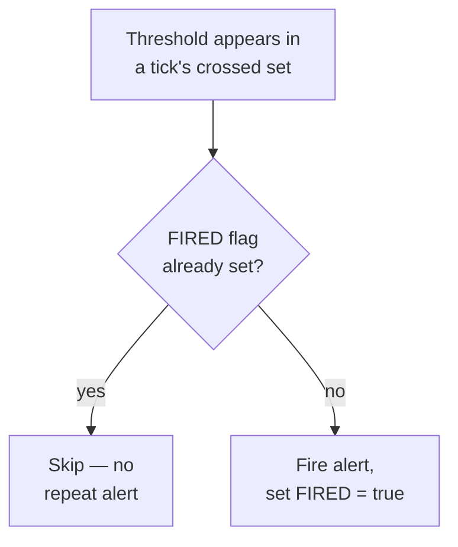

This is strictly more robust than relying on range-query geometry alone — even if a boundary bug or a jittery price briefly pulls a threshold back into a query, the `FIRED` check stops the duplicate alert cold.

**New problem:** now the trap is sprung forever. But real users don't always want "one-shot" — some want the alert to be able to fire **again** if the price goes back up past $150.00 and then drops below it a second time. A permanently-sprung trap can't do that on its own; there's no way, right now, to distinguish "never fired" from "fired once, and I'm intentionally willing to let it fire again under the right condition."

**How I'd say this in an interview:** "Relying purely on 'is this threshold in the current range query' to prevent repeat alerts is fragile — a boundary bug or a jittery price can undo it. The robust fix is explicit state: a FIRED flag, like a sprung mousetrap that stays sprung until someone resets it, checked before every alert regardless of what the range query geometry happens to say that tick."

---

## Chapter 5 — Resetting the trap, on purpose

Pricehawk's power users start asking for this directly: "let my alert fire again if the price crosses back below $150.00 a second time." The naive fix someone proposes — just clear the `FIRED` flag automatically the instant the price moves back above the threshold — turns out to be too eager: a stock hovering at exactly $150.00 for an hour, ticking above and below by a penny 40 times, would reset and re-fire the trap **40 times** in that hour, which is the exact spam problem Chapter 4 just solved, reintroduced through the back door.

The real fix: make re-arming an **explicit, separate, opt-in condition** — not automatic. A threshold has two independent facts about it: is it currently `FIRED`, and (if the user configured it) has the **re-arm condition** been met — for example, "price must move back above $151.00 (not just $150.00) before this can fire again," a deliberate buffer to stop penny-jitter from re-triggering it.

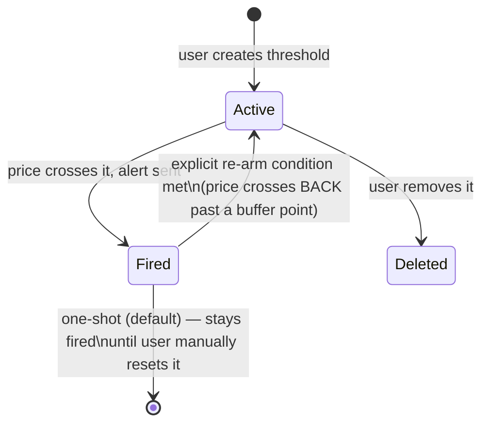

The mousetrap analogy still holds perfectly here: resetting a trap is a **deliberate, separate action** — you don't rig the trap to reset itself just because a mouse walked near it again; a person has to reset it on purpose. Making re-arm a defined, explicit transition (not an accident of price jitter) is exactly that same discipline.

**New problem:** none of this — the shelf, the FIRED flag, re-arming — has touched a completely different kind of threshold users keep asking for: *"alert me if BTC moves 5% from here,"* not "alert me at $71,400." That's not a price level at all — it's a **percent-change from some reference point**, and nothing built so far has a notion of "reference point."

**How I'd say this in an interview:** "Re-arming should never be automatic just because the price crossed back near the threshold — that reintroduces the exact spam problem the FIRED flag was built to prevent. Make it an explicit, separate condition, usually with a buffer, so resetting the trap is a deliberate transition, not an accident of normal price jitter."

---

## Chapter 6 — The reference point that quietly walks away

Pricehawk ships percent-change alerts: "alert me if BTC moves ±5%." The obvious implementation stores a `referencePrice` — but an engineer, trying to keep the alert "fresh," writes the reference price recompute job to reset it to *yesterday's closing price*, every night, for any percent-change threshold that hasn't fired yet.

Here's the break: a user sets a 5% alert on BTC when it's at **$68,000** — meaning they expect a ping if BTC crosses $71,400 (up 5%) or $64,600 (down 5%). BTC then drifts slowly upward over three weeks — $68,500, $69,200, $70,100, $70,900 — never moving more than 1-2% in any single day, so the nightly recompute keeps quietly resetting the reference to each new day's closing price. By the time BTC actually crosses **$71,400** — the number the user originally cared about — the system's *current* reference price has drifted all the way up to $70,900, so a move to $71,400 only reads as a **0.7% move from the drifted reference**, nowhere near the user's actual 5% threshold. The alert never fires. The user is furious that BTC "obviously" blew past the price they set an alert for and heard nothing.

The obvious question: *why does the reference point move at all — didn't the user pin it to a specific value when they created the alert?* Exactly the bug: the reference was implemented as something recomputed against a moving target for "freshness," when the user's actual intent was a **fixed anchor set once, at creation time**, never touched again unless the user explicitly resets it.

**The fix:** store `referencePrice` as an immutable field, written once when the threshold is created, exactly the same way an absolute-price threshold's `value` field is immutable. A percent-change threshold is really just "an absolute threshold, computed once from a fixed anchor" — not a fundamentally different kind of matching problem. It still lives on the exact same shelf, sorted by its computed absolute price level; only *how that level got calculated* differs.

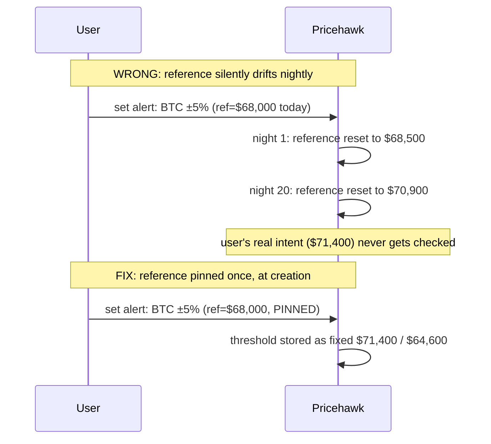

**New problem:** the pinned reference is correct, but it surfaces a UX question that's really a system-design signal — with a fixed anchor, a threshold set months ago against a long-forgotten reference price can feel confusing when it finally fires ("wait, why did this alert just go off?"). The fix there is outside the matching engine itself: always show the original reference price and when it was set, right in the notification, and offer an explicit "reset my reference to today's price" action — a user-triggered reset, never an automatic one, for exactly the reason Chapter 5 already established.

**How I'd say this in an interview:** "A percent-change threshold needs a reference price that's pinned once at creation time, not recomputed against a moving target — recomputing it 'to keep it fresh' silently changes what the user actually asked for. Once pinned, it's just an absolute threshold under the hood, computed from a fixed anchor, and it lives on the same sorted shelf as every other threshold."

---

## Chapter 7 — The one shelf everyone's crowding around

Pricehawk's storage is sharded by symbol — each symbol's shelf lives on its own machine, which has worked fine since Chapter 1. But the concentration numbers from the very start of this story haven't gone away: the top 100 symbols hold **30,000,000** of the platform's 50,000,000 thresholds. BTC-USD alone, on its own single shard, ends up holding something like **2,000,000** thresholds `[illustrative — a plausible share of that 30M concentrated on one especially popular symbol, not a documented figure]`, and it also happens to be one of the highest tick-rate symbols on the whole platform, trading around the clock.

That one shard becomes the bottleneck. Even with the shelf's range-query efficiency from Chapter 3, a shard holding 2,000,000 thresholds and taking BTC's highest tick rate ends up with meaningfully more range-query traffic and more write traffic (new thresholds constantly being created and deleted on BTC) than a shard for a sleepy small-cap stock with 50 thresholds total. Matching latency for BTC alerts specifically — the asset the most users care about most — starts creeping up during busy trading windows, exactly the failure users notice and complain about loudest.

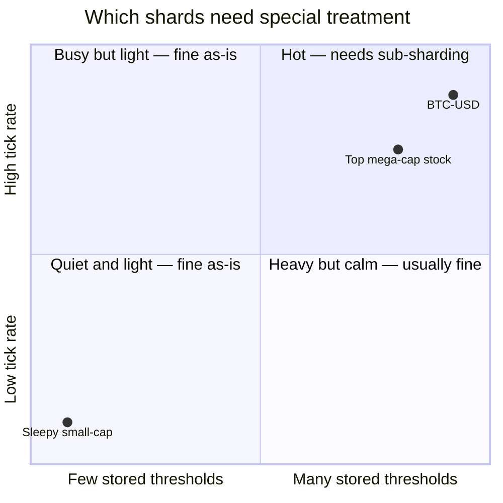

The obvious question: *isn't sharding by symbol supposed to spread the load evenly?* Only if load is evenly distributed across symbols in the first place — and here it very much isn't. This is the same "one hot key needs its own scaling strategy" lesson that shows up anywhere data is skewed, just applied to a range-indexed shelf instead of a simple counter or cache key.

**The fix:** for the small set of symbols that are genuinely overloaded, split their single shelf further — by **price sub-range** within that one symbol. BTC's shelf gets split into, say, four sub-shelves (under $50k, $50k-$100k, $100k-$150k, over $150k), each on its own machine, each independently range-queryable. A tick for BTC now only has to touch the one or two sub-shelves near its own price range, spreading both the storage and the query load for that one hot symbol across multiple machines instead of one.

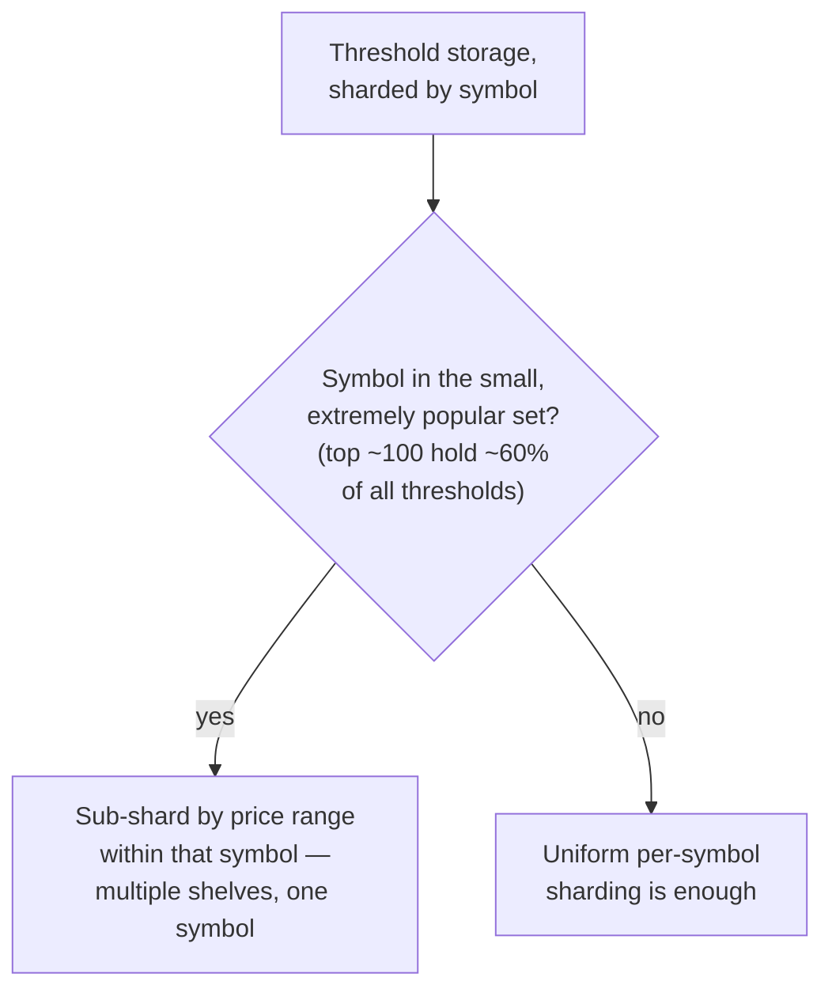

**New problem:** every fix so far has assumed every price tick actually arrives, in order, exactly once. Real market-data feeds don't guarantee that — ticks get dropped, delayed, or occasionally redelivered.

**How I'd say this in an interview:** "Sharding by symbol alone assumes load is roughly even across symbols, and at real skew it isn't — a small number of popular symbols concentrate most of the threshold count and most of the tick volume. The fix is targeted, not universal: sub-shard the specific hot symbols by price range, and leave uniform per-symbol sharding alone everywhere else."

---

## Chapter 8 — The tick that never showed up

Pricehawk's market-data feed has a bad ten seconds one afternoon and drops a tick for a mid-cap stock entirely — the last successfully processed price was **$150.20** (tick #4,401), and the next tick that actually arrives is **$149.60** (tick #4,403) — tick #4,402, which would have shown $150.05, simply never made it. There's a threshold sitting at $150.00.

The naive worry: did the system just silently miss this crossing, since it never saw the exact tick that would have crossed it? No — because of how the range query is built in Chapter 3, it isn't queried "at $149.60" alone; it's queried as the interval between the **last price this system actually processed** ($150.20) and the new one ($149.60) — `(149.60, 150.20]`. The $150.00 threshold falls squarely inside that interval regardless of whether the intermediate tick that would have shown $150.05 ever arrived. As long as the feed eventually delivers ticks **in order**, even with occasional gaps, the range-query design self-heals — it never assumes every tick arrives, only that the price it's given as "new" is accurate and that "previous" reflects whatever was last actually processed.

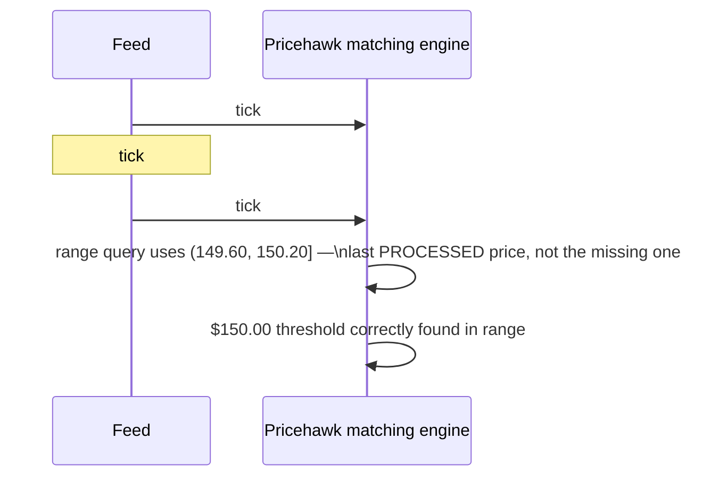

A separate, related problem: the feed occasionally **redelivers** the same tick twice — a retry after a brief network hiccup on the provider's side. The obvious worry: does processing the same tick's interval twice risk a duplicate alert? Mostly not, thanks to work already done — Chapter 4's `FIRED` flag means a threshold that already fired on the first delivery is simply skipped as "already fired" on the retried delivery. But Pricehawk adds one more small piece of hygiene anyway: idempotent tick processing, keyed on a tick sequence number, so a duplicate tick is recognized and dropped **before** it even reaches the range query — the same discipline any at-least-once ingestion pipeline needs, cheaper than relying solely on downstream dedup.

**New problem:** the matching engine itself is now solid — durable thresholds, an efficient shelf, exactly-once firing, correct percent-change semantics, hot-symbol sub-sharding, and a feed pipeline that self-heals around gaps and duplicates. But firing an alert internally and actually getting it in front of a user are two different jobs, and right now they're tangled together in the same code path.

**How I'd say this in an interview:** "Range-querying against the last successfully processed price, not assuming every tick arrives, is what makes the system self-heal around a dropped tick — the gap just becomes part of a wider interval instead of a lost event. Duplicate ticks are mostly already handled for free by the FIRED flag, but idempotent processing keyed on a tick sequence number is a cheap extra layer of hygiene on top."

---

## Chapter 9 — Splitting "it crossed" from "you found out"

Early on, Pricehawk's matching engine calls the email/push/SMS providers **directly**, right inside the same code path that just found a crossing. The first time one of those providers has a slow day — a push-notification provider's API latency spikes — the matching engine's own thread sits there waiting on it, and new ticks for that symbol start backing up behind alerts that are still trying to send. It's the same shape of problem seen elsewhere any time a fast, correctness-critical path gets tangled up with a slow, best-effort one — a well-known failure category, not specific to price alerts.

The fix: split the two concerns. The matching engine's only job is deciding "this crossed, exactly once" and handing that fact off — durably — to a separate **alert/notification service**, which fans it out to whatever channels the user configured (push, SMS, email). This separation matters for a subtle reason: **the crossing-detection guarantee and the delivery guarantee are different guarantees.** A crossing must be detected exactly once — that's the FIRED flag's whole job. But once handed off, it's completely fine for the push provider to retry its own delivery attempt three times if the first one times out — that's an ordinary at-least-once retry at the channel level, and it doesn't second-guess whether the crossing itself happened.

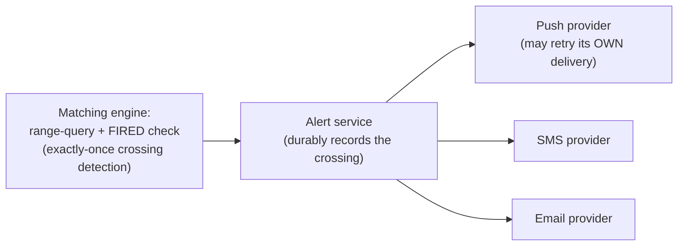

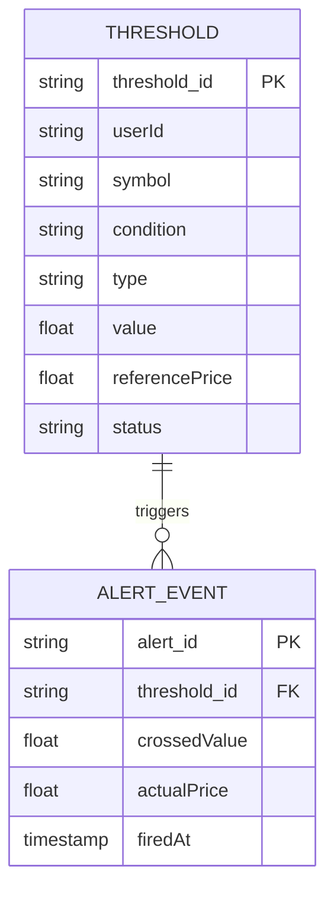

One more thing worth naming, since it's the kind of thing an interviewer probes for on a financial-data system: Pricehawk's notifications are written to say **"your configured condition was met"** — mechanical and factual — never anything that reads like investment advice, because financial alerting can carry real regulatory weight depending on jurisdiction. And it's worth stating the trust boundary out loud: this entire system's correctness is only as good as the upstream price feed it trusts — a compromised or wrong feed produces wrong alerts no matter how well the matching engine itself is built.

**How I'd say this in an interview:** "Crossing detection and alert delivery need different guarantees and shouldn't share a code path — detection has to be exactly-once, delivery is fine being at-least-once with its own retries at the channel level. Decoupling them also stops a slow notification provider from ever being able to back up the price-matching pipeline itself, the same class of bug as any fast path getting tangled with a slow one."

---

## Where the story actually lands

```mermaid
flowchart LR
    A["Ch1: full scan\nper tick"] -->|"fixes: relevance\nbreaks: point lookup\nmisses jumps"| B["Ch2: point lookup\non new price"]
    B -->|"fixes: nothing —\nreveals the real fix"| C["Ch3: range query,\nsorted shelf"]
    C -->|"fixes: correctness + cost\nbreaks: sustained crossing\ncan re-fire"| D["Ch4: FIRED flag"]
    D -->|"fixes: no repeat spam\nbreaks: can't re-arm safely"| E["Ch5: explicit\nre-arm condition"]
    E -->|"fixes: intentional re-fire\nbreaks: % thresholds\nneed a reference"| F["Ch6: pinned\nreferencePrice"]
    F -->|"fixes: % semantics\nbreaks: hot symbol\nbottlenecks"| G["Ch7: sub-shard\nhot symbols"]
    G -->|"fixes: hot-symbol load\nbreaks: dropped/dup ticks"| H["Ch8: last-processed-price\nrange query + idempotency"]
    H -->|"fixes: feed reliability\nbreaks: slow channel\nblocks matching"| I["Ch9: decouple\nmatching from delivery"]
```

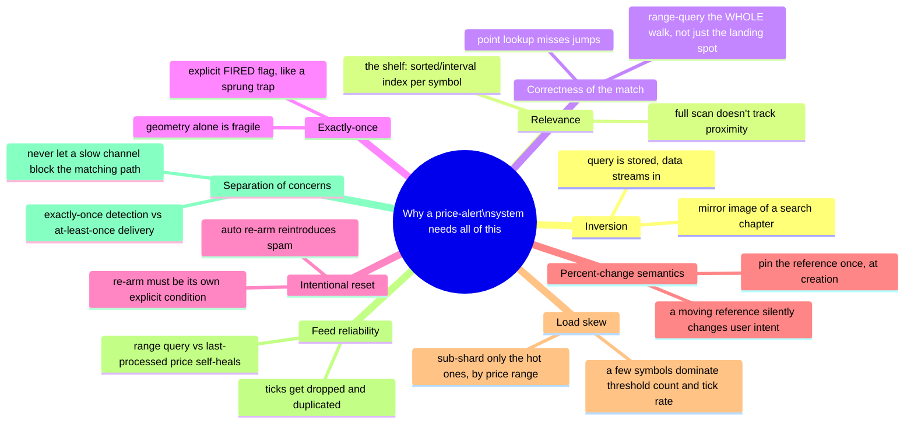

Every real price-alert system sits somewhere on this chain, and the skill isn't reciting all nine chapters unprompted — it's knowing where the stated requirements say to stop. A simple e-commerce price-drop tracker (closer to what CamelCamelCamel does) might reasonably stop around Chapter 3 or 4. A trading-app alert feature that also supports percent-change and multi-channel delivery, like Coinbase's or Bloomberg's, needs Chapters 6 through 9 too.

---

## Grill me — adversarial follow-ups

**Q1: "Why not just re-run the naive scan but on a faster machine or more threads — wouldn't that buy enough headroom?"**
It buys a constant-factor improvement, not a structural fix — you're still paying O(all stored thresholds) per tick, so the moment threshold count or tick rate grows past whatever headroom you bought, you're back to the same wall, just later. The range-indexed shelf makes per-tick cost track "thresholds near the price," which scales with market movement, not with how many users happen to have set alerts.

**Q2: "Isn't a hash map keyed on rounded price basically the same as your sorted shelf?"**
No — a hash map only answers "is there anything at exactly this bucket," which is a point query. The actual question this system needs answered is "what falls between these two prices," an inherently range-shaped query that only a sorted structure (or interval tree) can answer efficiently; a hash map would need to scan every bucket in the range one by one, which degrades back toward a full scan for a big enough move.

**Q3: "Why can't the FIRED flag itself just be inferred from the range query — isn't that redundant state?"**
It would be redundant if the range query's geometry were perfectly reliable in every edge case, but it isn't — an inclusive/exclusive boundary bug or a price jittering right at the edge of a threshold can pull it back into a query window it logically shouldn't be in. The FIRED flag is a small amount of explicit state that makes the exactly-once guarantee correct regardless of any geometry edge case, which is worth the extra bit of storage.

**Q4: "For percent-change thresholds, why not just recompute the reference price against, say, a 30-day moving average instead of pinning it at creation?"**
Because that changes what the user actually asked for without telling them — they set the alert against a number they had in mind at that moment, and any auto-recomputed reference silently redefines their threshold underneath them, exactly the bug that made a 5% BTC alert never fire. If a "moving reference" alert type is genuinely wanted, it should be a distinct, clearly-labeled threshold type — not a hidden implementation detail of the existing one.

**Q5: "Sub-sharding a hot symbol by price range — what stops one of those sub-shards from becoming hot too, if the price camps out in one narrow band?"**
Nothing stops it automatically — that's a real limitation, and the honest answer is you monitor per-sub-shard load and re-split further if one price band gets disproportionately dense, the same way any hot-key mitigation is an ongoing operational practice, not a one-time fix. It's also usually self-limiting in practice, since a price genuinely camping in one narrow band for a long time is a less common pattern than the price actually moving.

**Q6: "If a tick gets dropped, doesn't the range query with a wide gap risk pulling in way more thresholds than usual and spiking latency for that one tick?"**
Yes, and that's the right trade — a rare, briefly wider range query is a far better outcome than silently missing a crossing, and it's self-limiting: gaps are the exception, not the norm, so the occasional larger query doesn't change the system's steady-state cost profile established in Chapter 3.

**Q7: "Why does alert delivery only need to be at-least-once, when you were so strict about exactly-once for detection?"**
Because they're protecting against different failure modes — detection must be exactly-once because a duplicate detection means a duplicate real-world fact ("this happened again," when it didn't). Delivery retries are just making sure a message that's already true gets to the user reliably; a user getting the same push notification twice because a provider retried is a minor annoyance, not a correctness bug, and channel providers are built to be retried against.

**Q8: "You separated matching from delivery in Chapter 9 — doesn't that reintroduce a durability gap between 'crossing detected' and 'alert actually recorded for delivery'?"**
Fair concern, and the answer is the handoff itself has to be durable — the matching engine doesn't consider a crossing "handled" until the fact is durably recorded (e.g., written to a store or queue) for the alert service to pick up, the same discipline as any producer-consumer boundary in a queueing system. It's a boundary that needs its own durability guarantee, not something you get for free just by having two services.

**Q9: "Given all nine chapters, if someone says 'design a price alert system' cold, where do you start?"**
Name the inversion first — the query is stored, the data streams in — because that's the framing move that makes every later design decision make sense instead of looking arbitrary. Then say the one sentence that follows from it: index thresholds by price range per symbol so a tick only touches what's near it, and walk forward into exactly-once firing, percent-change semantics, hot-symbol sub-sharding, and feed reliability only as far as the interviewer's follow-ups actually pull you.

**Q10: "What's the one thing a candidate who's memorized this story but doesn't really get it would get wrong?"**
They'd propose the range query without ever explaining *why* a point lookup on the new price isn't enough — that's the single detail that separates a candidate who's internalized the multi-threshold-crossing problem from one who's just recalling "use a sorted structure" as a fact. If you can't produce a concrete example of a price jump skipping a threshold, you haven't actually understood the fix.

---

## Cheat sheet — one line per idea, no repeated story

- **The inversion**: thresholds are stored, price ticks stream in — the mirror image of a normal search system, and naming it is the strongest opening move.
- **The shelf**: a sorted/interval structure per symbol, keyed by price — a hash map can't answer "what falls between these two values," and that's the entire query this system needs.
- **Range-query the whole walk**: always query the interval between the previous and new price, never just the new price alone, or a fast move silently skips thresholds it should have crossed.
- **FIRED flag**: explicit state, separate from the range-query's geometry — a sprung mousetrap that stays sprung, which is what makes exactly-once firing robust to edge cases, not just the common case.
- **Explicit re-arm**: never automatic just because the price crossed back near the threshold — that's the same spam bug the FIRED flag exists to prevent, reintroduced through the back door.
- **Pinned reference price**: a percent-change threshold's anchor is set once, at creation, never silently recomputed — under the hood it's just an absolute threshold computed from a fixed point.
- **Sub-shard the hot symbols only**: a small number of popular symbols concentrate most of the threshold count and tick volume; uniform per-symbol sharding alone isn't enough for those specific few.
- **Range query against the last processed price**: this is what makes the system self-heal around a dropped tick, as long as ticks eventually arrive in order.
- **Detection is exactly-once, delivery is at-least-once**: two different guarantees for two different failure modes — never let a slow notification channel block the matching path.
- **The meta-lesson**: every fix here buys one property — relevance, correctness on a jump, no repeat spam, intentional reset, correct percent-change semantics, load balance, feed resilience, or clean separation of concerns — by adding one specific, named piece of state or structure, never by "just scanning harder."
