# Design a Price/Threshold Alert System (Bloomberg/Coinbase-style) — FAANG Interview Guide

> Source chapter type: "reverse index" complex-event matching. Confirmed asked at **Bloomberg**
> (stock price alerts) and **Coinbase** (crypto price/percent-change alerts). Distinct from every
> search or ranking chapter in this course: in a normal search system, the **query** streams in
> and the **data** is stored (search an index of listings, catalog items, drivers). Here it's
> inverted — millions of **thresholds are stored**, and the **data streams in** as a continuous
> price feed. The entire design turns on avoiding an O(all stored thresholds) scan on every single
> price tick.

## Mental model

Millions of users each set one or more price thresholds — "alert me when BTC crosses $70,000,"
"alert me when AAPL drops below $150." A live price feed updates constantly, sometimes many times
per second per symbol. Naively, every tick would need to check itself against every threshold ever
set for that symbol — at real volume, that's an obviously unworkable O(ticks × thresholds)
problem. The actual design has to flip the relationship: **index the thresholds so that a single
price tick only ever touches the small number of thresholds anywhere near the current price**,
not the entire stored set.

Three genuinely hard problems:

1. **The reverse-index structure itself.** Thresholds need to be organized (e.g., in a sorted
   structure or interval buckets per symbol) so that "which thresholds does this new price cross"
   is a fast range query, not a full scan.
2. **A fast-moving price can jump past several thresholds in one tick.** If AAPL goes from $151 to
   $148 in one update, every threshold between $151 and $148 must fire — not just the nearest one
   — which means the range query has to return a *set* of crossed thresholds, not a single match.
3. **Exactly-once alert delivery per crossing.** A threshold that's already fired shouldn't fire
   again on every subsequent tick that's still below it — the system needs to track "already
   alerted" state per threshold, distinct from "currently satisfied," or a user gets spammed with
   the same alert on every tick for as long as the price stays past their threshold.

**The one sentence to say out loud:** *"This is the mirror image of every search chapter in this
course — the query is stored and the data streams in — and the entire design exists to make one
price tick touch only the thresholds near it, never the full stored set."*

**The one picture to remember forever:**

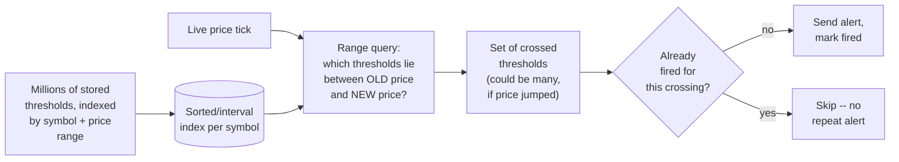

**Memory hook:** *"Index thresholds by price range so one tick is a cheap range query, treat a
price jump as crossing a SET of thresholds not just one, and remember what's already fired so a
sustained crossing doesn't spam the same alert every tick."*

---

## Table of contents
[How to Identify This Topic](#how-to-identify-this-topic-in-an-interview) ·
[Interview Playbook](#interview-playbook) · [Requirements](#requirements-clarification) ·
[Capacity Estimation](#capacity-estimation-worked) · [API Design](#api-design) ·
[High-Level Architecture](#high-level-architecture) ·
[Architecture Evolution v1→v2→v3](#architecture-evolution-v1--v2--v3) ·
[End-to-End Walkthroughs](#end-to-end-request-walkthroughs) ·
[Deep Dive: The Reverse Index of Thresholds](#deep-dive-the-reverse-index-of-thresholds) ·
[Deep Dive: Multi-Threshold Crossing in One Tick](#deep-dive-multi-threshold-crossing-in-one-tick) ·
[Deep Dive: Exactly-Once Alert Delivery](#deep-dive-exactly-once-alert-delivery) ·
[Deep Dive: Hot Symbols & Fan-Out](#deep-dive-hot-symbols--fan-out) ·
[Data Model](#data-model) · [Failure Modes](#failure-modes--mitigations) ·
[Non-Functional Walkthrough](#non-functional-walkthrough) ·
[Security & Compliance](#security--compliance) · [Cost & Trade-offs](#cost--trade-offs) ·
[Wrap-Up](#wrap-up-mvp-vs-stretch) · [Golden Rules](#golden-rules) ·
[Cheat Sheet](#master-cheat-sheet)

---

## How to identify this topic in an interview

- "Design a price alert system" (stocks, crypto, or even e-commerce price-drop alerts — the
  pattern is identical). Confirmed real questions at Bloomberg (stock alerts) and Coinbase
  (crypto alerts).
- The tell that this is a reverse-index chapter, not a normal search/ranking chapter: the
  interviewer describes a **continuously updating feed** checked against **many stored user
  conditions** — that inversion (data streams in, query is stored) is the entire point.
- A follow-up like "what if the price jumps past several thresholds in one update" is the
  [multi-threshold-crossing deep dive](#deep-dive-multi-threshold-crossing-in-one-tick) — the
  detail most naive designs miss entirely.

---

## Interview playbook

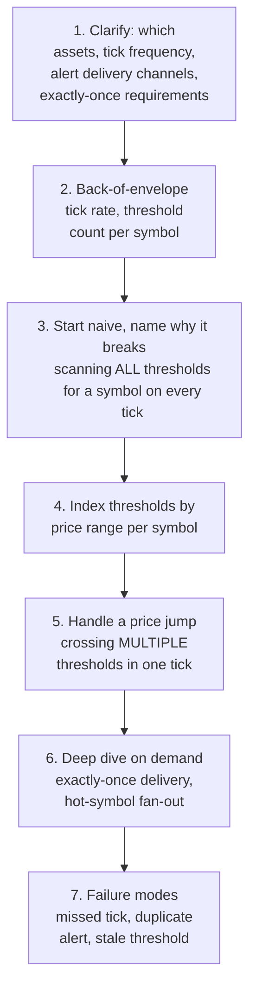

**What the interviewer is actually grading at each step:**
- Step 3: do you recognize, unprompted, that scanning every stored threshold for a symbol on
  every tick is O(thresholds) per tick and doesn't scale — and propose indexing by price range
  instead?
- Step 5: do you catch, without being prompted, that a single tick can leap past several
  thresholds at once (a fast-moving or illiquid asset), and that the range query must return a
  set, not assume "nearest threshold only"?
- Step 6: do you know that "currently past the threshold" and "already alerted for this crossing"
  are two different pieces of state, and that conflating them causes repeat-alert spam?

---

## Requirements clarification

### Functional

| # | Requirement | Notes |
|---|---|---|
| F1 | Users set one or more price thresholds per asset (e.g. "alert above $X" or "alert below $X") | The core stored-condition primitive |
| F2 | Detect the moment a live price feed crosses a stored threshold | The core matching function |
| F3 | Deliver exactly one alert per crossing, not a repeat alert on every subsequent tick past the same threshold | The exactly-once requirement |
| F4 | Support percent-change thresholds (e.g. "alert if this asset moves ±5% from where I set the alert"), not just absolute price levels | A distinct threshold type with its own reference point |
| F5 | Deliver alerts via multiple channels (push, SMS, email) | Standard multi-channel notification fan-out |

### Non-functional

| Requirement | Target | Why this number |
|---|---|---|
| Matching latency (tick to alert decision) | Low, sub-second for liquid assets | A price alert that fires minutes late has largely lost its value to the user |
| Matching cost per tick | Must NOT scale with total stored threshold count — only with thresholds actually near the current price | The single defining scalability requirement of this whole chapter |
| Alert delivery | Exactly-once per crossing, at-least-once at the notification-channel level (a channel retry is fine, a second independent crossing-detection is not) | Distinguishes "don't detect the same crossing twice" from "the push notification provider may retry its own delivery," two different concerns |
| Threshold storage durability | High — losing a stored threshold silently defeats the entire point of setting one | Same durability bar as any user-configured, trust-critical setting |
| Freshness of the price feed itself | As fresh as the upstream exchange/market-data provider allows | This system's accuracy is bounded by its input feed's own freshness, not something it can improve on its own |

**Clarifying questions worth asking the interviewer up front — and what each answer changes:**

| Question | If the answer is... | ...then this changes |
|---|---|---|
| "How many distinct assets, and how many thresholds per popular asset?" | A relatively small number of assets (thousands of stocks/hundreds of crypto pairs), but millions of thresholds concentrated on popular ones | Confirms the reverse-index deep dive's per-symbol indexing approach, and that a few "hot" symbols (BTC, popular stocks) will dominate load — see the hot-symbols deep dive |
| "Are thresholds absolute price levels, percent-change from a reference point, or both?" | Both | Confirms two distinct matching logics — absolute levels index cleanly by price; percent-change needs a per-threshold reference price recomputed relative to when it was set |
| "Can a price tick jump past multiple thresholds at once?" | Yes, especially for less liquid assets or during volatile moves | Confirms the range query must return a set, not a single nearest match — the multi-threshold-crossing deep dive |
| "Does a fired alert need to reset (re-arm) automatically, or is it one-shot?" | Configurable, but one-shot is the common default | Confirms the "already fired" state needs to be tracked per threshold, and optionally support a re-arm condition (e.g. price must first return below the threshold before it can fire again) |

**Say this out loud in the interview:** *"The entire problem is inverted from a normal search
system — the query is stored, the data streams in — so the whole design is about making sure one
incoming price tick only ever has to check a small, indexed slice of stored thresholds, never scan
all of them."*

---

## Capacity estimation, worked

```
Given (illustrative, a combined stocks + crypto price-alert platform):
  Distinct tradable assets tracked                  = 20,000 (mostly stocks, some crypto pairs)
  Total active thresholds set by users                = 50,000,000
  Thresholds concentrated on the top 100
    most-popular assets                                = ~60% of all thresholds
                                                          = 30,000,000
  -> a small number of assets carry the majority of stored thresholds -- this single fact is
     why the hot-symbols deep dive matters: a naive uniform sharding-by-symbol design would still
     leave a handful of shards enormously hotter than the rest.

Price tick rate:
  Ticks/sec for a liquid asset (e.g. a popular stock
    or BTC during market hours)                        = ~50-200/sec
  Ticks/sec for a less liquid asset                      = ~1/sec or less

Naive full-scan cost, one hot asset:
  Thresholds on this one asset (illustrative,
    a top-10 popular stock)                              = 500,000
  Naive scan cost per tick                                = 500,000 comparisons
  At 100 ticks/sec                                         = 50,000,000 comparisons/sec FOR
                                                              THIS ONE ASSET ALONE
  -> obviously untenable at this concentration -- this is the number that makes "scan all
     thresholds per tick" indefensible even before considering the platform has 20,000 assets,
     not just one.

Indexed range-query cost, same asset:
  Typical price movement per tick (small, incremental) means only a HANDFUL of thresholds
    (often 0-5) sit in the crossed range on any given tick, even for a hot asset
  Indexed range-query cost per tick                       ~= O(log N + matches) -- a few
                                                              comparisons, not 500,000
  -> a many-orders-of-magnitude reduction, and the concrete justification for the reverse-index
     deep dive: the cost per tick becomes proportional to how many thresholds are actually near
     the current price, not how many exist in total.

Alert delivery volume:
  Threshold crossings triggering an alert, platform-wide, per day (illustrative)  = ~2,000,000
  -> a moderate notification-fan-out volume, dwarfed by the tick-processing volume above -- the
     matching/indexing problem, not the notification delivery itself, is where this system's
     real engineering effort goes.
```

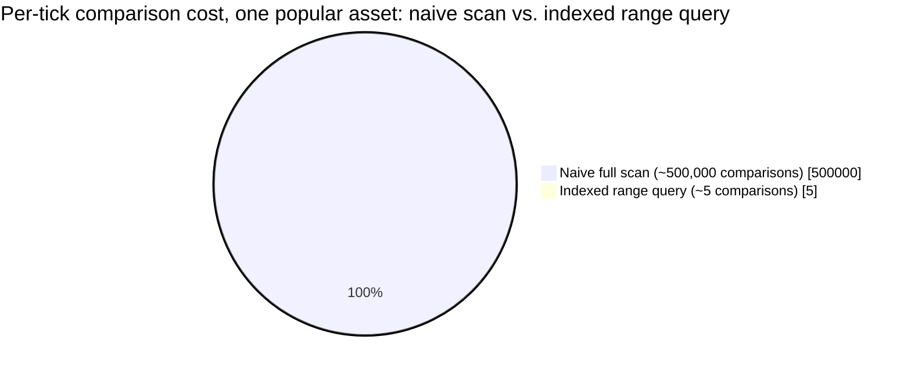

The indexed slice is invisible next to the naive one — which is exactly the point: per-tick cost
drops by many orders of magnitude once matching is scoped to thresholds actually near the price.

**Redo-the-chain test:** if threshold concentration on the top 100 assets rises from 60% to 80%
(even more skew, e.g. driven by a single viral stock), the hot-symbols deep dive's sharding
concern becomes proportionally more pressing — a direct, computable argument for why uniform
sharding-by-symbol alone isn't sufficient at high skew.

**The number worth memorizing:** a naive full-scan design costs tens of millions of comparisons
per second for a single popular asset alone — indexing by price range cuts this by many orders of
magnitude by ensuring per-tick cost tracks "thresholds near the current price," not "thresholds
that exist."

---

## API design

### `POST /v1/alerts`

```json
{
  "userId": "u_881",
  "symbol": "AAPL",
  "condition": "BELOW",
  "type": "ABSOLUTE",
  "value": 150.00,
  "channels": ["push", "email"]
}
```

or, for a percent-change threshold:
```json
{
  "userId": "u_881",
  "symbol": "BTC-USD",
  "condition": "MOVE",
  "type": "PERCENT",
  "value": 5.0,
  "referencePrice": 68000.00
}
```

### Internal: price tick ingestion (from the market-data feed, not user-facing)

```json
{ "symbol": "AAPL", "price": 149.80, "previousPrice": 150.20, "tickTime": "2026-07-24T14:32:01.500Z" }
```

| Field | Notes |
|---|---|
| `previousPrice` | Carried alongside the new price specifically so the range query can be computed as "everything between previous and new," not just "everything at the new price" — this is what catches a jump past multiple thresholds |
| `referencePrice` (percent-change alerts) | Stored at threshold-creation time, so a percent-change alert has a fixed anchor rather than silently drifting if recomputed against a moving reference |

### Alert delivered (internal → notification fan-out)

```json
{ "alertId": "alert_44821", "userId": "u_881", "symbol": "AAPL", "crossedValue": 150.00, "actualPrice": 149.80, "firedAt": "2026-07-24T14:32:01.600Z" }
```

**The one sentence worth saying about the API surface:** *"Every price tick carries both its new
and previous value, because the matching query is a range between the two — not a lookup at a
single point — which is exactly what lets a fast price move correctly cross several thresholds in
one tick instead of only the nearest one."*

---

## High-level architecture

### Architecture evolution (v1 → v2 → v3)

**v1 — scan every stored threshold for a symbol on every tick:**

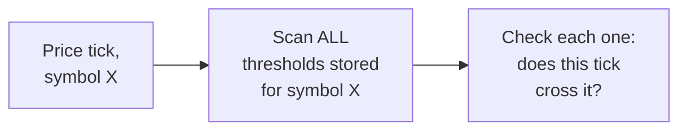

**Why it breaks:** per the capacity estimate, a single popular asset with hundreds of thousands of
stored thresholds at realistic tick rates produces tens of millions of comparisons per second for
that one asset alone — completely unworkable once multiplied across thousands of tracked assets.

**v2 — index by symbol, but check only the newest price point, not the range since the last
tick:**

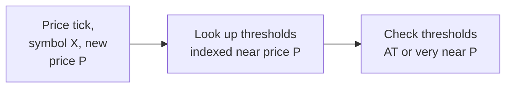

**Why it breaks:** indexing by symbol and price (v2's real improvement) fixes the scan-everything
problem for a *stable* price — but if the price jumps from $151 to $148 in one tick, checking only
"near $148" misses thresholds at $149 and $150 that were legitimately crossed during that move
and should have fired.

**v3 — the real system: range-indexed thresholds, queried by the interval between ticks:**

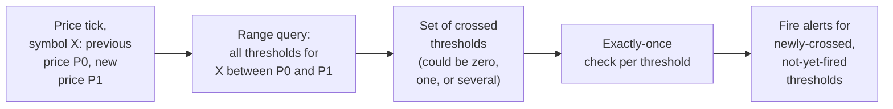

**What v3 fixes, one line each:** range-indexing by symbol and price (already motivated in v2)
makes per-tick cost proportional to nearby thresholds, not total stored count; querying the full
interval between the previous and new price (not just the new price alone) catches every threshold
a fast move crosses, not just the nearest one; and an exactly-once check prevents a sustained
crossing from re-firing on every subsequent tick.

---

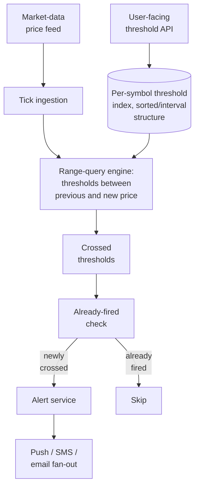

| Component | Role |
|---|---|
| Per-symbol threshold index | A sorted structure (or interval tree) per symbol, keyed by price — the mechanism behind the reverse-index deep dive |
| Range-query engine | Given a tick's previous and new price, returns every threshold whose value falls in that interval — the mechanism behind the multi-threshold-crossing deep dive |
| Already-fired check | Per-threshold state distinguishing "currently past" from "already alerted for this crossing" — the exactly-once deep dive |
| Alert service + channel fan-out | Standard multi-channel notification delivery, decoupled from the matching logic itself |

---

## End-to-end request walkthroughs

### Walkthrough 1 — a normal single-threshold crossing

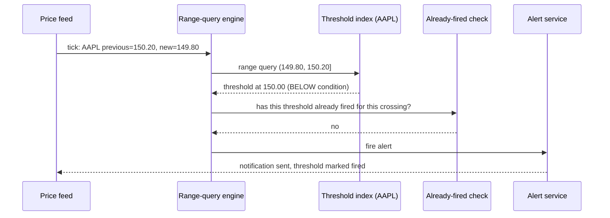

### Walkthrough 2 — a fast price move crosses three thresholds in one tick

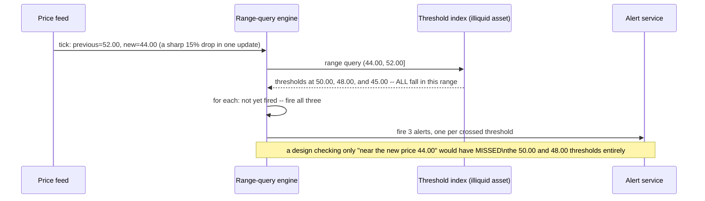

### Walkthrough 3 — sustained price below a threshold does not re-fire on every tick

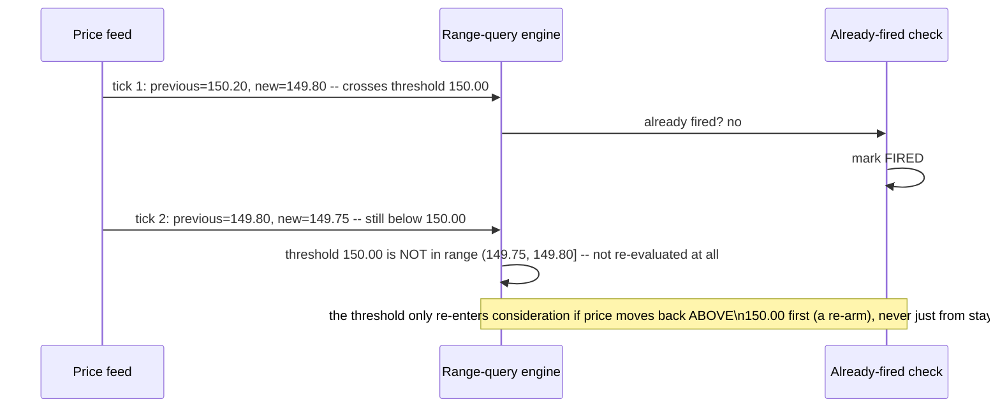

Walkthrough 3 is the concrete resolution to the exactly-once requirement — because the range
query is scoped to the *interval crossed this tick*, a threshold that was already crossed and left
behind simply never appears in a subsequent tick's range query again, with no separate
suppression logic needed for the common "stays below" case.

---

## Deep dive: the reverse index of thresholds

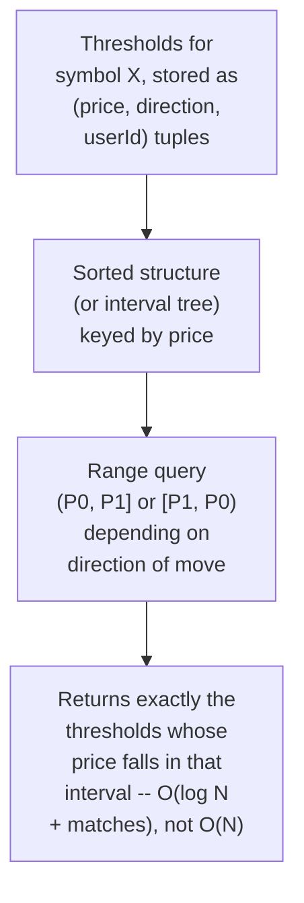

**Why a sorted structure specifically, not a hash map keyed by exact price:** a hash map only
answers "is there a threshold at exactly this price," which is useless here — the actual question
is "which thresholds fall between these two prices," an inherently range-shaped query that a
sorted structure (balanced tree, skip list, or an interval tree if thresholds have ranges rather
than points) answers efficiently, while a hash map cannot answer at all without a full scan.

**Why this is the mirror image of every search/ranking chapter in this course:** in the Airbnb or
recommendation chapters, the stored data (listings, catalog items) is queried by an incoming
request; here, the stored data (thresholds) is queried by an incoming *data point* (a price tick).
Recognizing this inversion explicitly is what separates a candidate who reaches for a search-index
mental model (wrong shape for this problem) from one who reaches for a range-indexed structure
(right shape).

**Interview cheat-sheet:** *"Index thresholds in a sorted/interval structure keyed by price, per
symbol — a hash map can't answer 'what falls between these two values,' and that range query is
the entire problem. This is the inverse of a normal search chapter: the query is stored, the data
streams in."*

---

## Deep dive: multi-threshold crossing in one tick

Already the centerpiece of walkthrough 2 — the deep dive states the general principle.

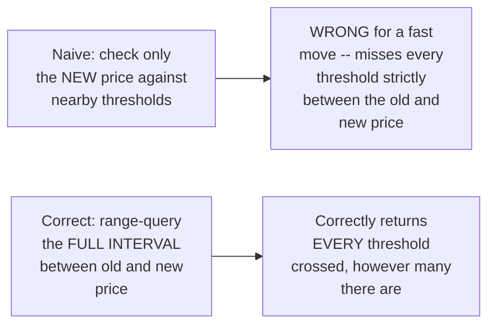

**Why this matters more for illiquid assets and during volatile moments, but must be designed for
universally:** a highly liquid asset ticks frequently in small increments, so any single tick
rarely crosses more than one threshold in practice — but an illiquid asset, a market-open gap, or
a flash-crash-style event can move a price sharply between consecutive ticks, and the range-query
approach handles both cases uniformly without needing to special-case "is this a big move."

**Interview cheat-sheet:** *"Always query the full interval between the previous and new price,
never just the new price's neighborhood — this is what correctly fires every threshold a fast
move crosses, and it requires no special-casing for 'big' vs. 'small' moves, since the range query
naturally returns however many thresholds actually fall in the interval."*

---

## Deep dive: exactly-once alert delivery

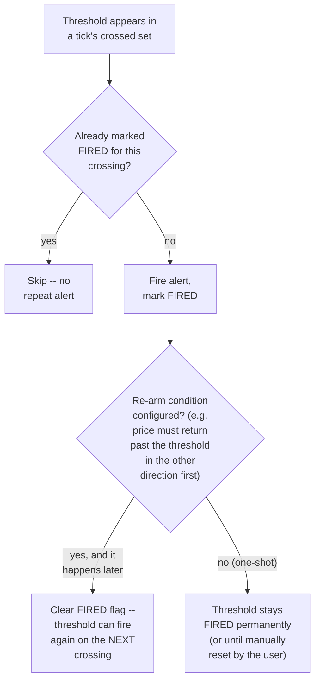

**Why "currently past the threshold" and "already fired" must be tracked as two distinct pieces of
state:** per walkthrough 3, a price that stays below a threshold for hours generates thousands of
ticks, none of which should re-trigger the same alert — the range-query design already avoids
re-evaluating a threshold once the price has moved past it and stayed there, but the explicit
`FIRED` flag is still needed to handle re-arming correctly: without it, there's no way to
distinguish "this threshold has never fired" from "this threshold fired once and the price simply
hasn't crossed back," which matters the moment re-arming is a supported feature.

**Interview cheat-sheet:** *"Track 'already fired' as explicit state, separate from the price's
current position relative to the threshold — this is what makes one-shot alerts not spam on every
tick, and what makes re-arming (if supported) a well-defined, intentional transition rather than
an accident of query timing."*

---

## Deep dive: hot symbols & fan-out

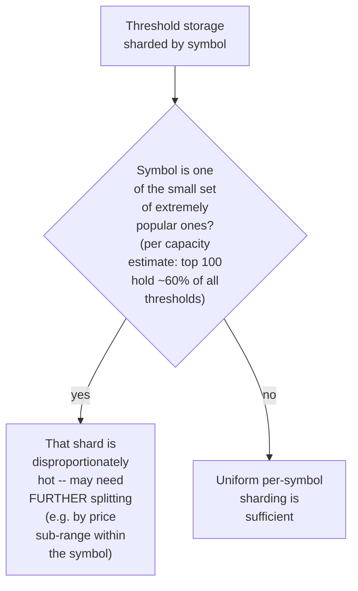

**Why uniform sharding-by-symbol alone isn't sufficient at realistic skew:** per the capacity
estimate, a small number of popular assets concentrate the majority of stored thresholds and tick
volume — sharding purely by symbol leaves those specific shards far hotter than the rest,
mirroring the same "one hot key needs its own scaling strategy" lesson as the sharded-counters
chapter, here applied to a range-indexed structure rather than a simple counter.

**Interview cheat-sheet:** *"Don't assume uniform sharding-by-symbol is enough — a small number of
extremely popular symbols will concentrate both threshold count and tick volume, and those specific
shards may need further splitting (e.g. by price sub-range) the same way any hot-key problem does
elsewhere in this course."*

---

## Data model

**Threshold lifecycle:**

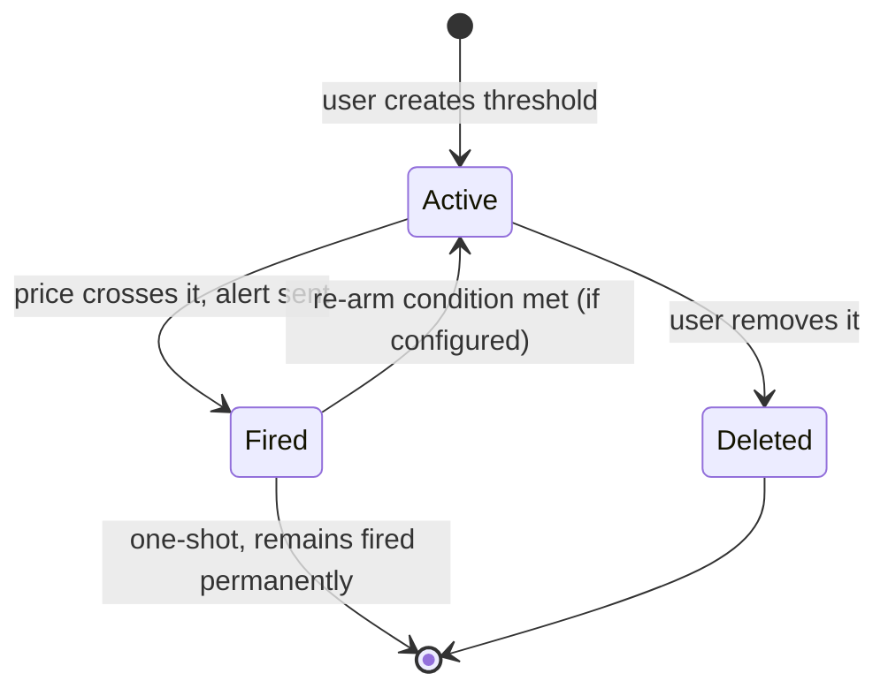

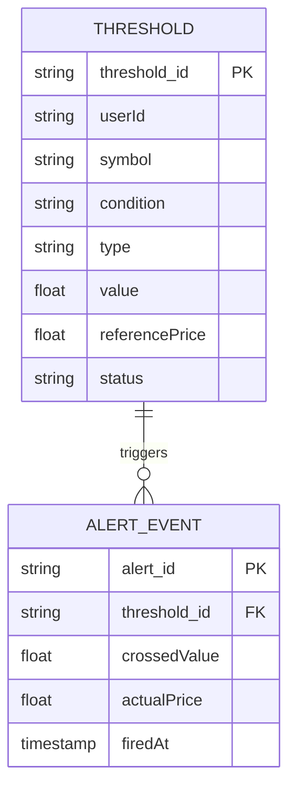

| Table | Storage choice & why |
|---|---|
| `Threshold` | The range-indexed structure itself, sharded by symbol (and further by price sub-range for hot symbols) — both the storage and the query target for the matching engine |
| `AlertEvent` | Append-only, low volume relative to tick-processing volume per the capacity estimate — the audit trail of every fired alert |

---

## Failure modes & mitigations

| Failure mode | Impact | Mitigation |
|---|---|---|
| **A tick is dropped or delayed in the ingestion pipeline** | A threshold crossing could be missed entirely if the feed jumps straight past it in the NEXT tick without the dropped tick's price ever being queried | Always range-query using the last successfully processed price as the interval's start, not assume every tick arrives — this naturally self-heals as long as ticks are eventually delivered in order, even if delayed |
| **Duplicate delivery of the same tick** (a feed retry) | Risk of evaluating the same interval twice | Idempotent tick processing keyed by a tick sequence number or timestamp, same discipline as any at-least-once ingestion pipeline elsewhere in this course |
| **A percent-change threshold's reference price becomes stale/confusing to the user** | User unsure why an alert fired relative to a reference point set long ago | Surface the reference price and when it was set clearly in the alert notification itself, and support an explicit "reset reference to current price" action |
| **A hot symbol's shard becomes a bottleneck** | Matching latency degrades specifically for popular assets, the ones users care about most | Further split by price sub-range within a hot symbol, per the hot-symbols deep dive |

---

## Non-functional walkthrough

**Scaling matching cost is bounded by thresholds-near-the-current-price, not total stored
thresholds** — per the capacity estimate, this is a many-orders-of-magnitude improvement over a
naive scan, and it's the single defining scalability property of this whole system.

**Availability of the matching pipeline should be very high for popular, actively-alerted-on
assets** — a gap in tick processing risks silently missing a crossing, which directly defeats the
product's value proposition.

**Consistency requirements are asymmetric by field:** the "already fired" state must be strictly,
immediately consistent (no double-alert), while the underlying price feed's own freshness is
bounded by the upstream provider, not something this system controls or should overpromise on.

---

## Security & compliance

- **Financial alerting carries real regulatory weight in some jurisdictions** (e.g. anything that
  could be construed as investment advice, versus a purely mechanical notification) — worth
  naming that the system's framing ("your configured condition was met") should stay
  mechanical/factual, not advisory, if the interviewer probes compliance concerns.
- **Threshold data is sensitive** (it reveals a user's financial positions/interests) and should
  follow standard access-control and encryption-at-rest practices.
- **Feed integrity** — the system's correctness is entirely dependent on the upstream price feed's
  own integrity; a compromised or manipulated feed would cause incorrect alerts regardless of how
  well the matching engine itself is built, worth naming as an explicit trust boundary.

---

## Cost & trade-offs

**Range-indexing trades some write-path complexity (maintaining a sorted/interval structure on
threshold creation/deletion) for the many-orders-of-magnitude read-path (tick-matching) savings
established in the capacity estimate** — an easy trade given how tick volume dwarfs threshold
create/delete volume in any realistic usage pattern.

**Further splitting hot symbols trades operational complexity (non-uniform sharding) for avoiding
a bottleneck on exactly the assets users care about most** — worth the added complexity
specifically because hot-symbol degradation would be the most visible, most complained-about
failure mode.

---

## Wrap-up: MVP vs. stretch

**In scope for an MVP:**
- Range-indexed threshold storage per symbol, queried by the interval between consecutive ticks.
- Exactly-once firing via an explicit `FIRED` state per threshold, one-shot (no re-arm) by
  default.
- Absolute-price thresholds only; multi-channel alert delivery.

**Explicitly out of scope for an MVP:**
- Percent-change thresholds — start with absolute price levels (simpler reference semantics), add
  percent-change once the reference-price UX is designed.
- Hot-symbol sub-sharding — start with uniform per-symbol sharding, add sub-sharding once real
  traffic confirms which symbols need it.

**Stretch goals, worth naming if asked "what's next":**
1. **Re-arming conditions**, letting a threshold fire again after the price returns past it in the
   opposite direction first.
2. **Percent-change and trailing-stop-style thresholds**, with their own reference-price semantics.
3. **Predictive/near-threshold notifications** ("you're within 2% of your alert"), a softer signal
   layered on top of the hard-crossing detection this chapter focuses on.

---

## Golden rules

- **This problem is inverted from a normal search chapter** — the query (threshold) is stored,
  the data (price tick) streams in. Recognizing this shape is the single most important framing
  move in the whole interview.
- **Index thresholds by price range, per symbol** — a hash map can't answer "what falls between
  these two values," and that's the entire query this system needs to serve fast.
- **Always range-query the full interval between the previous and new price**, never just the
  new price alone, or a fast move silently skips thresholds it should have crossed.
- **Track "already fired" as state distinct from "currently past the threshold"** — this is what
  prevents alert spam on a sustained crossing and makes re-arming well-defined.
- **Don't assume uniform sharding-by-symbol is enough** — a small number of popular symbols
  concentrate the majority of load and may need their own further splitting.

---

## Master cheat sheet

**One-liners:**
- The query is stored, the data streams in — this is the mirror image of every search/ranking
  chapter in the course, and naming that inversion explicitly is the strongest opening move.
- Range-index thresholds by price per symbol; a naive full scan costs tens of millions of
  comparisons per second for a single popular asset alone at realistic threshold density.
- Always query the interval between the previous and new tick price, never just the new price, to
  correctly catch a fast move crossing several thresholds at once.
- "Already fired" and "currently past the threshold" are two different states — conflating them
  causes repeat-alert spam on any sustained crossing.
- A small number of hot symbols concentrate most load — uniform sharding-by-symbol alone isn't
  sufficient at realistic skew.

**Formula chain:**
```
naive_scan_cost_per_tick   = ticks_per_sec x thresholds_stored_for_that_symbol
indexed_query_cost_per_tick = O(log(thresholds_for_symbol) + thresholds_actually_crossed)
```

**Numbers:** a naive per-tick full scan on one popular asset can reach tens of millions of
comparisons per second; range-indexing cuts this to a handful of comparisons per tick in the
common case · threshold concentration on a small number of popular assets is typically extreme
(often 50-60%+ of all thresholds on the top ~100 of thousands of tracked symbols).
