# DNS (Domain Name System) — FAANG Interview Guide (v2)

> **v2.2 — learning-experience QA pass.** Re-reviewed the v2 file end-to-end as learning content, not just for technical accuracy. Two real gaps closed:
> - **Missing acronym expansions.** BGP, PoP, ISP, RFC, IETF, CDN, CAP/PACELC, RTT, VIP, EDNS0, GSLB, ALB/NLB, and SPF were all used in the text — several of them repeatedly — without ever being spelled out, which strands a true beginner mid-sentence. Each now gets a brief, in-context expansion on first use in its section; the recurring, load-bearing ones (BGP, PoP/ISP, RFC/IETF, CDN, CAP/PACELC) also got their own §0 glossary row.
> - **Two dense sections had zero diagrams.** §8 (traffic-steering policies) and §9.5 (SPOF/DDoS) explain inherently sequential/spatial ideas — "which policy picks the IP, then filtered by a health check" and "attacker → spoofed source → victim" — in prose and tables only. Both now have a Mermaid diagram, for the same reason §6 and §7 got theirs in the v2.1 patch below.
> - Small consistency fixes: the roadmap diagram was missing the §5→§8 edge (§8 leans on TTL, which §5 defines, but the graph didn't show that dependency); §12.5 and the Master Cheat Sheet were the only two headings without a TL;DR line; and the cross-reference to `11-CDN-FAANG-Guide.md` §10 quoted a section title that doesn't match the actual file — corrected.
> - No technical claims changed, nothing was renumbered, nothing was removed.
>
> 

> 
v2 / v2.1 enhancement notes (learning-experience pass + follow-up patch, preserved for history)

>
> **v2 — learning-experience pass.** The v1 content (hierarchy, record types, TTL/caching, DNSSEC, load balancing, SPOF/DDoS, capacity math) was technically strong and is preserved almost word-for-word below. This pass fixed how it *teaches*, not what it teaches:
> - Added **§0: How to use this guide** — a difficulty-tagged roadmap diagram (🟢/🟡/🔴) and a one-page glossary, so a first-time reader knows what order to read in and isn't blocked the first time an unfamiliar term (`TTL`, `anycast`, `authoritative`) shows up two sections before it's formally defined.
> - Added a **🟢 TL;DR line under every section heading** — one plain-English sentence you can skim top-to-bottom to get the whole guide's shape in 60 seconds before reading any section in depth.
> - Added **difficulty badges** (🟢 Beginner / 🟡 Intermediate / 🔴 Advanced) to every heading, so you can do a first pass on 🟢-only sections and come back for 🟡/🔴 once the fundamentals are solid.
> - Added a **"Read this before the jargon" plain-English walkthrough** at the top of §1, before the interview-framing cheat sheet — the original opened straight into interview shorthand, which is fine for revision but hostile to a true first read.
> - Added a **"Where people get this backwards" callout in §4** — iterative-vs-recursive is the single most common mix-up in this material, and it's mixed up for a specific, nameable reason.
> - Added **§12.5: Active Recall — Test Yourself** — close-the-guide-and-answer questions with collapsible answers, in the same spirit as this course's CDN guide. Recognizing an explanation while reading it and being able to reproduce it cold are different skills; this section trains the second one. (Extended to 16 questions, plus a spaced-repetition callout, in the v2.1 patch below.)
> - No technical claims were changed, no diagrams were removed, and section numbers 1–13 (including the existing §9.5) were **left untouched** so cross-references stay valid — new material was slotted in as §0 and §12.5 to match this doc's existing "§X.5" convention rather than renumbering everything.
>
> **v2.1 — targeted follow-up patch, same file.** A second pass closed the remaining gaps: the two densest sections (§6 capacity math, §7 distributed-systems properties) had zero diagrams despite being the most conceptually loaded material in the guide — both now have one. Added a clickable table of contents to §0. Added a **§13.5 "The Full Picture"** synthesis diagram that finally shows every concept (hierarchy, caching, load balancing, DNSSEC, SPOF defenses) composed into one real request, plus a consolidated "common mistakes" list. Added a worked, verbatim sample answer to §11 so the playbook shows what a good spoken answer sounds like, not just the steps. Added a spaced-repetition callout and two mnemonic/diagram-recall questions to §12.5 — reading a cheat sheet once doesn't beat forgetting; a re-test schedule does.
>
> 

> 
Original v1 enhancement notes (content-completeness pass, preserved for history)

>
> The original draft was already strong on hierarchy, record types, TTL/caching, DNSSEC, and DNS-based load balancing — those sections were left as-is. That pass filled the two gaps a FAANG interviewer would actually probe next: a direct DNS-geo-routing-vs-anycast comparison (§8 subsection, cross-referencing `11-CDN-FAANG-Guide.md` §10 instead of duplicating its BGP mechanics), and a dedicated DNS-as-SPOF/DDoS-target section (§9.5: attack shapes, anycast/multi-provider/RRL/scrubbing mitigations, and why DNSSEC doesn't help there). It also added the hop-by-hop resolution-latency table (§1), the caching-layers/TTL table with a worked example (§5), the §8 geo-routing-vs-anycast table, and threaded cross-references from §10/§11/Golden Rules into §9.5.
> 

> 

---

## 0. How to use this guide 🟢

**TL;DR:** Read top to bottom once for the shape of the whole topic; come back section-by-section for depth. Difficulty badges tell you what's safe to skim on pass one.

Every section heading below carries a badge:

| Badge | Meaning |
|---|---|
| 🟢 Beginner | No prior DNS knowledge assumed — read these first, in order |
| 🟡 Intermediate | Assumes you're comfortable with §1–§5 | 
| 🔴 Advanced | Interview-depth material — the stuff that separates "knows DNS" from "would design DNS" |

### Table of contents

- [Mental model](#mental-model-)
- [1. What DNS is and why it exists](#1-what-dns-is-and-why-it-exists-)
- [2. DNS hierarchy — the four server types](#2-dns-hierarchy-the-four-server-types-)
- [3. Resource Records (RRs) — the actual data model](#3-resource-records-rrs-the-actual-data-model-)
- [4. Iterative vs. recursive resolution](#4-iterative-vs-recursive-resolution-)
- [5. Caching — the mechanism that makes DNS actually work](#5-caching-the-mechanism-that-makes-dns-actually-work-)
- [6. Capacity estimation — sizing DNS traffic](#6-capacity-estimation-sizing-dns-traffic-worked-example-)
- [7. DNS as a distributed system](#7-dns-as-a-distributed-system-scalability-reliability-consistency-)
- [8. DNS-based load balancing & traffic steering](#8-dns-based-load-balancing-traffic-steering-)
- [9. DNSSEC — securing the chain of trust](#9-dnssec-securing-the-chain-of-trust-)
- [9.5. DNS as a single point of failure and DDoS target](#95-dns-as-a-single-point-of-failure-and-ddos-target-)
- [10. Real-world systems and how they actually use DNS](#10-real-world-systems-and-how-they-actually-use-dns-)
- [11. Interview Playbook](#11-interview-playbook-the-order-to-talk-through-dns-out-loud-)
- [12. Common follow-up/trick questions](#12-common-follow-uptrick-questions-)
- [12.5. Active Recall — Test Yourself](#125-active-recall-test-yourself-)
- [13. Golden Rules](#13-golden-rules-)
- [13.5. The Full Picture — one request, every concept](#135-the-full-picture-one-request-every-concept-)
- [Master Cheat Sheet](#master-cheat-sheet)

*(If your viewer doesn't jump correctly, anchors depend on how it strips the emoji badges — falls back gracefully to a plain scroll/search either way.)*

### The roadmap

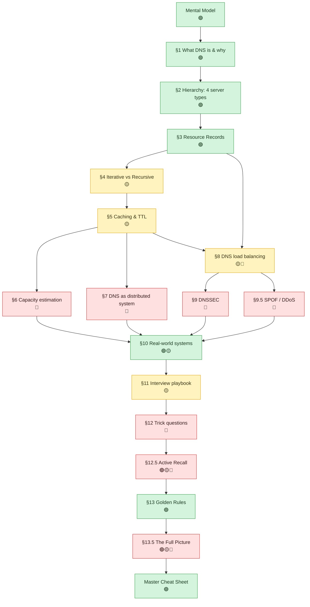

**First read (never touched DNS internals before)?** Do the green path top to bottom: Mental Model → §1 → §2 → §3 → §10 → §13. That alone gives you a correct, coherent picture. Everything else is depth you layer on afterward.

**Revising for an interview?** Skim the TL;DR line under every heading first (60 seconds, gives you the whole shape), then jump straight to §12.5 (Active Recall) and only go back to a section when you can't answer its question cold.

### Quick glossary (look up, don't memorize — memorizing happens naturally by §5)

| Term | One-line meaning | Defined in |
|---|---|---|
| **Resolver** | The service that does the lookup legwork on your behalf and caches the result | §1, §4 |
| **Root / TLD / Authoritative server** | The three rungs of the delegation chain a resolver climbs down: "which TLD?" → "which org's DNS?" → "the actual IP" | §2 |
| **Resource Record (RR)** | One entry in DNS's database: `(Type, Name, Value)`, e.g. an A record mapping a hostname to an IP | §3 |
| **TTL (Time To Live)** | How long a cached answer is allowed to be reused before re-checking with the authoritative server | §5 |
| **Anycast** | One IP address, announced from many physical locations; BGP routes each client to the nearest one | §2 |
| **BGP (Border Gateway Protocol)** | The internet's inter-network routing protocol — the actual mechanism that makes anycast's "nearest instance" routing happen | §2 |
| **PoP (Point of Presence) / ISP (Internet Service Provider)** | A PoP is a physical location a network operator has equipment in (a "CDN edge PoP" = one of a CDN's edge locations); an ISP is the company that gets your traffic onto the internet and usually runs your local recursive resolver | §1, §2 |
| **Iterative vs. Recursive query** | Iterative = "here's a referral, ask them next" (used resolver→upstream). Recursive = "I'll get you the final answer myself" (used client→resolver) | §4 |
| **DNSSEC / DNSKEY / RRSIG / DS** | The cryptographic chain that lets a resolver verify a DNS answer wasn't forged (authenticity, not privacy) | §9 |
| **DoH / DoT** | DNS-over-HTTPS / DNS-over-TLS — encrypt the query itself (privacy), a *different* concern from DNSSEC | §9 |
| **CAP theorem / PACELC** | CAP: under a network partition, pick Consistency or Availability, not both. PACELC extends it — even with no partition, you still trade Latency vs. Consistency. DNS is the textbook example of choosing Availability/Latency over strong consistency | §7 |
| **GeoDNS / latency-based / weighted routing** | Ways an authoritative server picks *which* IP to hand back, per query, to steer traffic | §8 |
| **CDN (Content Delivery Network)** | A geographically distributed cache of edge servers that content is served from; DNS (CNAME + geo-routing) is the mechanism that points a client at the nearest edge — full treatment in `11-CDN-FAANG-Guide.md` | §2, §8 |
| **Zone apex** | The bare root of a domain (`example.com`, no subdomain) — has special rules about which record types it can hold | §3 |
| **RFC (Request for Comments) / IETF (Internet Engineering Task Force)** | RFCs are the internet's standards documents; the IETF is the body that publishes them — cited because RFC 1034 is literally the document that defines the CNAME restrictions in §3 | §3 |
| **Stub resolver** | The tiny resolver built into your OS that just forwards queries to a real recursive resolver | §12 (Q4) |
| **RRL (Response Rate Limiting)** | Throttling repeated identical DNS responses to the same source, to blunt amplification abuse | §9.5 |

---

## Mental model 🟢

**TL;DR:** DNS isn't "a phone book" so much as a globally distributed, cache-optimized, eventually-consistent key-value store — and that framing, not the phone-book analogy, is what actually explains its design.

DNS is the Internet's **phone book**: it maps human-friendly names (`educative.io`) to machine-readable IP addresses (`104.18.2.119`). But the more useful interview framing is: **DNS is a globally distributed, hierarchical, eventually-consistent, read-heavy key-value store optimized for caching.** Every hard property of DNS (scalability, availability, staleness) follows from that framing — and it's the same framing you'll reuse when you design your own read-heavy distributed lookup service (service discovery, feature flags, config stores).

If you can explain *why* DNS is built the way it is (not just *what* it does), you signal senior-level systems thinking.

---

## 1. What DNS is and why it exists 🟢

**TL;DR:** Computers only understand IP addresses; DNS is the translation layer that lets humans (and code) use names instead — and that translation happens silently, before your browser even opens a connection.

### Read this before the jargon (plain-English first)

Forget servers and protocols for a second. Every time you type `educative.io` into a browser, something has to answer one question: *"what machine, physically, do I connect to?"* Machines find each other on the internet using numeric addresses (IP addresses) — names like `educative.io` are a convenience layer for humans that has to get translated into one of those numbers before any actual connection can happen. DNS is the system that does that translation. That's the entire idea. Everything else in this guide — hierarchy, caching, TTLs, security — is just "how do you do that translation at the scale of billions of devices, without it becoming slow, unreliable, or a single point of failure."

Now the interview-depth version of the same idea:

- Computers are addressed by IP (e.g., `104.18.2.119`); humans can't memorize thousands of these, so we need a naming layer.
- DNS decouples **identity** (domain name) from **location** (IP address). This indirection is the same reason you'd put a load balancer or service registry in front of a fleet of servers — it lets the underlying IPs change (server failure, migration, scaling, cloud region moves) without breaking every client that references the name.
- It's **transparent to the end user** — the browser silently resolves the name before the HTTP request ever leaves the machine.

### The one diagram to remember

Everything else in this guide is detail on top of this single picture. Memorize this shape, not the prose.

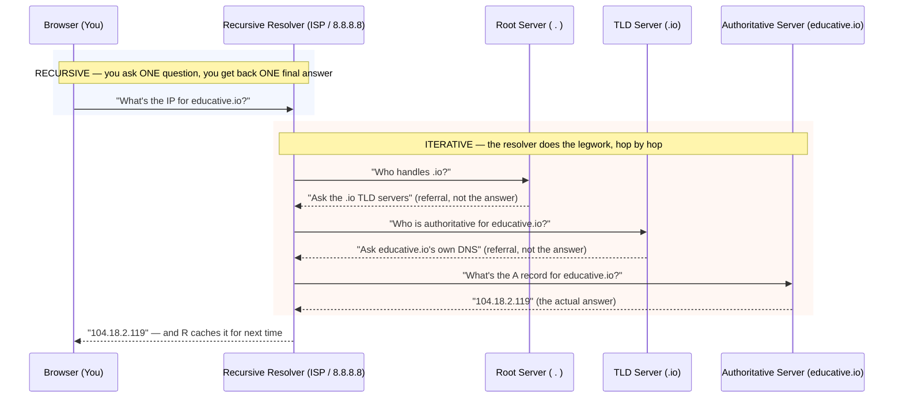

**Memory hook — nest it like Russian dolls:** *one recursive call on the outside, wrapping an iterative walk on the inside.* You (the browser) never see the iterative part — that's entirely the resolver's problem to solve on your behalf. This single fact is what section 4 below is really about; everything there is just zooming into the orange box.

**Interview cheat-sheet:**
- DNS resolution happens **before** the TCP handshake — it's pure overhead on the critical path, which is exactly why caching at every layer matters so much.
- Say "DNS decouples name from location" when asked why any naming/discovery layer exists.
- Root/TLD replies are **referrals** ("ask someone else"), not answers — only the authoritative server gives the actual IP.
- Every DNS answer served before its TTL expires is a **cache hit** — the multi-hop dance in the diagram above is what happens on a *miss*, which is the rare case, not the common one.
- This mental model (globally distributed, hierarchical, eventually-consistent, cache-optimized KV store) is directly reusable for service-discovery/config-store design questions — say so explicitly.
- If asked to estimate DNS load, don't jump straight to numbers — state this framing first; it's *why* the numbers in section 6 work out the way they do.

### How slow is a cold resolution, hop by hop? (illustrative)

The diagram above shows the *shape* of a full cache-miss walk. Here's roughly what it costs in time — one round trip per hop, for a client in the US resolving a `.io` domain:

| Hop | Illustrative RTT | Running total |
|---|---|---|
| Client → recursive resolver | ~1–5ms (same ISP/local network) | ~5ms |
| Resolver → root server | ~20–50ms (anycast picks the nearest of ~1,000 instances) | ~55ms |
| Resolver → TLD server | ~20–50ms | ~105ms |
| Resolver → authoritative server | ~20–100ms (depends on where the org hosts DNS) | ~125–205ms |

Total: roughly **100–200ms on a full cache miss** — these are illustrative order-of-magnitude numbers, not measured figures; real RTTs depend entirely on network topology. What matters for the interview is the *shape*: this is pure latency added **before** the TCP handshake even starts, which is exactly why a cache hit (a few ms, one hop to the resolver) matters so much for perceived page-load speed.

*(RTT = Round-Trip Time — how long it takes a packet to reach its destination and the reply to come back; it's the natural unit for network latency, which is why the table above measures hops in RTTs rather than raw milliseconds. ISP = Internet Service Provider, e.g. Comcast, Airtel, Jio — the network you're physically connected through, which is usually also who runs the recursive resolver your OS is configured to use.)*

---

## 2. DNS hierarchy — the four server types 🟢

**TL;DR:** DNS isn't one server, it's a tree of specialized servers — resolver, root, TLD, authoritative — where each layer only knows how to point you to the *next* layer, never the final answer, until the last hop.

DNS is **not one server** — it's a tree-structured infrastructure, which is the source of its scalability.

**Don't conflate two different trees** — this is the #1 thing people mix up:

1. **The naming tree (the data)** — how domain names themselves are structured, dot by dot:

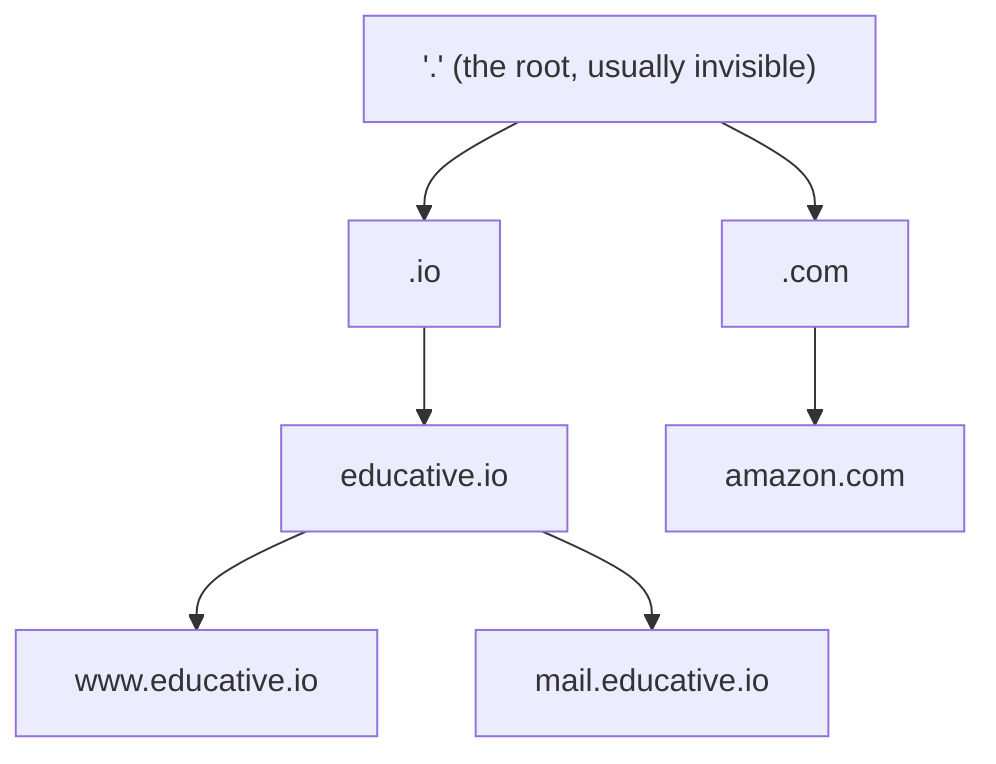

2. **The server-role tree (the infrastructure that serves a slice of that data):**

| Server type | Role | Analogy |
|---|---|---|
| **DNS Resolver** (local/recursive resolver) | Entry point for the client; does the legwork of walking the tree on the client's behalf; caches aggressively | Your assistant who makes all the phone calls for you |
| **Root name servers** | Know which TLD servers exist (`.com`, `.io`, `.edu`); don't know actual IPs | "Which country is this address in?" |
| **TLD (Top-Level Domain) name servers** | Know the authoritative servers for each registered domain under that TLD | "Which city, within that country?" |
| **Authoritative name servers** | Owned/operated by the organization; hold the actual resource records (A, CNAME, MX, etc.) | "Which house, on that street?" — the final, exact answer |

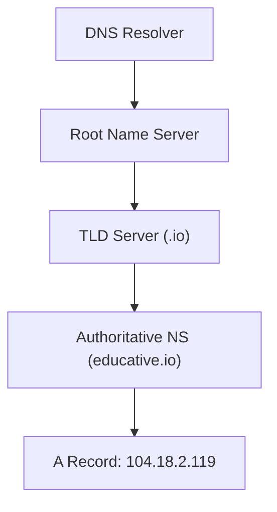

**Memory hook — asking for directions, one zoom level at a time:** "Which country?" → "Which city?" → "Which street?" → "Which house?" Each server only answers *its own* zoom level and delegates the rest — nobody holds the whole map.

**Key fact to memorize:** There are **13 logical root server addresses** (letters A–M), operated by **12 different organizations**, but physically replicated into **~1,000+ instances worldwide** using anycast IP routing. This is the canonical example of "logical count stays fixed, physical replication scales horizontally" — a pattern you'll reuse when discussing sharding vs. replication.

### Anycast vs. unicast — the trick that makes "13 servers" a lie in the best way

Root servers, public resolvers, and CDN edges all rely on **anycast**; a typical origin server relies on **unicast**. These are never contrasted directly, but the difference is exactly what makes DNS's scale numbers make sense:

| | Anycast | Unicast |
|---|---|---|
| IP-to-node mapping | The **same IP address** is announced from many physical locations simultaneously; BGP routes each client to the topologically nearest instance | One IP address maps to exactly **one** physical node |
| Who uses it | Root servers, TLD servers, public resolvers (8.8.8.8, 1.1.1.1), CDN edge PoPs | A typical origin server, a single-region database primary |
| Failure behavior | An instance can go dark and BGP simply stops advertising its route — traffic reroutes to the next-nearest instance, transparently, with no DNS change needed | Node failure requires an explicit failover mechanism (DNS record change, VIP — Virtual IP — move, etc.) |
| Why it matters here | This is *how* "13 logical roots" become "~1,000 physical instances" without any client doing anything differently | The contrast case — what you'd have *without* anycast: one IP, one place, one point of failure |

*(Three quick expansions, since they'll all recur from here on: **CDN** = Content Delivery Network, a geographically distributed cache of edge servers — full treatment in `11-CDN-FAANG-Guide.md`; **PoP** = Point of Presence, a physical location where a network operator has equipment, so "CDN edge PoP" = one of a CDN's many edge locations; **BGP** = Border Gateway Protocol, the internet's inter-network routing protocol — it's the actual mechanism that makes anycast's "route to the nearest instance" behavior happen.)*

Domain names are resolved **right to left**: `www.educative.io` → root (`.`) → `.io` → `educative.io` → `www.educative.io`. This is why root servers are queried first even though they're "furthest" from the actual answer conceptually.

**Interview cheat-sheet:**
- Four layers: Resolver → Root → TLD → Authoritative.
- Root servers answer "which TLD server?", not "what's the IP?" — each layer only knows how to route to the *next* layer, not the final answer (delegation of responsibility, just like a routing table).
- 13 logical roots, 12 orgs, ~1000 anycast instances — say this number, interviewers like it.
- Anycast = one IP, many physical machines, BGP picks the nearest one; unicast = one IP, one machine. This is the mechanism, not just a buzzword.
- Don't confuse the naming tree (dot-separated domain hierarchy) with the server-role tree (resolver/root/TLD/authoritative) — two different trees, easy to conflate under interview pressure.
- "Delegation" is the operative word: every layer except the authoritative server only knows how to point to the *next* layer.

---

## 3. Resource Records (RRs) — the actual data model 🟢

**TL;DR:** Every DNS answer is one row in a `(Type, Name, Value)` table — an A record is "hostname → IP," a CNAME is "hostname → another hostname," and every lookup chain eventually has to bottom out at an A/AAAA record to get a real IP.

The DNS database is a set of **resource records**, each a `(Type, Name, Value)` triple. This is DNS's actual "schema" — think of it as the phone book's actual page format, if you want to tie it back to the mental-model analogy: every entry is `(what kind of listing, whose name, what number)`.

| Type | Purpose | Name | Value | Example |
|---|---|---|---|---|
| **A** | Hostname → IPv4 | Hostname | IP address | `(A, relay1.main.educative.io, 104.18.2.119)` |
| **AAAA** | Hostname → IPv6 | Hostname | IPv6 address | `(AAAA, educative.io, 2606:4700::...)` |
| **NS** | Authoritative DNS server for a domain | Domain name | Hostname | `(NS, educative.io, dns.educative.io)` |
| **CNAME** | Alias → canonical hostname | Alias hostname | Canonical name | `(CNAME, www.educative.io, server1.primary.educative.io)` |
| **MX** | Mail server for a domain | Domain/alias | Mail server hostname | `(MX, mail.educative.io, mailserver1.backup.educative.io)` |
| **TXT** | Arbitrary text (SPF, domain verification) | Hostname | Text string | used for email anti-spoofing, ownership proofs |

*(SPF = Sender Policy Framework — a TXT-record standard listing which mail servers are allowed to send email for your domain, so receivers can reject forged "From: you@yourdomain.com" spam.)*
| **SOA** | Zone's authoritative info (refresh/retry/TTL defaults) | Zone | Admin metadata | governs zone transfer behavior |

**Memory hook — the 7 record types, one sentence:** *"Ants Always Carry Mangoes To Nervous Snails"* → **A**, **A**AAA, **C**NAME, **M**X, **T**XT, **N**S, **S**OA. Say it once out loud and you won't blank on the list under pressure.

**CNAME chains resolve like alias-following, always ending in an A record:**

**Memory hook:** a CNAME is a signpost saying "actually, ask over there" — the resolver keeps following signposts until it hits an **A record**, which is the only record type that ends the chase with a real IP.

### CNAME vs. A/AAAA vs. ALIAS/ANAME — the classic gotcha

| | A / AAAA | CNAME | ALIAS / ANAME (provider extension) |
|---|---|---|---|
| Points to | An IP address, directly | Another hostname (indirection) | Another hostname, but resolved **server-side** into an IP before the answer ever reaches the client |
| Can coexist with other records at the same name? | Yes | **No** — if `www` has a CNAME, it can hold *no other record* (no MX, no TXT, nothing) at that exact name | Yes — behaves like an A record on the wire |
| Usable at the zone apex (`example.com` itself)? | Yes | **No** — RFC 1034 forbids a CNAME at the apex because the apex must also carry NS/SOA records, which can't coexist with a CNAME | Yes — this restriction is *precisely why it was invented* |
| Typical use | Origin servers, load balancer VIPs | `www.example.com` → CDN/vendor hostname | Naked domain (`example.com`) → CDN hostname, when you need CNAME-like flexibility at the apex |

**The gotcha to say out loud:** "You can't put a CNAME at a zone apex, and a CNAME can't share a name with any other record — that's why ALIAS/ANAME records exist, as a DNS-provider-side workaround, not an IETF (Internet Engineering Task Force) standard record type." *(RFC = Request for Comments, the internet's standards-document series; the IETF is the body that publishes them — RFC 1034 is literally the document that defines the CNAME restrictions above.)*

**Why this matters in an interview:** if you're asked to design a **global traffic routing / multi-region failover** system, the answer is almost always "use DNS with short TTLs and health-checked A/CNAME records" (this is literally how Route 53 and Cloudflare Load Balancing work). Knowing the RR types lets you say concretely: "point the CNAME at a weighted/latency-based routing policy, and have health checks pull unhealthy IPs out of rotation."

**Interview cheat-sheet:**
- RR = `(Type, Name, Value)`. Know A, NS, CNAME, MX cold.
- CNAME is an alias layer — useful for pointing your domain at a third-party service (CDN, load balancer) without hardcoding IPs.
- This RR model is *why* DNS-based traffic steering (GSLB — Global Server Load Balancing, steering traffic across regions using DNS — blue-green deploys, canary by region) works.
- CNAME's two hard rules: can't coexist with other records at the same name, can't sit at a zone apex — ALIAS/ANAME exists specifically to route around rule two.
- Mnemonic for all 7 types: "Ants Always Carry Mangoes To Nervous Snails" → A, AAAA, CNAME, MX, TXT, NS, SOA.
- SOA isn't just trivia — it holds the refresh/retry/expire timers that govern how secondary name servers stay in sync with the primary.

---

## 4. Iterative vs. recursive resolution 🟡

**TL;DR:** "Recursive" describes what the *client* experiences (one question, one final answer); "iterative" describes what the *resolver* does behind the scenes (walk hop by hop, collecting referrals) — same resolution, two names because they describe two different vantage points.

Two query styles, and interviewers love this distinction because it maps to a general "who does the work" trade-off you'll see again in proxies/gateways.

> **Where people get this backwards:** the confusing part isn't the mechanics, it's the naming. Both terms describe the *same* overall resolution — they're just named from the perspective of whoever is asking at that hop. From the client's perspective, talking to the resolver feels **recursive** (ask once, get the final answer — the resolver hides all the legwork). From the resolver's perspective, talking to root/TLD/authoritative servers is **iterative** (it gets a referral back at every hop and has to keep asking, itself). It's not that two different *processes* happen — it's the same process, described from two different seats at the table. Say that explicitly and you'll never blank on which is which under pressure.

| | Iterative | Recursive |
|---|---|---|
| Who does the walking | The **querying server** (local resolver) does all the round trips itself, receiving referrals ("ask X next") at each step | Each server forwards the request **on your behalf** and returns only the final answer |
| Load on upstream servers | Lower — root/TLD servers just return a referral and are done | Higher — root/TLD/auth servers would need to do the recursion themselves |
| Who's typically doing this | ISP/local resolver → root/TLD/auth (iterative from resolver's perspective) | Client → local resolver (recursive from client's perspective) |
| Real-world usage | **Preferred between resolver and upstream** servers to protect root/TLD infra from load | **Preferred between client and local resolver** — the client wants a single round trip |

This is the same recursive/iterative split already color-coded in **section 1's diagram** — blue box is recursive, orange box is iterative; scroll up if you want the visual.

**Interview cheat-sheet:**
- Client-to-resolver = recursive (client wants zero extra round trips).
- Resolver-to-{root,TLD,auth} = iterative (protects upstream servers from doing recursive work for every client on Earth).
- The "why": recursive resolution at massive fan-in (root servers) would multiply load; iterative keeps root/TLD servers stateless and cheap to serve.
- This is a general "who does the work" pattern — the same recursive-vs-iterative trade-off shows up in proxies, gateways, and distributed query planners.
- If a resolver were misconfigured to make fully recursive queries against a root server, that's the load-amplification failure mode interviewers are probing for with "what could go wrong here."

---

## 5. Caching — the mechanism that makes DNS actually work 🟡

**TL;DR:** DNS scales because almost no query ever reaches a root/TLD/authoritative server — browser, OS, and resolver caches absorb the overwhelming majority of lookups, and TTL is the single dial that trades "fast propagation" against "low load."

Without caching, every page load would require 3–4 round trips to root/TLD/authoritative servers — DNS would collapse under global query volume. Caching exists at **every layer**:

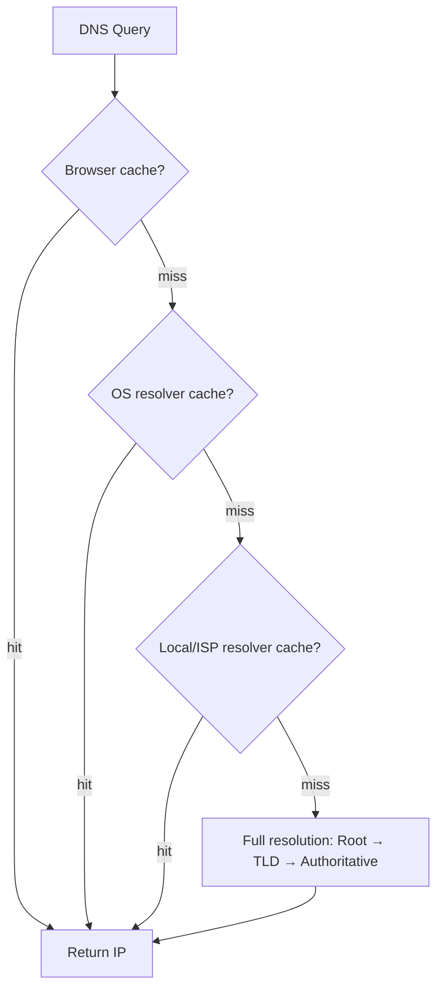

- Caching happens in: **browser → OS stub resolver → local/ISP recursive resolver**.
- Even a **partial cache hit helps**: if the resolver doesn't have `educative.io`'s IP cached but *does* have the `.io` TLD server's IP cached, it skips the root server hop entirely.
- Each cached record carries a **TTL (time-to-live)**, set by the authoritative server, controlling how long downstream caches may serve it before re-validating.

### Caching layers and typical TTLs (illustrative)

| Cache layer | Who controls it | Typical TTL (illustrative) |
|---|---|---|
| Browser DNS cache | Browser-internal policy — some browsers cap their own max regardless of the record's TTL | ~60s cap (illustrative, varies by browser) |
| OS stub resolver cache | Respects the record's TTL as given | Whatever the record says |
| Local/ISP recursive resolver | Respects TTL, but some enforce a minimum floor or maximum ceiling | Record TTL, often floored at tens of seconds |
| Authoritative record itself | The zone owner, via the record's TTL field | Commonly 300s (5 min) to 86400s (24 hr), depending on how often the record needs to change |

**Worked example — TTL = 300s vs. TTL = 3600s:**
- **TTL = 300s (5 min):** cut over to a new IP at t=0, and the worst-case straggler cache is still serving the old IP for up to 5 minutes. Good for planned migrations/failover. Cost: every cache re-queries the authoritative server ~12× more often than the 3600s case.
- **TTL = 3600s (1 hr):** cheaper on authoritative infra (far fewer re-queries), but a cutover can take up to an hour to fully propagate — bad if you need fast failover.
- Rule of thumb to say out loud: **lower the TTL (e.g., to 60–300s) hours ahead of a planned cutover, let the old TTL fully expire, do the cutover, then raise TTL back** once traffic has settled on the new record.

This is the propagation-speed half of the TTL trade-off; section 6 below quantifies the other half (query-load cost) with the hit-rate math.

**TTL as a timeline — this is what "eventual" actually looks like:**

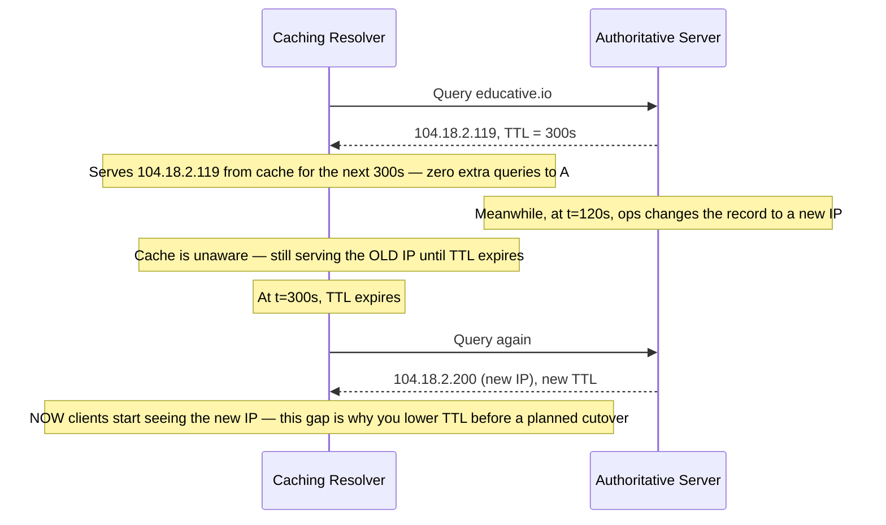

**The same timeline as a state machine — a record's life in a cache:**

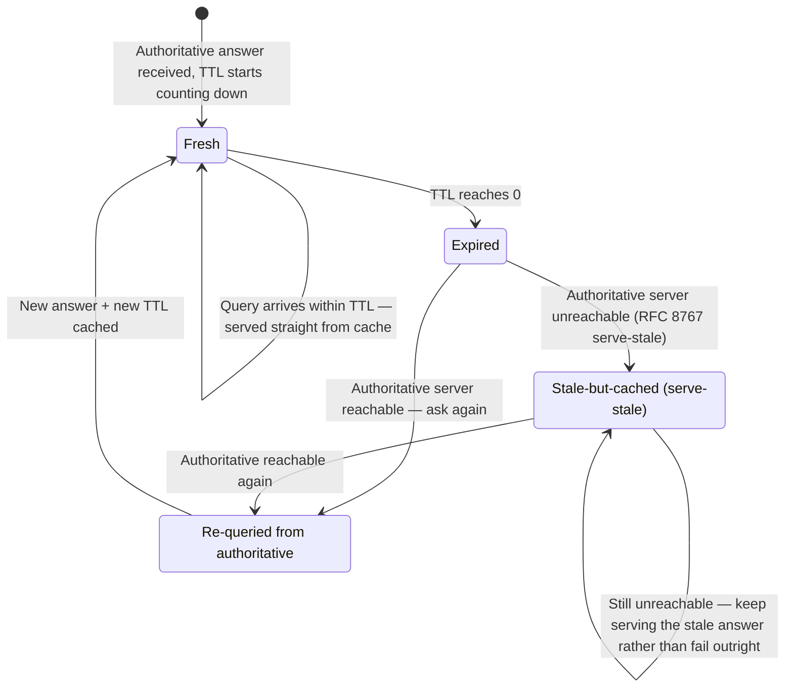

**TTL is a trade-off knob** — this is the single most interview-relevant fact in this chapter:
- **Long TTL** → less load on authoritative/root infra, faster average resolution, but slow to propagate IP changes (bad during failover/migration).
- **Short TTL** → fast failover and traffic steering, but more load and higher average latency (more cache misses).
- This is *exactly* the mechanism behind **blue-green deployments, disaster recovery cutover, and weighted traffic shifting** — ops teams **lower TTL in advance** of a planned cutover so the old cached records expire quickly when they flip the record.

**Interview cheat-sheet:**
- Name the 4 cache layers: browser, OS, local resolver, ISP resolver.
- TTL is a latency-vs-staleness dial — say this explicitly if asked "how would you migrate traffic to a new datacenter with DNS."
- Caching is *why* DNS scales to billions of daily queries despite having relatively few root/TLD servers.
- TTL lifecycle has 4 named states worth knowing: Fresh → Expired → Re-queried, with an optional Stale-but-cached detour if the authoritative server is unreachable (serve-stale, RFC 8767) — see the state diagram above.
- Section 6 turns this into real numbers: cache hit rate ≈ 1 − 1/(query-rate × TTL).
- Serving a stale-but-cached answer during an authoritative outage is a deliberate resilience feature, not a bug — it trades a few stale answers for continued availability.

---

## 6. Capacity estimation — sizing DNS traffic, worked example 🔴

**TL;DR:** DNS handles hundreds of billions of queries a day, and it does so without breaking a sweat because caching and anycast each independently divide the load — the math behind that claim is a two-minute derivation, not a fact you memorize.

Interviewers expect a numbers pass whenever a chapter is "read-heavy + caching" — DNS is the canonical warm-up for that muscle. State assumptions out loud, then compute.

**Global query volume:**
- ~5 billion internet-connected people; each device fires roughly 50–100 DNS lookups/day (every distinct hostname on every page load: main site + CDN + ads + analytics + fonts...). Take **80** as a round middle estimate.
- Daily volume ≈ 5B × 80 ≈ **400 billion queries/day** ≈ **~4.6 million queries/second** average (real traffic is bursty; peak is several× that).

**Fan-in at the root/TLD layer:**
- Only a **cache miss** ever reaches root/TLD/authoritative — recursive resolvers absorb the overwhelming majority of that ~4.6M qps.
- ~1,000 anycast root instances worldwide → even if 1% of global queries missed every cache and hit a root server, that's ~46,000 qps spread across 1,000 instances ≈ **~46 qps/instance** — trivially small.
- This is *why* the anycast + caching combo scales: fan-in gets divided **twice** — once by anycast routing (many physical instances share the load), once by caching (most queries never leave the resolver at all).

**The "divided twice" claim, as a funnel — this is the picture worth drawing on a whiteboard:**

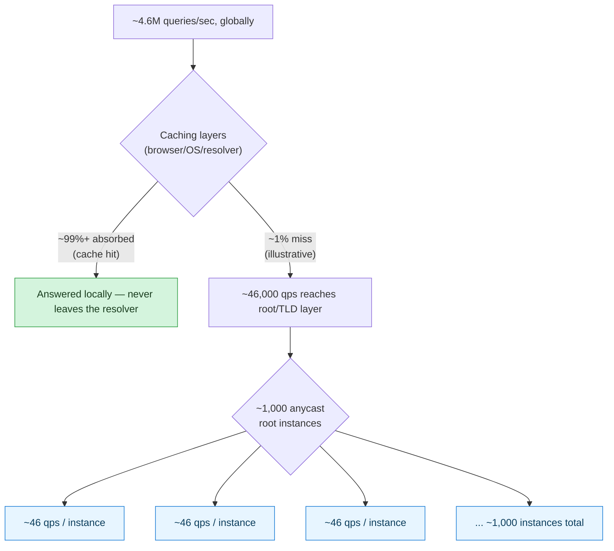

**Read the funnel left to right:** first division is caching (vertical squeeze — most traffic never proceeds), second division is anycast (horizontal spread — whatever's left gets divided across ~1,000 places). Neither division alone would be enough at this volume; it's the *product* of both that gets you from millions of qps down to a double-digit number per physical machine.

**Cache-hit-rate math — why TTL choice quantitatively matters:**
- Model: a hostname with TTL = T seconds, queried at rate λ (queries/sec) against one resolver, causes **1 upstream query** per T-second window and serves **(λT − 1)** answers straight from cache out of λT total queries.
- Cache hit rate ≈ (λT − 1) / λT = **1 − 1/(λT)** for λT ≫ 1.
- Take λ = 10 queries/sec for a popular hostname at a large resolver (realistic for an ISP resolver on a popular CDN name):
  - **TTL = 60s:** λT = 600 → hit rate ≈ 1 − 1/600 ≈ **99.83%** — roughly 1 upstream query per 600 client queries.
  - **TTL = 3600s (1 hr):** λT = 36,000 → hit rate ≈ 1 − 1/36,000 ≈ **99.997%** — roughly 1 upstream query per 36,000 client queries, a **~60× reduction** in upstream load versus TTL = 60s.
- What this quantifies: dropping TTL from 3600s to 60s multiplies authoritative-server load ~60× for that hostname, in exchange for propagation delay dropping from up to an hour to under a minute — the exact math behind "lower TTL before a planned cutover, raise it back afterward."

**Interview cheat-sheet:**
- Global DNS volume: **hundreds of billions of queries/day**, single-digit millions of qps average.
- Caching + anycast divide fan-in twice — that's why ~1,000 root instances can serve the entire planet.
- Cache hit rate ≈ 1 − 1/(λT) — bigger TTL or higher per-hostname query rate both push hit rate toward 100%.
- Have a concrete number ready: "TTL=60s vs TTL=3600s is roughly a 60× difference in upstream load for the same client traffic."
- Even a "small" 0.17% miss rate (TTL=60s case) is still ~8M queries/day hitting authoritative infra for one popular hostname — miss rate that looks tiny in percentage terms is not tiny in absolute terms at internet scale.

---

## 7. DNS as a distributed system: scalability, reliability, consistency 🔴

**TL;DR:** DNS is a real-world worked example of three distributed-systems ideas at once — partition by key prefix for scale, layer caching/replication/cheap-retry for reliability, and deliberately trade consistency for read speed (a textbook PACELC case).

This is the section that turns "DNS trivia" into "distributed systems fundamentals" — bring this up explicitly, it's the strongest signal you can give.

### Scalability
- Hierarchical sharding of the namespace: root servers own the very top, TLD servers own one slice each, authoritative servers own their own zone. No single server holds the whole database — this is **partitioning by key prefix** (reversed domain name) at global scale.
- ~1,000 anycast-replicated instances of the 13 logical root servers absorb query fan-in without any single machine becoming a bottleneck.

### Reliability
Three independent mechanisms combine:
1. **Caching** — stale-but-available data survives origin outages (a soft form of graceful degradation).
2. **Replication** — every logical server has many physical replicas geographically distributed (redundancy against failure and reduces latency via proximity).
3. **Protocol choice: UDP over TCP** — DNS predominantly uses UDP because:
   - Only needs **1 round trip** vs. TCP's 3-way handshake (lower latency).
   - If a UDP response is lost, the resolver just **retries** — acceptable because DNS queries are small, idempotent, and cheap to redo.
   - TCP is used as a fallback for large responses (>512 bytes traditionally, or when `EDNS0` — Extension Mechanisms for DNS, a backward-compatible extension that lets a UDP response exceed that old 512-byte limit — or DNSSEC increases payload size) or for zone transfers between servers.

**These three stack as independent layers of defense — say it this way, not as a flat list:**

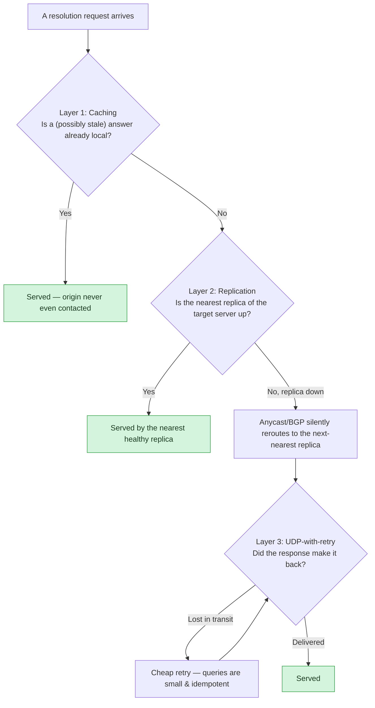

**The point of drawing it this way:** each layer only has to catch what the layer before it missed. Caching fails to have an answer → replication means there's still a healthy server to ask → the network still drops a packet → cheap UDP retry catches that too. No single mechanism has to be perfect; the composition is what's robust.

### Consistency
- DNS deliberately **trades strong consistency for availability and performance** — a textbook **CAP theorem** (Consistency, Availability, Partition tolerance — under a network partition, you can only keep two of the three) **/ PACELC** (its extension: even with *no* partition, you still trade Latency vs. Consistency) **example** to cite when discussing eventual consistency.
- Justification: DNS is **extremely read-heavy** (reads:writes ratio is enormous), so optimizing for fast, cheap reads via caching is the right call even though it means writes (record updates) propagate lazily.
- Propagation of an updated record can take **anywhere from a few seconds up to ~3 days**, depending on:
  - The TTL set on the previous cached value (won't update until TTL expires).
  - Which level of the tree is being updated (a change at an authoritative server propagates faster than a change that also requires updating NS delegation at the TLD level).
- This is **eventual consistency by design** — exactly the model you'd argue for in a system where reads vastly outnumber writes and slight staleness is tolerable (e.g., CDN edge caches, feature-flag propagation, service discovery).

**Interview cheat-sheet:**
- "DNS sacrifices strong consistency for read performance — a real-world PACELC example." Say this line verbatim if CAP/PACELC comes up.
- UDP is preferred: 1 RTT vs. TCP's 3-way handshake; retries handle loss; TCP is the fallback for large payloads/zone transfers.
- Reliability = caching + replication + cheap retryable protocol — three independent layers of defense, not one.
- Propagation delay range: seconds to ~3 days — cite this number.
- Say "partitioning" explicitly when describing the hierarchy — root/TLD/authoritative is DNS's version of sharding by (reversed) key prefix.
- The Dyn 2016 outage (section 10) is the concrete cautionary tale for "what happens when you under-invest in DNS reliability."

---

## 8. DNS-based load balancing & traffic steering 🟡🔴

**TL;DR:** DNS can act as a coarse, global load balancer — weighted, latency-based, or geolocation routing pick *which* IP a query gets back — but it's slow to react (bounded by TTL) and blind to real-time load, so it's always paired with a real L4/L7 load balancer, never a replacement for one.

Section 3 already showed CNAME/A records can point at different places — this section is about *how* the authoritative server decides *which* answer to hand back, and how that compares to a real load balancer.

**Traffic-steering policies (what Route 53 / GeoDNS actually let you configure per-record):**
- **Weighted routing:** each candidate record gets a weight (e.g., 80/20); the authoritative server returns record A to ~80% of queries and record B to ~20%, chosen roughly at random per query. Used for canary releases and gradual traffic shifting.
- **Latency-based routing:** the authoritative server keeps a latency table between regions/edge locations and returns whichever endpoint has the lowest *measured* latency to the resolver's presumed location (approximated from the resolver's IP, not the client's — an important caveat to state out loud).
- **Geolocation routing:** returns a different answer purely by the *geographic origin* of the query (country/continent/state) — used for content licensing, data-residency rules, or "serve the .de site to German visitors," independent of latency.
- **Health-check-driven removal:** the DNS provider runs out-of-band health checks (HTTP/TCP/ping) against each candidate endpoint every N seconds; an endpoint that fails checks is automatically pulled out of the answer rotation until it recovers — this is what makes DNS-based failover "automatic" instead of requiring a human to edit a record.

**Memory hook:** weighted = "roll loaded dice," latency-based = "pick the fastest road right now," geolocation = "pick by passport," health-check = "the dice only has faces that are currently alive."

**The four bullets above read as a flat list — but they actually apply in a fixed order for every single query, which is easier to hold as one picture:**

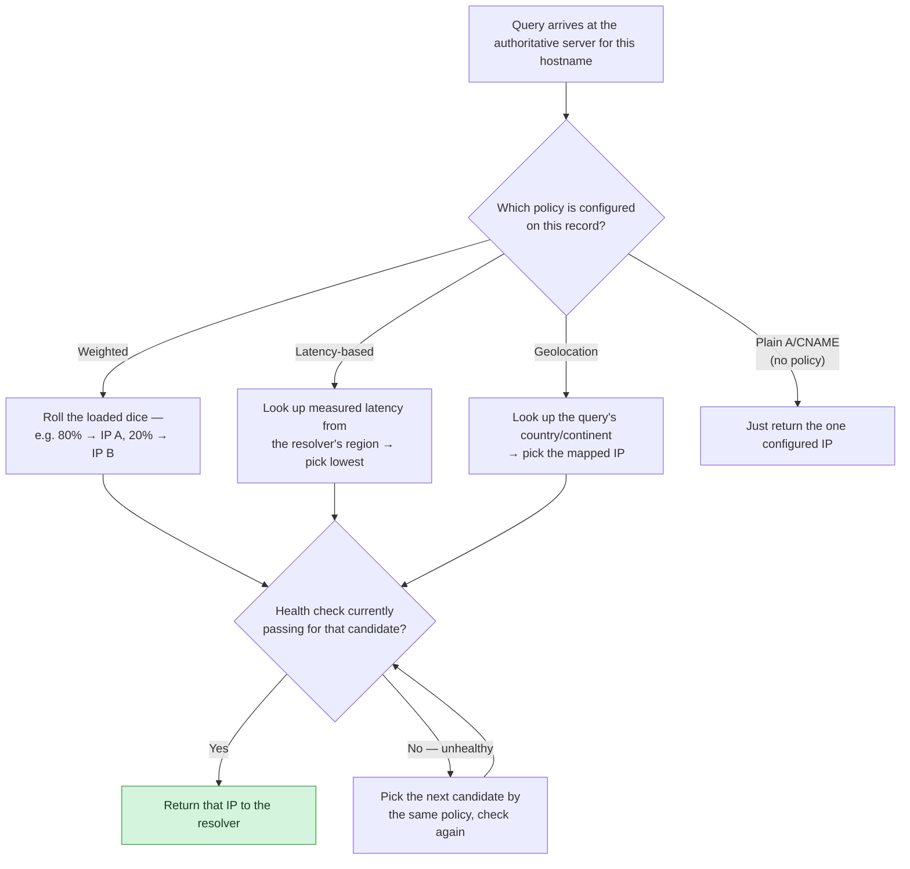

**The point of drawing it this way:** the routing policy (weighted/latency/geo) only picks a *candidate* — the health check is a filter applied *after*, on every single query, not a one-time setup step. That's what makes DNS-based failover "automatic": an unhealthy candidate simply never survives the health-check gate, with no human editing a record.

### DNS-based load balancing vs. L4/L7 load balancer

| | DNS-based load balancing | L4/L7 load balancer (ALB/NLB — AWS's Application/Network Load Balancer, Envoy, HAProxy) |
|---|---|---|
| Granularity | Coarse — routes by *hostname resolution*, before any connection is even opened | Fine — routes/inspects individual connections or requests |
| Reaction time | Slow — bounded by TTL; a client with a cached answer keeps using it until TTL expires, even after a health check has already failed upstream | Instant — every new connection/request is routed live against current backend state |
| Visibility into backend load | None in real time — only periodic out-of-band health checks (up/down), no per-request load signal | Full — can balance on live connection counts, response times, request content |
| Client-side caching in the way | Yes, by design — that's the whole point of DNS, and exactly what limits reaction time | None — every request re-evaluates routing |
| Where it sits | Before the client even opens a connection | After the client has already resolved an IP and is opening/using a connection |
| Best for | Coarse routing across regions/providers, cheap global failover, canary-by-percentage | Fine-grained per-request routing, instant failover, content-based routing (path, headers) |
| Typical pairing | Used *together* in practice: DNS routes you to the right region, then an L4/L7 LB inside that region does fine-grained balancing across instances | — |

**Interview cheat-sheet:**
- Name the three routing policies cold: weighted, latency-based, geolocation.
- Health checks don't change traffic *instantly* — they change what the authoritative server hands out on the *next* query; existing caches downstream still hold the old (possibly unhealthy) answer until TTL expires. State this limitation explicitly.
- Low TTLs are paired with health-check-driven DNS LB for exactly this reason — a long TTL would keep sending traffic to a dead endpoint long after the health check caught it.
- DNS LB and L4/L7 LB are complementary, not competing — DNS picks the region/provider, the L4/L7 LB picks the instance.
- If asked "would DNS alone be enough for failover," the answer is no — it's a coarse, cache-delayed dial, not a real-time switch.

### DNS-based geo-routing vs. anycast

The table above compares DNS-based routing to an L4/L7 load balancer. A different, equally common question is: *when routing globally, do you use DNS geo-routing or anycast?* For the full BGP/network-distance mechanics and a visual, cross-reference `11-CDN-FAANG-Guide.md` section 10 ("Finding the nearest proxy server") — it's not repeated here. The DNS-specific angle:

| | DNS-based geo-routing | Anycast |
|---|---|---|
| Decision point | The authoritative DNS server, at resolution time — before any connection opens | BGP, at the IP-packet level — DNS isn't involved in the routing decision at all |
| Extra round trip? | Yes — resolving the hostname is a step before the client can even connect | No — the client resolves one IP; BGP silently routes the packet to the nearest instance |
| Granularity | Per-query — can factor in real-time signals (weighted %, health checks, measured latency) | Per-route, whatever BGP has converged on — coarser, no per-request signal |
| Reacts to failure how fast | Bounded by TTL — a cached answer keeps pointing at a dead endpoint until TTL expires | Near-instant — BGP just stops advertising the dead route, no client-visible change needed |
| Depends on client cooperation | Yes — only works if resolvers/clients honor TTL | No — invisible to the client, works even if a resolver mis-caches |

**When DNS-based routing isn't good enough** — two gotchas worth naming unprompted:
- **Clients don't always honor TTL precisely.** Browsers and some resolvers cap or floor TTLs internally (section 5's caching-layers table), so "lower the TTL for fast failover" has a practical limit — you can't force a sub-second reaction out of DNS alone.
- **Granularity is coarse and location-fuzzy.** DNS routes by *resolver location*, not the client's actual location — a client using a distant public resolver (e.g., 8.8.8.8) can get routed to the wrong region — and it has no visibility into per-connection state (queue depth, in-flight requests) the way an L4/L7 load balancer does.
- Net takeaway: DNS-based geo-routing is right for coarse region/provider-level steering; anycast is right when you need failover with effectively no propagation delay. Real systems often layer both — see the CDN guide for how a CDN picks between them.

---

## 9. DNSSEC — securing the chain of trust 🔴

**TL;DR:** DNSSEC lets a resolver cryptographically verify that an answer really came from the zone's owner (authenticity) — it does *not* encrypt the query or hide who's asking (that's DoH/DoT's job); the two are complementary, not substitutes.

DNS answers are plaintext and, without DNSSEC, unauthenticated — anything on the path, or able to guess a query's transaction ID, can forge a response. DNSSEC lets a resolver **verify an answer actually came from the zone's real owner**, without changing what a DNS answer looks like on the wire.

**Chain of trust:**

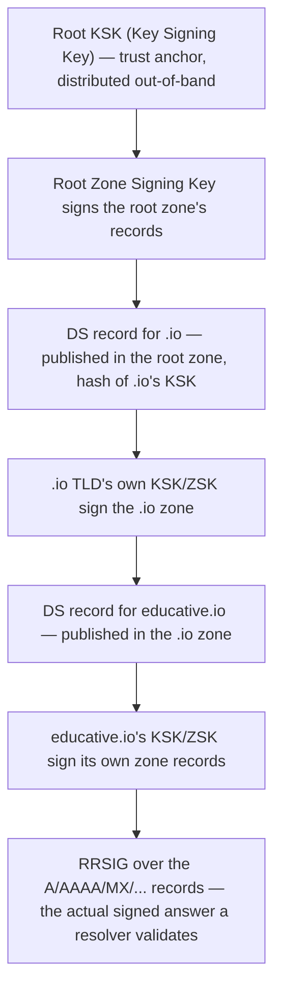

**The three record types that do the work:**

| Record | Role |
|---|---|
| **DNSKEY** | Publishes a zone's public key(s) — a Zone Signing Key (ZSK) for day-to-day signing, and a Key Signing Key (KSK) that signs the ZSK and is the one referenced by the parent zone |
| **RRSIG** | The actual digital signature over a specific record set (e.g., all A records for a name) — this is what a validating resolver checks against |
| **DS (Delegation Signer)** | Lives in the **parent** zone (e.g., `.io`'s zone holds the DS for `educative.io`) — a hash of the child zone's KSK, which delegates trust downward without the parent needing the child's full key |

**Memory hook:** DS is the parent vouching for the child ("I attest this hash belongs to my child zone's key"); RRSIG is the child signing its own answers; DNSKEY is the child publishing the key that makes RRSIG checkable. Chain of trust = a chain of DS records walking down from the root KSK to your zone.

**What DNSSEC defends against:** cache poisoning / the **Kaminsky attack** (2008) — where an attacker races forged responses (guessing the 16-bit transaction ID and source port) to get a resolver to cache a forged IP for a real hostname before the genuine authoritative response arrives. A validating resolver checks RRSIG against a trusted DS chain and rejects any answer it can't cryptographically verify, closing this off entirely.

**What DNSSEC explicitly does NOT do — the classic gotcha:**
- It does **not encrypt** anything — queries and responses stay plaintext on the wire; anyone on-path can still see *which domain* a client is asking about.
- It does **not hide who's asking** — zero confidentiality for the querying client.
- Confidentiality is a separate protocol layer entirely: **DoH (DNS-over-HTTPS)** and **DoT (DNS-over-TLS)** encrypt the transport between client and resolver. DNSSEC is about the *authenticity of the answer*; DoH/DoT are about the *privacy of the question*. They're complementary, not substitutes — interviewers like hearing that distinction stated explicitly.

**Interview cheat-sheet:**
- DNSSEC = authenticity/integrity of DNS answers (signed records), not confidentiality.
- Chain of trust: root KSK → DS record in parent zone → child zone's DNSKEY → RRSIG over the actual records.
- Defends against cache poisoning / Kaminsky-style spoofing attacks.
- Does **not** encrypt queries or hide the client — that's DoH/DoT's job, a different problem DNSSEC doesn't touch.
- If asked "how would you secure DNS," the complete answer pairs DNSSEC (authenticity) with DoH/DoT (privacy) — two separate concerns usually both wanted together.
- DS records are the delegation mechanism — without one published in the parent zone, a child zone's signatures have nothing to anchor to, and validation falls back to "insecure."

---

## 9.5. DNS as a single point of failure and DDoS target 🔴

**TL;DR:** DNS sits in front of everything, which makes it both a single point of failure and an attractive DDoS target in two distinct ways — as the victim of a flood, or as the (spoofed) weapon used to amplify an attack on someone else — and DNSSEC does nothing to stop either.

DNS sits on the critical path of *every* request to your service — if your DNS is down, it doesn't matter that your servers are healthy, nobody can find them. That makes DNS both a single point of failure and an attractive DDoS target, and it's worth naming both explicitly.

**Two distinct attack/failure shapes:**
1. **DNS as the victim.** Attackers flood your authoritative DNS servers directly until they can't answer legitimate queries — a volumetric DDoS aimed at port 53 instead of port 443. The Dyn 2016 outage (section 10 below) is the canonical real-world example: one provider went down under attack, and every site that depended solely on it (Twitter, Netflix, Reddit, Spotify) became unreachable, even though those sites' own servers were fine.
2. **DNS as the weapon — reflection/amplification attacks.** An attacker sends a small DNS query to an open resolver with the *source IP spoofed* to the victim's address. The resolver's much larger response goes to the victim instead of the attacker, amplifying the attacker's outbound bandwidth by a large factor (illustrative — the actual multiplier depends on record type and resolver config). Here, DNS infrastructure is the tool used to attack an unrelated third party.

**These two shapes are easy to blur together in words but look nothing alike as a picture — worth drawing side by side:**

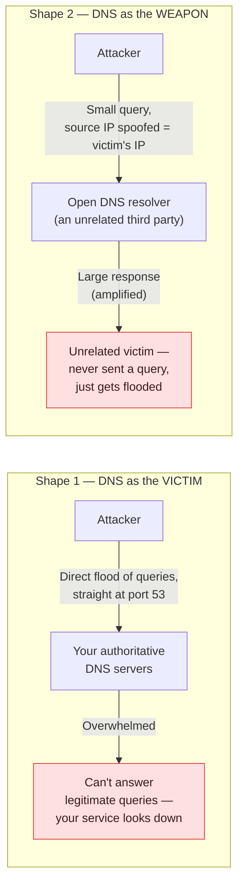

**The distinction that matters:** in Shape 1, *your* DNS is the target. In Shape 2, *someone else's* DNS resolver is an unwitting accomplice, and the actual victim is a third party who may not even use that resolver — the attacker never talks to the victim directly at all, only to the resolver, with the victim's address forged into the "reply-to" field.

**Mitigations — the same toolkit used elsewhere in this guide, aimed at availability:**
- **Anycast** (section 2) — the same trick that turns 13 logical root servers into ~1,000 physical instances also disperses attack traffic: a flood aimed at one anycast IP lands only on the instances nearest the attack sources, and BGP keeps routing everyone else to healthy ones.
- **Multiple independent DNS providers** — run authoritative DNS across two unrelated providers so one provider's outage or attack doesn't take your whole domain offline. This is the direct lesson from Dyn 2016.
- **Rate limiting / Response Rate Limiting (RRL)** on resolvers — throttle repeated identical responses to the same source, blunting amplification abuse without dropping legitimate traffic.
- **DDoS scrubbing** — the same scrubber-server pattern CDNs use (see `11-CDN-FAANG-Guide.md`) applies to DNS infrastructure too: filter attack traffic before it reaches the authoritative servers.
- **DNSSEC does not help here** — worth stating explicitly, since it's tempting to conflate "secure DNS" with "DDoS-resistant DNS." DNSSEC authenticates answers (section 9); it does nothing to stop a volumetric flood or an amplification attack.

**Interview cheat-sheet:**
- DNS is a SPOF by default — say this unprompted when asked to harden any system's availability story.
- Two attack shapes: DNS as *victim* (flood the authoritative servers) vs. DNS as *weapon* (spoofed-source amplification against a third party).
- Mitigation checklist: anycast, multi-provider DNS, rate limiting/RRL, DDoS scrubbing.
- DNSSEC ≠ DDoS protection — authenticity and availability are separate concerns.
- Dyn 2016 is your go-to citation for "what happens when you single-source your DNS."

---

## 10. Real-world systems and how they actually use DNS 🟢🟡

**TL;DR:** Route 53, Cloudflare, Netflix, CDNs, and even Kubernetes' internal service discovery are all reapplications of the same three ideas — hierarchy, caching, anycast — at different scales; recognizing that pattern is worth more than memorizing any one row.

| System | How it uses DNS concepts |
|---|---|
| **AWS Route 53** | Authoritative DNS with weighted, latency-based, and geo-routing records; health checks auto-remove unhealthy endpoints from A/CNAME rotation — DNS *is* the global load balancer (see section 8). |
| **Cloudflare DNS / 1.1.1.1** | Anycast-routed recursive resolver — the same IP address is announced from hundreds of PoPs; BGP routes the client to the nearest one (same anycast trick root servers use, see section 2). |
| **Netflix** | Uses DNS + Route 53 for multi-region failover; lowers TTL before planned regional evacuations so traffic reroutes quickly once the record flips. |
| **CDNs (Akamai, Cloudflare, Fastly)** | CNAME your domain to the CDN's domain; the CDN's authoritative DNS returns the *nearest edge PoP's* IP per-query — DNS-based geo-steering is the entry point to the whole CDN. |
| **Kubernetes (CoreDNS/kube-dns)** | Cluster-internal service discovery reimplements the exact same hierarchy-and-cache pattern at a smaller scale: `service.namespace.svc.cluster.local` mirrors DNS's dotted, right-to-left hierarchical namespace. |
| **DNSSEC** | Cryptographically signs records (RRSIG, DNSKEY, DS) to defend against cache poisoning/spoofing — see section 9 for the full chain-of-trust breakdown; the classic follow-up trap is confusing it with encryption (it isn't). |
| **DDoS on DNS (Dyn/2016)** | A single authoritative DNS provider outage took down Twitter, Netflix, Reddit, etc. — the canonical example of why DNS is a **single point of failure** if you don't multi-provider it. Full mitigation checklist (anycast, multi-provider, rate limiting, scrubbing): section 9.5. |

**Interview cheat-sheet:**
- Route 53 and CDNs are DNS-based load balancers in disguise — weighted/latency/geo routing + health checks (section 8 has the mechanics).
- Cloudflare 1.1.1.1 and root servers use the exact same anycast trick — one IP, many physical PoPs, BGP does the routing.
- Kubernetes' cluster DNS (CoreDNS) proves this pattern generalizes below the public internet — same hierarchy, same caching, smaller scale.
- Dyn 2016 is the go-to real-world SPOF example: one DNS provider outage took out Twitter, Netflix, Reddit, and Spotify simultaneously.
- DNSSEC's full breakdown lives in section 9 — don't just say the acronym, be ready to sketch the chain of trust.
- Every row in this table is really the same three ideas (hierarchy, caching, anycast) reapplied — that pattern-recognition is worth saying out loud.

---

## 11. Interview Playbook — the order to talk through DNS out loud 🟡

**TL;DR:** Don't recite facts — walk this six-step checklist (staleness tolerance → TTL → coarse-vs-fine routing → SPOF → security) out loud in order, and you'll cover the full DNS story on any design question without being prompted twice.

Rather than memorizing a list of "trigger phrases," walk this checklist in order whenever a design question smells like DNS. It's fully repeatable across problems.

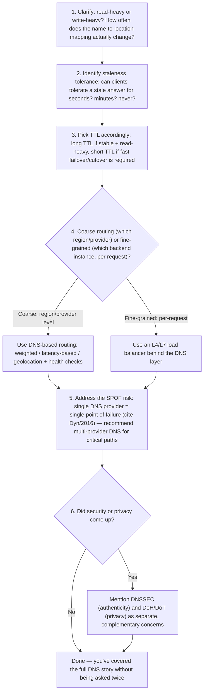

**Trigger phrases that mean "this is secretly a DNS question":**
- "How would you route users to the **nearest data center**?" → step 4, DNS geo/latency-based routing.
- "How do you achieve **zero-downtime failover** to a backup region?" → steps 3 and 5: lower TTL ahead of time, flip the authoritative record, rely on health checks.
- "How does a client discover which server to talk to?" (microservices/service-discovery) → same tree/cache pattern as DNS, even when implemented via a service registry instead of literal DNS.
- "What happens when you type a URL into a browser?" → classic opener; DNS resolution is stage 1 — walking resolver → root → TLD → authoritative with caching at each layer demonstrates depth.
- "Why did **[cite a real DNS outage]** cause a wide outage?" → step 5, SPOF discussion, multi-provider DNS, caching as graceful degradation (full checklist: section 9.5).
- Any question about **CAP/PACELC trade-offs** in a read-heavy system → DNS is the go-to concrete example of trading consistency for availability/performance.
- "How would you **version or gradually roll out** an IP/endpoint change to millions of clients?" → step 3, TTL as the propagation-speed dial.

### What this actually sounds like out loud (worked sample answer)

The checklist above is the *shape* of a good answer; here's an actual ~60-second answer to a common prompt, so you have a model to imitate rather than just steps to remember.

> **Prompt: "We're moving our payments API to a new region. How would you cut traffic over with zero downtime?"**
>
> "This is fundamentally a DNS-TTL problem before it's a networking problem. First — how often does this mapping change? Rarely, this is a one-time planned cutover, so I have the luxury of preparing in advance. That means: hours before the cutover, I'd lower the record's TTL from whatever it is today — say 3600 seconds — down to something like 60 seconds, and wait a full TTL cycle so every downstream cache, worst case, has picked up the short TTL. At cutover time, I flip the authoritative A/CNAME record to the new region's IP. Because the TTL is now short, stragglers converge on the new IP within about a minute instead of up to an hour.
>
> I wouldn't rely on DNS alone, though — I'd pair it with health checks on both regions, so if something's wrong with the new region, the old one automatically stays in rotation instead of a human having to notice and roll back manually. I'd also flag the failure mode explicitly: DNS is a cache-bounded switch, not an instant one — some fraction of clients that ignore TTL, or public resolvers with their own floors, will straggle a bit longer, so I wouldn't promise sub-second cutover. Once traffic has fully settled on the new region, I'd raise the TTL back up to reduce steady-state load on the authoritative servers."

Notice the shape: state the read/write framing first, name the TTL lever explicitly, pair it with health checks, name the failure mode unprompted, and close the loop by reverting the TTL. That's steps 1, 3, 5, and the "no single answer is complete without caveats" instinct — all without reciting section numbers out loud.

---

## 12. Common follow-up/trick questions 🔴

**TL;DR:** Five questions interviewers reach for to check you understand trade-offs, not just facts — each one is really "would you actually want the opposite of what DNS does, and why not."

**Q: Why doesn't DNS just use TCP always, for reliability?**
A: TCP's 3-way handshake adds a full extra round trip before any data moves — for a request this small and frequent, that's a large relative overhead. UDP's fire-and-retry model is cheaper at DNS's query volume and modern networks are reliable enough that retries are rare. TCP is kept as a fallback for responses too large for a single UDP datagram (DNSSEC, many records) and for admin operations like zone transfers.

**Q: What happens if the network is congested — should DNS keep using UDP?**
A: This is where the trade-off shows: congestion increases UDP packet loss, so retries increase, which can look like added latency, not a hard failure (unlike TCP where the handshake itself might stall). Because queries are idempotent and cheap, resolvers will keep retrying; some implementations fall back to TCP if responses keep failing/truncating. The point to make: DNS's reliability model assumes *retryable* loss, not persistent congestion — under sustained congestion, you'd want TCP or larger resolver-side timeout/retry tuning.

**Q: How would you keep DNS strongly consistent, and what would it cost you?**
A: You'd need synchronous replication/consensus across every replica of every authoritative and caching layer worldwide before acknowledging a write — this kills DNS's core value proposition (fast, cheap, cached reads at planetary scale) for a property (instant consistency) that write-rare, read-heavy workloads don't need. This is the standard "would you actually want strong consistency here" trap question — the answer is no, and you should say why.

**Q: What is a stub resolver vs. a recursive resolver?**
A: The **stub resolver** lives on the client OS — it doesn't do the tree walk itself, it just forwards the query to a configured recursive resolver and caches the answer locally. The **recursive resolver** (ISP or public like 8.8.8.8/1.1.1.1) does the actual iterative walk through root → TLD → authoritative on the client's behalf.

---

## 12.5. Active Recall — Test Yourself 🟢🟡🔴

**TL;DR:** Answer these cold, from a blank page, before checking each answer — recognizing an explanation and reproducing it unprompted are different skills, and only the second one holds up in an interview.

Reading an explanation and being able to reproduce it cold, from a blank page, are different skills. Close the guide (or at least stop scrolling up) and answer these; expand each to check. This is what actually makes the material stick — badges tell you roughly which section level each question probes.

> **On "never forget": do this more than once.** One pass through these questions tells you whether you understood the material *today*. It does not mean you'll still have it in three weeks — that takes spaced repetition, not one good read. Concretely: answer all 16 now; three days from now, answer only the ones you got wrong or hesitated on; a week after that, do the same again. Each round should take less time than the last as things move from "recognize when explained" to "produce unprompted." If you want it outside this doc, the 16 Q&As here convert directly into flashcards (front = the bolded question, back = the answer) for a spaced-repetition tool like Anki.

1. 🟢 In one sentence, why does DNS exist at all?

Machines only address each other by IP, and humans can't work with thousands of numeric addresses — DNS is the naming layer that decouples a human-friendly identity (domain name) from a machine's actual location (IP address), so the IP can change without breaking anything that references the name.

2. 🟢 What's wrong with saying "DNS has 13 servers"?

There are 13 *logical* root server addresses (A–M, run by 12 organizations), but each is physically replicated into ~1,000+ instances worldwide via anycast — "13" is the logical count, not the number of physical machines actually answering queries.

3. 🟡 A client asks its resolver for an IP, and the resolver has never seen this hostname before. Name every hop, in order, and label each as a referral or an answer.

Client → resolver (this is the recursive leg — client gets one final answer). Resolver → root server: referral ("ask the TLD server"). Resolver → TLD server: referral ("ask the authoritative server"). Resolver → authoritative server: the actual answer (an A record). Resolver → client: hands back that answer and caches it.

4. 🟡 Why is "recursive" the term for client→resolver and "iterative" the term for resolver→upstream, when it's really one continuous resolution?

The names describe the experience from each vantage point, not two different mechanisms. The client only ever asks once and gets a final answer — that feels recursive. The resolver gets referrals and has to keep asking on its own — that's the iterative part, done on the resolver's side, invisible to the client.

5. 🟡 Your DNS provider fails a health check on one of three backend IPs. How fast does traffic actually stop going to it, and why?

Not instantly — only as fast as the TTL on the record allows. The authoritative server stops handing out the bad IP on the *next* query it answers, but any resolver/client that already cached the old answer keeps using it until that cached TTL expires. This is why low TTLs are paired with health-check-driven DNS load balancing.

6. 🟡 Give the cache-hit-rate formula and use it to explain, in one sentence, why popular hostnames barely touch authoritative servers.

Hit rate ≈ 1 − 1/(λT), where λ is query rate and T is TTL. For any popular hostname, λT is huge (thousands+), so 1/(λT) is tiny — meaning almost every query is served from a cache and only a vanishing fraction ever reaches the authoritative server.

7. 🔴 Why does DNS use UDP by default, and under what condition would you want it to fall back to TCP?

UDP needs only 1 round trip (no handshake), and DNS queries are small, frequent, and idempotent, so a lost packet is cheap to just retry — TCP's 3-way handshake would be pure overhead at that volume. Fall back to TCP when the response is too large for a single UDP datagram (DNSSEC-signed responses, many records) or for zone transfers between servers.

8. 🔴 "DNS is a real-world PACELC example." Unpack that claim.

DNS deliberately trades strong consistency for availability and read performance: an updated record can take seconds to ~3 days to fully propagate (bounded by TTL and which tree level changed), but in exchange, reads are served from cache at near-zero latency and never block on a global write. Because DNS is overwhelmingly read-heavy, that trade is the right one — a textbook PACELC "even without partition, trade latency for consistency" case.

9. 🔴 A CNAME record can't do two things. Name both, and name the record type invented specifically to work around one of them.

A CNAME (1) can't coexist with any other record at the same exact name, and (2) can't be placed at a zone apex (the bare domain, e.g. `example.com`) because the apex must also hold NS/SOA records. ALIAS/ANAME was invented specifically to work around restriction (2) — it behaves like an A record on the wire while still pointing at a hostname server-side.

10. 🔴 What's the difference between DNS as a DDoS *victim* and DNS as a DDoS *weapon*? Give the mitigation for each.

Victim: attackers flood your own authoritative DNS servers directly until they can't answer — mitigated by anycast (disperses the flood), multi-provider DNS (no single point of failure), and DDoS scrubbing. Weapon: an attacker spoofs a victim's source IP in a small query to an open resolver, and the resolver's much larger response floods the victim instead (reflection/amplification) — mitigated by Response Rate Limiting (RRL) on resolvers and not running open/misconfigured resolvers in the first place.

11. 🔴 Does DNSSEC stop the DDoS attacks in the previous question? Why or why not?

No. DNSSEC only authenticates that an answer really came from the zone owner (defends against cache poisoning / Kaminsky-style spoofing) — it does nothing about volumetric floods or amplification, which are availability attacks, not integrity attacks. Authenticity and availability are separate concerns with separate mitigations.

12. 🔴 DNS geo-routing and anycast both "route you to somewhere close." What's the actual mechanical difference, and when would you pick one over the other?

DNS geo-routing decides at the DNS resolution step — the authoritative server picks which IP to hand back based on the resolver's presumed location; it costs an extra round trip and reacts only as fast as TTL allows. Anycast decides at the BGP/packet-routing level, after a client already has one fixed IP; there's no extra round trip and failover is near-instant because BGP just stops advertising a dead route. Pick DNS geo-routing when you want per-query business logic (weighting, health checks, licensing rules); pick anycast when you need near-zero-latency failover and don't need per-query control.

13. 🔴 Design question: "How would you migrate a service to a new region with zero downtime, using DNS?" Give the sequence.

Hours ahead of the cutover, lower the record's TTL (e.g., to 60–300s) and wait for the old, longer TTL to fully expire everywhere. At cutover time, flip the authoritative record to the new region's IP. Pair it with health checks so the DNS layer can auto-pull the old region if something goes wrong. Once traffic has settled on the new region, raise the TTL back up to reduce ongoing load on the authoritative servers. State explicitly that DNS alone gives a *coarse, cache-bounded* cutover, not an instant one.

14. 🟢 What is DNS, reduced to a single sentence you could say to a non-engineer and to an interviewer, respectively?

To a non-engineer: "It's the internet's phone book — it turns website names into the numeric addresses computers actually use to find each other." To an interviewer: "DNS is a globally distributed, hierarchical, eventually-consistent, read-heavy key-value store optimized for caching — every one of its scalability, reliability, and consistency properties follows from that framing."

15. 🟢 Redraw §1's core diagram from memory: which part is recursive, which part is iterative, and where exactly does the boundary between them sit?

Recursive: client → resolver (one question in, one final answer out — the client never sees what happens next). Iterative: resolver → root → TLD → authoritative, where each hop returns a referral except the last, which returns the real answer. The boundary sits exactly at the resolver: everything on the client's side of it is recursive, everything on the resolver's outbound side is iterative. (If you drew two separate resolutions happening instead of one continuous walk viewed from two vantage points, go re-read the §4 callout.)

16. 🟢 Say the 7-record-type mnemonic cold, then say what breaks if you put a CNAME where an NS or SOA record needs to live.

"Ants Always Carry Mangoes To Nervous Snails" → A, AAAA, CNAME, MX, TXT, NS, SOA. A zone apex must carry NS (who's authoritative) and SOA (zone metadata) records, and a name that holds a CNAME can hold *no other record* at all — so a CNAME at the apex would illegally displace the NS/SOA records the zone needs to function, which is exactly why RFC 1034 forbids it and why ALIAS/ANAME exists as the workaround.

---

## 13. Golden Rules 🟢

**TL;DR:** Eight rules that compress this entire guide — if you remember nothing else, remember these.

- **Never use DNS as your only failover mechanism** — it's a coarse, cache-delayed dial, not an instant switch; pair it with health checks and, for anything critical, a secondary DNS provider.
- **Treat DNS as an attack surface, not just infrastructure** — anycast + multi-provider DNS + rate limiting is the mitigation checklist for DNS-as-victim and DNS-as-weapon attacks (section 9.5).
- **TTL is a dial you tune, not a fixed constant** — lower it before a planned cutover, raise it back once things stabilize to cut load.
- **Cache at every layer of the chain, or the whole tree collapses under root/TLD load** — browser, OS, and resolver caching together are what let ~1,000 root instances serve the entire planet.
- **A CNAME can't coexist with other records at the same name, and can't sit at a zone apex** — reach for ALIAS/ANAME (or a plain A record) instead.
- **Anycast is what turns "13 logical servers" into planet-scale infrastructure** — know the difference from unicast cold.
- **DNSSEC authenticates, it does not encrypt** — pair it with DoH/DoT if privacy is the actual ask.
- **Report propagation delay honestly** — "seconds to ~3 days" depending on TTL and tree level; never promise instant global consistency.

---

## 13.5. The Full Picture — one request, every concept 🟢🟡🔴

**TL;DR:** Every section so far zoomed into one concept in isolation. This is the payoff diagram — one real request, showing exactly where hierarchy, caching, DNSSEC, load-balancing policy, and SPOF defenses each sit in the same flow.

Every diagram earlier in this guide isolates one idea on purpose — that's the right way to *learn* each piece. But if you only ever hold N separate pictures in your head, you'll struggle to answer "walk me through everything that happens" as one coherent story. Here's all of it, composed into a single request lifecycle:

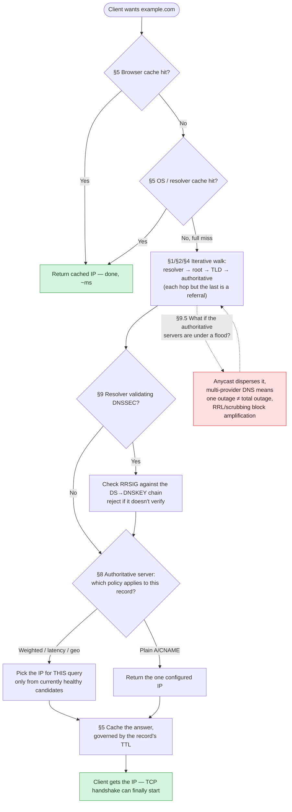

**How to use this diagram:** in an interview, this is the picture you should be able to redraw and narrate end to end in under two minutes — "cache check, cache check, iterative walk if both miss, optional DNSSEC validation, routing policy picks the answer, cache it by TTL, and here's what happens if the whole authoritative layer gets attacked mid-walk." Every box cites the section that goes deep on it, so this also works as a map back into the rest of the guide.

### Common mistakes, consolidated

Individual gotchas are called out inline throughout the guide; here they are in one place, because they're also the fastest way to lose credibility if you say the wrong side of them out loud:

| Mistake | Why it's wrong | Say instead |
|---|---|---|
| "DNS has 13 servers, so it's a small, fragile system" | Confuses logical count (13) with physical instance count (~1,000+ via anycast) | "13 logical roots, ~1,000 anycast-replicated physical instances" |
| "Recursive means the resolver walks root→TLD→auth" | Backwards — that walk is *iterative*; recursive describes the client's single-question experience | "Recursive client-to-resolver, iterative resolver-to-upstream" — say why, not just which |
| "A CNAME can point anywhere, including the apex" | RFC 1034 forbids a CNAME at the zone apex because NS/SOA must live there too | "CNAME can't sit at the apex or share a name with other records — that's what ALIAS/ANAME is for" |
| "Lower TTL = free, so just always use a low TTL" | Low TTL trades load for propagation speed — it's a real cost (§6's ~60× multiplier), not a free upgrade | "Lower it temporarily before a planned cutover, then raise it back" |
| "DNSSEC secures DNS, so it stops DDoS too" | DNSSEC authenticates answers; it does nothing against volumetric floods or amplification (§9.5) | "DNSSEC = authenticity. Anycast/multi-provider/RRL = availability. Different problems." |
| "DNS-based load balancing reacts to health checks immediately" | Bounded by TTL — a client with a cached answer keeps using it regardless of what the health check just found | "The health check changes what's handed out *next*; existing caches lag by up to a TTL" |
| "Strong consistency would just make DNS better" | Ignores the actual trade: synchronous global consensus on every read-heavy, rarely-written record would collapse the thing that makes DNS fast | "DNS chose availability/performance on purpose — that's the correct call for this read:write ratio" |

---

## Master Cheat Sheet

**TL;DR:** Every fact, formula, and memory hook from this guide, compressed onto one page — your final pre-interview skim.

**The memory hooks, all in one place:**
1. **Russian dolls:** recursive (outer, one call) wraps iterative (inner, hop-by-hop referrals).
2. **Asking for directions:** country → city → street → house = root → TLD → authoritative → the answer.
3. **CNAME = signpost:** keep following signposts until you hit an A record; that's the real IP.
4. **"Ants Always Carry Mangoes To Nervous Snails":** the 7 record types, in order — A, AAAA, CNAME, MX, TXT, NS, SOA.

**Core definition:** DNS = distributed, hierarchical, heavily-cached, eventually-consistent name→IP lookup service.

**Hierarchy (top to bottom):** Resolver → Root (13 logical, 12 orgs, ~1000 anycast instances) → TLD (`.com`, `.io`, …) → Authoritative (org-owned).

**Resource record = `(Type, Name, Value)`.** Know: A (host→IPv4), AAAA (host→IPv6), NS (authoritative server), CNAME (alias→canonical), MX (mail server). CNAME can't coexist with other records at the same name or sit at a zone apex — ALIAS/ANAME works around the second rule.

**Resolution direction:** right-to-left (`www.educative.io` → `.` → `.io` → `educative.io` → `www`).

**Query styles:**
- Client → resolver = **recursive** (single round trip for the client).
- Resolver → root/TLD/auth = **iterative** (protects upstream infra from doing recursion for everyone).

**Caching layers:** browser → OS → local/ISP resolver. Governed by **TTL**, set by the authoritative server. TTL = latency-vs-staleness dial; lower it before planned cutovers/migrations. Lifecycle: Fresh → Expired → Re-queried, with an optional Stale-but-cached detour on authoritative outage.

**Capacity math to have ready:** ~400B queries/day globally (~4.6M qps average); cache hit rate ≈ 1 − 1/(query-rate × TTL); TTL=60s vs TTL=3600s is roughly a 60× difference in upstream load for the same traffic.

**Reliability = caching + replication + UDP-with-retry** (UDP: 1 RTT vs TCP's 3-way handshake; TCP is the large-payload/zone-transfer fallback).

**Consistency:** eventually consistent by design — a canonical CAP/PACELC example (trades consistency for read performance because reads ≫ writes). Propagation: seconds to ~3 days depending on TTL and which tree level changed.

**Anycast vs unicast:** anycast = one IP, many physical machines, BGP picks the nearest; unicast = one IP, one machine, no automatic failover.

**DNS-based LB vs L4/L7 LB:** DNS LB is coarse-grained, cached client-side, reacts only as fast as TTL allows, no real-time load visibility; L4/L7 LB is fine-grained and reacts instantly. Used together in practice — DNS picks the region, the LB picks the instance.

**DNS geo-routing vs anycast:** geo-routing decides at resolution time (extra round trip, per-query granularity, bounded by TTL); anycast decides at the BGP/packet level (no extra round trip, near-instant failure reaction, coarser control). Full mechanics/visual: `11-CDN-FAANG-Guide.md` section 10 ("Finding the nearest proxy server").

**DNS as attack surface:** SPOF by default — flood the authoritative servers (DNS as victim) or spoof queries through an open resolver to amplify traffic at a third party (DNS as weapon). Mitigate with anycast, multi-provider DNS, RRL, and DDoS scrubbing; DNSSEC doesn't help here — it authenticates, it doesn't defend against floods.

**DNSSEC:** authenticates answers via a DS→DNSKEY→RRSIG chain of trust rooted at the root KSK; defends against cache poisoning/Kaminsky attacks; does **not** encrypt or hide queries — that's DoH/DoT's job.

**Real-world DNS-as-load-balancer:** Route 53 weighted/latency/geo routing + health checks; CDNs CNAME into edge PoPs; Netflix lowers TTL before regional failover; Dyn 2016 outage = DNS as SPOF cautionary tale.

**The one request that ties everything together (§13.5):** cache check → cache check → iterative walk on a full miss → optional DNSSEC validation → routing policy picks the answer → cached by TTL → and anycast/multi-provider/RRL stand ready if the authoritative layer itself gets attacked mid-walk. If you can redraw that flow and narrate it in under two minutes, you've covered the whole guide.

**One-liners to have ready:**
- "DNS is the Internet's phone book, but the interesting part is that it's a globally sharded, cache-heavy, eventually-consistent key-value store."
- "DNS trades strong consistency for availability/performance because it's overwhelmingly read-heavy — a real PACELC example."
- "TTL is the dial between propagation speed and cache-hit rate; you lower it before a planned failover."
- "Iterative between resolver and upstream, recursive between client and resolver — this protects root/TLD servers from doing everyone's recursion."
- "DNSSEC authenticates the answer; it doesn't hide the question — DoH/DoT does that instead."
- "Never make DNS your only failover mechanism — it's a coarse, cache-delayed dial, not a real-time switch."
