# Design an ETA and Location Sharing System — The Story (narrative edition)

> **What this file is.** The reference file, `70-Design-an-ETA-and-Location-Sharing-System-FAANG-Guide.md`, is the one to recite from — requirements, API shapes, the capacity math, every trade-off table, the master cheat sheet. This file is a second way in: the same material as one continuous story. General routing math and how a driver's raw GPS pings get ingested at scale are covered in depth elsewhere in this course ([Design Google Maps](./28-Design-Google-Maps-FAANG-Guide.md) and [Design Uber](./30-Design-Uber-FAANG-Guide.md)) — this story stays light on those and spends its time on what's actually distinctive here: keeping a live GPS feed from murdering someone's phone battery, and sharing one person's exact location with exactly one other person, for exactly as long as that's justified and not one second longer. The company, **Hopscotch** (a ride-hailing app), is fictional. But every wall it hits is something a real, named system actually deals with: Snapchat's Snap Map launch controversy, Apple's "Approximate Location" iOS permission, Android's adaptive location APIs, Uber and Lyft's live trip-sharing features, and the well-documented battery cost of continuous GPS polling. I'll say clearly, every time, whether something is a documented fact or a reasonable illustrative guess.

**The trigger phrases** for this topic: *"design live location sharing between a driver and a rider,"* *"how would you build 'share my ETA' safely,"* or *"the interviewer keeps saying 'just this one specific person, not everyone.'"* Keep one sentence in your head as you read: **this is not a broadcast system — it's one narrow, temporary channel between exactly two people, whose precision changes with trust and which must die completely the moment it's no longer needed.** Everything below is that one idea, getting harder in small, honest steps.

---

## Chapter 1 — The driver whose phone died mid-shift

Hopscotch launches its live-tracking feature: while a trip is active, the driver's app pings its GPS location and sends it up to the server **every single second**, so the rider's map dot never looks stale. It works beautifully in the demo. It works terribly in the field.

Real number: a driver named Priya starts her shift at 8am with a full charge on a phone whose battery would normally last most of a workday. With Hopscotch's app running in the foreground, waking the GPS radio and the network radio once every second, her phone is dead by **9:30am** — roughly **90 minutes** `[illustrative — a stand-in number for "continuous 1-second GPS+radio polling burns a phone fast," not a measured Hopscotch benchmark]`. This isn't a freak case — continuous GPS polling is a well-documented, real drain on phone batteries, and apps that poll aggressively (location-sharing apps like Life360 are a widely-reported example in app-store reviews and tech press) are a recurring source of exactly this complaint. Drivers start keeping a second phone or a car charger permanently plugged in just to survive a shift on Hopscotch.

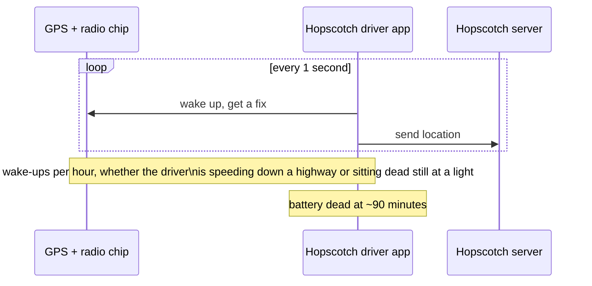

The obvious question: *does the rider actually need a new dot position every single second?* No — a rider watching a driver five minutes away doesn't notice or care about the difference between an update every 1 second and every 4 seconds. The location only needs to be *fresh enough to feel live*, not maximally frequent.

**The fix, and the first analogy for this story:** poll on a **fixed, sane interval** instead of constantly — Hopscotch settles on **every 4 seconds**, which happens to be the same cadence this course's Uber-style dispatch and surge-pricing chapters already assume for the same underlying location stream. Think of this as giving the phone a **heartbeat** instead of a nonstop shout — a steady, moderate pulse instead of screaming continuously.

**New problem, visible within a week:** a fixed 4-second heartbeat is a big improvement over 1-second polling, but it's still *fixed* — it fires just as often whether Priya is cruising at 45mph on a highway or sitting completely still for 12 minutes waiting for a rider to come out of a building. That second case is pure waste: **180 GPS wake-ups** in 12 minutes of zero actual movement, for a dot that never needed to move on the rider's screen at all.

**How I'd say this in an interview:** "The first instinct — poll GPS as fast as possible so the map feels perfectly live — is exactly what drains a phone's battery in under two hours. The fix isn't 'poll less accurately,' it's 'poll on a sane fixed interval,' which is already most of the win. But a *fixed* interval is still the wrong shape once you notice it burns the same battery whether the driver is moving or standing completely still."

---

## Chapter 2 — The heartbeat that should race and rest

The fix: don't use one fixed interval for the whole trip — make the ping frequency **adaptive**, changing with what's actually happening. Ping **fast** (every 1-2 seconds) when the driver is moving quickly or is close to a meaningful event — near the pickup point, near the drop-off, or right after the rider requests a ride. Ping **slow** (every 15-30 seconds) when the driver is stationary or barely moving. This is the same idea real operating systems already bake in: both iOS and Android ship real, documented location APIs built exactly for this trade-off — Android's `FusedLocationProviderClient` lets an app request different accuracy/power profiles, and both platforms support geofencing (a region you can be notified about entering or leaving) specifically so apps don't have to poll constantly just to catch "did they arrive yet."

**The analogy, extending the heartbeat:** a real heart doesn't beat at one fixed rate all day — it races during a sprint and rests at a stoplight. Hopscotch's location heartbeat should do the same: race when there's something worth tracking closely, rest when there isn't.

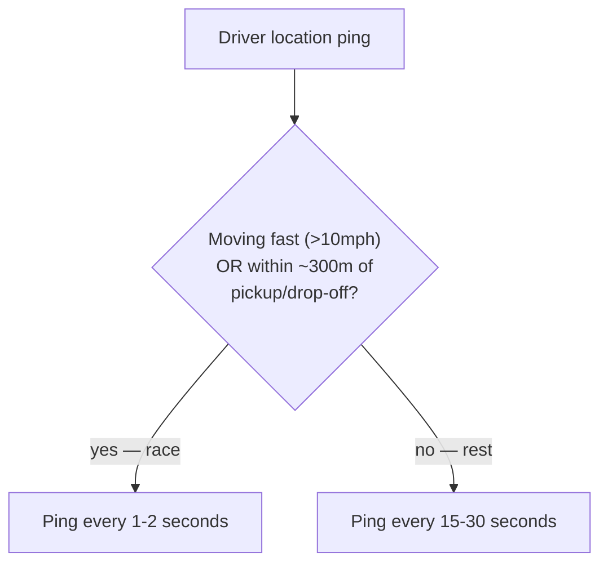

Redo the math: Priya's 12-minute stationary wait now costs roughly **24-48 GPS wake-ups** instead of 180 — an **~80% cut** in wasted polling for exactly the situation that was pure waste before, with zero loss of freshness during the parts of the trip that actually matter to the rider.

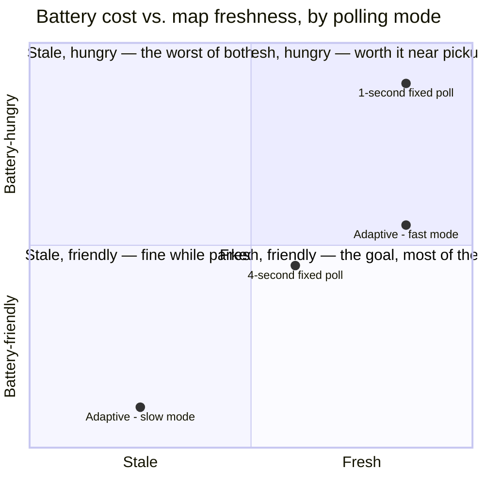

**New problem, discovered a month later:** Priya is stopped at a long red light right at the boundary of the "near pickup" zone, her speed hovering between 8 and 11mph as she creeps forward and brakes. Every time her speed crosses the 10mph line, the app flips between fast and slow mode. Over one 90-second red light, it **flips 14 times** `[illustrative — a stand-in for "threshold-crossing at a noisy boundary causes rapid mode switching," a well-known category of bug in any threshold-based system]`, each flip re-arming timers and briefly spiking GPS/network activity — the adaptive fix that was supposed to *save* battery is, at this exact boundary, now doing *more* work than the plain fixed-interval version it replaced.

**How I'd say this in an interview:** "A fixed interval wastes battery on stationary time; adaptive frequency fixes that by racing when there's something to track and resting otherwise — the same idea behind Android's fused location provider and iOS geofencing, which exist precisely so apps don't have to poll constantly. But any time you switch behavior based on crossing a threshold, you have to ask what happens when the real value just sits *on* that threshold — because it will, and it'll flap."

---

## Chapter 3 — The smoke detector that doesn't scream at a little steam

The fix: add **hysteresis** — a deliberate asymmetry and a minimum dwell time before switching modes. Upshifting to "fast" happens **immediately** on any sign of real movement (better to react instantly to a driver actually leaving). Downshifting to "slow" only happens after staying below the threshold for a **sustained window** — say, 10 continuous seconds — not the instant a single reading dips low.

**The analogy:** a good smoke detector doesn't scream the moment it senses a wisp of steam from a shower — it waits to see if the reading actually sustains before alarming, but it still alarms *instantly* on a real spike. Hopscotch's mode switch works the same way: quick to react to genuine change, slow and deliberate about standing down.

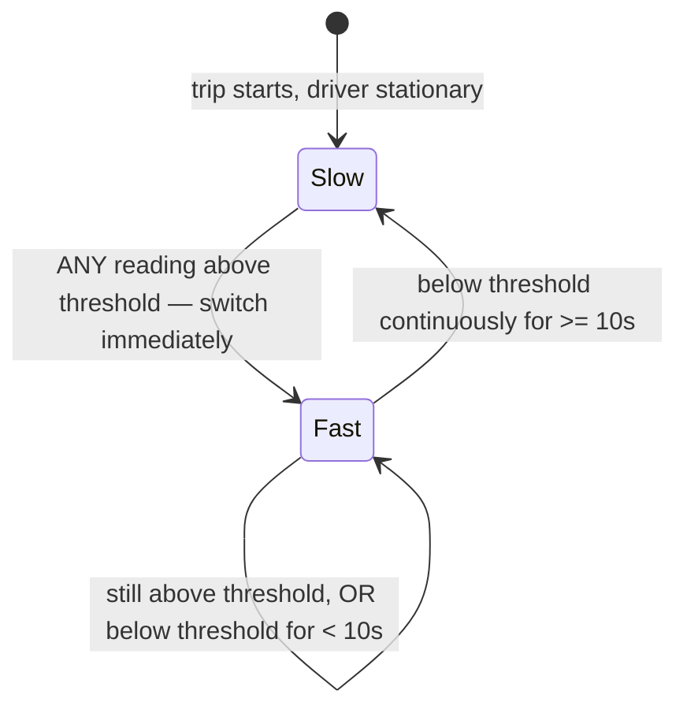

Redo the red-light case with hysteresis: Priya's speed bounces around 8-11mph for 90 seconds, but because downshifting requires 10 *continuous* seconds below threshold and her speed keeps re-crossing it, the app just... stays in fast mode for the whole light, then cleanly downshifts once she's actually stopped and staying stopped. **Zero flapping**, at the cost of a few extra seconds of fast-mode polling right at the edge — a trade Hopscotch is happy to make, since a few extra fast pings cost far less battery than 14 mode-switches an hour.

This closes the battery story for now: heartbeat (fixed interval) fixed constant polling, adaptive frequency (race/rest) fixed wasted stationary polling, and hysteresis fixed the flapping adaptive frequency itself introduced. Everything from here is a different problem entirely — not "is the *location feed* efficient," but "is the *ETA number* honest, and is the *sharing* itself safe."

**How I'd say this in an interview:** "Any adaptive threshold needs hysteresis, or it'll flap right at the boundary and cost you more than the fixed version you replaced it with — asymmetric hysteresis, quick to react upward, slow and deliberate to relax back down, is the standard fix, the same pattern a smoke detector or a thermostat uses."

---

## Chapter 4 — The ETA that lied for twelve minutes

Separately from the battery work, Hopscotch's ETA has its own problem. Right when a rider is matched with a driver, Hopscotch calls a routing engine **once**, gets "6 minutes away," and shows that number to the rider — then never touches it again for the rest of the wait.

Real, concrete failure: a delivery truck jackknifes two blocks from the driver's route, three minutes into the trip. The driver has to detour five blocks around it. The rider is still staring at **"6 minutes"** at the 12-minute mark, then at the 15-minute mark, getting angrier by the minute at a number that simply stopped being true and never said so. She cancels the ride and requests a new one — a totally avoidable cancellation, caused not by the actual delay but by a stale number that gave her no warning it was stale.

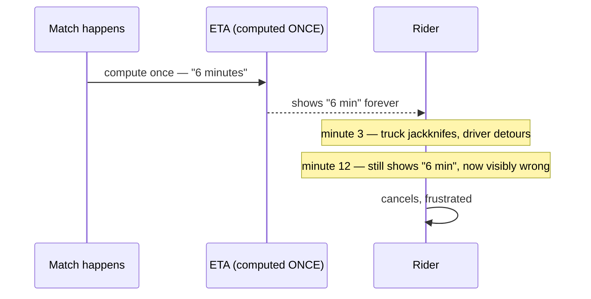

The obvious question: *why would anyone treat a prediction about a constantly-changing world as a one-time calculation?* Because it's the easy version to build first — and it works fine right up until the world actually changes mid-wait, which for anything longer than a couple of minutes, it eventually will.

**The fix:** recompute the ETA **continuously**, on a steady interval, against live traffic and routing data — Hopscotch lands on **every 15 seconds**, matching the exact cadence this course's own capacity-estimate numbers assume for a platform this size (roughly 33,000 ETA recomputations per second across 500,000 concurrently active trips `[illustrative, matching the reference guide's own worked capacity numbers for a platform this size]`). Call this the **live reporter** — a traffic reporter radioing in updates on a schedule, instead of one guess shouted once at the start of the broadcast and never revisited.

**New problem, spotted almost immediately:** recomputing every 15 seconds is a huge improvement, but it has two edges. First, a recompute happens *exactly* every 15 seconds regardless of whether anything meaningful changed — so the rider sees the number wiggle by a few seconds every cycle even when nothing real happened ("6:00" → "5:58" → "6:03" → "5:56"), which reads as flickery and untrustworthy. Second, if the driver takes a wrong turn **two seconds after** a recompute just fired, the rider is looking at a now-wrong number for up to **13 more seconds** before the next scheduled check catches it.

**How I'd say this in an interview:** "A one-time ETA is a prediction that never gets to be wrong out loud — it just silently drifts further from the truth the longer you wait. Continuous recomputation on a steady interval is the fix, but a pure fixed interval has its own two problems: it flickers on noise, and it's blind between cycles to anything sudden that happens right after a check just ran."

---

## Chapter 5 — The reporter who also has a police scanner

The fix has two parts, both attacking one of the two problems above. First, **don't push an update unless it's meaningfully different** from what's already shown — a change of a few seconds gets swallowed silently; only a real, noticeable shift (say, more than 30-60 seconds of difference) actually updates the rider's screen. That kills the flicker. Second, recompute **immediately** the moment a route deviation is detected — not just on the fixed 15-second clock — so a wrong turn gets caught the instant it happens, not up to 15 seconds later.

**Extending the reporter analogy:** the live reporter now also carries a police scanner. Most of the time they just check in on schedule. But the instant something newsworthy happens — the driver visibly leaves the predicted route — they cut in immediately instead of waiting for the next scheduled check-in.

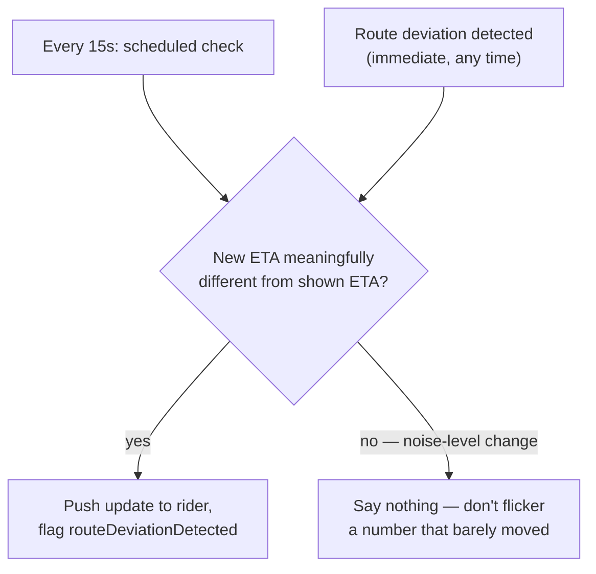

This closes the ETA story: a one-time guess became a continuously-recomputed prediction (the live reporter), and the live reporter learned to both check in on a schedule *and* interrupt itself for real news, while staying quiet about noise. Notice something important, though: nothing in this whole chapter has touched *who else can see this driver's location, or how precisely.* That's a completely separate axis, and it's where Hopscotch's next real incident comes from.

**How I'd say this in an interview:** "Combine both triggers — a steady interval so you're never blind for too long, and an immediate deviation trigger so a sudden change doesn't have to wait for the next tick — and only actually push an update when it's meaningfully different from what's already on screen, or you'll flicker a number that barely moved and train the rider to stop trusting it."

**Capacity gut-check, worth saying out loud if asked to size this:** at 500,000 concurrently active trips platform-wide, a 15-second recompute interval works out to roughly **33,000 ETA recomputations per second**, and a 4-second driver ping interval works out to roughly **125,000 location updates per second** needing forwarding `[illustrative, matching the reference guide's own worked capacity numbers]`. The interesting part isn't which number is bigger — it's that the ETA side, despite being the smaller count, is the real compute bottleneck, because each recomputation is a genuine routing/traffic-aware call, not cheap arithmetic, while each location update just needs forwarding to exactly one recipient. Tightening the ETA interval to every 5 seconds instead of 15 roughly triples that load to ~100,000/sec — a direct, nameable cost of wanting a fresher number, worth weighing against the routing provider's own rate limits and bill.

---

## Chapter 6 — The frosted glass that should stay frosted a little longer

Separately from ETA, here's Hopscotch's location-*sharing* design: the moment a rider is matched to a driver — before the rider has even tapped "confirm" — the app shows the driver's **exact** GPS coordinates on the rider's map, down to the meter.

This exact pattern caused a real, well-documented controversy elsewhere: when Snapchat launched **Snap Map** in 2017, it showed a user's precise, continuously-updating location to their entire friends list by default. It triggered real, widespread media and parental backlash over kids' exact real-time positions being visible to broad friend lists with no real gating — enough that Snapchat changed the default to an opt-in "Ghost Mode." The lesson generalizes directly to Hopscotch: showing someone's exact location to a party who **hasn't actually committed to anything yet** is exposure with no matching benefit.

Concretely for Hopscotch: roughly **15% of matches** are cancelled by the rider within the first 20 seconds, before ever tapping confirm `[illustrative — a stand-in for "a meaningful share of matches are abandoned pre-confirmation," a plausible number for any match-then-confirm flow]`. In every one of those cases, a stranger's exact location was shown to someone who then walked away from the interaction entirely — pure, unnecessary exposure with zero upside, for both the driver being watched and, symmetrically, for a rider whose own precise pickup pin gets shown to a driver they might reject-and-rematch away from a moment later.

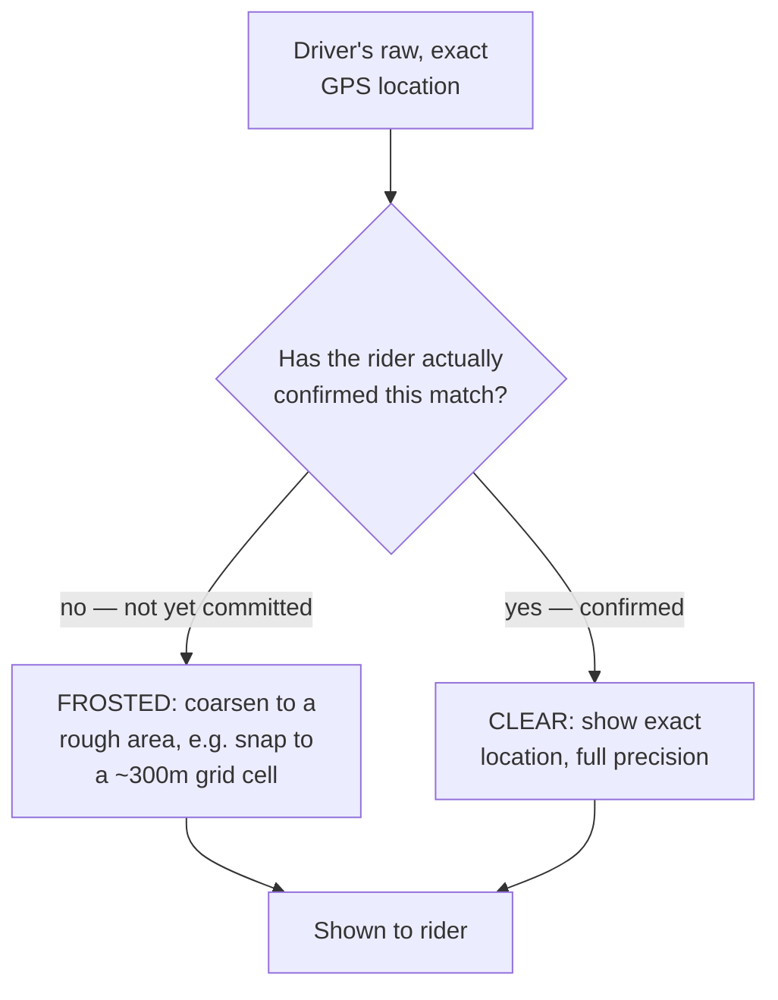

**The fix, and the analogy:** think of it like **frosted glass on a door** — before you've actually stepped into the room (confirmed the match), you can see there's a person-shaped shape moving around in there, roughly where, but not their exact position. The moment you step in (confirm), the glass turns clear.

**New problem, found in QA a week before launch:** a QA engineer, testing the "frosted" pre-confirmation screen, points a network proxy tool at the app just to check nothing else is broken — and notices the raw API response still contains the driver's **exact coordinates to six decimal places**. The rider's screen shows a coarse blob because the *app's UI code* rounds it before drawing the pin — but the exact number already arrived on the phone. This is a real, well-documented category of privacy-audit finding: researchers repeatedly find apps whose UI shows "approximate" location while the underlying network payload still carries exact coordinates, because the blurring happened client-side instead of server-side.

**How I'd say this in an interview:** "Coarsening location before a match is confirmed is a real, deliberate privacy improvement — the same lesson Snap Map learned the hard way in 2017 when it shipped precise, always-on sharing by default. But it only actually works if the coarsening happens before the data ever leaves the server — QA finding exact coordinates in the raw payload behind a coarse-looking pin means the privacy boundary was already crossed the moment that response left the building."

---

## Chapter 7 — Never trust the client to keep a secret it already has

The fix: move the coarsening to the **server**, in a dedicated precision-gate step, so the exact coordinates **never leave the trust boundary** in the pre-confirmation case at all. The client only ever receives what it's allowed to display — there's no exact number sitting in memory on the phone for a modified client, a rooted device, or a curious engineer with a proxy tool to recover, because it was never sent.

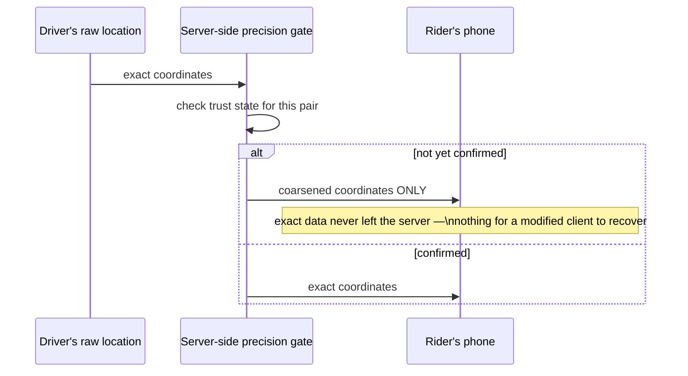

This is the same rule Apple ships at the operating-system level with its real, documented **"Approximate Location"** permission (introduced in iOS 14): an app that's only granted approximate access is handed already-fuzzed coordinates by the OS itself — the app's own code never sees the precise value it would need to leak, accidentally or otherwise. Hopscotch's server-side precision gate does the same job one layer down, for one specific pair instead of an entire app permission.

**New problem, this time from the opposite direction:** once confirmed, the rider correctly gets exact location — but nothing in this design says the confirmed state, and the exact-location access that comes with it, is supposed to ever *end*. Someone on the team asks the obvious next question: what actually stops this channel from working an hour after the trip is long over?

**How I'd say this in an interview:** "Coarsening has to happen server-side, before the data ever reaches the client — the same principle iOS's own 'Approximate Location' permission is built on, just applied to one specific relationship instead of one whole app. Trusting a client to just not display data it already received doesn't hold up against a modified client or a network proxy — the privacy boundary has to be enforced where the data actually lives, not where it's merely displayed."

---

## Chapter 8 — The key card that should stop working at checkout

Hopscotch's trip-end flow, as originally built, is two separate steps: mark the trip `COMPLETED`, and — a few moments later — a background cleanup job runs (on a **30-second cycle**) to revoke the location-sharing channel. This gap is small, but it's real, and it's exactly the kind of gap that's been shown, repeatedly, to matter: real reporting has documented cases of location-sharing and family-locator apps (Life360, Find My, and similar tools) being repurposed by an ex-partner or estranged family member to keep tracking someone after the relationship or the legitimate reason for sharing has ended — "the trip is over" not automatically meaning "the access is gone" is precisely the kind of gap that turns a convenience feature into a safety problem.

Concretely: a trip ends at exactly 6:14:02pm. The cleanup job doesn't run until its next scheduled tick at 6:14:30pm. For those **28 seconds**, the driver's app — if it simply ignores the "trip ended" push and keeps polling the old endpoint — can still successfully pull the rider's exact last-known location, because the channel's actual authorization record hasn't been touched yet. Worse: this is a race, not a guarantee — under load, or if that cleanup job itself falls behind, the window can be longer than 30 seconds, not shorter.

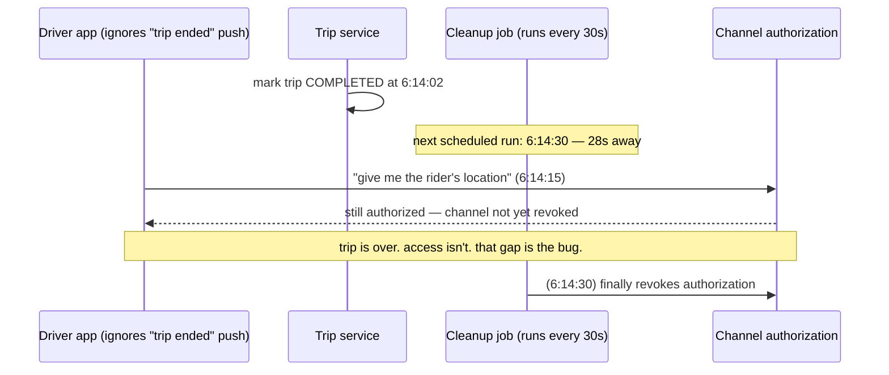

**The fix:** make trip-end and channel revocation the **exact same atomic action** — one transaction, no gap, no background job to fall behind. The moment a trip is marked `COMPLETED`, the authorization record is revoked in that same commit. Any subsequent access attempt gets an explicit "unauthorized," not a stale answer that happens to still work.

**The analogy:** a hotel key card that stops working the **instant** you check out, not "sometime in the next half hour when housekeeping gets around to deactivating it." Nobody would accept "your key card might still work for a bit after checkout" as a reasonable hotel policy, and this channel shouldn't accept the equivalent either.

**How I'd say this in an interview:** "A location-sharing channel that outlives its legitimate reason for existing isn't a hypothetical risk — real reporting on family-locator apps shows exactly this kind of lingering access getting misused. The fix is making revocation the same atomic transaction as ending the trip, not a background cleanup job on any interval — a key card should stop working at checkout, not sometime in the next 30 seconds."

**One more layer, worth naming if pushed on "how do you know the atomic fix actually holds in production":** an atomic transaction fixes the *design*, but a future refactor could still accidentally split it back into two steps without anyone noticing at review time. The mitigation isn't just "write the code correctly once" — it's an explicit monitoring check that continuously asks the data itself: "is there any channel whose trip has been in a terminal state for more than a few seconds, but whose authorization record hasn't been revoked?" That query being non-empty, even briefly, is exactly the regression this whole chapter exists to catch — treat it with the same seriousness as a paging alert, not a dashboard nobody watches.

---

## Chapter 9 — Don't build a megaphone for a phone call

With the heartbeat tuned, the ETA continuously honest, precision tied to trust, and revocation atomic, one architectural instinct still needs correcting. A new engineer, familiar with Hopscotch's dispatch system (which broadcasts many drivers' locations into a shared, geo-indexed feed that many nearby riders' apps can query), proposes reusing that same infrastructure for trip location sharing — "it's the same location data, why build something separate?"

**Why that's the wrong shape:** the dispatch system solves a **many-to-many** problem — many drivers' locations, aggregated and served to many watchers scanning a map. This chapter's channel solves a **one-to-one** problem — exactly one driver's location, shown to exactly one rider, for exactly the life of one trip. At Hopscotch's scale, that difference is enormous: roughly **125,000 location updates per second** need forwarding platform-wide, but every single one of them has **exactly one recipient** `[illustrative, matching the reference guide's own worked capacity numbers]` — an order of magnitude smaller fan-out than a geo-indexed broadcast built to serve many watchers per data point, because it was never supposed to have many watchers per data point.

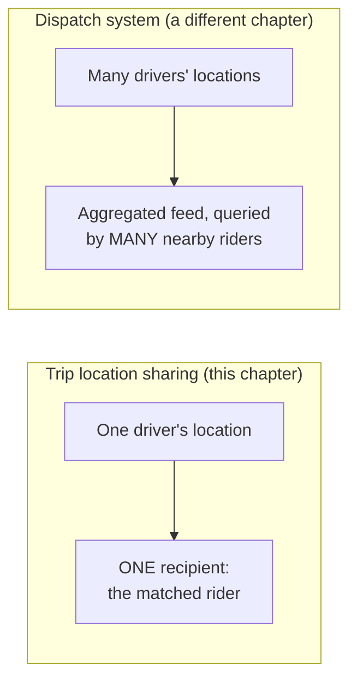

**The analogy:** the dispatch feed is a **megaphone** — one signal, broadcast to a crowd. This chapter's channel is a **private phone call** — one line, two people, and it hangs up for good the moment the call ends. Building megaphone infrastructure to carry a single private phone call isn't just unnecessary — it's the wrong tool entirely, over-engineered for a problem this small and under-scoped for the privacy guarantee it actually needs (a megaphone, after all, has no concept of "hang up and make sure nobody can dial back in").

**How I'd say this in an interview:** "It's tempting to reuse the dispatch system's geo-indexed fan-out for this, since it's technically the same kind of data — but that infrastructure is built to serve many watchers per location point, and this channel, by design, only ever has one. Reusing a megaphone for a private phone call is both overkill for the throughput and wrong for the privacy guarantee — the phone call needs a real hang-up, and a broadcast feed was never built with that concept in mind."

---

## The data model behind all of this, in one picture

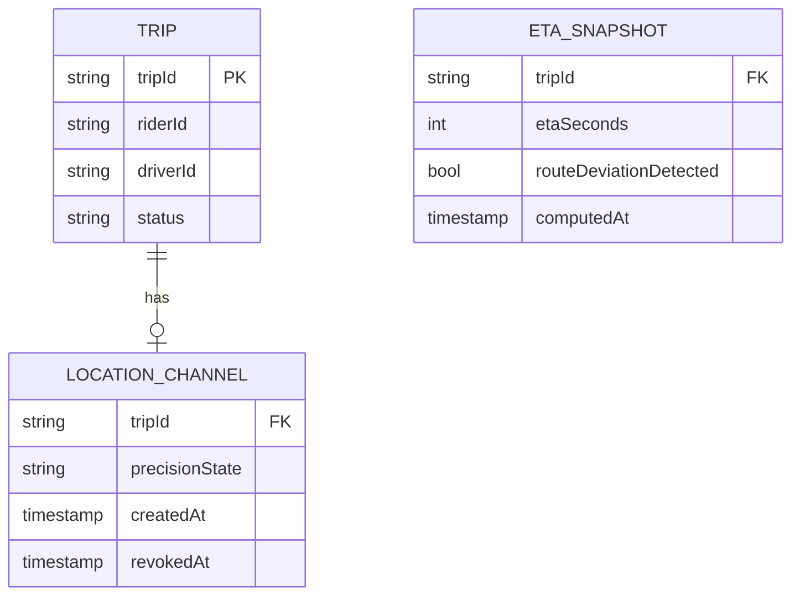

Two things worth pointing at directly if asked "where's the actual correctness boundary in this schema": `LOCATION_CHANNEL.revokedAt` being non-null is the entire hard-cutoff guarantee from Chapter 8 — it's a checkable fact, not an assumption, and every read of location data should check it. And `ETA_SNAPSHOT` being append-only, rather than a single mutable row, is what makes "why did the number change" answerable after the fact — useful both for a rider-facing "driver took a different route" message and for later auditing how accurate the predictions actually were.

---

## Where the story actually lands

```mermaid
flowchart LR
    A["Ch1: 1s polling\ndrains battery in 90min"] -->|"fixes: steady heartbeat\nbreaks: wastes battery when idle"| B["Ch2: adaptive\nfast/slow frequency"]
    B -->|"fixes: race/rest by movement\nbreaks: flaps at the threshold"| C["Ch3: hysteresis +\ndwell time"]
    C -->|"battery story done"| D["Ch4: ETA computed\nonce, goes stale"]
    D -->|"fixes: recompute every 15s\nbreaks: flicker + blind between ticks"| E["Ch5: interval +\ndeviation trigger"]
    E -->|"ETA story done"| F["Ch6: exact location\nshown pre-confirmation"]
    F -->|"fixes: coarsen by trust state\nbreaks: client-side blur is fake"| G["Ch7: coarsen\nserver-side"]
    G -->|"fixes: real privacy boundary\nbreaks: channel outlives the trip"| H["Ch8: atomic\ntrip-end teardown"]
    H -->|"fixes: hard cutoff\none more instinct to correct"| I["Ch9: one-to-one,\nnot a broadcast"]
```

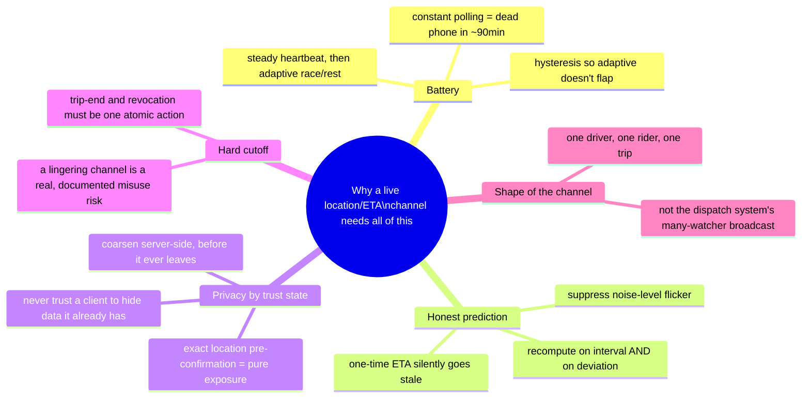

Every real interview on this topic sits somewhere on this chain. If the interviewer only cares about battery, stop after Chapter 3. If they lean hard on privacy, chapters 6-8 are where the real signal is. Walking the whole chain unprompted when the question was narrow reads as padding, not depth — read the room and stop where the requirements say to stop.

---

## Grill me — adversarial follow-ups

**Q1: "Why not just let the rider pick their own update frequency — fast for people who want a live view, slow for people who don't care?"**
You could expose that as a setting, but it doesn't fix the underlying problem — the driver's battery cost is driven by how often the *driver's* phone polls GPS, not by how often the rider's screen redraws. A rider choosing "slow updates" doesn't stop the server from having fresh data to serve fast if a different rider on the same driver wants it — the adaptive logic has to live on the driver side, tied to movement, not on the rider's display preference.

**Q2: "Your hysteresis fix adds a 10-second delay before slowing down — doesn't that just waste battery for those 10 seconds every single time?"**
Yes, a little, and that's a deliberate trade, not an oversight — a few extra seconds of fast-mode polling costs far less battery than the mode-switch overhead of flapping 14 times in 90 seconds. The dwell time is tuned so the "wasted" cost of waiting it out is cheaper than the cost of the problem it prevents.

**Q3: "Couldn't you just always show exact location, and put the privacy protection entirely in a 'do you consent to share' pop-up?"**
A consent pop-up only helps if people actually read and understand it, and Snap Map's own 2017 experience is the counter-example — it launched with location sharing already on by default for a broad audience, and the backlash happened anyway because the default behavior itself was the problem, not the absence of a disclosure screen. Coarsening by trust state protects people even when they never engage with a settings screen at all, which a consent dialog alone can't do.

**Q4: "What actually stops a determined driver from just recording the rider's exact pin the moment it becomes precise, and keeping a personal log of it forever?"**
Nothing at the network layer stops a client from screenshotting or logging data it was legitimately authorized to receive at that moment — that's a fundamentally different threat than the ones this design targets, which are "wrong precision at the wrong trust state" and "access after authorization ends." Preventing an authorized party from misusing data they legitimately had access to in the moment is a policy/legal/trust-and-safety problem, not something the precision gate or the teardown mechanism can solve by themselves.

**Q5: "Is 'meaningfully different' for ETA updates a fixed threshold, or does it change with the ETA's size?"**
It should scale, not stay fixed — a 30-second swing matters a lot on a "2 minutes away" ETA but is nearly invisible noise on a "45 minutes away" one. A percentage-based or tiered threshold (bigger absolute tolerance as the ETA itself gets bigger) avoids both over-flickering short trips and under-reacting to real changes on long ones.

**Q6: "Why does the atomic trip-end-plus-revocation transaction need to happen at the data layer — isn't checking on the API gateway enough?"**
No — an API gateway check only stops *new* requests routed through that gateway; it does nothing about a request that's already in flight, a cached response, or a different internal service that reads the authorization table directly. The revocation has to be a fact about the data itself — the authorization record's actual state — so that every possible access path, not just the one you happened to think of, sees the same "no" the instant it's revoked.

**Q7: "If the channel is one-to-one, why does the capacity estimate even matter — isn't 125,000 updates/sec trivially small compared to a broadcast system?"**
It's smaller than the dispatch chapter's fan-out, yes, but it's not trivial — it's still the platform's real, sustained write and delivery load, and the actual bottleneck in this system isn't raw location throughput at all, it's the ETA recomputation, because each recompute is a real routing/traffic API call, not cheap arithmetic. The interesting cost driver here is compute-per-recompute, not message volume.

**Q8: "What happens if the routing/traffic data provider Hopscotch depends on for ETA just goes down for a few minutes?"**
Don't block the rider's screen on a live call every single 15-second cycle — fall back to the last successfully computed ETA, but mark it explicitly as stale so the rider knows it might not reflect current traffic, rather than silently showing a number that looks as fresh as ever but secretly isn't.

**Q9: "Could you skip the coarse pre-confirmation state entirely for a low-risk product, like sharing location with a pre-vetted family member instead of a stranger driver?"**
That's a legitimate call to make explicitly with the interviewer, not to just assume — the whole reason coarsening exists is that a driver-rider match is between two people who don't know each other and haven't committed to anything yet, which isn't true of a pre-vetted family contact. If the relationship already carries a baseline of trust and consent, going straight to full precision can be a defensible, product-specific decision — the mechanism should stay available, but which trust states actually need coarsening is a requirements question, not a fixed rule.

**Q10: "Your Chapter 9 point says don't build a broadcast for a one-to-one channel — but what if a rider wants to share their live trip with a family member watching from home, too?"**
That's a real, common feature (Uber and Lyft both ship exactly this — sharing a live trip's status with someone outside the app) — but it's still not the many-watcher broadcast from the dispatch chapter, because the audience is a small, explicitly-named list the rider chose, not "anyone nearby." The right shape is still a small set of individually-scoped one-to-one channels, one per person the rider explicitly shared with, each independently revocable — not a single shared broadcast feed.

---

## Pacing note

**If this is 60 seconds inside a bigger question:** say the core line — this is a one-to-one channel, not a broadcast, where location precision is a deliberate function of trust state and adaptive polling keeps a driver's battery alive — then say "I'd cover continuous ETA recomputation and the atomic trip-end teardown as deep-dives if you want to go there." That's the whole shape in one breath.

**If this is the whole 15-20 minute focus:** walk the chain in order — battery-driven adaptive polling with hysteresis, continuous ETA recomputation with a deviation trigger, precision-by-trust-state enforced server-side, atomic hard cutoff at trip end, and the contrast with the dispatch chapter's broadcast fan-out if it comes up. Don't walk every chapter unprompted — follow wherever the interviewer's questions actually point, and use the skipped chapters as your "if we had more time" closer.

---

## Active recall — no answers, test yourself cold

1. Why does polling GPS every second, instead of every few seconds, actually matter for battery life?
2. What's the difference between what the fixed-interval heartbeat fixes and what adaptive frequency fixes on top of it?
3. Why does an adaptive frequency switch need hysteresis, and why is the hysteresis asymmetric (fast to react going up, slow going down)?
4. Walk through the exact failure that happens when an ETA is computed once at match time and never touched again.
5. Why does continuous ETA recomputation need both a fixed interval AND a deviation trigger — what does each one catch that the other misses?
6. Why does pushing every recomputed ETA to the rider, even a tiny change, create a real UX problem, and what's the fix?
7. What real 2017 product controversy motivates coarsening location before a match is confirmed, and what did that company change as a result?
8. Why doesn't client-side blurring of location actually protect anyone, even if the UI looks correctly coarse?
9. Why must trip-end and channel revocation happen in the exact same transaction, instead of trip-end followed shortly by a cleanup job?
10. Why is reusing the dispatch system's geo-indexed broadcast infrastructure the wrong tool for this chapter's location channel?

*Spaced repetition: test this list today, again in 2-3 days, again in a week.*

---

## Cheat sheet — one line per stop on the story

- **Constant GPS polling**: burns a phone's battery in under two hours — the reason continuous, unthrottled location polling is never the final answer.
- **Fixed-interval heartbeat**: a steady, moderate poll rate (e.g. every 4 seconds) beats constant polling, but still wastes battery during stationary time.
- **Adaptive frequency**: race (poll fast) when moving or near a meaningful event, rest (poll slow) when stationary — the same trade-off Android's fused location provider and iOS geofencing exist to support.
- **Hysteresis**: react instantly going up, require a sustained dwell time going down — prevents flapping right at a noisy threshold, the same trick a thermostat or smoke detector uses.
- **One-time ETA**: silently goes stale as traffic and routes change — never the final answer for anything the user watches for more than a minute or two.
- **Continuous ETA recomputation**: interval-based AND deviation-triggered, pushing an update only when it's meaningfully different — covers both the routine case and the sudden one, without flickering on noise.
- **Precision-by-trust-state**: coarse before a match is confirmed, exact after — the Snap Map 2017 lesson generalized: don't show precise, always-on location to someone who hasn't actually committed to anything yet.
- **Server-side coarsening**: enforce the blur before data ever leaves the server, the same principle behind iOS's real "Approximate Location" permission — never trust a client to hide data it already has in hand.
- **Atomic trip-end teardown**: revocation must be the exact same transaction as ending the trip, not a background job on any interval — a key card that stops working at checkout, not sometime in the next 30 seconds.
- **One-to-one, not a broadcast**: this channel has exactly one recipient by design — don't reuse a many-watcher geo-indexed dispatch feed for what is, structurally, a private phone call.
- **The meta-lesson**: every fix here buys one property (battery life, prediction honesty, privacy-by-trust, or a real hard cutoff) — say the trade in the same breath you propose the fix.
