# Design an ETA + Privacy-Scoped Location Sharing System — FAANG Interview Guide

> Source chapter type: continuous prediction + narrowly-scoped real-time sharing. Distinct from
> [Uber's Surge Pricing](./53-Design-Uber-Surge-Pricing-Engine-FAANG-Guide.md) and
> [Uber's Driver Dispatch](./62-Design-Ubers-Driver-Dispatch-System-FAANG-Guide.md) — both of
> those consume the same location-ping stream but aggregate it across *many* drivers for pricing
> or matching. This chapter is about what happens **after** a match: continuously recomputing one
> specific ETA for one specific pair, and sharing location **only** between that exact pair, with
> **precision that changes depending on trust state** — coarse before a ride is confirmed, precise
> after, and cut off entirely once the trip ends.

## Mental model

Once a rider and driver are matched, two things need to happen continuously until the trip ends:

1. **The ETA has to keep being right, not just be computed once.** Traffic changes, the driver
   takes a different turn than predicted, a road closes — a "recompute once at match time" ETA is
   stale within minutes. This needs continuous recomputation against live traffic/route data, not
   a single query-and-cache.
2. **Location has to be shared, but only between this one pair, and only at the precision the
   relationship currently justifies.** Before a rider confirms a ride, showing a driver's exact,
   precise location is an unnecessary privacy exposure (the rider hasn't committed to anything
   yet) — many products show a coarsened, approximate position at this stage. Once a ride is
   confirmed, precision increases because the rider needs an accurate pickup experience. Once the
   trip ends, sharing must stop immediately and completely — not just "not display it," but not
   be re-derivable by either party at all.

This is a fundamentally different fan-out shape than the dispatch or surge-pricing chapters: those
broadcast aggregated signals to *many* consumers (drivers seeing a surge map, the matching
algorithm seeing all nearby drivers). This chapter is the opposite — a **single, narrow,
time-boxed channel between exactly two parties**, whose precision is a deliberate, changing
privacy control, not a fixed broadcast.

**The one sentence to say out loud:** *"ETA is a continuous prediction problem, and location
sharing here is deliberately narrow — one channel, two parties, with precision that changes by
trust state and hard-stops at trip end — the opposite shape from the broadcast fan-out in the
dispatch and surge-pricing chapters."*

**The one picture to remember forever:**

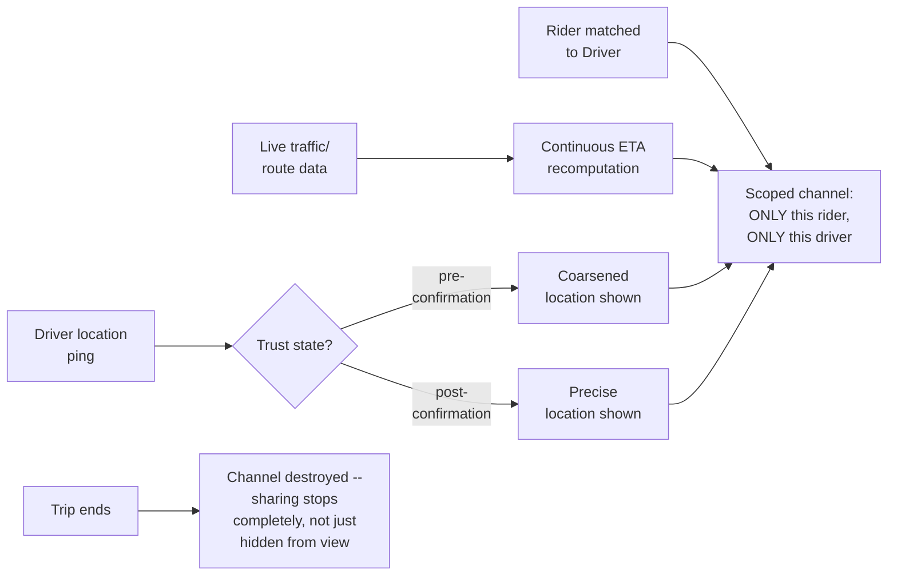

**Memory hook:** *"One pair, one channel, precision tied to trust state, hard cutoff at trip
end — never a broadcast, and never a lingering channel after the reason for it ends."*

---

## Table of contents
[How to Identify This Topic](#how-to-identify-this-topic-in-an-interview) ·
[Interview Playbook](#interview-playbook) · [Requirements](#requirements-clarification) ·
[Capacity Estimation](#capacity-estimation-worked) · [API Design](#api-design) ·
[High-Level Architecture](#high-level-architecture) ·
[Architecture Evolution v1→v2→v3](#architecture-evolution-v1--v2--v3) ·
[End-to-End Walkthroughs](#end-to-end-request-walkthroughs) ·
[Deep Dive: Continuous ETA Recomputation](#deep-dive-continuous-eta-recomputation) ·
[Deep Dive: Precision-by-Trust-State Location Sharing](#deep-dive-precision-by-trust-state-location-sharing) ·
[Deep Dive: Hard Cutoff at Trip End](#deep-dive-hard-cutoff-at-trip-end) ·
[Deep Dive: Contrast with Broadcast Fan-Out](#deep-dive-contrast-with-broadcast-fan-out) ·
[Data Model](#data-model) · [Failure Modes](#failure-modes--mitigations) ·
[Non-Functional Walkthrough](#non-functional-walkthrough) ·
[Security & Compliance](#security--compliance) · [Cost & Trade-offs](#cost--trade-offs) ·
[Wrap-Up](#wrap-up-mvp-vs-stretch) · [Golden Rules](#golden-rules) ·
[Cheat Sheet](#master-cheat-sheet)

---

## How to identify this topic in an interview

- "Design an ETA service" or "design real-time location sharing between a driver and rider" —
  sometimes asked as its own focused question, distinct from a full ride-hailing system design.
- The tell that this is about scoped sharing and continuous prediction, not matching or pricing:
  the interviewer emphasizes **one specific pair** and/or **privacy** — either signal means this
  chapter's precision-by-trust-state mechanism is the actual substance.
- A follow-up like "should the rider see the driver's exact location before accepting the match"
  is the [precision-by-trust-state deep dive](#deep-dive-precision-by-trust-state-location-sharing)
  — the single most commonly missed nuance in this chapter.

---

## Interview playbook

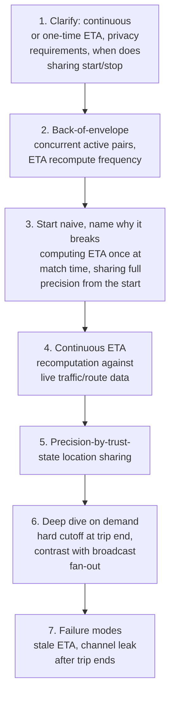

**What the interviewer is actually grading at each step:**
- Step 3: do you recognize, unprompted, that a one-time ETA computed at match time goes stale
  within minutes as traffic and routes change — this needs continuous recomputation, not a cached
  value?
- Step 5: do you propose, unprompted, that location precision should differ before vs. after ride
  confirmation — this is the single detail most candidates miss, defaulting to "just share the
  exact location" throughout?
- Step 6: do you know that ending a trip must destroy the sharing channel entirely, not just stop
  displaying it on the UI — a channel that technically still exists is a latent privacy leak?

---

## Requirements clarification

### Functional

| # | Requirement | Notes |
|---|---|---|
| F1 | Continuously recompute and provide an ETA for a matched rider/driver pair | Not a one-time calculation |
| F2 | Share live location between exactly the matched rider and driver, no one else | A narrow, two-party channel |
| F3 | Vary location precision based on the relationship's trust state (pre-confirmation vs. post-confirmation) | The core privacy mechanism |
| F4 | Terminate location sharing completely when the trip ends or is cancelled | A hard, not soft, cutoff |
| F5 | Handle route deviations (driver takes an unexpected turn) by updating the ETA, not just the raw location | ETA and location are related but distinct outputs |

### Non-functional

| Requirement | Target | Why this number |
|---|---|---|
| ETA recomputation frequency | Every few seconds to tens of seconds, or on a meaningful route deviation | Frequent enough to stay accurate, infrequent enough not to waste compute on negligible changes |
| Location update latency | Sub-second to a few seconds, matching typical real-time-tracking UX expectations | The rider is actively watching the driver's dot move on a map — visible lag reads as broken |
| Precision-state correctness | Absolute — the wrong precision level at the wrong trust state is a real privacy incident, not a display glitch | Showing exact location before a rider has committed is an unnecessary and avoidable exposure |
| Sharing-channel teardown | Immediate and complete at trip end — no lingering ability for either party to query the other's location afterward | The most serious failure mode in this whole chapter is a channel that outlives its legitimate purpose |
| Scoping correctness | Absolute — only the matched pair can ever access this channel's data | A third party gaining access to a live location feed is a severe security/privacy failure |

**Clarifying questions worth asking the interviewer up front — and what each answer changes:**

| Question | If the answer is... | ...then this changes |
|---|---|---|
| "Should the rider see the driver's exact location before confirming the match, or only an approximate one?" | Approximate before confirmation, exact after | Confirms the precision-by-trust-state mechanism is the core design element, not an optional polish |
| "How is the ETA meant to be used — just displayed to the user, or does it also drive other logic (e.g. surge pricing, dispatch)?" | Purely for display in this chapter's scope | Keeps this chapter focused on the prediction+sharing problem, explicitly out of scope from the matching/pricing chapters it's adjacent to |
| "What exactly happens to the sharing channel when a trip ends — is 'stop showing it' sufficient, or must access be fully revoked?" | Full revocation required | Confirms the hard-cutoff deep dive is a correctness requirement, not just a UI concern |
| "Does ETA need to account for real-time traffic, or is a static route-time estimate acceptable?" | Real-time traffic-aware | Confirms the continuous-recomputation deep dive must integrate a live traffic/routing data source, not just static distance/speed math |

**Say this out loud in the interview:** *"I want to treat privacy as a first-class functional
requirement here, not an afterthought — location precision should be a deliberate function of how
committed the relationship currently is, and the sharing channel itself needs to be destroyed, not
just hidden, the moment the trip ends."*

---

## Capacity estimation, worked

```
Given (illustrative, a ride-hailing platform's post-match tracking load):
  Concurrently active matched pairs (post-match,
    pre-trip-end), globally, at peak                   = 500,000

ETA recomputation load:
  Recompute interval per pair                           = every 15 seconds
  ETA recomputations/sec, platform-wide                   = 500,000 / 15 ~= 33,000/sec
  -> each recomputation calls a routing/traffic-aware ETA function -- a real, non-trivial
     compute cost per call (not a cheap arithmetic lookup), which is why this number, not raw
     location-ping volume, is often the dominant COMPUTE cost in this system, distinct from the
     dominant WRITE cost below.

Location-sharing update load:
  Driver location ping interval                          = every 4 seconds (same cadence as the
                                                              dispatch/surge-pricing chapters,
                                                              since it's the same underlying
                                                              location stream)
  Location updates needing to be forwarded to the
    matched rider, platform-wide                           = 500,000 / 4 = 125,000/sec
  -> this is a MUCH smaller fan-out than the dispatch chapter's geo-index queries or the surge-
     pricing chapter's aggregation load, precisely BECAUSE each update goes to exactly ONE
     recipient (the matched rider), not into a shared aggregate or a many-watcher broadcast.

Precision-state transitions:
  Pre-confirmation window per pair (illustrative)        = ~30-60 seconds (time between match
                                                              and rider confirming/accepting)
  -> a short, bounded window during which the COARSE precision mode applies -- most of a
     pair's active lifetime (the full trip duration) is spent in the PRECISE, post-confirmation
     state, which is the expected, larger-volume case.

Channel teardown events:
  Trips ending/cancelling per day, platform-wide          = ~5,000,000
  -> each one MUST trigger an explicit, immediate channel-teardown action -- a small number
     relative to ongoing location-update volume, but each individual teardown is a hard
     correctness requirement, not best-effort cleanup.
```

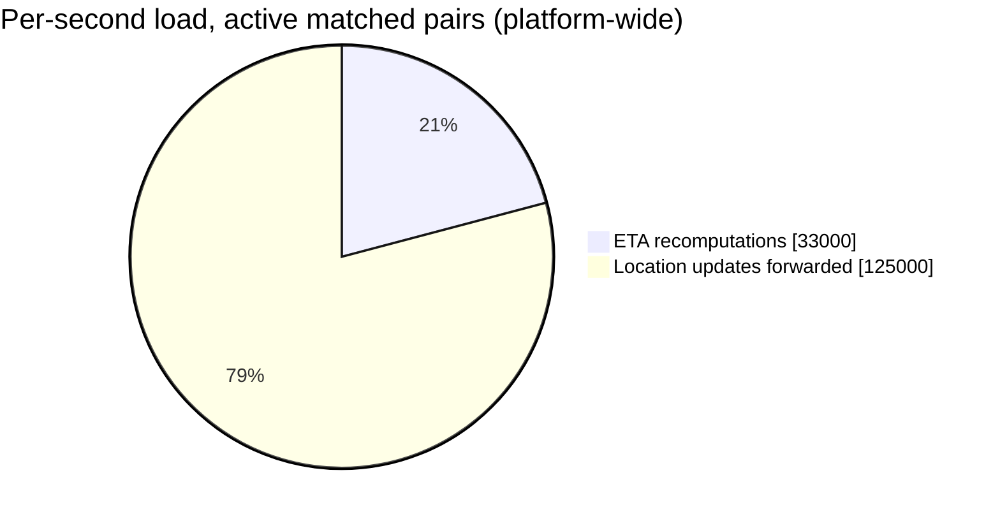

Unlike the dispatch and surge-pricing chapters, location-update volume here stays modest —
because each update has exactly one recipient, never a many-watcher broadcast.

**Redo-the-chain test:** if ETA recompute interval is tightened to every 5 seconds (fresher
predictions), recomputation load triples to ~100,000/sec — a direct, computable cost of wanting a
more responsive ETA, worth naming explicitly as a trade-off against the routing/traffic-data
provider's own cost and rate limits.

**The number worth memorizing:** because this system shares location one-to-one rather than
broadcasting to many watchers, its location-update fan-out volume is far smaller than the
dispatch or surge-pricing chapters' aggregation load — the real cost driver here is the ETA
recomputation itself (a non-trivial routing/traffic call), not raw location throughput.

---

## API design

### `GET /v1/trips/{tripId}/eta`

```json
{ "tripId": "trip_71209", "etaSeconds": 240, "lastRecomputedAt": "2026-07-24T18:05:15Z", "routeDeviationDetected": false }
```

### WebSocket channel: `trip/{tripId}/location` (scoped to exactly the matched pair)

```json
{ "role": "DRIVER", "precision": "COARSE", "location": { "lat": 37.771, "lng": -122.412 } }
```
after confirmation:
```json
{ "role": "DRIVER", "precision": "PRECISE", "location": { "lat": 37.7712, "lng": -122.4108 } }
```

### `POST /v1/trips/{tripId}/end` (triggers hard cutoff)

```json
{ "endedBy": "DRIVER", "reason": "COMPLETED" }
```

| Field | Notes |
|---|---|
| `precision` | Explicit in every location payload — the client (and any auditor reviewing the API contract) can see exactly which mode is active, rather than precision being an invisible server-side detail |
| `routeDeviationDetected` | Surfaces *why* an ETA changed meaningfully, not just the new number — useful both for user-facing messaging ("driver took a different route") and for debugging |
| `trips/{tripId}/end` | The single action that must, atomically, both end the trip and revoke the location-sharing channel — see the [hard-cutoff deep dive](#deep-dive-hard-cutoff-at-trip-end) |

**The one sentence worth saying about the API surface:** *"The location channel is scoped by
`tripId` to exactly the matched pair, carries an explicit precision level in every payload, and is
torn down by the same action that ends the trip — never a separate, easy-to-forget cleanup step."*

---

## High-level architecture

### Architecture evolution (v1 → v2 → v3)

**v1 — compute ETA once at match time, share exact location from the start:**

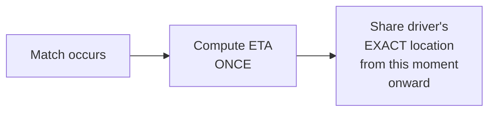

**Why it breaks:** the ETA goes stale within minutes as traffic and the actual route diverge from
the initial estimate — a "stuck" ETA that never updates is worse than a rough estimate that's
honest about changing. And sharing exact location before the rider has even confirmed the match
is an unnecessary privacy exposure with no corresponding benefit to the rider at that stage.

**v2 — continuous ETA recomputation, but still one fixed precision level throughout:**

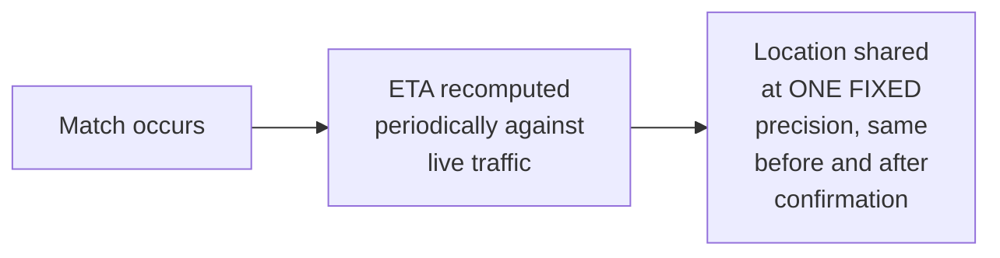

**Why it breaks:** continuous recomputation (v2's real improvement) fixes the staleness problem.
But a single fixed precision level still either over-shares before confirmation (if precision is
set to "exact") or under-serves the rider during pickup (if precision is set to "coarse" and never
sharpens) — neither fixed choice serves both the pre-confirmation privacy need and the
post-confirmation accuracy need simultaneously.

**v3 — the real system: continuous ETA + precision that changes with trust state + hard
teardown:**

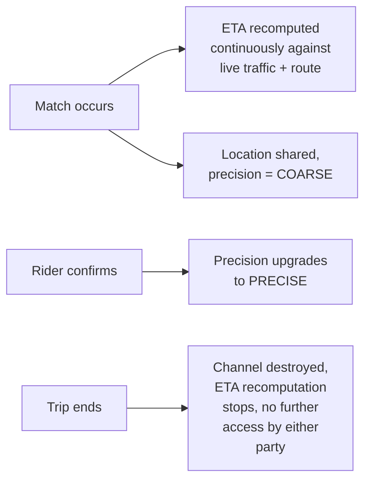

**What v3 fixes, one line each:** continuous ETA recomputation (already in v2) keeps the estimate
honest as conditions change; precision that starts coarse and upgrades on confirmation serves both
the pre-commitment privacy need and the post-commitment accuracy need, instead of picking one
fixed level for both; and an explicit, immediate teardown at trip end closes v2's implicit gap
where nothing ever explicitly says "stop."

---

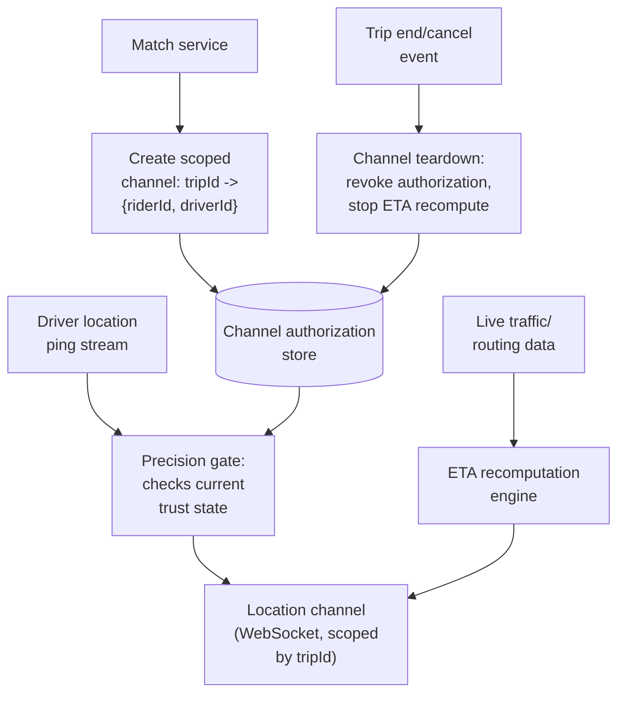

| Component | Role |
|---|---|
| Channel authorization store | The scoping mechanism — maps a `tripId` to exactly the two authorized parties; every read/write to location or ETA data checks this before proceeding |
| Precision gate | Reads the current trust state (has the rider confirmed?) and coarsens or passes through the driver's raw location accordingly |
| ETA recomputation engine | Continuously queries live traffic/routing data, not a one-time calculation — the mechanism behind the continuous-recomputation deep dive |
| Teardown | Triggered by the same trip-end event that closes the ride itself — atomically revokes channel authorization, not a separate, skippable cleanup step |

---

## End-to-end request walkthroughs

### Walkthrough 1 — match to confirmation, precision upgrades

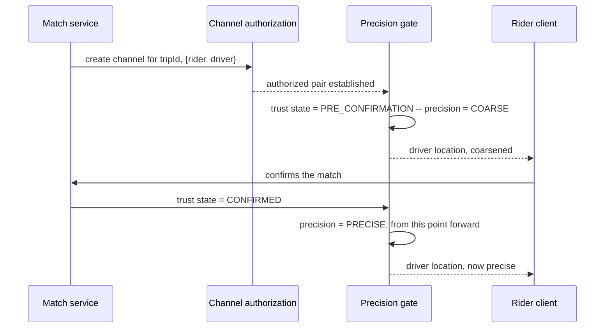

### Walkthrough 2 — a route deviation updates the ETA mid-trip

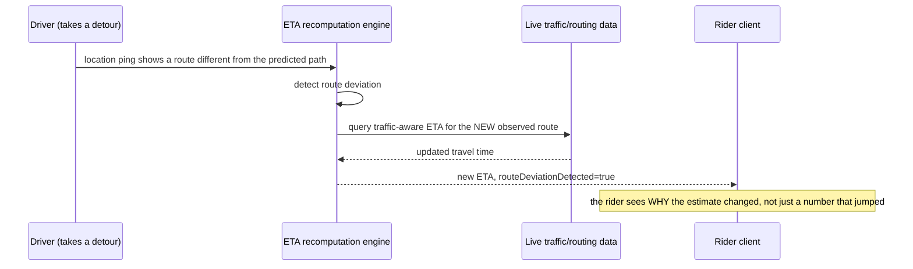

### Walkthrough 3 — trip ends, channel is torn down immediately

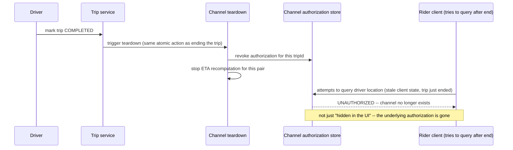

Walkthrough 3 is the concrete proof behind the [hard-cutoff deep dive](#deep-dive-hard-cutoff-at-trip-end)
— the channel doesn't linger in a "could still be queried but isn't displayed" state.

---

## Deep dive: continuous ETA recomputation

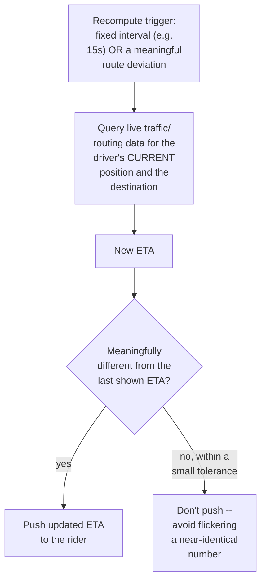

**Why interval-based AND deviation-triggered recomputation, not just one or the other:** a fixed
interval alone can miss a sudden, significant deviation right after a recompute just happened
(waiting the full interval before noticing); deviation-triggered alone could recompute needlessly
often for very short, everyday route micro-adjustments that don't actually change the ETA
meaningfully. Combining both — recompute on a steady cadence, and immediately on a detected
deviation — covers both the routine and the surprising case.

**Why a small "meaningfully different" tolerance before pushing an update:** constantly pushing a
new ETA that differs by a few seconds from the last one creates visible flicker with no real
informational value — the same "don't update on noise" instinct as the surge-pricing chapter's
smoothing mechanism, applied here to a displayed number instead of a price.

**Interview cheat-sheet:** *"Recompute on both a steady interval and an immediate route-deviation
trigger, and only push an update to the rider when it's meaningfully different from what they're
already seeing — this is a prediction that has to stay honest as conditions change, not a
one-time calculation."*

---

## Deep dive: precision-by-trust-state location sharing

Already the centerpiece of the mental model and architecture evolution — the deep dive states the
mechanism generally.

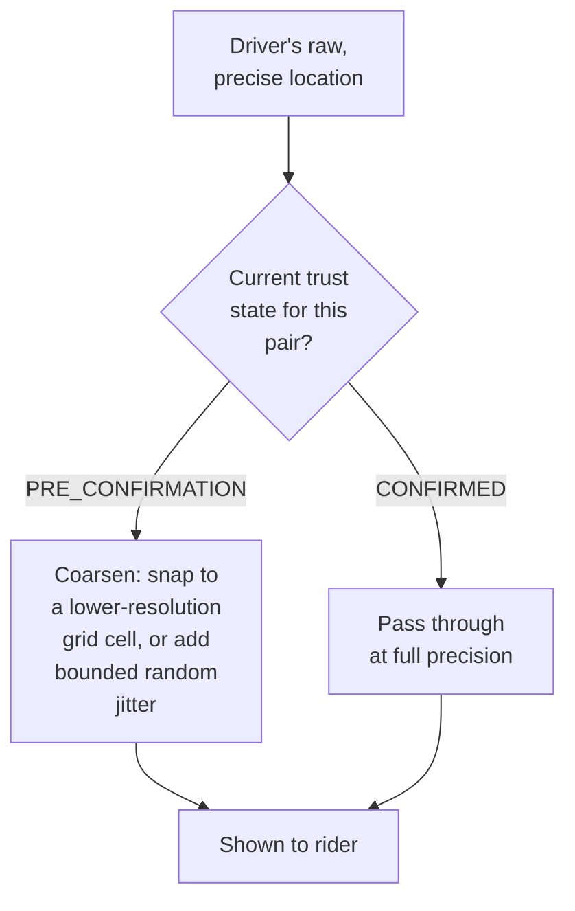

**Why coarsening before confirmation is a deliberate design choice, not a limitation to work
around:** a rider deciding whether to accept a match has no legitimate need for the driver's exact
position — an approximate "nearby" signal is sufficient for that decision, and withholding full
precision until the rider has actually committed is a real, meaningful privacy improvement with no
cost to the legitimate use case at that stage.

**Why this must be enforced server-side, in the precision gate, never left to the client to
"just not display" full-precision data it already received:** if the server sends exact
coordinates and merely trusts the client UI to round them for display, the exact data has already
left the server's control — a modified or malicious client could simply display what it received.
Coarsening has to happen before the data leaves the trust boundary, not after.

**Interview cheat-sheet:** *"Coarsen location server-side, before it's ever sent, based on the
current trust state — never send full precision and rely on the client to withhold it, because at
that point the privacy boundary has already been crossed."*

---

## Deep dive: hard cutoff at trip end

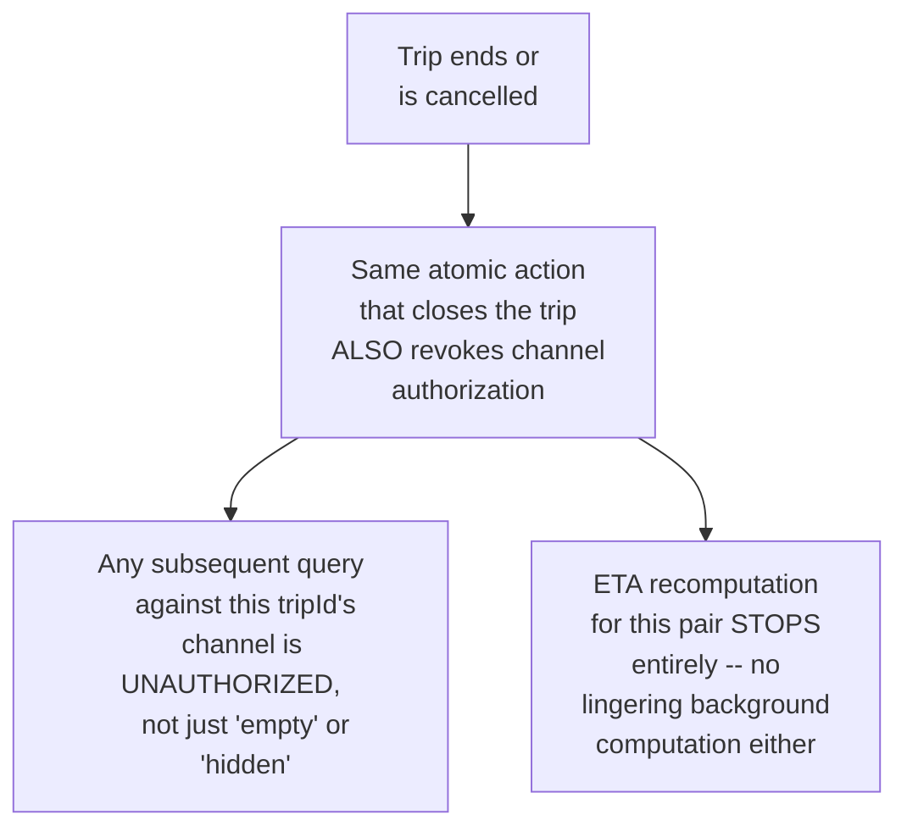

**Why "stop displaying it" is not sufficient, and full authorization revocation is required:** a
channel that still technically exists and is merely not rendered in the current UI is a latent
risk — a stale client, a replayed request, or a bug could still retriee location data for a trip
that has already ended. Revoking authorization at the data-access layer, not just the presentation
layer, is what makes the cutoff a real security boundary rather than a UI convention.

**Why this must be the *same* atomic action as ending the trip, not a separate follow-up step:** if
teardown is a distinct action that happens "shortly after" trip end, there's a window (however
small) where the trip has ended but the channel is still live — treating both as one atomic
transition eliminates that window entirely, the same discipline as any two-effects-must-happen-
together requirement elsewhere in this course (e.g. the auction chapter's lock-before-determine-
winner step).

**Interview cheat-sheet:** *"Trip end and channel teardown must be the same atomic action, and
teardown means revoking authorization at the data-access layer — not just hiding the UI element —
or a stale client and a live-but-unauthorized channel is a real privacy gap, however brief."*

---

## Deep dive: contrast with broadcast fan-out

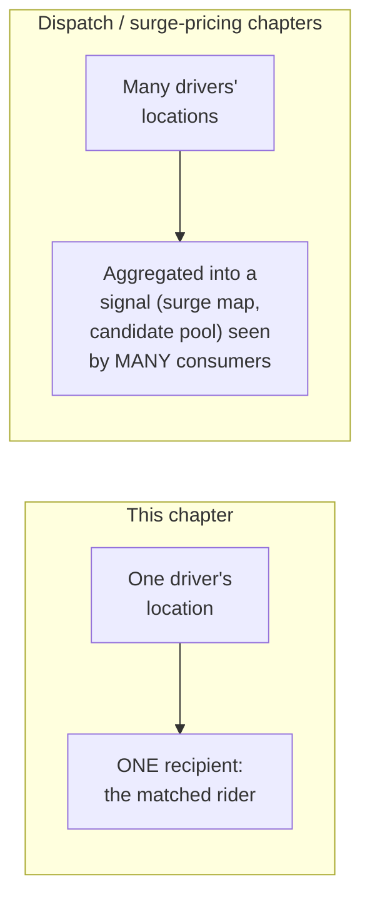

**Why this distinction matters enough to draw explicitly, especially if the interviewer conflates
this chapter with the broader ride-hailing system:** the dispatch and surge-pricing chapters solve
a fan-in/fan-out problem (many locations aggregated for many consumers); this chapter solves a
fan-in-of-one/fan-out-of-one problem (one driver's location, shown to exactly one rider). Reaching
for the geo-indexed, many-watcher broadcast infrastructure from those chapters here would be
solving the wrong shape of problem — massive overkill for a channel that, by design, only ever has
exactly one recipient.

**Interview cheat-sheet:** *"This is a one-to-one channel, not a broadcast — don't reach for the
geo-indexed many-watcher fan-out infrastructure from the dispatch or surge-pricing chapters here;
that solves a different problem than 'show exactly one rider exactly one driver's location.'"*

---

## Data model

**Channel lifecycle:**

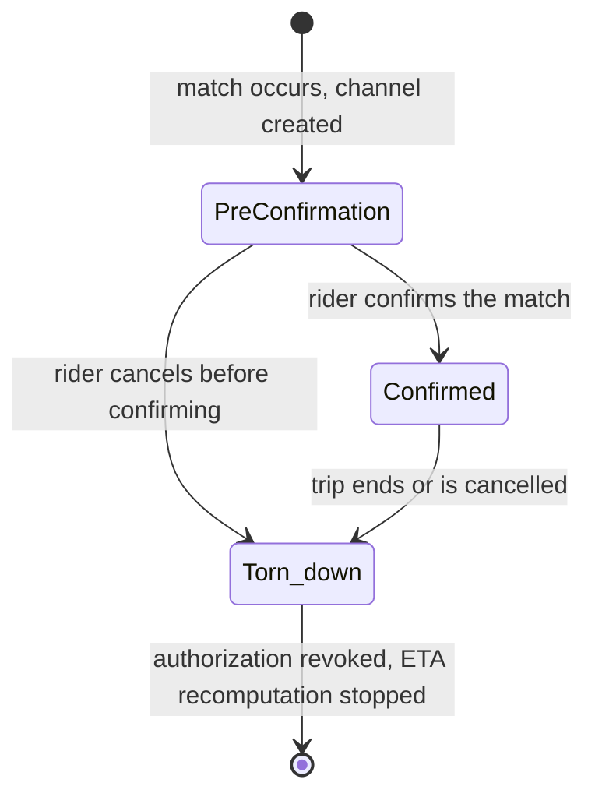

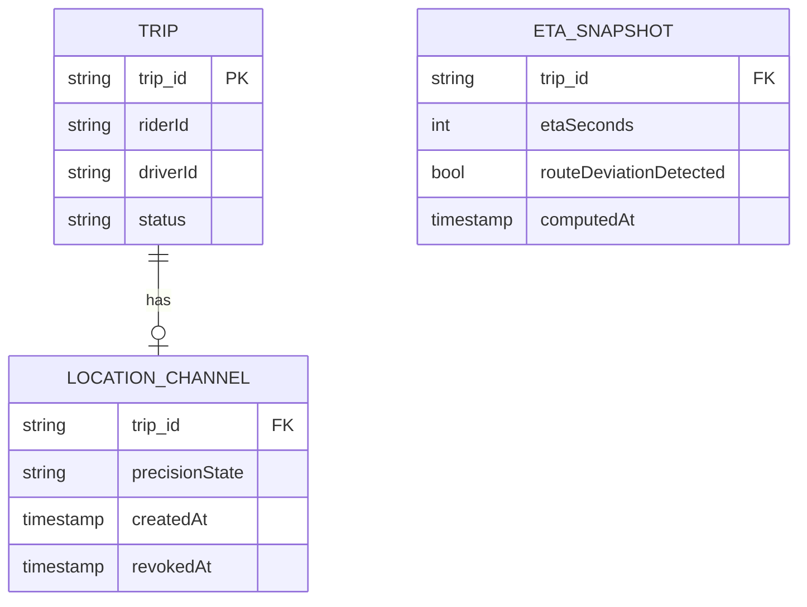

| Table | Storage choice & why |
|---|---|
| `LocationChannel` | The authorization record itself — checked on every location read/write; `revokedAt` being non-null is what makes teardown a real, checkable fact, not just an assumption |
| `ETASnapshot` | Append-only history of recomputed ETAs, useful for both the "why did this change" UX and for offline analysis of prediction accuracy |

---

## Failure modes & mitigations

| Failure mode | Impact | Mitigation |
|---|---|---|
| **A stale client continues polling for location after a trip has ended** | Should not succeed, but naive designs might return "last known location" instead of an explicit denial | The channel-authorization check must return an explicit unauthorized/not-found response post-teardown, never a stale cached value that looks like a valid answer |
| **Traffic/routing data provider is slow or unavailable** | ETA recomputation stalls | Fall back to the last successfully computed ETA with an explicit staleness indicator, rather than blocking the rider's display on a live call every single recompute cycle |
| **Precision gate has a bug that ships exact location pre-confirmation** | A real, hard-to-detect-after-the-fact privacy incident | Treat this code path with the same scrutiny as any access-control-critical logic elsewhere in this course — test the boundary explicitly, since a silent failure here has no visible symptom until noticed |
| **Trip-end and channel-teardown become decoupled** (e.g. a refactor accidentally splits them into two steps) | Reopens the exact window the hard-cutoff deep dive exists to close | Keep both effects in the same transaction/handler by construction, and add a monitoring check for "any channel with `revokedAt` null more than a few seconds after its trip's `status` became terminal" |

---

## Non-functional walkthrough

**Scaling both ETA recomputation and location forwarding is embarrassingly parallel by trip** —
every matched pair's channel and recomputation cycle is fully independent of every other pair's,
naturally shardable by `tripId`.

**Availability of the location channel should be high but can degrade to "last known position,
clearly marked as stale" rather than failing outright** — a brief gap in live updates is a minor
UX issue; the correctness-critical property is that authorization scoping and the eventual
teardown are never wrong, not that every single update arrives with zero latency.

**Consistency of the authorization state (who can access this channel, and whether it's been
revoked) must be strict and immediate** — this is the one place in the system that cannot tolerate
"eventually revoked," mirroring the same non-negotiable-correctness framing as the distributed-
lock-service chapter's safety-over-availability stance, just applied to a privacy boundary instead
of mutual exclusion.

---

## Security & compliance

- **This is fundamentally a privacy-by-design chapter** — precision-by-trust-state and hard
  cutoff at trip end are both privacy-driven architecture decisions, not just features; the
  interview should be answered with that framing throughout, not as an afterthought bolted onto a
  generic tracking system.
- **Location data retention** after a trip ends is a separate question from real-time sharing —
  even with the sharing channel torn down immediately, any historical location data retained for
  legitimate purposes (safety incidents, fraud investigation) should follow its own explicit,
  minimal retention policy, distinct from the live-sharing channel's lifecycle.
- **Regulatory exposure** — location data is specifically and heavily regulated in many
  jurisdictions (GDPR and similar regimes); the precision-by-trust-state mechanism and hard
  cutoff both directly support a data-minimization argument if this system is ever audited.

---

## Cost & trade-offs

**Continuous ETA recomputation trades compute/API cost against prediction accuracy** — per the
capacity estimate, tightening the recompute interval directly and proportionally increases load
against the traffic/routing data provider, a real, computable cost of wanting fresher predictions.

**Precision-by-trust-state trades a small amount of implementation complexity (two precision
modes instead of one) for a meaningful, real privacy improvement with no cost to the legitimate
post-confirmation use case** — an easy trade to justify explicitly if asked to compare against a
simpler, single-precision design.

---

## Wrap-up: MVP vs. stretch

**In scope for an MVP:**
- Continuous, interval-based ETA recomputation against live traffic/routing data.
- Two-tier precision (coarse pre-confirmation, precise post-confirmation), enforced server-side.
- Atomic trip-end-plus-channel-teardown, with authorization revocation checked on every access.

**Explicitly out of scope for an MVP:**
- Deviation-triggered recomputation (start with interval-only, add deviation-triggered
  recomputation once the interval-only cadence proves too slow to react to real route changes).
- Fine-grained, more-than-two-tier precision levels — start with a coarse/precise binary, add
  intermediate tiers only if a specific product need justifies the added complexity.

**Stretch goals, worth naming if asked "what's next":**
1. **Deviation-triggered recomputation**, layered on top of the interval-based baseline.
2. **Predictive ETA confidence intervals** ("arriving in 4-6 minutes"), rather than a single point
   estimate, communicating uncertainty honestly.
3. **Post-trip location-data minimization tooling**, automating retention/deletion of historical
   location data per a stated policy, distinct from the real-time channel's own teardown.

---

## Golden rules

- **ETA is a continuous prediction, never a one-time calculation** — recompute on a steady
  interval and on detected route deviations, and only push updates that are meaningfully
  different from what's already shown.
- **Location precision is a deliberate function of trust state, enforced server-side** — coarsen
  before the data leaves the trust boundary, never rely on a client to withhold precision it
  already received.
- **Trip end and channel teardown must be the same atomic action**, and teardown means revoking
  authorization at the data-access layer, not just hiding a UI element.
- **This is a one-to-one channel, not a broadcast** — don't reach for the many-watcher fan-out
  infrastructure from the dispatch or surge-pricing chapters; it solves a different-shaped
  problem.
- **Treat this as a privacy-by-design chapter throughout**, not a tracking feature with privacy
  bolted on afterward.

---

## Master cheat sheet

**One-liners:**
- ETA has to stay honest as conditions change — recompute continuously, on both a steady interval
  and detected route deviations, never once at match time.
- Location precision changes with trust state (coarse pre-confirmation, precise post-
  confirmation), enforced server-side before data ever leaves the trust boundary.
- Trip-end and channel-teardown are the same atomic action — "stop displaying it" is not the same
  as "revoke authorization," and only the latter closes the privacy gap for real.
- This is a one-to-one channel, the opposite shape from the many-watcher broadcast fan-out in the
  dispatch and surge-pricing chapters — don't reuse their infrastructure here.
- Location-update fan-out volume here is small (one recipient per driver); the real cost driver
  is the ETA recomputation itself, a non-trivial routing/traffic call, not raw location
  throughput.

**Formula chain:**
```
eta_recompute_load  = active_pairs / recompute_interval_sec
location_fanout_load = active_pairs / location_ping_interval_sec   [one recipient per pair, not many]
```

**Numbers:** ETA recompute intervals commonly range from a few seconds to tens of seconds ·
location-update fan-out here is an order of magnitude or more smaller than the dispatch/surge-
pricing chapters' aggregation load, because each update has exactly one recipient · the
pre-confirmation coarse-precision window is typically short (tens of seconds) relative to a full
trip's duration in the precise-precision state.
