# Design a Distributed IoT Sensor Telemetry System — The Story (narrative edition)

> **What this file is.** The reference file, `71-Design-a-Distributed-IoT-Sensor-Telemetry-System-FAANG-Guide.md`, is the one to recite from — requirements, API shapes, every trade-off table, the master cheat sheet. This file is a second way in: the same material as one continuous story, told in plain language. Engineers at a company keep hitting a wall, patch it, and the patch itself creates the next wall — until we land on the exact same design the reference file documents. The company, **Thermly** (a smart-thermostat and humidity-sensor maker), is fictional. But every wall it hits, and every fix it reaches for, is something a real, named system actually does: the MQTT protocol (built in 1999 by Andy Stanford-Clark at IBM and Arlen Nipper at Arcom, specifically for monitoring oil pipeline sensors over expensive, unreliable satellite links — this exact problem, decades earlier), AWS IoT Core and Azure IoT Hub (both real, documented MQTT-based device-ingestion services with per-device certificates), and time-series databases like InfluxDB and TimescaleDB (real, documented systems built because relational tables are the wrong shape for time-ordered sensor writes). I'll say clearly, every time, whether something is a documented fact or just a reasonable guess.

**The trigger phrases** for this whole topic: *"design an IoT telemetry system,"* *"pick a smart-home or industrial sensor product and design a clone,"* or a follow-up like *"what if the sensor's readings become less accurate over time."* This last one is a real, confirmed Amazon Lab126 hardware-interview question — and it's the tell that separates this chapter from every other "high-throughput ingestion" chapter in this course: the client here isn't a phone or a browser with a reliable connection and a full battery, it's a **cheap, low-power, physical device** that goes offline routinely, has to conserve every joule of battery, and slowly drifts out of calibration in ways no amount of clever code fixes. Keep one sentence in your head as you read: **the hard constraints here are physical, not architectural — intermittent connectivity is normal, battery and bandwidth are the scarce resource, and sensor drift is a real-world calibration problem, not a bug.** Everything below is just this one idea, getting harder in small, honest steps.

---

## Chapter 1 — The thermostat that dialed home every five minutes

It's early days for Thermly. The first product is a smart thermostat, always plugged into wall power, so nobody thinks twice about how it talks to the cloud: every five minutes, it opens a fresh HTTPS connection, does a full TLS handshake, and POSTs one reading — `{"deviceId": "therm_04", "temp": 21.4}`, about 24 bytes of actual payload. On wall power, this is free. Beta runs fine with 2,000 devices.

Then Thermly ships a second product line: a battery-powered humidity puck for closets, crawlspaces, and sheds — no wall outlet nearby, marketed with "**2 years of battery life**" on the box, running the exact same "connect, handshake, POST, disconnect" code as the thermostat. Nobody changed the networking code, because it already worked.

Support tickets start rolling in six weeks after launch: pucks are dying. Thermly pulls the telemetry on battery voltage and does the math. Each 5-minute wake-up does a full TCP + TLS handshake — radio powered on for about **1.8 seconds** `[illustrative — a stand-in for "handshake overhead," not a measured spec]` — to transmit a 24-byte payload that itself takes about **8 milliseconds** to actually send. That's roughly a **225-to-1** ratio of overhead to payload. A 225 mAh coin-cell battery, built for exactly this kind of duty cycle, is dead in about **51 days** `[illustrative]` instead of the promised 730.

The obvious next question: *isn't 24 bytes basically free to send, no matter what?* Yes — the payload was never the problem. The radio has to be powered on for the entire handshake, and powering the radio on at all, for any reason, is what actually costs battery — the connection setup dwarfs the data.

There's a second, separate break, and it's worse: a puck goes into a shed with a spotty WiFi signal. The connection drops for **3 hours**. During that window, the puck still wakes up every 5 minutes, takes a reading, tries to POST it — and fails, because there's no connection. The reading is thrown away; the code moves on to the next 5-minute cycle. When WiFi comes back, there's no record any of those readings ever happened. **36 readings, gone**, and the owner's app just shows a flat gap in the humidity graph with no explanation.

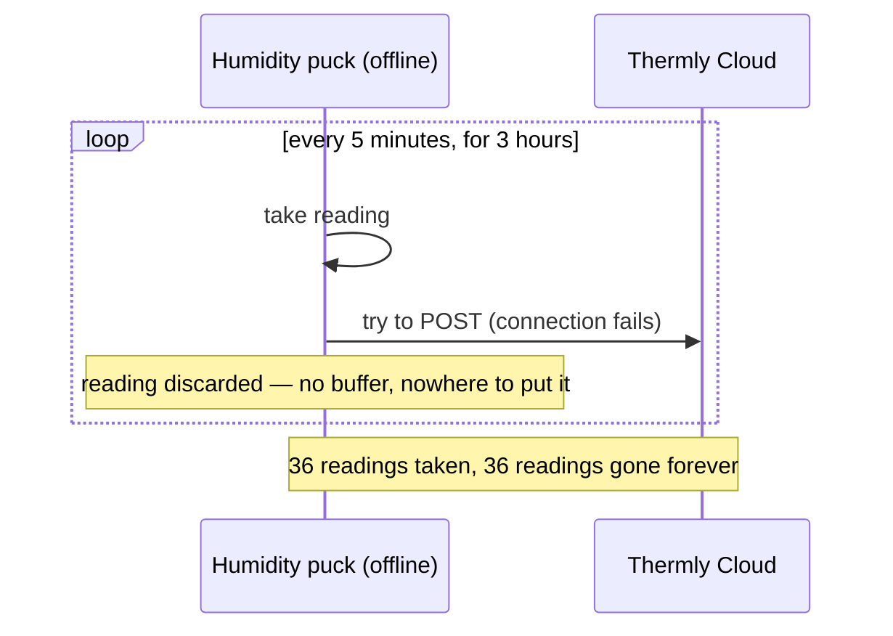

The fix, and the analogy for the rest of this story: give the device a **logbook**. Think of a hiker heading into the mountains where there's no cell signal — the hiker doesn't stop taking notes just because there's no bar of signal; they write everything down in a paper notebook, and mail it all in once they're back in range. This is **store-and-forward buffering**: when connectivity is down, the device writes the reading to a small local buffer instead of discarding it, and sends the backlog once connectivity returns.

**New problem, immediately:** once the puck reconnects after 3 hours offline, it has 36 buffered readings sitting in its logbook. The naive way to send them is to POST each one separately, catching up one reading at a time — which means 36 back-to-back radio wake-ups and handshakes the instant signal returns. Data loss is fixed. Battery drain is not — it's arguably worse, because now the device does 36 handshakes in a row instead of spreading them out.

**How I'd say this in an interview:** "The first thing to recognize in an IoT system is that the client is physical hardware with a battery, not software with infinite patience — so every design choice has to be justified against battery and bandwidth cost, not just compute cost. Buffering readings locally when offline — store-and-forward — is what stops connectivity gaps from silently destroying data; it has to be the default mode, not a special case."

---

## Chapter 2 — Mailing the whole logbook in one envelope

The fix: when the hiker gets back into town, they don't mail 36 individual postcards, one sentence each — they mail the **whole notebook page in one envelope**. Same idea for the puck: instead of draining the buffer one reading at a time, batch every buffered reading into **one** transmission, one handshake, one connection.

Worked number: those 36 readings from a 3-hour outage go out as a single batched, compressed upload — **1 radio wake-up instead of 36**, a 36x cut for that catch-up window alone. Even in the steady state with no outages, Thermly switches the upload schedule itself: instead of connecting every 5 minutes with 1 reading each (12 wake-ups/hour), the puck buffers locally and connects once an hour with 12 readings batched together — **12 wake-ups/hour becomes 1**.

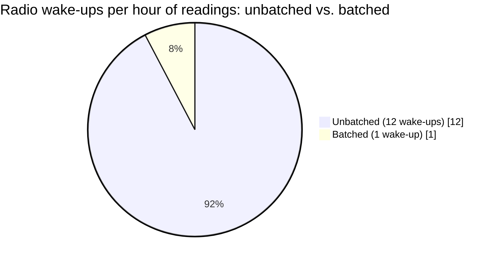

Redo the battery math with hourly batching: the same 1.8-second handshake overhead now gets paid once per 12 readings instead of once per 1. Battery life estimate jumps from 51 days to roughly **550 days** `[illustrative]` — a huge win, but still short of the 730-day target on the box.

The obvious next question: *where did the rest of the gap go, if batching was supposed to be the big lever?* Because the handshake overhead itself never went away — it's just amortized over more data now. Every single hourly connection still pays that same ~1.8 seconds of TCP + TLS handshake, whether it's carrying 1 reading or 12. Batching won the biggest, cheapest fix; the handshake cost itself is the next thing standing between the puck and its 2-year promise.

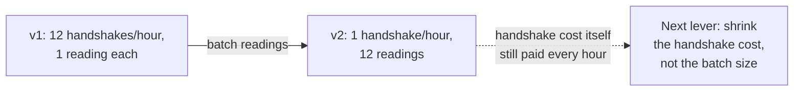

**How I'd say this in an interview:** "Batching every buffered reading into one transmission on reconnect is the single highest-leverage fix for battery life, because radio wake-up and handshake overhead — not payload size — dominates a low-power device's energy budget. But batching amortizes the handshake cost over more data; it doesn't eliminate the handshake itself, and that's the next thing to attack."

---

## Chapter 3 — Leaving the walkie-talkie channel open

Thermly's engineers look closer at what's actually inside that 1.8-second handshake: a fresh HTTPS request means a new TCP handshake, then a full TLS handshake (certificate exchange, key negotiation), then HTTP headers — routinely **500-800 bytes** of overhead `[illustrative]` — before a single byte of the actual reading batch goes anywhere. For an hourly batch of 12 readings at ~24 bytes each (about 300 bytes of real payload), the connection overhead is bigger than the data itself, and it's paid fresh, every single hour, because the connection is torn down after each POST.

The obvious question: *why tear the connection down at all, if we're just going to reopen it an hour later?* Because HTTPS-per-request is built for a browser talking to a server it may never talk to again — it was never designed for a device that reconnects to the same cloud endpoint, forever, for years.

The real fix is a protocol built for exactly this: **MQTT**. This isn't a Thermly invention — MQTT was designed in 1999 by Andy Stanford-Clark (IBM) and Arlen Nipper (Arcom) to monitor oil pipeline sensors over satellite links that were slow, expensive per byte, and unreliable — the identical problem Thermly is solving, decades earlier and in a harsher environment. MQTT keeps one lightweight, persistent connection open and lets the device just "publish" small messages on it; a documented MQTT PUBLISH can carry as little as **2 bytes of fixed header** plus topic and payload — nothing like HTTP's hundreds of bytes of headers, because there's no handshake to redo.

**The analogy, extending the hiker's logbook:** think of MQTT as a **walkie-talkie channel held open**, instead of re-dialing a phone call every time you want to say one sentence. Dialing (the TLS handshake) is the expensive part; once the channel is open, pressing the button to talk (publishing a batch) is nearly free.

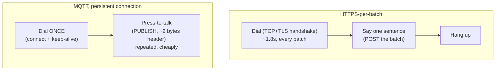

Thermly moves ingestion to an MQTT broker — the same shape as AWS IoT Core or Azure IoT Hub, both real, documented services built specifically to terminate millions of MQTT connections from field devices. Handshake cost is now paid once when the connection opens, not once per batch; publishing a batch on an already-open connection is a few bytes of overhead on top of the payload, not hundreds. Battery estimate climbs to roughly **700+ days** `[illustrative]` — close enough to the 2-year target that the remaining gap is sensing/compute power, not networking, and that's a hardware problem, not a protocol one.

**New problem:** a persistent connection is great — as long as the device is actually willing to stay connected. But some of Thermly's devices *duty-cycle* their radio entirely off for hours to save power (this is real, deliberate behavior for battery-constrained hardware, not a bug) — which means the "persistent" MQTT session isn't there when the radio wakes back up; the device has to reconnect from scratch anyway. And once it reconnects and dumps its buffered batch, each reading in that batch was time-stamped using the device's own onboard clock while it sat offline — a clock that, on cheap hardware, can't be trusted.

**How I'd say this in an interview:** "MQTT trades HTTP's per-request handshake for one persistent, lightweight connection — that's the whole reason it exists, built in 1999 for sensors on slow satellite links, and it's why AWS IoT Core and Azure IoT Hub are both MQTT brokers under the hood. It fixes connection overhead. It doesn't fix what happens on a device whose radio is intentionally off for hours, and it doesn't fix the fact that the device's own clock might just be wrong."

---

## Chapter 4 — A stopwatch, not a wall clock

A batch of buffered readings comes in from a puck that just had its battery swapped by the homeowner. Every reading in that batch carries a timestamp the device itself generated — and the device's onboard real-time clock reset to **January 1, 2000** `[illustrative]` the moment the battery was pulled, because a cheap RTC chip has no backup power source of its own. Every reading in that batch gets logged as having happened 26 years in the past. The home's humidity graph now shows a flat impossible spike sitting in the year 2000, and the last real hour of data before the battery swap is nowhere to be found.

The obvious question: *why not just have the device sync its clock over the network before sending, like NTP does?* Because that's its own radio wake-up, its own cost, and it doesn't fully solve the problem anyway — between syncs, a cheap onboard clock can still drift by minutes per month `[illustrative]`, and a battery pull resets it instantly regardless of how recently it last synced.

The real fix: stop trusting the device's absolute clock at all. Each reading in a batch carries an **offset**, not a timestamp — "this reading happened 3,300 seconds before I hit send" — anchored to the batch's own send time, which the cloud stamps authoritatively the moment the batch actually arrives. **The analogy: a stopwatch, not a wall clock.** A stopwatch doesn't need to know what year it is to correctly record "this lap took 14 minutes" — it only needs to count backward from the moment you stopped it.

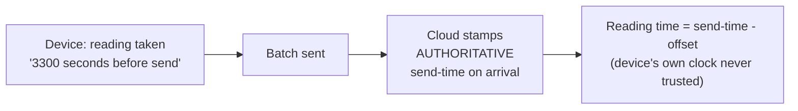

This is exactly the shape used in the reference guide's API design: `{"offsetSeconds": -3300, "value": 21.4}` per reading, with no absolute timestamp from the device anywhere in the payload. A device with a completely wrong wall-clock date can still report perfectly accurate *relative* timing, because it's the cloud's clock, not the device's, that anchors the batch.

**New problem:** the clock problem is solved for *when* a reading happened. But the buffer that's holding these readings while the device is offline has a hidden assumption baked into it: it has a fixed size. What happens when a device stays offline for far longer than anyone sized the buffer for?

**How I'd say this in an interview:** "Phones and servers have network-synced clocks you can just trust; a cheap embedded sensor often doesn't, and a battery pull can reset it entirely. The fix is relative timestamps anchored to the batch's own send time, stamped authoritatively by the cloud on arrival — that way the device never needs an accurate absolute clock at all, only the ability to count seconds backward from 'now.'"

---

## Chapter 5 — The logbook only has so many pages

Thermly sized the on-device buffer for a "worst realistic case" of 24 hours offline: 288 readings at 24 bytes each, about **7 KB** — trivially small for even constrained flash storage, per the reference guide's own capacity math. Then a real event breaks that assumption: a customer's home router dies while they're on a 4-day trip `[illustrative]`, and nobody's around to notice or fix it. The puck keeps taking a reading every 5 minutes the entire time — **1,152 readings** over 4 days — but the buffer only holds 288. Somewhere around reading #289, the buffer is completely full, and readings keep coming.

The obvious question: *what should happen now — silently overwrite, silently drop the newest ones, crash?* Silently doing any of those is the wrong answer, because "what data survives" is a real product decision, not an accident of running out of storage.

Thermly names the policy explicitly, the same way the hiker with a full notebook has to make a real choice: **tear out and rewrite over the oldest pages** (keep the most recent data, permanently lose the start of the gap), or **write smaller across the whole trip** — downsample, keeping only every Nth entry so there's *some* signal spanning the entire gap, just at lower resolution. Neither is universally right. For a consumer thermostat, "is my house cold *right now*" cares more about recency, so Thermly picks drop-oldest. An industrial customer with a compliance requirement to show *some* reading for every hour of a monitored period would want downsampling instead, even at reduced resolution.

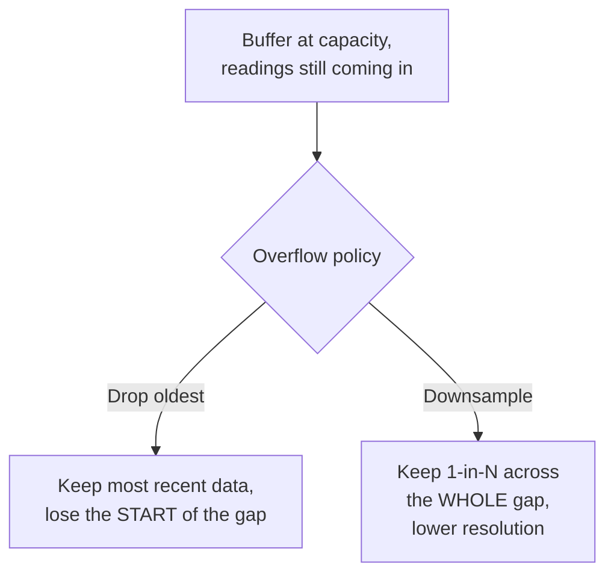

**A second, separate problem surfaces at the same time:** Thermly ships a firmware update that reboots the entire fleet overnight. If the buffer only ever lived in the device's volatile RAM, that reboot — a routine, planned event, not a failure — would wipe out every reading sitting unsent in every device's buffer at that moment, fleet-wide, simultaneously. The fix: persist the buffer to on-device flash storage, not RAM, so it survives a power cycle or a reboot, the exact same durability instinct as writing to disk before acking in any other queue-shaped system — the buffer's promise is only real if a restart can't silently erase it. The trade-off worth naming: flash has a finite number of write cycles before it wears out, so the buffer's write pattern has to be reasonably economical, not naive constant rewriting.

**How I'd say this in an interview:** "Store-and-forward isn't just 'buffer it locally' — two things have to be explicit, not accidental. First, the overflow policy for when the buffer fills: drop-oldest favors recency, downsampling favors some-signal-across-the-whole-gap, and the right one depends on the product. Second, the buffer has to be persisted to flash, not RAM, or a routine reboot wipes it out just as badly as a crash would."

---

## Chapter 6 — A diary organized by date, not a drawer of receipts

Zoom out to the cloud side. Thermly's ingestion pipeline, since day one, has written every corrected reading as a row in a regular Postgres table — `readings(id, device_id, value, timestamp)` — with a standard B-tree index on `device_id` and `timestamp`, because that's what every other service at the company already uses.

The fleet grows. By the time Thermly has **20,000,000** devices reporting every 5 minutes, that's 288 readings/device/day, or **5.76 billion rows fleet-wide, every single day** — the exact scale in the reference guide's own capacity estimate. At that insertion rate, a general-purpose relational table starts to strain in a specific way: every insert has to update the B-tree index, and as the index grows into the tens of billions of entries, page splits and index maintenance get slower — average write latency creeps from a few milliseconds into the hundreds `[illustrative]`. Worse, a dashboard query like "average temperature in this region over the last hour" — conceptually a simple range scan — instead has to dive through an index built for arbitrary point lookups, and what should be a sub-second query starts taking many seconds.

The obvious question: *why is a plain relational table specifically bad at this job, when it handles other high-volume tables fine elsewhere in the company?* Because relational databases are optimized for arbitrary reads and updates on any row, at any time. Telemetry data is almost never updated after it's written, and it's almost always queried by **time range**, for one device or a small set of them — a fundamentally different, much narrower access pattern than what a general B-tree is built for.

The fix: a **time-series-optimized store** — InfluxDB or TimescaleDB, both real, documented systems built for exactly this shape of data. TimescaleDB, specifically, is a Postgres extension that automatically partitions a table into time-range "chunks," so data is physically clustered by time and by device; a "last hour" query only ever has to touch the one or two recent chunks that could possibly contain it, instead of consulting an index spanning years of history.

**The analogy: a diary organized by date, not a drawer of unsorted receipts.** If every page is already written in date order, "what happened last Tuesday" doesn't need an index at all — you just turn to that page. A drawer of receipts needs you to sort through everything, or build and maintain an index, to answer the same question.

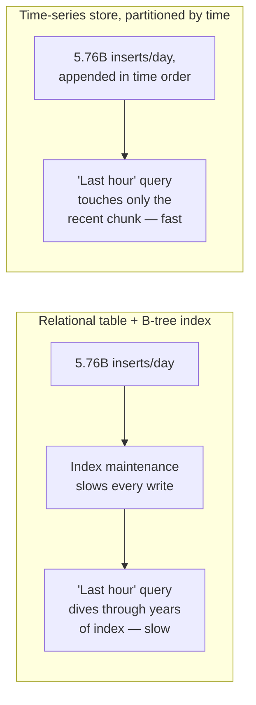

**New problem:** switching to a time-series store fixes write and query shape. It says nothing about *how long* to keep all of this. Numbers: 5.76 billion readings/day at ~24 bytes each is about **138 GB/day** of raw data — comfortably moderate day-to-day, but over a year that's roughly **50 terabytes**, most of which, a year in, is temperature readings nobody has queried in months, and that dashboards only ever look at in hourly or daily summaries anyway.

**How I'd say this in an interview:** "A general relational table is optimized for arbitrary row lookups and updates; telemetry is almost write-only and almost always queried by time range for one device — a narrower, more predictable access pattern that time-series databases like InfluxDB and TimescaleDB are purpose-built for, partitioning data by time so a recent-range query never has to touch old data at all."

---

## Chapter 7 — The old newspapers go on microfiche

Fifty terabytes a year of raw, full-resolution sensor data, kept forever, is expensive storage paying for resolution almost nobody uses. The obvious question: *does a dashboard querying "average humidity in this region over the last 6 months" actually need every 5-minute reading from 6 months ago?* No — at that time horizon, nobody's zooming in to the individual 5-minute reading; they want the trend.

The fix: **downsampling and rollups**. Keep raw, full 5-minute resolution for a recent window — say the last 30 days, where someone genuinely might want to zoom into a specific afternoon. Beyond that, progressively roll old data up into coarser aggregates: hourly averages for data 30-90 days old, daily averages beyond that. This is a real, documented pattern — InfluxDB's retention policies plus continuous queries, and TimescaleDB's continuous aggregates, both do exactly this automatically on a schedule.

**The analogy: an old newspaper archive.** This week's paper is kept in full. Last year's papers get compressed onto a microfiche summary — "here's what happened that month" — because nobody re-reads every page of a two-year-old newspaper; they want the headlines.

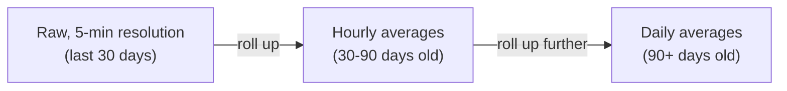

Worked number: rolling data older than 30 days from 288 points/day down to 24 hourly points/day is a **12x** reduction; rolling data older than a year down to 1 daily point is a **288x** reduction versus keeping every raw reading. Applied against the 50 TB/year raw estimate, a realistic multi-year retention footprint ends up a small fraction of what "keep everything at full resolution forever" would cost `[illustrative — the exact ratio depends on the specific rollup schedule chosen, but the direction and rough magnitude are real]`.

**New problem, and it's a subtle one:** a rollup is computed once, from the raw data available at that moment, and then the raw data behind it may eventually be deleted to reclaim space. If a reading was corrected using calibration curve `cal_v3` when it was ingested, and the rollup baked that corrected value in — but the device's calibration gets updated to `cal_v4` a month later because a drift problem was discovered — there's no way to retroactively fix a rollup whose raw inputs are already gone. Getting the calibration correction right *at ingestion time*, before data ever reaches a rollup, isn't optional; it's the only chance you get.

**How I'd say this in an interview:** "Keep raw resolution for a recent window where someone might actually zoom in, and progressively roll older data up into coarser aggregates — InfluxDB and TimescaleDB both automate exactly this. The catch is that a rollup is a one-way door: it's computed from whatever the raw data looked like at that moment, so if correction happens after the fact and the raw data is already gone, that rollup can never be fixed."

---

## Chapter 8 — The scale that slowly reads heavy

A totally different kind of problem shows up, and it has nothing to do with connectivity, batching, or storage. Thermly's field team places a freshly-calibrated reference humidity sensor in a room next to pucks that have been deployed for **18 months**, and finds those pucks are now reading **6% RH too high**, consistently, compared to the reference. This isn't a fluke on one unit — it's the whole batch from that manufacturing run.

The obvious question: *is this a software bug?* No. Swap the firmware, reboot the device, factory-reset it — the drift is still there, because it's physical: the sensing element itself (a capacitive humidity sensor, in this case) slowly changes its own electrical response as it ages and gets exposed to real-world temperature and humidity swings. Sensor datasheets for this class of part commonly specify an aging/drift tolerance over the product's lifetime `[illustrative — exact spec varies by part and manufacturer]` — this is a known, documented category of hardware behavior, not a coding mistake.

The fix: **periodic calibration correction**, computed against a trusted reference, applied server-side. Thermly's calibration service periodically compares a sample of deployed devices' recent readings against either a freshly-calibrated reference sensor placed alongside them, or a modeled expected drift curve for that hardware revision, and computes an updated correction curve — an offset and a slope, or something more complex if a straight line doesn't fit. That curve gets pushed to the device the next time it connects, tagged with a version like `cal_v4`; the device does nothing more than tag its future raw readings with that version number. The actual correction math — `correctedValue = rawValue - offset - slope * daysSinceCalibration`, or similar — runs in the cloud, where compute is cheap, not on the device, where every cycle costs battery for no benefit.

**The analogy: a kitchen scale that slowly reads heavy.** You don't re-machine the scale's spring every time it drifts. You put a known 500-gram reference weight on it, see it read 550 grams, and tape a note to the scale: "subtract 50 grams." Months later, when it's drifted further, you update the note. The scale itself never changes — only the correction note does, and the note lives separately from the measurement.

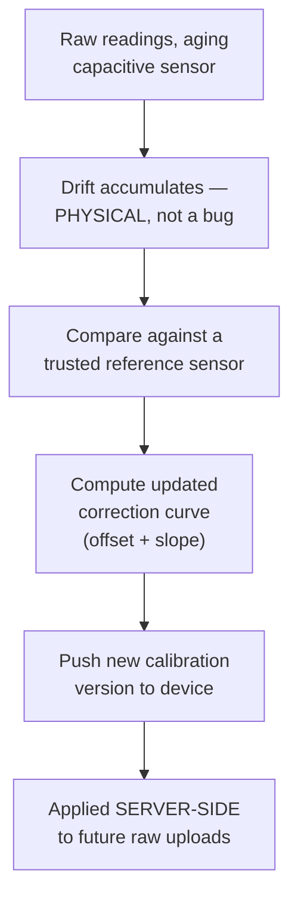

Because Chapter 4 already anchors each raw reading with a `calibrationVersionUsed` tag at ingestion — not "whatever the current curve happens to be" — the system always knows exactly which correction was applied to any given historical reading, the same discipline that made Chapter 7's rollups defensible instead of silently wrong.

**New problem, and it's genuinely recursive:** where does the "trusted reference" sensor's own accuracy come from — and what if *it* drifts too? If Thermly's reference sensors are never independently re-verified against some deeper ground truth, the entire fleet ends up calibrated against a slowly-wrong yardstick, and nobody would notice, because everything would still agree with everything else. The honest answer: reference sensors need their own periodic, independent verification — calibrating the calibrator is a real, recursive concern worth naming explicitly, not something that terminates cleanly on its own.

**How I'd say this in an interview:** "Drift is physical, not a bug — you don't fix it in code, you compute a periodically-updated correction curve against a trusted reference and apply it server-side, tagging each raw reading with exactly which calibration version corrected it. And it's worth saying out loud, unprompted, that the reference sensor itself needs independent verification too, or you're just calibrating the whole fleet against a wrong yardstick that agrees with itself."

---

## Chapter 9 — The mail carrier who flags the house with no answer

One morning, Thermly's on-call engineer gets paged: **"20,000 devices offline"** `[illustrative]`. Panic, for about ten minutes — until it becomes clear that most of those 20,000 are just homes where the router did its normal overnight reboot, and the pucks reconnected an hour later exactly as store-and-forward is designed to tolerate. The alert fired because nothing distinguishes "quiet for 40 minutes, completely normal" from "quiet for 40 days, something is actually wrong" — every device that's missed its last expected upload gets treated identically.

The obvious question: *how do you tell the difference between a device that's briefly offline and one that's gone for good — destroyed, lost, thrown in a drawer, battery dead permanently?* You track `lastSeenAt` per device and define explicit thresholds instead of one blanket "offline" flag: no upload for more than roughly 3x the expected reporting interval means "temporarily offline" — expected, tolerated, not alert-worthy. No upload for something like 30 days means "likely permanently disconnected" — flagged for investigation or decommissioning, because waiting indefinitely for a reconnection that may never come helps nobody.

**The analogy: a mail carrier noticing mail piling up.** Three days of mail piled at a house probably just means someone's on vacation — completely normal, not worth a knock on the door. Six months of mail piled up means something is actually wrong, and it's worth flagging. Quiet isn't inherently a problem; quiet for *too long* is.

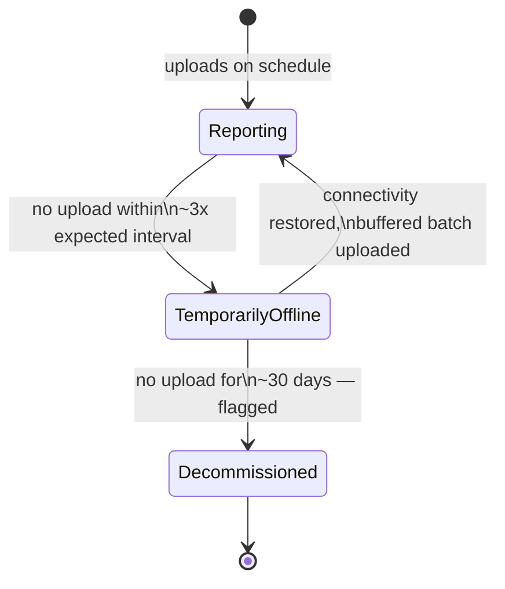

A separate, distinct problem hides right next to this one: a device that's very much online and uploading on schedule, but reporting a value like **-80°C indoors**, or **130% relative humidity** — physically impossible, not a gradual drift, a hardware fault. This isn't the drift-correction mechanism's job at all; drift is small and gradual, and "correcting" an obviously broken reading into a plausible-looking number would mean fabricating data that looks legitimate but isn't. The fix here is separate: **range/plausibility validation at ingestion**, which flags an implausible reading and keeps it out of aggregates, rather than trying to massage it into something that looks reasonable.

**How I'd say this in an interview:** "Fleet-health monitoring needs an explicit threshold, not a single 'online/offline' boolean — a device quiet for an hour is completely normal, one quiet for a month is a different category and needs a different response. And separately, an obviously impossible reading is a hardware fault, not a drift problem — you flag and exclude it, you never try to 'correct' it into something plausible, because that's fabricating data."

---

## Chapter 10 — The passport issued at the factory

With 20 million devices in the field, one last gap becomes obvious: what actually proves that a message claiming `deviceId: puck_881392` really came from that physical device, and not from anyone who simply typed that ID into a POST request? Nothing, currently — Thermly's API takes the device ID in the payload on faith. A compromised device, or a malicious actor who's simply guessed or scraped an ID, could inject fabricated readings under someone else's identity, corrupting their data or, worse, feeding false readings into an automated system (imagine a smart-thermostat product that auto-adjusts HVAC based on reported temperature).

The fix: **device authentication with a per-device credential provisioned at manufacture time** — a unique key or certificate baked into the device before it ever ships, the exact real, documented pattern both AWS IoT Core and Azure IoT Hub use: every device gets a unique X.509 certificate or key at provisioning, and the cloud checks it on every connection, not just the first one.

**The analogy: a passport issued at the factory.** Every device leaves the factory with its passport already stamped. The cloud checks that passport at the border every single time the device shows up — and the same check has to run in the *other* direction too: a calibration update pushed to the device (Chapter 8's `correctionCurve`) needs to be authenticated and signed as well, because a malicious or corrupted calibration push doesn't just corrupt one reading — it systematically poisons that device's *entire future data stream* from that point forward, which is a far worse blast radius than one bad message.

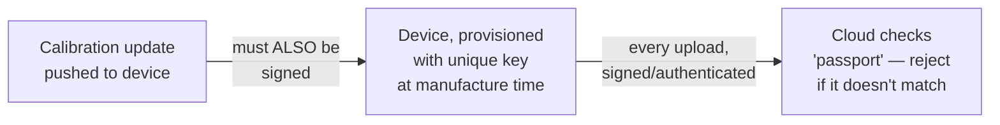

One more thing worth naming, not fixing: whether any of this data even needs strong privacy protection depends entirely on what's actually being sensed. A temperature or humidity reading is low-stakes — nobody's harmed if it leaks. The identical architecture, pointed at an occupancy sensor or a location tracker instead, would carry real privacy weight. The privacy bar isn't a property of the *pipeline*; it's a property of *what's flowing through it*, and it's worth saying that out loud rather than assuming every IoT product has the same stakes.

**How I'd say this in an interview:** "With millions of field devices, lightweight-but-real device authentication — a unique key or cert baked in at manufacture time, checked on every connection — is non-negotiable, the same pattern AWS IoT Core and Azure IoT Hub both use. And it has to run both directions: a calibration update pushed to a device needs to be authenticated too, because a bad calibration push doesn't just corrupt one reading, it corrupts everything that device reports from then on."

---

## Where the story actually lands

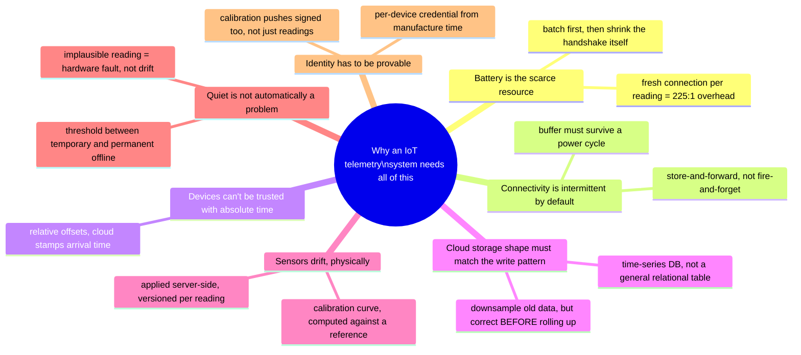

Every real IoT interview question sits somewhere on this chain. The skill isn't reciting all ten chapters — it's stopping where the stated requirements say to stop. A simple smart-plug telemetry system with generous connectivity might reasonably stop around Chapter 5. A device explicitly described as "battery-powered for years, offline for long stretches" has to reach the MQTT and buffering chapters. Anything where the interviewer says "what if the sensor's accuracy changes over time" is pointing straight at Chapter 8 — that's the confirmed real Lab126 follow-up, and walking there unprompted, correctly, is what separates this chapter from a generic streaming-ingestion answer.

---

## Grill me — adversarial follow-ups

**Q1: "Why not just tell customers to keep their battery-powered pucks plugged in — doesn't that make this whole battery discussion moot?"**
Because that defeats the entire product category — a humidity sensor for a crawlspace or shed specifically needs to work *without* a nearby outlet, or it wouldn't need a battery at all. The battery constraint isn't incidental to this design, it's the reason the product exists in that form factor, so it has to be treated as a hard constraint, not an inconvenience to work around later.

**Q2: "Isn't store-and-forward just a fancy word for 'retry with a local cache' — why does it need its own name?"**
Because a normal retry-with-cache assumes the cache is short-lived and the retry happens soon; here, "offline" can mean hours or days, the buffer has to survive a full power cycle, and there has to be an explicit, product-level decision about what happens when it fills up. Calling it store-and-forward signals that offline is the *expected steady state* for this device class, not a rare hiccup you retry through.

**Q3: "Walk me through what happens if the cloud pushes a new calibration curve, but the device never reconnects to receive it."**
Then that device keeps tagging its raw readings with its old calibration version, and every reading it uploads continues being corrected using the old, known-to-be-drifting curve — which is fine, actually, because `calibrationVersionUsed` is stored per reading, so nothing is silently wrong; the readings are just consistently corrected with whatever was current for that device at that time, and the moment it does reconnect, it picks up the new version going forward.

**Q4: "You said minimize wake-ups before minimizing bytes — give me a case where that's actually the wrong call."**
If a device has abundant power (plugged into wall power, like Thermly's original thermostat) but is on a metered, pay-per-byte cellular connection, minimizing bytes transmitted matters more than minimizing wake-ups, because the cost that's actually scarce flipped from battery to data charges. The general principle is "optimize for whichever resource is actually scarce for this specific device," and battery just happens to be the scarce one for most of this chapter's devices.

**Q5: "Why compute the calibration correction in the cloud instead of just shipping the corrected formula to the device once and letting it self-correct?"**
Because running that correction computation costs the device power for literally zero benefit — the cloud can do that arithmetic just as well, and the device's only job is reporting a raw value plus a tiny calibration-version tag. Pushing work off the device onto the cloud, wherever the device doesn't strictly need to do it itself, is the same underlying principle behind batching and MQTT — the device does the minimum, the cloud absorbs the rest.

**Q6: "Doesn't downsampling old data just mean you're quietly destroying evidence you might need later?"**
Yes, and that's exactly why it has to be a stated, deliberate trade-off with a defined retention window, not a silent background job — you're trading storage cost against the ability to ever zoom into a specific 5-minute reading from two years ago. If a specific product genuinely needs long-term full-resolution retention (a regulated industrial sensor, say), that's a real requirement to surface up front, before picking a rollup schedule that would make it impossible later.

**Q7: "What actually stops a compromised device from just re-sending an old, previously-accepted batch to inflate its own history?"**
Device authentication alone doesn't stop that — a legitimately-authenticated device replaying its own old batch is a separate problem from identity spoofing, and it's why ingestion needs idempotency on something like a batch ID or sequence number, so a re-sent batch is recognized and deduplicated rather than double-counted. It's worth naming this as a distinct concern from the passport/certificate check, the same way "who are you" and "have I already processed this exact message" are always two separate questions.

**Q8: "If the buffer overflow policy is 'drop oldest' by default, doesn't that mean a really long outage just permanently erases the start of the gap with zero visibility?"**
It shouldn't erase it silently — the device should report, in its next successful batch, how many readings were dropped and over what window, so the gap shows up as a visible, explained hole in the data rather than looking like the sensor just quietly stopped working for a while. The policy decision (drop-oldest vs. downsample) is about which *data* survives; it's a separate decision to also make the fact that data was lost visible.

**Q9: "This whole chapter assumes one device, one owner. What changes if it's an industrial deployment with thousands of sensors on one factory floor?"**
The core mechanisms don't change — store-and-forward, batching, MQTT, drift correction all still apply — but the aggregation point does: a factory floor can afford a local gateway that many sensors connect to over a cheap short-range radio, and that gateway does the batching/MQTT talk to the cloud on their behalf, which is real edge-aggregation architecture. That shifts some of the buffering and protocol-overhead problem off each tiny sensor entirely, onto one gateway device with a real power supply.

**Q10: "Given this whole story, if someone says 'design an IoT telemetry system' cold, where do you actually start?"**
Ask the two things that decide almost everything downstream: how constrained is the device's power budget — years on a battery, or plugged in — and how long can it realistically be offline. Those two answers tell you immediately whether store-and-forward and MQTT are load-bearing requirements or nice-to-haves, and then walk forward only as far as the stated requirements demand — drift correction and downsampling are things you earn by the interviewer caring about long-term accuracy or storage cost, not defaults you bolt on for their own sake.

---

## Cheat sheet — one line per stop on the story

- **Fresh connection per reading**: connection setup, not payload size, dominates a low-power device's energy cost — a 225:1 overhead-to-payload ratio is what actually kills a "2-year battery" promise in weeks.
- **Store-and-forward buffering**: intermittent connectivity is the normal operating mode for this device class, not a failure case — buffer locally when offline (the hiker's logbook), never discard.
- **Batching**: mail the whole buffered logbook in one envelope on reconnect, not one postcard per reading — the single highest-leverage lever for battery life.
- **MQTT**: a persistent, lightweight connection (the walkie-talkie channel held open) replaces HTTP's per-request handshake — built in 1999 for exactly this problem, on oil-pipeline sensors over satellite links.
- **Relative timestamps**: anchor each reading to the batch's own send time (a stopwatch), not the device's own clock (a wall clock) — cheap onboard clocks drift or reset entirely on a battery pull.
- **Buffer overflow policy + flash persistence**: drop-oldest vs. downsample is a real product decision, not an accident of running out of space; and the buffer must survive a power cycle or its durability promise is hollow.
- **Time-series database**: telemetry is write-heavy and queried by time range, not arbitrary lookups — a diary organized by date (InfluxDB/TimescaleDB), not a drawer of unsorted receipts (a general relational table).
- **Downsampling/rollups**: keep raw resolution for a recent window, compress older data into coarser aggregates (the newspaper archive on microfiche) — but correct for drift *before* rolling up, because a rollup can't be un-baked once its raw inputs are gone.
- **Drift & calibration**: sensor drift is physical, not a bug — correct it server-side with a periodically-updated curve (the scale with a correction note taped on) computed against a trusted reference that itself needs independent verification.
- **Fleet health thresholds**: quiet isn't a problem, quiet-for-too-long is (the mail carrier noticing months of unclaimed mail) — and an implausible reading is a hardware fault to flag, never a value to "correct" into something plausible.
- **Device identity**: a per-device credential provisioned at manufacture time (the passport) proves who sent a reading, checked in both directions — readings up, calibration updates down — because a poisoned calibration push corrupts a device's entire future data stream, not just one message.
- **The meta-lesson**: every fix in this story buys one property (data survival, battery life, connection efficiency, clock independence, on-device durability, query shape, storage cost, accuracy, fleet visibility, or trust) by spending effort somewhere else — say the trade in the same sentence you propose the fix.
