# Design a Distributed IoT Sensor Telemetry System — FAANG Interview Guide

> Source chapter type: hardware-adjacent distributed systems. Confirmed asked at **Amazon Lab126**
> ("design a temperature identification system with geographically distributed sensors"; "pick an
> IoT system you've seen on the market and design a clone"). Distinct from every other chapter in
> this course: the clients here are not phones or browsers with reliable connectivity and generous
> compute — they're **cheap, low-power, intermittently-connected devices** that can go offline for
> hours, have to conserve battery and bandwidth aggressively, and drift out of calibration over
> time in ways software alone can't fix.

## Mental model

Thousands to millions of physical sensors — temperature, humidity, motion, whatever the product
measures — each periodically produce a reading and need to get it to the cloud. Three problems
that don't show up anywhere else in this course, because every other chapter assumes a client with
reliable connectivity and negligible power constraints:

1. **Devices go offline routinely, not exceptionally.** A sensor loses WiFi, is in a dead zone, or
   is deliberately duty-cycled (radio off to save battery) for stretches of time. Readings taken
   while offline aren't lost — they're buffered on-device and sent later, in a batch, once
   connectivity returns. "Store-and-forward" is the normal operating mode, not a failure recovery
   path.
2. **Bandwidth and power are the scarce resources, not compute or storage on the server side.**
   Every byte transmitted and every radio wake-up costs real battery life on a device that might
   need to run for years on one charge. This flips the usual optimization target: the server side
   can afford to do more work specifically so the device can do less.
3. **Sensors drift.** A temperature sensor's readings slowly become less accurate over time due to
   component aging or environmental exposure — this isn't a bug to fix in code, it's a physical
   reality that needs a calibration/correction mechanism, and unlike almost everything else in
   this course, no amount of better distributed-systems design eliminates it; it can only be
   compensated for.

**The one sentence to say out loud:** *"The hard constraints here are physical, not just
architectural — intermittent connectivity is the normal case, bandwidth and battery are the
scarce resource to optimize for, and sensor drift is a real-world calibration problem no software
pattern alone solves."*

**The one picture to remember forever:**

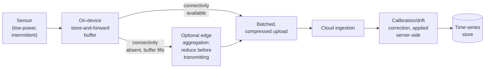

**Memory hook:** *"Buffer on-device when offline, batch and compress when connectivity returns,
correct for drift on the server where power is cheap — the device's job is to conserve, the
cloud's job is to compensate."*

---

## Table of contents
[How to Identify This Topic](#how-to-identify-this-topic-in-an-interview) ·
[Interview Playbook](#interview-playbook) · [Requirements](#requirements-clarification) ·
[Capacity Estimation](#capacity-estimation-worked) · [API Design](#api-design) ·
[High-Level Architecture](#high-level-architecture) ·
[Architecture Evolution v1→v2→v3](#architecture-evolution-v1--v2--v3) ·
[End-to-End Walkthroughs](#end-to-end-request-walkthroughs) ·
[Deep Dive: Store-and-Forward Buffering](#deep-dive-store-and-forward-buffering) ·
[Deep Dive: Edge vs. Cloud Aggregation](#deep-dive-edge-vs-cloud-aggregation) ·
[Deep Dive: Sensor Drift & Calibration](#deep-dive-sensor-drift--calibration) ·
[Deep Dive: Bandwidth/Battery-Constrained Protocol Design](#deep-dive-bandwidthbattery-constrained-protocol-design) ·
[Data Model](#data-model) · [Failure Modes](#failure-modes--mitigations) ·
[Non-Functional Walkthrough](#non-functional-walkthrough) ·
[Security & Compliance](#security--compliance) · [Cost & Trade-offs](#cost--trade-offs) ·
[Wrap-Up](#wrap-up-mvp-vs-stretch) · [Golden Rules](#golden-rules) ·
[Cheat Sheet](#master-cheat-sheet)

---

## How to identify this topic in an interview

- "Design an IoT telemetry/sensor system" or "pick an IoT product and design a clone of it" —
  confirmed as an actual Amazon Lab126 hardware-interview question.
- The tell that this is the hardware-adjacent chapter, not a normal streaming-ingestion chapter:
  the interviewer emphasizes **intermittent connectivity**, **battery/power constraints**, or
  **physical sensors** specifically — any of these signal that store-and-forward and power-aware
  protocol design, not just ingestion throughput, are the actual substance.
- A follow-up like "what if the sensor's readings become less accurate over time" is the
  [drift-and-calibration deep dive](#deep-dive-sensor-drift--calibration) — a mechanism this
  course has no equivalent of anywhere else, since every other chapter's "client" is software.

---

## Interview playbook

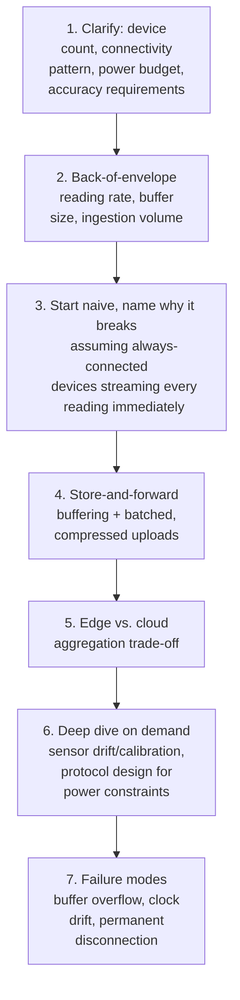

**What the interviewer is actually grading at each step:**
- Step 3: do you recognize, unprompted, that assuming reliable, continuous connectivity (the
  default assumption in every other chapter) is simply wrong for this domain, and that
  store-and-forward is the normal operating mode, not an edge case?
- Step 5: do you know *why* you might push aggregation to the edge (the device or a local gateway)
  rather than always shipping raw readings to the cloud — the battery/bandwidth cost of
  transmission, not the compute cost of aggregation, is the deciding factor?
- Step 6: do you recognize that sensor drift is a physical phenomenon requiring a calibration
  mechanism, not a data-quality bug to "just fix in the pipeline" — and can you propose a concrete
  correction approach (periodic recalibration against a trusted reference, or drift-rate modeling)?

---

## Requirements clarification

### Functional

| # | Requirement | Notes |
|---|---|---|
| F1 | Collect periodic sensor readings from a large fleet of distributed devices | The core telemetry function |
| F2 | Tolerate devices being offline for extended periods without losing their readings | Store-and-forward, not fire-and-forget |
| F3 | Correct for sensor drift/calibration error over a device's operating lifetime | A physical-world correctness requirement |
| F4 | Support querying aggregated/time-series data (e.g. "average temperature in region X over the last hour") | The eventual consumption pattern for the collected data |
| F5 | Detect and flag devices that have gone permanently offline or are reporting clearly invalid readings | Fleet-health monitoring, distinct from any single reading's correctness |

### Non-functional

| Requirement | Target | Why this number |
|---|---|---|
| On-device power budget | Minimize radio wake-ups and bytes transmitted, often targeting months-to-years of battery life | The dominant constraint this entire chapter is organized around |
| Store-and-forward buffer durability | Readings taken while offline must survive until the next successful upload | Losing buffered readings on a power cycle defeats the entire point of buffering |
| Ingestion durability | High — once a reading reaches the cloud, it should never be lost | Standard telemetry-pipeline durability bar |
| Calibration correction accuracy | Must meaningfully reduce drift-induced error over a device's lifetime, with the correction's own uncertainty bounded and known | An uncorrected or poorly-corrected sensor's data quietly becomes less trustworthy the longer it's deployed |
| Query latency for aggregated views | Seconds, for typical dashboard/analytics use cases | Standard time-series query expectation, not a real-time per-reading requirement |

**Clarifying questions worth asking the interviewer up front — and what each answer changes:**

| Question | If the answer is... | ...then this changes |
|---|---|---|
| "How constrained is the device's power budget — battery-powered for years, or plugged in?" | Battery-powered, years-long target | Confirms every design decision (transmission frequency, protocol overhead, on-device compute) must be justified against power cost — this isn't a nice-to-have optimization, it's the central constraint |
| "How long can a device realistically be offline, and how much local buffer capacity does it have?" | Hours to days offline is common; limited local flash storage | Directly sizes the store-and-forward buffer and its overflow policy |
| "Do individual raw readings need to reach the cloud, or is on-device/edge aggregation acceptable?" | Aggregation acceptable for most use cases | Confirms the edge-vs-cloud aggregation deep dive is in scope, trading some fidelity for a large bandwidth/power reduction |
| "Is sensor drift a known issue for this hardware, and is periodic physical recalibration feasible?" | Yes, drift is expected; physical recalibration is rare/expensive | Confirms a software-side drift-correction model is needed, since physical recalibration can't be relied on as the primary fix |

**Say this out loud in the interview:** *"I want to treat intermittent connectivity and battery
life as hard physical constraints shaping every decision, not implementation details to handle
later — this is the one chapter in this course where the client isn't reliable software, it's a
physical device with real power and connectivity limits."*

---

## Capacity estimation, worked

```
Given (illustrative, a smart-home temperature sensor product):
  Deployed devices                                   = 20,000,000
  Reading interval per device                          = every 5 minutes
  Readings/day, per device                               = 288
  Total readings/day, fleet-wide                          = 20,000,000 x 288 ~= 5.76 billion

Raw ingestion volume if every reading is sent individually, uncompressed:
  Bytes per reading (timestamp, deviceId, value,
    ~minimal metadata)                                    ~= 24 bytes
  Daily ingestion volume                                   = 5.76 billion x 24B ~= 138 GB/day
  -> a moderate number for the CLOUD side -- this is NOT the dominant cost in this system,
     unlike most other chapters in this course. The dominant cost is on the DEVICE side:
     transmitting even this modest volume individually, uncompressed, and without batching
     would mean radio wake-ups far more often than necessary, which is what actually drains
     battery.

Battery cost model (illustrative, order-of-magnitude):
  Radio wake-up + transmit cost dominates a low-power sensor's energy budget far more than
    the sensing/compute itself -- a device that wakes its radio every 5 minutes to send ONE
    24-byte reading spends most of its energy on radio overhead (connection setup, protocol
    handshake), not on the 24 bytes of payload itself.
  -> batching readings (e.g. send 12 readings, one hour's worth, in a single transmission
     every hour instead of 12 separate transmissions) cuts radio wake-ups by 12x for the SAME
     total data volume -- this is the single highest-leverage lever for battery life in this
     entire system, far more impactful than compressing the payload bytes themselves.

Store-and-forward buffer sizing:
  Illustrative worst-case offline duration                = 24 hours
  Readings buffered during that window, per device          = 288
  Buffer size needed, per device                             = 288 x 24B ~= ~7 KB
  -> trivially small per device, comfortably within even constrained on-device flash storage --
     the buffer SIZE is rarely the hard constraint; the harder design questions are overflow
     policy (what happens past 24h offline) and ensuring the buffer survives a power cycle.
```

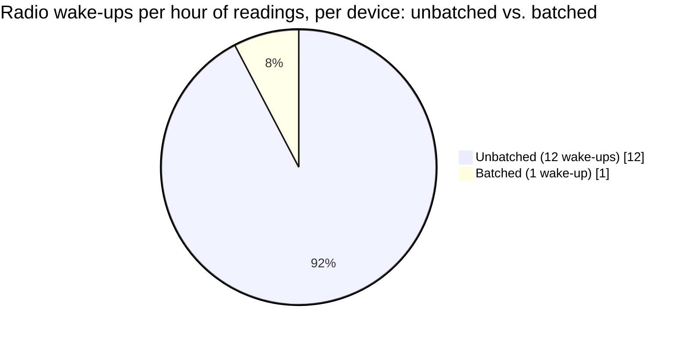

Same total data, 12x fewer radio wake-ups — the single highest-leverage lever for battery life
in this whole system.

**Redo-the-chain test:** if the reading interval tightens to every minute (5x more frequent), daily
ingestion volume scales to ~690GB/day and, more importantly, the battery cost of more frequent
radio wake-ups (even with batching) rises proportionally — a direct, computable trade-off between
data freshness and device battery life, the central tension of this whole chapter.

**The number worth memorizing:** batching readings into fewer, larger transmissions is the
single highest-leverage lever for device battery life — reducing radio wake-up count matters far
more than compressing individual payload bytes, because wake-up/connection overhead, not payload
size, dominates a low-power sensor's energy budget.

---

## API design

### Device-to-cloud: batched upload (device-initiated, on a schedule or when connectivity returns)

```json
{
  "deviceId": "sensor_881",
  "batch": [
    { "offsetSeconds": -3600, "value": 21.4 },
    { "offsetSeconds": -3300, "value": 21.6 },
    { "offsetSeconds": -3000, "value": 21.5 }
  ],
  "calibrationVersion": "cal_v3",
  "batteryLevel": 0.62
}
```

| Field | Notes |
|---|---|
| `offsetSeconds` | Relative to the batch's own send time, not an absolute timestamp per reading — devices often lack a reliable real-time clock, and relative offsets from a known send-time anchor avoid depending on clock accuracy the device itself can't guarantee (see the failure modes table) |
| `calibrationVersion` | Tells the cloud which correction curve to apply to these raw values — the mechanism behind the drift-correction deep dive |
| `batteryLevel` | Reported opportunistically, feeding fleet-health monitoring without requiring a dedicated round-trip |

### Cloud-to-device: calibration update (rare, pushed on the device's next connection)

```json
{ "calibrationVersion": "cal_v4", "correctionCurve": { "offset": 0.3, "slope": 0.002 } }
```

**The one sentence worth saying about the API surface:** *"Readings travel in batches with
relative timestamps, not individually with absolute ones — this single design choice is what lets
a device avoid depending on both frequent radio wake-ups and a reliable onboard clock, two things
that are expensive or unreliable on exactly this class of hardware."*

---

## High-level architecture

### Architecture evolution (v1 → v2 → v3)

**v1 — assume always-connected devices, stream every reading immediately:**

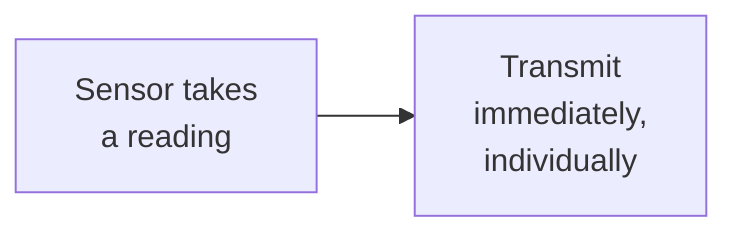

**Why it breaks:** per the capacity estimate, individual transmission means a radio wake-up per
reading — the dominant battery cost in this class of device — and the design has no answer at all
for what happens when the device is offline, which per the requirements is the normal, not
exceptional, operating condition.

**v2 — store-and-forward buffering added, but no batching or compression on upload:**

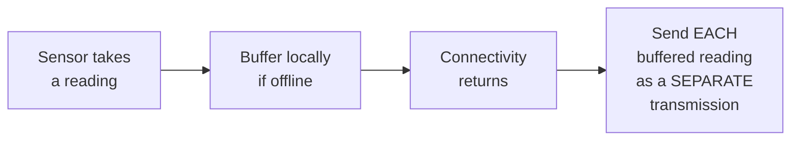

**Why it breaks:** store-and-forward (v2's real improvement) solves the data-loss problem during
offline periods. But sending each buffered reading as its own transmission once connectivity
returns still incurs a full radio wake-up per reading — a device that was offline for hours and
buffered dozens of readings would burn through the exact same per-reading transmission cost all at
once, missing the batching lever entirely.

**v3 — the real system: store-and-forward + batched, compressed upload + drift correction:**

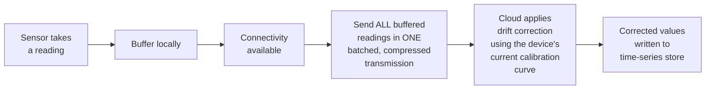

**What v3 fixes, one line each:** store-and-forward (already in v2) prevents data loss during
offline periods; batching every buffered reading into one transmission (rather than one per
reading) is what actually captures the battery savings established in the capacity estimate; and
applying drift correction server-side, where power is cheap and abundant, keeps the device's own
job as simple and low-power as possible.

---

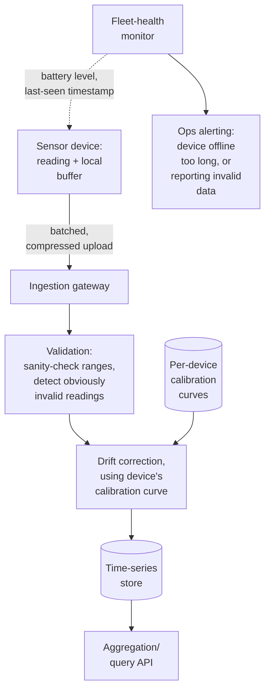

| Component | Role |
|---|---|
| On-device local buffer | Store-and-forward — the mechanism behind the buffering deep dive |
| Ingestion gateway | Receives batched uploads, the cloud-side entry point sized for moderate volume per the capacity estimate |
| Validation | Sanity-checks incoming readings against plausible physical ranges before they enter the time-series store — catches clearly-broken sensors early |
| Drift correction | Applies each device's current calibration curve — server-side, where compute is cheap, per the drift deep dive |
| Fleet-health monitor | Tracks last-seen timestamps and reported battery levels across the whole device fleet, distinct from any individual reading's correctness |

---

## End-to-end request walkthroughs

### Walkthrough 1 — a normal batched upload after a period offline

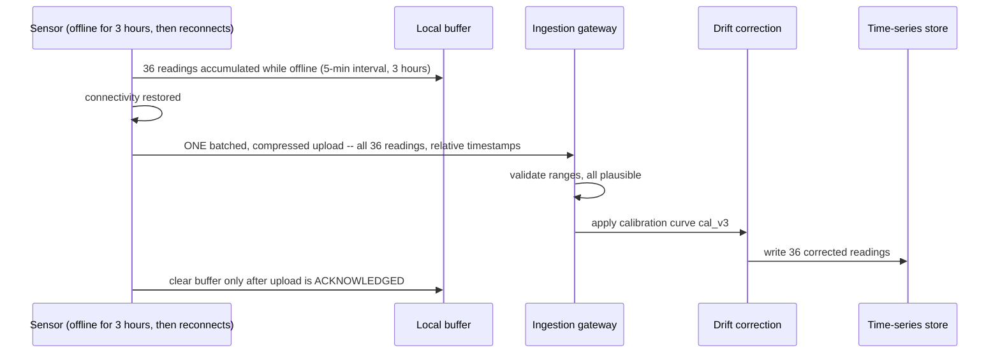

### Walkthrough 2 — a calibration update is pushed and applied

```mermaid
sequenceDiagram
    participant Ops as Calibration service (detects drift trend)
    participant Sensor as Sensor (next connection)
    participant Correction as Drift correction

    Ops->>Ops: analyze recent readings from this device, detect a drift pattern
    Ops->>Ops: compute updated correction curve, cal_v4
    Note over Sensor: sensor connects for its next scheduled upload
    Sensor->>Ops: upload batch, calibrationVersion=cal_v3 (device doesn't yet know about v4)
    Ops->>Sensor: response includes new calibrationVersion=cal_v4 + correctionCurve
    Sensor->>Sensor: store cal_v4 locally, tag FUTURE readings with it
    Note over Correction: readings already uploaded under cal_v3 are corrected using v3's curve;\nfuture readings will be tagged cal_v4 and corrected with the new curve
```

### Walkthrough 3 — buffer overflow during an extended offline period

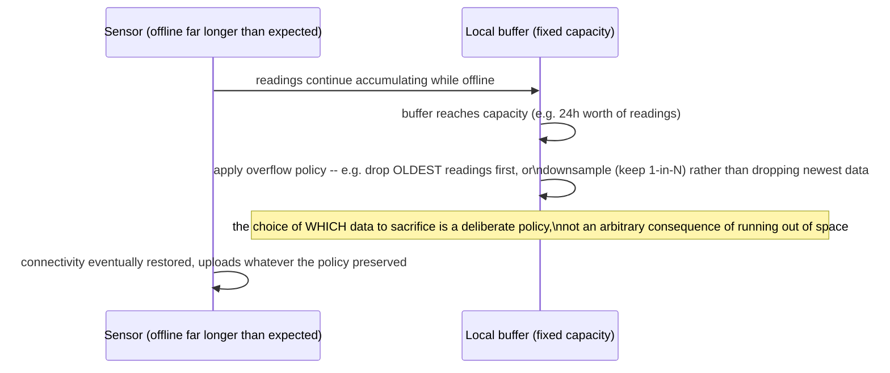

Walkthrough 3 is the concrete case behind the [buffering deep dive](#deep-dive-store-and-forward-buffering)'s
point that an overflow policy must be an explicit design decision, not an accident.

---

## Deep dive: store-and-forward buffering

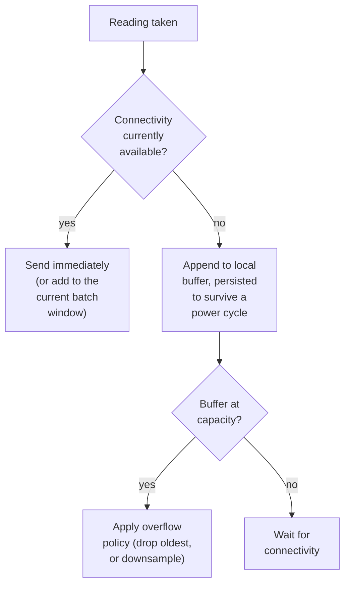

**Why the buffer must survive a power cycle, not just an app restart:** an IoT device can lose
power entirely (battery depletion, a hard reset) — if the buffer lives only in volatile memory,
every power interruption silently discards whatever was accumulated, defeating the purpose of
buffering in the first place. Persisting to on-device flash (even at some write-cycle cost) is
necessary for the buffer to actually deliver its durability promise.

**Why the overflow policy is a real design decision, not a footnote:** dropping the *oldest* data
first preserves the most recent, likely most-relevant readings, but permanently loses historical
data for that gap; downsampling (keeping every Nth reading) preserves some signal across the whole
gap at reduced resolution. Neither is universally correct — the right choice depends on whether
the product cares more about recency or about having *some* signal across the entire offline
period, and this should be stated as an explicit trade-off, not left implicit.

**Interview cheat-sheet:** *"Store-and-forward isn't just 'buffer it locally' — the buffer must
survive a power cycle to deliver on its durability promise, and the overflow policy for when the
buffer fills is a real product decision (recency vs. some-signal-across-the-whole-gap), not an
accident of running out of space."*

---

## Deep dive: edge vs. cloud aggregation

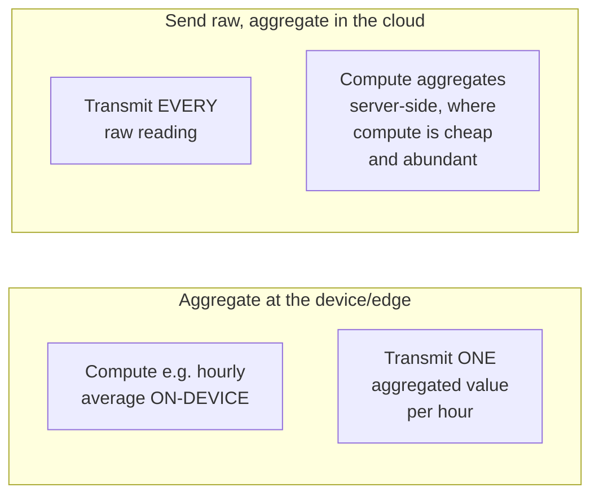

| | Aggregate at the edge | Aggregate in the cloud |
|---|---|---|
| Bandwidth/battery cost | Lower — fewer bytes transmitted | Higher — every raw reading travels |
| Raw-data fidelity | Lost — only the aggregate survives | Preserved — full resolution available for any future analysis |
| Where the trade-off is worth it | Power/bandwidth-constrained devices, well-understood use cases where the aggregate is genuinely sufficient | Devices with more headroom, or use cases where future, not-yet-known analysis might need raw resolution |

**Why this is a genuinely different trade-off than any "should we pre-aggregate" decision
elsewhere in this course:** in most other chapters, the cost of sending more raw data is a
storage/bandwidth *dollar* cost, and the decision is purely economic. Here, the cost is *battery
life on physical hardware that may be difficult or impossible to recharge/replace easily* — a
constraint with a much harder ceiling than "spend a bit more on cloud storage."

**Interview cheat-sheet:** *"The edge-vs-cloud aggregation trade-off here isn't primarily about
storage dollars, it's about device battery life — aggregating at the edge sacrifices raw-data
fidelity permanently in exchange for a real reduction in the scarcest resource in this whole
system, transmission cost."*

---

## Deep dive: sensor drift & calibration

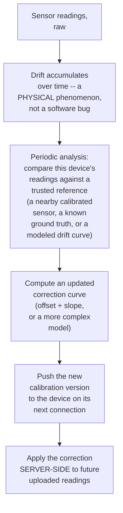

**Why correction is applied server-side, not by pushing corrected logic to run on-device:**
running the correction computation on the device costs power for no benefit — the device's raw
sensor value plus a small calibration-version tag is sufficient; the actual correction math runs
where compute is cheap (the cloud), consistent with the general principle of pushing work off the
device wherever the device doesn't strictly need to do it itself.

**Why this is a genuinely novel mechanism in this course, not a variant of anything already
covered:** every other "correctness" mechanism in this course (feature-store consistency,
train/serve skew, point-in-time joins) corrects for a *software* or *data-pipeline* discrepancy.
Drift correction compensates for a *physical* phenomenon — the sensor itself is measuring the
world slightly wrong, in a way that changes gradually and predictably enough to model, but that no
amount of better code alone eliminates.

**Interview cheat-sheet:** *"Drift is physical, not a bug — the fix is a periodically-updated
calibration curve, computed against a trusted reference, applied server-side to the device's raw
values. Running the correction on-device would cost power for a computation the cloud can do just
as well."*

---

## Deep dive: bandwidth/battery-constrained protocol design

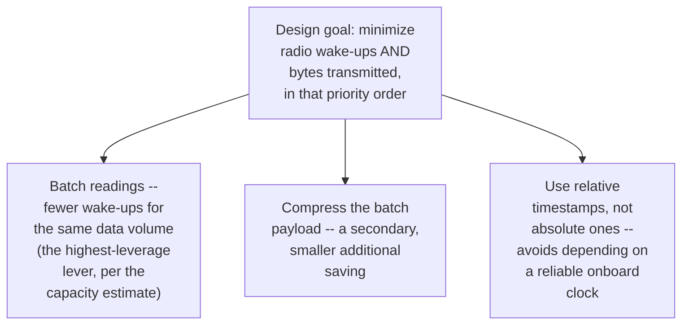

**Why "minimize wake-ups" ranks above "minimize bytes" as a priority, not the reverse:** per the
capacity estimate's battery cost model, connection setup/handshake overhead dominates a low-power
radio's energy cost far more than the marginal cost of a few extra transmitted bytes — a protocol
optimized purely for small payload size while still transmitting frequently misses the actual
lever that matters most.

**Why relative timestamps matter for a class of device many other chapters wouldn't need to think
about:** phones and servers have reliable, network-synchronized clocks; a cheap embedded sensor
often does not, and maintaining accurate absolute time on-device (via a real-time clock chip, or
periodic NTP-style sync) is itself a real cost — anchoring each batch's readings to relative
offsets from the batch's own send time avoids needing the device to maintain absolute time
accuracy at all.

**Interview cheat-sheet:** *"Prioritize minimizing radio wake-ups over minimizing payload bytes —
connection overhead dominates a low-power device's energy cost far more than a few extra bytes
does. And use relative, not absolute, timestamps, since this class of device often can't be
trusted to keep accurate real-time clocks."*

---

## Data model

**Device lifecycle:**

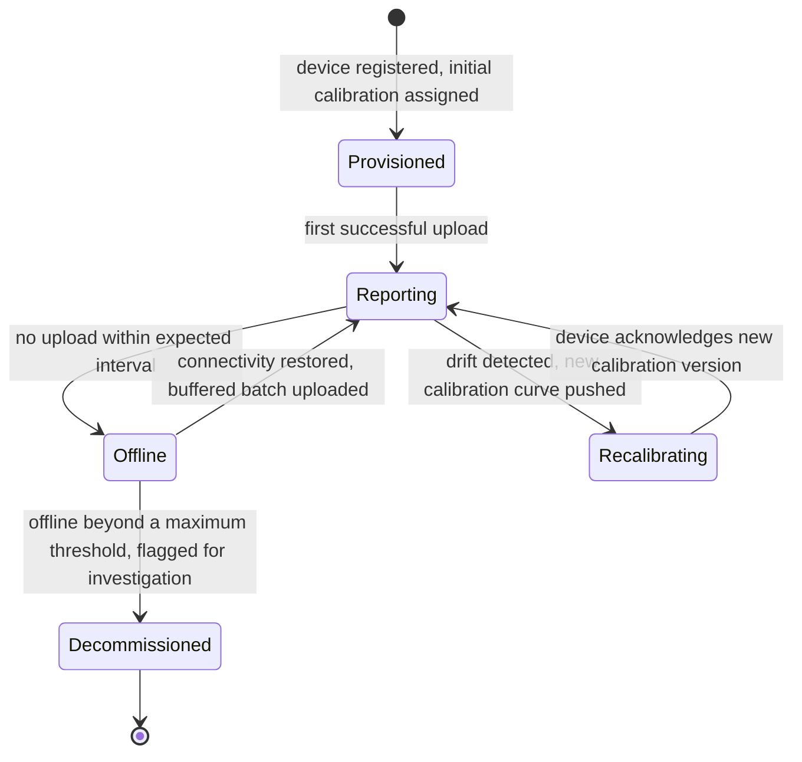

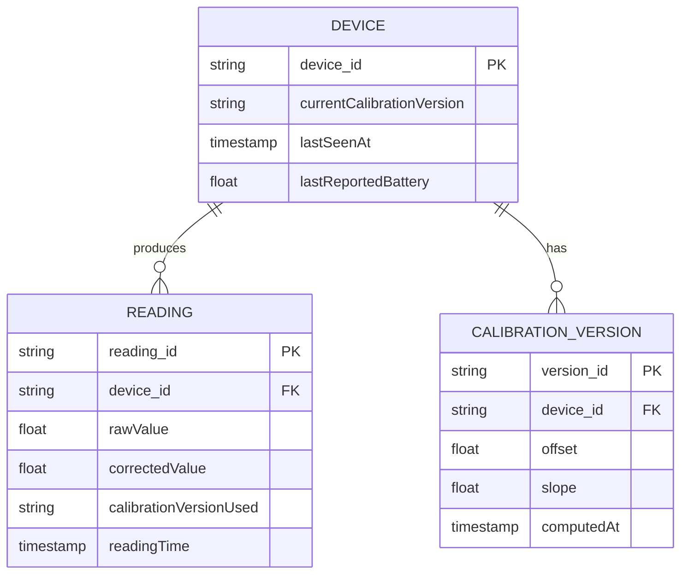

| Table | Storage choice & why |
|---|---|
| `Reading` | Time-series-optimized store, partitioned by device and time — high write volume (per the capacity estimate, billions/day fleet-wide) but each individual write is small and simple |
| `CalibrationVersion` | Low-volume, one new row per device per recalibration event, joined against readings at query/correction time via `calibrationVersionUsed` |
| `Device.lastSeenAt` | The field fleet-health monitoring watches to detect devices offline longer than expected |

---

## Failure modes & mitigations

| Failure mode | Impact | Mitigation |
|---|---|---|
| **Buffer fills during an extended offline period** | Readings would be lost without a defined policy | Explicit overflow policy (drop-oldest or downsample), per the buffering deep dive — a deliberate choice, not silent data loss |
| **Device's onboard clock is inaccurate or drifts** | Absolute timestamps on readings would be systematically wrong | Relative-offset timestamps anchored to batch send time, avoiding dependence on onboard clock accuracy entirely |
| **A device is permanently disconnected** (destroyed, lost, out of battery for good) | Would otherwise remain indefinitely in "temporarily offline" status | A maximum offline threshold flags the device for investigation/decommissioning rather than waiting forever for a reconnection that will never come |
| **Drift correction curve is computed from a bad reference** (the "trusted" reference sensor is itself miscalibrated) | Every device corrected against it inherits the error | Reference sensors/ground-truth sources need their own independent, periodic verification — a calibration system's own calibration is a real, recursive concern worth naming explicitly |
| **A sensor reports a physically implausible reading** (a hardware fault, not drift) | Could corrupt aggregates if treated as valid data | Range/plausibility validation at ingestion, distinct from drift correction — an implausible reading should be flagged, not "corrected" into a plausible-looking but fabricated value |

---

## Non-functional walkthrough

**Scaling ingestion is a standard time-series-write scaling problem** — per the capacity estimate,
moderate in absolute volume compared to this course's largest systems, sharded naturally by
device ID.

**Availability of the cloud ingestion path matters less than durability of the on-device buffer**
— a temporarily unavailable ingestion endpoint just means devices buffer a little longer, which the
whole system is already designed to tolerate; the real availability-adjacent risk is the buffer
itself failing to persist across a power cycle.

**Consistency of drift-corrected values depends on knowing exactly which calibration version was
active for each reading** — this is why `calibrationVersionUsed` is stored per reading rather than
always applying "the current" curve, the same "reproducible decision" discipline as the
audit-trail requirements elsewhere in this course, here applied to a physical correction instead
of a business decision.

---

## Security & compliance

- **Device authentication** — with potentially millions of low-power devices in the field,
  lightweight but real device identity/authentication (e.g. per-device keys provisioned at
  manufacture time) is essential; a compromised device shouldn't be able to inject fabricated
  readings under another device's identity.
- **Firmware/calibration update integrity** — calibration updates pushed to devices should be
  authenticated and, ideally, signed, since a malicious or corrupted calibration push could
  systematically corrupt a device's entire future data stream.
- **Physical/environmental data sensitivity varies by product** — a temperature sensor's data is
  usually low-sensitivity, but the same architecture applied to, say, occupancy or location
  sensors would inherit much higher privacy sensitivity — worth naming that the privacy bar
  depends on what's actually being sensed, not assumed uniformly low.

---

## Cost & trade-offs

**Batching interval trades data freshness against device battery life** — per the capacity
estimate, this is the single highest-leverage lever in the whole system, and the central,
explicit trade-off to name if asked to justify any specific batching cadence.

**Edge aggregation trades permanently-lost raw-data fidelity for a real, hard-to-substitute
reduction in transmission cost** — worth emphasizing that this is not primarily an economic
trade-off (as it would be in most other chapters) but a physical one, bounded by battery
chemistry and hardware constraints rather than a dollar budget.

---

## Wrap-up: MVP vs. stretch

**In scope for an MVP:**
- Store-and-forward buffering with persistence across power cycles and a defined overflow policy.
- Batched, relative-timestamped uploads on a fixed schedule.
- Basic server-side drift correction using a periodically-updated linear (offset + slope)
  calibration curve.

**Explicitly out of scope for an MVP:**
- Edge aggregation — start with raw-reading upload (preserves full fidelity, simpler), add edge
  aggregation once bandwidth/battery data confirms it's needed for specific device classes.
- Sophisticated non-linear drift modeling — start with a simple linear correction, move to a
  more complex model only if real drift patterns demonstrably don't fit a linear curve.

**Stretch goals, worth naming if asked "what's next":**
1. **Adaptive batching intervals**, tuned per device based on its observed connectivity pattern
   and remaining battery, rather than one fixed global interval.
2. **Edge aggregation for bandwidth-constrained deployments**, with an explicit fidelity/battery
   trade-off dial exposed to the product team.
3. **Cross-device drift-pattern learning**, using a fleet of similar devices' collective drift
   behavior to improve calibration curve predictions for a newly-deployed device before it has
   accumulated its own long history.

---

## Golden rules

- **Intermittent connectivity is the normal operating mode for this class of device, not a
  failure case** — store-and-forward buffering has to be a first-class design element, not
  exception handling.
- **Minimize radio wake-ups before minimizing payload bytes** — connection overhead, not payload
  size, dominates a low-power device's energy cost.
- **The buffer must survive a power cycle**, or its durability promise is hollow.
- **The overflow policy for a full buffer is a real product decision** (recency vs. some-signal-
  across-the-gap), never an accident of running out of space.
- **Sensor drift is a physical phenomenon requiring calibration, not a software bug to patch** —
  correct for it server-side, where compute is cheap, using a periodically-updated curve tied to
  a trusted reference.

---

## Master cheat sheet

**One-liners:**
- This is the one chapter in the course where the client is physical hardware with real power and
  connectivity constraints — every design decision should be justified against battery/bandwidth
  cost, not just compute/storage economics.
- Store-and-forward is the normal operating mode; batch every buffered reading into one
  transmission on reconnect, since radio wake-up/connection overhead, not payload size, dominates
  energy cost.
- Use relative timestamps anchored to batch send time — many devices in this class can't be
  trusted to keep an accurate absolute clock.
- Sensor drift is physical, not a bug — correct for it server-side with a periodically-updated
  calibration curve computed against a trusted reference.
- The edge-vs-cloud aggregation trade-off here is about battery life, not storage dollars — a
  meaningfully different economic shape than similar-sounding trade-offs elsewhere in this course.

**Formula chain:**
```
buffer_size_needed   = max_expected_offline_duration x readings_per_unit_time x bytes_per_reading
wake_up_reduction      = readings_per_batch   [batching N readings cuts wake-ups by ~N x]
```

**Numbers:** connection/wake-up overhead typically dominates a low-power sensor's energy budget
far more than payload size — batching is the highest-leverage lever, often cutting radio wake-ups
by an order of magnitude or more for the same total data volume · per-device store-and-forward
buffers are typically tiny (single-digit KB) even for a full day offline, so buffer size is rarely
the binding constraint — the overflow policy and power cost are.
