# Design a Shared Internal Client SDK Distribution System — The Story (narrative edition)

> **What this file is.** The reference file, `72-Design-a-Shared-Internal-Client-SDK-Distribution-System-FAANG-Guide.md`, is the one to recite from — requirements, API shapes, every trade-off table, the master cheat sheet. This file is a second way in: the same material as one continuous story, told in plain language. Engineers at a company keep hitting a wall, patch it, and the patch itself creates the next wall — until we land on the exact same design the reference file documents. The company, **Anvilworks** (an internal-tooling org inside a mid-size tech company), is fictional. But every wall it hits is something real: the reported Netflix internal-tooling interview question this whole chapter is sourced from ("should we own client libraries, or let teams build their own?"), semantic versioning's real documented spec (semver.org), the real 2016 `left-pad` npm incident (one tiny package's removal broke thousands of downstream builds), Google and Meta's real, documented monorepo-vs-polyrepo trade-offs, and private package registries like npm and Artifactory. I'll say clearly, every time, whether something is a documented fact or a reasonable guess tagged `[illustrative]`.

**The trigger phrase** for this whole topic: *"design a shared client library that hundreds of internal teams embed into their own services."* Keep one sentence in your head as you read: **the system being designed here is the library itself, living inside code you don't control the release schedule of — which means the real problems are versioning, backward compatibility, and getting visibility into a fleet you don't operate.** Everything below is just this one idea, getting harder in small, honest steps.

---

## Chapter 1 — The auth call that got copy-pasted forty different ways

Anvilworks is a mid-size company with about 40 internal engineering teams. Every one of those teams needs to call the internal auth service to check "is this request from a logged-in, authorized user?" There's no shared library for it — just a wiki page with a spec: "POST to `/auth/verify`, send a token, expect back a JSON blob with `userId` and `roles`." Each team writes their own client code against that spec, in whatever language their service happens to use.

This is exactly the setup behind a reported real Netflix internal-tooling interview question: should the org build and own a shared client SDK for something like event logging, or just publish a spec and let each team build their own? Anvilworks, in year one, chose "publish a spec" — mostly by default, because nobody explicitly decided anything.

Eighteen months in, the auth team ships what looks like a small change: they rename a field in the response, from `roles` to `permissions`, and add a new required `tokenVersion` field to every request. They test it against their own service. It works. They ship it.

The next morning: **out of the 40 teams calling this endpoint, 23 break — but not the same way.** Team A's client code does `response.roles`, gets `undefined`, and treats every user as having zero permissions — a silent authorization failure, not a crash. Team B's client throws an unhandled exception on the missing field and 500s outright. Team C, it turns out, had already defensively coded around "what if this field is missing someday" two years ago and doesn't notice anything. Seventeen other teams are each running some slightly different flavor of "mostly fine" or "subtly broken." Nobody can even give a clean answer to "how many teams are affected" for the first two hours, because there's no single place that knows how every team's code actually reads the response.

The obvious question: *why did the exact same backend change produce 23 different, inconsistent failures instead of one clean, predictable one?* Because there were never really 40 clients calling one API — there were **40 independent reimplementations** of the same client logic, each with its own bugs, its own defensive coding (or lack of it), and its own blind spots. A single backend change can't be tested against "the client" because there is no single client to test against.

**The fix, and the analogy for the rest of this story:** give every team the exact same **recipe card** instead of asking 40 different chefs to remember the recipe from memory and write their own version of it. This is the **shared SDK**: one official, versioned client library that every team imports and calls, instead of hand-rolling their own HTTP call. Anvilworks builds `anvil-auth-sdk`, publishes it to their internal package registry (a private registry, the same category of thing as npm's private-package feature or JFrog Artifactory — both real, documented systems companies use exactly this way), and asks teams to adopt it.

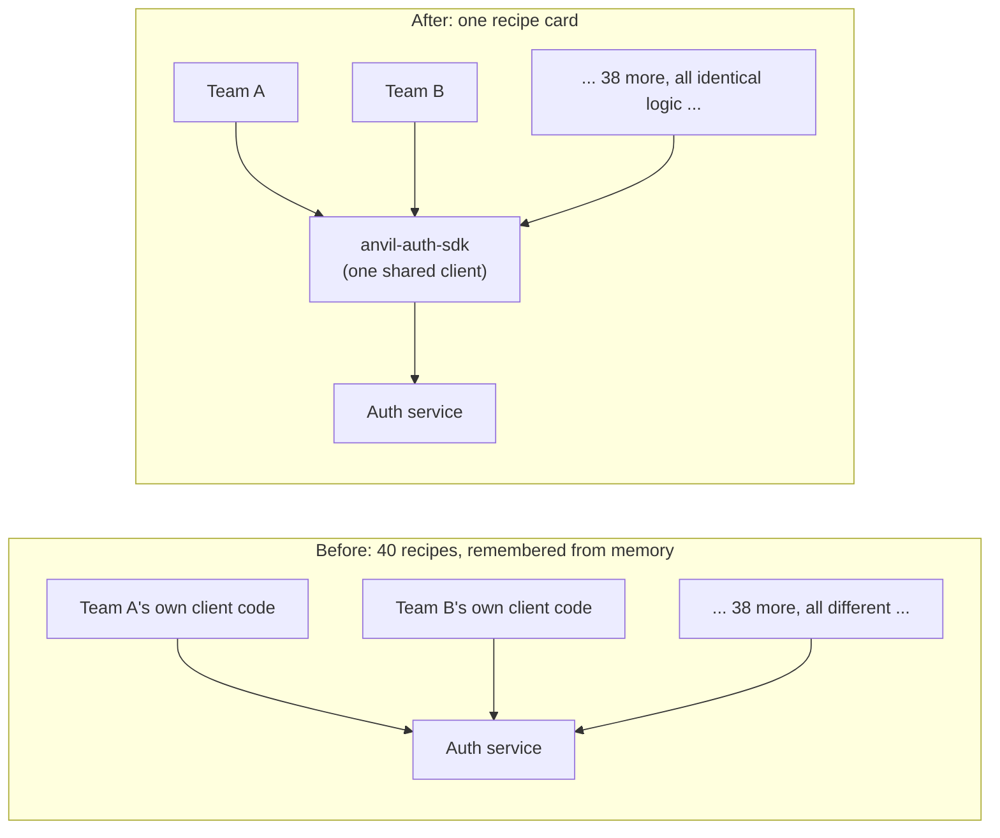

**New problem, visible within the first month:** the SDK is published. Great. But Anvilworks quickly realizes something that never came up when everyone had their own code: **they cannot make any team actually start using it, and even the teams who do adopt it are running the SDK compiled into their own service, on their own deploy schedule.** Publishing a fix to the recipe card doesn't retroactively fix anyone's kitchen.

**How I'd say this in an interview:** "The root problem here isn't a backend bug — it's that 40 teams each hand-wrote the same client logic, so one backend change broke 23 of them in 23 different ways. The fix is a shared SDK, one recipe card instead of 40 memories of the recipe. But the moment you ship that SDK into other teams' own services, you've created a whole new category of problem: you don't control when — or if — anyone actually adopts it."

---

## Chapter 2 — The boat that already sailed

Six months after `anvil-auth-sdk` v1.0 ships, Anvilworks wants to add a feature: token refresh logic, baked into the SDK so no team has to hand-roll it. They release v1.1. Adoption looks great on paper — it's just a dependency-version bump.

Except: **the SDK isn't a website you deploy once for everyone.** It's compiled directly into 40 (soon to be many more) independently-owned services, each with its own release cadence, its own testing process, its own backlog priorities. Anvilworks cannot SSH into Team B's service and swap out the SDK version. Team B pulls the new version whenever *they* decide to run `npm update` (or the equivalent) and redeploy — not when Anvilworks wants them to.

**The analogy:** once a boat leaves port, you can't climb aboard mid-voyage and swap its engine. You can build a better engine and put it on the dock, but every boat still out on the water keeps running whatever engine it left with, until it comes back in for its own scheduled maintenance — on its own timeline, not the dock's.

Anvilworks, now at 600 internal teams/services embedding the SDK company-wide `[illustrative — round number for a mid-size-to-large org]`, tracks a realistic adoption curve after a new major SDK version ships:

```
Within 1 month   : ~15% of teams upgraded
Within 6 months  : ~60% of teams upgraded
Within 12 months : ~85% of teams upgraded
Beyond 12 months : ~15% remaining — a long tail that may not
                    fully upgrade until something else forces it
                    (e.g. an unrelated dependency bump)
```

**A full year after a release, roughly 1 in 7 teams still hasn't upgraded** `[illustrative — a stand-in for "adoption tails run long," not a specific measured figure]`. This is the number that kills the assumption "just support the latest SDK version" — a full year out, there's still a real, non-trivial slice of the fleet on something older, and it stays that way indefinitely, not just during some initial rollout window.

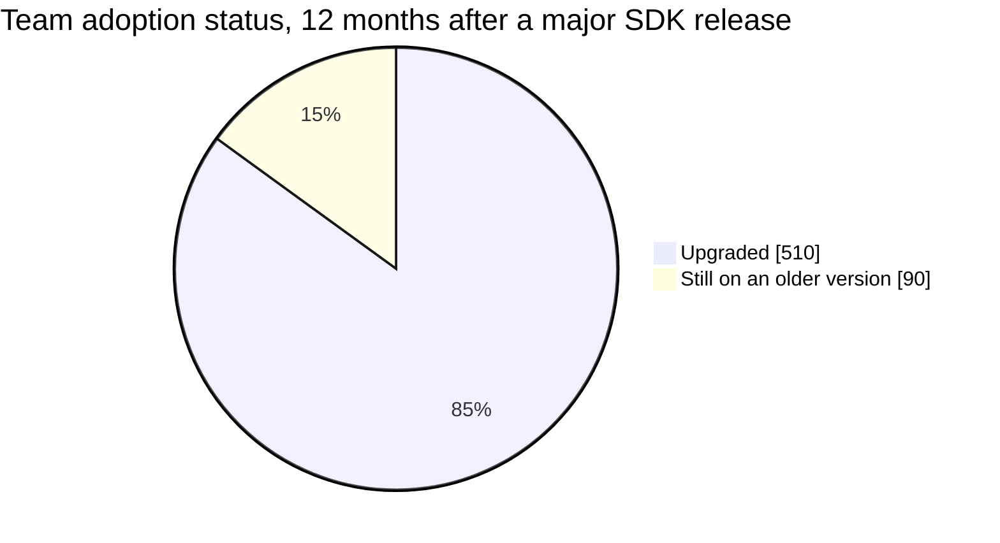

The obvious next question: *so what happens to the auth backend when a team calls it using an SDK version from over a year ago?* Right now — nothing good. The backend was built assuming everyone calls it the current way.

**How I'd say this in an interview:** "An internal SDK is nothing like a mobile app you can force-update — it's compiled into someone else's service, and they redeploy on their own schedule, not yours. Real adoption curves leave a meaningful fraction of teams on an old version a full year or more after a release, and that's the permanent state to design for, not a temporary rollout hiccup."

---

## Chapter 3 — The backend that only understood today's language

Anvilworks' auth backend, as built, assumes every incoming request uses the *current* wire format — the JSON shape the newest SDK version sends. That assumption was invisible while everyone was on v1.0. It becomes very visible the moment v2.0 ships with a real breaking change: the `tokenVersion` field's meaning changes from "an integer" to "a string with a checksum suffix," to support a new security feature.

The backend team updates the parsing logic for the new format and deploys it — without keeping the old parsing path around, because "everyone's supposed to be on the new SDK by now anyway."

They're not. Per Chapter 2's adoption curve, at the moment v2.0 ships, a chunk of the 600 teams are still calling with v1.x's SDK, sending `tokenVersion` as a plain integer. The backend's new parser expects the string-with-checksum format, gets a bare integer instead, and — this is the dangerous part — doesn't crash. It just **silently misreads the field**, treating malformed input as a low, valid-looking token version and letting some requests through that should have been rejected, while spuriously rejecting others. Anvilworks doesn't find out from an alert; they find out three days later when a security review flags weird tokenVersion patterns in the audit logs.

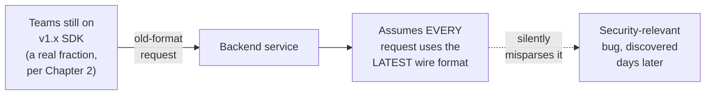

The obvious question: *how do we stop a new SDK version's release from silently corrupting how the backend understands old, still-legitimate traffic?* You don't get to assume "current version" anymore — the backend has to explicitly understand every version of the wire format that's still genuinely in use, at the same time, not just the newest one.

**The fix:** a **version-aware backend.** Every request the SDK sends carries a `schemaVersion` field — deliberately tracked *separately* from the SDK's own release number, because the wire format itself often stays stable across several SDK point releases, and only actually needs to change when the real data contract changes:

```json
{
  "sdkVersion": "2.1.0",
  "schemaVersion": "v2",
  "request": { "tokenVersion": "abc123:cksum", "...": "..." }
}
```

The backend keeps parsing logic for every `schemaVersion` within a stated support window (say, the last two schema versions), and dispatches to the right one based on that field — not based on any assumption about which version "should" be current.

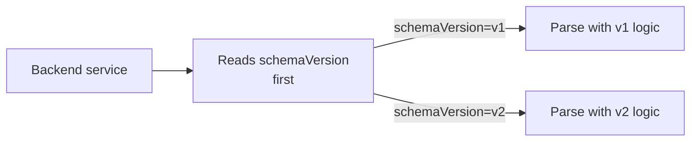

**New problem, immediately obvious to the backend team:** version-aware parsing fixes *breakage*. But now Anvilworks has zero systematic way to know **which teams are actually still sending `schemaVersion=v1`**, how many of them there are, or whether it's finally safe to drop v1 support and simplify the backend. Every "can we deprecate v1 yet" conversation is a guess.

**How I'd say this in an interview:** "The naive assumption — 'the backend only needs to understand the latest format' — breaks the instant a real fraction of the fleet is still on an older version, which per the adoption curve is always true. The fix is a version-aware backend that keeps parsing logic for every schema version inside a stated support window, driven by an explicit `schemaVersion` field, not the SDK's own release number."

---

## Chapter 4 — Flying blind about your own boats

Anvilworks' auth team wants to know: is it safe to drop `schemaVersion=v1` support yet? Nobody can answer. The auth team doesn't operate the 600 teams' services — they can't just query "their own" infrastructure for this, because it isn't theirs. It's genuinely, structurally different from every other backend Anvilworks has ever built, where the team running the backend can just look at their own logs to see who's calling and how.

**Extending the boat analogy from Chapter 2:** Anvilworks built the boats (the SDK) and sold them to 600 different captains (teams), but once a boat sails, Anvilworks has no radar on it. They genuinely don't know which boats are still using the old engine unless the boats themselves radio back in.

**The fix:** make every SDK instance **radio in.** On startup, and then on a periodic heartbeat, the SDK sends a small version-registration ping to a separate adoption-telemetry service:

```json
{ "serviceId": "checkout-service", "sdkVersion": "2.1.0", "language": "java", "lastSeenAt": "2026-07-24T18:00:00Z" }
```

An aggregation dashboard turns thousands of these pings into one actionable picture: which teams are on which version, and specifically who's approaching or past the edge of the support window.

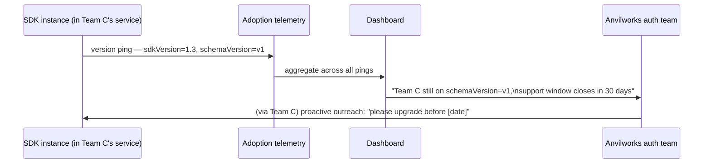

Now the auth team can see it: **90 out of 600 teams (15%) are still on `schemaVersion=v1`, a full 14 months after v2 shipped** — matching Chapter 2's adoption-tail number almost exactly, now with names attached instead of a guess. They send targeted outreach instead of flying blind.

**New problem:** telemetry answers "who's on what, right now." It says nothing about whether the *next* SDK change is about to quietly break someone the same way Chapter 3's bug did. Right now, whether a change is safe to ship is still just a judgment call by whoever's writing it.

**How I'd say this in an interview:** "This is a problem unique to this kind of system — a normal backend team can see every caller just by looking at their own logs, because they run the whole request path. An SDK team doesn't operate the services embedding their library, so the only way to know a team exists and what version it's on is if the SDK proactively reports it. That's what the version-registration ping and the aggregation dashboard are for."

---

## Chapter 5 — Testing the recipe against every kitchen still using the old one

Six weeks after standing up telemetry, the auth team is about to ship SDK v2.3 — an internal refactor, nothing user-facing they think. They manually review the diff, it looks additive, they ship it.

It isn't additive. Buried in the refactor, a helper function that used to tolerate a missing `roles` field (falling back to an empty list) now throws instead. Every service still on `schemaVersion=v1` — which, per Chapter 4's dashboard, they now know is a real, non-trivial 15% of the fleet — starts throwing on every auth check. This is the same shape of incident as the real 2016 `left-pad` npm outage: one small, seemingly-harmless change deep in a widely-depended-on package broke a large number of downstream consumers all at once, the moment they pulled it. Anvilworks catches theirs faster — telemetry means they know exactly which 90 teams to call — but it still shouldn't have shipped.

The obvious question: *how do we catch "this quietly breaks an old wire format" BEFORE it's published, instead of finding out from angry teams after?* Manual review missed it because "does this look additive" is a judgment call a human can get wrong on a big diff. What's needed is a check that doesn't rely on a human noticing.

**The fix:** an automated **compatibility test suite.** Before any SDK/backend change is published, replay real, recorded requests from every currently-supported wire-format version against the *proposed* new logic, and fail the build if any of them break.

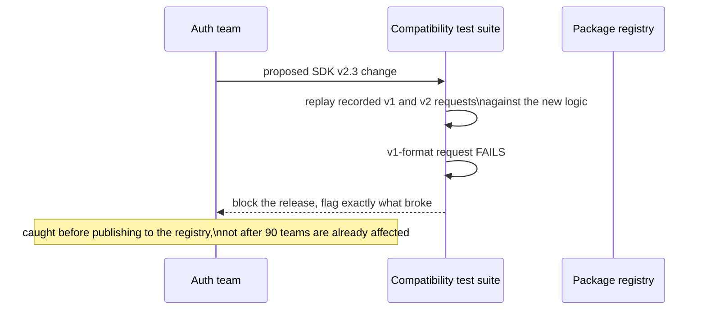

This is caught in CI, five minutes after the pull request opens, instead of three hours after publishing — the same order-of-magnitude difference between "roll back a package version" and "the left-pad incident already happened to your own org."

**New problem:** the test suite can tell you *whether* a specific change breaks something. It can't tell you, in general, *what kinds of changes are allowed to be shipped quietly* versus *which ones require warning everyone in advance.* Right now that's still ad hoc, per-change judgment — exactly what just failed with v2.3.

**How I'd say this in an interview:** "The `left-pad` incident is the real-world shape of this risk — a small change deep in a shared dependency broke a large number of downstream consumers simultaneously. The fix is automated compatibility testing: replay recorded requests from every supported wire-format version against any proposed change, and block the release if anything breaks, so you catch it before publishing, not after."

---

## Chapter 6 — The rule about what you're allowed to change quietly

Anvilworks needs a standing rule, not a case-by-case debate every time someone proposes a change. They adopt semantic versioning — semver, the real, documented convention (semver.org) used by npm, most language package managers, and effectively every widely-distributed library — and pair it with an explicit backward-compatibility policy.

**Extending the recipe-card analogy from Chapter 1:** think of it as the difference between adding a garnish and swapping the base ingredient. Adding an optional garnish (a new optional field, a new method nobody's forced to call) doesn't change the dish for anyone who doesn't ask for it — that's always safe, ship it as a minor or patch version. Swapping the base ingredient (removing a field, changing what an existing field means, changing a method's required behavior) changes the dish for *everyone already eating it* — that requires a new major version, with the *old* recipe still served, side by side, for a stated period of time.

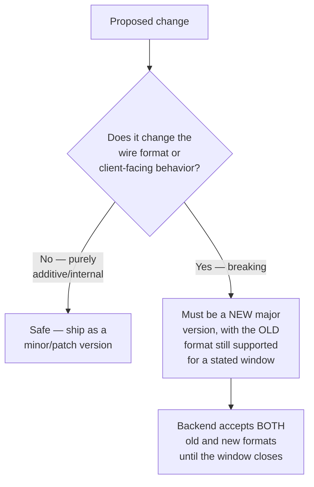

Anvilworks publishes the policy explicitly: **"the last 2 major versions are supported."** At their roughly twice-a-year major-release cadence, that means at any given moment the backend has to reliably handle at least 2-3 concurrently-live wire formats, plus occasional stray traffic from an even older, technically-unsupported long tail `[illustrative arithmetic, following directly from the release cadence and the stated window]`.

Why publish the number at all, instead of just supporting old versions "until it's inconvenient to keep doing so"? Because an unstated policy gives teams no real deadline to plan their own upgrade timing around, and gives Anvilworks no principled basis for ever sunsetting anything — an explicit window is a concrete, negotiable constraint instead of an open-ended obligation nobody agreed to.

**New problem:** the policy says *when the backend can stop supporting an old version.* It says nothing about *how hard Anvilworks is allowed to push* teams to actually move off it before that date — can they force it, or is it purely voluntary?

**How I'd say this in an interview:** "Default to additive-only changes within a major version — that's the garnish, always safe. Anything that changes existing behavior needs a new major version and an explicit, published compatibility window, tested with the replay suite from Chapter 5 before it ships — never an implicit, undefined support commitment."

---

## Chapter 7 — Asking nicely vs. sending movers to the door

Anvilworks' compatibility window for `schemaVersion=v1` is closing in 60 days. 90 teams are still on it. Someone on the auth team half-jokingly suggests: "what if we just add a build-time check that fails CI for anyone still importing the old SDK version?" That would force adoption *fast.*

**The analogy:** think of it like a landlord's two options at the end of a lease. One is to mail every remaining tenant a clear notice with a real move-out date and offer help with the move — that's **opt-in with a deadline.** The other is sending movers to physically carry people's furniture onto the sidewalk today, no warning — that's **forced**, and it's rare, high-friction, and only justified when waiting genuinely isn't safe.

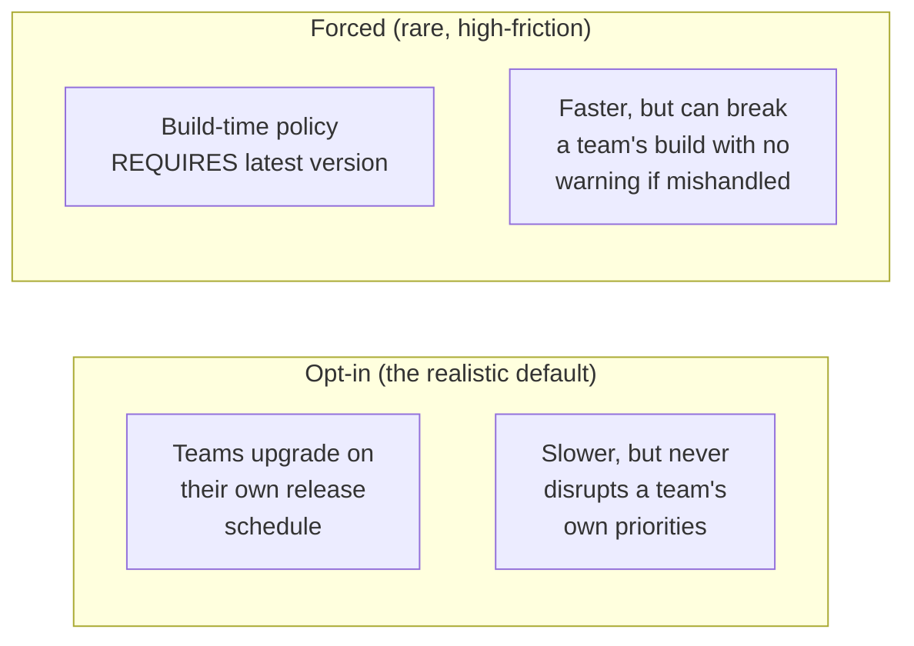

Anvilworks rejects the forced-CI-check idea for this case — most teams have real, legitimate reasons they haven't upgraded yet (their own release backlog, their own priorities), and picking a fight with 90 teams' build pipelines with no warning would burn a lot of organizational goodwill for a routine deprecation. They go with opt-in plus a hard, well-communicated deadline instead: repeated notices, direct outreach to the 90 flagged teams (using Chapter 4's telemetry to know exactly who to contact), and a real date after which the backend simply stops accepting `schemaVersion=v1`.

Eight months later, the calculus flips: a security researcher reports that `anvil-auth-sdk` v1.x has a token-validation bypass — anyone still on it is running an actual vulnerability, live, in production. This is the same shape of situation as the real 2014 Heartbleed vulnerability in OpenSSL, which forced a huge number of organizations into urgent, coordinated upgrades practically overnight, because the cost of waiting for voluntary adoption clearly outweighed the disruption of forcing it. Anvilworks does the forced version here — but even "forced" means a hard, loudly-announced deadline with direct support, not a silent, no-warning break.

**New problem:** even with a clean opt-in-by-default policy and a rare, justified forced-upgrade exception, Anvilworks still doesn't have an explicit *process* for what actually happens to an old version once its support window ends — is it just... turned off? Who decides? What if telemetry shows 3 stragglers left, not zero?

**How I'd say this in an interview:** "Opt-in is the realistic default — most organizations don't have the standing to force every team's release schedule around the SDK team's roadmap, and that's exactly why multi-version backend support is structural, not optional. Reserve forced upgrades for genuinely justified cases like a security vulnerability — the Heartbleed pattern — and even then, pair 'forced' with loud, well-lead-timed communication, never a silent break."

---

## Chapter 8 — The library book nobody returns

Even with a published 2-major-version policy, Anvilworks notices something: the auth backend's codebase has accumulated parsing logic for `schemaVersion` v1 through v4 — four versions' worth of compatibility code — because nobody ever formally declared any of them "actually gone." Deprecation kept getting talked about, then deprioritized, because there was no explicit lifecycle telling anyone when to pull the trigger.

**The analogy:** think of an old-fashioned library card system. A book is checked out (adopted), it's due back by a date (the support window), and if it's overdue the library sends a notice (deprecation outreach) — but if the library never actually recalls the book or marks it lost, it just sits on someone's shelf forever, and the library's own catalog never gets simpler.

**The fix:** an explicit version lifecycle, with telemetry (from Chapter 4) as the thing that actually moves a version between states, not a calendar reminder someone forgets to check:

```mermaid
stateDiagram-v2
    [*] --> Released: new version published to the registry
    Released --> Adopting: teams pull the update on their own schedule
    Adopting --> Supported: within the compatibility window, backend fully supports it
    Supported --> Deprecated: a newer major version pushes this one past the window
    Deprecated --> Sunset: telemetry confirms negligible remaining traffic; backend support removed
    Sunset --> [*]
```

The key discipline: **"Deprecated" isn't "Sunset."** A version enters Deprecated the moment a newer major version ships and the window starts counting down — that's a calendar fact. It only actually moves to Sunset (backend support code deleted) when telemetry confirms remaining traffic is negligible *and* the communicated deadline has passed — that's a data fact, checked before anyone deletes anything, so nobody sunsets a version that three stragglers are still quietly depending on.

For the data behind this: each `SDKVersion` gets a row with its `schemaVersion`, `status`, and `supportEndsAt` — a queryable, explicit deadline, not something living in someone's memory. Each consuming team's latest ping lands in a `TeamAdoption` row keyed by `serviceId`, giving the dashboard its raw material.

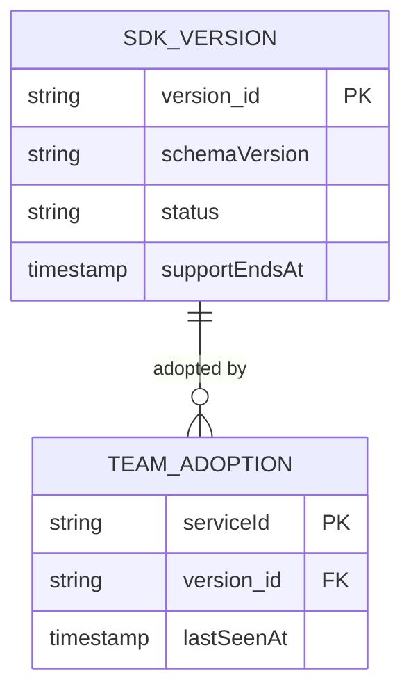

One sharp edge Anvilworks hits almost immediately: a handful of very old services predate the telemetry ping entirely — they're running an SDK version from before that feature existed, so they never show up on the dashboard at all. The team's first instinct is to just ignore them as noise. That's the wrong call: an *invisible* gap is worse than a *known* one. Anvilworks instead flags "no registration ping ever received" as its own explicit category on the dashboard, rather than silently treating "never checked in" the same as "successfully upgraded and gone."

**New problem — really more of a step back:** all of this — versioning policy, compatibility testing, telemetry, a lifecycle state machine — is genuinely a lot of ongoing machinery for what started as "let's stop 40 teams from copy-pasting an HTTP call." Is owning a shared SDK, with all of this overhead, actually still the right call?

**How I'd say this in an interview:** "Deprecation needs its own explicit lifecycle, not just a compatibility-window date on a calendar — 'Deprecated' means the countdown started, 'Sunset' means telemetry actually confirmed it's safe to delete the code. And services that never send a registration ping at all should be their own flagged category, not silently dropped from the picture — an invisible gap is worse than a visible unknown."

---

## Chapter 9 — Should we even be doing this ourselves?

This is the question the whole chapter was originally framed around, made explicit: **should an org own a shared client SDK at all, or just publish a spec and let each team build their own integration?** Chapter 1 showed what happens when the answer defaults to "spec only" by accident. But it's worth asking honestly, now that the real cost of "own it" is fully visible: versioning discipline, compatibility testing, telemetry, a deprecation lifecycle — real, ongoing engineering investment, not a one-time build.

**Back to the recipe-card analogy, full circle:** if every chef reliably reads and follows a written spec perfectly, a shared recipe card doesn't buy you much beyond what the spec already gave you. But Chapter 1 already proved that's not what happens in practice — 40 chefs working from memory produced 40 different, inconsistently broken dishes the moment the recipe changed underneath them. The shared SDK's entire value is that it forces *actual, identical behavior*, not just a shared *description* of intended behavior that everyone's still free to implement differently (and get subtly wrong).

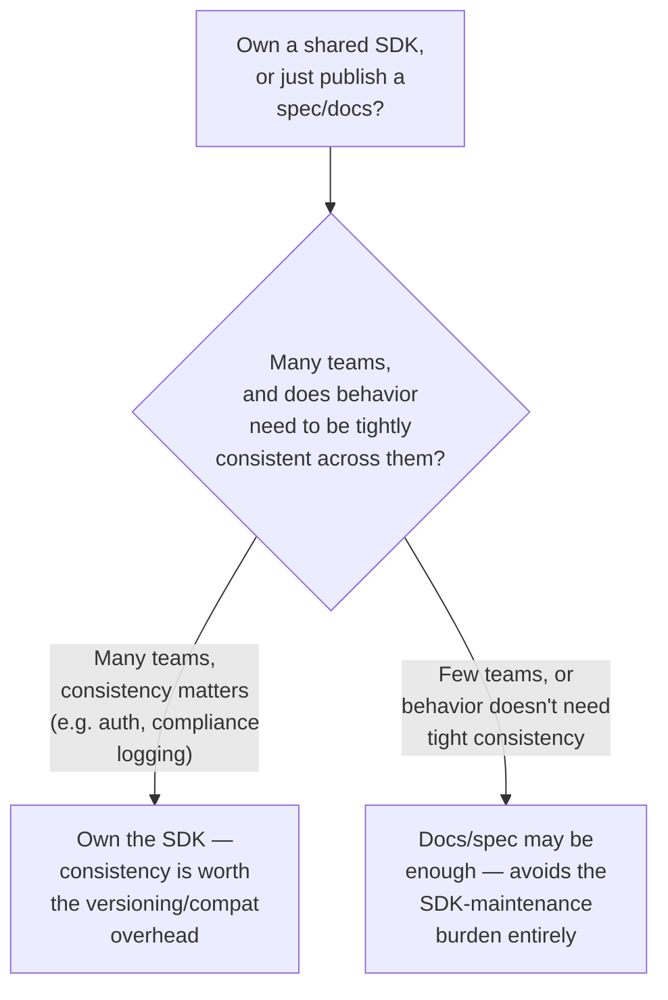

For something like auth — where an inconsistency isn't cosmetic, it's a security bug, per Chapter 1's silent-authorization-failure incident — Anvilworks's answer is clearly "own it." The overhead from Chapters 3 through 8 isn't evidence the shared-SDK approach was a mistake; it's the accepted, ongoing cost of the consistency guarantee it buys. For a lower-stakes internal tool used by three teams who all speak the same language and rarely touch it, a shared doc might genuinely be enough — the SDK-maintenance burden wouldn't be worth paying.

Anvilworks also treats this as a decision with a shelf life, not a permanent ruling: as the number of consuming teams and languages grows (or shrinks), or as the concern's own complexity changes, it's worth re-asking the question — not re-litigating it every quarter, but not pretending year-one's answer is carved in stone either.

**How I'd say this in an interview:** "This is the actual original framing of this whole design problem — own the SDK, or publish docs and let teams build their own. Own it when consistency genuinely matters, like auth or compliance-relevant logging, and treat all the versioning and compatibility machinery as the accepted cost of that consistency, not a sign the approach was wrong. But it's worth revisiting as the org grows, not treated as a permanent, one-time call."

---

## Where the story actually lands

```mermaid
flowchart LR
    A["Ch1: 40 hand-rolled\nclients, break differently"] -->|"fixes: one consistent\nclient\nbreaks: can't force adoption"| B["Ch2: shared SDK,\nboat that already sailed"]
    B -->|"fixes: names the real\nadoption curve\nbreaks: backend assumes\nlatest-only"| C["Ch3: version-aware\nbackend"]
    C -->|"fixes: multi-version\nsupport\nbreaks: no visibility\ninto who's on what"| D["Ch4: adoption\ntelemetry"]
    D -->|"fixes: visibility\nbreaks: a 'safe' change\nstill slips through"| E["Ch5: compatibility\ntest suite"]
    E -->|"fixes: catch breaks\npre-release\nbreaks: no standing rule\nfor what's breaking"| F["Ch6: semver +\ncompat window policy"]
    F -->|"fixes: explicit policy\nbreaks: how hard can\nyou push adoption?"| G["Ch7: opt-in default,\nforced for security"]
    G -->|"fixes: adoption\npressure policy\nbreaks: old versions\nlinger forever"| H["Ch8: version lifecycle\n+ deprecation"]
    H -->|"steps back to ask:"| I["Ch9: is owning the\nSDK still worth it?"]
```

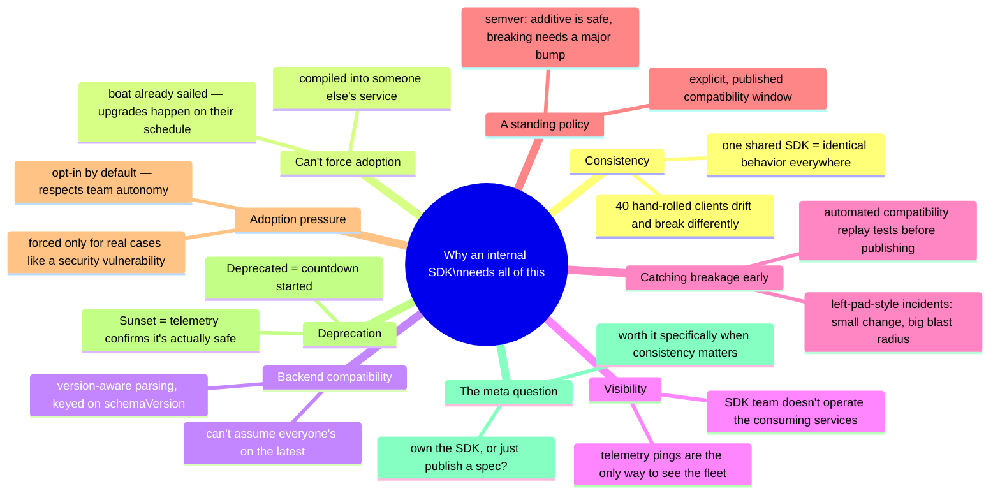

Every real "design a shared internal SDK" interview sits somewhere on this chain. Nobody expects all nine chapters recited unprompted — if the interviewer never brings up deprecation, stopping around Chapter 5 or 6 is a complete, well-reasoned answer. If they explicitly ask "how do you know who's still on an old version," that's a direct pointer straight to Chapter 4.

---

## Grill me — adversarial follow-ups

**Q1: "Why not just force every team to always be on the latest SDK version — wouldn't that make all of this unnecessary?"**
Because an internal SDK is compiled into services Anvilworks doesn't operate — there's no mechanism to force a redeploy on someone else's schedule short of an org-wide mandate most companies don't have the standing (or the desire) to impose. Even where mandates exist, the realistic adoption curve still shows a long tail, so the backend has to support multiple versions regardless; forcing adoption might shrink the tail, it won't eliminate the need for this design.

**Q2: "Isn't `schemaVersion` redundant with `sdkVersion` — why track both?"**
No — the wire format (`schemaVersion`) and the SDK's own release cadence (`sdkVersion`) change at different rates and for different reasons. An SDK point release might fix an internal bug with zero wire-format impact; tracking compatibility by `schemaVersion` means the backend only cares about actual data-contract changes, not how often the SDK team ships an unrelated patch.

**Q3: "The compatibility test suite replays old requests against new logic — what if nobody thought to record a request format that turns out to matter?"**
That's a real gap, and the honest answer is the suite is only as good as its recorded corpus — it should be seeded from actual production traffic per supported `schemaVersion`, not hand-written fixtures, and refreshed periodically so it reflects what's genuinely still in the field, not just what someone imagined years ago.

**Q4: "Why is opt-in the default instead of forced, given forced gets you to full adoption faster?"**
Because most organizations treat team autonomy over their own release schedule as a real value, not just a nicety — and forcing adoption with no warning risks breaking builds across many teams simultaneously, which is worse than a slower rollout. Speed isn't free; the Heartbleed-style forced case is the exception specifically because the cost of waiting was unusually high, not because forced is generally the better default.

**Q5: "Doesn't 'the last 2 major versions are supported' just mean the backend accumulates compatibility code forever anyway?"**
No — it bounds it. At any moment the backend maintains parsing logic for a small, fixed number of versions (2-3, per the stated window), not an ever-growing pile. The Chapter 8 lifecycle is what actually enforces that bound — a version doesn't get to sit in "Supported" indefinitely just because deprecating it is inconvenient.

**Q6: "How do you know it's actually safe to sunset a version, versus just assuming it is because the deadline passed?"**
The deadline passing alone isn't enough — Chapter 8's lifecycle requires telemetry to independently confirm negligible remaining traffic before code is actually deleted, not just the calendar date. If three stragglers are still pinging in with that version past the deadline, that's a flagged, visible fact to act on (outreach, or an explicit forced-cutoff decision), not a silent assumption that everyone left on time.

**Q7: "What happens to a service that never sends a version-registration ping at all?"**
It's invisible to the dashboard by default, which is worse than being visibly on an old version — so Anvilworks treats "never registered" as its own explicit, flagged category rather than quietly omitting it. That at least turns an unknown unknown into a known one that someone can chase down.

**Q8: "You said 'own the SDK' is right for auth because consistency matters — how would you actually decide that in general, in an interview?"**
Ask whether behavioral drift between different teams' implementations would actually cause a real problem — a security bug, a compliance violation, a data-quality issue — versus just being a cosmetic inconsistency nobody really cares about. If drift is genuinely dangerous, the SDK's versioning overhead is worth paying; if it isn't, a published spec might be perfectly sufficient and cheaper to maintain.

**Q9: "This whole story assumes voluntary adoption is fine to design around — what if the interviewer says 'no, assume every team upgrades within a week'?"**
Then the core problem this chapter is built around — permanent multi-version support — mostly goes away, and the design collapses to something much simpler: a backend that only needs to support one or two versions briefly during a short rollout window, closer to a normal software release than this chapter's steady-state problem. It's worth saying that out loud explicitly — it's a very different (and much easier) system, and confirming that assumption up front is exactly the kind of clarifying question this chapter's requirements section calls out.

**Q10: "If you had to cut this down to one sentence for a system-design interview, what would it be?"**
"The system being designed is the library itself, embedded in code I don't control the release schedule of — so the real engineering problems are versioning and backward compatibility across an adoption curve I can influence but not control, plus getting visibility into a fleet I don't operate."

---

## Cheat sheet — one line per stop on the story

- **40 hand-rolled clients**: the same backend change breaks everyone differently, because there's no single client to test against — the reason a shared SDK exists at all.
- **Shared SDK (the recipe card)**: one official, versioned client instead of 40 memories of the recipe — buys consistency, at the cost of now owning versioning and compatibility forever.
- **Can't force adoption (the boat that already sailed)**: the SDK is compiled into someone else's service, redeployed on their own schedule — real adoption curves leave a real, permanent tail of teams on an old version a year or more out.
- **Version-aware backend**: never assume "latest only" — parse based on an explicit `schemaVersion`, tracked separately from the SDK's own release number, within a bounded support window.
- **Adoption telemetry (radioing in)**: the SDK team doesn't operate the consuming services, so the only way to know who's on what version is a version-registration ping — without it, the SDK team is blind to its own fleet.
- **Compatibility test suite**: replay recorded requests from every supported wire-format version against any proposed change, and block the release if anything breaks — catches a left-pad-style incident before publishing, not after.
- **Semver + a published compatibility window**: additive changes (a garnish) are always safe; breaking changes (swapping the base ingredient) need a new major version and an explicit, stated support window — never an implicit, open-ended commitment.
- **Opt-in vs. forced upgrade (the lease notice vs. the movers)**: opt-in with a real deadline is the default, respecting team autonomy; forced is reserved for genuinely justified cases like a security vulnerability, and even then needs loud, lead-timed communication.
- **Version lifecycle (the library book)**: Released → Adopting → Supported → Deprecated → Sunset — "Deprecated" means the countdown started, "Sunset" means telemetry actually confirmed it's safe to delete the code, not just that the calendar date passed.
- **Own vs. publish-a-spec**: own a shared SDK specifically when behavioral consistency across teams genuinely matters (security, compliance); a published spec can be enough when it doesn't — and it's a decision worth revisiting as the org grows, not a permanent ruling.
- **The meta-lesson**: every fix here buys either consistency, backward compatibility, visibility, or safe deprecation by spending real, ongoing engineering investment — say the trade in the same sentence you propose the fix.
