# Design a Shared Internal Client SDK Distribution System — FAANG Interview Guide

> Source chapter type: the build-vs-buy question, reframed as a system to design. Sourced from a
> reported Netflix internal-tooling interview: "should we build and own event-logging client
> libraries internally, or provide documentation and let other teams build their own?" This
> chapter reframes that as a concrete design problem — **the system being designed is a client
> library**, distributed across hundreds of independently-deployed, independently-versioned
> internal codebases. Every other guide in this course designs a backend service that clients
> call. This one designs the thing living *inside* the caller.

## Mental model

A large company standardizes on a shared client SDK — say, for logging, metrics, feature flags,
or auth — so that hundreds of internal teams don't each reinvent (and inconsistently implement)
the same plumbing. The SDK gets embedded directly into each team's own service, compiled into
their binaries, deployed on their own release schedules. This inverts almost every assumption the
rest of this course relies on:

1. **You can't force an upgrade.** Every other chapter's "client" is a phone app or browser you
   can push an update to on a timeline you mostly control. An internal SDK is compiled into
   someone else's service; you cannot make Team B redeploy just because you shipped SDK v3 —
   adoption is inherently gradual, and the system has to work correctly with v1, v2, and v3 all
   live simultaneously across different teams, indefinitely.
2. **Backward compatibility isn't a nice-to-have, it's the central constraint.** A breaking change
   in a backend service affects that one service; a breaking change in a widely-embedded SDK
   potentially breaks hundreds of teams' builds simultaneously, all at once, the moment they next
   update their dependency — the blast radius of an SDK mistake is uniquely large.
3. **You need visibility into a fleet you don't operate.** The SDK-owning team doesn't run the
   services embedding their SDK — they need adoption/version telemetry (who's on which version,
   who's stuck on something ancient and unsupported) without being able to simply query "their
   own" infrastructure, because it isn't theirs.

**The one sentence to say out loud:** *"The system being designed here is the library itself, not
a backend it talks to — which means the real engineering problems are versioning and backward
compatibility across an adoption curve you can influence but not control, and getting visibility
into a fleet you don't operate."*

**The one picture to remember forever:**

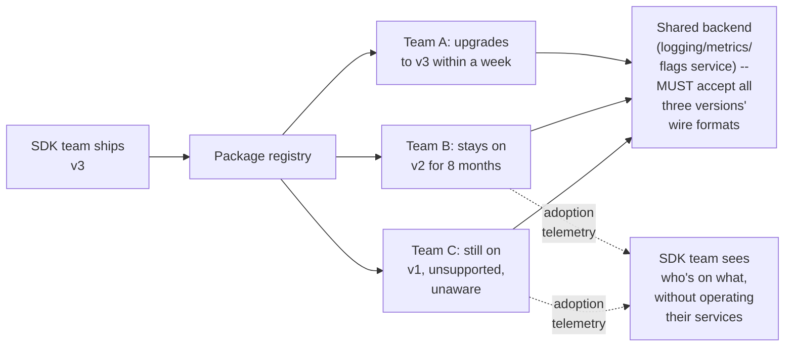

**Memory hook:** *"You ship the update, you don't control when — or if — it's actually adopted.
The backend has to keep talking to every version still in the field, and you need telemetry to
even know that field exists."*

---

## Table of contents
[How to Identify This Topic](#how-to-identify-this-topic-in-an-interview) ·
[Interview Playbook](#interview-playbook) · [Requirements](#requirements-clarification) ·
[Capacity Estimation](#capacity-estimation-worked) · [API Design](#api-design) ·
[High-Level Architecture](#high-level-architecture) ·
[Architecture Evolution v1→v2→v3](#architecture-evolution-v1--v2--v3) ·
[End-to-End Walkthroughs](#end-to-end-request-walkthroughs) ·
[Deep Dive: Versioning & Backward Compatibility](#deep-dive-versioning--backward-compatibility) ·
[Deep Dive: Opt-In vs. Forced Upgrade](#deep-dive-opt-in-vs-forced-upgrade) ·
[Deep Dive: Adoption & Version Telemetry](#deep-dive-adoption--version-telemetry) ·
[Deep Dive: The Build-vs-Provide-Docs Trade-off](#deep-dive-the-build-vs-provide-docs-trade-off) ·
[Data Model](#data-model) · [Failure Modes](#failure-modes--mitigations) ·
[Non-Functional Walkthrough](#non-functional-walkthrough) ·
[Security & Compliance](#security--compliance) · [Cost & Trade-offs](#cost--trade-offs) ·
[Wrap-Up](#wrap-up-mvp-vs-stretch) · [Golden Rules](#golden-rules) ·
[Cheat Sheet](#master-cheat-sheet)

---

## How to identify this topic in an interview

- "Design a shared client library/SDK distributed across many internal teams" or "should we build
  and own this client library, or let teams build their own?" — sourced from a reported Netflix
  internal-tooling interview about event-logging clients specifically.
- The tell that this is about the SDK itself as the system, not a backend service: the
  interviewer emphasizes **many independently-deployed consumers on independent release
  schedules** — that's the signal that versioning/compatibility, not request handling, is the
  actual substance.
- A follow-up like "how do you know which teams are still on an old, unsupported version" is the
  [adoption-telemetry deep dive](#deep-dive-adoption--version-telemetry) — a problem unique to not
  operating your own clients' infrastructure.

---

## Interview playbook

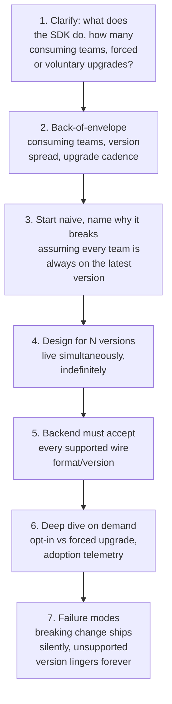

**What the interviewer is actually grading at each step:**
- Step 3: do you recognize, unprompted, that you cannot assume every consumer is on the latest
  version — unlike a mobile app you can force-update, an internal SDK's adoption is gradual and
  partially outside your control?
- Step 5: do you know that the backend/service the SDK talks to must remain compatible with every
  version still in active use, not just the newest one — and that this compatibility window has to
  be an explicit, stated policy, not indefinite by default?
- Step 6: do you propose a concrete mechanism for knowing who's on what version, given that you
  don't operate the consuming teams' infrastructure yourself?

---

## Requirements clarification

### Functional

| # | Requirement | Notes |
|---|---|---|
| F1 | Provide a versioned client SDK that internal teams embed into their own services | The core artifact being designed |
| F2 | Support multiple SDK versions in active use simultaneously, indefinitely | Not a transitional state — a permanent operating condition |
| F3 | Ship new SDK versions (features, fixes) without breaking already-embedded older versions | The core compatibility guarantee |
| F4 | Track which teams/services are on which SDK version | Visibility into a fleet the SDK team doesn't operate |
| F5 | Provide a clear deprecation/sunset path for unsupported old versions | Compatibility can't be promised forever — there needs to be an explicit, communicated end |

### Non-functional

| Requirement | Target | Why this number |
|---|---|---|
| Backward compatibility window | A stated, explicit policy (e.g. "the last N major versions are supported") | Indefinite compatibility is unsustainable; no stated policy at all means every version lingers forever by default, an equally bad outcome |
| SDK-embedded overhead (latency, binary size) | Minimal — the SDK runs inside someone else's service's critical path | An SDK that measurably slows down every consuming service's own requests will be uninstalled or bypassed regardless of its other merits |
| Adoption visibility | The SDK team must be able to answer "which teams are on which version" without asking each team individually | The alternative — manually polling hundreds of teams — doesn't scale and is the exact problem telemetry solves |
| Breaking-change communication lead time | Sufficient advance notice before any compatibility window closes | Teams need real time to plan an upgrade around their own release schedule, not the SDK team's |
| Wire-format compatibility at the backend | Must accept every version within the stated support window | The backend, not just the SDK, has to honor the compatibility policy |

**Clarifying questions worth asking the interviewer up front — and what each answer changes:**

| Question | If the answer is... | ...then this changes |
|---|---|---|
| "Can upgrades be forced (e.g. a build-time policy requiring the latest SDK), or is adoption purely voluntary?" | Voluntary, teams upgrade on their own schedule | Confirms the multi-version-support architecture is mandatory, not optional — this is the single biggest fork in the whole design |
| "How many teams/services would embed this SDK?" | Hundreds | Confirms adoption telemetry and a real deprecation process are necessary at this scale, not something that can be handled ad hoc via direct conversations |
| "Is the SDK for a stateless concern (logging/metrics) or something with more complex runtime behavior (auth, feature flags)?" | Varies by product | Simpler concerns (logging) mostly need wire-format compatibility; more complex ones (auth) may need behavioral compatibility too — a materially bigger compatibility surface |
| "What's an acceptable compatibility window — how many old major versions must the backend keep supporting?" | E.g. the last 2 major versions | Directly defines the deprecation policy and how aggressively old versions can be sunset |

**Say this out loud in the interview:** *"I'd design this assuming voluntary, gradual adoption is
the permanent state, not a temporary rollout phase — the backend has to support a real
compatibility window across multiple simultaneously-live versions by policy, and I need telemetry
specifically because I don't operate the services embedding this SDK myself."*

---

## Capacity estimation, worked

```
Given (illustrative, a large engineering organization):
  Internal teams/services embedding the SDK           = 600
  New SDK major version released                        = ~2x/year
  Typical adoption curve after a new major version ships:
    Within 1 month                                        = ~15% of teams upgraded
    Within 6 months                                        = ~60% of teams upgraded
    Within 12 months                                        = ~85% of teams upgraded
    Beyond 12 months (long tail, some never fully upgrade
      until forced by an unrelated dependency bump)          = remaining ~15%
  -> even a full YEAR after a release, a real fraction of the fleet hasn't upgraded -- this is
     the concrete number that makes "just support the latest version" an unworkable policy;
     multi-version support isn't a temporary rollout accommodation, it's the permanent state
     given how long adoption tails actually run in practice.

Concurrently-supported versions, given a "last 2 major versions" policy and a 2x/year release
  cadence:
  A support window of 2 major versions spans roughly 6 months of releases
  -> given the adoption curve above, at ANY point in time, a policy-compliant backend must
     accept traffic from AT LEAST 2-3 major versions simultaneously, and in practice may see
     stray traffic from older, technically-unsupported versions too (the long tail) -- the
     backend's wire-format handling needs to be resilient to that reality, not just the
     officially-supported window.

Adoption-telemetry volume:
  Version-reporting pings, once per service startup + periodic heartbeat                = a
    tiny volume relative to the SDK's actual operational traffic (e.g. logging/metrics calls)
  -> telemetry itself is cheap; the VALUE is in aggregating it into an actionable view (which
     specific teams are on unsupported versions), not in the raw ingestion cost.
```

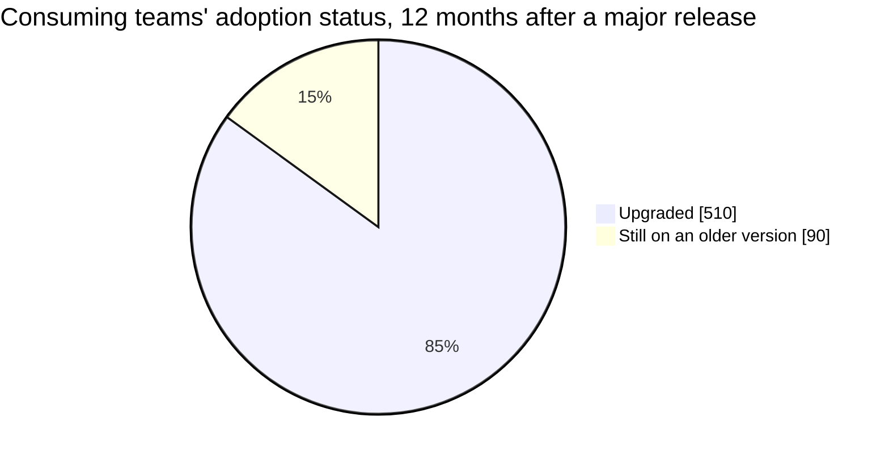

Even a full year out, 15% of teams (illustrative) haven't upgraded — the concrete reason
multi-version backend support has to be the permanent state, not a transitional accommodation.

**Redo-the-chain test:** if the release cadence slows to once a year instead of twice, the
adoption curve's percentages shift later in absolute time, but the qualitative lesson is
unchanged: there is always a real, non-trivial tail of teams on an older version at any given
moment, regardless of release frequency — multi-version support is structural, not a symptom of
releasing too often.

**The number worth memorizing:** even a year after a major release, a meaningful fraction of
consuming teams are typically still on an older version — this single fact is why "assume
everyone's on the latest" is never a safe design assumption for an internally-distributed SDK.

---

## API design

The SDK's own "API" is a client-side interface (a function/method signature teams call from
their code), plus a wire protocol the SDK uses to talk to its backend service.

### Client-side interface (what a consuming team's code calls)

```
logger.log(event: LogEvent, options: LogOptions) -> void
```

### Wire protocol (SDK → backend, version-tagged)

```json
{
  "sdkVersion": "2.4.1",
  "schemaVersion": "v2",
  "event": { "type": "USER_ACTION", "payload": { "...": "..." } }
}
```

### Version-registration ping (SDK → adoption-telemetry service, on startup)

```json
{ "serviceId": "checkout-service", "sdkVersion": "2.4.1", "language": "java", "lastSeenAt": "2026-07-24T18:00:00Z" }
```

| Field | Notes |
|---|---|
| `schemaVersion` | Deliberately separate from `sdkVersion` — the wire format can stay stable across several SDK point releases, and only bumps when the actual data contract changes, which is a coarser, more meaningful signal for the backend's compatibility handling than the SDK's own release number |
| `serviceId` | Identifies the consuming team/service, not an individual host — adoption telemetry cares about "which teams," not "which of Team A's 200 replica instances" |

**The one sentence worth saying about the API surface:** *"The wire protocol's schema version is
tracked separately from the SDK's own release version, because compatibility decisions should be
driven by actual data-contract changes, not by how often the SDK team ships an unrelated
point release."*

---

## High-level architecture

### Architecture evolution (v1 → v2 → v3)

**v1 — assume every consumer is always on the latest SDK version:**

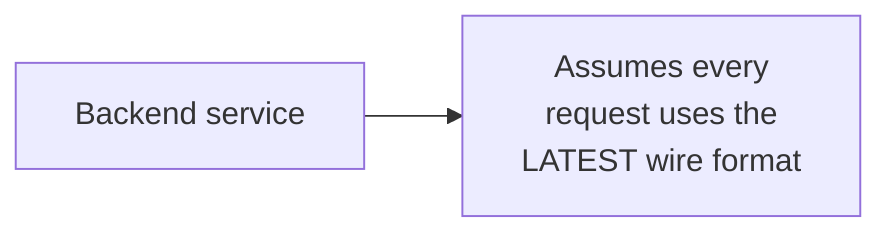

**Why it breaks:** per the capacity estimate, a real fraction of consuming teams are on older
versions at any given time, indefinitely — a backend that only understands the latest format
either breaks for every team not yet upgraded, or (worse) silently mishandles their requests in a
way that isn't immediately obvious.

**v2 — backend handles multiple versions, but no visibility into who's on what:**

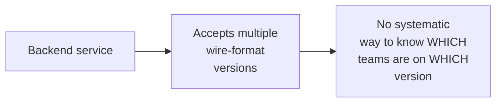

**Why it breaks:** multi-version support (v2's real improvement) fixes the breakage problem — but
without adoption telemetry, the SDK team has no way to know when it's safe to actually deprecate an
old version, which teams need proactive outreach before a compatibility window closes, or whether
a "supported" old version even has any remaining traffic at all. Every deprecation decision is
made blind.

**v3 — the real system: multi-version backend support + adoption telemetry driving deprecation:**

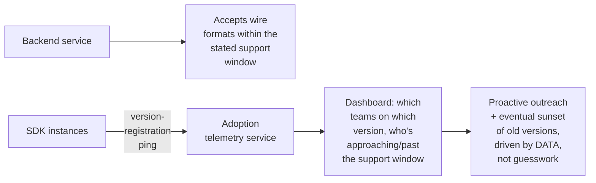

**What v3 fixes, one line each:** multi-version backend support (already in v2) prevents breakage
across the real adoption curve; and adoption telemetry turns "which old versions can we safely
deprecate" from a guess into a data-driven decision, closing v2's visibility gap.

---

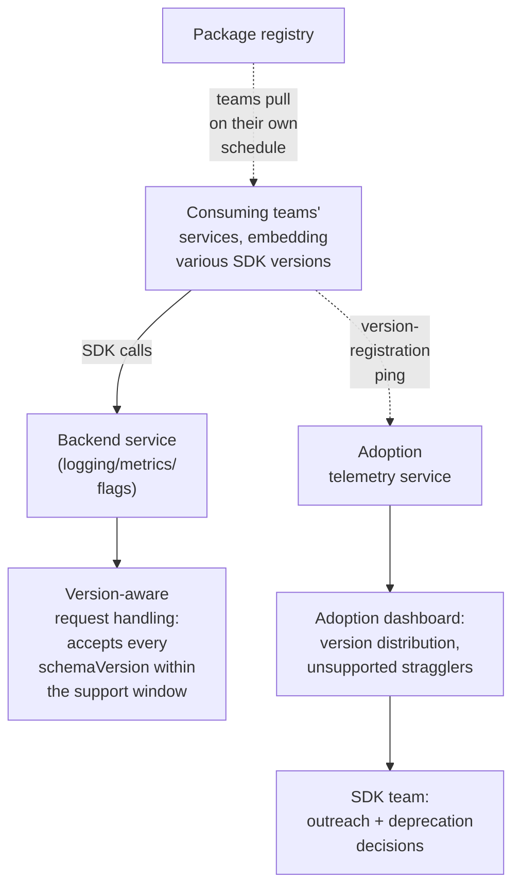

| Component | Role |
|---|---|
| Version-aware request handling | The backend's compatibility layer — must correctly interpret every `schemaVersion` within the stated support window, not just the newest |
| Adoption telemetry service | Aggregates version-registration pings into an actionable view — the mechanism giving the SDK team visibility into a fleet they don't operate |
| Package registry | The distribution mechanism (a standard artifact repository) — teams pull updates on their own schedule, the SDK team doesn't push |
| Adoption dashboard | Surfaces which teams are on which version, and specifically who's approaching or past the end of the support window |

---

## End-to-end request walkthroughs

### Walkthrough 1 — two teams on different SDK versions, both handled correctly

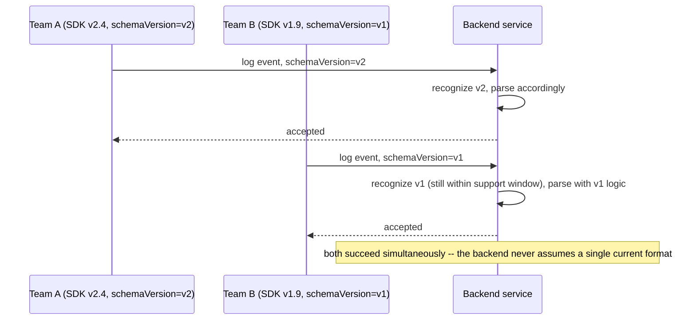

### Walkthrough 2 — adoption telemetry identifies a team on an unsupported version

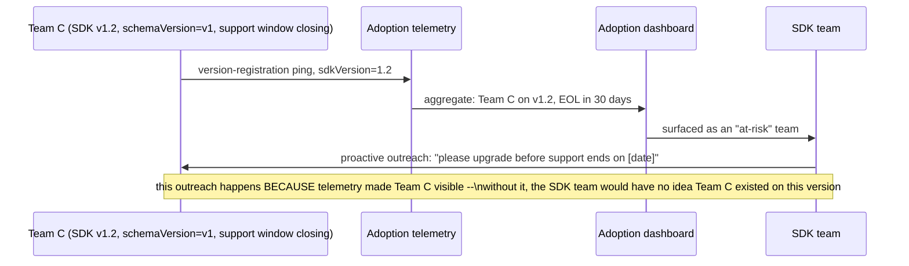

### Walkthrough 3 — a breaking change is caught before it ships broadly, via a compatibility test

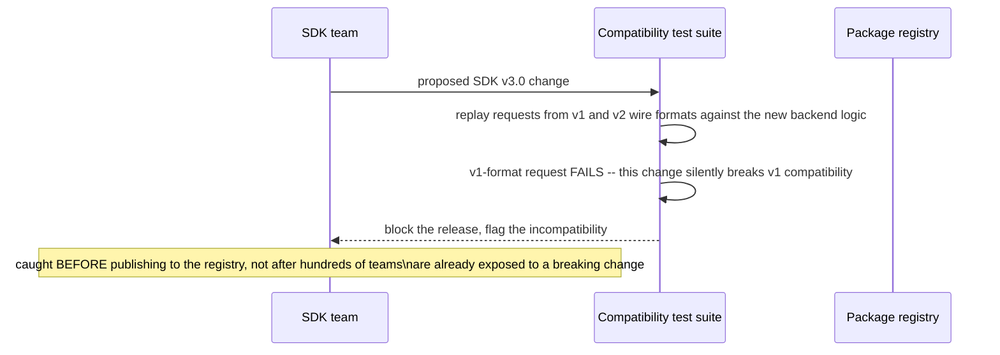

Walkthrough 3 is the concrete mechanism behind the [versioning deep dive](#deep-dive-versioning--backward-compatibility)'s
point that compatibility should be tested explicitly, not assumed.

---

## Deep dive: versioning & backward compatibility

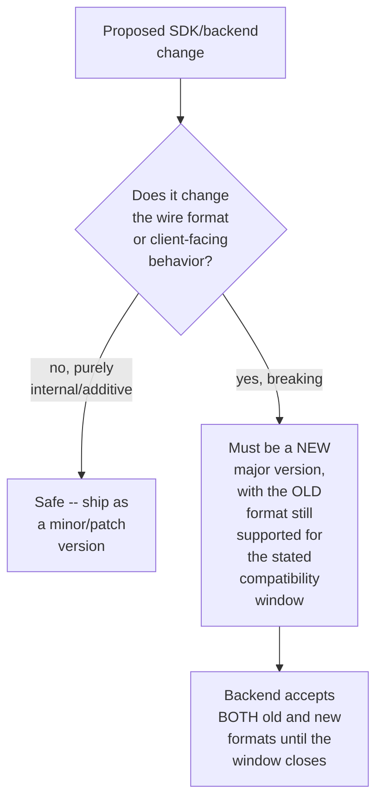

**Why "additive only" is the safest default for anything shipped without a major version bump:**
adding a new optional field or a new method is almost always safe for existing consumers, who
simply don't use it — removing or changing the meaning of an existing field/method is what breaks
them. Defaulting to additive-only changes within a given major version dramatically shrinks how
often a breaking change (and its associated compatibility-window management) is even necessary.

**Why the compatibility window must be a stated policy, not an implicit "we'll support it until
it's inconvenient":** an unstated policy means teams have no way to plan their own upgrade timing
around a real deadline, and the SDK team has no principled basis for ever sunsetting an old
version — an explicit, published window (e.g. "the last 2 major versions") gives both sides a
concrete, negotiable constraint instead of an open-ended obligation.

**Interview cheat-sheet:** *"Default to additive-only changes within a major version; anything
breaking requires a new major version with an explicit, published compatibility window during
which the backend supports both old and new formats — never an implicit, undefined support
commitment."*

---

## Deep dive: opt-in vs. forced upgrade

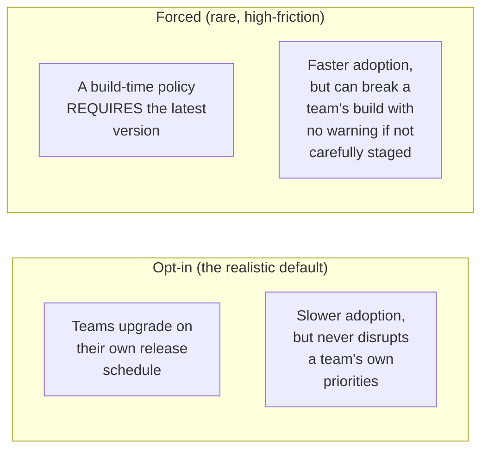

**Why opt-in is the realistic default for most internal SDKs, and forced upgrades are the
exception, not the norm:** most organizations don't have the authority (or the desire) to force
every team's release schedule to bend around the SDK team's roadmap — respecting team autonomy is
usually a stated cultural/organizational value, which is exactly why the multi-version-support
architecture in this chapter is necessary in the first place, not a workaround for a temporary
inconvenience.

**When a forced upgrade is justified despite the friction:** a security vulnerability in an old
SDK version is the clearest case — the cost of a coordinated, potentially disruptive forced
upgrade is outweighed by the cost of leaving a known vulnerability live across hundreds of
services. Even then, "forced" should mean "loudly and repeatedly communicated with a hard deadline
and support," not "silently breaks builds with no warning."

**Interview cheat-sheet:** *"Opt-in adoption is the realistic default, which is exactly why
multi-version backend support is structural, not optional — reserve forced upgrades for
genuinely justified cases like a security vulnerability, and even then, pair 'forced' with
loud, well-lead-timed communication, never a silent breaking change."*

---

## Deep dive: adoption & version telemetry

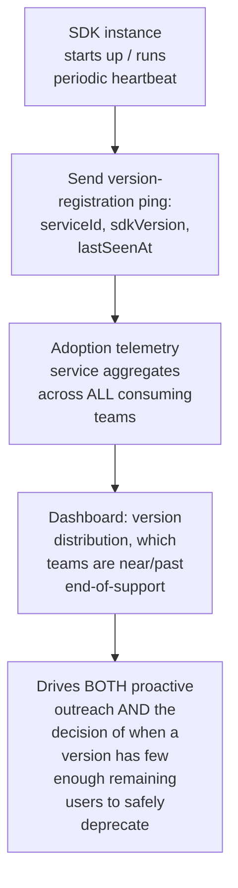

**Why this is a problem unique to this chapter, not something any backend-service chapter in this
course needed:** every other chapter's system operator also operates (or at least fully observes)
the client side of the interaction — a payment system's team can see every payment request
regardless of client version, because they run the whole request path. An SDK team does NOT
operate the services embedding their library; the only way to know a team exists and what version
it's running is if the SDK itself proactively reports that fact. Without the registration ping,
the SDK team is simply blind to their own consumer base.

**Why aggregated dashboards, not ad hoc conversations, are the only approach that scales:** at
hundreds of consuming teams, manually asking each one "what version are you on" doesn't scale and
goes stale immediately — telemetry is the only mechanism that keeps this picture continuously
current without linear human effort per team.

**Interview cheat-sheet:** *"Unlike every backend-service chapter in this course, the SDK team
doesn't operate its own consumers — the only way to know who's running what version is if the SDK
proactively reports it. This is a problem this genre of system has that a normal backend service
simply doesn't."*

---

## Deep dive: the build-vs-provide-docs trade-off

The original framing of the reported interview question, made explicit as its own design
decision rather than left implicit.

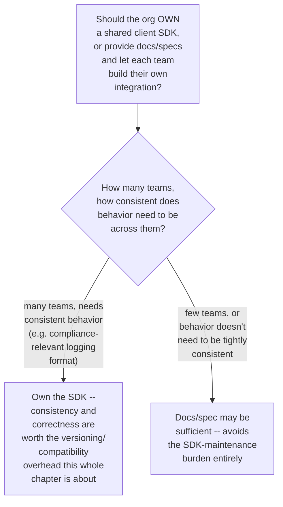

**Why "own the SDK" is usually the right call specifically when consistency matters, despite the
real overhead this whole chapter describes:** if every team builds its own integration against a
spec, behavior WILL diverge over time — subtly different retry logic, different edge-case
handling, different field semantics — precisely the kind of inconsistency a shared SDK exists to
prevent. The versioning/compatibility burden is the accepted cost of that consistency guarantee,
not a sign the shared-SDK approach was the wrong call.

**Why this decision should be revisited, not treated as permanent:** as the number of consuming
teams or languages grows, or as the underlying concern's complexity changes, the right answer to
build-vs-docs can shift — worth naming as a decision with a shelf life, not a one-time, permanent
architectural commitment.

**Interview cheat-sheet:** *"Owning a shared SDK is usually justified specifically when behavioral
consistency across teams matters — the versioning and compatibility overhead is the accepted cost
of that consistency, not evidence the approach was wrong. But it's a decision worth revisiting as
the organization and its needs grow, not a permanent commitment."*

---

## Data model

**SDK version lifecycle:**

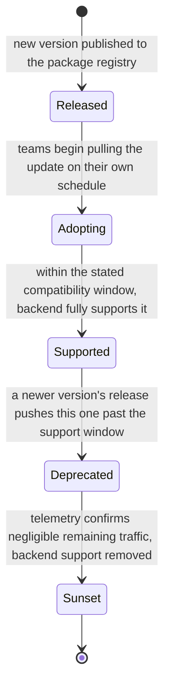

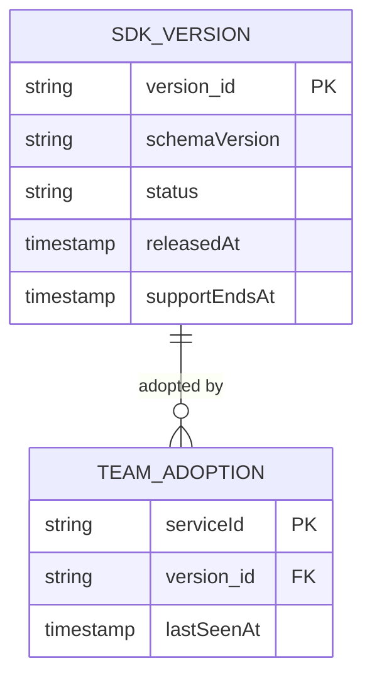

| Table | Storage choice & why |
|---|---|
| `SDKVersion` | Small, low-write-volume — one row per release, with `supportEndsAt` as the explicit, queryable compatibility-window deadline |
| `TeamAdoption` | One row per consuming service, updated on each version-registration ping — the raw data behind the adoption dashboard |

---

## Failure modes & mitigations

| Failure mode | Impact | Mitigation |
|---|---|---|
| **A change ships that silently breaks an older wire format** | Every team still on that older version starts failing, discovered only when they notice, potentially much later | Automated compatibility testing (replaying old-format requests against new backend logic) before any release ships, per the walkthrough 3 mechanism |
| **A team never upgrades and lingers on a version well past its stated support window** | Backend compatibility code accumulates indefinitely, and the team is running unpatched/unsupported code | Adoption telemetry surfaces this explicitly, driving proactive outreach; a hard sunset date (communicated well in advance) eventually removes backend support regardless, forcing the issue |
| **A team's service doesn't send version-registration pings** (an integration gap, or an old SDK version predating the telemetry feature) | That team is invisible to adoption telemetry, undermining the whole visibility mechanism | Treat "unknown version, never registered" as its own flagged category rather than silently omitting these teams from the dashboard — an invisible gap is worse than a known unknown |
| **A forced upgrade is pushed with insufficient lead time** | Breaks builds across many teams simultaneously, with no warning | Even justified forced upgrades (e.g. security fixes) need a communicated deadline and support window, never an immediate, silent break |

---

## Non-functional walkthrough

**Scaling the backend's version-aware handling is bounded by the number of supported versions, not
by consuming-team count** — the compatibility logic itself only needs to distinguish between the
handful of versions within the stated support window, regardless of whether that's 10 or 600
consuming teams.

**Availability of the adoption-telemetry service matters less than its data's eventual
completeness** — a brief gap in telemetry ingestion is a minor, self-correcting issue (the next
heartbeat catches up); the real risk is a systematic blind spot (teams that never register at
all), not occasional latency in the picture.

**Consistency requirements here are unusual: the backend's compatibility guarantee must be strict
(every version within the window truly works), while the adoption-telemetry picture can be
eventually consistent (a few minutes of lag in "who's on what version" is immaterial to any
decision made from it).**

---

## Security & compliance

- **A vulnerability in a widely-embedded SDK has an unusually large blast radius** — every
  consuming team's service inherits the vulnerability simultaneously, which is why the
  forced-upgrade exception exists specifically for this case, and why SDK code should receive
  security review proportional to its reach, not its own apparent simplicity.
- **Version-registration telemetry itself should be scoped to what's actually needed**
  (service identity and version, not arbitrary details about the consuming team's own internal
  operations) — this is internal-facing telemetry, but data-minimization discipline still applies.
- **Deprecation/sunset decisions should be auditable** — if a version is sunset and a team's
  service breaks as a result, there should be a clear record of the communicated timeline and
  telemetry-based justification, not an undocumented, after-the-fact decision.

---

## Cost & trade-offs

**Multi-version backend support trades ongoing maintenance complexity (supporting several wire
formats simultaneously) for never forcing hundreds of teams onto a synchronized upgrade
schedule** — an easy trade in most organizations, since the alternative (mandatory synchronized
upgrades) is usually organizationally infeasible at real scale, not just inconvenient.

**Investing in adoption telemetry trades a modest engineering cost (the registration-ping
mechanism and dashboard) for turning deprecation decisions from guesswork into data — the
alternative (deprecating blind, or never deprecating at all) both carry real, larger downstream
costs.**

---

## Wrap-up: MVP vs. stretch

**In scope for an MVP:**
- A versioned SDK with an explicit, published backward-compatibility policy (e.g. last 2 major
  versions).
- Backend request handling that correctly interprets every `schemaVersion` within that window.
- Basic version-registration telemetry feeding a simple adoption dashboard.

**Explicitly out of scope for an MVP:**
- Automated compatibility testing against historical wire formats — start with manual review
  discipline around breaking changes, add automated replay-testing once the release cadence and
  team count justify the investment.
- Forced-upgrade tooling — start with opt-in-only adoption and clear communication, build
  forced-upgrade mechanisms only once a real justified case (e.g. a security incident) requires
  it.

**Stretch goals, worth naming if asked "what's next":**
1. **Automated compatibility test suite**, replaying real historical wire-format traffic against
   every proposed backend change before release.
2. **Proactive, automated outreach** (e.g. an automated ticket/notification to a team's on-call
   channel) triggered directly by adoption telemetry crossing a staleness threshold, rather than
   manual dashboard review.
3. **A formal, cross-org deprecation policy template**, generalizing this SDK's compatibility-
   window approach into a reusable standard for any internally-distributed library, not just this
   one.

---

## Golden rules

- **The system being designed is the library itself, embedded in code you don't control the
  release schedule of** — this single framing shift is what separates this chapter from every
  backend-service chapter in the course.
- **Multi-version support is the permanent state, not a transitional rollout phase** — adoption
  curves for internal SDKs routinely leave a real fraction of consumers on an old version a year
  or more after a new release ships.
- **The compatibility window must be an explicit, published policy** — an implicit, open-ended
  support commitment serves neither the SDK team nor its consumers.
- **You cannot see your own consumer base without the SDK proactively reporting it** — adoption
  telemetry exists because, unlike a backend-service operator, an SDK team doesn't run the
  services embedding their code.
- **Reserve forced upgrades for genuinely justified cases** (like a security vulnerability), and
  even then, pair "forced" with real, loud, lead-timed communication — never a silent break.

---

## Master cheat sheet

**One-liners:**
- This chapter designs a client library, not a backend — the constraint that shapes everything is
  not controlling when (or if) consumers actually adopt a new version.
- Multi-version backend support is structural and permanent, not a temporary accommodation — real
  adoption curves leave a meaningful tail of old-version usage a year or more out.
- The backward-compatibility window must be an explicit, published policy with a real deadline,
  never an implicit, indefinite commitment.
- Adoption/version telemetry exists specifically because an SDK team doesn't operate the services
  embedding their code — without it, they're blind to their own consumer base.
- Default to additive-only changes within a major version; anything breaking needs a new major
  version and an explicit compatibility window, tested before release, not assumed.

**Formula chain:**
```
concurrently_supported_versions  = f(release_cadence, stated_support_window_in_versions)
adoption_tail_at_time_T           = fraction of teams still on a version released before T - window
```

**Numbers:** real-world internal-SDK adoption curves commonly leave 10-15%+ of consuming teams on
an old version a full year after a new major release ships · a stated support window of "the last
2 major versions" at a twice-yearly release cadence means the backend must reliably handle at
least 2-3 concurrently-live wire formats at any given time, plus occasional stray traffic from an
even older, technically-unsupported long tail.
