# Design a Webhook Delivery System — The Story (narrative edition)

> **What this file is.** The reference file, `73-Design-a-Webhook-Delivery-System-FAANG-Guide.md`,
> is the one to recite from — requirements, API shapes, trade-off tables, the master cheat sheet.
> This file is a second way in: the same material as one continuous story. Engineers at a company
> keep hitting a wall, patch it, and the patch creates the next wall — until we land on the exact
> design the reference file documents. The company, **Corvid Pay** (a small payments API), is
> fictional. But every wall it hits, and every fix it reaches for, is something a real, named
> system actually does: Stripe's own documented webhook system (exponential backoff, HMAC payload
> signing, idempotency keys), GitHub's webhook delivery/redelivery UI, and the general, well-known
> "the customer's server is down, do we retry forever" problem every outbound-webhook platform
> faces. I'll flag anything that's a reasonable stand-in rather than a documented fact with
> `[illustrative]`.

**The trigger phrase** for this whole topic: *"design a webhook delivery system"* or *"notify a
merchant's server when something happens on our platform."* Keep one sentence in your head as you
read: **a webhook delivery system's whole job is to guarantee an attempt to reach a server it
doesn't own, can't monitor, and can't trust to behave — while making sure one bad server never
breaks delivery to everyone else, and any retry it does never causes a real duplicate side effect
on the other end.** Everything below is that one idea, getting harder in small, honest steps.

---

## Chapter 1 — The 42 orders that never shipped

Corvid Pay is a small payments API. When a payment succeeds, it POSTs a `payment.succeeded`
webhook to whatever URL the merchant configured — synchronously, inside the same request, right
before returning "success" to checkout. Volume is tiny: **5 payments/sec**. On a healthy server
that POST takes **80ms** `[illustrative]`. Nobody thinks twice.

One Tuesday, a merchant does routine maintenance — a **6-minute** window where their endpoint
returns connection-refused. Payments don't pause for that: **42 `payment.succeeded` events** fire
during those 6 minutes. Every POST fails, and since there's no retry logic at all, the code logs
`"webhook delivery failed"` and moves on. The payment succeeded — Corvid Pay has the money — but
the merchant's order system never heard about any of the 42, so none of those orders ship. Three
days later: *"why do we have 42 payments that never turned into orders?"*

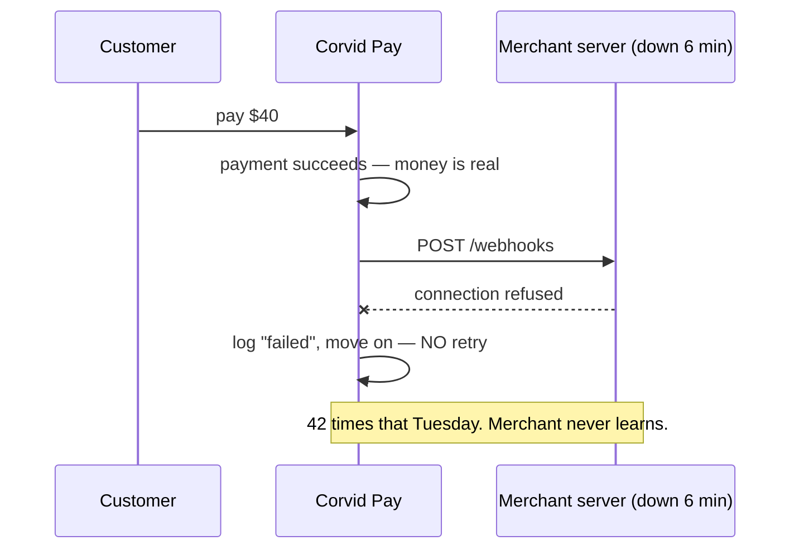

Obvious question: *why does a temporary blip on a server Corvid Pay doesn't control get to
permanently erase the fact that something happened?* Because "attempt to notify" and "notify
successfully" are treated as the same thing — try once, and if it fails, the event is gone.

**The fix, and the analogy for the rest of this story:** treat every delivery like a **courier
handing a package to a door Corvid Pay doesn't own and can't see through.** The first real fix any
courier company makes: **write down that a package needs delivering before the courier ever
leaves the warehouse** — so a failed first attempt doesn't erase the fact that a delivery is owed.

**New problem immediately:** a durable record of "this needs delivering" doesn't mean anyone ever
goes back and tries again. If Corvid Pay writes the event down but still only attempts once, the
package sits recorded, but just as undelivered as before.

**How I'd say this in an interview:** "The first bug in any naive webhook system is treating one
HTTP call as the whole guarantee — if it fails, the event's gone, and since the receiver is a
third party you don't control, failure is guaranteed to happen eventually. Fix starts with making
the event durable before any delivery attempt — but durability alone doesn't retry anything."

---

## Chapter 2 — The warehouse bin that fills up with undelivered packages

The fix: move the POST out of the request path. On success, Corvid Pay writes the event to a
durable queue — the courier's warehouse log — and a background worker does the actual POST. The
payment API is no longer at the mercy of a merchant's dead server, and the event is guaranteed to
exist the instant it's accepted — exactly requirement F2: *if accepted, guarantee an attempt.*

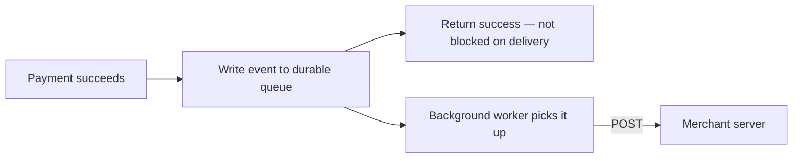

Corvid Pay grows to **40 events/sec**. Months later, a merchant's server goes down for **90
seconds**. The worker picks up the event, POSTs, gets connection-refused, and does exactly what
Chapter 1's code did: logs it and marks the event "attempted." One attempt was made — technically
satisfying "guarantee an attempt" — but the merchant still never gets the webhook. Same support
ticket, new shape.

Obvious question: *if the first knock fails, why does the courier just walk away?* Because nothing
tells the worker a failed attempt should ever be retried. A queue with a single delivery attempt
is Chapter 1's bug wearing a durability costume.

**How I'd say this in an interview:** "Decoupling delivery from the request path guarantees *an*
attempt — one knock, then silence if it fails. That's not enough on its own; retry is a separate
mechanism that has to be added on top."

---

## Chapter 3 — Knocking again, immediately, forever

The fix: on failure, don't mark it done — schedule another attempt. First version: retry every
**10 seconds**, no matter what, until it succeeds.

This makes things worse. A merchant's server, recovering from an unrelated overload, is barely
keeping up in its first 30 seconds back online. Corvid Pay's worker has been hammering that URL
every 10 seconds for 20 minutes — **120 stacked retries** — and they all land right in that fragile
recovery window, pushing the server back down.

Obvious question: *if a server is struggling, why does hammering it at a constant short interval
seem reasonable?* Because a fixed interval treats "failed once" and "failed 100 times in a row"
identically.

**The fix, a named analogy:** **exponential backoff** — each failure doubles the wait before the
next try (2s, 4s, 8s, 16s...). This is exactly what Stripe's own documented retry system does.
Back to the courier: instead of knocking every 10 seconds regardless, knock, then wait longer if
nobody answers, then longer still — room to recover, but still prompt for a one-off blip.

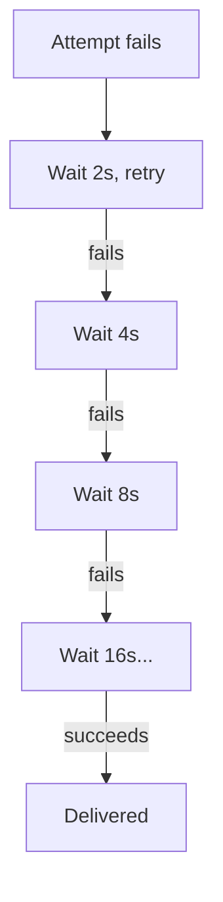

**New problem:** backoff fixes hammering a *recovering* server. It does nothing for a server
that's **gone for good** — a deleted, abandoned integration. Backoff just means the courier keeps
coming back with longer gaps, forever, to a door that will never open.

**How I'd say this in an interview:** "Fixed-interval retry hits a recovering server at the worst
moment. Exponential backoff — same thing Stripe documents on its own webhooks — fixes that. But it
still assumes the endpoint eventually comes back; it says nothing about an endpoint that never
will."

---

## Chapter 4 — The door that will never open, and the letter that goes back to the post office

Corvid Pay hits **800 events/sec**, a few thousand endpoints. A query turns up: **roughly 2 of
every 2,000 endpoints** haven't received a single successful delivery in **over a week** —
abandoned integrations, dead URLs. Backoff, by design, never gives up — the wait just keeps
growing, forever, for events that will never be delivered.

Obvious question: *at what point does "keep trying" stop being persistence and start being waste?*
There has to be a defined stop — postal services have called an undeliverable letter a **"dead
letter"** for over a century, and a dead-letter office is where it goes once delivery is given up
on, instead of retrying that address forever.

**The fix:** a bounded retry budget — a max number of attempts over a max window `[illustrative —
a policy choice, not a universal constant]` — after which the event stops retrying and moves to a
**dead-letter store**. The merchant is notified, and the event is available for manual replay
instead of silently consuming resources forever.

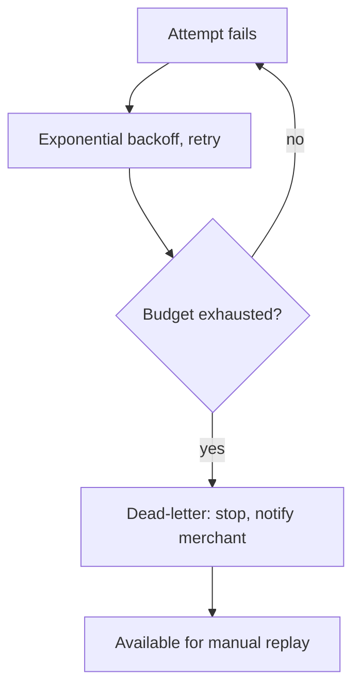

**New problem, the biggest yet:** all of this assumed Corvid Pay only had to think about one
endpoint at a time. But every delivery attempt competes for the same worker threads. A dead
endpoint stuck in a 32-second backoff wait is holding a worker hostage — and with enough dead or
slow endpoints at once, there may not be enough workers left to promptly serve the merchants whose
servers are perfectly healthy.

**How I'd say this in an interview:** "Retry has to be bounded, or you spend resources forever on
endpoints that will genuinely never come back — dead-lettering, borrowed straight from postal
terminology, is the right model. But that's still one endpoint's lifecycle — the next problem is
many endpoints sharing the same delivery capacity."

---

## Chapter 5 — The one bad address that blocks every other delivery on the truck

Corvid Pay's delivery workers are a **shared pool of 50 threads**. One large merchant's endpoint
starts timing out on *every* request — badly misconfigured, taking the full **30-second timeout**
every time. That merchant generates **60 events/sec**. At 30 seconds per attempt per worker, one
worker clears about 0.033 attempts/sec against it — keeping up would take roughly **1,800
worker-threads' worth of capacity**, dedicated. Corvid Pay has 50 total, shared across everyone.
Within minutes, the bad endpoint alone consumes the whole pool. Every other merchant's healthy,
fast deliveries stall behind it — latency for good endpoints jumps from under a second to **several
minutes**, because no worker is free to pick them up.

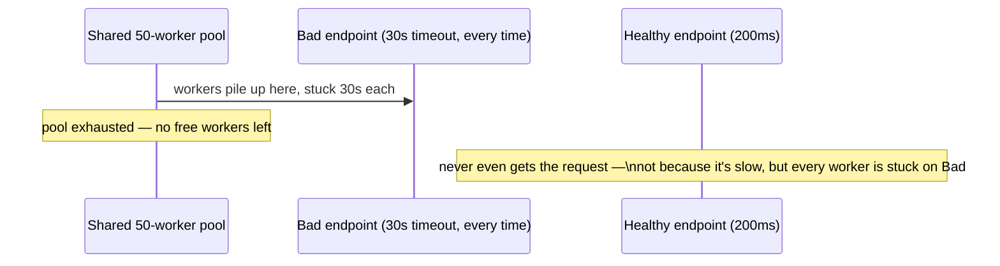

Obvious question: *why does one merchant's broken endpoint get to slow down delivery to
everyone?* Because the pool is shared, undifferentiated capacity.

**The fix, an analogy:** **bulkheading**, named for a ship's watertight bulkheads — internal walls
that keep a hull breach in one compartment from sinking the whole ship. Give each destination its
**own, isolated, bounded worker pool**. Merchant A's punctured hull stays inside A's compartment;
Merchant B keeps delivering at full speed, unaware anything is wrong.

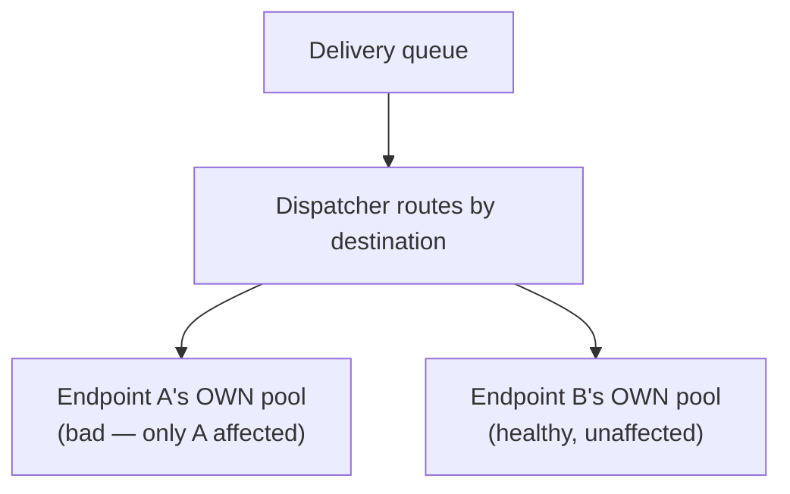

**New problem:** Corvid Pay has **2 million** registered endpoints total. Reserving a dedicated
pool for every one upfront would be wasteful — most merchants are low-volume and idle. The real
answer: allocate small pools **on demand**, only for endpoints actively receiving traffic right
now — exactly the sizing approach the reference guide's own capacity math lands on.

**How I'd say this in an interview:** "A shared worker pool lets one bad endpoint starve delivery
to every healthy one — bulkheading, the ship's-compartment idea, isolates capacity per
destination. Size those pools on demand, per *active* endpoint, not upfront for all 2 million
registrations."

---

## Chapter 6 — The payment that got fulfilled twice

Corvid Pay is at **3,000 events/sec**. Finance flags a merchant that shipped **two physical
orders** for a single `$120` payment. Digging in: the merchant's endpoint *did* receive and
process the event successfully — but took **6 seconds** to respond, against Corvid Pay's
**5-second** timeout. The worker gave up at 5s, assumed failure, and retried — correctly, by its
own logic. The retry landed seconds later, and the merchant's server, with no way to know "I
already fulfilled this exact payment," processed it as a new order.

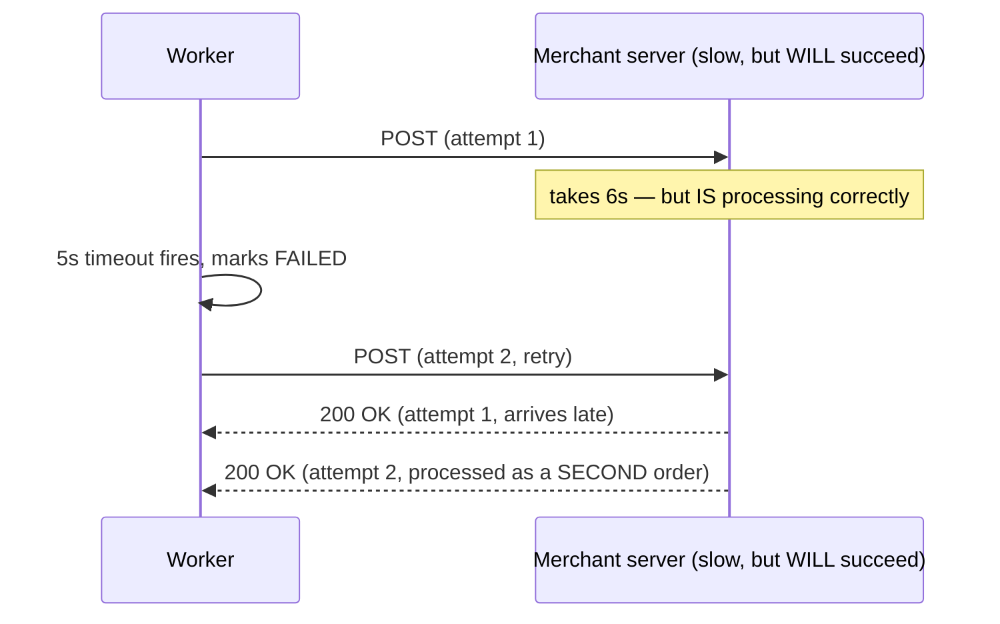

Obvious question: *whose fault is this?* Neither — this is just what **at-least-once delivery**
means. Promise "we retry on failure" and you've also promised the same event will sometimes
legitimately arrive more than once. That's a documented trade-off, not a bug — Stripe's own docs
say to expect duplicates and design for them.

**The fix, a named idea:** an **idempotency key** — a **tracking number stapled to the package**.
Every attempt for the same event carries the identical key, no matter how many retries. The
merchant is expected to check *"have I already processed this tracking number?"* before acting
again.

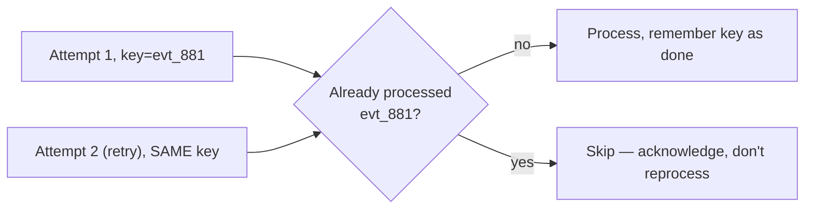

**New problem:** this only helps if the merchant's code actually checks the key — not every
merchant implements it well. So Corvid Pay's own side still has to minimize duplicates
independently, rather than trusting the receiver to always catch them. Which raises: exactly
*where* can a duplicate originate on Corvid Pay's own side? Retrying isn't the only path.

**How I'd say this in an interview:** "At-least-once guarantees duplicates eventually — not a
flaw, the honest cost of 'we promise an attempt and retry on failure.' Fix is a stable idempotency
key so the receiver can dedup — but that only helps if they implement the check, so the platform
still minimizes duplicates on its own side too."

---

## Chapter 7 — Three places a duplicate can sneak in, not one

Chapter 6's bug — a slow-but-successful response treated as a timeout and retried — is one path.
Worth naming all of them, because the common mistake is adding a dedup check at exactly one place
and assuming that's the whole problem solved.

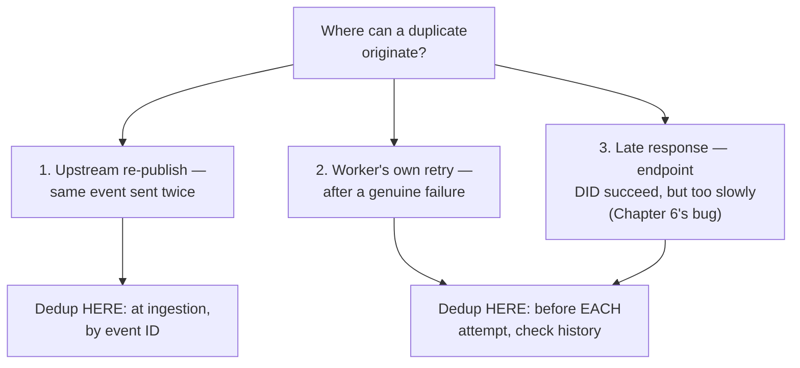

Corvid Pay adds an **ingestion-level dedup check**: on acceptance, has this exact event ID already
been queued? That closes path #1. It does nothing for path #3, since ingestion happened long
before the retry. Closing #3 needs a second, **attempt-level check** right before firing a retry:
*has this event's latest attempt already recorded a late success, even though my timeout marked it
a failure?* If yes, skip the retry.

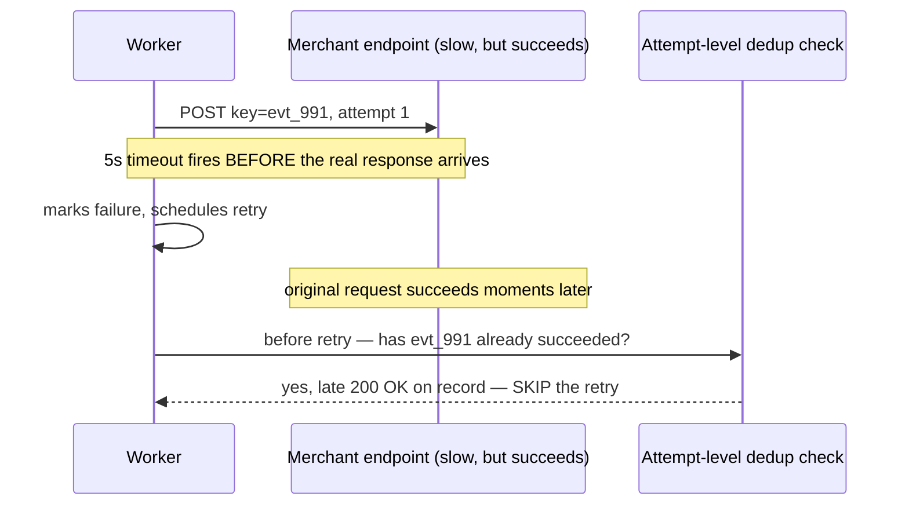

**New problem, an honest one:** even with both layers, Corvid Pay can push duplicates close to
zero but never mathematically guarantee zero — a network could still redeliver the same request in
a way no internal check sees. That's exactly why Chapter 6's idempotency key isn't
belt-and-suspenders — it's the last line of defense regardless of how good Corvid Pay's own dedup
gets.

**How I'd say this in an interview:** "Duplicates come from at least three places — upstream
re-publish, the worker's own retry, and a late response mistaken for a timeout. You need a dedup
check at ingestion for the first, and a second, attempt-level check before every retry for the
other two. Naming all three explicitly is reportedly what separates a passing answer here."

---

## Chapter 8 — The webhook that wasn't really from Corvid Pay

A researcher points out: a webhook URL is, from the internet's view, just a public HTTP endpoint.
Nothing proves a request actually came from Corvid Pay. In testing, a forged `payment.succeeded`
POST with a fabricated event ID and a `$500` amount, sent from an unrelated IP, is processed by a
test merchant's server exactly as if genuine — nothing ever checked the difference.

Obvious question: *how does a merchant know a request is genuinely from Corvid Pay?* Mutual TLS
works but is heavyweight to require of every merchant. The lighter, standard answer — exactly what
Stripe's own webhook docs describe — is **HMAC signing**.

**The fix, an analogy:** a **wax seal stamped on the package**, made with a stamp only Corvid Pay
and that merchant possess. Corvid Pay computes an HMAC over the payload using a secret shared with
that merchant, sends it in a header. The merchant recomputes the same HMAC with their copy of the
secret and compares. Match: genuine, process it. No match: reject — not really from Corvid Pay.

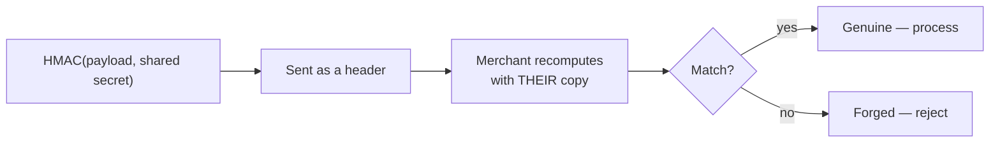

**New problem:** this only works while the shared secret stays secret. What happens the moment it
doesn't?

**How I'd say this in an interview:** "A webhook URL is public, unauthenticated infrastructure by
default — without a signature, anyone who finds it can forge a payload the merchant will process.
HMAC-signing every payload, exactly what Stripe documents, gives authenticity with just a shared
secret, no mutual TLS required."

---

## Chapter 9 — The leaked key, and the lock you can't swap instantly

A merchant accidentally commits their webhook secret to a public repo — a common, industry-wide
incident category, not unique to webhooks. The instinct is to rotate immediately. But the
merchant's server has that secret hardcoded, and redeploying it takes their team **a few hours**.
Flip the secret instantly, and every genuine webhook delivered in that gap fails signature
verification on their end — Corvid Pay would be blocking its own legitimate deliveries while
defending against a leak.

Obvious question: *how do you rotate a shared secret without both sides changing at the exact same
instant?* You don't try for instant — you make both keys **valid at once, briefly, on purpose.**

**The fix, an analogy:** a **new front-door key while the old one still opens the door for a
defined grace period.** Corvid Pay accepts signatures made with either the new or old secret for
an overlap window (long enough to redeploy — a day or two). The old secret retires only after the
window closes.

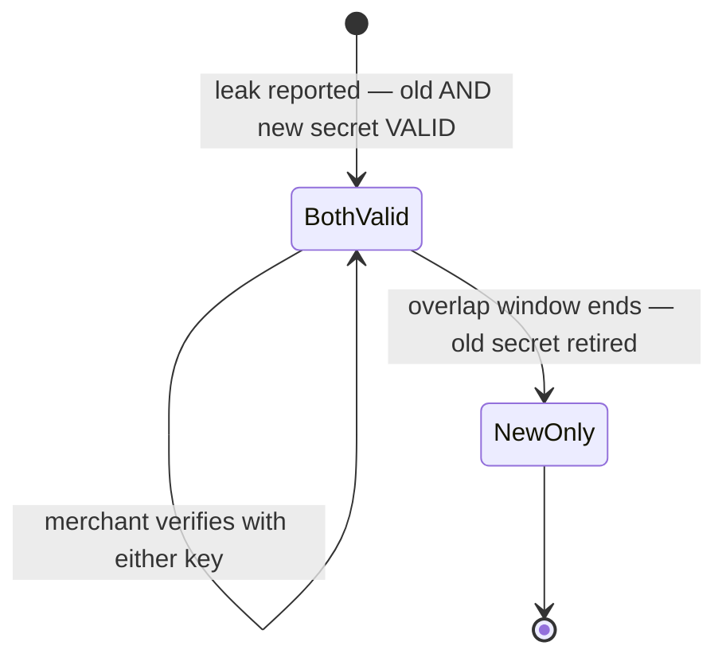

**How I'd say this in an interview:** "Secret rotation isn't an atomic flip — the merchant needs
time to redeploy, so both old and new secret must be valid for an overlap window, like handing out
a new key while the old one still works briefly. Treat it as first-class, not an afterthought — a
leaked secret is a real incident."

---

## Chapter 10 — "Did my payment even go through?"

Corvid Pay now runs close to the scale Stripe has reportedly described for its own webhook system
— on the order of **~10,000 events/sec** globally `[illustrative, matching the reported
Stripe-style scale]`, ~2 million endpoints, and a persistent tail of about **0.1%** of active
endpoints that never recover in the retry window and get dead-lettered. Support tickets settle
into one recurring shape: *"did my webhook for payment X get delivered? Can you resend it?"* The
only answer today is engineers digging through raw logs. This is exactly the gap **GitHub's own
webhook delivery UI** solves for repo owners: every attempt, its response, and a "redeliver"
button.

**The fix:** expose the attempt history Corvid Pay already records through a merchant-facing API
and dashboard, plus a manual **replay** action that re-queues a specific event on demand — the
same shape as GitHub's redelivery button, for payments instead of repo events.

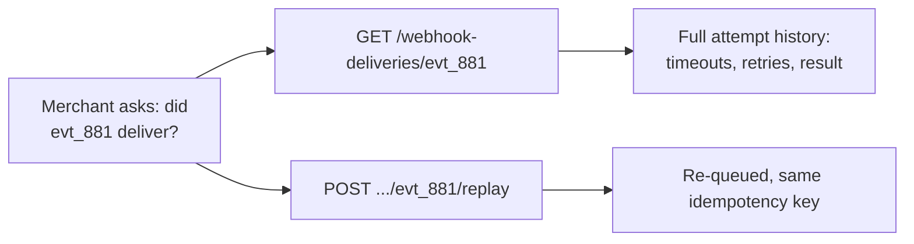

This closes the loop: a durable, retried, backed-off, bulkheaded, deduplicated, signed pipeline —
with a visible, self-service way for merchants to check its work, instead of a support ticket that
requires grepping logs.

**How I'd say this in an interview:** "Once delivery is reliable, the last piece is making that
reliability *visible* — a merchant-facing delivery history and manual replay, the same shape as
GitHub's own redelivery UI. Without it, 'did this arrive' is a support ticket; with it, it's a
self-service API call."

---

## Where the story actually lands

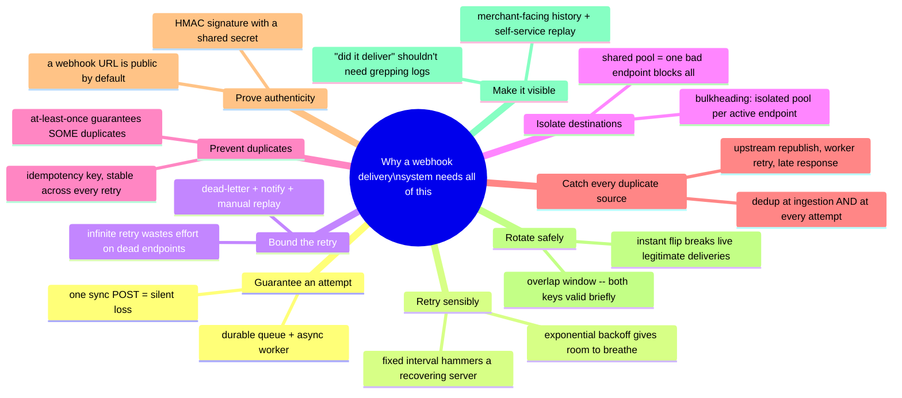

Every real webhook system you design in an interview sits *somewhere* on this chain. The skill
isn't reciting all ten chapters — it's stopping where the requirements say to stop. A low-stakes
notification webhook might reasonably stop around Chapter 5. A payments platform, where a
duplicate means double-fulfilling a real order, has to reach Chapter 6 and 7. If nobody's mentioned
security, walking straight into secret rotation unprompted reads as padding, not depth.

---

## Grill me — adversarial follow-ups

**Q1: "Why not just make the timeout longer instead of adding retry logic at all?"**
It helps a little but doesn't remove the problem, just moves the number — some server will always
be slower than whatever timeout you pick. Idempotency keys and attempt-level dedup solve the
actual problem regardless of the timeout value.

**Q2: "Isn't bulkheading wasteful — reserved capacity sitting idle for low-volume merchants?"**
A little, and that's worth naming — but it's cheap next to the alternative. A shared pool risks
platform-wide degradation from one bad endpoint; isolated pools sized on demand, only for
currently-active endpoints, keep the waste bounded instead of open-ended.

**Q3: "Isn't ingestion-level dedup plus the merchant's own idempotency check already enough?"**
No — ingestion-level dedup only catches an upstream re-publish; it does nothing for a worker
retrying its own already-successful attempt because the response was slow. And not every merchant
implements their check correctly. Attempt-level dedup closes the gap the platform actually
controls.

**Q4: "What determines whether a delivery counts as a success?"**
Any 2xx status code, full stop — the simplest, most robust classification, and what Stripe's own
model uses. Requiring specific response content would make integrations more fragile for no real
benefit.

**Q5: "Doesn't a bounded dead-letter budget mean some events are just permanently lost?"**
Quarantined, not lost — the event and its attempt history sit in the dead-letter store, the
merchant is notified, and it's replayable on demand. That trades bounded resource usage for
requiring a human to notice and act, instead of retrying forever with no payoff.

**Q6: "Couldn't an attacker who intercepts one delivery just replay it themselves indefinitely?"**
That's exactly why the signature and the idempotency key solve two different problems — the
signature proves authenticity, and even a captured genuine payload replayed by an attacker still
needs the merchant's own idempotency check to avoid double-processing it, same as any real retry.

**Q7: "Why HMAC and a shared secret instead of requiring mutual TLS?"**
Mutual TLS is stronger but a much heavier lift — certificate management most small merchants don't
want to run. HMAC over a shared secret gets provable authenticity with just "store a string
safely," which is why it's the standard approach, including Stripe's.

**Q8: "What's the actual failure if you skip the overlap window and flip the secret instantly?"**
Every webhook delivered before the merchant finishes redeploying — per the story, several real
hours — fails signature verification even though it's genuine. You'd be blocking your own
legitimate traffic while defending against a leak, worse than a brief window of dual-key validity.

**Q9: "At ~10,000 events/sec, does per-endpoint bulkheading scale, or does managing that many tiny
pools become its own bottleneck?"**
The capacity math answers it: most of the 2 million registered endpoints are idle at any moment,
so pools are allocated on demand only for currently-active endpoints, not reserved upfront for
every registration — that keeps the live pool count manageable even at full scale.

**Q10: "If someone just says 'design a webhook system' cold, where do you start?"**
Say the reframe first: this is a reliability exercise, not a data-flow exercise, because the
receiver is untrusted third-party infrastructure by design. Then walk forward only as far as the
requirements need — durable queue and backoff retry are close to a given, but bulkheading,
multi-layer dedup, and signing are earned by naming the specific failure they prevent, not bolted
on for their own sake.

---

## Cheat sheet — one line per stop on the story

- **Synchronous POST, no retry**: one failed call to a server you don't control silently erases
  the fact that an event happened — the whole reason this system exists.
- **Durable queue + async worker**: guarantees *an* attempt, but one attempt that gives up on
  failure is still Chapter 1's bug in a durability costume.
- **Exponential backoff**: fixed-interval retry hammers a struggling server at the worst moment;
  growing the wait (2s, 4s, 8s...) gives it room to recover.
- **Bounded retry + dead-letter**: never retry forever against endpoints that will genuinely never
  come back — stop, notify, make it available for manual replay, the postal dead-letter idea.
- **Per-endpoint bulkheading**: a shared pool lets one bad endpoint starve every healthy one —
  isolate worker capacity per destination, sized on demand for currently-active endpoints only.
- **Idempotency key, stable across every retry**: at-least-once guarantees duplicates — the fix is
  a tracking-number-style key the receiver can dedup on, not eliminating retries.
- **Dedup at every retry boundary**: duplicates come from an upstream re-publish, the worker's own
  retry, or a late response mistaken for a timeout — one layer of checks misses the other two.
- **HMAC signature**: a webhook URL is public, unauthenticated by default — signing every payload
  with a shared secret proves a delivery is genuinely from the platform.
- **Secret rotation with an overlap window**: an instant flip breaks legitimate in-flight
  deliveries during the receiver's redeploy — keep both old and new secrets valid briefly.
- **Delivery history + manual replay**: reliable delivery only helps if it's *visible* — a
  merchant-facing attempt history and self-service redeliver, the same shape as GitHub's webhook UI.
- **The meta-lesson**: every fix buys one property (durability, retry, boundedness, isolation,
  dedup-on-receipt, dedup-on-send, authenticity, safe rotation, or visibility) by adding one more
  layer of honest complexity — say the trade in the same sentence you propose the fix.
