# Design a Webhook Delivery System (Stripe-style) — FAANG Interview Guide

> Source chapter type: outbound reliable delivery to infrastructure you don't control. Confirmed
> asked at **Stripe**: "design a system that receives an internal event, finds the merchant's
> configured webhook URLs, and delivers the HTTP POST request to their servers... ~10,000 events
> per second globally... if the system accepts an event internally, it must guarantee an attempt
> to deliver it." Distinct from every other chapter in this course: everywhere else, you control
> both ends of the connection or at least the receiving service. Here, the **receiving endpoint is
> a third party's server**, of unknown reliability, unknown latency, and unknown correctness — and
> a single slow or broken customer endpoint must never be allowed to affect delivery to anyone
> else's.

## Mental model

An internal event happens (a payment succeeds, a subscription renews) and needs to reach every
merchant who's configured a webhook URL to hear about it — via a plain HTTP POST to a server the
platform doesn't operate, can't monitor, and has no control over. Three problems that don't arise
anywhere else in this course:

1. **The receiving endpoint is unreliable by assumption, not by exception.** A merchant's server
   can be down, slow, misconfigured, or return a confusing response — the delivery system must
   retry with backoff, but retries themselves create the risk of delivering the same event twice.
2. **One bad endpoint must never degrade delivery to every other endpoint.** If Merchant A's
   server takes 30 seconds to respond (or never responds), that cannot consume the same worker
   pool serving Merchant B's healthy, fast endpoint — this needs **bulkheading**, isolating
   retry/delivery work per destination.
3. **Deduplication has to be enforced at every layer where a retry can happen, not just one.** A
   retry can originate from the delivery worker retrying its own failed attempt, from the merchant's
   endpoint returning a slow success that looks like a timeout and gets retried anyway, or from an
   upstream event being re-published — a single dedup check at one layer catches only one of these
   paths.

**The one sentence to say out loud:** *"This is a reliability exercise, not a data-flow exercise —
the receiving endpoint is untrusted infrastructure by design, and the entire system exists to
guarantee an attempt was made, isolate one bad endpoint from every other, and prevent duplicate
delivery across every layer a retry can originate from, not just one."*

**The one picture to remember forever:**

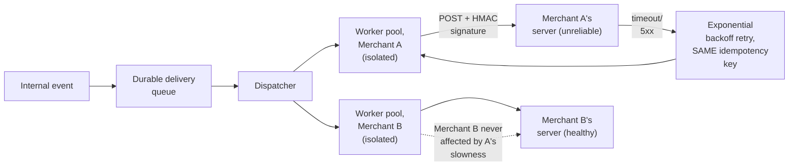

**Memory hook:** *"Isolate per destination so one bad endpoint can't starve another's delivery,
retry with backoff using the same idempotency key every time, and check for duplicates at every
boundary a retry can occur — worker retry, endpoint's own slow response, and upstream
re-publish."*

---

## Table of contents
[How to Identify This Topic](#how-to-identify-this-topic-in-an-interview) ·
[Interview Playbook](#interview-playbook) · [Requirements](#requirements-clarification) ·
[Capacity Estimation](#capacity-estimation-worked) · [API Design](#api-design) ·
[High-Level Architecture](#high-level-architecture) ·
[Architecture Evolution v1→v2→v3](#architecture-evolution-v1--v2--v3) ·
[End-to-End Walkthroughs](#end-to-end-request-walkthroughs) ·
[Deep Dive: Per-Endpoint Bulkheading](#deep-dive-per-endpoint-bulkheading) ·
[Deep Dive: Deduplication at Every Retry Boundary](#deep-dive-deduplication-at-every-retry-boundary) ·
[Deep Dive: Exponential Backoff & Dead-Lettering](#deep-dive-exponential-backoff--dead-lettering) ·
[Deep Dive: Signature Verification](#deep-dive-signature-verification) ·
[Data Model](#data-model) · [Failure Modes](#failure-modes--mitigations) ·
[Non-Functional Walkthrough](#non-functional-walkthrough) ·
[Security & Compliance](#security--compliance) · [Cost & Trade-offs](#cost--trade-offs) ·
[Wrap-Up](#wrap-up-mvp-vs-stretch) · [Golden Rules](#golden-rules) ·
[Cheat Sheet](#master-cheat-sheet)

---

## How to identify this topic in an interview

- "Design a webhook delivery system" — confirmed as an actual Stripe architecture-challenge
  interview question, described by the interviewer's own framing as testing whether a candidate
  treats it as a reliability exercise or (incorrectly) a data-flow exercise.
- The tell that distinguishes this from a normal event-fan-out chapter: the interviewer emphasizes
  that the **destination is a third party's server you don't control** — that single fact is what
  makes bulkheading and multi-layer dedup the actual substance of the chapter.
- A follow-up like "what if one merchant's endpoint is extremely slow" is the
  [bulkheading deep dive](#deep-dive-per-endpoint-bulkheading) — reportedly the exact kind of
  pressure-testing Stripe interviewers apply.

---

## Interview playbook

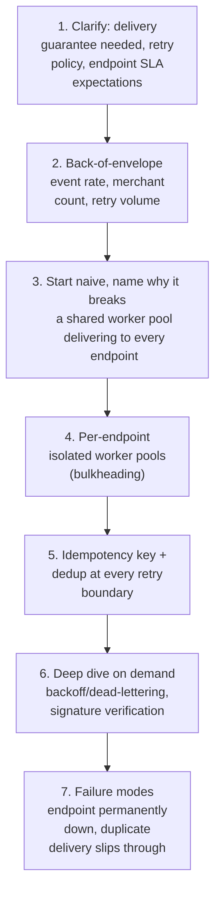

**What the interviewer is actually grading at each step:**
- Step 3: do you recognize, unprompted, that a shared worker pool means one slow/dead endpoint can
  exhaust delivery capacity for every other, healthy endpoint?
- Step 5: do you know that dedup needs to be enforced at *every* layer a retry can originate from —
  the reported common failure mode is proposing retry logic at only one layer?
- Step 6: do you have a concrete answer for "what happens when an endpoint has been down for
  days" — dead-lettering with a defined, communicated policy, not indefinite retries?

---

## Requirements clarification

### Functional

| # | Requirement | Notes |
|---|---|---|
| F1 | Deliver an internal event as an HTTP POST to every webhook URL a merchant has configured for it | The core function |
| F2 | Guarantee at least one delivery attempt for every accepted event | The reported Stripe framing: "if the system accepts an event internally, it must guarantee an attempt to deliver it" |
| F3 | Retry failed deliveries with backoff, without ever double-processing on the merchant's side due to the retry itself | Delivery guarantee and duplicate-prevention are two distinct requirements, not one |
| F4 | Sign every delivered payload so the merchant can verify it actually came from the platform | Standard webhook security practice |
| F5 | Let merchants view delivery/attempt history and manually replay a past event | An operational transparency feature, not just a delivery pipeline |

### Non-functional

| Requirement | Target | Why this number |
|---|---|---|
| Delivery guarantee | At-least-once attempt per event, guaranteed | The core reliability promise; losing an accepted event silently is the worst failure mode in this chapter |
| Isolation between destinations | Strict — one endpoint's failure/slowness must not measurably affect delivery latency to any other endpoint | The bulkheading requirement, non-negotiable at Stripe's reported ~10,000 events/sec scale |
| Duplicate-delivery rate | As close to zero as achievable, enforced at every retry boundary | A duplicate delivery can cause a merchant to double-process a payment event — a real financial-correctness risk on the receiving end |
| Retry backoff behavior | Exponential, bounded, eventually dead-lettering | Retrying forever at a fixed interval either gives up too early or hammers a dead endpoint indefinitely |
| Delivery latency (healthy endpoint) | Low, seconds, for the first attempt | Merchants build real-time logic (e.g. order fulfillment) on webhook timeliness |

**Clarifying questions worth asking the interviewer up front — and what each answer changes:**

| Question | If the answer is... | ...then this changes |
|---|---|---|
| "Is 'guarantee an attempt' the delivery promise, or must delivery eventually succeed no matter what?" | At-least-once attempt, with eventual dead-lettering if the endpoint never recovers | Confirms retries are bounded, not infinite — a defined dead-letter policy is in scope, not "retry forever" |
| "How is a delivery considered successful — any 2xx, or does the merchant need to respond with specific content?" | Any 2xx response | Confirms the success/failure classification logic at the HTTP-status level, which drives the retry decision |
| "Should slow endpoints affect delivery to other merchants at all?" | No, strict isolation required | Confirms per-endpoint worker-pool isolation (bulkheading) is a hard requirement, not a nice-to-have |
| "Do merchants need visibility into delivery attempts and the ability to manually replay?" | Yes | Confirms an audit/replay UI and underlying attempt-history storage are in scope |

**Say this out loud in the interview:** *"I'm going to treat this explicitly as a reliability
problem — the receiving endpoint is untrusted, third-party infrastructure by design, and I want
dedup enforced at every layer a retry could originate from, not just wherever it's most
convenient to add a check."*

---

## Capacity estimation, worked

```
Given (illustrative, matching the reported Stripe scale):
  Events requiring webhook delivery, globally           = 10,000/sec
  Average webhook subscriptions per event (a merchant
    can subscribe multiple endpoints to the same
    event type)                                            = 1.3
  Total delivery attempts (first tries only)                = 13,000/sec

Retry volume:
  Illustrative first-attempt failure rate (endpoint down,
    slow, or erroring)                                        ~= 5%
  First retries/sec                                            = 13,000 x 0.05 = 650/sec
  Illustrative retry-success rate per attempt                   ~= 60% (most transient issues
                                                                    resolve within a couple of
                                                                    retries)
  -> retry volume tapers geometrically (650, ~260, ~104, ...) but never fully disappears --
     a small, persistent tail of endpoints that are down for extended periods keeps SOME
     retry traffic alive far longer than the bulk of it, which is exactly why a bounded
     backoff-then-dead-letter policy is necessary rather than "keep retrying until success."

Per-endpoint isolation sizing:
  Merchant endpoints, globally                              = ~2,000,000
  Endpoints actively receiving events at any given moment
    (most merchants are low-volume)                           = a small fraction of the total
  -> worker-pool allocation per endpoint doesn't need to be uniform -- a fixed small pool per
     ACTIVE endpoint, allocated on demand, is far more efficient than reserving dedicated
     capacity for all 2,000,000 registered-but-mostly-idle endpoints upfront.

Dead-letter volume:
  Illustrative endpoints that never recover within the
    retry window (misconfigured, abandoned integration)        ~= 0.1% of active endpoints
  -> a small percentage, but at 2,000,000 registered endpoints, still a real, non-trivial
     absolute number of dead-lettered events needing a defined policy (merchant notification,
     eventual event expiry) rather than silent, indefinite accumulation.
```

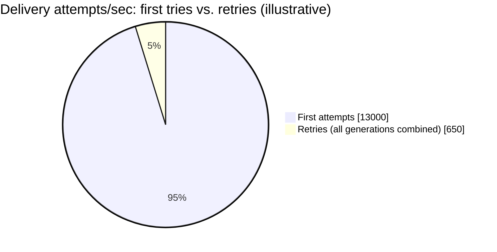

Retries are a small fraction of total volume, but per the capacity math, a persistent tail of
them never fully disappears — exactly why a bounded backoff-then-dead-letter policy, not
indefinite retry, is required.

**Redo-the-chain test:** if average webhook subscriptions per event rises from 1.3 to 3 (merchants
increasingly fanning one event to multiple internal systems via separate endpoints), total
delivery-attempt volume scales proportionally to ~30,000/sec — a direct, computable cost of
richer merchant-side integration patterns.

**The number worth memorizing:** retry volume tapers geometrically but never fully disappears —
a small, persistent tail of genuinely dead endpoints is why a bounded backoff-then-dead-letter
policy, not indefinite retry, is the only sustainable design.

---

## API design

### Delivery attempt (platform → merchant endpoint)

```
POST https://merchant-configured-url.example.com/webhooks
Headers:
  X-Signature: hmac-sha256=... (see signature deep dive)
  X-Idempotency-Key: evt_88213_attempt
  X-Delivery-Attempt: 3
Body:
{
  "eventId": "evt_88213",
  "eventType": "payment.succeeded",
  "createdAt": "2026-07-24T18:00:00Z",
  "data": { "...": "..." }
}
```

### `GET /v1/webhook-deliveries/{eventId}` (merchant-facing, delivery history)

```json
{
  "eventId": "evt_88213",
  "endpoint": "https://merchant-configured-url.example.com/webhooks",
  "attempts": [
    { "attemptNumber": 1, "status": "TIMEOUT", "attemptedAt": "2026-07-24T18:00:01Z" },
    { "attemptNumber": 2, "status": "SUCCESS", "attemptedAt": "2026-07-24T18:00:31Z" }
  ]
}
```

### `POST /v1/webhook-deliveries/{eventId}/replay` (manual re-delivery)

```json
{ "requestedBy": "merchant_ops_user" }
```

| Field | Notes |
|---|---|
| `X-Idempotency-Key` | Identifies the *event*, not the individual attempt — every retry of the same event carries the same key, so the merchant's own endpoint can (and should) dedup on it |
| `X-Delivery-Attempt` | Exposed so the merchant's own logging/debugging can distinguish a first attempt from a retry, without affecting the idempotency contract itself |
| `attempts` | The full history, not just the latest — this is the audit trail the requirements call for |

**The one sentence worth saying about the API surface:** *"The idempotency key is stable across
every retry of the same event — this is the contract that lets the merchant's own endpoint safely
dedup on its side, which matters because the platform's own dedup can reduce, but never fully
eliminate, the chance of a duplicate delivery reaching them."*

---

## High-level architecture

### Architecture evolution (v1 → v2 → v3)

**v1 — a shared worker pool delivers to every endpoint:**

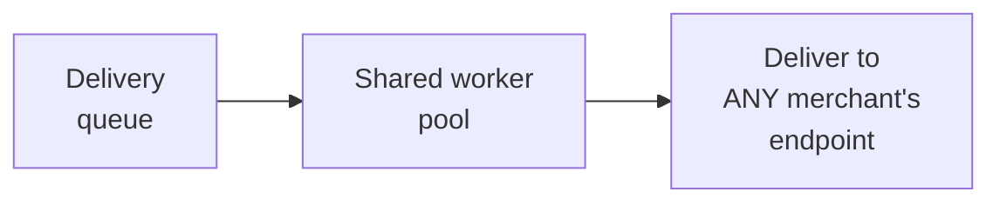

**Why it breaks:** if one merchant's endpoint is slow or hanging, the workers assigned to deliver
to it stay occupied for the full timeout duration — at any real event volume, this starves the
shared pool's capacity to deliver to every *other*, healthy endpoint too, exactly the isolation
failure the requirements explicitly rule out.

**v2 — per-endpoint isolation added, but retry logic lives in only one place:**

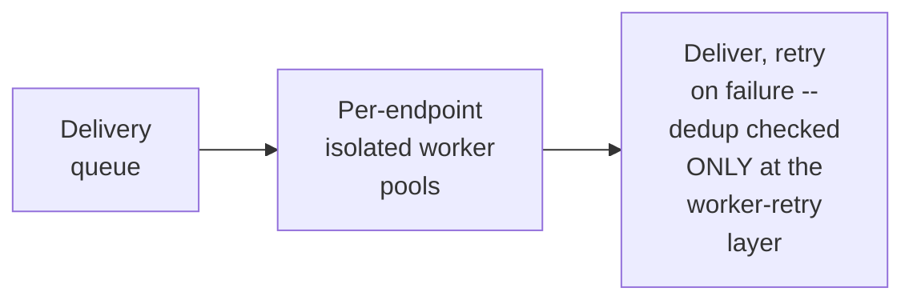

**Why it breaks:** bulkheading (v2's real improvement) solves the isolation problem. But per the
reported Stripe interviewer's own framing, dedup enforced at only one layer misses the other paths
a duplicate can originate from — a slow-but-eventually-successful response that the worker
mistakes for a timeout and retries anyway, or an upstream event getting re-published — neither of
which the worker-retry-layer's own dedup check catches.

**v3 — the real system: bulkheaded delivery + dedup enforced at every retry boundary:**

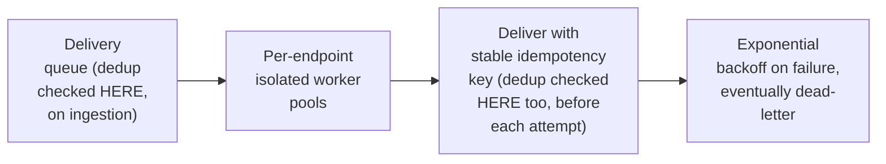

**What v3 fixes, one line each:** bulkheading (already in v2) prevents one bad endpoint from
starving others; and checking for duplicates both at event ingestion (has this exact event already
been queued?) and immediately before each delivery attempt (has this exact attempt already
succeeded, even if the worker's own response handling thought it timed out?) closes the gaps a
single-layer check leaves open.

---

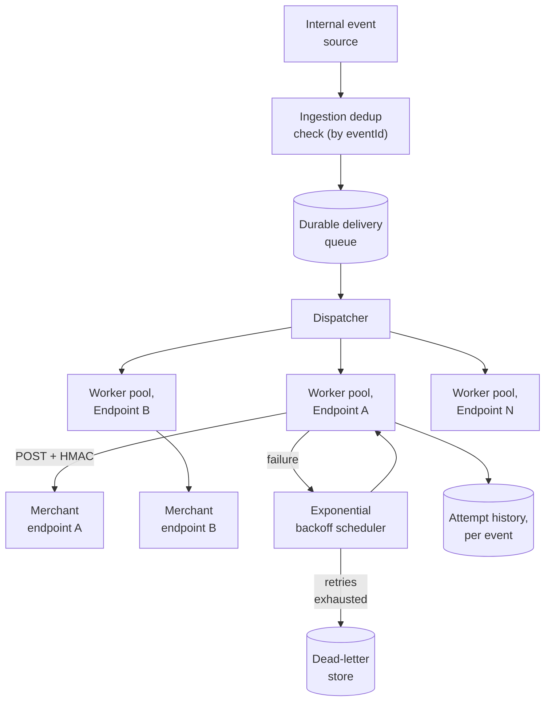

| Component | Role |
|---|---|
| Ingestion dedup check | The first layer — rejects a duplicate before it even enters the delivery queue |
| Per-endpoint worker pools | The bulkheading mechanism — each endpoint's delivery capacity is isolated from every other's |
| Backoff scheduler | Reschedules failed attempts with exponentially increasing delay, eventually routing to dead-letter |
| Dead-letter store | The defined endpoint for events that exhaust their retry budget — not silent, indefinite accumulation |
| Attempt log | Every attempt, success or failure, for the merchant-facing history/replay feature |

---

## End-to-end request walkthroughs

### Walkthrough 1 — normal delivery, one retry, then success

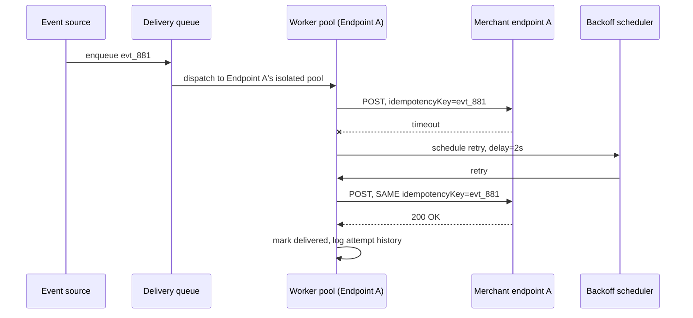

### Walkthrough 2 — one dead endpoint never affects a healthy one

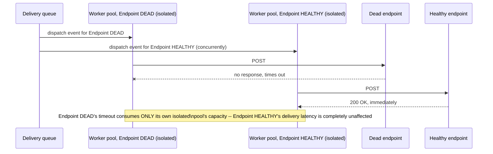

### Walkthrough 3 — dedup catches a duplicate at the attempt layer, not just ingestion

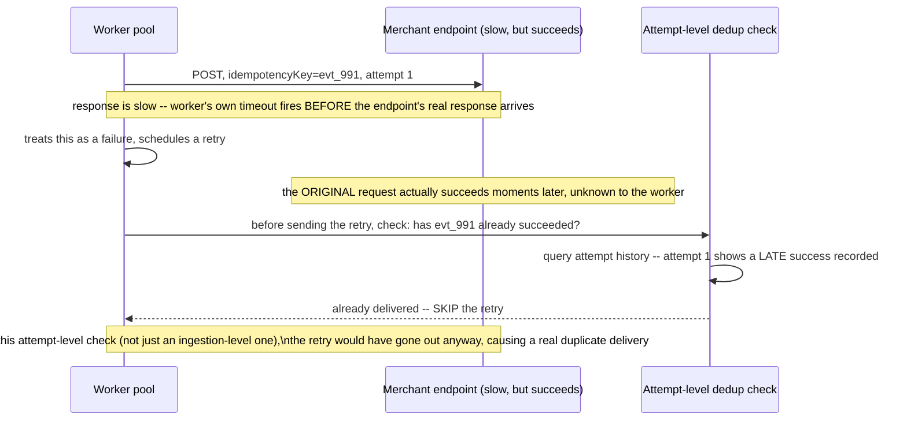

Walkthrough 3 is the concrete case behind the reported Stripe interviewer's own framing — dedup at
only the ingestion layer would have missed this exact scenario entirely.

---

## Deep dive: per-endpoint bulkheading

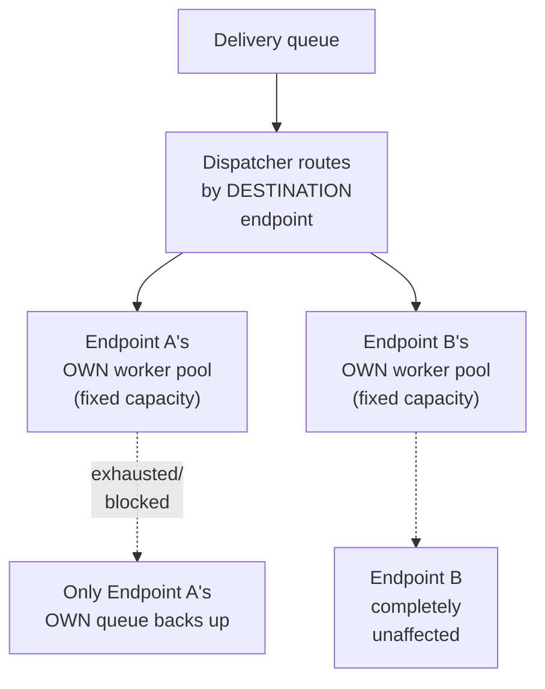

**Why this is called "bulkheading," and why the naval metaphor is the right one:** a ship's
bulkheads divide the hull into isolated compartments so a breach in one doesn't sink the whole
vessel — applied here, isolating delivery capacity per destination means one endpoint's failure
mode (slow, hanging, erroring) is contained to that endpoint's own compartment, never flooding
into another's.

**Why uniform, small per-endpoint pools (not one giant shared pool with priority queuing) is the
right mechanism, not just a nice property of the naive design:** priority queuing within a shared
pool still allows a sufficiently large number of slow endpoints to collectively starve the whole
pool's throughput; genuinely separate, bounded capacity per endpoint is what gives an ironclad
guarantee, not just a statistical improvement.

**Interview cheat-sheet:** *"Bulkhead by destination endpoint — isolated, bounded worker pools per
endpoint, not a shared pool with priority queuing, which only reduces the blast radius of a bad
endpoint rather than eliminating it."*

---

## Deep dive: deduplication at every retry boundary

Already the centerpiece of walkthrough 3 and the reported interviewer framing — the deep dive
states the general principle.

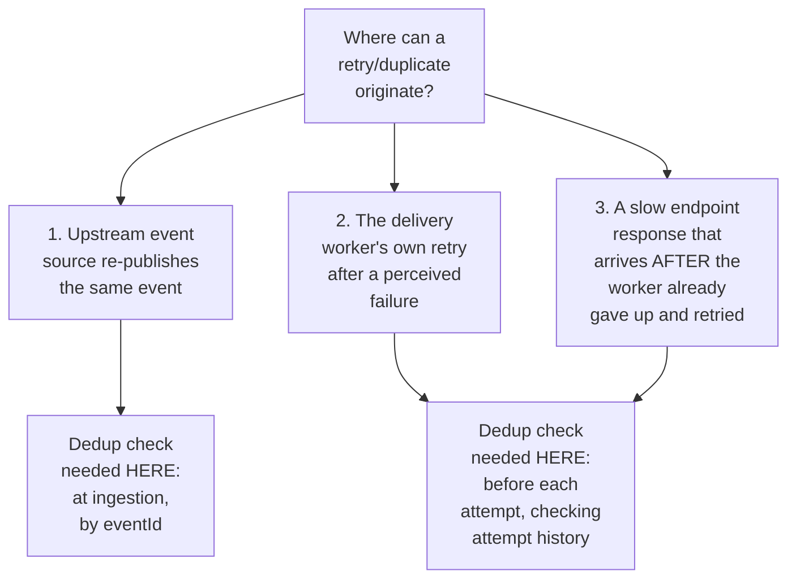

**Why this needs to be stated as a checklist of distinct boundaries, not a single "add dedup"
instruction:** the reported common failure mode is proposing retry/dedup logic at only one layer
— naming the boundaries explicitly (upstream re-publish, worker retry, late-arriving response) is
what demonstrates the thoroughness the interviewer is reportedly testing for.

**Interview cheat-sheet:** *"List the specific places a duplicate can originate from, and put a
dedup check at each one — this is reportedly the exact thing that separates a passing answer from
a failing one at Stripe specifically for this question."*

---

## Deep dive: exponential backoff & dead-lettering

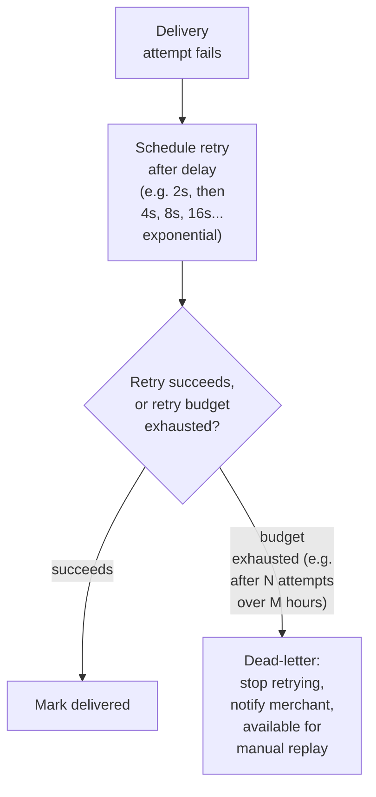

**Why exponential, not fixed-interval, backoff:** a fixed short interval hammers a struggling
endpoint at exactly the moment it's least able to handle load; exponential backoff gives a
struggling endpoint increasing recovery time between attempts while still retrying promptly for
transient blips.

**Why dead-lettering, not infinite retry, is the correct terminal state:** per the capacity
estimate, a small but real percentage of endpoints never recover — retrying them forever wastes
resources indefinitely for no eventual benefit; dead-lettering with merchant notification and a
manual-replay option converts an open-ended problem into a bounded one with a clear, actionable
signal to the affected merchant.

**Interview cheat-sheet:** *"Exponential backoff, bounded by a maximum retry budget, terminating
in a dead-letter state with merchant notification — never infinite retry, which wastes resources
on a persistent tail of genuinely dead endpoints with no eventual payoff."*

---

## Deep dive: signature verification

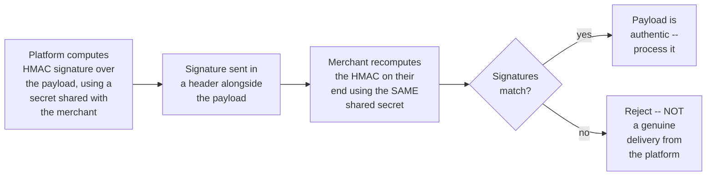

**Why this matters specifically because the destination is public-facing, unauthenticated
infrastructure by default:** a merchant's webhook URL is, from the platform's perspective, just an
HTTP endpoint — without a signature, anyone who discovers or guesses that URL could send a forged
payload the merchant's system would process as if it were genuine (e.g., a fake
`payment.succeeded` event). HMAC signing lets the merchant verify authenticity without requiring
mutual TLS or any more heavyweight authentication scheme.

**Interview cheat-sheet:** *"Sign every payload with an HMAC over a shared secret — this is what
lets an internet-facing webhook endpoint verify a delivery is genuinely from the platform, not a
forged request from anyone who found the URL."*

---

## Data model

**Delivery lifecycle:**

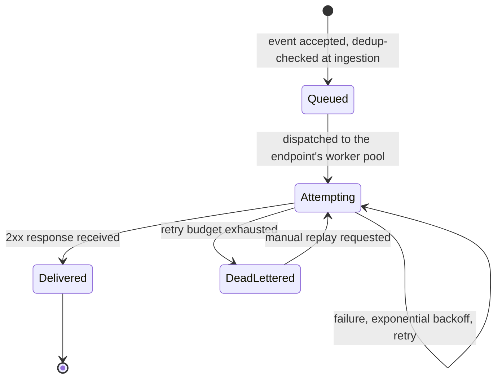

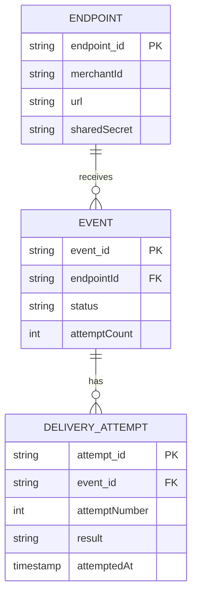

| Table | Storage choice & why |
|---|---|
| `Event` | The dedup-checked record per event/endpoint pair — `status` and `attemptCount` are what the backoff scheduler and dead-letter policy read |
| `DeliveryAttempt` | Append-only, one row per attempt — the full audit trail behind the merchant-facing history/replay feature |

---

## Failure modes & mitigations

| Failure mode | Impact | Mitigation |
|---|---|---|
| **A merchant's endpoint is down for an extended period** | Retries alone can't succeed; indefinite retry wastes resources | Bounded retry budget, terminating in dead-letter with merchant notification and manual replay |
| **A slow endpoint's response arrives after the worker has already retried** | Risk of a genuine duplicate delivery | Attempt-level dedup check before every retry, not just at ingestion, per the dedup deep dive |
| **One endpoint's failures consume shared delivery capacity** | Every other merchant's delivery latency degrades | Per-endpoint worker-pool bulkheading, per its own deep dive |
| **A merchant's shared secret is compromised** | Forged payloads could pass signature verification | Support secret rotation with a defined overlap window (both old and new secrets valid briefly) so rotation doesn't require perfectly-timed coordination |

---

## Non-functional walkthrough

**Scaling delivery capacity is naturally partitioned by destination endpoint**, per the
bulkheading deep dive — this is what makes horizontal scaling straightforward: add worker
capacity per active endpoint, not one shared pool that has to be sized for worst-case aggregate
load.

**Availability of the ingestion/queueing path must be very high** — the reported delivery
guarantee ("if accepted, an attempt is guaranteed") depends entirely on events never being lost
between acceptance and the delivery queue.

**Consistency requirements are asymmetric:** the dedup state (has this event/attempt already
succeeded) must be strictly, immediately consistent to prevent duplicates; the merchant-facing
delivery-history view can tolerate a small amount of eventual-consistency lag without any real
harm.

---

## Security & compliance

- **HMAC signature verification** is the primary authenticity mechanism, per its own deep dive —
  worth naming as the answer to "how does the merchant know this is really from us."
- **Secret management and rotation** for the shared HMAC secrets is a real operational security
  requirement, not an afterthought — a leaked secret compromises the authenticity guarantee for
  that specific merchant until rotated.
- **Payload content minimization** — webhook payloads should carry only what the merchant needs
  to act on the event, not an unbounded dump of internal data, reducing exposure if a payload is
  ever intercepted or logged insecurely on the merchant's end.

---

## Cost & trade-offs

**Per-endpoint bulkheading trades some resource inefficiency (small pools per endpoint, some
idle capacity for low-volume merchants) for the isolation guarantee the requirements demand** — an
easy trade given that the alternative (a shared pool) risks platform-wide delivery degradation
from a single bad endpoint.

**Bounded retry-then-dead-letter trades "eventually consistent, no matter how long it takes"
delivery semantics for a predictable, resource-bounded system** — worth naming explicitly if asked
to justify not retrying indefinitely.

---

## Wrap-up: MVP vs. stretch

**In scope for an MVP:**
- Durable delivery queue with ingestion-level dedup by event ID.
- Per-endpoint worker-pool bulkheading.
- Exponential backoff with a bounded retry budget, terminating in dead-letter.
- HMAC signature on every delivered payload.

**Explicitly out of scope for an MVP:**
- Attempt-level dedup (the late-response race in walkthrough 3) — start with ingestion-level dedup
  and worker-retry dedup, add the attempt-level check once the specific race is confirmed to
  matter at real scale.
- Manual replay UI — start with dead-lettering and notification, add self-service replay once
  merchant demand justifies the tooling investment.

**Stretch goals, worth naming if asked "what's next":**
1. **Attempt-level dedup for the late-response race**, closing the specific gap walkthrough 3
   illustrates.
2. **Configurable per-merchant retry policies**, letting sophisticated merchants tune backoff/
   retry-budget parameters for their own integration's needs.
3. **Delivery-latency SLA monitoring per endpoint**, proactively flagging a merchant's endpoint as
   degraded before it fully dead-letters.

---

## Golden rules

- **Treat this as a reliability exercise, not a data-flow exercise** — the reported Stripe framing
  of the question itself.
- **Bulkhead by destination endpoint** — isolated worker pools, not a shared pool with priority
  queuing, is what actually prevents one bad endpoint from starving every other.
- **Enforce dedup at every boundary a retry can originate from** — upstream re-publish, worker
  retry, and late-arriving responses are three distinct boundaries, not one.
- **Bound retries and terminate in a defined dead-letter state** — never retry indefinitely
  against a persistent tail of genuinely dead endpoints.
- **Sign every payload with HMAC** — the destination is public-facing, unauthenticated
  infrastructure by default, and signing is what lets the merchant verify authenticity.

---

## Master cheat sheet

**One-liners:**
- The receiving endpoint is untrusted, third-party infrastructure by design — every design
  decision should be justified against that assumption.
- Bulkhead by destination endpoint so one bad endpoint's failure never measurably affects delivery
  to any other.
- Dedup needs a check at every retry boundary: upstream re-publish, worker retry, and
  late-arriving responses — one layer alone misses the others, reportedly the exact failure mode
  Stripe interviewers probe for.
- Exponential backoff with a bounded budget, terminating in a defined dead-letter state — never
  infinite retry.
- HMAC-sign every payload so a public-facing, unauthenticated endpoint can verify authenticity.

**Formula chain:**
```
total_delivery_attempts   = events_per_sec x avg_subscriptions_per_event
retry_volume(attempt_n)    = first_attempt_failures x (1 - retry_success_rate)^(n-1)
```

**Numbers:** reported real-world scale is on the order of ~10,000 events/sec globally at Stripe ·
retry volume tapers geometrically but never fully disappears, due to a persistent small tail of
genuinely dead endpoints · dead-letter rate is typically a small percentage of active endpoints
but a real, non-trivial absolute count at scale.
