# Design an OTP/2FA Verification Service — The Story (narrative edition)

> **What this file is.** The reference file, `74-Design-an-OTP-2FA-Verification-Service-FAANG-Guide.md`, is the one to recite from — requirements, API shapes, every trade-off table, the master cheat sheet. This file is a second way in: the same material as one continuous story, told in plain language. Engineers at a company keep hitting a wall, patch it, and the patch itself creates the next wall — until we land on the exact same design the reference file documents. The company, **Larkspur** (a phone-number-login consumer app), is fictional. But every wall it hits, and every fix it reaches for, is something a real, documented system or incident actually did: TOTP per RFC 6238 (used by Google Authenticator and Authy), the real 2019 SIM-swap takeover of Twitter/X CEO Jack Dorsey's own account, Twilio's SMS delivery infrastructure, and the well-documented practice of rate-limiting OTP attempts (a standard OWASP recommendation). I'll say clearly, every time, whether something is a documented fact or just a reasonable stand-in number, tagged `[illustrative]`.

**The trigger phrases** for this whole topic: *"design a one-time password / 2FA verification system,"* *"how do we stop someone from just guessing the code,"* or *"what if the SMS never arrives."* Keep one sentence in your head as you read: **a code that's short enough for a human to type has to get its security from somewhere other than its length — from how few times it can be guessed, how few times it can be reused, and who the rate limit is actually protecting.** Everything below is just this one idea, getting harder in small, honest steps.

---

## Chapter 1 — The vault door with no lock on the number of tries

It's Larkspur's first year. Login works like this: type your phone number, get a 6-digit code by SMS, type it back in within 5 minutes. The backend does the simplest possible thing — generate `random(100000, 999999)`, store it in a column on the `users` row, and on submit, check `submitted_code == stored_code AND now() < expires_at`. That's it. No cap on how many times you can try, no cap on how many codes you can request. It ships, works fine in the demo, nobody thinks twice about it.

A bug-bounty researcher (this exact failure mode — no attempt limit on an OTP verify endpoint — is the textbook case OWASP's authentication guidance specifically calls out) points a script at Larkspur's `/verify` endpoint. It's a plain HTTP POST with no throttling in front of it, so the researcher's script sustains about **400 requests/sec** against one target account `[illustrative — a stand-in for "whatever a single unthrottled endpoint can take before something else notices," not a measured number]`. The code's window is 5 minutes = 300 seconds. Do the math: `400 × 300 = 120,000` guesses thrown at a code space of 1,000,000 possible values — a **12% chance of hitting the right one within a single code's lifetime.** Twelve percent doesn't sound alarming on its own. But nothing stops the researcher from requesting a *new* code the moment the old one expires and trying again — the request side has no limit either. Run that 20 times back-to-back (about 100 minutes, unattended): cumulative success probability is `1 - (0.88)^20 ≈ 92%`. Left alone for under two hours, the script gets into almost any account it targets.

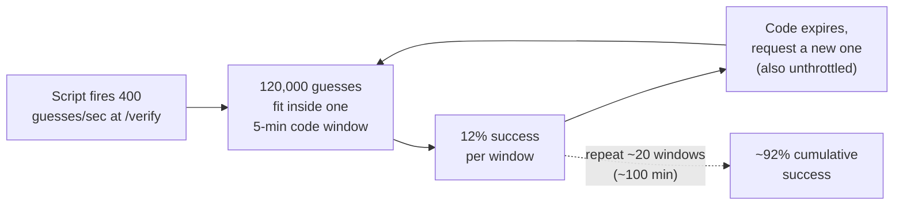

The obvious question: *doesn't a million possible codes make this hard to guess?* Only if you're limited to one try. A million stops being a big number the instant nothing stops you from taking thousands of shots at it, and starting over the moment one batch of shots expires.

**The fix, and the analogy for the rest of this story:** cap the number of *tries per code*, not the code's length. Call it the **five-strikes rule** — think of a bank vault keypad that physically locks itself after a handful of wrong entries, no matter how many total digits the combination has. Larkspur sets the cap at 5 attempts: get the code wrong 5 times, and that code is dead — invalidated immediately, no more guessing against it, full stop. Recompute the odds with the real formula: `attempts / code_space = 5 / 1,000,000 = 0.0005%` chance of success per code lifetime. Same 6 digits, same code space — the attempt cap is what actually did the work.

**New problem, immediately visible:** the attempt cap stops *guessing* a code you don't know. It says nothing about what happens if someone gets hold of a code that's already been used successfully — because the check is still just "correct AND unexpired," and nothing checks whether it's already been spent.

**How I'd say this in an interview:** "A 6-digit code isn't secure because a million options sounds like a lot — it's secure because of the attempt limit. State the actual formula, attempts over code space, rather than just asserting '6 digits is fine.' Without a cap, an attacker just keeps requesting fresh codes and retrying until the odds catch up with them."

---

## Chapter 2 — The ticket stub torn only once

Three months later, a real incident: during a debugging session, an engineer temporarily logs the raw OTP value to Larkspur's application logs to chase down a delivery bug — a very common, very real class of mistake (plaintext secrets landing in logs is one of the most frequently cited root causes in real breach post-mortems). A support engineer with log access later spots a code for account `user_4471` that was used successfully four minutes earlier — well within its 5-minute TTL. They resubmit it out of curiosity. **It works.** The account gets a second, unauthorized login session, because the verify check never asked "has this code already been consumed."

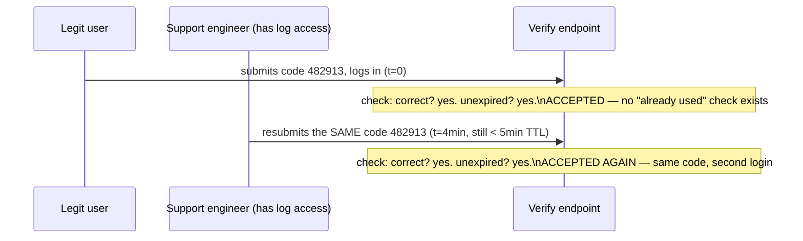

The obvious question: *why does "unexpired" let an already-spent code work again?* Because the TTL only governs how *long* a code is eligible to be used — it says nothing about how *many times*. Those are two completely separate properties, and Larkspur's check only ever tested one of them.

**The fix:** add a single-use flag. Call it the **torn-ticket-stub rule** — like a movie ticket, an usher tears off the stub the first time you walk through, and a torn stub doesn't get you in a second time no matter how much time is left before the movie starts. Larkspur adds a `usedFlag` column: on a successful verify, set it `true` immediately; on every check, `usedFlag == false` becomes a third mandatory condition alongside "correct" and "unexpired."

**New problem, found under load two weeks later:** a flaky client-side retry (the mobile app resends the verify call automatically on a network blip) sends the *same* correct code twice, milliseconds apart, hitting two different backend instances. Both read `usedFlag = false` before either one gets around to writing `true` — a plain check-then-write race, and both requests succeed. Larkspur's own load logs show this happening on roughly **0.3% of verify calls** during a mobile network hiccup `[illustrative — a plausible rate for a double-submit race under one bad network window, not a measured figure]`.

**How I'd say this in an interview:** "Single-use is a third, independent condition from correctness and expiry — a code that's correct and still inside its TTL still has to be rejected if it's already been spent. That's the exact gap a raw 'code == stored AND not expired' check leaves open."

---

## Chapter 3 — Two ushers tearing the same stub at once

Zooming into that 0.3%: it's the same shape of bug as any contended-resource problem — read the flag, decide it's false, then write true, as two *separate* steps. If two verify attempts land close enough together, both can read `false` before either writes `true`. Neither request is doing anything wrong on its own; the bug is in treating "check" and "set" as two steps instead of one.

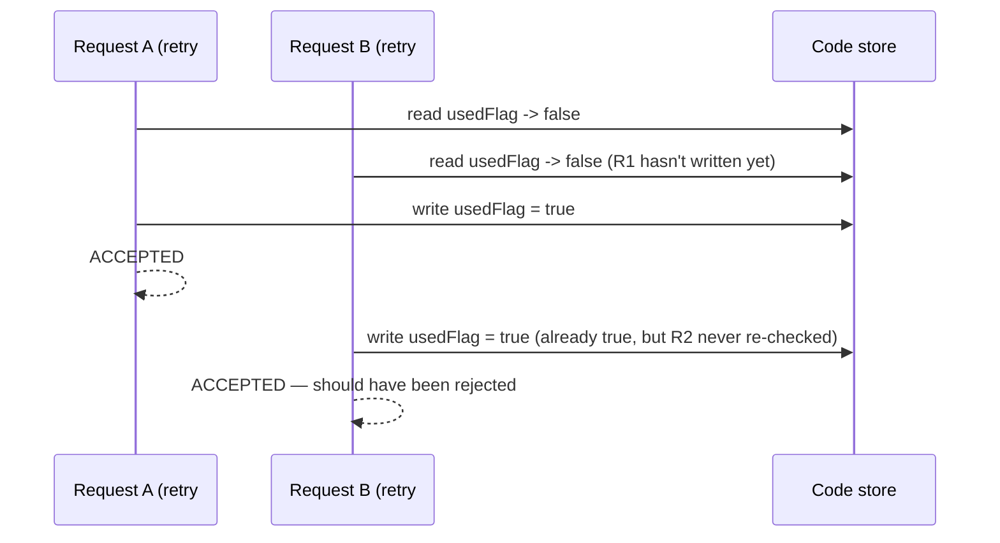

The obvious question: *doesn't the single-use flag from Chapter 2 already fix this?* The flag itself is fine — the bug is that "read the flag" and "write the flag" aren't happening as one indivisible step. Two ushers can both glance at an un-torn stub in the same instant, before either one has actually torn it.

**The fix:** make the check-and-set **atomic** — one indivisible database operation (`UPDATE ... SET usedFlag = true WHERE usedFlag = false`, and only proceed with "accepted" if that update actually affected a row). Extending the ticket-stub analogy: the usher tears the stub and waves you through in the *same single motion*, not "look at it, then tear it" as two separate moves someone else could slip between.

**New problem, once this is airtight:** single-use and the attempt cap now both work correctly per code. But nothing yet stops an attacker from requesting *lots of codes* in the first place — not to guess them, but to spam the person receiving them.

**How I'd say this in an interview:** "The used-flag update has to be atomic — one compare-and-set operation, not a read followed by a write — or two near-simultaneous submissions of the same correct code can race past each other. It's the identical check-then-write bug you'd worry about in a flash-sale inventory count, just applied to a security flag instead of a stock number."

---

## Chapter 4 — Spamming the mailbox, not the account

Larkspur already rate-limits OTP *requests* per account — say, max 10 requests/hour per account, which sounds reasonable. Then a support ticket comes in from someone who isn't even a Larkspur user: their phone got **47 OTP text messages in six minutes**, none of which they asked for. Larkspur's own signup flow lets anyone type in *any* phone number to request a login code to it (how else would a new user log in the first time?) — and an attacker exploited exactly that, spinning up 47 different throwaway accounts, each one entering the *same* victim's phone number. Every individual account is comfortably under its own 10-per-hour cap. The victim's phone doesn't care which account asked — it just gets spammed. This is a real, documented abuse pattern in the industry, usually called SMS-bombing or SMS-flooding, sometimes used to harass someone or to bury a real fraud alert under a wall of decoy texts.

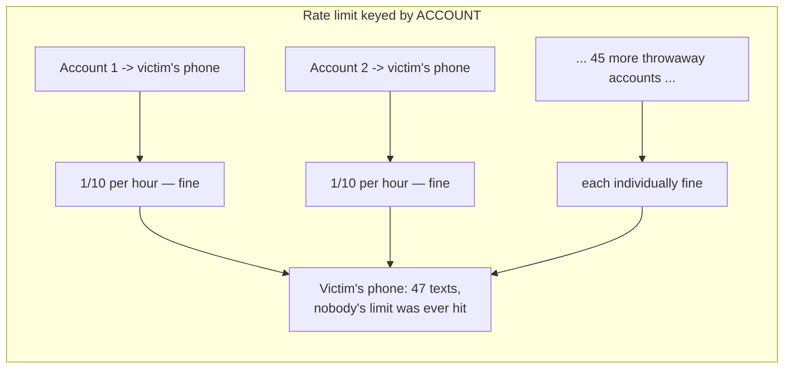

The obvious question: *why didn't the per-account limit catch this?* Because the limit was protecting the wrong thing — it caps how much any *one account* can do, but the actual harm here lands on a phone number that isn't tied to any single account at all. The rate limit needs to protect the **recipient**, not the requester.

**The fix:** rate-limit by the destination phone number or email itself, regardless of which account or IP is asking. Analogy: **the doorman checks the apartment number on the package, not whose name is on the delivery account** — it doesn't matter how many different couriers show up, apartment 4B only accepts so many deliveries per hour. Larkspur adds a second limiter, keyed purely on the recipient contact string, sitting in front of the per-account one.

Replaying the same 47-throwaway-account attack against the new limiter shows exactly why this closes the gap the per-account limit missed:

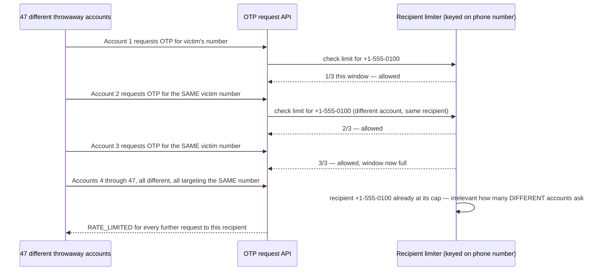

**New problem, immediately:** recipient-keyed limiting is strict by design — and strict limits start blocking real people who just didn't get their text the first time.

**How I'd say this in an interview:** "Most rate limiters protect server capacity from a caller, so keying by account or IP makes sense there. Here, the actual harm lands on a third party — the phone number's owner — who isn't the one making the requests. That's a genuinely different framing: key the limit by recipient, and a distributed attack using many different accounts gets caught regardless of how spread out it is."

---

## Chapter 5 — The trade-off between resend and ammunition

Larkspur sets the recipient limit at 3 requests per 10 minutes and ships it. Within a week, support tickets spike: *"I didn't get my code the first time, clicked resend three times because nothing was showing up, and now I'm locked out for 7 more minutes."* This isn't a bug — it's the honest cost of the Chapter 4 fix landing on someone who was doing nothing wrong.

The obvious question: *why not just loosen it to, say, 10 per 10 minutes, so legitimate resends never get blocked?* Because that number is exactly what an attacker gets to use too — loosening the legitimate ceiling loosens the abuse ceiling by the same multiple. Redo the chain: at 3-per-10-min, the SMS-bombing scenario from Chapter 4 tops out at **3 unwanted texts** per victim per window instead of 47. At 10-per-10-min, that same attack gets **more than 3x the ammunition**, for a modest reduction in legitimate false-positive blocks. There's no number that eliminates the trade-off — there's only a number that balances it.

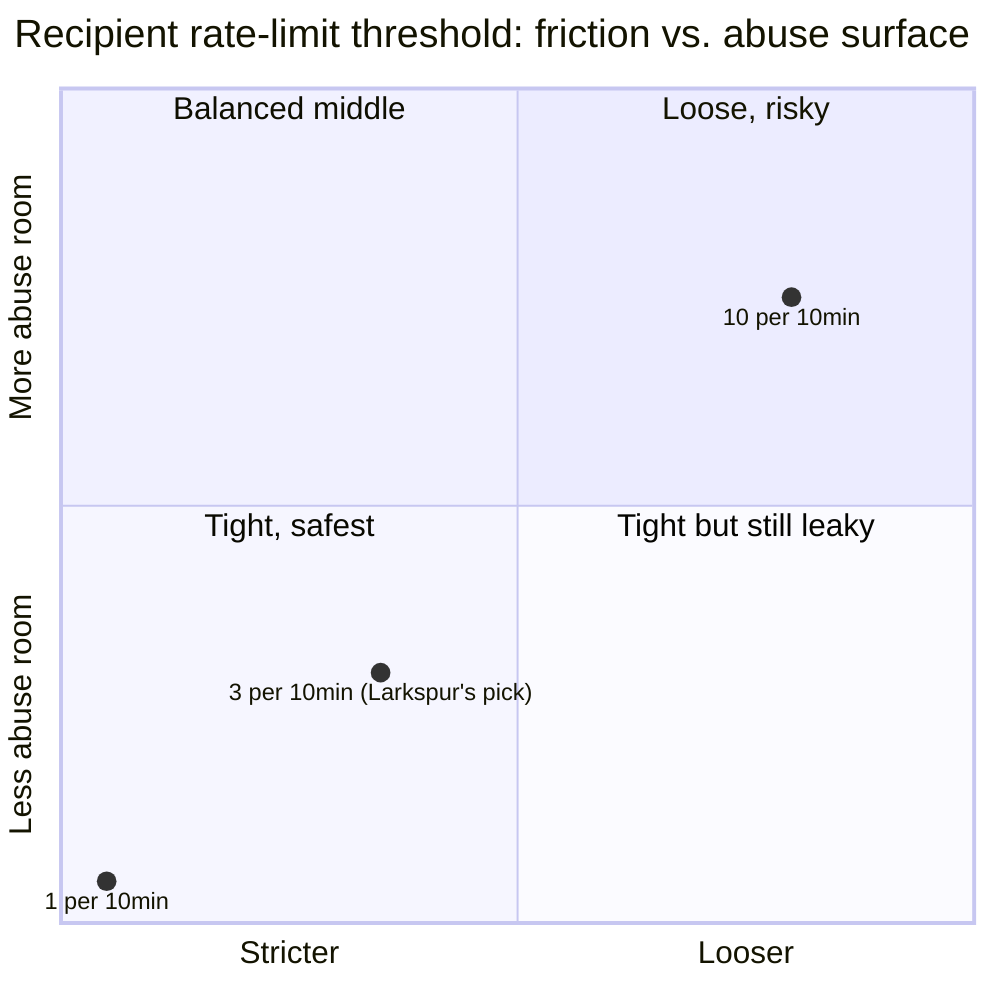

Larkspur keeps 3-per-10-minutes as the default, but adds one honest mitigation: the countdown on a "resend" button in the app, so users can *see* they have 2 requests left before hitting the wall, rather than mashing the button blind. That doesn't change the underlying trade-off — it just makes the legitimate side of it less frustrating.

That "I didn't get my code" complaint points at a real, separate question worth chasing down next: *why didn't the first code arrive quickly in the first place?*

**How I'd say this in an interview:** "There's no threshold that removes this trade-off — a stricter recipient limit reduces the abuse surface and increases legitimate false-positive blocks, in direct proportion. Name the actual numbers rather than picking one out of thin air, and mention that better UX (show the user their remaining attempts) reduces the *pain* of the trade-off without changing the trade-off itself."

---

## Chapter 6 — The fire hose that sometimes trickles

Larkspur, like most consumer apps at this scale, sends its OTP texts through a third-party SMS gateway — think Twilio, a real, widely used SMS delivery platform. Most of the time, delivery takes a couple of seconds. Then one afternoon, the provider has a rough day on a specific carrier corridor: for about 6 hours, messages routed through that corridor take **90+ seconds** to arrive, or don't arrive at all — roughly **4% of that corridor's traffic** during the incident window `[illustrative — a stand-in for "a real SMS provider having a documented bad day on one carrier route," a well-known class of incident, not a measured figure for any specific event]`. Larkspur's backend has no idea any of this is happening — it just calls the provider's API and moves on, assuming delivery is fast and reliable.

Users affected by the slow corridor do exactly what anyone would: wait a few seconds, see nothing, and hit "resend." Which trips the very rate limit built in Chapter 4-5 — the person most inconvenienced by a *provider* outage is also the one who gets themselves rate-limited trying to work around it.

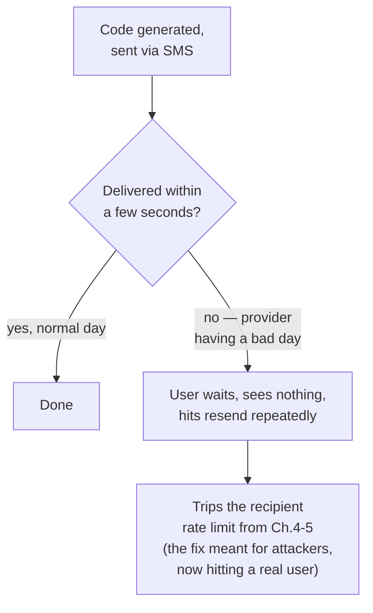

The obvious question: *should verification logic just assume the SMS provider is fast and reliable?* No — a third-party delivery channel is exactly that, third-party, with its own latency and failure modes the app doesn't control and can't fix from its side.

**The fix:** a timeout-then-fallback policy. If the primary channel (SMS) hasn't confirmed delivery within a reasonable window (say 20 seconds), automatically send the *same code*, same TTL, over a secondary channel (email) — not a brand new code. Reusing the same code matters: minting a second, different code for the same logical request would mean tracking two valid codes per request instead of one, doubling the single-use bookkeeping from Chapter 2 for no real benefit.

**New problem, one level deeper:** delivery-channel unreliability is a latency and cost problem. But SMS as a channel has a completely different, structural weakness that no amount of retrying or fallback timing fixes — because the weakness isn't "the message arrives late," it's "the message can arrive at the wrong phone entirely."

**How I'd say this in an interview:** "A verification service can't assume its SMS provider is fast or always up — that's textbook third-party dependency risk. The standard fix is a timeout-then-fallback to a second channel, reusing the same code rather than issuing a new one, so the single-use tracking doesn't have to juggle two live codes for one login attempt."

---

## Chapter 7 — The mailbox that can be redirected to someone else's house

Every fix so far — the attempt cap, the single-use flag, the atomic check, the recipient rate limit, the delivery fallback — assumes one thing: that only the real phone owner can receive texts sent to that number. That assumption can be broken entirely outside the app's control, and it has happened at the highest possible profile: in August 2019, Twitter (now X) CEO Jack Dorsey's own Twitter account was taken over after attackers convinced his mobile carrier to port his phone number onto a SIM card the attackers controlled — a real, widely reported incident, not a hypothetical. Once the number is ported, every SMS meant for the real owner — including any OTP — goes straight to the attacker's phone instead. This is called a **SIM-swap attack**.

The obvious question: *if the code itself is generated correctly, delivered securely, single-use, and rate-limited, how does the attacker still get in?* Because none of those protections touch the actual weak point — the attacker isn't guessing the code or replaying an old one, they're just the one who now legitimately *receives* it. Every fix built in this story so far operates entirely inside the assumption that SMS reaches the right phone, and SIM-swapping breaks exactly that assumption, upstream of anything the app can see.

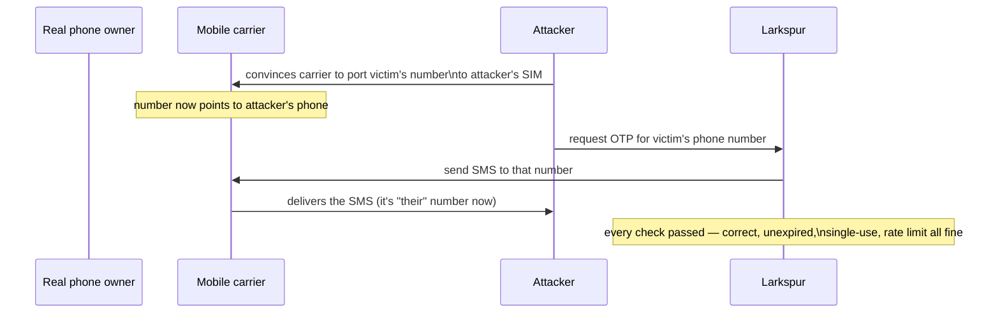

**The fix:** stop depending on the phone network to deliver the secret at all. This is exactly what **TOTP** (Time-based One-Time Password, an open standard, RFC 6238) does, and it's what apps like Google Authenticator and Authy actually implement. The idea: server and device agree on a **shared secret** exactly once — typically by the user scanning a QR code during setup. From then on, neither side ever has to *send* the code anywhere. Both sides independently compute the same 6-digit value from that shared secret plus the current time, in 30-second steps. Analogy: **a shared code book synced by a clock** — two people who agreed on a codebook in advance, and both own synchronized watches, don't need to send each other anything to agree on today's code; they each just look it up. No SMS, no carrier, no network round-trip at all — nothing for a SIM-swap to intercept, because nothing travels.

**New problem, immediately:** if there's no network delivery, there's no network delay either — but there's a new dependency the app never had to think about before: whether the *user's own device clock* is accurate.

**How I'd say this in an interview:** "SMS-based OTP has a real, documented weakness that no amount of rate-limiting or single-use enforcement fixes — SIM-swapping, exactly what happened to Jack Dorsey's own Twitter account in 2019. TOTP sidesteps the whole channel by never sending anything: both sides derive the same code independently from a shared secret and the current time, per RFC 6238, which is what Google Authenticator and Authy actually do."

---

## Chapter 8 — The watch that's 40 seconds fast

Larkspur rolls out TOTP as an opt-in alternative to SMS. Within days, a specific complaint shows up repeatedly: *"my authenticator app codes never work, even though I'm typing them in right when they change."* The cause: TOTP codes are only valid for one 30-second step, and the affected users' phones have clocks that have drifted — sometimes by 40-45 seconds `[illustrative — a plausible drift for an old device without automatic time sync, not a measured figure]` — because the device isn't syncing time automatically. If the server checks *only* the current 30-second step, a phone that's even one step off produces a code the server has never heard of and will never accept.

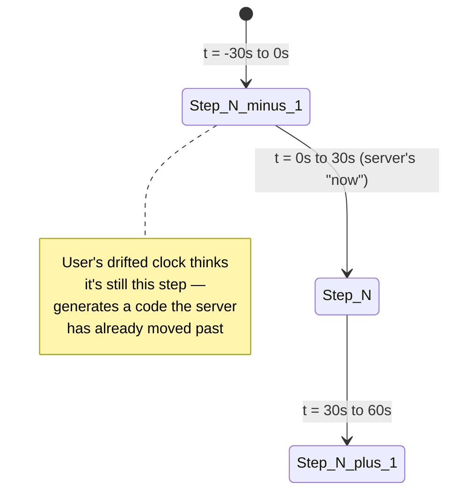

The obvious question: *do we just tell users to fix their clocks?* That's a real, if incomplete, mitigation — but it puts the burden on every single user instead of the system absorbing a small, well-understood amount of drift itself.

**The fix:** widen the server's acceptance window to check not just the current step, but the step immediately before and after it too (±1 step, ~90 seconds of tolerance total) — this is exactly the tolerance real RFC 6238 implementations, including Google Authenticator and Authy, are documented to allow.

**New problem this quietly reopens:** widening the window to ±1 step means a code could, in principle, be legitimately re-submitted a second time within that ~90-second span — the exact replay shape Chapter 2's single-use flag exists to close. The fix is the same idea, applied one level more precisely: track "used" not by the raw 6-digit value (which will legitimately repeat again in roughly 11.6 days purely by coincidence, since the code space and time-step count eventually cycle), but by the combination of **account + time-step**, so the same person can't spend the same time-step's code twice, while a totally different account computing the same 6 digits at the same moment is a coincidence, not a replay.

**How I'd say this in an interview:** "TOTP trades network delivery risk for clock-sync risk — the standard fix is a ±1 step tolerance window, which is exactly what Google Authenticator and Authy's own implementations allow. But widening the window reopens a mini version of the replay problem, so single-use tracking has to key on account-plus-time-step, not the raw code value, since a 6-digit code is bound to repeat by coincidence eventually."

---

## Chapter 9 — The bill that arrives with every text

Zoom out to the business side. Larkspur is now sending roughly **40 million SMS OTPs a month**. At a realistic wholesale per-SMS rate for a provider like Twilio — say **$0.0075 per message** `[illustrative — real per-message SMS pricing varies by country/carrier and provider tier, but is genuinely in this ballpark for many corridors]` — that's **$300,000 a month**, a real, recurring cost line that has nothing to do with servers or storage and everything to do with volume of texts sent.

The obvious question: *does any of the security work already done here also help the bill?* Yes, directly. Every SMS-bombing attempt Chapter 4's recipient rate limit blocks is also a text Larkspur never pays for. Every "resend" click that Chapter 6's fallback logic avoids by not needing a duplicate send (reusing the same code across channels rather than minting new ones) is also a text not sent twice. And every user who opts into Chapter 7's TOTP path moves their entire login volume off SMS permanently — an authenticator-app code costs Larkspur exactly **$0** in delivery fees, because nothing gets sent anywhere.

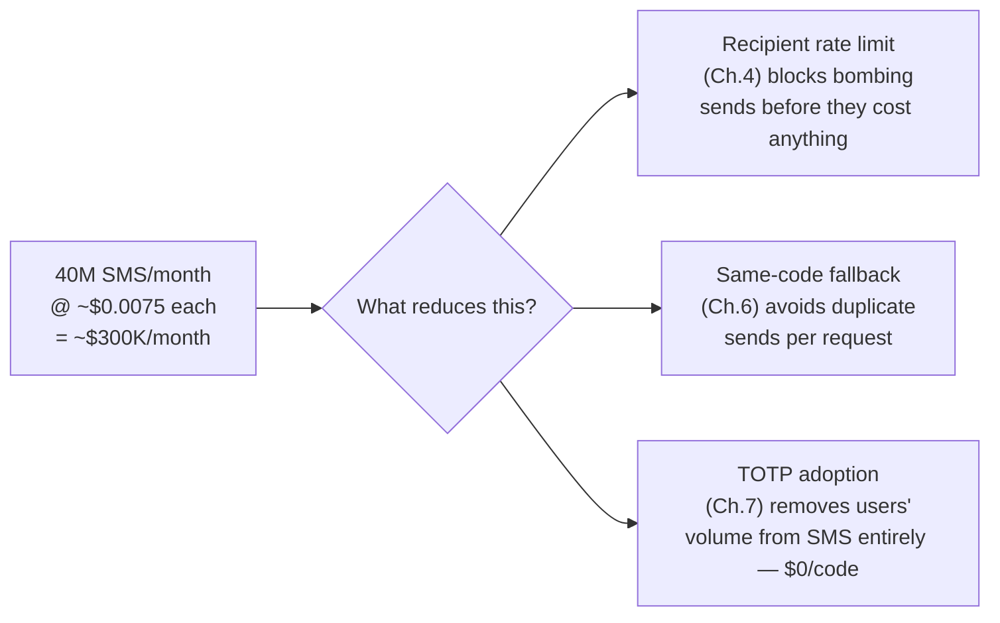

This is a rare, genuinely happy alignment: the fixes built purely for security and abuse-resistance are the *same* fixes that reduce the delivery bill. Larkspur ends up actively encouraging TOTP adoption for its most active users — not purely as a security upsell, but because it's the one lever that reduces both fraud exposure and the SMS invoice at the same time.

**How I'd say this in an interview:** "SMS delivery is a real, direct per-message cost, not just a compute/storage line — and it's worth naming explicitly, because it means tight rate limits and channel-reuse-on-fallback aren't purely security decisions, they're cost decisions too. Pushing users toward TOTP is the one change that helps both the fraud surface and the bill simultaneously."

---

## The record Larkspur actually ends up keeping

All nine chapters land on one small, boring-looking table plus an append-only log next to it — nothing exotic, which is itself worth noticing:

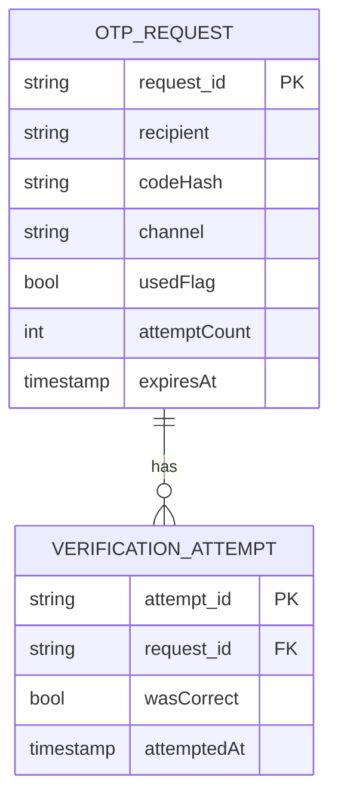

`usedFlag` is Chapter 2 and 3's whole fix living in one column, updated atomically. `attemptCount` is Chapter 1's five-strikes rule. `recipient` is what Chapter 4's limiter keys on, not `request_id` or account. `VERIFICATION_ATTEMPT` is append-only — it's what would show a security team the exact shape of an attack after the fact, and it's also what feeds Chapter 5's "how close are real users getting to the limit" tuning. Nothing about this table is exotic; the entire story was about which columns and which checks it needed, not about needing a fancier database.

---

## Where the story actually lands

```mermaid
flowchart LR
    A["Ch1: no attempt cap\n(brute-forceable given time)"] -->|"fixes: 5-strikes cap\nbreaks: replay of a spent code"| B["Ch2: single-use flag"]
    B -->|"fixes: no more replay\nbreaks: check-then-write race"| C["Ch3: atomic compare-and-set"]
    C -->|"fixes: race closed\nbreaks: recipient gets bombed"| D["Ch4: recipient-keyed rate limit"]
    D -->|"fixes: bombing capped\nbreaks: legit resends blocked too"| E["Ch5: threshold trade-off"]
    E -->|"names the trade-off\nbreaks: SMS itself is slow sometimes"| F["Ch6: timeout + same-code fallback"]
    F -->|"fixes: delivery reliability\nbreaks: SIM-swap defeats SMS entirely"| G["Ch7: TOTP (RFC 6238)"]
    G -->|"fixes: no channel to intercept\nbreaks: clock drift rejects valid codes"| H["Ch8: ±1 step window + account+step single-use"]
    H -->|"fixes: usable TOTP\nreveals: SMS volume is a real cost line"| I["Ch9: rate limits & TOTP also cut the bill"]
```

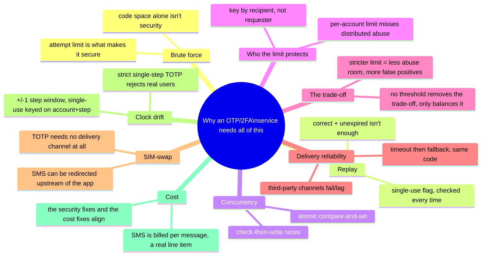

Every real OTP/2FA system you'll design in an interview sits somewhere on this chain. The skill isn't reciting all nine chapters — it's stopping where the stated requirements say to stop. A low-stakes "verify your email" flow might reasonably stop around Chapter 4. A financial login flow that has to survive SIM-swap has to reach Chapter 7 and 8. If nobody's mentioned SIM-swap or TOTP, walking all the way to Chapter 9 unprompted reads as padding, not depth.

---

## Grill me — adversarial follow-ups

**Q1: "Why not just make the code 8 digits instead of adding an attempt limit?"**
Because length alone doesn't fix anything if guessing is unlimited — an attacker just needs proportionally more time or requests, and since the request side wasn't limited either, they'd just wait longer. The attempt limit is what actually bounds the guess probability to a fixed, tiny number regardless of code length; length without a cap is security theater.

**Q2: "Doesn't rate-limiting by recipient phone number let an attacker deliberately lock out a legitimate user by tripping their own rate limit against the victim?"**
Yes, that's a real, honest cost of this design — it's a denial-of-service angle, not free of trade-offs. The mitigation isn't removing the limit, it's making the lockout window short (10 minutes, not hours) and giving the real user a fallback channel (email) that isn't subject to the same recipient-keyed SMS limit.

**Q3: "If TOTP doesn't need the network at all, why does Larkspur keep SMS at all instead of switching everyone to authenticator apps?"**
Because TOTP requires upfront setup — scanning a QR code, installing an app — which is real friction that plenty of casual users won't do for a low-stakes login. SMS stays as the low-friction default; TOTP is offered as the stronger opt-in for users who want it, which is exactly the trade Larkspur makes in Chapter 7.

**Q4: "Why does the used-flag update need to be atomic — what actually breaks with a plain read-then-write?"**
Two near-simultaneous requests can both read `usedFlag = false` before either one writes `true`, because "read" and "write" are two separate steps with a gap between them. An atomic compare-and-set collapses that gap to zero — the check and the write happen as one operation, so there's no window for a second request to sneak through.

**Q5: "Isn't the ±1 step TOTP window basically reopening the exact replay problem you fixed with single-use?"**
Partially, yes — that's exactly why Chapter 8 has to extend single-use tracking to key on account-plus-time-step rather than the raw 6-digit value. A ~90-second window is a much smaller replay surface than SMS's full 5-minute TTL, and it's still fully closed once you track usage at that finer grain.

**Q6: "If SIM-swap defeats SMS, doesn't a voice-call OTP have the exact same problem?"**
Yes — a voice call to the same phone number is just as redirectable by a SIM-swap as a text message, because the vulnerability is at the carrier/number level, not the delivery format. Voice OTP is a fallback for people who can't receive texts, not a fix for SIM-swap; only removing the phone-network dependency entirely (TOTP) actually closes that gap.

**Q7: "Why key the recipient rate limit on phone number instead of the destination carrier or the SMS gateway's own view of the number?"**
The phone number is the actual unit of harm — it's the specific mailbox getting spammed, regardless of which carrier or gateway route the message takes. Keying on carrier would group together thousands of unrelated victims on the same network and either over-block innocent traffic or under-protect any single number.

**Q8: "What's the actual difference between the attempt limit from Chapter 1 and the recipient rate limit from Chapter 4 — aren't they both just rate limiting?"**
They limit different actions for different reasons: the attempt limit caps *verification guesses against one already-issued code*, protecting against brute-force; the recipient limit caps *how many new codes get requested to one destination*, protecting a third party from being spammed. One is about guessing a secret, the other is about who the traffic is allowed to bother.

**Q9: "If the fallback reuses the same code across SMS and email, doesn't that mean the code exists on two channels — what if an attacker sees the email copy?"**
That's a fair concern, but it's not a new exposure — a code observed on *any* channel it's legitimately sent to already has to be assumed possibly-exposed, which is exactly why single-use enforcement (Chapter 2) exists independent of which channel delivered it. Reusing the code just avoids doubling how many *valid, unconsumed* codes exist at once; it doesn't change the security model that a leaked code must still fail on replay.

**Q10: "Given this whole story, what would you actually ship as an MVP versus defer?"**
Ship the attempt cap, the atomic single-use flag, and the recipient-keyed rate limit on day one — those three are non-negotiable and cheap to build. Defer multi-channel fallback until real delivery-failure data justifies the added routing complexity, and defer TOTP support until there's a segment of users who actually want the stronger, no-network guarantee — both are real, valuable, but earned by a specific requirement, not defaults to build on day one.

---

## Pacing note

**If this is 60 seconds inside a bigger question:** say the core line — a short code's security comes from the attempt limit, not its length — then say "single-use enforced with an atomic flag, rate limit keyed by recipient not requester, delivery falls back across channels on the same code, and I'd cover SIM-swap/TOTP as a deep dive if you want to go there." That's the whole shape in one breath.

**If this is the whole 15-20 minute focus:** walk the chapters in order — why unlimited guessing breaks a short code, single-use and the race condition underneath it, why the rate limit has to protect the recipient instead of the requester, the threshold trade-off, delivery-channel unreliability, then SIM-swap and TOTP if the interviewer's framing suggests a security-sensitive login flow. Don't reach for TOTP unprompted on a low-stakes "verify your email" question — that's the "if I had more time" closer, not a default.

---

## Active recall — no answers, test yourself cold

1. Why does a 6-digit code (only a million possibilities) count as secure at all — what's actually doing the work?
2. What's the exact three-condition check a verify call has to run, and why is "correct AND unexpired" alone not enough?
3. Walk through the exact race that lets two near-simultaneous submissions of the same correct code both succeed, and name the one-line fix.
4. Why does a per-account or per-IP rate limit fail to catch a distributed SMS-bombing attack, and what does the fix key on instead?
5. Why doesn't loosening the recipient rate limit threshold have a "free" answer — what's the actual trade being made?
6. Why should a timeout-triggered fallback channel reuse the same code instead of generating a new one?
7. What specifically does a SIM-swap attack defeat that single-use enforcement, atomic checks, and recipient rate-limiting all fail to stop?
8. How does TOTP avoid needing any delivery channel at all — what do the two sides actually share in advance?
9. Why does a strict single-time-step TOTP check reject real, legitimate users, and what's the standard fix?
10. Why does widening the TOTP acceptance window reopen a version of the replay problem, and how is it closed again?
11. Name two of this story's fixes that reduce both fraud exposure and the SMS delivery bill at the same time.

*Spaced repetition: test this list today, again in 2-3 days, again in a week.*

---

## Cheat sheet — one line per stop on the story

- **No attempt cap**: a code's security comes from the attempt limit, not its length — state `attempts / code_space` explicitly, don't just assert "N digits is enough."
- **Five-strikes rule**: cap guesses per code (e.g. 5), invalidate the code once hit — turns a 12%-per-window brute-force odds into 0.0005%.
- **Single-use flag (torn ticket stub)**: correctness and expiry are not the same as single-use — a correct, unexpired, already-spent code must still be rejected.
- **Atomic compare-and-set**: the used-flag check and the used-flag write must happen as one indivisible step, or two near-simultaneous submissions can both slip through the gap.
- **Recipient-keyed rate limit**: key by the phone/email being spammed, not the account or IP doing the spamming — a distributed attack using many accounts still hits one recipient's shared cap.
- **The threshold trade-off**: no rate-limit number removes the tension between blocking abuse and blocking legitimate resends — only a chosen balance point, stated with real numbers.
- **Timeout-then-fallback, same code**: third-party delivery channels lag or fail; fall back to a secondary channel after a timeout, reusing the same code rather than minting a new one.
- **SIM-swap**: SMS's security assumption (only the real owner receives texts to that number) can be broken at the carrier level — real, documented, happened to Jack Dorsey's own Twitter account in 2019.
- **TOTP (RFC 6238)**: shared secret + synced clock means no code ever travels over any network — nothing for a SIM-swap or delivery outage to intercept or delay.
- **±1 step window**: TOTP needs a small clock-drift tolerance to be usable, which reopens a mini-replay window — close it by keying single-use on account + time-step, not raw code value.
- **SMS is a real cost line**: billed per message, at real scale it's a six-figure-a-month line item — the same fixes that reduce abuse (rate limits, same-code fallback, TOTP adoption) also reduce the bill.
- **The meta-lesson**: every fix in this story closes one specific, nameable gap (guessability, replay, race condition, third-party abuse, delivery reliability, channel interception, usability) — say which gap each fix closes in the same breath you propose it.

**Formula chain:**
```
brute_force_success_probability   = attempt_limit / code_space
cumulative_success_over_N_windows = 1 - (1 - attempt_limit/code_space)^N
monthly_sms_cost                  = sms_volume x per_message_rate
```

**Numbers worth keeping in your head:** a 6-digit code (1,000,000 values) with a 5-attempt cap gives a ~0.0005% guess-success probability per code lifetime — but with *no* cap and repeated windows, that same code space converges to ~92% cumulative success within about 100 minutes of unattended brute-forcing, which is the whole reason the attempt limit, not the digit count, is the load-bearing control · a recipient rate limit trades legitimate-resend friction against abuse-surface width in direct proportion, with no threshold that eliminates the trade-off · SMS delivery is billed per message and scales linearly with volume, a real cost lever distinct from compute/storage.
