# Design an OTP/2FA Verification Service — FAANG Interview Guide

> Source chapter type: ephemeral-code generation and validation at scale. Distinct from
> [the National ID/KYC guide](./50-Design-a-National-ID-KYC-Verification-System-FAANG-Guide.md),
> which verifies a document against a slow external government authority — this chapter generates
> and validates its **own** short-lived, single-use codes, entirely within the platform's control.
> The hard problems are different: **replay prevention** (a code must be unusable a second time,
> even by its legitimate owner), **abuse prevention** (an attacker requesting unlimited codes to a
> victim's phone number, a.k.a. SMS-bombing), and **delivery-channel unreliability** (SMS/email
> providers have their own latency and failure modes the service doesn't control).

## Mental model

A user requests a one-time code — for login, for a sensitive action, for two-factor
authentication — delivered via SMS, email, or an authenticator app. The code must work exactly
once, expire quickly, and the whole request-and-verify flow must resist both automated brute-force
guessing and a specific, less obvious abuse pattern: an attacker who doesn't want to *guess* the
code at all, but wants to **spam** a victim's phone with repeated OTP requests (SMS-bombing,
sometimes used to harass a victim or run up their carrier costs, or as a smokescreen for a
different attack).

Three problems distinct from anything else in this course:

1. **A code must be single-use, even by its rightful owner.** Unlike a session token that stays
   valid until it expires, an OTP that's already been successfully used must be rejected on any
   subsequent attempt — replaying a valid, unexpired code should never succeed twice.
2. **Rate limiting has to protect the *victim*, not just the platform.** Most rate-limiting in this
   course (the dedicated Rate Limiter chapter, the API Gateway chapter) protects backend capacity
   from too many requests. Here, the primary harm from unlimited OTP requests is to the **person
   receiving the SMS**, not the server — a distinct framing that changes what the limit is
   actually for.
3. **Delivery channels are unreliable third-party dependencies with their own latency.** An SMS
   provider can be slow, can fail silently, or can deliver out of order relative to when it was
   requested — the verification logic can't assume the code arrives promptly or at all.

**The one sentence to say out loud:** *"The rate limit here exists primarily to protect the person
receiving the code from being spammed, not to protect server capacity — that reframing changes
where the limit should be keyed and how strict it needs to be."*

**The one picture to remember forever:**

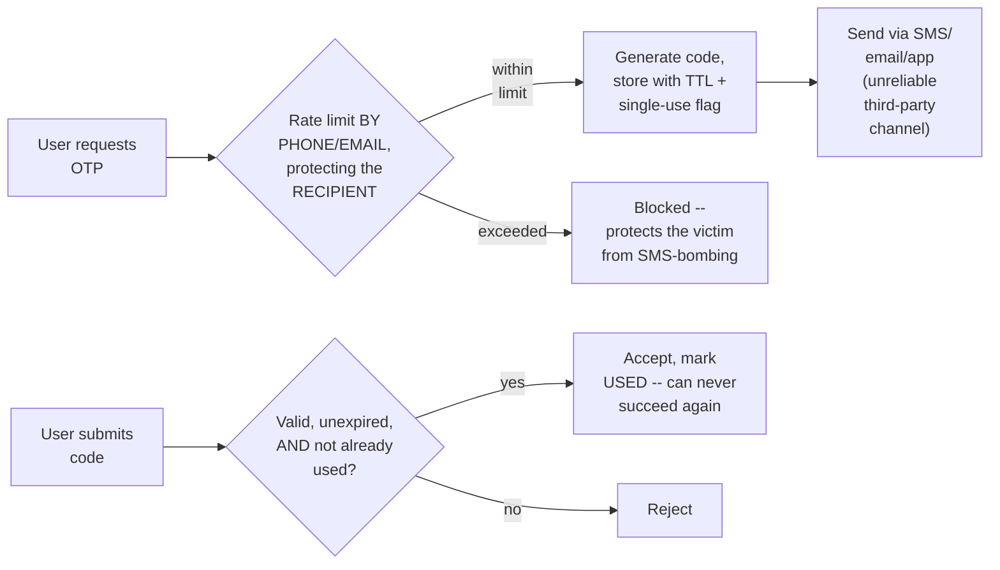

**Memory hook:** *"Rate limit protects the recipient from spam, not just the server from load.
Single-use means used-once-ever, not valid-until-expiry. And the delivery channel is a flaky
third party, not something the verification logic can assume is fast or reliable."*

---

## Table of contents
[How to Identify This Topic](#how-to-identify-this-topic-in-an-interview) ·
[Interview Playbook](#interview-playbook) · [Requirements](#requirements-clarification) ·
[Capacity Estimation](#capacity-estimation-worked) · [API Design](#api-design) ·
[High-Level Architecture](#high-level-architecture) ·
[Architecture Evolution v1→v2→v3](#architecture-evolution-v1--v2--v3) ·
[End-to-End Walkthroughs](#end-to-end-request-walkthroughs) ·
[Deep Dive: Single-Use Enforcement](#deep-dive-single-use-enforcement) ·
[Deep Dive: Recipient-Protecting Rate Limits](#deep-dive-recipient-protecting-rate-limits) ·
[Deep Dive: Brute-Force Resistance](#deep-dive-brute-force-resistance) ·
[Deep Dive: Unreliable Delivery Channels](#deep-dive-unreliable-delivery-channels) ·
[Data Model](#data-model) · [Failure Modes](#failure-modes--mitigations) ·
[Non-Functional Walkthrough](#non-functional-walkthrough) ·
[Security & Compliance](#security--compliance) · [Cost & Trade-offs](#cost--trade-offs) ·
[Wrap-Up](#wrap-up-mvp-vs-stretch) · [Golden Rules](#golden-rules) ·
[Cheat Sheet](#master-cheat-sheet)

---

## How to identify this topic in an interview

- "Design a one-time password / two-factor authentication verification system."
- The tell that distinguishes this from a generic rate-limiter or auth-token chapter: the
  interviewer emphasizes **who the rate limit protects** (the recipient, not just server
  capacity) and/or **single-use enforcement** — either signal means those two mechanisms are the
  actual substance, not a generic "add a rate limiter" answer.
- A follow-up like "what if an attacker doesn't try to guess the code but just requests hundreds
  of them" is the [recipient-protecting rate limits deep dive](#deep-dive-recipient-protecting-rate-limits)
  — a distinct abuse pattern from brute-force guessing.

---

## Interview playbook

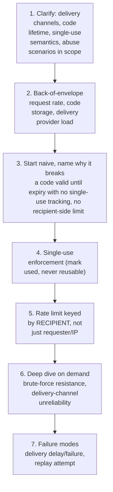

**What the interviewer is actually grading at each step:**
- Step 3: do you recognize, unprompted, that "valid until expiry" and "single-use" are different
  properties — a code that's already been successfully used must be rejected even if its TTL
  hasn't elapsed yet?
- Step 5: do you know that the rate limit must be keyed by the **recipient** (phone number/email),
  not just by requesting account or IP — an attacker abusing this system targets a victim's
  contact info, not necessarily from a single identifiable account?
- Step 6: do you have a concrete brute-force-resistance number (code length, attempt limit) rather
  than a vague "we'd rate limit guesses"?

---

## Requirements clarification

### Functional

| # | Requirement | Notes |
|---|---|---|
| F1 | Generate a short-lived, single-use code and deliver it via SMS, email, or an authenticator app | The core function |
| F2 | Validate a submitted code: correct, unexpired, and not already used | Three distinct conditions, all required |
| F3 | Rate-limit code requests to protect the recipient from being spammed | Distinct from protecting server capacity |
| F4 | Rate-limit verification attempts to resist brute-force guessing | A separate limit from the request-side one |
| F5 | Support multiple delivery channels with a defined fallback if the primary channel fails | Channel unreliability is expected, not exceptional |

### Non-functional

| Requirement | Target | Why this number |
|---|---|---|
| Code delivery latency | Seconds, for a good user experience — but bounded by the third-party channel's own latency, not fully controllable | The service can't promise faster delivery than its SMS/email provider allows |
| Single-use enforcement | Absolute — a used code must never validate successfully a second time | The core security guarantee of the whole system |
| Recipient rate-limit strictness | Strict enough to meaningfully block SMS-bombing without materially inconveniencing normal retry behavior (e.g. "didn't receive it, resend") | A genuine UX/security tension, not a purely technical threshold |
| Brute-force resistance | The combination of code space and attempt limit must make guessing infeasible within the code's validity window | A short numeric code alone isn't inherently secure — the attempt limit is what makes it so |
| Verification latency | Low, sub-second — this gates a real-time login/action flow | Standard interactive-auth latency expectation |

**Clarifying questions worth asking the interviewer up front — and what each answer changes:**

| Question | If the answer is... | ...then this changes |
|---|---|---|
| "Should the rate limit protect server capacity, the recipient from spam, or both?" | Primarily the recipient | Confirms the rate-limit key must be the recipient's phone/email, not just the requesting account or IP — the central reframing of this chapter |
| "How long should a code remain valid, and how many verification attempts are allowed before it's invalidated?" | E.g. 5 minutes, 5 attempts | Directly sizes the brute-force-resistance math — code length and attempt limit must jointly make guessing infeasible within that window |
| "What happens if the primary delivery channel (e.g. SMS) fails or is delayed?" | Fall back to a secondary channel after a timeout | Confirms a defined multi-channel fallback policy is in scope, not just "assume SMS works" |
| "Is this OTP tied to a specific action (e.g. this specific login attempt), or reusable for any verification within its lifetime?" | Tied to a specific action/session | Confirms the code's validity should be scoped to the originating request context, not just a bare code-to-user mapping |

**Say this out loud in the interview:** *"I want to design the rate limit around who it's actually
protecting — the recipient of the SMS, not just our own server capacity — because the most
realistic abuse pattern here is someone spamming a victim's phone with requests, not brute-forcing
the code itself."*

---

## Capacity estimation, worked

```
Given (illustrative, a large consumer platform):
  OTP requests/day, globally                       = 50,000,000
  Peak request QPS                                   = 50,000,000 / 86,400 ~= 580 average,
                                                        say ~3,000 QPS at peak (login spikes)

Code storage:
  Code TTL                                            = 5 minutes
  Concurrently valid, unexpired codes                  = 3,000 QPS x 300 sec ~= 900,000
  Bytes per code record (code hash, recipient,
    expiry, usedFlag, attempt count)                    ~= 60 bytes
  Storage for concurrently valid codes                   = 900,000 x 60B ~= 54 MB
  -> trivially small -- this is never a storage problem, similar to several other "small hot
     state, large surrounding system" chapters in this course.

Verification attempt load:
  Legitimate verification attempts (1 per request,
    the common case)                                    ~= 3,000 QPS
  Brute-force attempt volume (illustrative, if an
    attacker tries a moving code space against ONE
    active code within its 5-minute window)                = bounded by the attempt-limit
                                                               policy, NOT by attacker intent --
                                                               e.g. capped at 5 attempts per
                                                               code, regardless of how many the
                                                               attacker WANTS to try
  -> the attempt limit, not raw capacity, is what bounds this number -- sizing infrastructure
     for "however many attempts an attacker might want" is the wrong framing; the policy itself
     is the bound.

Recipient rate-limit sizing:
  Illustrative policy: max 3 OTP requests per phone number per 10 minutes
  -> a legitimate user resending after a missed/delayed delivery fits comfortably within this;
     an SMS-bombing attempt requesting hundreds of codes to the same number is blocked after
     the 3rd, regardless of how many total requests the ATTACKER's account/IP could otherwise
     sustain against server-side rate limits alone.

Delivery-provider load:
  SMS sends/day                                        ~= 35,000,000 (a majority of the
                                                            50M total OTP requests, illustrative
                                                            channel split)
  -> a real, direct cost line item (per-SMS provider fees) proportional to request volume --
     worth naming as a COST driver distinct from the compute/storage costs dominant elsewhere
     in this course.
```

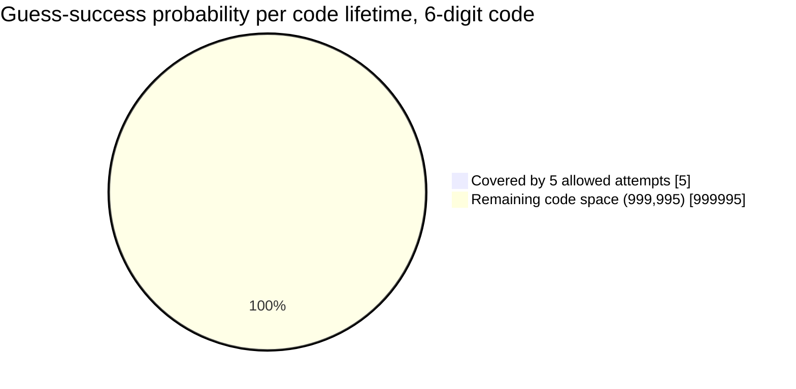

The allowed-attempts slice is invisible next to the full code space — the concrete illustration
of why the attempt limit, not digit count, is what makes brute-forcing infeasible.

**Redo-the-chain test:** if the recipient rate-limit window is loosened from 3-per-10-minutes to
10-per-10-minutes (to reduce false-positive blocks on legitimate resend behavior), the
SMS-bombing attack surface widens proportionally — a direct, computable trade-off between
reducing legitimate user friction and reducing abuse exposure.

**The number worth memorizing:** the attempt/request limit itself, not backend capacity, is what
bounds both brute-force attempts and SMS-bombing volume — this is a policy problem enforced by the
rate limiter, not a capacity-provisioning problem.

---

## API design

### `POST /v1/otp/request`

```json
{ "recipient": "+1-555-0100", "channel": "SMS", "purpose": "LOGIN" }
```

Response:
```json
{ "requestId": "req_88213", "expiresInSeconds": 300, "channel": "SMS" }
```
or, if the recipient rate limit is exceeded:
```json
{ "status": "RATE_LIMITED", "reason": "TOO_MANY_REQUESTS_TO_RECIPIENT", "retryAfterSeconds": 480 }
```

### `POST /v1/otp/verify`

```json
{ "requestId": "req_88213", "code": "482913" }
```

Response:
```json
{ "status": "VERIFIED" }
```
or:
```json
{ "status": "INVALID", "reason": "ALREADY_USED", "remainingAttempts": 0 }
```

| Field | Notes |
|---|---|
| `reason: TOO_MANY_REQUESTS_TO_RECIPIENT` | Explicit about *why* the request was blocked — distinguishes recipient-protection rate limiting from a generic server-capacity rate limit in the API contract itself |
| `reason: ALREADY_USED` | Distinct from `EXPIRED` or `INCORRECT` — the response should let the caller (and any monitoring) distinguish a replay attempt from a simple wrong guess |
| `remainingAttempts` | Surfaced so the client can show the user how much guessing budget remains before the code is invalidated entirely |

**The one sentence worth saying about the API surface:** *"The rate-limit rejection reason is
explicit about protecting the recipient, not just reporting a generic throttling error — and
`ALREADY_USED` is a distinct failure reason from `INCORRECT`, because a replay attempt on an
already-successful code is a meaningfully different event from a wrong guess."*

---

## High-level architecture

### Architecture evolution (v1 → v2 → v3)

**v1 — a code valid until expiry, no single-use tracking, no recipient rate limit:**

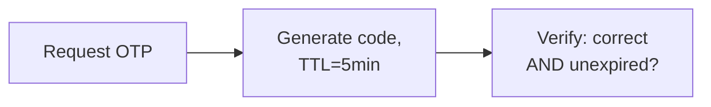

**Why it breaks:** a correct, unexpired code can be submitted successfully more than once — an
attacker who somehow observes a valid code (e.g. via a compromised notification, a shared device,
or a leaked log) can replay it as long as it hasn't expired. And with no rate limit on requests,
nothing stops an attacker from requesting unlimited codes to a victim's phone number.

**v2 — single-use enforcement added, but rate limiting is keyed by requester/IP, not recipient:**

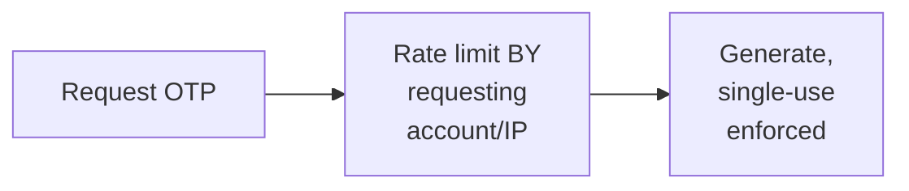

**Why it breaks:** single-use (v2's real improvement) closes the replay gap. But rate-limiting by
requester/IP doesn't protect the actual victim if the abuse pattern is "many different accounts
or IPs each requesting a code to the SAME target phone number" — a distributed SMS-bombing
attempt would sail past a per-account or per-IP limit entirely while still spamming one real
person's phone.

**v3 — the real system: single-use + rate limit keyed by recipient:**

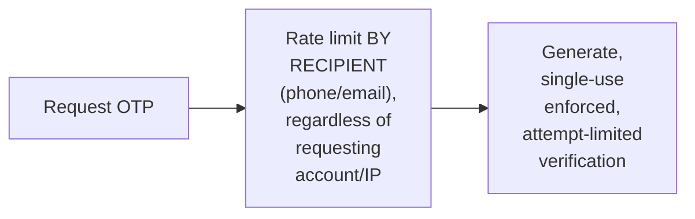

**What v3 fixes, one line each:** single-use enforcement (already in v2) closes the replay gap;
and keying the rate limit by recipient, not requester, closes the distributed-abuse gap — the
limit protects the phone number/email address itself, no matter how many different accounts or
IPs are used to target it.

---

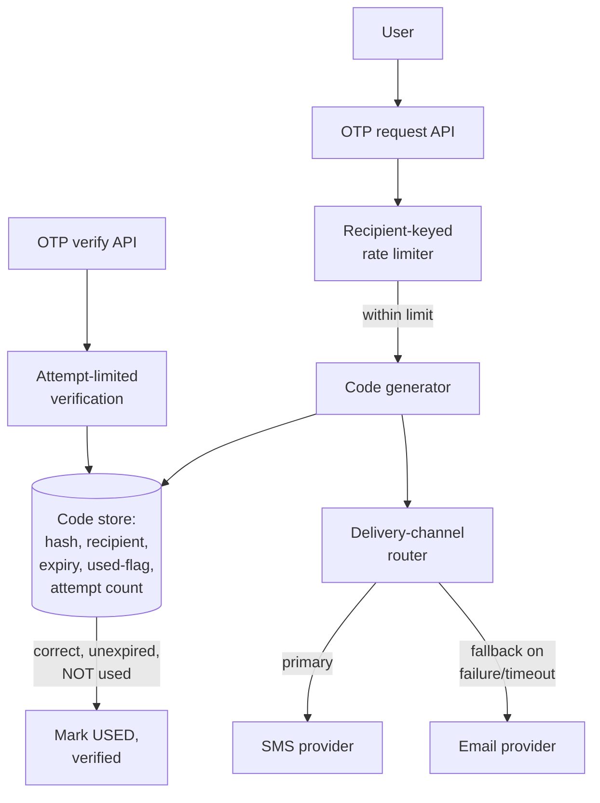

| Component | Role |
|---|---|
| Recipient-keyed rate limiter | The reframed rate limit — protects the phone/email itself, not just server capacity or a single account |
| Code generator | Produces the code and its hash, stored with expiry and a `usedFlag` |
| Code store | Small, hot state (per the capacity estimate) — the single-use flag is the critical field |
| Delivery-channel router | Handles the primary/fallback channel logic — see the unreliable-channels deep dive |
| Attempt-limited verification | Enforces both correctness and the attempt-count cap that makes brute-forcing infeasible |

---

## End-to-end request walkthroughs

### Walkthrough 1 — normal request and successful verification

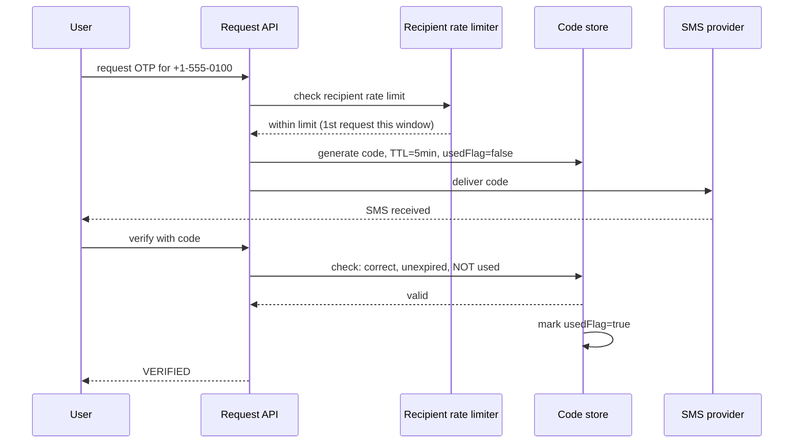

### Walkthrough 2 — a replay attempt on an already-used code

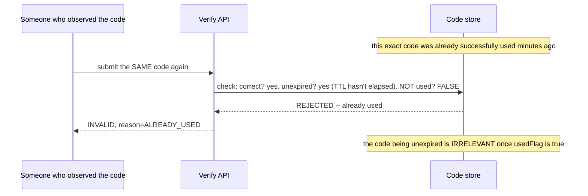

### Walkthrough 3 — a distributed SMS-bombing attempt, blocked by recipient-keyed limiting

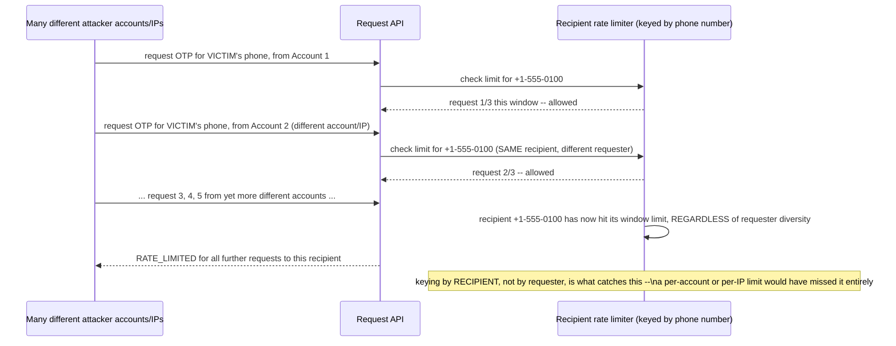

Walkthrough 3 is the concrete case the recipient-keyed rate limit exists to catch — this is
precisely the distributed-abuse pattern a naive per-account/per-IP limit misses.

---

## Deep dive: single-use enforcement

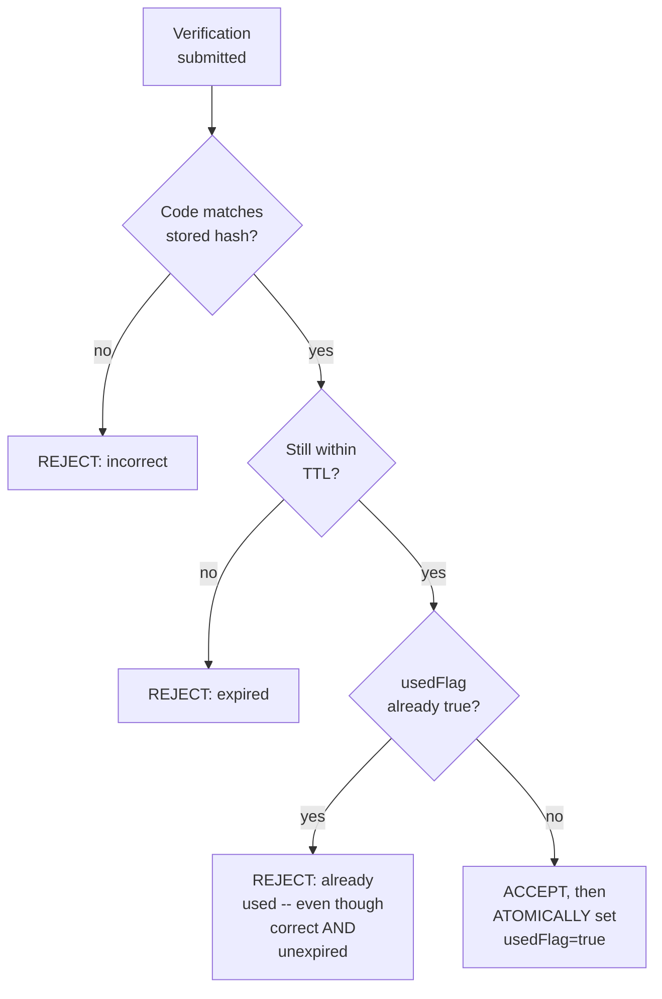

**Why "correct and unexpired" is not sufficient — single-use is a third, independent
condition:** a code's TTL governs how long it's *eligible* to be used, not how many times — without
an explicit, separately-checked `usedFlag`, a correct and still-unexpired code remains replayable
for its entire remaining TTL window, which is a real, exploitable gap if the code is ever observed
by anyone other than its intended recipient.

**Why marking `usedFlag=true` must be atomic with the accept decision, not a separate
follow-up step:** two near-simultaneous verification attempts with the correct code (e.g. a
replay racing the legitimate use) must not both be able to read `usedFlag=false` before either
writes `true` — the same check-then-write race as the flash-sale and auction chapters' inventory/
bid contention, here applied to a single-use flag instead of a stock count.

**Interview cheat-sheet:** *"Single-use is a third, independent condition alongside correctness
and expiry — and setting the used-flag must be atomic with the accept decision, or two
near-simultaneous submissions of the same correct code could race past each other, the same
check-then-write bug as any contended-resource chapter in this course."*

---

## Deep dive: recipient-protecting rate limits

Already the centerpiece of the mental model and walkthrough 3 — the deep dive states the
principle generally.

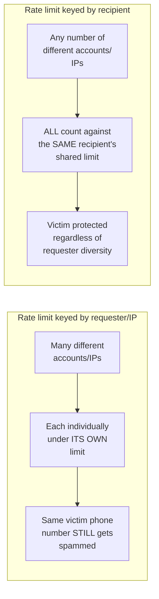

**Why most rate-limiting mental models (including this course's own dedicated Rate Limiter and
API Gateway chapters) default to the wrong key here:** those chapters protect *server capacity*
from *a given caller* — the natural key is the caller's identity or IP. This chapter's primary harm
is to a *third party* (the recipient) who isn't the caller at all — the rate limit has to be keyed
by the victim, not the attacker, which is a genuinely different framing from the rest of this
course's rate-limiting guidance.

**Interview cheat-sheet:** *"Most rate limiters protect the server from a caller; this one has to
protect a third party (the recipient) from potentially many different callers — key the limit by
recipient, and say explicitly that this is a different framing from a standard per-caller rate
limit."*

---

## Deep dive: brute-force resistance

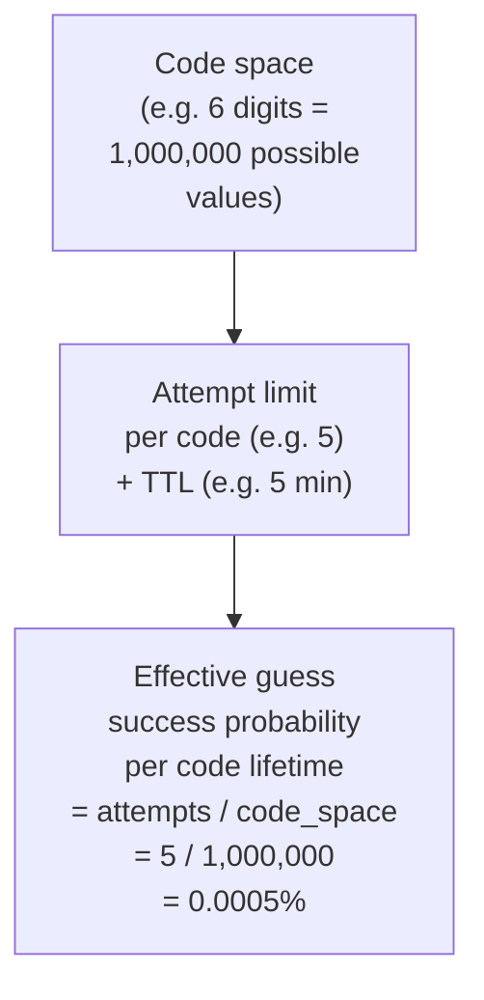

**Why the code length alone doesn't determine security — the attempt limit is what actually
makes a short numeric code viable at all:** a 6-digit code has "only" a million possible values,
which sounds guessable — but bounding verification to a handful of attempts before invalidating
the code (rather than allowing unlimited guesses within the TTL) is what makes that code space
practically secure. Removing or loosening the attempt limit, not shortening the code, is the real
way this mechanism would become exploitable.

**Interview cheat-sheet:** *"A short numeric code is secure specifically because of the attempt
limit, not despite a small code space — state the combined probability (attempts / code space)
explicitly rather than asserting '6 digits is secure enough' without the math behind it."*

---

## Deep dive: unreliable delivery channels

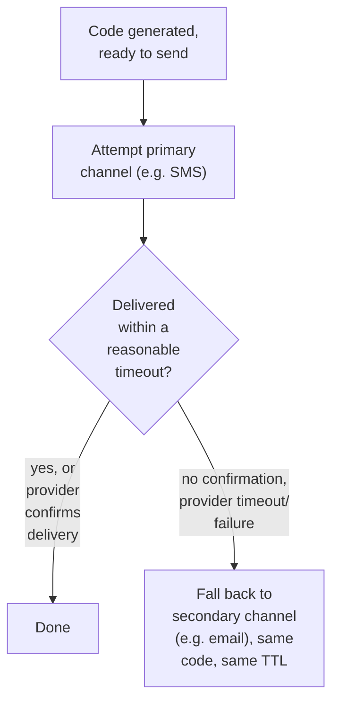

**Why the verification logic can't assume delivery succeeded or was fast:** SMS providers in
particular are a well-known source of variable, sometimes multi-minute, latency, and can fail
silently in certain carrier/region combinations — a service that assumes near-instant, reliable
delivery will generate a poor user experience (or worse, drive users to request a flood of new
codes precisely because the first one seems "lost," triggering the recipient rate limit
unnecessarily).

**Why the fallback should reuse the same code rather than generating a new one:** issuing a
second, different code for the same logical request multiplies the number of valid codes a user
(or an observer) has to track, and complicates the single-use bookkeeping — falling back to a
different *channel* for the *same* code keeps the security model simple, as long as the fallback
happens before the original code's TTL expires.

**Interview cheat-sheet:** *"Design explicitly for delivery-channel unreliability — a defined
timeout-then-fallback-channel policy, reusing the same code rather than minting a new one, keeps
the single-use/attempt-limit bookkeeping simple while still giving the user a real second path to
receive it."*

---

## Data model

**OTP lifecycle:**

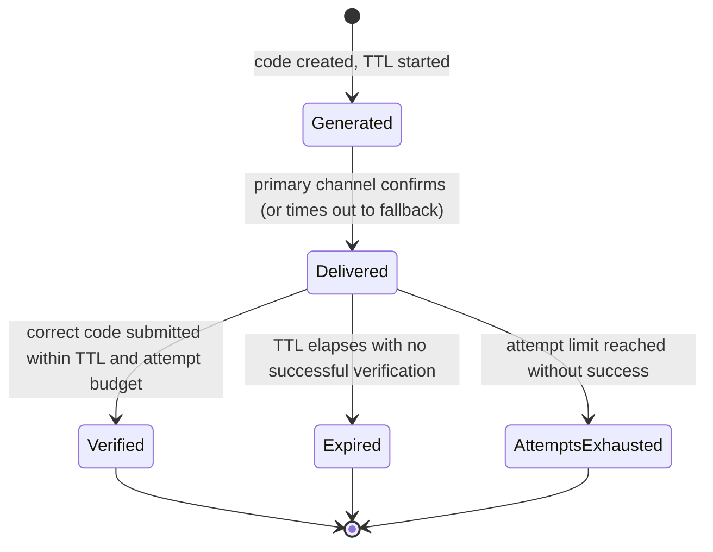

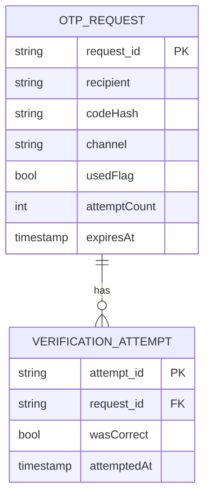

| Table | Storage choice & why |
|---|---|
| `OTPRequest` | Small, hot, TTL-bound state — the atomic `usedFlag` update is the single-use enforcement mechanism |
| `VerificationAttempt` | Append-only, feeds both the attempt-count limit and any downstream abuse/fraud analysis |

---

## Failure modes & mitigations

| Failure mode | Impact | Mitigation |
|---|---|---|
| **Two near-simultaneous verification submissions of the same correct code** | Without an atomic check-and-set, both could succeed, breaking single-use | Atomic compare-and-set on `usedFlag`, the same discipline as any contended-resource chapter in this course |
| **Distributed SMS-bombing via many different accounts/IPs** | A per-account/IP rate limit alone misses this | Recipient-keyed rate limiting, per its own deep dive |
| **Primary delivery channel silently fails** | User never receives the code, may retry unnecessarily and trip the recipient rate limit | Timeout-based fallback to a secondary channel using the same code, per the unreliable-channels deep dive |
| **An attacker attempts to brute-force a code with unlimited guesses** | Without an attempt cap, a short code's space could eventually be exhausted | Bounded attempt limit per code, invalidating it well before brute-force becomes statistically likely |

---

## Non-functional walkthrough

**Scaling both request and verification paths is straightforward and shardable by recipient** —
per the capacity estimate, the hot state (concurrently valid codes) is small, and rate-limit/
single-use checks are naturally scoped per recipient/code, with no cross-recipient contention.

**Availability of the verification path should be very high** — this gates real-time login and
sensitive-action flows across the platform.

**Consistency of the single-use flag must be strict and immediate** — this is the one place in
the system with zero tolerance for eventual consistency, mirroring the same non-negotiable-
correctness framing as the contended-resource chapters elsewhere in this course.

---

## Security & compliance

- **This entire system exists as a security control** — every design choice should be evaluated
  against "does this make the OTP mechanism more or less resistant to replay, brute-force, and
  recipient-targeted abuse," not just functional correctness.
- **Delivery-provider cost and abuse together create a joint incentive to rate-limit tightly** —
  loose limits both increase SMS-provider billing and widen the abuse surface, a rare case where
  the security-motivated and cost-motivated designs point the same direction.
- **Regulatory considerations around SMS/robocall regulations** (e.g. consent for automated
  messages in some jurisdictions) apply to OTP delivery just as they would to any automated
  messaging system, worth naming if the interviewer probes compliance.

---

## Cost & trade-offs

**Recipient rate-limit strictness trades legitimate-user friction (a real "didn't receive it,
resend" case getting blocked) against abuse-surface reduction** — the central, explicit trade-off
of this whole chapter, worth naming rather than picking an arbitrary threshold.

**Multi-channel fallback trades some implementation complexity (channel-routing logic, provider
integrations) against meaningfully better delivery reliability** — an easy trade given how directly
delivery failures degrade the user experience and indirectly worsen recipient rate-limit false
positives.

---

## Wrap-up: MVP vs. stretch

**In scope for an MVP:**
- Single-use enforcement via an atomic `usedFlag` check-and-set.
- Recipient-keyed rate limiting on requests, and a bounded attempt limit on verification.
- A single delivery channel (e.g. SMS only).

**Explicitly out of scope for an MVP:**
- Multi-channel fallback — start with one reliable channel, add fallback once delivery-failure
  rates on the primary channel justify the added complexity.
- Adaptive/risk-based rate-limit thresholds (tightening limits automatically under detected
  abuse patterns) — start with a fixed policy, add adaptiveness once real abuse data exists to
  inform it.

**Stretch goals, worth naming if asked "what's next":**
1. **Multi-channel fallback with same-code reuse**, per the unreliable-channels deep dive.
2. **Risk-based adaptive rate limiting**, tightening thresholds automatically when a recipient or
   requester pattern looks like active abuse.
3. **Authenticator-app (TOTP) support** as an alternative to SMS/email delivery entirely,
   sidestepping delivery-channel unreliability for users who opt in.

---

## Golden rules

- **Single-use is a third, independent condition alongside correctness and expiry** — a correct,
  unexpired code that's already been used must still be rejected.
- **Rate-limit by recipient, not just requester/IP** — the primary harm here is to a third party
  (the phone/email owner), a genuinely different framing from most rate-limiting elsewhere in
  this course.
- **The attempt limit, not code length alone, is what makes a short numeric code secure** — state
  the combined probability explicitly.
- **Design for delivery-channel unreliability from the start** — a timeout-then-fallback policy
  reusing the same code, not an assumption that SMS/email always arrives promptly.
- **The used-flag check-and-set must be atomic** — the same contended-resource discipline as any
  flash-sale or auction chapter, applied to a security flag instead of inventory.

---

## Master cheat sheet

**One-liners:**
- Single-use is independent of expiry — a correct, unexpired, but already-used code must still be
  rejected, enforced via an atomic check-and-set.
- Rate limits here protect the recipient (a third party), not the caller — key by phone/email,
  not by requesting account or IP, or a distributed abuse pattern sails right through.
- A short numeric code is secure because of the attempt limit, not the code space alone — state
  the combined probability (attempts / code space) explicitly.
- Delivery channels are unreliable third parties — design a timeout-then-fallback policy from the
  start, reusing the same code across channels rather than minting a new one.
- This is fundamentally a security-control system — evaluate every design choice against replay,
  brute-force, and recipient-targeted-abuse resistance first.

**Formula chain:**
```
brute_force_success_probability = attempt_limit / code_space
concurrently_valid_codes          = request_QPS x code_TTL_seconds
```

**Numbers:** a 6-digit code (1,000,000 possible values) combined with a ~5-attempt limit yields a
guess-success probability on the order of 0.0005% per code lifetime — the attempt limit, not the
digit count, is what does the real work · concurrently-valid-code storage is trivially small even
at large request volume, since codes are short-lived.
