# Design a Warehouse Task Assignment and Inventory System — The Story (narrative edition)

> **What this file is.** The reference file,
> `75-Design-a-Warehouse-Task-Assignment-and-Inventory-System-FAANG-Guide.md`, is the one to
> recite from — requirements, API shapes, every trade-off table, the master cheat sheet. This file
> is a second way in: the same material as one continuous story, told in plain language. Engineers
> at a company keep hitting a wall, patch it, and the patch itself creates the next wall — until we
> land on the exact same design the reference file documents. The company, **Cratewell** (a
> fulfillment-center operator that runs warehouses on behalf of online retailers), is fictional.
> But every wall it hits, and every fix it reaches for, is grounded in something real: Amazon's
> **Kiva Systems** robotics (acquired 2012, the real, documented "goods-to-person" warehouse model
> — robots bring shelves to workers instead of workers walking to shelves), the **event sourcing**
> pattern (documented by Martin Fowler and widely used in real ledger and accounting systems —
> store every state change as an immutable fact, derive current state from the sequence of facts),
> and the well-documented general category of "two requests raced to buy the last unit of
> something" bugs that show up across e-commerce whenever a stock check and a stock claim aren't
> one atomic step. I'll say clearly, every time, whether something is a documented fact or just a
> reasonable illustrative guess for Cratewell specifically.

**The trigger phrases** for this whole topic: *"how do we stop two different orders from both
getting assigned the last unit of the same item,"* *"how do we make sure a genuinely urgent order
doesn't sit there while a robot keeps grabbing easy, nearby, low-priority tasks,"* or *"how do we
actually know our inventory count is correct, all the time, while dozens of people are physically
moving things off shelves."* Keep one sentence in your head as you read: **task assignment has to
jointly weigh proximity AND urgency, never proximity alone — and inventory correctness comes from
treating every physical movement as an immutable fact in a log, deriving the current count from
that log, because a human scanning a barcode can never be a clean atomic database transaction.**
Everything below is just this one idea, getting harder in small, honest steps.

---

## Chapter 1 — The last unit, sold twice

It's Cratewell's second year, running one modest fulfillment center for a mid-size electronics
brand. A client runs a flash sale on a wireless-earbuds SKU, `SKU-4471`. Stock on the shelf: **1
unit.** Two customers, in different cities, both hit "buy" within **400 milliseconds** of each
other during the sale's opening minute. Cratewell's order system does the obviously-reasonable
thing for each order, one right after the other in wall-clock time but overlapping in execution:
check the inventory table — `SELECT count FROM inventory WHERE sku = 'SKU-4471'` — see `count = 1`,
decide "yes, in stock," create a pick task, and confirm the order. Both checks run before either
order's task finishes creating and decrementing anything. Both see `count = 1`. Both get confirmed.
**Two paying customers, one physical pair of earbuds.**

This exact category of bug — two concurrent requests both pass a "is there stock?" check because
the check and the claim aren't one atomic step — is a well-documented failure mode across
e-commerce any time a limited-stock item gets simultaneous demand; the specific numbers here are
illustrative for Cratewell `[illustrative]`, but the shape of the bug is real and common enough to
have a name: a **check-then-act race**.

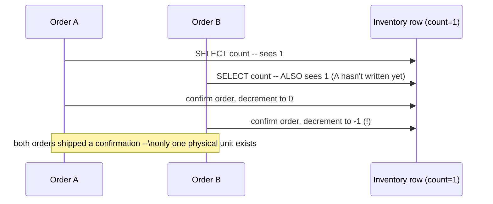

The obvious question: *why does checking stock and claiming stock happen as two separate steps at
all?* Because it's the natural way to write the code — read a value, then decide — and it works
fine as long as nothing else can read that same value in between. The bug only exists because two
things happened **concurrently**, with nothing forcing them to happen one-at-a-time for the same row.

**The fix, and the analogy for a lot of this story:** treat "check stock" and "claim stock" as
**one atomic operation**, not two. Think of a **deli counter's paper ticket dispenser** — you don't
peek at how much turkey is left and *then*, separately, ask for a ticket. Pulling the ticket **is**
the check: if a ticket's left in the roll, it's genuinely yours; if the roll is empty, there's
nothing to pull. Concretely: one conditional write, `UPDATE inventory SET count = count - 1 WHERE
sku = 'SKU-4471' AND count > 0`, checking whether the write actually changed a row (a standard
optimistic compare-and-decrement pattern). Order A's update matches `count > 0` and wins. Order B's
update, a moment later, finds `count` already at 0, matches nothing, and fails cleanly.

**New problem this fix creates, discovered five months later:** the double-sell is gone. But this
"ticket dispenser" only protects the *number* in one row from a concurrent race — it says nothing
about whether that number is even *correct* to begin with. A routine audit manually counts
`SKU-4471` on the shelf: **210 physical units.** The system's count says **214.** Nobody double-sold
anything this time — a picker just missed a scan sometime in the last few weeks, and the
direct-decrement counter has **no record** of which pick that was, when, or by whom, because the
number that just changed is all that survives. The ticket dispenser stops two people grabbing the
same ticket at the same instant; it explains nothing about a slow, silent drift with no paper trail.

**How I'd say this in an interview:** "The double-sell bug is a classic check-then-act race — the
fix is making the check and the claim one atomic conditional write, like a ticket dispenser where
pulling the ticket is the check. That closes the concurrency bug, but it doesn't give you a history
of *why* a count drifted over time, and that's a separate problem I'd expect to hit next."

---

## Chapter 2 — The robot that never gets to the urgent order

Cratewell's fulfillment center now has 40 human pickers and, following the same real-world path
Amazon took with its 2012 Kiva Systems acquisition, a growing fleet of goods-to-person robots that
bring shelving units to a picker instead of making the picker walk the aisles. The task-assignment
logic is the obviously-reasonable first draft: **whenever a worker or robot goes idle, hand it the
nearest available task.**

One afternoon: an order promised for a 2-hour rush-delivery cutoff needs a pick from aisle 40, at
the far end of the building. Meanwhile, a steady stream of ordinary restocking ("stow") tasks keeps
appearing right next to whichever worker just went idle, because that's simply where the
restocking backlog happens to be sitting today. Every single time a worker frees up near aisle 3,
the nearest task is another routine stow, not the aisle-40 rush pick — because "nearest" has no
concept of "this one actually matters more." Real number: the rush order's pick task sits
unassigned for **47 minutes** while **30 nearby low-urgency stow tasks** get assigned ahead of it,
one after another, purely because each one happened to be closer to whoever was free at that
moment. The order misses its truck's departure cutoff by **12 minutes**.

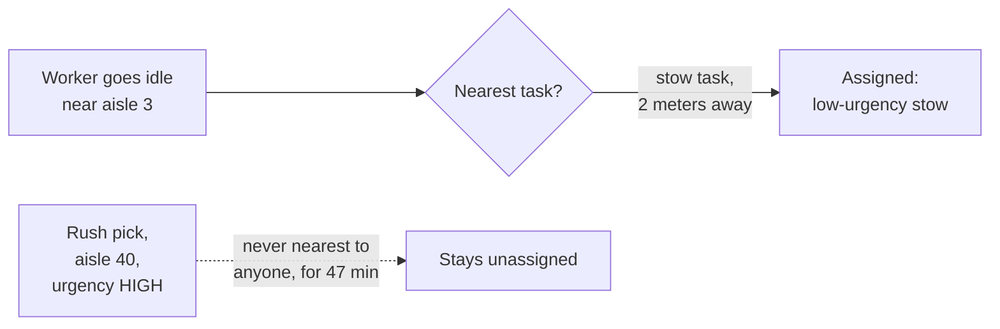

The obvious question: *why does pure "nearest" let something this important just sit there?*
Because proximity-only assignment has no way to express "this matters more, go get it even if it's
not the closest thing." It's the same underlying disease as **priority inversion** — a real,
documented incident from a completely different domain, NASA's 1997 Mars Pathfinder mission, where
a low-priority task could indefinitely block a high-priority one because the scheduler weighed
readiness, not importance. Different system, same shape of bug.

**The fix, and a second analogy for the rest of this story:** score every assignment as a **joint
function of proximity AND urgency**, not proximity alone. Think of an **ER triage nurse** — she
doesn't take patients strictly in the order they walked in, and she doesn't only look at who's
standing closest to her desk either. She weighs both: how bad is this, and how quickly can I
actually get to it. A patient with a broken finger who's right next to her still waits behind
someone having a heart attack two rooms over.

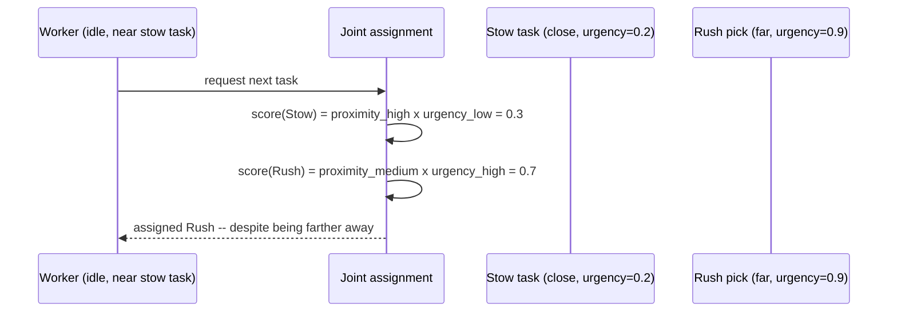

**New problem this fix creates:** urgency scores now matter, but where does the number `0.9` for
the rush pick actually come from? Right now it's a tag set **once**, when the task is created. That
turns out to be its own bug, one chapter away.

**How I'd say this in an interview:** "Pure nearest-match assignment has no concept of importance —
it's the same shape of bug as priority inversion, just applied to warehouse tasks instead of a CPU
scheduler. The fix is a joint proximity-times-urgency score, like a triage nurse weighing severity
and reachability together, not either one alone."

---

## Chapter 3 — The urgency tag that forgot to grow up

A new order comes in with a comfortable **3-hour** buffer before its promised ship time. At
creation, the task-generation code looks at that buffer, decides "plenty of time," and tags the
task `urgency = NORMAL` (say, a score of 0.3) — **once, at creation, and never again.**

Three hours are a long time in a busy warehouse. As the deadline gets closer, nobody recomputes
this tag. At the 30-minutes-remaining mark, the task is still labeled `NORMAL`, still losing every
joint-score comparison to tasks that happened to be tagged `HIGH` back when *they* were created,
even though several of those `HIGH` tasks now have hours of buffer left. The order limps along,
losing scoring contests it should now be winning, until it finally gets picked with **9 minutes**
to spare before its truck leaves — a near-miss that was pure luck, not correct design.

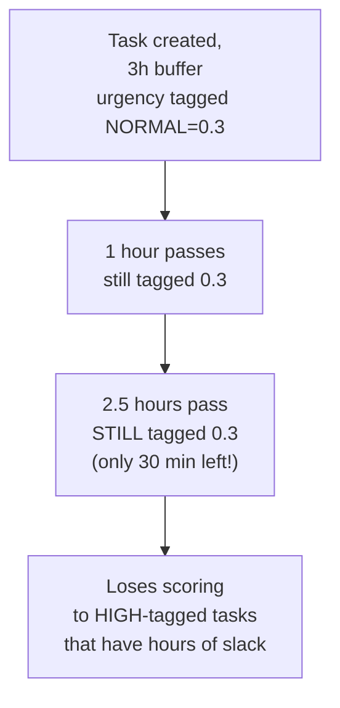

The obvious question: *why would urgency ever need to change after task creation — didn't we
already decide how important it is?* Because importance isn't a fixed property of the task, it's a
function of **time remaining until a deadline**, and time keeps moving whether anyone updates a
label or not. An order that was genuinely low-pressure at hour zero is, by definition, higher-
pressure at hour two-and-a-half, purely because less time is left.

**The fix:** stop treating urgency as a static tag. Recompute it **fresh, every time an assignment
decision is made**, as a function of time remaining: `urgency(task) = g(time_until_deadline)`.
Reusing the triage analogy: a hospital doesn't take a patient's vitals once at intake and never
again — vitals get rechecked continuously, because "how urgent is this patient" is itself a
function of time and condition, not a sticky note written at the door.

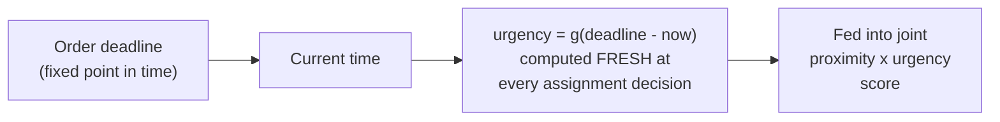

Worth naming the trade-off: this doesn't mean "always serve whatever's most urgent, ignore
distance." A strict urgency-only order would send workers on long, inefficient treks for a task
that's barely more urgent than one right next to them. The joint score is what balances "don't
starve urgent work" against "don't waste travel time" — neither extreme alone gets this right.

**How I'd say this in an interview:** "Urgency isn't a fact you learn once at task creation, it's a
function of the clock — the deadline is fixed, but time-remaining keeps shrinking, so urgency has
to be recomputed at assignment time, not read from a stale tag. And it's still a joint score with
proximity, not a strict priority order, because strict priority alone wastes travel time on
marginal urgency differences."

---

## Chapter 4 — The counter that can't explain itself

Back to the drift problem from Chapter 1, which never actually went away — it just got quieter.
Cratewell's flagship fulfillment center has grown into the kind of operation the reference guide
sizes for: roughly **500,000 SKUs**, about **5,000,000 item movements a day** (picks, stows,
receives), averaging **~58 events/sec**, spiking to **~500/sec** at shift-start and seasonal peaks.
Every one of those movements still just does `UPDATE inventory SET count = count ± N`, the same
mutable-counter model from Chapter 1's fix, just applied everywhere now, not only to the last-unit
race.

A monthly audit finds cumulative drift across the warehouse has reached **1,800 units** of
overcounted stock — the system thinks it has 1,800 more units, across many SKUs, than physically
exist. This starts causing oversells again, on completely different SKUs, even though the
atomic-decrement fix from Chapter 1 still correctly prevents races on a single decrement. The bug
isn't a race this time — some fraction of physical picks simply never get scanned at all (a
reader glitch, a rushed worker, a scan the network drops), and a plain counter has **zero way to
reconstruct** which pick that was, when, or by whom — the moment `count = count - 1` runs, the
event that caused it is gone, only the final number survives.

The obvious question: *if the decrement itself is atomic and correct, why is the total still
wrong?* Because atomicity only guarantees concurrent writes don't corrupt each other — it says
nothing about whether every physical movement actually *produces* a write in the first place. A
missed scan isn't a race condition; it's a write that should have happened and never did, and a
bare counter has no way to notice or later explain a write that's missing.

**The fix — event sourcing, and the analogy for the rest of this story:** stop mutating a "current
count" field at all. Treat every physical movement — received, stowed, picked, packed, shipped,
moved — as an **immutable fact**, appended forever to a log, and make "current count" a **derived
value**, folded from that log. Think of a **bank ledger** (exactly how Martin Fowler's documented
Event Sourcing pattern describes itself, and how real accounting ledgers have worked for centuries):
a bank doesn't store "your balance" as one number transactions overwrite — it stores every deposit
and withdrawal as its own permanent line item, and your balance is just their running total. If a
balance ever looks wrong, you don't have to trust a number — you read every line that produced it.

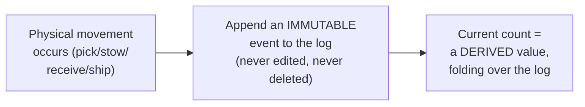

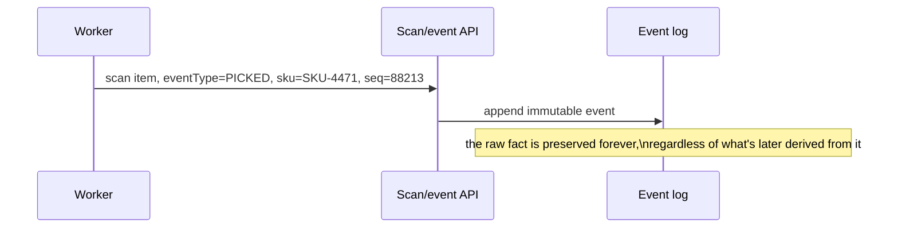

This also closes Chapter 1's story properly: claiming the last unit is no longer a raw `count - 1`
on a mutable field — it's an **append, conditioned on the log's current known state** (an "expected
sequence" check, the same optimistic-concurrency idea real event stores like EventStoreDB document
as "expected version"). If two orders race for the last unit now, the second append is rejected
because the log has already moved past what it expected — same ticket-dispenser guarantee as
before, but now every claim is also a permanent, explainable fact in the ledger.

**New problem this fix creates:** if "current count" is now something you compute by folding over
a log, and that log is genuinely gigantic (millions of events a day, accumulating for years), what
happens when 5,000 different systems ask "what's the current count of SKU-4471" every second?

**How I'd say this in an interview:** "A mutable counter can be atomic and still silently drift,
because atomicity protects against races, not against writes that never happen at all — a missed
scan just leaves no trace. Event sourcing fixes that: every movement is an immutable fact,
current count is derived, and if a count ever looks wrong you have a full history to check it
against, the same way a bank ledger never overwrites a balance, it just adds new line items."

---

## Chapter 5 — Five thousand people asking the ledger the same question every second

The event log design from Chapter 4 is correct. It's also, taken literally, a performance
disaster waiting to happen. The capacity math: movement events land at **~500/sec at peak** — a
trivial write load, about **40 KB/sec** at roughly 80 bytes an event. But queries asking "what's
the current count of SKU X" — from order-processing, from replenishment planning, from the storefront
checking availability — come in at roughly **5,000/sec**, **ten times** the write rate.

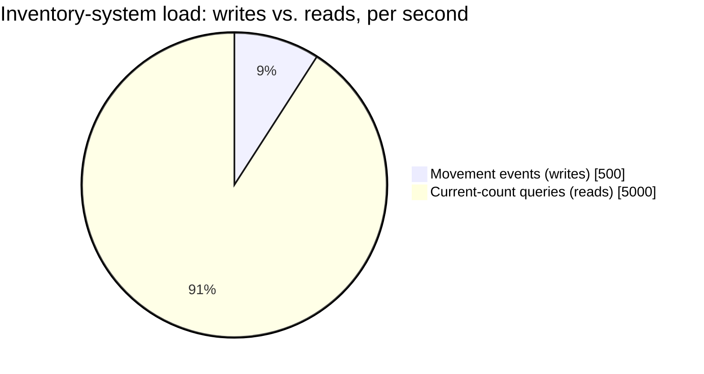

If "current count" means "replay this SKU's full event history from the beginning every time
someone asks," and even a modest per-SKU replay takes **50 milliseconds**
`[illustrative — a stand-in for "replay isn't free," not a measured benchmark]`, then 5,000
reads/sec need **250 CPU-seconds of replay work every second** — hundreds of dedicated cores just
to answer "how many do we have." The ledger analogy holds here too: no bank recomputes your balance
by re-reading every transaction every time you check the app — it keeps a running balance, updated
the instant a new transaction posts.

**The fix:** maintain a **continuously-updated materialized view** of current counts — a running
balance per SKU/location, updated the instant each event lands, so a read is a lookup, never a
replay. The log stays the single source of truth; the view is a fast, disposable projection of it.

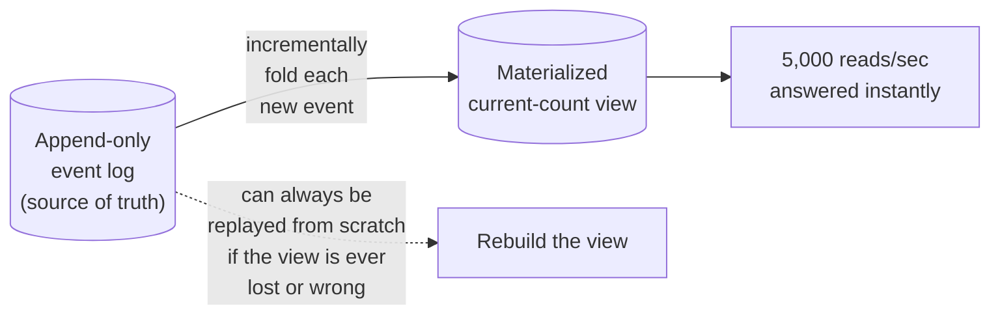

**New problem this fix creates:** the materialized view is always a perfectly correct summary of
what's *in the log*. But the log can only contain events that were actually generated — and
Chapter 4's whole reason for existing was that some physical movements never produce a scan at all.
Event sourcing guarantees a trustworthy log-to-view pipeline; it does nothing to guarantee every
physical event made it *into* the log to begin with.

**How I'd say this in an interview:** "Reads outnumber writes here by about 10 to 1, so you never
want to replay the log per query — you keep an incrementally-updated materialized view as the read
path, and treat the log itself purely as the durable source of truth you could always rebuild the
view from. It's the same running-balance-versus-full-transaction-history split a bank statement
already makes."

---

## Chapter 6 — The physical shelf that disagrees with the ledger

A scheduled **cycle count** — a routine warehouse practice, a small team physically counts a
sample of bins on a rotating schedule — checks aisle 12, bin 4. Physical count: **210 units.**
Materialized view says: **214.** A 4-unit discrepancy, on a single bin, on a single audit day.

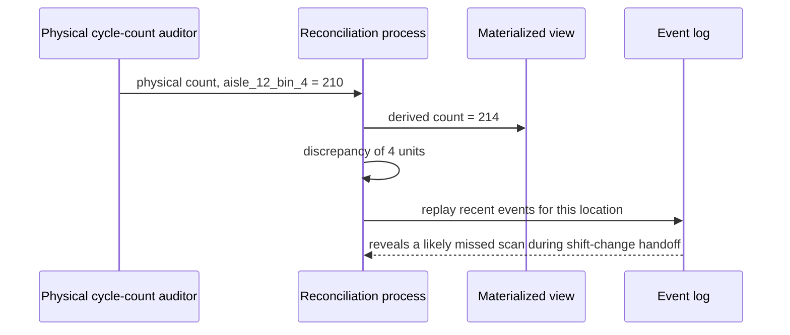

The obvious question: *does event sourcing being "correct" mean this shouldn't happen?* No — event
sourcing guarantees the view faithfully reflects the log; it never claimed the log perfectly
reflects physical reality, because the log can only record observations, and observations (a human
scanning a barcode) are occasionally missed, duplicated, or delayed. Any warehouse depending on
human or sensor observation will have *some* rate of this — expected, recurring, not a sign the
design is broken.

**The fix:** a standing **reconciliation process.** When a physical count and derived count
disagree, replay the recent events for that location, look for a likely explanation (a missed
scan, a duplicate, genuine shrinkage), and then — the important part — **append a correction
event.** Never edit or delete the original history. The ledger analogy carries through: an
accountant who finds a books error doesn't erase the wrong line, they add a correcting entry, so
both what was believed and what actually happened survive.

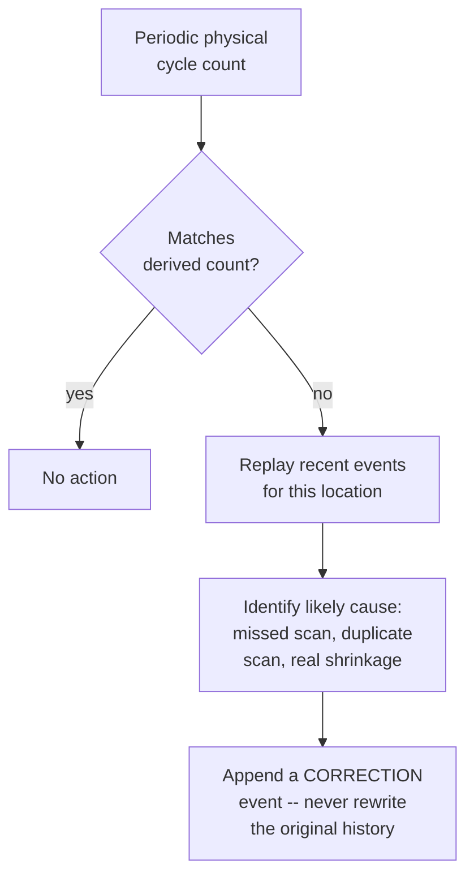

If corrections silently rewrote history, the very thing that made reconciliation possible — a
trustworthy, complete record — would be gone, and the next investigation couldn't tell what
actually happened from what someone later decided should have happened.

**How I'd say this in an interview:** "Physical-versus-derived discrepancies are expected, not a
bug — any system depending on human observation will drift a little. Reconciliation replays history
to find the likely cause, and the fix is always a new appended correction event, never an edit to
the past, because rewriting history would destroy the auditability the whole design depends on."

---

## Chapter 7 — The picker who goes quiet mid-task

A worker gets assigned a pick task in aisle 40. Two minutes in — task not yet marked complete — her
handheld scanner's battery dies, and she's mid-conversation with a supervisor and doesn't notice for
a while. As far as the assignment system is concerned, that task was handed out and... nothing
since. Fifteen minutes pass. The order attached to that task has a delivery cutoff **9 minutes**
away `[illustrative — Cratewell-specific timing, but "an assigned worker goes silent mid-task" is a
completely ordinary warehouse-floor failure mode]`. Nobody reassigns it, because nothing told the
system it needed reassigning — from the system's point of view, it's still "in progress."

The obvious question: *how would the system even know a task is stuck, if the worker herself hasn't
reported anything?* It can't know for certain — but it can make a reasonable, time-based guess: if
a task has been assigned for meaningfully longer than a task of that type normally takes, treat it
as probably stuck rather than assuming it's still fine.

**The fix:** give every assigned task a **lease** — a time budget after which, if it hasn't been
marked complete, it automatically becomes available for reassignment to someone else. A pick that
normally takes **90 seconds** might get a **5-minute** lease, generous enough to absorb normal
variance but short enough that a genuinely stuck task doesn't sit abandoned for 15 minutes. This is
the same underlying idea as a job queue's visibility timeout, just applied to a physical task
instead of a message.

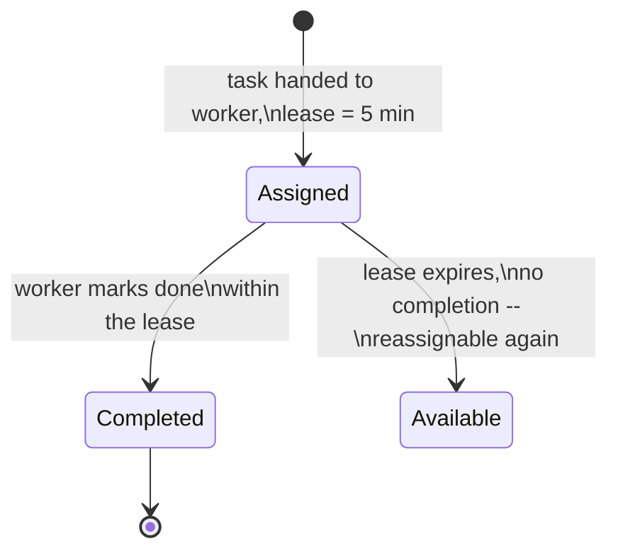

**New problem this fix creates, immediately obvious once you think about it:** if the original
worker eventually does finish the task — say her battery gets swapped and she completes it at
minute 6, one minute after the lease already expired and handed the task to someone else — now
**two people might both be walking toward the same bin to pick the same unit.** The lease solves
"don't abandon a stuck task forever"; it does not, by itself, solve "make sure the same physical
pick doesn't get performed twice."

**The actual fix for that second half:** completion has to be **idempotent** and tied to the task's
identity, not to who reports it. Whichever "done" event lands first wins and closes the task for
good; a late "done" from the original worker gets checked against "is this task already complete?"
and discarded as a no-op, instead of double-processing the pick. The ledger from Chapter 4 makes
this cheap: the first completion is a fact, a late duplicate is just another event that gets
recorded and ignored, never something that corrupts the derived count.

**How I'd say this in an interview:** "An assigned task needs a lease, the same idea as a message
queue's visibility timeout — if it's not completed in a reasonable window, it goes back into the
pool. But a lease alone can create a double-completion race if the original worker finishes late,
so completion also has to be idempotent, keyed on the task, so a late 'I'm done' is just ignored
instead of double-counted."

---

## Chapter 8 — The task only a human should get

Cratewell now runs a genuinely mixed fleet: human pickers and Kiva-style goods-to-person robots,
both competing for tasks through the same proximity-times-urgency scoring from Chapter 2. One
task type starts causing trouble: **"assess a possibly-damaged item and decide whether it's still
sellable."** A robot, closest and highest-scoring for one such task, does what robots do — completes
the mechanical pick and moves the item along, because proximity-and-urgency scoring has no concept
of "can this executor actually make the judgment call." A genuinely damaged item ships to a
customer, who returns it, unhappy `[illustrative — the underlying gap, a robot scored for a task it
structurally can't judge, is the real point]`. The reverse shows up too: heavy pallet-lifting tasks
keep landing on nearby humans purely because they're closer, while an idle robot two aisles over is
better suited to it.

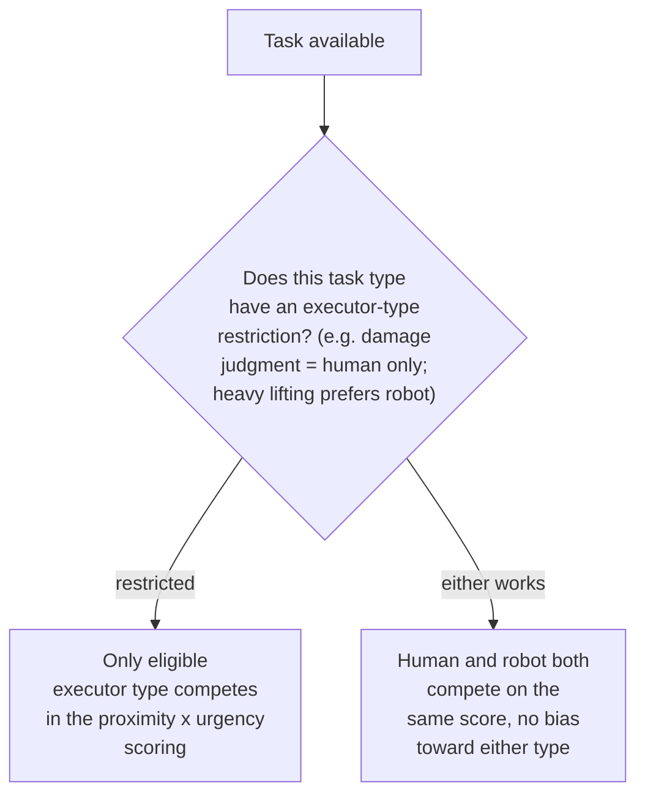

The obvious question: *why not just add a filter before scoring — "if this task needs a human, only
show it to humans"?* That works mechanically, but it's easy to get subtly wrong as a bolted-on
pre-filter separate from scoring, inviting inconsistent treatment across task types over time.
Folding eligibility in as one more explicit scoring dimension keeps the logic uniform: restricted
tasks only ever compare eligible candidates, and unrestricted tasks let humans and robots compete
fairly, with no structural thumb on the scale for either type.

**How I'd say this in an interview:** "Executor-type eligibility is a real, distinct dimension —
some tasks need human judgment, some are better suited to a robot — and it belongs inside the
scoring function as an eligibility gate, not as an afterthought filter. Tasks with no restriction
should let both types compete on equal proximity-and-urgency terms, not silently favor one."

---

## Chapter 9 — The ledger that briefly stops listening

During a holiday peak, the event-log service — the single append-only store everything else in
this design depends on — has a brief network-level hiccup and stops accepting writes for about **90
seconds.** Pickers and robots keep physically working; barcodes keep getting scanned; sensors keep
firing. None of it can be written down for those 90 seconds.

The obvious question: *should physical work just stop until the log is reachable again?* That's
safe for the log, but it means idle robots and stalled pickers the moment any part of the recording
pipeline hiccups — a direct, visible throughput cost for a purely internal plumbing issue. **The
fix:** let scanners and edge devices **locally buffer** events for a short window and forward them
once the log is reachable, rather than blocking the physical action on a live write ack. Work
continues; the log just catches up shortly after.

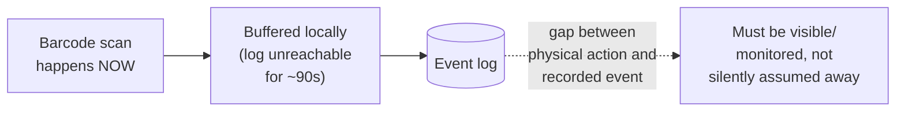

**New problem this fix creates:** for those 90 seconds (and a little longer while the buffer
drains), recorded state and physical reality are quietly out of sync — buffering makes that gap
*survivable*, not invisible. It has to be an explicit, monitored fact (a dashboard of
buffered-but-unflushed events, an alert if it doesn't drain within a couple minutes), never
silently assumed to have resolved itself.

**A smaller wrinkle from the same peak-season chaos:** a robot and a human picker both go idle in
the same second, equally close to the same highest-scoring task — a scoring tie. Left unresolved,
who gets it becomes whichever request a network quirk processes a few milliseconds earlier: not
wrong, but non-deterministic enough to make "why did the robot get that task" unanswerable. The fix
is a small, explicit tie-break rule decided in advance: task-type eligibility preference first, then
a simple deterministic rule like lowest executor ID.

**How I'd say this in an interview:** "Physical work shouldn't block on the event log being
reachable — buffer locally and forward — but that creates a real gap between recorded state and
physical reality that has to be monitored explicitly, not hand-waved away. And any place two
executors can tie on score needs an explicit, deterministic tie-break rule, or 'who got the task'
becomes unanswerable noise under load."

---

## Where the story actually lands

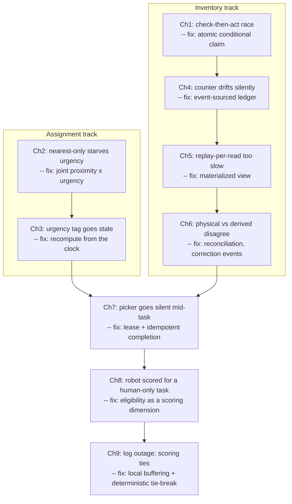

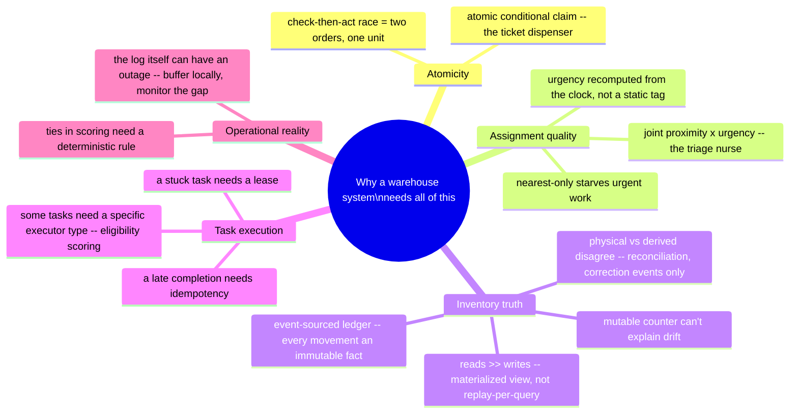

Every real fulfillment-center design sits somewhere on this chain. A scoped-down version — small
warehouse, no robots, tolerant of occasional drift — might reasonably stop around Chapter 5's
materialized view. A design graded on inventory correctness and mixed fleets needs Chapters 8 and
9. If the interviewer never raises robots, walking there unprompted reads as padding, not depth.

---

## Grill me — adversarial follow-ups

**Q1: "Why not just lock the whole inventory row with a database transaction instead of this
atomic-conditional-write trick?"**
You could, and for a single row it's not wrong — but a lock held across a slow operation creates
contention under load, and it doesn't generalize to the event-sourced model this lands on, where
"current count" isn't a row you can lock, it's a derived value. The conditional write (or
conditional append, once event-sourced) gets you the same correctness without holding anything open.

**Q2: "Doesn't recomputing urgency for every task on every assignment decision get expensive at
scale?"**
It's a cheap function of two numbers — current time and a stored deadline — not a query or a model
call, so computing it fresh for every candidate at assignment time is trivial next to the actual
scoring and comparison work. The expensive part was never the arithmetic; it's keeping the deadline
itself accurate.

**Q3: "If event sourcing is so much better, why didn't Chapter 1 just start there instead of the
atomic counter?"**
Because the atomic counter genuinely does fix the race it was built for — it's not wrong, it's
incomplete. That's realistic interview pacing too: showing you know what a smaller fix does and
doesn't cover is exactly the reasoning an interviewer wants to see, not jumping straight to the
final answer.

**Q4: "Your materialized view is a cache, basically — what happens if it gets corrupted or falls
behind?"**
It's disposable by design: since the event log is the real source of truth, the view can always be
thrown away and rebuilt by refolding the log from the beginning or a checkpoint. That's a real
operational cost worth naming, but a recoverable one, unlike losing the log itself.

**Q5: "Why append a correction event instead of just fixing the number when a cycle count finds a
discrepancy?"**
Editing the number is simpler in the moment and worse forever after — you lose the ability to
answer "what did we believe, and why, before this correction," which is exactly what the next
investigation needs. Append-only discipline is what makes reconciliation possible at all.

**Q6: "A task lease sounds exactly like a message queue's visibility timeout — is it the same
mechanism?"**
Conceptually yes — claim something, give it a time budget, make it available again if nobody
confirms in time — but a physical task can half-complete in the real world in ways a message can't.
That's why the lease alone wasn't enough; you also need idempotent completion for a worker who
finishes late, after reassignment already happened.

**Q7: "Why fold executor-type eligibility into the score instead of just filtering candidates first?"**
A pre-filter works mechanically, but it tends to grow inconsistent special-casing as more task types
get restrictions bolted on separately. Treating eligibility as one more scoring dimension keeps
every task type on the exact same logic path, restricted or not.

**Q8: "If the event log has a 90-second outage, isn't buffering locally just hiding data loss until
it's too late?"**
Only if nobody's watching the buffer. The design explicitly requires that gap to be visible — a
monitored buffered-event count, an alert if it doesn't drain — a known, bounded, tracked risk, not
a hidden one. Blocking all physical work on the log instead just trades that for a guaranteed
throughput hit every time the log hiccups.

**Q9: "Given this whole story, if someone says 'design a warehouse task and inventory system' cold,
where do you start?"**
Name the two hard problems up front: assignment has to jointly weigh proximity and urgency because
pure nearest-match starves priority work, and inventory correctness has to come from an
event-sourced log because the physical world can't give you atomic, guaranteed-observed state
changes. Then go only as deep into mixed fleets, reconciliation, or leases as the follow-ups ask for.

---

## Cheat sheet — one line per stop on the story

- **Check-then-act race**: two orders both see stock available and both get confirmed — fix is one
  atomic conditional claim (the ticket dispenser), never a separate check-then-decide.
- **Nearest-worker-only assignment**: proximity alone has no concept of importance and starves
  urgent work indefinitely — fix is a joint proximity-times-urgency score (the triage nurse).
- **Static urgency tag**: importance is a function of time-remaining-until-deadline, not a fact
  fixed at task creation — recompute it fresh at every assignment decision.
- **Mutable inventory counter**: can be perfectly atomic and still drift silently, because
  atomicity protects against races, not against writes (scans) that never happen at all.
- **Event-sourced inventory**: every physical movement is an immutable, appended fact; current
  count is a derived value, folded from the log — never a directly mutated field (the bank ledger).
- **Materialized view**: reads vastly outnumber writes here, so maintain an incrementally-updated
  current-count view — never replay the full log per query.
- **Reconciliation**: physical-versus-derived discrepancies are expected and recurring, not a sign
  of a broken system — replay history to investigate, fix with a new correction event, never a
  rewrite.
- **Task lease**: an assigned task that's silent past a reasonable time budget becomes reassignable
  — same idea as a message queue's visibility timeout, applied to physical work.
- **Idempotent task completion**: a lease alone can cause the same pick to be completed twice —
  completion has to be keyed on the task and safely ignore a late, duplicate "I'm done."
- **Executor-type eligibility**: a real, distinct scoring dimension for tasks that genuinely need a
  human or a robot specifically — folded into scoring, not bolted on as an afterthought filter.
- **Event log outage**: physical work shouldn't block on the log being reachable — buffer locally
  and forward, but treat the resulting gap as a monitored, visible fact, never a silent assumption.
- **Scoring ties**: two executors tying on score need an explicit, deterministic tie-break rule, or
  "who got the task" becomes unanswerable noise under load.
- **The meta-lesson**: every fix in this story buys one property (atomicity, priority-fairness,
  freshness, explainability, read speed, correctable trust, liveness, exactly-once effect, the
  right executor, or availability-under-partial-failure) by spending a different one — say the
  trade in the same sentence you propose the fix.
