# Design a Warehouse Task-Assignment & Inventory System — FAANG Interview Guide

> Source chapter type: physical-fulfillment orchestration. Confirmed reported as an Amazon system
> design question: "design a warehouse service that assigns tasks to workers or robots based on
> proximity and urgency, using barcodes or IoT sensors to update inventory status in real time...
> every item movement captured as an event." Combines two mechanisms from elsewhere in this
> course into a genuinely new domain: [Uber Dispatch](./62-Design-Ubers-Driver-Dispatch-System-FAANG-Guide.md)'s
> proximity-based assignment, applied to **robots and human workers instead of drivers**, plus an
> **event-sourced inventory ledger** where every physical item movement is an immutable fact, not
> a mutable row that gets overwritten.

## Mental model

A fulfillment center has thousands of items on shelves, a continuous stream of orders needing to
be picked, packed, and shipped, and a mixed fleet of human workers and robots physically moving
through the building. Two problems compound:

1. **Task assignment isn't just "nearest available worker."** Unlike ride-hailing (guide 62),
   tasks here have varying **urgency** (an order promised for same-day shipping outranks one with
   a week's buffer) alongside proximity — the assignment problem has to jointly optimize both, not
   default to pure nearest-match, which would let a low-urgency-but-close task starve a
   high-urgency-but-farther one.
2. **Inventory count has to be exactly right, continuously, while dozens of workers concurrently
   move physical items.** "How many units of SKU X are on shelf Y" is being changed by many
   concurrent physical actions (a picker removes one, a receiving dock adds ten) — the only way to
   get this right reliably is to treat **every movement as an immutable event**, deriving the
   current count from the event log, rather than trying to keep one mutable "current count" field
   consistent under concurrent physical-world updates that can't be perfectly atomic (a human
   scanning a barcode isn't a database transaction).

**The one sentence to say out loud:** *"Task assignment here jointly optimizes proximity AND
urgency, not just nearest-match — and inventory correctness comes from treating every physical
movement as an immutable event and deriving current state from the log, because you can't make a
human picking an item off a shelf into an atomic database operation."*

**The one picture to remember forever:**

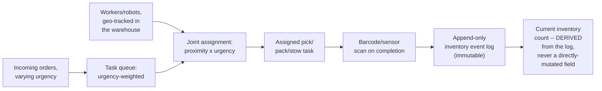

**Memory hook:** *"Assign by proximity times urgency, never proximity alone. Derive inventory
counts from an append-only event log, never mutate a count directly — the physical world can't
give you an atomic transaction, so the log is what makes the count trustworthy."*

---

## Table of contents
[How to Identify This Topic](#how-to-identify-this-topic-in-an-interview) ·
[Interview Playbook](#interview-playbook) · [Requirements](#requirements-clarification) ·
[Capacity Estimation](#capacity-estimation-worked) · [API Design](#api-design) ·
[High-Level Architecture](#high-level-architecture) ·
[Architecture Evolution v1→v2→v3](#architecture-evolution-v1--v2--v3) ·
[End-to-End Walkthroughs](#end-to-end-request-walkthroughs) ·
[Deep Dive: Proximity × Urgency Task Assignment](#deep-dive-proximity--urgency-task-assignment) ·
[Deep Dive: Event-Sourced Inventory](#deep-dive-event-sourced-inventory) ·
[Deep Dive: Reconciling Physical Counts](#deep-dive-reconciling-physical-counts) ·
[Deep Dive: Mixed Human/Robot Fleets](#deep-dive-mixed-humanrobot-fleets) ·
[Data Model](#data-model) · [Failure Modes](#failure-modes--mitigations) ·
[Non-Functional Walkthrough](#non-functional-walkthrough) ·
[Security & Compliance](#security--compliance) · [Cost & Trade-offs](#cost--trade-offs) ·
[Wrap-Up](#wrap-up-mvp-vs-stretch) · [Golden Rules](#golden-rules) ·
[Cheat Sheet](#master-cheat-sheet)

---

## How to identify this topic in an interview

- "Design a warehouse/fulfillment-center system that assigns work to robots or workers and tracks
  inventory in real time" — confirmed as a reported Amazon interview question.
- The tell that this is about joint proximity+urgency optimization and event-sourced inventory,
  not just a dispatch chapter: the interviewer emphasizes **task priority** and/or **real-time
  inventory accuracy under concurrent physical movement** — either signal points to this
  chapter's two core mechanisms.
- A follow-up like "how do you keep the inventory count correct when a human might scan a barcode
  incorrectly or miss a scan" is the
  [reconciling-physical-counts deep dive](#deep-dive-reconciling-physical-counts).

---

## Interview playbook

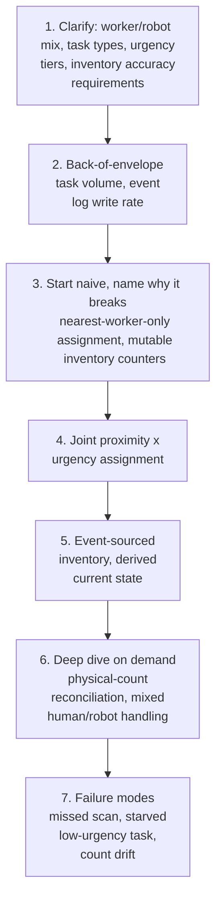

**What the interviewer is actually grading at each step:**
- Step 3: do you recognize, unprompted, that pure nearest-worker assignment (the Uber-dispatch
  default) is wrong here because task urgency varies and must be weighed jointly with proximity?
- Step 5: do you know *why* a directly-mutated "current count" field is fragile under concurrent
  physical-world updates, and propose an append-only event log with derived state instead?
- Step 6: do you have a concrete answer for "what happens when a physical count and the system's
  derived count disagree" — a reconciliation process, not an assumption that scans are always
  perfectly accurate?

---

## Requirements clarification

### Functional

| # | Requirement | Notes |
|---|---|---|
| F1 | Assign pick/pack/stow tasks to available workers/robots, weighing both proximity and urgency | The core assignment function |
| F2 | Record every physical item movement (pick, stow, receive, ship) as an event | The inventory-correctness foundation |
| F3 | Derive and serve the current inventory count for any SKU/location from the event log | The read-side of the inventory system |
| F4 | Support both human workers (barcode scanners) and robots (sensor-based) as task executors | A mixed-fleet requirement |
| F5 | Detect and support reconciliation when a physical count and the derived count disagree | Physical-world data entry is imperfect by nature |

### Non-functional

| Requirement | Target | Why this number |
|---|---|---|
| Task assignment latency | Low, seconds — a worker/robot shouldn't wait long for a next task | Idle worker/robot time is a direct throughput cost |
| Inventory count accuracy | Very high, with any drift detected and reconciled promptly | An inaccurate count causes downstream problems (promising stock that doesn't exist, or leaving real stock un-sold) |
| Event log durability | High — a lost movement event is a permanent, unrecoverable gap in the inventory picture | The event log is the single source of truth; losing events breaks the entire derived-state model |
| Assignment fairness across urgency tiers | A high-urgency task must not be starved by a continuous stream of proximity-favored low-urgency ones | The core tension the joint-optimization deep dive addresses |
| Throughput | Must scale with warehouse size and order volume, particularly during demand peaks (e.g. a holiday shopping surge) | Standard operational scaling requirement, sharpened by known seasonal peaks |

**Clarifying questions worth asking the interviewer up front — and what each answer changes:**

| Question | If the answer is... | ...then this changes |
|---|---|---|
| "How is task urgency determined — a fixed set of tiers, or a continuous deadline-derived value?" | A continuous deadline (e.g. hours until the promised ship time) | Confirms the assignment scoring function needs a real urgency computation, not just a small fixed enum, and that urgency itself changes over time as a deadline approaches |
| "What's the source of truth for inventory — barcode scans, RFID, weight sensors, or a mix?" | A mix, varying by area of the warehouse | Confirms the event-sourcing model needs to accept events from heterogeneous input sources, not assume one uniform scanning technology |
| "How should the system behave if a robot and a human are both viable for the same task type?" | Either can be assigned; robots preferred for certain task types | Confirms the assignment function needs an executor-type preference/eligibility dimension alongside proximity and urgency |
| "What's an acceptable reconciliation cadence for physical inventory counts (cycle counts) vs. the real-time derived count?" | Periodic physical audits, reconciled against the derived count | Confirms the reconciliation deep dive is in scope as a recurring operational process, not a one-time fix |

**Say this out loud in the interview:** *"I want to treat inventory as an event-sourced system
from the start — every physical movement is an immutable fact, and the current count is always a
derived value, never something I mutate directly, because the physical world can't give me the
same atomicity guarantees a database transaction can."*

---

## Capacity estimation, worked

```
Given (illustrative, one large fulfillment center):
  SKUs stocked                                      = 500,000
  Item movements/day (picks, stows, receives)         = 5,000,000
  Peak movement events/sec                             = 5,000,000 / 86,400 ~= 58 average,
                                                          say ~500/sec at peak (shift-start
                                                          surges, seasonal peaks)

Task assignment load:
  Tasks generated/day (roughly 1 per movement,
    plus some multi-item batched tasks)                 ~= 3,000,000
  Available workers + robots, concurrent, peak shift     = ~800
  Average task duration                                   = ~90 seconds
  Assignment decisions/sec at peak                         = 800 / 90 ~= 9/sec PER WORKER-SLOT,
                                                              aggregate assignment throughput
                                                              needed ~= a few hundred/sec
  -> a modest number for the assignment ALGORITHM itself -- the harder problem is the QUALITY
     of each decision (proximity x urgency jointly), not raw throughput, unlike some other
     matching chapters in this course where throughput itself is the dominant challenge.

Event log write volume:
  Movement events/sec at peak                             = 500/sec
  Bytes per event (itemId, locationId, eventType,
    executorId, timestamp)                                  ~= 80 bytes
  Event log write bandwidth at peak                         = 500 x 80B = 40 KB/sec
  -> trivially small -- this is never a THROUGHPUT problem, similar to several event-sourcing-
     style systems elsewhere in this course; the design challenge is correctness and derivability
     of current state from the log, not raw ingest capacity.

Derived-state read load:
  "Current count for SKU X" queries/sec (order-
    processing, replenishment decisions, etc.)             = ~5,000/sec
  -> reads FAR outnumber writes here -- this argues for maintaining a continuously-updated
     MATERIALIZED view of current counts (updated incrementally as events arrive), rather than
     replaying the full event log per query, which would be far too slow for this read volume.
```

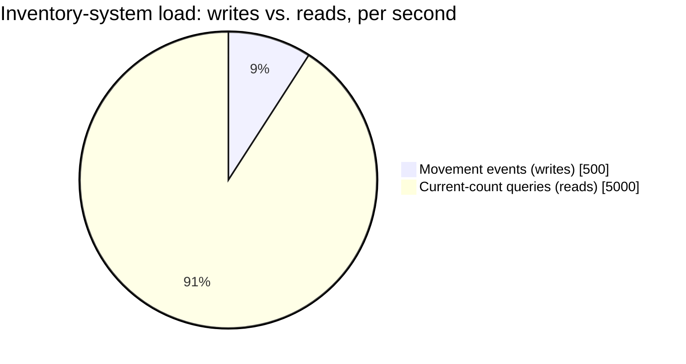

Reads outnumber writes roughly 10:1 — the concrete justification for maintaining an incrementally-
updated materialized view rather than replaying the event log per query.

**Redo-the-chain test:** if the fulfillment center doubles in SKU count and order volume for a
peak season, both event-log write volume and derived-read load scale proportionally — still
comfortably within the "small numbers" range established above, reinforcing that this system's
hard problems are correctness and assignment quality, not raw scale.

**The number worth memorizing:** reads (current-count queries) vastly outnumber writes (movement
events) in this system — the correct architectural response is a continuously-updated
materialized view derived from the event log, not replaying the log per read.

---

## API design

### `POST /v1/inventory/events` (recorded on every scan/sensor trigger)

```json
{
  "itemId": "sku_881_unit_44821",
  "skuId": "sku_881",
  "eventType": "PICKED",
  "fromLocation": "aisle_12_bin_4",
  "executorId": "worker_209",
  "timestamp": "2026-07-24T18:00:00Z"
}
```

### `GET /v1/inventory/{skuId}/count?location=aisle_12`

```json
{ "skuId": "sku_881", "location": "aisle_12", "derivedCount": 214, "asOfEventSequence": 88213 }
```

### `POST /v1/tasks/next` (a worker/robot requests its next assignment)

```json
{ "executorId": "worker_209", "executorType": "HUMAN", "currentLocation": "aisle_11" }
```

Response:
```json
{ "taskId": "task_71209", "type": "PICK", "location": "aisle_12_bin_4", "urgencyScore": 0.87, "orderDeadline": "2026-07-24T20:00:00Z" }
```

| Field | Notes |
|---|---|
| `asOfEventSequence` | Every derived-count response is tagged with the event-log position it reflects — the same reproducibility discipline as the audit-trail requirements elsewhere in this course, here applied to a physical inventory count |
| `urgencyScore` | A computed value, not a raw deadline — the assignment function's actual joint-optimization input, made visible for debugging/explainability |

**The one sentence worth saying about the API surface:** *"Every derived inventory read carries
the event-log position it reflects, and every task assignment carries the computed urgency score
that drove the decision — both are explicit, reproducible facts, never opaque numbers."*

---

## High-level architecture

### Architecture evolution (v1 → v2 → v3)

**v1 — nearest-worker-only assignment, mutable inventory counters:**

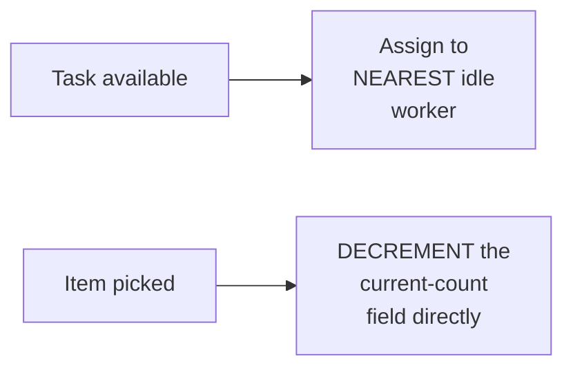

**Why it breaks:** nearest-worker-only assignment lets a continuous stream of low-urgency, nearby
tasks starve a high-urgency, farther-away one indefinitely — proximity alone has no way to express
"this matters more, assign it even if it's not the closest." And directly decrementing a mutable
count field under concurrent physical-world updates (multiple workers picking simultaneously,
scans arriving out of order, occasional missed scans) accumulates drift with no record of *why*
the count is wrong or how to reconstruct the truth.

**v2 — urgency-weighted assignment added, but inventory is still a mutable counter:**

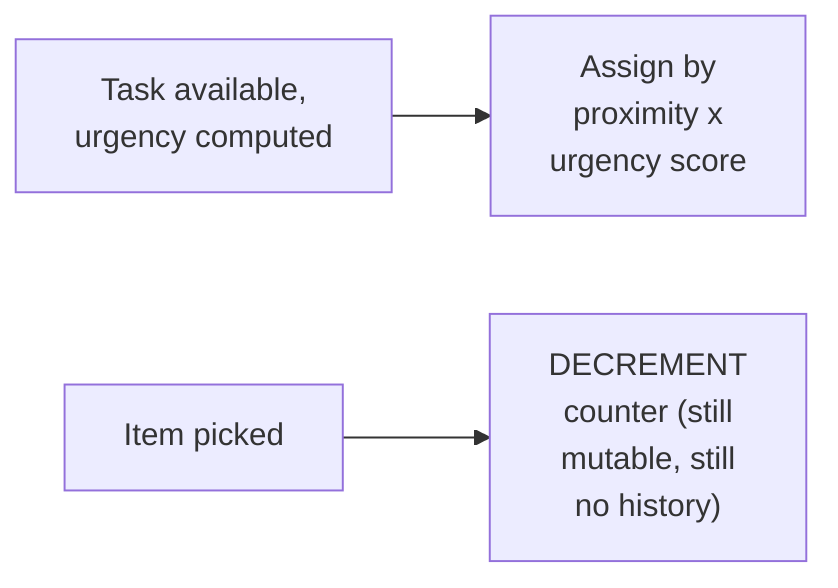

**Why it breaks:** urgency-weighted assignment (v2's real improvement) fixes the starvation
problem. But the inventory model is unchanged — when a count looks wrong, there's no way to
determine whether a scan was missed, duplicated, or genuinely reflects a physical discrepancy,
because the mutable-counter model discards the individual movement history the moment it's
applied.

**v3 — the real system: joint proximity×urgency assignment + event-sourced inventory:**

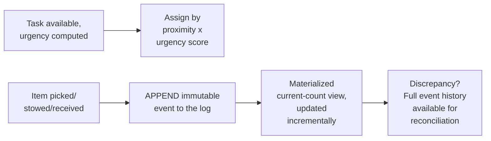

**What v3 fixes, one line each:** joint proximity×urgency scoring (already in v2) prevents
starvation of high-priority tasks; and event-sourcing inventory (rather than mutating a counter)
means every movement is preserved, current count is a derived materialized view, and any
discrepancy can be investigated against a full, reconstructible history instead of a single
opaque number.

---

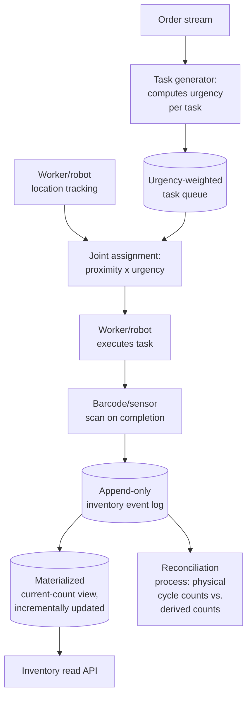

| Component | Role |
|---|---|
| Task generator | Computes each task's urgency score from order deadlines and other priority signals |
| Joint assignment | Scores proximity × urgency across available executors, the mechanism behind the assignment deep dive |
| Event log | The append-only, immutable source of truth for every physical movement |
| Materialized current-count view | Incrementally updated from the log, serving the high read volume established in the capacity estimate |
| Reconciliation process | Compares periodic physical cycle counts against derived counts, investigating and resolving discrepancies |

---

## End-to-end request walkthroughs

### Walkthrough 1 — a high-urgency task wins assignment over a closer, low-urgency one

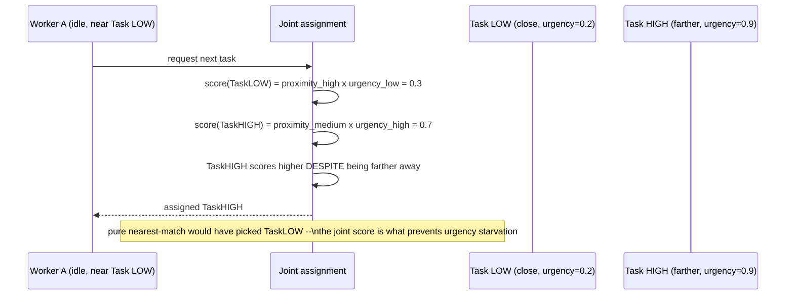

### Walkthrough 2 — an item pick recorded as an event, current count derived incrementally

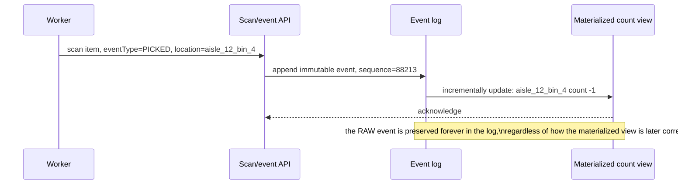

### Walkthrough 3 — a physical cycle count disagrees with the derived count, reconciled against history

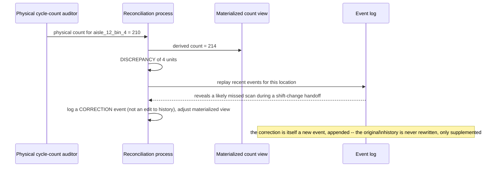

Walkthrough 3 is the concrete payoff of event-sourcing — the discrepancy is investigable against
real history, and the fix is itself a new, auditable event rather than a silent edit.

---

## Deep dive: proximity × urgency task assignment

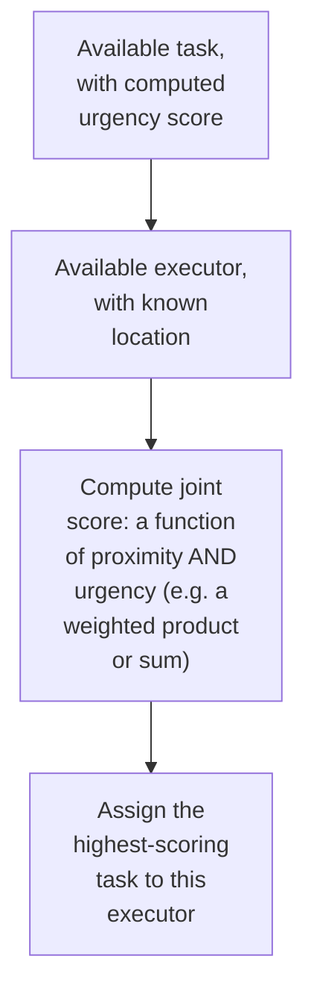

**Why a weighted combination, not a strict priority order (always serve the highest-urgency task
regardless of distance):** always serving strict urgency order can leave workers making long,
inefficient treks across the warehouse for a slightly-more-urgent task while ignoring a
nearly-as-urgent one right next to them — a joint score balances "don't starve urgent work" against
"don't waste physical travel time," which strict priority alone doesn't achieve.

**Why urgency must be a continuously recomputed value, not a static tag set once:** an order's
urgency legitimately increases as its promised deadline approaches — a task tagged "normal"
priority at task-creation time may need to become "urgent" hours later purely because time has
passed, which requires urgency to be computed fresh at assignment time from the deadline, not
read from a stale, one-time-assigned label.

**Interview cheat-sheet:** *"Score assignment as a joint function of proximity and urgency, not a
strict priority order — and compute urgency fresh at assignment time from the underlying deadline,
since urgency legitimately increases as a deadline approaches, unlike a static priority tag."*

---

## Deep dive: event-sourced inventory

Already the centerpiece of the mental model and architecture evolution — the deep dive states the
general principle.

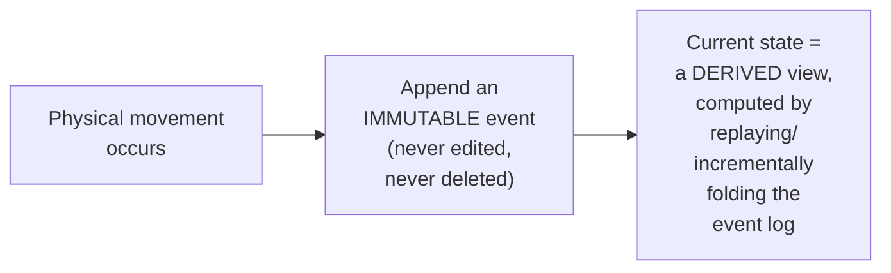

**Why this is the right model specifically because the physical world can't offer database-style
atomicity:** a mutable "current count" field assumes every update is a clean, atomic
read-modify-write — but a human picking an item, walking to a scanner, and scanning it involves
real-world delay and failure points a database transaction doesn't have (the scan might happen
seconds after the physical pick, or might not happen at all). Treating each *observed* event as an
immutable fact, and deriving state from the sequence of observations, is robust to this reality in
a way direct mutation isn't — an incorrect or missing observation is itself just another fact to
reason about, not a corruption of the "truth."

**Interview cheat-sheet:** *"Inventory correctness comes from treating every physical movement as
an immutable, appended event and deriving current state from the log — never mutating a count
directly, because the physical world's observation process (a human scanning a barcode) doesn't
have the atomicity guarantees a database transaction does."*

---

## Deep dive: reconciling physical counts

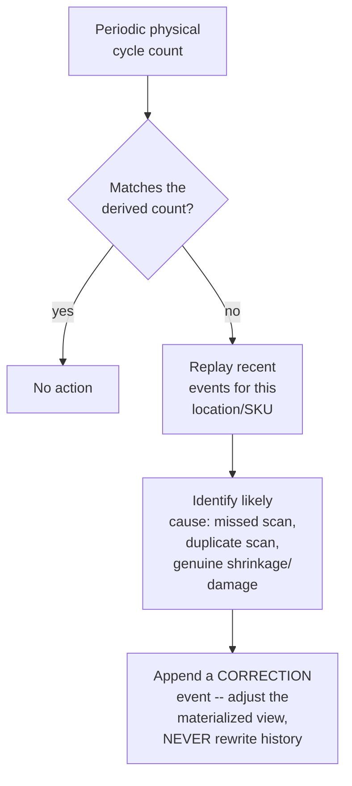

**Why physical-vs-derived discrepancies are expected, not a sign of a broken system:** any
process depending on human or sensor observation of the physical world will have some rate of
missed, duplicated, or delayed observations — the reconciliation process exists specifically
because this is a known, ongoing operational reality, not a one-time bug to eliminate entirely.

**Why the fix is a new event, never an edit to the historical record:** rewriting history to "fix"
a past event would destroy the very property (an immutable, trustworthy log) that makes
reconciliation possible in the first place — an explicit correction event preserves both the
original (possibly wrong) observation and the reasoning that led to the fix, which is what makes
the whole system auditable.

**Interview cheat-sheet:** *"Reconciliation is a recurring, expected operational process, not a
one-time fix — and any correction is itself a new appended event, never a rewrite of history,
preserving the auditability the whole event-sourced model depends on."*

---

## Deep dive: mixed human/robot fleets

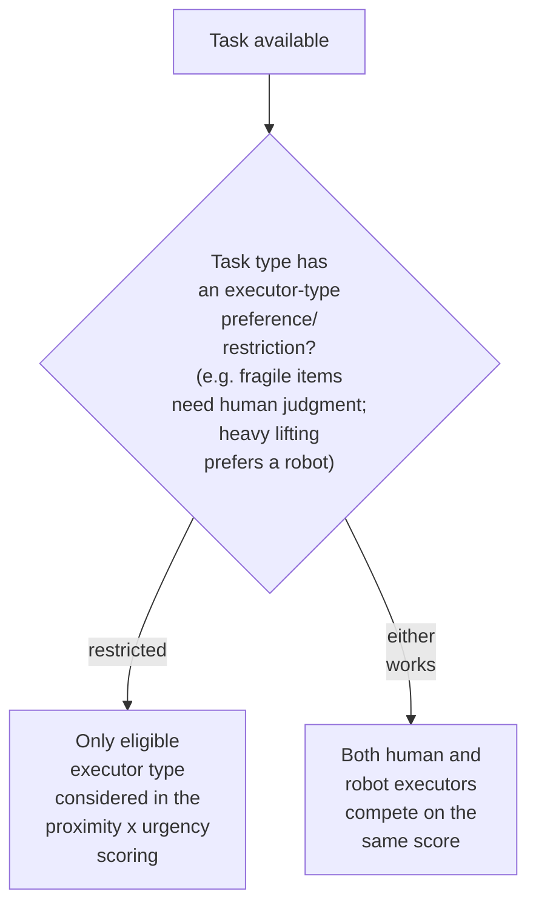

**Why this is a real, distinct dimension from proximity and urgency, not just an assignment
filter applied after the fact:** some tasks genuinely require human judgment (assessing whether a
damaged-looking item should still ship) or are better suited to a robot (repetitive heavy lifting)
— folding eligibility into the scoring stage, rather than filtering candidates first and then
scoring, keeps the assignment logic uniform and lets a task with no restriction genuinely compete
fairly across both executor types on the same proximity/urgency terms.

**Interview cheat-sheet:** *"Executor-type eligibility is a real scoring dimension for tasks that
need it, not just a pre-filter — and tasks with no restriction should let humans and robots
compete on the same proximity/urgency terms, not default to preferring one type structurally."*

---

## Data model

**Inventory event lifecycle** (the state of a single logical item unit as it moves through the
warehouse):

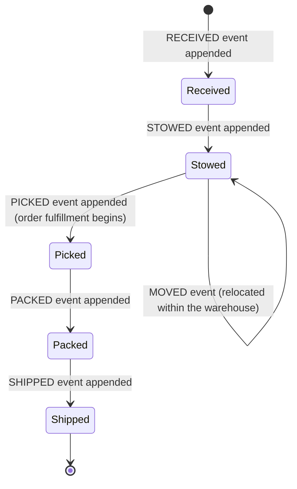

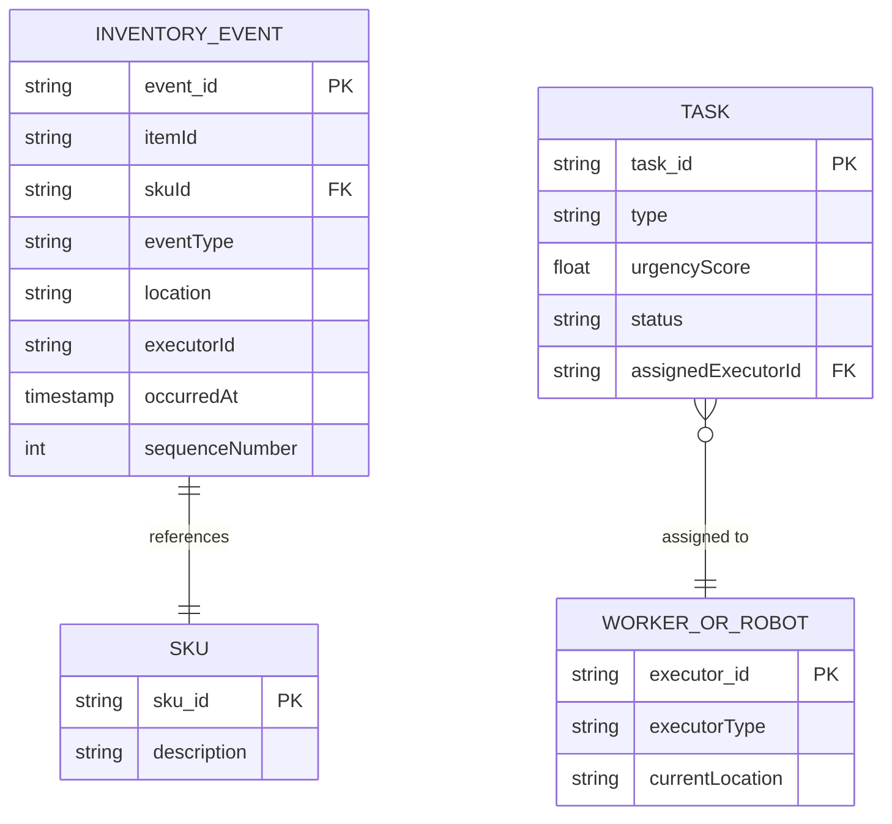

| Table | Storage choice & why |
|---|---|
| `InventoryEvent` | Append-only, `sequenceNumber` strictly increasing — the source of truth every derived view and reconciliation process reads from |
| Materialized count view (not shown as a separate table above, but a real component) | Incrementally updated from `InventoryEvent`, optimized for the high read volume established in the capacity estimate |
| `Task` / `WorkerOrRobot` | Relatively low-volume, relational — the assignment engine's working state |

---

## Failure modes & mitigations

| Failure mode | Impact | Mitigation |
|---|---|---|
| **A scan is missed entirely** (item moved, no event recorded) | Derived count silently overstates actual physical stock | Periodic reconciliation (cycle counts) catches this eventually; some warehouses add redundant sensing (e.g. weight sensors alongside barcode scans) to reduce the miss rate itself |
| **A high-urgency task is assigned to a distant executor while a nearer, slightly-less-urgent one goes unassigned** | Some inefficiency in aggregate travel time | An accepted, deliberate trade-off of the joint-scoring model — the alternative (pure proximity) risks starving genuinely urgent work, a worse outcome |
| **The event log itself has an outage or delay** | New movements can't be recorded, or recording lags | The physical work itself should not be blocked on event-log write acknowledgment where avoidable (e.g. locally buffer and forward), though this creates a temporary gap between physical reality and system-recorded state that must be visible/monitored, not silently assumed away |
| **A robot and a human are both idle near the same high-urgency task** | Needs a deterministic tie-break | Define an explicit tie-break rule (e.g. task-type eligibility preference, or simple executor-ID ordering) rather than leaving it to whichever request happens to be processed first, which could be non-deterministic under load |

---

## Non-functional walkthrough

**Scaling the event log and materialized view is a standard append-heavy/incrementally-derived
system, well within this system's actual (small, per the capacity estimate) throughput needs** —
the design challenge here is correctness and read-optimization, not raw scale.

**Availability of the task-assignment path directly affects physical throughput** — an
unavailable assignment service means idle workers/robots standing still, a direct, visible
operational cost.

**Consistency of the derived inventory count should be treated as eventually consistent relative
to the event log** (a brief propagation lag from event to materialized-view update is acceptable),
**while the event log itself must be strictly durable and ordered** — two different consistency
bars for two different layers of the same system.

---

## Security & compliance

- **Worker location tracking** (needed for proximity-based assignment) is employee data with real
  privacy and, in some jurisdictions, labor-law implications — worth naming that this isn't purely
  a technical tracking feature, it has HR/legal dimensions.
- **Inventory event history is a real audit trail** for loss-prevention and dispute resolution
  (e.g. investigating shrinkage or damage claims) — the same immutability that makes
  reconciliation possible also makes this data valuable for internal investigations, and it should
  be retained and access-controlled accordingly.
- **Robot safety around human workers** is a genuine physical-safety concern distinct from this
  chapter's software design, worth acknowledging briefly if the interviewer probes the
  mixed-fleet angle, even though the detailed engineering (sensors, emergency stops) is outside a
  software system design interview's usual scope.

---

## Cost & trade-offs

**Joint proximity×urgency scoring trades some aggregate travel-time efficiency for preventing
urgency starvation** — an explicit, worthwhile trade given that a starved high-urgency order (a
missed shipping deadline) usually costs more than a few extra minutes of aggregate worker travel.

**Event-sourcing trades storage/write overhead (every movement, forever, rather than a compact
current-count field) for auditability and reconciliation capability** — per the capacity
estimate, the storage cost is trivially small, making this an easy trade at real fulfillment-center
scale.

---

## Wrap-up: MVP vs. stretch

**In scope for an MVP:**
- Joint proximity×urgency task assignment, with urgency computed from order deadlines.
- Event-sourced inventory: append-only log plus an incrementally-updated materialized count view.
- A basic reconciliation process comparing periodic physical counts against derived counts.

**Explicitly out of scope for an MVP:**
- Executor-type eligibility scoring (human vs. robot preferences per task type) — start with a
  single executor pool competing uniformly, add eligibility constraints once specific task types
  demonstrably need them.
- Automated root-cause classification for reconciliation discrepancies — start with manual
  investigation supported by event-log replay, automate common-cause detection once enough
  discrepancy history exists to train on.

**Stretch goals, worth naming if asked "what's next":**
1. **Executor-type eligibility scoring**, folding human/robot suitability into the joint
   assignment function for restricted task types.
2. **Automated discrepancy root-cause suggestions**, using historical reconciliation outcomes to
   suggest likely causes (missed scan vs. genuine shrinkage) for new discrepancies.
3. **Predictive task pre-positioning**, anticipating where urgent tasks are likely to cluster
   (e.g. near a shipping deadline cutoff) and proactively repositioning idle workers/robots ahead
   of demand, similar in spirit to the surge-pricing chapter's predictive extension.

---

## Golden rules

- **Task assignment must jointly score proximity and urgency, never proximity alone** — pure
  nearest-match starves high-priority work indefinitely under continuous low-priority, nearby
  task volume.
- **Urgency is a continuously recomputed value from the underlying deadline**, not a static tag
  set once at task creation.
- **Inventory correctness comes from event-sourcing, never direct mutation of a count field** —
  the physical world's observation process doesn't have database-transaction atomicity.
- **Reconciliation is a recurring, expected process** — physical-vs-derived discrepancies are a
  known operational reality, not a sign of a broken system.
- **Corrections are new events, never rewrites of history** — this is what preserves the
  auditability the whole event-sourced model depends on.

---

## Master cheat sheet

**One-liners:**
- Assignment scores proximity AND urgency jointly — pure nearest-match starves high-priority work,
  and urgency should be recomputed from the deadline at assignment time, not read from a stale tag.
- Inventory correctness comes from an append-only, immutable event log with a derived
  materialized view — never a directly-mutated current-count field, because physical observation
  lacks database-transaction atomicity.
- Reads (current-count queries) vastly outnumber writes (movement events) — maintain an
  incrementally-updated materialized view, don't replay the full log per query.
- Physical-vs-derived count discrepancies are expected and recurring — reconciliation replays
  history to investigate, and any fix is a new appended event, never a rewrite.
- Executor-type (human vs. robot) eligibility is a real scoring dimension for restricted task
  types, not just a post-hoc filter.

**Formula chain:**
```
joint_score(task, executor)  = f(proximity(task, executor), urgency(task))
urgency(task)                  = g(time_until_deadline)   [recomputed continuously, not static]
```

**Numbers:** event-log write volume and materialized-view read volume are both trivially small in
absolute terms even at large-fulfillment-center scale — the hard problems are assignment quality
and inventory correctness, not raw throughput · reads (current-count queries) commonly outnumber
writes (movement events) by an order of magnitude, justifying a materialized-view read path over
log-replay-per-query.
