# Design a Coupon/Promo Code Redemption System — The Story (narrative edition)

> **What this file is.** The reference file, `76-Design-a-Coupon-Promo-Code-Redemption-System-FAANG-Guide.md`, is the one to recite from — requirements, API shapes, every trade-off table, the master cheat sheet. This file is a second way in: the same material as one continuous story, told in plain language. Engineers at a company keep hitting a wall, patch it, and the patch itself creates the next wall — until we land on the exact same design the reference file documents. The company, **Driftmart** (a fictional online marketplace), is made up. But every wall it hits is something a real, documented system has actually hit: Sony's 2011 PlayStation Network "Welcome Back" $10 credit codes going viral on deal-sharing forums far beyond their intended reach, Groupon's early daily-deal oversells from a lack of atomic redemption limits, Ticketmaster's widely reported 2022 Eras Tour presale meltdown under burst contention on a capped resource, and the well-documented security-research pattern of brute-forcing short, predictable gift-card and coupon codes. I'll say clearly, every time, whether a number is a documented fact or a reasonable stand-in — and tag the stand-ins `[illustrative]`.

**The trigger phrases** for this whole topic: *"design a coupon or promo-code system,"* *"how do we stop this discount code from being used more than it should,"* or *"what happens if two coupons get applied to the same order."* Keep one sentence in your head as you read: **a redemption isn't one check — it's a whole stack of independent rules (is it expired, has this customer already used it, does the order qualify, do other codes on this order conflict with it) that all have to pass *before* the same exactly-once, atomic-reservation problem a flash sale has even gets attempted.** Everything below is just this one idea, getting harder in small, honest steps.

---

## Chapter 1 — The $10 code that let 4,187 people through a 1,000-ticket door

Driftmart launches a promo: `WELCOME10`, $10 off any first order, capped at **1,000 redemptions total**. It's meant for people who click through from a specific email campaign. Someone posts the code to a popular deal-sharing forum instead. Within an hour, checkout traffic on that one code spikes to levels nobody planned for `[illustrative]`.

Here's the code Driftmart actually shipped, in plain terms: when a customer applies `WELCOME10`, the service (1) reads the current redemption count, (2) checks "is it below 1,000?", and (3) if yes, writes back `count + 1`. Three separate steps. Under normal traffic those three steps finish so fast nobody notices they're separate. Under a viral spike, they don't. Real number: by the time someone notices and pulls the code, the redemption count reads **4,187** — more than four times the intended cap `[illustrative]`.

This exact shape of bug — a viral promo code redeemed far beyond its intended limit because the "check" and the "increment" weren't one atomic step — is a real, recurring failure category. Sony's 2011 PSN "Welcome Back" $10 credit codes leaked onto deal forums and were used well beyond their intended one-per-account scope, forcing Sony to restrict them after the fact. Groupon's early daily deals had similar oversell problems when a deal's redemption cap wasn't enforced atomically against concurrent claims. Driftmart's exact numbers are invented, but the bug shape is not.

The obvious question: *why does "read the count, then write it back" ever go wrong?* Because between step (1) and step (3), **hundreds of other requests can run the exact same read**. If 500 requests all read "999 used, 1 slot left" before any of them finishes writing, all 500 think they got the last slot, and all 500 write `1000`. The cap was never actually enforced — it was just *read*, over and over, by people who never waited to see what anyone else was doing.

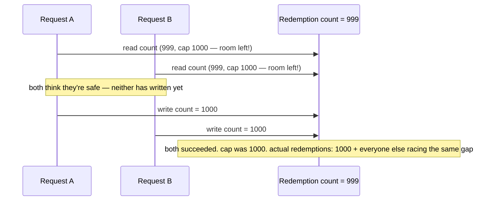

**The fix, and the analogy for the rest of this story:** treat redemption like a **fair's ticket booth** with one roll of exactly 1,000 numbered tickets. The clerk doesn't glance at the roll, then separately tear a ticket — checking "is there one left" and tearing it off is **one single motion**. If the roll is empty, your hand comes back empty, full stop. That single motion is a **compare-and-set (CAS)**: "give me a ticket only if the count is still under 1,000, and do the check-and-take as one atomic operation, not two." This is the identical mechanism a flash sale uses to stop overselling a fixed stock count — same discipline, just applied to redemption slots instead of physical inventory.

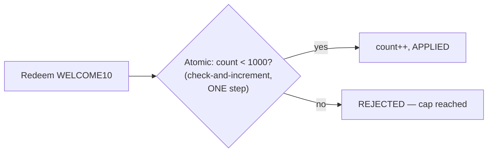

**New problem, immediately visible once the atomic fix ships:** the global 1,000-ticket cap now holds exactly at 1,000, no more. But `WELCOME10` was also supposed to be **one per customer** — and nothing in this fix checks that at all. The global roll being correctly guarded says nothing about who's allowed to walk up to it, or how many times.

**How I'd say this in an interview:** "The naive version checks a count and then writes it back as two separate steps, and under real concurrent load that gap lets far more redemptions through than the cap allows — this is exactly the flash-sale over-selling bug, just on a redemption counter instead of inventory. The fix is the same one: make the check-and-increment a single atomic compare-and-set operation."

---

## Chapter 2 — The customer with thirty-seven tickets from a one-per-person roll

Driftmart's fraud team pulls redemption logs a week later and finds one customer account applied `WELCOME10` — a code explicitly meant to be **one per customer** — to **37 different orders**, each one legitimately getting the $10 off, no bug in the atomic global counter at all. Real number: **$370** in discounts a single account was never supposed to get `[illustrative]`.

The obvious question: *how did the global-cap fix let this through?* Because the global cap and "one per customer" are **two completely different rules**, and Driftmart only built the first one. The ticket booth correctly refused to hand out a 1,001st ticket to *anyone* — but it never once asked "wait, didn't I already give you one?"

**The fix:** add a second, independent check — a **per-customer redemption ledger**, keyed by `(customerId, codeId)`. Extending the ticket-booth analogy: every ticket handed out gets **stamped with the customer's name**, and the booth keeps a small ledger of names it's already served for this code. Before tearing off a ticket, the clerk now checks two things: is there a ticket left on the roll, *and* is this name already in the ledger?

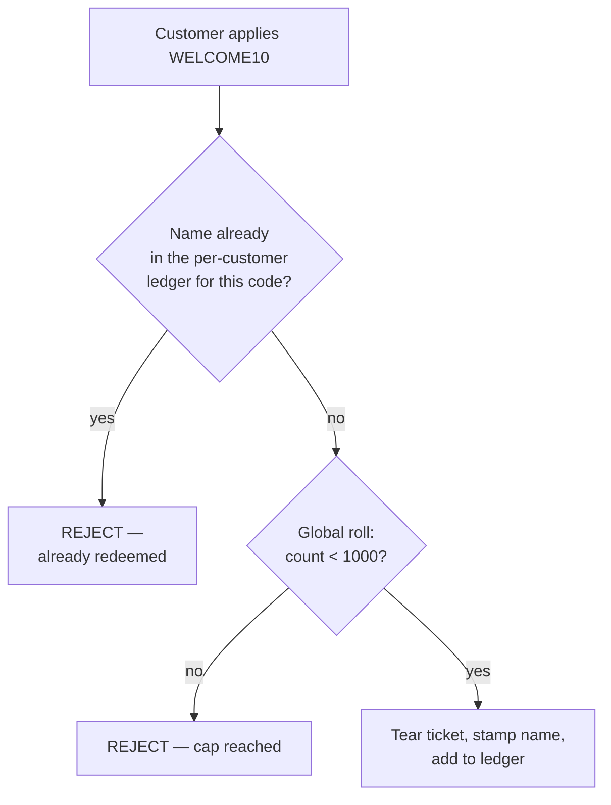

**New problem, found within days:** the per-customer ledger check is written the exact same naive way the global counter was in Chapter 1 — **read the ledger, then separately write to it**. A customer with two browser tabs open (or a script firing a few parallel requests) submits the same code on two different orders within milliseconds of each other. Both requests check the ledger before either one has finished writing to it. Both see "not in the ledger yet." Both succeed. The fix from Chapter 1 solved the *global* race; it did nothing for this *personal* one, because it's a different piece of shared state.

**How I'd say this in an interview:** "A global cap and a per-customer limit are two independent rules, and fixing the race on one doesn't fix the race on the other — they're different pieces of state. The per-customer ledger is the right next check, but I'd flag immediately that it needs the same atomicity treatment the global counter just got, or it'll fail the exact same way."

---

## Chapter 3 — The double-tab trick that beats your own name check

Concretely: a customer opens Driftmart in two tabs, applies `WELCOME10` to two different carts about **80 milliseconds apart** `[illustrative]`. Both requests hit the per-customer ledger check at nearly the same instant, both read "no entry for this customer + this code," and both proceed to redeem. Now the same person has used a "one per customer" code twice — no scripting, no malice even required, just an ordinary double-click or two open tabs.

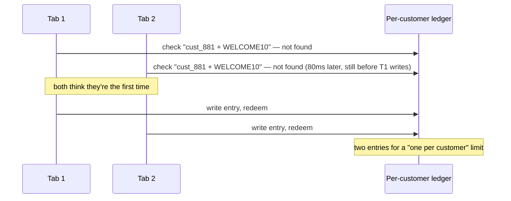

The obvious question: *didn't we just fix this exact bug in Chapter 1?* Yes — the *mechanism* is identical, "read then write instead of check-and-set in one step." What's new is *where* it happens: this time it's scoped to one customer, not the whole code.

**The fix:** the per-customer ledger check needs its **own atomic compare-and-set**, exactly like the global counter — "insert this (customer, code) pair into the ledger only if it doesn't already exist, as one atomic operation." Same ticket-booth idea, but now picture it as **millions of tiny, personal ticket rolls**, one roll per customer per code, each with exactly one ticket on it. Tearing your own personal ticket is still a single check-and-tear motion — it's just that your roll has nothing to do with anyone else's.

That distinction matters for a reason beyond correctness: it changes how much these two checks actually fight each other under load.

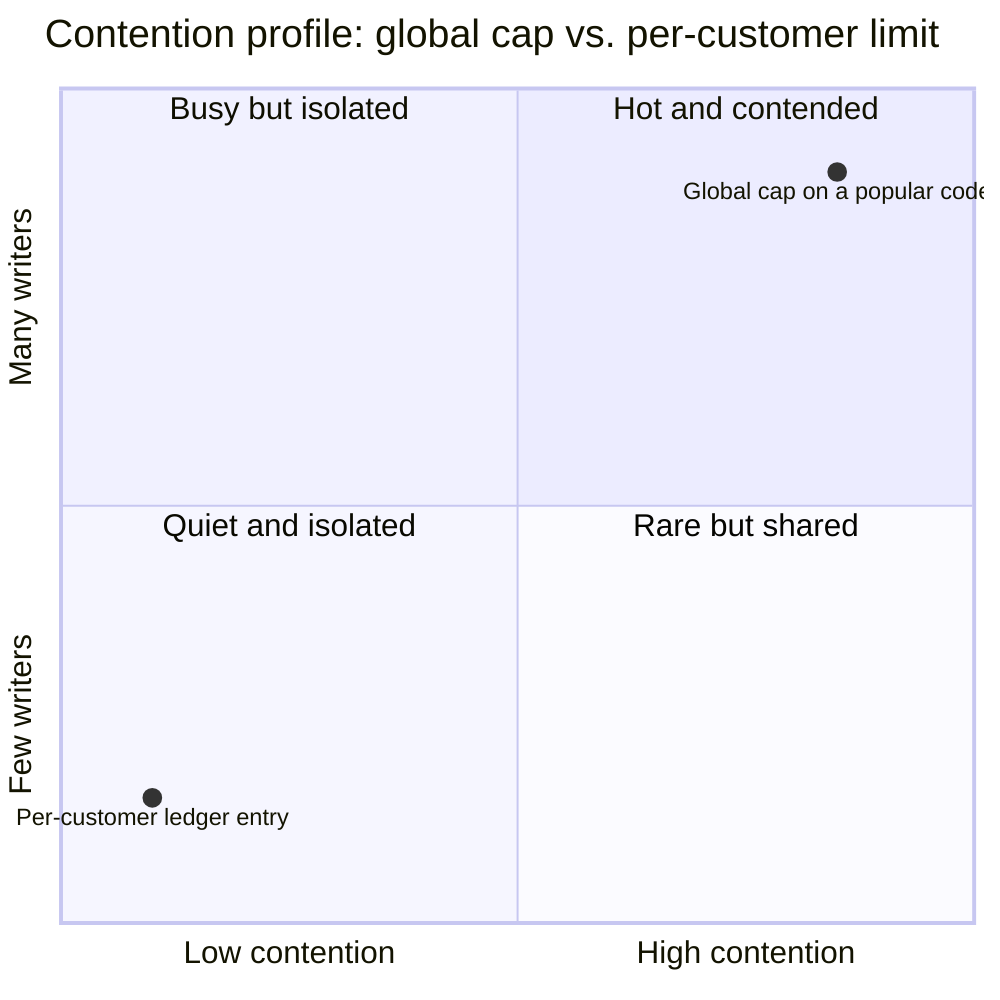

The global roll for `WELCOME10` is **one shared, hot piece of state** — every one of the thousands of people trying to redeem it is fighting over the same roll. The per-customer ledger, keyed by `(customerId, codeId)`, has **zero contention across customers** — your ticket-tear never competes with anyone else's, because you're each reaching for your own personal roll. Same CAS mechanism, wildly different contention profile, and worth naming explicitly as two separate problems rather than one.

**New problem:** both atomics are now airtight — nobody can over-redeem the global cap, and nobody can double-dip their personal limit. But a support audit turns up something odd: some of the redemptions that *did* legitimately consume a global slot were on **expired codes** and **orders below the minimum spend** the promo required. The atomic mechanism was never broken — it was just never told those requests should have been rejected before they even got that far.

**How I'd say this in an interview:** "The per-customer check needs its own atomic compare-and-set, separate from the global one — same mechanism, different scope, and I'd point out they have very different contention profiles: the global cap is one hot, shared counter, the per-customer ledger is naturally sharded with basically no cross-customer contention at all."

---

## Chapter 4 — Burning real tickets on people who were never getting in

Driftmart digs into the `WELCOME10` numbers and finds something worse than either race condition: of the 1,000 legitimately-consumed global slots, **142 of them** went to requests that should never have been allowed to try at all `[illustrative]` — codes applied after the expiration date (a stale mobile-app screen let people submit an already-dead code), and orders below the campaign's $25 minimum spend. Both of those atomic checks did exactly what they were built to do; they just ran on requests that were never eligible in the first place.

The real damage: because those 142 slots got consumed by people who shouldn't have qualified, **142 genuinely eligible customers** got a `REDEMPTION_CAP_REACHED` rejection instead of their discount — a fixed, scarce resource was quietly wasted on requests that were doomed to fail some *other* check anyway.

The obvious question: *why does an expired code even get as far as the atomic ticket-booth step?* Because Driftmart built the two atomic checks (global cap, per-customer limit) first, and never built a gate in front of them for the other rules a code has: is it still active, does the order actually qualify, does it apply to what's in the cart.

**The fix:** put a **bouncer at the door**, before anyone is even allowed to walk up to the ticket booth. The bouncer checks a whole checklist — is the code still valid (not expired)? Does the order meet the minimum spend? Do the items in the cart match any product or category restriction the code has? Only once every single one of those passes does the customer get waved through to the booth, where the two atomic checks from Chapters 1–3 run. This checklist is the **constraint stack**, and it has to run to completion *before* the atomic step, not interleaved with it — spending the expensive, contended atomic operation on a request that a cheap check would've rejected anyway is pure waste.

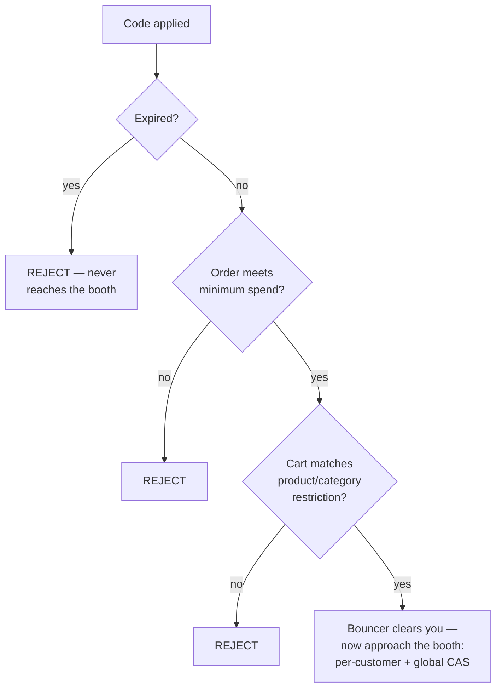

**New problem:** the bouncer now correctly turns away everyone who was never going to qualify. But every single rejection — expired, too small an order, wrong products, already used, cap reached — comes back to the customer as the exact same message: `"Invalid code."` Support has no way to tell a customer what actually went wrong, and neither does the customer.

**How I'd say this in an interview:** "Every check needs to run to completion *before* the atomic redemption step — otherwise you're spending a contended, limited resource on requests that a cheap check would've rejected anyway. That's the same 'cheap checks before expensive ones' ordering you'd use in any pipeline, just applied here to a coupon's validity rules in front of its atomic redemption slot."

---

## Chapter 5 — "Invalid code" tells the customer nothing

Real number: in the week after the bouncer checklist ships, support tickets tagged "coupon not working" go from about **40 a day to 130 a day** `[illustrative]` — not because more codes are actually failing, but because customers who get a generic `"Invalid code"` message have no idea whether to add more items to their cart, wait, try a different code, or give up. Every one of those becomes a support conversation instead of a self-service moment.

The obvious question: *why is one generic rejection worse than five specific ones?* Because each of those five failures has a genuinely different, actionable meaning: "add $8 more to your cart" is a completely different instruction from "you've already used this code" or "this code doesn't apply to what's in your cart." Collapsing all of them into one message throws that information away right when the customer needs it most.

**The fix:** give every rejection its own specific, named reason — `EXPIRED`, `MIN_ORDER_VALUE_NOT_MET`, `PRODUCT_RESTRICTION`, `PER_CUSTOMER_LIMIT_REACHED`, `REDEMPTION_CAP_REACHED` — and surface it to the customer and to support. Back to the bouncer: instead of just turning people away, the bouncer tells you *which* line on the checklist you failed. "Invalid code" becomes "your ID says you're not on tonight's list" versus "the dress code isn't met" — different problems, different fixes.

```json
{ "status": "REJECTED", "reason": "MIN_ORDER_VALUE_NOT_MET", "detail": "Add $8.00 more to qualify" }
```

**New problem:** rejection reasons are specific now, and support volume drops back down. But marketing comes back with a new request that the whole system, as built, has no answer for: *"can a customer stack `WELCOME10` with `FREESHIP5`, our free-shipping code, on the same order?"* Nothing about the constraint stack or the atomic redemption steps says anything about what happens when **two codes** are applied to one order at once.

**How I'd say this in an interview:** "A generic 'invalid' response throws away information the customer actually needs to act on — each constraint failure has a different, specific remediation, so each one gets its own reason code. It's a small change with an outsized effect on support load."

---

## Chapter 6 — Two vouchers, two different totals, same order

Driftmart allows stacking without thinking too hard about it, and two problems show up in the same week.

**Problem one — order matters, and nobody defined it.** A customer applies `SAVE20` (20% off) and `TENOFF` ($10 off) to a **$100** order. If `SAVE20` applies first: $100 → $80, then $10 off → **$70**. If `TENOFF` applies first: $100 → $90, then 20% off → **$72**. Same two codes, same order, same customer — a **$2 difference** purely because of which line of code happened to run first, which in Driftmart's actual implementation depended on nothing more meaningful than array order in the request body.

**Problem two — nobody checked if the codes were even allowed to combine.** `WELCOME50` (50% off, explicitly meant to be a standalone, exclusive offer) and `REFERRAL15` ($15 off, also meant to be exclusive) both get applied to the same **$60** order because nothing stops them. Result: the order — meant to get *either* 50% off *or* $15 off, never both — ends up paying roughly **$22.50**, deeper than either offer was ever supposed to go alone `[illustrative — exact arithmetic depends on application order, which is precisely the bug]`.

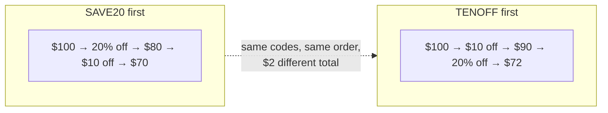

The obvious question: *is the fix to just ban stacking entirely?* No — marketing has a real reason to want it (a welcome code plus a referral code is a legitimate, intentional combo). The fix is two separate, explicit rules, checked in order:

**The fix:** back at the bouncer's checklist, add one more line, and back at the booth, add one more step. First, a **compatibility check** — before any redemption is attempted, ask: does any code in this combination declare itself non-stackable? If yes, and more than one code is being applied, reject the whole combination outright (`NOT_STACKABLE`) before touching the ticket booth at all. Second, for combinations that *do* pass, a **fixed, documented application order** — Driftmart picks "fixed-amount discounts apply before percentage discounts," so the same set of codes always produces the same total, no matter what order they were submitted in.

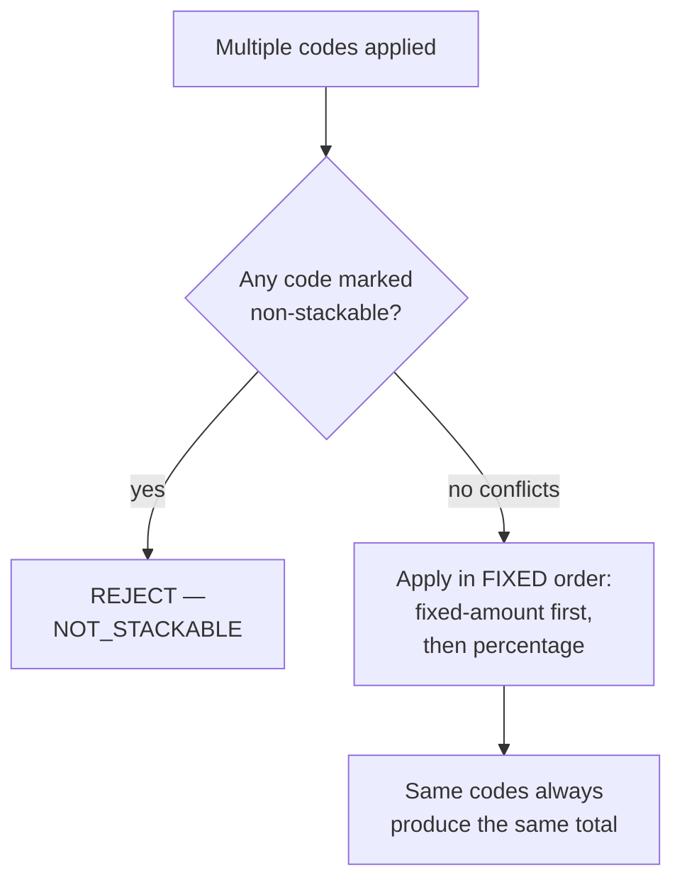

**New problem:** stacking is now deterministic and safe. But zooming out, Driftmart's leadership asks the question that's been sitting in the background the whole time: *"during our next big marketing push, can this whole thing — bouncer checklist, stacking rules, both atomic steps — actually hold up under real burst traffic?"*

**How I'd say this in an interview:** "Stacking is really two separate questions — can these codes combine at all, and if so, in what order do they apply — and both need an explicit, documented rule. Order isn't cosmetic here: percentage-then-fixed and fixed-then-percentage produce genuinely different totals on the same order."

---

## Chapter 7 — The ticket roll everyone's grabbing at once

Driftmart runs the numbers ahead of a big promotional email blast `[illustrative, modeled on a large e-commerce peak]`: **20,000 checkout attempts per second** at the campaign's peak, spread across roughly **5,000 active codes**. But attention isn't evenly spread — the **top 10 most-shared codes** (the ones featured in the email itself) pull in about **40% of all attempts**, which works out to **8,000/sec on just those 10 codes**. Zoom into just one of them, the flagship code: it alone sees roughly **800 redemption attempts per second** slamming the same global ticket roll.

The obvious question: *does the constraint-stack checklist become the bottleneck at this volume?* No — each check (expired? minimum spend? product match? already redeemed?) is a cheap comparison or a fast lookup. Even at 20,000/sec with roughly 5 checks each, that's about 100,000 checks/sec total — a modest number for a validation layer, and nowhere near the real pressure point.

The real pressure point is exactly where you'd expect from Chapter 1: **800 requests per second all reaching for the same shared ticket roll for the flagship code.** This is the same shape of problem Ticketmaster's widely reported 2022 Eras Tour presale ran into — a fixed, capped resource getting hit by far more concurrent demand than it was sized for. The mechanism Driftmart needs here is nothing new: it's the exact atomic compare-and-set from Chapter 1, just now under real concurrent pressure instead of a hypothetical one.

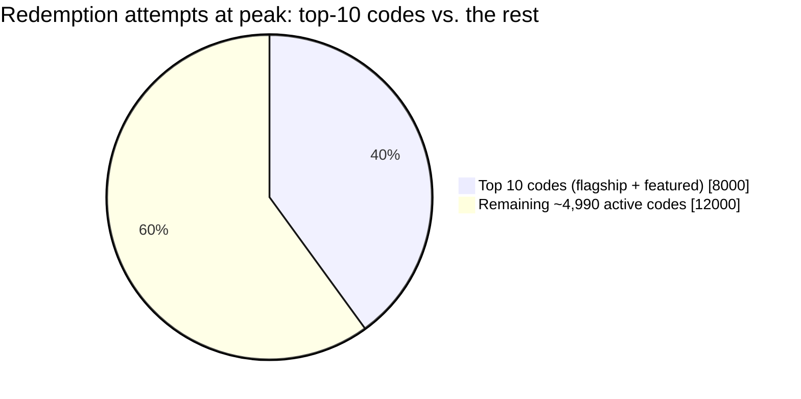

**The fix — or rather, the confirmation that Chapters 1 and 3 already are the fix:** the flagship code's global ticket roll uses the same atomic CAS from Chapter 1; every customer's personal ledger check uses the same atomic CAS from Chapter 3, naturally sharded with zero cross-customer contention. Nothing new gets invented here — the win is recognizing this is the identical shape of problem a flash sale solves, and not re-deriving the reasoning from scratch under pressure. One real difference worth naming: coupon caps are usually a **business choice** ("we're willing to give away 1,000 of these"), not genuine physical scarcity like flash-sale inventory — so contention, while real, tends to be less extreme than a flash sale's 100:1+ oversubscription.

**New problem:** the atomic mechanics hold under this load — the flagship code redeems exactly 1,000 times, no more, and nobody double-dips. But a completely different kind of abuse shows up a month later, and it has nothing to do with race conditions at all.

**How I'd say this in an interview:** "This is the exact same atomic-CAS mechanism as a flash sale — I'd name that reuse explicitly rather than re-deriving it. The constraint stack in front of it is cheap and isn't the bottleneck; the real contention is on the atomic step for whichever handful of codes are getting the most traffic, and coupon caps are usually less extreme than flash-sale scarcity because they're a business choice, not a physical limit."

---

## Chapter 8 — The ticket numbers a bot could just guess

Driftmart generated a batch of 1,000 personalized influencer codes as sequential, predictable strings: `DRIFT1000`, `DRIFT1001`, `DRIFT1002`, ... up through `DRIFT1999`. Only a fraction of those had actually been sent out to influencers yet — the rest were reserved for a rolling release. A bot, run by someone who'd noticed the pattern on one leaked code, simply **iterates the whole numeric range** and submits every candidate string to the redemption endpoint. Real number: the bot successfully redeems **340 of the 1,000 slots** before anyone at Driftmart notices — codes that were never actually distributed to a single real influencer `[illustrative]`.

This is a well-documented class of vulnerability, not a one-off mistake: security researchers and bug-bounty reports repeatedly find gift-card and coupon systems where short or sequential codes can simply be enumerated, because the code space is too small and nothing rate-limits the guessing. Driftmart's specific numbers here are invented, but "predictable codes get brute-forced" is a real, recurring finding, not a hypothetical.

The obvious question: *wasn't the per-customer ledger and global cap supposed to catch this?* No — those checks answer "has this valid code already been used too many times." They say nothing about "was this code ever a real code someone should have been able to get in the first place." A guessed code that happens to match a real, unredeemed one sails straight through both atomic checks looking completely legitimate.

**The fix, two layers:** first, stop using sequential ticket numbers — generate codes as **high-entropy, effectively random strings** (something like a random 10–12 character alphanumeric code) so the space is too large to enumerate by brute force in any reasonable time. Second, add **rate-limiting and anomaly detection** on the redemption endpoint itself — dozens of near-miss, sequential-looking redemption attempts from one source in a short window is a signal worth flagging on its own, independent of whether any individual attempt happens to succeed. This is the same fraud-detection layering pattern used elsewhere: the core correctness mechanics (constraint stack, atomic redemption) stay as-is; abuse detection sits on top, watching *patterns* of attempts rather than individual ones.

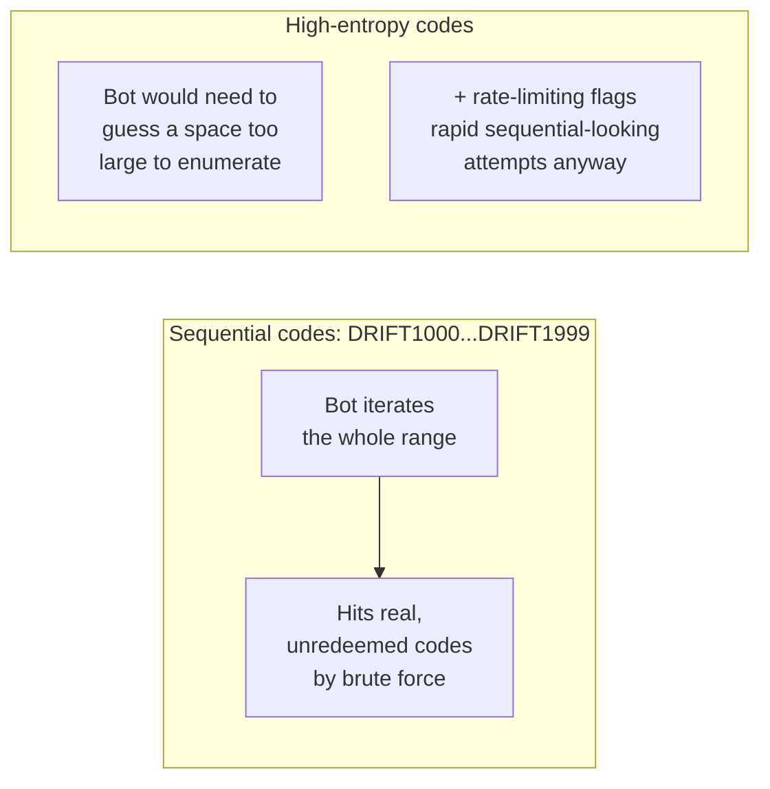

**New problem, really a trade-off rather than a break:** high-entropy random codes stop the guessing, but they're also hard for a human to remember or type — nobody's sharing `Q7xK2mPz9L` in a marketing email the way they share `WELCOME10`. Driftmart ends up **not** picking one code style for everything: short, memorable, semantic codes (`SAVE20`, `WELCOME10`) stay in use for public, widely-shared campaigns, protected by a modest global cap and the atomic redemption layer from earlier chapters — the whole point of those codes is to be shared. Random, unguessable codes are reserved for **personalized, high-value, single-use** codes (like the influencer batch), where each individual code being unguessable actually matters. It's a deliberate split based on what each code type is *for*, not a single universal rule.

**How I'd say this in an interview:** "Predictable, sequential codes are a well-documented brute-force target — the atomic redemption checks don't help at all, because a guessed code that matches a real one looks completely legitimate to them. The fix is high-entropy codes plus rate-limiting on the redemption endpoint itself, but I'd keep semantic, memorable codes for public campaigns where being guessable barely matters because the intended audience already has the code — it's really two different code types for two different jobs."

---

## Chapter 9 — The ledger nobody kept

Three months in, a customer disputes a charge: *"I used a promo code and it was rejected — I want to know why, because I was charged full price."* Support pulls up the order and finds... nothing. Driftmart never logged rejected attempts, only successful redemptions, so there's no record of what the constraint stack actually said at the moment this customer tried. Separately, finance is trying to reconcile how much revenue the last quarter's promotions actually cost, and the only data available is the final redemption counts — no record of *which* customer, *which* order, *which* reason, at *what* time.

The obvious question: *isn't "it either redeemed or it didn't" enough?* No — both disputes and financial reconciliation need the *specific* reason and the *specific* moment, not just the final count. A rejected attempt is just as much a real event as a successful one; throwing it away loses exactly the information both support and finance need later.

**The fix:** log every attempt — successful or rejected, and *why* — as its own auditable record: which code, which customer, which order, which specific outcome (`APPLIED`, `EXPIRED`, `PER_CUSTOMER_LIMIT_REACHED`, `REDEMPTION_CAP_REACHED`, `NOT_STACKABLE`), and when. This isn't a new mechanism — it's the same specific-reason data from Chapter 5, just persisted instead of only shown once in an API response.

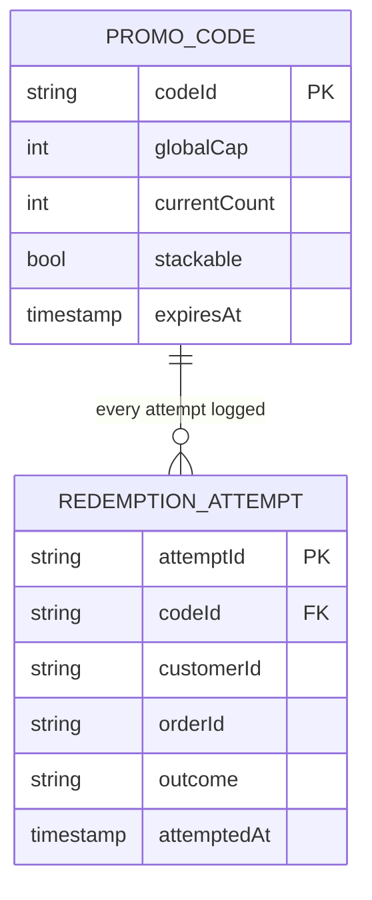

**Closing the loop:** with this in place, the disputed customer's exact rejection reason and timestamp are one lookup away, and finance can reconcile discount-driven revenue impact down to the individual redemption. Nothing about the constraint stack or the atomic redemption mechanics changes — this is purely about making every decision the system already made *visible* after the fact.

**How I'd say this in an interview:** "Every attempt — not just successful redemptions — needs its own auditable record with a specific outcome, because disputes and financial reconciliation both need the *why* and the *when*, not just a final count. It's a small addition on top of everything already built, but skipping it turns every future dispute into a guessing game."

---

## Where the story actually lands

```mermaid
flowchart LR
    A["Ch1: check-then-increment\n(4,187 redemptions on a 1,000 cap)"] -->|"fixes: global over-redemption\nbreaks: no per-customer limit at all"| B["Ch2: per-customer ledger"]
    B -->|"fixes: one-per-customer rule exists\nbreaks: ledger check itself races"| C["Ch3: atomic per-customer CAS"]
    C -->|"fixes: both atomics solid\nbreaks: invalid codes still burn real slots"| D["Ch4: constraint stack / bouncer"]
    D -->|"fixes: ineligible requests filtered first\nbreaks: one generic 'invalid' message"| E["Ch5: specific rejection reasons"]
    E -->|"fixes: actionable errors\nbreaks: stacking has no rules at all"| F["Ch6: compatibility + fixed order"]
    F -->|"fixes: deterministic totals\nbreaks: does this hold at real burst scale?"| G["Ch7: confirm CAS reuse at scale"]
    G -->|"fixes: burst-scale correctness\nbreaks: predictable codes get brute-forced"| H["Ch8: high-entropy codes + rate limits"]
    H -->|"fixes: guessing stopped\nbreaks: no record of why anything happened"| I["Ch9: audit trail"]
```

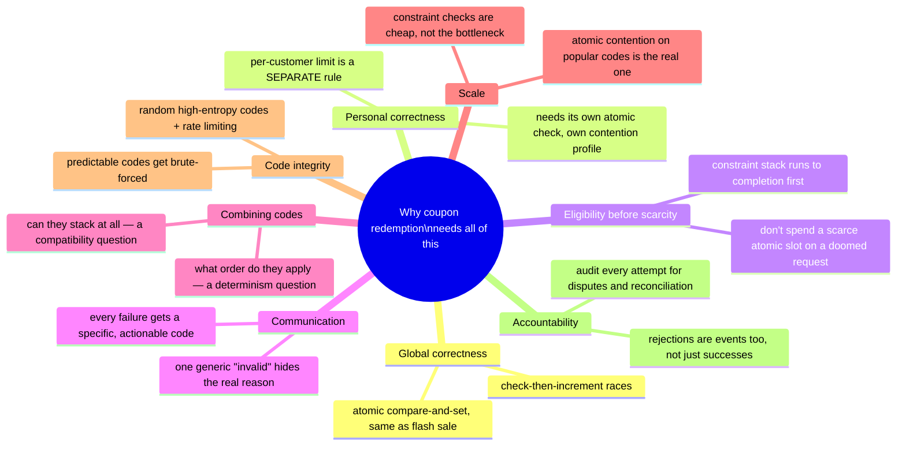

Every real coupon system you'll design in an interview sits somewhere on this chain. The skill isn't reciting all nine chapters — it's matching the depth to what's actually being asked. A single-code, no-stacking MVP might reasonably stop after Chapter 4 or 5. A platform that supports stacking and has seen real abuse needs to go all the way to Chapter 8 or 9. If nobody's mentioned stacking, walking all the way through Chapter 6 unprompted reads as padding, not depth.

---

## Grill me — adversarial follow-ups

**Q1: "Why not just make the global cap really generous — say, 10x the intended number — so the race condition from Chapter 1 barely matters?"**
That masks the symptom instead of fixing the cause — it doesn't stop over-redemption, it just raises the number where it becomes visible, and you'd still lose the exact-cap guarantee the business actually asked for. The atomic compare-and-set costs almost nothing extra and gives you correctness at *any* cap size, generous or tight, so there's no real reason to trade correctness for a bigger buffer.

**Q2: "Couldn't you just do the per-customer check and the global check as one combined atomic operation instead of two separate ones?"**
You could, and for a single code with both limits it can simplify the logic, but it couples two things with very different contention profiles into one — the global counter is hot and shared, the per-customer ledger entry is cold and isolated. Combining them means every per-customer check now also contends on the hot global counter's lock, which drags the fast, sharded case down to the slow, contended one for no real benefit.

**Q3: "Walk me through what happens if the constraint stack passes but the atomic redemption step then fails."**
The customer gets `REDEMPTION_CAP_REACHED`, a distinct reason from any constraint-stack failure — nothing about the order changes, no discount gets applied, and no state gets left half-updated, because the constraint stack doesn't write anything; it only reads and decides. That separation is exactly why running the whole stack before attempting redemption matters: a constraint-stack failure is cheap and clean, an atomic-redemption failure is the one outcome that was genuinely contended on scarce state.

**Q4: "Why does the stacking-order rule matter if the discount difference is only a couple of dollars per order?"**
At one order, sure, it's a couple of dollars — at 20,000 orders a day using this exact combination, a $2 discrepancy is $40,000/day in inconsistent, undocumented discounting, and worse, it's *non-deterministic*, meaning the same customer could get a different total for the same cart depending purely on request timing. That's both a trust problem and an accounting nightmare when finance tries to explain the numbers later.

**Q5: "Isn't the bouncer/constraint-stack step just redundant work if 99% of applied codes are going to pass anyway?"**
No — the cost of running five cheap checks is trivial (a comparison or a fast lookup each), while the cost of an unnecessary atomic redemption attempt is spending contended, scarce capacity on a request you didn't need to. Even if most requests pass, you still want the cheap filter in front of the expensive, contended one — that ordering doesn't depend on the pass rate.

**Q6: "If coupon caps are usually a business choice and not real scarcity, why bother with atomic redemption at all — why not just let it overshoot a little?"**
Because "a little" isn't bounded — Chapter 1's 4,187-vs-1,000 example shows the overshoot scales with how much concurrent traffic hits the code, not with how big the cap is. A business can choose to allow overshoot on purpose by setting a generous cap, but that has to be an explicit decision with a known number, not an accident caused by a race condition nobody meant to have.

**Q7: "How would you handle a customer whose order gets refunded after they used a one-time code — do they get the redemption back?"**
That's a real product decision, not a technical default — I'd ask the interviewer or the product owner rather than assume. Whatever the answer, the audit trail from Chapter 9 is what makes it possible to implement correctly either way: you need the original redemption record to know what to reverse, and reversing it is itself a new logged event, not a silent edit to history.

**Q8: "Why put rate-limiting on the redemption endpoint instead of just making codes long enough that guessing is hopeless?"**
High-entropy codes make brute-forcing computationally impractical, but they don't stop someone from trying anyway, and a determined attacker with enough attempts and enough IPs can still probe at low volume for a long time. Rate-limiting and anomaly detection catch the *pattern* of guessing itself — many rapid, sequential-looking failures from one source — as a second, independent layer, the same way you wouldn't rely on password length alone without also rate-limiting login attempts.

**Q9: "If someone just says 'design a coupon system' cold, where do you actually start?"**
I'd separate it into two phases out loud immediately: evaluating the full constraint stack — validity, per-customer limits, minimum order value, stacking compatibility — and then, only once all of that passes, the same atomic, exactly-once redemption a flash sale needs. That framing tells the interviewer I see this as a constraint-evaluation problem with a familiar atomic-reservation problem bolted on the back, not just "another flash sale," which is usually the actual thing being tested.

---

## Cheat sheet — one line per stop on the story

- **Check-then-increment on a redemption count**: races under concurrent load and lets far more redemptions through than the cap allows — fix it with one atomic compare-and-set, the same discipline a flash sale uses.
- **Per-customer limit**: a completely separate rule from the global cap, with its own state — fixing the global race doesn't fix this one.
- **Per-customer check also needs its own atomic CAS**: same mechanism as the global cap, but naturally sharded by `(customerId, codeId)` — effectively zero cross-customer contention, unlike the hot, shared global counter.
- **Constraint stack (expiry, minimum spend, product restriction) runs to completion before the atomic step**: don't spend a scarce, contended redemption slot on a request that a cheap check would've rejected anyway.
- **Specific rejection reasons, not one generic "invalid code"**: each constraint failure has a different, actionable meaning for the customer and for support.
- **Stacking is two separate questions**: can these codes combine at all (a compatibility check), and if so, in what fixed, documented order do they apply (a determinism rule) — both need explicit answers, never left to submission-order accident.
- **Constraint-stack evaluation is cheap and not the bottleneck**; atomic-redemption contention on the most popular codes is the real scaling concern, though usually less extreme than flash-sale scarcity because coupon caps are a business choice, not physical limits.
- **Predictable, sequential codes can be brute-forced**: high-entropy random codes close the guessing hole; rate-limiting/anomaly detection catches the attempt pattern as a second layer — keep memorable codes only for public campaigns where guessability doesn't matter.
- **Audit every attempt, not just successes**: disputes and financial reconciliation both need the specific reason and timestamp behind every redemption and every rejection.
- **The meta-lesson**: each fix in this story buys one property — global correctness, personal correctness, wasted-capacity avoidance, clear communication, deterministic totals, confirmed scale, code integrity, or accountability — by adding one more explicit, separately-reasoned check, never by making one mechanism try to do two jobs at once.
