# Design a Coupon/Promo-Code Redemption System — FAANG Interview Guide

> Source chapter type: constraint-stacking + exactly-once redemption. Confirmed reported as an
> Amazon L4 question. Shares its exactly-once-redemption core with
> [the Flash Sale guide](./60-Design-a-Flash-Sale-System-FAANG-Guide.md)'s atomic reservation, but
> adds a genuinely new problem: a redemption isn't just "check a count and decrement it," it's
> **evaluating a stack of independent constraints** (discount type, per-customer usage limit,
> minimum order value, expiration, product/category restrictions, and how multiple simultaneously-
> applied coupons combine) before the atomic redemption even happens.

## Mental model

A customer applies a promo code at checkout. Unlike a flash sale (one constraint: is there stock
left), a coupon redemption has to evaluate **several independent constraints simultaneously** —
is the code still valid (not expired)? Has *this specific customer* already used it (a
per-customer limit, not just a global one)? Does the order meet the minimum value? Do the
order's items match the code's product/category restriction? And if the customer is stacking
*multiple* codes on one order, do the combination rules even allow that?

Only after all of those pass does the system face the same exactly-once problem the flash-sale
chapter solves — at Black-Friday-scale burst traffic, many customers can attempt to redeem a
limited-use code within the same second, and exactly one (or exactly N, if the code has a
redemption cap) must succeed.

**The one sentence to say out loud:** *"This is the flash-sale chapter's atomic-reservation
problem, with a real constraint-evaluation problem bolted on the front — validity, per-customer
limits, minimum order value, and product restrictions all have to pass before the atomic
redemption step even runs, and multi-code stacking rules add a second layer on top of that."*

**The one picture to remember forever:**

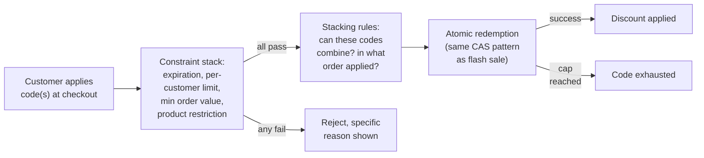

**Memory hook:** *"Evaluate the whole constraint stack — including how multiple codes combine —
before the atomic redemption step, which is the same compare-and-set discipline as a flash sale
once you get there."*

---

## Table of contents
[How to Identify This Topic](#how-to-identify-this-topic-in-an-interview) ·
[Interview Playbook](#interview-playbook) · [Requirements](#requirements-clarification) ·
[Capacity Estimation](#capacity-estimation-worked) · [API Design](#api-design) ·
[High-Level Architecture](#high-level-architecture) ·
[Architecture Evolution v1→v2→v3](#architecture-evolution-v1--v2--v3) ·
[End-to-End Walkthroughs](#end-to-end-request-walkthroughs) ·
[Deep Dive: The Constraint Stack](#deep-dive-the-constraint-stack) ·
[Deep Dive: Multi-Code Stacking Rules](#deep-dive-multi-code-stacking-rules) ·
[Deep Dive: Atomic Redemption at Burst Scale](#deep-dive-atomic-redemption-at-burst-scale) ·
[Deep Dive: Per-Customer vs. Global Limits](#deep-dive-per-customer-vs-global-limits) ·
[Data Model](#data-model) · [Failure Modes](#failure-modes--mitigations) ·
[Non-Functional Walkthrough](#non-functional-walkthrough) ·
[Security & Compliance](#security--compliance) · [Cost & Trade-offs](#cost--trade-offs) ·
[Wrap-Up](#wrap-up-mvp-vs-stretch) · [Golden Rules](#golden-rules) ·
[Cheat Sheet](#master-cheat-sheet)

---

## How to identify this topic in an interview

- "Design a coupon/discount/promo-code system" — confirmed as a reported Amazon L4 interview
  question, often framed with an object-oriented-design angle (model the discount-type hierarchy)
  layered on top of the distributed-systems concerns.
- The tell that this is a constraint-stacking chapter, not just "another flash sale": the
  interviewer describes **multiple simultaneous validity rules** (expiration, per-customer limit,
  minimum order value) rather than a single stock count — that's the signal the constraint stack
  is the actual new material, with atomic redemption as the (already-familiar) second half.
- A follow-up like "what if a customer applies two codes at once" is the
  [multi-code stacking deep dive](#deep-dive-multi-code-stacking-rules).

---

## Interview playbook

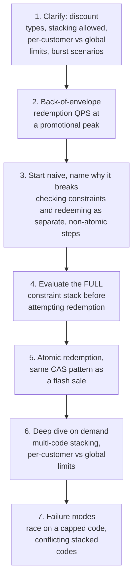

**What the interviewer is actually grading at each step:**
- Step 3: do you recognize, unprompted, that this problem has a real constraint-evaluation phase
  distinct from (and prior to) the atomic-redemption phase — not just "the same as flash sale"?
- Step 5: do you correctly reuse the atomic compare-and-set discipline from a flash-sale-shaped
  problem once you reach the redemption step, rather than reinventing (or under-solving) that part?
- Step 6: do you have an explicit answer for how multiple applied codes combine — sequential
  percentage-then-fixed application order matters and produces different totals depending on
  which is applied first?

---

## Requirements clarification

### Functional

| # | Requirement | Notes |
|---|---|---|
| F1 | Validate a promo code against its full constraint set (expiration, min order value, product/category restriction, per-customer usage limit) | The constraint-stack evaluation |
| F2 | Redeem a code exactly once per allowed use (globally capped, and/or per-customer capped) | The exactly-once, atomic-reservation requirement |
| F3 | Support multiple discount types: percentage, fixed amount, free shipping, BOGO | A modeling requirement, not just a distributed-systems one |
| F4 | Define and enforce whether multiple codes can be combined on one order, and in what order they apply | The stacking-rules requirement |
| F5 | Reject an invalid/exhausted code with a specific, actionable reason | Standard UX requirement — "invalid code" alone isn't helpful |

### Non-functional

| Requirement | Target | Why this number |
|---|---|---|
| Redemption correctness | Absolute — never allow more redemptions than a code's cap, globally or per-customer | The core financial-correctness guarantee; over-redemption is a direct revenue leak |
| Constraint-evaluation latency | Low, sub-second — this runs inline at checkout | A slow coupon check directly delays checkout completion |
| Burst handling | Must handle a promotional-moment spike (e.g. a marketing email driving simultaneous redemption attempts) without allowing over-redemption | Same shape as the flash-sale chapter's thundering-herd concern, applied to code redemption instead of inventory |
| Stacking-rule consistency | Deterministic — the same set of applied codes must always produce the same total discount, regardless of request timing | A non-deterministic discount total is both a customer-trust and an accounting problem |
| Auditability | Every redemption traceable to a specific code, customer, and order | Needed for dispute resolution and fraud investigation |

**Clarifying questions worth asking the interviewer up front — and what each answer changes:**

| Question | If the answer is... | ...then this changes |
|---|---|---|
| "Can multiple codes be applied to the same order, or is it one code per order?" | Multiple codes allowed, with defined stacking rules | Confirms the stacking-rules deep dive is in scope, not just single-code redemption |
| "Are usage limits per-customer, global, or both?" | Both — e.g. globally capped at 10,000 uses AND max 1 per customer | Confirms two independent limit checks, at two different scopes, both needing atomic enforcement |
| "What's the expected burst scenario — a marketing email drop, a flash-sale-adjacent promotion?" | A marketing email drives a simultaneous redemption spike | Confirms the atomic-redemption deep dive's burst-scale concern is real, not hypothetical |
| "How are conflicting or ambiguous stacking combinations handled (e.g. two codes that both claim exclusivity)?" | Codes can declare themselves non-stackable | Confirms the stacking-rules evaluation needs an explicit compatibility check, not just an application-order rule |

**Say this out loud in the interview:** *"I want to separate this into two distinct phases —
evaluating the full constraint stack (validity, limits, restrictions, stacking compatibility) and
then, only once that passes, performing the same kind of atomic, exactly-once redemption a flash
sale needs. Conflating the two is where a naive design usually goes wrong."*

---

## Capacity estimation, worked

```
Given (illustrative, a large e-commerce platform during a promotional peak):
  Checkout attempts with a promo code applied, peak
    (e.g. during a marketing-email-driven spike)         = 20,000/sec
  Distinct active promo codes at any time                  = ~5,000
  Redemption attempts concentrated on the TOP 10
    most-popular codes (e.g. a widely-shared code)          ~= 40% of all attempts
                                                              = 8,000/sec on just 10 codes
  -> similar concentration pattern to the price-alert chapter's hot-symbol skew -- a small
     number of codes carry a hugely disproportionate share of redemption attempts, which is
     the number that makes atomic-redemption contention on a POPULAR code a real concern, not
     a theoretical one.

Constraint-stack evaluation cost per attempt:
  Checks per attempt: expiration, min order value,
    product restriction, per-customer limit,
    stacking compatibility (if multiple codes)              = ~5 checks
  -> each check is cheap (a comparison or a small lookup) -- the AGGREGATE cost at 20,000/sec x
     5 checks = 100,000 checks/sec is still a modest number, well within a single validation
     service's capacity; this is NOT the bottleneck.

Atomic redemption contention, top code:
  Redemption attempts/sec on ONE popular, globally-
    capped code                                             = ~800/sec (a slice of the 8,000/sec
                                                                 concentrated on the top 10)
  -> a MUCH smaller contention level than the flash-sale chapter's 100:1+ oversubscription --
     coupon codes are typically capped generously enough (or uncapped, just per-customer-limited)
     that the atomic step, while still necessary for correctness, faces less extreme contention
     than a genuinely scarce physical-inventory drop.

Per-customer limit check load:
  Per-customer redemption-history lookups/sec               = 20,000/sec
  -> keyed by (customerId, codeId) -- naturally shardable, no cross-customer contention,
     unlike the shared global-cap check on a popular code.
```

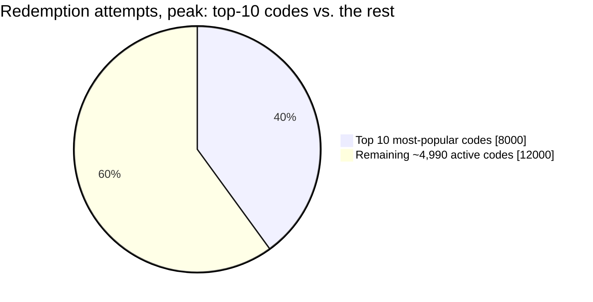

A tiny fraction of codes concentrate a large share of attempts — the same hot-key skew pattern as
the price-alert chapter's popular symbols, here applied to redemption contention.

**Redo-the-chain test:** if a viral marketing moment concentrates 80% of redemption attempts on a
single code instead of spread across the top 10, contention on that one code's atomic redemption
step rises correspondingly — still a real concern, though typically less extreme than a
flash-sale's fixed, tiny physical stock count, since promo codes are more often capped by
business logic than hard physical scarcity.

**The number worth memorizing:** constraint-stack evaluation cost is cheap and not the
bottleneck; atomic-redemption contention on the most popular codes is the real concern, though
typically less extreme than a flash sale's inventory contention, since coupon caps are usually a
business choice rather than genuine physical scarcity.

---

## API design

### `POST /v1/checkout/{orderId}/apply-code`

```json
{ "code": "SAVE20", "customerId": "cust_881" }
```

Response:
```json
{
  "status": "APPLIED",
  "discountType": "PERCENTAGE",
  "discountValue": 20,
  "appliedOrder": 1,
  "remainingStackSlots": 1
}
```
or, on a constraint failure:
```json
{ "status": "REJECTED", "reason": "PER_CUSTOMER_LIMIT_REACHED", "detail": "Already used once on order ord_44821" }
```
or, on an atomic-redemption race loss:
```json
{ "status": "REJECTED", "reason": "REDEMPTION_CAP_REACHED" }
```

| Field | Notes |
|---|---|
| `reason` | Distinct, specific values per failure type (`EXPIRED`, `MIN_ORDER_VALUE_NOT_MET`, `PRODUCT_RESTRICTION`, `PER_CUSTOMER_LIMIT_REACHED`, `NOT_STACKABLE`, `REDEMPTION_CAP_REACHED`) — the constraint-stack evaluation and the atomic-redemption step can each fail for different, user-communicable reasons |
| `appliedOrder` / `remainingStackSlots` | Exposed because stacking order affects the total discount (see the stacking deep dive) — the customer/UI needs to know both what's applied and what room remains |

**The one sentence worth saying about the API surface:** *"Every rejection carries a specific
reason distinguishing a constraint-stack failure from an atomic-redemption-cap failure — these are
two different phases of the same request, and collapsing them into one generic 'invalid code'
response loses information the customer (and support staff) actually need."*

---

## High-level architecture

### Architecture evolution (v1 → v2 → v3)

**v1 — check constraints and redeem as separate, non-atomic steps:**

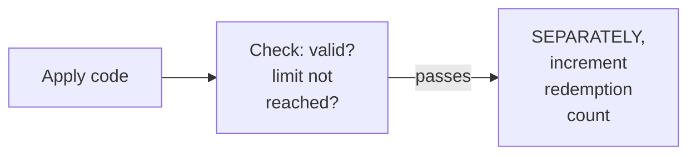

**Why it breaks:** the same check-then-write race as any contended-resource chapter in this
course — many customers checking "is the cap reached" simultaneously can all see "no, room
remains" before any of them increments the count, allowing over-redemption past the code's cap.

**v2 — atomic redemption added, but the constraint stack is evaluated informally, without a
defined stacking-compatibility check:**

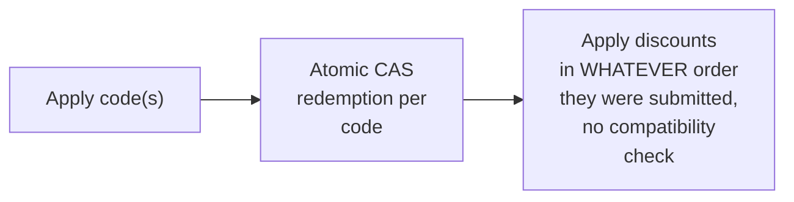

**Why it breaks:** atomic redemption (v2's real improvement) fixes the over-redemption race. But
without an explicit stacking-compatibility check, two codes that shouldn't combine (e.g. two
codes both declaring "cannot be combined with any other offer") could both redeem successfully,
and the discount total becomes dependent on arbitrary submission order rather than a defined,
deterministic rule.

**v3 — the real system: full constraint-stack evaluation (including stacking compatibility) +
atomic redemption:**

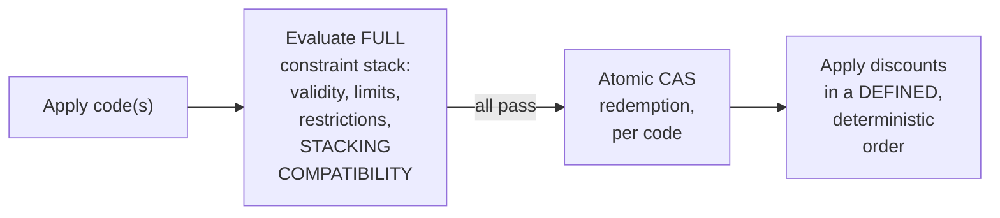

**What v3 fixes, one line each:** the constraint stack now explicitly includes stacking
compatibility, not just per-code validity, catching incompatible combinations before any
redemption is attempted; atomic redemption (already in v2) prevents over-redemption under burst
contention; and a defined application order makes the resulting discount total deterministic and
reproducible.

---

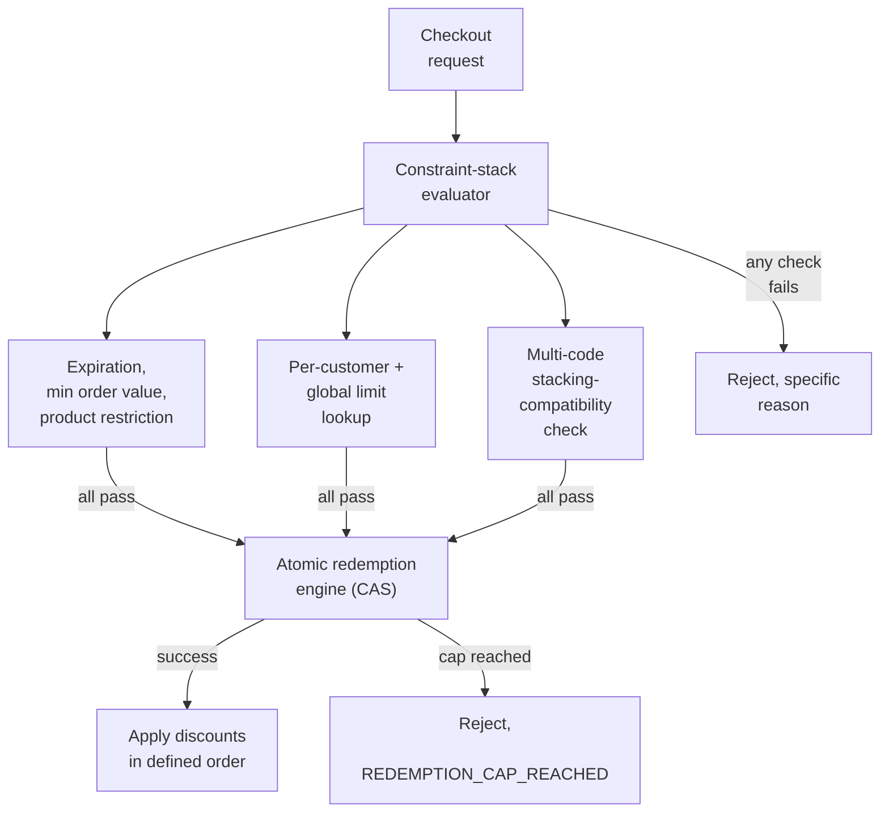

| Component | Role |
|---|---|
| Constraint-stack evaluator | Runs all validity, limit, and stacking checks before any redemption is attempted |
| Atomic redemption engine | The same compare-and-set discipline as the flash-sale chapter, scoped per code (and per-customer, for per-customer limits) |
| Discount-apply logic | Applies the resulting stack of approved discounts in a defined, deterministic order |

---

## End-to-end request walkthroughs

### Walkthrough 1 — a single code, all constraints pass, successful redemption

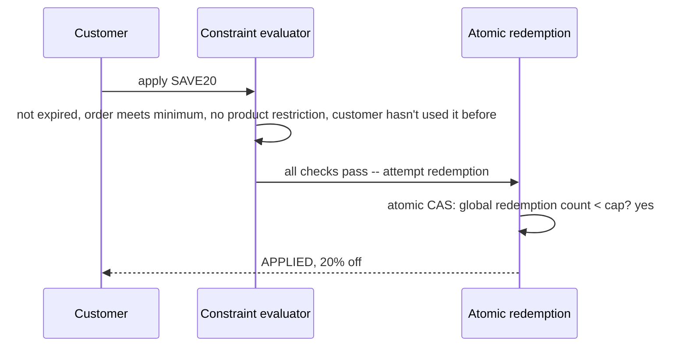

### Walkthrough 2 — a per-customer limit rejects a second attempt, before any redemption logic runs

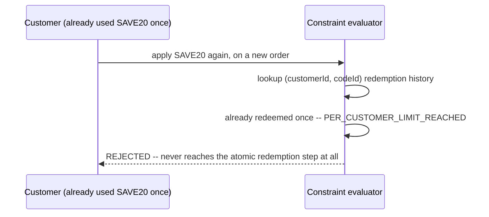

### Walkthrough 3 — two customers race for the last redemption on a capped code

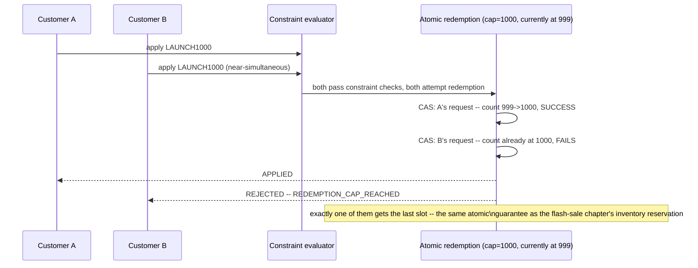

Walkthrough 3 is the concrete reuse of the flash-sale chapter's atomic-reservation pattern, applied
here after the constraint stack (not shown failing in this walkthrough) has already passed for
both customers.

---

## Deep dive: the constraint stack

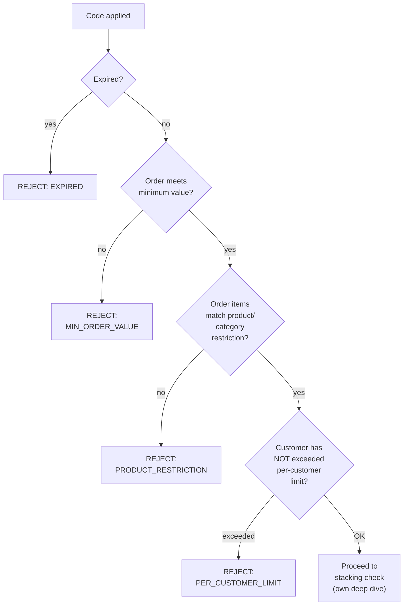

**Why every check must run and fail-fast with a specific reason, rather than a single "is this
valid" boolean:** each constraint failure has a genuinely different customer-facing meaning and a
different remediation (add more items to the cart vs. this code simply doesn't apply to what's in
the cart vs. you've already used this) — collapsing them into one generic rejection loses
information that materially affects what the customer should do next.

**Why this evaluation must complete entirely before the atomic redemption step, not
interleaved with it:** attempting redemption before confirming the code is even eligible wastes
the contended, atomic-resource step on requests that were never going to succeed anyway — the
same "cheap checks before expensive ones" ordering principle as the API-gateway chapter's pipeline
staging, applied here to constraint checks before the atomic reservation.

**Interview cheat-sheet:** *"Run the full constraint stack to completion, with a specific
rejection reason per failed check, before ever attempting the atomic redemption step — this
mirrors the general 'cheap checks before expensive/contended ones' pipeline-ordering principle."*

---

## Deep dive: multi-code stacking rules

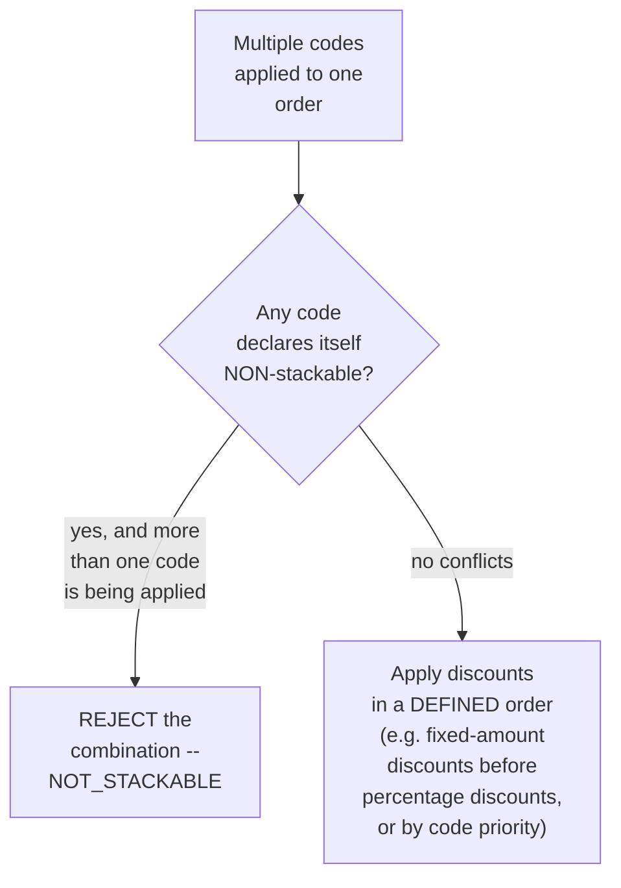

**Why application order changes the total, and must be defined explicitly:** a 20%-off code and a
$10-off code produce different final totals depending on which applies first (percentage-then-
fixed vs. fixed-then-percentage) — without an explicit, documented order, the same set of applied
codes could yield different discount totals depending on submission timing or internal processing
order, which is both a customer-trust problem and a potential accounting inconsistency.

**Why "can these combine at all" must be checked before "in what order do they apply":** these are
two distinct questions — a compatibility check (can codes X and Y ever be combined) has to pass
before an ordering rule (given that they can combine, which applies first) is even meaningful to
compute.

**Interview cheat-sheet:** *"Stacking has two distinct questions: can these codes combine at all
(a compatibility check), and if so, in what defined order do they apply (which changes the total)
— both need explicit rules, never left to submission-order accident."*

---

## Deep dive: atomic redemption at burst scale

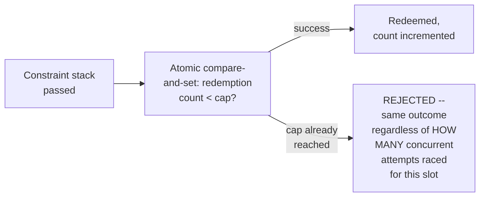

**Why this reuses the flash-sale chapter's exact mechanism, not a new one:** "many concurrent
requests, a hard cap, exactly the right number must succeed" is the identical shape of problem —
the constraint stack in front of it is what's new in this chapter, not the redemption mechanism
itself. Recognizing and naming this reuse explicitly, rather than re-deriving the atomic-CAS
reasoning from scratch, is a strong signal of pattern recognition.

**Why per-customer limits need their own, separately-scoped atomic check, distinct from the
global cap:** a global cap and a per-customer limit are two independent constraints at two
different scopes — a customer could pass the global-cap check (plenty of room left) but still need
to be blocked by their own, already-exhausted per-customer allowance, and this check needs its own
atomicity (per the per-customer deep dive) since a customer could otherwise attempt the same code
twice in quick succession.

**Interview cheat-sheet:** *"This is the same atomic-CAS mechanism as a flash sale — name that
reuse explicitly. The new work in this chapter is everything in front of it (the constraint
stack), plus recognizing that global caps and per-customer limits are two independently-atomic
checks, not one."*

---

## Deep dive: per-customer vs. global limits

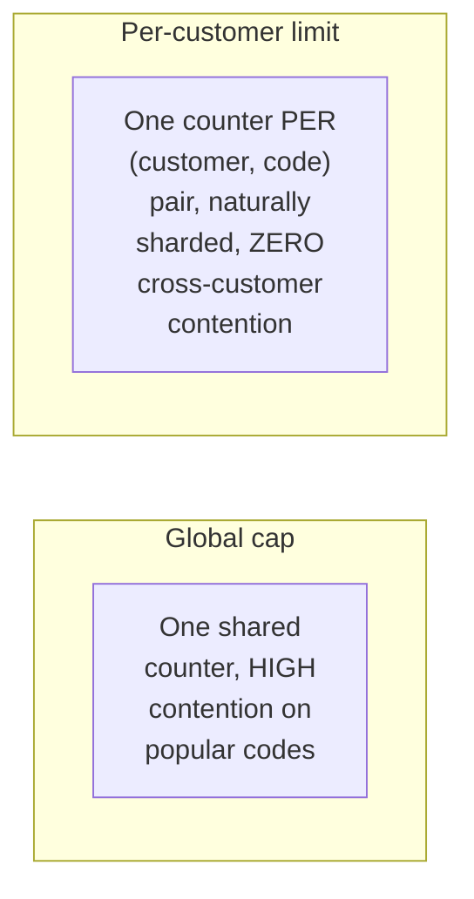

**Why these have very different contention profiles, per the capacity estimate:** the global cap
on a popular code is a single, shared, hot piece of state — exactly the flash-sale-shaped
contention problem; the per-customer limit is keyed by `(customerId, codeId)`, meaning every
customer's own check is independent of every other customer's, with no shared contention point at
all, similar in shape to the concurrent-stream-limiter chapter's account-scoped session state.

**Interview cheat-sheet:** *"Global caps and per-customer limits are two different problems with
two different contention profiles — the global cap is the flash-sale-shaped one; the per-customer
limit has zero cross-customer contention, the same reasoning as any account-scoped state
elsewhere in this course."*

---

## Data model

**Code lifecycle:**

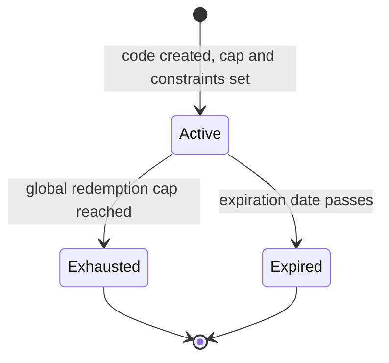

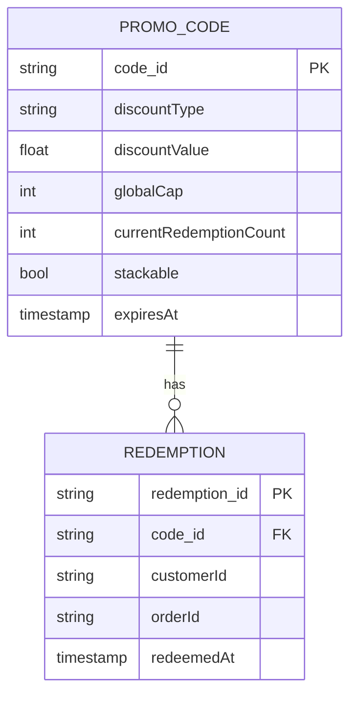

| Table | Storage choice & why |
|---|---|
| `PromoCode.currentRedemptionCount` | The hot, atomically-updated field for the global cap — the flash-sale-shaped contention point |
| `Redemption` | Indexed by `(customerId, code_id)` for the per-customer limit check — naturally shardable, low contention |

---

## Failure modes & mitigations

| Failure mode | Impact | Mitigation |
|---|---|---|
| **Constraint check and redemption evaluated as separate, non-atomic steps** | Over-redemption past the cap under concurrent load | Atomic CAS redemption, same discipline as the flash-sale chapter |
| **Two non-stackable codes both redeem successfully** | Incorrect, unintended discount combination applied | Explicit stacking-compatibility check as part of the constraint stack, before any redemption is attempted |
| **Discount total varies depending on code-application order** | Inconsistent totals for the same set of applied codes | A defined, documented application order, not submission-order-dependent |
| **A per-customer limit check races** (same customer submitting the same code twice in quick succession) | Could bypass a "once per customer" limit | The per-customer check also needs its own atomic compare-and-set, not just the global cap |

---

## Non-functional walkthrough

**Scaling constraint-stack evaluation is cheap and straightforward** — per the capacity estimate,
this is not the bottleneck; each check is a fast lookup or comparison.

**Scaling atomic redemption follows the exact same pattern as the flash-sale chapter** — a single
hot counter per popular code, with the same reasoning about why sharding the counter itself is
the wrong lever (it would require re-aggregating shards to know "is the cap reached," reopening
the race).

**Consistency of the redemption count must be strict**; **consistency of the constraint-stack
checks (e.g. product-catalog data used for restriction checks) can tolerate brief staleness**
without materially affecting correctness — two different consistency bars within one system,
worth distinguishing if asked.

---

## Security & compliance

- **Coupon fraud/abuse** (code sharing beyond intended audience, automated bulk redemption
  attempts) is a related but distinct concern from this chapter's core correctness mechanics —
  typically layered on top via rate-limiting and anomaly detection, reusing patterns from the
  fraud-detection chapter.
- **Redemption audit trail** supports both customer disputes ("why wasn't my code accepted") and
  internal financial reconciliation of discount-driven revenue impact.
- **Discount-value integrity** — validation that a code's discount value and constraints haven't
  been tampered with between creation and redemption is a standard data-integrity concern,
  particularly for any client-side code-application logic that might cache constraint data.

---

## Cost & trade-offs

**Full constraint-stack evaluation trades a small amount of per-request latency (a handful of
extra checks) for correctness and clear, specific customer communication** — per the capacity
estimate, cheap enough that this is an easy trade with no real performance cost.

**Atomic redemption at the global-cap scope trades some throughput ceiling on extremely popular
codes for the correctness guarantee against over-redemption** — the same trade-off already
established and accepted in the flash-sale chapter, just less extreme in typical coupon-cap
contention levels.

---

## Wrap-up: MVP vs. stretch

**In scope for an MVP:**
- Full constraint-stack evaluation (expiration, minimum order value, product restriction,
  per-customer limit) with specific rejection reasons.
- Atomic redemption against a global cap, reusing the flash-sale chapter's CAS pattern.
- Single-code redemption only (defer multi-code stacking).

**Explicitly out of scope for an MVP:**
- Multi-code stacking with compatibility checks and defined application order — start with
  one-code-per-order, add stacking once the product requirement is confirmed.
- Automated fraud/abuse detection on redemption patterns — start with the core correctness
  mechanics, layer abuse detection on top once real usage data exists.

**Stretch goals, worth naming if asked "what's next":**
1. **Multi-code stacking with explicit compatibility and ordering rules.**
2. **Fraud/abuse detection on redemption patterns**, reusing the fraud-detection chapter's
   hybrid rules/ML approach.
3. **Dynamic, personalized codes** (a unique code per customer rather than one shared code),
   which sidesteps the global-cap contention problem entirely by construction, at the cost of
   more complex code-generation/distribution logic.

---

## Golden rules

- **Separate constraint-stack evaluation from atomic redemption — two distinct phases, not one
  conflated check.**
- **Run every constraint check to completion with a specific, distinct rejection reason** — a
  generic "invalid code" loses actionable information.
- **Atomic redemption reuses the flash-sale chapter's exact CAS pattern** — name the reuse
  explicitly rather than re-deriving it.
- **Global caps and per-customer limits are two independently-atomic checks with very different
  contention profiles** — don't conflate them into one mechanism.
- **Multi-code stacking needs both a compatibility check and a defined application order** —
  order changes the total, and must never be left to submission-order accident.

---

## Master cheat sheet

**One-liners:**
- This is the flash-sale chapter's atomic-reservation problem with a real constraint-evaluation
  phase in front of it — name the reuse, focus new effort on the constraint stack.
- Every constraint check needs its own specific rejection reason — expiration, minimum order
  value, product restriction, and per-customer limit are all different failures with different
  customer-facing meanings.
- Global caps (flash-sale-shaped, high contention on popular codes) and per-customer limits
  (naturally sharded, zero cross-customer contention) are two different problems.
- Stacking has two distinct questions: can these codes combine at all, and in what order do they
  apply — both need explicit, documented rules.
- Constraint-stack evaluation is cheap and not the bottleneck; atomic redemption contention on
  popular codes is the real scaling concern, though typically less extreme than genuine physical
  inventory scarcity.

**Formula chain:**
```
redemption_attempts(code)  = total_attempts x code_popularity_share
constraint_check_cost       = attempts x checks_per_attempt   [cheap, not the bottleneck]
```

**Numbers:** a small number of highly popular codes typically concentrate a disproportionate
share of redemption attempts, similar to the hot-symbol skew in the price-alert chapter · atomic-
redemption contention on popular codes is real but typically less extreme than a flash sale's
100:1+ oversubscription, since coupon caps are usually a business choice rather than genuine
physical scarcity.
