# Design a Video Conferencing System — The Story (narrative edition)

> **What this file is.** The reference file, `77-Design-a-Video-Conferencing-System-FAANG-Guide.md`, is the one to recite from — requirements, capacity math, the API shapes, every trade-off table, the master cheat sheet. This file is a second way in: the same material as one continuous story, told in plain language. A video-calling startup keeps hitting a wall, patches it, and the patch itself creates the next wall — until we land on the exact same architecture the reference file documents. The company, **Confero**, is fictional. But every wall it hits, and every fix it reaches for, is something a real, named system actually does: mesh/P2P WebRTC calls failing past a handful of participants, the Selective Forwarding Unit (SFU) architecture that Zoom, Google Meet, and Discord all use in some form to scale group calls, MCU-style mixing servers (the kind of dedicated hardware Polycom and Cisco used to sell), simulcast, WebRTC's standardized ICE/STUN/TURN NAT-traversal (IETF RFCs 8445, 5389, 5766), and Zoom's own documented 2020 growth numbers. I'll say clearly, every time, whether something is a documented fact or just a reasonable, labeled guess.

**The trigger phrases** for this whole topic: *"design Zoom / Google Meet,"* *"how do group video calls not melt everyone's upload bandwidth,"* or *"why can't everyone on the call just connect directly to each other."* Keep one sentence in your head as you read: **beyond a handful of people, a video call only works because a server forwards each person's video once, instead of everyone sending it directly to everyone else.** Everything below is just this one idea, getting harder in small, honest steps.

---

## Chapter 1 — The demo that needed six upload cables at once

It's 2017. Confero is a two-person startup with a slick browser-based video-calling MVP, built the most obvious way: **WebRTC, full mesh** — every participant opens a direct peer-to-peer connection to every other participant, no server in the middle at all except a tiny one for the initial handshake. In the three-person demo they've been showing investors for weeks, it works beautifully. Each person sends 2 video streams (one to each of the other two) and receives 2 — totally fine on any decent home connection.

Then a bigger investor meeting happens: **6 people** join the same call. In a full mesh, every participant has to send their own video **once to every other participant** — that's `N - 1` separate upload streams per person. With 6 people, that's 5 simultaneous uploads each. At a moderate video quality of about 1.5 Mbps per stream, that's `5 × 1.5 = 7.5 Mbps` of *upload* bandwidth required from every single participant, just to send video — before counting what they're also downloading. One investor is on a typical home connection with maybe 3-5 Mbps of upload `[illustrative — but the general shape, home upload capacity trailing far behind download, is a well-documented, real asymmetry of consumer broadband]`. Their video freezes solid within thirty seconds. Two other participants' audio starts cutting out. The demo the founders rehearsed for weeks falls apart live, in front of the people they're trying to raise money from.

The obvious next question: *why does going from 3 people to 6 break things so completely — that's only double?* Because mesh bandwidth doesn't scale with the number of people on the call, it scales with `N - 1` **per participant** — going from 3 to 6 doesn't double the load, it more than doubles each person's own upload requirement (2 streams → 5 streams), and it does this to *everyone* on the call simultaneously. This is a real, well-documented limitation — it's exactly why early mesh-based WebRTC group calling products historically capped out at a handful of participants; the topology itself, not any particular implementation bug, is the ceiling.

**The fix, and the first analogy for this story:** stop connecting participants directly to each other at all. Route everyone's video through **one central server** instead. Confero's first instinct — because it's the intuitively "correct" thing for a shared call to do — is to have that server act like **a TV studio control room**: every camera feed comes in, the control room decodes them all, mixes them into one combined picture (or picks one active speaker), and re-broadcasts a single fresh signal out to every participant. This is a **Multipoint Control Unit (MCU)**, the real, decades-old approach — the kind of dedicated hardware box Polycom and Cisco sold to enterprises for exactly this job.

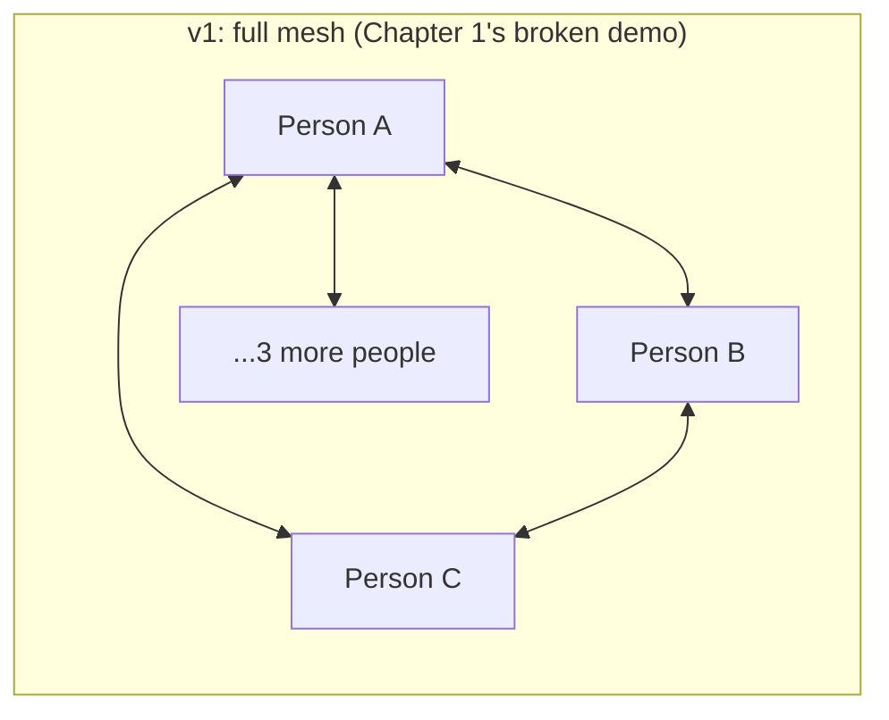

**New problem, visible the moment they build the control-room server:** decoding, mixing, and re-encoding six people's video streams continuously, for every meeting, is real CPU work — and it's *why* hardware MCUs historically shipped with dedicated transcoding chips instead of running on commodity servers; software-only transcoding at any real scale is expensive. Confero benchmarks their new mixing server and finds a single machine can handle mixing for only a few concurrent 6-person meetings before its CPU is pegged `[illustrative — exact core count and figure are invented, but "transcoding is CPU-expensive" is the real, well-documented reason dedicated MCU hardware existed]`. Worse, the decode-mix-encode pipeline adds real, noticeable latency to every single frame — maybe 100-150ms of extra delay `[illustrative]` on top of network transit time, since nothing can leave the server until it's been fully decoded, mixed, and re-encoded.

**How I'd say this in an interview:** "Full mesh fails on bandwidth because each participant's upload cost scales with everyone else on the call, not with the meeting overall — that's the first thing I'd say unprompted. The obvious next move, centralizing through one server, is right in spirit but the naive version of it — mixing and re-encoding everything, an MCU — trades the bandwidth problem for an expensive compute problem instead."

---

## Chapter 2 — The forty-thousand-dollar box that just needs to pass things along

Confero's engineers stare at the CPU graph and ask the obvious question: *do we actually need to decode and re-encode anything at all?* The whole reason mesh broke was bandwidth — each participant sending their video 5 times instead of once. The MCU already fixes *that* part just by centralizing: each participant now sends their video only **once**, to the server. Nothing about fixing the bandwidth problem *required* the server to also open up every stream, understand its contents, mix it, and rebuild it from scratch. That extra step was mixing pictures together for a "everyone in one tile" view — a *product* choice, not a bandwidth necessity.

**The fix, and the analogy this story reuses from here on:** the server should behave like an **old telephone switchboard operator** — patch a call through from one line to another, instantly, without ever listening to what's being said or rewriting it. This is a **Selective Forwarding Unit (SFU)**: each participant still sends their video **once**, but the server just forwards a copy of that exact same, already-encoded stream to every other participant, untouched. No decode, no mix, no re-encode. This is the real, near-universal architecture behind Zoom, Google Meet, and Discord's group calls — not an MCU, an SFU, precisely because forwarding is so much cheaper than transcoding.

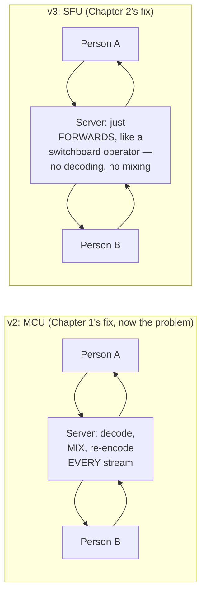

Confero rips out the mixing pipeline and rebuilds the server as a pure forwarder. The CPU graph immediately flattens — the same machine that struggled with a handful of 6-person mixed meetings now comfortably forwards dozens of them, because "copy these bytes to five other sockets" costs almost nothing compared to "decode this video, blend six of them into one frame, and re-encode the result." Latency drops too, since there's no decode-mix-encode pipeline sitting in the middle of every frame's trip from sender to receivers.

**New problem, one week after launch:** with the MCU gone, so is the mixing server's one genuinely useful side effect — it used to be able to send *everyone* a version of the stream adjusted to their own connection, because it was re-encoding from scratch anyway. Now that the SFU just forwards the sender's *one* original stream byte-for-byte, every receiver gets that exact same quality, whether their connection can handle it or not. One participant on a train with a shaky connection either can't receive the call at all, or — if the sender turns their own quality down to accommodate that one person — **everyone else on the call** gets a worse picture than their own good connections could actually support. A switchboard that forwards exactly what it's given has no way to serve people who need something different.

**How I'd say this in an interview:** "The insight that gets you from MCU to SFU is realizing the bandwidth fix and the transcoding are two separate things — centralizing already fixes the sender's `N-1` bandwidth problem, so an SFU just forwards without touching the media, like a switchboard patching a call through. That's dramatically cheaper, but it means every receiver is stuck getting whatever single quality the sender happened to send, which is the very next problem."

---

## Chapter 3 — The poster printed in three sizes

The obvious question: *can the SFU serve different quality to different receivers without transcoding — the exact expensive thing Chapter 2 just eliminated?* Yes — but only if the *sender* does more work up front, not the server. Instead of encoding and sending **one** version of their video, each participant's client encodes and sends **several quality tiers simultaneously** — say a high-resolution version, a medium one, and a low one. This is **simulcast**, a real, standard WebRTC mechanism, and it's the piece that makes an SFU's per-receiver quality adaptation possible at all without a server ever touching the media's actual content.

**The analogy, building on the switchboard:** think of it like a **printing press running three plate sizes of the same poster at once** — full-size, half-size, and postcard. The delivery truck (the SFU) doesn't need a printing press of its own; it just grabs whichever size fits each recipient's mailbox and forwards that copy, untouched, exactly like the switchboard patching a call through — it's just now choosing *which* of three pre-made options to patch through, instead of only having one.

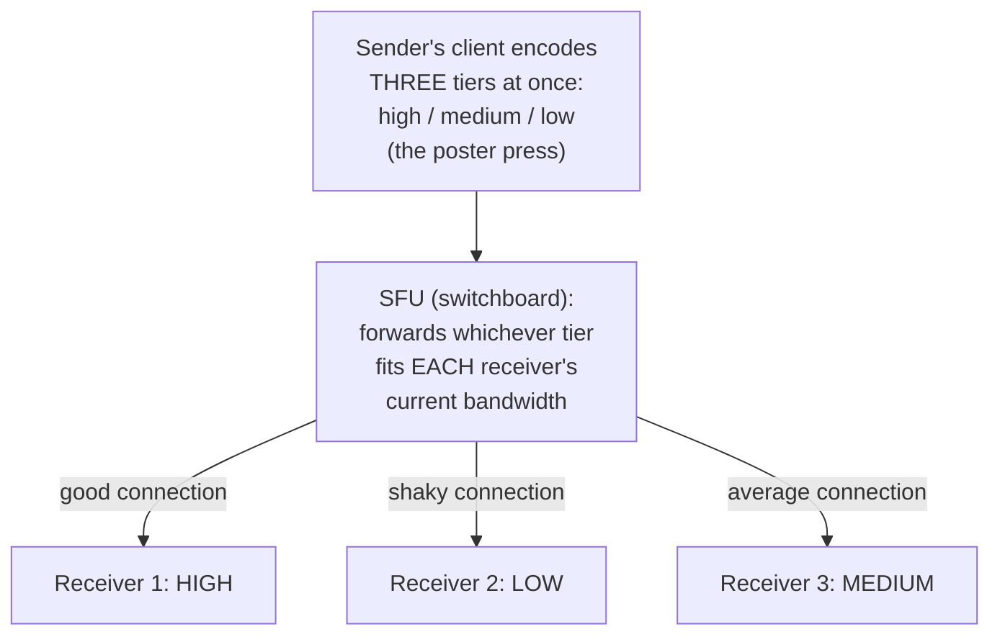

Confero ships simulcast. The train-Wi-Fi participant from Chapter 2 now gets the low tier — a smaller, blurrier picture, but continuous and watchable — while everyone else on good connections still gets the high tier from that exact same sender, with no server transcoding anywhere in the pipeline. Worked number, redone from the mesh math for comparison: the sender's upload cost roughly triples (it's now encoding 3 tiers instead of 1) — a real, deliberate cost, but paid *once* by the sender's own device, not by a server that would otherwise need to do it for every receiver separately.

**New problem, surfacing within days of launch:** simulcast gives the SFU tiers to *choose from*, but nothing yet tells it **when** to switch, or how fast a participant's actual bandwidth is changing right now. Confero's first version just picks a tier once, at call start, based on a single one-time connection test — and never revisits it. A participant whose home Wi-Fi degrades ten minutes into a call (a family member starts streaming a movie on the same router `[illustrative example, but a totally ordinary real-world scenario]`) keeps getting forwarded the high tier their connection can no longer actually receive — frozen frames, garbled audio — because nobody's watching their bandwidth *continuously*.

**How I'd say this in an interview:** "Simulcast is what makes per-receiver quality possible without server-side transcoding — the sender pre-encodes multiple tiers, like running three sizes of the same poster off one press, and the SFU just forwards whichever tier fits each receiver, the same way it already forwards a single stream. That moves cost to the sender's device instead of the server, but tier *selection* still has to happen continuously and automatically, and picking it once at call start clearly isn't enough."

---

## Chapter 4 — Watching the mailbox, not just measuring it once

The fix: the SFU has to continuously monitor **every receiver's** real-time network conditions — packet loss, round-trip time, how much data is actually arriving versus how much was sent — and switch that receiver's forwarded tier up or down automatically, within seconds, with no participant ever touching a setting. This kind of continuous bandwidth estimation is a real, documented problem in WebRTC — Google Congestion Control (GCC) is the actual algorithm most WebRTC stacks use for exactly this job: constantly estimating available bandwidth from packet arrival timing and adjusting what gets sent.

Confero wires this in: every receiver's connection gets sampled roughly once a second, and if packet loss crosses a threshold or estimated bandwidth drops below the current tier's requirement, the SFU switches that one receiver — and only that receiver — down a tier immediately, then back up automatically once conditions recover.

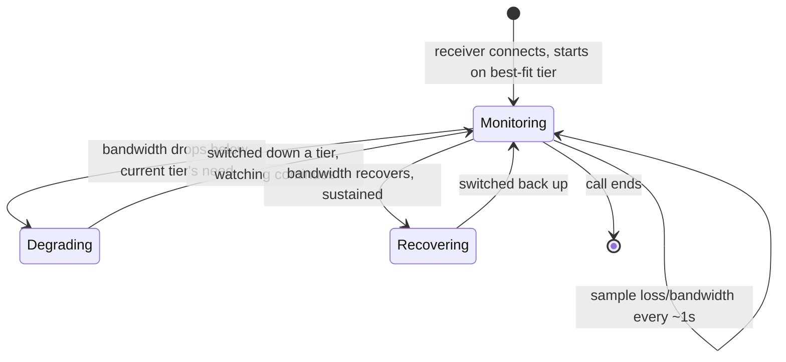

This is the moment Confero's product genuinely stops feeling fragile — no participant is ever hard-disconnected for having a bad connection; they just quietly, automatically see (and are seen in) a lower-quality picture until things improve. It's a fundamentally different failure mode from a binary connect/reject: quality degrades on a dial, not a switch.

**New problem, discovered while debugging a separate, unrelated bug report:** an engineer notices that the "mute" button occasionally takes 2-3 seconds to visibly update on other participants' screens — sometimes longer, and once, memorably, not at all until someone rejoined. Tracing it down: Confero's very first prototype, back before any of this SFU work, had wired *everything* — video and audio media, **and** small control messages like mute/unmute and "who's in the room" — through the same reliable, ordered WebSocket connection, because it was the one connection they'd already built and it was easiest to reuse. That shortcut never got revisited.

**How I'd say this in an interview:** "Simulcast gives you tiers to pick from, but you also need something continuously watching each receiver's real bandwidth and switching automatically — that's the same role Google Congestion Control plays in real WebRTC stacks. The result is quality that degrades gracefully and automatically instead of a hard pass/fail, which is a genuinely different failure mode from most systems, and it's worth saying that difference out loud unprompted."

---

## Chapter 5 — The postcard that doesn't need a signature

Digging into the mute-button bug: Confero's single WebSocket carries both control messages (`mute`, `unmute`, `participant left`) *and*, in a fallback path used when a direct peer connection couldn't be established, actual media frames — all on one **reliable, ordered** connection. Reliable and ordered means: if any packet is lost, the connection *must* retransmit it and hold every packet behind it until the missing one arrives — that's what "ordered and reliable" means underneath. Worked number: on a connection with even modest packet loss, say 2%, a lost packet carrying a video frame forces a retransmission round-trip before that frame — and everything queued behind it, including the next few mute/unmute control messages — can be delivered. At a 60ms round-trip time, one lost packet doesn't cost 60ms; it can cost several multiples of that once retransmission and reordering are accounted for, and every packet behind it in the queue inherits the same delay. That's the 2-3 second mute-button lag: it isn't a mute-button bug at all, it's a media-frame retransmission blocking a totally unrelated control message that happened to be queued right behind it.

The obvious question: *why should losing a video frame — something that's already stale a few hundred milliseconds later anyway — force a control message to wait?* It shouldn't, and the fact that it does is the actual bug. A dropped video frame should just be skipped and the stream should move on to the next one; but a dropped "you are now muted" message is a real, visible correctness bug if it's ever silently lost.

**The fix, a new analogy:** split the two into genuinely different channels with opposite guarantees. Signaling (room state, mute/unmute, participant roster) goes over **certified mail** — a reliable channel (WebSocket/HTTPS) that guarantees delivery and order, because losing one of these really is a bug. Media (the actual audio/video) goes over **postcards** — UDP, a transport that doesn't guarantee delivery or order at all, and deliberately doesn't retransmit lost packets, because in a live stream, a retransmitted-and-late frame arrives too late to matter anyway; better to just send the next postcard.

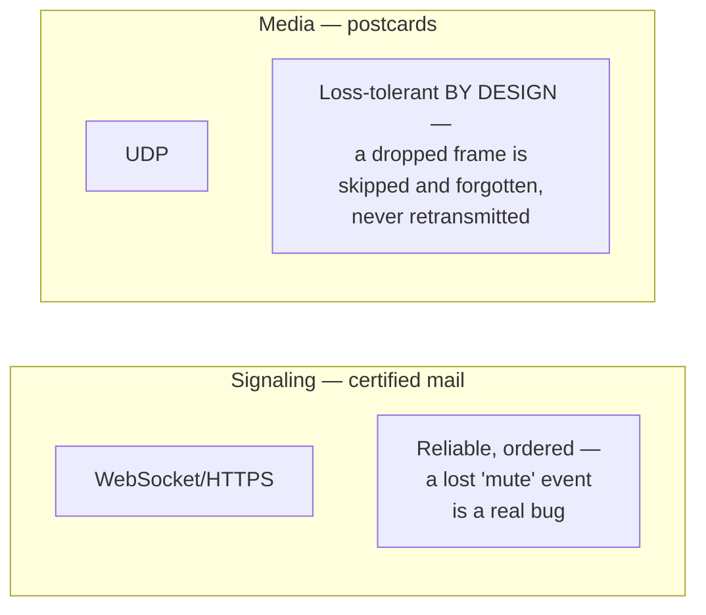

Confero splits the two transports. The mute button now updates instantly and reliably, completely independent of whatever's happening to the video stream at that exact moment — and a shaky video connection no longer has any way to delay a control message ever again, because they're no longer sharing a queue at all.

**New problem, immediately visible in the field:** UDP media, sent directly between a client and the SFU, works great on Confero's own office Wi-Fi. It fails silently for a meaningful chunk of real users at home — direct UDP packets from their laptop just never arrive at the SFU, or vice versa, and nobody sees an error, the call just never connects.

**How I'd say this in an interview:** "Conflating signaling and media on one reliable channel means a lost video packet's retransmission can delay a totally unrelated control message stuck behind it in the queue — that's a real, subtle bug, not a hypothetical. The fix is splitting them into genuinely different transports: reliable, ordered for signaling, and loss-tolerant UDP for media, because a media protocol is supposed to skip a lost frame and move on, not wait to guarantee it arrives late."

---

## Chapter 6 — Asking the front desk for your street address

Tracing the silent UDP failures: most of the affected users are on **home routers or corporate firewalls using NAT (Network Address Translation)** — their laptop's real, routable internet address is hidden behind a private address the router manages, and by default, unsolicited incoming packets from a server they haven't already talked to just get dropped by the router. A raw UDP media stream from the SFU straight to that laptop hits the router and vanishes; the laptop never even sees an error, because there was never any signal that a packet was even sent.

The obvious question: *if a client doesn't even know its own public-facing address, how can the SFU send it anything at all?* This is a solved, standardized problem in WebRTC, not something Confero has to invent: **ICE** (Interactive Connectivity Establishment, RFC 8445), built on **STUN** (RFC 5389) and, as a fallback, **TURN** (RFC 5766).

**The fix, and the analogy:** think of NAT like living in a large apartment building with one shared street address — mail addressed directly to "Apartment 4B" from outside never quite makes it without help. **STUN is asking the building's front desk, "what's our actual street address, and what unit number did they assign me for this delivery?"** — a lightweight lookup so the client learns its own public-facing address and port, then shares that with the SFU during signaling instead of a useless private address. That alone gets most connections through. For the harder cases — NAT configurations so restrictive that even a known public address won't accept incoming media — **TURN is a relay courier desk downstairs**: the client and the SFU both drop off and pick up packets there instead of trying to reach each other directly at all.

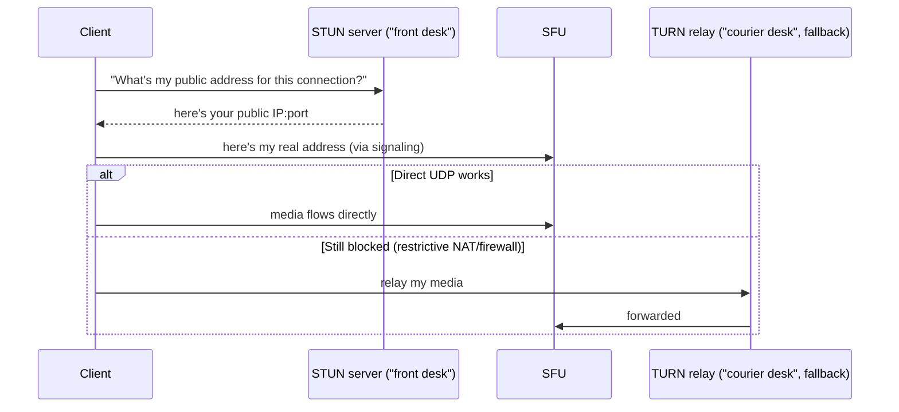

Confero wires ICE/STUN/TURN into the connection-setup flow. Direct UDP now works for most users; the small remaining fraction who are still blocked — restrictive corporate firewalls being the most common case `[illustrative fraction — the exact percentage varies enormously by network environment, but "a meaningful minority of connections need TURN relay" is a real, well-documented WebRTC deployment reality]` — fall back to TURN and still get a working call, just relayed through an extra hop rather than routed directly.

**New problem, once this actually works at scale:** TURN relay adds real cost — every relayed byte of every relayed call flows through Confero's own relay infrastructure instead of directly between client and SFU, and that's infrastructure Confero has to run and pay for indefinitely, not a one-time setup cost. It's the price of universal connectivity, and it's accepted as a permanent, ongoing cost of doing business, not a bug to eliminate.

**How I'd say this in an interview:** "NAT means most clients don't even know their own public address, so ICE/STUN/TURN — real WebRTC standards, not something you'd invent from scratch — solve it in two tiers: STUN for a lightweight 'what's my real address' lookup that gets most connections through directly, and TURN as a relay fallback, at real ongoing bandwidth cost, for the harder NAT cases that can't connect directly at all."

---

## Chapter 7 — Three hundred million people, overnight

Confero has been growing steadily for a few years — mid-sized team meetings, mostly people in the same country. Then, in a stretch of a few weeks in early 2020, video calling as a category explodes globally, practically overnight, as offices and schools everywhere shift to remote work. This isn't a Confero-specific number — it's the real, documented industry-wide shift, and the most cited example of its scale is Zoom's own: Zoom went from about **10 million daily meeting participants in December 2019 to over 300 million daily meeting participants by April 2020** — a real, documented figure from Zoom's own public statement at the time, not an estimate.

Confero rides the same wave at its own (much smaller) scale, and it exposes something the single-region architecture never had to deal with before: participants are now genuinely **global**, often on the same call — a team spread across three continents, all in one meeting. Every participant's media had been routed through whichever single SFU region happened to host that meeting, usually wherever the meeting's host connected from first. Worked number: a participant in Singapore, on a meeting hosted from a US-East SFU, adds real, physical round-trip latency just from distance — every leg of that media's journey (upload to the SFU, forward back down to every other participant) inherits that same cross-Pacific delay, and it's cumulative across every hop, not a one-time cost. Meetings with far-flung participants start feeling laggy and talked-over in exactly the way a healthy call shouldn't.

**The fix:** route each participant to their **nearest** SFU region, and for meetings whose participants are spread across multiple regions, have the regional SFUs **relay to each other** rather than forcing everyone through one distant, shared node — the same idea as an international phone call routing through a regional exchange near each caller instead of one exchange on the other side of the planet. This is **cascading SFUs**.

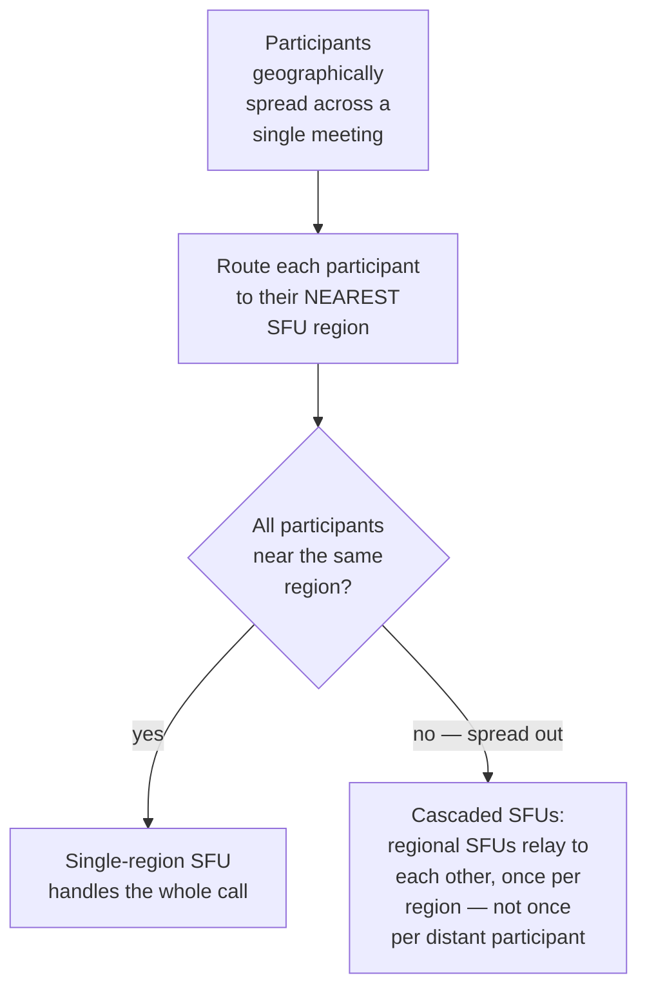

With cascading, a participant in Singapore only ever sends media the short distance to a Singapore SFU; that one regional connection then relays once to a US-East SFU serving the other participants, instead of every packet crossing the Pacific individually for every single stream.

**New problem, once traffic is this large:** a single meeting's forwarding load is now distributed across multiple SFU nodes in multiple regions instead of one machine — which is good for latency, but it means a **single SFU node failing mid-meeting** now affects a subset of a much larger number of concurrently running meetings, and it happens often enough at this scale that "a machine will die during some meeting, right now, somewhere" stops being a hypothetical and becomes an operational certainty.

**How I'd say this in an interview:** "The real Zoom 2020 growth — 10 million to 300 million daily participants in a few months — is the number I'd cite for why global routing matters, not just theoretically. Route each participant to their nearest SFU region for latency, and cascade between regional SFUs for meetings that span regions, because media latency is cumulative per hop, and forcing everyone through one distant node adds real, felt delay to the whole call."

---

## Chapter 8 — The switchboard operator faints

At Confero's new scale, it happens: mid-afternoon, one SFU node in the US-East region hits a hardware fault and drops offline mid-meeting. Every participant whose media was flowing through that specific node — a few dozen concurrent meetings, at that moment `[illustrative — the exact count depends entirely on how many meetings happened to be assigned to that node]` — loses audio and video simultaneously, mid-conversation, with zero warning.

The obvious question: *does losing one SFU node have to mean the meeting is just over?* No — the media itself was never the durable part of this system (there's nothing to "recover" from disk, unlike a database), but the *connections* can be rebuilt quickly if something notices the failure fast and reassigns everyone. The signaling layer — which, thanks to Chapter 5's split, was never on that failed node in the first place — is exactly the mechanism that can do this: it already knows every participant's identity and room membership, so it can detect the dead SFU node (missed heartbeats) and immediately tell every affected client to renegotiate against a **new, healthy SFU node** instead.

**The fix, extending the switchboard analogy:** if the switchboard operator faints, a backup operator with the exact same wiring diagram for that call takes over — every line has to be re-plugged into the new operator's board, which takes a moment, but the call itself doesn't have to end.

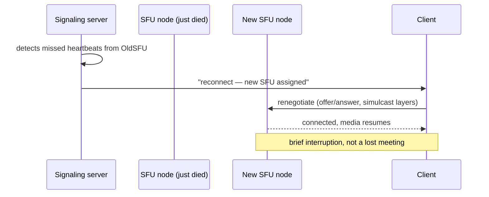

Participants on the failed node see a few seconds of frozen video and silence, then reconnect automatically and the meeting continues — a real, visible glitch, but not a dropped call, and nobody has to manually rejoin.

**New problem, an honest one:** this failover minimizes but never fully eliminates the interruption — renegotiating a new connection, even automated and fast, still takes a few real seconds, and there's no version of "the machine holding your live media connection just died" that has zero user-visible impact. This gets accepted as an honest, permanent cost of the architecture, the same way TURN relay cost was accepted in Chapter 6 — not something to chase down to zero.

**How I'd say this in an interview:** "An SFU node dying mid-meeting is a real operational certainty at scale, not an edge case — the signaling layer, which never lived on that node to begin with because of the earlier signaling/media split, is what detects the failure and triggers renegotiation onto a healthy node. It's a brief interruption, not a dropped meeting, and I'd say plainly that it minimizes rather than eliminates the glitch."

---

## Chapter 9 — The recorder taped under the table, and a second window on the same wire

Two feature requests land around the same time, both from enterprise customers: **recording** meetings for people who couldn't attend live, and **screen sharing** for presentations. Both get built the fast way first, and both immediately expose a new kind of problem — not a scaling problem this time, but a correctness/compliance one, and a design one.

Screen sharing turns out to be the easy half technically: it's just **another simulcast-able media stream**, sent through the exact same SFU pipeline as camera video, no new architecture needed — the SFU doesn't care whether the bytes it's forwarding are a webcam or a shared desktop. The one real wrinkle: screen content (mostly static text, occasional large redraws) behaves very differently from a face on camera (constant small motion), so the codec settings tuned for camera video make shared screens look blurry on text until Confero tunes encoding parameters specifically for the screen-share stream type — a real, practical detail, not an architectural one.

Recording is the harder half. Confero's first version has the SFU **quietly** start writing a copy of the forwarded streams to storage the moment a host clicks "record," with no additional notice to anyone else on the call. Within the first month, a customer in a state with a legal **all-party consent** requirement for recorded conversations reports that their team was recorded without every participant's knowledge — a real, documented category of legal exposure (multi-party consent recording laws exist in a number of jurisdictions), not a hypothetical.

**The fix, and the analogy:** recording without telling people is the digital version of **a tape recorder taped under the meeting table** — technically capturing the room, legally and ethically a real problem regardless of good intent. The fix is a visible, unavoidable notice the moment recording starts — "this meeting is being recorded" shown to every participant, not just the host — plus explicit retention and storage policy for the recorded artifact, since it's now a stored, potentially sensitive asset rather than a live, transient stream like everything else in this system.

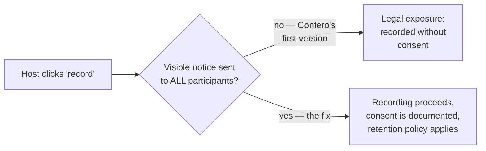

Architecturally, recording turns out to be a clean fit: it's just another **consumer of the SFU's already-forwarded streams** (or a dedicated feed built for the purpose), a downstream concern layered on top of live routing, changing nothing about how media actually flows between live participants.

**New problem, once recording and screen share are both common:** a large "all hands" style meeting now regularly has 150+ participants, mostly just watching a shared screen and a couple of speakers — a fundamentally different shape of session than the 6-person team calls this whole architecture was built around.

**How I'd say this in an interview:** "Screen sharing is architecturally almost free — it's just another stream through the same SFU, tuned differently for static content — so it's not really a new problem. Recording is the one where the real risk is legal, not technical: recording without a visible notice to every participant is a genuine multi-jurisdiction compliance problem, and the fix — visible consent notice plus a retention policy — matters more than any architecture change."

---

## Chapter 10 — When two hundred people are really only one-to-many

Confero's largest "all hands" sessions now regularly run **200+ participants** — a webinar-shaped session, not a team meeting. A single SFU node forwards a stream to every *other* participant for every sender, and worked out, that forwarding load scales with roughly `participants × receivers-per-sender`. At 200 participants where even a modest fraction are actively presenting, a single SFU node's total number of concurrent forwarding paths climbs into a range that exceeds a single machine's comfortable capacity `[illustrative — the exact ceiling per node depends entirely on hardware and codec, but "one machine's forwarding capacity is finite and gets challenged well before 200 active two-way senders" is a real, structural limit, not a made-up one]`. On top of that, in a webinar, most of those 200 people aren't sending video at all — they're just watching — which the original SFU design, built assuming every participant is both a sender and receiver, doesn't specifically optimize for.

The obvious question: *does this need a fundamentally different architecture from the 6-person team-call SFU?* Not fundamentally — but it needs the *same* SFU concept applied with awareness of the actual traffic shape: most webinar sessions are heavily **one-to-many** (a few presenters, many silent watchers), not **many-to-many**. The fix is the same cascading idea from Chapter 7, applied within a region instead of across regions: a **tier of SFU nodes**, where the presenters' streams feed into a small number of nodes, which in turn fan out to the much larger number of watch-only participants, rather than one single node trying to be both ingestion and fan-out point for all 200 people at once.

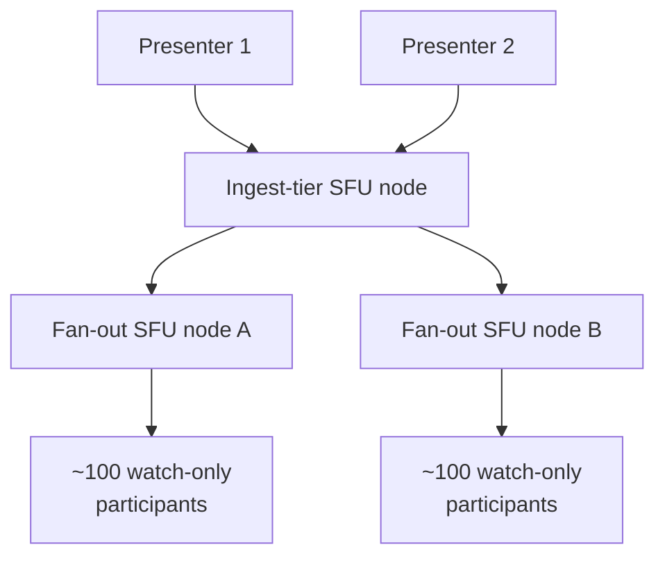

This tiered fan-out keeps any single node's load bounded regardless of how large the audience gets, the same underlying lesson as cascading regional SFUs — don't make one node responsible for forwarding to an unbounded number of receivers, split the fan-out across a tier instead.

**Where this honestly stops mattering for most interviews:** unless the interviewer specifically asks about hundred-plus-participant webinar sessions, a straight SFU with simulcast, sized for dozens of participants, is the right depth to stop at — tiered fan-out for very large one-to-many sessions is a real, worth-naming extension, not something to walk through unprompted.

**How I'd say this in an interview:** "At webinar scale, most participants are watch-only, so the traffic shape is really one-to-many, not many-to-many — the fix is a tier of SFU nodes, presenters feeding an ingest layer that fans out to the audience, so no single node's forwarding load is unbounded. I'd only go here if the interviewer specifically pushes past 'dozens of participants' into hundreds — otherwise a single SFU with simulcast is the right level of depth."

---

## Where the story actually lands

```mermaid
flowchart LR
    A["Ch1: full mesh\n(bandwidth explodes\nper participant)"] -->|"fixes: send once\nbreaks: transcoding cost"| B["Ch1-2: MCU\n(mixing server)"]
    B -->|"fixes: cheap forwarding\nbreaks: one-size-fits-all quality"| C["Ch2: SFU"]
    C -->|"fixes: per-tier options exist\nbreaks: no continuous switching"| D["Ch3: simulcast"]
    D -->|"fixes: tiers to choose from\nbreaks: nothing watches conditions"| E["Ch4: adaptive tier switching"]
    E -->|"fixes: graceful quality\nbreaks: signaling delayed by media loss"| F["Ch5: signaling/media split"]
    F -->|"fixes: correctness\nbreaks: NAT blocks direct UDP"| G["Ch6: STUN/TURN"]
    G -->|"fixes: connectivity\nbreaks: distance = latency"| H["Ch7: cascading regional SFUs"]
    H -->|"fixes: latency\nbreaks: a node WILL die"| I["Ch8: SFU failover"]
    I -->|"fixes: resilience\nbreaks: recording w/o consent, new stream types"| J["Ch9: consent + screen share"]
    J -->|"fixes: compliance\nbreaks: 200-person one-to-many shape"| K["Ch10: tiered fan-out"]
```

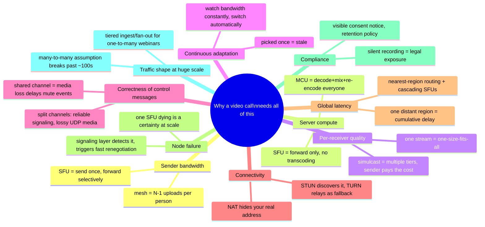

Every real video conferencing system you'll design in an interview sits somewhere on this chain. The skill isn't reciting all ten chapters — it's stopping where the stated requirements say to stop. A small team-calling product might reasonably stop around Chapter 6 (SFU, simulcast, NAT traversal). A global, enterprise-scale platform has to reach Chapters 7 through 10. If nobody's mentioned hundred-plus-participant webinars, walking all the way to Chapter 10 unprompted reads as padding, not depth.

---

## Grill me — adversarial follow-ups

**Q1: "Why not just cap meeting size instead of building an SFU at all?"**
You could, and plenty of early products effectively did that by accident — mesh just stops working past a handful of people. But capping meeting size is a product limitation you're choosing, not a technical one you're forced into, and the entire point of an SFU is that it removes that ceiling for a forwarding cost that's genuinely cheap. If the actual requirement really is "never more than 4 people," mesh might honestly be defensible — but that's a narrow, unusual requirement to assume by default.

**Q2: "Isn't an MCU strictly better for the user, since it gives the server full control over what each person sees?"**
For specific product needs — like producing one single combined recording, or doing server-side layout composition — yes, an MCU-style approach still earns its keep, and real systems keep a mixing component around for exactly those cases. But paying MCU-level compute cost for the default case of live, real-time forwarding is the wrong trade almost everywhere, which is why SFU is the near-universal default and MCU-style mixing is the special case, not the other way around.

**Q3: "Simulcast triples the sender's upload cost — isn't that just moving the mesh problem to a different place?"**
It's a real cost, but it's a fixed, bounded 3x on the sender's *own* stream, completely independent of how many other people are on the call — that's the fundamental difference from mesh, where cost scaled with the number of *other* participants. A sender in a 3-person call and a sender in a 50-person call pay the exact same simulcast encoding cost.

**Q4: "If media is loss-tolerant by design, doesn't that mean any packet loss just makes the call permanently worse with no way to recover quality?"**
No — loss-tolerant means the *stream* doesn't stop or wait for a retransmission of one lost packet, but there are still real recovery mechanisms layered on top, like forward error correction and packet-loss concealment, that smooth over brief loss without needing retransmission. The tier-switching from Chapter 4 is the bigger lever for *sustained* loss — dropping to a tier the connection can actually sustain — rather than fighting every individual lost packet.

**Q5: "Why does the signaling/media split matter so much — isn't it just an implementation detail?"**
It's not a detail, it's a correctness guarantee: signaling absolutely cannot tolerate silent loss (a lost "you're muted" event is a real bug), while media absolutely must not wait for guaranteed delivery (a late frame is worse than a skipped one). Conflating them, like Confero's original prototype did, means the *worse* of the two failure modes leaks into both — that's a design error, not a minor inefficiency.

**Q6: "STUN and TURN both sound like they solve the same problem — why do you need both?"**
STUN solves the common case cheaply — most NATs will accept incoming packets once they know a legitimate outbound request opened the path, so just learning your own public address via STUN is enough to connect directly. TURN exists for the harder, less common NAT configurations where even that isn't enough, and it costs real, ongoing relay bandwidth — so you always try STUN's direct path first and only fall back to TURN's more expensive relay when direct connectivity genuinely fails.

**Q7: "You said cascading SFUs help with latency — doesn't relaying through an extra regional hop just add latency of its own?"**
It adds a small, fixed hop between two nearby regional SFUs, but it removes a much larger cost — every individual participant's media crossing the full distance to one faraway node. One extra short regional-to-regional hop is a much better trade than dozens of individual long-haul connections, which is exactly why cascading wins on net latency despite technically adding a hop.

**Q8: "If an SFU node dying is treated as an operational certainty, why not just make every node redundant so it never actually fails?"**
You still want fast detection and failover as the primary defense, because "never fails" isn't achievable for real hardware at any real scale — the honest goal is minimizing the interruption, not promising zero interruption. Redundancy techniques (hot standby, rapid rescheduling) reduce how often and how visibly this happens, but the renegotiation-on-failure mechanism from Chapter 8 is still the thing actually protecting the user experience when a failure does happen.

**Q9: "For recording, why not just always record everything by default and let compliance be someone else's problem later?"**
Because the legal exposure is real and immediate — several real jurisdictions require all-party consent for recorded conversations, and "we'll sort out consent later" doesn't retroactively fix a call that was already recorded without it. The visible-notice fix is cheap to build and removes the exposure entirely, so there's no good reason to accept that risk by defaulting to silent recording.

**Q10: "Given this whole story, if someone says 'design Zoom' cold, where do you actually start?"**
Say the one sentence that decides almost everything downstream: media has to flow through a server that forwards once per sender rather than mesh or full transcoding, so start with the SFU and explain why it beats both mesh and MCU. Then layer in simulcast for adaptive quality, the signaling/media transport split, and NAT traversal as your next three moves — and only go further into global cascading, failover, recording compliance, or webinar-scale fan-out if the interviewer's own questions actually point that way.

---

## Pacing note

**If this is 60 seconds inside a bigger question:** say the switchboard line — media flows through a server that forwards each sender's stream once instead of everyone sending to everyone — then say "SFU, simulcast for per-receiver quality, signaling and media split across different transports, and I'd handle NAT traversal, global routing, and failover as deep-dives if you want to go there." That's the whole shape in one breath.

**If this is the whole 15-20 minute focus:** walk the chapters in order — why mesh breaks, why MCU's transcoding cost is the wrong fix, the SFU, simulcast, continuous adaptive quality, the signaling/media transport split, NAT traversal, global/cascading routing, node failover, then recording consent and webinar-scale fan-out if they come up. Don't walk all ten unprompted — follow wherever the interviewer's questions actually point, and use the skipped chapters as your "if I had more time" closer.

---

## Active recall — no answers, test yourself cold

1. What's the one-sentence reason a full mesh video call breaks past a handful of participants?
2. What does an MCU fix that mesh couldn't, and what new cost does it introduce?
3. What's the actual difference between what an MCU does to a stream and what an SFU does to a stream?
4. Why doesn't a plain SFU (no simulcast) already solve "give each receiver the quality their connection can handle"?
5. What real WebRTC mechanism continuously adjusts which simulcast tier a receiver gets, and why can't tier selection just happen once at call start?
6. Walk through exactly how a lost video packet on a shared, reliable channel can delay an unrelated mute-button event.
7. What's the difference between what STUN solves and what TURN solves, and why do you need both instead of just one?
8. Why does cascading SFUs across regions reduce latency even though it technically adds an extra hop?
9. Why is the signaling layer specifically the thing that detects and recovers from an SFU node dying?
10. Why is silent, default-on recording a compliance problem, and what's the actual fix?
11. Past roughly a hundred participants, why does the traffic shape stop looking like many-to-many, and what architecture change does that call for?

*Spaced repetition: test this list today, again in 2-3 days, again in a week.*

---

## Cheat sheet — one line per stop on the story

- **Full mesh**: bandwidth scales with `N-1` uploads *per participant* — breaks well before typical meeting sizes, the reason it's rare beyond a handful of people.
- **MCU (mixing server)**: fixes bandwidth by centralizing, but decodes, mixes, and re-encodes every stream — expensive server compute and added latency, the reason dedicated MCU hardware existed.
- **SFU (forwarding server)**: like a switchboard operator — patches media through without touching it, fixing bandwidth *without* MCU's transcoding cost; the near-universal real-world default (Zoom, Google Meet, Discord all use this shape).
- **Simulcast**: sender encodes multiple quality tiers at once (like printing three poster sizes), so the SFU can forward whichever tier fits each receiver — no server-side transcoding required.
- **Continuous adaptive quality**: something has to keep watching each receiver's real-time bandwidth and switch tiers automatically (the real role Google Congestion Control plays) — picking a tier once, at call start, isn't enough.
- **Signaling vs. media transport split**: certified mail (reliable WebSocket) for control messages, postcards (loss-tolerant UDP) for media — conflating them means media loss can silently delay control events, a real correctness bug, not just an inefficiency.
- **STUN/TURN (NAT traversal)**: STUN is asking the front desk for your real public address, enough for most direct connections; TURN is a relay courier desk for the harder NAT cases, at real ongoing bandwidth cost.
- **Global/cascading SFUs**: route each participant to their nearest region for latency, and cascade between regional SFUs for meetings spanning regions — latency is cumulative per hop, so distance compounds.
- **SFU node failover**: a node dying mid-meeting is an operational certainty at scale — the signaling layer (never on that node, thanks to the earlier split) detects it and triggers fast renegotiation onto a healthy node.
- **Recording consent + screen share**: screen share is architecturally almost free (just another simulcast-able stream); recording's real risk is legal, not technical — a visible consent notice and retention policy are the actual fix.
- **Tiered fan-out for webinar scale**: past roughly a hundred participants, traffic is really one-to-many, not many-to-many — an ingest tier of SFU nodes feeding a fan-out tier keeps any single node's load bounded.
- **The meta-lesson**: every fix in this story buys one property (bandwidth, cheap forwarding, per-receiver quality, continuous adaptation, control-message correctness, connectivity, latency, resilience, compliance, or bounded fan-out) by spending a different resource — say the trade in the same sentence you propose the fix.
