# Design a Video Conferencing System (Zoom/Google Meet-style) — FAANG Interview Guide

> Source chapter type: real-time media routing. Frequently asked at FAANG-tier companies in
> 2025-2026, though — unlike most of this course's genuinely rare additions — it's also one of the
> most thoroughly-documented system design topics on the internet already. Included here for
> course completeness rather than rarity: this is a genuinely distinct mechanism from anything
> else in the course (WebRTC, SFU media routing, simulcast) and a real gap in the 72 guides that
> preceded it, even though it doesn't meet this course's usual "not typically available online"
> bar.

## Mental model

Multiple participants need to see and hear each other in real time, globally, with tolerable
quality even under imperfect network conditions. The defining architectural decision — the one
interviewers reportedly listen for above all else — is **how media flows between participants**,
and the near-universal real-world answer is a **Selective Forwarding Unit (SFU)**: each
participant sends their own audio/video stream *once*, to a server, which forwards it to every
other participant — rather than every participant sending directly to every other participant
(unworkable bandwidth at more than a handful of people) or a full transcoding server re-encoding
every stream (unworkable compute cost at scale).

Three things distinguish this from every other real-time chapter in this course:

1. **The transport protocol split is deliberate and asymmetric.** Signaling (joining a room,
   muting, participant list changes) uses a reliable channel (WebSocket/HTTPS) because those
   events must not be lost. Media (the actual audio/video) uses UDP, because a media protocol
   *tolerates* dropped packets gracefully (a skipped frame is far less disruptive than the
   delay a reliable, retransmitting protocol would introduce) — this is the opposite trade-off
   from almost every other chapter in this course, where reliable delivery is the default goal.
2. **Simulcast: sending multiple quality levels simultaneously, not one.** Each participant's
   client encodes and sends several resolution/bitrate versions of their own stream at once, so
   the SFU can forward whichever quality level suits each *receiving* participant's actual
   bandwidth, without needing to transcode anything server-side.
3. **Quality degrades gracefully, continuously, not via a hard pass/fail.** A participant on a
   poor connection doesn't get disconnected or blocked — they see (and are seen in) lower quality,
   a fundamentally different failure mode than almost every other chapter's binary success/reject.

**The one sentence to say out loud:** *"The SFU is the answer to 'how does media flow at more
than a handful of participants' — each client sends once, the server forwards selectively, using
simulcast so quality can degrade gracefully per-receiver instead of failing hard."*

**The one picture to remember forever:**

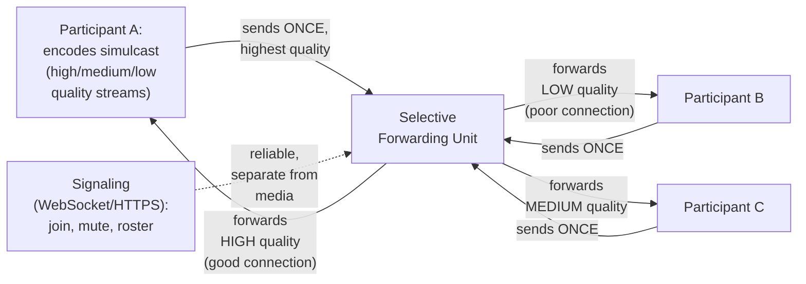

**Memory hook:** *"Send once, forward selectively, per-receiver quality via simulcast — and
signaling (reliable) and media (UDP, loss-tolerant) are two deliberately different transports,
not one channel doing both."*

---

## Table of contents
[How to Identify This Topic](#how-to-identify-this-topic-in-an-interview) ·
[Interview Playbook](#interview-playbook) · [Requirements](#requirements-clarification) ·
[Capacity Estimation](#capacity-estimation-worked) · [API Design](#api-design) ·
[High-Level Architecture](#high-level-architecture) ·
[Architecture Evolution v1→v2→v3](#architecture-evolution-v1--v2--v3) ·
[End-to-End Walkthroughs](#end-to-end-request-walkthroughs) ·
[Deep Dive: SFU vs. Mesh vs. MCU](#deep-dive-sfu-vs-mesh-vs-mcu) ·
[Deep Dive: Simulcast & Adaptive Quality](#deep-dive-simulcast--adaptive-quality) ·
[Deep Dive: Signaling vs. Media Transport](#deep-dive-signaling-vs-media-transport) ·
[Deep Dive: Global Media Routing](#deep-dive-global-media-routing) ·
[Data Model](#data-model) · [Failure Modes](#failure-modes--mitigations) ·
[Non-Functional Walkthrough](#non-functional-walkthrough) ·
[Security & Compliance](#security--compliance) · [Cost & Trade-offs](#cost--trade-offs) ·
[Wrap-Up](#wrap-up-mvp-vs-stretch) · [Golden Rules](#golden-rules) ·
[Cheat Sheet](#master-cheat-sheet)

---

## How to identify this topic in an interview

- "Design Zoom / Google Meet / a video conferencing system."
- The tell that the interviewer wants real-time-media depth, not just a generic "real-time app"
  answer: they push on **how media actually flows between N participants** — that's the SFU
  question, the single most load-bearing architectural decision in this chapter.
- A follow-up like "what happens when one participant has a bad connection" is the
  [simulcast/adaptive-quality deep dive](#deep-dive-simulcast--adaptive-quality) — graceful,
  per-receiver degradation, not a binary connect/disconnect.

---

## Interview playbook

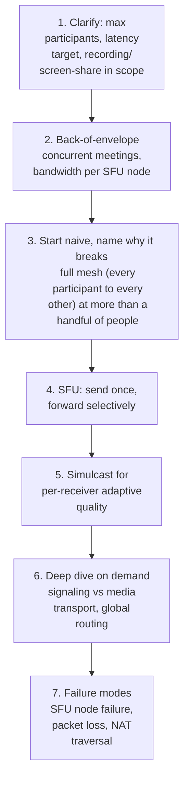

**What the interviewer is actually grading at each step:**
- Step 3: do you know, unprompted, that a full mesh topology's bandwidth cost grows with the
  square of participant count and becomes unworkable well before typical meeting sizes?
- Step 4: can you articulate *why* an SFU beats both mesh (bandwidth) and a full MCU/transcoding
  server (compute cost), not just name it as the answer?
- Step 6: do you know that media uses UDP specifically because it tolerates loss gracefully, while
  signaling needs reliable delivery — and can explain why conflating the two transports is wrong?

---

## Requirements clarification

### Functional

| # | Requirement | Notes |
|---|---|---|
| F1 | Support multiple participants joining a shared audio/video session in real time | The core function |
| F2 | Adapt quality per participant based on their actual network conditions | Graceful degradation, not hard failure |
| F3 | Support signaling operations: join/leave, mute/unmute, participant roster updates | Reliable-delivery-required control-plane events |
| F4 | Support screen sharing as an additional media stream | A common, expected feature extension |
| F5 | Support recording a session, if in scope | A distinct storage/compliance concern layered on top of live routing |

### Non-functional

| Requirement | Target | Why this number |
|---|---|---|
| End-to-end media latency | Ideally under ~200ms | Beyond this, conversation starts to feel unnatural — talking over each other, noticeable lag |
| Media loss tolerance | High — occasional dropped packets/frames should degrade quality gracefully, never halt the stream | A media stream that stalls waiting for a retransmission is worse than one that briefly glitches and continues |
| Signaling reliability | High — a lost "mute" or "participant left" event causes real, visible UI inconsistency | Distinct reliability bar from the media stream itself |
| Concurrent participants per session | Must scale to at least dozens, often hundreds for webinar-style use cases | Directly shapes whether pure SFU forwarding remains sufficient or needs cascading/tiering at very large scale |
| Quality adaptation speed | Fast, seconds — a degrading connection should be reflected in adjusted quality quickly | A slow-to-adapt system either wastes bandwidth on unreceivable quality or under-delivers on a recovered connection |

**Clarifying questions worth asking the interviewer up front — and what each answer changes:**

| Question | If the answer is... | ...then this changes |
|---|---|---|
| "What's the maximum expected participant count per session?" | Typically dozens, occasionally hundreds for large webinars | Confirms a single SFU node's forwarding capacity and whether cascaded/tiered SFUs are needed for the largest sessions |
| "Is recording required, and if so, from which point in the pipeline?" | Yes, server-side | Confirms a recording component consumes the SFU's forwarded streams (or a dedicated feed), a distinct requirement from live routing itself |
| "Should quality degrade automatically, or should participants manually select a quality tier?" | Automatic, network-condition-driven | Confirms the simulcast/adaptive-quality mechanism must be automatic and continuous, not a manual, one-time setting |
| "Are participants globally distributed, needing geographically distributed infrastructure?" | Yes | Confirms the global-media-routing deep dive is in scope, not a single-region deployment |

**Say this out loud in the interview:** *"The single most important architectural decision here is
how media actually flows between participants — I'd go straight to an SFU and explain why it beats
both a full mesh and a transcoding MCU, since that's usually the crux of what this question is
really testing."*

---

## Capacity estimation, worked

```
Given (illustrative, a large video conferencing platform):
  Concurrent meetings, globally, at peak            = 2,000,000
  Average participants per meeting                    = 6

Full-mesh bandwidth (the naive baseline, to show why it fails):
  Per-participant upload streams needed in a full mesh  = (N-1) per participant, N=6 -> 5
  Per-participant upload bandwidth (one stream)          = ~1.5 Mbps (moderate video quality)
  Total upload bandwidth needed, PER PARTICIPANT           = 5 x 1.5 Mbps = 7.5 Mbps
  -> already straining a typical home upload connection at just 6 participants; mesh bandwidth
     scales with N-1 PER PARTICIPANT, becoming completely unworkable well before real meeting
     sizes reach even a dozen people, let alone a hundred-person webinar.

SFU bandwidth, same meeting:
  Per-participant upload (send ONCE, regardless of
    meeting size)                                         = 1.5 Mbps
  Per-participant download (receive from every OTHER
    participant, forwarded by the SFU)                     = 5 x 1.5 Mbps = 7.5 Mbps
  -> upload cost is now INDEPENDENT of meeting size (always just 1.5 Mbps to send), while
     download cost still scales with participant count -- but download bandwidth is typically
     far more available than upload on consumer connections, which is part of why this
     asymmetry is tolerable in practice.

SFU server-side forwarding load:
  Total streams forwarded, this one meeting               = 6 participants x 5 receivers each
                                                              = 30 forwarding paths
  Platform-wide concurrent forwarding paths, at peak        = 2,000,000 meetings x 30
                                                              ~= 60,000,000
  -> a genuinely large number -- SFU CLUSTER capacity, not any single node, must scale to this;
     each SFU node handles a bounded number of concurrent participants/streams, and meetings
     are distributed across many nodes, sharded by session.

Simulcast overhead:
  Quality tiers encoded per participant (e.g. high/
    medium/low)                                             = 3
  Sender-side encoding cost                                  = 3x a single-quality encode
  -> a real CLIENT-side compute/bandwidth cost for sending multiple simulcast tiers -- the
     trade-off being made explicitly: more sender-side work and upload bandwidth, in exchange
     for the SFU never needing to transcode anything server-side.
```

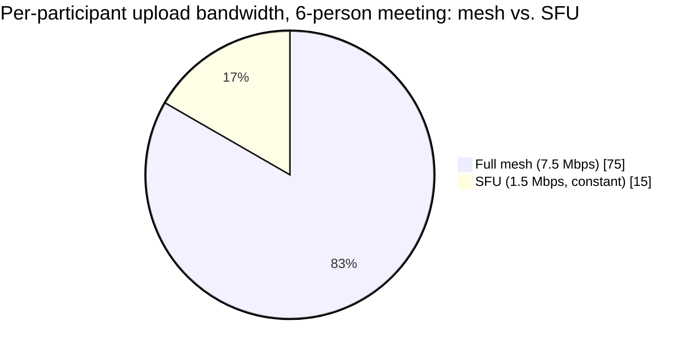

SFU upload cost is a fifth of mesh's at just 6 participants — and unlike mesh, it stays flat no
matter how many people join.

**Redo-the-chain test:** if average participants per meeting rises to 20 (larger team meetings),
full-mesh per-participant bandwidth would need to support 19 simultaneous upload streams — wildly
infeasible — while SFU upload cost stays flat at 1.5 Mbps regardless; this is the single clearest
number to cite when asked "why not mesh."

**The number worth memorizing:** full-mesh bandwidth scales with participant count *per
participant*, becoming unworkable well before typical meeting sizes; an SFU keeps per-participant
upload cost constant regardless of meeting size, which is the core reason it's the near-universal
real-world choice.

---

## API design

### Signaling (WebSocket, reliable channel)

```json
{ "type": "JOIN_ROOM", "roomId": "room_881", "participantId": "p_44821" }
```
```json
{ "type": "PARTICIPANT_MUTED", "roomId": "room_881", "participantId": "p_44821" }
```

### Media negotiation (WebRTC signaling, exchanged over the same reliable channel)

```json
{ "type": "OFFER", "sdp": "...", "simulcastLayers": ["high", "medium", "low"] }
```

### Media transport (not a request/response API — a continuous UDP stream, post-negotiation)

Once negotiated, audio/video flows over UDP directly between each client and the SFU — there is no
further application-level "API" for the media itself, which is a deliberate contrast to almost
every other chapter's request/response or event-message shape.

| Field | Notes |
|---|---|
| `simulcastLayers` | Negotiated once, at connection setup — declares which quality tiers this participant will actually encode and send, so the SFU knows what's available to forward |
| Signaling channel | Carries only control-plane events and the initial media negotiation — never the actual audio/video payload, which is the split the signaling-vs-media deep dive is about |

**The one sentence worth saying about the API surface:** *"There are two channels with
deliberately different transport guarantees — signaling is a reliable WebSocket carrying
room/participant state and initial media negotiation, and media itself is a raw UDP stream with no
request/response shape at all, tolerating loss by design."*

---

## High-level architecture

### Architecture evolution (v1 → v2 → v3)

**v1 — full mesh, every participant connects directly to every other:**

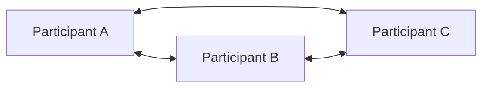

**Why it breaks:** per the capacity estimate, each participant's required upload bandwidth scales
with the number of *other* participants — at even modest meeting sizes (a dozen or more people),
this exceeds typical consumer upload bandwidth entirely, before any consideration of the
compute cost of each client managing N-1 simultaneous peer connections.

**v2 — a central server, but it transcodes/re-encodes every stream (MCU-style):**

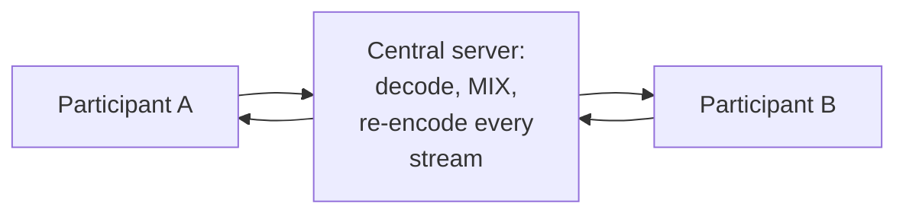

**Why it breaks:** fixing the bandwidth problem (v2's real improvement — each participant now only
sends once) comes at the cost of a massive server-side compute bill: decoding and re-encoding
every participant's stream for every meeting, continuously, is expensive to scale, and also adds
real processing latency from the decode/re-encode round-trip.

**v3 — the real system: an SFU that forwards without transcoding, using simulcast:**

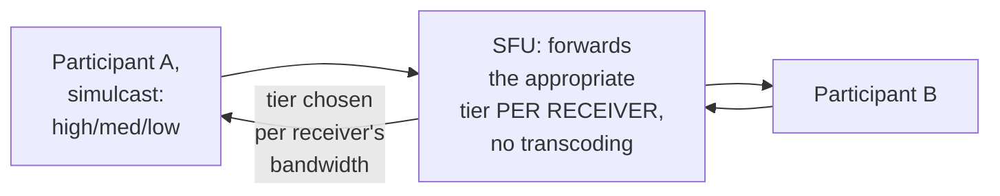

**What v3 fixes, one line each:** the SFU (like the MCU) means every participant sends only once,
fixing mesh's bandwidth problem; but unlike an MCU, it never decodes or re-encodes anything — it
simply forwards whichever pre-encoded simulcast tier suits each receiver, keeping server-side
compute cost far lower than transcoding while still enabling per-receiver quality adaptation.

---

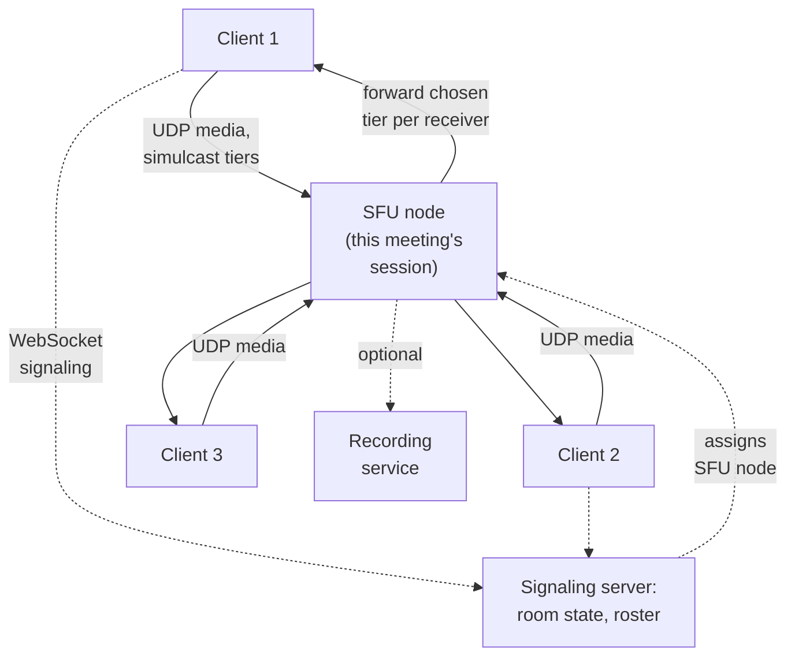

| Component | Role |
|---|---|
| Signaling server | Manages room membership and control-plane events over a reliable channel, assigns each session to an SFU node |
| SFU node | Forwards media between participants in one session, selecting per-receiver quality tier from simulcast, without transcoding |
| Recording service | Consumes forwarded (or dedicated) streams to produce a recorded artifact, a distinct downstream concern |

---

## End-to-end request walkthroughs

### Walkthrough 1 — a participant joins and starts exchanging media

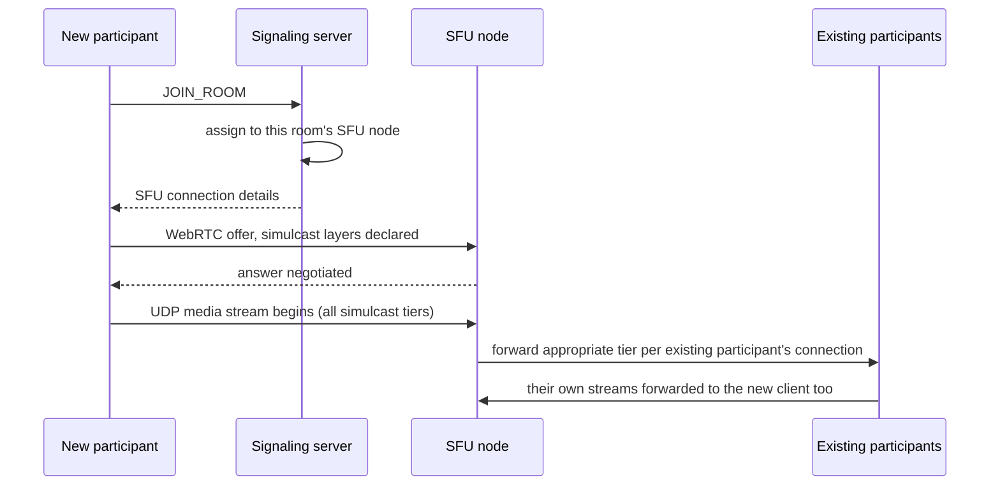

### Walkthrough 2 — a participant's connection degrades, quality adapts automatically

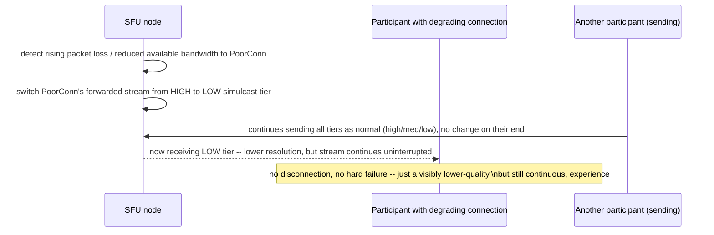

### Walkthrough 3 — signaling and media are independently affected by different failures

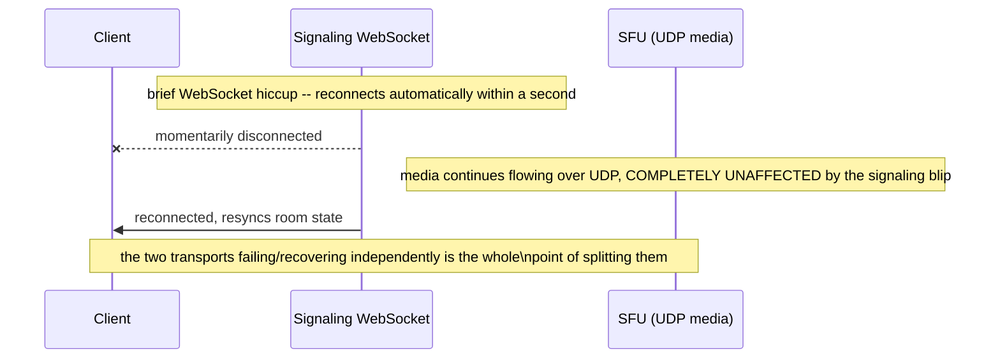

Walkthrough 3 makes the signaling/media split concrete — a control-plane hiccup and a media-plane
issue are genuinely independent failure domains.

---

## Deep dive: SFU vs. mesh vs. MCU

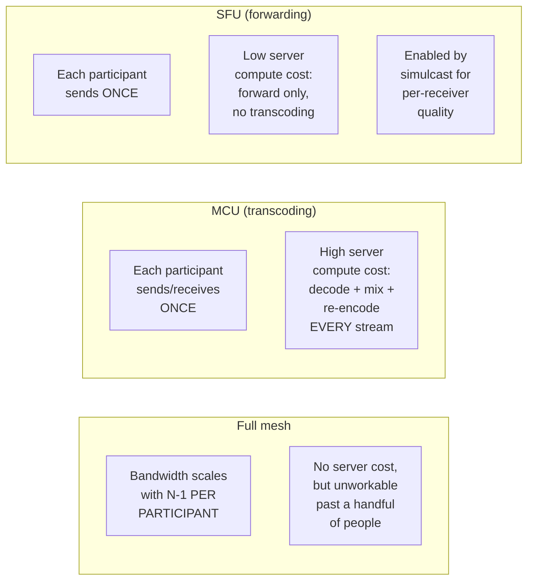

| | Mesh | MCU | SFU |
|---|---|---|---|
| Sender bandwidth | Scales with participants | Constant | Constant |
| Server compute cost | None | High (transcode every stream) | Low (forward only) |
| Per-receiver quality adaptation | Not applicable | Possible (server re-encodes per receiver) | Via simulcast (client pre-encodes tiers) |
| Real-world usage at scale | Rare beyond a handful of participants | Used for special cases needing server-side mixing (e.g. a single combined recording) | The near-universal default for live conferencing |

**Interview cheat-sheet:** *"Mesh fails on bandwidth, MCU fixes that but costs enormous server
compute for transcoding, and the SFU gets the bandwidth fix without the transcoding cost by
forwarding pre-encoded simulcast tiers instead of re-encoding anything server-side."*

---

## Deep dive: simulcast & adaptive quality

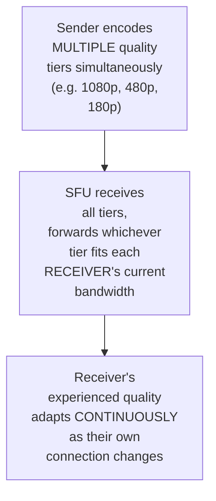

**Why simulcast (client encodes multiple tiers) rather than server-side transcoding (client sends
one tier, server converts as needed):** transcoding is exactly the expensive compute cost the SFU
architecture is designed to avoid — simulcast moves that cost to the client (which already has to
encode video anyway) and to a small amount of extra upload bandwidth, in exchange for the server
never needing to touch the media's actual content.

**Why quality must degrade continuously and automatically, not require manual intervention:**
network conditions change from second to second — a participant shouldn't need to notice
degraded quality and manually select a lower tier; the SFU monitoring each receiver's real-time
conditions and switching tiers automatically is what makes the experience tolerable without user
action.

**Interview cheat-sheet:** *"Simulcast moves the compute cost of multiple quality tiers to the
sender (who's already encoding anyway) instead of the server having to transcode — and tier
selection per receiver must be automatic and continuous, reacting to real-time network conditions,
not a manual setting."*

---

## Deep dive: signaling vs. media transport

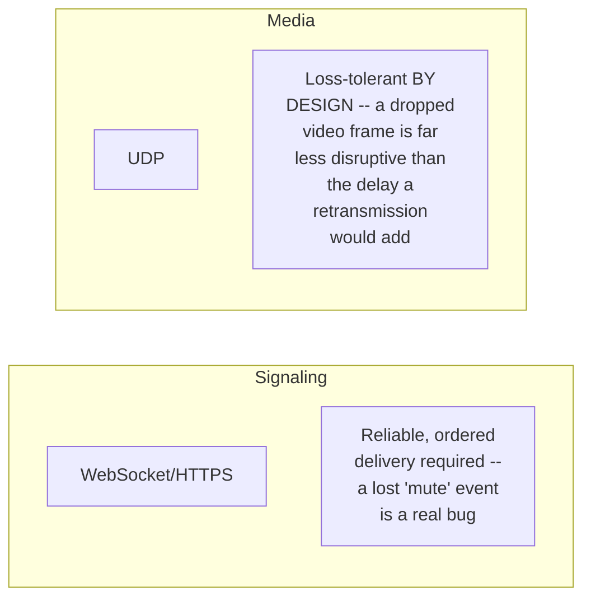

**Why media deliberately chooses to tolerate loss rather than guarantee delivery, the opposite
default from almost every other chapter in this course:** in a real-time media stream, a
retransmitted-and-late frame is often *worse* than simply skipping it and moving on — by the time
a lost packet could be retransmitted and arrive, the conversation has moved past that moment in
time; UDP's willingness to drop packets rather than delay everything behind them is the correct
trade-off specifically because of media's real-time nature.

**Interview cheat-sheet:** *"Signaling and media deliberately use different transports because
they have opposite reliability needs — signaling must not lose events, media must not be delayed
waiting to guarantee delivery of a frame that's already too late to matter by the time it could be
retransmitted."*

---

## Deep dive: global media routing

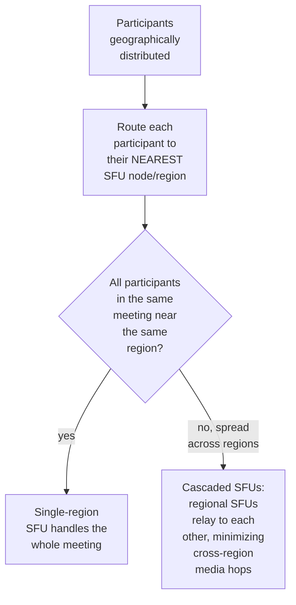

**Why this matters for latency, not just throughput:** media latency is cumulative across every
hop — a participant routed to a far-away SFU node adds real, perceptible delay to every other
participant's experience of them, which is why nearest-region routing (and cascading between
regional SFUs for geographically spread meetings) is a latency optimization, not just a
load-balancing one.

**Interview cheat-sheet:** *"Route each participant to their nearest SFU region for latency, and
for meetings spanning multiple regions, cascade between regional SFUs rather than forcing every
participant's media through one distant, shared node."*

---

## Data model

**Participant connection lifecycle:**

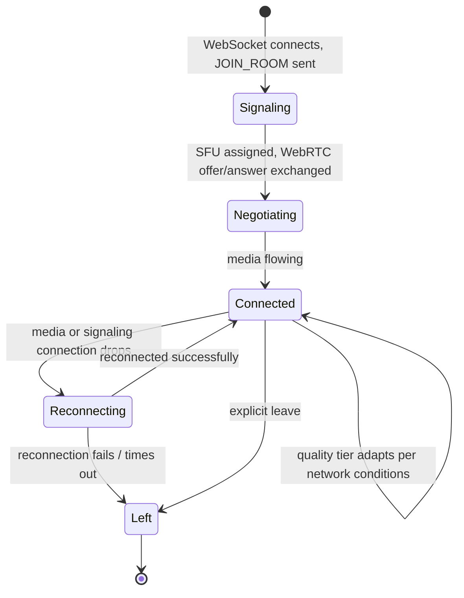

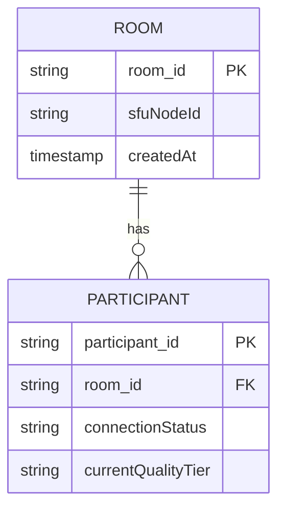

| Table | Storage choice & why |
|---|---|
| `Room` / `Participant` | Small, session-scoped state — lives for the duration of a meeting, not a large persistent store |
| Media itself | Never persisted in this data model at all (unless recording is enabled) — it's a live, transient stream, not stored state |

---

## Failure modes & mitigations

| Failure mode | Impact | Mitigation |
|---|---|---|
| **An SFU node fails mid-meeting** | All participants on that node lose media | Failover to a new SFU node with rapid renegotiation, minimizing but not eliminating a brief interruption |
| **A participant is behind restrictive NAT/firewall** | Direct UDP connectivity may be blocked | Standard WebRTC NAT-traversal techniques (STUN/TURN relay servers) as a fallback path |
| **Severe, sustained packet loss for one participant** | Even the lowest simulcast tier may not be deliverable smoothly | Graceful degradation to audio-only if video becomes untenable, rather than dropping the participant entirely |
| **Signaling server outage** | New joins/control-plane events fail, but existing media connections are unaffected | The signaling/media split (per its own deep dive) means this failure mode doesn't take down in-progress meetings, only new state changes |

---

## Non-functional walkthrough

**Scaling SFU capacity is sharded by session/meeting** — each meeting's forwarding load is
independent of every other meeting's, making horizontal scaling straightforward by adding more
SFU node capacity as concurrent-meeting count grows.

**Availability of in-progress media should be resilient to signaling-layer issues** — per the
signaling/media split, a control-plane hiccup should never interrupt already-flowing media.

**Consistency requirements are minimal for the media stream itself** (it's inherently a lossy,
best-effort real-time signal) but **strict for signaling state** (room membership, mute status) —
two very different consistency bars within one system, unusual relative to most other chapters in
this course.

---

## Security & compliance

- **Media encryption** (SRTP for the media streams, standard in WebRTC) is table-stakes, worth
  naming briefly rather than dwelling on.
- **Recording consent and retention** is a real regulatory concern in many jurisdictions (recording
  a conversation without informing participants can be illegal) — worth naming if the interviewer
  probes the recording feature specifically.
- **Access control on room joining** (waiting rooms, passcodes, host approval) prevents
  unauthorized participants from joining a meeting, a real, practical security feature distinct
  from the media-transport security above.

---

## Cost & trade-offs

**SFU forwarding trades some receiver bandwidth (downloading from every other participant) for
avoiding the MCU's expensive server-side transcoding** — the dominant, near-universal choice given
how much cheaper forwarding is than transcoding at scale.

**Simulcast trades sender-side compute/bandwidth (encoding multiple tiers) for the SFU never
needing to touch media content** — worth naming as the explicit trade being made, since it moves
cost from the (few, shared) server infrastructure to the (many, individually smaller) client
devices.

---

## Wrap-up: MVP vs. stretch

**In scope for an MVP:**
- SFU-based media routing with a single quality tier (defer simulcast).
- WebSocket-based signaling for room/participant state.
- Basic NAT traversal (STUN, with TURN relay fallback).

**Explicitly out of scope for an MVP:**
- Simulcast/adaptive quality — start with one fixed quality tier, add multi-tier simulcast once
  network-condition variance across real users demonstrates the need.
- Cross-region SFU cascading — start with single-region deployment, add cascading once
  geographically-distributed meetings are a confirmed, common case.

**Stretch goals, worth naming if asked "what's next":**
1. **Simulcast and continuous adaptive quality**, per its own deep dive.
2. **Cross-region SFU cascading** for geographically distributed large meetings.
3. **Server-side recording and transcription**, layering an MCU-like or dedicated
   consumption pipeline on top of the SFU's forwarded (or a dedicated) stream, without changing
   the live-routing architecture itself.

---

## Golden rules

- **The SFU is the near-universal answer to how media flows at more than a handful of
  participants** — know why it beats both mesh (bandwidth) and MCU (compute cost), not just that
  it's the answer.
- **Simulcast moves multi-quality-tier cost to the sender, avoiding server-side transcoding
  entirely** — the mechanism that makes per-receiver adaptive quality affordable at scale.
- **Signaling and media are deliberately different transports with opposite reliability
  needs** — reliable/ordered for signaling, loss-tolerant UDP for media, and conflating them is a
  real design error, not just an implementation detail.
- **Quality degrades continuously and automatically, never via a hard pass/fail** — this is a
  fundamentally different failure mode from most binary success/reject systems elsewhere in this
  course.
- **Route by geography for latency, and cascade between regional SFUs for spread-out meetings** —
  media latency is cumulative per hop.

---

## Master cheat sheet

**One-liners:**
- Full mesh fails on bandwidth (scales with N-1 per participant); an SFU fixes that by having
  every participant send once and forwarding selectively, without an MCU's expensive
  server-side transcoding.
- Simulcast lets the SFU adapt quality per receiver without ever touching media content — the
  sender encodes multiple tiers, the server just picks which to forward.
- Signaling (reliable, WebSocket) and media (loss-tolerant, UDP) are deliberately different
  transports — the opposite default reliability trade-off from most other systems in this course.
- Quality degrades continuously and automatically as network conditions change — never a hard
  connect/disconnect binary.
- Route participants to their nearest SFU region and cascade between regions for
  geographically-spread meetings, since media latency compounds per hop.

**Formula chain:**
```
mesh_upload_bandwidth_per_participant  = (N - 1) x per_stream_bandwidth
sfu_upload_bandwidth_per_participant     = per_stream_bandwidth   [constant, independent of N]
sfu_download_bandwidth_per_participant   = (N - 1) x per_stream_bandwidth   [still scales, but
                                             download capacity is typically more available]
```

**Numbers:** full-mesh bandwidth becomes impractical well before typical meeting sizes (well
under a dozen participants on typical consumer upload bandwidth) · SFU upload cost per
participant stays constant regardless of meeting size, the core reason it's the standard choice ·
simulcast commonly encodes ~3 quality tiers simultaneously, trading sender-side compute/bandwidth
for zero server-side transcoding cost.
