# Design a Content Moderation System — The Story (narrative edition)

> **What this file is.** The reference file, `78-Design-a-Content-Moderation-System-FAANG-Guide.md`, is the one to recite from — requirements, API shapes, every trade-off table, the master cheat sheet. This file is a second way in: the same material as one continuous story, told in plain language. Engineers at a company keep hitting a wall, patch it, and the patch itself creates the next wall — until we land on the exact same design the reference file documents. The company, **Glimmr** (a short-video social app), is fictional. But every wall it hits, and every fix it reaches for, is something a real, named system actually does: Facebook's documented reliance on tens of thousands of contracted human moderators (reported in depth by Casey Newton's 2019 investigation "The Trauma Floor" in The Verge), the real Selena Scola v. Facebook lawsuit over moderator PTSD (settled in 2020 for $52 million, widely reported), and PhotoDNA — the real, industry-wide perceptual-hashing system Microsoft built in 2009 with Dartmouth professor Hany Farid to catch known child-exploitation images, donated to NCMEC and used across the industry. I'll say clearly, every time, whether something is a documented fact or just a reasonable, labeled guess.

**The trigger phrases** for this whole topic: *"design a content moderation system for a social app,"* *"how do we catch harmful content before it goes viral,"* or *"how do we filter uploads in real time without slowing everyone down."* Keep one sentence in your head as you read: **every single upload needs a decision — allow it, block it, or send it to a person — and the entire design is about which of those three happens fast, which happens slow, and who (or what) gets to make the call.** Everything below is just this one idea, getting harder in small, honest steps.

---

## Chapter 1 — The complaint box that only opens after the room's already full of smoke

It's Glimmr's first year. About 50,000 videos get uploaded a day. The entire moderation system is one sentence: **wait for someone to report a video, then a human looks at it.** There's a "report" button under every video, and a small on-call team checks the report queue a few times a day. Nobody's worried — most videos are cooking clips and dance trends, and reports trickle in slowly.

One Tuesday, a video showing a violent assault gets posted at 9:00 a.m. Nobody reports it right away — the people who see it either scroll past or don't think to hit "report" first. By the time the first report lands, at 3:40 p.m., the video has already been recommended into **1.8 million people's feeds** `[illustrative — a stand-in number for "goes viral before anyone flags it," not a real Glimmr incident]`. A moderator finally looks at it at 4:15 p.m. and removes it in under a minute. The removal itself is fast. The problem is everything that happened *before* someone thought to click "report."

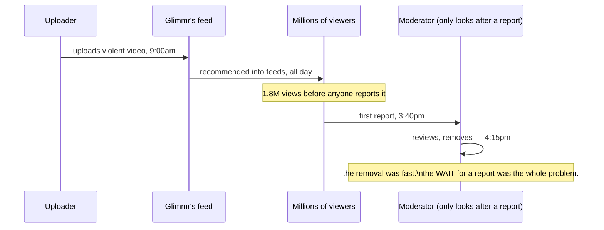

The obvious question: *why does the system do nothing at all until a human bystander happens to notice and click a button?* Because "moderation" here isn't actually a system — it's a mailbox. Nothing looks at a video the moment it's uploaded; something only looks at it after a stranger volunteers to flag it, and strangers are slow, distracted, and inconsistent about what they bother to flag.

**The fix, and the first analogy for the rest of this story:** think of Glimmr's moderation as **a building's fire-safety system.** Report-only moderation is a building with **no smoke detectors at all** — just a phone number on the wall that says "if you smell smoke, call this number." It works, eventually, but only after the fire's already spread far enough for someone to notice and dial. The fix isn't "get better at answering the phone faster" — it's putting detectors in the building that notice the fire themselves, before a tenant has to.

**New problem, immediately:** Glimmr can't put a detector in every room overnight. Building any kind of automated detection takes months. In the meantime, the honest first move is just: **hire people to watch faster.** So that's what they try next — and it works for a while, and then it doesn't.

**How I'd say this in an interview:** "Purely reactive, report-based moderation isn't really a moderation system — it's a mailbox that only gets checked after a stranger notices harm and volunteers to flag it. The core problem isn't review speed once something's flagged, it's that nothing looks at content the moment it's uploaded, so the worst content gets the most head start."

---

## Chapter 2 — Throwing more clerks at the complaint box

The fix: hire a dedicated review team and have them work the report queue continuously instead of a few times a day. Glimmr starts with 20 moderators. It works — average time-to-review for a reported video drops from hours to about 12 minutes `[illustrative]`.

Then Glimmr grows. Uploads go from 50,000/day to **2,000,000/day** over the following year — a real, unremarkable growth curve for a video app that starts getting traction. Reports scale roughly with uploads: more videos means more reported videos, even at the same report rate. With 20 moderators handling reports at, say, 150 reports/day each, the team's total capacity is **3,000 reports/day.** But at 2,000,000 uploads/day, even a small report rate produces far more than that — the queue starts growing every single day instead of draining. Within three weeks, the backlog hits **40,000 unreviewed reports**, and average time-to-review balloons from 12 minutes to **over 3 days**. A video that should've been pulled in minutes now sits live, fully visible, for days.

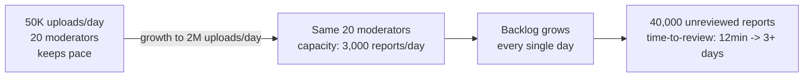

The obvious question: *just hire way more moderators, then — problem solved?* This is exactly the road real platforms have gone down, and it's real, well-documented territory: Facebook's content moderation workforce has been reported extensively — most famously in Casey Newton's 2019 investigation "The Trauma Floor" (The Verge) — to run into the **tens of thousands of human moderators**, many employed through outside contractors like Cognizant and Accenture, specifically to handle report and proactive-detection volume at global social-platform scale. So yes, hiring at scale is a real, documented part of the answer — it's just not the *whole* answer, and it comes with its own new, very real cost.

**The fix, staying inside this chapter's idea:** Glimmr scales its review team from 20 to 300, contracted through a vendor, the same operational pattern Facebook's real setup uses. Backlog drains back down. But now there's a second problem, and it isn't a capacity number — it's what the job actually does to the people doing it.

**How I'd say this in an interview:** "Scaling the human review team is a real, necessary part of the answer — it's exactly what Facebook has done at scale, with tens of thousands of contracted moderators, well documented in reporting like The Verge's 'Trauma Floor' investigation. But headcount alone doesn't fix the underlying issue: humans reviewing 100% of flagged content will always be racing against upload volume that grows faster than a review team can be hired and trained."

---

## Chapter 3 — The clerks start burning out

Glimmr's 300 moderators are now watching a real, unfiltered stream of whatever gets reported — which includes graphic violence, child exploitation material, self-harm content, and worse, all day, every day, because reports don't come pre-sorted by severity. This isn't a hypothetical cost. It's the exact, documented harm behind **Selena Scola v. Facebook** — a real lawsuit filed by a former Facebook content moderator, alleging she developed PTSD from the volume and severity of graphic content she was required to review. Facebook settled that case in 2020 for **$52 million**, covering thousands of current and former moderators, a settlement that was widely reported (Reuters, The Verge, NYT, among others) as direct compensation for psychological harm from the job itself.

Six months into Glimmr's 300-person team, exit interviews show the same pattern: moderators report symptoms consistent with secondary trauma, and turnover on the team is running at **around 40% annually** `[illustrative — a stand-in shaped by the real, documented pattern of high burnout/turnover in this industry, not a specific published Glimmr or Facebook figure]`. Every departure costs weeks of retraining, and a constantly-turning-over team makes decisions less consistently — the same video type gets judged differently depending on who's on shift that day.

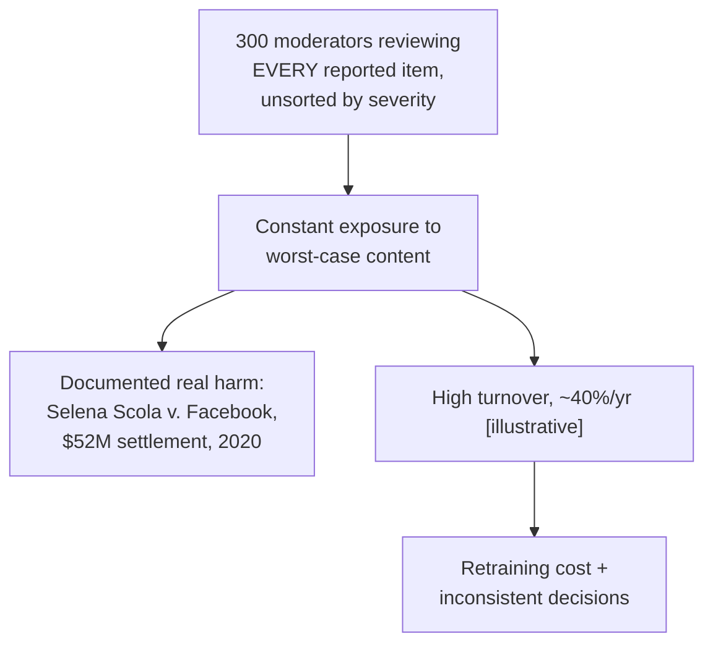

The obvious question: *is the fix here just "better mental-health support for moderators"?* That helps, and it's a real, necessary operational commitment — but it doesn't touch the root cause: humans are still the *first* line of defense, seeing every single reported item raw, with no pre-sorting and no automated help at all. The actual fix has to reduce how much of this volume a human ever has to see in the first place, especially the worst of it.

**The fix:** before any human looks at anything, run an automated check first. Some categories of harmful content are so well-defined and so severe that they don't need human judgment at all to catch — they need **matching**, not judgment. That's the next chapter.

**How I'd say this in an interview:** "Human review at scale has a real, documented human cost — the Selena Scola lawsuit and its $52 million settlement against Facebook is the concrete evidence this isn't a hypothetical concern. The fix isn't just support programs for reviewers, though those matter — it's reducing how much raw, worst-case content a human ever has to see first, by putting automated detection in front of them."

---

## Chapter 4 — The banned fingerprint list at the door

The fix: for the most severe, always-prohibited categories — most notably child sexual abuse material (CSAM) — the industry doesn't rely on a human judgment call at all. It relies on **PhotoDNA**, a real system Microsoft built in 2009 with Dartmouth professor Hany Farid. PhotoDNA converts a known illegal image into a **perceptual hash** — a fingerprint that stays roughly the same even if the image is resized, recompressed, or has minor edits — and checks new uploads against a database of hashes for images *already confirmed* illegal by organizations like NCMEC. Microsoft donated PhotoDNA industry-wide, and it's used across major platforms specifically because for this one category, there's no ambiguity to weigh — a match is a match, and the response is instant, automatic removal, no human judgment call needed.

**The analogy:** think of this as **a bouncer checking IDs against a banned list at the door.** The bouncer isn't judging whether someone *seems* like trouble tonight — they're comparing a fingerprint against a list of people already confirmed banned. Exact match, no ambiguity, instant decision, before the person ever gets inside.

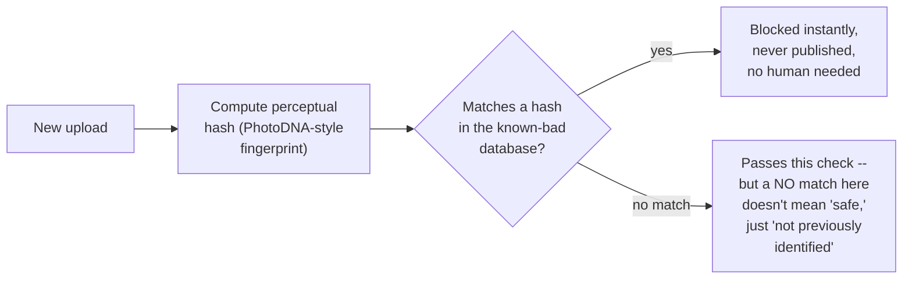

Glimmr wires this in as a pre-publish gate for its narrowest, most severe categories. It runs on every single upload, and it's fast — comparing a fingerprint against a database is cheap, nothing like running a full content analysis. Real number: it adds well under a second `[illustrative, but shaped by the real property that hash lookups are cheap]` to every upload, and it catches, on day one, several uploads matching already-known illegal content that would otherwise have gone live.

**New problem, and it's a structural one, not a bug:** the fingerprint list only knows about content **someone has already seen and confirmed as a violation before.** A brand-new piece of harmful content — one nobody has ever identified, hashed, and added to the list — produces **no match at all**, every time, no matter how clearly it violates policy. Fingerprint matching is airtight for re-uploads of known content and completely blind to anything novel. Glimmr's still exposed to the exact Chapter 1 problem, just for a narrower and more severe slice of content.

**How I'd say this in an interview:** "For a narrow set of the most severe, well-defined categories, you don't need a judgment call — you need matching. That's exactly what PhotoDNA does industry-wide for known CSAM: hash it, compare it, block on match, before anything publishes. But matching only catches what's already been seen and confirmed once before — anything genuinely new produces no match, which is exactly why this can't be the whole system."

---

## Chapter 5 — The detector that has to guess, not just match

The fix: for everything that isn't a known-fingerprint match, Glimmr needs something that can judge **brand-new** content on its own — not by comparing it to a list, but by predicting, probabilistically, whether it looks like a violation. This is a standard ML classification setup: a model trained on labeled examples of violating and non-violating content, scoring new uploads on how much they resemble the violating side.

**The analogy, and the one that carries the rest of this story:** think of this as **a smoke detector with a sensitivity dial**, sitting next to Chapter 4's fingerprint-list bouncer. The bouncer only recognizes faces already on a list. The smoke detector doesn't need to recognize anything specific — it senses a *pattern* (particles in the air) that's usually smoke, and it has a dial: turn sensitivity up, and it catches real fires sooner but also goes off from burnt toast; turn it down, and it stops false-alarming on toast but starts missing small real fires until they've grown.

Glimmr trains a classifier and turns the dial up first, prioritizing catching real violations (this is the model's **recall** — the fraction of actual violations it catches). Real number: at a high-recall setting, the model correctly flags the vast majority of true violations — but it also flags **8% of entirely legitimate uploads** as violations `[illustrative]`. At Glimmr's scale, 8% of 2,000,000 daily uploads is **160,000 legitimate videos wrongly flagged a day.** Creators whose normal content gets pulled start complaining loudly, and some of the loudest, most engaged creators leave the platform entirely over it.

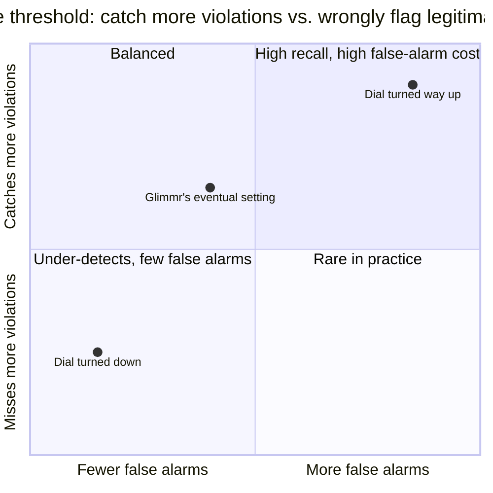

Glimmr turns the dial down to reduce false alarms. Now the wrongful-flag rate drops to a more tolerable 1%, but a follow-up audit finds the model is now missing **1 in 500 true violations it previously caught** `[illustrative]` — content that should've been blocked is passing through clean. This is the **precision/recall tradeoff**, and it's not a bug to be engineered away — it's an actual, permanent property of any probabilistic classifier: you cannot simultaneously maximize "catch everything real" (recall) and "never wrongly flag anything" (precision) with one fixed threshold. Every setting of the dial trades one against the other.

**New problem:** if there's no single "correct" dial setting, what happens to the uploads that land right in the *middle* — the ones the model itself isn't confident about either way? Right now Glimmr's system forces a binary choice at every threshold: allow or block, with no room for "I'm not sure." That's the actual next fix.

**How I'd say this in an interview:** "A probabilistic classifier is a smoke detector with a sensitivity dial, not a fingerprint match — there's no setting that catches every real violation without also false-alarming on legitimate content, and that's a structural fact about the tradeoff, not a tuning mistake. The real fix isn't finding the perfect dial position, it's admitting the model has a genuine 'not sure' zone and building a path for that zone specifically."

---

## Chapter 6 — Calling the fire marshal only when the detector isn't sure

The fix: stop treating the classifier's output as a binary allow/block. Treat it as a **confidence score**, and carve out three zones instead of two: high-confidence-clean gets auto-cleared, high-confidence-violation gets auto-removed, and everything **in between** — the genuinely borderline band — gets routed to a **human review queue.**

This is the crucial reframe: the human reviewer here isn't a backup for "whatever the model couldn't process in time" — they're a **genuine second opinion**, specifically for the cases where the model itself is uncertain. Continuing the fire analogy: this is **calling the fire marshal out specifically when the detector itself can't tell if it's smoke from a real fire or just steam from a shower** — not sending the fire marshal to check every single alarm that ever goes off, and not skipping the marshal entirely and trusting the detector's borderline reading blind either.

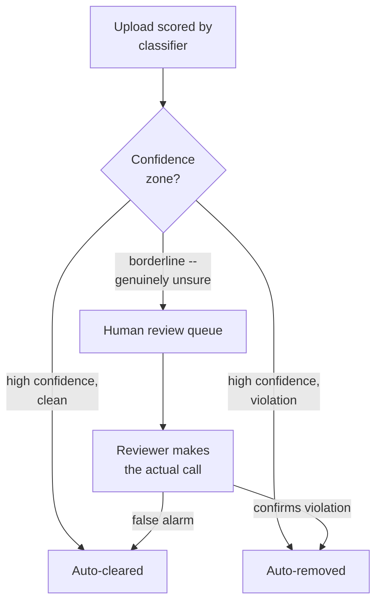

At Glimmr's 2,000,000 uploads/day, with the threshold tuned so **2% of uploads land in the borderline band**, that's 40,000 videos/day needing human eyes. At roughly 150 reviews/reviewer/day, that's about **267 reviewers** `[illustrative, following the same math shape as the guide's own worked capacity numbers]` — a real, computable headcount number, and a much smaller, much better-targeted team than "300 people reviewing every single raw report with no automated pre-sorting" from Chapter 3. The reviewers are also no longer seeing the *worst* raw content constantly — the clearest, most severe matches are already auto-removed by Chapters 4 and 5, so what reaches a human is specifically the ambiguous middle, not the floor of worst-case material.

**New problem:** this whole pipeline — fingerprint match, then full classification, then possible human review — currently runs **before** a video is allowed to publish, on every single upload. That was fine when Glimmr was small. At today's scale, running a full classification pass synchronously on every upload adds real, noticeable delay to every single post — including the 98% that are completely fine and don't need any of this waiting.

**How I'd say this in an interview:** "Confidence-based routing turns human review into a genuine check on the model's own uncertainty, not a dumping ground for overflow — reviewers see the ambiguous middle, not the raw firehose. That's also what makes the headcount number tractable: it scales with the size of the borderline band, which is a threshold you control, not with total upload volume."

---

## Chapter 7 — Checking everything before the doors open vs. checking while the show's already running

Concrete number: Glimmr's full pipeline — fingerprint check, multi-category classification, confidence routing — takes about **2.5 seconds** to run end to end for a typical video `[illustrative]`. Running that synchronously, before a creator's "Posted!" confirmation, on **every single upload**, adds 2.5 seconds of dead wait to every post — including the 97%+ that end up auto-cleared anyway. Creators notice. Post-upload complaints about "it just hangs after I hit post" start showing up in app store reviews.

The obvious question: *so just publish everything immediately and check it all afterward, async?* That flips the problem instead of solving it: now uploads are instant for everyone, but the narrow set of severe, always-prohibited categories — the ones Chapter 4's fingerprint match exists specifically to stop — get a window of being **live and visible**, even if only for the seconds it takes the async pipeline to catch up. For most content categories, a brief delay before detection is an acceptable cost. For the fingerprint-list categories, it genuinely is not — that's the entire reason that check exists as a hard, synchronous gate in the first place.

**The fix: split the timing, not the categories.** Keep the fingerprint check — fast, cheap, deterministic — running **synchronously**, before publish, on every upload, exactly as it already does. Everything else — the probabilistic classifier, the confidence routing, the human review queue — runs **asynchronously**, after the video is already published. This is the same shape as running a checkpoint at the door for a few very specific banned items, while the fuller inspection happens once the doors are already open and the show's running.

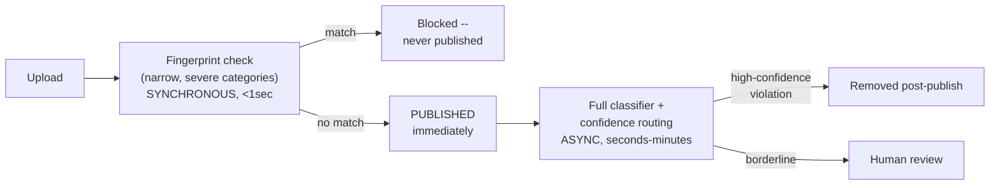

Redo the math: publish latency drops from 2.5 seconds to well under a second — just the fingerprint lookup — for every upload. The async classifier now has a much bigger time budget (seconds to low minutes instead of needing to finish before the "Posted!" screen), so it can afford to run more thorough, more expensive checks than it could ever have run synchronously. The tradeoff, stated honestly: everything **outside** the narrow fingerprint-list categories now has a brief live-exposure window before the async pipeline catches it — a real cost, accepted deliberately, in exchange for not making every single upload wait 2.5 seconds for the 97%+ of content that was always going to be fine.

**New problem:** the async classifier, when Glimmr looks closely at its false negatives, is missing violations specifically in videos with entirely fine-looking visuals — because it's only looking at video frames. It's ignoring the audio track and any on-screen text entirely.

**How I'd say this in an interview:** "The pre-publish versus post-publish split isn't 'fast vs. slow moderation' — it's scoping the synchronous, publish-blocking check down to only the categories where even a few seconds of live exposure is unacceptable, and letting everything else publish immediately with a more thorough async check behind it. Trying to run the full pipeline synchronously on every upload just moves the pain from 'harmful content briefly live' to 'every legitimate upload feels slow,' and neither extreme is actually the right call."

---

## Chapter 8 — The video that sounds guilty but looks innocent

A specific case surfaces: a video with completely benign visuals — someone just talking to camera — gets reported by users, but Glimmr's video-frame classifier scores it low-risk and clears it automatically. A human eventually watches it start to finish (because of a repeated-report signal, not the classifier) and finds the actual violation is entirely in the **audio track** — hateful language spoken over otherwise unremarkable footage. The video-only classifier had no way to catch this: it was never looking at sound in the first place.

The obvious question: *do we just add an audio classifier next to the video one and take the max of the two scores?* Almost — but a single "video was clean, audio was bad" case reveals something more specific worth preserving: **which** modality drove the flag. A model that only outputs one combined number ("overall risk: 0.6") throws away exactly the information a human reviewer would need to investigate efficiently.

**The fix:** classify each modality — video frames, audio track, on-screen/captioned text — **independently**, with its own dedicated model, then aggregate the scores into one decision **while keeping each modality's score visible.**

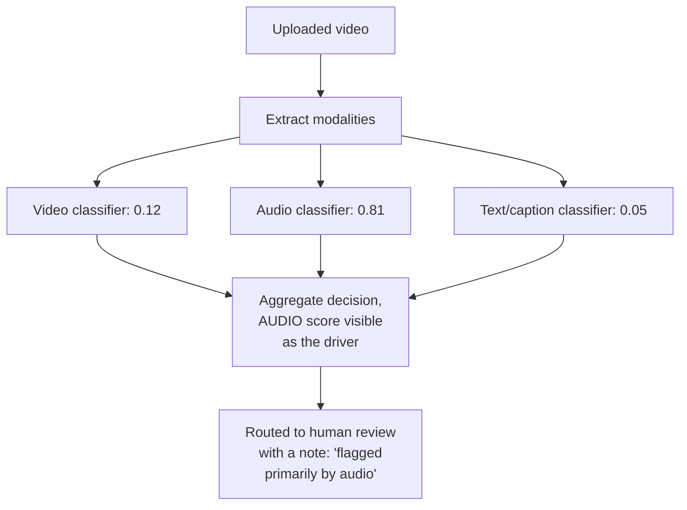

Worked example from this exact case: video score 0.12 (fine), audio score 0.81 (concerning), text score 0.05 (fine). The aggregate confidence, driven almost entirely by the audio signal, lands in the borderline band and routes to a human reviewer — and now that reviewer sees "flagged by audio" up front and can go **straight to listening**, instead of re-watching the whole clip from scratch with no idea what to look for. Review time for these cases drops meaningfully once reviewers aren't guessing where the problem might be.

**New problem:** multi-modal classification closes a real detection gap, but it doesn't touch what happens when the system gets it **wrong in the other direction** — a legitimate creator whose completely fine content gets caught by one of these classifiers anyway (Chapter 5's 1% residual false-positive rate didn't go away, it's just smaller now). Right now, when that happens, the creator gets a notification that just says "removed for violating community guidelines." Nothing more.

**How I'd say this in an interview:** "A video isn't one thing to classify — video, audio, and on-screen text can each independently carry a violation the others don't, so you classify each modality separately and aggregate, but you have to preserve which modality drove the flag. Otherwise a human reviewer gets a single opaque number and has to re-investigate the entire piece of content blind, which defeats a lot of the point of routing it to them in the first place."

---

## Chapter 9 — The takedown with no explanation

A Glimmr creator with 400,000 followers gets a video removed with the notification: *"This content violates our Community Guidelines."* No category, no reason, no specific clip timestamp. The creator has no idea what they supposedly did wrong, and no real way to contest it beyond a generic "I disagree" button that a support contractor rubber-stamps closed within a day, using the exact same review pass that made the original call.

The obvious question: *is a bare "violates guidelines" notice actually a problem, or just an unfortunate but acceptable cost of scale?* It's a real problem, and not just for creator goodwill: a creator can't meaningfully appeal a decision they don't understand, and a review process that re-checks its own decision, with the same information and often the same reviewer, has very little chance of actually catching its own mistake. Both platforms and courts have leaned on this exact reasoning — this is why real platforms' transparency reports (YouTube and TikTok both publish these on a recurring basis, a well-documented industry norm) break out both **removal counts and reinstatement-on-appeal counts** separately: reinstatement rate is effectively an admission rate for how often the first call was wrong.

**The fix, two parts.** First, every removal notice states a **specific reason** — which policy category, and ideally which modality/timestamp drove the flag (Chapter 8's attribution data makes this possible to actually populate honestly, not just invent after the fact). Second, appeals route to an **independent** reviewer or process — someone who wasn't part of the original decision — so there's a genuine second look, not a rubber stamp of the first one.

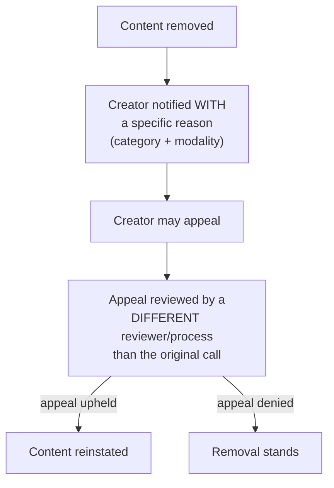

Glimmr rolls this out and, in the first month, finds its appeal-upheld rate on independently-reviewed appeals sits around **9%** `[illustrative]` — meaningfully higher than the rate under the old same-reviewer process, which is exactly the signal that an independent second look catches genuine mistakes the first pass didn't.

**New problem:** giving every borderline case a specific reason and an independent appeals path is the right call, but it isn't free — it means a second, dedicated pool of reviewers, and it competes for headcount against the primary review queue from Chapter 6. Glimmr now has to plan staffing for *two* review functions, not one, and both scale with the same underlying dial: the confidence threshold.

**How I'd say this in an interview:** "Every takedown needs a specific, actionable reason — a bare 'violates guidelines' notice makes appeal meaningless before it even starts. And appeals should route to an independent reviewer where feasible, because a process that only ever re-confirms its own original call provides almost no real check on error, which is exactly why platforms track appeal-reinstatement rates separately in their transparency reporting."

---

## Chapter 10 — The dial that decides how many people you need to hire

Zoom out to where Glimmr actually lands, at real scale: **20,000,000 uploads/day**, the same order of magnitude the reference guide uses for its own worked capacity numbers. At peak, that's roughly **1,000 uploads/sec.** Every single one gets Chapter 4's fingerprint check synchronously, at well under a second added latency each. Every single one also gets Chapter 6/7/8's async multi-modal classification behind it.

The funnel, worked all the way through:

```
Auto-cleared (high-confidence, clean)      = 97% of uploads  = 19,400,000/day
Auto-removed (high-confidence violation)   =  1% of uploads  =    200,000/day
Routed to human review (borderline)        =  2% of uploads  =    400,000/day
```

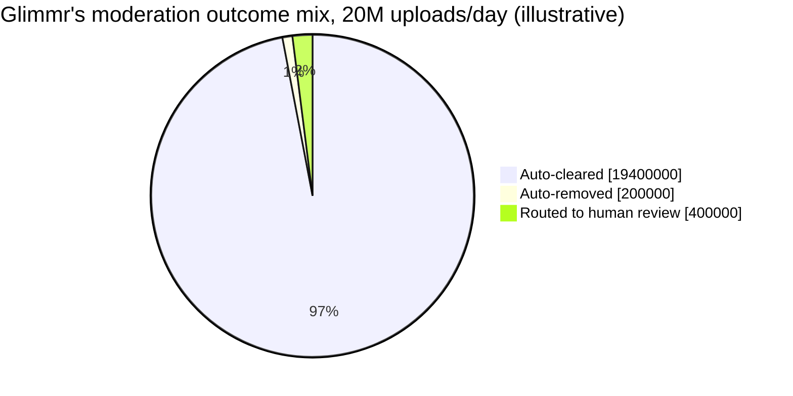

At roughly 300 reviews/reviewer/day, that 400,000/day review queue needs about **1,300 reviewers** — a real, direct, computable number, not a rough guess. And this is the chapter that ties every earlier fix into one economic fact: **that 2% threshold is a dial, and every earlier chapter's dial-turning shows up here as a headcount line item.** Turn the confidence threshold to route more borderline content to review (to reduce Chapter 5's false negatives), and review volume — and reviewer headcount — scale up proportionally. Turn it the other way to save headcount, and more genuinely borderline content gets auto-decided by the model with no human check at all, quietly reintroducing Chapter 5's precision/recall cost.

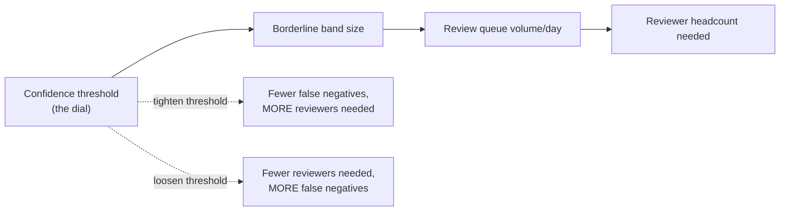

**The number worth memorizing:** the pre-publish fingerprint gate stays cheap specifically because it's narrow and deterministic — a lookup, not a judgment call. The moment anyone proposes widening it to cover more categories "since it's already fast," the honest answer is that broader coverage means probabilistic judgment, not lookup, and probabilistic judgment doesn't run cheaply enough to sit synchronously in front of every single upload without bringing back Chapter 7's latency problem. This is where Glimmr's system actually sits today, and it's the same shape the reference guide's own architecture lands on.

**How I'd say this in an interview:** "Every fix in this story eventually shows up as a number on this one funnel — the confidence threshold isn't just a modeling knob, it's a direct, computable driver of reviewer headcount. A platform this size needs on the order of a thousand-plus reviewers specifically because a low single-digit percentage of a huge volume is still a huge absolute number, and that's the concrete economics behind why the threshold gets tuned deliberately, not left at whatever the model defaults to."

---

## Chapter 11 — The banned list that has to keep growing, and the queue that has to keep breathing

Two more failures show up once Glimmr's system has been running for a year, and neither is fixed by anything already built — they're **operational**, not architectural, problems.

**First:** a coordinated group of uploaders starts posting a severe-category violation with a single pixel altered in the corner of every frame — just enough to change the perceptual hash slightly. A handful of these slip past Chapter 4's fingerprint check entirely, because the hash genuinely doesn't match anything on the known-bad list; nobody had ever seen or confirmed *this specific* variant before. The obvious question: *is the fingerprint check broken?* No — it's doing exactly what it was built to do, matching known content. What's missing is a **process**: someone has to notice the new variant, confirm it, hash it, and add it to the list, on an ongoing basis, forever. This isn't a one-time build — it's a standing team-and-tooling commitment, the same way real platforms continuously expand their known-hash databases as new evasion patterns surface.

**Second, separately:** during a slow news week with an unusual spike in newsworthy uploads, Glimmr's human review queue backs up **faster than reviewers can drain it** — the borderline-band volume briefly spikes to 3x normal. Nothing crashes, but content sits in the "under review" state for hours instead of the usual 20-30 minutes, meaning both possible harms (something bad staying visible longer, or something fine staying wrongly hidden longer) get worse at the same time. The fix isn't a bigger permanent team sized for the worst day of the year — that's expensive idle capacity almost always. It's treating **queue depth itself as a first-class, alerted metric**, with Chapter 10's confidence threshold as the deliberate release valve: loosen it temporarily during a spike (accepting a few more false negatives) rather than letting the queue silently balloon unnoticed.

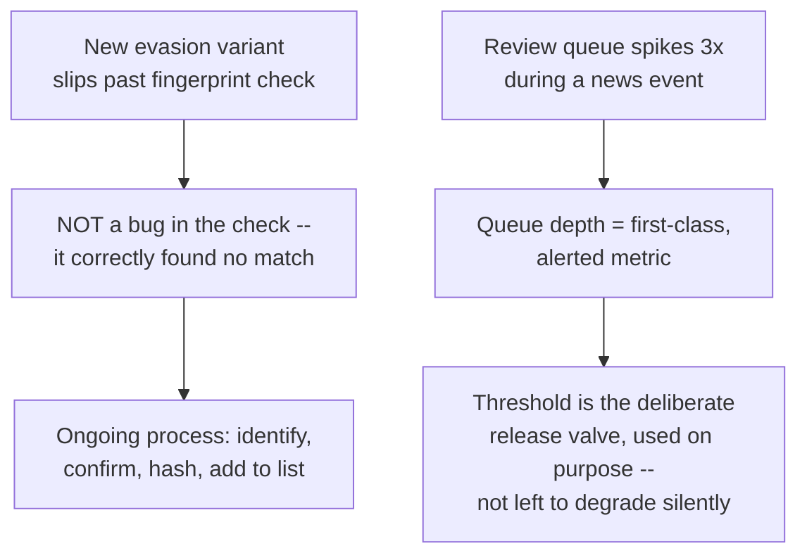

Both failures share the same lesson: a moderation system isn't a project that finishes — the fingerprint list, the classifier, and the threshold all need **someone watching them and adjusting on purpose**, continuously, or the system quietly drifts back toward the exact gaps earlier chapters closed.

**How I'd say this in an interview:** "Two failure modes show up once the architecture itself is done: evasion of the known-content list, which isn't a bug but a sign the list needs a permanent update process, and review-queue backlogs during volume spikes, which you handle by watching queue depth as a first-class metric and using the confidence threshold as a deliberate, temporary release valve. Both are reminders that this system needs ongoing operational ownership, not just a good initial design."

---

## Where the story actually lands

```mermaid
flowchart LR
    A["Ch1: report-only\n(waits for a stranger to flag it)"] -->|"fixes: someone eventually looks\nbreaks: can't keep pace with growth"| B["Ch2: bigger human team"]
    B -->|"fixes: backlog drains\nbreaks: real psychological toll"| C["Ch3: burnout, turnover"]
    C -->|"fixes: nothing yet -- root cause is exposure volume"| D["Ch4: fingerprint match\n(PhotoDNA-style)"]
    D -->|"fixes: known-bad content, instantly\nbreaks: blind to anything novel"| E["Ch5: probabilistic classifier"]
    E -->|"fixes: catches novel content\nbreaks: precision/recall tradeoff, no 'unsure' path"| F["Ch6: confidence-threshold routing"]
    F -->|"fixes: human review = real 2nd opinion\nbreaks: full pipeline sync = slow uploads"| G["Ch7: pre-publish/async split"]
    G -->|"fixes: fast uploads, narrow hard gate\nbreaks: single-modality blind spots"| H["Ch8: multi-modal + attribution"]
    H -->|"fixes: catches audio-only violations\nbreaks: opaque takedowns, no appeal path"| I["Ch9: reasons + independent appeals"]
    I -->|"fixes: real 2nd opinion on removals\nbreaks: threshold IS a headcount lever"| J["Ch10: threshold-to-headcount economics"]
    J -->|"fixes: predictable headcount math\nbreaks: evasion + volume spikes are ongoing, not one-time"| K["Ch11: evasion updates + queue-depth monitoring"]
```

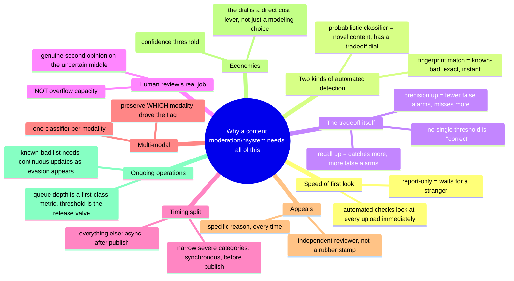

Every real content moderation system you'll design in an interview sits somewhere on this chain. A smaller product with lower stakes might reasonably stop around Chapter 6. A platform handling CSAM-adjacent risk or legal takedown obligations has to reach Chapter 4, 7, 9, and 10, and any platform running this in production for real eventually lives in Chapter 11's operational reality. If the interviewer hasn't asked about appeals or reviewer economics, walking all the way to Chapter 10 or 11 unprompted reads as padding, not depth — follow where the questions actually point.

---

## Grill me — adversarial follow-ups

**Q1: "Why not just run the full ML classifier synchronously on every upload instead of splitting it into a fast gate plus an async pass?"**
Because the full classifier is meaningfully more expensive than a fingerprint lookup — it's a judgment call across multiple modalities, not a database comparison — and paying that cost on 100% of uploads before anyone can publish adds real, noticeable latency to the 97%+ of content that was always going to be fine. Splitting the timing lets the cheap, deterministic check stay synchronous and pushes the expensive, probabilistic check to where its cost doesn't block anyone.

**Q2: "Isn't PhotoDNA's fingerprint match just security theater if it can't catch anything new?"**
No — it's doing exactly the one job it's suited for, extremely well: instantly and deterministically blocking re-uploads of content already confirmed illegal, with zero ambiguity and zero human judgment needed. It was never meant to catch novel content; that's the classifier's job, which is precisely why both exist side by side rather than one replacing the other.

**Q3: "If the confidence threshold controls both false positives and false negatives, how do you actually pick where to set it?"**
You set it against the cost you can least tolerate for the specific category, then staff the resulting review queue to match — for something like severe safety categories, you tune toward recall and accept a bigger review queue; for something like mild policy edge cases, you can tolerate more false negatives to keep the queue smaller. It's a deliberate, per-category business decision, not one global number.

**Q4: "Why route borderline cases to a human at all instead of just always taking the model's best guess?"**
Because 'best guess' at the threshold boundary is, by definition, the model's least confident output — that's exactly where it's most likely to be wrong in either direction. A human reviewer at that specific boundary catches both false positives and false negatives the model itself is telling you it isn't sure about, which a blind auto-decision would just silently get wrong at whatever rate the model's calibration implies.

**Q5: "Doesn't giving a specific removal reason just teach bad actors how to evade detection next time?"**
That's a real tension, and the practical answer is to give the creator enough specificity to make an appeal meaningful — category and rough basis — without publishing the exact model signals or thresholds that would let someone reverse-engineer the detector. It's the same balance content-moderation transparency reports strike: aggregate, categorized disclosure, not a debugging manual for evasion.

**Q6: "If independent-reviewer appeals are clearly better, why not make every single moderation decision go through two independent reviewers from the start?"**
Because that doubles review headcount for every single decision, not just the ones that get contested — and the appeals data shows only a fraction of removed content actually gets appealed. It's more efficient to have one reviewer make the initial call and reserve the second, independent opinion specifically for the subset that's contested, rather than paying the two-reviewer cost upfront on everything.

**Q7: "Your Chapter 8 fix adds three classifiers per video instead of one — doesn't that triple compute cost for a tripling of detection coverage you might not need?"**
It's a real cost increase, and the right move is scoping it to content types where it matters — a platform with audio and captions genuinely needs all three; a text-only platform doesn't need a video or audio classifier at all. The point isn't "always run every modality," it's "don't assume one modality's clean score means the content is clean" for whatever modalities the platform actually has.

**Q8: "What happens when a completely new content format shows up — say, live audio commentary over a video — that none of your existing classifiers were built to check?"**
That's a genuine blind spot until someone notices and builds coverage for it — multi-modal coverage has to be explicitly re-evaluated every time a new content format is introduced, not assumed to be automatically covered by whatever classifiers already exist. It's the same category of risk as Chapter 4's fingerprint list only knowing about previously-confirmed content: anything genuinely new starts out invisible to the system until it's specifically accounted for.

**Q9: "Given this whole story, if someone just says 'design a content moderation system' cold, where do you actually start?"**
Say the two things that shape everything downstream: which categories are severe enough that even brief live exposure is unacceptable, and what the tolerance is for false positives versus false negatives, because that second answer sets the confidence threshold, which sets the review queue size, which sets the headcount. Then walk forward from there — fingerprint matching for the narrow severe set, async multi-modal classification with confidence routing for everything else, human review as a genuine second opinion, and appeals as the honest check on the whole pipeline's mistakes.

**Q10: "Isn't the evasion problem in Chapter 11 basically unsolvable — bad actors will always find a way around a known-content list?"**
It's unsolvable in the sense that it never fully closes, but that doesn't make it not worth doing — it converts "we have zero automated coverage of this category" into "we have coverage that needs continuous updating," which is a completely different, much smaller ongoing problem. You pair it with the probabilistic classifier specifically because that layer doesn't depend on having seen a piece of content before, so it's the backstop for whatever the known-content list hasn't caught up to yet.

---

## Pacing note

**If this is 60 seconds inside a bigger question:** say the core split up front — a narrow, fast, deterministic gate for the small set of severe categories before publish, everything else publishes immediately with async, multi-modal classification and confidence-based human review behind it — then say "I'd go deeper on the precision/recall tradeoff or appeals if useful." That's the whole shape in one breath.

**If this is the whole 15-20 minute focus:** walk the chapters in order — why report-only moderation is too slow, scaling human review and its real cost, fingerprint matching for known-bad content, probabilistic classification and its unavoidable tradeoff, confidence-threshold routing to human review, the pre-publish/async timing split, multi-modal classification with attribution, appeals and the threshold-to-headcount economics, then the ongoing operational reality of evasion and queue-depth monitoring if time allows. Don't walk all eleven chapters unprompted — follow the interviewer's questions and use the skipped chapters as your "if I had more time" closer.

---

## Active recall — no answers, test yourself cold

1. What's the one-sentence reason purely reactive, report-based moderation fails at scale?
2. What real, documented cost does scaling a human review team run into, beyond just headcount?
3. What's the structural difference between what Chapter 4's fingerprint matching catches and what Chapter 5's classifier catches?
4. Why is there no single "correct" confidence threshold for a probabilistic classifier?
5. Why should human review be framed as a "second opinion," not an "overflow valve" — and what does that framing actually change?
6. Why does the pre-publish check need to stay narrow, instead of covering every policy category?
7. What breaks if you use one combined classifier for a whole video instead of one classifier per modality?
8. Why does an appeal reviewed by the same process that made the original call provide little real check on error?
9. Write the formula connecting confidence threshold, review volume, and reviewer headcount.
10. Why does broadening the pre-publish gate to more categories reintroduce Chapter 7's latency problem?
11. Why is a new evasion variant slipping past the fingerprint check not actually a bug in that check?
12. What's the deliberate, temporary fix for a human review queue that's backing up faster than reviewers can drain it?

*Spaced repetition: test this list today, again in 2-3 days, again in a week.*

---

## Cheat sheet — one line per stop on the story

- **Report-only moderation**: nothing looks at content until a stranger notices harm and clicks a button — the worst content gets the biggest head start.
- **Scaling human review**: real and necessary, but headcount alone races against upload growth and carries a real, documented psychological cost (Selena Scola v. Facebook, $52M settlement).
- **Fingerprint matching (PhotoDNA-style)**: exact-match lookup against known-bad content, instant and deterministic, for the narrowest, most severe categories — but blind to anything genuinely new.
- **Probabilistic classification**: a smoke detector with a sensitivity dial for novel content — the precision/recall tradeoff is structural, not a tuning mistake to be engineered away.
- **Confidence-threshold routing**: only the genuinely uncertain middle goes to a human — a real second opinion on the model's own uncertainty, not a dumping ground for overflow.
- **Pre-publish vs. async post-publish**: keep the synchronous, publish-blocking gate narrow and cheap (fingerprint match only); let the expensive, probabilistic check run async, after publish, for everything else.
- **Multi-modal classification**: classify video, audio, and text independently and aggregate — but keep which modality drove the flag visible, or a human reviewer is investigating blind.
- **Appeals**: every takedown needs a specific reason, and appeals should route to an independent reviewer — a rubber stamp of the original decision defeats the purpose of having an appeals process.
- **Threshold-to-headcount economics**: the confidence threshold is a direct, computable lever on reviewer headcount — tighten it to catch more violations, and the review queue (and the team needed to staff it) grows right along with it.
- **Ongoing operations**: the known-content list needs continuous updates as evasion patterns appear, and review-queue depth needs to be a first-class, alerted metric with the confidence threshold as a deliberate, temporary release valve during volume spikes — this system is never "done."
- **The meta-lesson**: every fix in this story buys one property (speed-of-first-look, catch-known-content, catch-novel-content, a genuine human check, fast publishing, multi-modal coverage, a real appeals check, headcount predictability, or operational resilience) by spending a different one — say the trade in the same sentence you propose the fix.
