# Design a Content Moderation System (TikTok-style) — FAANG Interview Guide

> Source chapter type: hybrid ML + human review at upload scale. Confirmed as a frequently asked
> TikTok interview question ("design a content moderation system... how would you scale it to
> detect and filter inappropriate content in real-time"), though — like the video-conferencing
> chapter — this topic is also thoroughly documented elsewhere already, included here for course
> completeness. Shares its ML-plus-rules hybrid-decision shape with
> [the Fraud Detection guide](./56-Design-a-Fraud-Detection-System-FAANG-Guide.md), but the content
> here is **user-generated media** (video/image/text), not transactions, which changes what "fast"
> means: some content must be checked **before** it's ever visible to anyone (pre-publish), while
> most can be checked **after** publishing, asynchronously — and getting that split wrong either
> makes every upload feel slow or lets harmful content go live before anyone's looked at it.

## Mental model

Millions of pieces of content are uploaded daily, and each one needs a moderation decision:
allow, remove, or route to a human reviewer. Like the fraud-detection chapter, this is a hybrid of
fast deterministic rules and probabilistic ML models — but three things make content moderation a
genuinely distinct problem:

1. **The pre-publish vs. post-publish decision is itself a design choice with real
   consequences.** Checking everything before it's visible (pre-publish) guarantees nothing
   harmful is ever seen, but adds real latency to every single upload, most of which are
   completely benign. Checking after publishing (post-publish, async) keeps uploads fast but means
   harmful content is live, even briefly, before removal. Most real systems use **both** — a fast,
   cheap pre-publish check for the most severe, clearly-classifiable content categories, and async
   review for everything else.
2. **Multi-modal content needs multi-modal classification.** A video isn't one thing to classify
   — it has visual frames, audio, and often on-screen or captioned text, each potentially needing
   a different model, and a decision has to synthesize signals across all of them, not just the
   easiest one to check.
3. **False positives and false negatives have asymmetric, but both severe, costs — in different
   directions than the fraud-detection chapter.** A false negative (harmful content stays up) is a
   trust/safety/legal failure; a false positive (legitimate content removed) is a creator-trust
   and free-expression failure. Unlike fraud detection, where the asymmetry clearly favors caution
   toward blocking, content moderation's two failure modes are both genuinely costly, which is
   exactly why the human-review layer exists as a real check on the ML system's own confidence
   thresholds, not just a scalability overflow valve.

**The one sentence to say out loud:** *"This is a hybrid ML-plus-human-review decision, like fraud
detection, but the pre-publish-versus-post-publish timing split is itself a real design
decision — check the small set of severe, clearly-classifiable categories before anything goes
live, and let everything else publish immediately with async review behind it."*

**The one picture to remember forever:**

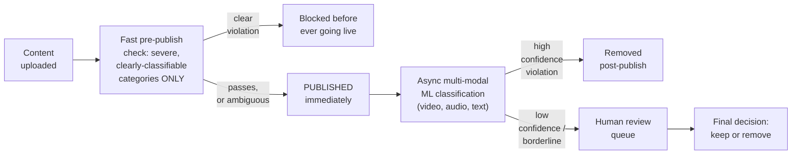

**Memory hook:** *"Pre-publish check only the small set of severe, easy-to-classify categories —
everything else publishes fast and gets checked async, with human review as a real check on ML
confidence, not just an overflow valve."*

---

## Table of contents
[How to Identify This Topic](#how-to-identify-this-topic-in-an-interview) ·
[Interview Playbook](#interview-playbook) · [Requirements](#requirements-clarification) ·
[Capacity Estimation](#capacity-estimation-worked) · [API Design](#api-design) ·
[High-Level Architecture](#high-level-architecture) ·
[Architecture Evolution v1→v2→v3](#architecture-evolution-v1--v2--v3) ·
[End-to-End Walkthroughs](#end-to-end-request-walkthroughs) ·
[Deep Dive: Pre-Publish vs. Post-Publish](#deep-dive-pre-publish-vs-post-publish) ·
[Deep Dive: Multi-Modal Classification](#deep-dive-multi-modal-classification) ·
[Deep Dive: The Human Review Queue as a Real Check](#deep-dive-the-human-review-queue-as-a-real-check) ·
[Deep Dive: Appeals & Reinstatement](#deep-dive-appeals--reinstatement) ·
[Data Model](#data-model) · [Failure Modes](#failure-modes--mitigations) ·
[Non-Functional Walkthrough](#non-functional-walkthrough) ·
[Security & Compliance](#security--compliance) · [Cost & Trade-offs](#cost--trade-offs) ·
[Wrap-Up](#wrap-up-mvp-vs-stretch) · [Golden Rules](#golden-rules) ·
[Cheat Sheet](#master-cheat-sheet)

---

## How to identify this topic in an interview

- "Design a content moderation system for [TikTok/a social platform/a UGC product]" — confirmed
  as a commonly asked TikTok-specific question.
- The tell that this is about the pre/post-publish timing split, not just "another ML-serving
  chapter": the interviewer emphasizes **real-time filtering** alongside **scale** — that
  combination means the timing decision (what's checked before vs. after going live) is the
  actual substance.
- A follow-up like "how do you handle a video with no clearly offensive frames but a hateful
  audio track" is the [multi-modal classification deep dive](#deep-dive-multi-modal-classification).

---

## Interview playbook

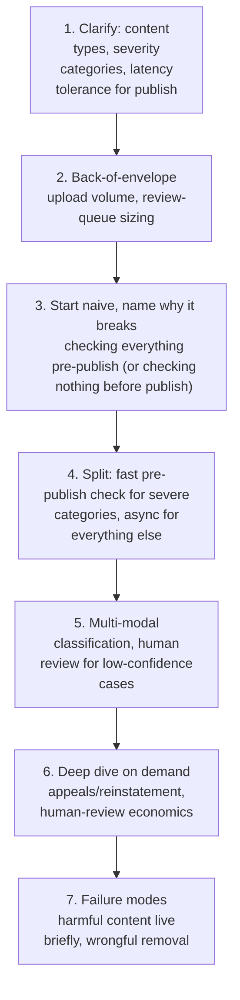

**What the interviewer is actually grading at each step:**
- Step 3: do you recognize, unprompted, that checking everything before publish adds latency to
  every benign upload, while checking nothing before publish lets the worst content go live
  first, however briefly — and that neither extreme is the real answer?
- Step 4: do you propose a specific, narrow set of severe categories for pre-publish checking
  (e.g. certain always-prohibited content types) rather than an all-or-nothing timing choice?
- Step 6: do you treat human review as a genuine second opinion on ML confidence, not just a
  capacity-overflow mechanism for whatever the model can't handle?

---

## Requirements clarification

### Functional

| # | Requirement | Notes |
|---|---|---|
| F1 | Classify uploaded content (video, image, text) against policy categories | The core function |
| F2 | Block a narrow set of severe-category violations before content is ever published | Pre-publish gating for the worst cases only |
| F3 | Asynchronously classify and act on everything else after publishing | Post-publish for the common case |
| F4 | Route low-confidence/borderline classifications to human reviewers | The ML-confidence-driven human-review trigger |
| F5 | Support an appeals process for content removed in error | A defined path back from a moderation decision |

### Non-functional

| Requirement | Target | Why this number |
|---|---|---|
| Pre-publish check latency | Very low, well under a second, for the narrow severe-category check only | This latency is added to every single upload's publish flow, so it must be minimal despite running synchronously |
| Post-publish detection latency | Seconds to minutes, acceptable for the broader category set | The async path can afford more thorough, slower analysis since it doesn't block publishing |
| False-negative tolerance (severe categories) | Near zero for the narrow pre-publish set | These are categories where any delay in detection is unacceptable, which is exactly why they're checked pre-publish at all |
| False-positive tolerance | Non-zero, but must be bounded — over-removal erodes creator trust at scale | The same three-way-decision reasoning as the sanctions-screening chapter, here balancing two genuinely costly failure directions |
| Human-review throughput | Must scale with review-queue volume, which is itself a function of ML-confidence threshold choices | The same headcount-cost-is-a-direct-function-of-threshold lesson as the sanctions-screening chapter |

**Clarifying questions worth asking the interviewer up front — and what each answer changes:**

| Question | If the answer is... | ...then this changes |
|---|---|---|
| "Which content categories are severe enough to require pre-publish blocking, versus async post-publish handling?" | A narrow, specific list (e.g. certain always-prohibited categories) | Confirms the pre/post-publish split's boundary, and that most content should NOT be pre-publish-gated |
| "What content modalities are in scope — video, image, text, audio, or all of them?" | All, for a video-centric platform | Confirms the multi-modal classification deep dive is central, not optional |
| "How is the ML-confidence threshold for human review determined?" | Tuned against review-team capacity | Confirms the same threshold-vs-headcount trade-off as the sanctions-screening chapter's review queue |
| "Is there a defined appeals process for creators?" | Yes | Confirms the appeals/reinstatement deep dive is in scope, not just a one-way removal decision |

**Say this out loud in the interview:** *"I don't want to make this an all-or-nothing timing
decision — a small, severe category set gets checked before anything publishes, and everything
else publishes immediately with asynchronous, multi-modal classification and human review behind
it. Treating every upload the same way, either all pre-publish or all post-publish, is the wrong
framing."*

---

## Capacity estimation, worked

```
Given (illustrative, a large video-sharing platform):
  Video uploads/day, globally                      = 20,000,000
  Peak upload QPS                                     = 20,000,000 / 86,400 ~= 230 average,
                                                          say ~1,000 QPS at peak

Pre-publish check load (narrow, severe-category set only):
  Applies to ALL uploads (a fast check runs on everything, just for a NARROW category set)
  Pre-publish checks/sec at peak                        = 1,000 QPS
  Illustrative check latency (lightweight model/
    rules, narrow category set)                           ~= 100-200ms
  -> a modest, tolerable added latency on the publish path, BECAUSE the check is narrow and
     fast -- if this same synchronous check tried to cover EVERY policy category, latency and
     compute cost would multiply well past what's acceptable pre-publish.

Post-publish async classification load:
  Applies to ALL uploads too, but asynchronously, with a much larger effective time budget
  Multi-modal classification cost per video (frames +
    audio + text/captions, several models)                 -- meaningfully more expensive than
                                                              the narrow pre-publish check, but
                                                              runs on its own schedule (seconds
                                                              to low minutes after publish), not
                                                              gating the user-visible publish flow

Human-review volume (illustrative funnel, similar shape to the sanctions-screening chapter):
  Auto-cleared (high-confidence, clearly fine)             = 97% of uploads
  Auto-removed (high-confidence violation)                  = 1%
  Routed to human review (low-confidence/borderline)         = 2%
  Review volume/day                                           = 20,000,000 x 0.02 = 400,000
  At, say, 300 reviews/reviewer/day, this requires             ~1,300 reviewers -- the SAME
  kind of direct, computable headcount-cost-from-threshold number as the sanctions-screening
  chapter, here for content review instead of transaction review.
```

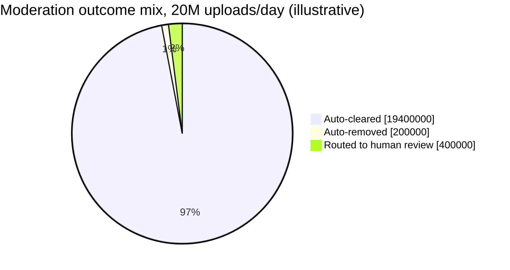

The review slice looks small next to auto-cleared, but at 20M uploads/day it's still 400,000
items — the concrete number behind the ~1,300-reviewer estimate.

**Redo-the-chain test:** if the human-review threshold is tightened (routing more borderline cases
to review to reduce false negatives), review volume and reviewer headcount scale up
proportionally — the identical trade-off shape as the sanctions-screening chapter's own threshold
economics.

**The number worth memorizing:** the pre-publish check must stay narrow (a small category set)
specifically to keep its added latency tolerable on every single upload — broadening it to cover
every policy category would make the synchronous publish-path cost unacceptable, which is why the
async post-publish path exists for everything else.

---

## API design

### `POST /v1/content/upload` (triggers the pre-publish check inline)

```json
{ "contentId": "vid_881", "uploaderId": "creator_44821", "mediaUrl": "..." }
```

Response:
```json
{ "contentId": "vid_881", "status": "PUBLISHED", "prePublishCheckPassed": true }
```
or:
```json
{ "contentId": "vid_881", "status": "BLOCKED", "reason": "SEVERE_CATEGORY_VIOLATION" }
```

### Async classification result (internal, post-publish)

```json
{
  "contentId": "vid_881",
  "modalityScores": { "video": 0.12, "audio": 0.81, "text": 0.05 },
  "aggregateConfidence": 0.81,
  "decision": "ROUTE_TO_REVIEW"
}
```

### `POST /v1/moderation/{contentId}/appeal`

```json
{ "creatorId": "creator_44821", "statement": "This content does not violate policy because..." }
```

| Field | Notes |
|---|---|
| `modalityScores` | Exposed per-modality, not just one aggregate number — a video flagged primarily by its audio track needs that distinction visible for both human reviewers and later analysis, per the multi-modal deep dive |
| `prePublishCheckPassed` | Distinct from the final moderation status — content can pass the narrow pre-publish check and still be removed later by the async pipeline |

**The one sentence worth saying about the API surface:** *"`PUBLISHED` from the upload endpoint
only reflects the narrow pre-publish check passing — it's explicitly not a final moderation
verdict, since the async, multi-modal classification and possible human review still run
afterward."*

---

## High-level architecture

### Architecture evolution (v1 → v2 → v3)

**v1 — check everything before publishing:**

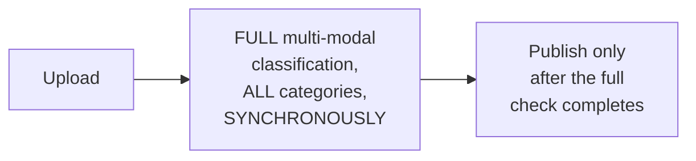

**Why it breaks:** running full multi-modal classification (video, audio, text, across every
policy category) synchronously on every upload adds real, unacceptable latency to the vast
majority of uploads that are completely benign — per the capacity estimate, this kind of
classification is meaningfully more expensive than the narrow pre-publish check, and paying that
cost on 100% of uploads before anyone can publish is a poor trade for the small fraction that
actually needs it.

**v2 — publish immediately, check everything asynchronously, no pre-publish gate at all:**

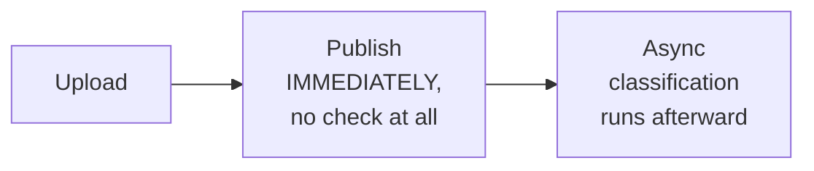

**Why it breaks:** publishing is now fast for everyone (v2's real improvement over v1's latency
problem). But for the narrow set of severe-category violations, even a brief window of being
live before async detection catches it is unacceptable — some content categories genuinely
cannot be allowed to appear publicly at all, even for seconds.

**v3 — the real system: narrow, fast pre-publish gate + async everything else:**

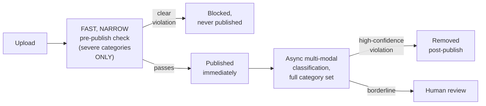

**What v3 fixes, one line each:** the narrow pre-publish check (fast because it's scoped to a
small category set) catches the worst cases before they're ever visible, closing v2's gap; and
publishing immediately for everything that passes it (already in v2) keeps the common case fast,
with the more expensive, comprehensive classification running asynchronously where its cost
doesn't block anyone's upload.

---

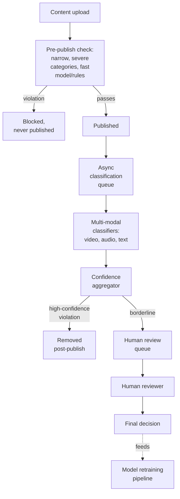

| Component | Role |
|---|---|
| Pre-publish check | Narrow, fast, synchronous — the only gate standing between upload and publish |
| Async classification queue + multi-modal classifiers | The comprehensive, slower check running after publish, across every modality |
| Confidence aggregator | Combines per-modality scores into a decision, per the multi-modal deep dive |
| Human review queue | The genuine second opinion on borderline ML confidence, per its own deep dive |
| Appeals path | The defined route back from a removal decision |

---

## End-to-end request walkthroughs

### Walkthrough 1 — a normal upload, passes pre-publish, cleared by async classification

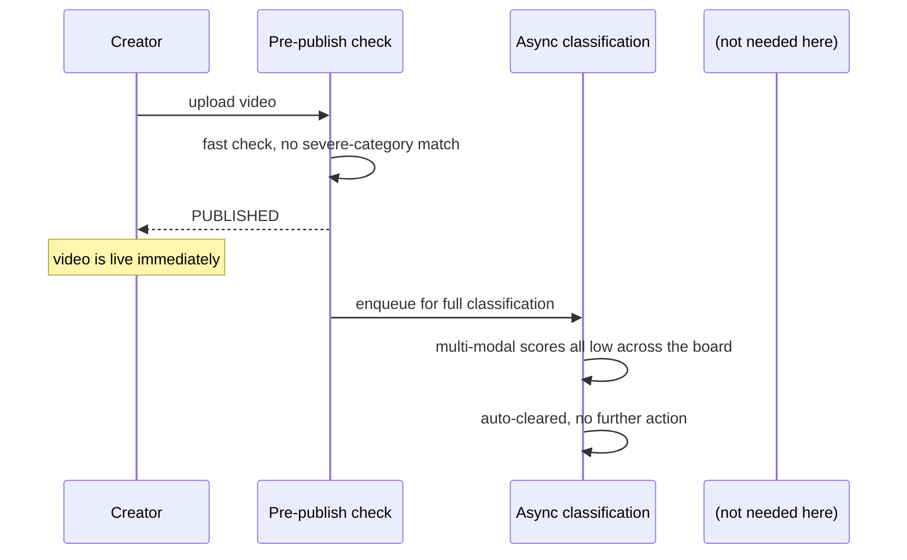

### Walkthrough 2 — a severe-category violation is blocked before ever publishing

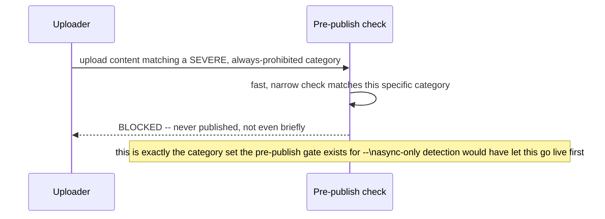

### Walkthrough 3 — a borderline case, caught by audio not video, routed to human review

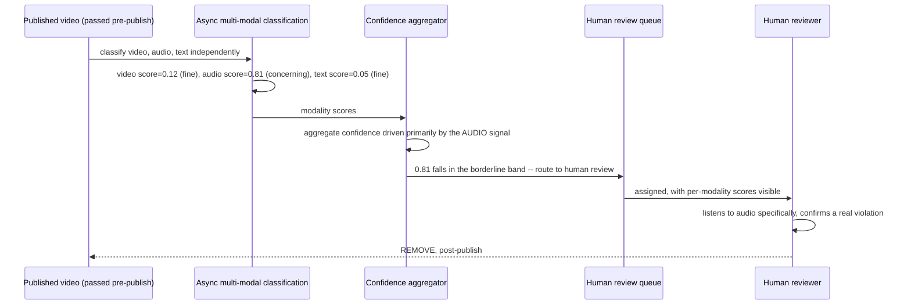

Walkthrough 3 is the concrete case behind the [multi-modal deep dive](#deep-dive-multi-modal-classification)
— a video with entirely benign visuals could still warrant removal based on its audio track alone,
which a video-only classifier would have completely missed.

---

## Deep dive: pre-publish vs. post-publish

Already the centerpiece of the mental model and architecture evolution — the deep dive states the
general trade-off.

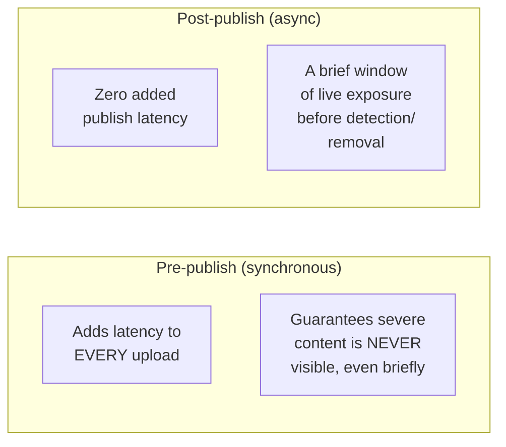

**Why the pre-publish set must stay narrow, not "everything, just faster":** per the capacity
estimate, running comprehensive multi-modal classification synchronously would be both slower and
more compute-expensive per upload than a narrow, targeted check — the entire design hinges on the
severe-category check being cheap and fast specifically *because* it's narrow, not despite it.

**Why this is a genuinely different trade-off shape than the fraud-detection chapter's
latency-budget reasoning:** fraud detection's entire decision runs inline, in the payment's
critical path, because a fraudulent transaction must never complete — content moderation instead
splits its decision across two timing tiers specifically because most content isn't in the
"must never be seen even briefly" category the way every fraud check is in the "must never
complete" category.

**Interview cheat-sheet:** *"Keep the pre-publish check narrow and fast, covering only the
categories where even brief exposure is unacceptable — this is what makes synchronous checking
affordable at all, and it's why content moderation splits into two timing tiers rather than
treating every category the same way fraud detection treats every transaction."*

---

## Deep dive: multi-modal classification

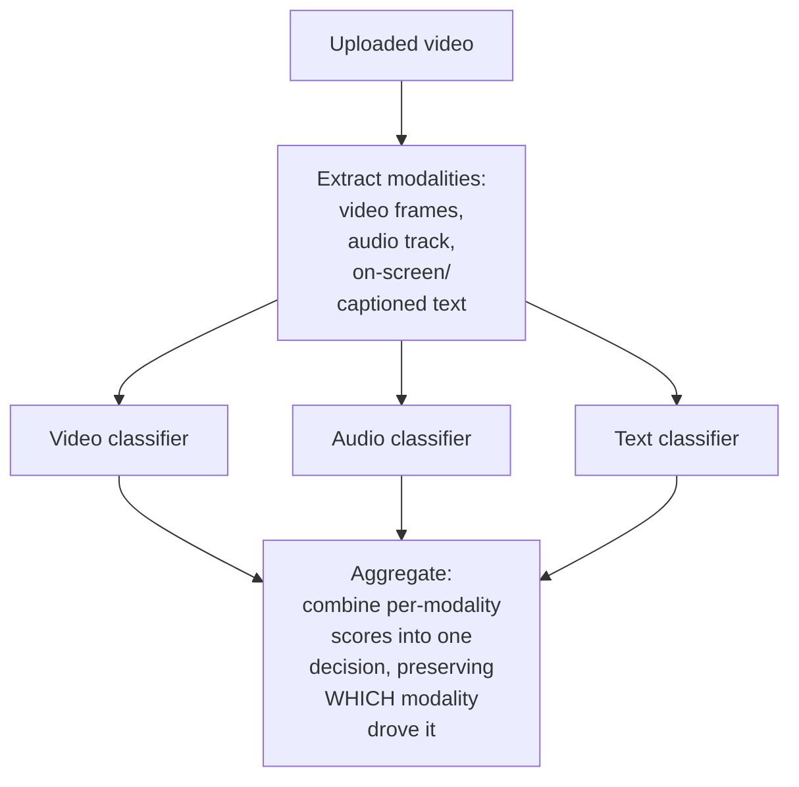

**Why a single, unified classifier over "the whole video" is the wrong default:** visual, audio,
and text content can each independently carry a violation that the others don't — a video with
entirely benign visuals and captions but a hateful audio track (per walkthrough 3) would be
missed entirely by a video-only or text-only classifier; treating each modality with its own
specialized model and then aggregating is what catches violations regardless of which modality
carries them.

**Why preserving per-modality attribution matters, not just the final aggregate score:** a human
reviewer (or a later audit) needs to know *which* modality drove a flag to review efficiently — a
reviewer told "audio score 0.81" can jump straight to listening, rather than re-analyzing the
entire video from scratch with no guidance on where to look.

**Interview cheat-sheet:** *"Classify each modality independently — video, audio, text — and
aggregate while preserving which modality drove the decision; a single unified classifier misses
violations that live in only one modality of an otherwise benign piece of content."*

---

## Deep dive: the human review queue as a real check

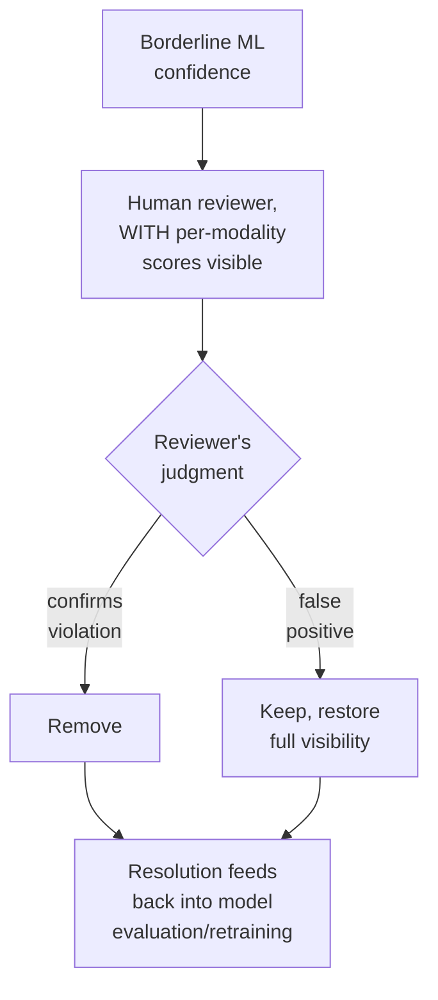

**Why this must be framed as a genuine second opinion on the model's own confidence, not just a
capacity overflow valve for "cases the model couldn't handle":** the same reasoning as the
sanctions-screening chapter's review-queue deep dive — human judgment specifically exists to
catch both false positives (legitimate content the model over-flagged) and false negatives near
the decision boundary, not merely to process whatever volume exceeds automated capacity.

**Why review-queue headcount is a direct, computable function of the confidence threshold, not a
fixed cost:** per the capacity estimate, tightening the threshold to route more borderline content
to review scales headcount requirements proportionally — the same lesson as the sanctions-
screening chapter's threshold economics, here for content review instead of transaction review.

**Interview cheat-sheet:** *"Human review is a genuine check on ML confidence at the decision
boundary, catching both false positives and false negatives — and its headcount cost is a direct,
computable function of wherever the confidence threshold is set, the same economics as the
sanctions-screening chapter's review queue."*

---

## Deep dive: appeals & reinstatement

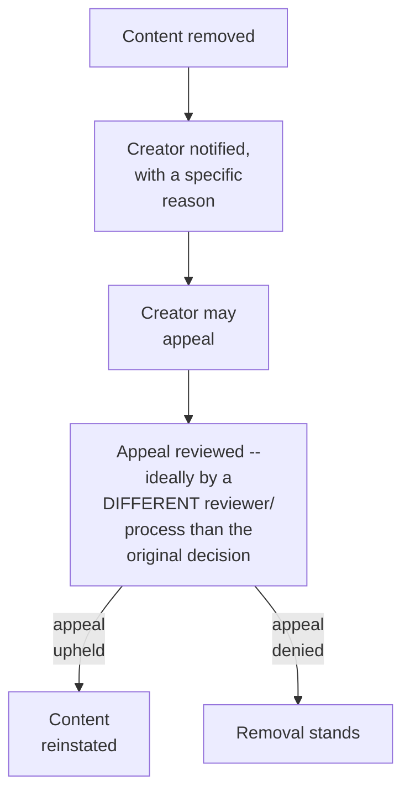

**Why appeals should route to a different reviewer/process than the original decision, where
feasible:** a review process that only ever re-confirms its own prior decision provides little
real check on error — an independent second look is what actually catches a wrongful removal,
similar in spirit to the adversarial-verification pattern used for high-stakes findings elsewhere
in careful review processes.

**Why a specific reason, not just "removed," must accompany every takedown:** a creator can't
meaningfully appeal a decision they don't understand — the same "every rejection needs a specific,
actionable reason" principle as the coupon-redemption chapter's constraint-stack rejections,
applied here to a moderation decision instead of a discount rejection.

**Interview cheat-sheet:** *"Appeals should ideally route to an independent reviewer, not the same
process that made the original call, and every removal needs a specific reason the creator can
actually act on or contest — a bare 'removed' with no explanation defeats the purpose of having an
appeals process at all."*

---

## Data model

**Content moderation lifecycle:**

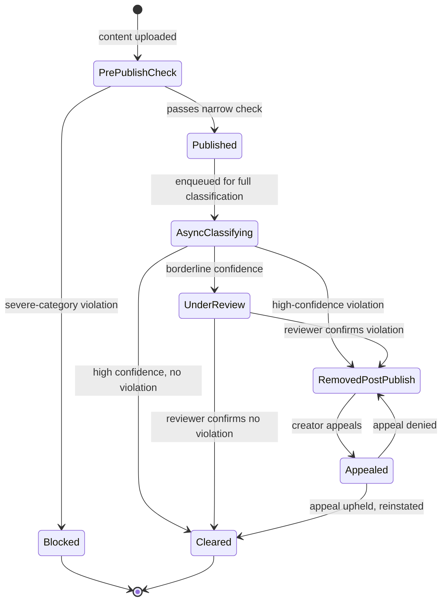

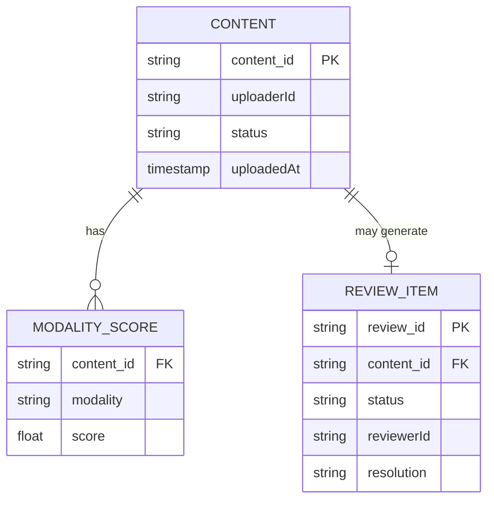

| Table | Storage choice & why |
|---|---|
| `Content` / `ModalityScore` | High-write-throughput, one row set per upload — `ModalityScore` preserves per-modality attribution, per the multi-modal deep dive |
| `ReviewItem` | Lower-volume, feeds both the human review workflow and the appeals process |

---

## Failure modes & mitigations

| Failure mode | Impact | Mitigation |
|---|---|---|
| **A severe-category violation isn't caught by the narrow pre-publish check** (a novel evasion technique) | Briefly live before async detection catches it | Narrow category set should be reviewed and updated as new evasion patterns are identified — an ongoing operational process, not a one-time model |
| **A benign creator's content is wrongly removed** (false positive) | Creator trust damage, potential chilling effect on legitimate content | Appeals process with independent review, per its own deep dive |
| **Human review queue backs up faster than reviewer capacity** | Borderline content sits unresolved longer, risking either prolonged live exposure or prolonged wrongful removal | Monitor queue depth as a first-class metric; the confidence-threshold-vs-headcount trade-off (per the review-queue deep dive) is the release valve, applied deliberately, not left to degrade silently |
| **A violation lives in a modality not being classified** (e.g. a platform adds live audio commentary later, without extending classification to cover it) | Systematic blind spot | Multi-modal coverage needs to be explicitly re-evaluated whenever a new content format/modality is introduced, not assumed to be automatically covered |

---

## Non-functional walkthrough

**Scaling the pre-publish check is bounded by keeping it narrow** — per the capacity estimate,
this is the entire reason it stays affordable to run synchronously on 100% of uploads.

**Scaling async multi-modal classification is a standard ML-inference throughput problem**,
similar in shape to other ML-serving chapters in this course, benefiting from not being on any
user-facing critical path.

**Consistency requirements are asymmetric**: the pre-publish decision must be immediate and final
for its narrow category set; the post-publish/async decision can evolve over time (cleared, then
later flagged by an updated model, then possibly reinstated after appeal) — a genuinely mutable,
multi-stage lifecycle rather than a single point-in-time verdict.

---

## Security & compliance

- **This is fundamentally a trust-and-safety system**, and in many jurisdictions is subject to
  real regulatory requirements around content moderation transparency, response times for
  certain content categories, and appeals processes — worth naming that "how would you design
  this" answers should account for compliance obligations, not just technical architecture.
- **Reviewer wellbeing** is a genuine, non-technical operational concern for human moderation at
  scale (repeated exposure to harmful content) — worth a brief mention if the interviewer probes
  the human-review layer's real-world operation.
- **Bias and fairness auditing** of both the ML classifiers and human review outcomes is a real
  concern, similar to the fairness-auditing points raised in the Airbnb and fraud-detection
  chapters, here with particularly high stakes given the free-expression dimension.

---

## Cost & trade-offs

**Narrow pre-publish scope trades comprehensive real-time coverage for tolerable latency on every
upload** — the central, explicit trade-off of this whole chapter's timing-split design.

**Human-review threshold tuning trades reviewer headcount cost against both false-positive and
false-negative rates** — the same dual-direction cost sensitivity (unlike fraud detection's
single-direction asymmetry) that makes this chapter's threshold economics distinct.

---

## Wrap-up: MVP vs. stretch

**In scope for an MVP:**
- A narrow, fast pre-publish check for the most severe, clearly-classifiable categories.
- Async, single-modality (e.g. video-frame-only) classification post-publish, with a basic
  human-review queue for borderline cases.
- A defined appeals path, even if initially routed through the same review team.

**Explicitly out of scope for an MVP:**
- Full multi-modal classification (audio, text) — start with the most impactful single modality,
  add others incrementally as coverage gaps are identified.
- Independent-reviewer appeals routing — start with appeals reviewed by the general review team,
  add routing to a distinct process once volume and consistency data justify the investment.

**Stretch goals, worth naming if asked "what's next":**
1. **Full multi-modal classification** across video, audio, and text, with preserved per-modality
   attribution.
2. **Independent-reviewer appeals routing**, for a genuine second opinion on removal decisions.
3. **Proactive category-set expansion process**, systematically identifying new evasion patterns
   or emerging harmful-content categories to fold into the narrow pre-publish set over time.

---

## Golden rules

- **Split the timing decision explicitly: a narrow, fast pre-publish check for severe categories,
  async for everything else** — neither all-pre-publish nor all-post-publish is the right answer.
- **Classify each modality independently and aggregate, preserving attribution** — a violation
  can live in only one modality of an otherwise benign upload.
- **Human review is a genuine second opinion on ML confidence, not just an overflow valve** —
  frame it, and staff it, accordingly.
- **Review-queue headcount is a direct, computable function of the confidence threshold** — the
  same economics as the sanctions-screening chapter's review queue, applied to content instead of
  transactions.
- **Every removal needs a specific, actionable reason, and appeals ideally route to an independent
  reviewer** — a bare "removed" with no explanation and no independent check defeats the purpose
  of having an appeals process.

---

## Master cheat sheet

**One-liners:**
- Split moderation timing explicitly: a narrow, fast pre-publish check for severe categories only,
  async post-publish classification for everything else — this is what keeps most uploads fast
  while still preventing the worst content from ever going live.
- Classify video, audio, and text independently and aggregate with attribution preserved — a
  single unified classifier misses violations confined to one modality.
- Human review is a genuine check on ML confidence at the decision boundary, catching both false
  positives and false negatives, not a capacity overflow valve.
- Review-queue headcount scales directly and computably with the confidence threshold — the same
  economics as the sanctions-screening chapter, here for content instead of transactions.
- Every takedown needs a specific reason, and appeals should ideally reach an independent
  reviewer, not just re-confirm the original decision.

**Formula chain:**
```
review_volume_per_day   = uploads_per_day x review_routing_rate_at_threshold
reviewers_needed          = review_volume_per_day / reviews_per_reviewer_per_day
```

**Numbers:** pre-publish checks should target well under a second of added latency, achievable
specifically by keeping the checked category set narrow · human-review routing rates in the
low single-digit percent of total volume can still translate into thousands of required
reviewers at real platform scale, the same headcount-cost-from-threshold lesson as the
sanctions-screening chapter.
