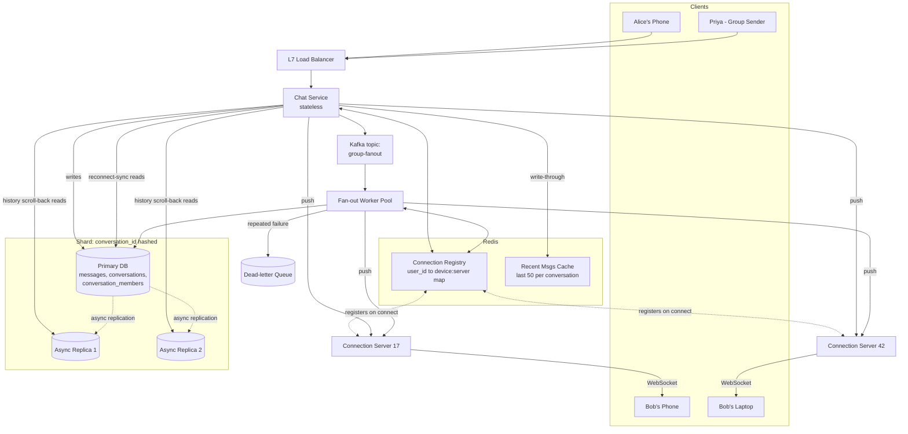
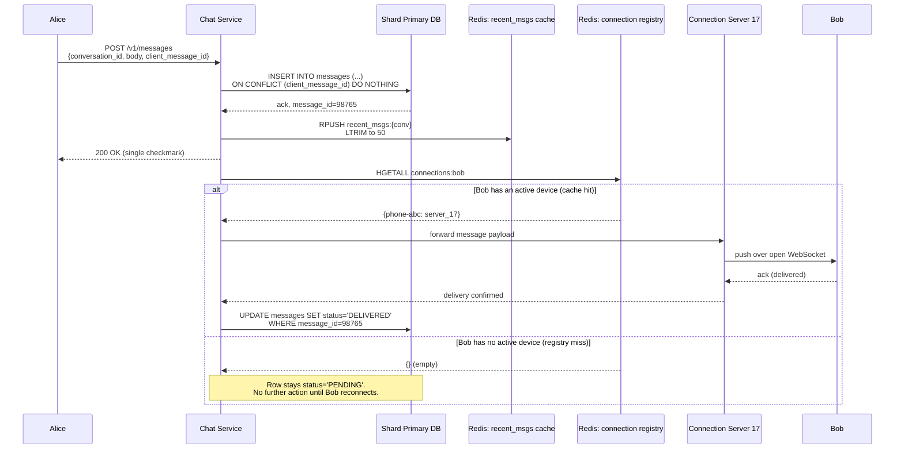
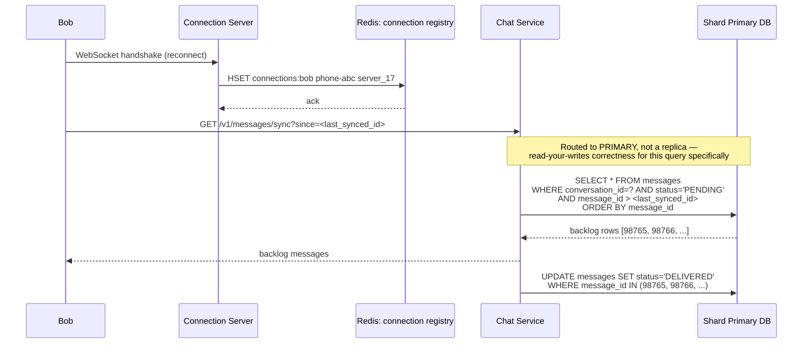
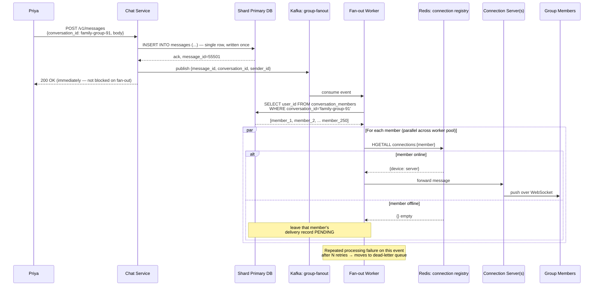
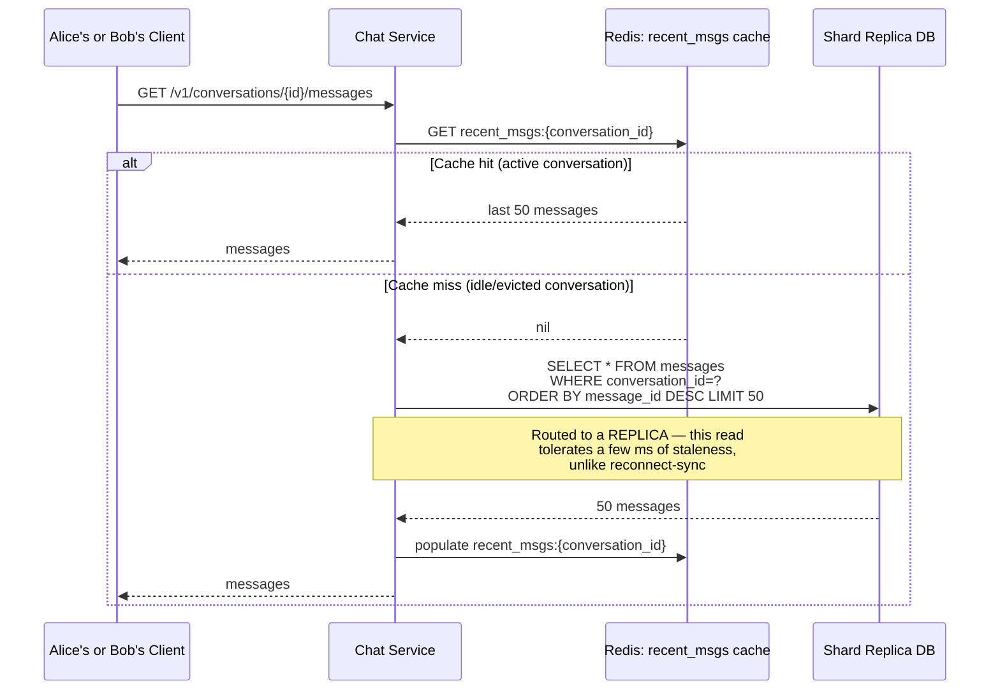

## Why This Problem Exists

It's 2009. Brian Acton and Jan Koum are ex-Yahoo engineers, and SMS is expensive — carriers are charging per-text while data plans sit mostly unused. They build an app that just shows a status next to your name ("at the gym," "battery low") using your phone's data connection instead of SMS.

Within weeks, people start using the status field to send actual messages back and forth to each other. WhatsApp, as a messaging product, is basically an accident. The founders didn't set out to solve "how do you deliver a message to a phone that's turned off in someone's pocket" — but that's the problem they woke up with.

That's the crux of chat systems: unlike a web request, a message has to survive the fact that the recipient might not be reachable *right now*.

---

## Scoped Requirements

Here's what I think should drive the design. Confirm or adjust before we start.

**P0/P1 — in scope:**

1. **One-to-one messaging with reliable delivery.** A message sent by Alice must eventually reach Bob, whether he's online right now or picks his phone back up in six hours. No silent drops.
2. **Low-latency real-time delivery when both users are online.** This is the "feels instant" requirement — under ~200ms end to end is the bar people expect from chat apps today.
3. **Group messaging.** One message, fanned out to N recipients (say, up to a few hundred group members) — this is a different shape of problem than 1:1 and will force its own design decisions.
4. **Multi-device consistency.** A message sent from Alice's phone should also show up on Alice's laptop, and delivery/read state should stay consistent across both.

**Explicitly cut (P2, no architectural impact on the parts we care about):**

- **End-to-end encryption implementation** — real WhatsApp does this (Signal protocol), but it's a cryptography problem layered on top of the transport, not a distributed-systems one. We'll note where it *would* slot in, but won't design it.
- **Media (photos/video) handling** — this is "upload to blob storage, send a URL," a solved problem that doesn't change the messaging architecture.
- **Status/stories, voice/video calls** — different products bolted onto the same app; no shared hard problem with messaging.
- **Full-text message search** — a search-indexing problem, orthogonal to delivery.
- **Push notification internals** — we'll treat "wake up a backgrounded phone" as a black-box external service (APNs/FCM), since building that is Apple/Google's problem, not ours.

**The crux — where we'll spend most of our time:**

Requirement #1, reliable delivery regardless of online/offline state, at scale. The hard question underneath it is: *when a server receives a message for Bob, how does it know whether Bob is reachable right now, and if so, which one of thousands of stateful connection-holding servers is actually holding his connection?* That single question — connection routing plus what happens when it fails — is what separates a toy chat demo from an L4/L5-grade answer.

Does this scope look right to you, or do you want to fold anything back in (e.g., you specifically want group messaging cut, or you want E2EE discussed at a design level)?

---

## Day 0: The Simplest Thing That Could Work

**The scenario:** Alice wants to message Bob. Both have the app open right now.

The dumbest possible thing that works: one server, one database, and clients that **poll**.

Alice's phone sends her message to the server over a normal HTTP request. The server writes it to a database. Bob's phone, meanwhile, asks the server every 3 seconds: "any new messages for me?" That's it. No persistent connections, no fancy routing — just a web server and a database, the same shape as any CRUD app you've built.

**Schema:**

```sql
CREATE TABLE messages (
    message_id   BIGINT PRIMARY KEY,
    sender_id    BIGINT NOT NULL,
    recipient_id BIGINT NOT NULL,
    body         TEXT NOT NULL,
    created_at   TIMESTAMP NOT NULL,
    delivered    BOOLEAN DEFAULT FALSE
);
```

**Write flow:**

1. Alice's client calls `POST /v1/messages` with `{"recipient_id": "bob", "body": "hey"}`.
2. **Chat Service** (a single stateless-ish web server) receives it, assigns a `message_id`, runs:
   ```sql
   INSERT INTO messages (message_id, sender_id, recipient_id, body, created_at)
   VALUES (12345, 'alice', 'bob', 'hey', NOW());
   ```
3. Server returns `200 OK` to Alice. Her message now exists durably — that's the correctness guarantee here.

**Read flow:**

1. Bob's client calls `GET /v1/messages?since=<last_seen_id>` every 3 seconds.
2. Chat Service runs:
   ```sql
   SELECT * FROM messages WHERE recipient_id = 'bob' AND message_id > <last_seen_id>;
   ```
3. If there are rows, Bob's client renders them and updates `last_seen_id`.

```
Alice ──POST /v1/messages──► Chat Service ──INSERT──► DB
Bob   ──GET /v1/messages────► Chat Service ──SELECT──► DB   (every 3s)
```

**Why this is a reasonable starting point, not a strawman:**

It gives you a real guarantee: once the `INSERT` commits, the message is durable. Bob *will* see it, guaranteed, next time he polls — even if he closes the app and reopens it a week later. Nothing about delivery depends on any component staying alive in memory. That's a genuinely useful property, and it's the one later iterations have to work hard to preserve while removing everything else that's wrong with this design.

What's wrong with it is latency and waste, not correctness — and that's exactly what we'll break next.

---

Next: what happens when we actually measure what "every 3 seconds, for every user, forever" costs — and why that number gets worse, not better, as WhatsApp's real growth curve kicks in.

---

## Break It: Polling Doesn't Scale, and It's Not Even Fast

**The setup:** WhatsApp hits 1 million daily active users. Not a huge number by today's standards, but let's see what polling does with it.

Assume each active user's client polls every 3 seconds while the app is open. That's roughly 1,000,000 / 3 ≈ **333,000 requests per second** hitting the Chat Service — and the overwhelming majority of them return "nothing new." You're paying full request/response/DB-query cost for an empty answer, almost every single time.

**Concretely:** Alice sends Bob a message at 10:00:00.000. Bob's client happens to have just polled at 10:00:00.500 and gotten nothing back. His next poll isn't until 10:00:03.500. That's up to **3 seconds of dead air** on a message that a real chat app needs to deliver in under 200ms. Worse — to hit that 200ms bar, you'd have to poll every 200ms instead of every 3s, which multiplies that 333k req/s number by 15x, to about 5 million requests per second, almost all of them wasted.

This is the shape of the failure: **the fix for latency (poll faster) directly worsens the fix for scale (fewer requests)**. You cannot tune polling interval to satisfy both at once — that tension is structural, not a tuning problem.

There's a secondary failure too: the database. Every single poll is a `SELECT ... WHERE recipient_id = ?` against a table that's growing without bound, from every online user, every few seconds, forever. That's a write-light, read-catastrophic access pattern — and almost all of those reads return zero rows.

**The real-world echo:** this is exactly why early messaging and email-on-phone products (BlackBerry's push email being the famous counter-example) made "push, don't poll" their whole pitch — battery life and server load both depend on it.

So the fix isn't "poll smarter." It's "stop making the client ask — let the server tell the client the instant something happens." That means a connection that stays open.

---

Next: we'll introduce a persistent connection (WebSocket) so the server can push to Bob directly — and immediately hit the real crux of this whole system, the connection-routing problem I flagged during scoping.

---

## Evolve It: Persistent Connections, and the Problem That Creates

**The fix for polling** is simple to state: instead of Bob asking "anything new?" every 3 seconds, Bob's client opens one **WebSocket** connection to the server and just... waits. The connection stays open. The moment the server has something for Bob, it writes to that open socket, and Bob's client receives it immediately — no request needed.

Think of it like the difference between calling a friend every 3 seconds to ask "did you text me back yet?" versus just leaving the phone line open and having them speak the moment they have something to say. One is exhausting for everyone involved; the other just works, as long as the line stays open.

This kills both Day-0 problems at once: latency drops to "as fast as the network allows" instead of "up to 3 seconds," and there's no more wasted empty-poll traffic — the server only does work when there's an actual message.

**But this creates a brand-new problem, and it's the crux one:** a WebSocket connection is **stateful**. Bob's socket is a live TCP connection sitting in the memory of *one specific server process*. The moment you have more than one server — which you need, at any real scale — you have to answer: **when Alice's message arrives, which of your N servers is holding Bob's connection?**

Let's walk through how someone would naturally try to solve this, and where each attempt breaks.

### Attempt 1: Broadcast to every server

The naive idea: Chat Service receives Alice's message for Bob. It doesn't know which server holds Bob's socket, so it just **asks all of them** — broadcasts the message to every connection server in the fleet. Whichever one actually has Bob connected delivers it; the rest silently ignore it.

This works at tiny scale. It falls apart the moment you have real numbers behind it. Say you have 1,000 connection servers and 10 million messages a minute system-wide. Every single message now becomes 1,000 internal deliveries instead of 1. You've turned a targeted, cheap operation into an O(N) broadcast storm — and it gets *linearly worse* every time you add a server to handle more load, which is exactly backwards. Scaling out should make each server do less work, not more.

### Attempt 2: Sticky sessions via a shared "who's online" table

Better idea: keep a table that maps `user_id → which connection server they're on`, updated whenever someone connects or disconnects. When Alice's message comes in, look Bob up, and route directly to the one server that has him.

```sql
CREATE TABLE connections (
    user_id     BIGINT PRIMARY KEY,
    server_id   VARCHAR(64) NOT NULL,
    connected_at TIMESTAMP NOT NULL
);
```

This is directionally correct — it's the shape of the real answer — but the naive version of it, a row in a relational table hit on every message send, has its own failure mode: it's now a **write on every connect/disconnect** (millions of times a day, as people background the app, lose signal on the subway, switch wifi to LTE) plus a **read on every single message send**. You've built a new hot, contended table that every message-send has to consult, and if that table's server falls over, *the entire system loses the ability to route any message*, even though every individual chat server is healthy. You've centralized the one thing you most needed to be resilient.

### The real answer: a fast, purpose-built connection registry

The fix isn't a different idea — it's the *right storage engine* for that idea. That lookup table needs to be:

- **In-memory-fast**, since it's consulted on every message send
- **Independently scalable**, so it doesn't become a single chokepoint
- **Naturally partition-tolerant**, so losing one shard of it doesn't take down routing for every user

That's exactly what **Redis** (or a similar in-memory key-value store) is built for. So the design becomes: each connection server, on accepting Bob's WebSocket, writes `bob → server_17` into Redis. When Alice's message needs routing, the Chat Service does one Redis lookup — sub-millisecond — finds `server_17`, and forwards the message there directly. One lookup, one targeted delivery, no broadcast, no relational table under write pressure.

```
Bob connects  ──► Connection Server 17 ──SET bob→server_17──► Redis (connection registry)

Alice sends msg ─► Chat Service ──GET bob──► Redis ──"server_17"──► Chat Service
                                                                        │
                                                          forwards msg to Connection Server 17
                                                                        │
                                                          Connection Server 17 ──push──► Bob's open WebSocket
```

**What we gained:** real-time push delivery, and a routing lookup that's O(1) and horizontally scalable instead of O(N) or a single point of failure.

**What we gave up / new problem introduced:** Bob is only reachable if he's *currently connected to some server*. The moment his phone locks, loses signal, or the app backgrounds and the OS kills the socket — which is most of the time, for most users — this whole mechanism has no one to deliver to. We still need Day 0's durability guarantee (the message can't just vanish) layered underneath this.

**What we considered and rejected:** broadcast-to-all (attempt 1) — rejected because it's O(N) per message and gets worse as the fleet grows, exactly backwards for a scaling strategy. A relational "who's online" table (attempt 2) — rejected because it puts a slow, contended, single-point-of-failure store directly in the hot path of every message.

---

**Likely follow-up:** *"Why not just use sticky load balancing — route Bob to the same server every time based on a hash of his user ID, and skip the registry entirely?"*
Model answer: that only solves which server Bob *should* connect to, not what happens when that server is down and he reconnects elsewhere, or when Alice's message originates from a completely different server that has no idea about the hashing scheme used for connections. You'd still need a way to look up "where is Bob *actually* connected right now" — the registry is that source of truth; a hash is just a hint that can go stale.

Next up: Bob's phone is asleep and disconnected — how do we not just lose Alice's message, and how does it catch up once he's back?

---

## Evolve It: What Happens When Bob Is Offline

**The scenario:** Alice sends "dinner at 7?" at 6:45pm. Bob's phone has been in a pocket with no signal since lunch. The Redis registry lookup for `bob` comes back **empty** — no connection server is holding his socket.

Under the design so far, that's a dead end. The Chat Service tried to route, found nobody home, and... then what? If the answer is "drop it," we've violated requirement #1 from scoping, the one guarantee we can't compromise on. So the message has to go somewhere durable, and Bob has to be able to catch up when he reconnects.

**The fix:** every message gets **persisted first, delivery-attempted second.** Durability is not a fallback path — it's the primary path. Real-time push is an optimization layered on top of it, not a replacement for it.

Here's the corrected write flow:

1. Alice's client: `POST /v1/messages` with `{"recipient_id": "bob", "body": "dinner at 7?"}`.
2. **Chat Service** assigns a `message_id` and writes it durably, *before* attempting any delivery:
   ```sql
   INSERT INTO messages (message_id, sender_id, recipient_id, body, created_at, status)
   VALUES (98765, 'alice', 'bob', 'dinner at 7?', NOW(), 'PENDING');
   ```
3. Chat Service returns `200 OK` to Alice — from her point of view, sending is done. (This is why the single checkmark appears immediately in WhatsApp: it means "server has it durably," not "Bob has seen it.")
4. **Then**, Chat Service checks Redis: `GET bob`. Two branches:
   - **Hit** (Bob's online): forward to his connection server, push over the WebSocket, mark `status = 'DELIVERED'`.
   - **Miss** (Bob's offline): do nothing further right now. The row just sits in `messages` with `status = 'PENDING'`.
5. **When Bob reconnects**, his client calls `GET /v1/messages/sync?since=<last_synced_id>`. Chat Service runs:
   ```sql
   SELECT * FROM messages WHERE recipient_id = 'bob' AND status = 'PENDING' ORDER BY message_id;
   ```
   Delivers the backlog, then flips each to `DELIVERED`.

```
Alice ──POST /v1/messages──► Chat Service ──INSERT (status=PENDING)──► DB
                                    │
                                    ├─ GET bob ──► Redis ──► MISS (Bob offline)
                                    │
                                    └─ (nothing more happens now)

  ... later, Bob reconnects ...

Bob ──WebSocket connect──► Connection Server ──SET bob→server_id──► Redis
Bob ──GET /v1/messages/sync?since=X──► Chat Service ──SELECT status=PENDING──► DB
                                              └─ pushes backlog, marks DELIVERED
```

**What we gained:** the durability guarantee from Day 0 is preserved even with real-time push in the picture. Bob can be offline for five minutes or five days — the message is sitting safely in the database either way, and reconnecting is just "sync the pending backlog," the same mechanism whether he was gone 10 seconds or 10 days.

**What we gave up / new problem introduced:** we've reintroduced a poll-like `SELECT ... WHERE status = 'PENDING'` — but now it only fires once, on reconnect, instead of every 3 seconds forever. That's a fundamentally cheaper shape of the same query. It does mean this single `messages` table is now serving three different access patterns at once (insert-on-send, point-update-on-delivery, range-scan-on-reconnect-sync) — worth watching as a future bottleneck, but not urgent yet.

**What we considered and rejected:** attempting delivery *before* persisting (delivery-first, write-as-fallback-only) — rejected because it means a crash between "pushed to socket" and "wrote to DB" loses the message with no way to recover it, exactly the silent-drop failure we ruled out in scoping.

---

**Likely follow-up:** *"What if Bob is connected, but the push to his socket fails partway — server crashes mid-send? Doesn't he lose the message even though Redis said he was online?"*
Model answer: no — because the row is already `PENDING` in the DB before the push is even attempted. If the push fails or the server dies mid-send, the status simply never flips to `DELIVERED`. Bob's next reconnect (or a retry mechanism) picks it up from the `PENDING` backlog exactly as if he'd been offline the whole time. The push is an optimization; the DB state is the source of truth regardless of whether it succeeds.

---

Next: this "one big `messages` table for everyone" is fine at WhatsApp's early scale, but it won't survive real growth — next iteration we'll break it with a genuinely large user base and introduce sharding, plus figure out how group messages change the fan-out shape entirely.

---

## Break It: One Database, Real Scale

**The numbers:** WhatsApp today handles on the order of 100+ billion messages a day across ~2 billion users. Even taking a much more conservative "large but not-yet-massive" checkpoint — say 500 million users sending an average of 40 messages a day — that's 20 billion rows a day landing in one `messages` table. At even modest average message size, that table blows past what a single Postgres instance can hold, let alone index and query with any consistent latency, within weeks.

**The concrete break:** picture a single popular user — call him **Raj**, a customer support account for a large e-commerce company, receiving messages from thousands of customers a day. Every one of those `INSERT`s and the read-sync `SELECT`s for both senders and Raj are hitting the exact same physical table, on the exact same physical machine, as everyone else's traffic. There's no more vertical room to grow — you can't just get a bigger box past a certain point, and even if you could, a single machine going down now means *nobody* can send or receive *any* message, system-wide. That's an unacceptable blast radius for a chat product.

This is a storage and availability problem now, not a routing problem — we solved routing last iteration. The fix is **sharding**: splitting the `messages` table across many database instances so no single machine holds all the data or all the load.

### Candidate shard keys

**1. Shard by `recipient_id`** (or `sender_id` — symmetric problem)

- **Optimizes:** "give me all messages for this user" — exactly the reconnect-sync query from the last iteration. One shard, one query, done.
- **Breaks:** a 1:1 conversation between Alice and Bob touches two different users. If they're sharded independently by their own IDs, a single conversation's messages could be scattered depending on who sent what — Alice's sent messages live wherever Alice's shard is, Bob's live wherever Bob's shard is. Reconstructing "the conversation between Alice and Bob, in order" now means querying two shards and merging.
- **Hotspots:** yes — Raj (the support account) receives disproportionate volume. Every one of his messages, from every customer, lands on the exact same shard. That shard runs hot while others sit idle.

**2. Shard by `conversation_id`** (a deterministic ID derived from the pair, e.g. `hash(min(alice_id, bob_id), max(alice_id, bob_id))`)

- **Optimizes:** the actual dominant read pattern — "give me the message history for this conversation" — lives entirely on one shard, in order, no merge needed. This also naturally extends to group chats, where `conversation_id` is just the group's ID.
- **Breaks:** "give me all messages across all my conversations" (useful for, say, a unified inbox view or search) now means fanning out to every shard that has a conversation involving you — but note, this isn't actually one of our P0/P1 requirements. The reconnect-sync flow doesn't need this either, if we track pending-per-conversation.
- **Hotspots:** Raj's problem resurfaces differently — Raj doesn't have one conversation, he has thousands, each individually small. Those spread naturally across shards by `conversation_id`, so this actually **fixes** the Attempt-1 hotspot rather than causing one. The remaining risk is a single *enormous* group chat (thousands of members, very high message volume) concentrating on one shard — a narrower, more tolerable version of the same problem.

**3. Shard by `region`** (user's home geography)

- **Optimizes:** data locality and regulatory placement — useful later for multi-region, and for keeping European user data in Europe if data-sovereignty rules apply.
- **Breaks:** it doesn't solve today's problem at all. Two users in the same region can still have Raj-level hot conversations; region tells you *where* the shard lives, not *how* to split load within a region. It's a multi-region concern layered on top of a within-region shard key, not a substitute for one.

**Winner: shard by `conversation_id`.** It matches the dominant access pattern (fetch a conversation's history in order), and it happens to defuse the specific hotspot (Raj) that broke us, since his load is naturally spread across many distinct conversation shards instead of concentrated on one recipient shard.

### Resharding cost

Using **consistent hashing** to map `conversation_id → shard`, rather than a naive `hash(id) % N`, bounds the blast radius when you add or remove shards. With `% N`, adding one shard reshuffles nearly every key's target shard — a full rehash, meaning almost all data has to move. With consistent hashing, adding a shard only moves the keys that fall in the new shard's slice of the ring — a fraction of total data, not everything.

Think of it as a clock face: each shard owns an arc of the clock. Adding a new shard just carves a new small arc out of one existing shard's territory — the other shards' arcs, and the data in them, are untouched.

| Shard key | Optimizes | Breaks / hotspot risk | Resharding cost |
|---|---|---|---|
| `recipient_id` | Per-user inbox fetch | Raj-style hot recipients | Full rehash without consistent hashing |
| `conversation_id` | Conversation history fetch (dominant pattern) | Only extreme mega-groups | Bounded, via consistent hashing |
| `region` | Data locality, sovereignty | Doesn't address load hotspots alone | Orthogonal — combine with above |

**What we gained:** no single machine holds unbounded data, load spreads roughly evenly even under a skewed traffic shape like Raj's, and losing one shard now only takes down the conversations on that shard, not the whole system.

**What we gave up / new problem introduced:** every read now needs to know *which* shard to query, meaning `conversation_id` has to be derivable or looked-up before any query runs — that's a small routing layer we didn't need with one DB. Also, group conversations with very high membership can still concentrate load on a single shard; we're deferring that edge case.

**What we considered and rejected:** sharding by `recipient_id` — rejected because it directly recreates the Raj hotspot we're trying to fix, and splits every 1:1 conversation across two shards for no benefit. Sharding by `region` alone — rejected because it doesn't distribute load within a region at all; it solves a different problem (locality) that we'll layer in later, during multi-region.

---

**Likely follow-up:** *"What about a message ID that needs to be globally unique across all these shards — how do you generate `message_id` now that there's no single auto-increment counter?"*
Model answer: use a **Snowflake-style ID** — a 64-bit ID composed of a timestamp, a shard/worker ID, and a per-millisecond sequence number, generated locally by whichever shard handles the write. This gives roughly time-sortable, globally unique IDs with no coordination between shards needed at write time, which matters because coordinating a single global counter across shards would just reintroduce the single-point-of-failure we're trying to eliminate.

---

Next: with sharding in place, group messages become a genuinely different problem — sending one message to a group of 500 people is not "do the 1:1 flow 500 times," and we'll see exactly why that naive approach breaks.

---

## Evolve It: Group Messaging Fan-Out

**The scenario:** Priya creates a WhatsApp group for her extended family — 250 people, scattered across timezones, half of them online at any given moment. She sends one message: "Diwali dinner Saturday, everyone come!"

**The naive approach:** reuse the 1:1 flow exactly as built. Loop over all 250 group members, and for each one, do everything the 1:1 flow does — insert a row, check Redis for their connection, push if online. One message in, 250 individual sends out.

This looks reasonable at first — it's just "the thing we already built, called in a loop." It even works correctly. But look at what it costs: Priya's single `POST /v1/messages` call now triggers 250 separate DB inserts and 250 separate Redis lookups, synchronously, before the API can return. If any one of those 250 operations is slow — a laggy shard, a Redis hiccup — the whole request stalls waiting on it. And this cost is paid **per group message**, meaning a 250-person group that's moderately active generates 250x the write load of a 1:1 chat, for identical user-facing behavior ("send one message").

**The concrete break:** Priya's family group isn't even large by WhatsApp standards — real groups go up to 1,024 members. At that size, one message from one person fans out to over a thousand synchronous writes inside a single request-response cycle. That request is going to time out, or at minimum, feel nothing like the "instant" send Priya expects from her 1:1 chats.

### Why this needs a different shape, not just "make the loop faster"

The core issue isn't that the loop is slow — it's that fan-out is being done **synchronously, in the write path, blocking the sender**. Priya doesn't need her message delivered to all 250 people before her app shows the checkmark. She needs the message durably stored once, and delivery to happen — reliably, but asynchronously — after that.

**The fix:** decouple "accept the message" from "fan it out," using a queue.

1. Priya's client: `POST /v1/messages` with `{"conversation_id": "family-group-91", "body": "Diwali dinner Saturday!"}`.
2. **Chat Service** writes the message **once** to its shard, keyed by `conversation_id` (from the last iteration):
   ```sql
   INSERT INTO messages (message_id, conversation_id, sender_id, body, created_at)
   VALUES (55501, 'family-group-91', 'priya', 'Diwali dinner Saturday!', NOW());
   ```
3. Chat Service publishes **one event** to a Kafka topic, `group-fanout`:
   ```json
   {
     "message_id": 55501,
     "conversation_id": "family-group-91",
     "sender_id": "priya",
     "member_count": 250
   }
   ```
4. Chat Service returns `200 OK` to Priya immediately — her checkmark appears now, decoupled from whether any of the 250 deliveries have happened yet.
5. A separate pool of **Fan-out Workers** consumes from `group-fanout`. For this event, a worker looks up the group's membership list, then for each member runs the *existing* 1:1-style delivery logic (Redis lookup, push if online, else leave `PENDING`) — but off the critical path, in the background, in parallel across many workers instead of serially inside one request.

```
Priya ──POST /v1/messages──► Chat Service ──INSERT (once)──► DB (shard: family-group-91)
                                    │
                                    └──publish──► Kafka topic: group-fanout
                                                        │
                              ┌─────────────────────────┼─────────────────────────┐
                              ▼                          ▼                          ▼
                       Fan-out Worker A          Fan-out Worker B          Fan-out Worker C
                       (members 1-80)            (members 81-160)         (members 161-250)
                              │                          │                          │
                        Redis lookup + push/PENDING, same as 1:1 delivery from Iteration 3
```

**What we gained:** Priya's send latency is now independent of group size — it's one insert and one queue publish, whether the group has 3 members or 1,024. Fan-out work is parallelized across a worker pool instead of serialized inside one request, and if a worker crashes partway through 250 deliveries, Kafka's consumer offset mechanics mean the event gets reprocessed rather than silently half-delivered.

**What we gave up / new problem introduced:** there's now a small, unavoidable gap between "Priya's message is accepted" and "any given member actually receives it" — fan-out is asynchronous by design. For a 250-person group this is milliseconds in practice, but it's a real architectural shift from the 1:1 path, where delivery-attempt happened essentially inline. We've also added a new piece of infrastructure (Kafka) and a new failure mode to reason about: what if the fan-out worker pool falls behind during a burst of activity across many large groups at once.

**What we considered and rejected:** keeping fan-out synchronous but parallelizing the 250 deliveries with threads/async I/O inside the same request — rejected because it still ties Priya's response time to the slowest of 250 downstream operations, and still fails atomically if the request times out or the server restarts mid-fan-out, versus a queue's durable retry semantics.

---

**Likely follow-up:** *"What about a 100,000-member broadcast-style group or channel — does per-member fan-out still hold up?"*
Model answer: not efficiently — at that size you'd shift toward a **fan-out-on-read** model instead: store the message once, and let each member's client pull it on next sync/reconnect rather than proactively pushing to 100,000 individual sockets. This is the same push-vs-pull tension that shows up in feed systems like Twitter's timeline design — small/medium groups favor push (low latency, bounded fan-out cost), very large broadcast groups favor pull (bounded write cost, slightly higher latency per reader).

---

Next: multi-device consistency — Priya has WhatsApp on her phone *and* her laptop. We'll look at what breaks when "deliver to Bob" secretly means "deliver to all of Bob's devices, and keep them in sync with each other."

---

## Break It: One User, Multiple Devices

**The scenario:** Bob has WhatsApp open on his phone *and* his laptop, logged into the same account on both — this is a P0 requirement we scoped in. Alice sends him "call me when free." Under everything we've built so far, "deliver to Bob" means one Redis lookup: `GET bob → server_id`. That returns exactly one connection.

**The concrete break:** Bob's phone was the one that most recently wrote to Redis — say he unlocked it five minutes ago, overwriting whatever his laptop had written earlier. Alice's message gets pushed to his phone. His laptop, sitting right next to it, open and idle, gets **nothing**. Worse: if Bob later opens his phone and reads the message, then switches to his laptop, the laptop still shows it as unread — there's no shared notion of "Bob has seen this," only "the one connection Redis happened to remember has seen this."

The root problem: our data model has been implicitly assuming **one user = one reachable endpoint**. That assumption breaks the moment "user" and "device" stop being the same thing.

### The fix: route to devices, not users

Redis's key needs to change shape. Instead of `user_id → single server_id`, it becomes `user_id → set of (device_id, server_id)` pairs — because Bob's phone and laptop are likely connected to *different* connection servers entirely.

```
Redis (connection registry), per user:

  connections:bob → {
    "phone-abc":  "server_17",
    "laptop-xyz": "server_42"
  }
```

**Who writes:** each device writes its own entry on connect (`HSET connections:bob phone-abc server_17`), and removes only its own entry on disconnect — Bob's laptop disconnecting must never wipe out his phone's entry, which a plain overwrite-style `SET` would have done.

**Who reads:** Chat Service, on every message delivery, now does `HGETALL connections:bob` instead of `GET bob` — returning *every* device Bob has open, not just one.

**Delivery flow changes:**

1. Alice sends "call me when free" to Bob (`conversation_id`-sharded insert, same as before — unchanged from Iteration 4).
2. Chat Service: `HGETALL connections:bob` → `{phone-abc: server_17, laptop-xyz: server_42}`.
3. **Branch — for each device found:** push independently, in parallel, to each `(device_id, server_id)` pair. If Bob only has one device online, this degrades to exactly the single-push flow from before; if he has zero, same `PENDING`-and-sync path as offline handling.
4. Each device, once it delivers, needs its own delivery/read acknowledgment — because "Bob read it on his phone" and "Bob read it on his laptop" are now two different facts that both need to update to the *same* underlying read state.

**Read-state schema change:**

```sql
CREATE TABLE read_state (
    conversation_id  VARCHAR(64) NOT NULL,
    user_id          BIGINT NOT NULL,
    last_read_msg_id BIGINT NOT NULL,
    updated_at       TIMESTAMP NOT NULL,
    PRIMARY KEY (conversation_id, user_id)
);
```

This is deliberately keyed by `(conversation_id, user_id)`, **not** by device. "Read" is a property of the user, not of any one device — that's exactly what makes cross-device sync work. When Bob reads the message on his phone, his phone writes:

```sql
UPDATE read_state SET last_read_msg_id = 98765, updated_at = NOW()
WHERE conversation_id = 'alice-bob' AND user_id = 'bob';
```

Bob's laptop, on its next sync or via a push notifying it that read-state changed, picks up the same row and reflects "read" locally — without ever needing to know the phone did the reading.

```
Alice ──send msg──► Chat Service ──insert (unchanged)──► DB
                          │
                          └─ HGETALL connections:bob ──► Redis
                                    │
                     ┌──────────────┴──────────────┐
                     ▼                              ▼
              push → server_17                push → server_42
              (Bob's phone)                    (Bob's laptop)

Bob reads on phone ──► write read_state(bob, conv) ──► DB
                                    │
                     Bob's laptop syncs read_state on reconnect/poll → shows "read" too
```

**What we gained:** every device Bob has open receives every message, and "read" becomes one shared fact per user per conversation instead of a per-device guess — which is exactly the behavior WhatsApp Web users expect (read on phone, laptop shows it read too).

**What we gave up / new problem introduced:** delivery fan-out now happens per-device instead of per-user, which for most users (1-3 devices) is a small, bounded multiplier — but it's a real cost increase applied to *every* message in the system, not just group messages. We've also introduced a genuine race: if Bob's phone and laptop both write `read_state` for the same message near-simultaneously (unlikely for read receipts specifically, but the same pattern recurs elsewhere), last-write-wins on `updated_at` is our tiebreak — acceptable here since "read" is monotonic and idempotent, not a value where losing an update actually loses information.

**What we considered and rejected:** keeping the single `user_id → server_id` mapping and just re-pushing to whichever device is "most recently active" — rejected because it directly reproduces the original bug (the inactive device silently misses messages), it just makes the window smaller rather than eliminating it.

---

**Likely follow-up:** *"What if Bob is offline on both devices — does the PENDING/sync path from Iteration 3 still work as-is?"*
Model answer: yes, unchanged in shape — `HGETALL` simply returns empty, the message stays `PENDING`, and whichever device reconnects first runs the same reconnect-sync query. The only change is that *each* device now tracks its own `last_synced_id` for the reconnect-sync `GET /v1/messages/sync?since=X` call, since phone and laptop may have been offline for different lengths of time and need different backlogs.

---

We've now covered all four P0/P1 requirements functionally: reliable delivery, real-time push, group fan-out, and multi-device sync. Next, we owe two NFR deep-dives we've been deferring — **replication** (do these shards need read replicas, and what consistency model do we actually get) and **caching** (is there anything here worth caching, given messages aren't the kind of data that gets read repeatedly like a viral post). I'll take replication first as its own message, since it's the meatier of the two for this system.

---

## NFR Deep-Dive: Replication

**The question to answer:** do our `messages` shards need read replicas at all — and if so, what consistency model falls out of that choice?

### Do we need replicas? Check the read:write ratio for *this* system

Unlike a social feed, chat messages aren't read repeatedly by thousands of strangers — a message is read by the handful of people in that conversation, a small, fixed number of times. But there's a specific read pattern from our own design that changes the math: **every message write is immediately followed by a read**, because Iteration 2's delivery flow does `GET bob` on Redis and then, for the reconnect-sync path, a `SELECT` against the exact row that was just inserted.

So per message, we're looking at roughly: 1 write, plus 1 read per recipient device for real-time push, plus 1 read per recipient on reconnect-sync, plus however many reads happen when someone scrolls up through old history. For a 1:1 chat with 2 devices each, that's easily a 5:1 or higher read:write ratio even before anyone scrolls back through history. **Yes, replicas are justified** — not because messages are "hot" like viral content, but because our own delivery mechanism multiplies reads per write.

### Sync or async — and what it costs

This is the actual hard call, and it hinges on one scenario: **the write-then-immediately-read pattern from delivery.**

If Alice's message is written to the primary, and Redis says Bob's laptop is on `server_42` which reads from an **async** replica, there's a real window where the replica hasn't caught up yet — Bob's reconnect-sync query could run against a replica that doesn't have the message yet, and return nothing, even though the write already succeeded on the primary seconds earlier.

Concretely: Alice sends at 10:00:00.000. Primary commits at 10:00:00.010. Async replication lag is typically single-digit milliseconds but can spike to hundreds of ms under load. If Bob's client happens to run its reconnect-sync query against a lagging replica at 10:00:00.050, it might miss a message that was already durably written 40ms earlier — not lost, just temporarily invisible, and it'll show up on his next sync.

**The choice:** use **async replication** for reads in general (history scroll-back, general conversation loading), but route the **specific reconnect-sync query** — the one that determines "what's new since I was last online" — to the **primary**, not a replica. That one query is the correctness-critical one; everything else can tolerate a few milliseconds of staleness.

This is a targeted fix, not "make everything synchronous." Full synchronous replication (wait for replica ack before confirming the write) would add real write latency to every single message send, for a staleness problem that only matters for one specific query pattern.

### What consistency model falls out of this

The result is **read-your-writes consistency, scoped specifically to the reconnect-sync flow**, achieved by routing that one query to the primary — combined with **eventual consistency** everywhere else (history scroll-back can lag a replica by milliseconds without anyone noticing, since nobody is watching a conversation update in real time via that path — the WebSocket push already handles the "watching in real time" case directly from the primary write path).

Concretely, for Bob: the WebSocket push (Iteration 2) happens synchronously with the write, so if he's online he sees the message essentially immediately, no replica involved at all. The replica and its staleness only matter for the reconnect-sync catch-up path and for scrolling through old history — neither of which needs to be instantaneous-fresh, just eventually correct within milliseconds.

**How many replicas:** 2 async replicas per shard is a reasonable default — one for read capacity, one that doubles as the failover target if the primary dies, so you're never one disk failure away from losing both durability and availability for that shard's conversations.

**What we gained:** read capacity that scales independently of write capacity, without paying synchronous replication's write-latency tax on every message.

**What we gave up / new problem introduced:** a small, bounded staleness window on non-critical reads, and one new operational concern — replica lag needs to be monitored, because if it grows unbounded (a replica falling badly behind under load), our "route reconnect-sync to primary" escape hatch works, but it means *all* reconnect-sync traffic piles onto the primary exactly when the system is already under stress.

**What we considered and rejected:** synchronous replication for all writes — rejected because it adds write latency to every message send to protect a staleness window that, in practice, only matters for one narrow query pattern; routing *all* reads to the primary instead of adding replicas at all — rejected because it defeats the purpose of scaling reads independently, and we established there's a real multiplier on reads per write in this system.

---

**Likely follow-up:** *"What happens during failover — if the primary for a shard dies, do you lose the last few writes that hadn't replicated yet?"*
Model answer: with async replication, yes, there's a real risk of losing the last few milliseconds of unreplicated writes on failover — this is the classic availability-vs-durability trade of async replication. The mitigation is to keep failover detection and promotion fast (seconds, via the same health-check/heartbeat mechanism used for connection servers) so the exposure window is small, and to make message sends idempotent with client-generated dedup IDs, so if Alice's client doesn't get a `200 OK` before a failover and retries, the retried send doesn't create a duplicate message on the new primary.

---

Next: caching — given messages aren't repeatedly-read viral content, we'll figure out what, if anything, is actually worth caching in this system, and whether a CDN has any place here at all (spoiler: it's a much shorter discussion than replication was).

---

## NFR Deep-Dive: Caching

**The question to answer:** given chat messages aren't repeatedly-read viral content the way a public feed post is, is there anything in this system actually worth caching?

### Start from the read pattern, not from "add Redis"

We're already using Redis, but for a completely different job — the connection registry (`user_id → server_id`), which is genuinely hot, tiny, and mutates constantly. That's not a cache of DB data; it's live routing state with no DB equivalent at all. The caching question is separate: is there *DB-backed* data here that's read often enough, relative to how often it changes, to be worth an extra layer in front of the database?

Walk through our actual reads:

- **Reconnect-sync** (`PENDING` messages): read once per reconnect, by exactly one user, for data that's about to be marked `DELIVERED` and never queried the same way again. Not repeated — not a caching candidate.
- **Real-time push**: never touches the DB read path at all; it's Redis registry lookup → direct socket push. Nothing to cache.
- **Scrolling conversation history**: Alice opens her chat with Bob and scrolls up through the last 50 messages. Now here's a real repeated-read pattern — every time either Alice or Bob opens that conversation, the same recent messages get fetched again.

That last one is the actual candidate. It's not viral in the "millions of strangers" sense, but it *is* repeatedly read by a small, fixed set of people, over and over, and — critically — **historical messages never change** once sent. Immutable data that's read repeatedly is close to the ideal caching case.

### What's cached, at what layer, and why

**What:** the most recent N messages per conversation — say, the last 50 — since that's what "open a chat" fetches on every visit. Full history scrollback beyond that stays a DB-only path; it's read rarely enough not to be worth caching.

**Layer: app-level cache (Redis), not CDN, not client-only.**

- Not a **CDN**: CDNs work by serving the *same* content to *many different requesters* from an edge location near them — think a product image or a news article. A conversation between Alice and Bob is neither: it's private to exactly two (or a few hundred) people, not publicly cacheable by anyone, and there's no "geographically distant crowd all requesting the same thing" shape to it. A CDN would add infrastructure with no matching access pattern to exploit.
- Not **DB-level** (query cache): too coarse — we want to cache the *shaped* result (last 50 messages, ready to return), not raw query plans.
- **App-level, in Redis**, alongside the connection registry but in a separate namespace: `recent_msgs:{conversation_id}` → a list of the last 50 message objects.

```
recent_msgs:family-group-91 → [
  {message_id: 55501, sender_id: "priya", body: "Diwali dinner Saturday!", created_at: ...},
  ... up to 50 entries, newest last
]
```

**Who writes:** the Chat Service, on every new message insert, does a **write-through** append — right after the `INSERT` to the shard succeeds, it runs `RPUSH recent_msgs:{conversation_id} <message>` and `LTRIM` to cap it at 50. This keeps the cache correct by construction, rather than reactively invalidating it later.

**Who reads:** whenever a client opens a conversation, Chat Service checks `recent_msgs:{conversation_id}` first.
- **Cache hit** (the overwhelmingly common case for active conversations): return directly from Redis, DB never touched.
- **Cache miss** (conversation hasn't been opened recently, entry evicted): fall back to `SELECT ... FROM messages WHERE conversation_id = ? ORDER BY message_id DESC LIMIT 50`, then populate the cache from that result for next time.

### Why write-through, not a TTL-based invalidation

Chat messages are **append-only and immutable** — nobody edits message #55501 after it's sent (we scoped edit/delete out). That makes cache invalidation almost a non-problem compared to, say, a user profile that changes underneath a cached copy. There's no "stale data" risk here, only "missing the newest entry," which write-through solves directly: the cache is updated at write time, not left to expire and be recomputed. A TTL-based approach would work but adds needless staleness windows for data that has a clean, cheap way to stay exactly correct.

**What we gained:** conversation-open, the single most frequent read in the whole system, is served from memory instead of hitting a sharded DB, for the specific window of data (recent messages) that's actually reread.

**What we gave up / new problem introduced:** another piece of state to keep consistent — though write-through keeps that cheap — and Redis memory footprint grows with active-conversation count, meaning eviction policy (LRU, likely) needs to be chosen so idle conversations get pushed out to make room, without evicting entries for conversations someone's about to reopen.

**What we considered and rejected:** a CDN in front of message reads — rejected because nothing about this data is publicly shared or geographically fan-out-cacheable, the two properties that make CDNs earn their cost. Caching full history instead of just the last 50 — rejected because deep scrollback is rare enough that keeping it warm in Redis wastes memory on data unlikely to be re-requested soon; DB is fine for that tail.

---

**Likely follow-up:** *"Client caching — why does the app need a server-side cache at all if the client already stores message history locally on-device?"*
Model answer: client-side local storage solves *that one device's* repeat reads — Alice reopening the app on her own phone doesn't need a network round-trip at all. But it does nothing for a *new* device logging in (Bob's laptop, first time connecting, or Alice reinstalling the app) or for the very first load of a conversation — those still hit the server, and that's exactly the request the server-side cache is there to serve cheaply.

---

We've now covered messaging fan-out, sharding, replication, and caching. Last major piece: **multi-region** — where do Alice and Bob's messages actually live if they're on opposite sides of the world, and what happens to our single-primary-per-shard model then. I'll take that next.

---

## NFR Deep-Dive: Multi-Region

**The scenario:** Alice lives in São Paulo. Bob lives in Mumbai. Under everything built so far, each shard has one primary — but one primary has to live in *one* physical region. If that region is, say, `us-east`, then every message either of them sends has to cross an ocean to reach the primary before it's durable, before Alice even gets her checkmark.

**The concrete break:** cross-region round-trip latency between São Paulo and a US-East datacenter is commonly 120-150ms; Mumbai to US-East is worse, often 200ms+. That's not catastrophic on its own, but it's now a **floor** on every single message send for both of them, no matter how good our caching and sharding is — because the write always has to reach one specific primary, however far away it is. Worse: if `us-east` has a regional outage, Alice and Bob — who have nothing to do with the US — lose the ability to message each other entirely.

### The hard decision: how is write ownership assigned per region?

This is the actual decision multi-region forces, not "just deploy in 3 regions." There are a few real options:

**Option A: per-shard single primary, primary placed near the shard's "center of gravity."** Keep our existing model exactly as-is, just choose primary location more deliberately — e.g., a shard containing mostly Latin American users' conversations gets its primary in `sa-east`. This doesn't fix Alice-to-Bob (different regions, no good single placement), but it does fix the common case: most conversations are between people in the same region.

**Option B: home-region-per-user, with cross-region conversations owned by one side.** Every user has a home region (wherever they signed up / primarily connect from). For conversation sharding, since we already shard by `conversation_id`, extend that: the shard — and its primary — lives in whichever region contains the *first* message sender's home region, or a deterministic rule like "lower user ID's home region wins." Alice-Bob's conversation shard lives in `sa-east` (Alice's region) because Alice happened to start it, or by some fixed tiebreak.

**Option C: true multi-writer, conflict resolution required.** Let each region accept writes for any conversation, and resolve conflicts after the fact. This is the heaviest option — needed for something like an offline-first collaborative document, not needed here.

**Why C doesn't apply to us:** conflicts only need real resolution when two writers can produce *contradictory* state on the same field at the same time — like two people editing the same document cell. Chat messages are **append-only**. Alice's message and Bob's message sent "at the same time" aren't in conflict at all — they're just two independent inserts that both need to happen and both need to show up, in some consistent order, to both readers. There's no field being overwritten, so there's nothing to reconcile. Per-shard single-writer (Option A or B) avoids the conflict problem **by construction**, rather than needing to solve it after the fact — which is strictly simpler and cheaper than Option C for this specific access pattern.

**Our choice: Option B**, home-region-per-user with a deterministic ownership rule for cross-region conversations. It builds directly on the `conversation_id` sharding decision from Iteration 5 — we're not introducing a new sharding dimension, just adding "which region does this shard's primary live in" as metadata on top of the shard assignment we already have.

### What this costs, concretely

For Alice and Bob specifically: their conversation's shard primary lives in `sa-east` (Alice's region, by our tiebreak rule). Alice's sends are now fast — local write, no cross-ocean hop. **Bob's sends are still slow** — every message he sends has to cross to `sa-east` to reach the primary, same as before, just now it's *his* problem instead of both of theirs.

This is the real trade-off of single-writer-per-shard in a multi-region system: you can make the write path fast for the region that owns the shard, but you cannot make it fast for *both* sides of a genuinely cross-region conversation without accepting either multi-writer complexity (Option C, rejected above) or async replicas in every region serving stale-but-fast local reads with writes still routed home (a reasonable enhancement, but doesn't remove the ownership decision — it just softens the read side of it).

**What we gained:** the common case — same-region conversations, which is the overwhelming majority of traffic for most users — gets local-latency writes and survives a remote region's outage untouched. Ownership is decided by a simple, deterministic, coordination-free rule, so there's never an election or negotiation needed to figure out who owns what.

**What we gave up / new problem introduced:** genuinely cross-region conversations (Alice-Bob) are asymmetric — one side always pays the cross-region latency tax, and there's no way to fully eliminate that without real conflict resolution machinery we've already ruled out as unnecessary overhead for append-only data.

**What we considered and rejected:** Option A alone (region-by-shard-content, no per-user home-region concept) — rejected because it has no principled answer for genuinely cross-region conversations, just an implicit "wherever we happened to place it." Option C (true multi-writer) — rejected because chat messages don't produce field-level conflicts, so the complexity of conflict resolution buys us nothing an append-only single-writer model doesn't already handle.

This is close to the trade-off **DynamoDB Global Tables** faces with last-writer-wins multi-region replication — except we're avoiding even needing last-writer-wins by keeping a single writer per shard in the first place, which is only possible because our data is append-only rather than mutable key-value state.

---

**Likely follow-up:** *"What about data sovereignty — if EU regulations require EU user data to stay in the EU, does this model support that?"*
Model answer: yes, directly — since shard placement is already tied to home region under Option B, an EU user's conversations with other EU users naturally place their shard's primary in an EU region. The one wrinkle is a conversation between an EU user and a non-EU user, where "home region" alone doesn't satisfy a strict sovereignty rule; that case needs an explicit policy layer (e.g., always place cross-border EU conversations in an EU region regardless of the tiebreak, if the regulation requires it) rather than relying on the default ownership rule.

---

We've now covered every NFR from the checklist in depth: sharding, replication, caching, and multi-region. Next: failure handling and observability — timeouts, retries, circuit breakers, and how you'd actually detect a connection-server outage before users start complaining. This one's lighter than the last few, so I'll fold it in as a single message.

---

## Failure Handling & Observability

This layer is lighter than the previous four — mostly established patterns applied to the specific components we've already built, not new architectural decisions.

### Timeouts, retries, and idempotency

Every hop we've introduced needs a timeout: Chat Service → DB (shard), Chat Service → Redis (registry and cache), Chat Service → Connection Server, Chat Service → Kafka. Without one, a single slow shard can tie up Chat Service threads waiting indefinitely, which then backs up into Alice's client waiting for her `200 OK`.

**Retries need backoff with jitter**, not immediate retry-in-a-loop. If the `sa-east` shard from the multi-region iteration gets slow under load, and every client retries instantly, that retry storm is what actually takes the shard down — the classic thundering-herd failure. Exponential backoff with random jitter spreads retries out instead of synchronizing them.

**Idempotency ties directly back to the failover discussion from the replication iteration.** If Alice's client sends a message, the request times out, and she retries, we need to guarantee that doesn't create two messages. The fix: Alice's client generates a `client_message_id` (a UUID) at send time, and the `INSERT` uses it as a dedup key:

```sql
INSERT INTO messages (message_id, conversation_id, sender_id, body, created_at, client_message_id)
VALUES (55502, 'alice-bob', 'alice', 'you there?', NOW(), 'a1b2c3-uuid')
ON CONFLICT (client_message_id) DO NOTHING;
```

A retried send with the same `client_message_id` is a no-op on the second attempt, regardless of whether the first attempt actually succeeded before the response was lost.

### Circuit breakers and bulkheads

If the connection registry (Redis) starts timing out under load, Chat Service shouldn't keep hammering it — a **circuit breaker** trips after repeated failures and fails fast for a cooldown window, falling back to "treat as offline, write PENDING" rather than blocking every send waiting on a Redis that's already struggling. This is a direct, graceful degradation: worst case, real-time push is briefly unavailable and messages fall back to the reconnect-sync path we already built — not a full outage.

**Bulkheads** mean isolating resource pools so one bad dependency can't starve everything else. Concretely: the connection pool Chat Service uses to talk to shard A shouldn't be the same pool it uses for shard B — if shard A is having a bad day (recall the São Paulo example), its slow queries shouldn't exhaust the connection pool that healthy shard B's traffic needs.

### Dead-letter queues

The `group-fanout` Kafka topic from the group messaging iteration needs this: if a Fan-out Worker repeatedly fails to process a specific event — say, the group's membership list lookup keeps erroring — after N retries, that event moves to a **dead-letter queue** instead of blocking the topic indefinitely or being silently dropped. An on-call engineer (or automated reprocessing job) can inspect and replay it later, rather than one bad event stalling fan-out for every group behind it in the partition.

### Load balancing

Two different layers need this, and they're not the same decision:

- **In front of Chat Service** (stateless HTTP/API traffic): standard **L7 load balancing** — round-robin or least-connections is fine, since any Chat Service instance can handle any request. Health checks pull an instance out of rotation if it fails to respond.
- **In front of Connection Servers** (WebSocket): this is different, because once Bob connects to `server_17`, he needs to *stay* on `server_17` for the life of that connection — a load balancer can pick which server a new connection lands on, but can't migrate an existing WebSocket mid-flight. This is closer to **L4 load balancing** at connection-setup time only, with the Redis registry (not the load balancer) being the actual long-term source of truth for "who's connected where."

### Monitoring and observability

Three metrics matter most, tied directly to the guarantees we've built:

- **Delivery latency** (message accepted → pushed to an online recipient's socket) — this is the number that would have caught the original polling latency problem in Iteration 1 immediately.
- **PENDING backlog age** — how long messages sit undelivered before a reconnect-sync picks them up; a growing backlog age across many users signals a registry or connection-server problem, not just individual users being offline.
- **Replica lag** (from the replication iteration) — since we route reconnect-sync to the primary specifically *because* replicas can lag, alerting on lag growing unbounded catches the exact failure mode we called out as a risk.

**Distributed tracing** across the hops we've built — Chat Service → shard → Redis registry → Connection Server → Kafka → Fan-out Worker — matters because a slow group message could be slow at any one of five different hops, and without a trace ID propagated through all of them, debugging "why was Priya's message slow" means grepping five separate services' logs by timestamp and guessing.

---

Next: we'll pull everything together into the full architecture recap — complete diagram, every end-to-end path restated cleanly, and the "why not X" cheat sheet for interview quick-reference.

---

## Full Architecture Recap

### Complete System Diagram

```
                                   ┌─────────────────────┐
                                   │   Load Balancer(L7)  │
                                   └──────────┬───────────┘
                                              │
                                   ┌──────────▼───────────┐
                                   │     Chat Service      │  (stateless)
                                   └───┬───────┬───────┬───┘
                                       │       │       │
                    ┌──────────────────┘       │       └──────────────────┐
                    ▼                          ▼                          ▼
        ┌───────────────────┐      ┌───────────────────┐      ┌──────────────────┐
        │  Sharded Message   │      │   Redis: conn      │      │  Redis: recent     │
        │  DB (by convo_id,  │      │   registry          │      │  msgs cache         │
        │  consistent hash)  │      │  user→{device:svr}  │      │  (write-through,    │
        │  primary+2 async   │      └──────────┬──────────┘      │  last 50/convo)     │
        │  replicas/shard,   │                 │                  └──────────────────┘
        │  home-region owned │      ┌──────────▼──────────┐
        └────────┬───────────┘      │  Connection Server(s) │  (L4 LB at connect time,
                  │                  │  (stateful, holds     │   sticky WebSocket)
                  │                  │   open WebSockets)     │
                  │                  └──────────┬─────────────┘
                  │                             │
                  ▼                             ▼
          ┌───────────────┐              Alice's / Bob's
          │ Kafka topic:   │               phone / laptop
          │ group-fanout   │
          └───────┬────────┘
                   │
          ┌────────▼────────┐
          │  Fan-out Worker   │  (pool, parallel, DLQ on repeated failure)
          │  pool             │
          └───────────────────┘
```

### Every End-to-End Path

**1. Write path (1:1, either party online or offline)**
1. Client → `POST /v1/messages` (with `client_message_id` for idempotency) → Chat Service.
2. Chat Service → `INSERT ... ON CONFLICT (client_message_id) DO NOTHING` into the correct shard (routed by `conversation_id` via consistent hashing).
3. Chat Service → `RPUSH`/`LTRIM` into `recent_msgs:{conversation_id}` (write-through cache).
4. Chat Service returns `200 OK` to sender — durability achieved, this is the single checkmark.
5. Chat Service → `HGETALL connections:{recipient}` on the registry Redis.
6. Branch: **hit** → push to each `(device, server)` pair's WebSocket, mark `DELIVERED`. **Miss** → leave `PENDING`.

**2. Real-time push path** (subset of write path, steps 5-6 above) — no DB read involved, pure registry lookup + socket push.

**3. Reconnect-sync path (offline catch-up)**
1. Device reconnects → WebSocket handshake → Connection Server writes its `(device_id, server_id)` into the registry.
2. Client → `GET /v1/messages/sync?since=<last_synced_id>` → Chat Service.
3. Chat Service → `SELECT ... WHERE status='PENDING'` **routed to primary** (not replica, for read-your-writes correctness).
4. Chat Service returns backlog, marks each `DELIVERED`.

**4. Group fan-out path**
1. Sender → `POST /v1/messages` (with `conversation_id` = group ID) → Chat Service.
2. Chat Service inserts once, publishes one event to `group-fanout` Kafka topic, returns `200 OK` immediately.
3. Fan-out Worker pool consumes the event, looks up membership, then runs the **write path steps 5-6** per member in parallel. Repeated failure → dead-letter queue.

**5. Multi-device read-state sync path**
1. Any device → marks a message read → `UPDATE read_state SET last_read_msg_id=... WHERE (conversation_id, user_id)`.
2. Other devices for the same user pick up the shared `read_state` row on their own next sync/push — read state is per-user, not per-device.

**6. History scroll-back path**
1. Client opens/scrolls a conversation → Chat Service checks `recent_msgs:{conversation_id}` cache first.
2. Hit → return from Redis. Miss → `SELECT ... ORDER BY message_id DESC LIMIT 50` from a **replica**, populate cache.

---

### The "Why Not X" Arsenal

| Alternative proposed | Why we rejected it |
|---|---|
| Polling instead of WebSockets | Latency and request volume trade off against each other structurally — you can't fix both by tuning interval; wastes requests on empty responses. |
| Broadcast message to every connection server | O(N) per message, gets linearly worse as the fleet grows — exactly backwards for scaling. |
| Relational "who's online" table for connection routing | Hot, contended table on every send; single point of failure takes down all routing even if every chat server is healthy. |
| Shard messages by `recipient_id` | Recreates hotspots on high-volume accounts (support/business accounts); splits 1:1 conversations across two shards. |
| Shard by `region` alone | Doesn't distribute load within a region — solves locality, not the hotspot problem. |
| Naive modulo hashing (`hash % N`) for shard assignment | Adding/removing a shard reshuffles nearly all keys; consistent hashing bounds the blast radius to one shard's slice. |
| Synchronous replication for all writes | Adds write latency to every message to protect a staleness window that only matters for one query pattern (reconnect-sync). |
| Synchronous fan-out (loop) for group messages | Ties sender's response time to the slowest of N deliveries; fails atomically on timeout/crash mid-loop. |
| CDN in front of message reads | Data isn't public or shared across many requesters — the two properties that make a CDN worth its cost. |
| True multi-writer / conflict resolution for multi-region | Chat messages are append-only, never overwritten — nothing to reconcile; single-writer-per-shard avoids the problem by construction. |

---

### What's Next

I can either:

**(a) Drill deeper** into any one piece — Snowflake ID internals, consistent hashing mechanics, the exact Fan-out Worker retry/DLQ logic, or the EU-sovereignty edge case from multi-region.

**(b) Run a mock Q&A** — I play interviewer, pressure-test you cold on this design (including curveballs we didn't explicitly cover), and give you feedback on your answers.

Which do you want — and if (a), which piece?

---

Good catch — this is a genuine design decision I glossed over, not just an implementation detail. Let me actually answer it.

## The honest answer: real systems send over the WebSocket too

In production chat systems, once a client has a WebSocket open, it's used **bidirectionally** — sends go up the same socket that pushes come down. WhatsApp, Slack, and most others work this way. I wrote `POST /v1/messages` for clarity in the walkthrough, but that's worth calling out explicitly rather than leaving it implicit, since you're right to press on it.

## Why reusing the WebSocket is the better default

**No connection setup cost per message.** A fresh HTTP request means a new TCP handshake, plus TLS handshake if it's HTTPS — commonly 50-100ms combined, *before* your message even starts sending. The WebSocket already paid that cost once, at connect time. Reusing it means every subsequent send is just a frame on an already-warm connection.

**Symmetry with the push path.** We already send messages *to* Bob over his WebSocket. Sending *from* Alice over her WebSocket is the same mechanism, same connection, same Connection Server component — one code path instead of two.

## Why POST isn't unreasonable, though

**It decouples "am I connected" from "can I send."** A WebSocket can be flaky — mobile clients drop sockets constantly (backgrounding, tower handoffs, wifi-to-LTE switches). If Alice's socket just dropped and hasn't reconnected yet, HTTP POST still works — it's stateless, no persistent connection required. Some clients actually keep a fallback HTTP send path for exactly this reason, even if the socket is the primary path.

**Stateless request/response semantics are easier to reason about for idempotency and retries.** The `ON CONFLICT (client_message_id) DO NOTHING` pattern, standard HTTP status codes, standard retry-with-backoff libraries — these are things HTTP tooling handles well. A custom message protocol over a raw WebSocket frame needs its own ack/retry semantics built from scratch.

**It plays more simply with the L7 load balancer.** Any Chat Service instance can handle any POST, since it's stateless. A WebSocket send has to go through whichever Connection Server is actually holding that socket — which is the *same* routing complexity we solved for push, just now needed for send too.

| | WebSocket send | HTTP POST send |
|---|---|---|
| Per-message latency | Lower — no handshake | Higher — new connection each time (unless HTTP keep-alive is used, which narrows this gap) |
| Works if socket just dropped | No — client has no open channel | Yes — stateless, always available |
| Retry/idempotency tooling | Custom, built by you | Standard HTTP semantics |
| Routing | Must reach the specific Connection Server holding the socket | Any stateless Chat Service instance |

**The real-world resolution:** most production systems use the WebSocket as the primary send path — it's already open and it's faster — with HTTP POST kept as a fallback specifically for the moments the socket isn't available. That's a reasonable answer to give in an interview if asked directly: "primary send path is the same persistent connection used for push, with a stateless HTTP fallback for when the client's socket isn't currently up."

---

You're right — I referenced "conversation_id" constantly and even said the Fan-out Worker "looks up the group's membership list" without ever defining where that membership list actually lives. That's exactly the kind of gap that loses points in a real interview. Let me close it.

## The `conversations` Table

This is metadata about the conversation itself — separate from the `messages` table, and critically, **not sharded the same way**, for a reason I'll get to.

```sql
CREATE TABLE conversations (
    conversation_id   VARCHAR(64) PRIMARY KEY,
    type              VARCHAR(10) NOT NULL,   -- 'ONE_TO_ONE' or 'GROUP'
    name              VARCHAR(255),            -- NULL for 1:1, set for groups (e.g. "Family")
    created_by         BIGINT NOT NULL,
    created_at         TIMESTAMP NOT NULL,
    home_region        VARCHAR(20) NOT NULL    -- e.g. 'sa-east' — from the multi-region iteration
);
```

**Who writes:** Chat Service, exactly once — when a 1:1 chat is started for the first time, or when a group is explicitly created via a separate `POST /v1/conversations` call. Never updated afterward except `name` (group rename), which we scoped as a minor P2 detail.

**Who reads:** Chat Service, when it needs to resolve `home_region` for write routing (the multi-region iteration), or when a client needs conversation metadata (group name, etc.) to render a chat list.

## The `conversation_members` Table — the piece that was actually missing

This is what the Fan-out Worker needs and what I'd glossed over.

```sql
CREATE TABLE conversation_members (
    conversation_id   VARCHAR(64) NOT NULL,
    user_id           BIGINT NOT NULL,
    role              VARCHAR(10) DEFAULT 'MEMBER',  -- 'ADMIN' or 'MEMBER', groups only
    joined_at         TIMESTAMP NOT NULL,
    PRIMARY KEY (conversation_id, user_id)
);
CREATE INDEX idx_user_conversations ON conversation_members(user_id);
```

**Who writes:** Chat Service, on conversation creation (both members for a 1:1, all initial members for a group) and on group add/remove-member actions.

**Who reads:**
- **Fan-out Worker**, on every `group-fanout` event — `SELECT user_id FROM conversation_members WHERE conversation_id = 'family-group-91'` — this is the exact query I referenced but never wrote out in the group messaging iteration.
- **Chat Service**, when a client asks "what conversations am I in" (chat list view) — via the `idx_user_conversations` index, the reverse lookup.

## Where does this live — same shards as `messages`, or separate?

This is a real decision I skipped past. Two options:

**Option 1: co-locate with the `messages` shard** (same physical shard, keyed by the same `conversation_id`). Advantage: the Fan-out Worker's membership lookup hits the same shard it's about to write delivery records to — no cross-shard call.

**Option 2: separate, its own service/store** (e.g. a `Conversation Service` with its own smaller DB, since this table is tiny compared to `messages` and rarely written after creation).

**Our choice: Option 1, co-located.** `conversation_members` is small, low-write-volume, and read on a very hot path (every message send needs to know the recipient(s)). Putting it on the same shard as the messages it governs means that read never crosses a shard boundary — it's a local read on the exact node handling the write. Splitting it into a separate service would add a network hop to the single hottest lookup in the whole group fan-out path, for no real benefit given its size.

**What this closes:** the group fan-out flow from that earlier iteration now has a real, named first step I'd skipped — before "look up membership," it's actually:

```sql
SELECT user_id FROM conversation_members WHERE conversation_id = 'family-group-91';
```

...run by the Fan-out Worker, against the same shard as the `messages` insert, using the connection pool already established for that shard (tying back to the bulkhead pattern from the failure-handling discussion).

Want me to also spell out the group **create/add-member/remove-member** flows explicitly, since those are the write side of this table I've only described in passing?

----

# Chat System — Detailed Flows Reference

Covers: 1:1 write path, 1:1 reconnect-sync (read) path, group fan-out write path,
history scroll-back (read) path, and the full architecture diagram.

---

## 1. Architecture Overview



**Key:** solid arrows are request/data flow on the hot path; dotted arrows are background/async relationships (replication, registry membership).

---

## 2. Write Path — 1:1 Message (Alice → Bob)

Covers both branches: Bob online (real-time push) and Bob offline (falls back to PENDING).

### Sequence Diagram



### Step-by-step ownership

| Step | Component | Action |
|---|---|---|
| 1 | Alice's client | `POST /v1/messages` with `client_message_id` for idempotency |
| 2 | Chat Service | Routes to shard via `hash(conversation_id)`, runs `INSERT ... ON CONFLICT DO NOTHING` |
| 3 | Chat Service | Write-through append to `recent_msgs:{conversation_id}` in cache Redis |
| 4 | Chat Service | Returns `200 OK` — this is the durability guarantee, independent of delivery |
| 5 | Chat Service | `HGETALL connections:bob` against registry Redis |
| 6a | Chat Service → Connection Server | On hit, forwards payload; Connection Server pushes to the live socket |
| 6b | Chat Service | On miss, does nothing further — row stays `PENDING` by default |

---

## 3. Read Path — Reconnect-Sync (Bob was offline, comes back online)

### Sequence Diagram



### Step-by-step ownership

| Step | Component | Action |
|---|---|---|
| 1 | Bob's device | Opens WebSocket to whichever Connection Server it's routed to |
| 2 | Connection Server | Writes `(device_id, server_id)` into the registry — does **not** touch other devices' entries |
| 3 | Bob's client | Calls `GET /v1/messages/sync?since=X` — `X` is per-device, since phone and laptop may have different last-synced points |
| 4 | Chat Service | Queries the shard **primary** directly (not a replica) to avoid the replica-lag staleness window on this specific query |
| 5 | Chat Service | Returns backlog, then flips each row to `DELIVERED` |

---

## 4. Write Path — Group Message (Priya → 250-member group)

### Sequence Diagram



### Step-by-step ownership

| Step | Component | Action |
|---|---|---|
| 1 | Priya's client | `POST /v1/messages` with the group's `conversation_id` |
| 2 | Chat Service | `INSERT` **once** into the group's shard — not per-member |
| 3 | Chat Service | Publishes one event to `group-fanout` Kafka topic |
| 4 | Chat Service | Returns `200 OK` — fan-out has not started yet, response isn't blocked on it |
| 5 | Fan-out Worker | Consumes event, queries `conversation_members` on the **same shard** (no cross-shard hop) |
| 6 | Fan-out Worker | For each member in parallel: registry lookup → push if online, else leave `PENDING` — same primitive as the 1:1 flow, reused |
| 7 | Fan-out Worker | On repeated failure to process the event, routes to the dead-letter queue instead of blocking the partition |

---

## 5. Read Path — History Scroll-Back (opening/scrolling a conversation)

### Sequence Diagram



### Step-by-step ownership

| Step | Component | Action |
|---|---|---|
| 1 | Client | Requests a conversation's recent messages on open/scroll |
| 2 | Chat Service | Checks `recent_msgs:{conversation_id}` first |
| 3a | Chat Service | On hit, returns directly — DB never touched |
| 3b | Chat Service | On miss, falls back to a **replica** (not primary — this read tolerates staleness), then backfills the cache |

---

## Quick Comparison — Which Store, Which Route

| Flow | DB target | Why |
|---|---|---|
| Message insert (1:1 or group) | Primary, correct shard | Source of truth write |
| Reconnect-sync `PENDING` lookup | Primary | Must reflect the write that just happened — read-your-writes |
| History scroll-back | Replica (cache-first) | Tolerates ms-level staleness, high repeat-read volume |
| Group membership lookup | Primary (same shard as messages) | Small, hot, co-located to avoid a cross-shard hop |

