## The Origin Story

It's 2005, and you're emailing a spreadsheet back and forth with two coworkers. Someone names it `budget_v3_FINAL_v2_ACTUALLY_FINAL.xlsx`, and you're manually diffing cells to figure out whose numbers to keep.

Then in 2006, a company called Writely (soon acquired by Google) asks a different question: what if the document just lived on a server, and everyone typed into it *at the same time*, and it just... worked? No emailing files. No merge conflicts. You see my cursor, I see yours, and we both watch the words appear as the other person types.

That single demo broke a decades-old assumption in software — that only one person edits a file at a time — and every collaborative editor since (Google Docs, Figma, Notion, Linear) has been an answer to the same underlying question: how do you let N people mutate the *same* piece of shared state simultaneously, without it corrupting or requiring a human to resolve conflicts?

## Scope Constraint

Here's what I think actually drives the interesting design decisions for this system. Tell me if you'd scope it differently.

**P0 — Core requirements:**

1. **Concurrent real-time editing.** Multiple users edit the same document at once, and each user's changes eventually appear, correctly, on everyone else's screen — without a "lock the document" step and without corrupting the text.
2. **Convergence without central arbitration on every keystroke.** Two users typing at the same position at the same time must both end up seeing the *same final document*, even though they briefly saw different intermediate states. This is the one that's going to eat most of our time — it's the whole reason CRDTs (or OT) exist as a field.
3. **Low-latency local echo.** When I type a character, it must appear on *my* screen instantly, before any round-trip to a server. Anything else feels broken, the way a laggy keyboard feels broken.

**P1 — Important but secondary:**

4. **Persistence and late joiners.** A user who opens the doc after 50 edits have happened needs to load the current state (or reconstruct it), not replay 50 raw operations from scratch every time.

**What I'm cutting, and why:**

- **Rich formatting (bold/italic/tables/images)** — no architectural impact once we've solved plain-text concurrent editing; formatting is "just" more attribute-tagged CRDT state, same mechanism.
- **Access control / sharing permissions** — orthogonal auth/ACL problem, doesn't touch the concurrency engine.
- **Comments, suggestions, version history UI** — built as read models layered on top of the same operation log; doesn't change the core design.
- **Offline editing with long disconnects** — I'll mention it briefly since CRDTs make it almost free, but I won't design a full offline-sync protocol around it unless you want to go there.

The crux is **#2 — convergence**. That's where we'll spend most of our narrative: what naive approaches people try first (lock the doc, last-write-wins, sending raw text diffs), how each breaks under concurrent edits, and why that specific failure mode is what CRDTs (and Operational Transformation, their historical rival) were built to solve.

Does this scope look right to you? Once you confirm, I'll start at Day 0.

---

## Day 0 — One Document, One Server, Whole-Document Overwrite

Picture a document called **Q3_Strategy**, stored as a single text blob on one server.

Two people have it open: **Rina**, editing the intro, and **Kabir**, editing the conclusion.

Here's the simplest possible thing that could work.

Each user's browser holds the *entire document text* in a local textarea.

When they hit save, the browser sends the *whole document* to the server.

The server just overwrites whatever was there before with whatever it just received.

```
PUT /v1/documents/{docId}
{
  "content": "<entire document text>",
  "version": 41
}
```

No diffing. No merging. No per-character logic. The server's job is one line: `document.content = request.content`.

### Why this is a reasonable starting point, not a strawman

This isn't a silly design — it's how a lot of real early tools worked (think wiki editors, or a shared file on a network drive).

It gives you a genuine guarantee: **the server always has exactly one document, and it's always in a valid, complete state.** There's no way to corrupt it into a half-written mess, because you only ever accept complete replacements.

If Rina and Kabir never happen to edit at the *same moment*, this works perfectly. And historically, most shared documents were edited by one person at a time, with everyone else just reading.

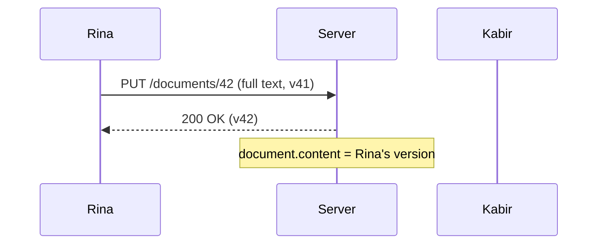

That's Day 0 working exactly as intended: single writer, single overwrite, no drama.

## Break It — Rina and Kabir Type at the Same Time

Now both of them open **Q3_Strategy** at the same starting version, v41.

Rina adds a sentence to the intro. Kabir adds a sentence to the conclusion. Neither can see the other's browser — they're just typing into their own local copy of the text.

Both hit save within the same second.

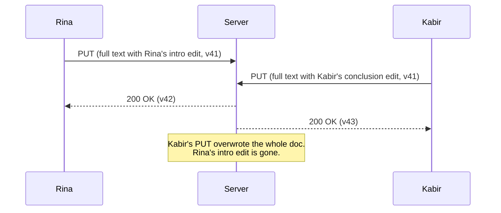

Kabir's request arrived second, so his version of the *entire document* — which still has the **old, un-edited intro**, because his browser never knew Rina had touched it — replaced Rina's version wholesale.

Rina's sentence isn't merged in. It isn't even in a conflict queue somewhere. It's just gone. She'll only find out if she happens to reload the page and notice her edit vanished.

This is **not a race condition you can shrug off as rare.** The moment you have two active editors on the same document, this is the default outcome, not an edge case — because "send the whole document" throws away all information about *what changed*, so the server has no way to combine two edits. It can only pick one.

### Why this specifically motivates the next step

The core problem isn't "the server is slow" or "we need a lock." It's that **we're sending state, not intent.** The server received two complete documents and had to guess which one was "right" — and it guessed by timestamp, which is exactly the wrong signal for this problem.

The fix has to start by sending *what changed*, not *what the document now looks like*. That's a small-sounding change, but it's the doorway into everything CRDTs and Operational Transformation exist to solve — because once you send individual operations instead of whole-document snapshots, you immediately hit a new question: what happens when two operations, sent independently, need to be applied *in some order* on every replica, and that order isn't obvious?

**Next up:** we stop sending the whole document and start sending individual edits — but that surfaces the real crux problem: two edits applied in a different order on different machines can produce two *different* final documents, even though each edit was individually correct. That's where the real fight begins.

Got it / next when ready.

---

## Evolve It — Attempt 1: Send Operations Instead of Snapshots

Let's fix the obvious problem first: stop sending the whole document, send just the *edit*.

Rina's browser now tracks what she typed, not just her final text. When she types the letter **"W"** at position 120, it sends:

```json
{ "op": "insert", "pos": 120, "char": "W", "baseVersion": 41 }
```

The server takes that operation and applies it directly to its own copy of the document — insert `"W"` at index 120. Simple, small, and it seems like it should compose cleanly: everyone just applies everyone else's little edits to their own copy, in the order they arrive.

### Concrete scenario: Rina and Kabir, same position

Both Rina and Kabir are looking at version 41 of the document. The text at that moment reads:

```
...our Q3 revenue grew.
```

Position 120 is right after `"grew"` — right before the period.

- Rina types **" significantly"** at position 120.
- Kabir, a beat later but still looking at the *same* v41 text on his screen, types **" substantially"** — also at position 120.

Both operations are individually valid: "insert this text at index 120" is a perfectly well-formed instruction against the document *they each saw*.

Here's what happens when both operations reach the server and get replayed in the order they arrived:

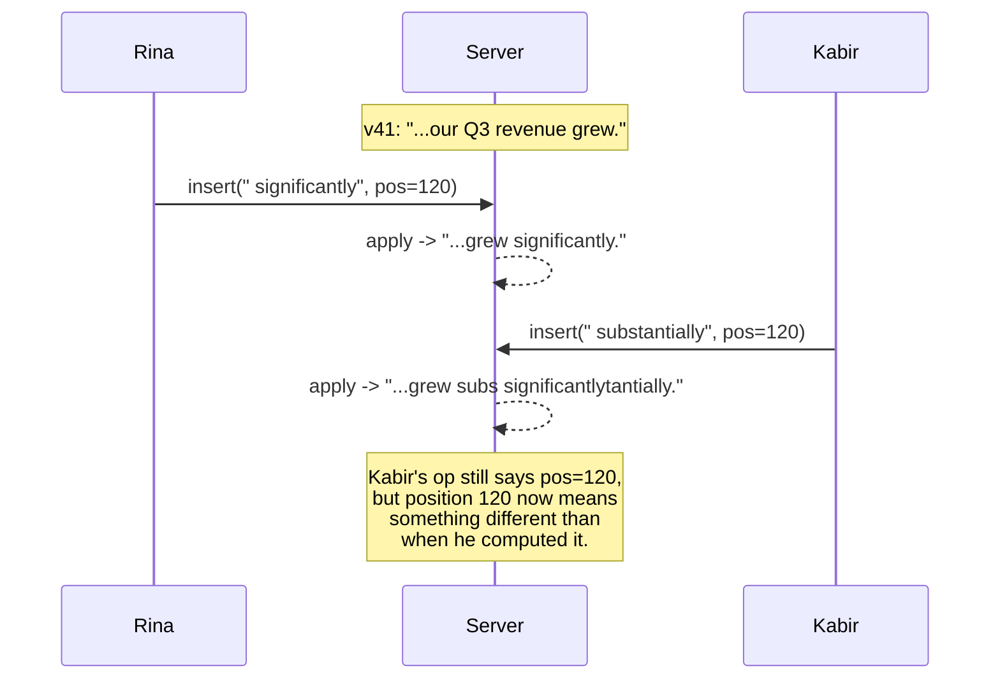

Kabir's operation was computed against a document that no longer exists on the server — the one *before* Rina's insert landed. But the server blindly applies `insert at index 120` to its *current* text, which already has Rina's words in it. The result is the two phrases interleaved into garbage: `"grew subs significantlytantially."`

### Why this specifically breaks

The bug isn't in either operation individually — each one was correct *relative to the document its author actually saw*. The bug is that **a raw position index is only meaningful against one specific version of the document**, and the server just replayed it against a different version without adjusting it.

This is worse than Day 0's failure, honestly. Before, we silently lost an edit — bad, but at least the text stayed readable. Now we get **interleaved corruption inside a single word.** Every user who's ever seen Google Docs briefly show `"stract"` and `"abstract"` mashed together mid-sync has seen a version of this bug leak through.

### The real question this exposes

We need some way to take an operation computed against an *old* version of the document and correctly re-express it against the *current* version — shifting its position to account for edits that happened in between. That transformation — "given what changed, adjust this other operation so it still means what it meant" — is exactly what **Operational Transformation (OT)** was invented to do, and it's also the problem CRDTs solve by a completely different route: by making positions *never ambiguous in the first place*, instead of fixing them up after the fact.

**Next up:** we look at OT's actual fix — transforming operations against each other — see the specific, nasty class of bugs that makes OT hard to get right at scale (it's not the two-user case, it's coordinating transforms across *every possible pair and order* of concurrent edits), and use that pain to motivate why CRDTs take a structurally different approach instead of patching this one.

Got it / next when ready?

---

## Evolve It — Attempt 2: Operational Transformation

Let's actually try the fix the last section pointed at: instead of replaying operations blindly, **transform** them against each other before applying.

The idea: if Kabir's operation was computed against v41, and the server has since applied Rina's operation to reach v42, don't just replay Kabir's op as-is. First **adjust** it — shift its position — so it means the same thing against v42 that it meant against v41.

### The transform function

This is the core primitive of OT. You write a function:

```
transform(opA, opB) -> opA'
```

Given two concurrent operations, it produces a version of `opA` that's safe to apply *after* `opB` has already been applied.

For our case: Rina's insert of `" significantly"` (14 chars) landed at position 120. Kabir's insert was also computed at position 120, against the pre-Rina document. So we transform Kabir's op:

```
transform(insert(" substantially", pos=120), insert(" significantly", pos=120))
  -> insert(" substantially", pos=134)   // shifted by len(" significantly")
```

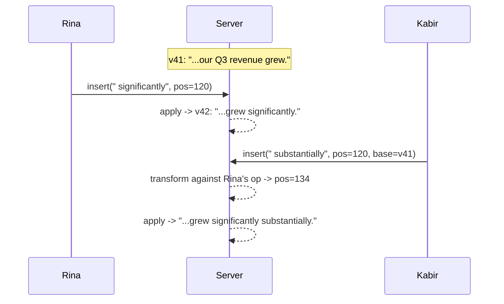

Both phrases survive, in a readable order. No corruption. This is a real fix, and it's what Google Wave and early Google Docs actually shipped.

### Why this is genuinely hard to keep correct

The two-operation case above looks clean. The problem is that in a live document, transforms don't happen in isolation — they compose, across many users, arriving in different orders at different replicas.

Say a third person, **Ana**, is also editing, and her operation needs to be transformed against *both* Rina's and Kabir's edits. The order you apply transforms in now matters:

- Transform Ana's op against Rina's, then against Kabir's-already-transformed-op
- vs. transform Ana's op against Kabir's, then against Rina's-already-transformed-op

These two paths have to land on the **exact same final position**, or documents on different replicas silently diverge — one server thinks Ana's word is at position 140, another thinks it's at 138, and now *that* server's future transforms are wrong too, compounding forever.

This property — that transforming in any valid order produces the same result — is called **TP2 (transformation property 2)**, and it's notoriously difficult to prove correct for a full operation set (insert, delete, formatting, etc.). Real-world OT implementations have shipped subtle TP2 violations that only show up under specific three-or-more-way concurrent edit sequences — bugs that are brutal to reproduce and debug, because they depend on exact timing and ordering across users.

The other structural cost: **OT typically wants a central server to be the arbiter of transform order** — a single place that decides "this is the canonical sequence operations get transformed against." That's workable for a client-server doc editor, but it means the correctness of the whole scheme leans on one component getting a genuinely intricate algorithm exactly right, for every operation type you ever add.

### The reframe that leads to CRDTs

OT's whole approach is: **positions are ambiguous once you go concurrent, so patch them up after the fact with a transform function.**

CRDTs ask a different question: **what if we designed the data structure so a raw numeric position was never used at all** — so "insert after this specific character" doesn't require knowing anyone else's edits to stay meaningful, no matter what order things arrive in?

If every operation can be applied in *any* order, on *any* replica, and always converges to the same result *without* a transform step or a central arbiter — that sidesteps TP2 entirely, because there's nothing to prove about transform ordering when there's no transform step.

That's the actual definition of a CRDT: **Conflict-free Replicated Data Type** — "conflict-free" meaning concurrent operations never require arbitration, by construction, not by a clever algorithm resolving conflicts after they happen.

**Next up:** the first real CRDT attempt for text — giving every character a unique, stable identity instead of a position — and the specific naive way people first tried this (and the specific way *that* breaks too, before we land on what real editors like Google Docs and Figma actually use today).

Got it / next when ready?

---

## Evolve It — CRDT Attempt 1: Unique IDs Instead of Positions

OT's problem was that a raw index like `pos=120` means different things depending on what else has been inserted. So the first CRDT idea is: stop using indexes entirely. Give every character a **unique, permanent identity** that never changes, no matter what anyone else inserts around it.

Instead of "insert 'W' at index 120," you say: **"insert 'W' between the character with ID X and the character with ID Y."** That statement stays true forever — those two characters don't move just because someone typed something between them.

### The naive way to build IDs: fractional positions

A simple way to make this work: assign each character a **number** instead of an index, and when you insert between two characters, pick a number *between* their numbers.

Document starts as three characters with IDs `1.0`, `2.0`, `3.0` — spelling, say, `"cat"`.

Rina wants to insert an `"h"` between `c` (id `1.0`) and `a` (id `2.0`), to make `"chat"`. She picks the midpoint:

```
insert("h", between 1.0 and 2.0) -> id 1.5
```

That's clean, and it composes: no matter what order this operation arrives at any replica, "insert `h` with id `1.5`" always slots between `1.0` and `2.0`. No transform needed. This already beats OT for the two-person case.

### Where it breaks: repeated insertion at the same gap

Now picture **Kabir**, rapid-fire correcting a typo, inserting several characters in a row all at the *same spot* — between the same two existing characters — because that's exactly what fast typing at one cursor position looks like.

- Insert 1 between `1.0` and `1.5` → id `1.25`
- Insert 2 between `1.0` and `1.25` → id `1.125`
- Insert 3 between `1.0` and `1.125` → id `1.0625`

Every new character has to fit in a shrinking gap, so the ID needs **twice the decimal precision of the previous one.** Type 60 characters in the same spot — completely normal behavior, not an edge case — and you need roughly 60 bits of precision just to represent the ID. Floats run out of precision. Even arbitrary-precision decimal strings grow the ID length linearly with how much local editing happens, which means IDs bloat storage and get slower to compare over time.

This is called the **identifier exhaustion problem**, and it's a direct consequence of trying to encode "betweenness" as a single dense number. There's no clever rebalancing that fully escapes it — you can periodically renumber, but that reintroduces the exact coordination problem CRDTs exist to avoid, because renumbering has to be agreed on by every replica.

There's a second, smaller problem hiding here too: what if **two different users** pick the *exact same* midpoint independently — say both insert at the gap between `1.0` and `2.0`, and both happen to compute `1.5`? We need a deterministic tie-break, and "purely numeric" IDs don't carry any built-in way to break that tie.

### The reframe

The fractional-number idea was half right: **identity, not position, is the key move.** What's wrong is *how* we built that identity — a single shrinking number.

The actual fix real systems use is to stop treating the document as a flat number line at all, and instead give each character an ID built from **who inserted it and a counter local to that user**, linked to its neighbor by *reference* rather than by a number that has to live forever in some numeric gap. That's the structure — closer to a linked list of immutable, uniquely-identified nodes than a sorted list of fractions — that avoids both identifier exhaustion and ties.

**Next up:** the real structure — each character carries `(site ID, local counter)` as its identity, references its left neighbor at insertion time instead of a numeric position, and we walk through exactly how two concurrent inserts at the same spot get a deterministic final order without any transform step and without unbounded ID growth. This is the actual mechanism behind what Google Docs, Figma, and Yjs use today.

Got it / next when ready?

---

## Evolve It — CRDT Attempt 2: The Real Mechanism (RGA-style Sequence CRDT)

Here's the structure that actually ships in production editors today.

Every character gets an ID made of two things: **which replica created it**, and **a counter local to that replica**. Something like `(siteId="rina", counter=7)`. No two replicas ever produce the same ID, because every replica has its own counter and its own name — no coordination needed to guarantee uniqueness.

Instead of a number saying *where* the character sits, each character stores a reference to **the character immediately to its left at the moment it was inserted.** That's it. Not a position — a pointer to a specific neighbor.

### Concrete scenario

Document `"cat"` currently looks like this internally — three nodes, chained by left-reference:

| ID | Char | Left neighbor |
|---|---|---|
| `(server, 1)` | `c` | — (start) |
| `(server, 2)` | `a` | `(server, 1)` |
| `(server, 3)` | `t` | `(server, 2)` |

Rina wants to insert `h` between `c` and `a`. Her operation says exactly that — not "at index 1," but:

```json
{ "op": "insert", "id": "(rina, 1)", "char": "h", "leftOrigin": "(server, 1)" }
```

That statement is permanently true. It doesn't matter what anyone else inserts anywhere else in the document — `h`'s left neighbor is still, and will always be, the specific character `(server, 1)`. There's no index to invalidate.

### Now the hard case: two people insert at the *same* spot, concurrently

Rina and Kabir are both looking at `"cat"`. Both decide to insert between `c` and `a`, at the same instant, without seeing each other's edit yet.

- Rina inserts `h` → `{ id: (rina, 1), char: "h", leftOrigin: (server, 1) }`
- Kabir inserts `u` → `{ id: (kabir, 1), char: "u", leftOrigin: (server, 1) }`

Both operations reference the *same* left neighbor, `(server, 1)`. Applied in either order, on any replica, both `h` and `u` end up between `c` and `a` — but which comes first, `"chuat"` or `"cuhat"`?

This is where the **deterministic tie-break** comes in. When two nodes claim the same left neighbor, every replica applies the *same rule* to order them — commonly, compare the site IDs and put the lexicographically larger (or smaller — the direction doesn't matter, only that everyone agrees) one first.

```
tie-break: (kabir, 1) vs (rina, 1) -> "kabir" > "rina" -> kabir's node wins the slot closer to left neighbor
```

Every replica, no matter what order the two inserts arrive in, runs this exact same comparison and lands on `"cuhat"`. No negotiation. No transform. No central arbiter. Just a pure function of the two operations' IDs.

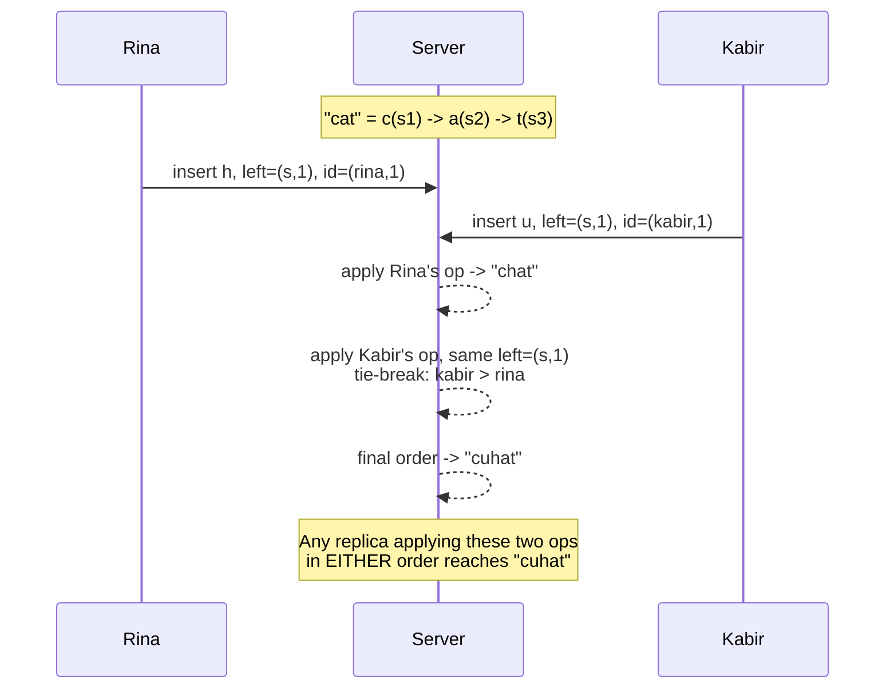

Swap the arrival order — Kabir's op reaches the server first — and you still get `"cuhat"`, because the tie-break rule doesn't care about arrival order, only about the IDs themselves. That's the convergence guarantee: **same set of operations, any order, same final document.** This property is called **commutativity**, and it's what "conflict-free" actually means here — not that conflicts can't happen, but that they resolve to the same answer no matter how they're interleaved.

### What about deletes?

Deletes don't remove the node — they mark it with a **tombstone**, a `deleted: true` flag, and keep it in the structure. This matters because someone else's *concurrent* insert might reference that exact character as its left neighbor — if you'd actually removed the node, that reference would dangle. Tombstoned nodes stay invisible in the rendered text but stay real as anchor points for other insertions.

### What we gained

- **No transform function, no TP2 correctness proof, no central arbiter.** Any two replicas that have seen the same set of operations converge to the same document, full stop.
- **Fully peer-to-peer capable.** Because there's no server-side transform step, a CRDT can even sync client-to-client, or work fully offline and merge later — OT structurally needs a server in the loop.

### What we gave up / new problem introduced

- **Storage overhead.** Every character is now a node with an ID, a left-reference, and a tombstone flag, instead of just being a byte in a string. A document that's been heavily edited (lots of deletes) accumulates tombstones forever unless you garbage-collect them, which itself needs coordination about when it's safe.
- **This node-per-character structure is the "meta-data bloat" real CRDT text implementations spend a lot of engineering effort minimizing** — production systems (Yjs, Automerge) use compressed run-length representations under the hood, not literally one full object per character, precisely because of this cost.

### What we considered and rejected

- **Fractional indexing (Attempt 1)** — rejected: identifier exhaustion under repeated same-spot inserts, no built-in tie-break.
- **OT (Attempt 2)** — rejected: requires a correctness-critical transform function per operation type, and structurally wants a central server arbitrating transform order.

| Approach | Convergence guarantee | Needs central server? | Offline-friendly? | Main cost |
|---|---|---|---|---|
| Raw positions (Day 0.5) | None | Yes | No | Silent corruption |
| OT | Yes, if TP2 holds | Yes (transform arbiter) | Poor | Transform correctness is hard to prove |
| Fractional CRDT | Yes | No | Yes | Identifier exhaustion |
| ID-based CRDT (RGA-style) | Yes, always | No | Yes | Storage/tombstone overhead |

### Likely interviewer follow-ups

**"Why not just use OT — Google Docs originally used it, right?"**
Fair point, and true historically. The honest answer: OT works, but every new operation type (bold, table insert, comment anchor) needs its own correct transform function, and proving TP2 for the *combination* of all of them gets combinatorially harder. CRDTs pay a storage cost but get correctness "for free" from the data structure — a better trade as the feature set grows, which is why newer collaborative editors (Figma, Notion's underlying tech, Linear) lean CRDT.

**"What stops the tombstones from growing forever?"**
Nothing, by default — this is a real known cost. The mitigation is that once you know all replicas have acknowledged an operation (no one can still be holding a stale reference to that character), it's safe to garbage-collect the tombstone. That "everyone's caught up" check is itself a small coordination problem, usually solved with version vectors, and it's exactly the kind of thing we'll want when we get to persistence.

We've now solved the crux — concurrent convergence without a central arbiter. Next stop is P1: persistence and late joiners, where we stop pretending this all lives in server memory and figure out what actually gets written to disk, and how someone who opens the doc after 500 operations gets caught up without replaying all 500.

Got it / next when ready?

---

## Evolve It — Persistence and Late Joiners

So far, every operation has lived in memory on one server, applied straight to an in-memory CRDT structure. That's fine until the server restarts, or until someone opens the document for the first time after 500 people have already edited it. We need durable storage, and a way for a late joiner to catch up without replaying every operation ever made.

### The naive first instinct, and why it's not quite enough

The obvious move: just persist the final rendered text, the way Day 0 did.

That's fine for *reading* the document, but it throws away exactly the thing that makes CRDTs work — the individual operations, with their IDs and left-references. If a client goes offline for ten minutes and comes back with three local edits it made while disconnected, those edits are operations referencing specific node IDs. Without the operation history, there's nothing for those late-arriving ops to merge against correctly. So we need to persist the **operations themselves**, not just the flattened text.

### The operation log

Every accepted operation gets appended to a durable, ordered log — one row per operation, never updated, only appended to.

```sql
CREATE TABLE doc_operations (
    doc_id       UUID,
    seq          BIGINT,        -- monotonic per doc_id, assigned at write time
    site_id      TEXT,          -- which client/user produced this op
    site_counter BIGINT,        -- that client's local counter (part of the char ID)
    op_type      TEXT,          -- 'insert' | 'delete'
    char_value   TEXT,          -- the character, for inserts
    left_origin_site TEXT,      -- left neighbor's site_id, for inserts
    left_origin_counter BIGINT, -- left neighbor's counter, for inserts
    target_site  TEXT,          -- for deletes: which node is being tombstoned
    target_counter BIGINT,
    created_at   TIMESTAMP,
    PRIMARY KEY (doc_id, seq)
);
```

**Who writes:** the collaboration server, one row per operation, the moment it accepts an op from any connected client — this is the append step, and it's the only writer.

**Who reads:** a client reconnecting or joining late, which reads a range of rows to reconstruct state; and the periodic snapshot job described below, which reads the full range since the last snapshot.

**Where this lives:** a wide-column store like **Cassandra** or **DynamoDB**, not a relational table on a single Postgres instance. The access pattern here is pure append-then-range-scan by `(doc_id, seq)` — never an update, never an arbitrary point query by some other field. That's exactly the shape wide-column stores are built for: fast sequential writes, cheap range reads on a clustering key, and horizontal scale by partitioning on `doc_id`. A relational DB would work at small scale, but you'd be paying for transactional/update guarantees this table never uses, and you'd hit a ceiling sharding a single-writer-heavy table across nodes the way Cassandra does natively.

### The problem this alone doesn't solve: replay cost

A document with 50,000 operations in its history — a doc that's been alive and actively edited for months — means every late joiner replays 50,000 rows and rebuilds the CRDT tree node by node before they can see a single character. That's a real, growing latency cost, and it only gets worse over the document's lifetime.

### The fix: periodic snapshots

A background process periodically takes the current in-memory CRDT state and serializes it wholesale into a snapshot, tagged with the `seq` it was taken at.

```sql
CREATE TABLE doc_snapshots (
    doc_id      UUID,
    seq         BIGINT,       -- log position this snapshot represents
    state_blob  BLOB,         -- serialized CRDT structure
    created_at  TIMESTAMP,
    PRIMARY KEY (doc_id, seq)
);
```

**Who writes:** a background **Snapshot Worker**, on a timer (e.g. every 500 operations or every 60 seconds of activity, whichever comes first) — not the collab server itself, so a slow snapshot never blocks live editing.

**Who reads:** a client joining or reconnecting, which fetches the *latest* snapshot first.

**Where this lives:** a **blob/object store** like S3, not the same wide-column table as the log. The access pattern here is "write occasionally, read one large blob by key" — a snapshot can be a few hundred KB to a few MB for a large doc, which is a poor fit for a wide-column row (most wide-column stores discourage large blob values per row) and a natural fit for object storage, which is built exactly for infrequent writes of large opaque payloads.

### The late-joiner flow

1. Client opens the doc, calls `GET /v1/documents/{docId}/state`.
2. **Document Service** looks up the latest snapshot: `SELECT * FROM doc_snapshots WHERE doc_id = ? ORDER BY seq DESC LIMIT 1`.
3. **Document Service** reads any operations *after* that snapshot's `seq`: `SELECT * FROM doc_operations WHERE doc_id = ? AND seq > ? ORDER BY seq ASC`.
4. Server deserializes the snapshot into a CRDT structure, then applies the handful of trailing operations on top — replaying tens of ops, not tens of thousands.
5. Server sends the reconstructed state to the client, who renders it and opens a live connection for anything new from this point forward (that live connection is next iteration's problem).

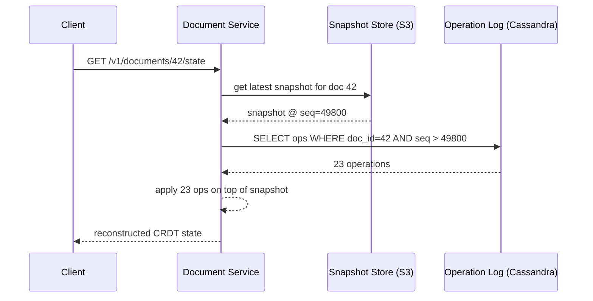

The operation log stays the source of truth — a snapshot is just a cached, precomputed reduction of it, so it's always safe to throw a snapshot away and rebuild from the log if something ever goes wrong with the snapshot itself.

### What we gained

Late joiners load in roughly constant time (one blob fetch plus a small tail replay) instead of time proportional to the document's entire history.

### What we gave up / new problem introduced

We now have two stores that can drift if the snapshot worker crashes mid-write, or if it snapshots at the wrong `seq`. We need the snapshot to be *derivable*, never authoritative — if it's ever corrupt or missing, falling back to a full log replay must still produce the correct state. That's why the log, not the snapshot, stays the source of truth.

### What we considered and rejected

- **Snapshot on every single operation** — rejected: turns every keystroke into a full-document serialize-and-upload, which is far more write load than the append-only log for no benefit.
- **Never snapshot, always replay full log** — rejected: this is what we started with, and it doesn't scale with document age.
- **Store the log in the same store as the snapshot (e.g. both in S3)** — rejected: S3 doesn't give you cheap ordered range scans by `seq`, which the log needs constantly; it's fine for the snapshot's "fetch one blob by key" pattern but wrong for the log's pattern.

### Likely interviewer follow-ups

**"What if the snapshot worker and a live edit race — could a snapshot capture a half-applied state?"**
No, because the snapshot worker reads the collab server's in-memory CRDT state at a single point in time, tagged with whatever `seq` that state corresponds to. It's not reading the log mid-write; it's a consistent read of memory, so it's always internally coherent — the only risk is being *stale by a few ops*, which the tail-replay step covers.

**"Why not just replicate the operation log to every client and let them rebuild locally, instead of a server-side Document Service?"**
That's actually closer to how fully peer-to-peer CRDT systems work, and it's a legitimate alternative. The trade-off: it pushes replay cost and snapshot logic onto every client device, including phones on slow connections, and gives up a natural place to enforce access control on who can read the log. For a Google-Docs-style product with a client-server trust model already, doing reconstruction server-side is simpler and cheaper for the client.

We've now got durable storage and fast catch-up for one document on one server. But we've been quietly assuming a single collab server handles a document's live traffic — next iteration is where that assumption breaks: what happens when a document gets popular enough, or the user base spread out enough, that one server holding the CRDT state in memory and fanning out WebSocket messages isn't enough.

Got it / next when ready?

---

## Break It — One Popular Document, One Server's Memory

Right now every live edit flows through a single **Document Service** instance holding the CRDT state for a document in memory, and pushing every accepted operation out over WebSocket to every connected client on that same instance.

That works for Rina and Kabir. It stops working for **"Q3_AllHands_Notes"** — a document 400 people in a company have open during a live all-hands, all typing comments and reactions into the same doc at once.

### Where this actually breaks

**Memory and CPU on one box.** Every operation from any of the 400 clients has to be applied to the same in-memory CRDT tree, on one instance. Even without contention bugs, that instance is now doing 400 people's worth of CRDT-apply work and fanning out 400 WebSocket messages per operation, serially, on hardware sized for a handful of concurrent editors.

**A single point of failure.** If that one instance crashes, all 400 people lose their live connection simultaneously, and — worse — any operation accepted into memory but not yet flushed to the operation log is gone, because there's only one copy of "current truth" and it lived in one process's RAM.

**No horizontal path.** Even if we just add more Document Service instances behind a load balancer, that doesn't help *this* document — a new WebSocket connection for Q3_AllHands_Notes could land on a totally different instance than the one already holding that doc's CRDT state in memory, and now two instances think they each independently own the authoritative in-memory copy of the same document. Two "authoritative" copies of mutable state is exactly the split-brain problem we spent the whole crux section avoiding.

### The fix has to be about ownership, not just adding boxes

The problem isn't raw capacity — it's that **"which server holds this document's live state" is currently undefined**, so we can't safely add more servers without them stepping on each other for the same doc.

**Next up:** we make document ownership explicit — shard documents across Document Service instances by `doc_id`, so exactly one instance owns any given document's live in-memory state at a time, and route every client for that doc to that instance. Then we look at *how* clients find the right instance, what happens when that instance dies, and where the WebSocket fanout layer fits relative to that owner.

Got it / next when ready?

---
## Evolve It — Sharding Document Ownership Across Instances

The fix: make exactly one **Document Service** instance the *owner* of any given document's live CRDT state, at any given time. Every client editing that doc gets routed to that one owner. No other instance is allowed to hold that doc's in-memory state concurrently.

### Candidate shard keys

**Shard by `doc_id`.** Each document is owned by exactly one instance, determined by hashing `doc_id`. This is the obvious candidate, and it directly matches our access pattern: every operation for a doc needs to land on the *same* in-memory CRDT tree to apply cleanly, and every client for that doc needs the *same* live WebSocket fanout target. There's no query here that spans multiple documents at once — collaborative editing is inherently a per-document problem — so there's no competing access pattern pulling us toward a different key.

**Shard by `org_id` (co-locate all of one company's docs on one instance).** This would optimize a query we don't have — "load all documents for this org" — at the cost of the query we do have constantly: routing a single doc's live traffic. It also creates an obvious hotspot: a large customer's all-hands doc and their entire org's other traffic would compete for the same instance's memory, for no benefit.

**Shard by `user_id` (route based on who's connecting).** This breaks immediately for the core requirement — if Rina and Kabir are both editing the same doc, sharding by user_id could route them to *different* instances, and now we're back to split-brain on a single document's state, which is the exact problem we're trying to solve.

So `doc_id` is the only candidate that actually matches the access pattern. It's not close.

### Does this create hotspots?

Yes, for one specific case: a single wildly popular document — our 400-person all-hands doc — puts all of its load on one instance no matter how many total instances exist in the fleet, because sharding by `doc_id` means one *whole* document lives on one node.

This is a **hot-key problem**, not a hot-shard-range problem — the fix isn't rebalancing ranges, it's capacity planning for the single-document case specifically. In practice: cap how much CPU/memory work one instance does per document (batch and coalesce operations under extreme load, discussed more when we hit failure handling), and treat "one doc, thousands of concurrent editors" as a distinct scaling problem from "many docs, normal edit rates" — Google Docs and Figma both have real, lower limits on simultaneous editors per document for exactly this reason.

### What resharding costs

We use **consistent hashing** over `doc_id`, not a fixed `hash(doc_id) % N` mod-based split. This matters specifically because our fleet size changes — instances get added for capacity, or die and get replaced.

With mod-based sharding, adding one instance to a 10-node fleet reshuffles roughly 90% of documents to new owners, because `% N` changes for almost every key when `N` changes. With consistent hashing, adding a node only moves the documents whose position on the hash ring falls in that node's new slice — roughly `1/N` of all documents, not nearly all of them. That bounds the blast radius of scaling the fleet up or down to a small, predictable fraction of live documents having to re-establish their owner.

### How a client finds the right owner

```
GET /v1/documents/{docId}/owner
```

A lightweight **Routing Service** (stateless, horizontally scaled, no per-doc memory of its own) holds the consistent hash ring and answers "which Document Service instance owns this doc_id right now." The client hits this once, gets back an instance address, and opens its WebSocket directly to that instance.

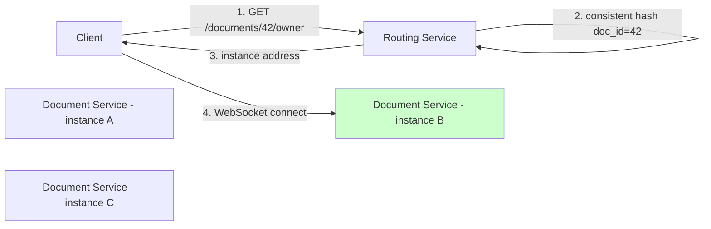

### What happens when the owner dies

If instance B (owning doc 42) crashes, its in-memory CRDT state is gone — but that's fine, because the operation log in Cassandra is the durable source of truth, not the in-memory copy. The **Routing Service** detects the failure via health check, reassigns doc 42's ring slot to a live instance, and the next client request for doc 42 gets routed to the new owner. That new owner rebuilds state the same way a late joiner does — latest snapshot plus tail replay from the log — so no data is lost, only a brief reconnect blip for anyone actively editing.

This is exactly why we made the operation log authoritative back in the persistence iteration, rather than trusting in-memory state as ground truth — this failure case is the payoff of that decision.

### What we gained

Documents scale roughly linearly with fleet size, because each doc's load lands on exactly one instance's slice of capacity, and instance failures self-heal without data loss.

### What we gave up / new problem introduced

We now depend on a Routing Service being correct and available — if it's wrong about who owns a doc, or if two clients get stale, conflicting answers during a reassignment window, we're back to the split-brain risk we were trying to eliminate. We'll need the routing layer itself to be highly available and to handle reassignment as an atomic-enough operation that two instances never both believe they own the same doc at once.

### What we considered and rejected

- **No sharding, just vertical scaling (bigger boxes)** — rejected: has a hard ceiling, and still gives zero fault tolerance — one crash still takes down every document on that box.
- **Mod-based sharding (`hash(doc_id) % N`)** — rejected: reshuffles almost the entire fleet's document ownership on every scaling event, causing mass reconnects.
- **Shard by `org_id` or `user_id`** — rejected above: doesn't match the access pattern, and user_id sharding actively breaks correctness for shared docs.

### Likely interviewer follow-ups

**"What stops two Document Service instances from both briefly thinking they own the same doc during a reassignment?"**
The Routing Service needs reassignment to be effectively a single atomic switch — e.g., using a lease with a TTL that the old owner must hold and renew to keep serving, so a crashed owner's lease expires and only *then* does the ring hand ownership to a new instance, rather than the switch happening the instant a health check fails.

**"Why not just let any instance handle any doc and use a distributed lock per operation instead of sharding ownership?"**
That would work for correctness but is far more expensive — a lock acquisition round-trip on every single keystroke-level operation, instead of once per WebSocket connection. Sharding ownership pays the coordination cost once, at connect time, not on every operation.

We've now got documents sharded across a fleet with clean failure recovery. Next problem: we've been saying "the owner pushes operations out over WebSocket to clients," but we've glossed over exactly how the WebSocket fanout layer relates to the owner instance, and what happens to that fanout when we're not just running one big city's data center but users are spread across continents — which is where multi-region ownership becomes the hard question.

Got it / next when ready?

---

## Evolve It — The Live Edit Flow, End to End

We've established *who* owns a document's live state. Now let's nail down exactly what happens between "Rina presses a key" and "Kabir sees the character appear" — the actual request/response shapes, not just the concept.

### Two separate connections, one purpose

Each client holds a **WebSocket connection directly to the Document Service instance that owns their doc** — the one the Routing Service pointed them to. There's no separate "gateway" layer sitting in front of the owner for this; the owning instance *is* the WebSocket endpoint for every client editing that doc, because it's the only place with that doc's live CRDT state in memory.

If you have many documents on many instances, the WebSocket connections are naturally spread across the fleet already, since each instance only holds sockets for the docs it owns.

### The write flow, step by step

Rina types the letter **`x`** at the end of `"cuhat"`. Her client already knows the CRDT structure locally — it applied the character to its own local copy instantly for local echo — and it now needs to broadcast the operation.

**Step 1 — Client sends the operation over the existing WebSocket:**

```json
{
  "type": "op",
  "docId": "doc-42",
  "op": {
    "id": { "site": "rina-device-7", "counter": 219 },
    "type": "insert",
    "char": "x",
    "leftOrigin": { "site": "kabir-device-3", "counter": 1 }
  }
}
```

**Step 2 — Document Service (the owner instance) receives it, applies it to the in-memory CRDT tree**, using the same left-origin + tie-break logic from the crux iteration. This is a local, in-memory operation — no network round trip yet.

**Step 3 — Document Service appends the operation to the durable log**, the `doc_operations` table from the persistence iteration:

```sql
INSERT INTO doc_operations
  (doc_id, seq, site_id, site_counter, op_type, char_value,
   left_origin_site, left_origin_counter, created_at)
VALUES
  ('doc-42', 50824, 'rina-device-7', 219, 'insert', 'x',
   'kabir-device-3', 1, now());
```

This write has to complete — or at least be durably queued — before Step 4, because once other clients have seen an operation, we can't afford to lose it if this instance crashes a moment later.

**Step 4 — Document Service broadcasts the operation to every *other* connected client for this doc** over their existing WebSocket connections:

```json
{
  "type": "op",
  "docId": "doc-42",
  "op": { "id": {"site":"rina-device-7","counter":219}, "type":"insert", "char":"x", "leftOrigin": {"site":"kabir-device-3","counter":1} },
  "seq": 50824
}
```

Kabir's client receives this, applies the operation to its own local CRDT structure using the same deterministic logic, and re-renders. Rina's own client does *not* need this message back — it already applied the operation locally in Step 0, before sending.

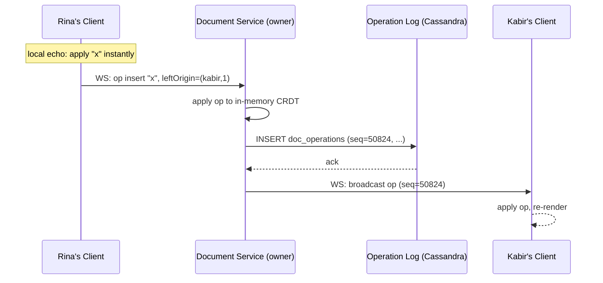

### Branch point: what if the log write is slow or fails?

**Happy path (above):** apply in memory, append to log, then broadcast — broadcast only happens after the durable write succeeds, so nothing gets shown to other users that isn't already safely persisted.

**Log write fails or times out:** the Document Service does **not** broadcast the operation, and returns an error/nack to Rina's client over the WebSocket. Rina's client already showed `"x"` locally via local echo, so on a nack it has to locally *revert* that character — this is the one sharp edge of optimistic local echo, and it's why the client keeps a small buffer of "operations sent but not yet acknowledged" rather than treating local echo as final.

This is also where **idempotency** matters: if Rina's client doesn't get an ack in time and retries the same operation, the operation's ID `(rina-device-7, 219)` is already globally unique and deterministic — replaying an insert with an ID that already exists in the CRDT is a safe no-op, not a duplicate character. The CRDT's structure gives us idempotent retries for free, which is a nice side effect of the identity-based design from the crux section.

### What's unchanged here

The late-joiner flow (snapshot + tail replay) from the persistence iteration is untouched — a new client still calls `GET /v1/documents/{docId}/state` once, then opens the WebSocket for everything after that point.

### Likely interviewer follow-ups

**"Why apply-then-log instead of log-then-apply?"**
Actually, real systems often prefer log-then-apply — write to the log first, then apply to memory and broadcast only after the log confirms — specifically so that "broadcasted" always implies "durable," never the reverse. What I described applies in-memory first for speed, but the important invariant is that **broadcast must never happen before the durable write is confirmed** — whichever order gets you there safely is fine; log-then-apply is actually the more conservative and common choice.

**"What if the WebSocket broadcast to Kabir fails but the log write succeeded?"**
That's fine — the log is the source of truth, not the broadcast. Kabir's client will simply be behind until it reconnects or its connection recovers, at which point it either gets the missed op replayed by the owner (if the owner tracks last-acked seq per client) or, in the worst case, falls back to the same snapshot-plus-tail-replay path a fresh late joiner uses.

We've now got a complete single-region live edit flow: local echo, durable append, broadcast, and safe failure handling. Next up is the piece we flagged earlier — users spread across continents, where cross-region latency makes "one owner instance" for a doc start to hurt, and we have to decide how write ownership and cross-region sync actually work.

Got it / next when ready?

---

## Evolve It — Multi-Region

Everything so far assumes Rina and Kabir are both, say, in Bangalore, talking to a Document Service instance in the same region. Now picture **Ana in São Paulo** joining the same `Q3_AllHands_Notes` doc, talking to a single owner instance that's pinned, by our consistent-hash ring, to a data center in India.

Every keystroke Ana types has to cross an ocean before she even gets local... wait, no — local echo still makes *her own* typing instant. But every operation from Rina or Kabir has to cross that same ocean before Ana's screen updates, and vice versa. That's not a correctness problem, it's a **latency** problem: collaborative editing feels laggy the moment cross-region round-trips are in the critical path of seeing someone else's edit.

### Where write ownership lives

This is the actual hard decision, not "just deploy in three regions."

For this system, ownership stays **per-document, single-owner** — exactly what we built in the sharding iteration — but now we make the *placement* of that owner deliberate instead of arbitrary. Two real options:

**Option A — home-region-per-document, based on where the doc was created / where most editors are.** `Q3_AllHands_Notes`, created by someone in Bangalore with 380 of 400 attendees also in India, gets its owner instance placed in the India region. Ana in São Paulo pays the cross-region latency, but she's the minority case for *this* document.

**Option B — home-region-per-user, with per-document ownership following whoever's been most active recently.** More adaptive, but now ownership can migrate mid-session, which reintroduces exactly the "who's authoritative right now" handoff complexity we just finished solving in the sharding iteration — and it's not clearly better, because a doc with truly global concurrent editors (like our 400-person case) doesn't have one "right" region anyway.

We go with **Option A** — static home-region per document, decided at creation time (or migrate rarely, as a deliberate admin action, not automatically). It's simpler, and it matches reality: most documents have a clear regional center of gravity — a team's doc, a company's regional office notes — even if a handful of editors are elsewhere.

### Why this avoids true multi-writer conflict resolution entirely

Because exactly one instance, in exactly one region, is ever the owner applying operations to the in-memory CRDT and appending to the log — **every region's clients are just WebSocket clients of that one owner**, no different in kind from Rina and Kabir being clients of a same-region owner. Ana's client sends her operations over a longer WebSocket hop, but they still go through the same single apply-then-log-then-broadcast pipeline we already built.

This is the key move: we're not running independent CRDT replicas per region that later need to merge. We have **one CRDT replica, one region, and everyone else is a remote client of it.** That sidesteps cross-region conflict resolution by construction — there's only one writer, full stop, so there's nothing to reconcile.

The trade-off is honest: non-home-region users pay real latency on seeing others' edits (though never on their own typing, thanks to local echo). That's the accepted cost of avoiding multi-writer complexity, and it's the same trade Google Docs itself makes — a document has an operational home shard, not independent per-region copies being merged.

### What a genuinely different approach would have cost

A true multi-writer design — an owner *per region*, each accepting local writes and merging asynchronously — is exactly what CRDTs are *capable* of supporting, since commutative merge doesn't require a single writer. But it would mean:

- Every region's operation log needs cross-region replication to every other region's log, so each region's CRDT eventually incorporates everyone else's ops.
- "Which region saw an op first" becomes meaningless as a source of truth; you'd need version vectors (one counter per region) to know what each region has and hasn't seen yet, to know when it's safe to reply to a late-joiner or garbage-collect tombstones.
- Read-after-write within a region is still fine, but a user in São Paulo could briefly *not see* an edit Rina made in Bangalore two seconds ago — genuine cross-region eventual consistency, not just a network delay on an otherwise-single-truth pipeline.

That's a real, buildable system — it's roughly the shape of how **DynamoDB Global Tables** or CRDT-based systems like Riak handle true multi-region writes — but it's meaningfully more complex for a benefit this system doesn't need: a live editing session doesn't need every region to accept writes locally, it needs the *typing experience* to feel local, and local echo already delivers that for the thing that actually matters — your own keystrokes appearing instantly.

### What consistency model falls out of single-owner-per-doc

**Read-your-writes:** guaranteed, trivially — local echo means your own edits are visible to you the instant you type them, before any network round trip.

**Cross-user consistency:** effectively **sequential consistency relative to the single owner** — every client, regardless of region, sees operations in the exact same order, because they're all consuming the same broadcast stream from the same single owner appending to the same log in `seq` order. What varies by region is *only* latency to receive that stream, never the order or the final content.

The concrete scenario where staleness matters: Ana in São Paulo might see Rina's edit 200ms later than Kabir in Bangalore does. She'll never see it *out of order*, and she'll never see a *different final document* — just a later arrival of the same true sequence.

### What we gained

No cross-region conflict resolution logic, no version vectors, no eventual-consistency edge cases to reason about or explain in an interview — global users share one deterministic operation order.

### What we gave up / new problem introduced

Non-home-region users have real, unavoidable added latency on *receiving* others' edits — bounded by network geography, not by anything we can architect away without taking on multi-writer complexity.

### What we considered and rejected

- **Per-region CRDT replicas with async merge** — rejected: solves a latency problem this product doesn't critically need solved, at the cost of real complexity (cross-region replication, version vectors, genuine eventual consistency for cross-user visibility) — the kind of cost that's worth it for something like a globally-writable database, less clearly worth it for "how fast do I see my coworker's edit."
- **Per-user home region with ownership migration** — rejected in Option B above: reintroduces dynamic ownership handoff complexity without a clean "right answer" for genuinely global documents.

### Likely interviewer follow-ups

**"What if the doc's home region goes down entirely — is that document just unavailable everywhere?"**
Yes, for live editing, until failover — this is the real cost of single-owner-per-doc. The mitigation is the same one from the sharding iteration: the operation log should itself be replicated cross-region (a Cassandra table can do multi-region replication under the hood), so a *new* owner can spin up in a healthy region and rebuild from snapshot-plus-log, even though the original region is down. The document's "home" is really "wherever the current owner is," and that can fail over — it just doesn't run multi-writer *simultaneously*.

**"Doesn't this mean São Paulo users have a worse product experience than Bangalore users, permanently, for this doc?"**
Yes, and that's an accepted, bounded trade — typically 150–250ms of extra one-way latency for cross-continent hops, which is noticeable but not broken, versus a fundamentally more complex multi-writer system to shave that down. If a company's user base were genuinely, permanently balanced 50/50 across two continents for the *same* document at high frequency, that's the signal to reconsider — but that's a narrow case, not the common one.

We've now covered the full architecture: convergence, persistence, sharded ownership, and multi-region placement. That's the whole scoped system. Next message, I'll pull it all together — the full recap diagram, every end-to-end path restated cleanly, a "why not X" cheat sheet, and then either we drill into any one piece deeper or I run a mock interviewer Q&A on the whole thing.

Got it / next when ready?

---

## Full Architecture Recap

### Complete system diagram

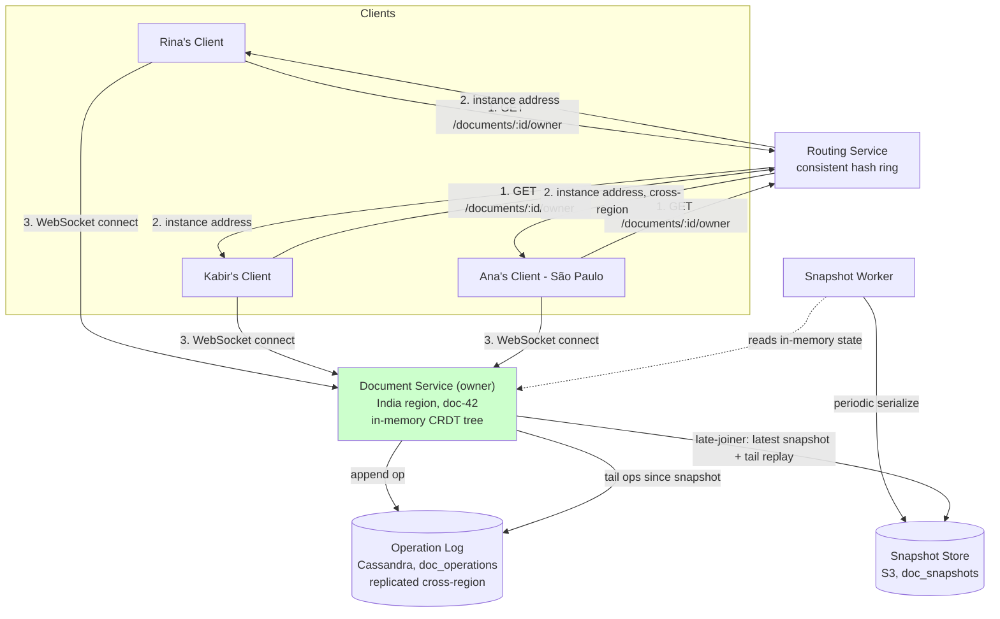

### Every end-to-end path

**1. Write path (live edit)**
1. Client applies keystroke locally (local echo), sends op over WebSocket
2. Owning Document Service applies op to in-memory CRDT (ID + left-origin + tie-break)
3. Document Service appends op to `doc_operations` (Cassandra)
4. On durable ack, Document Service broadcasts op to every other connected client
5. On log failure, Document Service nacks sender, which locally reverts the optimistic character

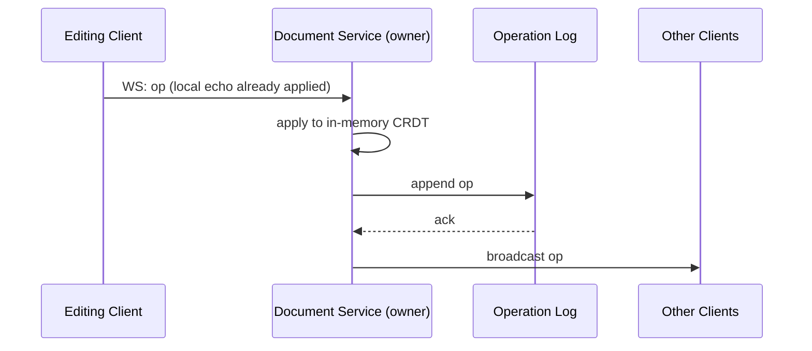

**2. Late-joiner / reconnect read path**
1. Client calls `GET /documents/{docId}/state`
2. Document Service fetches latest snapshot from S3
3. Document Service reads tail ops from Cassandra since snapshot's `seq`
4. Server replays tail onto snapshot, returns reconstructed state
5. Client opens WebSocket for live updates from that point forward

**3. Ownership resolution / routing path**
1. Client calls `GET /documents/{docId}/owner`
2. Routing Service consistent-hashes `doc_id` to find current owner
3. Client connects WebSocket directly to that owner instance
4. On owner failure, health check trips, lease expires, ring reassigns, client reconnects to new owner which rebuilds via path 2

**4. Snapshot compaction path (background)**
1. Snapshot Worker triggers on timer/op-count threshold
2. Reads owner's in-memory CRDT state at current `seq`
3. Serializes and writes blob to S3, tagged with `seq`
4. Old snapshots may be retired once superseded (log remains authoritative regardless)

### Why-not-X arsenal

| Question | One-line answer |
|---|---|
| Why not OT instead of CRDTs? | OT needs a provably-correct transform function per op type (TP2) and a central arbiter; CRDTs get convergence from data structure alone, which scales better as features (formatting, comments) grow. |
| Why not last-write-wins on the whole document? | Throws away concurrent edits entirely — Day 0's failure mode, silent data loss the moment two people edit at once. |
| Why not raw numeric positions for CRDT ordering? | Positions shift meaning as other edits land; ID + left-origin references never need reinterpretation. |
| Why not fractional indexing for character identity? | Identifier exhaustion under repeated same-spot inserts (fast typing), plus no built-in tie-break for simultaneous same-gap inserts. |
| Why not shard Document Service by `user_id` or `org_id`? | `user_id` can split concurrent editors of the same doc across instances (split-brain); `org_id` co-locates unrelated docs and creates hotspots without matching any real query pattern. |
| Why not mod-based sharding (`hash % N`)? | Reshuffles ~90% of document ownership on every scaling event; consistent hashing bounds it to ~1/N. |
| Why not per-region CRDT replicas with async merge for multi-region? | Solves a latency problem this product doesn't critically need solved, at the cost of version vectors and genuine cross-region eventual consistency. |
| Why not a distributed lock per operation instead of sharded ownership? | Pays a lock round-trip on every keystroke instead of once per connection — far more expensive at the actual traffic granularity. |
| Why not snapshot on every operation? | Turns every keystroke into a full-document serialize-and-upload; log-only appends are far cheaper, and tail replay is already fast. |

### What's next

I can go one of two ways from here:

1. **Drill deeper** into any single piece — e.g., tombstone garbage collection with version vectors, how rich formatting (bold/tables) extends the CRDT, or the offline-editing case we scoped out at the start.
2. **Mock interview** — I play interviewer and pressure-test you on the whole design, cold, the way an actual L4/L5 loop would.

Which one?

---

## Offline Sync — Going Deep

### The concrete scenario

Rina boards a flight from Bangalore to Dubai. Her laptop is still open to `Q3_AllHands_Notes`, but she's got no network for the next three hours.

She keeps typing anyway — adding a paragraph: *"The results are strong this quarter."*

Meanwhile, back on the ground, **Kabir is still connected**, and he inserts `"(preliminary)"` right after the word `"results"` — in roughly the same part of the document Rina is editing, completely unaware she's mid-flight and mid-edit on the same area.

When Rina lands and her laptop reconnects, both sets of edits need to end up in the same final document, correctly merged, without her replaying a manual "resolve conflicts" dialog.

### Why local echo already does most of the work

Go back to how local echo works: when Rina types, her client applies the operation to its **own local CRDT structure immediately** — it never actually waited for a server round-trip to show her the character. That was true even when she was online.

So "offline" doesn't change what happens on Rina's screen at all. It only changes one thing: instead of also sending each operation over the WebSocket right away, her client has nowhere to send it, so it has to **hold onto those operations** until connectivity comes back.

This is the key insight that makes offline "almost free" with CRDTs: we're not inventing a new mechanism for offline editing. We're reusing the exact same operation objects — `{id, char, leftOrigin}` — that already flow through the live-edit path. The only new piece is a local queue to hold them temporarily.

### The naive instinct, and why it's wrong

The tempting shortcut: while offline, just keep a local copy of the whole document, and when you reconnect, **send the whole thing** and let the server figure out the diff.

This is Day 0's mistake again, just delayed. If Rina's client sends her entire local document state on reconnect, and the server naively applies it, we're back to whole-document overwrite — Kabir's `"(preliminary)"` insert, which happened while Rina was offline, either gets silently discarded or causes exactly the corruption we spent the whole crux section solving.

The fix is the same fix as before: don't send state, send **operations** — specifically, the individual ops Rina generated while offline, each with its own stable ID and left-origin reference, exactly like every other operation in this system.

### The local outbox

While offline, instead of sending an op over the WebSocket, the client writes it to a local, persistent queue on the device.

```
Local Outbox (IndexedDB, per-device, per-doc)
{
  docId: "doc-42",
  op: {
    id: { site: "rina-device-7", counter: 220 },
    type: "insert",
    char: "T",
    leftOrigin: { site: "rina-device-7", counter: 219 }
  },
  status: "pending"   // 'pending' | 'sent' | 'acked'
}
```

**Who writes:** the client's local sync engine, once per operation, the moment it's generated locally and the WebSocket isn't available (or is available but hasn't confirmed the previous send — same queue, same code path either way).

**Who reads:** the same client's sync engine, when it detects the connection has come back and begins flushing.

**Where it lives:** on-device persistent storage (IndexedDB in a browser, SQLite on mobile) — not the server. This has to survive the app being closed and reopened mid-flight, not just a live in-memory array, or a laptop restart during the flight loses three hours of edits.

One detail worth being explicit about: **Rina's local counter (`site: rina-device-7`) keeps incrementing while offline, exactly as it would online.** It's a per-device counter, not something the server hands out — so operation IDs generated offline are just as globally unique as ones generated online. Nothing about ID generation depends on connectivity at all.

### Reconnection: two things happen, in a specific order

When the network comes back, the client has two jobs: **catch up on what it missed**, and **push what it queued**. Order matters here — catch up first, then push.

**Step 1 — Client asks for what it missed**

```
GET /v1/documents/doc-42/state?sinceSeq=50822
```

`50822` is the last `seq` this client had successfully applied before going offline — it stored that locally, alongside the outbox.

**Step 2 — Document Service reads the delta from the operation log** (the same table from the persistence iteration):

```sql
SELECT * FROM doc_operations
WHERE doc_id = 'doc-42' AND seq > 50822
ORDER BY seq ASC;
```

This includes Kabir's `"(preliminary)"` insert, and anything else that happened in the room while Rina was airborne.

**Step 3 — Client applies those ops to its local CRDT structure**, on top of the state it already has — which includes Rina's own offline edits, already applied via local echo.

This is the step that actually resolves the "conflict." But notice: there's no special merge routine here. It's the exact same `apply(op)` function used for every live operation, using the same ID + left-origin + tie-break logic from the crux section. Kabir's insert references a left-origin that still exists in Rina's local tree (possibly as a tombstone — more on that below), so it slots in deterministically, same as if Rina had been online the whole time and just received it a few hours late.

**Step 4 — Client flushes the outbox**, sending each queued operation over the now-live WebSocket, one at a time or batched:

```json
{ "type": "op_batch", "docId": "doc-42", "ops": [
  { "id": {"site":"rina-device-7","counter":219}, "type":"insert", "char":"T", "leftOrigin": {...} },
  { "id": {"site":"rina-device-7","counter":220}, "type":"insert", "char":"h", "leftOrigin": {...} }
]}
```

Each of these hits the **normal write path**, unchanged: Document Service applies it, appends it to `doc_operations` with a *fresh* `seq` (assigned now, at flush time — not back when Rina typed it), and broadcasts it to everyone currently connected, including Kabir.

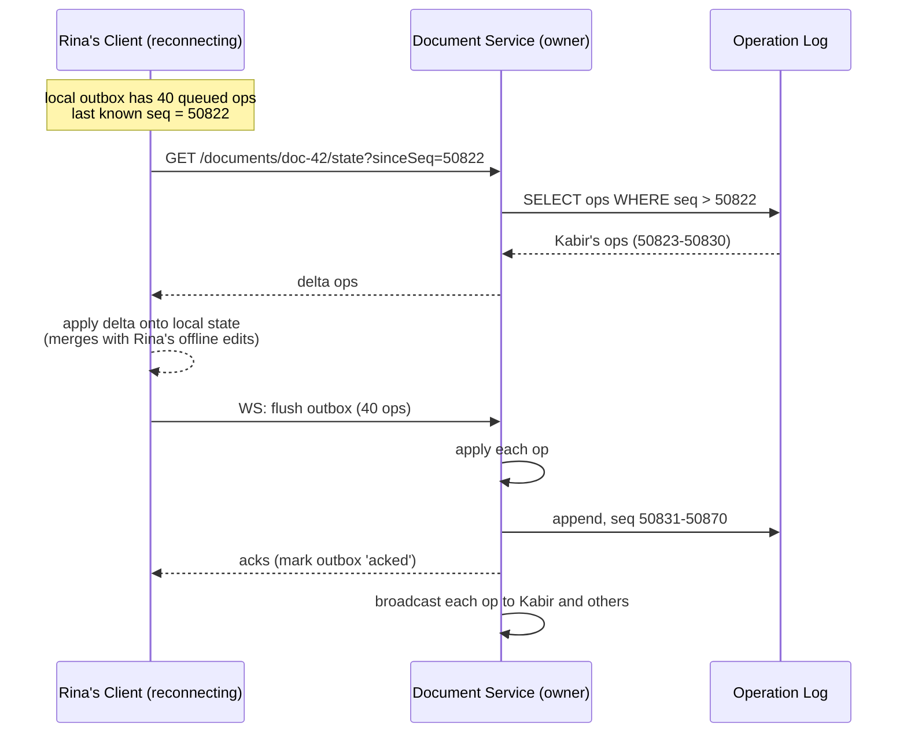

Notice the ordering isn't actually load-bearing for *correctness* — CRDT operations are commutative, so applying Kabir's ops before or after flushing Rina's queue converges to the same final document either way. We fetch-then-flush mainly so Rina's own client renders the merged view immediately, rather than watching her own queued edits land one-by-one after a delay.

### Why tombstones matter here specifically

Say Kabir, while Rina was offline, **deleted** a word that Rina's own offline edit was anchored to — her `leftOrigin` pointed at a character he removed.

This is exactly why deletes are tombstones, not real removals, from the crux section. Kabir's delete just flips a `deleted: true` flag on that node; the node itself, and its ID, still exist in the structure. When Rina's offline op arrives referencing that ID as its left-origin, the reference still resolves — the character is invisible in rendered text, but it's still there as a valid anchor point. If we'd actually deleted the node, Rina's offline-generated op would be referencing something that no longer exists, and we'd be back to needing special-case repair logic. Tombstoning is what makes "an op referencing something that changed while you were gone" a non-event instead of a dangling pointer.

### Client connectivity states

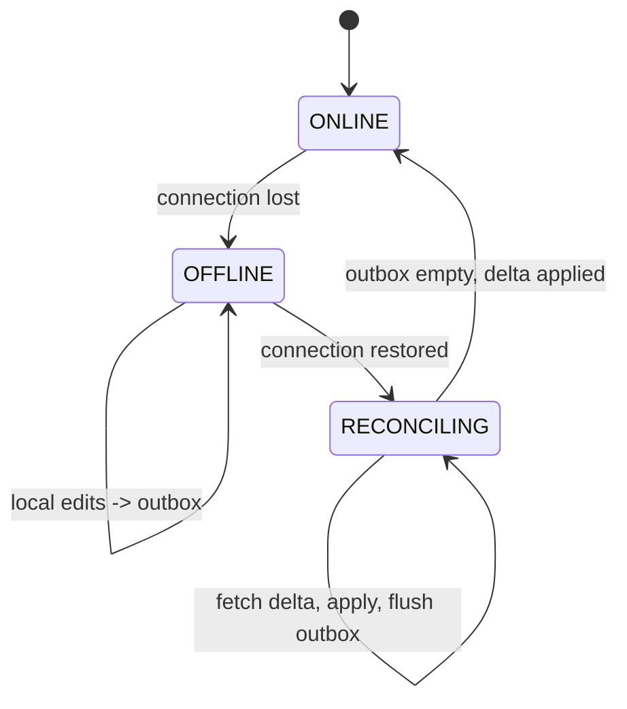

`RECONCILING` is a real, distinct state worth naming in an interview — it's the window where the client has connectivity but hasn't finished catching up and flushing, and a UI usually shows a subtle "syncing" indicator during it rather than pretending it's instantly back to normal.

### The large-gap fallback

If Rina's laptop was closed for two weeks, not three hours, `sinceSeq` might be tens of thousands of operations behind. Re-fetching and replaying 40,000 individual rows on top of already-stale local state is wasteful — same problem the persistence iteration solved for late joiners.

The fix reuses that exact mechanism: if the gap between `sinceSeq` and the current `seq` exceeds some threshold, the client discards its local delta plan and instead does a full late-joiner fetch — latest snapshot from S3, plus a much shorter tail — the same `GET /v1/documents/{docId}/state` flow with no `sinceSeq`, just applied on top of a client that also happens to have a local outbox to flush afterward. Nothing new to build here; it's the same two primitives (snapshot+tail, and op flush) composed differently based on gap size.

### What we gained

Offline editing required zero new conflict-resolution logic — no offline-specific merge algorithm, no "our version vs. their version" prompt. The CRDT's core guarantee (any order, any timing, same convergent result) already covers the "significantly delayed operations" case, because nothing about the merge logic assumes operations arrive promptly.

### What we gave up / what's still a real cost

- **Local storage growth.** A device offline for a long stretch accumulates a growing outbox and a local CRDT copy that can drift further from the server's tombstone-GC state (the server might garbage-collect tombstones the offline client still thinks are needed as anchors — this needs the GC step to be conservative about what "safe to collect" means, typically waiting for confirmation from all *known* devices, not just currently-connected ones).
- **Multi-device conflicts feel different to the user, not to the system.** Rina editing from her phone and laptop simultaneously, both offline, is handled *identically* to Rina and Kabir editing concurrently — because `site_id` is per-device, not per-user. The system doesn't know or care that both devices belong to the same person; it just merges two concurrent editors, which is correct but can surprise a user who didn't expect their own two devices to "conflict."

### Likely interviewer follow-ups

**"What happens if the same device is offline, comes back briefly, then goes offline again before finishing the flush?"**
The outbox status field (`pending` / `sent` / `acked`) handles this — only ops the server acked get marked `acked` and removed from the queue. Anything still `pending` or `sent`-but-unacked gets retried on the next reconnect. Because operation IDs are deterministic and idempotent, resending an op that actually did make it through the first time is a safe no-op, not a duplicate.

**"Does this mean two people offline in the same room, editing the same doc without network, can't sync directly with each other?"**
Correct, in this design — everyone syncs through the single owning Document Service, so two offline clients can't merge with each other until both reach that owner. A fully peer-to-peer CRDT system (Yjs supports this) *can* sync device-to-device with no server at all, which is a legitimate alternative — we rejected it back in the multi-region discussion for the same reason: it gives up a central point for access control and durability, which this product's trust model wants.

Want to go deeper on tombstone garbage collection with version vectors next, or move to the mock interview?

---

## Tombstone Garbage Collection — Going Deep

### Why this needs solving at all

Every delete in our CRDT is a tombstone, not a removal — we established that back in the crux section, and reinforced it in offline sync: a tombstoned node has to stay in the tree because someone else's operation might still reference its ID as a `leftOrigin`.

But tombstones aren't free. Say `Q3_AllHands_Notes` has been actively edited for eight months — thousands of typo corrections, thousands of deleted words, thousands of rewritten sentences. Every one of those deletes left a tombstoned node sitting in memory and in every snapshot, forever, by default.

**Concrete scenario:** the document's *visible* text is 4,000 characters. Its *actual* CRDT tree, tombstones included, has 60,000 nodes — 56,000 of them invisible, dead weight, that every late joiner still has to deserialize from the snapshot and every owner instance still has to hold in memory. That ratio only gets worse the longer a document lives.

### The naive first instinct: just delete old tombstones on a timer

"Any tombstone older than, say, 30 days — just remove it from the structure." Simple, bounded, easy to reason about.

Here's where it breaks: tombstone age tells you nothing about whether anyone still holds a reference to it. Go back to the offline sync scenario — Rina's laptop is closed for three weeks, not three hours. During that gap, Kabir deletes a word, and the tombstone for it turns 25 days old before Rina's device ever reconnects.

If a timer-based sweep removes that tombstone on day 30, and Rina's client — still running on stale local state — generated an offline operation back on day 2 whose `leftOrigin` points at that exact node, her operation now references something that's genuinely gone. There's nothing to slot next to. That's not a graceful degradation; that's the dangling-pointer bug offline sync was specifically designed to avoid, reintroduced through the back door by an over-eager GC timer.

The real problem: **a tombstone is safe to delete only when no client anywhere still has local state that predates the delete.** A wall-clock timer can't know that — it's guessing.

### What we actually need to know

For a given tombstoned node, the question isn't "how old is it," it's: **has every device that's ever going to reference this node already synced past the point where it was deleted?**

"Every device" is doing a lot of work in that sentence, and answering it precisely is exactly the kind of coordination problem CRDTs were built to avoid needing — so we want an answer that doesn't require synchronously polling every device before every GC cycle.

This is where **version vectors** come in.

### What a version vector actually is

A version vector for a document is a map from `site_id` to "the highest counter from that site I've seen and applied."

```json
{
  "rina-device-7": 219,
  "rina-device-9": 4,
  "kabir-device-3": 87,
  "ana-device-1": 12
}
```

Read this as: "I've applied every operation Rina's laptop generated up through counter 219, every operation Kabir's device generated up through counter 87," and so on. It's a compact summary of **exactly how much of everyone's history a given replica has incorporated** — not just "what seq am I at," which only makes sense relative to the single owner's log, but "what have I actually seen from each independent source."

**Who maintains one:** every replica that holds CRDT state — the Document Service owner instance holds one for the doc as a whole, and critically, so does every connected client, updated as operations arrive.

**Where it lives:** kept in memory alongside the CRDT tree on the owner, and persisted as a small field in the snapshot (`doc_snapshots.version_vector`) so a rebuilt owner doesn't start from a blank vector after a failover.

### The GC-safety rule this unlocks

A tombstoned node created by operation `(kabir-device-3, 41)` is safe to physically remove **once every currently-known device's version vector shows a counter ≥ 41 for `kabir-device-3`** — because that means every device has already applied that delete, so no device is going to independently generate a new operation whose `leftOrigin` still expects that node to exist as an anchor.

The owner computes this by taking the **component-wise minimum** across all connected (and recently-seen) clients' version vectors — call it the **GC watermark**:

```
watermark[site] = min( clientVV[site] for every known client )
```

Any tombstone whose creating operation's counter is ≤ the watermark for its site is provably safe to collect.

### Concrete walkthrough

Three known devices for `doc-42`, with version vectors reported at their last sync:

| Device | rina-device-7 | kabir-device-3 | ana-device-1 |
|---|---|---|---|
| Rina's laptop | 219 | 87 | 12 |
| Kabir's phone | 219 | 90 | 12 |
| Ana's tablet | 210 | 87 | 12 |

**Watermark** (component-wise min): `{rina-device-7: 210, kabir-device-3: 87, ana-device-1: 12}`.

Kabir's operation `(kabir-device-3, 88)` deleted a word — but Kabir's own phone is at counter 90 for itself (obviously — it generated ops 88, 89, 90), yet the *watermark* for `kabir-device-3` is only 87, because Ana's tablet hasn't caught up past 87 yet. So the tombstone from op 88 is **not yet safe to collect** — Ana might still be holding stale local state that predates it, exactly the offline-Rina scenario above, just with Ana instead.

The moment Ana's tablet syncs and reports `kabir-device-3: 90`, the watermark advances, and the GC worker can now collect tombstones from ops 88, 89, and 90.

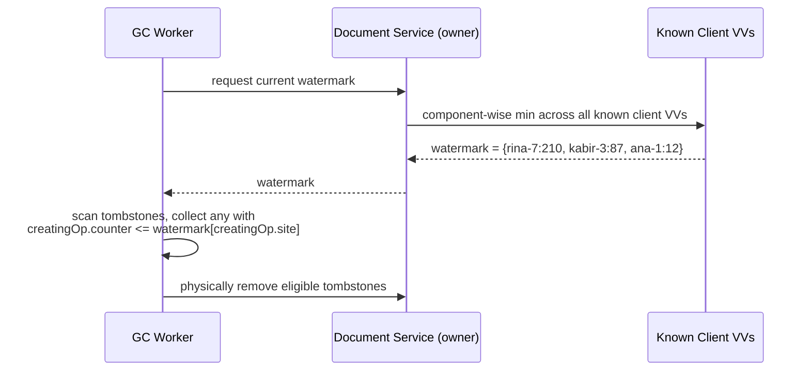

### The hard edge case: what about a device that's gone forever?

This is the sharp part. If Rina uninstalls the app on `rina-device-7` and never comes back, her device's version vector entry **never advances again** — it's frozen at whatever it last reported. Every tombstone created after that point, on *any* site, becomes permanently ineligible for collection, because the watermark can never advance past a vector that's stuck.

One dead, forgotten device can silently stop garbage collection for the entire document, forever. This is a real, known failure mode of naive version-vector GC, not an edge case to hand-wave past.

**The fix: expire stale devices from the known-clients set.** If a device hasn't connected in, say, 90 days, the Document Service stops counting it in the watermark computation — it's evicted from the "known clients" list entirely.

The trade-off this creates: if that device *does* come back after 91 days, its local state may reference tombstones that have since been collected. At that point it can't do an incremental `sinceSeq` catch-up safely — it has to fall back to the **large-gap fallback** from offline sync: discard local delta-application entirely, fetch a fresh snapshot, and rebuild from there. That's an acceptable outcome — a device gone for three months doing a full resync instead of an incremental one — versus the alternative of blocking GC indefinitely for one abandoned laptop.

### What gets written, and where

```sql
-- Extends doc_snapshots from the persistence iteration
ALTER TABLE doc_snapshots ADD COLUMN version_vector JSONB;

CREATE TABLE doc_known_clients (
    doc_id       UUID,
    site_id      TEXT,
    last_counter BIGINT,
    last_seen_at TIMESTAMP,
    PRIMARY KEY (doc_id, site_id)
);
```

**Who writes `doc_known_clients`:** the Document Service owner, updating a row every time a client's sync (live op, or reconnect delta-fetch) reports its current counter for that site.

**Who reads it:** the **GC Worker**, a separate periodic background job (same pattern as the Snapshot Worker — doesn't block live editing), which computes the watermark and sweeps eligible tombstones.

**Where this lives:** same operational store as the rest of the doc's control-plane metadata — a small table, low write volume (one row per device per doc, updated occasionally), so a plain relational table works fine here; this isn't the high-throughput append-only pattern that justified Cassandra for the operation log.

### What we gained

Tombstones get collected safely — bounded not by a guessed timeout, but by a provable condition: nobody could possibly still need this dangling reference.

### What we gave up / new problem introduced

- **A single abandoned device can stall GC indefinitely** unless we actively expire stale entries — this isn't optional hardening, it's required for the mechanism to work in practice.
- **Extra bookkeeping**, a version vector per known client and a periodic min-computation, is more machinery than "just delete old stuff," for a correctness guarantee that a simpler system might choose to approximate instead.

### What we considered and rejected

- **Age-based timer GC** — rejected above: can't distinguish "nobody needs this" from "someone's just been offline a while," and collecting too early reintroduces dangling references.
- **Never GC, let tombstones accumulate forever** — rejected: this is what we started with; fine for short-lived docs, doesn't scale to a document that lives for years.
- **Require synchronous acknowledgment from every device before any GC** — rejected: would mean GC blocks on the slowest currently-connected client on every cycle, rather than using the watermark's already-persisted vectors; unnecessarily coupcouples background cleanup to live traffic.

### Likely interviewer follow-ups

**"Isn't recomputing the watermark across all known clients expensive for a document with hundreds of past editors?"**
It's a component-wise min over a map — O(number of known sites), done periodically by a background worker, not on the hot path of any live edit. For a doc with a few hundred historical editors, that's a trivially cheap scan; it only becomes a real cost at a scale this product isn't targeting, and even then it's a batchable, offline computation.

**"How is this different from how real systems like Automerge or Yjs handle this?"**
Conceptually the same idea — Automerge uses a similar "everyone's seen this" argument before compacting history, and Yjs relies on the fact that in practice most collaborative sessions are short-lived enough that unbounded tombstone growth rarely becomes the dominant cost, leaning more on its compact internal encoding than aggressive GC. Version-vector-gated GC is the textbook-correct mechanism; production systems sometimes accept a looser, cheaper approximation because true unbounded-offline-device support is a rarer case than short collaborative sessions.

Want to go deeper on anything else, or move to the mock interview?

---
