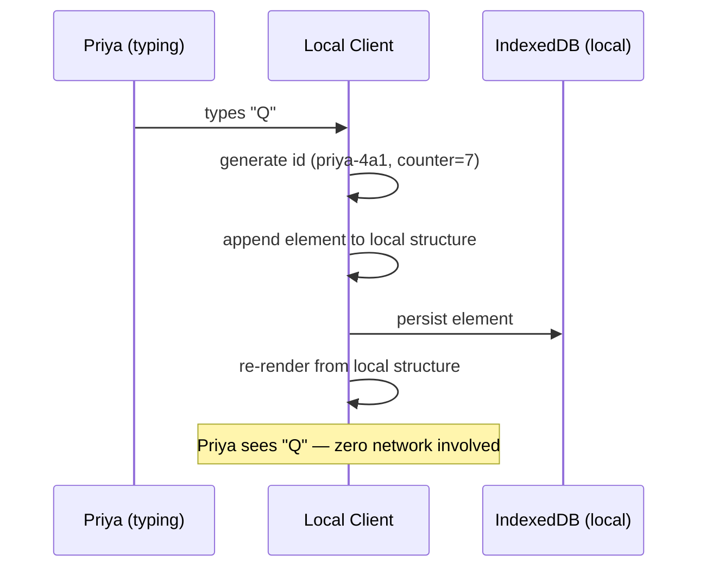
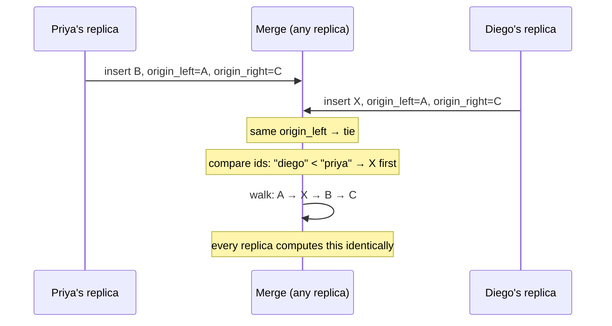
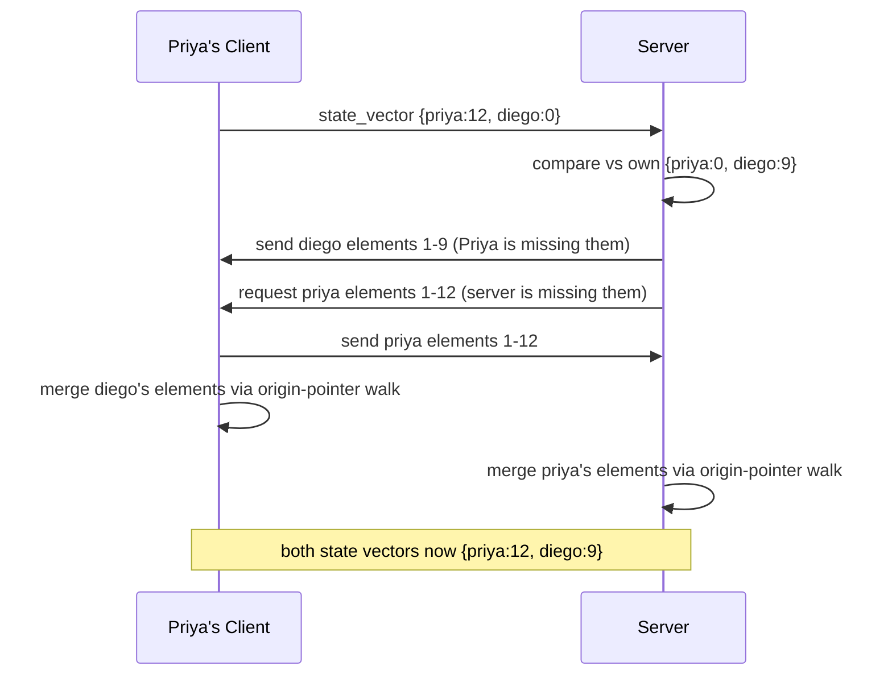
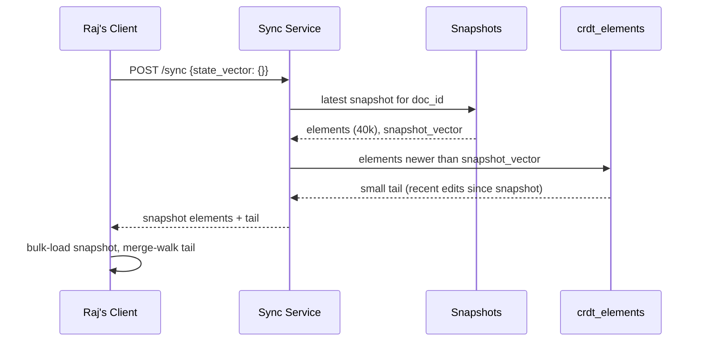
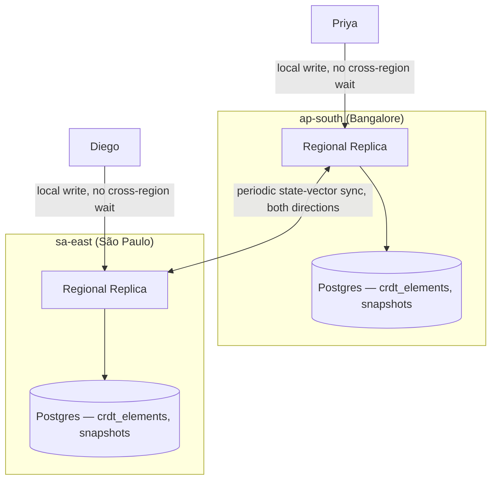
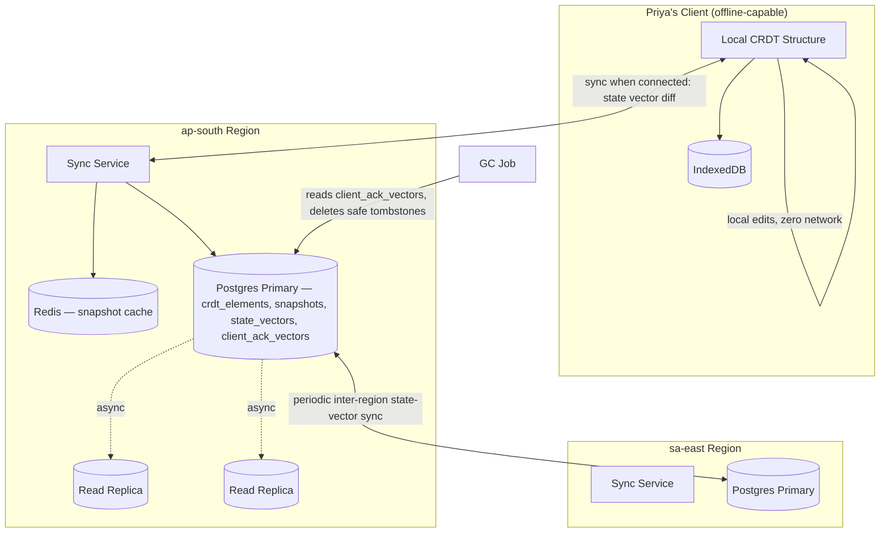

# HLD Restart: Collaborative Document Editing, Offline-First with CRDTs

## Revised Opening Hook

It's Priya's daily commute — 40 minutes on a train through patchy tunnels, laptop open, working on the quarterly report. Under the OT-based design we just built, every one of those dead-zone stretches means her local buffer of unacked keystrokes just... waits. Reconnect, and the client has to reconcile against however much drifted while she was gone, against a server that assumed she was always just a few hundred milliseconds away.

Offline-first flips the requirement entirely: editing should work **fully, indefinitely, with zero connection**, and reconciliation on reconnect should be a *guaranteed* merge, not a best-effort catch-up. That single requirement change reaches all the way back to Iteration 3 and picks a different foundation.

## Revised Scope

**P0 — the ones that shape the architecture:**

1. **Real-time concurrent editing** — unchanged from before, still a couple hundred milliseconds when online.
2. **Offline-first editing.** A client with no network connection at all can keep editing indefinitely, and reconnecting must deterministically merge — this is now promoted from "cut" to the single requirement driving the biggest architectural fork.
3. **Convergence, without a required central authority.** Given requirement 2, we can no longer assume every operation passes through one ordering server before it's valid — clients need to be able to merge with each other's edit history directly, even after long, arbitrary divergence. This is the new crux — bigger than before, because we're no longer allowed to lean on "the server decides order."
4. **Durability.** Unchanged — survives crashes, disconnects, refreshes.

**P1:**

5. **Presence** — still rides on the real-time transport, unchanged.

**Cut (P2, unchanged from before):** version history UI, comments/suggestions, granular ACLs, export, rich embedded objects.

## The Foundational Choice: Why CRDT, Not OT, From Iteration Zero

We covered this comparison at the end of the last design, but it's worth restating cleanly, because this time it's not a footnote — it's the load-bearing decision for everything that follows.

**The one-sentence version:** OT keeps a document as a flat sequence addressed by *position*, and relies on a central server to transform operations against each other in a known order. CRDT keeps a document as a set of elements addressed by *permanent, unique identity*, so operations from anyone, computed at any time, merge by combining sets rather than by transforming positions.

**Why that difference matters specifically for offline-first:**

| | OT | CRDT |
|---|---|---|
| What an operation references | A numeric position, valid only against a specific document state | A stable ID, valid forever regardless of what else changed |
| Merging two divergent histories | Requires replaying and transforming through every intervening operation, in the correct order, against a shared reference point | Requires only taking the union of both element sets and applying a deterministic sort — no shared reference point needed |
| Central authority requirement | Required — transform math assumes a canonical "what happened first" | Not required — any two replicas can merge directly, peer-to-peer or otherwise |
| Behavior after long offline divergence | Degrades — was designed for brief jitter, not extended disconnection | This is the designed use case — arbitrarily long divergence merges the same way as brief divergence |
| Cost | Cheap per-operation (just a position + text) | Expensive per-character (permanent ID + tombstone metadata that never fully disappears) |

The concrete reason OT breaks down for Priya's 40-minute tunnel: reconciling her local edits requires the *specific sequence* of every operation that happened elsewhere during that window, transformed one at a time, in order, against a shared starting point her client can prove it has. If she's been offline long enough, or if the server's history has been snapshotted and pruned past her disconnect point, there may be no clean way to replay that gap at all.

CRDTs sidestep the question entirely: Priya's local replica has a set of identified elements. The server (or any other replica) has its own set. Reconnecting is just: exchange what the other side is missing, union the sets, done — with no dependency on *when* either side made their edits or what order they arrived in.

**What we're deliberately accepting in exchange**, stated plainly now instead of discovered later: higher per-character storage overhead (tombstones for deletions, permanent IDs for every character), and a genuinely harder data-structure problem — generating IDs that let you always insert *between* any two existing IDs, forever, without the ID space or comparison cost degrading. We'll hit that problem head-on when we design the identifier scheme; it's the CRDT equivalent of the OT transform function, and it deserves the same walk-through-failed-attempts treatment.

## Confirm Before Day 0

Same P0/P1 shape as before, with offline-first promoted to P0 and CRDT as the foundational data structure instead of OT. Everything downstream — the data model, the sync protocol, even parts of the multi-region story — will look different from here on, since we're no longer routing every edit through one session server as the source of truth.

Confirm this scope and I'll start Day 0 — and this time, Day 0 itself looks different, because "offline-first" changes what the simplest reasonable starting point even is.

---

# Day 0: Local-First Single Client, Sync-When-Possible

## The Scenario

Priya opens the document on her laptop, on the train, no connection at all. Under the old OT design, this wasn't even possible — Day 0 there required a server round trip just to open the document.

Here, Day 0 looks different by necessity: the client must be able to load, edit, and save a document **entirely locally**, with the server treated as just another replica to sync with *whenever* a connection happens to exist — not a requirement for editing to function at all.

## Why This Is a Reasonable Starting Point

This isn't a strawman scaled down — it's the actual shape the offline-first requirement forces from the very first line of code. A local-only CRDT document, with no server involved yet, already has a real guarantee: **it's always editable, and it will always merge correctly with any other replica of the same document later, no matter how long they've diverged.** That guarantee doesn't get weaker as we add more clients — it's true for one client alone, and stays true as we add a hundred. That's different from the OT Day 0, where the "always correct" guarantee (last-write-wins for a single writer) was something later iterations had to actively work around, not build on.

## The Data Structure: A CRDT Sequence

Instead of a flat string, the document is represented as an ordered sequence of **elements**, where each element is one character (or a small run of characters), carrying a permanent identity that never changes.

```json
{
  "id": { "client_id": "priya-4a1", "counter": 7 },
  "value": "Q",
  "origin_left": { "client_id": "priya-4a1", "counter": 6 },
  "origin_right": null,
  "deleted": false
}
```

- **`id`** — globally unique, assigned once at creation, never reused or reassigned. `(client_id, counter)` pairs are unique because each client has its own independent, always-increasing counter.
- **`origin_left` / `origin_right`** — the IDs of the elements that were this element's immediate left and right neighbors *at the moment it was inserted*. This is what lets position be reconstructed without ever renumbering anything — we'll go deep on why this specific scheme is needed (and what naive alternatives fail) once we hit concurrent inserts.
- **`deleted`** — a tombstone flag. Deleting a character never removes it from the structure; it just flips this flag. We'll justify why in a moment.

**Who writes this structure:** Priya's local client, on every keystroke — inserts append a new element with a fresh ID, deletes flip a `deleted` flag on an existing element by ID.
**Who reads it:** Priya's local client, continuously, to render the visible document — anything with `deleted: false`, walked in order via the origin links, concatenated.
**Where it lives, for now:** entirely in-browser, in an in-memory structure backed by local persistent storage (IndexedDB) so it survives a refresh or the laptop closing — no server involved yet at all.

## Why Tombstones Instead of Real Deletion

If Priya deletes a character, and we actually remove its element from the structure, we've destroyed the anchor point other elements' `origin_left`/`origin_right` might reference. Some future insert — hers or someone else's, computed before they knew about this deletion — might say "I go right after element X," where X is the character she just deleted. If X is gone entirely, that insert has nowhere to attach.

Keeping a tombstone (marking `deleted: true` but leaving the element in the structure) means every ID that was ever handed out remains a valid anchor point forever, even after the content it represents is gone from what's displayed. This is the first piece of the storage-overhead cost we flagged at scoping — every deletion, forever, leaves a small permanent trace.

## The Local Edit Flow

1. Priya types "Q" as the first character of an empty document.
2. **Client** generates a fresh ID: `{ client_id: "priya-4a1", counter: 7 }` (her counter increments locally with every element she creates, regardless of connectivity).
3. **Client** creates the element with `origin_left: null, origin_right: null` (nothing to anchor to yet — empty document) and appends it to her local structure.
4. **Client** writes this element to **IndexedDB** — a real local write, not a network call — so a refresh doesn't lose it.
5. **Client** re-renders: walks the local structure in order, filters out any `deleted: true` elements, concatenates the rest. Priya sees "Q" appear, instantly, no network round trip involved at any point.



## Where This Breaks

Priya keeps typing offline for the whole 40-minute train ride, building out a few hundred words. Her local replica is internally consistent and correct — but it's an island. Nobody else has seen a single character of it.

Meanwhile Diego, back in the office with a live connection, opens what he believes is the same document and starts editing it too — against whatever the last-synced state was before Priya went offline.

When Priya's train surfaces and her laptop reconnects, her client and the server (or Diego's client) are holding two structures that have never seen each other's elements. Nothing has crashed, nothing has corrupted — but there is currently **no mechanism at all** for combining them into one document. We've built a correct local CRDT and completely deferred the actual hard problem: what does "sync" concretely mean when two replicas have been diverging independently?

---

Next: the sync mechanism itself — and this is where the real crux begins. I'll walk through the naive first attempt at merging two replicas (just concatenating unseen elements) and show exactly how it produces garbled ordering, before landing on the actual identifier/ordering scheme that makes merging deterministic.

Got it, or questions on the local CRDT structure first?

---

# Iteration 1: Merging Two Replicas — Naive Attempt #1

## The Scenario

Priya's train surfaces. Her local replica has elements `priya-4a1#1` through `priya-4a1#12` (12 characters she typed offline, building "Q3 revenue up"). The server's replica — synced from Diego's edits while she was gone — has elements `diego-2c8#1` through `diego-2c8#9` (9 characters, "Q3 costs down"), both starting from the same empty document.

Reconnection needs to answer one question: how do we combine these two element sets into a single, correctly-ordered document that both Priya's and Diego's clients will independently compute identically?

## Naive Attempt #1: Concatenate by Arrival Time

The obvious first instinct: whichever replica's elements the server "sees" first go first. Priya's connection resumes, her 12 elements arrive at the server, get appended after whatever was already there from Diego.

Result: `"Q3 costs downQ3 revenue up"` — Diego's sentence, then Priya's sentence, mashed together with no regard for where either of them actually intended their text to sit relative to the original empty document, or relative to each other.

## Why It Breaks

This throws away the entire point of `origin_left`/`origin_right` that we built in Day 0. Priya's first character wasn't inserted "at the end of whatever exists on the server" — it was inserted at `origin_left: null` (the very start of an empty document), because that's where the document was *from her point of view* when she started typing. Arrival-time concatenation ignores that intent completely and just appends bytes in whatever order the network happened to deliver them.

This is structurally the same failure as Iteration 2 of the OT design — "apply things in the order they arrive" — except now it's not even wrong about position drift, it's wrong from the very first character, because there's no position reconciliation happening at all.

## Naive Attempt #2: Sort All Elements by ID

Second instinct: we already have globally unique IDs — `(client_id, counter)` pairs. What if we just sort every element, from both replicas, by ID, and that's the document order?

`priya-4a1#1 < priya-4a1#2 < ... < diego-2c8#1 < ...` (alphabetical on `client_id`, then numeric on `counter`).

This is deterministic — every replica computes the identical sort, so at least everyone converges on the *same* result. That's a real property worth keeping. But look at what it actually produces: **all of Priya's characters, in her typing order, followed by all of Diego's characters, in his typing order** — because sorting by `client_id` first means one person's entire contribution always clusters together, regardless of when or where in the document either of them actually meant to type.

If Priya's edit was actually meant to be inserted *in the middle* of Diego's sentence — say she was fixing a typo in "cost" — sorting by raw ID would place her fix at the very end of the whole document, nowhere near the word she was actually editing. The IDs are unique and give us determinism, but they carry zero information about intended *position*.

## What's Actually Missing

Both naive attempts share the same gap: neither one uses `origin_left`/`origin_right` at all. Those fields were built in Day 0 specifically to answer "what was this element's neighbor at the moment it was created" — and that's exactly the information we need to reconstruct correct relative order, even between two elements that have never seen each other before this exact moment.

The real merge algorithm has to walk both structures using their origin pointers, not just their raw IDs or arrival order — and it has to do this in a way that's provably identical no matter which replica runs it, or which direction the sync happens in.

That's the actual ordering scheme — commonly implemented as something like RGA (Replicated Growable Array) or the newer Fugue algorithm — and it's the real crux of this design, the CRDT equivalent of the OT transform function.

---

**Likely interviewer follow-up:** *"Why not just use a Lamport timestamp or vector clock as the sort key instead of raw client_id + counter?"*
**Model answer:** A Lamport timestamp would give us a "happened-before" ordering for causally related events, but two genuinely concurrent inserts — like Priya and Diego both typing into the same empty document with no causal link between them — still need a tiebreak, and more importantly, a timestamp still says nothing about *where in the document* the element belongs relative to its neighbors. We'd still need the origin-pointer walk on top of it; the timestamp alone doesn't solve position.

---

Next: the actual origin-pointer merge walk — I'll trace through Priya and Diego's concurrent inserts step by step, showing how the algorithm uses `origin_left`/`origin_right` to interleave their edits correctly, and where it still needs a deterministic tiebreak for the cases that are genuinely ambiguous (two people inserting at literally the same neighboring position).

Got it, or want to sit with why raw-ID sorting fails first?

---

# Iteration 2: The Real Merge Algorithm — Origin-Pointer Ordering

## Setting Up a Traceable Example

Let's shrink the scenario to something we can walk by hand. Both Priya and Diego start from the same synced base: the document `"AC"`.

```
A: id=(base,1), origin_left=null, origin_right=(base,2)
C: id=(base,2), origin_left=(base,1), origin_right=null
```

Priya, offline, inserts "B" between "A" and "C" — she's fixing it to read "ABC".

```
B: id=(priya,1), origin_left=(base,1), origin_right=(base,2)
```

Meanwhile Diego, online but syncing from the same pre-Priya base, inserts "X" in that exact same gap — between "A" and "C" — for an unrelated reason, say he's typing "AXC".

```
X: id=(diego,1), origin_left=(base,1), origin_right=(base,2)
```

Both B and X have **identical origin pointers** — both claim "I go right after A, right before C." This is the concurrent-insert-at-the-same-spot case, the direct CRDT equivalent of Alice-and-Bob's tied insert in the OT transform walk-through.

## The Walk: How the Algorithm Places Them

The merge algorithm (this is the core idea behind RGA-style CRDTs) processes elements as a linked structure, walking from `origin_left` forward, and handles ties with a rule that's the same on every replica: **when two elements share the same left origin, order them by comparing their IDs, and whichever is smaller comes first.**

```
compare_ids((priya,1), (diego,1)):
    "diego" < "priya" alphabetically → diego's element (X) sorts first
```

So: both B and X want to sit immediately after A. Since they're tied on origin, the algorithm falls back to comparing IDs — `diego < priya` — so X is placed first, then B.

Walking the merged structure left to right: `A → X → B → C`.

Result: **"AXBC"**. Not what either Priya or Diego individually pictured ("ABC" or "AXC") — but it is *identical* on every replica that runs this same deterministic rule, which is the actual goal. Just like the OT tied-insert case, there is no "more correct" answer between the two orderings; there's only a requirement that everyone converges on the *same* one.



## A Case Where Origins Actually Differ

Now the more common case: a **three-way** concurrent insert isn't tied at all, because origins genuinely differ. Say a third person, Alice, was also offline from the same base, and inserted "Z" specifically between "B" and "C" from her own local view — except she never saw B, because she diverged from Priya too. From Alice's perspective the document was still `"AC"`, and she inserted Z between A and C, same as the others:

```
Z: id=(alice,1), origin_left=(base,1), origin_right=(base,2)
```

This is still a three-way tie on the same origin pair — genuinely ambiguous, same resolution: compare all three IDs (`alice`, `diego`, `priya`), sort alphabetically: `alice < diego < priya`, giving `A → Z → X → B → C`.

The *non*-tied case looks different. If Alice had instead synced after seeing Priya's B (so her origin_left was B, not A), her insert wouldn't compete with X and B for position at all — it would anchor after B unambiguously, no tiebreak needed, because her origin pointers point somewhere more specific than the shared A→C gap.

This is the actual mechanism, and it's worth being explicit about the general rule: **the more causal information an element's origin carries (i.e., the more recently-synced state it was created against), the less likely it collides with another concurrent insert.** Collisions only happen when two elements are computed against the *exact same* local neighbor pair, independently.

## Where This Still Has a Real Problem

This algorithm is correct — every replica converges. But look at what "compare IDs" actually costs as the number of concurrent inserts at the same spot grows: every element ever inserted into that same origin gap needs to be compared against every other one to establish relative order, every single time the structure is walked for rendering.

For a normal typing session this is trivial — a handful of characters, cheap comparisons. But this is a preview of a real cost: the naive version of this algorithm (this specific approach, comparing raw IDs at tie points, is close to what's called **RGA**) needs to walk a linked structure with `O(n)` lookups to find where any given element belongs during a merge, which gets expensive for documents that have accumulated a long edit history with many concurrent-insert clusters. There's a newer refinement (the **Fugue** algorithm, 2023) that fixes specifically this interleaving/performance behavior — worth naming as the state of the art, but the RGA-style walk above is what actually builds the intuition for how any of these approaches works underneath.

## What We Gained

Concurrent inserts — even from replicas that have never directly communicated, diverged for an arbitrary length of time — merge into a single, deterministic result on every replica, with no central authority required at any point in the process.

## What We Gave Up / What New Problem This Introduces

Every element carries permanent metadata (its ID, its origin pointers) that never goes away, even after the text is edited further. Tie-resolution at high-contention insert points requires comparing potentially many IDs, not just two. And we still haven't addressed **deletion's** interaction with this same merge walk, or how a real client actually *finds* the elements it's missing from another replica without transferring the entire document history every single sync — that's next.

## What We Considered and Rejected

**Using a centrally-assigned sequence number instead of origin pointers, synced lazily.** This is just OT with extra steps — the moment ordering depends on a central counter, offline clients can't generate valid positions without contacting that authority first, which defeats the entire premise of this redesign.

**Resolving ties by wall-clock timestamp instead of ID comparison.** Rejected — clock skew between two offline laptops means timestamps aren't reliably comparable or even monotonic across clients, and unlike ID comparison, there's no guarantee two clients agree on which timestamp is "smaller" if their clocks disagree. `client_id` comparison is guaranteed deterministic; wall-clock time is not.

---

**Likely interviewer follow-up:** *"Does the tie-break rule (compare IDs, alphabetically-smaller wins) ever produce a result that feels 'wrong' to a user — like garbling two people's independent sentences together?"*
**Model answer:** Yes, and that's an accepted, known trade-off of text CRDTs generally — when two people type at the *exact* same insertion point with no causal awareness of each other, interleaving is a real possibility (this specific failure mode is actually what the Fugue algorithm was designed to reduce, since RGA-style interleaving can visibly garble concurrent sentences more than users expect). It's rare in practice because most concurrent edits happen in different parts of a document, but it's honest to name as a real, known cost of this model rather than a solved problem.

---

Next: deletion's interaction with this merge (tombstones colliding with concurrent inserts at the same spot), and then the actual sync protocol — how two replicas efficiently figure out *which* elements the other is missing, without shipping the whole document on every reconnect.

Got it, or questions on the merge walk first?

---

# Iteration 3: Deletion Meets Concurrent Insert, and the Sync Protocol

## Deletion's Interaction With the Merge

Quick scenario: Diego, online, deletes "C" from `"ABC"` while Priya, offline, was — at that exact moment — inserting "D" with `origin_left=(base,2)` (anchored to "C"), intending "ABDC".

Diego's delete doesn't remove element C from the structure — Day 0 already established tombstones exist precisely so anchors never disappear. Diego's delete just flips `C.deleted = true`.

When Priya reconnects, her insert D still has a perfectly valid anchor: `origin_left` points at C's *ID*, not at "whatever C currently displays as." The merge walk places D in the structure right after C exactly as before — it's just that when the document is rendered, C is filtered out for being tombstoned, so the visible result is `"ABD"`, with D correctly positioned even though its anchor is invisible.

This is precisely why tombstones matter for concurrent editing, not just for local consistency: **a deleted character remains a valid, permanent position reference for anyone who inserts relative to it, no matter how long after the deletion that insert was computed.** If we'd actually removed C from the structure, Priya's insert would arrive with a dangling pointer to nothing, and the client would have no principled way to know where "D" was supposed to go.

## What We Gained (This Small Addition)

Deletion is now fully consistent with the offline-first, no-central-authority model — a delete from one replica and a concurrent insert anchored to the deleted element from another replica always merge correctly, regardless of order or how long they were apart.

## What We Considered and Rejected

**Actually removing deleted elements from the structure once "enough time" has passed, or once all known replicas have acknowledged the deletion.** This is a real technique (called **tombstone garbage collection**) and it's not wrong — it's necessary eventually, since tombstones accumulating forever is the storage-overhead cost we flagged at scoping. But it's premature here: garbage collection requires knowing that *every* replica, including ones currently offline, has already seen the deletion and won't ever anchor a new insert to it — which is a distributed consensus problem in its own right. We'll come back to this once the sync protocol below exists, since GC is a natural extension of it, not a separate mechanism.

---

# The Sync Protocol: What Actually Gets Sent on Reconnect

## The Problem

We now know two replicas *can* merge correctly. But when Priya's laptop reconnects, what actually gets transferred over the wire? Shipping her entire document's element history on every reconnect — even for a one-character offline edit — clearly doesn't scale once a document has thousands of elements.

## The Fix: State Vectors

Each replica tracks a **state vector** — a compact summary of "the highest counter I've seen from each client," not the full element history.

```json
{
  "priya-4a1": 12,
  "diego-2c8": 9,
  "server": 0
}
```

This says: "I have all of Priya's elements up through counter 12, all of Diego's through counter 9, and nothing from anyone else." Since each client's own counter only ever increases and every element that client creates gets the next sequential number, a single integer per client fully summarizes "everything I have from them" — there are no gaps to describe, because a client can't skip counter values when creating elements locally.

**Who writes the state vector:** each replica (client or server), updated locally every time it applies a new element, whether created locally or received from a sync.
**Who reads it:** the *other* side of a sync exchange, to compute the diff — this is the entire point of the structure.
**Where it lives:** alongside the CRDT structure itself — client-side in IndexedDB, server-side in whatever durable store holds the document (we'll pin that down properly next iteration).

## The Reconnect Flow

1. Priya's client reconnects. It sends its state vector to the server: `{ priya-4a1: 12, diego-2c8: 0, server: 0 }` (she has all her own edits, none of Diego's, since she diverged before his existed).
2. **Server** compares against its own state vector — say `{ priya-4a1: 0, diego-2c8: 9, server: 0 }` (it has all of Diego's edits, none of Priya's, since she was offline the whole time).
3. **Server** computes what Priya is missing: everything from `diego-2c8` counters 1 through 9. It sends those 9 elements to Priya.
4. **Server** computes what it's missing from Priya: everything from `priya-4a1` counters 1 through 12. It requests (or Priya proactively sends) those 12 elements.
5. Both sides apply the received elements via the merge walk from Iteration 2, using origin pointers to place them correctly.
6. Both sides update their local state vectors to reflect the new combined knowledge: `{ priya-4a1: 12, diego-2c8: 9, server: 0 }` on both ends now.



This is a compact, bandwidth-proportional-to-what-actually-changed sync — exactly the property we need for "reconnect after an arbitrarily long offline period" to stay cheap. A state vector is a handful of integers regardless of how large the document has grown; only the genuinely-missing elements get transferred, never the whole history.

## What We Gained

Sync cost is proportional to *divergence*, not to document size or offline duration. A document with 50,000 elements and a client that's been offline for five minutes exchanges a tiny diff, not the whole structure — this is the actual mechanism that makes "offline for 40 minutes" and "offline for a week" cost roughly the same protocol overhead, just a larger diff payload.

## What We Gave Up / What New Problem This Introduces

State vectors only tell you *what's missing*, not *where it fits* — that's still the origin-pointer merge walk doing the real work, and for a large diff (say, a week of offline edits) that walk has real computational cost we haven't bounded yet. We also now have a server that needs to durably store both the full element structure *and* a state vector per document — durability and storage technology choices we still need to pin down, since "server" has so far just meant "some replica," not a concrete architecture.

## What We Considered and Rejected

**Full-history log replay, like the OT design's operation log.** Rejected specifically because it reintroduces a linear, order-dependent replay cost that scales with total history length, not divergence — exactly what state vectors are designed to avoid. A CRDT sync should cost what changed, not what happened, ever.

**Vector clocks with per-operation causality tracking instead of a flat state vector.** This is a real, related technique, but it's solving a different problem — vector clocks are typically used to detect causality/concurrency between individual operations, which we're already handling via the origin-pointer scheme. A flat "highest counter per client" state vector is simpler and sufficient here because we don't need per-operation causality detection, just "what am I missing."

---

**Likely interviewer follow-up:** *"What if Priya has been offline so long that she's missing edits from a client the server has never heard of directly — say, a third person who synced through Diego but never talked to the server?"*
**Model answer:** Doesn't matter — the state vector comparison works transitively regardless of *how* the server learned about an element, because it's tracking "highest counter seen per originating client_id," not "who I synced with." As long as the server's own state vector reflects that third client's edits (from whatever chain of syncs got them there), Priya's diff calculation against the server works identically. This is actually a nice property of the model: sync topology (star, mesh, chain) doesn't affect correctness, only how quickly information propagates.

---

Next iteration needs to pin down where the server-side durable structure and state vector actually live — this is where we address durability and storage technology properly for this design, since we've been saying "the server" without committing to an architecture yet. Want that next, or questions on the sync protocol first?

---

# Iteration 4: Server-Side Durability and Storage

## The Scenario

We've been saying "the server" as if it's a single, obvious thing, but we've never actually pinned down what it stores or where. Let's fix that now, using the same standard we've held everywhere else: exact schema, who reads, who writes, and — since this is the first time a new storage technology enters this design — why that technology class fits the access pattern.

The server, in this design, isn't a live in-memory session owner the way it was in the OT design. It's just **another replica** — a durable, always-on one that every client eventually syncs with, using the exact same state-vector protocol from Iteration 3. That's a meaningfully different role than the OT session server had, and it's worth being explicit about that shift: there's no single authority to route to, no ownership registry, no "who owns this document right now" question at all. Any client can sync with the server at any time, and the server can sync with any client — the protocol is symmetric.

## The Data Model

Two things need durable storage: the CRDT element structure itself, and the server's state vector.

```sql
CREATE TABLE crdt_elements (
    doc_id        UUID NOT NULL,
    client_id     TEXT NOT NULL,
    counter       BIGINT NOT NULL,
    value         TEXT NOT NULL,          -- the character or small run of text
    origin_left_client   TEXT,
    origin_left_counter  BIGINT,
    origin_right_client  TEXT,
    origin_right_counter BIGINT,
    deleted       BOOLEAN NOT NULL DEFAULT FALSE,
    PRIMARY KEY (doc_id, client_id, counter)
);

CREATE TABLE state_vectors (
    doc_id      UUID NOT NULL,
    client_id   TEXT NOT NULL,       -- whose counter this tracks
    max_counter BIGINT NOT NULL,
    PRIMARY KEY (doc_id, client_id)
);
```

**Who writes to `crdt_elements`:** the server, whenever any client syncs and sends elements the server was missing (Iteration 3, steps 3-4). Each element is an independent row, inserted once, essentially immutable except for the `deleted` flag flipping on a tombstone event.
**Who reads `crdt_elements`:** the server, when computing what to send a syncing client, and when reconstructing the full document for rendering or for a brand-new client's very first sync (where its state vector is all zeros).
**Who writes/reads `state_vectors`:** the server, updated after every successful sync exchange — this is the durable version of the in-memory state vector each replica keeps, so the server doesn't lose track of what it has after a restart.

## Why This Storage Technology Class

This is our first genuinely new storage decision in this redesign, so it's worth justifying against the access pattern rather than defaulting to Postgres out of habit.

The access pattern here is: **row-per-element, high insert volume, keyed lookups by `(doc_id, client_id, counter-range)`, and rare updates (only the `deleted` flip).** This is a wide, append-heavy, keyed-range-scan pattern — closer to a **wide-column store** (like Cassandra or DynamoDB) than a traditional relational workload, because there are no cross-document joins, no relational integrity constraints between documents, and the query shape is almost entirely "give me everything for this doc_id where client_id=X and counter > N" — a clustering-key range scan, which wide-column stores are built for.

That said — unlike the crawler or Twitter designs, this system's per-document element count, even for a long-lived document, tops out in the tens of thousands, not billions. A relational store like Postgres, with a composite index on `(doc_id, client_id, counter)`, handles this workload perfectly well at this scale, and gets us transactional guarantees (atomically updating both `crdt_elements` and `state_vectors` in one commit) that a wide-column store would need extra machinery to replicate. **Verdict: Postgres is the right choice here**, specifically because document-level data doesn't approach the scale where wide-column's horizontal write-throughput advantage would outweigh giving up transactions — this is the opposite conclusion from Twitter's tweet-store decision, and it's worth naming why: it's the same reasoning process, applied to a workload that's orders of magnitude smaller per unit (a document's total elements vs. a global tweet firehose), landing on a different technology.

## The Sync Flow, Now Concrete

This is the same protocol from Iteration 3, now naming the actual server-side operations:

1. Client sends `POST /v1/documents/{doc_id}/sync` with body `{ "state_vector": { "priya-4a1": 12, "diego-2c8": 0 } }`.
2. **Sync Service** (the server-side component handling this endpoint) reads its own vector: `SELECT client_id, max_counter FROM state_vectors WHERE doc_id = $1`.
3. For each client where the server's counter exceeds the client's reported counter, **Sync Service** runs: `SELECT * FROM crdt_elements WHERE doc_id = $1 AND client_id = $2 AND counter > $3 ORDER BY counter ASC` — fetching exactly the missing range, nothing more.
4. **Sync Service** returns those elements, plus its own current state vector, in the response body.
5. Client sends any elements *it* has that the server's vector shows it's missing, as a second `POST` (or the same request can be bidirectional in one round trip — a request body carrying both the vector and any elements the client already knows the server needs, computed the same way).
6. **Sync Service** inserts those into `crdt_elements`, and updates `state_vectors` for that `client_id` to the new max counter — one transaction covering both tables, so a crash mid-sync can't leave the element rows written but the vector stale (which would cause the server to re-request or miscompute future diffs).

```mermaid
sequenceDiagram
    participant C as Priya's Client
    participant Sync as Sync Service
    participant DB as Postgres

    C->>Sync: POST /sync {state_vector: {priya:12, diego:0}}
    Sync->>DB: SELECT state_vectors WHERE doc_id=$1
    DB-->>Sync: {priya:0, diego:9}
    Sync->>DB: SELECT elements WHERE client_id='diego-2c8' AND counter>0
    DB-->>Sync: 9 elements
    Sync-->>C: elements[9], server_vector{priya:0,diego:9}
    C->>C: merge via origin-pointer walk
    C->>Sync: POST elements[12] (priya's offline edits)
    Sync->>DB: BEGIN; INSERT elements; UPDATE state_vectors; COMMIT
    DB-->>Sync: OK
    Sync-->>C: ack
```

## Where This Breaks

A document that's been alive for a year, heavily edited, has accumulated tens of thousands of rows in `crdt_elements` — including a large fraction that are tombstones, since every deletion is a permanent row that never goes away under this design so far.

Now picture a *brand-new* client opening this document for the first time — a colleague joining the project, state vector `{}` (empty, knows nothing). Step 3's query becomes `SELECT * FROM crdt_elements WHERE doc_id = $1 ORDER BY counter ASC` across every client that's ever touched the document — potentially tens of thousands of rows, most of them tombstoned deletions contributing zero visible content, all shipped over the wire and all walked through the origin-pointer merge algorithm before a single character renders.

This is the direct CRDT-world equivalent of the OT design's "replay the whole operation log from scratch" problem from Iteration 6 of that design — and the fix rhymes: we need something like a snapshot, adapted for the fact that our "log" here is a set of elements with permanent identity, not a linear replayable sequence, plus we now need to actually address the tombstone accumulation problem we've been deferring since Iteration 3.

---

**Likely interviewer follow-up:** *"Why not just use the state_vectors table as a cache and skip re-querying it from Postgres on every sync?"*
**Model answer:** That's a reasonable optimization once sync volume justifies it — an in-memory or Redis-backed cache of state vectors per actively-syncing document would cut a Postgres round trip off the hot path. It's not needed at Day-0-of-this-iteration scale (a sync happens on reconnect, not per keystroke, so it's a far lower-frequency operation than the OT design's per-keystroke writes), but it's the same caching justification standard we held in the OT design: add it when the read pattern actually demands it, not reflexively.

---

Next: the fix for both the cold-open cost and tombstone accumulation — snapshotting for CRDTs, and a real garbage collection scheme for tombstones once we can prove every replica has seen a deletion. This is a two-part fix, so I'll likely split it: snapshotting first, then GC as its own follow-up since GC's correctness argument (proving no replica can still reference a tombstone) deserves its own space.

Got it, or questions on the storage choice or sync flow first?

---

# Iteration 5: Snapshotting for CRDTs

## The Scenario

A new colleague, Raj, opens the year-old document for the first time. His state vector is empty — `{}`. Under Iteration 4's flow, the Sync Service has to pull every single element ever created for this document, tombstones included, and ship all of it to Raj's client before he sees a single rendered character. If that document has 40,000 elements accumulated over a year, that's a genuinely slow cold start, and it gets linearly worse the longer the document lives.

## The Fix: Materialized Snapshots, Adapted for CRDT Structure

The OT design's snapshot was simple: just the current text, since operations replay linearly onto a single string. A CRDT snapshot needs to preserve more, because the *structure* — not just the visible text — is what future merges need to stay correct.

```sql
CREATE TABLE document_snapshots (
    doc_id            UUID NOT NULL,
    snapshot_vector   JSONB NOT NULL,   -- state vector this snapshot represents
    elements          JSONB NOT NULL,   -- full element set at this point, incl. tombstones
    created_at        TIMESTAMPTZ NOT NULL,
    PRIMARY KEY (doc_id, created_at)
);
```

The critical difference from the OT snapshot: **this snapshot still has to contain tombstoned elements**, not just visible text, because a future sync might bring in an element from a long-offline client whose `origin_left` points at something that's tombstoned in this snapshot. If we materialized only the visible characters, we'd have thrown away valid anchor points, and any insert relative to them would arrive with a dangling pointer — the exact bug tombstones exist to prevent, reintroduced by an overly-aggressive snapshot.

**Who writes it:** the **Sync Service**, on a background timer — say once a day per actively-edited document, or after N new elements have accumulated since the last snapshot, whichever comes first.
**Who reads it:** the **Sync Service**, whenever a syncing client's state vector is "far enough behind" that serving from the snapshot-plus-tail is cheaper than a full `crdt_elements` scan — concretely, for a brand-new client (empty vector) or one whose vector predates the latest snapshot's vector entirely.
**Where it lives:** same Postgres instance — still just structured data, no new storage class needed for this piece.

## The Cold-Open Flow, Revised

1. Raj's client sends `POST /sync` with `state_vector: {}`.
2. **Sync Service** checks: is there a snapshot for this doc? `SELECT elements, snapshot_vector FROM document_snapshots WHERE doc_id = $1 ORDER BY created_at DESC LIMIT 1`.
3. If yes, and Raj's vector shows he has none of what the snapshot covers (true here, since his vector is empty): return the snapshot's elements directly, plus a small tail of anything created *after* the snapshot was taken — `SELECT * FROM crdt_elements WHERE doc_id = $1 AND (client_id, counter) not covered by snapshot_vector`, i.e. only elements more recent than the snapshot.
4. Raj's client applies the snapshot elements as a bulk initial load (no merge walk needed here — it's a known-consistent starting structure, not something to reconcile against local state), then merges the small tail via the normal origin-pointer walk from Iteration 2.

This mirrors the OT design's "snapshot plus tail replay" shape almost exactly — the mechanism generalizes even though the underlying data structure is completely different.



## What We Gained

Cold-open cost drops from "every element the document has ever had" to "one snapshot fetch plus a small recent tail" — the same shape of win the OT design got from its snapshots, applied to a structurally different data model.

## What We Gave Up / What New Problem This Introduces

The snapshot itself still contains every tombstone ever created, since we established it must. So while this fixes the *transfer and merge-walk cost* for a cold-open client, it does nothing about the underlying storage bloat — a snapshot of a year-old, heavily-edited document is still large, just large *once* per snapshot interval instead of large on every single sync. That's real progress, but it's not the tombstone accumulation fix itself.

## What We Considered and Rejected

**Skip snapshotting entirely; just cap how far back `crdt_elements` queries can look.** Rejected for the same reason it was rejected in the OT design — you can't discard history without first materializing what it adds up to, and unlike tombstone GC (which has a real correctness argument for when it's safe), arbitrarily capping query range would silently corrupt cold-open document state.

**Snapshot only visible (non-tombstoned) content, treat it as a fresh CRDT with no tombstone history.** This is tempting because it would actually solve the storage bloat, not just the transfer cost — but it's unsafe in exactly the way described above: any client that syncs later with an origin pointer into the pre-snapshot tombstoned structure would have a dangling reference. This only becomes safe once we can *prove* no live replica could possibly still reference those tombstones — which is exactly the harder problem GC has to solve properly, not something a snapshot can shortcut.

---

**Likely interviewer follow-up:** *"Could two clients both trigger a snapshot at the same time and race?"*
**Model answer:** It's a harmless race even if it happens — snapshotting is a pure read of already-durably-committed `crdt_elements` rows plus an insert of a new snapshot row; two concurrent snapshot jobs would just produce two nearly-identical snapshot rows (or one slightly more complete than the other), and any sync just uses whichever is `ORDER BY created_at DESC LIMIT 1` — there's no correctness issue, only a small amount of duplicated work, so it's not worth adding a lock around.

---

Next: the actual fix for tombstone accumulation — proving it's safe to permanently discard a deleted element, which is a real distributed-agreement question (every replica, including offline ones, has to be accounted for) rather than a simple cleanup job.

Got it, or questions on snapshotting first?

---

# Iteration 6: Tombstone Garbage Collection

## The Scenario

The year-old document has accumulated thousands of tombstoned elements — every deletion anyone has ever made, forever, per Day 0's rule that deleted elements stay in the structure as permanent anchor points. Storage for this one document is now dominated by dead characters nobody will ever see again.

We flagged back in Iteration 3 that GC is possible but requires knowing something hard: **that no replica anywhere — including ones currently offline — could still hold a reference into that tombstone.** Let's work out exactly what that requires.

## Why This Is Genuinely a Distributed Agreement Problem

Say Priya deleted a sentence three months ago. If Raj — the new colleague from Iteration 5 — is holding a laptop that's been offline since *before* that deletion, and it comes back online tomorrow with a locally-pending insert whose `origin_left` points at one of those now-deleted characters, that insert needs a valid anchor to merge against. If the server already garbage-collected that tombstone last week, Raj's insert arrives with a pointer to nothing.

So the real question GC has to answer isn't "has enough time passed" — it's **"has every possible replica that could ever sync in, already synced in past this deletion?"** That's not a timer question, it's a knowledge question about every client, including ones we can't currently observe.

## The Fix: GC Gated on Confirmed Sync, Not Elapsed Time

The server already tracks, in `state_vectors`, the highest counter it has *received from* each client. What it doesn't yet track is the reverse: has each client *received* everything up to a given point. We need one more piece of bookkeeping.

```sql
CREATE TABLE client_ack_vectors (
    doc_id       UUID NOT NULL,
    client_id    TEXT NOT NULL,      -- whose progress this tracks
    doc_owner    TEXT NOT NULL,      -- the origin client the acked elements belong to
    acked_counter BIGINT NOT NULL,   -- highest counter of doc_owner's elements this client has seen
    PRIMARY KEY (doc_id, client_id, doc_owner)
);
```

This says: "client X has confirmed receiving all of client Y's elements up through counter N." Every sync exchange updates this — when the server sends Raj elements from Priya up through counter 40, and Raj's *next* sync request's state vector shows `priya: 40`, the server now knows Raj has genuinely applied them, not just that the server sent them (a send could fail mid-transfer; an updated state vector on the *next* request is the actual confirmation).

**Who writes it:** the **Sync Service**, after each sync round-trip completes and the client's subsequent state vector confirms receipt.
**Who reads it:** the **GC job**, to compute the safe watermark below.
**Where it lives:** same Postgres instance — small table, low write volume (once per sync, not per element).

## The GC Rule

A tombstoned element at `(client_id=priya, counter=40)` is safe to physically delete only when **every client that has ever synced this document** shows `acked_counter >= 40` for `doc_owner=priya` in `client_ack_vectors`.

```sql
-- The safe watermark per originating client: the minimum acked_counter across all known syncing clients
SELECT doc_owner, MIN(acked_counter) as safe_up_to
FROM client_ack_vectors
WHERE doc_id = $1
GROUP BY doc_owner;
```

Any tombstoned element with `counter <= safe_up_to` for its originating client can be permanently deleted — no live client can possibly still reference it as an anchor, because we have direct confirmation every one of them already has it (and therefore isn't going to compute a *new* insert against a version of the document that predates it).

## The Genuinely Hard Edge Case: A Client That Never Comes Back

What about a laptop that syncs once, then is lost, stolen, or simply never reconnects? Its row in `client_ack_vectors` sits frozen at whatever it last acked, and by the `MIN()` rule above, it permanently blocks GC for anything past that point — forever, since we can't distinguish "temporarily offline" from "never coming back" from the server's point of view.

This is a real, unavoidable trade-off of the model, not a bug to be engineered away: **safety requires knowing every replica is caught up, and there's no way to know that about a replica that's gone silent.** The practical fix is a policy decision, not a protocol one — treat a client as "presumed abandoned" after some long threshold (say 90 days of no sync activity) and exclude it from the `MIN()` calculation, accepting the small risk that if it ever *does* reconnect after that, its pending local edits might reference GC'd tombstones and need a manual reconciliation fallback (e.g., prompting the user to re-anchor or paste their offline edits back in) rather than a silent automatic merge.

## What We Gained

A concrete, defensible answer to "how do you stop tombstones from growing forever" — one that's actually *safe* (grounded in confirmed receipt, not a guess) rather than a naive timer that could silently corrupt a genuinely-offline user's pending work.

## What We Gave Up / What New Problem This Introduces

We've added a whole additional tracking table and a background job with real distributed-systems subtlety, purely to reclaim storage — this is meaningfully more machinery than the OT design ever needed, since OT's operation log never had a tombstone-equivalent problem at all (Postgres UPDATEs don't leave permanent dead rows the way CRDT deletes structurally must). This is the concrete, ongoing cost of choosing offline-first: not just the one-time storage overhead, but an entire subsystem to manage it safely over a document's lifetime.

## What We Considered and Rejected

**Time-based GC (delete tombstones older than N days), accepting the small risk of a stale client breaking.** Rejected as the *default* policy, because "small risk" here means silent, hard-to-diagnose document corruption for whichever unlucky offline user it hits — a correctness violation, not a graceful degradation. We use time-based expiry only as the *last-resort* fallback for presumed-abandoned clients, not as the primary GC trigger.

**Never GC at all; accept unbounded tombstone growth as the cost of doing business.** This is actually a legitimate choice for a system that expects most documents to have a bounded practical lifetime or size — and it's simpler. We reject it here because the P0 scope includes long-lived documents implicitly (a year-old actively-used doc is a normal case, not an edge case), so unbounded growth is a real, not hypothetical, cost.

---

**Likely interviewer follow-up:** *"This ack-vector tracking sounds expensive to maintain — does it scale to a document with hundreds of occasional collaborators?"*
**Model answer:** The table is `O(documents × clients-per-document)` rows, updated once per sync event, not per element or per keystroke — so it scales with collaborator count and sync frequency, not document size or edit volume. For hundreds of collaborators, that's hundreds of small rows per document, which is trivial; the actual risk isn't table size, it's the "one silent client blocks GC forever" problem above, which is a policy concern, not a scale concern.

---

We've now covered the crux (CRDT merge + tombstones + GC) and durability. Given we've built a materially different architecture than the OT version, want the replication/caching NFR pass next (same "does this even apply here" rigor as before), or straight to multi-region — which will look quite different here since there's no single-writer-per-document constraint anymore?

---

# Iteration 7: Replication and Caching — Revisited for CRDT

## Replication: Does This System Need Read Replicas?

Same discipline as before — check against the real read pattern, don't assume.

Who reads from Postgres here? The **Sync Service**, on every sync request: fetching state vectors, missing element ranges, and snapshots. Unlike the OT design, this *is* a steady, frequent read pattern — every client reconnect, every periodic background sync while online, hits Postgres directly, because there's no in-memory session server holding live state the way there was before. That's a real structural difference worth naming: the OT design's session server *was* the cache; this design doesn't have an equivalent always-warm in-memory tier by default.

**So the read:write ratio here genuinely differs from the OT case.** A single popular shared document — say a company-wide onboarding doc that hundreds of people open per day, mostly read-only or lightly edited — generates far more sync-read traffic than element-write traffic. That's a real read-scaling case.

**Verdict: read replicas are justified here**, specifically for the `crdt_elements` and `document_snapshots` reads that serve sync requests, in a way they weren't for the OT design's rare recovery-only reads.

**How many, sync or async:** async, and more than one is reasonable — say 2-3 replicas behind the primary. Sync replication would mean every element write waits on replica acknowledgment, reintroducing write latency for a benefit (replica freshness) that doesn't matter much here, because of the next point.

**What consistency model falls out of this:** this is where CRDT's structure actually helps us tolerate replica staleness in a way OT couldn't. If Raj's sync request reads a slightly-stale replica — missing the last few seconds of someone else's writes — that's not a correctness problem, just an incomplete diff. His *next* sync (or the same session's periodic re-sync) picks up whatever the stale read missed, because state-vector comparison is idempotent and order-independent — syncing against a stale snapshot of the truth just means a smaller diff now and a slightly bigger one next time, never a wrong merge. This is a meaningfully different, more relaxed consistency requirement than the OT design's recovery reads, which needed the primary specifically because a stale replica could produce an incorrect replayed sequence.

**Concrete scenario where staleness would matter:** if Raj's client synced against a stale replica right after making a local edit, then immediately treated the sync response as authoritative and discarded his local pending changes — that would lose data. But that's not how the protocol works: local edits stay in the client's own structure regardless of what a sync response contains, and get sent up as part of the *same* sync round-trip. Staleness only affects how much the client is told about *others'* edits, never its own — so there's no scenario here where a stale read causes lost writes.

## Caching: What's Actually Worth It

**Live document content while a client is actively editing** — same answer as the OT design: this lives entirely client-side, in the local CRDT structure. No caching layer needed for a client's own view of its own document.

**What's new here that wasn't in the OT design:** the **latest snapshot per document** (Iteration 5) is read on every cold-open or far-behind sync, and it changes at most once a day per the snapshot job's cadence. That's a strong caching candidate — high read frequency, low write frequency, and staleness is actually fine here for the same reason replica staleness is fine: an outdated cached snapshot just means a slightly larger tail gets fetched from `crdt_elements` to fill the gap, never an incorrect merge.

Concretely: cache the latest snapshot blob in Redis, keyed `snapshot:{doc_id}`, written by the snapshot job right after it commits to Postgres, read by the Sync Service before querying Postgres for a cold-open request, invalidated simply by TTL (say, 25 hours — just past the daily snapshot cadence) rather than explicit invalidation, since a slightly-stale cached snapshot is harmless here in a way it wouldn't be for, say, live document text.

**Is a CDN warranted?** Still no, and for the same underlying reason as the OT design — document content is private and per-document, not static-and-shared. Nothing about switching to CRDT changes that; the editor app's static assets still benefit from a CDN, but that's unrelated to this system's design.

## What We Gained

A read-replica strategy that's actually justified by this design's real access pattern (frequent sync reads, unlike OT's rare recovery reads) — and, notably, CRDT's order-independent merge property means we can tolerate replica staleness *more comfortably* than a system built on ordered replay, turning what's usually framed as a pure trade-off (replicas add staleness risk) into something closer to a genuine free lunch for this specific design.

## What We Gave Up / What New Problem This Introduces

We now have a caching layer (snapshot cache) and a replica topology to operate and monitor that the OT design didn't need at this depth — this is another entry in the running tally of "offline-first costs more operational machinery," alongside the tombstone GC subsystem from Iteration 6.

## What We Considered and Rejected

**Reading `crdt_elements` directly from a replica on every sync, not just snapshots.** Considered, and actually reasonable — not rejected outright, just noted as the natural next step once sync volume justifies spreading element-range reads across replicas too, not only snapshot reads. Starting with just the snapshot cache is the smaller, easier-to-reason-about first move; broadening replica reads to the tail-element queries is a scaling lever to pull later if the snapshot cache alone isn't enough.

**A write-through cache for `crdt_elements` writes, mirroring the OT design's async batched flush.** Rejected as unnecessary here — sync writes happen once per reconnect or periodic sync interval, not once per keystroke, so there's no per-character write-latency pressure to relieve the way there was in the OT design's live-typing path. Batching a handful of sync writes per hour doesn't need the same machinery that mattered for hundreds of writes per second.

---

**Likely interviewer follow-up:** *"If replica staleness is basically harmless here, why not go further and make every write async/fire-and-forget with no durability confirmation at all?"*
**Model answer:** Staleness of *reads* being harmless doesn't mean write durability doesn't matter — if the server acks a client's sync before genuinely persisting their elements, and then the server crashes before the write lands, that client's edits could be lost entirely, with no other replica holding a copy (unlike a read replica lagging behind a primary that still eventually catches up). Read-side staleness and write-side durability are separate concerns; CRDT's tolerance helps with the former, not the latter.

---

Next: multi-region, which looks structurally different here — no single-writer-per-document constraint means we can ask a genuinely new question: can *every* region accept writes for the same document simultaneously, and if so, what does that actually cost.

Got it, or questions on replication/caching first?

---

# Iteration 8: Multi-Region — Multi-Writer, By Construction

## The Scenario

Same Priya-in-Bangalore, Diego-in-São-Paulo setup as the OT design's multi-region iteration. But this time, ask the question the OT design structurally couldn't: what if both regions just... accept writes locally, independently, with no coordination at write time at all?

## Why This Question Is Even Answerable Here

In the OT design, a document had exactly one owning session server, anywhere in the world, by construction — that was the whole mechanism that made correctness work. Multi-region there was really "which single region hosts the one authority," and someone always paid latency.

Here, there is no single authority. Every replica — including a regional server — is just a peer that syncs via state vectors and merges via origin-pointer ordering. **Nothing in the merge algorithm cares whether the two replicas being merged are two laptops or two regional data centers.** That means we can legitimately run a full server-side replica *in* `us-east` and another full server-side replica in `sa-east` (São Paulo), each accepting local writes from nearby clients immediately, with zero cross-region round trip on the write path.

## Write Ownership: None — Every Region Writes Locally

This is the actual answer to the "write ownership" question for this design: **there isn't any.** Priya's writes land on the `ap-south` (or nearest) regional replica. Diego's writes land on the `sa-east` regional replica. Neither waits for the other, ever, on the write path. Each region's replica is durable and complete on its own — it's a first-class replica of the document, not a cache or a follower.

This is a genuinely different answer than every other system in this series has given, and it's worth naming why it's possible here specifically: it's only safe because the CRDT merge algorithm was built, from Iteration 2 onward, to guarantee convergence regardless of how long two replicas diverge or in what order their edits get combined. Multi-region here isn't a new mechanism bolted on — it's the exact same offline-client sync story from Day 0 through Iteration 3, just with "offline laptop" relabeled as "other region's replica."

## Cross-Region "Conflicts": Not Resolved — Merged, Same as Any Two Replicas

There's no special cross-region conflict resolution logic to write, because the origin-pointer merge walk from Iteration 2 already handles two replicas that independently accepted concurrent inserts at the same spot — that was Priya-and-Diego's tied insert example, and it works identically whether "Priya" and "Diego" are two laptops or two regional servers. Regions periodically sync with each other using the exact same state-vector protocol from Iteration 3, treating each other as peers.



## What This Actually Costs: Convergence Lag, Not Write Latency

We haven't eliminated a trade-off — we've moved it. In the OT design, the cost showed up as **write latency** for whichever region didn't host the session server. Here, the cost shows up as **convergence lag**: Priya sees her own edits instantly (same as always — that's local), but she won't see Diego's edits until the next inter-region sync cycle completes, which might be seconds, not milliseconds, depending on how frequently regions sync with each other.

Concretely: if regions sync every 2 seconds, Priya could be looking at a version of the document that's up to 2 seconds behind what Diego's region already has — not wrong, just not-yet-merged. This is a real, user-visible property: for a brief window, two regions can show genuinely different (both locally-correct, eventually-convergent) states of the same document. That's a materially different guarantee than the OT design ever offered, where every connected client saw the *same* state within one WebSocket round trip because there was only ever one authority.

## Data Sovereignty — Notably Easier Here

Worth flagging as a genuine advantage of this model: since there's no single-owner-region requirement, pinning a specific customer's document to never leave a region (the same requirement we noted for the OT design) is *simpler* here — that region's replica just never syncs outward, and its local clients still get full, immediate, correct local editing, with no dependency on any other region being reachable at all. In the OT design, a data-sovereignty-pinned document still needed its one authoritative session server to live somewhere reachable; here, a sovereignty-pinned document's regional replica is fully self-sufficient by the same mechanism that makes offline laptops fully self-sufficient.

## What We Gained

Zero write-path latency in every region, simultaneously — a genuinely better answer to "how do global users experience this" than the OT design could offer, where one region always ate a latency penalty. This isn't a minor optimization; it's a structurally different (and for this specific requirement, better) outcome, directly because we picked CRDT at the foundation.

## What We Gave Up / What New Problem This Introduces

Convergence lag is real and user-visible in a way OT's design never had — two people in different regions can genuinely see different document states for a window of time, whereas OT guaranteed everyone connected saw the same state within one round trip to the single authority. For a product where "does everyone see the same thing right now" matters more than "can everyone always write locally," this is a real cost, not a free win — it's the direct trade-off for eliminating write-path latency.

## What We Considered and Rejected

**Synchronous cross-region replication on every write, to eliminate convergence lag.** Rejected — this reintroduces exactly the cross-region round-trip latency on the write path that multi-writer-by-construction was supposed to eliminate, for a consistency guarantee (zero convergence lag) that OT already provides more cheaply via its single-authority model. If zero-lag global consistency is truly required, that's actually an argument for the OT design, not a patch on this one — worth stating plainly rather than half-solving it here.

**A single "primary" region even in the CRDT model, just for tie-breaking aesthetics (to avoid the interleaving-garble case from Iteration 2).** Rejected — this would reintroduce a single point of coordination for no real correctness benefit, since the deterministic ID-based tiebreak already guarantees convergence without needing any region to be "more authoritative" than another.

---

**Likely interviewer follow-up:** *"How would you actually decide the inter-region sync interval — what's the trade-off in tuning it?"*
**Model answer:** Shorter intervals reduce convergence lag but increase inter-region bandwidth and Postgres read load on both sides (each sync cycle re-runs the state-vector diff query from Iteration 4); longer intervals do the reverse. Since staleness here is safe, not incorrect, this is a pure cost/freshness tuning knob rather than a correctness-sensitive parameter — a reasonable starting point is syncing on a short fixed interval (a few seconds) plus an immediate sync trigger the moment a client's local edit rate goes idle, so active co-editors converge quickly without paying constant sync overhead during heavy typing.

---

That's every starred NFR covered for this version. Ready for the final architecture recap, both flows restated end-to-end, an updated "why not X" arsenal for this design, and the mock Q&A offer — or want a direct side-by-side summary comparing this whole CRDT arc against the OT arc first?

---

# Final Architecture Recap — CRDT / Offline-First Design

## Complete System Diagram



## Path 1: Local Edit (Online or Offline)

1. User types. **Local client** generates a fresh `(client_id, counter)` ID and origin pointers, appends the element to the local CRDT structure, applies it, and re-renders — instantly, no network involved.
2. **Local client** persists the element to **IndexedDB** so it survives a refresh or restart.
3. If online, the element is queued for the next sync cycle. If offline, it just accumulates locally indefinitely.

*(Unchanged from Day 0 — this is the one flow that never depends on connectivity at all.)*

## Path 2: Sync (Reconnect or Periodic)

1. Client sends its **state vector** to the **Sync Service**.
2. **Sync Service** compares against Postgres's `state_vectors`, computes the missing element ranges in both directions.
3. If the client is far behind (cold open or long offline gap), **Sync Service** serves the latest **snapshot** (from Redis cache, falling back to Postgres) plus a small tail, instead of the full element history.
4. Both sides exchange missing elements; both apply them via the **origin-pointer merge walk**, resolving any same-origin ties by comparing `client_id`.
5. **Sync Service** durably writes new elements and updates `state_vectors` and `client_ack_vectors` in one transaction.

```mermaid
sequenceDiagram
    participant C as Client
    participant S as Sync Service
    participant R as Redis (snapshot cache)
    participant DB as Postgres

    C->>S: state_vector
    S->>DB: compare vs stored state_vectors
    alt client far behind
        S->>R: GET snapshot:{doc_id}
        R-->>S: cached snapshot (or miss → Postgres)
        S->>DB: elements newer than snapshot_vector
    else client mostly caught up
        S->>DB: elements in missing counter ranges
    end
    DB-->>S: missing elements
    S-->>C: elements + server state_vector
    C->>C: merge-walk via origin pointers
    C->>S: client's own missing elements
    S->>DB: BEGIN; INSERT elements; UPDATE state_vectors, client_ack_vectors; COMMIT
```

## Path 3: Snapshot and GC (Background)

1. **Snapshot job**, on a timer, materializes current full element set (including tombstones) into `document_snapshots`, writes through to the **Redis** cache.
2. **GC job**, on a timer, computes `MIN(acked_counter)` per originating client across all known syncing clients, and permanently deletes tombstoned elements confirmed-received by every client (excluding presumed-abandoned ones past a long threshold).

## Path 4: Inter-Region Sync

1. Each regional Postgres primary periodically runs the **same state-vector sync protocol** against every other region's primary, treating each other as peers — no special-cased logic.
2. Convergence is eventual, bounded by the sync interval, never blocking any region's local writes.

---

# The "Why Not X" Arsenal (CRDT Version)

| Alternative proposed | One-line defensible answer |
|---|---|
| Stick with OT, patch in offline support | OT's transform math needs a known, contiguous operation sequence to replay against — it degrades badly for arbitrarily long, disconnected divergence, which is exactly our P0 requirement. |
| Sort merged elements by raw ID only, no origin pointers | Loses all positional intent — clusters each person's whole contribution together regardless of where they meant to type, garbling concurrent edits from different parts of the document. |
| Resolve insert ties by wall-clock timestamp | Clock skew between offline clients isn't reliably comparable; `client_id` comparison is guaranteed deterministic, timestamps aren't. |
| Actually delete elements instead of tombstoning | Destroys anchor points other elements' origin pointers may reference — a later concurrent insert would have nowhere valid to attach. |
| GC tombstones on a fixed timer, ignoring ack confirmation | Risks silently corrupting a genuinely-offline client's pending local edits if they reconnect after their anchor was already deleted — a real correctness violation, not a graceful degradation. |
| Full element-history replay on every sync (mirroring OT's op log) | Reintroduces cost proportional to total document history instead of actual divergence — exactly what state vectors are designed to avoid. |
| Synchronous cross-region replication for zero convergence lag | Reintroduces the exact cross-region write latency multi-writer-by-construction was meant to eliminate; if zero-lag consistency is truly required, that's an argument for the OT design instead. |
| A "primary" region even in the CRDT model | Adds coordination overhead for no correctness benefit — the deterministic ID tiebreak already guarantees convergence without any region being authoritative. |

---

# CRDT vs. OT — The One-Paragraph Verdict

Both are valid foundations; they optimize for different P0s. **OT** wins when the product needs everyone to see the *same* state within a tight window and can assume mostly-continuous connectivity — lower storage overhead, simpler mental model, but a central authority and real latency cost for far-flung or offline users. **CRDT** wins when offline editing and multi-region write locality are genuine requirements — every client edits instantly and locally, always, with no authority to reach — at the cost of permanent per-element metadata, a garbage-collection subsystem, and accepting that "everyone sees the same thing right now" becomes "everyone converges eventually." The scoping conversation at the very start of a real interview is what should decide this, not instinct — which is exactly why we re-ran the whole arc instead of patching one onto the other.

---

Ready for the mock Q&A — pressure-testing you across both arcs, including "which would you pick and why" framing — or want to drill into any specific piece first (the Fugue algorithm's interleaving fix, presence/cursor-sharing over this sync model, or something else)?

---