# Why This Problem Exists

It's 2005. Writers.com and Upstartle are pitching web-based word processors, and Google just bought one of them and is about to rename it Google Docs.

Before this, "collaborating" on a document meant emailing a `.doc` file back and forth, and eventually two people had `report_v3_FINAL_john_edits.doc` and `report_v3_FINAL_sarah_edits.doc` that had to be manually reconciled by hand.

The dream was simple to state and brutally hard to build: what if two people could type into the *same* document at the *same* time, and both just... saw it work? No file locking, no "Sarah has this document open for editing," no merge conflicts to resolve by hand.

That's the problem — not just storing a document, but making concurrent edits from multiple people converge to one consistent result, live, without anyone waiting their turn.

# Scoped Requirements

**P0 — the ones that shape the architecture:**

1. **Real-time concurrent editing.** Multiple users open the same document and type simultaneously; each user's changes should appear on everyone else's screen within a couple hundred milliseconds.
2. **Convergence / conflict resolution.** No matter what order edits arrive in, or how badly they overlap (two people typing in the exact same spot), every client must end up with the *same* final document. This is the crux — this is where OT vs. CRDT, causality, and ordering all live, and it's where we'll spend most of our time.
3. **Durability.** The document survives a server crash, a client disconnect, a browser refresh — nobody loses their paragraph because their laptop lid closed.

**P1 — needed for a believable system, but architecturally lighter:**

4. **Presence.** Seeing other people's cursors and selections live. This rides mostly on infrastructure we build for requirement 1 (the real-time transport layer), so it won't need its own deep architectural detour.

**Cut (P2, no material architectural impact — we'll mention them in passing, not design for them):**

- Version history / named snapshots / restore-to-a-point-in-time UI
- Comments and suggestion-mode ("track changes")
- Granular sharing permissions (view/comment/edit ACLs) beyond "you're either allowed in the document or not"
- Export to PDF/Word, offline-first editing with local-first sync
- Rich embedded objects (images, tables, charts) — we'll design for editing *text*, since that's where the concurrency problem is hardest; rich objects are a data-model extension, not a new distributed-systems problem

Does this scope work for you? Once you confirm, we'll start at Day 0.

---

# Day 0: One Server, One Database, Whole-Document Saves

## The Scenario

Picture Alice opening a blank document to draft a project proposal. She's alone in it.

She types for ten minutes. Every few seconds, her browser fires off an autosave: the entire document content, overwriting whatever was there before.

There's no other editor to conflict with. Whatever she saved last is, by definition, correct. This is about as simple as a "collaborative" editor can get — it just doesn't have any collaborators yet.

## Why This Is a Reasonable Starting Point

This isn't a strawman. It's genuinely how a lot of single-user "cloud-saved" editors work, and it has one real guarantee: **for a single writer, last-write-wins is correct**, because there's no concurrent second writer to lose work to.

It's also simple to reason about. One document, one owner at a time, one table, one save endpoint. No coordination problem exists yet because we haven't introduced the thing that creates coordination problems: a second person typing into the same document at the same moment.

## The Architecture

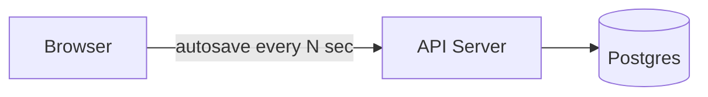

## The Data Model

A single table holds the whole document as a blob:

```sql
CREATE TABLE documents (
    doc_id      UUID PRIMARY KEY,
    content     TEXT NOT NULL,       -- entire document body
    version     BIGINT NOT NULL,     -- incrementing save counter
    updated_at  TIMESTAMPTZ NOT NULL,
    updated_by  UUID NOT NULL
);
```

**Who writes to it:** the client's autosave timer, via the API server, on every save tick.
**Who reads from it:** the client, once, when it first opens the document.
**Where it lives:** a single Postgres instance — no sharding or replication yet, there's exactly one writer per document at this stage, so none is warranted.

## The Save Flow

1. **Client** opens the doc: `GET /v1/documents/{doc_id}` → **API Server** runs `SELECT content, version FROM documents WHERE doc_id = $1` and returns the full text.
2. Alice types locally. Nothing leaves her browser yet — the whole document lives in memory on her client.
3. Every few seconds, **Client** fires an autosave: `POST /v1/documents/{doc_id}/save` with body `{ "content": "<entire document text>", "based_on_version": 4 }`.
4. **API Server** runs `UPDATE documents SET content = $1, version = version + 1, updated_at = now() WHERE doc_id = $2`.

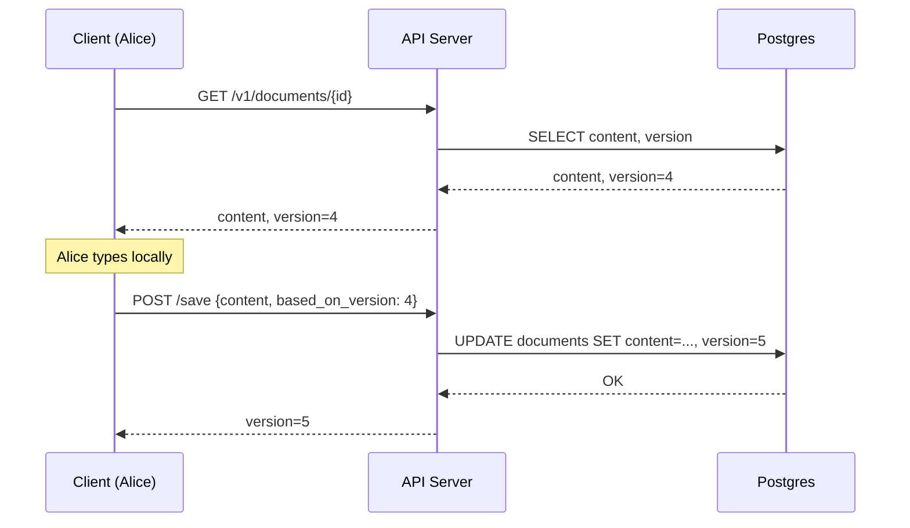

## Where This Breaks

Now Bob opens the same document. Both Alice and Bob have it open. Both are typing.

Alice is adding a paragraph at the top. Bob is deleting a stale sentence near the bottom. Both browsers hold their own full in-memory copy of the document, fetched at slightly different times.

At t=5s, both autosave timers fire:

- Alice's client sends `POST /save` with **her** full document — her new paragraph, but *not* Bob's deletion, because her local copy predates it.
- A split second later, Bob's client sends `POST /save` with **his** full document — his deletion, but *not* Alice's paragraph.

Bob's save lands second. It overwrites the row. Alice's paragraph — the one she just spent ten minutes writing — is gone. Not merged, not conflicted, just silently erased, because "whole document overwrite" has no concept of *what changed*, only *what the final state looked like from one person's point of view*.

This isn't a rare edge case. It's the default outcome the moment two people type into the same document within the same autosave window.

---

Next: we'll fix the *symptom* first — stop losing whole documents to a bad race — before tackling the real crux, which is making concurrent edits actually merge instead of just avoiding total data loss.

Got it, or want to poke at Day 0 first?

---

# Iteration 1: Stop the Silent Overwrite

## The Fix We're Reaching For

The problem in Day 0 wasn't that two people edited at once — it's that the server had no way to tell Bob's save "hey, someone already changed this since you last read it." It just clobbered.

The obvious first fix: make the server check. Before accepting a save, compare the version the client *thinks* it's updating against the version actually in the database.

```sql
UPDATE documents
SET content = $1, version = version + 1, updated_at = now()
WHERE doc_id = $2 AND version = $3   -- $3 = based_on_version from client
```

If Alice's save (`based_on_version: 4`) lands first, it succeeds, and the row is now at version 5. When Bob's save arrives moments later still carrying `based_on_version: 4`, the `WHERE version = 4` clause matches zero rows. The API server sees `0 rows affected` and returns `409 Conflict` instead of silently overwriting.

This is **optimistic concurrency control** — assume no conflict, write anyway, and check afterward rather than locking up front.

## What We Gained

Nobody's work vanishes without anyone knowing. Bob gets an explicit signal that his save was rejected because the document moved underneath him.

## What We Gave Up / What New Problem This Introduces

We've converted silent data loss into an explicit error — but we still haven't solved the actual problem. Bob's client now has to do *something* with that `409`. What, exactly?

If Bob's client just retries by resending the same full-document save, it'll fail again — the version still won't match. If it force-overwrites, we're back to Day 0's data loss, just with extra steps. If it shows Bob a dialog box ("this document changed, reload and lose your edits, or cancel"), we've built email-attachment-era conflict resolution with a nicer UI. Nobody wants to collaborate in a document that pops up "reload to continue" every few seconds.

The real issue: **whole-document snapshots have no concept of what specifically changed.** Alice's save and Bob's save are two entire competing versions of reality, and there's no way to combine "Alice added a paragraph at the top" with "Bob deleted a sentence at the bottom" when all the server has is two complete blobs of text with no diff between them.

## What We Considered and Rejected

**Pessimistic locking** — let Alice "check out" the document, lock it, and reject anyone else's edits until she checks it back in. Rejected because it kills requirement 1 outright: real-time *concurrent* editing means two people typing at the same instant, not a system that serializes them into a queue. This is exactly the single-writer lock model Docs was built to replace.

**Retry-with-merge on the client** — have Bob's client diff his content against the new server version and try to auto-merge before resaving. This is close to the real answer, but doing it as an ad hoc client-side text diff on whole-document blobs is fragile and doesn't generalize — it's solving the same problem OT/CRDTs solve, just badly and without the formal guarantees. We'll get there properly next.

## The Actual Crux

What we actually need is to stop sending **whole documents** back and forth entirely, and instead send **the specific edit each person made** — "insert 'Q3 results:' at position 0" rather than "here's my entire 4,000-word document." Once edits are small, discrete, describable operations instead of opaque snapshots, the server has something real to reason about and merge.

That's the shift from Iteration 2 onward: documents become **operations applied to a starting state**, not blobs replacing each other.

---

**Likely interviewer follow-up:** *"Why not just lock the document per-paragraph or per-section instead of the whole thing?"*
**Model answer:** Section-level locking narrows the blast radius but doesn't remove the fundamental problem — two people can still want to edit the exact same sentence at the exact same time, and now you've added the complexity of tracking lock granularity and boundary conflicts (what happens when Alice's edit spans two "sections"?) without actually solving concurrent editing of the same content. It's a band-aid, not a fix.

---

Next: we introduce operations instead of snapshots — and this is where the real crux begins. I'll walk through the first *naive* attempt at merging operations (just applying them in arrival order) and show exactly how it corrupts the document.

Got it, or questions on optimistic concurrency first?

---

# Iteration 2: Operations Instead of Snapshots — Naive Attempt #1

## The Scenario

Let's replace whole-document saves with **operations**. Instead of "here's my entire document now," each edit becomes a small, precise instruction.

The document is currently: `"Hello world"` (11 characters, positions 0 through 10).

Alice inserts `"there "` after `"Hello "` — she's typing `"Hello there world"`. Her operation, expressed as an edit at a position:

```json
{ "op": "insert", "pos": 6, "text": "there " }
```

At the exact same moment, Bob — looking at the same starting document, `"Hello world"` — deletes the word `"world"`. His operation:

```json
{ "op": "delete", "pos": 6, "length": 5 }
```

Both operations are computed against the *same starting state*, position 6, because neither client knows about the other's edit yet. Both fire off to the server within milliseconds of each other.

## Naive Attempt #1: Apply Operations in Arrival Order

The obvious first instinct: the server is now a stream of small edits instead of blobs, so just apply them as they arrive, like a transaction log.

Say Alice's operation arrives first.

**Step 1 — apply Alice's insert:**
`"Hello "` + `"there "` + `"world"` → `"Hello there world"`

**Step 2 — apply Bob's delete**, which says "delete 5 characters starting at position 6":
`"Hello there world"`, position 6 onward: `"there world"` → deleting 5 chars from position 6 removes `"there"`, not `"world"`.

Result: `"Hello  world"` — Bob's word "world" survives untouched, and instead the server chewed a hole through the middle of Alice's freshly-inserted `"there "`.

## Why It Breaks

Bob's operation says "delete 5 characters at position 6" — but position 6 was only valid **relative to the document Bob was looking at when he made the edit**, which was `"Hello world"`. By the time his operation actually gets applied, Alice has already shifted everything after position 6 six characters to the right. Position 6 now points at completely different content than what Bob intended to delete.

This is the core problem with naive apply-in-order: **an operation's position is only meaningful relative to a specific document state, and that state has silently moved by the time the operation lands.**

It's not a rare interleaving, either — this happens *every single time* two people edit near each other concurrently, which for a live collaborative editor is the normal case, not the exception.

## Naive Attempt #2: Reject and Ask the Client to Recompute

Okay — what if, like Iteration 1's version check, we just reject Bob's operation if the document changed since his `based_on_version`, and make his client recompute the operation against the new state and resend?

This "works" in the sense that it's correct — Bob's client refetches the latest doc, recalculates that "world" is now at position 12 instead of 6, and resends. But now think about what a live typing session actually looks like: Alice isn't sending one operation, she's sending a stream of dozens of operations per second as she types each character. Bob's client would be getting rejected and forced to recompute *constantly*, and worse, every rejection means Bob's own in-flight keystrokes have to pause and resync.

At real typing speed, with multiple people in a document, this turns into a near-permanent reject-and-retry storm. It technically preserves correctness but destroys the "feels instant" requirement — every one of Bob's keystrokes risks a round trip before it's accepted.

## The Actual Requirement

Both naive attempts fail for the same underlying reason: they treat operations as **fixed instructions about absolute positions**, when what we actually need is a way to **transform** an operation so it still does the *intended* thing even after other operations have landed first.

Bob's intent was never "delete characters 6 through 10." His intent was "delete the word 'world'." We need a mechanism that can look at Alice's operation, understand how it shifted the document, and adjust Bob's operation's position *accordingly* — rather than rejecting it or applying it blindly.

That mechanism is **Operational Transformation** — and it's the real crux of this whole system. I'll walk through how it works next.

---

**Likely interviewer follow-up:** *"Why not just have the client send full context — like 'delete the word that was at position 6 when I started, whatever it says now' — instead of a raw position?"*
**Model answer:** That's actually closer to the right instinct, but "whatever it says now" is ambiguous — if the text at that spot has *also* changed (not just shifted), what should happen? OT formalizes this "adjust for what happened in between" idea with precise transform rules per operation-type pair, rather than leaving it as fuzzy client-side guesswork.

---

Next: Operational Transformation itself — how the server (or peers) mathematically transform Bob's operation against Alice's so it lands correctly, and why this needs a single point of ordering to work.

Got it, or want to sit with why naive arrival-order breaks first?

---

# Iteration 3: Operational Transformation

## The Core Idea

Let's go back to Alice and Bob. Both started from `"Hello world"`.

- Alice: `insert("there ", pos=6)`
- Bob: `delete(pos=6, length=5)`

We already know applying Bob's operation unchanged after Alice's is wrong — his position 6 is stale. What we want instead is a function that takes Bob's operation *and* Alice's already-applied operation, and produces a **new version of Bob's operation** that's correct against the post-Alice document.

This function is called **transform**, usually written `transform(op_a, op_b)`. Given two operations that both started from the same base state, it shifts one so it still does the right thing after the other has already been applied.

Here, Alice inserted 6 characters at position 6. Bob's delete was originally targeting position 6. Since Alice's insert happened *at or before* Bob's target position, everything from position 6 onward shifted right by 6 characters. So:

```
transform(bob_delete, alice_insert) 
  = delete(pos = 6 + 6, length = 5)
  = delete(pos = 12, length = 5)
```

Apply that against `"Hello there world"`: position 12 is the start of `"world"`. Deleting 5 characters from there removes exactly `"world"`.

Result: `"Hello there "` — wait, that trims the trailing content correctly: `"Hello there "` becomes `"Hello there "` with "world" removed → `"Hello there "`. Both edits survive. Alice's insertion and Bob's deletion both land as intended.

## The Analogy: Two People Editing a Shared Physical Scroll

Think of the document as a long paper scroll, and both Alice and Bob are looking at *photocopies* of it, taken at the same instant, before either of them marks anything up.

Alice writes on her copy: "insert this phrase at the 6-inch mark."
Bob writes on his copy: "cut out 5 inches starting at the 6-inch mark."

If you apply Alice's instruction to the real scroll first, the scroll gets 6 inches longer starting at that mark. Bob's instruction, unchanged, now points at the wrong spot — it would cut into Alice's new insert instead of the text that used to be there.

Transform is the person standing at the real scroll who says: "Bob, Alice already added 6 inches before your mark — so your cut actually needs to start 6 inches further down the *current* scroll, not where you originally measured it." Bob's *intent* — cut the word that was there — is preserved, even though the literal number he wrote is now wrong.

## Why This Needs a Single Point of Ordering

Transform functions are defined pairwise: `transform(op1, op2)` assumes you know which one happened "first" in some canonical order, because the transform math for "delete after an insert" is different from "delete after another delete." If every client tried to independently decide ordering, different clients could transform in different orders and diverge — Alice's screen and Bob's screen ending up with genuinely different final text, with no way to detect it.

So OT needs a **single serialization point** — one place that says "Alice's operation is officially operation #47, Bob's is officially operation #48" — and every operation gets transformed against everything that landed before it, in that same agreed order. This is why real-time collaborative editors are built around a central server that owns ordering, not a fully peer-to-peer mesh.

This single point of ordering is exactly why the operations flow through a server, not client-to-client. It's about to become the backbone of the whole architecture.

## What We Gained

Concurrent edits near each other now merge correctly instead of corrupting the document or forcing a reject-and-retry loop. Both Alice's and Bob's intents survive.

## What We Gave Up / What New Problem This Introduces

Transform functions have to be written correctly for *every pair* of operation types — insert-insert, insert-delete, delete-delete, and eventually formatting operations like bold/italic. Getting these transform functions exactly right, including tie-breaking rules for genuinely simultaneous edits at the identical position, is notoriously easy to get subtly wrong. Google's own OT implementation took years of production bugs to harden.

We also still need that single ordering authority — which means every operation has to pass through one place before it's considered "official." That's a centralization point we'll need to scale carefully.

## What We Considered and Rejected

**CRDTs (Conflict-free Replicated Data Types)** — an alternative to OT where the data structure itself is designed so operations commute (order doesn't matter) without needing a central transform step, often used for fully peer-to-peer or offline-first sync. We're noting this now and will come back to it as a real alternative once we've seen OT's full shape — it's a legitimate "why not X" competitor, not a strawman.

**Locking the region being edited** — already rejected in Iteration 1, for the same reason: it kills real concurrent editing.

---

**Likely interviewer follow-up:** *"What happens when two people insert at the exact same position at the exact same time — how do you break the tie?"*
**Model answer:** Transform functions need a deterministic tie-breaker for identical positions — typically something like "the operation from the client with the lower client ID (or the operation assigned the earlier sequence number by the server) is considered to have happened first," and the other operation's position shifts to land after it. The specific rule matters less than that it's *deterministic and the same on every client*, so everyone converges on identical text.

---

Next: I want to split this into two messages as planned. This one covered the transform mechanism itself. The next covers where that "single ordering authority" actually lives architecturally — the server that owns sequencing — and what breaks when *that* server is a single point of failure or gets overloaded by every keystroke from every open document in the system.

Got it, or questions on transform itself first?

---

# Iteration 4: The Central Sequencing Server

## The Scenario

We now know every operation needs to pass through one authority that assigns it an official order before it's transformed and broadcast. Let's call this authority the **Document Session Server** — one process that owns a specific document while it's being actively edited.

Alice and Bob both connect to it over a persistent connection (WebSocket) the moment they open the document. Every keystroke becomes an operation sent to this server, not a REST POST — round-tripping through HTTP request/response for every character would be far too slow for "feels instant."

## Architecture

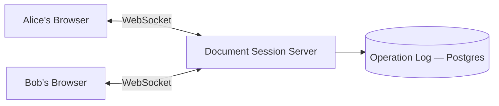

This single server is now doing three jobs:

1. Holding the current in-memory state of the document (or enough of it to transform against).
2. Assigning each incoming operation a sequence number — this is the "official order" from Iteration 3.
3. Transforming, applying, and broadcasting the transformed operation to every other connected client.

## The Data Model: An Operation Log, Not a Blob

We're not overwriting `content` anymore. Every accepted operation gets appended as its own row:

```sql
CREATE TABLE operations (
    doc_id       UUID NOT NULL,
    seq          BIGINT NOT NULL,       -- server-assigned, strictly increasing per doc
    client_id    UUID NOT NULL,
    op_type      TEXT NOT NULL,         -- 'insert' | 'delete'
    pos          INT NOT NULL,
    text         TEXT,                  -- for inserts
    length       INT,                   -- for deletes
    applied_at   TIMESTAMPTZ NOT NULL,
    PRIMARY KEY (doc_id, seq)
);
```

**Who writes to it:** the Document Session Server, once per accepted operation, after transforming it against anything with a higher `seq` than the client had seen.
**Who reads from it:** the Document Session Server itself, on startup or failover, to reconstruct the document by replaying operations in `seq` order. Also read on document open, to build the initial state for a newly joining client.
**Where it lives:** still Postgres for now — this is an append-only log, not a mutable blob, but we haven't hit a scale problem yet that demands anything fancier.

## The Write Flow

1. **Alice's browser**, after she types "t", sends over the WebSocket:
   `{ "type": "op", "doc_id": "...", "based_on_seq": 47, "op": { "op": "insert", "pos": 6, "text": "t" } }`
2. **Document Session Server** checks: has anything landed since `seq 47`? If yes, it runs `transform()` against each of those in order, producing an adjusted operation.
3. **Document Session Server** assigns the next sequence number and appends: `INSERT INTO operations (doc_id, seq, client_id, op_type, pos, text, applied_at) VALUES (...)`.
4. **Document Session Server** applies the transformed operation to its in-memory document state.
5. **Document Session Server** broadcasts the transformed operation over WebSocket to every other connected client (Bob), each of whom applies it locally.
6. **Document Session Server** acks back to Alice's client with the final `seq` number, so her client knows what "latest known state" to base her *next* keystroke on.

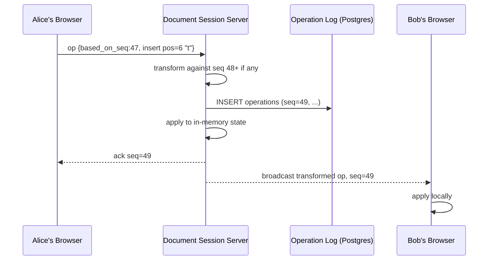

## Why This Is a Reasonable Iteration, Not Yet the Final Answer

This gives us correctness (via transform) and durability (via the append-only log) with genuinely low latency — a WebSocket round trip to a single in-memory-holding server is fast, no disk read needed on the hot path since the server keeps state in memory and only appends to the log asynchronously-ish for durability.

But look at what we just built: **one server process holds the live state of one document, and every single editor of that document must be connected to that exact process.**

## Where This Breaks

Say this Document Session Server is handling 500 actively-open documents at once, each with a handful of connected editors, all pushing keystroke-level operations through it continuously.

Then the process crashes — a bad deploy, an out-of-memory kill, a hardware fault, doesn't matter which.

Every one of those 500 documents' in-memory state is gone. Every client connected to it — hundreds of people mid-sentence — has their WebSocket drop simultaneously. And until something reconnects them to a *new* session server that has rebuilt state from the operation log, nobody in any of those 500 documents can save a single keystroke.

Worse: which server should Alice's browser even reconnect to? If we've only ever run one Document Session Server, there's no answer. If we run several, how does Bob's browser find the *same* one Alice is connected to, given they're both editing the same document?

---

Next: we fix this by making the session-owning server assignment explicit and recoverable — sharding documents across many session servers, and handling the "which server owns this doc, and what happens when it dies" problem. This is where we bring in a real ownership/routing layer.

Got it, or questions on the session server flow first?

---

# Iteration 5: Ownership Routing and Recovery

## The Problem Restated

Two things are missing from Iteration 4: a way for Alice's and Bob's browsers to agree on *which* Document Session Server owns their document, and a way to recover cleanly when that server dies.

## The Fix: A Routing Layer in Front of Session Servers

We introduce a lightweight **Routing Service** that every client talks to *before* opening a WebSocket. Its only job: given a `doc_id`, tell the client which Document Session Server instance currently owns it — spinning one up if none does.

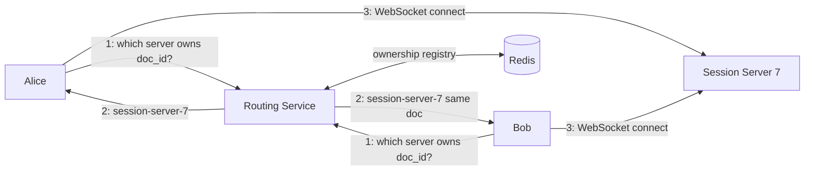

**Who writes to the ownership registry:** the Routing Service, when it assigns a document to a session server — a `SET doc_owner:{doc_id} session-server-7 EX 30` in Redis, with a short TTL that the owning session server refreshes with a heartbeat (`EXPIRE doc_owner:{doc_id} 30`) every few seconds while it's actively holding that document.
**Who reads it:** the Routing Service, on every "which server owns this doc" lookup.
**Where it lives:** Redis — this is a natural fit for a key-value store here, not a relational table: the access pattern is a single-key lookup by `doc_id` with no relational joins, needs sub-millisecond reads on the hot path of every document open, and the TTL/heartbeat mechanism for detecting a dead owner is a first-class Redis feature rather than something we'd hand-roll on top of Postgres.

## This Is Really a Sharding Decision

"Which session server owns this document" is exactly the sharding problem, just phrased as ownership instead of storage. Let's treat it that way.

**Candidate key 1 — shard by `doc_id`.**
Every document is independently assigned to a session server, typically via consistent hashing over `doc_id`. This is the obvious choice: each document's editors are a small, self-contained group, and there's no cross-document access pattern that needs documents grouped together. Optimizes: even distribution of the *number* of documents across servers. Breaks: nothing structural — this is the right key here, which is unusual, but worth checking against the alternatives below to see why.

**Candidate key 2 — shard by `owner_user_id`** (route based on who created/owns the document).
This would optimize a query like "show me all documents owned by this user," by co-locating them. But that's a metadata query, not a live-editing-session query — and it actively breaks our actual access pattern: two *different* users editing the *same* document would potentially get routed to different servers based on whose `user_id` "wins," which defeats the entire point of a single ownership authority per document.

**Candidate key 3 — shard by `region`** (route based on where most editors are located).
This optimizes latency for geographically clustered editors, and matters more once we're multi-region (we'll return to this properly in the multi-region iteration). But it breaks the moment a document has editors split across two regions — which pins the document to *a* region and adds cross-region latency for whichever editors aren't there, and we haven't decided the multi-region ownership model yet, so it's premature here.

**Verdict: shard by `doc_id`** via consistent hashing. It matches the actual access pattern — everyone editing the same document needs the same server — cleanly.

**Hot shards for this system:** unlike a social graph with celebrity accounts, a single document has a hard ceiling on realistic concurrent editors — dozens, not millions. So per-document hotspots aren't the risk here. The risk is a session server ending up owning an unlucky cluster of simultaneously-popular documents (say, a company-wide doc everyone opens right after an all-hands email goes out). Consistent hashing bounds this somewhat by spreading `doc_id`s pseudo-randomly, but doesn't eliminate a burst. The practical fix is capacity headroom per session server plus the routing service being able to reassign a new document to the least-loaded server rather than a pure hash-only assignment.

**Resharding cost:** because ownership is just a Redis key with a TTL, not a physically partitioned dataset, "resharding" here is nearly free — it's just the routing service picking a different session server next time a document needs a home. No data migration, because the durable data lives in the operation log in Postgres, not on the session server itself. Consistent hashing bounds the blast radius further: adding or removing a session server only reassigns the documents that hashed near that node, not the whole fleet.

## Recovery When a Session Server Dies

1. Session Server 7 crashes. Its Redis heartbeat stops refreshing `doc_owner:{doc_id}`.
2. Within the TTL window (say 30 seconds), the key expires. The document is now unowned.
3. Alice's WebSocket connection drops. Her client detects this and re-asks the **Routing Service**: "who owns this doc now?"
4. Routing Service sees no owner in Redis, assigns a fresh session server (say, Session Server 12), and writes the new ownership key.
5. **Session Server 12** rebuilds document state by reading the operation log: `SELECT * FROM operations WHERE doc_id = $1 ORDER BY seq ASC`, replaying every insert/delete in order to reconstruct current text.
6. Alice and Bob both reconnect to Session Server 12 and resume, having lost at most whatever operations were sent but not yet acknowledged during the crash window.

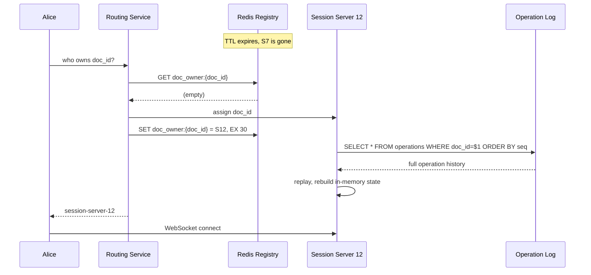

## What We Gained

Document ownership is no longer hardcoded to one process for its whole lifetime. Servers can crash and documents recover automatically, with no data loss beyond an unacked in-flight operation or two. Multiple session servers now share the fleet's load instead of one process bottlenecking everything.

## What We Gave Up / What New Problem This Introduces

There's a recovery window — the TTL period — where the document is genuinely unreachable for new edits while the old owner's death is being detected. A 30-second TTL means up to 30 seconds of "why can't I connect" if we're relying purely on heartbeat expiry. We'll want a faster failure detection path than just waiting out a TTL (an active health check from the routing service, not just passive expiry) — worth flagging but not a redesign.

We've also just replayed the entire operation log from scratch on every recovery, which is fine for a document with a few hundred operations, but becomes a real cost for a document that's had a thousand edits over its lifetime. That's a preview of a problem we'll hit again.

## What We Considered and Rejected

**Every session server holds every document (no ownership routing at all), broadcasting operations peer-to-peer between servers.** Rejected because it reintroduces the exact problem transform was built to solve — without a single ordering authority per document, two session servers could assign conflicting sequence numbers to concurrent operations, and clients would diverge.

**Sticky sessions via load balancer hashing alone, no explicit registry.** This can route new connections consistently, but gives us no clean way to detect "the server that owned this doc is dead" or to coordinate handoff — we'd be reinventing Redis's TTL/heartbeat mechanism ourselves, worse.

---

**Likely interviewer follow-up:** *"Why Redis for the ownership registry instead of just keeping it in Postgres alongside the operations log?"*
**Model answer:** Ownership is inherently ephemeral and needs a TTL-based liveness signal — Redis gives us that natively with `EXPIRE`, whereas Postgres would need a cron job or background sweeper polling for stale rows, adding latency and complexity to what should be a sub-millisecond hot-path lookup on every document open.

---

Next: that "replaying the entire log from scratch" cost I flagged — this is where we introduce periodic snapshotting, plus tackle the durability question properly: how operations get persisted without every single keystroke costing a synchronous disk write.

Got it, or questions on routing/recovery first?

---

# Iteration 6: Snapshots and Durability Without a Disk Write Per Keystroke

## The Scenario

Picture a design doc that's been alive for eight months. Dozens of editors, thousands of operations logged. Someone reopens it after a long weekend, and Session Server 12 — the one that just picked it up — has to run:

```sql
SELECT * FROM operations WHERE doc_id = $1 ORDER BY seq ASC
```

That's potentially tens of thousands of rows, replayed one insert/delete at a time, before a single character can render. What used to be an instant reconnect in Iteration 5 is now a multi-second stall, and it gets *worse* every month the document stays alive — the log only grows.

## The Fix: Periodic Snapshots

Instead of replaying from operation zero every time, periodically materialize the current document text as a snapshot, and only replay operations *since* that snapshot.

```sql
CREATE TABLE document_snapshots (
    doc_id        UUID NOT NULL,
    seq           BIGINT NOT NULL,      -- last operation included in this snapshot
    content       TEXT NOT NULL,        -- full materialized document text at this seq
    created_at    TIMESTAMPTZ NOT NULL,
    PRIMARY KEY (doc_id, seq)
);
```

**Who writes to it:** the Document Session Server, on a background timer — say every 200 operations or every 60 seconds of activity, whichever comes first, not on every keystroke.
**Who reads it:** a Document Session Server on recovery/cold-open, to get a fast starting point.
**Where it lives:** same Postgres instance as the operation log — it's still just text plus metadata, no new storage class needed here.

Recovery now looks like:

1. `SELECT content, seq FROM document_snapshots WHERE doc_id = $1 ORDER BY seq DESC LIMIT 1` → get the latest snapshot, say at `seq 4200`.
2. `SELECT * FROM operations WHERE doc_id = $1 AND seq > 4200 ORDER BY seq ASC` → only the operations since then, maybe a few dozen instead of tens of thousands.
3. Apply the snapshot as the starting text, replay just those remaining operations on top.

This is the same idea as a database's write-ahead log plus periodic checkpoints, or a video's keyframes plus delta frames in between — you don't decode a whole movie from frame zero to seek to minute 40, you jump to the nearest keyframe and play forward a little.

## The Actual Durability Question

Snapshots solve *recovery speed*, but there's a separate question we've been glossing over: when Alice's operation gets appended to the `operations` table in step 3 of the write flow, is that `INSERT` a synchronous write that Alice's keystroke waits on?

If yes — every keystroke pays a Postgres round-trip and disk fsync before Alice's client even gets an ack. At real typing speed, that's the same "feels instant" problem we've fought since Iteration 2, just moved to a new spot.

If we just skip persisting and only keep operations in the session server's memory, applying them to broadcast immediately and writing to Postgres "eventually" — then a session server crash between "broadcast to Bob" and "persist to Postgres" loses operations that Bob already saw and built on top of, silently diverging his document from what's durably stored.

## The Fix: Async Persistence With an Ack Boundary

The Document Session Server keeps an in-memory buffer of recently-applied operations. It **applies and broadcasts immediately** — that's the low-latency path everyone experiences. Persistence to Postgres happens in a tight background batch, not per-keystroke, but the server withholds its **final ack** to the originating client until that operation is confirmed durable.

Concretely:

1. Alice's insert arrives, gets transformed, applied to in-memory state, and broadcast to Bob — all within milliseconds. Bob sees the character appear instantly.
2. The operation is added to a small in-memory write buffer.
3. Every ~20ms (or when the buffer hits N operations), the session server flushes the buffer as one batched `INSERT ... VALUES (...), (...), (...)` covering multiple operations in a single round trip.
4. Only once that batch commits does the session server send Alice's client the "durably saved" ack for that specific operation.

This means Bob sees Alice's typing with zero added latency — the in-memory apply-and-broadcast is instant — but Alice's client's own "saved" indicator lags by a small, bounded batching window, and if the server dies in that ~20ms window, only that tiny sliver of very-recent keystrokes is at risk, not the whole session.

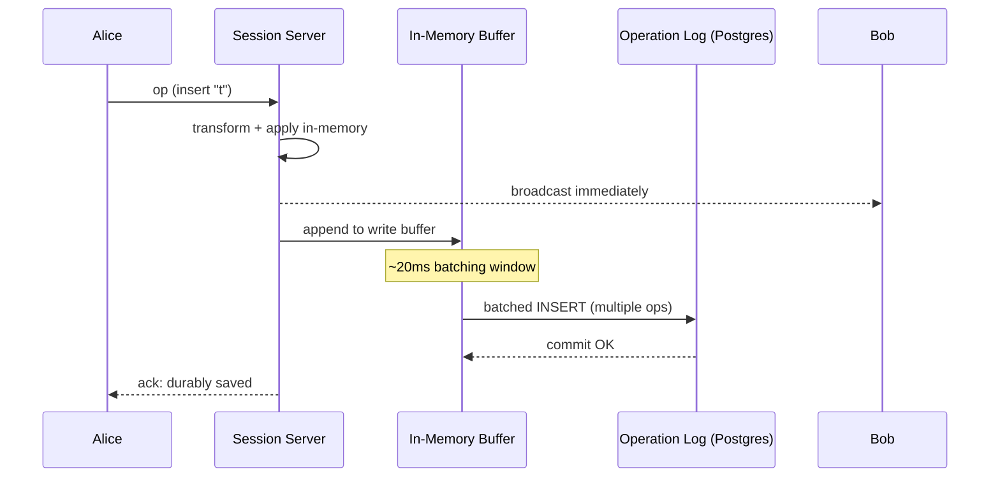

## What We Gained

Typing latency for *seeing your own and others' edits* stays sub-millisecond-to-server, unaffected by disk I/O. Recovery time for long-lived documents drops from "replay everything" to "replay a small tail since the last snapshot." Durability risk is bounded to a small, known batching window instead of either "every keystroke syncs to disk" or "nothing is safe until some vague later point."

## What We Gave Up / What New Problem This Introduces

There's now a real (if small) window where an operation has been *shown* to Bob but not yet durably persisted. If the session server dies in that window, Bob's screen has content that doesn't exist in the operation log, and when a new session server rebuilds from the log plus snapshot, that content is gone — Bob's view briefly lied about durability. This is a genuine trade-off, not a free lunch: we chose "fast for everyone, occasionally re-derive a few hundred milliseconds of very recent edits on crash" over "always durable, but every keystroke pays a write latency tax."

## What We Considered and Rejected

**Fsync every operation individually, synchronously, before broadcasting.** Rejected — this directly reintroduces per-keystroke write latency, defeating requirement 1 (real-time, feels-instant editing) for the sake of a durability guarantee stronger than this system actually needs. Google Docs itself doesn't guarantee zero-loss on hardware failure mid-keystroke; it guarantees near-zero loss with imperceptible latency, which is what we just built.

**Skip snapshots, just cap the operation log's retention (delete old ops).** Rejected because we need the full history to correctly reconstruct current state — you can't discard operations 1 through 3000 without first materializing what they add up to. Snapshotting *is* how you safely "forget" old operations: the snapshot itself becomes the new baseline.

---

**Likely interviewer follow-up:** *"What happens to the snapshot mechanism if the session server crashes mid-batch-flush — could you end up with a corrupt or partial snapshot?"*
**Model answer:** No, because snapshotting and the operation log flush are separate, and the snapshot is only ever built from operations that are already confirmed durable in the log — the snapshot job reads `seq`s that have already committed, so a crash mid-flush just means the next snapshot attempt picks up from wherever the log actually is. The log is the source of truth; the snapshot is a derived optimization, never authoritative on its own.

---

We've now covered the crux (OT), the ownership/routing/recovery model, and durability. Next: caching and replication — specifically, does this system even need read replicas given its access pattern, and what, if anything, is worth caching versus what CDN doesn't apply here at all.

Got it, or questions on the durability trade-off first?

---

# Iteration 7: Replication and Caching — What Actually Applies Here

## Replication: Does This System Even Need Read Replicas?

Let's check this against the actual read:write ratio, not assume it by default.

Who reads from Postgres in this design? Two things: recovery reads (a session server rebuilding state after a crash or reassignment) and the periodic batched writes to the operation log. Live editing traffic — the thing happening thousands of times a second across the fleet — never touches Postgres on the hot path at all. It's served entirely from each session server's in-memory state, over WebSocket. That's the whole point of Iteration 6.

So the actual Postgres read pattern is: occasional, bursty, triggered only by server restarts or reassignment — not a steady stream of user-facing reads that would benefit from horizontal read scaling.

**Verdict: no read replicas needed for the operation log or snapshots.** Read replicas solve "too many concurrent readers for one primary to handle," and we don't have that here — we have infrequent, latency-tolerant recovery reads. Adding replicas would add replication lag risk (a session server recovering from a stale replica could miss the most recent operations) for a scaling problem we don't actually have.

Where replication *does* matter: standard primary durability for the Postgres instance itself — a synchronous or near-synchronous standby so we don't lose the operation log to a single disk failure. That's a boring, standard operational choice (one sync replica for failover, not for read scaling), not a novel design decision for this system.

**Consistency model that falls out of this:** within a single document's editing session, consistency is enforced by the session server being the single ordering authority — every client sees the same sequence of transformed operations, so there's no "read-your-writes" ambiguity to solve, that's what OT + central sequencing already guarantees. The only place staleness could bite is a session server recovering from a replica that's lagging behind the primary by even a few hundred milliseconds — which is exactly why recovery reads should hit the primary, not a replica, despite the extra load, since correctness here matters more than shaving primary load for a rare event.

## Caching: What's Actually Expensive and Repeated Here?

Justify this against the real access pattern before reaching for Redis reflexively.

**Live document content** is already effectively cached — it lives in the session server's memory the entire time the document is being actively edited. That *is* the cache; there's no separate caching layer to add on top of something already in memory.

**What's actually worth caching:** the ownership registry lookup from Iteration 5 already is one — that Redis `GET doc_owner:{doc_id}` on every document open is precisely a cache of "which server currently owns this," avoiding a more expensive coordination step on every single connect. We already built this; it doesn't need a second caching layer bolted on.

**What about document metadata** — title, last-edited-by, permissions — shown in a "recent documents" list before a user even opens a document? This is a genuinely different access pattern: read far more often than written (people browse their doc list constantly, but rarely rename a doc), and it's small, structured data, a good candidate for an app-level cache (e.g., Redis, keyed by `user_id` → list of recent doc metadata), invalidated on write (a rename or share event evicts that key). This is a reasonable, standard cache — but it's metadata, not the collaborative-editing crux, so it doesn't need deep treatment here.

**Is a CDN warranted?** No — and it's worth being explicit about why, rather than skipping it silently. CDNs earn their keep for content that's either static-and-shared-by-everyone (so one cached copy serves many users) or personalized-but-safely-cacheable-at-the-edge for a TTL. Document content here is neither: it's private, per-document, and changes continuously while being edited — caching it at a CDN edge node would mean serving stale or wrong content to whoever hits that edge next, which is actively harmful for a system whose entire value proposition is "everyone sees the current state." The static assets of the *editor application itself* — JS bundles, CSS, fonts — absolutely benefit from a CDN, but that's generic web-app hygiene, not a decision specific to this system's design.

## What We Gained

We avoided two reflexive additions — read replicas and a document-content cache — that a name-drop-level answer might reach for automatically, by actually checking them against this system's real access pattern. Session server memory already *is* the cache for the thing that matters; Postgres reads are rare enough that replicas would add risk without solving a real bottleneck.

## What We Gave Up / What New Problem This Introduces

Nothing new introduced here — this iteration was mostly about *not* adding complexity that wouldn't pay for itself, which is itself a defensible interview answer. The one real addition, the metadata cache, is standard and low-risk.

## What We Considered and Rejected

**Adding read replicas preemptively "in case the system grows."** Rejected — replicas solve read-scaling, and this system's read pattern is bursty-and-rare, not steady-and-high-volume. Adding them now would mean carrying replication-lag risk for a problem that doesn't exist yet, and if recovery reads ever did become a bottleneck, the actual fix would be more/better snapshotting (Iteration 6), not replicas.

**Caching document content in Redis as a second layer behind the session server's in-memory state.** Rejected as pure redundancy — the session server's memory is already faster than a Redis round-trip and is already the single source of truth while a document is live. This would be a cache of a cache, adding invalidation complexity for zero latency benefit.

---

**Likely interviewer follow-up:** *"If a document gets reopened by someone else five seconds after the last editor closed it, does the session server still have to rebuild from Postgres, or is there a warm path?"*
**Model answer:** Worth adding a short grace period — the session server holds the in-memory state for some window (say 60 seconds) after the last client disconnects, before releasing ownership and evicting state. A reopen within that window is instant, no Postgres read at all; a reopen after it has genuinely gone cold and pays the snapshot-plus-tail-replay cost from Iteration 6.

---

Next: multi-region — specifically, where a document's "home" lives when its editors are scattered across continents, and why this system's write-ownership model is actually simpler than something like Twitter's, precisely *because* of the single-session-server design we already built.

Got it, or questions on replication/caching first?

---

# Iteration 8: Multi-Region

## The Scenario

A global company has one shared "Q3 Strategy" document. Priya opens it from Bangalore. Twenty minutes later, Diego opens the same document from São Paulo.

If the Document Session Server that owns this document is sitting in `us-east`, Priya's every keystroke crosses from India to Virginia and back — roughly 200ms+ round trip before she even sees her own character land, let alone before Diego sees it. That's not "feels instant" anymore; that's a noticeably laggy typing experience for anyone far from wherever we happened to place the server.

## Why This System's Multi-Region Problem Is Actually Simpler Than It Looks

Here's the key structural fact that makes this easier than, say, a globally-writable social feed: **a document has exactly one owning session server at any given moment**, by construction, since Iteration 5. There is no multi-writer scenario to reconcile across regions — there's one server, somewhere, and everyone editing that document talks to it.

So the multi-region question isn't "how do we resolve conflicting writes from two regional primaries" — OT already solved concurrent-write ordering *within* one session server. The actual question is narrower: **which region should that one session server live in, for a given document?**

## Write Ownership: Home Region Per Document, Not Per User

Twitter-style systems often go home-region-per-*user*, because each user's own writes are naturally local to them. That doesn't fit here — a document isn't "owned" by writing behavior of one user, it's a single shared object multiple people from different regions edit.

Instead: **home region per document**, decided dynamically rather than fixed at creation. When the Routing Service (Iteration 5) is asked to assign an owner for a document with no current session server, it doesn't just pick *any* available server — it picks a server in the region where the request originated, or where the document's *recent* editors have predominantly been.

Concretely, the routing decision becomes:

```
1. Check Redis: does doc_id already have an owning session server? 
   → if yes, route there regardless of requester's region (single-writer rule holds).
2. If no owner exists, check recent-editor region history for this doc_id
   (a small counter, incremented per open, e.g., ZINCRBY doc_region_activity:{doc_id} 1 {region}).
3. Assign a session server in whichever region has the highest recent activity score
   — falling back to the requester's own region if there's no history (new document).
```

This is exactly the trade-off Priya and Diego's document forces: whichever region wins hosts the low-latency experience, and the *other* region's editors pay a longer round trip to reach that session server. There's no way around one region losing here, given a single-writer-per-document model — the honest framing for an interviewer is that we're choosing "one region pays some latency" over "both regions get inconsistent state," which is the right trade for a correctness-sensitive collaborative document.

## Cross-Region Conflicts: Avoided by Construction, Not Resolved After the Fact

Because there is exactly one session server owning a document at any moment — regardless of which region it's in — there is no cross-region conflict to resolve. Diego's operations physically travel to whichever region currently owns the document, get transformed and sequenced there like any other client, and the result broadcasts back to him. He pays extra latency; he doesn't get a divergent copy that needs reconciling.

This is the single-writer-per-shard pattern in its purest form: contrast this with something like DynamoDB Global Tables' multi-writer mode, which needs last-writer-wins conflict resolution because *multiple* regions can accept writes for the same key simultaneously. We deliberately never let that situation arise — the ownership registry from Iteration 5 guarantees a document has one home at a time, anywhere in the world.

## What About the Durable Storage — Does Postgres Also Need to Be Multi-Region?

The operation log and snapshots (Iteration 6) should live in the same region as the currently-active session server, for the same reason recovery reads should hit the primary and not a lagging replica: a cross-region synchronous write for every batched flush would reintroduce the exact latency tax we spent Iteration 6 avoiding.

For durability, an async cross-region replica of Postgres (say, `us-east` primary replicating to `eu-west`) protects against a full regional outage without being on the hot path — this is disaster recovery, not a live-traffic path, so async replication lag of a few seconds is an acceptable trade here, unlike the recovery-read case from Iteration 7 where we insisted on hitting the primary.

## Data Sovereignty

Worth a one-line acknowledgment: if this were a real product, some customers (EU enterprises, government contracts) would require their document data to never leave a specific region regardless of where editors happen to sit. That's a policy constraint layered on top of the routing logic above — the Routing Service would pin certain `doc_id`s to a fixed region and simply never consider activity-based reassignment for them. It doesn't change the underlying mechanism, just constrains step 3's decision space for flagged documents.

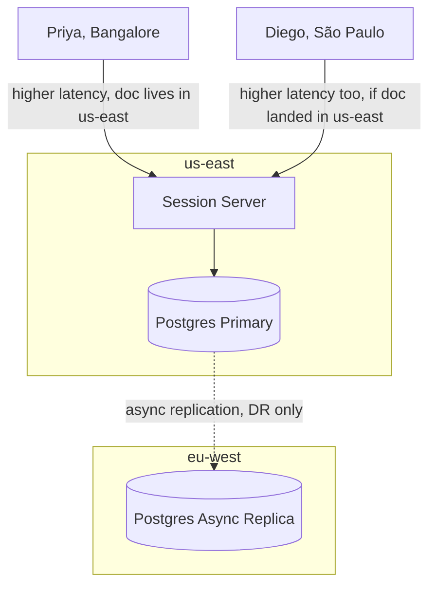

## What We Gained

A defensible multi-region story that doesn't need conflict resolution at all, because the single-writer-per-document invariant we built for correctness in Iteration 5 turns out to also solve the hard part of multi-region for free.

## What We Gave Up / What New Problem This Introduces

Whichever region *doesn't* host the session server eats real latency, and that's structurally unavoidable under this model — there's no version of "one authoritative order of operations" that gives every region equally low latency simultaneously. We also added a heuristic (recent-activity-based region assignment) that can guess wrong for a genuinely new document with editors split evenly across two regions on day one — it'll pick one somewhat arbitrarily, and only self-corrects on future document-open events, not retroactively.

## What We Considered and Rejected

**Multi-writer, one session server per region, with CRDT-style merge across regions instead of OT.** This is a real alternative — CRDTs are specifically designed to commute across independent writers without a central authority. Rejected *for this iteration* only because it changes the whole foundation we built (OT assumes single ordering authority); it's not that CRDTs are wrong, it's that adopting them is a foundational choice from Iteration 3, not a bolt-on multi-region patch. We flagged this as a legitimate competitor earlier and it's worth its own comparison now that we've seen OT's full shape end-to-end.

---

**Likely interviewer follow-up:** *"What happens if Priya and Diego are both in the document and their regional latencies are genuinely symmetric — is there a better answer than 'pick one region and eat it'?"*
**Model answer:** Not within a single-writer model — that asymmetry is the direct cost of the correctness guarantee we chose. The honest alternative is a fundamentally different architecture (CRDTs, multi-writer, eventual convergence) that trades some of OT's stronger ordering guarantees for symmetric regional latency. Which is the right trade depends on the product's tolerance for that different consistency model — worth naming as a real fork in the road, not a settled question.

---

We've now covered every starred NFR. Given that CRDTs came up twice as "the real alternative we deferred," want me to do a dedicated OT-vs-CRDT comparison as its own message before we move to the final architecture recap — or head straight to the recap, interview arsenal, and mock Q&A?

---

Good catch to double check — but it was actually covered, just folded into Iteration 5 rather than given its own iteration, since the sharding decision *was* the ownership-routing decision for this system.

To point back to it specifically: the section titled **"This Is Really a Sharding Decision"** in Iteration 5 covered:

- **Three candidate shard keys** — `doc_id` (winner), `owner_user_id` (rejected — breaks co-editing), `region` (rejected — premature, revisited properly in Iteration 8)
- **Hotspot analysis** — no celebrity-style hotspots possible here since concurrent editors per document is capped at dozens, but flagged the "unlucky cluster of simultaneously-popular docs on one server" risk and the fix (routing service load-awareness, not pure hash-only assignment)
- **Resharding cost** — nearly free, since ownership is an ephemeral Redis key with a TTL, not physically partitioned data. Consistent hashing bounds the blast radius to just the documents that hashed near a removed/added node

The reason it landed there instead of getting its own iteration: for most systems in this series (Twitter, the crawler), sharding is a separate decision about *where data physically lives*. Here, sharding and "who owns the live editing session" are the *same* decision — there's no separate data-partitioning question independent of the routing problem, because the durable data (operation log, snapshots) isn't sharded at all, it's just in Postgres, keyed by `doc_id`, with no partitioning pressure since even a very active document's operation log is small relative to what would actually force horizontal partitioning.

So: sharding is covered, just under the name "ownership routing" because that's what it actually is for this system. Nothing missing — want me to expand any part of that section further, or move on to the OT vs. CRDT comparison / final recap?

---


# OT vs. CRDT: The Real Comparison

## The Scenario That Makes the Difference Concrete

Let's use a case OT structurally cannot handle well: Priya's laptop loses wifi on a train through a tunnel. She keeps typing for 90 seconds — completely offline, no connection to any session server. Meanwhile Diego, still connected, keeps editing the live document too.

When Priya's laptop reconnects, her local document has diverged from the server's for 90 seconds' worth of edits on both sides. How does each approach handle this?

## How OT Handles It

OT's entire model assumes a client is transforming its operations against a **known, contiguous sequence** of prior operations from a central authority. Priya's client, reconnecting, has to figure out: what's the last `seq` I actually received, and transform my 90 seconds of local operations against everything that landed on the server since then, one operation at a time, in order.

This is *possible* — Google Docs does support brief disconnect/reconnect — but it gets progressively harder to reason about as the offline window grows and the number of interleaved operations from other editors increases. OT's transform functions were designed for "occasionally out of sync by a few operations due to network jitter," not "genuinely offline for extended periods." It still needs that central sequencing authority to reconcile against the moment it's back online.

## How CRDTs Handle It

A CRDT (Conflict-free Replicated Data Type) takes a completely different approach: instead of positions ("insert at index 6"), every character (or block of text) gets a **globally unique, immutable identifier** the moment it's created — something like `(client_id, local_counter)` — and its position is defined *relative to its neighboring characters' IDs*, not a numeric offset that shifts.

Think of it like a linked list where every node has a permanent name, instead of an array where every element's "address" is just its numeric slot. Alice inserting a paragraph doesn't renumber anything after it — every other character's identity is completely untouched, because nothing was ever addressed by position in the first place.

Because operations reference stable IDs instead of shifting positions, **two operations from completely different points in time and from completely disconnected clients can be merged just by taking the union of both character sets and sorting by ID** — no transform step, no central authority, no knowledge of "what happened in between" required. Priya's 90 seconds of offline edits and Diego's 90 seconds of online edits just merge, deterministically, the moment they're compared.

## The Analogy: Mailing Addresses vs. Seat Numbers

OT's positions are like seat numbers in a theater: "seat 6" is only meaningful until someone adds a new row in front of it, at which point every seat number after it has silently shifted, and you need to know the *exact history* of row insertions to know what "seat 6" currently refers to.

CRDT identifiers are like permanent street addresses: "123 Main Street" doesn't change if a new house gets built next door. You can hand two people completely different lists of addresses built independently, with no communication between them, and merge the lists by just... combining them. Nothing needs renumbering because nothing was ever numbered by position in the first place.

## Why We Didn't Just Start With CRDTs

Given this, why walk through OT's whole painful position-shifting saga in Iterations 2-3 instead of starting with CRDTs? Two real costs CRDTs carry that OT avoids:

**Storage overhead.** Every character needs a permanent unique ID and tombstone-style metadata for deletions (you often can't truly delete a CRDT element, just mark it dead, so old structure survives to keep other elements' relative references valid). For a large, long-lived document, this metadata can balloon to multiple times the size of the actual text — a well-known practical pain point of naive CRDT text implementations.

**Complexity moves, it doesn't disappear.** CRDTs eliminate the transform function, but they push complexity into the merge algorithm and the identifier-generation scheme (how do you generate an ID between two existing IDs, indefinitely, without the ID space blowing up over many edits — this is a real, non-trivial data structure problem, e.g. schemes like RGA, Logoot, or Yjs's approach).

## The Actual Trade-off Table

| | OT | CRDT |
|---|---|---|
| Needs central ordering authority | Yes | No |
| Handles long offline edits | Weak — designed for brief jitter | Strong — this is the point |
| Storage overhead | Low — just position + text | High — per-character IDs + tombstones |
| Merge complexity | Transform functions, pairwise per op-type | ID-generation scheme, but no transform needed |
| Real-world users | Google Docs (historically), Etherpad | Figma, Notion (blocks), Automerge, Yjs |

## Which Fits *Our* Scoped Requirements

Our P0 was real-time concurrent editing with a couple-hundred-millisecond convergence target, not offline-first editing — we explicitly cut that as P2 in scoping. Given that, OT's weakness (long offline reconciliation) isn't actually a problem we need to solve, and its strength (lower storage overhead, simpler mental model for a central-authority system) is a real win for the requirements we actually have.

**If offline-first had been in scope, CRDTs would likely be the better foundational choice from Iteration 3 onward** — this is exactly the kind of requirement that should be pinned down at scoping time, because it changes the architecture from the crux outward, not as a later patch.

---

**Likely interviewer follow-up:** *"Figma uses a CRDT-like approach — does that mean OT is the wrong choice here?"*
**Model answer:** Not wrong, just different requirements. Figma's canvas has multiplayer cursors editing potentially thousands of independent objects (shapes, layers) where offline/reconnect and fine-grained object-level merging matter more, and objects don't have the same "linear text position" problem text editing has. Text-heavy documents with a bounded, brief-disconnect assumption are exactly OT's historical sweet spot — the "right" choice is genuinely requirements-dependent, not universal.

---

That's the full comparison. Ready for the final architecture recap, the complete write/read/recovery paths restated end-to-end, the "why not X" arsenal, and the mock Q&A offer?

---

# Final Architecture Recap

## Complete System Diagram

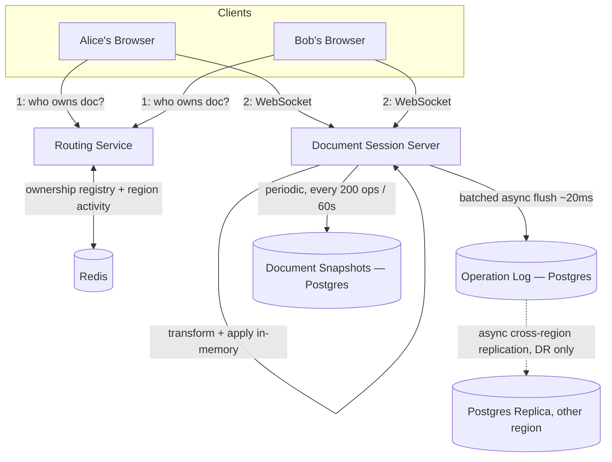

## Path 1: Write (Live Edit)

1. Alice types a character. Her client sends over WebSocket: `{ based_on_seq: 47, op: insert(pos=6, "t") }`.
2. **Document Session Server** transforms her operation against any operations with `seq > 47` it has already applied (Iteration 3).
3. **Document Session Server** assigns the next `seq`, applies the transformed op to in-memory state, and broadcasts it to Bob immediately.
4. The operation is appended to an in-memory write buffer.
5. Every ~20ms, the buffer flushes as one batched `INSERT` to the **Operation Log**.
6. Only after that batch commits does the server ack "durably saved" back to Alice.

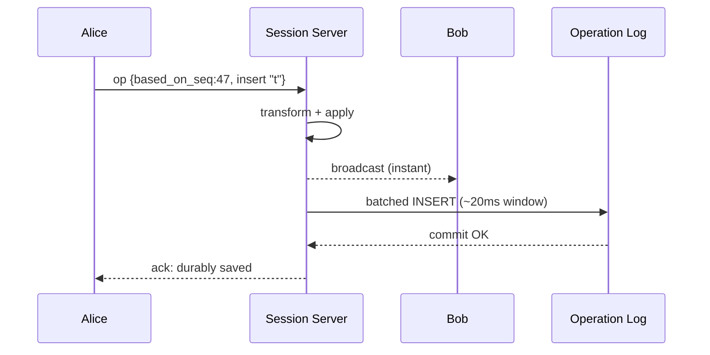

## Path 2: Read (Document Open)

1. Client asks **Routing Service**: who owns `doc_id`?
2. If an owner exists in Redis, client connects directly via WebSocket — no Postgres touched at all.
3. If no owner (cold open), Routing Service assigns a session server, which reads the latest **Snapshot**, then replays only the **Operation Log** rows since that snapshot's `seq`.
4. Session server sends the reconstructed document to the newly connecting client.

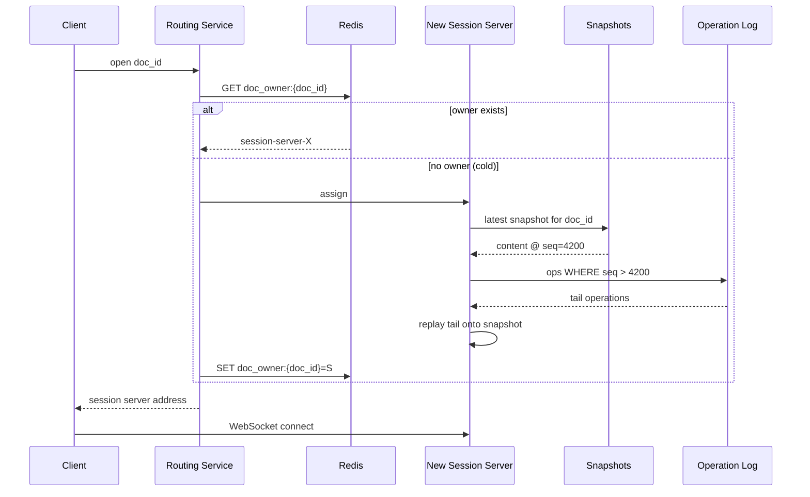

## Path 3: Failure Recovery

1. Owning session server dies; Redis ownership key's heartbeat stops refreshing and expires.
2. Clients' WebSockets drop; they re-query the **Routing Service**.
3. Routing Service assigns a new session server, which rebuilds state via Path 2's cold-open logic (snapshot + tail replay).
4. Clients reconnect to the new server and resume, losing at most the unbatched in-flight window (~20ms) from Iteration 6.

*(Sequence diagram for this is the Iteration 5 recovery diagram — mechanically identical to Path 2's cold-open, just triggered by TTL expiry instead of a fresh open.)*

## Path 4: Multi-Region Assignment

1. New document, no existing owner: Routing Service checks `doc_region_activity:{doc_id}` in Redis for historical editor region weighting.
2. Assigns a session server in the highest-activity region (or requester's region if no history).
3. All subsequent editors, regardless of their own region, route to that one server — single-writer-per-document holds globally, so no cross-region conflict resolution is ever needed.
4. Postgres operation log/snapshots live co-located with the active session server; async cross-region replica exists for disaster recovery only, never on the live path.

---

# The "Why Not X" Arsenal

| Alternative proposed | One-line defensible answer |
|---|---|
| Whole-document overwrite on save (Day 0) | No concept of *what* changed — any concurrent second writer silently destroys the first writer's work. |
| Pessimistic locking (check-out model) | Kills real-time *concurrent* editing outright — it's the email-attachment problem with a nicer UI. |
| Apply operations in raw arrival order, no transform | Positions are only valid against the document state they were computed from — a concurrent op shifts positions underneath a stale one, corrupting content. |
| Reject-and-recompute on every conflicting op | Technically correct, but at real typing speed becomes a near-constant reject/retry storm — destroys "feels instant." |
| CRDTs instead of OT | Legitimate alternative, better for offline-first/long-disconnect editing — but heavier storage overhead (per-character IDs + tombstones), and offline-first was explicitly out of scope here. |
| Multi-writer session servers, one per region | Reintroduces the exact conflict problem OT/central-sequencing was built to solve — two servers could assign conflicting seq numbers to concurrent ops. |
| Shard session ownership by `owner_user_id` | Breaks the actual access pattern — two different users co-editing one doc could get routed to different servers, splitting the single ordering authority. |
| Read replicas for the operation log | Read pattern here is bursty/rare recovery reads, not steady high-volume traffic — replicas add replication-lag risk for a scaling problem that doesn't exist. |
| CDN for document content | Content is private, per-document, and mutating continuously — caching it at the edge means serving stale/wrong state, which defeats the product's core promise. |
| Fsync every keystroke synchronously | Reintroduces per-character write latency — defeats real-time editing for a durability guarantee stronger than the system actually needs. |

---

# What's Next

Both offers are on the table:

- **Drill deeper** into any single piece — the transform function internals for a specific op-type pair, the CRDT identifier-generation schemes (RGA/Logoot/Yjs) in more depth, or the presence/cursor-sharing layer we deferred to "rides on the WebSocket infra."
- **Mock Q&A** — I play interviewer and pressure-test you cold across the whole design, including follow-ups that jump between iterations the way a real interview would.

Which do you want?

---

# Transform Internals: Insert-Insert

## The Scenario

Document state: `"AB"` (2 characters, positions 0 and 1).

Alice and Bob are both looking at this exact same base state. Both decide to insert at the exact same position — position 1, between "A" and "B" — because they're both trying to insert a middle character.

- Alice: `insert(pos=1, text="X")` → she intends `"AXB"`
- Bob: `insert(pos=1, text="Y")` → he intends `"AYB"`

Both operations are computed against the same base and fire off within milliseconds of each other. This is the hardest case for insert-insert transform, because there's no "who was first" signal in the positions themselves — they're numerically identical.

## The Non-Tied Case First

Before the tie, the general rule is simpler. If Alice's insert position is strictly *before* Bob's, Alice's insert doesn't need to change at all — but Bob's position needs to shift right by however many characters Alice just inserted, because everything at or after that point moved.

```
transform(insert_A, insert_B):
    if insert_A.pos < insert_B.pos:
        insert_A stays unchanged
        insert_B.pos += length(insert_A.text)
    elif insert_A.pos > insert_B.pos:
        insert_B stays unchanged
        insert_A.pos += length(insert_B.text)
```

This is exactly the "Hello there world" case from Iteration 3 — the earlier insert wins position, the later one shifts around it.

## The Tied Case: Same Position, Same Instant

When `insert_A.pos == insert_B.pos`, comparing positions gives no answer. We need a **deterministic tie-breaker** — some rule that every client will compute identically, without needing to ask anyone else which "really" happened first.

The standard approach: attach a stable, comparable identifier to every client — typically the server-assigned `seq` number if one operation has already been sequenced, or a `client_id` when comparing two operations that arrived in the same instant and need consistent ordering. Whichever ID sorts lower is treated as "having happened first," and the other operation's text gets inserted *after* it.

```
transform(insert_A, insert_B, client_id_A, client_id_B):
    if insert_A.pos < insert_B.pos:
        return insert_A (unchanged), insert_B.pos += len(insert_A.text)
    elif insert_A.pos > insert_B.pos:
        return insert_A.pos += len(insert_B.text), insert_B (unchanged)
    else:  # exact tie
        if client_id_A < client_id_B:
            return insert_A (unchanged), insert_B.pos += len(insert_A.text)
        else:
            return insert_A.pos += len(insert_B.text), insert_B (unchanged)
```

## Working Through Alice and Bob

Say Alice's `client_id` is `"alice-7f2"` and Bob's is `"bob-9a1"`. String comparison: `"alice-7f2" < "bob-9a1"`, so Alice wins the tie.

**Server applies Alice's operation first** (because she won the tie-break, not because her request physically arrived first):

`"AB"` → insert `"X"` at pos 1 → `"AXB"`

**Server transforms Bob's operation against Alice's**, using the tied branch: since Alice won, Bob's position shifts right by `len("X") = 1`.

`Bob.pos = 1 + 1 = 2`

**Apply Bob's transformed operation** against `"AXB"`: insert `"Y"` at pos 2 → `"AXYB"`.

Every client that processes these two operations in this order — Alice's untouched, Bob's shifted to pos 2 — converges on the identical string `"AXYB"`, regardless of which of Alice's or Bob's browsers the observer is looking at. That convergence, not "whose insert looks more correct," is the actual goal. Either `"AXYB"` or `"AYXB"` would have been an equally valid outcome — what matters is that *every* client lands on the *same* one.

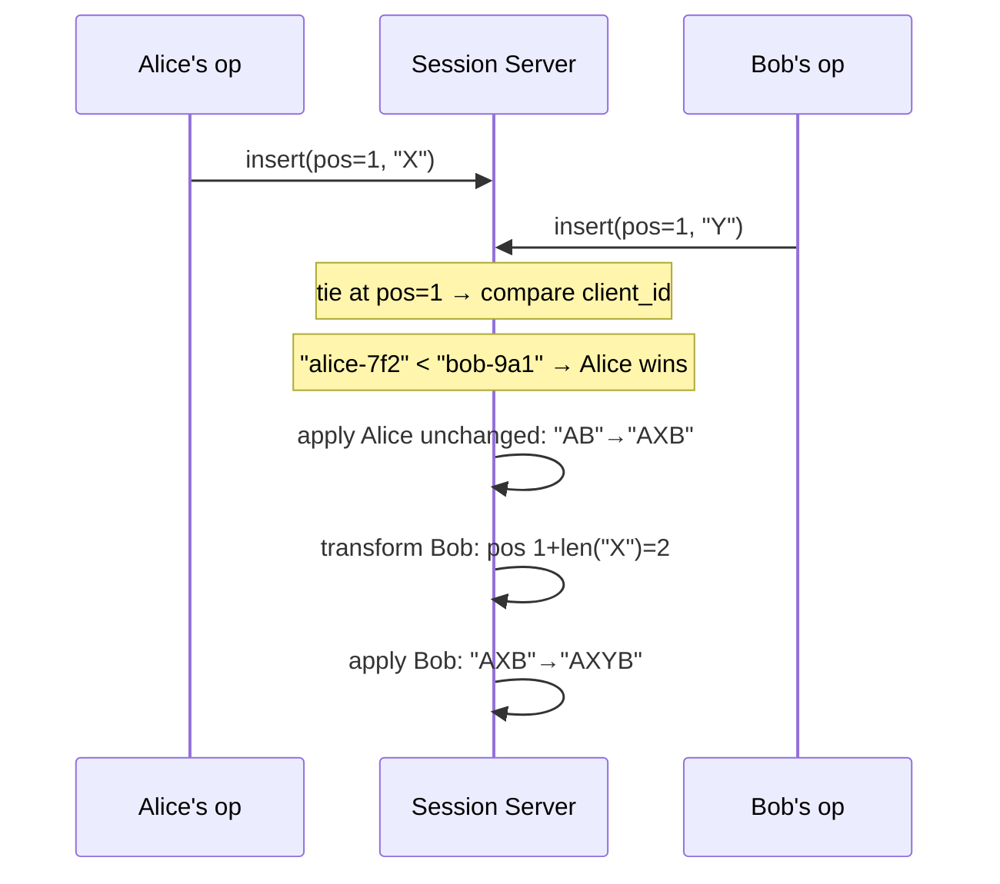

## The Other Pairs, Briefly

Insert-insert is the trickiest because of the exact-tie case above. The other pairs matter but don't need the same depth — same core idea, different arithmetic:

| Pair | Rule |
|---|---|
| Insert vs. Delete | If insert position is before the delete range, delete's position shifts right by insert length. If insert lands *inside* the delete range, the delete's length must grow to still cover the newly-inserted text, or shrink to exclude it, depending on the OT variant's policy — this is a genuinely debated edge case in real implementations. |
| Delete vs. Delete | If the two delete ranges don't overlap, whichever is earlier shifts the later one's position left by its length. If they overlap (both trying to delete some of the same text), the second delete's range must be narrowed to only the characters it can still legally delete — deleting the same character twice is a no-op the second time. |

The overlapping-delete case is exactly the kind of thing that took real OT implementations years to get fully right — it's not that the concept is hard, it's that there are several plausible "correct" policies and you have to pick one and apply it with total consistency everywhere.

---

# Local Reconciliation: What the Client Does With Server Broadcasts

## The Problem This Solves

Here's something we glossed over: when Alice types, her *own* browser doesn't wait for the server's round trip to show her the character. It applies her keystroke to her local view immediately — that's the whole "feels instant" promise. This is called **local echo** or **optimistic local application**.

But that creates a gap. Alice's local document now includes an operation the server hasn't officially sequenced yet. If, in that gap, the server broadcasts an operation from Bob — transformed against everything the server has already sequenced — Alice's client can't just blindly apply Bob's operation on top of her local state. Bob's operation was transformed against the *server's* view, which doesn't yet include Alice's pending, unacked keystroke. Applying it naively would be the exact same position-drift bug from Iteration 2, just happening client-side instead of server-side.

## The Fix: A Client-Side State Machine

Each client tracks its sync status with the server as one of three states:

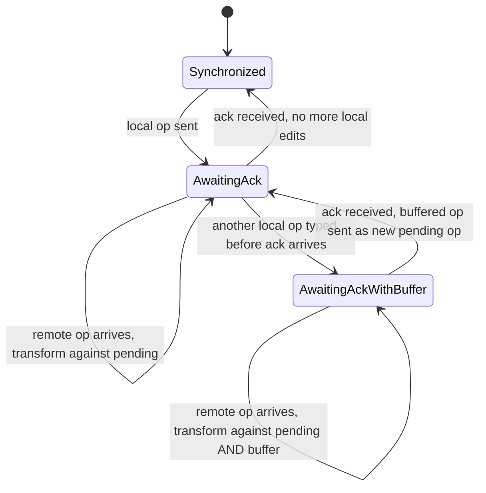

**Synchronized** — the client has no outstanding local operations the server hasn't acked. Any remote operation the server broadcasts can be applied directly, no transform needed, because there's nothing local to transform it against.

**AwaitingAck** — the client has sent exactly one operation and is waiting for the server's ack (recall from Iteration 6, the ack means "durably persisted," not just "received"). If a remote operation arrives from another client while in this state, it must be transformed against the client's own pending operation before being applied locally — because the remote op, as the server sent it, doesn't account for a keystroke the server hasn't sequenced yet.

**AwaitingAckWithBuffer** — Alice kept typing while still waiting on the first ack. Rather than sending a second op immediately (which would race the first), her client buffers subsequent keystrokes locally. Any remote operation arriving now must be transformed against *both* the in-flight pending op and everything in the buffer, in order.

## Walking Through It

Alice's client is in `Synchronized`. She types "t" at position 6.

1. Client applies "t" to her local view immediately (local echo). Document now reads with her "t" already visible to her.
2. Client sends `{based_on_seq: 47, insert(pos=6, "t")}` to the server, and transitions to `AwaitingAck`.
3. Before the ack comes back, Alice types "h" right after. Client applies it to her local view immediately too, buffers it locally (doesn't send yet), and transitions to `AwaitingAckWithBuffer`.
4. **Meanwhile**, the server broadcasts an operation from Bob — say, `delete(pos=2, length=1)`, already transformed against seq 47 (the base both Alice and Bob started from), assigned as `seq 48`.
5. Alice's client receives Bob's op. Because she's in `AwaitingAckWithBuffer`, it can't apply Bob's op directly — it transforms Bob's `delete(pos=2, len=1)` against her pending "t" insert at pos=6 first (no position conflict here since 2 < 6, so Bob's delete is unaffected), then against her buffered "h" (same result, still unaffected since it's also at pos 6+). Bob's transformed op is applied to Alice's local view.
6. The server then acks Alice's original "t" operation, now officially `seq 49`.
7. Client transitions from `AwaitingAckWithBuffer` back to `AwaitingAck`: it takes the buffered "h" operation, transforms it against anything that landed between `seq 47` (Alice's original base) and now — which includes Bob's `seq 48` delete — and sends the transformed "h" op to the server as the new in-flight operation.
8. Once that one acks too, the client returns to `Synchronized`.

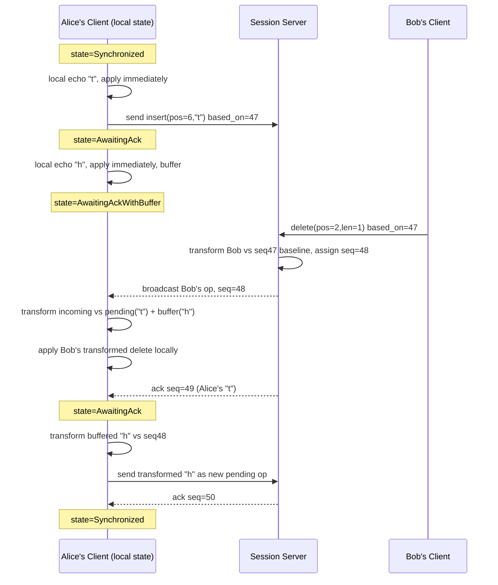

## Why This Matters, Concretely

Without this state machine, the naive client behavior would be: "apply whatever the server sends, whenever it arrives." That's exactly the arrival-order bug from Iteration 2 — except now it's happening on the *client*, corrupting Alice's local view specifically, because her own unacked keystrokes sit on top of a server state that hasn't caught up to them yet.

The state machine is what lets Alice keep typing at full speed — nothing ever blocks on network round trips — while guaranteeing that whatever the server broadcasts gets correctly folded into her view rather than silently drifting apart from it. It's the client-side mirror of the exact same transform machinery the server uses; the server transforms incoming ops against its committed history, the client transforms incoming remote ops against its own *not-yet-committed* local history.

---

**Likely interviewer follow-up:** *"What happens if the buffer keeps growing because Alice is typing faster than acks return — does this scale to fast typists?"*
**Model answer:** The buffer holds *keystrokes*, not round trips — Alice's client doesn't wait for each character to ack before accepting the next one locally, it only serializes what it *sends* to one in-flight operation at a time, batching everything typed in between into the buffer. In practice this collapses naturally: dozens of buffered keystrokes get coalesced into a single "insert this whole run of characters" operation when the buffer is finally flushed, rather than replaying each character as a separate op — so buffer size affects batching efficiency, not correctness or perceived latency.

Want to go deeper on the coalescing/batching of buffered ops into a single operation, or move to the mock Q&A?

---

