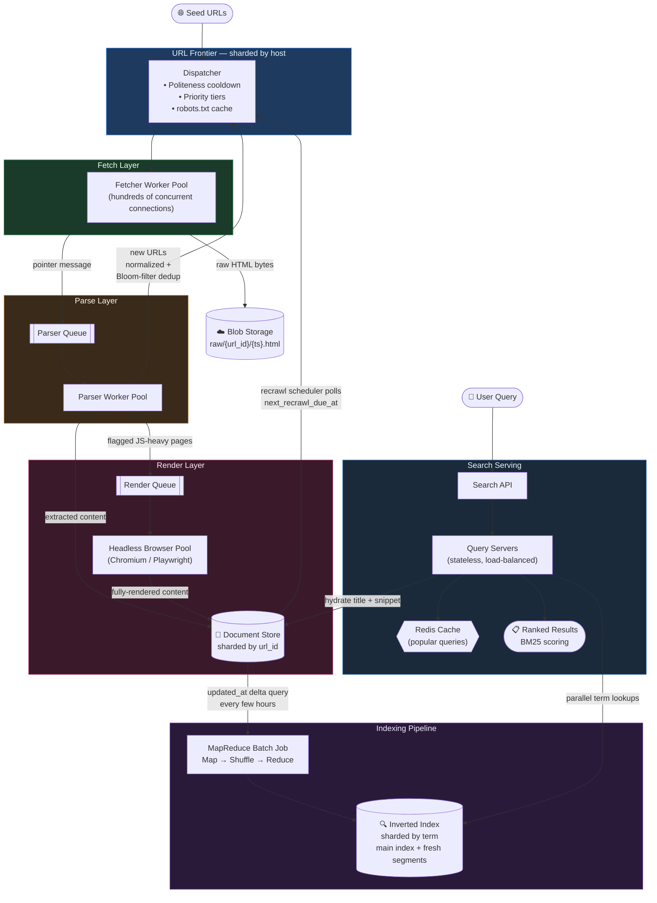

# Design a Web Crawler & Search Index — A Complete Narrative Walkthrough

*A story-driven HLD deep dive: naive beginnings, real failures, and the iterative fixes that turn a single-server crawler into a system that indexes billions of pages without getting itself banned by the entire internet.*

*Every chapter is written so that no step is implied. If a component does something, this doc says which component triggers it, what data it reads, what data it writes, and where that data lives.*

---

## Chapter 0: Scoping the Problem Before Writing Any Architecture

"Design a web crawler" sounds like one system, but it's actually **two very different systems glued together**:

- A **crawler** — go fetch pages from the web.
- A **search engine** — let users query what you fetched.

Trying to design both in full depth within one interview session is how candidates run out of time. So — scope hard, and say *why*, before drawing a single box.

---

### Answering the Scoping Questions Up Front

These questions aren't optional. Each answer meaningfully changes the architecture.

---

#### What is the crawler's purpose — full web index, or a narrower vertical (news, e-commerce)?

We'll design for a **general-purpose crawler** feeding a general text search index.

This is the hardest, most general version of the problem. It naturally covers narrower verticals as a special case. A news-only crawler is just this system with:

- A more aggressive recrawl policy (Chapter 10).
- A narrower seed URL set (Chapter 1).

Nothing about the core architecture needs to change for a narrower vertical.

---

#### Should we keep refreshing pages for the latest content?

**Yes — this is a first-class requirement, not an afterthought.**

A crawler that indexes the web once and never revisits it produces an index that's permanently stale within days. We'll design **recrawl scheduling** explicitly (Chapter 10), not bolt it on at the end.

---

#### Should we support JavaScript rendering?

**Yes, but selectively.**

This is one of the most expensive and interesting trade-offs in the whole system (Chapter 6). Treating "render everything with a headless browser" as the default would blow the compute budget by an order of magnitude — for a feature most pages don't actually need.

---

#### Should we handle duplicate content?

**Yes, at two distinct levels that are easy to conflate:**

| Level | What it detects | When it's detected | How it's solved |
|---|---|---|---|
| **Duplicate URLs** | Same page, different query strings | *Before* fetching — from the string alone | URL frontier (Chapter 4) |
| **Duplicate content** | Different URLs, near-identical text | *After* fetching — you need the actual text to compare | Content fingerprinting (Chapter 5) |

These need different tools because they're caught at different stages of the pipeline. A duplicate URL is caught from the string alone. Duplicate content can only be caught after you've fetched and parsed the page.

---

#### Are we storing images/video, or just text and links?

**Text and links only — plus URLs pointing at media, not the media bytes themselves.**

Storing and indexing images/video is a genuinely separate system (reverse image search, video transcoding). It would double our scope for comparatively little architectural insight into crawling itself. We store a reference (the `src` attribute's value, captured verbatim at parse time) and move on.

---

### Functional Requirements

| Priority | Requirement | Notes |
|---|---|---|
| **P0** | **Crawling** | Fetch pages from seed URLs, discover new URLs by following links, and respect politeness — don't hammer any single host, obey `robots.txt` |
| **P0** | **Indexing** | Parse fetched pages, extract meaningful content, build a searchable index |
| **P0** | **Search** | Given a query, return relevant, ranked pages quickly |

---

### Non-Functional Requirements

- **Scalable** — the crawl needs to eventually reach and index 1B+ URLs. Today's 100M is a slice of that, not the ceiling.
- **Available** — search serving is user-facing and must stay up even while crawling and indexing run in the background. These are different availability domains. A crawler outage should never turn into a search outage, and vice versa.
- **Polite** — unusual as a non-functional requirement for most systems, but for a crawler it's existential. An impolite crawler gets IP-banned by the very sites it's trying to index — a self-inflicted, permanent outage with no retry that fixes it.

---

### Capacity Numbers, Derived Step by Step

**Starting assumption:** 100M URLs to crawl in an initial 10-day pass.

> 10 days is a deliberate choice, not a given. It's a round number picked to keep arithmetic simple. A real crawl would pick this based on how fast the index needs to reach usable coverage.

**Step 1 — Convert 10 days to seconds:**
```
10 days × 86,400 sec/day = 864,000 seconds ≈ 8.64 × 10⁵ sec
```

**Step 2 — Compute average crawl rate:**
```
100,000,000 URLs ÷ 864,000 sec ≈ 116 URLs/sec
```

Round to **~120 URLs/sec average**.

> This isn't remotely uniform. Some hosts respond in tens of milliseconds; others take seconds. Politeness delays (Chapter 3) mean the actual number of fetcher workers needed is much higher than "120 requests/sec" implies — because most of the time each worker spends per host is spent *waiting*, not fetching. Chapter 3 works this out concretely.

---

**Storage estimate — raw HTML:**

**Step 1 — Compute raw HTML storage at 100M scale:**
```
100M pages × 10MB/page (generous upper bound for raw HTML)
= 10⁸ × 10⁷ bytes
= 10¹⁵ bytes
= 1 PB
```

**Step 2 — Project to the 1B+ NFR target:**
```
1B pages → ~10 PB of raw page storage
```

That number immediately rules out storing raw HTML in a normal database and points straight at blob storage (Chapter 7).

---

**Storage estimate — inverted index:**

A rough rule of thumb: an inverted index (Chapter 8) runs at **10–30% of the raw text size**, once you strip HTML markup and boilerplate down to actual content.

Raw HTML is ~10MB/page, but the actual extractable text is closer to ~50KB/page. HTML markup, scripts, and styling dominate raw page weight.

**Step 1 — Compute raw text size at 100M pages:**
```
100M pages × 50KB extracted text ≈ 5 TB of raw text
```

**Step 2 — Estimate inverted index size:**
```
5 TB × 15–25% ≈ 750 GB – 1.25 TB at 100M-page scale
```

**Step 3 — Project to 1B+ pages:**
```
~10–15 TB for the index
```

This is large, but a completely different and much more tractable problem than the raw-HTML storage number. This gap — between **raw crawl storage** (~10 PB) and **index storage** (~10–15 TB) — is worth internalizing early. It's precisely *why* the crawl pipeline and the search-serving pipeline end up as separately-scaled systems (Chapter 8 onward) rather than one monolith.

---

## Chapter 1: v0 — The Single-Server Baseline

**Architecture:**

```
[Seed URL List] ──► [Single Worker Loop] ──► [Single Database]
```

One process. One loop. One database. This isn't a strawman — it's a genuinely correct way to crawl a few thousand pages. Walking through it carefully lets us name precisely *which part breaks first*.

---

### The Loop — Spelled Out Completely

Nothing here is implicit. Here's exactly what the one process does, in order, forever:

**Step 1 — Pull the next URL.**

The process holds "the list" as a table in its single database (`urls`, below) with a `status` column. It runs:

```sql
SELECT * FROM urls WHERE status = 'pending' LIMIT 1
```

It immediately updates that row's status to `in_progress` in the same operation (or the same transaction) so that if this were ever more than one process, two workers couldn't grab the same URL. In v0 there's only one process, so this matters less — but naming it now is what makes Chapter 2's queue an obvious next step rather than a surprise.

**Step 2 — Resolve the host to an IP via DNS.**

A plain OS-level DNS lookup: `example.com` → `93.184.216.34`. No caching yet — every fetch does a fresh lookup. This is one of several things that make v0 slow (revisited in Chapter 3).

**Step 3 — Open a connection and download the page.**

A synchronous HTTP GET. The process blocks here until the remote server responds or the connection times out. There is **no timeout configured yet in v0** — a hanging server hangs the whole loop. Chapter 11 fixes this explicitly.

**Step 4 — Parse the downloaded HTML.**

A library like BeautifulSoup turns raw markup into a navigable DOM (Document Object Model), from which the process pulls:
- The `<title>` tag.
- The body text.
- Every `<a href>` link on the page.

**Step 5 — Store and re-queue.**

The process:
1. Writes the extracted title and a reference to the stored body into the `content` table.
2. Flips the original URL's row to `status = 'done'`.
3. For every link found in Step 4 — inserts a new row into `urls` with `status = 'pending'`, *if that exact URL string isn't already in the table* (a simple `SELECT` check before the `INSERT` — our only dedup mechanism at this stage).

Then it goes back to Step 1 and repeats, forever, one URL at a time.

---

### A Minimal Schema

```sql
-- Tracks all URLs discovered and their crawl status
urls(id, host, url, status)
-- status options: pending | in_progress | done | failed

-- Stores extracted content per crawled URL
content(id, url_id, title, body_blob_link)
-- body stored as a blob reference, not inline — pages can be large
```

> `host` is stored as its own column (not re-parsed from `url` every time) specifically because Chapter 3 needs to group and look up by host constantly. Pulling it out now costs nothing and saves rework later.

---

### Why This Is a Legitimate Starting Point

It's simple enough to reason about completely. It does everything the P0 requirements ask for at small scale. And — this is the part worth internalizing — **every later iteration is a deliberate trade-off away from this simplicity**. Naming exactly what's being traded away each time is what actually impresses an interviewer.

---

### Where It Breaks — Two Separate Problems, Not One

**Problem 1: One process is doing three unrelated jobs.**

| Job | Type | Behavior |
|---|---|---|
| Fetching (Steps 2–3) | I/O-bound | Mostly *waiting* on slow, unpredictable remote servers |
| Parsing (Step 4) | CPU-bound | Fast |
| Storing (Step 5) | DB write | Fast |

Bundling all three into one loop means a slow or hanging fetch blocks parsing and storage — which have nothing to do with networking. One thing failing becomes a reason for everything to fail.

This is a **separation-of-concerns** problem: three different failure modes and three different resource profiles, artificially coupled into one process.

**Problem 2: It's single-threaded and single-machine.**

It caps out at whatever one process doing DNS lookups and TCP handshakes *serially*, one URL at a time, can manage. If a typical fetch-plus-parse cycle takes 200ms:

```
1 URL / 200ms = 5 URLs/sec
Target = ~120 URLs/sec
Gap = 24x short of the target
```

The fix for Problem 1 comes first, because it's the one that changes the *shape* of the architecture, not just its size.

---

## Chapter 2: Splitting Fetcher and Parser, Decoupled by a Queue

### The Instinct — and Why the Obvious Version Is Wrong

The natural fix for "one process doing too much" is: split it into a **Fetcher** service and a **Parser** service. But then an immediate question appears — how does Fetcher tell Parser "here's a page, go parse it"?

**The naive answer: a synchronous call.**

Fetcher finishes downloading, calls Parser's API directly, and waits for the response. This is a trap.

If Parser is momentarily backed up — maybe mid-way through a burst of CPU-heavy DOM parsing — Fetcher now sits there waiting on Parser. That means Fetcher isn't fetching anything else during that time. We've recreated exactly the coupling problem we were trying to solve, just moved it from "one process" to "two processes blocking each other over a network call."

Fetcher's whole reason to exist — keep hammering the network with new requests — is defeated the moment it has to wait on a downstream service that has nothing to do with networking.

---

### The Fix: A Queue in Between

```
[Fetcher Queue] ──► [Fetcher Worker Pool] ──► raw HTML ──► [Blob Storage]
                                                               │
                                                               ▼
                                                     message with blob location
                                                               │
                                                               ▼
                                                       [Parser Queue]
                                                               │
                                                               ▼
                                                    [Parser Worker Pool]
                                          pulls → fetches raw HTML from blob storage
                                          → parses → extracts → writes content + new URLs
```

---

### What's in Each Message — Nothing Left Implicit

**Message on the Fetcher Queue (small, no content yet):**
```json
{ "url": "https://example.com/page", "host": "example.com", "url_id": 8821 }
```

**After a Fetcher worker downloads a page:**
1. It writes the raw bytes to blob storage under a deterministic key:
   ```
   raw/{url_id}/{fetch_timestamp}.html
   ```
   This key scheme ensures repeated fetches of the same URL don't collide, and old versions aren't silently lost. (Useful later in Chapter 5 for SimHash comparison — you need "the previous version".)

2. It publishes a message on the **Parser Queue** — still no content, just a pointer:
   ```json
   {
     "url_id": 8821,
     "blob_key": "raw/8821/2024-01-15T14:32:00.html",
     "http_status": 200,
     "fetched_at": "2024-01-15T14:32:00Z"
   }
   ```
   A parser worker that sees `http_status: 404` knows to mark the URL `failed` without ever touching blob storage.

---

### What Each Worker Pool Does

**Fetcher workers:**
1. Pull a URL off the fetcher queue.
2. Download the page.
3. Drop the raw bytes into blob storage (not the database — pages are large, opaque blobs, exactly the kind of content that belongs in object storage).
4. Publish the small pointer message onto the parser queue.
5. **Done** — never waits on Parser. Immediately grabs the next URL.

**Parser workers** (a completely independent pool, scaled on its own schedule):
1. Consume from the parser queue whenever they're ready.
2. Fetch the raw HTML from blob storage using the `blob_key`.
3. Run DOM parsing — extract title, body text, and links.
4. Write the structured result to the document store (Chapter 7).
5. Push newly discovered URLs back into the **frontier** (Chapters 3–4), not directly onto the fetcher queue. That distinction is the entire subject of the next chapter.

---

### What This Buys Us

- **Independent scaling.** If parsing is the CPU-bound bottleneck, add Parser workers without touching Fetcher at all — and vice versa.
- **Failure isolation.** A crash or slowdown in one pool doesn't cascade into the other. The queue absorbs the mismatch in speed between them. A burst on one side gets smoothed into a steady stream on the other, rather than slamming directly into the downstream service.
- **Horizontal scalability.** Both pools are now independently scalable — which is exactly the next problem, and where naive parallelism breaks politeness.

---

## Chapter 3: The URL Frontier — Who Writes To It, Who Reads From It, and How Politeness Gets Enforced

### Naming the Failure Precisely

Once Fetcher is just "a pool of workers pulling from a shared queue," scaling it is trivial in principle — spin up more workers. But here's the failure that a naive multi-worker Fetcher pool creates:

> **Nothing stops five different fetcher workers from independently pulling five different URLs that all point at the same host, and hitting that host with five simultaneous requests.**

A single site — especially a smaller one not built for this kind of load — can interpret that as an attack. Best case: it starts rate-limiting your IP range. Worst case: it blocks you entirely. Your crawler has just permanently lost the ability to index that domain.

At real scale, with hundreds of fetcher workers pulling from one shared queue, this isn't a rare edge case — it's the **default outcome** unless something explicitly prevents it.

This is the **politeness problem**. A plain FIFO queue simply cannot solve it, because a FIFO queue has no concept of "host." It hands out whatever URL is next in line, with zero awareness that the URL two positions behind it points at the exact same server.

---

### What the Frontier Actually Is

The structure that solves this is called the **URL frontier** (a well-known pattern from Google's original Mercator crawler design). It replaces both the fetcher queue *and* the ad-hoc "insert into `urls` table" logic from v0, with one coherent component that owns three jobs:

1. **Politeness** — deciding what's allowed to be fetched.
2. **Priority** — deciding what's worth fetching first (Chapter 4).
3. **Dispatch** — handing out exactly one URL at a time per eligible host.

The frontier is made of two pieces of state, both of which need a real home:

---

#### Piece 1 — Per-Host Cooldown State (stored in Redis)

Redis is the natural fit — this needs sub-millisecond reads on every single dispatch decision.

```
key:   host:example.com
value: {
  next_allowed_fetch_time: "14:32:05",
  crawl_delay:             2,           -- seconds, from robots.txt or a sane default
  robots_disallow:         ["/admin", "/private"],
  robots_fetched_at:       "2024-01-15T10:00:00Z"
}
```

---

#### Piece 2 — Per-Host Pending-URL Queues

Rather than one global FIFO, the frontier keeps **one queue per host** (or, at scale, a set of queue shards that many hosts map onto via consistent hashing — Chapter 12). A URL waiting to be crawled sits in its host's queue, not in some shared undifferentiated list.

---

### Who Writes Into the Frontier

Exactly **two producers**, no more:

| Producer | When | What it does |
|---|---|---|
| **Seed loader** | Once, at crawl start | Admins provide an initial list of seed URLs, inserted directly into their respective hosts' frontier queues with default priority |
| **Parser workers** | Continuously | Every time a Parser worker extracts links from a page, each extracted URL passes through normalization and dedup (Chapter 4) and, if it survives both gates, gets appended to its host's queue |

Nothing else writes to the frontier. Fetcher workers only ever *read* from it.

---

### Who Reads From It — The Dispatch Decision, Step by Step

A **dispatcher** — logically a separate lightweight service, though it can be a client-side library each fetcher worker calls — sits between the frontier's stored state and the fetcher worker pool.

When a fetcher worker asks for work, the dispatcher does this, every single time, with no exceptions:

**Step 1:** Look at the set of hosts that currently have at least one pending URL in their queue.

**Step 2:** Filter that set down to hosts where `now >= next_allowed_fetch_time` (read from Redis).

**Step 3:** Pick one eligible host. (Chapter 4 covers *which* one, by priority — for now, assume any eligible host.)

**Step 4:** Pop the front URL off that host's queue.

**Step 5:** **Immediately** update that host's Redis entry:
```
next_allowed_fetch_time = now + crawl_delay
```

> This update happens **at dispatch time**, not at fetch-completion time. The cooldown starts the moment a fetch is handed out, not when it finishes. This matters: if it were set at completion time, a host with a slow-responding server would get extra unintended delay stacked on top of its `crawl_delay`. And if two dispatches somehow raced before either fetch finished, the second could dispatch too early.

**Step 6:** Hand the URL to the requesting fetcher worker.

```
Per-host state (Redis):
  host:                   "example.com"
  next_allowed_fetch_time: 14:32:05
  crawl_delay:             2 seconds   -- from robots.txt, or default if unspecified

Dispatch logic:
  eligible = hosts with non-empty queue AND now >= next_allowed_fetch_time

  if eligible is empty:
      worker gets nothing this tick, retries shortly
  else:
      host = pick_highest_priority(eligible)           -- Chapter 4
      url  = host.queue.pop_front()
      host.next_allowed_fetch_time = now + crawl_delay -- set IMMEDIATELY at dispatch
      return url to worker
```

---

### A Worked Example — So the Numbers Aren't Abstract

**Scenario:** A Parser worker finishes parsing `example.com/home` and extracts 40 links. 12 of them point back to other pages on `example.com` and pass dedup.

**What happens:**

All 12 URLs get appended to `example.com`'s single frontier queue — they do *not* each get their own `next_allowed_fetch_time`.

> There is exactly **one cooldown timer per host**, shared by every URL waiting in that host's queue. The cooldown is a property of the host's tolerance for request rate, not a property of any individual URL.

**How fast does the dispatcher drain those 12 URLs?**

- `example.com`'s `crawl_delay` = 2 seconds
- Queue now has 12 pending URLs

```
12 URLs × 2 seconds/URL = 24 seconds to drain all 12
```

The other fetcher workers spend that 24 seconds serving *other* hosts' queues instead of sitting idle — that's the entire point of having many hosts' queues live in the frontier simultaneously.

---

### Where `crawl_delay` Comes From, and When It's Checked

Most sites publish a `robots.txt` at their root (e.g. `example.com/robots.txt`) that can specify:
- A `Crawl-delay` directive.
- `Disallow` paths the crawler must not fetch at all.

Respecting this file isn't optional politeness — for many crawlers it's the actual legal/contractual boundary of permitted access.

**The concrete flow:**

1. **First time** the frontier is about to add a URL for a host it has no cached policy for → it triggers a one-off fetch of `host/robots.txt` via the same fetcher pool. (Just another fetch, tagged internally so it isn't itself infinitely deferred waiting on a policy that doesn't exist yet.)
2. **Parse** the `Disallow` paths and `Crawl-delay` out of the file.
3. **Write** the result into that host's Redis entry (`robots_disallow`, `crawl_delay`, `robots_fetched_at`).
4. **Every subsequent URL** for that host is checked against the cached `robots_disallow` list *before* it's ever inserted into the host's queue. A disallowed path is dropped at insertion time — never queued at all.
5. **If a host specifies no `Crawl-delay`**, a sane default (e.g. 1 second) is written instead of leaving the field empty.

The cached policy isn't trusted forever — it's **re-fetched periodically** (e.g. every 24–48 hours, itself just another low-priority entry in that host's queue) in case a site changes its policy.

---

### The Counter-Intuitive Capacity Number This Creates

Politeness means each individual host can only be fetched at roughly `1 / crawl_delay` requests per second — often just **0.5–1 req/sec** per host.

To sustain ~120 URLs/sec in aggregate while respecting that per-host ceiling, the system needs to be fetching from **many different hosts concurrently**, not fewer hosts faster.

**The math:**

```
Average crawl_delay = 1 second
Target throughput   = 120 URLs/sec

Distinct hosts needed in-flight simultaneously:
  120 URLs/sec ÷ 1 URL/sec/host = 120+ distinct hosts
```

This means the fetcher worker pool needs enough concurrent connections (hundreds, easily) to keep that many hosts simultaneously in flight — even though each individual host is only being touched once a second or slower.

> Real crawler fetcher fleets look less like "a few fast workers" and more like "hundreds or thousands of lightweight, mostly-waiting connections." The bottleneck is **concurrency breadth across hosts**, not raw per-host throughput.

---

### What We Gave Up

The frontier is meaningfully more complex than a plain queue:
- Per-host state in a fast store.
- A `robots.txt` cache with its own refresh policy.
- A dispatcher that's aware of cooldowns rather than pure FIFO ordering.

That's a real cost in implementation complexity — explicitly named. We traded "simple queue" for "correctness that keeps the crawler from getting itself banned," which is a trade every real crawler has to make, not an optional refinement.

---

## Chapter 4: The URL Frontier, Completed — Duplicate URLs and Priority

Politeness (Chapter 3) solved *which host* gets a URL next, and established that the frontier — not a plain queue — is where new URLs land.

Two more problems live in that same insertion path:
1. **Avoiding re-crawling URLs we've already seen.**
2. **Deciding which pages matter more than others** when not everything can be crawled immediately.

---

### Where Exactly Dedup Happens — Two Gates, in Order

When a Parser worker extracts a raw link string from a page's HTML, it does **not** go straight into the frontier. It passes through two gates first, in this exact order:

---

#### Gate 1 — Normalization

Applied to the raw string *before anything else touches it*:

| Operation | Example Before | Example After |
|---|---|---|
| Lowercase the host | `Example.COM/page` | `example.com/page` |
| Strip tracking params | `example.com/page?utm_source=twitter` | `example.com/page` |
| Resolve relative paths | `/about` (from `example.com/home`) | `example.com/about` |
| Remove default ports | `example.com:80/page` | `example.com/page` |
| Sort remaining query params | `?z=1&a=2` | `?a=2&z=1` |

This collapses a large fraction of "different-looking, same-page" URLs into one canonical string before either is ever compared against anything.

---

#### Gate 2 — The Seen-Set Check

Applied to the *normalized* string: has this exact normalized URL already been queued or crawled?

At 1B+ URLs, a literal set of every seen URL is enormous to check on every single discovered link — and this check happens on every one of the many links extracted from every parsed page. It needs to be fast and cheap, or Parser workers stall on dedup instead of parsing.

**The standard fix: a Bloom filter.**

A compact probabilistic structure, held in memory, that a Parser worker queries directly (or via a small lookup service if the filter is too large for one process, see Chapter 12) before ever handing a URL to the frontier.

| Result | Meaning | Action |
|---|---|---|
| **"Definitely not seen"** | This URL is new | Skip the expensive check. Insert into the frontier immediately. |
| **"Possibly seen"** | The filter may have a false positive (but never a false negative) | Do a real lookup against the URL store to confirm before deciding. |

A Bloom filter sized for a few billion entries at a ~1% false-positive rate fits comfortably in memory on a modest cluster.

Only URLs that pass *both* gates — normalized, and confirmed not-yet-seen — are:
1. Inserted into the frontier's per-host queue (Chapter 3).
2. Added to the Bloom filter so future duplicates are caught.

---

### Priority — Not Every URL Deserves the Same Urgency

A plain FIFO frontier treats a link discovered on a major news homepage exactly the same as a link three hops deep on an obscure personal blog. In practice, some signals are worth weighting the frontier by:

| Signal | What it captures |
|---|---|
| **PageRank-style importance** | How many other pages link to this page |
| **Historical change frequency** | News homepages should be recrawled far more often than a static "About Us" page (feeds directly into Chapter 10's recrawl scheduling) |
| **Domain diversity** | If the frontier is dominated by URLs from one enormous site, deliberately interleave URLs from other hosts so the crawl doesn't spend an entire day finishing one domain before starting any others |

---

### How Priority Changes the Dispatch Logic

This becomes a **multi-level priority structure**, layered on top of everything Chapter 3 already built — not a replacement for it.

**Instead of one queue per host, each host gets several tiers:**

```
Per-host queue structure (extended):
  host:   "example.com"
  queues: {
    high:   [ url_A, url_B, ... ],
    medium: [ url_C, url_D, ... ],
    low:    [ url_E, url_F, ... ]
  }
  next_allowed_fetch_time / crawl_delay: UNCHANGED from Chapter 3
                                         -- still governs the host as a whole
                                         -- across all tiers combined
```

A URL is assigned a tier at insertion time based on the signals above.

- A brand-new URL with no history gets a default **middle tier**.
- The host's cooldown state from Chapter 3 (`next_allowed_fetch_time`) is unchanged — it still governs the host as a whole across all tiers combined, since the host doesn't care which tier a request came from.

**What changes in the dispatcher (Step 4 from Chapter 3):**

Instead of simply popping the front URL off a single queue, the dispatcher checks tiers with **weighted round-robin** so low-priority URLs are never fully starved — just deprioritized.

```
Dispatch logic (extended):
  eligible_hosts = hosts where:
      now >= next_allowed_fetch_time
      AND at least one tier has a non-empty queue

  host = pick_highest_priority(eligible_hosts)
  tier = weighted_round_robin(host, ratio = 5:3:1)
         -- high : medium : low across successive dispatches
  url  = host.queues[tier].pop_front()
  host.next_allowed_fetch_time = now + host.crawl_delay
```

For a host with URLs waiting in all three tiers, the dispatcher pulls from **high : medium : low in a 5:3:1 ratio** across successive dispatches. Low-priority URLs still get crawled — just slowly.

---

## Chapter 5: Duplicate *Content* — When Different URLs Hide the Same Page

URL-level dedup (Chapter 4) catches the case where the *address* is redundant. It does nothing for the much more common real-world case: **genuinely different URLs — different hosts, even — serving near-identical content.**

Examples:
- A press release syndicated across fifty news sites.
- A product description copy-pasted across a dozen resellers.
- A page mirrored under both `www.` and non-`www.` hosts.

Indexing all fifty copies wastes storage, wastes crawl budget that could have gone toward genuinely new content, and — worse — pollutes search results with near-duplicate entries competing for the same ranking slots.

---

### Where This Check Runs, Concretely

This entire check happens inside the **Parser worker**, immediately after content extraction and *before* the extracted content is written to the document store (Chapter 7).

It is not a separate batch job. It has to happen per-page, synchronously within the parse step, because the decision it makes — "index this" vs. "skip, it's a duplicate" — determines what gets written at all.

---

### Exact Duplicates — the Cheap Case

The Parser worker computes a plain cryptographic hash (SHA-256 is fine) over the **extracted, cleaned text** — not the raw HTML, since two pages with identical visible text but different `<div>` nesting or inline styling should still count as duplicates.

This hash is checked against a **hash → canonical URL** lookup table (a simple keyed store — one hash per unique piece of content).

| Result | Meaning | Action |
|---|---|---|
| **No match** | New content | Write the hash into the lookup table pointing at this URL. Proceed to indexing normally. |
| **Exact match** | Byte-for-byte identical (post-cleaning) to a page already indexed | Mark the URL `done` in the URL store (so it isn't endlessly rediscovered). Skip indexing. Store a pointer from this URL to the canonical one already in the table. |

> A single-bit change anywhere in the text completely changes a normal cryptographic hash. So exact hashing catches copy-pasted duplicates, but misses the far more common near-duplicate case: a syndicated article with a different byline, a different "related articles" sidebar, or a live-updated timestamp.

---

### Near-Duplicates — SimHash, Computed and Compared Step by Step

The standard tool here is **SimHash** (or the closely related MinHash). Instead of producing a hash that changes completely with any input change, SimHash produces a fixed-length fingerprint (commonly 64 bits) where **similar inputs produce fingerprints that differ in only a small number of bits**.

---

#### How the Parser Worker Computes a SimHash Fingerprint

**Step 1 — Tokenize.**
Break the cleaned body text into words or short phrases (shingles). Use the same tokenization used later for indexing (Chapter 8) — so this work is reusable, not duplicated.

**Step 2 — Hash each token.**
Hash each token individually into a fixed-width bit string (64 bits) using a standard hash function.

**Step 3 — Build a running sum.**
For each of the 64 bit positions, maintain a running sum across all tokens:
- If the token's hash has a **1** in that position → add **+1** to that position's sum.
- If the token's hash has a **0** in that position → subtract **-1** from that position's sum.

Optionally weighted by token frequency in the document — a word appearing 20 times pulls the sum harder than a word appearing once.

**Step 4 — Produce the final fingerprint.**
After all tokens are processed, the final fingerprint bit at each position is:
- **1** if that position's running sum ended positive.
- **0** if that position's running sum ended zero or negative.

**Result:** Two pages that are 95% identical text will have SimHash fingerprints with a small **Hamming distance** (the count of differing bits) between them — typically single digits out of 64. Two genuinely unrelated pages will differ in roughly half their bits, as random noise would.

---

#### Comparing Against "Recently Seen" Pages — Without Scanning Everything

The naive approach — comparing a new page's fingerprint against every other fingerprint ever computed — doesn't scale past a trivial corpus size.

**The practical fix: LSH Banding (Locality-Sensitive Hashing).**

**Step 1 — Split each 64-bit fingerprint into bands.**
Example: four 16-bit bands.

**Step 2 — Index pages by each band value.**
Build a lookup table: `band_value → [url_ids with that band value]`.

**Step 3 — Look up candidates.**
The Parser worker looks up "which other URLs share any of my four band values" — a small, indexed lookup instead of a full-corpus scan.

**Step 4 — Compute exact Hamming distance against the short candidate list.**
Only check the URLs that returned from Step 3.

**Result:** Two fingerprints that are genuinely close will very likely share at least one band exactly, so they'll appear in each other's candidate lists without needing to check everything.

---

#### What Happens After Comparison

| Hamming distance | Verdict | Action |
|---|---|---|
| **Below threshold** (e.g. ≤ 3–4 bits out of 64) | Near-duplicate | Record the URL as `done` in the URL store (so it doesn't get endlessly re-discovered and re-checked). Skip indexing, or index it with a pointer to the canonical version. |
| **Above threshold** | Genuinely new content | Proceed to indexing normally. Add this fingerprint to the band lookup tables. |

The computed SimHash fingerprint is **stored alongside the page's other extracted metadata in the document store** regardless of the outcome. It's needed again in Chapter 10, to detect whether a *recrawled* version of a page has actually changed since last time.

---

## Chapter 6: JavaScript Rendering — An Expensive Tool Used Selectively

### Why This Can't Just Be "On by Default"

A meaningful fraction of the modern web renders its actual content **client-side**. The raw HTML that Fetcher downloads is a near-empty shell plus a bundle of JavaScript that builds the real page in the browser. A plain HTTP fetch-and-parse pipeline (Chapters 1–2) sees only that empty shell and extracts essentially nothing useful.

The fix — running a real headless browser (Chromium via a tool like Puppeteer/Playwright) that executes the page's JavaScript before handing the fully-rendered DOM to the parser — genuinely works. But it's **dramatically more expensive** than a plain HTTP fetch:

| Dimension | Plain HTTP Fetch | Headless Browser |
|---|---|---|
| CPU/memory per page | Minimal | Very high |
| Time per page | Time for bytes to arrive | Must wait for scripts to execute and DOM to settle |
| Parallelism | Thousands of lightweight connections | Much harder to parallelize cheaply |

Rendering every one of our ~120 URLs/sec through a headless browser farm by default would multiply the fetcher fleet's resource cost by **an order of magnitude or more** — for a benefit that most pages never actually need.

---

### The Fix — an Exact Three-Step Flow

**Step 1 — Try the cheap path first, always.**

Every URL, with no exceptions, gets the normal Chapter 1–2 plain-HTTP fetch and parse first. There is no upfront classification of "this domain probably needs JS." The system always attempts the cheap path before considering the expensive one, because guessing wrong in the other direction (assuming a page needs rendering when it doesn't) is exactly the cost this chapter exists to avoid.

**Step 2 — Detect whether rendering is likely needed, inside the same Parser worker.**

Two cheap, purely-textual heuristics run on what was already extracted — no new network calls:

| Heuristic | What it detects |
|---|---|
| **Text-to-byte ratio** | Is the extracted body text suspiciously short relative to the page's raw byte size? A strong sign the real content is JS-rendered and the raw HTML is mostly an empty shell. |
| **Framework signatures** | Does the raw HTML contain a near-empty `<div id="root">` or `<div id="app">` (typical of React/Vue/Angular apps), or heavy reliance on `<script src=...>` bundles with almost no server-rendered text in the body? |

If either heuristic trips, the Parser worker does **not** treat this page as done. Instead of writing (thin, likely-useless) extracted content to the document store, it publishes a message onto a separate **render queue**:
```json
{ "url": "https://example.com/app", "url_id": 8821 }
```

**Step 3 — A dedicated headless rendering worker pool** consumes from the render queue.

This pool is provisioned and scaled completely independently from the main Fetcher and Parser pools. Same separation-of-concerns principle as Chapter 2 — a slow, resource-heavy rendering job shouldn't be able to starve the plain-HTTP fetchers that handle the bulk of the web.

Each rendering worker:
1. Launches (or reuses from a warm pool) a headless browser instance.
2. Navigates to the URL.
3. Waits for the page to settle — a bounded wait of a few seconds, not indefinite, since some pages never fully "settle."
4. Extracts the fully-rendered DOM's `<title>`, body text, and links — exactly as the normal Parser would.
5. Writes the result to the document store in the same format as a normal parse result.

> From the document store's point of view, a rendered page and a plain-HTTP page look identical. The rendering step is invisible downstream.

This pool is deliberately sized for a small fraction of total crawl volume. Commonly cited real-world estimates put the JS-rendering-required slice of the web in the **10–20% range**, which changes the headless farm's required capacity from "as big as the entire fetcher fleet" to "a fraction of it."

---

### What We Traded

Some pages that genuinely need rendering but don't trip the heuristics will occasionally get indexed with thin or missing content. That's an acceptable, tunable false-negative rate in exchange for not paying the full rendering cost on the ~80–90% of the web that never needed it in the first place.

---

## Chapter 7: Storage — Raw Pages, Extracted Content, and Where Each One Lives

Three genuinely different kinds of data come out of this pipeline. Choosing storage by **access pattern** rather than using one store for everything — each deserves its own home, with its own concrete key scheme. "Where does this live" should never be a vague answer.

---

### Storage Tier 1 — Raw HTML → Blob/Object Storage

| Property | Value |
|---|---|
| **What** | The ~1MB–10MB-per-page blobs Fetcher downloads |
| **Where** | Blob/object storage (S3-style), not a database |
| **Key scheme** | `raw/{url_id}/{fetch_timestamp}.html` (introduced in Chapter 2) |
| **Why this key scheme** | Repeated fetches of the same URL don't collide. Old versions aren't silently lost. |
| **Access pattern** | Written once per fetch. Read rarely after parsing — mainly for reprocessing if extraction logic changes, for debugging, or (Chapter 10) for SimHash comparison against a prior version when checking whether a page changed. |
| **Why not a database** | At the ~10 PB scale computed in Chapter 0, a relational database was never a realistic option for this tier regardless of design choices elsewhere. |

---

### Storage Tier 2 — Extracted Structured Content → Sharded Document Store

| Property | Value |
|---|---|
| **What** | Title, cleaned body text, outbound links, SimHash fingerprint, `last_crawled_at`, `recrawl_interval` |
| **Where** | Sharded document store |
| **Key scheme** | Keyed by `url_id` (a Snowflake-style ID assigned when a URL first enters the `urls` table) |
| **Shard routing** | Derived directly from a hash of `url_id` — the same shard-routing trick used to avoid a separate lookup step when routing a `tweets` table by ID in a newsfeed design |
| **Access pattern** | Read frequently — every batch indexing run scans it, and every recrawl-scheduling pass (Chapter 10) reads its `last_crawled_at` field |
| **Size** | Dramatically smaller than the raw HTML tier — the ~50KB-extracted-text-per-page estimate from Chapter 0 |

---

### Storage Tier 3 — The Inverted Index → Purpose-Built Search-Serving Store

| Property | Value |
|---|---|
| **What** | The inverted index (Chapters 8–9) |
| **Where** | A purpose-built, heavily sharded search-serving store |
| **Key scheme** | Keyed by *term*, not by document |
| **Optimized for** | "Find every document containing this term, fast" — which looks nothing like either of the two stores above |

---

### Media References

Per Chapter 0's scoping decision — media references are stored as plain URL strings alongside the extracted content (an `` or `<video src>` value captured verbatim during parsing), **never as downloaded bytes.**

This keeps the storage numbers above accurate. A reverse-image-search feature would be built as its own system on top of these references, not folded into this one.

---

## Chapter 8: From Crawled Pages to a Searchable Index

### The Core Data Structure: The Inverted Index

A normal document store answers: *"What words are in document X?"*

A search engine needs the **opposite question** answered fast: *"Which documents contain the word 'python'?"*

An **inverted index** is exactly that — a mapping from each term to the list of documents (a **postings list**) containing it:

```
"python"   → [doc_1043, doc_88291, doc_5, doc_920014, ...]
"crawler"  → [doc_5, doc_71, doc_920014, ...]
"web"      → [doc_1, doc_2, doc_3, ...]     ← extremely common term, huge postings list
```

Each entry in a postings list typically carries more than just the document ID:
- **Term frequency** — how many times the term appears in that document.
- **Term positions** — where in the document the term appears, which is what allows phrase queries ("web crawler" as an exact phrase, not just both words present anywhere) to work at query time.

---

### Building It: A Batch Pipeline, Triggered on a Schedule

Building the index isn't something that happens synchronously as each page is parsed. At billions of documents, that would mean every single crawl event contending for write access to a shared, correctness-critical structure. Instead, this is a natural fit for a **MapReduce-style batch pipeline**, run on a fixed schedule (e.g. once every few hours), not triggered per-document.

**What feeds the batch job:** each run queries the document store (Chapter 7) for every row where `updated_at` falls after the previous run's cutoff timestamp — i.e., every document that's new or been re-parsed since the last indexing pass.

> This is the mechanism that ties the crawl pipeline to the indexing pipeline. Parser workers never talk to the indexing pipeline directly — they just keep the document store current, and the batch job picks up whatever's changed since it last ran.

---

#### Map Phase

For each document in the batch:

1. **Tokenize** the extracted text:
   - Split into words.
   - Lowercase.
   - Strip punctuation.
   - Remove stopwords — "the", "a", "is" — that carry little search value.
   - Apply stemming — so "crawling" and "crawl" match the same searches. (Same tokenization logic the Parser worker already used for SimHash in Chapter 5.)
2. **Emit** `(term, doc_id, position)` tuples, one per occurrence of each term in the document.

#### Shuffle Phase

Group all emitted tuples by term, so every occurrence of "python" across the entire batch of documents ends up together on one machine for the reduce step — regardless of which map worker originally processed the document it came from.

#### Reduce Phase

For each term:
1. Merge all its tuples into a single, **sorted postings list** (sorted by `doc_id` — this is what makes later intersection across terms efficient at query time).
2. Write that list into the sharded index store.

---

### Index Sharding — and Why It's the Opposite of a Feed System

With a term-space this large, the natural sharding choice is **by term** (all postings for "python" always live on the same shard). This is the inverse of a user-sharded feed system's approach. The difference is worth naming explicitly:

> **Shard by whatever the dominant query pattern looks up by.** Here, queries look up by term, so shard by term.

This approach:
- Keeps every term's full postings list on **one shard**, avoiding the need to merge partial postings lists across shards for a single-term query.
- Multi-term queries (Chapter 9) still require querying multiple shards and intersecting results — an unavoidable cost, but a much smaller one than fragmenting every single term's own postings list.

Sharding is typically done via a **hash of the term string onto N index shards**.

---

### Incremental Updates — Segments, Not Full Rebuilds

Rebuilding the entire multi-terabyte index from scratch every time new pages are crawled doesn't scale. It would mean search results lag newly-crawled content by however long a full rebuild takes.

Instead, each scheduled run of the Map→Shuffle→Reduce pipeline produces a small, self-contained **index segment** — a postings-list structure covering only the documents in that run's batch.

This segment is written **alongside** the existing index (not merged into it immediately). Query time (Chapter 9) checks both the large, stable main index *and* every small, fresh segment produced since — merging results across all of them for a given term.

Periodically, on a slower background schedule (e.g. daily), a separate merge process folds accumulated small segments into the main index, so the number of segments a query has to check doesn't grow without bound.

> This pattern is directly borrowed from how systems like Lucene/Elasticsearch structure segment merging. It trades a slightly more complex read path (check N segments instead of 1 structure) for freshness that doesn't require rebuilding a 10–15 TB structure on every crawl cycle.

---

## Chapter 9: Search Serving — Turning a Query Into Ranked Results

### The Read Path, Step by Step

```
GET /search?q=web+crawler+design
```

**Step 1 — Tokenize the query.**
Use exactly the same tokenization as documents at indexing time (Chapter 8) — lowercase, stopword removal, stemming:
```
Input:  "web crawler design"
Output: ["web", "crawler", "design"]
```

> Using a different tokenizer here than the one used at index time is a common, subtle bug. A query for "crawling" would silently fail to match documents indexed under the stemmed form "crawl" if the two paths ever drift apart.

**Step 2 — Route each term to its index shard.**
Apply the same hash-of-term function used when the index was built (Chapter 8) and fetch that term's postings list from the shard(s) that own it.

A three-term query like this one, if the terms hash to different shards, means **three parallel lookups**, not three sequential ones.

**Step 3 — Intersect/merge the postings lists.**
Find documents containing all (or most) of the query terms. This is a straightforward sorted-list intersection — which is exactly why postings lists were stored sorted by `doc_id` back in Chapter 8.

**Step 4 — Rank the candidate documents** (see below).

**Step 5 — Return the top N.**
Hydrate title and a snippet for each result from the document store (Chapter 7) using each result's `doc_id`. The index itself never stores full titles or bodies — only postings data, keeping it as small as Chapter 0's numbers assumed.

---

### Ranking — Kept Deliberately Simple but Named Correctly

Full ML-based ranking is out of scope (Chapter 0), but a baseline relevance signal is worth naming precisely rather than hand-waving — because "how do you rank results" is one of the most reliably-asked follow-ups in this entire design.

**The standard classical baseline: TF-IDF / BM25.**

| Signal | What it does |
|---|---|
| **Term Frequency (TF)** | A document scores *higher* for a term the more often that term appears in it |
| **Inverse Document Frequency (IDF)** | Terms that appear in *almost every* document are down-weighted, since their presence carries little discriminating power |
| **BM25 document length normalization** | A term appearing 3 times in a 50-word page counts for *more* than the same term appearing 3 times in a 5,000-word page |

IDF is computed from how many total documents a term's postings list covers — information already sitting right there in the index. This produces a purely lexical relevance score, computable directly from postings-list data with no external ranking model needed and no extra data fetched beyond what Step 2 already pulled.

---

### Serving at Scale — Caching, Load Balancing, Replicas, Made Concrete

The same patterns that keep a feed-serving system fast apply here with almost no modification.

**Popular queries get cached.**

A plain key-value cache (e.g. Redis) keyed on the *normalized* query string — tokenized the same way as Step 1 above, so `"Web Crawler"` and `"web crawler"` hit the same cache entry — with a short TTL.

Short TTL specifically because Chapter 8's segments mean the index itself is updated incrementally. A long-lived cached result set could go stale relative to freshly-merged segments. This catches the heavily-skewed head of query traffic — a small number of queries account for a disproportionate share of total search volume. Same power-law shape that drives caching decisions in most read-heavy systems.

**Stateless, load-balanced query servers** sit in front of the sharded index.

A query server has no persistent state of its own — every request independently does Steps 1–5 above, fanning out to whichever shards the query's terms hash to, merging results in that request's own memory. Because there's no per-server state, any query server can handle any request. A load balancer distributes incoming requests across the pool with simple round-robin or least-connections routing.

**Read replicas of each index shard** absorb query load.

Index shards are read overwhelmingly more than they're written. Writes to a shard only happen when Chapter 8's batch pipeline produces a new segment — which is infrequent (hours) compared to query volume (constant). Each shard's primary handles segment-merge writes. Multiple read replicas per shard, kept in sync via standard replication, handle the actual query traffic. Query servers round-robin their reads across a shard's available replicas — the same way DB read replicas absorb read load in most read-heavy systems.

---

## Chapter 10: Freshness — Deciding What to Recrawl, and How Often

### Why "Crawl Once" Isn't Good Enough

A crawl that never revisits a page produces an index that quietly rots.

- A **news homepage** that changes every few minutes, indexed once, becomes actively wrong within the hour.
- A **static documentation page** might not change for a year — recrawling it daily would be pure waste of the same politeness-constrained crawl budget established in Chapter 3.

The solution: treat recrawl frequency as a **per-page property that adapts based on observed behavior**.

---

### Where This State Lives, and Who Updates It

Two fields live on every document's row in the document store (Chapter 7), alongside its extracted content:

| Field | Purpose |
|---|---|
| `recrawl_interval` | How long to wait before recrawling this page |
| `next_recrawl_due_at` | The absolute timestamp of the next scheduled recrawl |

Neither is set once and forgotten. Both are **updated every time the page is recrawled**, by the Parser worker handling that recrawl, immediately after it computes the page's new SimHash fingerprint (Chapter 5).

---

### The Adaptive Algorithm — Concretely

**On a page's very first crawl:**

No history to compare against. The Parser worker:
1. Assigns a default `recrawl_interval` of, say, **7 days**.
2. Sets `next_recrawl_due_at = now + 7 days`.

**On every subsequent crawl of that same URL:**

The Parser worker compares the newly computed SimHash fingerprint against the one stored from the previous crawl. Both are just fields on the same document-store row — this is a local comparison, not a lookup elsewhere.

| Hamming distance vs. threshold | Interpretation | Action |
|---|---|---|
| **Below threshold** (content unchanged) | The page looks the same as last time | **Double** `recrawl_interval`, up to a cap of e.g. **90 days**. A static page converges toward that cap, freeing crawl budget for pages that actually change. |
| **Above threshold** (content changed) | The page actually changed | **Halve** `recrawl_interval`, down to a floor of e.g. **15 minutes**. A news homepage that changes on nearly every check converges toward that floor. |

Then in both cases: set `next_recrawl_due_at = now + new_interval`.

> This is the same reasoning as TTL-based cache expiration, applied in the opposite direction. There, staleness is tolerated up to a fixed window. Here, the *window itself* adapts based on observed behavior — converging independently per page rather than using one global setting for the entire crawl.

---

### How a Due Recrawl Actually Gets Back Into the Frontier

`next_recrawl_due_at` sitting on a row in the document store doesn't, by itself, cause anything to happen. Something has to notice it's due and act on it.

A separate **lightweight scheduled job** (running frequently, e.g. every few minutes):
1. Queries the document store for rows where `next_recrawl_due_at <= now`.
2. For each one, **re-inserts that URL into the frontier** (Chapter 3) exactly the way a newly-discovered URL would be — same per-host queue, same politeness cooldown applies.
3. Assigns it to the **high priority tier** (Chapter 4), specifically because a due recrawl is, by construction, a page the system already believes is worth checking again — not a brand-new unknown URL of default priority.

> This is the concrete mechanism behind Chapter 4's earlier claim that "a page's current recrawl due-time becomes another priority signal in the multi-level frontier" — it's this scheduled job that turns the signal into an actual queue insertion.

---

## Chapter 11: Fault Tolerance — What Happens When a Worker Dies Mid-Crawl

Every failure mode below is walked through as "what state exists, what breaks, what the fix reads/writes" — not just named and left there.

---

### Failure 1: A Fetcher Worker Crashes Mid-Download

**The problem:** The URL it was working on needs to become available for another worker to retry — not silently lost.

**The fix: at-least-once delivery from a durable queue (Kafka-style, with explicit acknowledgment).**

The exact sequence:
1. A fetcher worker pulls a URL from the fetcher-facing side of the frontier.
2. The worker does **not ack** that message as consumed until:
   - The fetch is complete ✓
   - The raw blob write to storage is complete ✓
   - The parser-queue publish is complete ✓
3. If the worker crashes at any point before that final ack, the message is **redelivered to another worker** after a visibility timeout expires.

**Why re-fetching the same URL twice is safe:**
- It just writes a new timestamped blob under the same `url_id` prefix (Chapter 7's key scheme already anticipates this).
- It re-triggers parsing, which is itself idempotent — parsing the same HTML twice produces the same extracted content and the same SimHash.

This **idempotency** property is what makes "just redeliver it" a complete fix rather than something that risks double-counting or duplicate index entries.

---

### Failure 2: A Host Is Unexpectedly Slow or Unresponsive

**The problem:** Without a timeout, a fetcher worker can hang on one bad host indefinitely — holding a connection open and doing nothing useful. This is precisely the gap left open back in Chapter 1's v0 loop.

**The fix has two parts:**

**Part A — Hard per-request timeout:**
A few seconds, tuned empirically — long enough for slow-but-real servers, short enough that one bad host can't monopolize a worker.

**Part B — Circuit breaker per host**, tracked as another field on that host's Redis entry (Chapter 3):

| State | Condition | Behavior |
|---|---|---|
| **Closed** (normal) | Fewer than threshold failures | Dispatches URLs normally |
| **Open** (tripped) | After N consecutive failures (e.g. 5 in a row) | Dispatcher stops handing out that host's URLs entirely for a cooldown period (e.g. 30 minutes) |
| **Half-open** (probe) | After the cooldown period expires | The next single request is allowed through as a probe |

If the probe succeeds → the breaker fully **closes** (host recovered). If the probe fails → the breaker **trips again**.

---

### Failure 3: The Indexing Batch Job Fails Partway Through

**The problem:** A failure mid-run could corrupt the index.

**Why this failure mode is naturally isolated:**

Because index building (Chapter 8) is a batch MapReduce-style pipeline that produces discrete, self-contained **segments** rather than writing directly into a single unbroken live structure — a failed run simply doesn't produce a segment that gets added to the set query servers check.

The previous, still-valid main index and any earlier successfully-produced segments remain **completely untouched**. Search continues serving from them exactly as before.

This is a meaningful structural advantage over a hypothetical live-write index:
- **Batch pipeline failure** = "this run didn't produce output." Nothing downstream ever observes a partially-written segment.
- **Hypothetical live-write failure** = the index is now corrupted mid-write.

---

## Chapter 12: Scaling to 1B+ URLs — What Actually Changes at 10×

Everything above was designed with 1B+ in mind from Chapter 0's capacity numbers. But it's worth being explicit about which pieces need **genuinely more machinery** at that scale versus which pieces just need **more of the same**.

---

### The Frontier Must Be Distributed — Not Just Bigger

At 1B+ URLs and hundreds of thousands of distinct hosts, a single frontier coordinator (Chapter 3's dispatcher plus Redis instance) becomes its own bottleneck. One process can't:
- Hold cooldown state and per-host queues for that many hosts.
- Answer dispatch requests fast enough for the whole fetcher fleet.

**The fix: shard the frontier itself** by a **consistent hash of the host string**.

- Every URL for a given host always routes to the **same frontier shard**.
- Each shard runs its own dispatcher and its own slice of Redis.

This conveniently means the per-host politeness state (Chapter 3) never needs to be coordinated *across* shards. One shard owns a host's cooldown timer completely and exclusively — there's no risk of two shards independently believing they're allowed to dispatch for the same host at once.

---

### Fetcher Workers Become Geographically Distributed

Two reasons:

1. **Latency reduction** — a fetcher near a target host's region completes each fetch faster. Because Chapter 3's per-host cooldown means faster individual fetches translate into more total throughput per host over time, geography matters here in reverse (the crawler is *fetching from* distant servers, not serving distant users).

2. **IP diversity** — spreading outbound request volume across a wider range of source IPs helps avoid inadvertently looking like a distributed denial-of-service attack from a single IP block.

---

### The Bloom Filter for Seen-URL Checks Must Be Sharded Too

At several billion entries, even a well-tuned single Bloom filter's memory footprint becomes awkward on one machine. It's partitioned the same way the frontier is:
- **Shard by a hash of the (normalized) URL string.**
- Each shard handles seen-checks for its own slice of the URL space.
- A Parser worker checking a newly extracted link hashes the URL first to know which Bloom-filter shard to query.

---

### The Index Sharding Count Grows — but the Strategy Doesn't Change

Growing from 100M to 1B+ documents means:
- **Adding more index shards** (re-hashing terms across a larger shard count).
- **NOT rethinking the term-based sharding scheme** — postings lists for common terms simply grow longer rather than the access pattern changing shape.

This is worth noting as a point in the design's favor: the architecture scales horizontally without requiring a fundamental redesign.

---

## Final Recap — The Whole System in One Diagram



---

### The Four Paths Through the System

**Crawl path:**
1. Frontier's dispatcher hands a politeness-respecting, priority-ordered URL to a fetcher — setting that host's cooldown at dispatch time.
2. Raw HTML is written to blob storage under a `url_id`-keyed path.
3. Parser fetches from blob storage, extracts content, computes SimHash and dedup-checks it.
4. Escalates to headless rendering only if flagged by the cheap heuristics.
5. Structured content is written to the document store.
6. New links are normalized and Bloom-filter-checked before being fed back into the frontier.

**Index path:**
1. Extracted content is batched every few hours through MapReduce — driven by `updated_at` timestamps on the document store.
2. Output goes into the term-sharded inverted index, as small fresh segments.
3. Segments are merged into a stable main index on a slower background schedule.

**Freshness path:**
1. Every recrawl compares fingerprints against the prior version.
2. Adaptively shortens or lengthens that page's own recrawl interval.
3. A separate scheduler polls for due pages and re-inserts them into the frontier at high priority.

**Search path:**
1. Query is tokenized the same way documents were tokenized at index time.
2. Relevant term shards are queried in parallel.
3. Postings are merged and ranked (BM25).
4. Results are hydrated from the document store and returned.

---

### The Single Trade-Off That Runs Through Everything

Crawling and indexing are **eventually consistent with reality by design**.

A page can change and the index won't reflect it until:
1. The next scheduled recrawl completes (Chapter 10).
2. The next batch indexing run picks it up (Chapter 8).

This is the same AP-over-CP instinct that governs most large-scale read-heavy systems, applied to "freshness of the index." For a search engine, that's the correct trade: a slightly stale result beats a search engine that's unavailable while trying to stay perfectly current.

---

## The "Why Not X" Arsenal

| Question | Answer |
|---|---|
| **"Why not crawl and index in one live pipeline instead of batching?"** | At billions of documents, a live write path into the index would mean every crawl event contending for write access to a correctness-critical, heavily-read structure. Batching decouples crawl throughput from index-build throughput, and isolates a failed indexing run to "this run didn't produce a segment" — never a corrupted live index. |
| **"Why not render every page with a headless browser to be safe?"** | Cost. Headless rendering is an order of magnitude more expensive per page than a plain HTTP fetch, and the majority of the web is still substantially server-rendered. Selective escalation based on cheap heuristics — run inside the same Parser worker that already did the cheap fetch — gets most of the benefit for a fraction of the cost. |
| **"Why shard the index by term instead of by document?"** | Because the dominant query pattern is "find documents containing term X," sharding by term keeps a full postings list on one shard, avoiding cross-shard merges for single-term queries. Sharding by document would make every query touch every shard. |
| **"How do you stop the crawler from getting itself banned?"** | Respect `robots.txt` unconditionally (checked at insertion time, before a disallowed URL ever reaches a queue). Enforce a per-host cooldown derived from its crawl-delay (set at dispatch time, not fetch-completion time). Route via a frontier structure — one queue and one cooldown timer per host — that makes it structurally impossible for multiple workers to simultaneously hit the same host. Not just a policy applied after the fact, but a scheduling guarantee enforced by the dispatcher itself. |
| **"What if a page's content changes but its URL doesn't — how do you know to reindex it?"** | Chapter 10's adaptive recrawl scheduler polls the document store for pages whose `next_recrawl_due_at` has passed, re-inserts them into the frontier at high priority, and the Parser worker handling that recrawl compares the new SimHash fingerprint (Chapter 5) against the stored one. Only a genuine change triggers new content in the document store, which the next indexing batch run then picks up. |

---

*Same arc as always, restated one more time because the repetition is the actual lesson: notice a real, concrete cost — name the trade-off made to fix it — state plainly what was given up in exchange.*

*Single-server v0 → broken by coupled responsibilities → fixed by fetcher/parser decoupling via a queue → broken by naive parallelism ignoring politeness → fixed by a host-aware, priority-ordered frontier with an explicit dispatcher and explicit cooldown state → hardened with URL and content dedup, selective JS rendering, purpose-built storage tiers, a batch indexing pipeline, adaptive freshness with its own scheduler, explicit fault tolerance, and distribution to 1B+ scale.*

---

## Glossary

| Term | Definition | Chapter |
|---|---|---|
| **URL Frontier** | The structure that decides which URL a fetcher worker gets next. Combines per-host politeness cooldowns, priority tiers, and dedup gates. Not a plain FIFO queue. Written to only by the seed loader and Parser workers; read only by the dispatcher. | 3–4 |
| **Dispatcher** | The component that mediates between the frontier's stored state and the fetcher worker pool. Runs the eligibility → pick-host → pop-URL → set-cooldown sequence on every single dispatch. | 3 |
| **Politeness / Crawl-Delay** | The constraint that a crawler must not overwhelm any single host. Enforced via one shared `next_allowed_fetch_time` per host, updated at dispatch time (not fetch-completion time). | 3 |
| **robots.txt** | A file hosts publish specifying which paths a crawler may not fetch and what crawl delay to respect. Fetched once per host, cached in Redis, and periodically refreshed. | 3 |
| **Bloom Filter** | A compact probabilistic structure for "have I seen this normalized URL before" checks at huge scale. Queried by Parser workers before a new link is inserted into the frontier. Never produces false negatives; may produce false positives (which are then verified with a real lookup). | 4 |
| **SimHash** | A fingerprinting technique, computed per-document inside the Parser worker from the same tokens used for indexing. Similar inputs produce fingerprints differing in only a few bits. Compared via LSH banding rather than full-corpus scans. | 5, 10 |
| **Headless Browser Rendering** | Running a real browser engine to execute a page's JavaScript. Triggered only when a Parser worker's cheap heuristics (thin text ratio, empty root `<div>`) flag a page after the normal fetch already ran. | 6 |
| **Inverted Index** | A mapping from each term to the list of documents containing it (a postings list). Sharded by term and built in periodic batch segments. | 8 |
| **Postings List** | The sorted-by-`doc_id` list of documents (plus term frequency and position data) associated with one term in the inverted index. Sorted order is what makes intersection across terms efficient. | 8 |
| **MapReduce-Style Batch Indexing** | Building the index in periodic batch passes (Map: tokenize documents; Shuffle: group by term; Reduce: build postings lists). Triggered on a fixed schedule against whatever's changed in the document store since the last run. | 8 |
| **Index Segment** | A small, freshly-built partial index produced by one batch run. Checked alongside the main index at query time and merged into it on a slower background schedule. | 8 |
| **TF-IDF / BM25** | Classical lexical relevance scoring. Score up on term frequency within a document; score down on how common the term is across the whole corpus. BM25 additionally accounts for document length. Computed directly from postings-list data already in the index. | 9 |
| **Adaptive Recrawl Scheduling** | Per-page `recrawl_interval` and `next_recrawl_due_at` fields, adjusted (halved or doubled, within floor/cap bounds) by the Parser worker every time a page is recrawled and its new SimHash is compared to the old one. A separate scheduler polls for due pages and re-queues them at high priority. | 10 |
