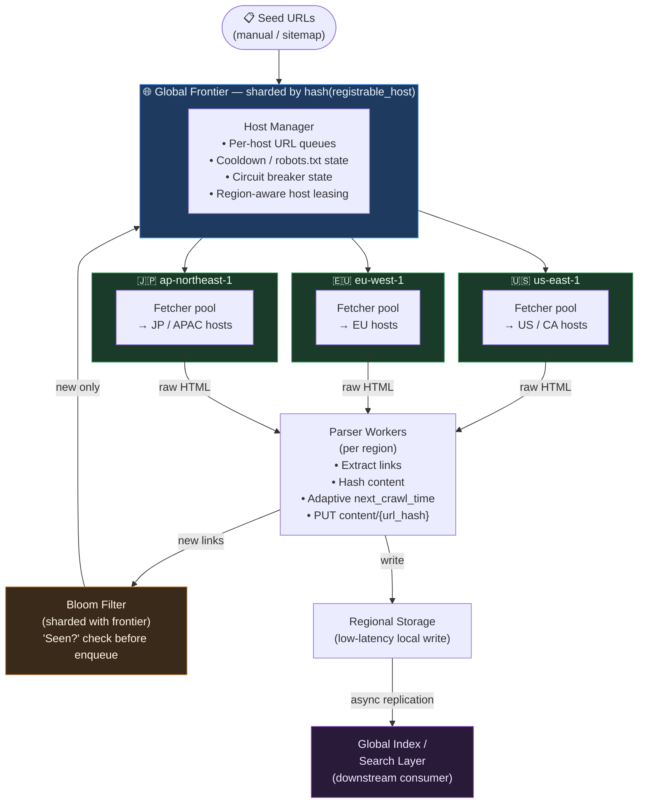
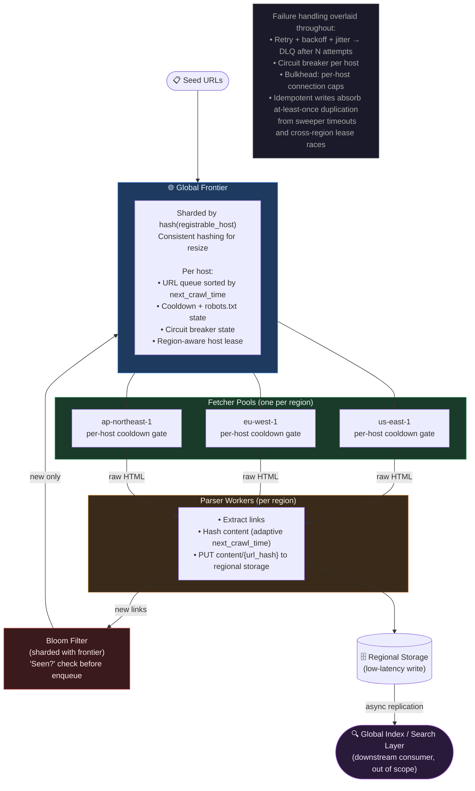

# Web Crawler — A Complete Iterative Design Story

---

## Origin Hook

It's 1994. The web has roughly a few thousand pages, and Jerry Yang and David Filo are manually bookmarking sites into a directory — "Yahoo!" — because that's genuinely how you found things.

Within two years the web doubles past what any human can curate by hand. A research project at Stanford (the future Google) realizes the only way to keep a map of the web current is to build a program that behaves like a diligent, tireless intern: start from a few known pages, read every link on them, go visit those, repeat forever.

The problem was never "can we download a webpage" — that's a GET request. The problem is that the web is simultaneously:
- **Enormous** — billions of pages and growing.
- **Constantly changing** — news updates, pages deleted, new sites born daily.
- **Full of impolite traps** — infinite calendar pages, duplicate mirrors, servers that will ban you for hitting them too hard.

And you have to discover it without a map, while not getting stuck or making enemies.

---

## Scoped Requirements

### P0 / P1 — These Drive the Design

| # | Requirement | Why it matters |
|---|---|---|
| 1 | **Scale of coverage** | Crawl 1B+ URLs within a reasonable refresh window. This forces distribution, sharding, and dedup at scale. |
| 2 | **Politeness** | Never hammer a single host with concurrent or rapid requests. Respect `robots.txt` and `Crawl-delay`. This is deceptively the *hardest* constraint — naive scaling (just add more workers!) makes it actively worse. |
| 3 | **Freshness / re-crawl policy** | Pages change at different rates (news homepage vs. a static PDF). The crawler must revisit accordingly, not treat every URL as crawl-once. |
| 4 | **Extensibility of the frontier** | New URLs are discovered continuously from parsed pages and must be dedup'd against a massive already-seen set — without that check becoming the bottleneck. |

### The Crux Requirement

Requirement #2 (Politeness) combined with #1's scale.

The naive "just parallelize" instinct is exactly wrong here. Untangling *why* — and what data structure actually solves it — is where most of the narrative time is spent. This is fundamentally a distributed rate-limiter / queueing problem wearing a crawler costume.

### Explicitly Cut (P2 — No Major Architectural Impact)

- Full-text search indexing / ranking (downstream consumer of crawled content, not the crawler's job).
- JavaScript rendering for SPA-heavy sites (real systems handle this, but it's a "swap in a headless browser at the fetch step" detail, not a new architecture).
- Deep content-quality / spam classification.
- Sitemap.xml prioritization nuances — mentioned in passing, no dedicated iteration.

---

## Day 0: The Dumbest Thing That Could Work

### The Setup

One machine. One process. A single MySQL table called `urls`, and a Python script running in a `while True` loop.

```sql
CREATE TABLE urls (
  id           BIGINT PRIMARY KEY AUTO_INCREMENT,
  url          VARCHAR(2048) UNIQUE,
  status       ENUM('pending','in_progress','done') DEFAULT 'pending',
  discovered_at TIMESTAMP DEFAULT NOW()
);
```

### The Loop — Step by Step

**Step 1:** `SELECT * FROM urls WHERE status='pending' LIMIT 1` — grab the next URL.

**Step 2:** `requests.get(url)` — fetch the page, synchronously, and wait for the response.

**Step 3:** Parse the HTML with BeautifulSoup, pull out every `<a href>`.

**Step 4:** For each new link: `INSERT IGNORE INTO urls (url) VALUES (?)` — the `UNIQUE` constraint on `url` does the deduplication automatically.

**Step 5:** Save the page body to local disk as a flat file.

**Step 6:** `UPDATE urls SET status='done' WHERE id=?`

**Step 7:** Go back to Step 1.

```
┌──────────┐   pick pending URL   ┌────────────┐
│  MySQL   │◄────────────────────►│  Crawler   │──► GET page
│  urls    │   insert new links   │  (1 proc)  │◄── HTML
└──────────┘                      └─────┬──────┘
                                        │
                                        ▼
                                 local disk (HTML files)
```

### Why This Is a Legitimate Starting Point

This isn't a strawman. It gives a genuinely simple correctness guarantee:

> *Every URL is fetched exactly once, and the "have I seen this?" check is a single atomic unique-key insert — so there's no possible way to double-crawl a page or lose a discovered link.*

There's no distributed coordination problem yet because there's nothing distributed. If you only needed to crawl one company's own 50,000-page documentation site, this is roughly a reasonable answer.

It also happens to respect politeness *by accident*: since it's single-threaded and synchronous, it can literally only ever hit one host at a time, at whatever pace `requests.get()` takes to return. Fewer resources, but zero risk of accidentally DDoS-ing anyone.

---

## Break It

### The Throughput Math

**Target:** 1 billion pages crawled once every 30 days (a reasonable freshness bar for the median web page).

**Step 1 — Convert to per-second rate:**
```
1,000,000,000 pages ÷ 30 days
= 33,333,333 pages/day
÷ 86,400 seconds/day
≈ 386 pages/second sustained average
```

**Step 2 — Check Day 0's actual throughput:**

A synchronous fetch-parse-store cycle — network round trip, DNS lookup on cache miss, parsing, a couple of DB round trips — is optimistically **200–500ms per page** on a good day. More when a server is slow.

```
Best case:  1 / 0.2s = 5 pages/sec
Worst case: 1 / 0.5s = 2 pages/sec
Target:     386 pages/sec
Gap:        77x – 193x short
```

**Step 3 — What concurrency would you need?**

To hit 386 pages/sec at 200–500ms per page, you'd need on the order of **100–1,000 concurrent fetches in flight at any moment** just to keep up with average load — before you even think about bursty traffic.

### The Specific Failure That Matters Most

Imagine `pending` fills up with 50,000 URLs that all happen to be from `nytimes.com` — a very normal outcome, since one homepage crawl discovers hundreds of links to the same domain.

Someone's obvious fix for the speed problem: **spin up 200 threads pulling from the same query.**

Do that, and 200 threads immediately start hammering nytimes.com's servers concurrently — because nothing in this design tracks "which host is currently being hit."

That's not a hypothetical. That's an accidental denial-of-service attack against a news organization from code you wrote to be helpful. nytimes.com's ops team notices, and now your crawler's IP range is in their firewall's blocklist — permanently. Word travels between site operators about which crawlers to block on sight.

> **The naive scaling move — "just add more workers reading from the same queue" — doesn't just fail to help. It actively makes the worse problem (politeness) worse, while barely touching the real throughput problem.**

---

## Iteration 1: Concurrency + Decoupling Fetch from Parse

### The Obvious First Fix

Alice (the engineer on call) does the natural thing. She swaps the single loop for a pool of 200 async worker coroutines, all pulling from the same `pending` queue, and separates fetching from parsing into two stages:

- **Fetcher workers** (async, e.g. `asyncio` + `aiohttp`) — just do `GET url → raw HTML`, then drop it onto a queue.
- **Parser workers** — consume raw HTML, extract links, and push new URLs back into `pending`.

**Why separate them?** Parsing HTML is CPU-bound. Fetching is I/O-bound. Mixing them means your CPU sits idle waiting on network I/O. Separating them lets both resources run flat out simultaneously.

```
               ┌─────────────┐
 pending  ────►│  Fetcher    │──┐
 queue         │  pool (200) │  │  raw HTML
               └─────────────┘  ▼
                          ┌─────────────┐
                          │  Parse      │
                          │  queue      │
                          └──────┬──────┘
                                 ▼
                          ┌─────────────┐
 new URLs ◄─────────────── │  Parser     │
 → pending                 │  pool       │
                          └─────────────┘
```

### Why This Looked Reasonable

```
200 workers × (1 / 0.3s) = 666 pages/sec
Target = 386 pages/sec
```

On paper, problem solved.

### How It Actually Breaks

The queue has no concept of *which host* a URL belongs to. It's just a FIFO (or a `SELECT ... LIMIT 200` batch) of URLs in whatever order they were discovered.

Because one crawl of `nytimes.com`'s homepage discovers hundreds of `nytimes.com` links in a row, those links land in the queue clustered together. When 200 fetchers grab a batch of "next 200 pending URLs," it's entirely plausible that 60–100+ of them are all `nytimes.com`.

**Result:** 60–100 concurrent connections hitting the same host in the same second. Worse than Day 0, not better. You took the exact failure mode from before and multiplied it by however many workers you added.

> **The bug isn't "not enough concurrency." It's that concurrency and politeness are in direct tension unless something explicitly partitions work by host — and nothing in "pool of workers reading a shared queue" does that by construction.**

### Trade-Off Summary

| What we gained | New problem introduced |
|---|---|
| Raw throughput — past the 386 pages/sec target | No host-level fairness or rate control at all |
| CPU-bound parsing no longer blocks I/O-bound fetching | Politeness got strictly *worse* under load — precisely when we need better behavior |

### Alternatives Rejected

| Alternative | Why rejected |
|---|---|
| **Global `time.sleep()` between all requests** | Throttles the entire crawler to be polite to the *busiest* host, tanking throughput for the 99% of hosts that could handle more traffic just fine |
| **Randomly shuffle the queue before each batch** | Reduces clustering probabilistically but doesn't bound it. With a heavy-tailed link distribution, you'll still get unlucky batches. It doesn't give you a *guarantee*. |

### Follow-Up Questions

- *"Why not rate-limit at the network layer, like a shared token bucket for the whole crawler?"* — That limits *total* crawler throughput, not per-host throughput. You'd still be free to send 60 concurrent requests to one host as long as your global budget allows it. The constraint needs to be host-scoped, not fleet-scoped.
- *"Could you fix this by running one crawler process per domain?"* — Close to the right instinct (isolate by host), but it doesn't scale. You don't know the set of domains in advance, and you'd have millions of near-idle processes for small sites. You need per-host isolation *without* per-host infrastructure.

---

## Iteration 2: The Per-Host Mailbox (Politeness, Properly)

### The Analogy First

Think of a hotel mail room — not a single inbox.

If every guest's mail piled into one bin sorted by arrival time, the mail clerk delivering it might walk to Room 204 four times in five minutes because that guest gets a lot of mail, while Room 301 waits all day.

The fix a real mail room uses: **one pigeonhole slot per room.** The clerk works down the row, delivers *one item* from a slot, moves to the next slot, and only comes back to Room 204's slot after visiting every other occupied room in between.

No room ever gets hammered. No room gets starved. The *structure itself* enforces fairness — without the clerk needing to track timestamps or think about it.

That's exactly the shape of the fix here.

### The Concrete Structure — Mercator's Design

This is essentially the design Google's original crawler used.

**Component 1 — Host Manager:**
A service that owns a mapping of `host → queue of pending URLs for that host`. In practice, a partitioned structure (Redis data structure per host, not literally millions of DB tables). Each host-queue also carries a `next_allowed_fetch_time` — a per-host cooldown timer, set from either `robots.txt`'s `Crawl-delay` directive or a sane default (e.g. 1 request per host per second).

**Component 2 — Fetcher workers:**
Workers don't pull "the next URL." They ask the Host Manager for "the next *host* that is both non-empty and past its cooldown," pop one URL from that host's queue, fetch it, then update `next_allowed_fetch_time = now + delay` for that host before releasing it back into rotation.

```
 host queues (per-domain)
 ┌──────────────┐
 │ nytimes.com  │───┐
 │ [u1,u2,u3..] │   │
 └──────────────┘   │
 ┌──────────────┐   │      ┌────────────────┐
 │ wikipedia.org│───┼─────►│  Host Manager  │──► "here's an eligible
 │ [u4,u5..]    │   │      │  / Scheduler   │     host + 1 URL"
 └──────────────┘   │      └───────┬────────┘
 ┌──────────────┐   │              │
 │ smallblog.io │───┘              ▼
 │ [u6]         │           ┌─────────────┐
 └──────────────┘           │  Fetcher    │
                            │  pool       │
                            └─────────────┘
```

Now 200 fetcher workers can run flat-out — but because they all ask the *same* Host Manager for eligible hosts, and `nytimes.com` goes into cooldown the instant one worker grabs a URL from it, no second worker can grab another `nytimes.com` URL until that cooldown expires.

**The result:** concurrency scales throughput across *many different hosts simultaneously* — which is perfectly polite — while naturally serializing requests *within* any single host.

### Where robots.txt Fits

Before a host's queue is drained for the first time:
1. The Host Manager (or a dedicated fetch) pulls `https://host/robots.txt`.
2. Parses `Disallow` and `Crawl-delay`.
3. Caches the result (e.g. 24h TTL).
4. Applies it as a filter on URL admission — disallowed paths never get queued — and as the cooldown value.

### Trade-Off Summary

| What we gained | New problem introduced |
|---|---|
| A *structural*, not probabilistic, politeness guarantee — no single host can ever have more than one request in flight at a time, regardless of total fleet concurrency | The Host Manager is now shared, stateful coordination that every fetcher talks to before every fetch — potential bottleneck and single point of failure |
| Throughput scales with the *number of distinct hosts in flight* (which for a general web crawl is huge) | A mega-host like `blogspot.com` (hosting millions of distinct blogs) could dominate the URL distribution — its queue grows to millions of entries while thousands of tiny host-queues sit at length 1 |

### Approaches Compared

| Approach | Per-host fairness guarantee | Scales with concurrency | Handles crawl-delay |
|---|---|---|---|
| Global shared queue (Iter. 1) | No | Yes (but worsens politeness) | No |
| Global token bucket | No (fleet-wide only) | Partially | No |
| Per-host queue + cooldown (Iter. 2) | ✅ Yes | ✅ Yes | ✅ Yes |

### Alternatives Rejected

| Alternative | Why rejected |
|---|---|
| **Global rate limiter with a low ceiling** | Can't express "no more than 1 req/sec to *this specific* host" without being host-aware — and host-awareness *is* the per-queue structure. Can't bolt it on afterward as a single number. |
| **DNS/IP-level throttling instead of hostname** | Worth a callout: some crawlers key cooldowns by **IP address** instead of hostname, because many small sites share one IP on shared hosting, and hammering that IP with 50 "different" hostnames is just as impolite. Real systems (Mercator) key by IP for exactly this reason. We treat "host" loosely as "IP or registrable domain" going forward. |

### Follow-Up Questions

- *"How do you pick which eligible host to serve next, if 10,000 hosts are all past cooldown at once?"* — Round-robin, or a priority queue keyed by `next_allowed_fetch_time` (a min-heap gives `O(log n)` "give me the next host whose cooldown has expired"), optionally weighted by domain authority or freshness need.
- *"What if the Host Manager itself goes down?"* — It needs to be horizontally partitioned (shard hosts across N Host Manager instances by `hash(host) % N`), each backed by durable storage (Redis with persistence, or Kafka partitions) so state survives a restart.

---

## Iteration 3: Sharding the Frontier — and the Mega-Host Problem

### The Natural Next Move

Distribute the Host Manager across 100 machines, sharded by `hash(host) % 100`. One Host Manager can't hold state for tens of millions of hosts in memory on one box, so this is the obvious scale-out step.

```
shard_id = hash(host) % 100
```

Each shard owns a disjoint slice of hosts. A Fetcher worker asks *its* shard for eligible hosts.

This works beautifully for the long tail — `smallblog.io`, `janes-recipes.net`, millions of low-traffic sites — because `hash()` spreads them uniformly across the 100 shards.

### The Break — Hot Shard / Hot Partition

`hash()` spreads *hosts* uniformly — it says nothing about spreading *URLs* uniformly, because URL count per host is wildly non-uniform.

`blogspot.com` alone might account for **tens of millions of distinct blog URLs** (`blogspot.com/blog1`, `blogspot.com/blog2`, ...), all sharing one hostname. Under `hash(host) % 100`, every single one of those URLs lands on *the same shard* — because it's the same host.

**The result:**
- That one shard's queue balloons to millions of entries.
- Its 99 siblings sit lightly loaded.
- The politeness rule ("one request in flight per host") means that shard can only ever have *one fetcher actively pulling from blogspot.com at a time* — so that shard's backlog doesn't just grow, it never drains, while its machine's CPU and network sit mostly idle waiting on a 1 req/sec trickle.

This is the classic **hot shard / hot partition** problem. Same failure shape as a hot Redis key or a Cassandra partition for a celebrity user.

### Why the Obvious Fix Isn't Enough

*"Just give blogspot.com its own dedicated shard."*

Even a dedicated shard for blogspot.com is still bottlenecked at ~1 req/sec by the *per-host* politeness rule. `blogspot.com` is still one hostname as far as `robots.txt` and crawl-delay are concerned. Giving it a whole shard just wastes 99 idle CPUs' worth of capacity on one host that can only be crawled slowly by design.

### The Actual Fix — Subdomain/Path-Aware Sharding Key

Treat `blog1.blogspot.com` and `blog2.blogspot.com` as *separate effective hosts* for politeness and sharding purposes, when the platform genuinely hosts independent sites at that granularity.

This is a real, documented distinction. Sites like blogspot, wordpress.com, tumblr, and github.io are effectively multi-tenant — politeness should be scoped to the *tenant*, not the platform domain.

The shard key becomes something closer to `hash(registrable_host)`, where `registrable_host` resolves subdomains of known multi-tenant platforms into separate politeness buckets, while still correctly collapsing `www.nytimes.com` and `nytimes.com` into the *same* bucket.

```
              hash(registrable_host) % N
┌────────────────────────────────────────────────┐
│  Shard 7            Shard 42         Shard 88   │
│  nytimes.com        blog1.blogspot   wikipedia  │
│  [big but single-   .com             .org       │
│   tenant, ~1req/s]  [own politeness] [big but   │
│                     blog2.blogspot   1req/sec]   │
│                     .com                        │
│                     [separate shard,            │
│                      different key]             │
└────────────────────────────────────────────────┘
```

### Trade-Off Summary

| What we gained | New problem introduced |
|---|---|
| Shard load now correlates with actual crawlable-in-parallel capacity, not raw hostname string | We now need a maintained (and imperfect) list of known multi-tenant domains to know when to split by subdomain vs. collapse to the registrable domain — a real operational artifact, like the Public Suffix List used by browsers for cookie scoping |

### Approaches Compared

| Approach | Fixes hot shard? | Wastes idle capacity? | Needs maintained heuristic? |
|---|---|---|---|
| `hash(hostname)` sharding | No | No | No |
| Dedicated shard for known mega-hosts | Partially (still 1 req/s capped) | Yes (idle CPUs) | Yes |
| `hash(registrable_host)`, tenant-aware | ✅ Yes | ✅ No | Yes |

### Alternatives Rejected

| Alternative | Why rejected |
|---|---|
| **Increase replication/parallelism within the hot shard's machine** | Doesn't help — the bottleneck isn't the shard machine's compute, it's the politeness cooldown on the host itself. More fetcher threads on that box just contend for the same 1 req/sec slot. |
| **Cap queue length per shard and drop overflow** | Silently dropping discovered URLs means large legitimate sites (blogspot hosts millions of real, distinct blogs) never get fully crawled — a correctness/coverage regression. A bounded queue *with backpressure* (pause discovery from that host until it drains) is a reasonable defensive layer on top, not a replacement. |

### Follow-Up Questions

- *"How would you detect a host is 'multi-tenant' without a manually maintained list?"* — Heuristics: a small set of known platforms (curated list, like the Public Suffix List), plus a runtime signal — if a hostname's discovered-URL count crosses a threshold (say 100K+ distinct paths) and those paths don't share content structure, flag it for re-sharding at the subdomain level. Not perfect, but self-correcting over time.
- *"What if the number of shards N needs to change as the web grows — doesn't rehashing move everything?"* — Yes, plain `hash(host) % N` rehashes almost everything on resize. Real systems use **consistent hashing** instead (same hash-ring idea used for cache sharding) so adding shard 101 only reassigns ~1/101 of hosts, not all of them.

---

## Iteration 4: The "Have We Seen This URL?" Problem at Scale

### The Check — and Why It's Not Cheap

Every time a Parser worker extracts links from a page, it needs to answer one question per link: *have we already discovered this URL before?*

Back in Day 0, this was free — a `UNIQUE` constraint on a MySQL column. Let's check whether that assumption survives at scale.

**The arithmetic:**

**Step 1 — How many URLs get discovered per crawl?**
```
1B pages × ~25 outbound links/page avg = ~25 billion URL discoveries
```

Most come back "yes, seen it" — the web is densely interlinked; the same popular URLs get discovered from thousands of different pages.

**Step 2 — How many dedup checks per second does that require?**
```
386 pages/sec × ~25 links/page ≈ 9,650 dedup checks/sec
```

**Step 3 — What does each check cost in the naive case?**

A lookup against a relational table with a B-tree index on a 2KB `VARCHAR` column costs a disk seek in the worst case once the index no longer fits in memory. An index over a billion+ long URL strings absolutely does not fit in memory.

```
9,650 checks/sec × ~1ms/check (disk seek) = 9.65 seconds of disk I/O per second
```

That's a database begging to fall over — and it's on the hot path of *every single link discovered*, not an occasional query.

### Attempt 1 — Cache It in Memory (Redis SET)

Keep the full set of seen URLs in a Redis `SET`. This works — until you do the storage math.

**Step 1 — Memory estimate:**
```
1B URLs × ~60–100 bytes/entry (with Redis overhead) = 60–100 GB of RAM
```

That's just for the dedup set, before storing a single byte of actual crawled content. At 2B URLs → 200 GB. It scales linearly with URL count, and the web isn't slowing down.

It's not wrong — it *works* — but it's an ever-growing tax on a check that's fundamentally binary (seen / not seen).

### Attempt 2 — Shard the Seen-Set Across Machines

Partition by `hash(url) % N`. This brings per-machine memory down linearly with N. But now every dedup check is a **network round-trip** to whichever shard owns that URL's hash. At 9,650+ checks/second, each paying network latency instead of a local memory lookup, you've traded a memory problem for a network-hop-count problem — and you're still storing full URL strings just to answer a yes/no question.

### The Reframe — You Don't Need the URL, You Need the Answer

This is where a **Bloom filter** earns its keep.

**The analogy:** imagine a bouncer at a club who doesn't keep a guest list with names. For every guest that's already entered, they flip a few specific light switches on a big panel of, say, a billion switches (which switches are determined by running the guest's name through a few different hash functions).

To check "has this person been in before?", the bouncer runs the *new* name through those same hash functions and checks: are *all* those specific switches already on?

- If even **one is off** → certain **no**. This guest has never triggered that combination before.
- If **all are on** → *probably* yes, but maybe not. Some other combination of past guests happened to flip that exact same set of switches by coincidence.

That's the trade: a Bloom filter can give you a **false positive** (says "seen" when it wasn't) but **never a false negative** (will never wrongly say "new" for something actually seen) — and it does this in fixed memory that doesn't grow with the number of names you've checked, only with how many bits you allocate up front.

### How It Works Concretely

A bit array of size `m`, with `k` independent hash functions.

**To add a URL:**
1. Compute `k` hash values mod `m`.
2. Set those `k` bits to 1.

**To check a URL:**
1. Compute the same `k` hashes.
2. If any bit is 0 → definitely new.
3. If all are 1 → probably seen (small false-positive rate, tunable).

### The Numbers at Our Scale

**Step 1 — Memory for Bloom filter vs. exact set:**
```
Bloom filter for 1B URLs at 1% false-positive rate:
  ≈ 9.6 bits per element
  ≈ 1.2 GB total

Redis exact set for 1B URLs:
  ≈ 60–100 GB
```

That's a **50–80x memory reduction**, and lookups are pure in-memory bit checks — no disk, no network hop, if colocated with the Parser worker.

**Step 2 — What the 1% false-positive rate actually means:**

Roughly 1 in 100 genuinely-new URLs gets wrongly marked "already seen" and silently dropped — we never crawl it. For a search index covering the general web, missing an occasional obscure page is tolerable (the web is redundant; a missed page is often linked from elsewhere, giving another shot at discovering it).

It would **not** be acceptable for a system where every record matters — e.g., you wouldn't use a Bloom filter to check "has this bank transaction already been processed?" There, false positives cost real correctness, so you'd eat the cost of an exact structure instead.

### Trade-Off Summary

| What we gained | New problem introduced |
|---|---|
| Dedup memory footprint drops ~50–100x | A small, tunable rate of silently-dropped new URLs (false positives) |
| Checks become pure in-memory bit operations | Bloom filters don't support deletion cleanly — you can't safely unset a bit, since other URLs may share it. If a URL needs to be "forgotten" (e.g., deliberately re-crawled from scratch), you can't do that by mutating the filter. |
| Structure size is fixed and predictable regardless of URL string length | |

### Data Structure Comparison

| Structure | Memory @ 1B URLs | Lookup cost | False positives? | Supports delete? |
|---|---|---|---|---|
| Relational unique index | Doesn't fit in RAM | Disk seek | No | Yes |
| Sharded exact set (Redis) | ~60–100 GB | Network hop | No | Yes |
| Bloom filter | ~1.2 GB | In-memory bit check | ~1% (tunable) | No |

### Follow-Up Questions

- *"What if 1% false-positive-driven missed pages is genuinely unacceptable for this use case?"* — Tune `k` and `m` up (more bits, more hash functions) to push the false-positive rate down — a direct memory-vs-accuracy dial. Dropping to 0.1% costs roughly double the bits per element, still far cheaper than an exact set at this scale.
- *"Where does the Bloom filter physically live given we've sharded the frontier across machines?"* — Shard it the same way, `hash(url) % N` matching the frontier shards, so the dedup check and the URL's eventual queue placement are naturally co-located and both benefit from the same partitioning.

---

## Iteration 5: Freshness — Not All Pages Age the Same

### The Problem With a Fixed Global Re-Crawl Interval

Two pages, discovered on the same day:
- **Page A:** `cnn.com/live/breaking-news` — content changes every few minutes.
- **Page B:** `irs.gov/pub/form-1040-instructions-2019.pdf` — a scanned tax form that will never change again.

Our crawler so far treats both identically: crawl once, done, re-crawl "everything" on some fixed cadence like 30 days.

**Attempt 1 — Fixed 30-day re-crawl:**

**Step 1 — How much throughput does this require?**
```
Maintaining 1B pages, re-crawling all every 30 days:
= same ~386 pages/sec sustained, forever, just to stand still on freshness
= 2x our original capacity requirement — permanently
```

And it still gives CNN's breaking-news page up to 30 days of staleness — unacceptable for live news.

**Attempt 2 — Shrink the fixed interval to satisfy the most demanding pages:**

Fine — re-crawl everything every **1 hour** instead, so news sites stay fresh.

**Step 1 — New throughput requirement:**
```
1,000,000,000 pages ÷ 3,600 seconds/hour
= 277,777 pages/second — sustained, forever
```

That's a **~700x increase** in required throughput over our original target. Almost entirely spent re-fetching millions of static PDFs, terms-of-service pages, and abandoned blogs that haven't changed since 2019.

### The Reframe — Freshness as a Per-URL, Adaptive Priority

Track, per URL, how often it *actually* changes, and let that observed rate set its own re-crawl interval.

**The mechanism:**

1. Every time a URL is re-crawled, compute a content hash (SHA-256 of the fetched body, or a normalized version).
2. Compare against the hash from last crawl.
3. If content **changed** → shorten that URL's re-crawl interval (it's "hot"). Example: `interval = max(min_interval, interval / 2)`.
4. If **unchanged** → lengthen the interval (up to a cap, e.g. 6–12 months). Example: `interval = min(max_interval, interval × 1.5)`.
5. Store this as a `next_crawl_time` per URL.

New URLs start with a moderate default (say, 7 days) until enough history accumulates to adapt.

This is the same shape of idea as TCP's exponential backoff, just inverted. Instead of backing off after failure, we're adjusting an interval based on an observed rate, converging toward each page's actual "metabolism."

### How This Plugs Into What We've Already Built

Each host's queue was a structure the Fetcher pulls "next eligible URL" from, gated by the politeness cooldown. Now eligibility is a *combination* of two independent gates — a URL is only actually fetched when *both* are satisfied:

| Gate | Level | Checks |
|---|---|---|
| **Politeness cooldown** | Host-level | "Can I hit this host again yet?" |
| **Freshness due-time** | URL-level | "Is this specific URL due for re-crawl yet?" |

```
Host queue (nytimes.com), sorted by next_crawl_time:
┌─────────────────────────────────────────────┐
│ /live/breaking     next_crawl: 09:03:00      │  ← due now
│ /section/politics  next_crawl: 09:15:00      │
│ /archive/2019/xyz  next_crawl: 14 days out   │
└─────────────────────────────────────────────┘
        │
        ▼ (host cooldown also checked: last fetched 09:02:58,
           cooldown 1s → eligible at 09:02:59) ✓ both gates open
        ▼
   Fetcher pulls /live/breaking-news
```

### Trade-Off Summary

| What we gained | New problem introduced |
|---|---|
| Total re-crawl throughput now scales with the web's *actual aggregate rate of change*, not a worst-case global constant | Every URL now needs persisted state beyond "seen or not" — a `next_crawl_time`, a rolling change-rate estimate, a last-content-hash — which is real storage and update cost per URL |
| News pages get near-real-time freshness; static content gets crawled rarely; total system load stays near the original 386 pages/sec baseline | Cold-start problem: brand-new URLs have no history, so their initial interval is a guess. A genuinely fast-changing new page won't get its due until it's proven itself a few cycles in. |

### Re-Crawl Policy Comparison

| Policy | Steady-state throughput | News freshness | Wastes effort on static pages |
|---|---|---|---|
| Fixed 30-day recrawl | ~386/sec (2× baseline) | Poor (up to 30 days stale) | Yes |
| Fixed 1-hour recrawl | ~277,777/sec | Good | Yes — massively |
| Adaptive per-URL interval | Close to baseline | Good (hot pages converge fast) | No |

### Alternatives Rejected

| Alternative | Why rejected |
|---|---|
| **Let site operators declare change frequency via `sitemap.xml <changefreq>`** | Real crawlers use this as a *hint*, but it's self-reported and frequently wrong or absent. Observed behavior (did it actually change?) is ground truth; declared metadata is a prior at best. |
| **Priority purely by domain authority/PageRank, ignoring change rate** | Correctly prioritizes crawling nytimes.com over an obscure blog, but wouldn't distinguish nytimes.com's live blog (changes hourly) from its 2015 archive page (dead). You need the change-rate signal specifically for *re-crawl* cadence. |

### Follow-Up Questions

- *"How do you avoid the cold-start problem hurting a genuinely important new page, like breaking news from a brand-new event?"* — Seed initial interval partly from domain-level priors. A page on a known high-authority news domain starts with a shorter default interval than a personal blog. Domain reputation informs the *prior*; observed change rate refines it afterward.
- *"What if content changes in a way that's cosmetically different but not meaningfully different — like an ad rotating or a timestamp updating?"* — Hash a *normalized* version of the content (strip known-volatile elements like ad iframes, timestamps, view counters), or use a similarity threshold (e.g., SimHash/MinHash) instead of exact-match hashing, so trivial diffs don't falsely trigger "hot page" treatment.

---

## Iteration 6: When Machines Die Mid-Crawl

### Attempt 1 — Mark "In Progress" and Move On

This is what we've implicitly been doing: pop the URL, flip its status to `in_progress`, fetch, parse, flip to `done`.

The failure mode: if the worker dies between "flip to `in_progress`" and "flip to `done`," that URL is now stuck in `in_progress` **forever**. No other worker will ever pick it up (it's not `pending` anymore), and nothing ever un-sticks it.

At our scale, workers die constantly — hardware fails, deploys roll, spot instances get reclaimed. Over time, an accumulating fraction of the frontier silently leaks into this stuck state. Months in, some meaningful chunk of "should-be-crawled" URLs have just vanished from active rotation, and nobody notices until someone asks "why don't we have anything from this domain."

### Attempt 2 — Timeout: Reset "In Progress" to "Pending" After Too Long

A background sweeper checks for URLs stuck `in_progress` past some threshold (say, 5 minutes) and resets them to `pending` so another worker retries.

This fixes the "leaked forever" problem, but introduces a subtler one: **what if the original worker didn't actually die?**

It was just slow — a large page, a laggy host — and it's about to successfully finish at the exact moment the sweeper resets the URL and a *second* worker picks it up and starts fetching the same URL again. Now you have:
- Two fetches of the same page in flight.
- Two sets of parsed links both trying to insert into the frontier.
- Possibly two writes of the crawled content.

This is a **duplicate processing** problem. The sweeper's timeout-and-retry is *necessary* for durability but *insufficient* on its own — it trades "lost work" for "possibly-duplicated work."

### The Reframe — Accept At-Least-Once, Make Operations Idempotent

Trying to guarantee a URL is fetched *exactly once*, globally, across an unreliable fleet of machines, is fighting the fundamental nature of distributed systems. You cannot get exactly-once delivery without either a perfect coordinator or idempotent operations.

So instead: **let retries happen, and make every downstream write safe to apply twice.**

Concretely, per operation:

| Operation | Idempotent version |
|---|---|
| **Content storage write** | Write is `PUT content/{url_hash}` (an overwrite, keyed by a deterministic hash of the URL) — applying it twice produces identical end state, not two records |
| **Frontier insertion of newly discovered links** | Already idempotent from Day 0 — `INSERT IGNORE` / Bloom-filter-gated add. Re-adding an already-known URL is a no-op |
| **Marking URL done / updating `next_crawl_time`** | An idempotency key — e.g., a monotonically increasing `crawl_attempt_id` per URL — so if worker A's "delayed" write arrives *after* worker B's retry already completed, the write with the older attempt ID is detected and discarded rather than blindly overwriting newer state |

### For Persistently Unreachable Hosts — Retry With Backoff and Jitter

**Why backoff?** Immediate retries re-hammer a host that's clearly down, without giving it any time to recover.

**Why jitter?** Backoff alone still leaves everyone who failed at the same instant retrying at the same future instant — they all compute the same `base × 2^attempt`. Jitter (adding a random offset) desynchronizes the retry wave so recovery doesn't get immediately re-hammered by a thundering herd.

**The retry flow:**

```
fetch fails
     │
     ▼
retry count < 5? ──No──► Dead-letter queue
     │ Yes               (parked, human/slow sweep)
     ▼
backoff = min(max_backoff, base × 2^attempt) + jitter
     │
     ▼
re-queue after backoff ──► (meanwhile: circuit breaker
                             tracks failure rate for this
                             host; if >50% over window,
                             trip — pause all traffic to
                             host for cooldown)
```

After N failed attempts (say, 5), the URL moves to a **dead-letter queue** — not discarded, just parked out of active rotation, so a human or a periodic slow-sweep can revisit it without it clogging normal scheduling.

### Two More Failure Isolation Pieces

**Circuit breaker per host:**

If a host is failing on, say, >50% of requests over a rolling window, trip a breaker that stops sending it new requests for a cooldown period entirely. This protects *our* fleet's resources (connection pools, retry queues) from being wasted hammering a host that's clearly down. Distinct from per-URL retry logic.

**Bulkhead isolation:**

A slow or hanging host (TCP connects but never responds) shouldn't be able to exhaust the *shared* fetcher thread/connection pool such that healthy hosts get starved. Cap concurrent connections *per host* (we already have this from politeness) and ensure a slow host's stuck connections can't block workers assigned to other hosts — e.g., via per-host or per-shard worker pools rather than one global pool where one bad host can hog every slot.

### Trade-Off Summary

| What we gained | New problem introduced |
|---|---|
| Durability — no silently-lost URLs — without fragility of exactly-once semantics across an unreliable fleet | Every write path now has to be *designed* for idempotency rather than written naturally — real engineering discipline overhead |
| The system tolerates worker deaths, slow hosts, and transient failures gracefully | The dead-letter queue itself needs monitoring — a growing DLQ is a leading indicator that something is systematically wrong (e.g., a common CMS change breaking your parser) |

### Alternatives Rejected

| Alternative | Why rejected |
|---|---|
| **Distributed transactions / two-phase commit across fetch-write-frontier-update** | Far too much coordination overhead and latency for a system optimizing for raw throughput. The whole point of the crawler's design so far has been avoiding synchronous cross-machine coordination on the hot path. |
| **Immediate retry with no backoff** | Synchronized retry storms make transient host outages worse, not better — exactly like the "add more workers" mistake from Iteration 1, but in the time dimension instead of the concurrency dimension. |

### Follow-Up Questions

- *"How do you decide the timeout threshold for the sweeper without either leaking (too long) or duplicating too often (too short)?"* — Set it relative to observed p99 fetch+parse latency with margin (e.g., 5–10× p99). Prefer erring toward "occasionally duplicate" over "sometimes leak," since idempotency absorbs duplicates safely but nothing recovers a silently leaked URL without the sweeper.
- *"Why jitter specifically — isn't backoff alone enough?"* — Backoff alone still leaves everyone who failed at the same instant retrying at the same future instant. Jitter desynchronizes the retry wave so recovery doesn't get immediately re-hammered by a thundering herd the moment it comes back up.

---

## Iteration 7: Going Multi-Region

### The Problem With a Single Region

Our entire fleet sits in, say, `us-east-1`. Every fetch to a Japanese news site, an Australian government page, or a German blog pays a full round-trip across an ocean before the first byte even arrives — call it **150–250ms of pure network latency** before the target server does any work.

At 386+ pages/sec sustained, and a meaningful fraction of the web living outside North America, that latency tax inflates:
- The time each connection is held open.
- The concurrency needed to hit the same throughput.
- Cost — all for the same amount of "real" work done.

### Attempt 1 — Add More Fetcher Machines in `us-east-1`

This is the same category of mistake as Iteration 1's "add more workers." It treats a **latency problem** as a **throughput problem**.

You can throw more concurrent connections at the slowness and hit your QPS target on paper, but:
- You're now holding open thousands of extra long-lived connections just to mask geography.
- This does nothing for **data sovereignty** requirements some sites or jurisdictions have around where crawling infrastructure is allowed to originate from.
- For genuinely time-sensitive local content (a regional news outlet's breaking story), round-trip latency itself — not just throughput — determines how fresh your crawl can be.

### The Fix — Regional Fetcher Pools, Coordinated by a Home-Region Frontier

The Host Manager / frontier state (which hosts, which URLs, cooldowns, freshness schedules) stays as a globally-coordinated logical service. But the actual **Fetcher pools become regional**, and a URL gets routed to the fetcher pool geographically closest to the host it's crawling (determined via IP geolocation of the target, or a simple TLD/registrar heuristic as a fast first pass).



Content itself lands in **regional storage first** (cheap, low-latency write near where it was fetched), then replicates asynchronously to wherever the global index / search-serving layer lives. A transient cross-region link issue delays global visibility of that page — it does not delay the crawl itself.

### Trade-Off Summary

| What we gained | New problem introduced |
|---|---|
| Fetch latency drops to local-network levels for the majority of hosts | The Host Manager's coordination now spans regions — deciding "which region should own this host's queue and cooldown state" needs to be a stable, low-churn decision (you don't want a host's ownership flapping between regions) |
| Directly improves freshness for time-sensitive regional content | Cross-region replication of the global frontier / dedup state reintroduces a CAP trade-off |
| Real answer to data-sovereignty asks ("crawling and initial storage of EU sites happens within EU infrastructure") | |

**The explicit AP-over-CP choice:** we choose availability and partition tolerance over strict consistency here. A region briefly seeing slightly stale freshness/dedup state (crawling a URL that was *just* claimed by another region, milliseconds ago) is a tolerable, self-correcting cost — idempotent writes absorb it. Making every host-ownership decision wait for cross-region consensus would reintroduce exactly the synchronous-coordination latency tax we're trying to eliminate.

### Alternatives Rejected

| Alternative | Why rejected |
|---|---|
| **Strongly consistent global lock on host ownership (cross-region Paxos/Raft on every claim)** | Correct, but pays a cross-region round-trip on the coordination path for every host claim, defeating the latency win we're trying to achieve. Host ownership doesn't need strict consistency — it needs eventual stability. A soft-lease with periodic renewal (a region "owns" a host for the next 10 minutes, renewable) achieves the same practical goal without the consensus cost. |
| **Single global region, just closer to the "average" host (e.g., Europe)** | There is no single point on Earth that's close to US, EU, and APAC hosts simultaneously. It minimizes worst-case latency for nobody. |

### Follow-Up Questions

- *"What happens if two regions briefly both think they own the same host and both fetch it?"* — Exactly the idempotency story from Iteration 6 absorbs it: duplicate fetch, duplicate `PUT content/{url_hash}` overwrite, no corruption — mildly wasteful, self-correcting once the lease conflict resolves, and rare enough (leases renewed well before expiry, short claim windows) not to matter at scale.
- *"Why not replicate the entire frontier/Bloom filter to every region synchronously so there's never any ambiguity?"* — Sync replication across 3+ regions on every URL discovery would mean every parse-worker's link-insert waits on a multi-region round-trip — the exact synchronous cross-region coordination cost this whole iteration exists to avoid. Async replication with idempotent conflict resolution gets 99% of the benefit at a fraction of the latency cost.

---

## Full Architecture Recap

### System Summary Diagram



---

## The "Why Not X" Arsenal

| Question | Answer |
|---|---|
| **"Why not just add more worker threads to scale throughput?"** | Without host-aware partitioning, more workers means more concurrent hits on the same hot host, worsening politeness — not fixing throughput. |
| **"Why not a global rate limiter instead of per-host queues?"** | A fleet-wide budget can't express "≤1 req/sec to *this* host specifically." Politeness is inherently host-scoped. |
| **"Why not exact-match dedup (a hash set) instead of a Bloom filter?"** | Costs 50–100× the memory at billion-URL scale for a fact (exactness) the use case doesn't need. Occasional missed pages are tolerable for general web coverage. |
| **"Why not a fixed global re-crawl interval?"** | Either wastes throughput re-fetching static pages (long interval) or requires ~700× capacity to keep news fresh (short interval). Per-URL adaptive intervals track actual change rate instead. |
| **"Why not guarantee exactly-once fetch semantics?"** | Requires either a perfect global coordinator or heavy distributed transactions, both of which reintroduce the synchronous cross-machine coordination the design otherwise avoids. Idempotent writes + at-least-once delivery achieve durability more cheaply. |
| **"Why not retry immediately without backoff/jitter?"** | Synchronized retry storms re-hammer a recovering host the instant it comes back, recreating the outage. |
| **"Why not a single global region for simplicity?"** | No single region is close to all geographies. Cross-continent round-trips inflate latency, connection hold time, and hurt freshness for regional/time-sensitive content — plus it ignores data-sovereignty constraints. |
| **"Why not strongly-consistent cross-region coordination for host ownership?"** | Pays a cross-region round-trip on every host claim. Soft leases with async, idempotent-conflict-resolved replication get nearly the same correctness at a fraction of the latency cost — an explicit AP-over-CP choice. |

---

## Deep Dive: Why a Queue? (The First-Principles Explanation)

### Day 0 Actually Already Had a Queue — Just a Disguised One

Look again at Day 0's table:

```sql
status ENUM('pending','in_progress','done')
```

`SELECT * FROM urls WHERE status='pending' LIMIT 1` — that *is* a queue. It's "give me the next unit of work."

A queue, at its core, isn't a specific technology (Kafka, RabbitMQ, whatever). It's just: **a place to put work items, where a consumer can ask "what's next?" without needing to know who produced the item or when.**

So the real question isn't "why did we add a queue that wasn't there before." It's: **why did one shared queue, sitting between one producer and one consumer, stop being enough?**

### The Actual Trigger: Two Different Jobs, at Two Different Speeds, in One Loop

Look at Day 0's loop again:

1. Pop URL
2. Fetch (network — I/O bound, waiting on someone else's server)
3. Parse (CPU — waiting on nothing but your own processor)
4. Insert new links
5. Mark done
6. Repeat

These five steps run **strictly one after another, on one thread.**

- While Step 2 is waiting on a slow server, your CPU is doing *nothing* — just sitting there.
- While Step 3 is chewing through parsing a big page, your network connection is *idle* — you're not fetching anything else.

That's the concrete pain: one resource (network) that's slow and mostly-waiting, and a different resource (CPU) that's fast and bursty, forced to take turns instead of running simultaneously.

### Why "Just Make It Concurrent" Isn't Enough — You Need a Queue Specifically

Once you decide "fetching and parsing should happen concurrently, not in lockstep," ask yourself: **how does a fetch result get from the fetcher to the parser, if they're now two independent things running at their own pace?**

You have exactly two options:

| Option | What happens | Does it help? |
|---|---|---|
| **A — Direct handoff** (fetcher calls parser directly, like a function call) | Fetcher finishes a fetch, immediately calls `parse(html)` itself. But now the fetcher can't start its *next* fetch until parsing is done — you've glued the two stages back together with extra steps. | ❌ No actual overlap gained |
| **B — A queue between them** | Fetcher finishes a fetch, drops the HTML into a shared buffer, and *immediately* moves on to the next fetch — doesn't wait for anyone to consume what it just produced. Separately, whenever a parser is free, it pulls the next item off that buffer and works at its own pace. | ✅ True decoupling |

Option B is the only one that actually decouples the two stages' *speed* from each other.

That decoupling — "producer can keep producing without waiting for the consumer to catch up; consumer can keep consuming without waiting for the producer's next item" — is the entire reason a queue is the right structure here. It's a shock absorber between two things moving at different, independent rates.

### The Second Reason: Many Workers, One Shared Pool of Work, No Collisions

Once you have **200 fetcher workers** instead of 1, they all need to pull from the *same* pool of pending URLs without two workers grabbing the same URL at once, or corrupting each other's view of "what's left to do."

A plain in-memory list doesn't give you that safety for free — two threads reading/removing from a Python list concurrently will race and corrupt state. A queue (or a DB row locked via `SELECT ... FOR UPDATE`, or a real message queue like Kafka/SQS) gives you **atomic "pop one item, and guarantee no one else also got it"** as a built-in property. That's not optional once you have concurrent consumers — it's the thing that makes concurrency safe at all.

### Stated as a Chain of Reasoning — The Thing to Say Out Loud in an Interview

> "Day 0 does fetch and parse serially on one thread, so the CPU sits idle during network waits, and vice versa. Fixing that means running fetch and parse concurrently, as independent stages. Two independent stages, moving at different speeds, need a buffer between them so the fast one doesn't block on the slow one — that's a queue. Separately, once I have many fetcher workers instead of one, they all need to safely share one pool of pending work without colliding — a queue gives me that atomic hand-out for free."

**Queue = decoupler for stages at different speeds, and safe shared work-distribution for many concurrent consumers.**

Anywhere you see "these two things should run independently" or "multiple workers need to share one pool of work," that's your signal to reach for a queue — not because it's a standard component, but because those are the two specific problems a queue actually solves.

---

## Deep Dive: The Per-Host Queue — Why It Works, and Exactly How

### Start With the Exact Problem From Iteration 1

At the end of Iteration 1, we had 200 fetcher workers all pulling from **one shared queue** of URLs, in whatever order they'd been discovered.

URLs from the same host tend to arrive in the queue clustered together (crawling one page discovers dozens of links to that same site). A batch of "next 200 URLs" might contain 60+ URLs that are all `nytimes.com`.

Result: 60 workers hit `nytimes.com` in the same second — an accidental denial-of-service attack.

**The narrow, specific question we need to answer:** how do we let 200 workers run at full speed, *without* letting more than one of them hit the same host at the same time?

### Why Small Tweaks to the Existing Queue Don't Fix It

| Cheap fix | Why it fails |
|---|---|
| **Shuffle the queue randomly** | Reduces clustering, doesn't eliminate it. With enough workers pulling fast enough, you'll still get unlucky batches. No guarantee — just lower odds. |
| **Global rate limit ("crawler can only do 500 req/sec total")** | Caps *total* speed, but says nothing about *distribution*. You could easily have 500 req/sec entirely aimed at one host and still be "within budget." |

Both fail for the same underlying reason: **the queue has no concept of "host" at all.** It just sees URLs as interchangeable strings. Politeness is a *per-host* constraint, so any fix that doesn't track state per-host can't actually enforce it.

### The Fix: One Queue Per Host

If the rule is "never more than one request in flight to a given host," then the cleanest way to enforce that mechanically is to make each host's URLs physically live in their own separate line.

```
nytimes.com   → [url1, url2, url3, ...]
wikipedia.org → [url4, url5, ...]
smallblog.io  → [url6]
```

Instead of workers asking "what's the next URL in the global queue," they ask a coordinator — the **Host Manager** — "which *host* is currently allowed to be fetched from, and what's its next URL?"

### The Hotel Mailroom Picture

A hotel doesn't dump every guest's mail into one bin sorted by delivery time — that would mean the clerk revisits Room 204 four times in an hour because that guest gets a lot of mail, while Room 301 waits all day.

Instead: **one pigeonhole slot per room.** The clerk delivers one item from a slot, moves to the next slot, and only returns to Room 204 after visiting everyone else.

- "Room" = host
- "Mail item" = URL
- "Clerk" = fetcher worker

Giving each host its own slot is what guarantees fairness — not because the clerk is being careful, but because the *structure itself* makes it impossible to over-visit one room without first passing through all the others.

### How the Cooldown Actually Stops the Pile-Up

Structure alone (separate queues) isn't quite enough — you also need a timer, or nothing stops one *fast* worker from draining `nytimes.com`'s whole queue back-to-back by itself.

Each host also carries a `next_allowed_fetch_time`. The moment any worker pulls a URL from `nytimes.com`, that host is marked "not eligible again until +1 second" (or whatever its `robots.txt` crawl-delay says). Any other worker asking "give me eligible hosts" won't be offered `nytimes.com` until that timer clears — regardless of how many workers are free and ready.

That's the actual mechanism that turns "one host, one request at a time" from a hope into a guarantee: it's enforced by *state the coordinator checks before handing out work*, not by workers behaving themselves.

### Why This Doesn't Kill Throughput

Politeness only restricts requests *to the same host*. It says nothing about running 200 different hosts concurrently.

While `nytimes.com` is in cooldown, the other 199 workers are freely fetching from 199 *other* hosts — `wikipedia.org`, `smallblog.io`, thousands of others — completely unaffected by nytimes's cooldown.

> **We moved the unit of "wait your turn" from the whole crawler down to each individual host, so waiting on one host never blocks progress on any other host.**

---

## Deep Dive: The Actual Data Structure — Redis, Not Kafka

### First: Why Kafka Is the Wrong Tool for "One Queue Per Host"

The instinct to reach for Kafka makes sense — it's the default answer for "queue" in a lot of interviews. But check it against what we actually need.

Kafka's queues are **topics**, split into **partitions**. Partitions aren't free — a single Kafka cluster realistically handles on the order of a few thousand to low tens of thousands of partitions total, because each partition costs real overhead (open file handles, replication threads, memory).

We need **one independent queue per host**, and we're talking about tens of millions of distinct hosts. That's off by three or four orders of magnitude from what Kafka partitions are built for.

Kafka *is* a great fit elsewhere in this system (e.g., streaming discovered-links events between Parser and Frontier) — just not for "millions of tiny independent per-host lines."

### What We Actually Need — Restated as a Data-Structure Problem

Two separate pieces of state, per shard:

1. **For each host, a list of its pending URLs** — just needs push/pop.
2. **Across all hosts, "which ones are past their cooldown right now"** — needs to be queried efficiently, not scanned linearly.

That second one is the part people usually skip over. If you have 500,000 hosts on one shard and need to find "which of these are eligible right now," you cannot linearly scan 500,000 cooldown timestamps on every single fetch. You need a structure that keeps them **sorted by eligibility time**, so "give me the next eligible one" is fast.

### The Real Implementation: Redis, Two Structures

**Structure 1 — Per-host URL queue (Redis `LIST`):**

```redis
RPUSH host:queue:nytimes.com "https://nytimes.com/live/breaking"
RPUSH host:queue:nytimes.com "https://nytimes.com/section/politics"
LPOP  host:queue:nytimes.com    -- pop the next URL for that host
```

You don't pre-create millions of empty lists — a list simply exists the moment you `RPUSH` into it, and disappears when it's empty. Redis handles millions of small keys like this fine; it's one of its core use cases.

**Structure 2 — The "who's eligible" index (Redis `ZSET`):**

A sorted set where the *score* is the timestamp each host becomes eligible again:

```redis
ZADD host_ready 1755000000 nytimes.com
ZADD host_ready 1755000001 wikipedia.org
ZADD host_ready 1755000010 smallblog.io
```

To find hosts eligible **right now**, a worker asks for everything scored at or below the current time:

```redis
ZRANGEBYSCORE host_ready -inf <now> LIMIT 0 1
```

That single command is doing the job of "give me any host whose cooldown has expired" in `O(log n)` — it's a skip-list under the hood, so it stays fast even with millions of hosts tracked.

### Making the Pop-and-Recool Atomic — the Part That's Easy to Get Wrong

A worker needs to do three things as one unit — pick an eligible host, pop a URL from its list, and reset its cooldown — **without another worker sneaking in between Steps 1 and 3** and grabbing the same host.

If you did this as three separate Redis calls, two workers could both read "nytimes.com is eligible" before either one has re-cooled it, and both would fetch from it simultaneously — exactly the bug we're trying to prevent.

The fix: bundle all three steps into one **Lua script**, which Redis executes atomically (Redis runs one Lua script to completion before touching anything else):

```lua
-- EVAL this script with KEYS[1]=host_ready, ARGV[1]=now, ARGV[2]=cooldown_seconds
local host = redis.call('ZRANGEBYSCORE', KEYS[1], '-inf', ARGV[1], 'LIMIT', 0, 1)[1]
if not host then return nil end

local url = redis.call('LPOP', 'host:queue:' .. host)
if not url then
  redis.call('ZREM', KEYS[1], host)   -- empty queue, drop it from rotation
  return nil
end

redis.call('ZADD', KEYS[1], ARGV[1] + ARGV[2], host)  -- push cooldown forward
return {host, url}
```

One round-trip, one atomic unit, no race window. This is the actual mechanism that makes "no two workers hit the same host" a hard guarantee instead of a hope.

### Sharding This Across Machines

One Redis instance holding *all* hosts globally would itself become the single point of failure and bottleneck. So you partition:

```
shard_id = hash(registrable_host) % N
```

Each shard is its own Redis instance (or a slot range in Redis Cluster), owning a disjoint slice of hosts — its own `host_ready` ZSET and its own set of `host:queue:{host}` lists. Fetcher workers are assigned to shards (or ask a routing layer which shard owns a given host), so the Lua-script pop always runs against one shard's local Redis, never across shards.

### Durability — the Piece Redis Alone Doesn't Give You

Redis is fast because it's in-memory, but that means a crashed Redis node without persistence loses the whole frontier for its shard. Two practical answers, often combined:

| Approach | How it works |
|---|---|
| **Redis AOF (append-only file) persistence** | Every write is logged to disk, replayed on restart. Costs some write latency, buys durability. |
| **Kafka as the durable source of truth for newly discovered URLs** | Parser workers publish discovered links to a Kafka topic. A consumer drains Kafka and does the `RPUSH`/`ZADD` into Redis. If Redis's shard dies, you rebuild its queues by replaying Kafka from the last committed offset. |

That's a clean division of labor worth stating explicitly: **Kafka for durable, ordered ingestion of new work; Redis for the fast, mutable "what's eligible right now" scheduling state.** Each tool doing the part it's actually good at.

### Follow-Up Questions

- *"What if one shard's Redis instance is under memory pressure from a host with millions of queued URLs?"* — This is the blogspot hot-shard problem from Iteration 3, resurfacing at the implementation layer. Cap per-host list length with backpressure (pause discovery from that host once its queue passes a threshold), or apply the subdomain-aware resharding key from Iteration 3.
- *"Why Lua script instead of a Redis transaction (`MULTI`/`EXEC`)?"* — `MULTI`/`EXEC` queues commands but can't make a *decision* mid-transaction (like "only pop if eligible") — it just replays a fixed command list. Lua scripts can branch on intermediate results, which is exactly what "check eligibility, conditionally pop, conditionally re-cool" needs.

---

## Deep Dive: Priority — How "Due Time" and "Importance" Actually Get Encoded

### The Gap in What We Built So Far

The per-host queue was a Redis `LIST`:

```redis
RPUSH host:queue:nytimes.com url1
RPUSH host:queue:nytimes.com url2
LPOP  host:queue:nytimes.com   -- always returns whichever was pushed first
```

A `LIST` only knows *insertion order*. But priority — from Iteration 5 — is about **due time** (`next_crawl_time`), which has nothing to do with when a URL happened to be discovered.

- A URL discovered yesterday might be due to re-crawl in 6 months (a static PDF).
- A URL discovered five minutes ago might be due *right now* (a breaking-news page that just changed).

FIFO order can't represent that at all.

### The Fix: Swap the Per-Host LIST for a Per-Host ZSET

The same move we already made once — a Redis `ZSET`, scored by `next_crawl_time`, but this time it's **per host** instead of one global one:

```redis
ZADD host:urls:nytimes.com <next_crawl_time_1> "https://nytimes.com/live/breaking"
ZADD host:urls:nytimes.com <next_crawl_time_2> "https://nytimes.com/archive/2019/xyz"
```

To get the most urgent URL for that host:

```redis
ZRANGE host:urls:nytimes.com 0 0 WITHSCORES   -- lowest score = earliest due = most urgent
```

Reuse the exact same sorted-set structure we already used for host-level cooldowns, just keyed one level lower — per URL instead of per host.

### Two "Is This Ready?" Questions That Must Merge Into One

We actually have **two separate gates**:

| Gate | Question | Level |
|---|---|---|
| **Host-level politeness gate** | Has the cooldown since the last fetch to this host expired? | Per host |
| **URL-level freshness gate** | Is this specific URL's `next_crawl_time` actually due yet? | Per URL |

A host can be off cooldown but have *nothing* due — e.g. `nytimes.com`'s cooldown cleared a second ago, but its most urgent queued URL isn't due for another 3 hours. Fetching from it right now would be wasted effort.

So the host's "ready time," stored in the global `host_ready` ZSET, should be:

```
host_ready_score = max(cooldown_expiry_time, earliest_url_due_time_for_this_host)
```

Whichever of the two constraints is *more restrictive* wins. This single number now correctly encodes both gates at once — no separate check needed at read time.

### Updating the Atomic Lua Script

Same shape as before, just one more step:

```lua
-- KEYS[1] = host_ready, ARGV[1] = now, ARGV[2] = default_cooldown
local host = redis.call('ZRANGEBYSCORE', KEYS[1], '-inf', ARGV[1], 'LIMIT', 0, 1)[1]
if not host then return nil end

local key = 'host:urls:' .. host
local result = redis.call('ZRANGE', key, 0, 0, 'WITHSCORES')
if #result == 0 then
  redis.call('ZREM', KEYS[1], host)  -- nothing queued, drop from rotation
  return nil
end

local url = result[1]
redis.call('ZREM', key, url)  -- claim it

-- recompute this host's next ready time from its remaining URLs
local nextItem = redis.call('ZRANGE', key, 0, 0, 'WITHSCORES')
local nextDue = (#nextItem > 0) and tonumber(nextItem[2]) or nil
local cooldownExpiry = ARGV[1] + ARGV[2]

if nextDue then
  redis.call('ZADD', KEYS[1], math.max(cooldownExpiry, nextDue), host)
else
  redis.call('ZREM', KEYS[1], host)  -- re-added later when a new URL lands
end

return {host, url}
```

Same atomicity property as before — one script, one round-trip, no race between two workers grabbing the same host's most-urgent URL.

### Two Distinct Things Called "Priority"

| Type | What drives it | How it's stored |
|---|---|---|
| **Re-crawl priority** | Adaptive change-rate from Iteration 5. A page that changes often gets a lower (sooner) `next_crawl_time` score. | Already covered — it's just the ZSET score |
| **Initial discovery priority** | A brand-new URL has no change-rate history. Domain authority fills in as a prior — a URL discovered on a known high-authority domain (e.g. a `.gov` site, or a domain with a high inbound-link count) gets seeded with a smaller initial offset so it surfaces sooner the first time. | Computed at insert time: `initial_score = now + base_delay / priority_weight(domain)` |

Concretely at insert time:

```
initial_score = now + base_delay / priority_weight(domain)
ZADD host:urls:{host} initial_score url
```

where `priority_weight` is just a lookup — a known-authoritative domain gets a bigger divisor (smaller resulting delay, surfaces sooner), an unknown domain gets the plain default.

### Why We Didn't Need a Third, Separate Priority Queue

Priority here is just an input into the score used by structures we already have. There's no separate ranking pass — the ZSET ordering *is* the priority ordering, for both:
- Which host gets served next (`host_ready`).
- Which URL gets served next within that host (`host:urls:{host}`).

Adding a third structure would just duplicate information the two ZSETs already encode.

### Key Follow-Up

*"What if a very high-priority URL is discovered on a host that's mid-cooldown — does it have to wait?"*

Yes, and that's intentional: **politeness is a hard constraint, priority is a soft one.** A breaking-news URL on a host that was just fetched 0.5 seconds ago still waits out the remaining cooldown. Priority only affects ordering *among* URLs that are otherwise eligible — it never overrides the politeness gate.
