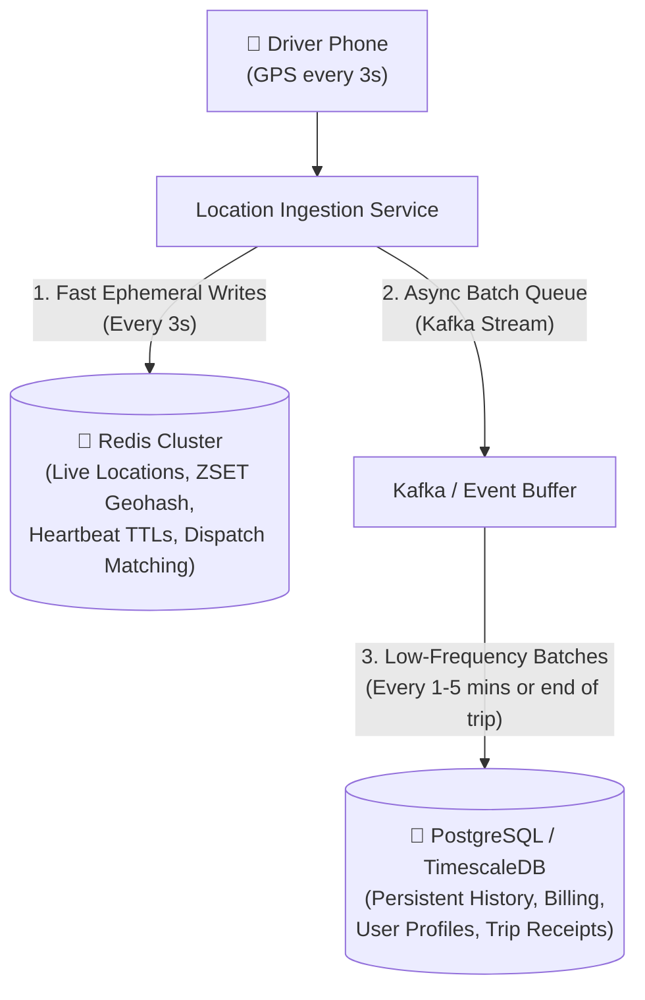
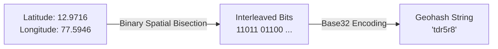
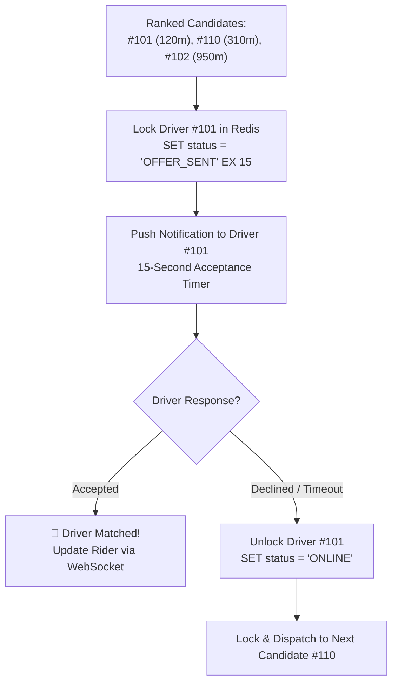
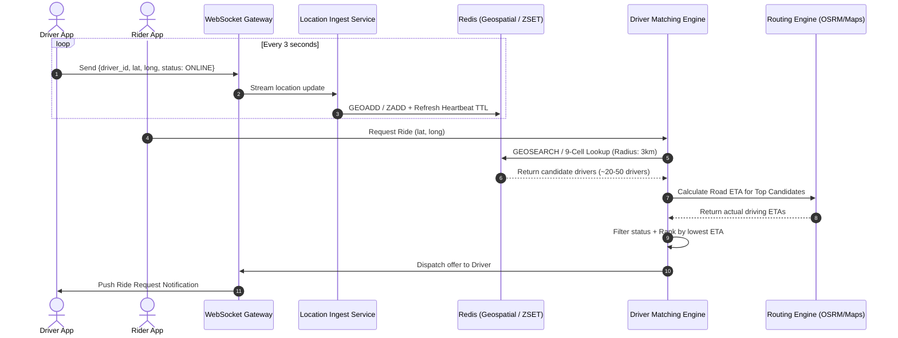

# 🌍 Geohashing in System Design (Ride-Sharing Apps)

A comprehensive, visual guide to spatial indexing, Geohash mechanics, and real-time driver matching architectures (Uber, Lyft, Ola).

---

## 🚨 1. The Core Problem: Why Raw `(lat, long)` Fails at Scale

In a naive database schema, driver locations are stored as independent coordinates:

```sql
CREATE TABLE driver_locations (
    driver_id BIGINT PRIMARY KEY,
    status VARCHAR(20),
    lat DECIMAL(9, 6),
    long DECIMAL(9, 6)
);
```

When a user requests a ride, the query needs to **"Find online drivers within 3 km of user coordinates $(lat_u, long_u)$"**.

### Why This Breaks Down:

```
❌ Naive Bounding Box Query:
   WHERE lat BETWEEN (lat_u - Δ) AND (lat_u + Δ)
     AND long BETWEEN (long_u - Δ) AND (long_u + Δ)
```

```
       Naive Bounding Box (Square)           Desired Search Area (Circle)
          ┌─────────────────────┐                   ┌─────────┐
          │  ❌ False Positives │                .-'           '-.
          │    ┌───────────┐    │              .'                 '.
          │    │     🎯    │    │             /         🎯          \
          │    │  (Rider)  │    │            │        (Rider)        │
          │    └───────────┘    │             \                     /
          │                     │              '.                 .'
          └─────────────────────┘                '-.           .-'
           Scans excess drivers                     └─────────┘
```

1. **No 2D Indexing**: Standard B-Tree indexes only work on a single dimension at a time. An index on `lat` narrows latitude, but the database must still filter every matching row by `long`.
2. **CPU Exhaustion ($O(N)$ Haversine)**: Calculating exact spherical distance via the **Haversine formula** across millions of active drivers per query destroys database CPU.
3. **High Write Contention**: In ride-sharing systems, millions of drivers report their location every **2–4 seconds**. Updating row coordinates and re-indexing multiple B-Trees causes severe write bottlenecks.

---

## 💾 2. Why Redis Over PostgreSQL/SQL for Continuous GPS Updates?

Even if you store Geohashes in PostgreSQL with B-Tree indexes or use PostGIS, relational SQL databases collapse under real-time driver location tracking.

### 🧮 The Write Throughput Math
* **$1,000,000$ active drivers** updating location every **3 seconds**:
  $$\text{Write Throughput} = \frac{1,000,000\text{ drivers}}{3\text{ seconds}} \approx \mathbf{333,333\text{ writes/second}}$$

```
                  Continuous GPS Stream (330k Updates/sec)
                                    │
        ┌───────────────────────────┴───────────────────────────┐
        ▼                                                       ▼
❌ Traditional SQL (PostgreSQL/MySQL)              ✅ In-Memory (Redis)
  ├─ 🛑 WAL Disk I/O Saturation                      ├─ ⚡ 100% In-RAM Operations (< 1ms)
  ├─ 🛑 B-Tree Index Rebalancing Thrashing           ├─ ⚡ O(log N) Skip List in-place update
  ├─ 🛑 MVCC Dead Tuple Bloat ("VACUUM Hell")        ├─ ⚡ Atomic single-threaded mutations
  ├─ 🛑 Row Locking & Connection Pool Exhaustion    ├─ ⚡ Native Key TTLs (Zero-cleanup GC)
  └─ 🛑 ACID Overhead for Ephemeral Data             └─ ⚡ Ephemeral state optimized
```

### The 5 Major Failure Modes of SQL:

1. **WAL (Write-Ahead Logging) Disk Bottleneck**: Every SQL `UPDATE` must sync to the WAL on disk to guarantee ACID durability. $333,000\text{ syncs/sec}$ saturates even enterprise NVMe SSD arrays.
2. **B-Tree Index Thrashing**: Moving drivers constantly cross boundary cells. Re-indexing B-Trees at $333\text{k QPS}$ causes severe lock contention, page splits, and CPU saturation.
3. **Postgres MVCC & Table Bloat ("VACUUM Hell")**: PostgreSQL does not update in-place; it marks old rows as dead tuples and writes new ones. At $333\text{k QPS}$, Postgres generates **$\approx 20\text{ million dead tuples every minute}$**, overwhelming `autovacuum` and crashing the database.
4. **Ephemeral Data Doesn't Need ACID**: If a GPS ping at 10:00:01 is lost, the 10:00:04 ping replaces it anyway. Paying the massive disk I/O and transaction penalty for disposable, ephemeral pings is architectural waste.
5. **Stale Driver Eviction (The TTL Problem)**: When a driver app crashes, Redis evicts them via native Key TTL (`EX 10`). In SQL, you must run heavy continuous cleanup queries (`DELETE FROM driver_locations WHERE updated_at < NOW() - INTERVAL '10s'`), adding even more write locks and WAL pressure.

### The Hybrid Pattern (Where SQL and Redis Live Together):



---

## 💡 3. The Solution: Geohashing

**Geohashing** converts a 2D coordinate `(latitude, longitude)` into a **single 1D alphanumeric string** (e.g., `(12.9716, 77.5946) → "tdr5r8"`).



### Key Properties:
* **Prefix = Proximity**: Points located close to each other share the same prefix (e.g., `tdr5r8`, `tdr5r9`, `tdr5re` are in the same neighborhood).
* **Hierarchical Zoom**: Longer strings represent smaller, more precise geographical cells.
* **1D Index Friendly**: B-Tree or hash indexes (and Redis keys) perform lightning-fast exact and prefix matches.

---

## ⚙️ 4. How Geohash Works Under the Hood

Geohash builds a binary path through **recursive spatial bisection (binary search on the globe)**. Each step cuts the search range in half, generating **1 bit (`0` or `1`)**.

* **The Rule**:
  $$\text{Mid} = \frac{\text{Min} + \text{Max}}{2}$$
  * If $\text{Coordinate} \ge \text{Mid} \implies$ **Bit = 1** (New range: $[\text{Mid}, \text{Max}]$)
  * If $\text{Coordinate} < \text{Mid} \implies$ **Bit = 0** (New range: $[\text{Min}, \text{Mid}]$)

---

### Walkthrough for Bangalore: `(Lat: 12.9716, Long: 77.5946)`

#### 📍 Step 1: Generating Longitude Bits (`77.5946` in `[-180, 180]`)

| Step | Current Range | Midpoint | Is $77.5946 \ge \text{Mid}$? | New Range | Bit |
| :---: | :--- | :--- | :--- | :--- | :---: |
| **1** | `[-180.0, 180.0]` | $0.0$ | **Yes** ($77.5946 \ge 0.0$) | `[0.0, 180.0]` | **`1`** |
| **2** | `[0.0, 180.0]` | $90.0$ | **No** ($77.5946 < 90.0$) | `[0.0, 90.0]` | **`0`** |
| **3** | `[0.0, 90.0]` | $45.0$ | **Yes** ($77.5946 \ge 45.0$) | `[45.0, 90.0]` | **`1`** |
| **4** | `[45.0, 90.0]` | $67.5$ | **Yes** ($77.5946 \ge 67.5$) | `[67.5, 90.0]` | **`1`** |
| **5** | `[67.5, 90.0]` | $78.75$ | **No** ($77.5946 < 78.75$) | `[67.5, 78.75]` | **`0`** |
| **6** | `[67.5, 78.75]` | $73.125$ | **Yes** ($77.5946 \ge 73.125$) | `[73.125, 78.75]` | **`1`** |
| **7** | `[73.125, 78.75]` | $75.9375$| **Yes** ($77.5946 \ge 75.9375$)| `[75.9375, 78.75]` | **`1`** |
| **8** | `[75.9375, 78.75]`| $77.34375$| **Yes** ($77.5946 \ge 77.34375$)| `[77.34375, 78.75]` | **`1`** |

* **Longitude Bitstream**: `1, 0, 1, 1, 0, 1, 1, 1, ...`

---

#### 📍 Step 2: Generating Latitude Bits (`12.9716` in `[-90, 90]`)

| Step | Current Range | Midpoint | Is $12.9716 \ge \text{Mid}$? | New Range | Bit |
| :---: | :--- | :--- | :--- | :--- | :---: |
| **1** | `[-90.0, 90.0]` | $0.0$ | **Yes** ($12.9716 \ge 0.0$) | `[0.0, 90.0]` | **`1`** |
| **2** | `[0.0, 90.0]` | $45.0$ | **No** ($12.9716 < 45.0$) | `[0.0, 45.0]` | **`0`** |
| **3** | `[0.0, 45.0]` | $22.5$ | **No** ($12.9716 < 22.5$) | `[0.0, 22.5]` | **`0`** |
| **4** | `[0.0, 22.5]` | $11.25$ | **Yes** ($12.9716 \ge 11.25$) | `[11.25, 22.5]` | **`1`** |
| **5** | `[11.25, 22.5]` | $16.875$| **No** ($12.9716 < 16.875$) | `[11.25, 16.875]`| **`0`** |
| **6** | `[11.25, 16.875]`| $14.0625$| **No** ($12.9716 < 14.0625$) | `[11.25, 14.0625]`| **`0`** |
| **7** | `[11.25, 14.0625]`| $12.65625$| **Yes** ($12.9716 \ge 12.65625$)| `[12.65625, 14.0625]`| **`1`** |
| **8** | `[12.65625, 14.0625]`| $13.359375$| **No** ($12.9716 < 13.359375$)| `[12.65625, 13.359375]`| **`0`** |

* **Latitude Bitstream**: `1, 0, 0, 1, 0, 0, 1, 0, ...`

---

#### 🔀 Step 3: Interleaving Bits (Zipper Merge)

Bits are interleaved starting with **Longitude first**, then alternating:
$$\text{Long}_1, \text{Lat}_1, \text{Long}_2, \text{Lat}_2, \text{Long}_3, \text{Lat}_3, \text{Long}_4, \text{Lat}_4, \dots$$

```
Longitude Bits:   [1]     [0]     [1]     [1]     [0]     [1]     [1]     [1]
Latitude Bits:        [1]     [0]     [0]     [1]     [0]     [0]     [1]     [0]
                  ───────────────────────────────────────────────────────────────
Combined Stream:   1   1   0   0   1   0   1   1   0   0   1   0   1   1   1   0 ...
```

---

#### 🔤 Step 4: Base32 Encoding (Chunks of 5 Bits)

The interleaved stream is partitioned into **5-bit chunks** and mapped against the **32-character Geohash alphabet** (excluding `a`, `i`, `l`, `o`):

| Index | Char | Index | Char | Index | Char | Index | Char |
| :---: | :---: | :---: | :---: | :---: | :---: | :---: | :---: |
| **0** | `0` | **8** | `8` | **16** | `h` | **24** | `s` |
| **1** | `1` | **9** | `9` | **17** | `j` | **25** | **`t`** |
| **2** | `2` | **10** | `b` | **18** | `k` | **26** | `u` |
| **3** | `3` | **11** | `c` | **19** | `m` | **27** | `v` |
| **4** | `4` | **12** | **`d`** | **20** | `n` | **28** | `w` |
| **5** | **`5`** | **13** | `e` | **21** | `p` | **29** | `x` |
| **6** | `6` | **14** | `f` | **22** | `q` | **30** | `y` |
| **7** | `7` | **15** | `g` | **23** | **`r`** | **31** | `z` |

* **Chunk 1 (Bits 1–5)**: $\mathbf{11001}_2 = 25 \rightarrow \mathbf{\text{'t'}}$
* **Chunk 2 (Bits 6–10)**: $\mathbf{01100}_2 = 12 \rightarrow \mathbf{\text{'d'}}$
* **Chunk 3 (Bits 11–15)**: $\mathbf{10111}_2 = 23 \rightarrow \mathbf{\text{'r'}}$
* **Chunk 4 (Bits 16–20)**: $\mathbf{00101}_2 = 5 \rightarrow \mathbf{\text{'5'}}$
* **Continuing for 30 total bits** $\rightarrow \mathbf{"tdr5r8"}$

---

## 📏 5. Geohash Length vs Precision

The length of the geohash determines the bounding box cell dimensions:

| Length | Bit Count | Cell Width $\times$ Height (approx) | Real-World Granularity | Primary Use Case |
| :---: | :---: | :---: | :---: | :--- |
| **1** | 5 bits | $5,000\text{ km} \times 5,000\text{ km}$ | Continental | Continental analytics |
| **3** | 15 bits | $156\text{ km} \times 156\text{ km}$ | Regional / State | Weather & state filtering |
| **5** | 25 bits | $4.9\text{ km} \times 4.9\text{ km}$ | City District | **Surge pricing heatmaps** |
| **6** | 30 bits | $1.2\text{ km} \times 0.6\text{ km}$ | Neighborhood | **Ride-hailing initial driver search** |
| **7** | 35 bits | $150\text{ m} \times 150\text{ m}$ | Street / Block | **Precise hyper-local dispatch** |
| **8** | 40 bits | $38\text{ m} \times 19\text{ m}$ | Building level | Delivery drop-off pinpointing |

> [!TIP]
> **Production Best Practice**: Ride-sharing systems typically index drivers at **Precision 6 or 7** for dispatching, and aggregate at **Precision 4 or 5** for surge pricing and demand-supply heatmaps.

---

## 🚕 6. Step-by-Step Simulation: How Driver Matching Works with Real Numbers

### The Candidate Funnel Architecture

Driver matching is designed as a progressive candidate reduction funnel:

```
[ 1,000,000 Total Active Drivers ]
             │
             ▼  1. Geohash 9-Cell Lookup (< 2 ms via Redis)
   [ ~30-50 Spatial Candidates ]
             │
             ▼  2. Availability & Vehicle Filters
   [ ~15-20 Available Candidates ]
             │
             ▼  3. Haversine Straight-Line Filter
   [ Top 5-10 Closest Candidates ]
             │
             ▼  4. Road Routing Engine (True ETA & Traffic)
   [ Ranked #1 to #5 by Lowest ETA ]
             │
             ▼  5. Dispatch Offer with Fallback
      🎯 Matched Driver
```

---

### Concrete Simulation in Bangalore

```
📍 Rider Location: (12.9716, 77.5946)
🎯 Target Geohash (Precision 6): "tdr5r8"
```

```
                              9-Cell Search Grid (~1.2 km each)
                        ┌──────────────┬──────────────┬──────────────┐
                        │   tdr5r9     │   tdr5rd     │   tdr5rf     │
                        │ Driver #102  │              │              │
                        │ Driver #140  │              │              │
                        ├──────────────┼──────────────┼──────────────┤
                        │   tdr5r2     │   tdr5r8     │   tdr5re     │
                        │ Driver #104  │  🎯 RIDER    │ Driver #103  │
                        │              │ Driver #101  │              │
                        │              │ Driver #110  │              │
                        ├──────────────┼──────────────┼──────────────┤
                        │   tdr5r0     │   tdr5r3     │   tdr5r6     │
                        │              │              │              │
                        └──────────────┴──────────────┴──────────────┘
```

### Step-by-Step Execution:

#### 1. Ingestion: Drivers Stream Location Updates (Every 3s)
Each active driver reports their GPS coordinates to the ingestion pipeline:
* `Driver 101 (12.9721, 77.5950)` $\rightarrow$ Geohash: `"tdr5r8"`
* `Driver 110 (12.9730, 77.5960)` $\rightarrow$ Geohash: `"tdr5r8"`
* `Driver 102 (12.9800, 77.5940)` $\rightarrow$ Geohash: `"tdr5r9"`
* `Driver 103 (12.9710, 77.6050)` $\rightarrow$ Geohash: `"tdr5re"`
* `Driver 104 (12.9712, 77.5840)` $\rightarrow$ Geohash: `"tdr5r2"`

In Redis, locations are mapped to buckets or ZSETs:
```text
geohash:tdr5r8  --> [101, 110]
geohash:tdr5r9  --> [102, 140]
geohash:tdr5re  --> [103]
geohash:tdr5r2  --> [104]
```

#### 2. Query Center Cell + 8 Neighbors (Total 9 Cells)
The rider is in `tdr5r8`. To avoid missing drivers right across cell boundaries, the Matching Engine queries all 9 surrounding cells:
```text
Cells: [tdr5r8, tdr5r9, tdr5rd, tdr5rf, tdr5re, tdr5r6, tdr5r3, tdr5r0, tdr5r2]
Candidate Pool: [Driver 101, Driver 110, Driver 102, Driver 103, Driver 104, Driver 140]
```
👉 **Prunes search space from 1,000,000+ drivers down to 6 candidates in $<2\text{ ms}$!**

#### 3. Calculate Exact Distance & Filter Available Drivers
Compute Haversine distance and verify driver status:

| Driver ID | Geohash | Status | Vehicle Match | Haversine Distance | Action |
| :---: | :---: | :---: | :---: | :---: | :--- |
| **101** | `tdr5r8` | `ONLINE` | ✅ Sedan | **120 m** | **Candidate #1 (Top pick)** |
| **110** | `tdr5r8` | `ONLINE` | ✅ Sedan | **310 m** | **Candidate #2 (Fallback)** |
| **102** | `tdr5r9` | `ONLINE` | ✅ Sedan | **950 m** | **Candidate #3** |
| **103** | `tdr5re` | `ONLINE` | ✅ Sedan | **1.1 km** | **Candidate #4** |
| **104** | `tdr5r2` | `BUSY` | ❌ In-Trip | 1.2 km | ❌ Skipped (Unavailable) |

#### 4. Dispatch Offer with Concurrency Lock & Fallback Waterfall



1. **Atomic Lock**: Before dispatching, the engine atomically updates the driver's Redis state to `OFFER_SENT` (using Redis `SETNX` or Lua script) so no other rider can claim this driver simultaneously.
2. **15-Second Timer**: The driver's phone receives the interactive offer.
3. **Waterfall Fallback**: If Driver #101 accepts, the ride is confirmed. If they decline or the 15-second timer expires, the lock is released, and the system automatically forwards the trip to Candidate #2 (`Driver 110`).

---

## 🏗️ 7. End-to-End System Architecture



---

## 🛠️ 8. Real-World Production Details

### A. How Redis Implements Geospatial Indexing (52-Bit Integer `ZSET`)
Under the hood, Redis does **not** store string geohashes like `"tdr5r8"`. All Redis Geo commands (`GEOADD`, `GEOSEARCH`, `GEODIST`) are **syntax sugar over a standard Redis Sorted Set (`ZSET`)**.

#### 1. Why 52-Bit Integers? (The IEEE 754 Connection)
In a Redis `ZSET`, every element is a pair: `(score, member)` where `score` is a **64-bit double-precision IEEE 754 float**.
A 64-bit float has **52 bits of mantissa (fraction)**:
$$\underbrace{1\text{ sign bit}}_{\text{Sign}} + \underbrace{11\text{ exponent bits}}_{\text{Exponent}} + \underbrace{\mathbf{52\text{ mantissa bits}}}_{\text{Exact Integer Precision}}$$

> [!NOTE]
> Integers up to $2^{53} - 1$ fit inside a double-precision float with **zero loss of precision**. Therefore, **52 bits** is the exact maximum number of integer bits Redis can fit inside a `ZSET` score without rounding errors!

#### 2. Sub-Meter Accuracy (26 Bits Longitude + 26 Bits Latitude)
Redis divides coordinates evenly into 26 bits each:
* **26 bits Longitude** $\rightarrow$ divides $[-180^\circ, 180^\circ]$ into $2^{26} = 67,108,864$ intervals.
* **26 bits Latitude** $\rightarrow$ divides $[-90^\circ, 90^\circ]$ into $2^{26} = 67,108,864$ intervals.

$$\text{Precision} = \frac{40,075,000\text{ meters (Earth's circumference)}}{67,108,864} \approx \mathbf{0.59\text{ meters (59 cm)!}}$$

#### 3. Under the Hood Mechanics

```
1. Client calls: GEOADD drivers:online 77.5946 12.9716 "driver:101"
       │
       ▼ (Interleave 26-bit Long + 26-bit Lat into 52-bit integer)
2. Redis executes: ZADD drivers:online 3478921450183922 "driver:101"
       │
       ▼ (Inserts into Skip List ordered by 52-bit spatial score)
3. Client calls: GEOSEARCH drivers:online FROMLONLAT 77.5946 12.9716 BYRADIUS 3 km ASC
       │
       ▼ (Compute [min_score, max_score] bounds covering center + 8 neighbors)
4. Redis performs Skip List range scan (ZRANGEBYSCORE) + in-memory Haversine distance filter
```

* **Complexity**: Updating location takes **$O(\log N)$**; querying nearby drivers takes **$O(\log N + M)$** (where $M$ is candidate count).

### B. Straight-Line (Haversine) Distance vs. Actual Road ETA
* **Haversine Distance**: Straight-line distance "as the crow flies". Fast to calculate ($O(1)$ math), but ignores one-way streets, rivers, barriers, and traffic.
* **Two-Tier Matching Pattern**:
  1. **Tier 1 (Geospatial Filter)**: Filter 1,000,000 drivers down to **Top 10–20** closest via Geohash/Haversine.
  2. **Tier 2 (Routing Engine API)**: Call a routing engine (e.g., OSRM, Google Maps Distance Matrix) on only those 10 candidates to get **real road driving ETA**. Rank drivers by **lowest ETA**.

```
All Active Drivers (1,000,000) 
  ──(Geohash 9-Cell Lookup)──► Spatial Candidates (50) 
    ──(Haversine Distance)───► Top Candidates (10) 
      ──(Routing Engine)──────► True ETA Ranking ──► Dispatch #1
```

### C. Handling Stale Drivers & Disconnections (Heartbeat TTL)
Drivers frequently lose connectivity (tunnels, dead batteries, app crashes). If a driver disconnects without an explicit "Go Offline" event:
1. Every location update sets a Redis key with a short TTL: `SET driver:101:heartbeat "online" EX 10`.
2. The Matching Engine verifies `EXISTS driver:101:heartbeat` before dispatching. If expired, the driver is pruned from the candidate list.

### D. Dynamic Surge Pricing via Geohash Prefix Aggregation
Surge pricing is calculated by aggregating supply and demand over a broader geographic region (typically **Geohash Precision 5** $\approx 5\text{ km} \times 5\text{ km}$):

$$\text{Surge Multiplier} = f\left(\frac{\text{Ride Requests in Prefix 'tdr5r'}}{\text{Available Drivers in Prefix 'tdr5r'}}\right)$$

Because geohashes naturally share prefixes, aggregating demand across city zones requires only counting keys or members matching `tdr5r*`.

---

## 📊 9. Comparison: Geohash vs S2 vs H3

| Feature | Geohash | Google S2 | Uber H3 |
| :--- | :--- | :--- | :--- |
| **Cell Shape** | Rectangular / Square | Spherical Quadrilateral | **Hexagonal** |
| **Curve / Math** | Z-order Space-Filling Curve | Hilbert Curve on Cube Projection | Icosahedron Hexagon Tessellation |
| **Neighbor Distance** | ⚠️ Unequal (Corners are $\sqrt{2}\times$ farther) | ⚠️ Unequal | ✅ **Uniform (All 6 neighbors equidistant)** |
| **Pole Distortion** | High distortion near poles | Low distortion (Cube projection) | Low distortion |
| **Complexity** | Extremely Simple (Bitwise) | Moderate | High |
| **Best For** | Fast caching, Redis geospatial, simple indexes | Google Maps, earth-scale spatial indexing | **Ride-hailing, dynamic surge pricing, dispatch** |

---

## 🎯 10. Summary & Interview Cheat Sheet

### Naive SQL vs Production Geohash + Redis

| Metric / Step | Naive Approach (SQL `lat/long`) | Geohash + Redis Architecture |
| :--- | :--- | :--- |
| **Search Space** | Scans all $1,000,000$ active rows | Pruned to $\approx 30$ drivers across 9 cells |
| **Query Latency** | $> 500\text{ ms} - 2\text{ s}$ (CPU heavy) | **$< 2\text{ ms}$** (in-memory lookup) |
| **Boundary Safety** | Prone to rectangular distortion | Safe via **9-cell neighborhood expansion** |
| **Write Throughput** | Database lock contention on coordinate index | In-memory atomic updates ($O(\log N)$) |
| **Ranking Accuracy**| Straight-line approximations | **Two-tier**: Geohash filter $\rightarrow$ Routing ETA |

* **The Lookup Formula**:
  $$\text{Candidate Drivers} = \text{Query}(\text{Center Cell}) \cup \text{Query}(8\text{ Neighbor Cells})$$
* **Two-Tier Dispatch Pipeline**:
  $$\text{Rider Location} \xrightarrow{\text{Geohash}} \text{9 Cells} \xrightarrow{\text{Redis}} \text{Candidates } (N \approx 50) \xrightarrow{\text{Routing Engine}} \text{Road ETA Ranking} \xrightarrow{\text{Filters}} \text{Dispatch}$$

> **Interview One-Liner**:
> *"We don't use SQL for live GPS locations because $330\text{k+ writes/sec}$ saturates WAL disk I/O, thrashes B-Tree indexes, and causes MVCC dead-tuple bloat. We use in-memory Redis for live ephemeral locations ($O(\log N)$ Skip List updates with native TTLs) and reserve relational DBs for completed trip history and billing."*
